# GAN Specialization

## Course 1: Build Basic Generative Adversarial Networks (GANs)

### Week 1: Intro to GANs

---

## Table of Contents

1. [Welcome to the Specialization](#1-welcome-to-the-specialization)
2. [Welcome to Week 1](#2-welcome-to-week-1)
3. [Generative Models](#3-generative-models)
4. [Real Life GANs](#4-real-life-gans)
5. [Intuition Behind GANs](#5-intuition-behind-gans)
6. [Discriminator](#6-discriminator)
7. [Generator](#7-generator)
8. [BCE Cost Function](#8-bce-cost-function)
9. [Putting It All Together](#9-putting-it-all-together)
10. [(Optional) Intro to PyTorch](#10-optional-intro-to-pytorch)

---

# 1. Welcome to the Specialization

## Overview

This specialization introduces you to the revolutionary world of **Generative Adversarial Networks (GANs)** - one of the most exciting developments in artificial intelligence. GANs have transformed how we think about machine learning by enabling computers to create rather than just classify or predict.

## What Makes GANs Special

Unlike traditional machine learning models that learn to recognize patterns in existing data, GANs learn to **generate entirely new data** that looks remarkably similar to real examples. This represents a fundamental shift from discriminative AI (which answers "Is this a cat?") to generative AI (which can create realistic images of cats that never existed).

# 1. Welcome to the Specialization

## Overview

This specialization introduces you to the revolutionary world of **Generative Adversarial Networks (GANs)** - one of the most exciting developments in artificial intelligence. GANs represent a fundamental shift in machine learning, moving beyond traditional discriminative models that classify or predict, to generative models that can **create entirely new, realistic content**.

## What Makes GANs Revolutionary

GANs are an emergent class of deep learning algorithms that generate incredibly realistic images and media content. Unlike conventional AI systems that learn to recognize patterns in existing data, GANs learn to **generate completely new data** that looks remarkably similar to real examples. This capability has opened up entirely new possibilities in artificial intelligence and creative applications.

## Real-World Applications You'll Build

Throughout this specialization, you'll learn to build cutting-edge GANs for practical applications:

### **Image Generation**

- **Face Generation**: Create pictures of people that have never existed, generating photorealistic human faces from scratch
- **Age Progression/Regression**: Transform existing photos to make someone look younger or older with remarkable accuracy

### **Video Enhancement**

- **Super-Resolution**: Take low-resolution videos and transform them into high-quality, high-resolution versions
- **Video Quality Improvement**: Enhance video content for better visual appeal

### **Data Augmentation for Machine Learning**

- **Synthetic Data Generation**: When you don't have enough training examples for classification tasks (like medical X-ray images or object detection)
- **Dataset Expansion**: Use GANs to synthesize additional realistic data to feed into your learning algorithms, improving model performance

## The Art Forger Analogy - Understanding GAN Architecture

To demystify how GANs work, imagine two competing entities in an art forgery scenario:

### **The Art Forger (Generator Network)**

- Attempts to create fake artwork that looks identical to famous pieces like the Mona Lisa or Starry Night
- Continuously improves their forgery skills based on feedback
- Goal: Create artwork so realistic that it's indistinguishable from authentic pieces

### **The Art Inspector (Discriminator Network)**

- Examines a collection containing both real famous artworks and forged pieces
- Tries to identify which pieces are authentic and which are fake
- Provides detailed feedback to help improve the detection process
- Goal: Become better at distinguishing real from fake artwork

### **The Competitive Dynamic**

This creates a fascinating competitive relationship where:

- The **Generator** (art forger) gets better at creating realistic fakes
- The **Discriminator** (art inspector) gets better at detecting fakes
- This adversarial process continues until the Generator creates content so realistic that even expert inspection cannot distinguish it from real data

## Technical Implementation Perspective

As a GAN implementer, you're essentially building **two neural networks**:

1. **Generator Network**: The "art forger" that learns to create realistic images
2. **Discriminator Network**: The "art inspector" that provides feedback to improve the generator

This adversarial training process results in remarkably realistic generated content.

## The Creative Satisfaction Factor

Working with GANs provides a unique sense of **creative accomplishment** - similar to the "IKEA effect" where people value furniture more when they build it themselves. When you implement your own GAN and generate impressive artwork or realistic images, you experience the pride of creation. The generated content becomes your digital masterpiece that you'll want to share with friends, family, and the broader community.

## Prerequisites and Background

To get the most out of this specialization, you should have:

### **Essential Knowledge**

- **Neural Networks**: Understanding of basic neural network architecture and functionality
- **Convolutional Neural Networks (CNNs)**: Knowledge of how CNNs process image data
- **Python Programming**: Ability to implement models in Python
- **Deep Learning Frameworks**: Experience with TensorFlow, Keras, or PyTorch

### **Recommended Preparation**

- Completion of DeepLearning.AI's Deep Learning Specialization provides ideal preparation
- If you're rusty on these topics, don't worry - you'll review key concepts in the first couple of weeks

## Course 1 Learning Journey

Your first course will take you through a progressive learning path:

### **Week 1: Foundation Building**

- Build your very first basic GAN from scratch
- Understand core GAN principles through hands-on implementation

### **Week 2: Adding Sophistication**

- Incorporate convolutional neural network components
- Build a more powerful and sophisticated GAN architecture

### **Week 3: Stable Training**

- Learn advanced techniques for stable GAN training
- Overcome common training challenges and pitfalls

### **Week 4: Controlled Generation**

- Implement conditional GANs that respond to specific instructions
- Example: Tell your GAN to generate a specific dog breed like a Golden Retriever
- Control output characteristics: Make generated faces appear younger or older

## The Path Forward

This specialization represents an opportunity to enter the cutting-edge field of generative AI. GANs are positioned to transform image editing, media creation, and entertainment industries. By the end of this journey, you'll have the skills to create your own generative models and contribute to this rapidly evolving field.

The combination of technical mastery and creative potential makes GANs one of the most exciting areas in modern artificial intelligence - prepare to be amazed by what you can create!

# 2. Welcome to Week 1

## Week Overview

Welcome to the first week of your journey into **Generative Adversarial Networks (GANs)**! This foundational week is designed to give you both theoretical understanding and practical hands-on experience with GANs. You'll witness the incredible evolution of GAN technology and build your very first GAN from scratch.

## The Visual Journey - GAN Evolution

This week provides an exciting visual showcase of **GAN achievements over time**. You'll see compelling "eye candy" demonstrations that illustrate how GANs have progressed from generating blurry, barely recognizable images to creating photorealistic content that's virtually indistinguishable from real photographs. This progression showcases the rapid advancement in the field and gives you a clear picture of what's possible with modern GAN technology.

## Understanding Unsupervised Learning

GANs represent a fundamental shift from the **supervised learning** techniques you might be familiar with:

### **Supervised Learning (Traditional Approach)**

- Requires labeled datasets with input-output pairs
- Examples: Image classifiers that learn "this is a cat" from thousands of labeled cat photos
- The model learns to map inputs to known correct outputs

### **Unsupervised Learning (GAN Approach)**

- Works with unlabeled data - no "correct answers" provided
- GANs learn the underlying patterns and structure of data without explicit labels
- The model discovers hidden relationships and can generate new, similar data

This unsupervised nature makes GANs particularly powerful because they can learn from vast amounts of readily available unlabeled data.

## The Core GAN Architecture - Two Models in Competition

### **The Dual Model System**

At the heart of every GAN are **two neural networks** working in opposition:

#### **1. The Generator**

- **Role**: Creates fake data that mimics real examples
- **Goal**: Generate content so realistic that it fools the discriminator
- **Learning Process**: Continuously improves based on discriminator feedback
- **Analogy**: The art forger trying to create perfect counterfeits

#### **2. The Discriminator**

- **Role**: Distinguishes between real and generated (fake) data
- **Goal**: Become expert at detecting generated content
- **Learning Process**: Gets better at spotting fakes as the generator improves
- **Analogy**: The art inspector becoming more skilled at detection

### **The Adversarial Dynamic**

The magic happens through their **competitive relationship**:

1. **Generator** creates fake data and tries to fool the discriminator
2. **Discriminator** examines both real and fake data, learning to tell them apart
3. **Generator** receives feedback and improves its fake data generation
4. **Discriminator** adapts to the improved fakes and becomes a better detector
5. This cycle continues until the generator creates data so realistic that even the discriminator cannot distinguish it from real data

This "fighting" or adversarial process drives both networks to become exceptionally good at their respective tasks, ultimately resulting in a generator capable of producing incredibly realistic content.

## Week 1 Learning Components

### **Foundational Concepts**

- **GAN Intuition**: Develop a deep understanding of how GANs work conceptually
- **Binary Cross-Entropy Loss**: Review this crucial loss function used in GAN training
- **PyTorch Framework**: Get comfortable with PyTorch if you're coming from TensorFlow/Keras background

### **Practical Implementation**

- **Your First GAN**: Build a complete, working GAN from scratch
- **Hands-on Experience**: Move from theory to implementation immediately
- **Foundation Building**: Establish the groundwork for more advanced GANs in subsequent weeks

## Course 1 Complete Roadmap

### **Week 1: Intro to GANs**

- **Focus**: Fundamental concepts and basic implementation
- **Outcome**: Your first working GAN using PyTorch
- **Skills**: Understanding core GAN architecture and training dynamics

### **Week 2: Deep Convolutional GANs (DCGANs)**

- **Focus**: Advanced architecture using convolutional layers
- **Outcome**: More sophisticated GAN capable of processing complex images
- **Skills**: Integration of CNN concepts with GAN architecture

### **Week 3: Wasserstein GANs with Gradient Penalty**

- **Focus**: Solving training stability issues
- **Outcome**: Stable training with W-Loss and gradient penalties
- **Skills**: Advanced training techniques and mode collapse prevention

### **Week 4: Conditional GANs & Controllable Generation**

- **Focus**: Directed content generation
- **Outcome**: GANs that can generate specific types of content on command
- **Skills**: Controlled generation and conditional architecture

## Prerequisites and Preparation

### **Essential Background**

The course includes helpful reviews of:

- **Convolutional Neural Networks**: Refresher on CNN architecture and concepts
- **Deep Learning Fundamentals**: Core deep learning principles
- **PyTorch Framework**: Comprehensive introduction for TensorFlow/Keras users

### **Flexible Learning Paths**

- **Beginners**: Start with Week 1 for comprehensive foundation building
- **Advanced Learners**: May begin with Course 2, using Course 1 as supplementary reference
- **Curious Minds**: Optional readings available for deeper exploration of specific concepts

## The Excitement Factor

This week's content is designed to be engaging and fun, complete with **great memes** and visual demonstrations that make learning enjoyable. The combination of theoretical understanding, visual examples, and immediate hands-on implementation creates an exciting and memorable learning experience.

## Week 1 Assignment Preview

Your first assignment is particularly exciting - you'll **build your first GAN** and see it generate content. This immediate practical application reinforces the theoretical concepts and gives you the satisfaction of creating a working generative model from day one.

The journey from understanding the basic concept to implementing a working GAN in just one week demonstrates the accessibility and power of modern deep learning frameworks and teaching methodologies.

# 3. Generative Models

## What Are Generative Models?

Generative models are a revolutionary class of machine learning algorithms that can **create new, realistic data** rather than just analyze existing data. Think of them as digital artists who learn to paint by studying thousands of paintings, then create entirely new artwork that looks just as authentic as the originals.

## The Fundamental Distinction: Discriminative vs Generative

### **Discriminative Models - The Classifier**

Think of a discriminative model as a **security guard at a nightclub** who decides whether someone can enter based on their appearance.

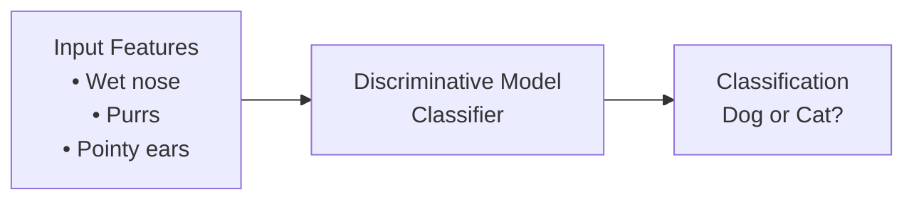

**How it works:**

- Takes input features **X** (wet nose, purring, pointy ears)
- Outputs a class **Y** (dog or cat)
- **Mathematical representation**: $P(Y|X)$ - "What's the probability this is a dog, given these features?"

**Real-world example:**

```
Input: [wet_nose=True, purrs=False, pointy_ears=True]
Output: "Dog" (85% confidence)
```

### **Generative Models - The Creator**

Think of a generative model as a **skilled artist** who can paint new portraits that look like real people, even though these people never existed.

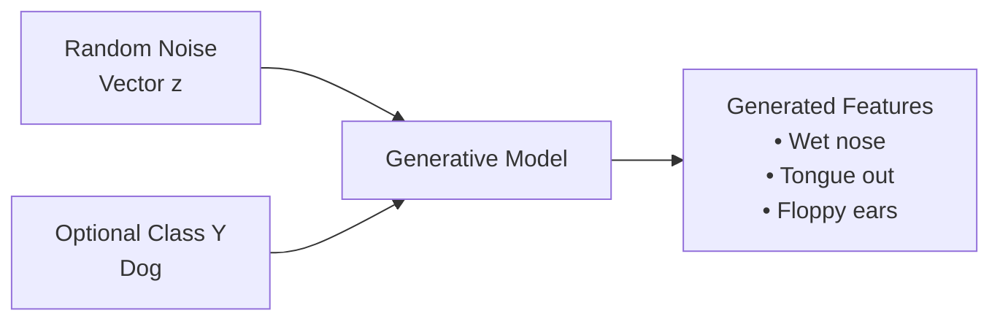

**How it works:**

- Takes random noise **z** (like rolling dice for creativity)
- Optionally takes a class **Y** (what type to generate)
- Outputs realistic features **X** (an actual image of a dog)
- **Mathematical representation**: $P(X|Y)$ - "What features should a dog have?"

## Why Do We Need Random Noise?

Imagine asking a human artist to "paint a dog" repeatedly. Without some randomness, they'd paint the exact same dog every time! The random noise **z** is like giving the artist different moods, lighting conditions, or inspiration - it ensures **diversity** in the generated content.

**Example with noise:**

```
Noise vector z₁ = [1.2, 3.0, -5.0] → Generates a Golden Retriever
Noise vector z₂ = [6.2, -3.0, 21.0] → Generates a Pekingese
Noise vector z₃ = [-5.0, 6.2, 8.0] → Generates a Labrador
```

## Two Major Types of Generative Models

### **1. Variational Autoencoders (VAEs)**

Think of a VAE like a **language translator with a twist**:

```
Original Image → [Encoder] → Latent Space → [Decoder] → Reconstructed Image
```

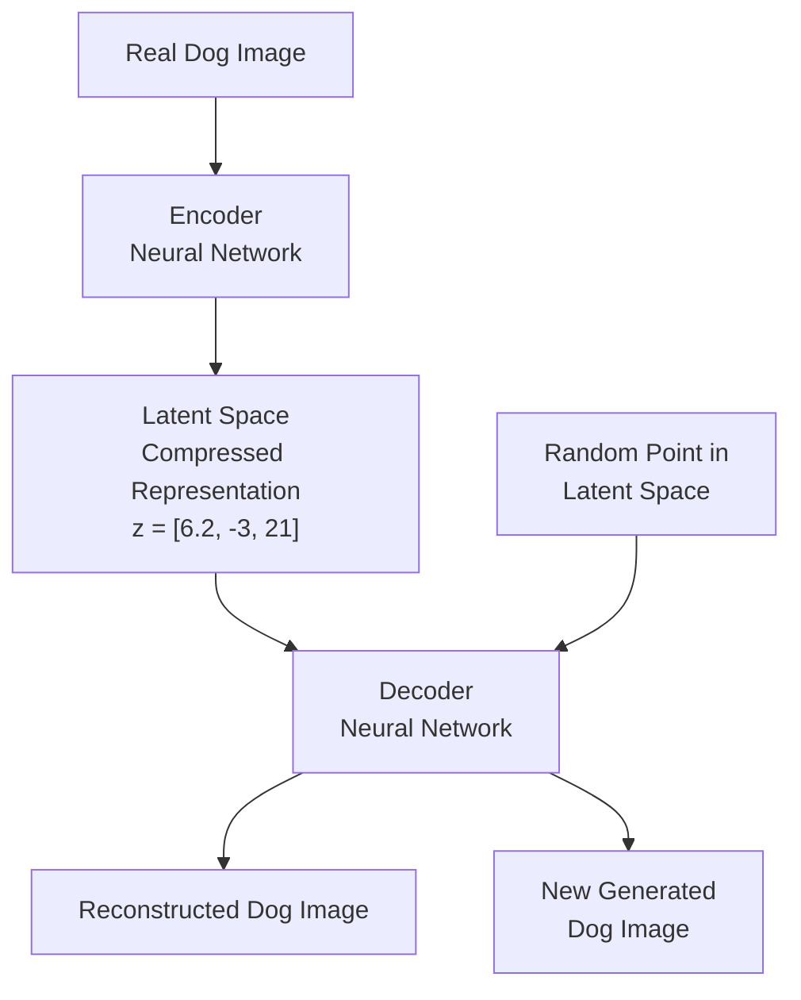

**How VAEs work:**

1. **Encoding Phase**: The encoder takes a real dog image and compresses it into a point in "latent space" (think of this as a special coordinate system where similar dogs are close together)

2. **Decoding Phase**: The decoder takes this compressed representation and reconstructs the original image

3. **Generation Phase**: After training, we can pick any random point in latent space and the decoder will generate a new, realistic dog image

**The "Variational" Part**: Instead of encoding to a single point, VAEs encode to a **distribution** (like a small cloud of possible points), adding natural variation to the generation process.

### **2. Generative Adversarial Networks (GANs)**

Think of GANs like a **counterfeiter vs detective scenario**:

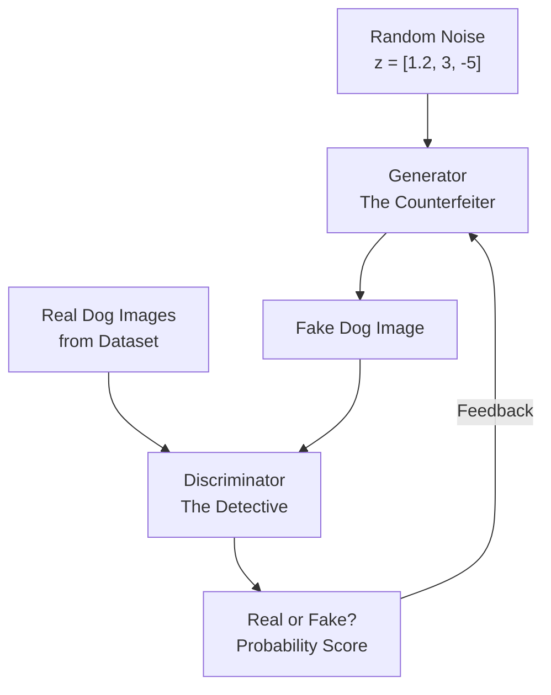

**The Adversarial Competition:**

1. **Generator (The Counterfeiter)**: Creates fake dog images from random noise
2. **Discriminator (The Detective)**: Tries to distinguish real vs fake images
3. **Competition**: They compete against each other, both getting better over time
4. **End Result**: Generator becomes so good that even the discriminator can't tell its fakes from real images

**Mathematical Competition:**

- Generator tries to **maximize** the probability that discriminator thinks fakes are real
- Discriminator tries to **minimize** its error rate in detecting fakes
- This creates a mathematical "game" that drives both networks to excel

## Key Differences: VAE vs GAN

| Aspect                 | VAE                         | GAN                           |
| ---------------------- | --------------------------- | ----------------------------- |
| **Training Style**     | Reconstruction-based        | Adversarial competition       |
| **Components**         | Encoder + Decoder           | Generator + Discriminator     |
| **Output Quality**     | Slightly blurry but stable  | Sharp and realistic           |
| **Training Stability** | More stable                 | Can be unstable               |
| **Use Case**           | Good for understanding data | Best for realistic generation |

## Real-World Applications

**Generative Models as Digital Artists:**

- **Portrait Generation**: Create faces of people who never existed
- **Art Creation**: Generate paintings in the style of famous artists
- **Data Augmentation**: Create more training examples when you have limited data
- **Content Creation**: Generate music, text, or video content

## The Learning Process - A Simple Analogy

Imagine teaching someone to draw dogs:

1. **Discriminative Approach**: Show them 1000 photos and teach them to say "That's a dog" or "That's not a dog"

2. **Generative Approach**: Show them 1000 dog photos and teach them to **draw new dogs** that look just as realistic

The generative approach is much harder but also much more powerful - instead of just recognizing dogs, you can create infinite new dogs!

## This Week's Goal

By the end of this week, you'll build your own GAN that can generate **handwritten digits**. You'll start with random noise (like static on an old TV) and your GAN will learn to transform that noise into realistic-looking numbers that could fool anyone into thinking they were written by hand.

This hands-on experience will make all these concepts crystal clear as you watch your generator improve from producing random scribbles to creating convincing digits!

# 4. Real Life GANs

## The Remarkable Journey: From 2014 to Today

GANs have accomplished something extraordinary in the world of artificial intelligence - they've achieved **superhuman creative abilities** in less than a decade. Think of it like watching the evolution of photography, from the first blurry daguerreotypes to today's high-definition digital cameras, but compressed into just a few years.

## The Ian Goodfellow Timeline - A Visual Evolution

**Ian Goodfellow**, widely regarded as the creator of GANs, shared a striking visualization showing the dramatic improvement in GAN-generated faces:

```
2014: ██░░ (Black & white, barely recognizable as faces)
2015: ███░ (Slightly better, still quite blurry)
2016: ████ (Starting to look human-like)
2017: █████ (Much clearer, colored faces)
2018: ██████ (Photorealistic, hard to distinguish from real photos)
2020+: ███████ (Professional photography quality)
```

### **The 2020 Breakthrough - StyleGAN Era**

By early 2020, GANs reached a milestone that shocked even experts:

**Features of Modern GAN-Generated Faces:**

- **Professional photography quality** with soft background blur (bokeh effect)
- **Perfect lighting and composition** that rivals studio portraits
- **Impossible to distinguish** from real photographs without technical analysis
- **High resolution** suitable for professional use

**The Mind-Bending Reality**: Every person in these professional-looking photos **never existed** - they're entirely created by mathematics and neural networks.

## Beyond Human Faces - The Versatility of GANs

### **Animal Generation - Cats with Character**

GANs can generate any type of content they're trained on. When trained on cat images:

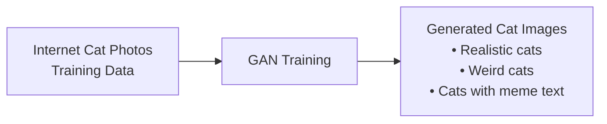

**Interesting Observations:**

- **Realistic cats**: Many generated cats look perfectly natural
- **Weird artifacts**: Some cats have strange features (extra eyes, distorted shapes)
- **Meme text generation**: GANs learn to include text overlays because they appeared in training data

**Why Text Appears**: Since GANs learn from internet data, they encounter many cat memes with text. The model learns to reproduce the **visual appearance** of text without understanding language - creating gibberish that looks like words but makes no sense.

## Advanced GAN Applications

### **1. Image-to-Image Translation - Domain Transfer**

Think of this like a **universal translator for visual styles**:

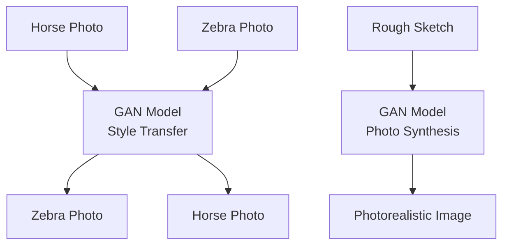

**Horse ↔ Zebra Translation:**

- Input: Photo of a horse running in a field
- Output: Same horse in same pose, but now with zebra stripes
- **No paired training data needed** - the GAN learns style transfer independently

**Sketch to Photo Synthesis:**

- Input: Rough brushstrokes labeled as "mountain," "cloud," "lake"
- Output: Photorealistic landscape with professional photography quality
- **Real-time drawing assistance** - artists can see their sketches come to life instantly

### **2. Portrait Animation - Bringing Art to Life**

**The "Hogwarts Effect"** - Making still portraits move and speak:

```
Still Portrait (Mona Lisa) + Real Person's Video = Animated Mona Lisa
```

**How it works:**

- Take any still portrait (painting, old photo, artwork)
- Record a real person's facial movements and expressions
- GAN transfers the motion to the portrait while preserving the original style
- Result: Historical figures "speaking" with realistic facial animation

### **3. 3D Object Generation - Beyond 2D Images**

GANs can create three-dimensional objects like furniture:

**Applications:**

- **Generative design**: Create unique furniture pieces for interior design
- **Product prototyping**: Generate variations of chairs, tables, and decorative items
- **Architecture**: Design building components and structural elements

## Medical and Scientific Applications

### **Medical Data Generation**

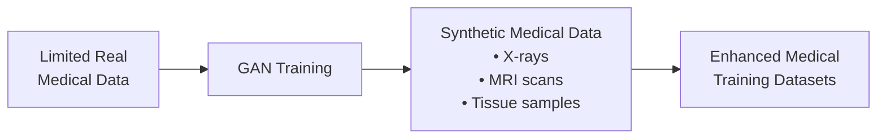

**Why This Matters:**

- **Privacy protection**: Generate realistic medical data without using real patient information
- **Rare condition simulation**: Create training data for diseases with few known cases
- **Diagnostic training**: Help medical students practice with diverse, realistic examples

## Industry Applications - How Companies Use GANs

### **Adobe - Democratizing Professional Art**

- **Next-generation Photoshop**: Transform rough doodles into professional artwork
- **Skill amplification**: Enable novice artists to produce expert-level results
- **Creative assistance**: AI-powered tools that understand artistic intent

### **Google - Text and Image Generation**

- **Content creation**: Generate realistic images from text descriptions
- **Search enhancement**: Create visual content for queries with limited image results
- **Language processing**: Generate human-like text with visual context

### **IBM - Data Augmentation Strategy**

```
Small Dataset → [GAN Synthetic Generation] → Large Enhanced Dataset → Better ML Models
```

**Use Cases:**

- **Class imbalance**: Generate more examples of underrepresented categories
- **Data scarcity**: Create training data when real examples are limited or expensive
- **Improved classifiers**: Boost accuracy of downstream machine learning models

### **Social Media - Snapchat & TikTok**

- **Creative filters**: Real-time face transformation and effect application
- **AR experiences**: Overlay realistic generated content on camera feeds
- **User engagement**: Novel visual effects that encourage content creation

### **Disney - Super-Resolution Technology**

- **Film enhancement**: Upscale old content to modern high-definition standards
- **Animation quality**: Improve resolution of animated sequences
- **Archival restoration**: Bring classic Disney content to modern viewing standards

## The Mathematical Magic Behind the Applications

**Data Distribution Learning:**
When a GAN trains on cat photos, it learns the mathematical function:

$$P(\text{realistic cat features}) = f(\text{random noise})$$

This means the GAN discovers the **recipe for "cat-ness"** - what combination of pixels, shapes, and patterns makes something look like a cat.

**Example Calculation:**

```
Input noise: z = [0.5, -1.2, 2.1, 0.8, ...]
GAN function: f(z) = realistic cat image
Output: 256×256 pixel image with cat features
```

## The Broader Impact

### **Creative Revolution**

GANs are essentially **democratizing creativity** - they're like having a master artist as a collaborator who never gets tired and can work in any style.

### **Ethical Considerations**

The same technology that creates amazing art can also be misused for creating convincing fake content. This highlights the importance of:

- **Responsible development** and deployment
- **Detection methods** for identifying generated content
- **Educational awareness** about AI-generated media

## Looking Forward

By the end of this specialization, you'll have the knowledge and skills to create GANs for **any application you can imagine**. Whether you want to:

- Generate art in your favorite style
- Create synthetic data for research
- Build creative tools for artists
- Develop innovative business applications

The foundation you're building this week will enable you to contribute to this rapidly evolving field and potentially create the next breakthrough application that amazes the world.

# 5. Intuition Behind GANs

## The Core Concept: A Competitive Learning Game

GANs are fundamentally about **competition driving excellence**. Think of it like the way athletes push each other to break records - when you have two competitors constantly trying to outperform each other, both become extraordinary at what they do.

## The Art Forgery Analogy - A Detailed Breakdown

### **Setting Up the Competition**

Imagine an art forgery scenario in a sophisticated auction house:

```
🎨 Real Famous Paintings (Training Data)
   ↓
🎯 Art Forger (Generator) vs 🕵️ Art Inspector (Discriminator)
   ↓
🏆 Goal: Perfect Forgeries vs Perfect Detection
```

### **The Players and Their Roles**

#### **The Generator - The Art Forger**

**Mission**: Create fake paintings so convincing they can fool expert art inspectors

**Characteristics:**

- **Blind to reality**: Never gets to see the real famous paintings directly
- **Learning from feedback**: Only knows how "real" their work looks based on inspector scores
- **Continuous improvement**: Each painting attempt gets better based on previous feedback

**Real-world parallel**: Like a student learning to draw portraits by only getting grades on their work, never seeing the reference photos directly.

#### **The Discriminator - The Art Inspector**

**Mission**: Become the world's best detector of fake vs authentic artwork

**Characteristics:**

- **Access to truth**: Gets to examine both real famous paintings and generator's fakes
- **Learning from mistakes**: Told the correct answer after each guess
- **Evolving expertise**: Develops increasingly sophisticated detection abilities

## The Learning Process - Step by Step

### **Round 1: The Humble Beginnings**

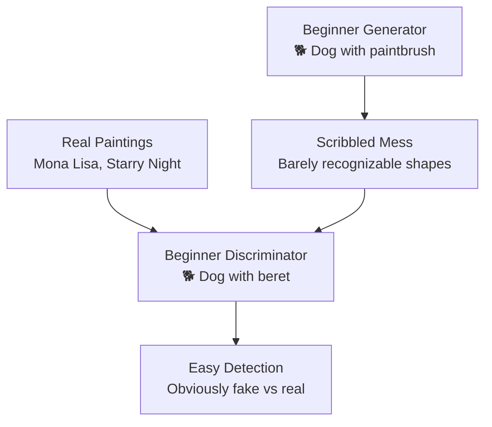

**Generator's First Attempt:**

- Produces random scribbles and meaningless shapes
- Has no understanding of what art should look like
- **Mathematical representation**: $G(z) = \text{random noise} \rightarrow \text{scribbles}$

**Discriminator's Initial State:**

- Can easily distinguish terrible fakes from masterpieces
- Gets feedback: "Yes, that's real" or "No, that's fake"
- **Accuracy**: Near 100% because fakes are obviously fake

### **Round 2-10: The Learning Phase**

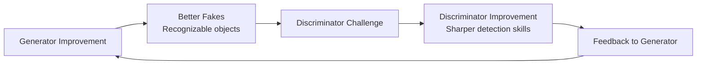

**Generator Progress:**

- Starts creating shapes that resemble faces or landscapes
- Learns basic color composition and form
- **Still clearly fake** but showing artistic understanding

**Discriminator Evolution:**

- Must develop more sophisticated detection methods
- Learns subtle differences between real and generated art
- **Accuracy drops** as fakes improve, forcing better learning

### **Round 100+: The Mastery Phase**

**Generator Achievement:**

- Creates paintings that experts struggle to identify as fakes
- Captures subtle artistic techniques and styles
- **Quality assessment**: "This looks 60% real" from discriminator

**The Feedback Loop:**

```
Discriminator says: "60% real"
You tell discriminator: "Wrong! It's fake"
Discriminator learns: "I need better detection skills"
Generator learns: "I need to be even more realistic"
```

## The Scoring System - Understanding Feedback

### **How the Discriminator Provides Feedback**

The discriminator gives the generator scores that indicate how "real" the generated images look. Think of it like a judge at an art competition giving scores out of 100.

**Example from the video:**

- Discriminator examines a generator's painting
- Says: "This looks 60% real"
- You (the trainer) tell discriminator: "Wrong! It's actually fake"
- Both models learn from this feedback

### **The Learning Progression**

```
Early Training:
Generator → Produces obvious scribbles
Discriminator → "This is clearly fake" (easy detection)

Middle Training:
Generator → Creates recognizable shapes and forms
Discriminator → "This looks somewhat real" (getting harder to detect)

Advanced Training:
Generator → Produces convincing artwork
Discriminator → "I'm not sure if this is real or fake" (very difficult to detect)
```

## Why This Competition Works So Well

### **1. Self-Improving System**

- No human intervention needed once training starts
- Each model automatically adapts to the other's improvements
- **Natural progression** toward increasingly sophisticated results

### **2. Objective Measurement**

- Discriminator provides quantitative feedback (probability scores)
- Generator has clear optimization target
- **No subjective evaluation** needed during training

### **3. Escalating Challenge**

- As generator improves, discriminator faces harder detection tasks
- As discriminator improves, generator must create more convincing fakes
- **Continuous raising of standards** drives both to excellence

## The End Game - When to Stop the Competition

The competition ends when you, as the GAN implementer, are **satisfied with the generator's output quality**. This typically happens when:

1. **Generated images are indistinguishable** from real ones to human eyes
2. **Discriminator accuracy approaches 50%** (random guessing)
3. **Generator produces diverse, high-quality results** consistently

At this point, you can **discard the discriminator** and use only the generator to create new, realistic content on demand.

## Key Takeaways

- **Generator Goal**: Fool the discriminator with increasingly realistic fakes
- **Discriminator Goal**: Never be fooled, always detect fakes accurately
- **Competition Dynamic**: Each model's improvement forces the other to excel
- **Final Result**: A generator capable of producing content indistinguishable from reality
- **Learning Method**: Adversarial training through competitive feedback loops

This intuitive understanding will serve as the foundation for understanding the technical implementation details we'll explore in the upcoming videos.

# 6. Discriminator

## What is the Discriminator?

The discriminator is fundamentally a **binary classifier** - a neural network that makes yes/no decisions. Think of it as a sophisticated bouncer at an exclusive club who needs to determine whether each person trying to enter has a real membership card or a fake one.

## Classifier Fundamentals - The Foundation

### **Basic Classification Concept**

A classifier's job is to **distinguish between different categories**. Let's start with a simple example:

**Input**: An image of an animal
**Output**: Probability distribution over possible classes

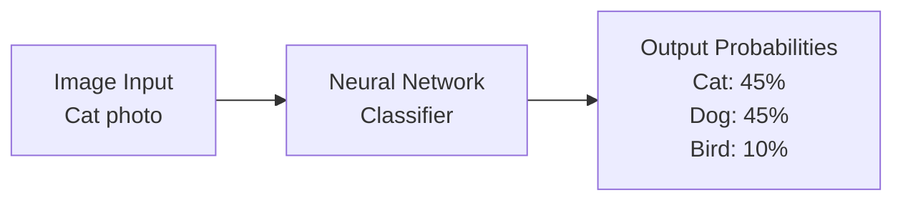

**Note**: This is how general classifiers work, but the GAN discriminator is simpler with only **one output**.

### **Multi-Modal Input Types**

Classifiers aren't limited to images - they can process:

- **Images**: Visual pixel data of cats and dogs
- **Text**: "It meows and plays with yarn" → Cat classification
- **Video**: Moving footage of animals
- **Audio**: Sound of purring or barking

## Neural Network Architecture Deep Dive

### **The Discriminator's Internal Structure**

```
Input Features (X) → Hidden Layers → Output Probabilities
```

**ASCII Architecture Diagram:**

```
Input Layer    Hidden Layers              Output Layer

X₀ ──┐        ┌─● ──┐
     │        │     │       ┌─● ──┐     ┌─● P(Fake) = 0.85
X₁ ──┼────────┼─● ──┼───────┤     ├─────┤
     │        │     │       │─● ──┤
X₂ ──┼────────┼─● ──┤       └─● ──┘
     │        │     │
... ─┤        │─● ──┘
     │        │
Xₙ ──┘        └─● ──┘

Features:      Nonlinear      Weighted      Binary Output:
• Pixel values  Transformations  Combinations  • Fake probability
• Shape data   • ReLU          • Learned     • 0.0 to 1.0 scale
• Color info   • Sigmoid       • Weights θ   • >0.5 = Fake, <0.5 = Real
```

### **Binary Output Calculation**

The final layer uses a sigmoid activation to produce a single probability:
$$P(\text{Fake}) = \frac{1}{1 + e^{-z}}$$

**Example calculation:**

```
Raw output from final neuron: z = 1.75

P(Fake) = 1 / (1 + e^(-1.75))
P(Fake) = 1 / (1 + 0.174)
P(Fake) = 1 / 1.174
P(Fake) = 0.85 = 85% Fake

Therefore: P(Real) = 1 - 0.85 = 0.15 = 15% Real
```

## The Learning Process - Parameter Updates

### **The Training Cycle**

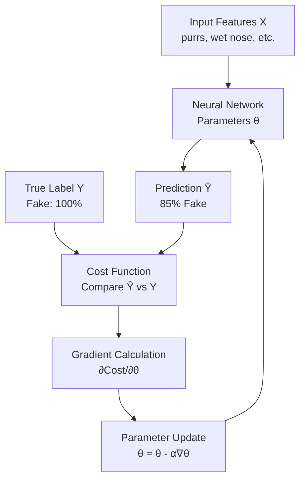

### **Parameter Learning Example**

**Initial State (Untrained):**

```
Input: Image of generated cat
Prediction: 60% Fake, 40% Real
True label: 100% Fake, 0% Real
Error: Moderate difference between prediction and truth
```

**After Many Training Examples:**

```
Input: Image of generated cat
Prediction: 85% Fake, 15% Real
True label: 100% Fake, 0% Real
Error: Small difference - model is learning!
```

### **Cost Function for Binary Classification**

For the GAN discriminator, we use binary cross-entropy loss:
$$\text{Cost} = -[y \log(\hat{y}) + (1-y) \log(1-\hat{y})]$$

**Example calculation for a fake image:**

```
True label: y = 1 (fake image - using 1 for fake in this formulation)
Prediction: ŷ = 0.85 (85% fake - GOOD prediction!)

Cost = -[1×log(0.85) + (1-1)×log(1-0.85)]
Cost = -[log(0.85) + 0]
Cost = -log(0.85) = 0.16

Low cost = good prediction (discriminator correctly identified it as mostly fake)
```

**Example calculation for a real image:**

```
True label: y = 0 (real image - using 0 for real)
Prediction: ŷ = 0.15 (15% fake, so 85% real - GOOD prediction!)

Cost = -[0×log(0.15) + (1-0)×log(1-0.15)]
Cost = -[0 + log(0.85)]
Cost = -log(0.85) = 0.16

Low cost = good prediction (correctly identified as real)
```

## The GAN Discriminator - A Specialized Classifier

### **From Multi-Class to Binary Classification**

In the GAN context, the discriminator becomes a **binary classifier** with only two classes:

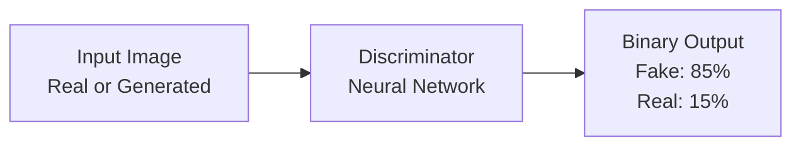

### **GAN Discriminator Architecture - Binary Classification**

**ASCII Architecture Diagram:**

```
Input Image           Hidden Layers              Single Output
(28×28 pixels)
                     ┌─●─┐
Pixel₁ ──┐          │   │    ┌─●─┐
         │          ├─●─┤    │   │    ┌─●─┐     ┌─● P(Fake) = 0.85
Pixel₂ ──┼──────────┤   ├────┼─●─┼────┤   ├─────┤
         │          ├─●─┤    │   │    └─●─┘     │  OR
...      │          │   │    └─●─┘              └─● P(Real) = 0.15
         │          └─●─┘
Pixel₇₈₄─┘

Features:            Learned                    Binary Decision:
• Edge detection     Representations            • Single probability
• Shape recognition  • Complex patterns         • 0.0 to 1.0 scale
• Texture analysis   • Style understanding      • >0.5 = Fake, <0.5 = Real
```

### **Probabilistic Modeling in GANs**

The discriminator learns to model:
$$P(\text{Fake} | X)$$

**Breaking this down:**

- **X** = Input image features (RGB pixel values)
- **P(Fake|X)** = "What's the probability this image is fake given its features?"

**Concrete Example:**

```
Input: Generated Mona Lisa image
Features X = [pixel values representing the fake painting]
Discriminator output: P(Fake|X) = 0.85

Interpretation:
• 85% chance this is a fake painting
• 15% chance this is real (1 - 0.85 = 0.15)
• Classification: FAKE (since 0.85 > 0.5)
```

## Feedback Loop to Generator

### **How Scores Become Learning Signals**

The discriminator's probability output becomes crucial feedback for the generator:

**High Fake Score (Bad Generator):**

```
Generated image → Discriminator → 95% Fake (0.05 Real)
Message to Generator: "Your work is obviously fake, improve significantly"
```

**Medium Fake Score (Improving Generator):**

```
Generated image → Discriminator → 60% Fake (0.40 Real)
Message to Generator: "Getting better, but still detectable as fake"
```

**Low Fake Score (Good Generator):**

```
Generated image → Discriminator → 15% Fake (0.85 Real)
Message to Generator: "Very convincing! Almost fooled me"
```

## Data Types and Representations

### **Image Data Processing**

For a **28×28 grayscale** image (like handwritten digits):

**Raw Data Format:**

```
Input shape: (28, 28, 1)
Total features: 28 × 28 = 784 pixel values
Value range: 0.0 (black) to 1.0 (white)

Example pixel values:
[0.0, 0.1, 0.8, 0.9, 0.7, ..., 0.2, 0.0]
 ↑    ↑    ↑    ↑    ↑         ↑    ↑
black slight light white gray  dark black
      gray   gray              gray
```

**Feature Vector Creation:**

```
Original: 28×28 matrix
Flattened: [x₁, x₂, x₃, ..., x₇₈₄]

Example values:
x₁ = 0.0  (top-left corner pixel)
x₂ = 0.1  (next pixel)
...
x₇₈₄ = 0.0 (bottom-right corner pixel)
```

## Training Data Structure

### **Real vs Fake Examples**

**Training Batch Example:**

```
Batch 1:
├── Real images: [real_img₁, real_img₂, real_img₃]
├── Fake images: [gen_img₁, gen_img₂, gen_img₃]
├── Labels: [0, 0, 0, 1, 1, 1]  (0=Real, 1=Fake)
└── Shuffled together randomly
```

**What Discriminator Sees:**

```
Input: Shuffled mix of real and fake images
Goal: Learn to output high probability for fake images, low for real
Success measure: Accuracy in distinguishing real from fake
```

## Key Learning Objectives

### **Conditional Probability Mastery**

The discriminator learns the function:
$$D(x): \mathbb{R}^{784} \rightarrow [0,1]$$

**Translation**: Takes 784 pixel values and outputs a single probability between 0 and 1 indicating fakeness.

### **Real-World Example Application**

```
Input: Handwritten digit image
Discriminator question: "Is this a real handwritten digit or computer-generated?"
Output: Probability score (0 = definitely real, 1 = definitely fake)
Training goal: Correctly identify real handwriting vs generated digits
```

## Summary - The Discriminator's Role

The discriminator serves as the **quality control expert** in the GAN system:

1. **Processes mixed batches** of real and generated examples
2. **Learns distinguishing features** that separate real from fake
3. **Provides probability scores** indicating fakeness/realness
4. **Enables generator improvement** through detailed feedback scores
5. **Evolves continuously** to match improving generator quality

This binary classification foundation will become crucial when we explore how the generator uses discriminator feedback to improve its own image generation capabilities.

# 7. Generator

## The Heart of the GAN System

The generator is the **star performer** of the GAN - it's the component that actually creates the amazing content you'll eventually use. Think of the generator as the **creative artist** in our art forgery analogy, while the discriminator is just the critic helping the artist improve.

## The Generator's Mission

### **Primary Goal: Create Convincing Fakes**

The generator's ultimate objective is to produce examples that are **indistinguishable from real data**. If you're generating cats, the goal is to create cat images so realistic that even experts can't tell they're computer-generated.

### **Diversity Requirement: Avoid Repetition**

The generator shouldn't create the same cat every time - that would be boring and unrealistic. Real cats come in countless varieties, so the generated cats should too.

## Input System: The Role of Noise

### **Why Random Noise is Essential**

Think of noise as the **"creative spark"** that makes each generation unique:

**Noise Vector Example:**

```
Noise Vector ζ (zeta) = [1, 2, 5, 1.5, 5, 5, 2]
                        ↑  ↑  ↑   ↑   ↑  ↑  ↑
                   Different random values that create variation
```

**Real-world analogy**: Imagine asking a human artist to paint a cat. Without some variation in inspiration, mood, or reference, they'd paint identical cats. The noise vector is like giving the artist different lighting conditions, emotional states, or creative directions for each painting.

### **Input Architecture**

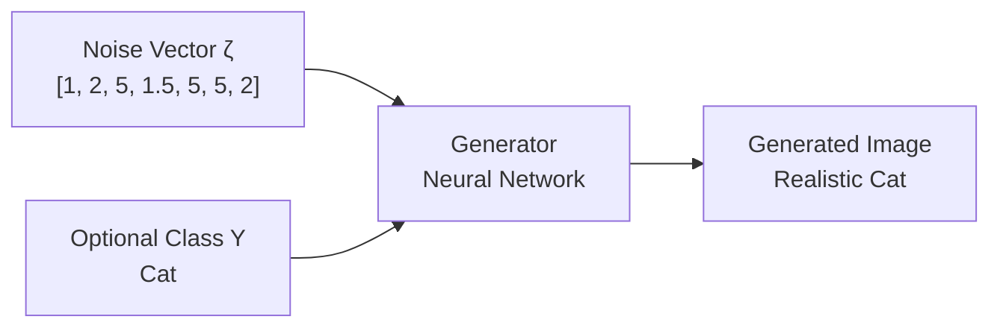

**Feature Combination:**
The generator's input features include:

- **X₀, X₁, X₂**: Values from the noise vector
- **X₃**: Optional class label (Y = "cat")
- **X₄, X₅, ..., Xₙ**: Additional noise values

**Complete Input Vector:**

```
X = [noise_val₁, noise_val₂, noise_val₃, class_cat, noise_val₄, ...]
X = [1, 2, 5, 1, 1.5, 5, 5, 2]  (where 1 represents "cat" class)
```

## Generator Architecture Deep Dive

### **Reverse Engineering: From Noise to Pixels**

Unlike the discriminator that compresses images into probabilities, the generator **expands** noise into full images:

**ASCII Architecture Diagram:**

```
Noise Input          Hidden Layers              Image Output
(7 values)                                      (3 million pixels)

z₁ ──┐              ┌─●─●─●─┐                   ┌─● Pixel₁ (R=0.8)
z₂ ──┤              │       │  ┌─●─●─●─●─┐     ├─● Pixel₂ (G=0.2)
z₃ ──┼──────────────┤ Dense ├──┤         ├─────┤─● Pixel₃ (B=0.9)
z₄ ──┤              │ Layer │  │ Upsampling    │   ...
z₅ ──┤              │       │  │ Layers  │     ├─● Pixel₂,₉₉₉,₉₉₈
z₆ ──┤              └─●─●─●─┘  └─●─●─●─●─┘     ├─● Pixel₂,₉₉₉,₉₉₉
z₇ ──┘                                         └─● Pixel₃,₀₀₀,₀₀₀

Small input          Learned                    Large output
Random values        • Pattern recognition     • RGB pixel values
7 dimensions         • Feature expansion       • 1000×1000×3 image
                     • Nonlinear transforms    • 3 million values
```

### **Data Transformation Example**

**Input Processing:**

```
Original noise vector: ζ = [1, 2, 5, 1.5, 5, 5, 2]
Normalized noise: ζ_norm = [0.1, 0.2, 0.5, 0.15, 0.5, 0.5, 0.2]
Combined with class: X = [0.1, 0.2, 0.5, 1.0, 0.15, 0.5, 0.5, 0.2]
                              ↑           ↑
                        noise values      cat class
```

**Output Generation:**

```
Generated image dimensions: 28×28×3 = 2,352 pixel values
Example output pixels:
Pixel(0,0): [R=0.8, G=0.2, B=0.1] (brownish)
Pixel(0,1): [R=0.9, G=0.7, B=0.3] (light brown)
Pixel(0,2): [R=0.1, G=0.1, B=0.1] (dark - whisker)
...
Pixel(27,27): [R=0.9, G=0.9, B=0.9] (white background)
```

## The Learning Process - Generator Improvement

### **The Feedback Loop**

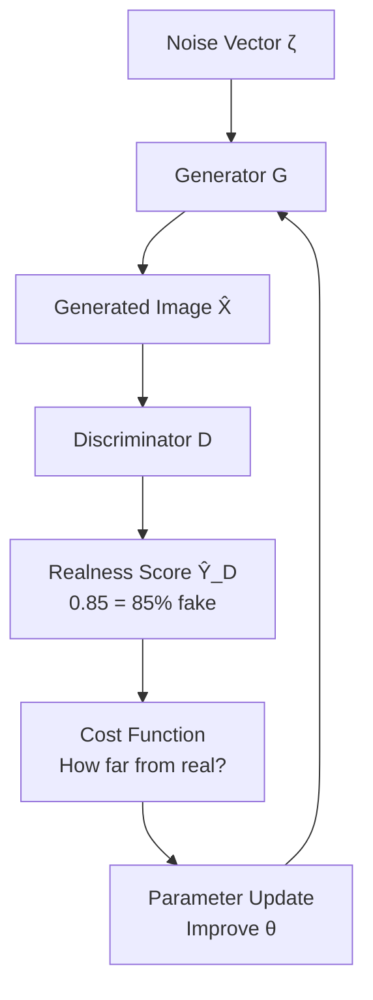

### **Step-by-Step Learning Example**

**Training Round 1:**

```
Input: ζ = [1, 2, 5, 1.5, 5, 5, 2]
Generator output: X̂ = Barely recognizable cat shape
Discriminator score: Ŷ_D = 0.95 (95% fake, 5% real)
Generator's reaction: "I need to make this much more realistic"
```

**Training Round 100:**

```
Input: ζ = [3, 1, 4, 2.1, 6, 3, 1]
Generator output: X̂ = Recognizable cat with some odd features
Discriminator score: Ŷ_D = 0.60 (60% fake, 40% real)
Generator's reaction: "Getting better, but still detectable"
```

**Training Round 1000:**

```
Input: ζ = [2, 4, 1, 1.8, 3, 7, 2]
Generator output: X̂ = Photorealistic cat image
Discriminator score: Ŷ_D = 0.15 (15% fake, 85% real)
Generator's reaction: "Almost there! Very convincing"
```

### **Cost Function for Generator**

The generator wants the discriminator to think its outputs are **real** (close to 1):

**Generator's Goal:**

```
Target: Ŷ_D = 1.0 (discriminator thinks it's 100% real)
Current: Ŷ_D = 0.15 (discriminator thinks it's 15% real)
Cost = How far we are from the target score of 1.0
```

**Parameter Update Direction:**

```
Current parameters: θ = [w₁, w₂, w₃, ..., b₁, b₂, ...]
Gradient tells us: "Increase w₁, decrease w₂, increase b₁..."
Updated parameters: θ_new = θ_old + learning_updates
Result: Next generation should look more realistic
```

## Probability Modeling - Understanding the Distribution

### **What the Generator Actually Learns**

The generator learns to model: $P(X|Y)$

**Breaking this down:**

- **X** = Features of a cat (pixel values, shapes, textures)
- **Y** = Class label ("cat")
- **P(X|Y)** = "What should a cat look like?"

### **Single Class Simplification**

When generating only cats, Y is always "cat", so we simplify to: $$P(X)$$

**Translation**: "What do cats look like in general?"

### **Distribution Learning Example**

**Real Cat Dataset Analysis:**

```
Training Data: 10,000 cat photos
Feature analysis:
• 90% have pointy ears → High probability of generating pointy ears
• 70% have stripes → Moderate probability of generating stripes
• 15% are hairless (Sphinx) → Low probability of generating hairless cats
• 5% have blue eyes → Very low probability of blue eyes
```

**Generator's Learned Distribution:**

```
Common features (generated often):
• Pointy ears: P = 0.90
• Whiskers: P = 0.95
• Four legs: P = 0.99

Rare features (generated occasionally):
• Blue eyes: P = 0.05
• Hairless: P = 0.15
• Very long fur: P = 0.20
```

### **3D Probability Visualization**

Think of the probability distribution as a **landscape** where:

```
     High Probability
           ▲
           │    🏔️ Peak = Common cat features
           │   ╱  ╲   (brown fur, pointy ears)
           │  ╱    ╲
           │ ╱      ╲  🏔️ Smaller peaks =
           │╱        ╲╱     Less common features
───────────●──────────●─────────── Feature Space
          ╱ ╲        ╱ ╲
         ╱   ╲      ╱   ╲ Valleys = Very rare
        🏔️    ╲    ╱     ╲ combinations
              ╲  ╱
               ╲╱        Low Probability
```

**Sampling Process:**

- **Peaks** (common features): Sphinx cats, brown tabbies
- **Valleys** (rare combinations): Purple cats with 6 legs
- **Random noise guides** which area of this landscape to sample from

## Practical Generation Examples

### **Different Noise, Different Cats**

**Generation 1:**

```
Noise: ζ₁ = [1, 2, 5, 1.5, 5, 5, 2]
Output: Brown tabby cat, sitting position, green eyes
```

**Generation 2:**

```
Noise: ζ₂ = [3, 1, 4, 2.1, 6, 3, 1]
Output: Sphinx cat (hairless), standing, blue eyes
```

**Generation 3:**

```
Noise: ζ₃ = [2, 4, 1, 1.8, 3, 7, 2]
Output: Savannah cat, spotted pattern, lying down
```

Each different noise vector explores a different region of the "cat possibility space."

## Model Saving and Deployment

### **The Training vs Generation Phase**

**During Training:**

```
Generator ←→ Discriminator (competitive learning)
Both models updating parameters continuously
```

**After Training (Deployment):**

```
Saved Generator (frozen θ parameters) → Generate infinite cats
Discriminator discarded (no longer needed)
```

### **Sampling from Trained Generator**

Once training is complete:

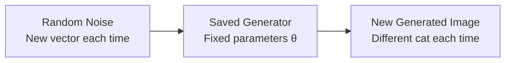

**Production Example:**

```
Input: Fresh random noise = [4, 1, 3, 2.2, 1, 8, 3]
Output: Brand new cat image that never existed before
Quality: Photorealistic, indistinguishable from real cat photos
```

## This Week's Assignment Preview

### **Handwritten Digit Generation**

You'll build a generator that creates handwritten digits:

**Input Noise:**

```
ζ = [random values] → Generator → Handwritten digit image
```

**Why This is Challenging:**

- **Natural variation**: Real handwriting has inconsistencies, slants, pressure variations
- **Digit variety**: Each person writes "5" or "8" slightly differently
- **Authenticity**: Generated digits must look hand-drawn, not computer-printed

**Dataset Characteristics:**

```
Real handwritten digits show:
• Slight shakiness in lines
• Varying pen pressure (thick/thin strokes)
• Personal writing styles
• Imperfect circles and angles
• Natural asymmetries
```

**Generator Learning Goal:**

```
Learn to reproduce: P(handwritten_digit_features)
Including: Shakiness, pressure variation, style diversity, natural imperfections
```

## Key Concepts Summary

### **Generator's Dual Challenge**

1. **Quality**: Create realistic-looking examples
2. **Diversity**: Ensure each generation is unique and varied

### **The Inverse Process**

- **Discriminator**: Large input (image) → Small output (probability)
- **Generator**: Small input (noise) → Large output (image)

### **Probability Learning**

The generator learns the **distribution of real data**:

- Common features appear frequently in generations
- Rare features appear occasionally
- Impossible combinations are avoided
- Natural variation is preserved

This foundation prepares you to understand how the generator uses discriminator feedback to continuously improve its creative abilities.

# 8. BCE Cost Function

## What is Binary Cross-Entropy (BCE)?

Binary Cross-Entropy is the **mathematical scoring system** that trains GANs. Think of it as a strict teacher who gives higher punishment (cost) when students make bigger mistakes, and rewards (low cost) when they get answers right.

**Why BCE for GANs?**
GANs deal with binary classification: **Real vs Fake**. BCE is specifically designed for exactly this type of two-category problem.

## The Complete BCE Formula

The full BCE cost function looks intimidating, but we'll break it down piece by piece:

$$J(\theta) = -\frac{1}{m} \sum_{i=1}^{m} [y^{(i)} \log h(x^{(i)}, \theta) + (1 - y^{(i)}) \log(1 - h(x^{(i)}, \theta))]$$

## Breaking Down Each Component

### **Component 1: The Averaging System**

$$-\frac{1}{m} \sum_{i=1}^{m}$$

**What this means:**

- **m** = Number of examples in a training batch
- **Σ** = Sum up all examples
- **1/m** = Take the average across the batch
- **Negative sign** = We'll explain this crucial part later

**Real-world analogy**: Like calculating the average test score for a class of students.

**Example with m = 5:**

```
Batch size: 5 images
Individual losses: [0.2, 0.8, 0.1, 1.5, 0.3]
Average loss: (0.2 + 0.8 + 0.1 + 1.5 + 0.3) ÷ 5 = 0.58
```

### **Component 2: The Variables**

**h(x^(i), θ)** = **Prediction** made by the model

- **x^(i)** = Features of the i-th image (pixel values)
- **θ** = Parameters of the neural network (weights and biases)
- **h** = The model's prediction function

**y^(i)** = **True label** for the i-th example

- **1** = Real image
- **0** = Fake image

**Example mapping:**

```
Image 1: Real cat photo → y^(1) = 1
Image 2: Generated cat → y^(2) = 0
Image 3: Real dog photo → y^(3) = 1
```

## The Two-Term System Explained

The BCE function has **two terms** that handle different label cases:

### **Term 1: When Label is Real (y = 1)**

$$y^{(i)} \log h(x^{(i)}, \theta)$$

**When this term matters:**

- Only active when $y^{(i)} = 1$ (real image)
- When $y^{(i)} = 0$ (fake image), this term becomes $0 \times \log(\text{anything}) = 0$

**Behavior Analysis:**

```
Case 1: Label = 1 (Real), Prediction = 0.99 (Very confident it's real)
Term value: 1 × log(0.99) = 1 × (-0.01) = -0.01 ≈ 0
Result: Very low cost (good prediction!)

Case 2: Label = 1 (Real), Prediction = 0.01 (Very confident it's fake)
Term value: 1 × log(0.01) = 1 × (-4.61) = -4.61
Result: Very negative value (terrible prediction!)
```

### **Term 2: When Label is Fake (y = 0)**

$$(1 - y^{(i)}) \log(1 - h(x^{(i)}, \theta))$$

**When this term matters:**

- Only active when $y^{(i)} = 0$ (fake image)
- When $y^{(i)} = 1$ (real image), this term becomes $(1-1) \times \log(\text{anything}) = 0$

**Behavior Analysis:**

```
Case 1: Label = 0 (Fake), Prediction = 0.01 (Very confident it's fake)
Term value: (1-0) × log(1-0.01) = 1 × log(0.99) = -0.01 ≈ 0
Result: Very low cost (good prediction!)

Case 2: Label = 0 (Fake), Prediction = 0.99 (Very confident it's real)
Term value: (1-0) × log(1-0.99) = 1 × log(0.01) = -4.61
Result: Very negative value (terrible prediction!)
```

## Why the Negative Sign is Crucial

### **The Problem Without Negative Sign**

Both terms produce **negative values** when predictions are wrong:

- Good predictions: Close to 0
- Bad predictions: Large negative numbers (like -4.61)

### **The Solution: Flip the Sign**

The negative sign at the beginning **flips everything**:

- Good predictions: Still close to 0
- Bad predictions: Become large **positive** numbers (like +4.61)

**Why this matters:** Neural networks minimize cost functions. We want:

- **Low cost** = Good performance (minimize this)
- **High cost** = Bad performance (avoid this)

## Complete Calculation Example

Let's trace through a mini-batch with **m = 3** examples:

### **Example Batch:**

```
Image 1: Real cat photo (y¹ = 1), Discriminator predicts h¹ = 0.8
Image 2: Generated cat (y² = 0), Discriminator predicts h² = 0.3
Image 3: Real dog photo (y³ = 1), Discriminator predicts h³ = 0.9
```

### **Calculating Each Example's Loss:**

**Example 1 (Real image, good prediction):**

```
y¹ = 1, h¹ = 0.8

Term 1: y¹ × log(h¹) = 1 × log(0.8) = 1 × (-0.22) = -0.22
Term 2: (1-y¹) × log(1-h¹) = (1-1) × log(1-0.8) = 0 × log(0.2) = 0

Loss¹ = -[-0.22 + 0] = -(-0.22) = 0.22
```

**Example 2 (Fake image, good prediction):**

```
y² = 0, h² = 0.3

Term 1: y² × log(h²) = 0 × log(0.3) = 0
Term 2: (1-y²) × log(1-h²) = (1-0) × log(1-0.3) = 1 × log(0.7) = -0.36

Loss² = -[0 + (-0.36)] = -(-0.36) = 0.36
```

**Example 3 (Real image, excellent prediction):**

```
y³ = 1, h³ = 0.9

Term 1: y³ × log(h³) = 1 × log(0.9) = 1 × (-0.11) = -0.11
Term 2: (1-y³) × log(1-h³) = (1-1) × log(1-0.9) = 0 × log(0.1) = 0

Loss³ = -[-0.11 + 0] = -(-0.11) = 0.11
```

### **Final Average Cost:**

$$J(\theta) = \frac{1}{3}[0.22 + 0.36 + 0.11] = \frac{0.69}{3} = 0.23$$

## Visual Understanding: Loss Function Graphs

The BCE loss function creates two distinct **punishment curves** that drive the discriminator's learning. Understanding these curves is crucial because they show exactly how the mathematical penalty system encourages correct predictions while severely punishing wrong ones.

### **The Dual Penalty System Explained**

The discriminator faces different penalty structures depending on what type of image it's examining. This creates a **asymmetric learning pressure** that shapes how the network develops its detection abilities.

### **Detailed Loss Behavior Analysis**

```
                REAL IMAGES (y=1)          FAKE IMAGES (y=0)
Prediction  |  Loss = -log(pred)    |  Loss = -log(1-pred)
----------- | -------------------- | --------------------
   0.1      |       2.30 (HIGH)    |      0.11 (LOW)
   0.3      |       1.20 (MED)     |      0.36 (LOW)
   0.5      |       0.69 (MED)     |      0.69 (MED)
   0.7      |       0.36 (LOW)     |      1.20 (MED)
   0.9      |       0.11 (LOW)     |      2.30 (HIGH)

Pattern: Real images want HIGH predictions (low loss)
         Fake images want LOW predictions (low loss)
```

### **Understanding the Penalty Patterns**

**For Real Images (y=1):**
The discriminator wants to output **high probabilities** (close to 1.0) when looking at real images. Notice how the loss dramatically increases as predictions get lower:

- **Prediction 0.9**: Loss = 0.11 (excellent performance, minimal penalty)
- **Prediction 0.5**: Loss = 0.69 (uncertain, moderate penalty)
- **Prediction 0.1**: Loss = 2.30 (disaster - thinks real image is fake, heavy penalty)

**Why this works**: When the discriminator correctly identifies a real image with high confidence (0.9), it gets rewarded with very low loss. When it incorrectly thinks a real image is fake (0.1), the penalty is severe enough to force rapid learning.

**For Fake Images (y=0):**
The discriminator wants to output **low probabilities** (close to 0.0) when looking at fake images. The penalty structure is inverted:

- **Prediction 0.1**: Loss = 0.11 (excellent detection of fake, minimal penalty)
- **Prediction 0.5**: Loss = 0.69 (uncertain, moderate penalty)
- **Prediction 0.9**: Loss = 2.30 (fooled by fake, heavy penalty)

**Why this works**: When the discriminator correctly identifies a fake image with high confidence (0.1 fake probability), it gets rewarded. When it gets fooled by a fake image (0.9), the penalty forces it to improve its detection skills.

### **Visual Curve Representation**

```
REAL IMAGES: Want prediction → 1.0
Loss ↑
  3 |██                     Steep penalty curve
  2 |████                   for low predictions
  1 |██████
  0 |████████████→          Reward zone at high predictions
    0   0.5   1.0  Prediction

FAKE IMAGES: Want prediction → 0.0
Loss ↑
  3 |        ██             Steep penalty curve
  2 |      ████             for high predictions
  1 |    ██████
  0 |████████████→          Reward zone at low predictions
    0   0.5   1.0  Prediction
```

### **The Learning Psychology Behind the Curves**

**Real Image Scenario:**
Think of the discriminator as a security guard who must approve real VIP guests. If the guard rejects a real VIP (low prediction), the penalty is severe because this is a critical error. If the guard correctly approves the VIP (high prediction), the penalty is minimal.

**Fake Image Scenario:**  
Now the guard must reject fake IDs. If the guard approves a fake ID (high prediction), the penalty is severe because security has been compromised. If the guard correctly rejects the fake (low prediction), the penalty is minimal.

### **The Critical 0.5 Intersection Point**

Notice that both curves intersect at **prediction = 0.5** with **loss = 0.69**. This point represents maximum uncertainty:

```
At prediction = 0.5:
- Real images: Loss = -log(0.5) = 0.69
- Fake images: Loss = -log(1-0.5) = -log(0.5) = 0.69
```

**What this means**: When the discriminator is completely uncertain (50% confidence either way), both real and fake images receive the same moderate penalty. This is the **equilibrium point** where the discriminator has learned nothing useful yet.

### **Training Progression Through the Curves**

**Early Training (Poor Discriminator):**

```
Real image → Prediction: 0.3 → Loss: 1.20 (struggling to recognize real)
Fake image → Prediction: 0.7 → Loss: 1.20 (easily fooled by fakes)
Average loss: High (around 1.2) - discriminator needs significant improvement
```

**Mid Training (Learning Discriminator):**

```
Real image → Prediction: 0.7 → Loss: 0.36 (getting better at recognizing real)
Fake image → Prediction: 0.4 → Loss: 0.36 (starting to detect some fakes)
Average loss: Moderate (around 0.36) - discriminator showing improvement
```

**Advanced Training (Skilled Discriminator):**

```
Real image → Prediction: 0.9 → Loss: 0.11 (excellent real image recognition)
Fake image → Prediction: 0.1 → Loss: 0.11 (excellent fake detection)
Average loss: Low (around 0.11) - discriminator performing well
```

### **Why the Logarithmic Penalty is Perfect**

The logarithmic function creates **exponentially increasing penalties** for confident wrong answers:

**Penalty Escalation for Real Images:**

```
Prediction 0.8 → Loss = 0.22  (slight mistake, small penalty)
Prediction 0.6 → Loss = 0.51  (moderate mistake, moderate penalty)
Prediction 0.3 → Loss = 1.20  (big mistake, large penalty)
Prediction 0.1 → Loss = 2.30  (huge mistake, severe penalty)
```

**Why logarithms work**: The penalty grows **much faster** than the mistake. A prediction that's twice as wrong doesn't get twice the penalty - it gets exponentially more penalty. This creates strong learning pressure against confident wrong answers.

### **Real-World Training Example**

**Training Batch Analysis:**

```
Batch: 4 images (2 real, 2 fake)
Real₁: pred=0.85 → loss=0.16 (good job identifying real)
Real₂: pred=0.60 → loss=0.51 (uncertain about real, needs improvement)
Fake₁: pred=0.25 → loss=0.29 (good job detecting fake)
Fake₂: pred=0.80 → loss=1.61 (fooled by fake, major mistake!)

Average loss = (0.16 + 0.51 + 0.29 + 1.61) ÷ 4 = 0.64
```

**Learning Signal**: The high loss from Fake₂ dominates the batch, sending a strong signal that the discriminator must improve its fake detection capabilities. The network will adjust its parameters to avoid being fooled by similar fake images in the future.

### **Competitive Dynamics with Generator**

As the generator improves and creates more convincing fakes, the discriminator's loss curves shift:

**Early Training (Bad Generator):**

```
Fake images are obvious → Discriminator predicts 0.1-0.2 → Low loss
Easy training phase for discriminator
```

**Advanced Training (Good Generator):**

```
Fake images are convincing → Discriminator predicts 0.6-0.8 → High loss
Discriminator forced to develop sophisticated detection methods
```

This dynamic tension drives both networks to achieve remarkable performance levels, with the loss curves serving as the mathematical engine that powers their competitive improvement.

## Practical Examples in GAN Context

### **Discriminator Training Example**

**Batch of 4 images:**

```
Image 1: Real Mona Lisa (y=1), Discriminator says h=0.95 → Loss = -log(0.95) = 0.05
Image 2: Fake Mona Lisa (y=0), Discriminator says h=0.15 → Loss = -log(0.85) = 0.16
Image 3: Real Starry Night (y=1), Discriminator says h=0.8 → Loss = -log(0.8) = 0.22
Image 4: Fake Starry Night (y=0), Discriminator says h=0.7 → Loss = -log(0.3) = 1.20

Average BCE Loss = (0.05 + 0.16 + 0.22 + 1.20) ÷ 4 = 0.41
```

**Interpretation:**

- **Images 1, 2, 3**: Good discriminator performance (low individual losses)
- **Image 4**: Poor performance - discriminator thought fake was 70% real
- **Overall**: Moderate performance, room for improvement

### **Generator Training Perspective**

From the generator's viewpoint, BCE works in reverse:

**Generator's Goal:** Make discriminator think fakes are real

```
Generated image → Discriminator → h = 0.85 (thinks it's 85% real)
Generator cost: Want discriminator to output h = 1.0
Current cost: -log(0.85) = 0.16
Target cost: -log(1.0) = 0
```

**Improvement Direction:**

- **Current**: Discriminator is 85% convinced
- **Goal**: Discriminator should be 100% convinced
- **Action**: Update generator parameters to make more convincing fakes

## Mini-Batch Training Dynamics

### **Typical Training Batch Structure**

**Batch Example (m = 6):**

```
Batch Contents:
├── Real images: [real_cat₁, real_cat₂, real_cat₃] → Labels: [1, 1, 1]
└── Fake images: [gen_cat₁, gen_cat₂, gen_cat₃] → Labels: [0, 0, 0]

Discriminator Predictions: [0.9, 0.85, 0.95, 0.4, 0.3, 0.6]
                           Real images    Fake images

Individual Losses:
Real₁: -log(0.9) = 0.11    Fake₁: -log(1-0.4) = -log(0.6) = 0.51
Real₂: -log(0.85) = 0.16   Fake₂: -log(1-0.3) = -log(0.7) = 0.36
Real₃: -log(0.95) = 0.05   Fake₃: -log(1-0.6) = -log(0.4) = 0.92

Average Loss = (0.11 + 0.16 + 0.05 + 0.51 + 0.36 + 0.92) ÷ 6 = 0.35
```

## The Logarithm's Punishment System

### **Why Logarithms Create Strong Penalties**

The logarithm function has a special property that makes it perfect for classification:

**Logarithm Behavior:**

```
log(0.99) = -0.01   (barely any penalty for being almost right)
log(0.9) = -0.11    (small penalty for being mostly right)
log(0.5) = -0.69    (moderate penalty for uncertainty)
log(0.1) = -2.30    (large penalty for being mostly wrong)
log(0.01) = -4.61   (huge penalty for being very wrong)
log(0.001) = -6.91  (massive penalty for being nearly opposite)
```

**The Punishment Curve:**

- **Small mistakes**: Small penalties (easy to recover)
- **Medium mistakes**: Moderate penalties (noticeable feedback)
- **Large mistakes**: Huge penalties (strong corrective signal)

This creates a **learning pressure** that strongly discourages confident wrong answers.

## Graph Analysis: Understanding the Curves

### **Real Image Loss Curve (y = 1)**

```
When true label = 1 (Real image):
Loss = -log(prediction)

Prediction → Loss
0.01 → 4.61  (Disaster: Called real image "fake")
0.1  → 2.30  (Bad: Low confidence in real image)
0.5  → 0.69  (Poor: Uncertain about real image)
0.8  → 0.22  (Good: Mostly confident it's real)
0.99 → 0.01  (Excellent: Very confident it's real)
```

**Graph Shape**: **Steep decline** from left to right

- **Left side**: Catastrophic losses for wrong predictions
- **Right side**: Near-zero losses for correct predictions

### **Fake Image Loss Curve (y = 0)**

```
When true label = 0 (Fake image):
Loss = -log(1 - prediction)

Prediction → Loss
0.01 → 0.01  (Excellent: Very confident it's fake)
0.2  → 0.22  (Good: Mostly confident it's fake)
0.5  → 0.69  (Poor: Uncertain about fake image)
0.9  → 2.30  (Bad: High confidence in fake image)
0.99 → 4.61  (Disaster: Called fake image "real")
```

**Graph Shape**: **Steep incline** from left to right

- **Left side**: Near-zero losses for correct predictions
- **Right side**: Catastrophic losses for wrong predictions

## GAN Training Application

### **Discriminator Training Process**

**Step 1: Forward Pass**

```
Input batch: 4 images (2 real, 2 fake)
Real images: Mona Lisa, Starry Night
Fake images: Generated art₁, Generated art₂

Discriminator predictions:
Mona Lisa: h = 0.85 (85% real)
Starry Night: h = 0.92 (92% real)
Generated art₁: h = 0.40 (40% real)
Generated art₂: h = 0.25 (25% real)
```

**Step 2: Loss Calculation**

```
Mona Lisa (y=1): Loss = -log(0.85) = 0.16
Starry Night (y=1): Loss = -log(0.92) = 0.08
Generated art₁ (y=0): Loss = -log(1-0.40) = -log(0.60) = 0.51
Generated art₂ (y=0): Loss = -log(1-0.25) = -log(0.75) = 0.29

Average Loss = (0.16 + 0.08 + 0.51 + 0.29) ÷ 4 = 0.26
```

**Step 3: Learning Signal**

```
Current performance: Average loss = 0.26
Target performance: Average loss = 0.0
Learning direction: Reduce loss by improving predictions
```

### **Generator Training Perspective**

The generator wants to **maximize** the discriminator's confusion:

**Generator's Reverse Goal:**

```
Generated image → Discriminator prediction: h = 0.25 (25% real)
Generator wants: h = 1.0 (100% real)
Generator's cost: High (discriminator easily detected fake)
Improvement needed: Make more convincing images
```

## Practical Training Scenarios

### **Early Training (Poor Generator)**

```
Batch: 6 generated images, all obviously fake
Discriminator predictions: [0.05, 0.08, 0.12, 0.03, 0.07, 0.10]
All predictions < 0.15 → Discriminator easily spots fakes
Average loss for generator: Very high
Signal to generator: "Your fakes are terrible, improve dramatically"
```

### **Late Training (Good Generator)**

```
Batch: 6 generated images, much more realistic
Discriminator predictions: [0.45, 0.52, 0.48, 0.55, 0.47, 0.51]
All predictions ≈ 0.5 → Discriminator can't tell real from fake
Average loss for generator: Low
Signal to generator: "You're doing well, minor adjustments needed"
```

## Summary: BCE's Role in GAN Success

### **Perfect Training Target**

When training converges successfully:

- **Discriminator predictions** hover around 0.5 for generated images
- **Generator achieves** its goal of fooling the discriminator
- **BCE loss approaches** its minimum possible value

### **The Punishment-Reward System**

BCE creates a **mathematical incentive structure**:

- **Terrible mistakes**: Massive cost penalties
- **Small mistakes**: Gentle correction signals
- **Correct predictions**: Minimal cost (reward)

This sophisticated scoring system drives both networks toward their optimal performance levels, ultimately resulting in a generator that can create indistinguishable realistic content.

# 9. Putting It All Together

## The Complete GAN System

Now that you understand each component, let's see how the generator and discriminator work together in the complete GAN training process. Think of this as orchestrating a **competitive dance** between two partners who push each other to perfection.

## GAN Architecture Overview

### **The Full Data Flow**

This diagram shows the complete cycle of how data moves through a GAN system during training. Think of it as a **circular assembly line** where each component transforms the data and passes it to the next stage.

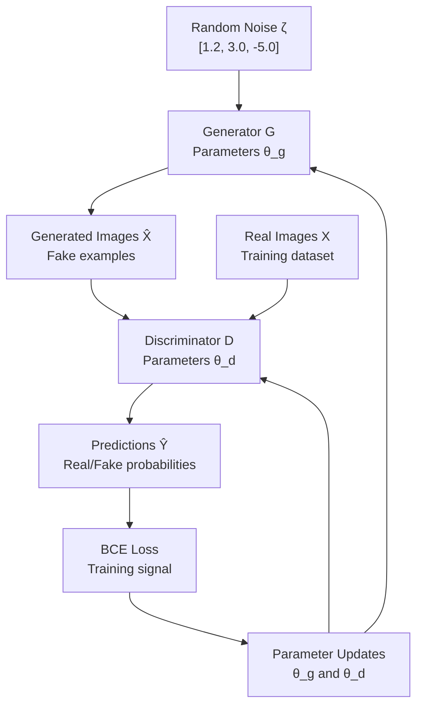

**Step-by-Step Flow Explanation:**

1. **Random Noise Input**: We start with random numbers (like rolling dice) - this ensures each generation is unique
2. **Generator Processing**: The generator neural network transforms noise into fake images using its learned parameters θ_g
3. **Data Mixing**: Both real images (from our dataset) and generated fake images flow into the discriminator
4. **Discriminator Analysis**: The discriminator examines all images and outputs probability scores for each
5. **Loss Calculation**: BCE loss measures how wrong the predictions are compared to true labels
6. **Parameter Updates**: Based on the loss, we update either generator or discriminator parameters (alternating)
7. **Feedback Loop**: Updated parameters improve performance, creating better generations and more accurate discrimination

### **ASCII Architecture Diagram**

This breaks down the training process into discrete steps that happen during each training iteration:

```
Training Process Flow:

Step 1: Generation
Random Noise    Generator         Fake Images
ζ = [1,2,3]  →  [θ_g params]  →  X̂ = fake_cat.jpg

Step 2: Mixed Input to Discriminator
Real Images: [real_cat₁, real_cat₂]     }
Fake Images: [fake_cat₁, fake_cat₂]     } → Discriminator [θ_d params]

Step 3: Discrimination
Mixed Batch → Discriminator → Predictions Ŷ = [0.9, 0.85, 0.3, 0.4]
                                              real  real  fake fake

Step 4: Loss Calculation & Updates
BCE Loss → Update either θ_g OR θ_d (alternating)
```

**What's happening at each step:**

**Step 1 - Generation Phase**:
The generator takes random noise vectors (like [1,2,3]) and uses its current parameter settings to transform these numbers into pixel values that form fake images. This is like an artist using random inspiration to create a new painting.

**Step 2 - Data Preparation**:
We combine real images from our training dataset with the newly generated fake images. The discriminator doesn't know which is which initially - they're mixed together like shuffling two decks of cards.

**Step 3 - Evaluation Phase**:
The discriminator processes each image and outputs probability scores. Higher scores (0.9, 0.85) suggest "real" while lower scores (0.3, 0.4) suggest "fake". Notice how the discriminator correctly identifies the real images with high scores and fake images with low scores.

**Step 4 - Learning Phase**:
Based on how wrong the predictions are, we calculate loss and update the parameters. We only update one network at a time - either making the generator better at fooling or the discriminator better at detecting.

## The Alternating Training Process

### **Training Phase 1: Discriminator Training**

Think of this as **training the art inspector** while the forger takes a break.

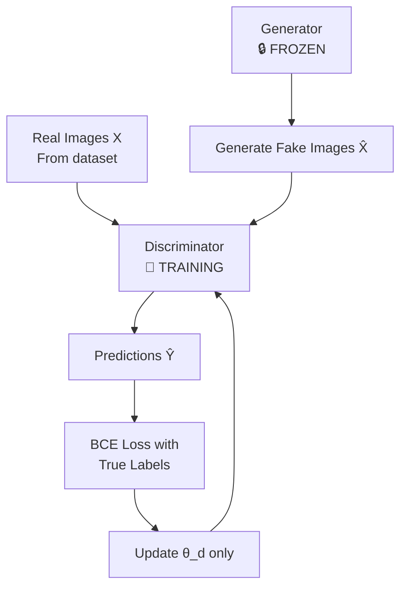

During discriminator training, the generator is **completely frozen** - its parameters don't change at all. This ensures that only the discriminator learns during this phase, allowing it to become better at distinguishing real from fake images.

### **Step-by-Step Discriminator Training**

**Step 1: Prepare Mixed Batch**

The discriminator needs to see both real and fake examples to learn the difference. We create a training batch that contains both types:

```
Real images: [real_cat₁, real_cat₂, real_cat₃]
Fake images: [fake_cat₁, fake_cat₂, fake_cat₃] (from frozen generator)
True labels: [1, 1, 1, 0, 0, 0] (1=Real, 0=Fake)
Shuffled order: [real_cat₁, fake_cat₂, real_cat₂, fake_cat₁, real_cat₃, fake_cat₃]
Shuffled labels: [1, 0, 1, 0, 1, 0]
```

**Why shuffling matters**: The discriminator shouldn't learn patterns based on order (like "first three are always real"). Shuffling ensures it learns actual visual features rather than position patterns.

**Step 2: Forward Pass**

The discriminator processes each image and makes its best guess about whether it's real or fake:

```
Discriminator predictions:
real_cat₁: ŷ = 0.85 (confident it's real - good!)
fake_cat₂: ŷ = 0.60 (thinks it might be real - not good!)
real_cat₂: ŷ = 0.90 (confident it's real - good!)
fake_cat₁: ŷ = 0.40 (thinks it's probably fake - good!)
real_cat₃: ŷ = 0.95 (very confident it's real - excellent!)
fake_cat₃: ŷ = 0.25 (confident it's fake - excellent!)
```

**Analysis**: The discriminator is doing well on most images but struggling with fake_cat₂, which it thinks might be real.

**Step 3: BCE Loss Calculation**

We calculate how wrong each prediction is using the Binary Cross-Entropy formula:

```
Real images (y=1): Use loss = -log(prediction)
Loss₁ = -log(0.85) = 0.16
Loss₃ = -log(0.90) = 0.11
Loss₅ = -log(0.95) = 0.05

Fake images (y=0): Use loss = -log(1-prediction)
Loss₂ = -log(1-0.60) = -log(0.40) = 0.92
Loss₄ = -log(1-0.40) = -log(0.60) = 0.51
Loss₆ = -log(1-0.25) = -log(0.75) = 0.29

Average Discriminator Loss = (0.16 + 0.92 + 0.11 + 0.51 + 0.05 + 0.29) ÷ 6 = 0.34
```

**Interpretation**: The high loss (0.92) from fake_cat₂ dominates the average, signaling that the discriminator needs to improve its fake detection.

**Step 4: Parameter Update**

Using the calculated loss, we update only the discriminator's parameters:

```
Current discriminator parameters: θ_d = [w₁, w₂, ..., b₁, b₂, ...]
Gradient calculation: ∇θ_d = [∂Loss/∂w₁, ∂Loss/∂w₂, ...]
Updated parameters: θ_d_new = θ_d - α × ∇θ_d

Example update: If w₁ = 0.45 and gradient = 1.2, learning rate α = 0.01
Then: w₁_new = 0.45 - 0.01 × 1.2 = 0.45 - 0.012 = 0.438
```

### **Training Phase 2: Generator Training**

Now we **train the art forger** while the inspector takes a break.

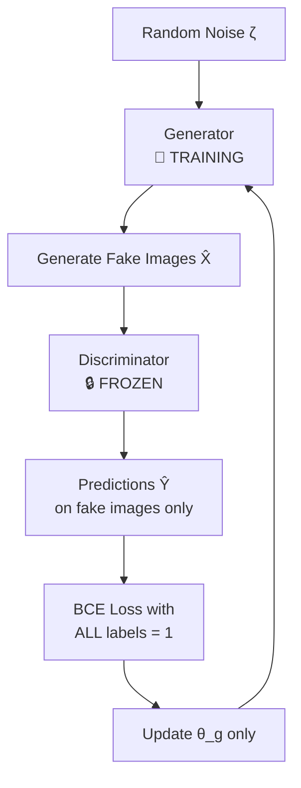

During generator training, the discriminator is **completely frozen** - it acts like a fixed evaluation function that doesn't change.

### **Step-by-Step Generator Training**

**Step 1: Generate Fake Batch**

The generator creates new fake images using different random noise:

```
Generator input: [noise₁, noise₂, noise₃]
Generated images: [fake_cat₁, fake_cat₂, fake_cat₃]
Target labels: [1, 1, 1] (generator wants discriminator to think they're ALL real)
```

**Key insight**: The generator doesn't see any real images during its training. It only cares about fooling the discriminator with its own creations.

**Step 2: Discriminator Evaluation (Frozen)**

The frozen discriminator evaluates the generated images:

```
fake_cat₁ → Discriminator → ŷ = 0.30 (30% real, 70% fake)
fake_cat₂ → Discriminator → ŷ = 0.45 (45% real, 55% fake)
fake_cat₃ → Discriminator → ŷ = 0.25 (25% real, 75% fake)
```

**Generator's perspective**: "The discriminator is easily spotting my fakes. I need to improve."

**Step 3: Generator's BCE Loss**

Here's the key difference: The generator wants ALL predictions to be 1 (real):

```
Target: All labels = 1 (want discriminator to think fakes are real)

Loss₁ = -log(0.30) = 1.20
Loss₂ = -log(0.45) = 0.80
Loss₃ = -log(0.25) = 1.39

Average Generator Loss = (1.20 + 0.80 + 1.39) ÷ 3 = 1.13
```

**High loss interpretation**: The generator is producing easily detectable fakes. It needs significant improvement.

**Step 4: Generator Parameter Update**

We update only the generator's parameters to make more convincing fakes:

```
Generator parameters: θ_g = [weights for creating more realistic cats]
Update direction: Reduce loss by making fakes more convincing
New parameters: θ_g_new = θ_g - α × ∇θ_g
```

## The Alternating Training Schedule

### **Training Cycle Example**

```
Epoch 1:
├── Discriminator Training: Update θ_d (θ_g frozen)
│   ├── Loss: 0.34
│   └── Result: Better at detecting current fakes
└── Generator Training: Update θ_g (θ_d frozen)
    ├── Loss: 1.13
    └── Result: Learns to create more convincing fakes

Epoch 2:
├── Discriminator Training: Update θ_d
│   ├── Loss: 0.45 (higher - generator got better!)
│   └── Result: Adapts to new, more realistic fakes
└── Generator Training: Update θ_g
    ├── Loss: 0.95 (lower - discriminator harder to fool)
    └── Result: Creates even more realistic content
```

**Training dynamics**: Notice how when one network improves, the other's task becomes harder, creating a natural **escalating competition**.

### **ASCII Training Timeline**

```
Time →  D-Train  G-Train  D-Train  G-Train  D-Train  G-Train
        ↓        ↓        ↓        ↓        ↓        ↓
D Skill [██    ] [██    ] [███   ] [███   ] [████  ] [████  ]
G Skill [█     ] [██    ] [██    ] [███   ] [███   ] [████  ]

Key: █ = Skill level, D = Discriminator, G = Generator
Goal: Keep skill levels balanced
```

## The Critical Balance Problem

Understanding why balance matters is crucial for successful GAN training. When one network becomes too powerful, the training process breaks down completely. This isn't just a performance issue - it's a fundamental mathematical failure that stops learning entirely.

The balance problem occurs because GANs rely on **meaningful gradient signals** to learn. When one network dominates, these signals either vanish or become numerically unstable, creating a training dead-end.

### **Scenario 1: Super-Discriminator Problem**

**What happens when the discriminator becomes too skilled:**

The discriminator becomes so good at detection that it achieves perfect accuracy, leaving the generator with no path for improvement.

```
Discriminator skill: ████████ (Expert level)
Generator skill:     ██       (Beginner level)

Discriminator predictions on ALL fake images: [1.0, 1.0, 1.0, 1.0]
Translation: "100% fake, 100% fake, 100% fake, 100% fake"
```

**Why this breaks learning mathematically:**

When the discriminator outputs exactly 1.0 (100% confident fake), the generator's loss calculation fails:

```
Generator's BCE loss calculation:
Loss₁ = -log(1.0) = -log(1) = 0
Loss₂ = -log(1.0) = 0
Loss₃ = -log(1.0) = 0

Average loss = 0 → No gradient signal!
```

**The mathematical breakdown**:

- When loss = 0, the gradient ∂Loss/∂θ = 0 for all parameters
- Zero gradients mean no parameter updates: θ_new = θ_old - α × 0 = θ_old
- The generator parameters become frozen, unable to improve

**The feedback problem**: The discriminator essentially tells the generator "everything you make is perfectly detectable as fake" without providing any information about **how** to make it less detectable. It's like receiving a test score of 0% with no indication of which answers were wrong or why.

**Real-world analogy**: Imagine a harsh art teacher who can instantly spot every fake painting but only says "completely wrong" without explaining whether the problem is color, brushwork, composition, or style. The student has no direction for improvement.

**Training symptoms:**

- Generator loss stays constant at 0
- Generated images don't improve over epochs
- Discriminator loss remains very low (easy task)
- Training appears "stuck" with no visible progress

### **Scenario 2: Super-Generator Problem**

**What happens when the generator becomes too skilled:**

The generator becomes so convincing that it completely fools the discriminator, creating the opposite mathematical problem.

```
Generator skill:     ████████ (Expert level)
Discriminator skill: ██       (Beginner level)

Discriminator predictions on ALL fake images: [0.0, 0.0, 0.0, 0.0]
Translation: "100% real, 100% real, 100% real, 100% real"
```

**Why this breaks learning mathematically:**

When the discriminator outputs exactly 0.0 (100% confident real), the loss calculation becomes undefined:

```
Generator's BCE loss calculation:
Loss₁ = -log(0.0) = -∞ (undefined!)
Discriminator's loss on fakes: -log(1-0.0) = -log(1.0) = 0

This creates numerical instability and training collapse.
```

**The mathematical breakdown**:

- log(0) is mathematically undefined (negative infinity)
- Computer systems handle this as NaN (Not a Number) or overflow
- Gradient calculations become corrupted: ∇θ = NaN
- Parameter updates fail: θ_new = θ_old - α × NaN = corrupted

**The discriminator's dilemma**: When the discriminator is always wrong (thinks fakes are real), it can't learn because it receives no corrective signal. Its loss becomes 0 for fake images, providing no learning gradient.

**Real-world analogy**: Like a security guard who is so easily fooled that they approve every fake ID as authentic. They never learn what real IDs look like because they never get feedback about their mistakes.

**Training symptoms:**

- Generator loss becomes NaN or explodes to infinity
- Discriminator loss approaches 0 (always fooled)
- Numerical overflow errors in training
- Training crashes or produces corrupted parameters

### **Scenario 3: Balanced Training (Ideal)**

**What we want to achieve:**

Both networks maintain competitive skill levels, creating a productive learning environment with meaningful feedback signals.

```
Discriminator skill: █████ (Good level)
Generator skill:     █████ (Good level)

Discriminator predictions on fake images: [0.87, 0.20, 0.65, 0.43]
Translation: Mix of confident and uncertain predictions
```

**Why this works perfectly:**

The key insight is that predictions between 0.1 and 0.9 provide **rich gradient information** for learning:

```
Informative feedback for generator:
• 0.87 → "Pretty good, but still detectable" (Loss = -log(0.87) = 0.14)
• 0.20 → "Very convincing, almost fooled me" (Loss = -log(0.20) = 1.61)
• 0.65 → "Clearly fake, needs work" (Loss = -log(0.65) = 0.43)
• 0.43 → "Quite convincing, minor improvements needed" (Loss = -log(0.43) = 0.84)

Each prediction gives specific direction for improvement!
```

**The mathematical beauty**:

- All losses are positive and finite, providing stable gradients
- Different loss values create **directional pressure** - the generator learns which changes help (lower loss) vs hurt (higher loss)
- Gradient magnitudes vary appropriately: larger gradients for bigger mistakes, smaller for minor adjustments

**The learning dynamics**:

**For the Generator:**

```
High loss (1.61) → "This fake was easily detected, make major changes"
Medium loss (0.84) → "This fake was somewhat detectable, moderate improvements needed"
Low loss (0.14) → "This fake almost worked, minor refinements needed"
```

**For the Discriminator:**

```
When it correctly identifies fake (prediction 0.87): Low loss, small parameter updates
When it's uncertain about fake (prediction 0.43): Medium loss, moderate updates
When it's fooled by fake (prediction 0.20): High loss, large corrective updates
```

**Real-world analogy**: Like a music teacher and student where the teacher provides specific feedback: "Your timing is good but your pitch needs work on the high notes" rather than just "wrong" or "perfect."

### **Maintaining Balance in Practice**

**Early Training Indicators:**

```
Epoch 1-10: Both networks learning basic skills
- Discriminator loss: 1.5 → 1.2 → 0.9 (learning to detect obvious fakes)
- Generator loss: 3.0 → 2.5 → 2.0 (learning to create recognizable images)
```

**Mid Training Indicators:**

```
Epoch 20-50: Competition intensifies
- Discriminator loss: 0.9 → 1.1 → 1.3 (generator improving, task harder)
- Generator loss: 2.0 → 1.5 → 1.0 (learning to fool discriminator)
```

**Late Training Indicators:**

```
Epoch 80-100: Approaching equilibrium
- Discriminator loss: 1.3 → 1.0 → 0.69 (struggling to distinguish)
- Generator loss: 1.0 → 0.8 → 0.69 (successfully fooling discriminator)
```

**The target zone**: Both losses converging toward 0.69 = -log(0.5), indicating the discriminator is essentially guessing randomly, which means the generator has succeeded in creating indistinguishable fakes.

**Monitoring tools for practitioners:**

- Track prediction distributions: healthy training shows predictions spread across 0.2-0.8 range
- Watch for warning signs: all predictions near 0 or 1 indicate imbalance
- Monitor gradient norms: very small or very large gradients suggest problems
- Use learning rate schedules: reduce learning rates when one network dominates

The generator receives **nuanced feedback** that guides specific improvements rather than generic "you're wrong" messages, while the discriminator faces appropriately challenging tasks that drive its own improvement.

## Detailed Training Example

### **Complete Training Round**

Let's trace through an entire training cycle with real numbers:

**Initial Setup:**

```
Generator parameters: θ_g = [random initial weights]
Discriminator parameters: θ_d = [random initial weights]
Batch size: m = 4
Learning rate: α = 0.001
```

**Round 1: Train Discriminator**

```
1. Generate fake batch:
   Noise: [z₁, z₂] → Generator → [fake₁, fake₂]

2. Prepare mixed batch:
   Images: [real₁, real₂, fake₁, fake₂]
   Labels: [1, 1, 0, 0]

3. Discriminator forward pass:
   Predictions: [0.6, 0.8, 0.7, 0.5]

4. Calculate BCE loss:
   real₁: -log(0.6) = 0.51
   real₂: -log(0.8) = 0.22
   fake₁: -log(1-0.7) = -log(0.3) = 1.20
   fake₂: -log(1-0.5) = -log(0.5) = 0.69

   Average loss = (0.51 + 0.22 + 1.20 + 0.69) ÷ 4 = 0.66

5. Update discriminator: θ_d = θ_d - α × ∇θ_d
```

**Analysis**: The discriminator is struggling with fake detection (high losses of 1.20 and 0.69 for fake images).

**Round 2: Train Generator**

```
1. Generate new fake batch:
   Noise: [z₃, z₄] → Generator → [fake₃, fake₄]

2. Discriminator evaluation (frozen):
   Predictions: [0.4, 0.3]

3. Generator's BCE loss (wants all predictions = 1):
   fake₃: -log(0.4) = 0.92
   fake₄: -log(0.3) = 1.20

   Average loss = (0.92 + 1.20) ÷ 2 = 1.06

4. Update generator: θ_g = θ_g - α × ∇θ_g
```

**Analysis**: High generator loss indicates the discriminator is easily detecting fakes, pushing the generator to improve.

## Key Differences in Training Objectives

### **Discriminator's Perspective**

The discriminator has a straightforward classification goal:

```
Goal: Minimize BCE loss by correct classification
Real image (y=1): Want high prediction (close to 1)
Fake image (y=0): Want low prediction (close to 0)

Ideal discriminator output: [1.0, 1.0, 0.0, 0.0]
                           real real fake fake
```

**Training mindset**: "I want to be a perfect detector who never makes mistakes."

### **Generator's Perspective**

The generator has a deceptive goal - it wants to fool the discriminator:

```
Goal: Minimize BCE loss by fooling discriminator
ALL fake images: Want discriminator to predict close to 1
Target labels for generator training: ALL labels = 1

Ideal discriminator output on generator's fakes: [1.0, 1.0, 1.0, 1.0]
Translation: "Discriminator thinks all my fakes are real!"
```

**Training mindset**: "I want to be such a good forger that even experts think my fakes are authentic."

## Training Balance Monitoring

### **Healthy Training Indicators**

**Discriminator Loss Progression:**

```
Epoch 1: 0.20 (easily detecting obvious fakes)
Epoch 5: 0.35 (fakes getting better, harder to detect)
Epoch 10: 0.50 (struggling to distinguish good fakes)
Epoch 20: 0.60 (generator creating convincing fakes)
```

**Generator Loss Progression:**

```
Epoch 1: 2.5 (producing terrible fakes)
Epoch 5: 1.8 (improving but still detectable)
Epoch 10: 1.2 (creating decent fakes)
Epoch 20: 0.8 (fooling discriminator more often)
```

**Healthy pattern**: Both losses should gradually increase as the competition intensifies, indicating both networks are improving.

### **Warning Signs of Imbalanced Training**

**Problem 1: Discriminator Too Strong**

```
Discriminator predictions on fakes: [1.0, 1.0, 1.0, 1.0]
Generator loss: -log(1.0) = undefined (numerical issues)
Solution: Train generator more frequently or reduce discriminator learning rate
```

**Problem 2: Generator Too Strong**

```
Discriminator predictions on fakes: [0.0, 0.0, 0.0, 0.0]
Discriminator loss: Very high, discriminator can't learn
Solution: Train discriminator more frequently or increase its learning rate
```

**Ideal Balance:**

```
Discriminator predictions on fakes: [0.87, 0.20, 0.65, 0.43]
Range: Varied predictions between 0.2 and 0.9
Signal: Informative feedback for both networks
```

## The Informative Feedback Principle

### **Good Discriminator Feedback**

**Scenario: Balanced training**

```
Generated image → Discriminator → 0.87 fake (87% confident it's fake)

Generator learns: "I'm close but not quite there. The discriminator
can still detect my fakes with high confidence. I need to add more
realistic details to reduce this confidence."
```

**Actionable feedback**: Generator knows it needs **moderate improvement** in specific areas.

### **Bad Discriminator Feedback**

**Scenario: Over-powered discriminator**

```
Generated image → Discriminator → 1.0 fake (100% confident it's fake)

Generator learns: "Everything I create is obviously fake, but I don't
know what specific aspects to improve. This gives me no direction."
```

**Non-actionable feedback**: Generator has **no learning gradient** to follow.

## Complete Training Algorithm

### **Pseudo-Code for GAN Training**

```
FOR each training epoch:

    // Phase 1: Train Discriminator
    FOR discriminator_steps:
        1. Generate fake_batch from Generator(noise)
        2. Create mixed_batch = [real_images, fake_images]
        3. Create labels = [1s for real, 0s for fake]
        4. predictions = Discriminator(mixed_batch)
        5. d_loss = BCE(predictions, labels)
        6. Update θ_d using gradient of d_loss
        7. Keep θ_g frozen

    // Phase 2: Train Generator
    FOR generator_steps:
        1. Generate fake_batch from Generator(noise)
        2. predictions = Discriminator(fake_batch)
        3. target_labels = [1, 1, 1, ...] (all ones!)
        4. g_loss = BCE(predictions, target_labels)
        5. Update θ_g using gradient of g_loss
        6. Keep θ_d frozen
```

### **Numerical Example: One Complete Epoch**

**Discriminator Training:**

```
Input batch (m=4): [real₁, real₂, fake₁, fake₂]
True labels: [1, 1, 0, 0]
Predictions: [0.8, 0.9, 0.6, 0.4]

BCE Loss Calculation:
real₁: -log(0.8) = 0.22
real₂: -log(0.9) = 0.11
fake₁: -log(1-0.6) = -log(0.4) = 0.92
fake₂: -log(1-0.4) = -log(0.6) = 0.51

D_loss = (0.22 + 0.11 + 0.92 + 0.51) ÷ 4 = 0.44

Parameter update: θ_d ← θ_d - 0.001 × ∇θ_d
```

**Generator Training:**

```
Input: New noise batch → Generate [fake₃, fake₄]
Target labels: [1, 1] (want discriminator to think they're real)
Discriminator predictions: [0.35, 0.28]

BCE Loss for Generator:
fake₃: -log(0.35) = 1.05
fake₄: -log(0.28) = 1.27

G_loss = (1.05 + 1.27) ÷ 2 = 1.16

Parameter update: θ_g ← θ_g - 0.001 × ∇θ_g
```

## Training Success Indicators

### **Convergence Signs**

```
Healthy training progression:
Epoch 1:   D_loss=0.2,  G_loss=2.5  (D winning easily)
Epoch 10:  D_loss=0.4,  G_loss=1.8  (Getting competitive)
Epoch 50:  D_loss=0.6,  G_loss=0.9  (Close competition)
Epoch 100: D_loss=0.69, G_loss=0.69 (Perfect balance)
```

**The magic number**: When both losses approach **0.69** (which equals -log(0.5)), it means:

- Discriminator is guessing randomly (50% accuracy)
- Generator is successfully fooling discriminator half the time
- **Training objective achieved** - discriminator can't tell real from fake

## Summary: The Orchestrated Competition

The alternating training process creates a **controlled competitive environment** where:

1. **Discriminator training** makes it better at detection while generator stays constant
2. **Generator training** makes it better at creation while discriminator stays constant
3. **Balanced progression** ensures both networks improve together without one dominating
4. **Informative feedback** through moderate prediction scores drives continuous learning
5. **Eventual convergence** produces a generator capable of creating content that even expert discriminators cannot distinguish from reality

This sophisticated training dance ultimately results in a generator capable of creating content that fools even the most skilled discriminators, achieving the ultimate goal of generating realistic synthetic data.

## 9.5. Summary: GAN Training Process

GANs employ an alternating training strategy where generator and discriminator networks compete against each other through controlled phases of learning.

### **Alternating Parameter Updates**

Training alternates between two distinct phases: discriminator training with frozen generator parameters (θ_g), and generator training with frozen discriminator parameters (θ_d). This ensures only one network learns at a time, preventing conflicting gradient updates.

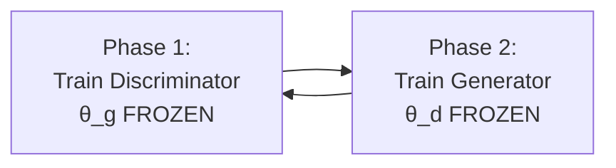

### **Discriminator Training Phase**

The discriminator receives shuffled batches containing both real images (from the training dataset) and fake images (generated by the current generator). Images are randomly shuffled with their corresponding labels (1 for real, 0 for fake) to prevent the network from learning positional patterns rather than visual features.

**Example Training Batch:**

```
Before shuffling:
Real: [cat₁, cat₂, cat₃] → Labels: [1, 1, 1]
Fake: [gen₁, gen₂, gen₃] → Labels: [0, 0, 0]

After shuffling:
Images: [cat₁, gen₂, cat₃, gen₁, cat₂, gen₃]
Labels: [1, 0, 1, 0, 1, 0]
```

The discriminator's goal is minimizing classification error by correctly identifying real images with high probabilities and fake images with low probabilities.

### **Generator Training Phase**

The generator receives only random noise vectors as input and never sees real images directly. However, its objective differs fundamentally from standard classification.

**Training Setup:**

```
Noise vectors: [z₁, z₂, z₃] → Generator → [fake₁, fake₂, fake₃]
Labels for training: [1, 1, 1] (ALL marked as "real")
Goal: Fool discriminator into thinking fakes are real
```

The generator aims to fool the discriminator by producing fakes so convincing that the discriminator classifies them as real. During generator training, all generated images receive labels of 1 (real), creating a reversed learning signal that trains the generator to maximize discriminator confusion.

### **Loss Evolution Patterns**

Initial training begins with both networks producing high losses due to random parameter initialization.

**Typical Loss Progression:**

```
Epoch Range    | Discriminator Loss | Generator Loss  | Interpretation
---------------|-------------------|-----------------|------------------
1-10 (Early)   | 2.5 → 1.8 → 1.2  | 3.0 → 2.5 → 2.0 | Both learning basics
20-40 (Mid)    | 1.2 → 1.5 → 1.8  | 2.0 → 1.5 → 1.0 | Competition heats up
80-100 (Late)  | 1.8 → 1.0 → 0.69 | 1.0 → 0.8 → 0.69| Approaching balance
```

Early epochs show the discriminator learning basic detection skills while the generator learns to produce recognizable images. As training progresses, discriminator loss typically increases (task becomes harder as generator improves) while generator loss decreases (becoming more successful at deception).

### **The Balance Requirement**

Training success requires maintaining balanced skill levels between networks.

```
PROBLEM SCENARIOS:

Super-Discriminator:
Predictions: [1.0, 1.0, 1.0] → Generator Loss: 0 → No learning!

Super-Generator:
Predictions: [0.0, 0.0, 0.0] → Loss: -∞ → Training crash!

HEALTHY BALANCE:
Predictions: [0.87, 0.20, 0.65] → Varied losses → Good learning!
```

When the discriminator becomes too skilled, it produces prediction probabilities of exactly 1.0 or 0.0, eliminating gradient signals for generator learning (since log(1) = 0). When the generator becomes too skilled, discriminator predictions approach 0.0 for all fakes, creating numerical instability in loss calculations (log(0) = undefined). Balanced training maintains prediction ranges between 0.2-0.8, providing informative gradient signals for both networks.

### **Convergence Target**

Successful training converges toward both networks achieving approximately 0.69 loss (equal to -log(0.5)).

**Mathematical Target:**

```
Perfect Balance State:
Discriminator accuracy on fakes: 50% (random guessing)
Both losses: -log(0.5) = 0.69
Interpretation: Generator successfully creating indistinguishable fakes
```

This indicates the discriminator has reached 50% accuracy on generated images, essentially random guessing, meaning the generator has achieved its objective of creating indistinguishable fakes.

### **Deployment Phase**

After training completion, the discriminator is discarded and only the generator is retained for deployment.

```
Training Phase:    Generator ←→ Discriminator (Competition)
                      ↓
Deployment Phase:  Generator → Realistic Images (Discriminator discarded)
```

The trained generator can then produce unlimited realistic samples by processing new random noise vectors through its learned parameters, now frozen for inference.

# 10. (Optional) Intro to PyTorch

## Why PyTorch for GANs?

PyTorch is a **super popular deep learning framework** developed by Facebook that has become the preferred choice for many researchers and practitioners. Think of it as the **toolbox** that makes building neural networks as easy as assembling LEGO blocks.

**Key advantages for GAN development:**

- **Intuitive syntax** that feels like regular Python
- **Dynamic computation** that allows flexible model architectures
- **Excellent debugging** capabilities for complex training processes

## PyTorch vs TensorFlow: The Philosophy Difference

### **PyTorch: Imperative Programming (Do-As-You-Go)**

Think of PyTorch like **cooking in real-time** - you chop vegetables as you need them:

```python
# PyTorch style - immediate computation
a = 1
b = 2
c = a + b  # Result: c = 3 (computed immediately)
print(c)   # Output: 3
```

**Real-world analogy**: Like a chef who tastes and adjusts seasoning throughout cooking.

### **TensorFlow: Symbolic Programming (Plan-Then-Execute)**

Think of TensorFlow like **writing a recipe first**, then cooking later:

```python
# TensorFlow style - define computation graph first
a = placeholder()  # No actual value yet
b = placeholder()  # No actual value yet
c = a + b         # Define operation (not computed yet)

# Later: provide values and execute
result = session.run(c, {a: 1, b: 2})  # Now c = 3
```

**Real-world analogy**: Like a chef who writes the complete recipe before touching any ingredients.

### **Computational Graph Comparison**

**PyTorch - Dynamic Graphs:**

```
Every run can have different structure:

Run 1: Input → Layer1 → Layer2 → Output
Run 2: Input → Layer1 → Layer3 → Layer2 → Output
Run 3: Input → Layer1 → Output (skip layers conditionally)
```

**TensorFlow - Static Graphs:**

```
Same structure every run:

All runs: Input → Layer1 → Layer2 → Output
         (structure fixed at definition time)
```

## Building Models in PyTorch

### **The Class-Based Approach**

PyTorch uses **object-oriented programming** to define models. Think of it like creating a blueprint for a house - you define the structure once, then build multiple houses from the same blueprint.

### **Complete Model Definition Example**

```python
import torch
import torch.nn as nn

class LogisticRegression(nn.Module):
    def __init__(self, input_dim):
        super(LogisticRegression, self).__init__()

        # Define the architecture
        self.logistic_regression = nn.Sequential(
            nn.Linear(input_dim, 1),  # Linear layer: input_dim → 1 output
            nn.Sigmoid()              # Sigmoid: convert to 0-1 probability
        )

    def forward(self, x):
        # Define what happens when data flows through
        return self.logistic_regression(x)
```

### **Breaking Down the Code**

**Class Declaration:**

```python
class LogisticRegression(nn.Module):
```

**Translation**: "Create a new model type that inherits PyTorch's neural network capabilities"

**Initialization Method:**

```python
def __init__(self, input_dim):
    super(LogisticRegression, self).__init__()
```

**Translation**: "When creating this model, tell me how many input features you have"

**Architecture Definition:**

```python
self.logistic_regression = nn.Sequential(
    nn.Linear(input_dim, 1),  # Matrix multiplication + bias
    nn.Sigmoid()              # Squash output to 0-1 range
)
```

**What happens mathematically:**

1. **Linear layer**: $y = Wx + b$
2. **Sigmoid activation**: $\sigma(y) = \frac{1}{1 + e^{-y}}$

**Numerical Example:**

```python
# For input_dim = 3
input_features = [0.5, 0.8, 0.2]  # 3 features

# Linear layer computation:
# Assume weights W = [0.4, 0.6, 0.3] and bias b = 0.1
linear_output = 0.4×0.5 + 0.6×0.8 + 0.3×0.2 + 0.1
linear_output = 0.2 + 0.48 + 0.06 + 0.1 = 0.84

# Sigmoid activation:
sigmoid_output = 1 / (1 + e^(-0.84)) = 1 / (1 + 0.43) = 0.70

# Final prediction: 70% probability
```

**Forward Method:**

```python
def forward(self, x):
    return self.logistic_regression(x)
```

**Translation**: "When you give me input data x, process it through the defined layers and return the result"

## Training Setup and Process

### **Complete Training Code**

```python
# Step 1: Initialize the model
model = LogisticRegression(input_dim=16)

# Step 2: Define loss function
criterion = nn.BCELoss()

# Step 3: Define optimizer
optimizer = torch.optim.SGD(model.parameters(), lr=0.01)

# Step 4: Training loop
n_epochs = 100
for epoch in range(n_epochs):
    # Forward pass
    predictions = model(inputs)

    # Calculate loss
    loss = criterion(predictions, targets)

    # Backward pass and optimization
    optimizer.zero_grad()   # Clear previous gradients
    loss.backward()         # Calculate gradients
    optimizer.step()        # Update parameters
```

### **Step-by-Step Training Breakdown**

**Step 1: Model Initialization**

```python
model = LogisticRegression(input_dim=16)
```

**What happens internally:**

```
Creates neural network with:
├── Input layer: 16 neurons (for 16 features)
├── Linear transformation: 16 → 1 (with random initial weights)
└── Sigmoid activation: Output between 0 and 1

Initial parameters θ:
├── Weights: W = [random 16 values between -1 and 1]
└── Bias: b = [random value near 0]
```

**Step 2: Loss Function Setup**

```python
criterion = nn.BCELoss()
```

**Translation**: "Use Binary Cross-Entropy as our scoring system"

**Step 3: Optimizer Configuration**

```python
optimizer = torch.optim.SGD(model.parameters(), lr=0.01)
```

**What this means:**

```
Optimizer = Stochastic Gradient Descent
Parameters to update = All weights and biases in the model
Learning rate = 0.01 (how big steps to take when updating)
```

### **Training Loop Deep Dive**

**Epoch Example with Real Numbers:**

```python
# Epoch 1 example
inputs = torch.tensor([[0.5, 0.8, 0.2, ...]])  # 16 features
targets = torch.tensor([[1.0]])                  # True label: real

# Forward pass
predictions = model(inputs)  # Result: 0.45

# Loss calculation
loss = criterion(predictions, targets)
# BCE calculation: -log(0.45) = 0.80

# Backward pass
optimizer.zero_grad()  # Reset gradients to zero
loss.backward()        # Calculate ∂loss/∂weights for all parameters

# Parameter update
optimizer.step()       # Update: θ_new = θ_old - 0.01 × gradients
```

### **The Gradient Calculation Process**

**What `loss.backward()` computes:**

For each weight in the network:
$$\frac{\partial \text{Loss}}{\partial w_i} = \text{How much changing } w_i \text{ affects the loss}$$

**Example gradient calculation:**

```
Current loss: 0.80
If we increase w₁ by 0.001: loss becomes 0.81
If we decrease w₁ by 0.001: loss becomes 0.79

Gradient: ∂loss/∂w₁ = (0.81 - 0.79) / (0.002) = 1.0
Interpretation: "Increasing w₁ increases loss, so we should decrease w₁"

Parameter update: w₁_new = w₁_old - 0.01 × 1.0 = w₁_old - 0.01
```

## PyTorch Advantages for GAN Development

### **1. Dynamic Computational Graphs**

**Flexibility Example:**

```python
# Can change model structure during training
if epoch < 50:
    output = simple_generator(noise)  # Basic generator
else:
    output = complex_generator(noise)  # Switch to complex generator
```

**Real-world analogy**: Like being able to modify a building's blueprint while construction is happening.

### **2. Intuitive Debugging**

**TensorFlow debugging:**

```python
# Hard to debug - need special session setup
result = session.run(operation, feed_dict={x: data})
```

**PyTorch debugging:**

```python
# Easy debugging - just print values directly
x = torch.tensor([1, 2, 3])
y = model(x)
print(f"Input: {x}, Output: {y}")  # Works immediately
```

### **3. Natural Python Integration**

**PyTorch feels like regular Python:**

```python
# Use standard Python control flow
for i in range(batch_size):
    if condition:
        result = model_a(data[i])
    else:
        result = model_b(data[i])
```

## GAN-Specific PyTorch Usage

### **Typical GAN Model Structure**

```python
class Generator(nn.Module):
    def __init__(self, noise_dim, output_dim):
        super(Generator, self).__init__()
        self.generator = nn.Sequential(
            nn.Linear(noise_dim, 128),
            nn.ReLU(),
            nn.Linear(128, 256),
            nn.ReLU(),
            nn.Linear(256, output_dim),
            nn.Tanh()  # Output between -1 and 1
        )

    def forward(self, noise):
        return self.generator(noise)

class Discriminator(nn.Module):
    def __init__(self, input_dim):
        super(Discriminator, self).__init__()
        self.discriminator = nn.Sequential(
            nn.Linear(input_dim, 256),
            nn.LeakyReLU(0.2),
            nn.Linear(256, 128),
            nn.LeakyReLU(0.2),
            nn.Linear(128, 1),
            nn.Sigmoid()  # Output between 0 and 1
        )

    def forward(self, image):
        return self.discriminator(image)
```

### **GAN Training Loop Structure**

```python
# Initialize models
generator = Generator(noise_dim=100, output_dim=784)  # 28x28 image
discriminator = Discriminator(input_dim=784)

# Define loss and optimizers
criterion = nn.BCELoss()
g_optimizer = torch.optim.Adam(generator.parameters(), lr=0.0002)
d_optimizer = torch.optim.Adam(discriminator.parameters(), lr=0.0002)

# Training loop
for epoch in range(num_epochs):
    # Train Discriminator
    d_optimizer.zero_grad()

    # Real images
    real_images = get_real_batch()
    real_labels = torch.ones(batch_size, 1)  # All 1s
    real_predictions = discriminator(real_images)
    d_loss_real = criterion(real_predictions, real_labels)

    # Fake images
    noise = torch.randn(batch_size, noise_dim)
    fake_images = generator(noise)
    fake_labels = torch.zeros(batch_size, 1)  # All 0s
    fake_predictions = discriminator(fake_images.detach())
    d_loss_fake = criterion(fake_predictions, fake_labels)

    # Total discriminator loss
    d_loss = d_loss_real + d_loss_fake
    d_loss.backward()
    d_optimizer.step()

    # Train Generator
    g_optimizer.zero_grad()

    # Generate fake images and fool discriminator
    noise = torch.randn(batch_size, noise_dim)
    fake_images = generator(noise)
    fake_labels = torch.ones(batch_size, 1)  # Want discriminator to think they're real!
    fake_predictions = discriminator(fake_images)
    g_loss = criterion(fake_predictions, fake_labels)

    g_loss.backward()
    g_optimizer.step()
```

## Key PyTorch Operations Explained

### **Tensor Operations**

```python
# Creating tensors (PyTorch's version of arrays)
noise = torch.randn(64, 100)  # 64 samples, 100-dim noise vectors
# Shape: [64, 100], Values: random numbers from normal distribution

# Example values:
# noise[0] = [0.5, -1.2, 0.8, 2.1, ...]  # First noise vector
# noise[1] = [-0.3, 1.5, -0.7, 0.9, ...] # Second noise vector
```

### **Gradient Operations**

```python
# Clear gradients (essential for proper training)
optimizer.zero_grad()
# Why needed: Gradients accumulate by default in PyTorch

# Calculate gradients
loss.backward()
# Computes: ∂loss/∂w for every parameter w in the model

# Update parameters
optimizer.step()
# Performs: w_new = w_old - learning_rate × gradient
```

### **Example Training Step Calculation**

**Forward Pass Example:**

```python
# Input data
noise = torch.tensor([[1.0, -0.5, 2.0]])  # 1 sample, 3-dim noise
real_image = torch.tensor([[0.8, 0.2, 0.9, ...]])  # 1 real image

# Generator forward pass
fake_image = generator(noise)
# Result: fake_image = tensor([[0.6, 0.4, 0.7, ...]])

# Discriminator forward pass
real_pred = discriminator(real_image)  # Result: 0.85
fake_pred = discriminator(fake_image)  # Result: 0.30
```

**Loss Calculation:**

```python
# Discriminator loss
real_label = torch.tensor([[1.0]])  # Real image label
fake_label = torch.tensor([[0.0]])  # Fake image label

d_loss_real = criterion(real_pred, real_label)
# BCE: -log(0.85) = 0.16

d_loss_fake = criterion(fake_pred, fake_label)
# BCE: -log(1-0.30) = -log(0.70) = 0.36

d_total_loss = d_loss_real + d_loss_fake  # 0.16 + 0.36 = 0.52
```

**Parameter Update:**

```python
# Calculate gradients
d_total_loss.backward()
# Computes gradients for all discriminator parameters

# Update discriminator parameters
d_optimizer.step()
# Example update: w₁ = 0.45 - 0.01 × 1.2 = 0.438
```

## Special PyTorch Features for GANs

### **Gradient Control**

```python
# Detach fake images when training discriminator
fake_images = generator(noise)
fake_predictions = discriminator(fake_images.detach())
```

**Why `.detach()` is crucial:**

- Prevents gradients from flowing back to generator during discriminator training
- Ensures only discriminator parameters get updated
- **Analogy**: Like putting up a wall so only one side of the competition improves at a time

### **Device Management (GPU Support)**

```python
# Check if GPU is available
device = torch.device('cuda' if torch.cuda.is_available() else 'cpu')

# Move models to GPU for faster training
generator = generator.to(device)
discriminator = discriminator.to(device)

# Move data to GPU
noise = noise.to(device)
real_images = real_images.to(device)
```

## Complete GAN Training Example

### **Simplified Working Code**

```python
import torch
import torch.nn as nn
import torch.optim as optim

# Define simple models
generator = nn.Sequential(
    nn.Linear(100, 256),
    nn.ReLU(),
    nn.Linear(256, 784),
    nn.Tanh()
)

discriminator = nn.Sequential(
    nn.Linear(784, 256),
    nn.LeakyReLU(0.2),
    nn.Linear(256, 1),
    nn.Sigmoid()
)

# Training setup
criterion = nn.BCELoss()
g_optimizer = optim.Adam(generator.parameters(), lr=0.0002)
d_optimizer = optim.Adam(discriminator.parameters(), lr=0.0002)

# Simple training step
def train_step(real_images):
    batch_size = real_images.size(0)

    # Labels
    real_labels = torch.ones(batch_size, 1)
    fake_labels = torch.zeros(batch_size, 1)

    # Train Discriminator
    d_optimizer.zero_grad()

    # Real images
    real_output = discriminator(real_images)
    d_loss_real = criterion(real_output, real_labels)

    # Fake images
    noise = torch.randn(batch_size, 100)
    fake_images = generator(noise)
    fake_output = discriminator(fake_images.detach())
    d_loss_fake = criterion(fake_output, fake_labels)

    d_loss = d_loss_real + d_loss_fake
    d_loss.backward()
    d_optimizer.step()

    # Train Generator
    g_optimizer.zero_grad()

    noise = torch.randn(batch_size, 100)
    fake_images = generator(noise)
    fake_output = discriminator(fake_images)
    g_loss = criterion(fake_output, real_labels)  # Want discriminator to think fake=real

    g_loss.backward()
    g_optimizer.step()

    return d_loss.item(), g_loss.item()
```

## Common PyTorch Patterns

### **Tensor Shape Management**

```python
# Common shape transformations for images
batch_size = 32
image_size = 28 * 28  # 784 pixels

# Flatten images for discriminator
images_flat = images.view(batch_size, -1)  # Shape: [32, 784]

# Reshape generated output back to image format
generated_flat = generator(noise)  # Shape: [32, 784]
generated_images = generated_flat.view(batch_size, 1, 28, 28)  # [32, 1, 28, 28]
```

### **Memory Management**

```python
# Good practice: clear cache periodically
if epoch % 100 == 0:
    torch.cuda.empty_cache()  # Clear GPU memory

# Monitor memory usage
print(f"GPU Memory: {torch.cuda.memory_allocated()}")
```

## Transitioning from TensorFlow

### **Syntax Comparison**

**TensorFlow (Keras style):**

```python
model = tf.keras.Sequential([
    tf.keras.layers.Dense(128, activation='relu'),
    tf.keras.layers.Dense(1, activation='sigmoid')
])
model.compile(optimizer='adam', loss='binary_crossentropy')
model.fit(x_train, y_train, epochs=100)
```

**PyTorch equivalent:**

```python
model = nn.Sequential(
    nn.Linear(input_size, 128),
    nn.ReLU(),
    nn.Linear(128, 1),
    nn.Sigmoid()
)
optimizer = optim.Adam(model.parameters())
criterion = nn.BCELoss()

# Manual training loop (more control)
for epoch in range(100):
    predictions = model(x_train)
    loss = criterion(predictions, y_train)
    optimizer.zero_grad()
    loss.backward()
    optimizer.step()
```

## Summary: PyTorch for GAN Success

**Key Benefits:**

1. **Imperative programming**: Compute values immediately, easier debugging
2. **Dynamic graphs**: Flexible model architectures that can change per run
3. **Intuitive syntax**: Feels like natural Python programming
4. **Research-friendly**: Preferred by GAN researchers worldwide

**Learning curve**: If you know TensorFlow, transitioning to PyTorch is straightforward - the concepts are the same, just the syntax is slightly different.

**For this course**: Every assignment includes helpful hints and guidance for PyTorch usage, so you'll become comfortable with the framework through hands-on practice.
