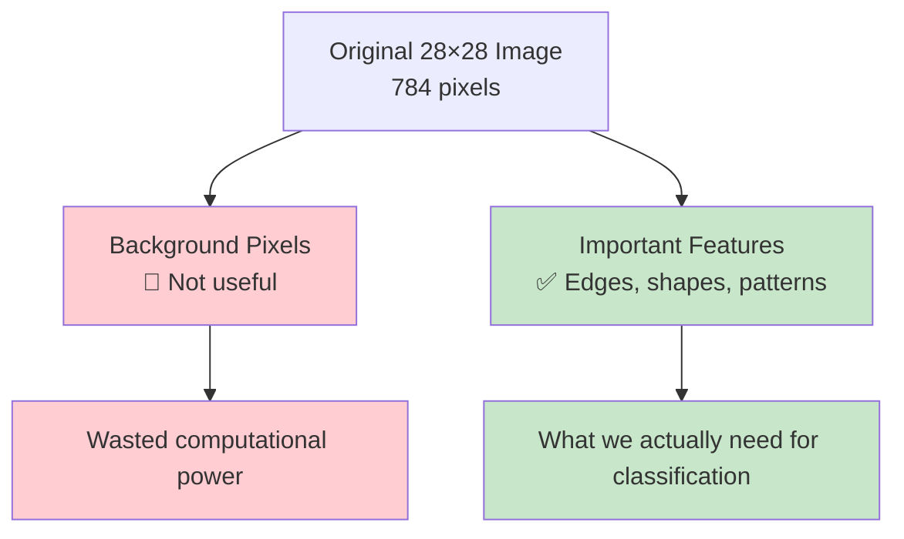
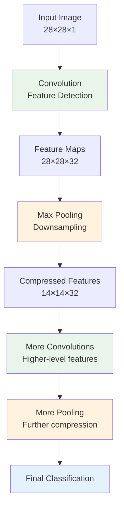
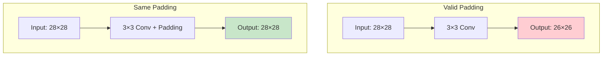
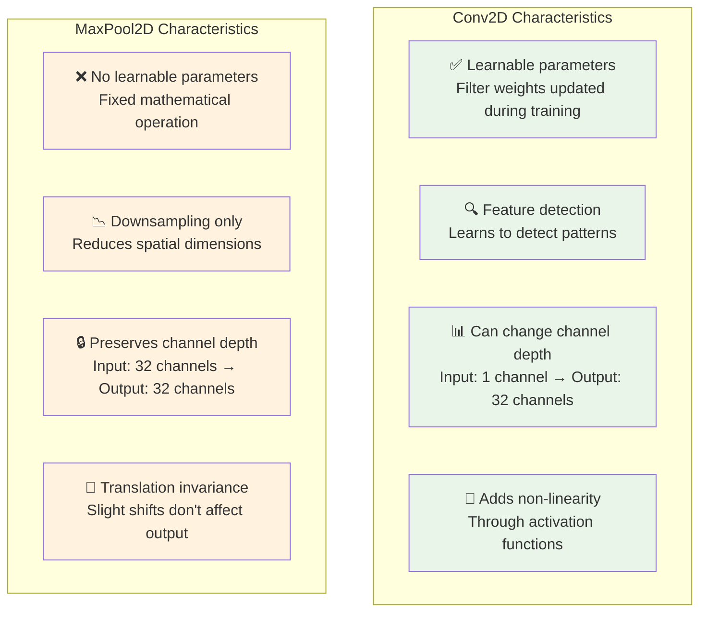
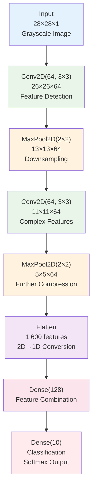
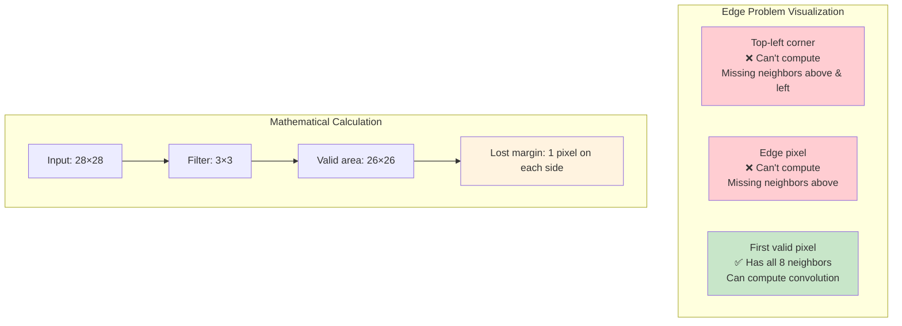
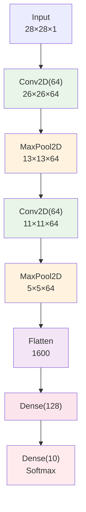

# TensorFlow Specialization

## Course 1: Introduction to TensorFlow for Artificial Intelligence, Machine Learning, and Deep Learning

### Week 3: Enhancing Vision with Convolutional Neural Networks

---

## Table of Contents

1. [A Conversation with Andrew Ng](#1-a-conversation-with-andrew-ng)
2. [What are Convolutions and Pooling?](#2-what-are-convolutions-and-pooling)
3. [Coding Convolutions and Pooling Layers](#3-coding-convolutions-and-pooling-layers)
4. [Implementing Convolutional Layers](#4-implementing-convolutional-layers)
5. [Implementing Pooling Layers](#5-implementing-pooling-layers)
6. [Improving the Fashion Classifier with Convolutions](#6-improving-the-fashion-classifier-with-convolutions)
7. [Walking Through Convolutions](#7-walking-through-convolutions)

---

# 1. A Conversation with Andrew Ng

## Introduction to the Problem

In the previous week, we successfully implemented a Deep Neural Network (DNN) for the Fashion MNIST dataset classification. While we achieved reasonable accuracy, the approach was fundamentally **naive** in how it processed image data.

### The Limitation of Traditional DNNs for Images

**The Problem**: Traditional DNNs treat images as flattened arrays of pixel values, completely ignoring the spatial relationships between pixels.

**Mathematical Representation**:
For a 28×28 grayscale image, a traditional DNN sees:
$$\text{Input} = [p_1, p_2, p_3, ..., p_{784}]$$

Where each $p_i$ represents a pixel value, but the network has **no understanding** that $p_1$ and $p_2$ might be spatially adjacent in the original image.

### Why This Approach is Naive

**Example**: Consider how a traditional DNN processes an image of a shoe:

```
Traditional DNN Processing:
Input: [87, 127, 45, 200, 33, ...]
         ↓
Dense Layer: "Is this pixel pattern a shoe?"
```

**The Problems**:

1. **No Spatial Awareness**: The network doesn't know that pixel 87 is next to pixel 127
2. **Translation Sensitivity**: Moving the shoe 1 pixel to the right creates a completely different input pattern
3. **Inefficient Learning**: The network must learn the same features at every possible position

### The Human Vision Approach

Humans don't classify objects by examining individual pixel values. Instead, we look for **meaningful features**:

**For a Shoe**:

- Shoelaces (curved lines with specific patterns)
- Sole (thick horizontal edge at bottom)
- Overall shape (elongated, roughly shoe-shaped contour)

**For a Handbag**:

- Handle (curved or straight line at top)
- Rectangular body (geometric shape)
- Strap attachments (connection points)

### Mathematical Intuition: Feature Detection

Instead of learning:
$$f(x_1, x_2, ..., x_{784}) = \text{class}$$

We want to learn:
$$f(\text{shoelaces}, \text{sole}, \text{shape}) = \text{shoe}$$
$$f(\text{handle}, \text{rectangle}, \text{strap}) = \text{handbag}$$

Where each feature is detected through **convolution operations**.

## Introduction to Convolutional Neural Networks

### The Core Concept

**Convolutions** allow us to detect local features in images by applying **filters** (also called kernels) that slide across the image.

**Analogy**: Think of convolution like using a magnifying glass that you move across a photograph to look for specific patterns.

### Why Convolutions Work

**1. Local Feature Detection**:
A convolution filter looks at small neighborhoods of pixels to detect patterns:

$$\text{Feature Response} = \sum_{i,j} \text{Filter}[i,j] \times \text{Image}[x+i, y+j]$$

**2. Translation Invariance**:
The same filter detects the same feature regardless of where it appears in the image.

**3. Parameter Sharing**:
Instead of learning separate weights for each pixel position, we learn one set of filter weights that work everywhere.

### Simple Example: Edge Detection

Let's see how a simple edge detection filter works:

**Vertical Edge Filter**:
$$\text{Filter} = \begin{bmatrix} -1 & 0 & 1 \\ -1 & 0 & 1 \\ -1 & 0 & 1 \end{bmatrix}$$

**Applied to Image Patch**:
$$\text{Image Patch} = \begin{bmatrix} 100 & 100 & 0 \\ 100 & 100 & 0 \\ 100 & 100 & 0 \end{bmatrix}$$

**Convolution Calculation**:

$$
\begin{align}
\text{Response} &= (-1)(100) + (0)(100) + (1)(0) \\
&\quad + (-1)(100) + (0)(100) + (1)(0) \\
&\quad + (-1)(100) + (0)(100) + (1)(0) \\
&= -100 + 0 + 0 - 100 + 0 + 0 - 100 + 0 + 0 \\
&= -300
\end{align}
$$

A strong negative response indicates a **vertical edge** where bright pixels are on the left and dark pixels are on the right.

### The Power of Learned Filters

Unlike hand-crafted filters, CNNs **learn optimal filters automatically** through backpropagation:

**Training Process**:

1. Initialize filters with random weights
2. Forward pass: Apply filters to detect features
3. Compute loss: Compare predictions with true labels
4. Backward pass: Update filter weights to improve feature detection
5. Repeat until filters learn to detect relevant features (shoelaces, handles, etc.)

### Hierarchical Feature Learning

CNNs naturally learn a hierarchy of features:

**Layer 1**: Simple features (edges, corners)
$$\text{Filter}_1 \rightarrow \text{edges}$$

**Layer 2**: Combinations of simple features (shapes, textures)
$$\text{Combination of edges} \rightarrow \text{rectangles, curves}$$

**Layer 3**: Complex patterns (object parts)
$$\text{Combination of shapes} \rightarrow \text{shoelaces, handles}$$

**Final Layer**: Complete objects
$$\text{Combination of parts} \rightarrow \text{shoe, handbag}$$

## Advantages Over Traditional DNNs

### 1. Spatial Awareness

**Traditional DNN**: Treats neighboring pixels as unrelated
**CNN**: Explicitly designed to capture spatial relationships

### 2. Translation Invariance

**Traditional DNN**: Must learn each pattern at every possible position
**CNN**: Learns pattern once, detects it everywhere

### 3. Parameter Efficiency

**Traditional DNN**: Millions of parameters for connecting each pixel to each neuron
**CNN**: Thousands of parameters in shared filters

**Parameter Comparison**:

- **Traditional DNN**: $28 \times 28 \times 128 = 100,352$ parameters for first layer
- **CNN**: $3 \times 3 \times 32 = 288$ parameters for 32 filters

### 4. Feature Reusability

**Traditional DNN**: Features learned for one position don't help at other positions
**CNN**: Same feature detector works across the entire image

## Setting Up for Fashion MNIST Improvement

In the next sections, we'll see how these concepts dramatically improve our Fashion MNIST classifier:

**Expected Improvements**:

- **Higher Accuracy**: Better feature detection leads to more accurate classification
- **Faster Training**: Parameter sharing reduces the number of weights to learn
- **Better Generalization**: Translation invariance helps with new, unseen images

**Key Questions We'll Address**:

1. How do we implement convolution layers in TensorFlow?
2. What is pooling and why do we need it?
3. How do we combine convolution and pooling layers effectively?
4. What architectural choices lead to the best performance?

The conversation with Andrew Ng highlights the fundamental insight: instead of looking at raw pixel values, we should look for **meaningful features** that distinguish different classes of objects. Convolutional Neural Networks provide exactly this capability through learned feature detectors that can identify shoelaces, soles, handles, and other discriminative patterns automatically.

# 2. What are Convolutions and Pooling?

## The Problem: Wasted Space in Images

From our previous Fashion MNIST example, we achieved reasonable accuracy with a traditional Deep Neural Network, but there's a fundamental inefficiency in how we process images.

### Identifying the Issue

**Fashion MNIST Images**: 28×28 = 784 pixels total

**The Problem**: Many pixels in each image contain **irrelevant information** - empty background space that doesn't help distinguish between shoes, handbags, or shirts.

**Key Insight**: We need a way to **condense images down to important features** that actually matter for classification.



## Understanding Convolutions

### What is a Convolution?

**Definition**: A convolution is a mathematical operation where we apply a **filter** (also called a kernel) across an image to detect specific features or patterns.

**Analogy**: Think of it like using a stamp that you press at different locations on paper - each stamp leaves a mark that indicates whether a specific pattern was found at that location.

### The Convolution Process

#### Step 1: Filter Definition

We start with a **filter** (typically 3×3, 5×5, etc.) containing weights:

**Example 3×3 Filter**:

$$
\text{Filter} = \begin{bmatrix}
-1 & 0 & -2 \\
0.5 & 4.5 & -1.5 \\
1.5 & 2 & -3
\end{bmatrix}
$$

#### Step 2: Sliding Window Operation

For each pixel position, we:

1. Center the filter on that pixel
2. Multiply each filter value by the corresponding image pixel
3. Sum all the products to get the new pixel value

### Detailed Mathematical Example

Let's work through the exact example from the video:

**Image Patch** (3×3 neighborhood):

$$
\text{Image} = \begin{bmatrix}
0 & 64 & 128 \\
48 & 192 & 144 \\
142 & 226 & 168
\end{bmatrix}
$$

**Filter**:

$$
\text{Filter} = \begin{bmatrix}
-1 & 0 & -2 \\
0.5 & 4.5 & -1.5 \\
1.5 & 2 & -3
\end{bmatrix}
$$

**Convolution Calculation**:

$$
\begin{align}
\text{New Pixel Value} &= \sum_{i,j} \text{Image}[i,j] \times \text{Filter}[i,j] \\
&= (-1 \times 0) + (0 \times 64) + (-2 \times 128) + \\
&\quad (0.5 \times 48) + (4.5 \times 192) + (-1.5 \times 144) + \\
&\quad (1.5 \times 142) + (2 \times 226) + (-3 \times 168) \\
&= 0 + 0 + (-256) + \\
&\quad 24 + 864 + (-216) + \\
&\quad 213 + 452 + (-504) \\
&= 577
\end{align}
$$

### Code Implementation: Basic Convolution

```python
import numpy as np
import tensorflow as tf
import matplotlib.pyplot as plt

def manual_convolution(image, filter_kernel):
    """
    Perform convolution manually to understand the process
    """
    # Get dimensions
    img_h, img_w = image.shape
    filter_h, filter_w = filter_kernel.shape

    # Calculate output dimensions (valid padding)
    out_h = img_h - filter_h + 1
    out_w = img_w - filter_w + 1

    # Initialize output
    output = np.zeros((out_h, out_w))

    # Perform convolution
    for i in range(out_h):
        for j in range(out_w):
            # Extract image patch
            patch = image[i:i+filter_h, j:j+filter_w]
            # Element-wise multiplication and sum
            output[i, j] = np.sum(patch * filter_kernel)

    return output

# Example: Create a simple image with vertical edge
image = np.array([
    [100, 100, 100, 0, 0, 0],
    [100, 100, 100, 0, 0, 0],
    [100, 100, 100, 0, 0, 0],
    [100, 100, 100, 0, 0, 0],
    [100, 100, 100, 0, 0, 0],
    [100, 100, 100, 0, 0, 0]
], dtype=np.float32)

# Vertical edge detection filter
vertical_filter = np.array([
    [-1, 0, 1],
    [-1, 0, 1],
    [-1, 0, 1]
], dtype=np.float32)

# Horizontal edge detection filter
horizontal_filter = np.array([
    [-1, -1, -1],
    [0, 0, 0],
    [1, 1, 1]
], dtype=np.float32)

# Apply convolutions
vertical_result = manual_convolution(image, vertical_filter)
horizontal_result = manual_convolution(image, horizontal_filter)

print("Original Image:")
print(image)
print("\nVertical Edge Detection Result:")
print(vertical_result)
print("\nHorizontal Edge Detection Result:")
print(horizontal_result)
```

**Why This Works**:

- **Vertical Filter**: Detects transitions from left to right (dark→bright or bright→dark)
- **Horizontal Filter**: Detects transitions from top to bottom
- **Strong Response**: Indicates presence of the corresponding edge type

### Feature Detection Through Convolutions

Different filters detect different types of features:

#### 1. Vertical Edge Detection

$$\text{Vertical Filter} = \begin{bmatrix} -1 & 0 & 1 \\ -1 & 0 & 1 \\ -1 & 0 & 1 \end{bmatrix}$$

**What it detects**: Vertical lines and edges
**Response**: Strong positive/negative values where vertical transitions occur

#### 2. Horizontal Edge Detection

$$\text{Horizontal Filter} = \begin{bmatrix} -1 & -1 & -1 \\ 0 & 0 & 0 \\ 1 & 1 & 1 \end{bmatrix}$$

**What it detects**: Horizontal lines and edges
**Response**: Strong values where horizontal transitions occur

#### 3. Other Common Filters

**Sobel X (Enhanced Vertical)**:
$$\text{Sobel X} = \begin{bmatrix} -1 & 0 & 1 \\ -2 & 0 & 2 \\ -1 & 0 & 1 \end{bmatrix}$$

**Gaussian Blur**:
$$\text{Gaussian} = \frac{1}{16}\begin{bmatrix} 1 & 2 & 1 \\ 2 & 4 & 2 \\ 1 & 2 & 1 \end{bmatrix}$$

### TensorFlow Implementation

```python
# Create a simple CNN layer
def create_feature_detector():
    """Create a CNN that applies multiple filters"""

    model = tf.keras.Sequential([
        # First convolution layer with 32 filters
        tf.keras.layers.Conv2D(
            filters=32,           # Number of different filters to learn
            kernel_size=(3, 3),   # Size of each filter
            activation='relu',    # Non-linearity
            input_shape=(28, 28, 1),  # Input dimensions
            padding='same'        # Keep same spatial dimensions
        ),

        # Second convolution layer
        tf.keras.layers.Conv2D(
            filters=64,
            kernel_size=(3, 3),
            activation='relu',
            padding='same'
        )
    ])

    return model

# Visualize what filters learn
def visualize_filters(model, layer_index=0):
    """Visualize the learned filters"""
    filters = model.layers[layer_index].get_weights()[0]

    # Plot first 16 filters
    fig, axes = plt.subplots(4, 4, figsize=(8, 8))
    for i in range(16):
        ax = axes[i // 4, i % 4]
        # Show filter (take first channel if input has multiple channels)
        ax.imshow(filters[:, :, 0, i], cmap='gray')
        ax.set_title(f'Filter {i+1}')
        ax.axis('off')

    plt.tight_layout()
    plt.show()
```

## Understanding Pooling

### What is Pooling?

**Definition**: Pooling is a **downsampling operation** that reduces the spatial dimensions of feature maps while preserving the most important information.

**Purpose**:

1. **Compress images** to reduce computational load
2. **Preserve important features** detected by convolutions
3. **Provide translation invariance** - small shifts don't affect the result

### Max Pooling: The Most Common Approach

**Process**:

1. Divide the image into non-overlapping regions (typically 2×2)
2. From each region, **keep only the maximum value**
3. Discard the rest

### Detailed Pooling Example

**Original 4×4 Image**:

$$
\text{Input} = \begin{bmatrix}
0 & 64 & 128 & 128 \\
48 & 192 & 144 & 144 \\
142 & 226 & 168 & 0 \\
255 & 0 & 0 & 64
\end{bmatrix}
$$

**Apply 2×2 Max Pooling**:

**Top-Left 2×2 Region**:
$$\begin{bmatrix} 0 & 64 \\ 48 & 192 \end{bmatrix} \rightarrow \max(0, 64, 48, 192) = 192$$

**Top-Right 2×2 Region**:
$$\begin{bmatrix} 128 & 128 \\ 144 & 144 \end{bmatrix} \rightarrow \max(128, 128, 144, 144) = 144$$

**Bottom-Left 2×2 Region**:
$$\begin{bmatrix} 142 & 226 \\ 255 & 0 \end{bmatrix} \rightarrow \max(142, 226, 255, 0) = 255$$

**Bottom-Right 2×2 Region**:
$$\begin{bmatrix} 168 & 0 \\ 0 & 64 \end{bmatrix} \rightarrow \max(168, 0, 0, 64) = 168$$

**Final Pooled Result** (2×2):
$$\text{Output} = \begin{bmatrix} 192 & 144 \\ 255 & 168 \end{bmatrix}$$

**Key Observation**: We reduced from 16 pixels to 4 pixels (75% reduction) while keeping the strongest features!

### Pooling Implementation

```python
def demonstrate_pooling():
    """Demonstrate different pooling operations"""

    # Create sample 4x4 image
    image = tf.constant([
        [0, 64, 128, 128],
        [48, 192, 144, 144],
        [142, 226, 168, 0],
        [255, 0, 0, 64]
    ], dtype=tf.float32)

    # Reshape for TensorFlow: (batch, height, width, channels)
    image_4d = tf.reshape(image, (1, 4, 4, 1))

    # Max pooling 2x2
    max_pool = tf.keras.layers.MaxPool2D(pool_size=2, strides=2)
    max_result = max_pool(image_4d)

    # Average pooling 2x2
    avg_pool = tf.keras.layers.AveragePooling2D(pool_size=2, strides=2)
    avg_result = avg_pool(image_4d)

    print("Original Image:")
    print(image.numpy())
    print("\nMax Pooling Result:")
    print(tf.squeeze(max_result).numpy())
    print("\nAverage Pooling Result:")
    print(tf.squeeze(avg_result).numpy())

demonstrate_pooling()
```

### Types of Pooling

#### 1. Max Pooling

$$\text{MaxPool}(R) = \max_{(i,j) \in R} x_{i,j}$$

- **Advantage**: Preserves strongest features
- **Use Case**: When you want to detect presence of features

#### 2. Average Pooling

$$\text{AvgPool}(R) = \frac{1}{|R|} \sum_{(i,j) \in R} x_{i,j}$$

- **Advantage**: Smoother downsampling
- **Use Case**: When you want to preserve overall intensity

#### 3. Global Pooling

$$\text{GlobalMaxPool} = \max_{i,j} x_{i,j}$$

- **Purpose**: Reduce entire feature map to single value
- **Use Case**: Before final classification layers

## The Power of Convolution + Pooling

### Why This Combination is Effective



### Benefits of This Approach

#### 1. **Feature Preservation**

- Convolutions detect important patterns
- Max pooling keeps the strongest responses
- Result: Important features are enhanced and preserved

#### 2. **Computational Efficiency**

- **Before**: 28×28 = 784 pixels to process
- **After first pool**: 14×14 = 196 pixels (75% reduction)
- **After second pool**: 7×7 = 49 pixels (93% reduction!)

#### 3. **Translation Invariance**

- A shoe moved 1 pixel still triggers the same max pooling response
- Small shifts in position don't affect the final classification

### Parameter Efficiency Calculation

**Traditional DNN approach**: Each pixel connects to each neuron

- First layer: 784 × 128 = 100,352 parameters
- Much less efficient use of parameters

**CNN approach**: Shared filter weights across image

- 3×3 filter applied everywhere uses only 9 parameters per filter
- Much more efficient parameter usage

We'll see the actual implementation in the upcoming coding sections.

## Summary: Why Convolutions and Pooling Work

### The Key Insights

1. **Convolutions detect local features** that are relevant for classification
2. **Pooling preserves important information** while reducing computational load
3. **Combined approach** creates a hierarchy of increasingly complex features
4. **Translation invariance** makes the model robust to small position changes

### Mathematical Foundation

The convolution operation can be expressed as:
$$(f * g)[m,n] = \sum_{i=-\infty}^{\infty} \sum_{j=-\infty}^{\infty} f[i,j] \cdot g[m-i, n-j]$$

In practice, with finite filters:
$$\text{Output}[m,n] = \sum_{i=0}^{k-1} \sum_{j=0}^{k-1} \text{Input}[m+i, n+j] \cdot \text{Filter}[i,j]$$

The combination of convolutions and pooling transforms raw pixel data into meaningful, compressed representations that make classification both more accurate and more efficient.

# 3. Coding Convolutions and Pooling Layers

## Introduction to TensorFlow Implementation

Now that we understand the mathematical foundations of convolutions and pooling, it's time to see how these concepts are implemented in TensorFlow. The good news is that TensorFlow provides high-level APIs that handle all the complex mathematics we discussed, making it easy to build powerful CNNs.

**Key TensorFlow Components**:

- `tf.keras.layers.Conv2D` - Implements convolution operations
- `tf.keras.layers.MaxPool2D` - Implements max pooling operations

## Understanding tf.keras.layers.Conv2D

### What Conv2D Does

The `Conv2D` layer is TensorFlow's implementation of the 2D convolution operation we learned about. It automatically:

1. **Initializes filters** with random weights
2. **Applies convolution** across the entire input
3. **Learns optimal filter values** during training
4. **Handles all the mathematical operations** we calculated manually

### Key Parameters Explained

#### 1. `filters` Parameter

```python
tf.keras.layers.Conv2D(filters=32, ...)
```

**What it means**: Number of different feature detectors (filters) to learn

- **filters=32**: Learn 32 different patterns (edges, shapes, textures)
- **filters=64**: Learn 64 different patterns (more complex features)

**Why it matters**: More filters = ability to detect more diverse features

- **Trade-off**: More filters = more parameters = more computation

#### 2. `kernel_size` Parameter

```python
tf.keras.layers.Conv2D(kernel_size=(3, 3), ...)
tf.keras.layers.Conv2D(kernel_size=3, ...)  # Same as (3, 3)
```

**What it means**: Size of the convolution filter

- **kernel_size=3**: 3×3 filter (most common)
- **kernel_size=5**: 5×5 filter (captures larger patterns)
- **kernel_size=1**: 1×1 filter (channel mixing, dimensionality reduction)

**Mathematical Impact**:

- **3×3 filter**: Uses 9 weight parameters per filter
- **5×5 filter**: Uses 25 weight parameters per filter
- **Larger kernels**: Capture larger spatial patterns but use more parameters

#### 3. `strides` Parameter

```python
tf.keras.layers.Conv2D(strides=(1, 1), ...)  # Default
tf.keras.layers.Conv2D(strides=(2, 2), ...)  # Skip every other pixel
```

**What it means**: How much the filter moves at each step

- **strides=(1, 1)**: Move 1 pixel at a time (dense scanning)
- **strides=(2, 2)**: Move 2 pixels at a time (downsampling)

**Size Impact**:

```
Input: 28×28, stride=1 → Output: ~28×28 (same size)
Input: 28×28, stride=2 → Output: ~14×14 (half size)
```

#### 4. `padding` Parameter

```python
tf.keras.layers.Conv2D(padding='valid', ...)  # Default
tf.keras.layers.Conv2D(padding='same', ...)   # Preserve size
```

**"valid" padding**: No padding added

- **Effect**: Output is smaller than input
- **Formula**: Output size = (Input size - Kernel size + 1)
- **Example**: 28×28 input with 3×3 kernel → 26×26 output

**"same" padding**: Add zeros around edges

- **Effect**: Output same size as input (when stride=1)
- **Purpose**: Preserve spatial dimensions through the network

**Visual Comparison**:



#### 5. `activation` Parameter

```python
tf.keras.layers.Conv2D(activation='relu', ...)
tf.keras.layers.Conv2D(activation=None, ...)    # Linear activation
```

**Purpose**: Apply non-linearity after convolution

- **activation='relu'**: ReLU function - max(0, x)
- **activation='tanh'**: Tanh function
- **activation=None**: No activation (linear)

**Why ReLU is Popular**:

- **Simple**: max(0, x) is computationally efficient
- **Solves vanishing gradients**: Doesn't saturate for positive values
- **Sparse activation**: Many neurons output 0, creating efficient representations

### Input and Output Shapes

**Input Shape**: `(batch_size, height, width, channels)`

```python
# For grayscale Fashion MNIST:
input_shape = (None, 28, 28, 1)  # None = variable batch size

# For RGB images:
input_shape = (None, 224, 224, 3)  # 3 color channels
```

**Output Shape**: `(batch_size, new_height, new_width, filters)`

```python
# Example transformation:
Input:  (None, 28, 28, 1)   # Grayscale image
Conv2D: filters=32, kernel_size=3, padding='same'
Output: (None, 28, 28, 32)  # 32 feature maps
```

### Simple Conv2D Example Analysis

Let's break down the documentation example:

```python
x = np.random.rand(4, 10, 10, 128)
y = tf.keras.layers.Conv2D(32, 3, activation='relu')(x)
print(y.shape)  # Output: (4, 8, 8, 32)
```

**Step-by-step Analysis**:

1. **Input**: `(4, 10, 10, 128)`

   - 4 images in batch
   - 10×10 spatial dimensions
   - 128 input channels (feature maps from previous layer)

2. **Conv2D Parameters**:

   - `filters=32`: Create 32 new feature maps
   - `kernel_size=3`: Use 3×3 filters
   - `activation='relu'`: Apply ReLU after convolution
   - `padding='valid'`: Default, no padding

3. **Output Calculation**:
   - Height: 10 - 3 + 1 = 8 (due to valid padding)
   - Width: 10 - 3 + 1 = 8
   - Channels: 32 (number of filters)
   - **Final shape**: `(4, 8, 8, 32)`

## Understanding tf.keras.layers.MaxPool2D

### What MaxPool2D Does

The `MaxPool2D` layer implements the max pooling operation we learned about:

1. **Divides input** into non-overlapping regions
2. **Selects maximum value** from each region
3. **Outputs downsampled** feature maps
4. **Preserves depth** (number of channels unchanged)

### Key Parameters Explained

#### 1. `pool_size` Parameter

```python
tf.keras.layers.MaxPool2D(pool_size=(2, 2), ...)  # Default
tf.keras.layers.MaxPool2D(pool_size=2, ...)       # Same as (2, 2)
```

**What it means**: Size of pooling window

- **pool_size=2**: 2×2 pooling window (most common)
- **pool_size=3**: 3×3 pooling window
- **pool_size=4**: 4×4 pooling window

**Downsampling Effect**:

- **2×2 pooling**: Reduces size by factor of 2 (quarters the pixels)
- **3×3 pooling**: Reduces size by factor of 3 (reduces to 1/9th)

#### 2. `strides` Parameter

```python
tf.keras.layers.MaxPool2D(strides=None, ...)      # Default: same as pool_size
tf.keras.layers.MaxPool2D(strides=(1, 1), ...)    # Overlapping windows
tf.keras.layers.MaxPool2D(strides=(2, 2), ...)    # Non-overlapping (typical)
```

**What it means**: How much the pooling window moves

- **strides=None**: Use same value as pool_size (non-overlapping)
- **strides=(1, 1)**: Move 1 pixel at a time (overlapping windows)
- **strides=(2, 2)**: Move 2 pixels at a time (non-overlapping)

#### 3. `padding` Parameter

```python
tf.keras.layers.MaxPool2D(padding='valid', ...)  # Default
tf.keras.layers.MaxPool2D(padding='same', ...)   # Add padding if needed
```

**"valid" padding**: No padding (most common for pooling)
**"same" padding**: Add padding to preserve certain dimensions

### Output Size Calculation

**Formula for "valid" padding**:

```
output_size = floor((input_size - pool_size) / strides) + 1
```

**Examples**:

```python
# Example 1: Standard 2x2 pooling
Input: 28×28, pool_size=2, strides=2
Output: floor((28-2)/2) + 1 = floor(13) + 1 = 14×14

# Example 2: Large pooling
Input: 14×14, pool_size=4, strides=4
Output: floor((14-4)/4) + 1 = floor(2.5) + 1 = 3×3
```

### MaxPool2D Examples from Documentation

#### Example 1: Overlapping Pooling

```python
x = np.array([[1., 2., 3.],
              [4., 5., 6.],
              [7., 8., 9.]])
x = np.reshape(x, [1, 3, 3, 1])  # Shape: (1, 3, 3, 1)

max_pool_2d = tf.keras.layers.MaxPooling2D(pool_size=(2, 2),
                                          strides=(1, 1),
                                          padding="valid")
result = max_pool_2d(x)
```

**Step-by-step Analysis**:

1. **Input**: 3×3 matrix with values 1-9
2. **Pool size**: 2×2 windows
3. **Strides**: (1, 1) means overlapping windows
4. **Pooling windows**:
   - Window 1: `[[1,2], [4,5]]` → max = 5
   - Window 2: `[[2,3], [5,6]]` → max = 6
   - Window 3: `[[4,5], [7,8]]` → max = 8
   - Window 4: `[[5,6], [8,9]]` → max = 9
5. **Output**: `[[5, 6], [8, 9]]` with shape (1, 2, 2, 1)

#### Example 2: Non-overlapping Pooling

```python
x = np.array([[1., 2., 3., 4.],
              [5., 6., 7., 8.],
              [9., 10., 11., 12.]])
x = np.reshape(x, [1, 3, 4, 1])  # Shape: (1, 3, 4, 1)

max_pool_2d = tf.keras.layers.MaxPooling2D(pool_size=(2, 2),
                                          strides=(2, 2),
                                          padding="valid")
result = max_pool_2d(x)
```

**Step-by-step Analysis**:

1. **Input**: 3×4 matrix
2. **Non-overlapping 2×2 windows**:
   - Window 1: `[[1,2], [5,6]]` → max = 6
   - Window 2: `[[3,4], [7,8]]` → max = 8
3. **Output**: `[[6, 8]]` with shape (1, 1, 2, 1)

### Key Differences: Conv2D vs MaxPool2D



## Data Format Considerations

### Understanding "channels_last" vs "channels_first"

**"channels_last" (Default)**:

- Shape: `(batch_size, height, width, channels)`
- **Example**: `(32, 28, 28, 1)` for Fashion MNIST batch
- **Memory layout**: More cache-friendly on most hardware

**"channels_first"**:

- Shape: `(batch_size, channels, height, width)`
- **Example**: `(32, 1, 28, 28)` for same batch
- **Use case**: Sometimes faster on certain GPUs

**Practical Advice**: Stick with "channels_last" (default) unless you have specific performance requirements.

## Common Parameter Combinations

### Typical Conv2D Patterns

**1. Feature Extraction Layer**:

```python
tf.keras.layers.Conv2D(
    filters=32,          # Start with 32 filters
    kernel_size=3,       # 3x3 is most common
    activation='relu',   # ReLU for non-linearity
    padding='same'       # Preserve spatial dimensions
)
```

**2. Downsampling Conv Layer**:

```python
tf.keras.layers.Conv2D(
    filters=64,          # More filters for complex features
    kernel_size=3,
    strides=2,           # Downsample by factor of 2
    activation='relu',
    padding='same'
)
```

### Typical MaxPool2D Patterns

**1. Standard Downsampling**:

```python
tf.keras.layers.MaxPool2D(
    pool_size=2,         # 2x2 pooling (most common)
    strides=2            # Non-overlapping (default)
)
```

**2. Aggressive Downsampling**:

```python
tf.keras.layers.MaxPool2D(
    pool_size=4,         # 4x4 pooling
    strides=4            # Reduce size by factor of 4
)
```

## Parameter Count Implications

### Conv2D Parameter Calculation

**Formula**:

```
Parameters = (kernel_height × kernel_width × input_channels × output_filters) + output_filters
```

**Example**:

```python
# Conv2D layer: 3x3 filters, 1 input channel, 32 output filters
parameters = (3 × 3 × 1 × 32) + 32 = 288 + 32 = 320 parameters
```

**Why the +32?**: Bias terms (one per filter)

### MaxPool2D Parameter Count

**Answer**: **Zero parameters!**

- MaxPool2D has no learnable parameters
- It's a fixed mathematical operation
- Only stores the configuration (pool_size, strides, etc.)

## Preparing for Implementation

In the next video, we'll see how to:

1. **Combine Conv2D and MaxPool2D** in sequence
2. **Build complete CNN architectures** for Fashion MNIST
3. **Configure layer parameters** for optimal performance
4. **Handle input/output shapes** correctly

**Key Concepts to Remember**:

- **Conv2D learns features** through trainable filters
- **MaxPool2D reduces size** without learning
- **Parameter choices matter** for both performance and accuracy
- **Shape transformations** must be tracked through the network

The power of CNNs comes from intelligently combining these two layer types to create hierarchical feature detectors that can learn to recognize complex patterns in images.

# 4. Implementing Convolutional Layers

## From Theory to Practice

Now we transition from understanding the mathematical concepts of convolutions to actually implementing them in code. The beauty of TensorFlow is that we don't need to manually perform all the complex mathematical operations we learned about - the framework handles the computations while we focus on architecture design.

## Comparing Traditional DNN vs CNN Architecture

### Original DNN Architecture (From Week 2)

```python
# Traditional Dense Neural Network
model = tf.keras.Sequential([
    tf.keras.layers.Flatten(input_shape=(28, 28)),    # 784 inputs
    tf.keras.layers.Dense(128, activation='relu'),     # Hidden layer
    tf.keras.layers.Dense(10, activation='softmax')    # Output layer
])
```

**What this does**:

1. **Flatten**: Converts 28×28 image into 784-element array
2. **Dense(128)**: Fully connected layer with 128 neurons
3. **Dense(10)**: Output layer for 10 Fashion MNIST classes

**The Problem**: This approach discards all spatial information by flattening the image immediately.

### New CNN Architecture

```python
# Convolutional Neural Network
model = tf.keras.Sequential([
    tf.keras.layers.Input(shape=(28, 28, 1)),                    # Input layer
    tf.keras.layers.Conv2D(64, (3, 3), activation='relu'),      # First convolution
    tf.keras.layers.MaxPooling2D(2, 2),                         # First pooling
    tf.keras.layers.Conv2D(64, (3, 3), activation='relu'),      # Second convolution
    tf.keras.layers.MaxPooling2D(2, 2),                         # Second pooling
    tf.keras.layers.Flatten(),                                  # Convert to 1D
    tf.keras.layers.Dense(128, activation='relu'),              # Hidden layer
    tf.keras.layers.Dense(10, activation='softmax')             # Output layer
])
```

**Key Observation**: The last three lines remain identical to our original DNN - only the feature extraction part changes.

## Layer-by-Layer Analysis

### 1. Input Layer

```python
tf.keras.layers.Input(shape=(28, 28, 1))
```

**Purpose**: Explicitly define the input shape
**Shape Breakdown**:

- **28, 28**: Height and width (Fashion MNIST dimensions)
- **1**: Number of channels (grayscale = 1 channel)

**Why the explicit Input layer?**:

- Makes the model architecture clearer
- Helps with debugging shape mismatches
- Required when input_shape isn't specified in first layer

### 2. First Convolutional Layer

```python
tf.keras.layers.Conv2D(64, (3, 3), activation='relu')
```

**Parameter Analysis**:

- **64**: Number of filters (feature detectors)
- **(3, 3)**: Filter size (3×3 kernels)
- **activation='relu'**: Apply ReLU after convolution

**What happens mathematically**:

1. **64 different 3×3 filters** are applied to the 28×28 input
2. Each filter produces a **feature map** showing where its pattern was detected
3. **ReLU activation** removes negative values: $\text{ReLU}(x) = \max(0, x)$

**Shape Transformation**:

```
Input:  (28, 28, 1)
Output: (26, 26, 64)
```

**Size calculation**: 28 - 3 + 1 = 26 (using valid padding)

**Why 64 filters?**:

- **More filters = more diverse features** can be detected
- **64 is a common starting point** - enough variety without excessive computation
- **Powers of 2** (32, 64, 128) are computationally efficient

### 3. First Max Pooling Layer

```python
tf.keras.layers.MaxPooling2D(2, 2)
```

**Parameter Analysis**:

- **First 2**: Pool size (2×2 windows)
- **Second 2**: Stride (move 2 pixels at a time)

**What happens**:

1. **Divide each 26×26 feature map** into 2×2 non-overlapping regions
2. **Keep only the maximum value** from each region
3. **Preserve all 64 channels** (pooling doesn't change depth)

**Shape Transformation**:

```
Input:  (26, 26, 64)
Output: (13, 13, 64)
```

**Size calculation**: floor(26/2) = 13

**Benefits**:

- **Reduces computation** for subsequent layers
- **Provides translation invariance** - small movements don't affect max values
- **Retains strongest features** while discarding less important details

### 4. Second Convolutional Layer

```python
tf.keras.layers.Conv2D(64, (3, 3), activation='relu')
```

**Why a second convolution?**:

- **First layer** detects simple features (edges, corners)
- **Second layer** combines simple features into complex patterns
- **Hierarchical feature learning** - building complexity gradually

**Input considerations**:

- **Input depth is now 64** (from previous layer's 64 filters)
- **Each 3×3×64 filter** looks at all 64 feature maps simultaneously
- **64 new filters** create 64 new higher-level feature maps

**Shape Transformation**:

```
Input:  (13, 13, 64)
Output: (11, 11, 64)
```

**Size calculation**: 13 - 3 + 1 = 11

### 5. Second Max Pooling Layer

```python
tf.keras.layers.MaxPooling2D(2, 2)
```

**Further downsampling**:

- **Continues the compression** process
- **Maintains the most important features** from second convolution

**Shape Transformation**:

```
Input:  (11, 11, 64)
Output: (5, 5, 64)
```

**Size calculation**: floor(11/2) = 5

### 6. Flatten Layer

```python
tf.keras.layers.Flatten()
```

**Purpose**: Convert 2D feature maps to 1D vector for dense layers
**Shape Transformation**:

```
Input:  (5, 5, 64)
Output: (1600,)
```

**Calculation**: 5 × 5 × 64 = 1,600 features

**Why we still need this**: Dense layers expect 1D input

### 7. Dense Layers (Unchanged)

```python
tf.keras.layers.Dense(128, activation='relu')
tf.keras.layers.Dense(10, activation='softmax')
```

**These remain identical** to our original DNN because:

- **Feature extraction** (convolution + pooling) is now handled separately
- **Classification** (dense layers) can use the same approach
- **1,600 features** from CNN are much more meaningful than 784 raw pixels

## Understanding Filter Initialization

### How Filters Start

**Not Random**: Despite what you might expect, filters don't start completely randomly.

**Initial Strategy**:

```python
# TensorFlow uses 'glorot_uniform' initialization by default
# This is also known as Xavier initialization
import numpy as np

def glorot_uniform(shape):
    """Simplified version of Glorot initialization"""
    fan_in = shape[0] * shape[1] * shape[2]   # kernel_h * kernel_w * input_channels
    fan_out = shape[3]                        # output_channels
    limit = np.sqrt(6.0 / (fan_in + fan_out))
    return np.random.uniform(-limit, limit, shape)

# For our 3x3x1x64 filters:
initial_weights = glorot_uniform((3, 3, 1, 64))
```

**Why this initialization works**:

- **Prevents vanishing gradients** - values aren't too small
- **Prevents exploding gradients** - values aren't too large
- **Maintains reasonable variance** through the network

### Filter Learning Process

**During Training**:

1. **Forward pass**: Current filters detect whatever patterns they can
2. **Loss calculation**: Compare predictions with true labels
3. **Backpropagation**: Calculate gradients showing how to improve each filter
4. **Weight update**: Adjust filter values to detect more useful patterns
5. **Repeat**: Over thousands of iterations, filters become specialized

**What filters learn to detect**:

- **Layer 1**: Edges, corners, simple textures
- **Layer 2**: Shapes, patterns, object parts
- **Deeper layers**: Complete object features

## Complete Model Architecture Visualization



## Key Design Principles

### 1. Gradual Feature Hierarchy

- **Start simple**: First layer detects basic features
- **Build complexity**: Each layer combines previous features
- **End specific**: Final layers recognize complete objects

### 2. Progressive Downsampling

- **Reduce spatial dimensions** while **increasing feature depth**
- **Computational efficiency**: Fewer pixels to process in deeper layers
- **Translation invariance**: Exact position becomes less important

### 3. Parameter Efficiency Comparison

**Traditional DNN**:

```
Flatten → Dense: 784 × 128 = 100,352 parameters
```

**CNN Feature Extraction**:

```
Conv2D(64, 3×3): (3×3×1×64) + 64 = 640 parameters
Conv2D(64, 3×3): (3×3×64×64) + 64 = 36,928 parameters
Total CNN: ~37,500 parameters
```

**Key Insight**: CNN uses **more parameters** but applies them much **more efficiently** through:

- **Parameter sharing**: Same filter used across entire image
- **Spatial locality**: Only connecting nearby pixels
- **Hierarchical learning**: Building features progressively

## Common Architecture Patterns

### Why This Specific Architecture?

**Conv→Pool→Conv→Pool Pattern**:

- **Proven effective** for image classification
- **Balances feature detection with computational efficiency**
- **Gradual reduction** in spatial size, increase in feature complexity

**Alternative Patterns**:

```python
# Deeper network
Conv2D → Conv2D → MaxPool2D → Conv2D → Conv2D → MaxPool2D

# Different filter sizes
Conv2D(32, 5×5) → Conv2D(64, 3×3) → Conv2D(128, 3×3)

# Multiple pooling strategies
Conv2D → MaxPool2D → Conv2D → AveragePooling2D
```

The transition from traditional neural networks to CNNs represents a fundamental shift from treating images as simple arrays to understanding them as spatial data with meaningful local patterns and hierarchical structure.

# 5. Implementing Pooling Layers

## Understanding the Pooling Implementation

Building on our convolutional layer implementation, we now examine how pooling layers work in practice and why they're essential for efficient CNN architectures.

### The MaxPooling2D Layer

```python
tf.keras.layers.MaxPooling2D(2, 2)
```

**What this code does**:

- **First parameter (2)**: Pool size - creates 2×2 windows
- **Second parameter (2)**: Stride - moves 2 pixels at a time
- **Operation**: Takes maximum value from each 2×2 region

**Why max pooling works**:

- **Preserves strongest features** detected by previous convolution
- **Reduces spatial dimensions** by factor of 2 in each direction
- **Maintains translation invariance** - small shifts don't affect max values

### The Layer Stacking Strategy

Our complete architecture follows this pattern:

```python
Conv2D(64, 3×3) → MaxPooling2D(2×2) → Conv2D(64, 3×3) → MaxPooling2D(2×2)
```

**Why stack layers this way**:

1. **First convolution**: Detects basic features (edges, textures)
2. **First pooling**: Reduces size while preserving important features
3. **Second convolution**: Learns combinations of basic features
4. **Second pooling**: Further compression, focuses on most salient patterns

**Progressive simplification**:

- Image gets **"quartered and then quartered again"**
- Content becomes **greatly simplified** but more meaningful
- Convolutions **filter to features that determine the output**

## The Model Summary: Understanding Shape Transformations

### Using model.summary()

```python
model.summary()
```

This powerful debugging tool shows us exactly how data flows through our network. Let's analyze the output table:

| Layer                           | Output Shape       | Param # |
| ------------------------------- | ------------------ | ------- |
| conv2d_12 (Conv2D)              | (None, 26, 26, 64) | 640     |
| max_pooling2d_12 (MaxPooling2D) | (None, 13, 13, 64) | 0       |
| conv2d_13 (Conv2D)              | (None, 11, 11, 64) | 36928   |
| max_pooling2d_13 (MaxPooling2D) | (None, 5, 5, 64)   | 0       |
| flatten_5 (Flatten)             | (None, 1600)       | 0       |
| dense_10 (Dense)                | (None, 128)        | 204928  |
| dense_11 (Dense)                | (None, 10)         | 1290    |

## Demystifying the "28×28 → 26×26" Problem

### Why Convolution Reduces Image Size

**The edge problem**: When applying a 3×3 filter to a 28×28 image, why do we get 26×26 output?

**Visual explanation**: Consider scanning a 3×3 filter across an image:



**Matrix representation of the edge problem**:

```
Original 28×28 Image (showing border issue):
┌─────────────────────────────────┐
│ X  X  X  X  X  X  X  X  X  ...  │ ← Can't use top row
│ X [P  P  P] P  P  P  P  P  ...  │ ← First valid 3×3 window
│ X [P  P  P] P  P  P  P  P  ...  │
│ X [P  P  P] P  P  P  P  P  ...  │
│ X  P  P  P  P  P  P  P  P  ...  │
│ ⋮  ⋮  ⋮  ⋮  ⋮  ⋮  ⋮  ⋮  ⋮       │
│ X  P  P  P  P  P  P  P  P  ...  │
└─────────────────────────────────┘
↑
Can't use leftmost column

Resulting 26×26 Output:
┌───────────────────────────┐
│ O  O  O  O  O  O  O  ...  │ ← Valid convolution results
│ O  O  O  O  O  O  O  ...  │   (2 pixels smaller in each dimension)
│ O  O  O  O  O  O  O  ...  │
│ ⋮  ⋮  ⋮  ⋮  ⋮  ⋮  ⋮       │
│ O  O  O  O  O  O  O  ...  │
└───────────────────────────┘

Where: X = unusable border pixels, P = input pixels, O = output pixels
```

**Step-by-step explanation**:

1. **Top-left pixel**: Cannot compute convolution because there are no pixels above or to the left
2. **Top edge pixels**: Cannot compute because they lack neighbors above
3. **First valid pixel**: Located at position (1,1) - has all required 8 neighbors for 3×3 filter

**General formula for valid convolution**:
$$\text{Output Size} = \text{Input Size} - \text{Filter Size} + 1$$

**Examples**:

- **3×3 filter**: 28 - 3 + 1 = 26
- **5×5 filter**: 28 - 5 + 1 = 24
- **7×7 filter**: 28 - 7 + 1 = 22

### Complete Shape Journey Through the Network

Let's trace the exact transformations with detailed visual representations:

#### Step 1: First Convolution Layer

```
Input:  (None, 28, 28, 1)
Conv2D: 64 filters, 3×3 kernel, valid padding, ReLU activation
Output: (None, 26, 26, 64)
```

**Detailed Explanation**:

- **None**: Batch dimension - can handle any number of images
- **28, 28**: Input image dimensions (Fashion MNIST)
- **1**: Single channel (grayscale)
- **→ 26, 26**: Size reduction due to valid padding
- **→ 64**: Number of filters creates 64 feature maps

**Visual representation of the transformation**:

```
Input Volume: 28×28×1
┌─────────────────────────────────┐
│ ░░░░░░░░░░░░░░░░░░░░░░░░░░░░░░░ │ ← Single grayscale channel
│ ░░░░░░░░░░░░░░░░░░░░░░░░░░░░░░░ │   (28×28 pixels)
│ ░░░░░░░░░░░░░░░░░░░░░░░░░░░░░░░ │
│ ░░░░░░░░░░░░░░░░░░░░░░░░░░░░░░░ │
│             ...                 │
└─────────────────────────────────┘

Apply 64 different 3×3 filters
           ↓

Output Volume: 26×26×64
┌──────────┬──────────┬──────────┬─────┐
│ Feature  │ Feature  │ Feature  │ ... │ ← 64 different feature maps
│ Map 1    │ Map 2    │ Map 3    │ 64  │   (each 26×26 pixels)
│ (26×26)  │ (26×26)  │ (26×26)  │     │
│ ████████ │ ████████ │ ████████ │ ... │
│ ████████ │ ████████ │ ████████ │     │
│ ████████ │ ████████ │ ████████ │     │
│    ...   │    ...   │    ...   │     │
└──────────┴──────────┴──────────┴─────┘
```

**Calculation**: 28 - 3 + 1 = 26 (for both height and width)

#### Step 2: First Max Pooling Layer

```
Input:  (None, 26, 26, 64)
MaxPool2D: 2×2 pool size, stride 2
Output: (None, 13, 13, 64)
```

**Detailed Explanation**:

- **26, 26 → 13, 13**: Each dimension halved by 2×2 pooling with stride 2
- **64 → 64**: Number of channels unchanged (pooling operates on each channel independently)
- **No parameters**: Pooling is a fixed operation, no learning involved

**Visual representation of 2×2 max pooling**:

```
Before Pooling (26×26):                After Pooling (13×13):
┌─────────────────────────┐            ┌─────────────┐
│ 12│15│ 8│ 3│11│ 7│ ... │            │ 15│ 11│ ... │
│───┼───┼───┼───┼───┼───┤            │───┼───┼─────┤
│  9│ 2│14│ 6│ 5│12│ ... │     →      │ 14│ 12│ ... │
│───┼───┼───┼───┼───┼───┤            │───┼───┼─────┤
│  4│ 7│ 1│10│ 8│ 3│ ... │            │  7│ 10│ ... │
│───┼───┼───┼───┼───┼───┤            │───┼───┼─────┤
│ 13│ 6│ 9│ 2│15│ 4│ ... │            │  ⋮│  ⋮│     │
│───┼───┼───┼───┼───┼───┤            └─────────────┘
│  ⋮│  ⋮│  ⋮│  ⋮│  ⋮│  ⋮│
└─────────────────────────┘

Each 2×2 region becomes one pixel with the maximum value:
[12,15]  →  15    [8,3]   →  11
[9, 2]            [14,6]

This happens for all 64 feature maps independently.
```

**Calculation**: floor(26/2) = 13 (for both dimensions)

#### Step 3: Second Convolution Layer

```
Input:  (None, 13, 13, 64)
Conv2D: 64 filters, 3×3 kernel, valid padding, ReLU activation
Output: (None, 11, 11, 64)
```

**Detailed Explanation**:

- **Input depth 64**: Now processing 64 feature maps instead of 1 original image
- **64 new filters**: Each filter is 3×3×64 (looks at all 64 input channels)
- **Output 64 channels**: Creates 64 new higher-level feature maps
- **11×11 size**: Again loses 1 pixel border due to valid padding

**3D Convolution visualization**:

```
Input: 13×13×64                         Output: 11×11×64
┌─────┬─────┬─────┬───┐                ┌─────┬─────┬───┐
│Map 1│Map 2│Map 3│...│                │New 1│New 2│...│
│13×13│13×13│13×13│64 │                │11×11│11×11│64 │
└─────┴─────┴─────┴───┘                └─────┴─────┴───┘
        ↓                                      ↑
   Each 3×3×64 filter looks at               Each filter
   corresponding 3×3 regions               produces one
   across ALL 64 input maps               new feature map

Filter Structure (3×3×64):
┌───┬───┬───┐ ┌───┬───┬───┐     ┌───┬───┬───┐
│w11│w12│w13│ │w11│w12│w13│ ... │w11│w12│w13│
├───┼───┼───┤ ├───┼───┼───┤     ├───┼───┼───┤
│w21│w22│w23│ │w21│w22│w23│ ... │w21│w22│w23│
├───┼───┼───┤ ├───┼───┼───┤     ├───┼───┼───┤
│w31│w32│w33│ │w31│w32│w33│ ... │w31│w32│w33│
└───┴───┴───┘ └───┴───┴───┘     └───┴───┴───┘
Channel 1     Channel 2         Channel 64
```

**Calculation**: 13 - 3 + 1 = 11

#### Step 4: Second Max Pooling Layer

```
Input:  (None, 11, 11, 64)
MaxPool2D: 2×2 pool size, stride 2
Output: (None, 5, 5, 64)
```

**Detailed Explanation**:

- **11×11 → 5×5**: Dimension calculation with floor division
- **64 channels preserved**: Each of the 64 feature maps gets pooled independently

**Floor division visualization**:

```
11×11 grid with 2×2 pooling (stride 2):

Original 11×11:                   After 2×2 Pooling:
┌─┬─┬─┬─┬─┬─┬─┬─┬─┬─┬─┐          ┌─────┬─────┬─────┬─────┬─┐
│0│1│2│3│4│5│6│7│8│9│X│          │Pool │Pool │Pool │Pool │X│
├─┼─┼─┼─┼─┼─┼─┼─┼─┼─┼─┤          │ 1   │ 2   │ 3   │ 4   │ │
│1│ │ │ │ │ │ │ │ │ │X│    →     ├─────┼─────┼─────┼─────┼─┤
├─┼─┼─┼─┼─┼─┼─┼─┼─┼─┼─┤          │Pool │Pool │Pool │Pool │X│
│2│ │ │ │ │ │ │ │ │ │X│          │ 5   │ 6   │ 7   │ 8   │ │
├─┼─┼─┼─┼─┼─┼─┼─┼─┼─┼─┤          ├─────┼─────┼─────┼─────┼─┤
│⋮│ │ │ │ │ │ │ │ │ │⋮│          │Pool │Pool │Pool │Pool │X│
├─┼─┼─┼─┼─┼─┼─┼─┼─┼─┼─┤          │ 9   │ 10  │ 11  │ 12  │ │
│X│X│X│X│X│X│X│X│X│X│X│          ├─────┼─────┼─────┼─────┼─┤
└─┴─┴─┴─┴─┴─┴─┴─┴─┴─┴─┘          │Pool │Pool │Pool │Pool │X│
                                  │ 13  │ 14  │ 15  │ 16  │ │
                                  ├─────┼─────┼─────┼─────┼─┤
                                  │Pool │Pool │Pool │Pool │X│
                                  │ 17  │ 18  │ 19  │ 20  │ │
                                  └─────┴─────┴─────┴─────┴─┘
                                       5×5 output

X = pixels that can't form complete 2×2 pools (discarded)
```

**Calculation**: floor(11/2) = 5

#### Step 5: Flatten Layer

```
Input:  (None, 5, 5, 64)
Flatten: Convert 3D tensor to 1D vector
Output: (None, 1600)
```

**Detailed Explanation**:

- **3D → 1D**: Converts spatial feature maps to single vector
- **1600 elements**: All spatial and channel information flattened

**Flatten operation visualization**:

```
Before Flatten: 5×5×64 feature maps
┌─────────┬─────────┬─────────┬─────┐
│Feature  │Feature  │Feature  │ ... │
│Map 1    │Map 2    │Map 3    │ 64  │
│┌─┬─┬─┬─┐│┌─┬─┬─┬─┐│┌─┬─┬─┬─┐│     │
││ │ │ │ │││ │ │ │ │││ │ │ │ ││ ... │
│├─┼─┼─┼─┤│├─┼─┼─┼─┤│├─┼─┼─┼─┤│     │
││ │ │ │ │││ │ │ │ │││ │ │ │ ││     │
│├─┼─┼─┼─┤│├─┼─┼─┼─┤│├─┼─┼─┼─┤│     │
││ │ │ │ │││ │ │ │ │││ │ │ │ ││     │
│└─┴─┴─┴─┘│└─┴─┴─┴─┘│└─┴─┴─┴─┘│     │
│ 5×5     │ 5×5     │ 5×5     │     │
└─────────┴─────────┴─────────┴─────┘

                    ↓ Flatten

After Flatten: 1D vector with 1600 elements
┌─┬─┬─┬─┬─┬─┬─┬─┬─┬─┬─┬─┬─┬─┬─┬─┬─┬─┬─┬─┬─┬─┬───┬─┬─┬─┬─┐
│1│2│3│4│5│6│7│8│9│...│25│26│27│...│50│...│...│...│...│1600│
└─┴─┴─┴─┴─┴─┴─┴─┴─┴─┴─┴─┴─┴─┴─┴─┴─┴─┴─┴─┴─┴─┴───┴─┴─┴─┴─┘
│←── Map 1 ──→│←── Map 2 ──→│         │←─── Map 64 ──→│
│   25 vals   │   25 vals   │   ...   │    25 vals    │
```

**Calculation**: 5 × 5 × 64 = 1,600

#### Step 6: First Dense Layer

```
Input:  (None, 1600)
Dense: 128 neurons, ReLU activation
Output: (None, 128)
```

**Connection visualization**:

```
Input: 1600 features        Hidden Layer: 128 neurons
┌─┐                        ┌─┐
│1├──────────────────────→│1│ ← Each neuron connects to
├─┤    ╱╲╱╲╱╲╱╲╱╲         ├─┤   ALL 1600 input features
│2├───╱─────────────╲────→│2│
├─┤╱                  ╲    ├─┤
│⋮│                    ╲   │⋮│
├─┤                     ╲  ├─┤
│ │                      ╲ │ │
├─┤                       ╲├─┤
│ │                        │ │
├─┤                        ├─┤
│1600├─────────────────────→│128│
└─┘                        └─┘

Parameters: (1600 × 128) + 128 = 204,928
```

#### Step 7: Output Dense Layer

```
Input:  (None, 128)
Dense: 10 neurons, Softmax activation
Output: (None, 10)
```

**Final classification**:

```
Hidden: 128 features       Output: 10 classes
┌─┐                       ┌──────────────┐
│1├─────────────────────→│T-shirt/top   │ 0.1
├─┤                       ├──────────────┤
│2├─────────────────────→│Trouser       │ 0.05
├─┤                       ├──────────────┤
│⋮│                       │Pullover      │ 0.8  ← Highest probability
├─┤                       ├──────────────┤
│ │                       │Dress         │ 0.02
├─┤                       ├──────────────┤
│ │                       │Coat          │ 0.01
├─┤                       ├──────────────┤
│128├─────────────────────→│...           │ ...
└─┘                       └──────────────┘
                          Sum = 1.0 (softmax)

Parameters: (128 × 10) + 10 = 1,290
```

## Understanding the Feature Map Concept

### From Single Image to Multiple Feature Maps

**Key insight**: We don't have one 5×5 image - we have **64 different 5×5 feature maps**.

**What each feature map represents**:

- **Feature Map 1**: Might detect vertical edges
- **Feature Map 2**: Might detect horizontal edges
- **Feature Map 3**: Might detect diagonal patterns
- **...and so on for all 64 maps**

**Mathematical representation**:

```
Original image: 1 channel of 28×28 = 784 pixels
Final features: 64 channels of 5×5 = 1,600 features
```

### Parameter Count Analysis

Let's understand why each layer has specific parameter counts:

#### First Conv2D Layer: 640 parameters

```
Parameters = (kernel_h × kernel_w × input_channels × output_filters) + biases
Parameters = (3 × 3 × 1 × 64) + 64 = 576 + 64 = 640
```

#### MaxPooling Layers: 0 parameters

- **No learnable weights** - fixed mathematical operation
- **No biases** - just takes maximum values
- **Configuration only** - pool size and stride are settings, not parameters

#### Second Conv2D Layer: 36,928 parameters

```
Parameters = (3 × 3 × 64 × 64) + 64 = 36,864 + 64 = 36,928
```

**Note**: Input now has 64 channels from first layer

#### Dense Layer: 204,928 parameters

```
Parameters = (input_size × output_size) + biases
Parameters = (1600 × 128) + 128 = 204,800 + 128 = 204,928
```

## Efficiency Comparison: CNN vs Traditional DNN

### Traditional Approach

```python
# Flatten immediately, then dense layers
Flatten(28×28) → Dense(128) → Dense(10)
```

**First layer parameters**: 784 × 128 + 128 = 100,480

### CNN Approach

```python
# Feature extraction first, then smaller dense layers
Conv2D → Pool → Conv2D → Pool → Flatten(5×5×64) → Dense(128) → Dense(10)
```

**Dense layer parameters**: 1,600 × 128 + 128 = 204,928

**Counterintuitive result**: CNN has MORE parameters in dense layer!

**Why CNN is still better**:

1. **Meaningful features**: 1,600 CNN features are much more informative than 784 raw pixels
2. **Spatial structure preserved**: Features maintain spatial relationships
3. **Translation invariance**: Same features detected regardless of position
4. **Hierarchical learning**: Complex features built from simple ones

## The Trade-off Analysis

### Computational Efficiency vs Accuracy

**Key question**: If we're feeding fewer overall pixels (1,600 vs 784), should training be faster?

**The reality**:

- **Training might be faster** due to smaller dense layers at the end
- **But convolution operations** add computational overhead
- **More parameters** in CNN feature extraction layers

**The sweet spot search**:

- **Fewer filters**: Faster training, potentially less accuracy
- **More filters**: More features detected, but higher computational cost
- **Optimal number**: Depends on problem complexity and computational constraints

### Parameter Impact Experiments

**Variables to experiment with**:

1. **Number of filters**:

   ```python
   Conv2D(32, 3×3)  # vs Conv2D(64, 3×3) vs Conv2D(128, 3×3)
   ```

2. **Filter sizes**:

   ```python
   Conv2D(64, 3×3)  # vs Conv2D(64, 5×5) vs Conv2D(64, 7×7)
   ```

3. **Pooling strategies**:
   ```python
   MaxPooling2D(2,2)  # vs MaxPooling2D(3,3) vs AveragePooling2D(2,2)
   ```

**Expected outcomes**:

- **32 filters**: Faster training, potentially lower accuracy
- **128 filters**: Slower training, potentially higher accuracy
- **Larger filters**: Capture bigger patterns, more parameters
- **Smaller filters**: More detailed features, less parameters per filter

## Architecture Design Principles

### Why This Specific Pattern Works

**Conv → Pool → Conv → Pool pattern**:

1. **Gradual feature hierarchy**: Simple → Complex features
2. **Progressive size reduction**: Maintains computational efficiency
3. **Feature preservation**: Max pooling keeps strongest responses
4. **Translation robustness**: Small position changes don't affect final features

### Summary Table with Detailed Shape Analysis

| Layer         | Input Shape        | Output Shape       | Size Change            | Parameters | Operation         |
| ------------- | ------------------ | ------------------ | ---------------------- | ---------- | ----------------- |
| **Conv2D**    | (None, 28, 28, 1)  | (None, 26, 26, 64) | 784 → 43,264 pixels    | 640        | Feature detection |
| **MaxPool2D** | (None, 26, 26, 64) | (None, 13, 13, 64) | 43,264 → 10,816 pixels | 0          | Downsampling      |
| **Conv2D**    | (None, 13, 13, 64) | (None, 11, 11, 64) | 10,816 → 7,744 pixels  | 36,928     | Complex features  |
| **MaxPool2D** | (None, 11, 11, 64) | (None, 5, 5, 64)   | 7,744 → 1,600 pixels   | 0          | Final compression |
| **Flatten**   | (None, 5, 5, 64)   | (None, 1600)       | 3D → 1D                | 0          | Reshape           |
| **Dense**     | (None, 1600)       | (None, 128)        | Feature combination    | 204,928    | Learning          |
| **Dense**     | (None, 128)        | (None, 10)         | Classification         | 1,290      | Prediction        |

## Practical Implementation Insights

### Why the Dense Layer is Still Necessary

**Feature maps to classification**:

- **Convolution layers**: Extract spatial features
- **Pooling layers**: Compress and select important features
- **Dense layers**: Combine features for final decision making

**The role of flattening**:

- **Spatial structure** no longer needed for final classification
- **1,600 features** represent compressed spatial information
- **Dense layers** learn which feature combinations indicate each class

### Memory and Speed Considerations

**Memory usage progression**:

```
28×28×1 = 784 elements (input)
26×26×64 = 43,264 elements (after first conv)
13×13×64 = 10,816 elements (after first pool)
11×11×64 = 7,744 elements (after second conv)
5×5×64 = 1,600 elements (after second pool)
```

**Key insight**: Despite having more feature maps (64 vs 1), total memory usage decreases due to spatial compression.

# 6. Improving the Fashion Classifier with Convolutions

## From Theory to Real Performance

Now we put our CNN knowledge into practice and see the actual performance improvements that convolutions and pooling provide over traditional neural networks. This section demonstrates both the quantitative improvements and provides powerful visualization tools to understand what the network is learning.

## Performance Comparison: Traditional DNN vs CNN

### Original Traditional Neural Network

**Architecture**:

```python
model = tf.keras.models.Sequential([
    tf.keras.Input(shape=(28,28,1)),
    tf.keras.layers.Flatten(),                    # 28×28 → 784
    tf.keras.layers.Dense(128, activation='relu'), # 784 → 128
    tf.keras.layers.Dense(10, activation='softmax') # 128 → 10
])
```

**Performance Results**:

- **Training time**: Few seconds per epoch
- **Loss after 5 epochs**: ~0.29
- **Training accuracy**: Pretty good performance
- **Test accuracy**: Slightly lower (expected overfitting)

**Why it's limited**:

- Treats image as flat array of 784 pixels
- No spatial awareness
- No feature hierarchy
- Must learn same patterns at every position

### Enhanced CNN Architecture

**Architecture**:

```python
model = tf.keras.models.Sequential([
    tf.keras.Input(shape=(28,28,1)),
    tf.keras.layers.Conv2D(64, (3,3), activation='relu'),  # Feature detection
    tf.keras.layers.MaxPooling2D(2, 2),                    # Compression
    tf.keras.layers.Conv2D(64, (3,3), activation='relu'),  # Complex features
    tf.keras.layers.MaxPooling2D(2,2),                     # Final compression
    tf.keras.layers.Flatten(),                             # 3D → 1D
    tf.keras.layers.Dense(128, activation='relu'),         # Classification
    tf.keras.layers.Dense(10, activation='softmax')        # Output
])
```

**Architecture Visualization**:



## Code Analysis: Step-by-Step Implementation

### Data Preparation

```python
import tensorflow as tf
import matplotlib.pyplot as plt

# Load the Fashion MNIST dataset
fmnist = tf.keras.datasets.fashion_mnist
(training_images, training_labels), (test_images, test_labels) = fmnist.load_data()

# Normalize the pixel values
training_images = training_images / 255.0
test_images = test_images / 255.0
```

**Why normalization matters**:

- **Original pixel values**: 0-255 (integers)
- **Normalized values**: 0.0-1.0 (floats)
- **Benefits**: Faster convergence, stable gradients, better performance
- **Mathematical effect**: $\text{normalized} = \frac{\text{pixel}}{255}$

### Traditional DNN Implementation

```python
model = tf.keras.models.Sequential([
    tf.keras.Input(shape=(28,28,1)),           # Explicit input shape
    tf.keras.layers.Flatten(),                 # 784 features
    tf.keras.layers.Dense(128, activation=tf.nn.relu),
    tf.keras.layers.Dense(10, activation=tf.nn.softmax)
])
```

**Input shape explanation**:

- **(28,28,1)**: Height × Width × Channels
- **Channels=1**: Grayscale (vs RGB which would be 3)
- **Flatten operation**: $(28, 28, 1) \rightarrow (784,)$

### CNN Implementation

```python
model = tf.keras.models.Sequential([
    tf.keras.Input(shape=(28,28,1)),
    tf.keras.layers.Conv2D(64, (3,3), activation='relu'),    # 64 3×3 filters
    tf.keras.layers.MaxPooling2D(2, 2),                      # 2×2 max pooling
    tf.keras.layers.Conv2D(64, (3,3), activation='relu'),    # Another 64 filters
    tf.keras.layers.MaxPooling2D(2,2),                       # Another pooling
    tf.keras.layers.Flatten(),
    tf.keras.layers.Dense(128, activation='relu'),
    tf.keras.layers.Dense(10, activation='softmax')
])
```

**Layer-by-layer shape transformation**:

```
Input:       (28, 28, 1)
Conv2D:      (26, 26, 64)    # 64 feature maps
MaxPool2D:   (13, 13, 64)    # Halved dimensions
Conv2D:      (11, 11, 64)    # More complex features
MaxPool2D:   (5, 5, 64)      # Final compression
Flatten:     (1600,)         # Ready for dense layers
Dense:       (128,)
Dense:       (10,)           # Class probabilities
```

## Performance Analysis

### Training Characteristics

**Traditional DNN**:

- **Speed**: Very fast (few seconds per epoch)
- **Computation**: Simple matrix multiplications
- **Memory**: Low memory usage

**CNN**:

- **Speed**: Slower training
- **Computation**: For each image, 64 convolutions + compression × 2 layers
- **Memory**: Higher memory usage due to feature maps
- **Scale**: 60,000 training images × 5 epochs = 300,000 forward passes

**Why CNN training is slower**:

```
Per image processing:
1. Apply 64 3×3 filters → 64 feature maps
2. Max pooling compression
3. Apply another 64 3×3×64 filters → 64 new feature maps
4. Another max pooling compression
5. Pass through dense layers

This happens 60,000 times per epoch!
```

### Accuracy Improvements

**Quantitative Results**:

- **Training loss**: Improved (lower than 0.29)
- **Test accuracy**: Higher than traditional DNN
- **Training accuracy**: Also improved
- **Generalization**: Better performance on unseen data

**Why CNNs perform better**:

1. **Spatial feature detection**: Recognizes patterns regardless of position
2. **Hierarchical learning**: Builds complex features from simple ones
3. **Translation invariance**: Same features detected anywhere in image
4. **Parameter efficiency**: Shared filters learn generalizable patterns

## Visualization: Journey Through the Network

### Understanding Layer Outputs

The most powerful part of this implementation is the visualization code that lets us see what each layer learns:

```python
# Print first 100 test labels to find examples
print(f"First 100 labels:\n\n{test_labels[:100]}")
print(f"\nShoes: {[i for i in range(100) if test_labels[:100][i]==9]}")
```

**Fashion MNIST label mapping**:

```
0: T-shirt/top    5: Sandal
1: Trouser        6: Shirt
2: Pullover       7: Sneaker
3: Dress          8: Bag
4: Coat           9: Ankle boot/Shoe
```

### Creating Activation Visualizations

```python
# Select specific images to analyze
FIRST_IMAGE=0      # Index of first shoe
SECOND_IMAGE=23    # Index of second shoe
THIRD_IMAGE=28     # Index of third shoe
CONVOLUTION_NUMBER = 1  # Which filter to visualize

# Define which layer types to visualize
layers_to_visualize = [tf.keras.layers.Conv2D, tf.keras.layers.MaxPooling2D]

# Extract outputs from conv and pooling layers only
layer_outputs = [layer.output for layer in model.layers if type(layer) in layers_to_visualize]
```

**What this code does**:

- **Filters layers**: Only Conv2D and MaxPooling2D layers
- **Extracts outputs**: Gets intermediate representations, not just final prediction
- **Creates activation model**: New model that outputs intermediate results

### Building the Activation Model

```python
# Create model that outputs intermediate layer results
activation_model = tf.keras.models.Model(inputs = model.inputs, outputs=layer_outputs)
```

**Activation model concept**:

```
Original Model: Input → Conv → Pool → Conv → Pool → Dense → Output
                         ↓       ↓       ↓       ↓
Activation Model: Input → [Out1, Out2, Out3, Out4]
```

**Why this works**:

- **Same weights**: Uses trained model's learned filters
- **Multiple outputs**: Returns list of intermediate results
- **No retraining**: Just changes what gets returned

### Visualization Code Breakdown

```python
# Create subplot grid: 3 images × number of layers
f, axarr = plt.subplots(3, len(layer_outputs))

for x in range(len(layer_outputs)):
    # First image (shoe)
    f1 = activation_model.predict(test_images[FIRST_IMAGE].reshape(1, 28, 28, 1), verbose=False)[x]
    axarr[0,x].imshow(f1[0, :, :, CONVOLUTION_NUMBER], cmap='inferno')
    axarr[0,x].grid(False)

    # Second image (shoe)
    f2 = activation_model.predict(test_images[SECOND_IMAGE].reshape(1, 28, 28, 1), verbose=False)[x]
    axarr[1,x].imshow(f2[0, :, :, CONVOLUTION_NUMBER], cmap='inferno')
    axarr[1,x].grid(False)

    # Third image (shoe)
    f3 = activation_model.predict(test_images[THIRD_IMAGE].reshape(1, 28, 28, 1), verbose=False)[x]
    axarr[2,x].imshow(f3[0, :, :, CONVOLUTION_NUMBER], cmap='inferno')
    axarr[2,x].grid(False)
```

**Code explanation**:

1. **Input reshaping**: `reshape(1, 28, 28, 1)` adds batch dimension
2. **Prediction**: Returns list of outputs from each layer
3. **Indexing**: `[x]` selects specific layer, `[0, :, :, CONVOLUTION_NUMBER]` selects specific filter
4. **Visualization**: `imshow` displays feature map as heatmap

**Array indexing breakdown**:

```
f1 shape: (1, height, width, 64)
         ↑    ↑       ↑      ↑
       batch height width filters

f1[0, :, :, CONVOLUTION_NUMBER]:
  ↑   ↑   ↑           ↑
batch all all    specific filter
(1st) rows cols   (e.g., filter 1)
```

## Feature Detection Analysis

### What the Visualizations Reveal

**Convolution 1 on Shoes**:

- **Detects laces area**: Common feature across different shoe images
- **Spatial consistency**: Same pattern detected in similar locations
- **Class discrimination**: When applied to handbag, laces area doesn't appear

**Feature specificity example**:

```
Shoe images → Convolution 1 → Laces detected
Handbag image → Convolution 1 → No laces detected
Conclusion: This filter learned to detect shoe laces!
```

**Convolution patterns for different classes**:

**Trousers (images 2, 3, 5)**:

- **Convolutions 2 and 4**: Detect vertical features
- **Common pattern**: Long vertical lines characteristic of trouser legs
- **Class-specific**: This pattern fails when applied to other clothing types

**Shirts (label 6)**:

- **Different convolutions**: Activate for shirt-specific features
- **Pattern recognition**: Learns sleeve patterns, necklines, overall shirt shape

### Understanding Filter Specialization

**Why different filters activate for different classes**:

1. **Automatic specialization**: Through training, different filters learn different patterns
2. **Class-specific features**: Each clothing type has unique visual characteristics
3. **Hierarchical detection**:
   - **Layer 1**: Basic shapes, edges, textures
   - **Layer 2**: Complex patterns, object parts

**Mathematical representation**:

```
Filter 1: Learned weights optimized for detecting shoelaces
Filter 2: Learned weights optimized for detecting vertical trouser seams
Filter 3: Learned weights optimized for detecting shirt collars
...
Filter 64: Learned weights optimized for detecting specific pattern
```

## Experimental Suggestions

### Architecture Modifications to Try

**1. Adjust number of filters**:

```python
# Fewer filters (faster, potentially less accurate)
tf.keras.layers.Conv2D(32, (3,3), activation='relu')

# More filters (slower, potentially more accurate)
tf.keras.layers.Conv2D(128, (3,3), activation='relu')
```

**2. Remove final convolution**:

```python
# Simplified architecture
tf.keras.layers.Conv2D(64, (3,3), activation='relu'),
tf.keras.layers.MaxPooling2D(2, 2),
tf.keras.layers.Flatten(),
tf.keras.layers.Dense(128, activation='relu'),
tf.keras.layers.Dense(10, activation='softmax')
```

**3. Add more convolutions**:

```python
# Deeper network
tf.keras.layers.Conv2D(32, (3,3), activation='relu'),
tf.keras.layers.MaxPooling2D(2, 2),
tf.keras.layers.Conv2D(64, (3,3), activation='relu'),
tf.keras.layers.Conv2D(64, (3,3), activation='relu'),
tf.keras.layers.MaxPooling2D(2, 2),
tf.keras.layers.Conv2D(128, (3,3), activation='relu'),
```

**4. Add early stopping callback**:

```python
callback = tf.keras.callbacks.EarlyStopping(monitor='loss', patience=3)
model.fit(training_images, training_labels, epochs=10, callbacks=[callback])
```

### Visualization Experiments

**Different convolution numbers**:

```python
CONVOLUTION_NUMBER = 5   # Try different filters (0-63)
CONVOLUTION_NUMBER = 10  # See what each filter detects
CONVOLUTION_NUMBER = 32  # Compare filter specializations
```

**Different image types**:

```python
# Find indices for different clothing types
bags = [i for i in range(100) if test_labels[:100][i]==8]
shirts = [i for i in range(100) if test_labels[:100][i]==6]
trousers = [i for i in range(100) if test_labels[:100][i]==1]
```

## Key Insights from This Implementation

### Performance Trade-offs

**Training Time vs Accuracy**:

- **CNN**: Slower training, higher accuracy
- **Traditional DNN**: Faster training, lower accuracy
- **Sweet spot**: Depends on use case and computational constraints

### Feature Learning Verification

**Visual proof of learning**:

- **Filter specialization**: Different filters detect different patterns
- **Class discrimination**: Features that distinguish between classes
- **Spatial invariance**: Same features detected regardless of exact position

### Practical Applications

**Beyond Fashion MNIST**:

- **Larger images**: CNNs scale better to higher resolution
- **Complex scenes**: Feature detection works when objects aren't centered
- **Real-world robustness**: Translation invariance helps with natural image variation

**Why this matters for computer vision**:

- **Interpretability**: We can see what the network learns
- **Debugging**: Visualizations help identify problems
- **Trust**: Understanding feature detection builds confidence in model decisions

The combination of quantitative performance improvements and visual understanding of learned features demonstrates why CNNs represent such a significant advancement in computer vision compared to traditional neural networks.

# 7. Walking Through Convolutions

## From Theory to Manual Implementation

While we've seen convolutions work in TensorFlow, this section provides a hands-on understanding by implementing convolution and pooling operations from scratch. This manual approach reveals exactly how these operations work at the pixel level and why they're so effective for image processing.

## Setting Up the Experiment

### Loading and Preparing the Image

```python
import matplotlib.pyplot as plt
import numpy as np
from scipy.datasets import ascent

# load the ascent image
ascent_image = ascent()

# Visualize the image
plt.grid(False)
plt.gray()
plt.axis('off')
plt.imshow(ascent_image)
plt.show()
```

**Why the SciPy Ascent image?**

- **Standard test image**: Well-known in computer vision
- **Rich features**: Contains edges, textures, patterns
- **512×512 size**: Large enough to see convolution effects clearly
- **Grayscale**: Simplifies the mathematics (single channel)

**Image characteristics**:

```
ascent_image properties:
- Shape: (512, 512)
- Data type: uint8 (0-255 pixel values)
- Features: Mountain landscape with various edges and textures
```

### Image Preparation

```python
# Copy image to a numpy array
image_transformed = np.copy(ascent_image)
# Get the dimensions of the image
size_x = image_transformed.shape[0]
size_y = image_transformed.shape[1]
print(f"image_transformed has shape: {size_x, size_y}")
```

**Why create a copy?**

- **Preserve original**: Keep original image unchanged for comparison
- **Safe modification**: Avoid accidentally overwriting source data
- **Shape extraction**: Get dimensions for loop boundaries

## Manual Convolution Implementation

### Defining the Convolution Filter

```python
# Edge detection filter (sharp edges)
filter = [[0, 1, 0],
          [1, -4, 1],
          [0, 1, 0]]

# Alternative filters provided for experimentation:
# Horizontal edge detection: [[-1, -2, -1], [0, 0, 0], [1, 2, 1]]
# Vertical edge detection:   [[-1, 0, 1], [-2, 0, 2], [-1, 0, 1]]
```

**Understanding filter design**:

**Edge Detection Filter Analysis**:

```
Filter: [[ 0,  1,  0],
         [ 1, -4,  1],
         [ 0,  1,  0]]

Mathematical effect:
- Center pixel: -4 × center_value
- Adjacent pixels: +1 × neighbor_values
- Net effect: Highlights areas where center differs from neighbors
```

**Why this detects edges**:

- **Smooth regions**: All pixels similar → convolution ≈ 0
- **Edge regions**: Center differs from neighbors → large response
- **Mathematical representation**: $\text{response} = -4p_c + p_n + p_s + p_e + p_w$

Where $p_c$ = center pixel, $p_n, p_s, p_e, p_w$ = north, south, east, west neighbors.

### The Convolution Loop

```python
weight = 1  # Normalization factor

# Iterate over the image, leaving a one pixel margin
for x in range(1, size_x-1):
    for y in range(1, size_y-1):
        convolution = 0.0
        # Apply 3×3 filter
        convolution = convolution + (ascent_image[x-1, y-1] * filter[0][0])  # Top-left
        convolution = convolution + (ascent_image[x-1, y] * filter[0][1])    # Top-center
        convolution = convolution + (ascent_image[x-1, y+1] * filter[0][2])  # Top-right
        convolution = convolution + (ascent_image[x, y-1] * filter[1][0])    # Mid-left
        convolution = convolution + (ascent_image[x, y] * filter[1][1])      # Center
        convolution = convolution + (ascent_image[x, y+1] * filter[1][2])    # Mid-right
        convolution = convolution + (ascent_image[x+1, y-1] * filter[2][0])  # Bottom-left
        convolution = convolution + (ascent_image[x+1, y] * filter[2][1])    # Bottom-center
        convolution = convolution + (ascent_image[x+1, y+1] * filter[2][2])  # Bottom-right

        # Apply weight (normalization)
        convolution = convolution * weight

        # Clamp pixel values to valid range [0, 255]
        if(convolution < 0):
            convolution = 0
        if(convolution > 255):
            convolution = 255

        # Store result in transformed image
        image_transformed[x, y] = convolution
```

**Step-by-step breakdown**:

#### Loop Structure Analysis

```python
for x in range(1, size_x-1):  # Start at 1, end at size_x-1
    for y in range(1, size_y-1):  # Start at 1, end at size_y-1
```

**Why the margins?**

- **range(1, size_x-1)**: Excludes first and last rows/columns
- **Reason**: 3×3 filter needs neighbors in all directions
- **Visual representation**:

```
Original image borders cannot be processed:
┌─────────────────────────────────┐
│ X  X  X  X  X  X  X  X  X  ...  │ ← Cannot process (no neighbors above)
│ X [P  P  P  P  P  P  P  P] ...  │ ← First processable row
│ X [P  P  P  P  P  P  P  P] ...  │
│ X [P  P  P  P  P  P  P  P] ...  │
│ ⋮  ⋮  ⋮  ⋮  ⋮  ⋮  ⋮  ⋮  ⋮       │
│ X [P  P  P  P  P  P  P  P] ...  │ ← Last processable row
│ X  X  X  X  X  X  X  X  X  ...  │ ← Cannot process (no neighbors below)
└─────────────────────────────────┘
  ↑                             ↑
Cannot process              Cannot process
(no left neighbors)      (no right neighbors)
```

#### Convolution Calculation

**Mathematical operation for each pixel**:

```
3×3 neighborhood:    3×3 filter:         Calculation:
[a  b  c]           [f0 f1 f2]          result = a×f0 + b×f1 + c×f2 +
[d  e  f]    ×      [f3 f4 f5]    →              d×f3 + e×f4 + f×f5 +
[g  h  i]           [f6 f7 f8]                   g×f6 + h×f7 + i×f8
```

**For our edge detection filter**:

```
Neighborhood:        Filter:
[p1 p2 p3]          [ 0  1  0]
[p4 p5 p6]    ×     [ 1 -4  1]    →     0×p1 + 1×p2 + 0×p3 +
[p7 p8 p9]          [ 0  1  0]          1×p4 + (-4)×p5 + 1×p6 +
                                        0×p7 + 1×p8 + 0×p9
                                      = p2 + p4 - 4×p5 + p6 + p8
```

#### Value Clamping

```python
if(convolution < 0):
    convolution = 0
if(convolution > 255):
    convolution = 255
```

**Why clamping is necessary**:

- **Convolution output**: Can produce negative values or values > 255
- **Display requirement**: Image pixels must be in [0, 255] range
- **Edge detection effect**: Negative values indicate edges in one direction

**Example calculation**:

```
Smooth region: all pixels ≈ 100
Convolution = 100 + 100 - 4×100 + 100 + 100 = 200 - 400 = -200
Clamped to: 0 (black)

Edge region: center = 50, neighbors = 150
Convolution = 150 + 150 - 4×50 + 150 + 150 = 600 - 200 = 400
Clamped to: 255 (white)
```

## Alternative Filter Experiments

### Horizontal Edge Detection

```python
filter = [[-1, -2, -1],
          [ 0,  0,  0],
          [ 1,  2,  1]]
```

**How it works**:

- **Top row**: Negative weights detect dark-to-light transitions from top
- **Middle row**: Zero weights ignore horizontal information
- **Bottom row**: Positive weights detect light-to-dark transitions from bottom
- **Result**: Emphasizes horizontal edges

**Mathematical effect**:

```
For horizontal edge (dark above, light below):
Top pixels: 50,  Middle: 100,  Bottom: 150
Convolution = -1×50 + -2×50 + -1×50 + 0 + 0 + 0 + 1×150 + 2×150 + 1×150
           = -200 + 0 + 600 = 400 (strong positive response)
```

### Vertical Edge Detection

```python
filter = [[-1,  0,  1],
          [-2,  0,  2],
          [-1,  0,  1]]
```

**How it works**:

- **Left column**: Negative weights detect transitions from left
- **Middle column**: Zero weights ignore vertical information
- **Right column**: Positive weights detect transitions to right
- **Result**: Emphasizes vertical edges, including perspective lines

**Perspective detection capability**:

- **Not just vertical**: Detects edges that are "vertical in perspective"
- **Real-world relevance**: Handles natural image geometry
- **Robustness**: Works with various orientations and perspectives

### Filter Normalization

```python
# Example filter that needs normalization:
# filter = [[1, 1, 1], [1, 2, 1], [1, 1, 1]]  # Sum = 10
# weight = 0.1  # Normalize to prevent brightness increase
```

**When to normalize**:

- **Sum ≠ 0 or 1**: Filter values don't sum to neutral value
- **Brightness preservation**: Prevent overall image brightening/darkening
- **Weight calculation**: $\text{weight} = \frac{1}{\sum \text{filter values}}$

## Manual Max Pooling Implementation

### Setting up Pooling

```python
# Assign dimensions half the size of the original image
new_x = int(size_x / 2)  # 512 → 256
new_y = int(size_y / 2)  # 512 → 256

# Create blank image with reduced dimensions
newImage = np.zeros((new_x, new_y))
```

**Pooling strategy**:

- **Size reduction**: Half the dimensions in both directions
- **Memory allocation**: Create new array for pooled result
- **Data type**: Float array to handle intermediate calculations

### Max Pooling Algorithm

```python
# Iterate over the image in 2×2 steps
for x in range(0, size_x, 2):  # Step by 2 pixels
    for y in range(0, size_y, 2):  # Step by 2 pixels

        # Store all the pixel values in the (2,2) pool
        pixels = []
        pixels.append(image_transformed[x, y])      # Top-left
        pixels.append(image_transformed[x+1, y])    # Top-right
        pixels.append(image_transformed[x, y+1])    # Bottom-left
        pixels.append(image_transformed[x+1, y+1])  # Bottom-right

        # Get only the largest value and assign to the reduced image
        newImage[int(x / 2), int(y / 2)] = max(pixels)
```

**Algorithm breakdown**:

#### Non-overlapping Windows

```python
for x in range(0, size_x, 2):  # 0, 2, 4, 6, ..., 510
    for y in range(0, size_y, 2):  # 0, 2, 4, 6, ..., 510
```

**Step size = 2**: Creates non-overlapping 2×2 windows

```
Original image positions:        Pooling windows:
0 1 2 3 4 5 ...                 [0,1] [2,3] [4,5] ...
                                 [0,1] [2,3] [4,5] ...
                                   ↓     ↓     ↓
                                  Pool  Pool  Pool
                                   1     2     3
```

#### 2×2 Window Processing

```python
# For each 2×2 window starting at position (x,y):
pixels = [image_transformed[x, y],      # (x,   y  )
          image_transformed[x+1, y],    # (x+1, y  )
          image_transformed[x, y+1],    # (x,   y+1)
          image_transformed[x+1, y+1]]  # (x+1, y+1)
```

**Visual representation**:

```
2×2 window:
┌─────┬─────┐
│ TL  │ TR  │  TL = Top-Left    = image[x, y]
├─────┼─────┤  TR = Top-Right   = image[x+1, y]
│ BL  │ BR  │  BL = Bottom-Left = image[x, y+1]
└─────┴─────┘  BR = Bottom-Right= image[x+1, y+1]

Max operation: result = max(TL, TR, BL, BR)
```

#### Output Position Mapping

```python
newImage[int(x / 2), int(y / 2)] = max(pixels)
```

**Index transformation**:

```
Original position (x,y) → Pooled position (x/2, y/2)
(0,0) → (0,0)    (2,2) → (1,1)    (4,4) → (2,2)
(0,2) → (0,1)    (2,4) → (1,2)    (4,6) → (2,3)
...
```

## Understanding the Results

### Visual Analysis

**Original image**: 512×512 pixels with full detail
**After convolution**: Same size (510×510 due to margins), but edges highlighted  
**After pooling**: 256×256 pixels, features preserved but resolution reduced

### Why This Approach Works

**Feature preservation through pooling**:

1. **Max operation**: Keeps strongest responses from convolution
2. **Size reduction**: Reduces computational load for subsequent layers
3. **Translation invariance**: Small shifts don't affect max values significantly

**Edge emphasis through convolution**:

1. **Pattern detection**: Filters identify specific visual patterns
2. **Feature isolation**: Non-matching patterns are suppressed
3. **Information compression**: Reduces data while preserving important features

### Comparison with TensorFlow

**Manual implementation vs TensorFlow**:

- **Same mathematical operations**: Identical convolution and pooling mathematics
- **Performance difference**: TensorFlow is highly optimized (GPU acceleration, vectorization)
- **Learning difference**: TensorFlow learns optimal filter values automatically
- **Flexibility**: Manual approach allows custom filter experimentation

**TensorFlow's advantage**:

```
Manual approach: Fixed, hand-designed filters
TensorFlow CNN:   Learned, optimal filters for specific task

Manual:     [[ 0,  1,  0],     TensorFlow:  [[ 0.23, -0.15,  0.08],
             [ 1, -4,  1],      (learned)     [-0.91,  2.47, -0.33],
             [ 0,  1,  0]]                    [ 0.12, -0.08,  0.19]]
```

## Experimental Suggestions

### Filter Design Experiments

**Try different filter patterns**:

```python
# Blur filter
filter = [[1, 1, 1], [1, 1, 1], [1, 1, 1]]
weight = 1/9  # Normalize to prevent brightening

# Sharpen filter
filter = [[ 0, -1,  0], [-1,  5, -1], [ 0, -1,  0]]

# Emboss filter
filter = [[-2, -1,  0], [-1,  1,  1], [ 0,  1,  2]]
```

### Understanding Filter Mathematics

**Design principle**: Filter response depends on local pixel relationships

- **High response**: When pattern matches filter expectation
- **Low/zero response**: When pattern doesn't match
- **Negative response**: When pattern is opposite to filter expectation

**Edge detection works because**:
$$\text{Edge} = \text{High contrast between adjacent pixels}$$
$$\text{Filter detects} = \text{Large difference between center and neighbors}$$

This manual implementation demonstrates that convolutions are fundamentally simple mathematical operations that become powerful through:

1. **Strategic filter design** for specific pattern detection
2. **Systematic application** across entire images
3. **Combination with pooling** for efficient information compression
4. **Automatic learning** of optimal filters through training
