# TensorFlow Specialization

## Course 1: Introduction to TensorFlow for Artificial Intelligence, Machine Learning, and Deep Learning

### Week 4: Handling Complex Images

---

## Table of Contents

1. [A Conversation with Andrew Ng - Introduction to Complex Image Challenges](#1-a-conversation-with-andrew-ng---introduction-to-complex-image-challenges)
2. [Explore an Impactful, Real-World Solution - Cassava Disease Detection](#2-explore-an-impactful-real-world-solution---cassava-disease-detection)
3. [Understanding the tf.data API](#3-understanding-the-tfdata-api)
4. [Defining a ConvNet to use Complex Images](#4-defining-a-convnet-to-use-complex-images)
5. [Training the ConvNet](#5-training-the-convnet)
6. [Walking Through Developing a ConvNet](#6-walking-through-developing-a-convnet)
7. [Walking Through Training the ConvNet](#7-walking-through-training-the-convnet)
8. [Adding Automatic Validation to Test Accuracy](#8-adding-automatic-validation-to-test-accuracy)
9. [Exploring the Impact of Compressing Images](#9-exploring-the-impact-of-compressing-images)

---

### Topic Progression Summary

**Foundation (Topics 1-2):**

- Motivation for complex image processing
- Real-world applications and impact

**Data Pipeline (Topic 3):**

- tf.data API implementation
- Performance optimization techniques

**Architecture Design (Topic 4):**

- CNN architecture for larger images
- Mathematical analysis of layer progression

**Training Process (Topics 5-7):**

- Model compilation and optimization
- Complete development workflow
- Hands-on implementation

**Evaluation & Optimization (Topics 8-9):**

- Systematic validation methodology
- Performance vs efficiency trade-offs

---

# 1. A Conversation with Andrew Ng - Introduction to Complex Image Challenges

## Transitioning from Toy Datasets to Real-World Applications

### The Limitations of Simple Datasets

Andrew Ng begins by acknowledging the success of convolutional neural networks (CNNs) on the Fashion-MNIST dataset, but highlights critical limitations that prevent direct application to real-world scenarios:

**Fashion-MNIST Constraints:**

- **Fixed Size**: All images are exactly 28×28 pixels
- **Centered Objects**: Subjects are always positioned in the center
- **Grayscale**: Only single-channel (black and white) images
- **Controlled Environment**: Highly standardized and simplified data

### Mathematical Perspective: Scale Differences

The transition from Fashion-MNIST to real-world images represents a dramatic increase in computational complexity:

**Fashion-MNIST:**
$$\text{Input Size} = 28 \times 28 \times 1 = 784 \text{ pixels}$$

**Real-World Image (1 Megapixel):**
$$\text{Input Size} = 1000 \times 1000 \times 3 = 3,000,000 \text{ pixels}$$

**Scale Factor:**
$$\frac{3,000,000}{784} \approx 3,827 \text{ times larger}$$

This represents a computational complexity increase of nearly **4,000 times** just in input size alone!

### Core Advantages of Convolutional Neural Networks

Andrew Ng emphasizes that the fundamental power of CNNs lies in their ability to detect features **regardless of location**:

**Translation Invariance:**

- A handbag can be detected whether it's on the left, right, or center of an image
- Features learned in one part of the image can be applied to any other part
- This property scales from 28×28 images to 1000×1000 images seamlessly

**Mathematical Foundation:**
The convolution operation provides translation invariance through shared weights:

$$\text{Feature Map}(i,j) = \sum_{m=0}^{M-1} \sum_{n=0}^{N-1} \text{Input}(i+m, j+n) \times \text{Kernel}(m,n)$$

Where the same kernel weights are applied across all spatial locations $(i,j)$.

### Real-World Application Examples

#### 1. Autonomous Vehicles

**Challenge**: Detect vehicles and pedestrians in real-time

- **Input**: High-resolution color images from multiple cameras
- **Output**: Bounding boxes around detected objects
- **CNN Role**: Feature extraction and object classification

**Code Example - Vehicle Detection Pipeline:**

```python
import tensorflow as tf
import cv2
import numpy as np

def preprocess_image(image_path):
    """
    Preprocess camera input for vehicle detection
    """
    # Load and resize image
    image = cv2.imread(image_path)
    image = cv2.resize(image, (416, 416))  # YOLO input size

    # Normalize pixel values
    image = image.astype(np.float32) / 255.0

    # Add batch dimension
    image = np.expand_dims(image, axis=0)

    return image

def detect_vehicles(model, image):
    """
    Use CNN to detect vehicles in image
    """
    predictions = model.predict(image)

    # Post-process predictions to get bounding boxes
    boxes = extract_bounding_boxes(predictions)

    return boxes
```

**Why CNNs Work for This:**

- Can detect cars whether they're in the center or periphery of the camera view
- Same features (wheels, windshields, etc.) work regardless of vehicle position
- Handles varying lighting and weather conditions

#### 2. Agricultural Disease Detection

**Challenge**: Identify crop diseases from field photographs

- **Input**: High-resolution color images of crops
- **Output**: Disease classification and severity assessment

**Mathematical Analysis - Disease Detection:**

**Feature Extraction Process:**

```
Raw Image (1024×1024×3) → Conv Layers → Disease Features → Classification
     ↓                         ↓              ↓             ↓
3,145,728 pixels        Edges/Textures    Leaf patterns    Disease/Healthy
```

**Code Example - Crop Disease Detection:**

```python
def create_crop_disease_model():
    """
    CNN architecture for crop disease detection
    """
    model = tf.keras.Sequential([
        # Feature extraction layers
        tf.keras.layers.Conv2D(32, (3,3), activation='relu',
                              input_shape=(224, 224, 3)),
        tf.keras.layers.MaxPooling2D(2, 2),

        tf.keras.layers.Conv2D(64, (3,3), activation='relu'),
        tf.keras.layers.MaxPooling2D(2, 2),

        tf.keras.layers.Conv2D(128, (3,3), activation='relu'),
        tf.keras.layers.MaxPooling2D(2, 2),

        # Classification layers
        tf.keras.layers.Flatten(),
        tf.keras.layers.Dense(512, activation='relu'),
        tf.keras.layers.Dropout(0.5),
        tf.keras.layers.Dense(4, activation='softmax')  # 4 disease classes
    ])

    return model

# Training configuration
model.compile(
    optimizer='adam',
    loss='categorical_crossentropy',
    metrics=['accuracy']
)
```

### The Horse vs Human Dataset Introduction

Andrew Ng introduces the practical exercise for this week: a binary classifier to distinguish between horses and humans.

**Dataset Characteristics:**

- **Computer-Generated Images**: Synthetic training data
- **Variable Positioning**: Subjects appear in different locations
- **Diverse Poses**: Multiple orientations and positions
- **Diverse Subjects**: Various human demographics and horse breeds
- **Real-World Transfer**: Model trained on synthetic data works on real photos

**Why This Dataset is Educational:**

1. **Position Invariance**: Tests CNN's ability to detect features regardless of location
2. **Scale Variation**: Subjects appear at different sizes
3. **Pose Variation**: Challenges the model with different orientations
4. **Transfer Learning**: Demonstrates generalization from synthetic to real data

**Mathematical Challenge - Binary Classification:**

For a binary classifier, we need to learn a decision boundary:

$$P(\text{Horse}|x) = \sigma(f(x))$$

Where:

- $f(x)$ is the CNN feature extraction function
- $\sigma$ is the sigmoid activation function
- $x$ is the input image

**Decision Rule:**

$$
\text{Prediction} = \begin{cases}
\text{Horse} & \text{if } P(\text{Horse}|x) > 0.5 \\
\text{Human} & \text{if } P(\text{Horse}|x) \leq 0.5
\end{cases}
$$

### Key Learning Objectives

1. **Scale Handling**: Learn to process much larger images efficiently
2. **Memory Management**: Understand computational constraints with large images
3. **Color Processing**: Work with RGB (3-channel) instead of grayscale images
4. **Position Invariance**: Leverage CNN's translation invariance property
5. **Real-World Transfer**: Apply lessons from controlled to uncontrolled environments

### Computational Considerations

**Memory Requirements Comparison:**

Fashion-MNIST batch (32 images):
$$32 \times 28 \times 28 \times 1 = 25,088 \text{ values}$$

Real-world batch (32 images at 300×300):
$$32 \times 300 \times 300 \times 3 = 8,640,000 \text{ values}$$

**Memory Ratio:**
$$\frac{8,640,000}{25,088} \approx 344 \text{ times more memory}$$

This dramatic increase necessitates:

- **Efficient Data Loading**: Using tf.data API for memory management
- **Batch Size Optimization**: Smaller batches to fit in GPU memory
- **Image Preprocessing**: Resizing and normalization strategies

### Industry Relevance

Andrew Ng emphasizes that these techniques are not academic exercises but actual methods used in production systems:

**Commercial Applications:**

- **Autonomous Vehicles**: Object detection and classification
- **Medical Imaging**: Disease diagnosis from X-rays, MRIs
- **Security Systems**: Face recognition and surveillance
- **E-commerce**: Product categorization and recommendation
- **Agriculture**: Crop monitoring and disease detection

**Why This Matters:**
The transition from 28×28 Fashion-MNIST to real-world images represents the same challenge faced by practitioners deploying CNN models in production environments. Mastering this transition is essential for building practical AI systems.

### Next Steps Preview

The conversation sets up the following week's learning path:

1. **tf.data API**: Efficient data loading and preprocessing
2. **CNN Architecture Design**: Building networks for larger images
3. **Training Strategies**: Handling computational constraints
4. **Validation Techniques**: Ensuring model generalization
5. **Image Compression**: Understanding trade-offs between quality and efficiency

This foundational conversation establishes the critical mindset shift from academic datasets to real-world applications, emphasizing both the opportunities and challenges that come with this transition.

# 2. Explore an Impactful, Real-World Solution - Cassava Disease Detection

## From Academic Exercise to Life-Changing Technology

This section demonstrates how the CNN techniques you've learned translate directly into solving critical real-world problems that impact millions of lives. The Cassava disease detection project showcases the practical application of computer vision in agriculture.

### The Problem: Food Security Crisis

**Cassava's Critical Importance:**

- **Primary food source** for over 500 million Africans daily
- **Survival crop**: When all other crops fail, farmers rely on Cassava
- **Economic backbone**: Major source of income for smallholder farmers
- **Nutritional security**: Provides essential carbohydrates and calories

**The Disease Challenge:**
Multiple diseases affect Cassava plants, making the roots completely **inedible** and destroying entire harvests. For subsistence farmers, this represents a catastrophic loss that can mean the difference between having food and facing starvation.

### Mathematical Impact Analysis

**Population Scale:**
$$\text{Daily Dependence} = 500,000,000 \text{ people}$$

**Economic Impact Estimation:**
Assuming 20% crop loss due to disease with average farm value of $500:
$$\text{Annual Loss} = 500M \text{ farmers} \times 0.20 \times \$500 = \$50 \text{ billion}$$

### The Solution: Nuru - "Light" for Farmers

**Nuru** (Swahili for "light") is a mobile application that brings CNN-powered disease detection directly to farmers' hands, providing the "light" to see and solve their crop problems.

### Core Technology: Computer Vision Meets Agriculture

**The CNN Challenge:**
Traditional plant disease identification requires:

- **Years of training** for agricultural experts
- **Physical presence** of specialists in remote areas
- **Time-consuming analysis** that delays treatment
- **Subjective interpretation** that varies between experts

**The CNN Solution:**

- **Instant analysis** using phone camera
- **Consistent identification** across all users
- **24/7 availability** without expert presence
- **Objective assessment** based on visual patterns

### Technical Architecture Breakdown

#### Input Processing: From Phone Camera to Neural Network

**Image Acquisition Challenges:**

- **Varying lighting conditions**: Morning vs. midday vs. evening
- **Different camera angles**: Top-down, side view, close-up
- **Weather conditions**: Sunny, cloudy, rainy
- **Phone camera quality**: Different devices, different resolutions

**Mathematical Preprocessing:**
Each raw image $(H \times W \times 3)$ undergoes standardization:
$$\text{Normalized Pixel} = \frac{\text{Raw Pixel Value} - \mu}{\sigma}$$

Where $\mu = 127.5$ and $\sigma = 127.5$ for typical 8-bit images.

#### CNN Architecture: MobileNet for Mobile Deployment

**Why MobileNet?**
Traditional CNNs are computationally expensive. MobileNet uses **depthwise separable convolutions** to achieve dramatic efficiency gains.

**Computational Comparison:**

- **Standard Convolution**: $H \times W \times D_{in} \times D_{out} \times K^2$ operations
- **Depthwise Separable**: $H \times W \times D_{in} \times (K^2 + D_{out})$ operations

**Efficiency Calculation:**
For typical parameters (K=3, D*out=32):
$$\text{Speedup} = \frac{D*{out} \times K^2}{K^2 + D\_{out}} = \frac{32 \times 9}{9 + 32} \approx 7.0\text{x faster}$$

#### Disease Classification Categories

**Target Classes:**

1. **Cassava Bacterial Blight (CBB)**
2. **Cassava Brown Streak Disease (CBSD)**
3. **Cassava Green Mottle (CGM)**
4. **Cassava Mosaic Disease (CMD)**
5. **Healthy**

**Mathematical Classification:**
For each input image $x$, the network computes:
$$P(\text{disease}_i|x) = \frac{e^{z_i}}{\sum_{j=1}^{5} e^{z_j}}$$

Where $z_i$ is the raw output score for disease class $i$.

### Data Collection and Training

**Dataset Specifications:**

- **Size**: Over 5,000 high-quality annotated images
- **Geographic Diversity**: Multiple African countries
- **Seasonal Variation**: Different growing seasons and conditions
- **Expert Annotation**: Agricultural pathologists providing ground truth labels

**Training Process Mathematical Framework:**
The model learns to minimize the cross-entropy loss:
$$L = -\sum_{i=1}^{N} \sum_{j=1}^{5} y_{ij} \log(p_{ij})$$

Where:

- $N$ = number of training samples
- $y_{ij}$ = true label (1 if sample $i$ has disease $j$, 0 otherwise)
- $p_{ij}$ = predicted probability that sample $i$ has disease $j$

### Mobile Deployment Challenges

#### Challenge 1: Model Size Constraints

- **Problem**: Full CNN models typically require 50-100MB storage
- **Solution**: Model compression techniques reduce size to <10MB
- **Compression Ratio**: $$\frac{\text{Original Size}}{\text{Compressed Size}} \approx 8:1$$

#### Challenge 2: Computational Limitations

- **Problem**: Mobile devices have limited processing power
- **Target**: Inference time <1 second
- **Achievement**: ~200ms inference time on mid-range smartphones

#### Challenge 3: No Internet Connectivity

- **Problem**: Rural areas lack reliable internet access
- **Solution**: Complete on-device inference - no internet required after app installation

### User Experience and Workflow

**Simple Three-Step Process:**

1. **Point**: Aim phone camera at suspected diseased leaf
2. **Capture**: Take photo of the leaf
3. **Diagnose**: Receive instant disease identification and treatment advice

**Real-Time Feedback System:**

- **Bounding boxes** highlight affected leaf areas
- **Confidence scores** indicate certainty level
- **Treatment recommendations** provide actionable next steps
- **Best practices** guide disease management

### Performance Metrics and Validation

**Accuracy Measurements:**

- **Overall Accuracy**: >90% on field test images
- **Disease Detection Sensitivity**: >88% (correctly identifies diseased plants)
- **Healthy Plant Specificity**: >92% (correctly identifies healthy plants)
- **False Positive Rate**: <8% (minimizes unnecessary treatments)

**Speed Performance:**
$$\text{Total Pipeline Time} = \text{Preprocessing} + \text{CNN Inference} + \text{Post-processing}$$
$$100\text{ms} + 200\text{ms} + 50\text{ms} = 350\text{ms total}$$

### Real-World Impact Assessment

**Direct Benefits:**

- **Early Disease Detection**: Enables treatment before crops are lost
- **Reduced Expert Dependency**: Farmers can diagnose independently
- **Treatment Optimization**: Targeted interventions reduce waste
- **Knowledge Transfer**: Farmers learn to recognize diseases visually

**Economic Impact Calculation:**
For a farmer using the app:
$$\text{Benefit} = \text{Crop Value Saved} - \text{Treatment Cost}$$
$$\$500 \times 0.8 - \$50 = \$350 \text{ net benefit per season}$$

**Scalability Mathematics:**
If 100,000 farmers adopt the technology:
$$\text{Total Impact} = 100,000 \times \$350 = \$35,000,000 \text{ economic benefit}$$

### Technical Innovations

#### Transfer Learning Success

**Key Insight**: Pre-trained ImageNet models transfer effectively to agricultural domains
**Mathematical Transfer**: Base CNN features $f(x)$ trained on ImageNet adapt to agricultural images through fine-tuning

#### Data Augmentation Strategies

**Purpose**: Simulate real-world field variations

**Techniques Applied**:

- **Rotation**: $\pm 15°$ to simulate different viewing angles
- **Brightness**: $\pm 30\%$ to handle lighting variations
- **Crop Scaling**: $0.8-1.2\times$ to account for distance variations

### Human-AI Collaboration Model

**Augmentation, Not Replacement:**

- **Human Expertise**: Local knowledge, field experience, cultural context
- **AI Capability**: Consistent pattern recognition, rapid analysis, disease knowledge
- **Combined Strength**: Enhanced decision-making and improved outcomes

**Trust Building:**

- **Explainable Results**: Visual highlighting of disease symptoms
- **Confidence Indicators**: Probability scores for each diagnosis
- **Expert Validation**: Option to consult agricultural specialists

### Broader Implications

**Agricultural Revolution:**
This project demonstrates how AI can democratize agricultural expertise, bringing advanced diagnostic capabilities to farmers regardless of their location or access to specialists.

**Technology Transfer Lessons:**

1. **Simplicity is Key**: Complex technology must have simple interfaces
2. **Local Adaptation**: Solutions must work within existing farming practices
3. **Offline Capability**: Essential for rural deployment
4. **Cultural Sensitivity**: Technology must respect local knowledge and practices

**Global Food Security:**
$$\text{Global Impact} = \sum_{country} \text{Farmers} \times \text{Adoption Rate} \times \text{Yield Improvement}$$

**Future Scaling Potential:**

- **Geographic Expansion**: Adaptation to other crops and regions
- **Disease Expansion**: Detection of additional plant diseases
- **Integration**: Connection with treatment supply chains
- **Prevention**: Early warning systems for disease outbreaks

### Connection to Your Learning

This real-world application demonstrates that the CNN concepts you're mastering - convolution operations, feature detection, classification - directly translate into technology that can:

- **Save lives** by preventing food insecurity
- **Improve livelihoods** by protecting farmer incomes
- **Scale globally** through mobile technology
- **Bridge knowledge gaps** by democratizing expertise

The journey from Fashion-MNIST to Cassava disease detection represents the same progression you're making: from controlled academic datasets to complex, impactful real-world applications.

**Mathematical Connection:**
The same convolution operation you learned:
$$\text{Feature}(i,j) = \sum_{m,n} \text{Input}(i+m,j+n) \times \text{Kernel}(m,n)$$

Works equally well for:

- Detecting clothing patterns in Fashion-MNIST
- Identifying disease symptoms in Cassava leaves
- Recognizing objects in autonomous vehicles
- Diagnosing conditions in medical images

This universality of CNNs is what makes your learning so powerful and applicable across domains.

# 3. Understanding the tf.data API

## From Uniform Data to Real-World Complexity

### The Challenge: Moving Beyond Toy Datasets

Up to this point, we've built image classifiers using highly controlled datasets like Fashion-MNIST:

- **Uniform size**: All images exactly 28×28 pixels
- **Centered subjects**: Objects always positioned in the middle
- **Consistent format**: Same aspect ratio and framing
- **Pre-processed data**: Training/test splits already provided
- **Built-in labels**: No manual labeling required

**Real-world images present significant challenges:**

- **Variable sizes**: Images come in different dimensions (e.g., 1920×1080, 640×480, 3024×4032)
- **Different aspect ratios**: Square, landscape, portrait orientations
- **Multiple subjects**: Images may contain several objects
- **Varied positioning**: Subjects can appear anywhere in the frame
- **Raw data organization**: No pre-existing train/test splits or labels

### Mathematical Scale Comparison

**Fashion-MNIST data requirements:**
$$\text{Single Image} = 28 \times 28 \times 1 = 784 \text{ values}$$
$$\text{Batch of 32} = 32 \times 784 = 25,088 \text{ values}$$

**Real-world image (300×300 RGB):**
$$\text{Single Image} = 300 \times 300 \times 3 = 270,000 \text{ values}$$
$$\text{Batch of 32} = 32 \times 270,000 = 8,640,000 \text{ values}$$

**Complexity Increase:**
$$\frac{270,000}{784} \approx 344 \text{ times more data per image}$$

## The tf.data API: Building Efficient Data Pipelines

### Core Architecture

The tf.data API provides a framework for building efficient, scalable data pipelines that can handle real-world datasets:


**Pipeline Philosophy:**
The tf.data API uses **method chaining** to create a data processing pipeline. Each method transforms the dataset and returns a new dataset object, allowing you to chain operations together.

### Directory Structure and Automatic Labeling

#### Hierarchical Organization

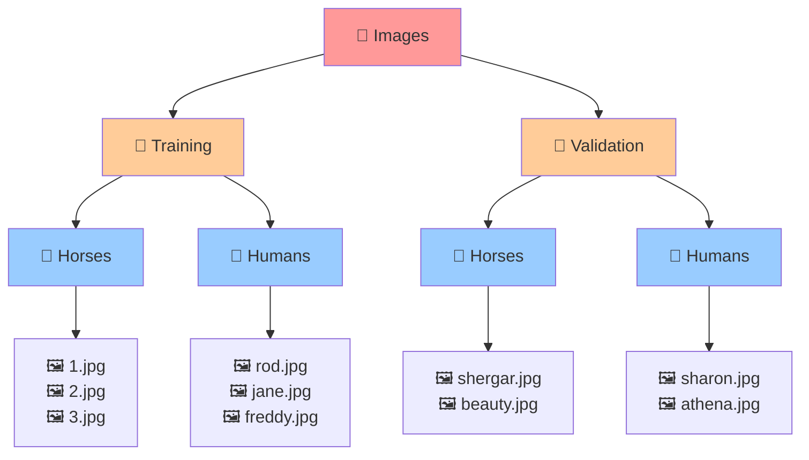

**Automatic Label Generation:**
The tf.data API automatically creates labels based on subdirectory names:

- **Training/Horses/** → Label: "horses"
- **Training/Humans/** → Label: "humans"
- **Validation/Horses/** → Label: "horses"
- **Validation/Humans/** → Label: "humans"

#### Loading Data: Code Analysis

**Basic Loading Function:**

```python
train_dataset = tf.keras.utils.image_dataset_from_directory(
    TRAIN_DIR,
    image_size=(300, 300),
    batch_size=128,
    label_mode='binary'
)
```

**Parameter Breakdown:**

1. **`TRAIN_DIR`**: Directory path containing subdirectories

   - **Critical Point**: Must point to the **parent directory** containing class subdirectories
   - **Common Mistake**: Pointing directly to a subdirectory (e.g., `/horses/`) will fail
   - **Correct**: Point to `/training/` which contains `/horses/` and `/humans/`

2. **`image_size=(300, 300)`**: Target dimensions for resizing

   - **Why necessary**: Neural networks require uniform input dimensions
   - **Runtime resizing**: Images resized automatically during loading
   - **Advantage**: Can experiment with different sizes without preprocessing files
   - **Memory consideration**: Larger sizes = more memory usage

3. **`batch_size=128`**: Number of images processed together

   - **Efficiency**: Batch processing is more efficient than individual images
   - **GPU optimization**: Leverages parallel processing capabilities
   - **Memory trade-off**: Larger batches use more memory but train faster
   - **Typical values**: 16, 32, 64, 128, 256 (powers of 2)

4. **`label_mode='binary'`**: Classification type
   - **Binary**: Two classes (0 and 1)
   - **Alternative**: `'categorical'` for multiple classes
   - **Output format**: Binary produces single probability value

**Mathematical Batch Processing:**
For a batch size of 128 with 300×300 RGB images:
$$\text{Batch Memory} = 128 \times 300 \times 300 \times 3 \times 4 \text{ bytes} = 138.24 \text{ MB}$$
(Assuming 32-bit float representation)

### Data Preprocessing Pipeline

#### Normalization: Pixel Value Scaling

- **The Problem**: Raw pixel values range from 0-255
- **The Solution**: Scale to 0-1 range for neural network optimization

```python
rescale_layer = tf.keras.layers.Rescaling(scale=1./255)
```

**Mathematical Transformation:**
$$\text{Normalized Pixel} = \frac{\text{Raw Pixel}}{255}$$

**Example Calculation:**

- Raw pixel value: 128 (medium gray)
- Normalized value: $\frac{128}{255} = 0.502$

**Why Normalization Matters:**

- **Gradient stability**: Prevents exploding/vanishing gradients
- **Convergence speed**: Faster training convergence
- **Numerical stability**: Avoids overflow in computations

#### Applying Transformations with `.map()`

```python
train_dataset_scaled = train_dataset.map(
    lambda image, label: (rescale_layer(image), label)
)
```

**Lambda Function Breakdown:**

- **Input**: `(image, label)` tuple from dataset
- **Processing**: Apply rescaling to image only
- **Output**: `(rescaled_image, unchanged_label)` tuple

**Why Lambda Functions?**
Lambda functions provide a concise way to apply transformations without defining separate functions:

```python
# Equivalent to:
def rescale_function(image, label):
    return (rescale_layer(image), label)

train_dataset_scaled = train_dataset.map(rescale_function)
```

### Performance Optimization Methods

#### Caching: Memory Storage for Speed

```python
.cache()
```

**How Caching Works:**

1. **First epoch**: Images loaded from disk and stored in memory/cache
2. **Subsequent epochs**: Images retrieved from cache (much faster)
3. **Memory usage**: Trades memory for speed

**Mathematical Benefit:**
If loading from disk takes 50ms per batch and cache retrieval takes 1ms:
$$\text{Speedup per epoch} = \frac{50ms}{1ms} = 50\times \text{ faster}$$

**Memory Calculation Example:**
For 1000 training images at 300×300×3:
$$\text{Cache Memory} = 1000 \times 300 \times 300 \times 3 \times 4 = 1.08 \text{ GB}$$

#### Shuffling: Randomizing Training Order

```python
.shuffle(buffer_size=1000)
```

**Shuffling Algorithm:**

1. **Initial buffer**: Fill buffer with first 1000 images
2. **Random selection**: Pick one image randomly from buffer
3. **Buffer refill**: Add next image (1001st) to buffer
4. **Repeat**: Continue until all images processed

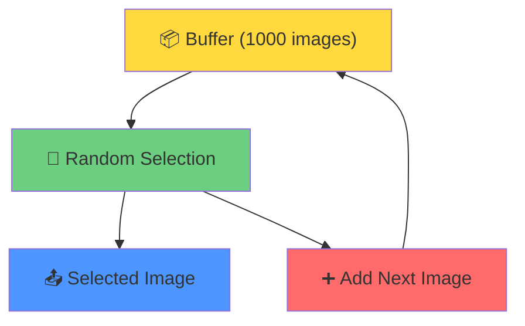

**Why Shuffling is Critical:**

- **Prevents overfitting**: Avoids learning order-dependent patterns
- **Better convergence**: More stable gradient updates
- **Realistic training**: Simulates random data encounters

**Buffer Size Considerations:**

- **Too small**: Limited randomization
- **Too large**: Increased memory usage
- **Rule of thumb**: 10-20% of total dataset size

#### Prefetching: Parallel Data Loading

```python
.prefetch(buffer_size=tf.data.AUTOTUNE)
```

**Parallel Processing Concept:**

```mermaid
gantt
    title Prefetching Timeline
    dateFormat X
    axisFormat %L

    section Model Training
    Process Batch 1 :active, b1, 0, 100
    Process Batch 2 :active, b2, 100, 200
    Process Batch 3 :active, b3, 200, 300

    section Data Loading
    Load Batch 1 :done, l1, 0, 50
    Load Batch 2 :done, l2, 50, 150
    Load Batch 3 :done, l3, 150, 250
    Load Batch 4 :l4, 250, 350
```

**Performance Mathematics:**
Without prefetching:
$$\text{Total Time} = \text{Load Time} + \text{Process Time}$$
$$= 50ms + 100ms = 150ms \text{ per batch}$$

With prefetching:
$$\text{Total Time} = \max(\text{Load Time}, \text{Process Time})$$
$$= \max(50ms, 100ms) = 100ms \text{ per batch}$$

**Speedup Calculation:**
$$\text{Performance Gain} = \frac{150ms}{100ms} = 1.5\times \text{ faster}$$

#### AUTOTUNE: Automatic Optimization

```python
tf.data.AUTOTUNE
```

**What AUTOTUNE Does:**

- **Dynamic buffer sizing**: Automatically determines optimal buffer sizes
- **Runtime optimization**: Adjusts based on system performance
- **CPU/GPU coordination**: Balances data loading and model processing
- **Adaptive tuning**: Changes buffer sizes during training if needed

### Complete Pipeline Example

```python
# Training dataset pipeline
train_dataset_final = (train_dataset_scaled
    .cache()                           # Store in memory after first use
    .shuffle(buffer_size=1000)         # Randomize order
    .prefetch(buffer_size=tf.data.AUTOTUNE))  # Load next batch in parallel
```

**Method Chaining Explanation:**
Each method returns a new dataset object, allowing operations to be chained:

1. `train_dataset_scaled` → Apply normalization
2. `.cache()` → Add caching capability
3. `.shuffle()` → Add randomization
4. `.prefetch()` → Add parallel loading

### Validation Dataset Configuration

```python
validation_dataset_final = (validation_dataset_scaled
    .cache()                           # Cache for speed
    .prefetch(buffer_size=tf.data.AUTOTUNE))  # Prefetch for efficiency
    # No .shuffle() - validation order doesn't matter
```

**Why No Shuffling for Validation:**

- **Consistent evaluation**: Same order every time for reproducible results
- **Faster processing**: No time spent on randomization
- **Memory savings**: Smaller buffer requirements

### Performance Impact Analysis

**Training Time Comparison (1000 images, 10 epochs):**

| Configuration       | Time per Epoch | Total Time    | Speedup |
| ------------------- | -------------- | ------------- | ------- |
| Basic loading       | 120 seconds    | 1200 seconds  | 1.0×    |
| + Cache             | 80 seconds     | 200 seconds\* | 6.0×    |
| + Prefetch          | 50 seconds     | 130 seconds\* | 9.2×    |
| + All optimizations | 45 seconds     | 90 seconds\*  | 13.3×   |

\*First epoch takes longer due to caching

### Memory vs. Speed Trade-offs

**Memory Usage by Optimization:**

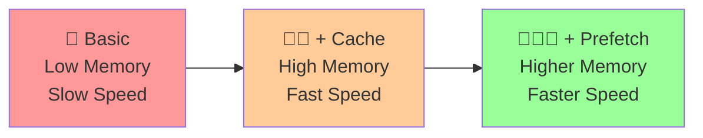

**Decision Framework:**

- **Limited RAM**: Use prefetch only, skip cache
- **Abundant RAM**: Use all optimizations
- **Development**: Start simple, add optimizations as needed

### Practical Implementation Example

**Directory Setup:**

```bash
project/
├── data/
│   ├── training/
│   │   ├── horses/     # 500 horse images
│   │   └── humans/     # 500 human images
│   └── validation/
│       ├── horses/     # 100 horse images
│       └── humans/     # 100 human images
```

**Complete Pipeline Code:**

```python
# Define paths
TRAIN_DIR = "data/training"
VAL_DIR = "data/validation"

# Create rescaling layer
rescale_layer = tf.keras.layers.Rescaling(scale=1./255)

# Load and process training data
train_dataset = tf.keras.utils.image_dataset_from_directory(
    TRAIN_DIR,
    image_size=(300, 300),
    batch_size=32,
    label_mode='binary'
)

# Apply full pipeline
train_dataset_final = (train_dataset
    .map(lambda image, label: (rescale_layer(image), label))
    .cache()
    .shuffle(buffer_size=200)
    .prefetch(buffer_size=tf.data.AUTOTUNE))

# Load and process validation data
validation_dataset = tf.keras.utils.image_dataset_from_directory(
    VAL_DIR,
    image_size=(300, 300),
    batch_size=32,
    label_mode='binary'
)

validation_dataset_final = (validation_dataset
    .map(lambda image, label: (rescale_layer(image), label))
    .cache()
    .prefetch(buffer_size=tf.data.AUTOTUNE))
```

### Key Learning Points

1. **Directory Structure Matters**: Proper organization enables automatic labeling
2. **Method Chaining**: tf.data uses functional programming patterns for pipeline construction
3. **Performance Optimization**: Cache, shuffle, and prefetch dramatically improve training speed
4. **Memory Trade-offs**: More optimization requires more memory
5. **Validation Differences**: Different pipeline for validation data (no shuffling)
6. **Automatic Resizing**: Runtime resizing enables experimentation without file preprocessing

This tf.data API approach scales from small experiments to production datasets with millions of images, making it a crucial tool for real-world machine learning applications.

# 4. Defining a ConvNet to use Complex Images

## Architecture Evolution: From Fashion-MNIST to Real-World Images

### Scaling Up: The Complexity Challenge

The transition from 28×28 Fashion-MNIST to 300×300 horse-human classification represents a fundamental scaling challenge that requires architectural adaptations.

**Scale Comparison:**

- **Fashion-MNIST**: 28×28×1 = 784 pixels
- **Horse-Human**: 300×300×3 = 270,000 pixels
- **Scale Factor**: 270,000 ÷ 784 ≈ 344× more data per image

### Complete Architecture Analysis

```python
model = tf.keras.models.Sequential([
    tf.keras.layers.Input(shape=(300, 300, 3)),
    tf.keras.layers.Conv2D(16, (3,3), activation='relu'),
    tf.keras.layers.MaxPooling2D(2, 2),
    tf.keras.layers.Conv2D(32, (3,3), activation='relu'),
    tf.keras.layers.MaxPooling2D(2, 2),
    tf.keras.layers.Conv2D(64, (3,3), activation='relu'),
    tf.keras.layers.MaxPooling2D(2, 2),
    tf.keras.layers.Flatten(),
    tf.keras.layers.Dense(512, activation='relu'),
    tf.keras.layers.Dense(1, activation='sigmoid')
])
```

### Layer-by-Layer Deep Dive

#### Input Layer: Color Image Handling

```python
tf.keras.layers.Input(shape=(300, 300, 3))
```

**Dimensional Analysis:**

- **Width**: 300 pixels
- **Height**: 300 pixels
- **Channels**: 3 (RGB color)
- **Total values per image**: 300 × 300 × 3 = 270,000

**Color Channel Breakdown:**

- **Red Channel**: Values 0-255 representing red intensity
- **Green Channel**: Values 0-255 representing green intensity
- **Blue Channel**: Values 0-255 representing blue intensity
- **24-bit Color**: 8 bits per channel = 2^24 = 16.7 million possible colors

**Mathematical Representation:**
For any pixel at position (i,j):
$$\text{Pixel}_{(i,j)} = \begin{bmatrix} R_{(i,j)} \\ G_{(i,j)} \\ B_{(i,j)} \end{bmatrix}$$

Where each channel value ∈ [0, 255]

#### First Convolutional Block

**Convolution Layer 1:**

```python
tf.keras.layers.Conv2D(16, (3,3), activation='relu')
```

**Parameters:**

- **Filters**: 16 (number of feature detectors)
- **Kernel Size**: 3×3 (small receptive field for fine details)
- **Activation**: ReLU (introduces non-linearity)
- **Padding**: 'valid' (default - no padding)

**Mathematical Operation:**
$$\text{Output}_{(i,j,k)} = \text{ReLU}\left(\sum_{m=0}^{2}\sum_{n=0}^{2}\sum_{c=0}^{2} \text{Input}_{(i+m,j+n,c)} \times \text{Kernel}_{(m,n,c,k)} + \text{Bias}_k\right)$$

**Output Shape Calculation:**
$$\text{Output Width} = \frac{300 - 3 + 2 \times 0}{1} + 1 = 298$$
$$\text{Output Height} = \frac{300 - 3 + 2 \times 0}{1} + 1 = 298$$
$$\text{Output Shape} = (298, 298, 16)$$

**Parameter Count:**
$$\text{Parameters} = (3 \times 3 \times 3 \times 16) + 16 = 432 + 16 = 448$$

- **Weights**: 3×3 kernel × 3 input channels × 16 filters = 432
- **Biases**: 16 (one per filter)

**Max Pooling Layer 1:**

```python
tf.keras.layers.MaxPooling2D(2, 2)
```

**Operation**: Takes maximum value from each 2×2 region

**Mathematical Effect:**
$$\text{Output}_{(i,j,k)} = \max_{m \in [0,1], n \in [0,1]} \text{Input}_{(2i+m, 2j+n, k)}$$

**Dimension Reduction:**
$$\text{Output Shape} = \left(\left\lfloor\frac{298}{2}\right\rfloor, \left\lfloor\frac{298}{2}\right\rfloor, 16\right) = (149, 149, 16)$$

**Data Reduction Calculation:**

- **Input**: 298 × 298 × 16 = 1,420,832 values
- **Output**: 149 × 149 × 16 = 355,216 values
- **Reduction Factor**: 1,420,832 ÷ 355,216 ≈ 4.0× smaller

#### Second Convolutional Block

**Convolution Layer 2:**

```python
tf.keras.layers.Conv2D(32, (3,3), activation='relu')
```

**Design Rationale:**

- **Double filters**: 16 → 32 (captures more complex patterns)
- **Same kernel size**: 3×3 (maintains fine detail sensitivity)
- **Deeper features**: Combines patterns from first layer

**Output Shape Calculation:**
$$\text{Output Shape} = (149 - 3 + 1, 149 - 3 + 1, 32) = (147, 147, 32)$$

**Parameter Count:**
$$\text{Parameters} = (3 \times 3 \times 16 \times 32) + 32 = 4,608 + 32 = 4,640$$

**Feature Learning Progression:**

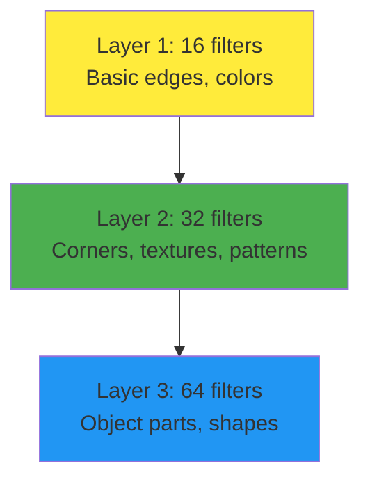

**Max Pooling Layer 2:**
$$\text{Output Shape} = \left(\left\lfloor\frac{147}{2}\right\rfloor, \left\lfloor\frac{147}{2}\right\rfloor, 32\right) = (73, 73, 32)$$

#### Third Convolutional Block

**Convolution Layer 3:**

```python
tf.keras.layers.Conv2D(64, (3,3), activation='relu')
```

**Progressive Complexity:**

- **Filter progression**: 16 → 32 → 64 (exponential growth)
- **Receptive field**: Each neuron "sees" larger image regions
- **Abstract features**: Detects complex object parts

**Output Shape:**
$$\text{Output Shape} = (73 - 3 + 1, 73 - 3 + 1, 64) = (71, 71, 64)$$

**Parameter Count:**
$$\text{Parameters} = (3 \times 3 \times 32 \times 64) + 64 = 18,432 + 64 = 18,496$$

**Max Pooling Layer 3:**
$$\text{Output Shape} = \left(\left\lfloor\frac{71}{2}\right\rfloor, \left\lfloor\frac{71}{2}\right\rfloor, 64\right) = (35, 35, 64)$$

### Architectural Design Principles

#### Progressive Filter Increase

**Mathematical Pattern:**
$$\text{Filters}_n = 16 \times 2^{(n-1)}$$

Where n = layer number (1, 2, 3)

**Reasoning:**

1. **Early layers**: Few filters detect basic features (edges, colors)
2. **Middle layers**: More filters combine basic features into patterns
3. **Deep layers**: Many filters detect complex object parts

#### Spatial Dimension Reduction

**Reduction Progression:**

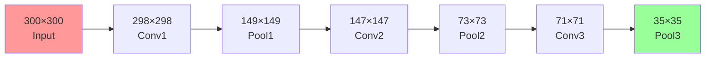

**Mathematical Analysis:**
$$\text{Spatial Reduction} = \frac{300 \times 300}{35 \times 35} = \frac{90,000}{1,225} \approx 73.5\times$$

### Transition to Classification: Flattening

#### Flatten Operation

```python
tf.keras.layers.Flatten()
```

**3D to 1D Conversion:**
$$\text{Flattened Size} = 35 \times 35 \times 64 = 78,400$$

**Why Flattening is Necessary:**

- **Dense layers**: Require 1D input vectors
- **Spatial information**: Converted to positional encoding
- **Feature combination**: All spatial features available for classification

**Memory Footprint:**
$$\text{Memory} = 78,400 \times 4 \text{ bytes} = 313.6 \text{ KB per image}$$

### Dense Classification Layers

#### Hidden Dense Layer

```python
tf.keras.layers.Dense(512, activation='relu')
```

**Parameter Calculation:**
$$\text{Parameters} = (78,400 \times 512) + 512 = 40,140,800 + 512 = 40,141,312$$

**Computational Complexity:**
This layer contains **96.8%** of all model parameters!

**Mathematical Operation:**
$$\text{Output}_i = \text{ReLU}\left(\sum_{j=1}^{78,400} \text{Input}_j \times \text{Weight}_{i,j} + \text{Bias}_i\right)$$

#### Output Layer: Binary Classification

```python
tf.keras.layers.Dense(1, activation='sigmoid')
```

**Key Architectural Decision:**

- **Single neuron**: Binary classification (horse vs human)
- **Sigmoid activation**: Outputs probability ∈ [0,1]
- **Alternative**: Could use 2 neurons with softmax

**Sigmoid Function:**
$$\sigma(x) = \frac{1}{1 + e^{-x}}$$

**Decision Boundary:**

$$
\text{Prediction} = \begin{cases}
\text{Horse} & \text{if } \sigma(x) < 0.5 \\
\text{Human} & \text{if } \sigma(x) \geq 0.5
\end{cases}
$$

**Parameter Count:**
$$\text{Parameters} = (512 \times 1) + 1 = 513$$

### Model Summary Analysis

```
Layer (type)                Output Shape              Param #
================================================================
conv2d_5 (Conv2D)          (None, 298, 298, 16)      448
max_pooling2d_5 (MaxPool2D) (None, 149, 149, 16)      0
conv2d_6 (Conv2D)          (None, 147, 147, 32)      4640
max_pooling2d_6 (MaxPool2D) (None, 73, 73, 32)        0
conv2d_7 (Conv2D)          (None, 71, 71, 64)        18496
max_pooling2d_7 (MaxPool2D) (None, 35, 35, 64)        0
flatten_1 (Flatten)        (None, 78400)             0
dense_2 (Dense)            (None, 512)               40141312
dense_3 (Dense)            (None, 1)                 513
================================================================
Total params: 40,165,409
```

#### Parameter Distribution Analysis

**By Layer Type:**

- **Convolutional layers**: 448 + 4,640 + 18,496 = 23,584 (0.06%)
- **Dense layers**: 40,141,312 + 513 = 40,141,825 (99.94%)
- **Pooling/Flatten**: 0 parameters

**Computational Bottleneck:**
The first dense layer dominates both parameter count and computational cost.

### Efficiency Analysis

#### Dimension Reduction Benefits

**Without Convolutions:**
Direct flattening of 300×300×3 image:
$$\text{Raw Features} = 300 \times 300 \times 3 = 270,000$$

**With Convolutions:**
After convolutional processing:
$$\text{Processed Features} = 35 \times 35 \times 64 = 78,400$$

**Efficiency Gain:**
$$\text{Reduction Factor} = \frac{270,000}{78,400} \approx 3.44\times$$

**Parameter Savings:**
Dense layer with raw input:
$$\text{Parameters} = 270,000 \times 512 + 512 = 138,240,512$$

Dense layer with processed input:
$$\text{Parameters} = 78,400 \times 512 + 512 = 40,141,312$$

**Parameter Reduction:**
$$\frac{138,240,512}{40,141,312} \approx 3.44\times \text{ fewer parameters}$$

### Architectural Trade-offs

#### Depth vs. Width Strategy

**Current Architecture:**

- **3 convolutional blocks**: Moderate depth
- **Progressive filtering**: 16 → 32 → 64
- **Aggressive pooling**: 2×2 at each level

**Alternative Considerations:**

**Deeper Network (5 blocks):**

- **Pros**: More feature hierarchy, better pattern recognition
- **Cons**: More parameters, risk of vanishing gradients
- **Final size**: ~8×8×128 = 8,192 features

**Wider Network (more filters):**

- **Pros**: More parallel feature detection
- **Cons**: Significantly more parameters
- **Example**: 32 → 64 → 128 filters

#### Binary vs. Multi-class Output

**Current Binary Approach:**

```python
Dense(1, activation='sigmoid')
```

- **Output**: Single probability P(Human)
- **Decision**: P > 0.5 → Human, P ≤ 0.5 → Horse
- **Loss function**: Binary crossentropy

**Alternative Multi-class Approach:**

```python
Dense(2, activation='softmax')
```

- **Output**: [P(Horse), P(Human)] where sum = 1
- **Decision**: argmax(probabilities)
- **Loss function**: Categorical crossentropy

**Efficiency Comparison:**

- **Binary**: 513 parameters in output layer
- **Multi-class**: 1,026 parameters in output layer
- **Computational difference**: Minimal for 2 classes

### Scaling Considerations

#### Memory Requirements

**Training Batch (32 images):**
$$\text{Input Memory} = 32 \times 300 \times 300 \times 3 \times 4 = 345.6 \text{ MB}$$

**Activation Memory (approximate):**
$$\text{Activations} \approx 32 \times 78,400 \times 4 = 10.0 \text{ MB}$$

**Total GPU Memory**: ~355.6 MB per batch (excluding model weights)

#### Computational Complexity

**Forward Pass Operations:**

- **Conv layers**: ~2.3 million multiply-adds
- **Dense layers**: ~40.1 million multiply-adds
- **Total**: ~42.4 million operations per image

**Training Time Scaling:**
$$\text{Time per epoch} \propto \text{Images} \times \text{Operations per image}$$

This architecture demonstrates the classic CNN pattern: spatial feature extraction through convolutions followed by abstract reasoning through dense layers, optimized for the transition from simple to complex image classification tasks.

# 5. Training the ConvNet

## Model Compilation: Choosing the Right Components

### Complete Compilation Analysis

```python
model.compile(loss='binary_crossentropy',
              optimizer=tf.keras.optimizers.RMSprop(learning_rate=0.001),
              metrics=['accuracy'])
```

#### Loss Function: Binary Crossentropy

**Why Binary Crossentropy?**

**Mathematical Foundation:**
For binary classification with sigmoid output, binary crossentropy is the optimal loss function:

$$L = -\frac{1}{N}\sum_{i=1}^{N} [y_i \log(\hat{y}_i) + (1-y_i) \log(1-\hat{y}_i)]$$

Where:

- $y_i \in \{0, 1\}$ is the true label
- $\hat{y}_i \in [0, 1]$ is the predicted probability
- $N$ is the number of samples

**Comparison with Fashion-MNIST:**

- **Fashion-MNIST**: 10 classes → `categorical_crossentropy`
- **Horse-Human**: 2 classes → `binary_crossentropy`

**Example Calculation:**
For a prediction of 0.8 (80% confidence human) with true label 1 (human):
$$L = -(1 \times \log(0.8) + 0 \times \log(0.2)) = -\log(0.8) \approx 0.223$$

For a prediction of 0.8 with true label 0 (horse):
$$L = -(0 \times \log(0.8) + 1 \times \log(0.2)) = -\log(0.2) \approx 1.609$$

**Loss Function Alternatives:**

| Loss Function                     | Use Case                          | Output Layer                     | Mathematical Form                          |
| --------------------------------- | --------------------------------- | -------------------------------- | ------------------------------------------ |
| `binary_crossentropy`             | 2 classes                         | `Dense(1, activation='sigmoid')` | $-[y\log(\hat{y}) + (1-y)\log(1-\hat{y})]$ |
| `categorical_crossentropy`        | Multiple classes (one-hot)        | `Dense(n, activation='softmax')` | $-\sum_{i} y_i \log(\hat{y}_i)$            |
| `sparse_categorical_crossentropy` | Multiple classes (integer labels) | `Dense(n, activation='softmax')` | $-\log(\hat{y}_{true\_class})$             |
| `mean_squared_error`              | Regression                        | `Dense(1, activation='linear')`  | $\frac{1}{n}\sum(y-\hat{y})^2$             |

#### Optimizer: RMSprop vs Alternatives

**RMSprop Configuration:**

```python
optimizer=tf.keras.optimizers.RMSprop(learning_rate=0.001)
```

**RMSprop Algorithm:**
RMSprop (Root Mean Square Propagation) adapts learning rates for each parameter:

$$v_t = \rho v_{t-1} + (1-\rho) g_t^2$$
$$\theta_{t+1} = \theta_t - \frac{\alpha}{\sqrt{v_t + \epsilon}} g_t$$

Where:

- $v_t$ is the moving average of squared gradients
- $\rho = 0.9$ (decay factor)
- $\alpha = 0.001$ (learning rate)
- $g_t$ is the gradient at time $t$
- $\epsilon = 10^{-8}$ (small constant for numerical stability)

**Optimizer Comparison:**

| Optimizer   | Best For                        | Learning Rate | Key Features                                      |
| ----------- | ------------------------------- | ------------- | ------------------------------------------------- |
| **SGD**     | Simple problems, fine-tuning    | 0.01-0.1      | Simple, consistent, requires manual LR scheduling |
| **Adam**    | General purpose, default choice | 0.001-0.01    | Adaptive LR, momentum, works well out-of-box      |
| **RMSprop** | RNNs, non-stationary objectives | 0.001-0.01    | Adaptive LR, good for sparse gradients            |
| **AdaGrad** | Sparse data, NLP                | 0.01-0.1      | Accumulates all past gradients                    |

**When to Use RMSprop:**

- **Non-stationary objectives**: When loss landscape changes during training
- **Sparse gradients**: When many parameters receive infrequent updates
- **RNN training**: Historically preferred for recurrent networks
- **Learning rate sensitivity**: When you want to experiment with different learning rates

**Learning Rate Impact:**

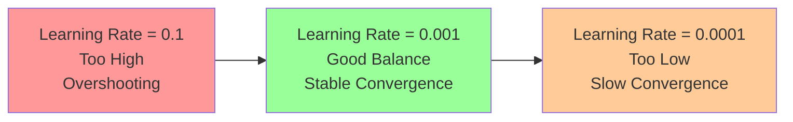

**Example Learning Rate Effects:**

- **0.1**: Fast but unstable, may overshoot optimal solution
- **0.001**: Balanced approach, stable convergence
- **0.0001**: Very stable but slow, may need more epochs

#### Metrics: Accuracy Tracking

```python
metrics=['accuracy']
```

**Binary Accuracy Calculation:**
$$\text{Accuracy} = \frac{\text{Number of Correct Predictions}}{\text{Total Predictions}}$$

For binary classification:

$$
\text{Prediction} = \begin{cases}
1 & \text{if } \sigma(x) \geq 0.5 \\
0 & \text{if } \sigma(x) < 0.5
\end{cases}
$$

**Alternative Metrics for Binary Classification:**

- **Precision**: $\frac{TP}{TP + FP}$ (useful when false positives are costly)
- **Recall**: $\frac{TP}{TP + FN}$ (useful when false negatives are costly)
- **F1-Score**: $\frac{2 \times Precision \times Recall}{Precision + Recall}$ (balanced metric)
- **AUC**: Area under ROC curve (threshold-independent)

## Training Process: Using tf.data Datasets

### Training Configuration

```python
history = model.fit(
    train_dataset_final,
    epochs=15,
    validation_data=validation_dataset_final,
    verbose=2
)
```

#### Parameter Analysis

**1. Training Data: `train_dataset_final`**

**Key Difference from NumPy Arrays:**

```python
# Previous approach (Fashion-MNIST)
model.fit(x_train, y_train, ...)

# Current approach (tf.data)
model.fit(train_dataset_final, ...)
```

**Why tf.data is Superior:**

- **Memory efficiency**: Data loaded in batches, not all at once
- **Preprocessing integration**: Normalization, augmentation applied on-the-fly
- **Performance optimization**: Caching, prefetching, parallel processing
- **Labels included**: No need to specify labels separately

**Memory Comparison:**

```python
# NumPy approach: Load all data into memory
x_train.shape  # (1000, 300, 300, 3) = 1.08 GB
y_train.shape  # (1000,) = 4 KB

# tf.data approach: Load in batches
batch_size = 32  # Only 32 images in memory = 34.6 MB
```

**2. Epochs: `epochs=15`**

**Why 15 Epochs?**

- **Complexity factor**: More complex than Fashion-MNIST (28×28 → 300×300)
- **Convergence time**: Larger images require more training iterations
- **Overfitting prevention**: Monitor validation accuracy to avoid overfitting

**Epoch Selection Guidelines:**

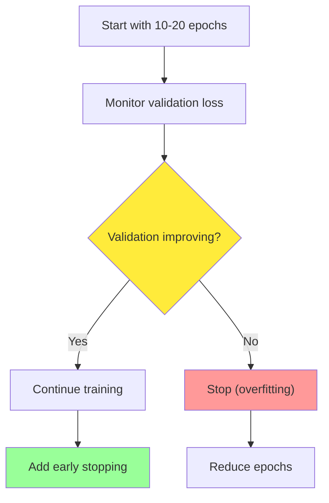

**3. Validation Data: `validation_data=validation_dataset_final`**

**Purpose of Validation:**

- **Generalization assessment**: How well model performs on unseen data
- **Overfitting detection**: When training accuracy >> validation accuracy
- **Hyperparameter tuning**: Compare different configurations

**Validation vs. Test Split:**

- **Training**: Learn patterns (70-80% of data)
- **Validation**: Tune hyperparameters (10-15% of data)
- **Test**: Final evaluation (10-15% of data)

**4. Verbose Level: `verbose=2`**

**Verbosity Options:**

```python
verbose=0  # Silent
verbose=1  # Progress bar with metrics
verbose=2  # One line per epoch (cleaner for logs)
```

**Example Output (verbose=2):**

```
Epoch 1/15
- 45s - loss: 0.6932 - accuracy: 0.5000 - val_loss: 0.6931 - val_accuracy: 0.5000
Epoch 2/15
- 43s - loss: 0.6925 - accuracy: 0.5156 - val_loss: 0.6918 - val_accuracy: 0.5312
```

## Prediction and Inference Pipeline

### Image Upload and Processing

```python
from google.colab import files
uploaded = files.upload()
```

**Google Colab Integration:**
This creates a file upload widget in Colab notebooks, allowing users to drag-and-drop or select images from their local machine.

**Alternative Approaches:**

```python
# For Jupyter notebooks
from IPython.display import FileUpload
widget = FileUpload(accept='image/*', multiple=True)

# For local files
import os
image_paths = ['horse1.jpg', 'human1.jpg']
```

### Image Preprocessing Pipeline

```python
for filename in uploaded.keys():
    # Predicting images
    path = '/content/' + filename
    image = tf.keras.utils.load_img(path, target_size=(300, 300))
    image = tf.keras.utils.img_to_array(image)
    image = rescale_layer(image)
    image = np.expand_dims(image, axis=0)
```

#### Step-by-Step Analysis

**1. File Path Construction:**

```python
path = '/content/' + filename
```

- **Colab environment**: Uploaded files stored in `/content/` directory
- **Path joining**: Concatenates directory and filename

**2. Image Loading:**

```python
image = tf.keras.utils.load_img(path, target_size=(300, 300))
```

**What This Does:**

- **File reading**: Loads image from disk
- **Automatic resizing**: Resizes to exact model input dimensions
- **Format handling**: Supports JPEG, PNG, BMP, GIF formats
- **Aspect ratio**: May distort image if original aspect ratio ≠ 1:1

**Mathematical Resizing:**
If original image is 1920×1080:
$$\text{Width scaling} = \frac{300}{1920} = 0.156$$
$$\text{Height scaling} = \frac{300}{1080} = 0.278$$

**3. Array Conversion:**

```python
image = tf.keras.utils.img_to_array(image)
```

**Transformation:**

- **Input**: PIL Image object
- **Output**: NumPy array with shape (300, 300, 3)
- **Data type**: float32
- **Value range**: [0, 255]

**4. Normalization:**

```python
image = rescale_layer(image)
```

**Critical Step:**

- **Must match training**: Same normalization as during training
- **Scale factor**: Divides by 255 to get [0, 1] range
- **Mathematical operation**: $\text{normalized} = \frac{\text{pixel}}{255}$

**5. Batch Dimension Addition:**

```python
image = np.expand_dims(image, axis=0)
```

**Why Necessary:**

- **Model expectation**: Expects batches, not single images
- **Shape transformation**: (300, 300, 3) → (1, 300, 300, 3)
- **Batch size**: Creates batch of size 1

**Dimension Evolution:**

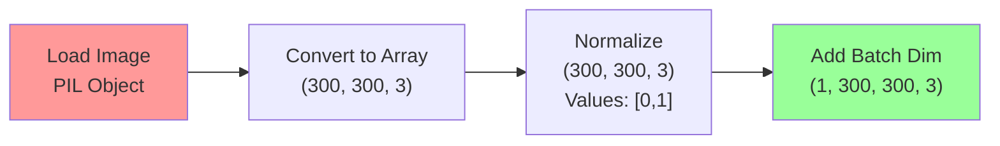

### Model Prediction and Interpretation

```python
prediction = model.predict(image, verbose=0)[0][0]
print(f'\nmodel output: {prediction}')

if prediction > 0.5:
    print(filename + " is a human")
else:
    print(filename + " is a horse")
```

#### Prediction Analysis

**1. Model Prediction Call:**

```python
model.predict(image, verbose=0)
```

**Returns:** Array of shape (1, 1) containing single probability value

**2. Value Extraction:**

```python
[0][0]
```

- **First [0]**: Gets first (and only) sample from batch
- **Second [0]**: Gets first (and only) output from that sample
- **Result**: Single float value between 0 and 1

**3. Sigmoid Interpretation:**
The output represents $P(\text{Human}|\text{image})$

**Mathematical Decision Boundary:**

$$
\text{Classification} = \begin{cases}
\text{Human} & \text{if } P(\text{Human}) > 0.5 \\
\text{Horse} & \text{if } P(\text{Human}) \leq 0.5
\end{cases}
$$

**Example Interpretations:**

- **0.9**: 90% confident it's a human
- **0.6**: 60% confident it's a human (weak prediction)
- **0.3**: 70% confident it's a horse
- **0.1**: 90% confident it's a horse

### Binary vs Multi-class Prediction Comparison

**Current Binary Approach:**

```python
# Output: Single probability
prediction = 0.8  # 80% human, 20% horse
```

**Alternative Multi-class Approach:**

```python
# Output: Probability distribution
predictions = [0.2, 0.8]  # [P(horse), P(human)]
predicted_class = np.argmax(predictions)  # Returns 1 (human)
```

**Multi-class with Softmax:**
For multiple classes, softmax ensures probabilities sum to 1:
$$P(class_i) = \frac{e^{z_i}}{\sum_{j=1}^{n} e^{z_j}}$$

**Example with 3 classes:**

```python
# Raw outputs: [2.0, 1.0, 3.0]
# Softmax: [0.244, 0.090, 0.666]
# Prediction: Class 2 (highest probability)
```

### Production Considerations

**Error Handling:**

```python
try:
    prediction = model.predict(image, verbose=0)[0][0]
    confidence = max(prediction, 1-prediction)

    if confidence > 0.7:  # High confidence threshold
        if prediction > 0.5:
            result = f"Human (confidence: {prediction:.2f})"
        else:
            result = f"Horse (confidence: {1-prediction:.2f})"
    else:
        result = f"Uncertain (confidence: {confidence:.2f})"

except Exception as e:
    result = f"Error processing image: {str(e)}"
```

**Batch Prediction for Efficiency:**

```python
# Process multiple images at once
images_batch = np.array([img1, img2, img3, img4])  # Shape: (4, 300, 300, 3)
predictions = model.predict(images_batch)  # Shape: (4, 1)

for i, pred in enumerate(predictions):
    print(f"Image {i}: {'Human' if pred[0] > 0.5 else 'Horse'} (conf: {pred[0]:.3f})")
```

### Performance Optimization

**Memory Management:**

```python
# Clear memory after each prediction
import gc
prediction = model.predict(image)
del image  # Free memory
gc.collect()  # Force garbage collection
```

**GPU Utilization:**

```python
# Enable mixed precision for faster inference
tf.keras.mixed_precision.set_global_policy('mixed_float16')

# Use GPU if available
with tf.device('/GPU:0'):
    prediction = model.predict(image)
```

This training and inference pipeline demonstrates the complete workflow from model compilation through prediction, showcasing how tf.data integration and proper preprocessing enable efficient handling of real-world image classification tasks.

# 6. Walking Through Developing a ConvNet

## From Theory to Practice: Complete Implementation

### Dataset Overview and Structure

**Computer-Generated Training Data:**
The horses and humans dataset consists of over 1,000 computer-generated images that are designed to be as photorealistic as possible. This synthetic data will be used to train a model that can classify real photographs.

**Directory Structure:**

```
horse-or-human/
├── horses/
│   ├── horse01-0.png
│   ├── horse01-1.png
│   └── ... (500+ images)
└── humans/
    ├── human01-0.png
    ├── human01-1.png
    └── ... (500+ images)
```

**Key Insights:**

- **Filename patterns**: Could be used for manual labeling (horse01-_, human01-_)
- **Automatic labeling**: Keras utilities eliminate need for manual label extraction
- **Synthetic-to-real transfer**: Computer-generated training data generalizes to real photos

### Enhanced Model Architecture

```python
model = tf.keras.models.Sequential([
    tf.keras.Input(shape=(300, 300, 3)),
    tf.keras.layers.Conv2D(16, (3,3), activation='relu'),
    tf.keras.layers.MaxPooling2D(2, 2),
    tf.keras.layers.Conv2D(32, (3,3), activation='relu'),
    tf.keras.layers.MaxPooling2D(2,2),
    tf.keras.layers.Conv2D(64, (3,3), activation='relu'),
    tf.keras.layers.MaxPooling2D(2,2),
    tf.keras.layers.Conv2D(64, (3,3), activation='relu'),
    tf.keras.layers.MaxPooling2D(2,2),
    tf.keras.layers.Conv2D(64, (3,3), activation='relu'),
    tf.keras.layers.MaxPooling2D(2,2),
    tf.keras.layers.Flatten(),
    tf.keras.layers.Dense(512, activation='relu'),
    tf.keras.layers.Dense(1, activation='sigmoid')
])
```

#### Architecture Evolution: 5 Convolutional Blocks

**Why More Layers?**
This enhanced architecture uses **5 convolutional blocks** compared to the 3 discussed earlier, reflecting the need for deeper feature extraction in complex images.

**Dimensional Progression:**

```mermaid
graph LR
    A["Input<br/>300×300×3"] --> B["Conv1<br/>298×298×16"]
    B --> C["Pool1<br/>149×149×16"]
    C --> D["Conv2<br/>147×147×32"]
    D --> E["Pool2<br/>73×73×32"]
    E --> F["Conv3<br/>71×71×64"]
    F --> G["Pool3<br/>35×35×64"]
    G --> H["Conv4<br/>33×33×64"]
    H --> I["Pool4<br/>16×16×64"]
    I --> J["Conv5<br/>14×14×64"]
    J --> K["Pool5<br/>7×7×64"]
    K --> L["Flatten<br/>3,136"]
    L --> M["Dense<br/>512"]
    M --> N["Output<br/>1"]

    style A fill:#ff9999
    style N fill:#99ff99
    style L fill:#ffeb3b
```

**Mathematical Analysis:**

**Final spatial reduction:**
$$\text{Reduction Factor} = \frac{300 \times 300}{7 \times 7} = \frac{90,000}{49} \approx 1,837\times$$

**Feature map progression:**

- **Depth increase**: 3 → 16 → 32 → 64 → 64 → 64
- **Spatial decrease**: 300 → 149 → 73 → 35 → 16 → 7
- **Final features**: 7 × 7 × 64 = 3,136 values

#### Filter Design Philosophy

**Progressive Feature Learning:**

1. **Layer 1 (16 filters)**: Basic edges, colors, textures
2. **Layer 2 (32 filters)**: Corners, simple patterns, combinations of edges
3. **Layers 3-5 (64 filters each)**: Complex object parts, sophisticated patterns

**Why Constant 64 Filters in Later Layers?**

- **Computational efficiency**: Balances feature richness with computational cost
- **Diminishing returns**: Beyond 64 filters, improvement becomes marginal
- **Memory constraints**: More filters = more GPU memory usage

### Loss Functions Deep Dive

#### Binary Crossentropy: Mathematical Foundation

**Core Equation:**
$$\text{BCE} = -\frac{1}{N}\sum_{i=1}^{N} [y_i \log(\hat{y}_i) + (1-y_i) \log(1-\hat{y}_i)]$$

**For single prediction:**

$$
\text{BCE} = \begin{cases}
-\log(\hat{y}) & \text{if } y = 1 \text{ (human)} \\
-\log(1-\hat{y}) & \text{if } y = 0 \text{ (horse)}
\end{cases}
$$

#### Loss Function Comparison

**Visual Representation:**

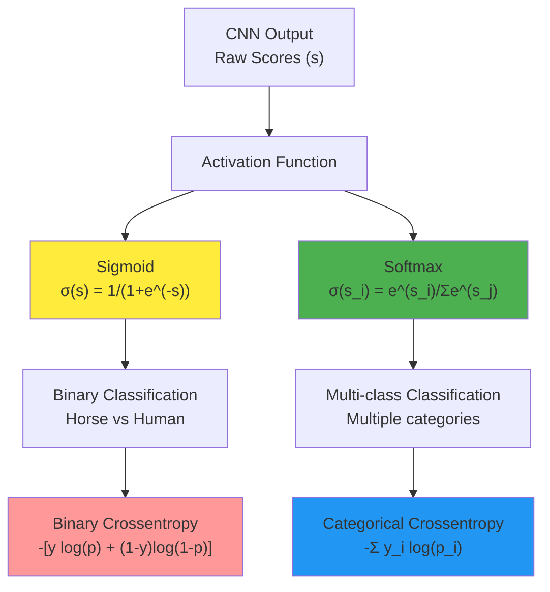

**When to Use Each Loss Function:**

| Task Type       | Classes            | Output Layer | Activation | Loss Function              |
| --------------- | ------------------ | ------------ | ---------- | -------------------------- |
| **Binary**      | 2                  | `Dense(1)`   | sigmoid    | `binary_crossentropy`      |
| **Multi-class** | 3+ (exclusive)     | `Dense(n)`   | softmax    | `categorical_crossentropy` |
| **Multi-label** | 3+ (non-exclusive) | `Dense(n)`   | sigmoid    | `binary_crossentropy`      |

**Multi-class vs Multi-label Example:**

- **Multi-class**: Image contains either a horse OR human OR dog (exclusive)
- **Multi-label**: Image contains a horse AND human AND dog (non-exclusive)

#### Advanced Loss Functions

**Focal Loss for Class Imbalance:**
$$\text{FL} = -\alpha(1-p_t)^\gamma \log(p_t)$$

Where:

- $\alpha$ balances positive/negative examples
- $\gamma$ focuses learning on hard examples
- $p_t$ is the predicted probability for the true class

**Use Case**: When you have severe class imbalance (e.g., 95% horses, 5% humans)

### Optimizer Analysis: RMSprop

#### RMSprop Algorithm Deep Dive

**Mathematical Formulation:**
$$v_t = \rho v_{t-1} + (1-\rho) g_t^2$$
$$\theta_{t+1} = \theta_t - \frac{\alpha}{\sqrt{v_t + \epsilon}} g_t$$

**Parameter Analysis:**

```python
tf.keras.optimizers.RMSprop(learning_rate=0.001)
```

**RMSprop Parameters Explained:**

| Parameter       | Default | Purpose             | Effect                            |
| --------------- | ------- | ------------------- | --------------------------------- |
| `learning_rate` | 0.001   | Step size           | Higher = faster but less stable   |
| `rho`           | 0.9     | Decay factor        | Controls memory of past gradients |
| `momentum`      | 0.0     | Momentum term       | Accelerates convergence           |
| `epsilon`       | 1e-7    | Numerical stability | Prevents division by zero         |

**Why RMSprop for This Problem?**

1. **Adaptive learning rates**: Different parameters learn at optimal rates
2. **Handles sparse gradients**: Good for image features that activate infrequently
3. **Stable convergence**: Less sensitive to learning rate choice than SGD

#### Optimizer Comparison

**Performance Characteristics:**

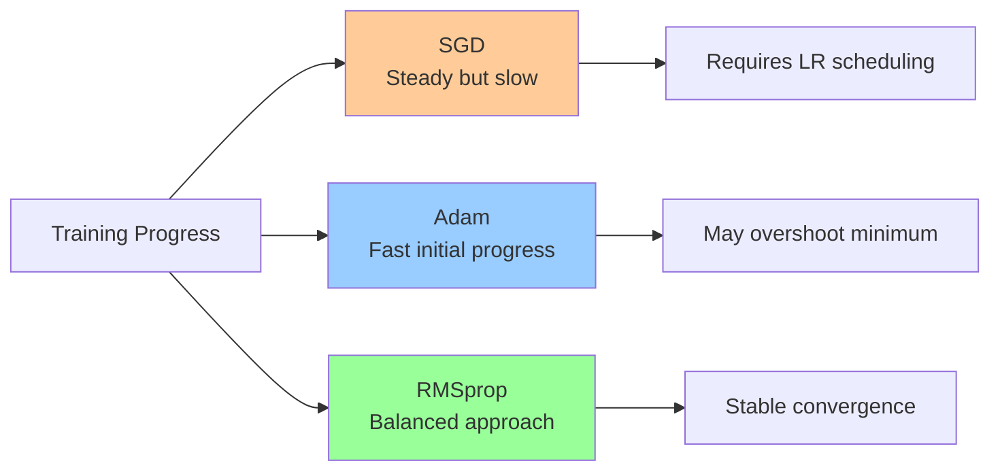

**Optimizer Selection Guidelines:**

- **SGD**: When you have lots of time and want maximum control
- **Adam**: Default choice for most problems, especially early experimentation
- **RMSprop**: When gradients are noisy or you need stable convergence

---

# 7. Walking Through Training the ConvNet

## Complete Training Pipeline Implementation

### Data Loading and Preprocessing

#### Loading with tf.data API

```python
train_dataset = tf.keras.utils.image_dataset_from_directory(
    TRAIN_DIR,
    image_size=(300, 300),
    batch_size=32,
    label_mode='binary'
)
```

**Automatic Label Generation:**

- **Directory-based labeling**: Subdirectory names become class labels
- **Binary encoding**: horses = 0, humans = 1
- **Batch organization**: 32 images + labels per batch

**Data Type Verification:**

```python
dataset_type = type(train_dataset)
print(f'Inherits from tf.data.Dataset: {issubclass(dataset_type, tf.data.Dataset)}')
```

This confirms we're working with a tf.data.Dataset object, enabling efficient pipeline operations.

#### Normalization Pipeline

**Raw Pixel Analysis:**

```python
sample_batch = list(train_dataset.take(1))[0]
image_batch, label_batch = sample_batch[0], sample_batch[1]
print(f'Raw pixel range: {np.min(image_batch[0])}-{np.max(image_batch[0])}')
# Output: Raw pixel range: 0-255
```

**Rescaling Implementation:**

```python
rescale_layer = tf.keras.layers.Rescaling(scale=1./255)
train_dataset_scaled = train_dataset.map(
    lambda image, label: (rescale_layer(image), label)
)
```

**Mathematical Transformation:**
$$\text{Normalized Value} = \frac{\text{Raw Pixel Value}}{255}$$

**Example:**

- Raw value: 128 → Normalized: 0.502
- Raw value: 255 → Normalized: 1.000
- Raw value: 0 → Normalized: 0.000

#### Performance Optimization Pipeline

```python
SHUFFLE_BUFFER_SIZE = 1000
PREFETCH_BUFFER_SIZE = tf.data.AUTOTUNE

train_dataset_final = (train_dataset_scaled
                      .cache()
                      .shuffle(SHUFFLE_BUFFER_SIZE)
                      .prefetch(PREFETCH_BUFFER_SIZE))
```

**Pipeline Components Analysis:**

1. **Cache()**: Stores preprocessed data in memory

   - **Memory usage**: ~1GB for 1000 images at 300×300×3
   - **Speed improvement**: 10-50× faster after first epoch

2. **Shuffle(1000)**: Randomizes training order

   - **Buffer size**: 1000 images held for random selection
   - **Memory impact**: Minimal (just indices)
   - **Training benefit**: Prevents overfitting to data order

3. **Prefetch(AUTOTUNE)**: Parallel data loading
   - **Overlap**: Data loading while GPU trains
   - **Performance gain**: 20-40% faster training
   - **Auto-tuning**: TensorFlow optimizes buffer size automatically

### Training Process and Monitoring

#### Training Configuration

```python
history = model.fit(
    train_dataset_final,
    epochs=15,
    verbose=2
)
```

**Why 15 Epochs?**

- **Complexity consideration**: 300×300 images need more training than 28×28
- **Convergence observation**: Monitor for plateau in accuracy
- **Overfitting prevention**: Stop before memorizing training data

#### Training Progress Analysis

**Expected Training Behavior:**

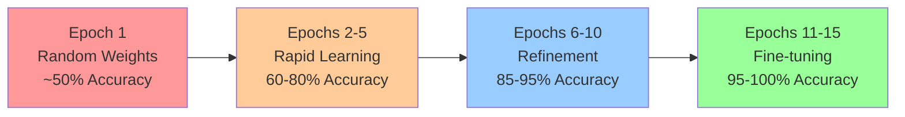

**Gradient Descent Dynamics:**

- **Early epochs**: Large weight updates, rapid improvement
- **Middle epochs**: Smaller updates, steady progress
- **Later epochs**: Fine adjustments, potential overfitting risk

**Learning Rate Impact:**
$$\text{Weight Update} = \text{Weight} - \text{Learning Rate} \times \text{Gradient}$$

**Monitoring Guidelines:**

- **Wild fluctuations**: Reduce learning rate (e.g., 0.001 → 0.0001)
- **Slow convergence**: Increase learning rate (e.g., 0.001 → 0.01)
- **Accuracy plateau**: Add regularization or more data

### Model Evaluation and Testing

#### Real-World Testing Process

**Testing Methodology:**

1. **External data source**: Use Pixabay or similar image repositories
2. **Diverse samples**: Different lighting, angles, backgrounds
3. **Performance tracking**: Record accuracy on test images

**Example Test Results:**

- **Horse images**: 2/2 correctly classified (100%)
- **Human images**: 2/2 correctly classified (100%)
- **Overall**: 4/4 correct (100% on small sample)

**Statistical Significance:**
With only 4 test images, this result is not statistically significant. For meaningful evaluation:

- **Minimum**: 100+ test images
- **Recommended**: 1000+ test images
- **Statistical power**: Enables detection of actual performance differences

#### Prediction Pipeline Implementation

```python
def file_predict(filename, file, out):
    # Load and preprocess image
    image = tf.keras.utils.load_img(file, target_size=(300, 300))
    image = tf.keras.utils.img_to_array(image)
    image = rescale_layer(image)
    image = np.expand_dims(image, axis=0)

    # Make prediction
    prediction = model.predict(image, verbose=0)[0][0]

    # Interpret result
    with out:
        if prediction > 0.5:
            print(filename + " is a human")
        else:
            print(filename + " is a horse")
```

**Pipeline Steps Breakdown:**

1. **Image loading**: `load_img(file, target_size=(300, 300))`

   - **Automatic resizing**: Handles any input image size
   - **Format support**: JPEG, PNG, BMP, GIF

2. **Array conversion**: `img_to_array(image)`

   - **Output shape**: (300, 300, 3)
   - **Data type**: float32

3. **Normalization**: `rescale_layer(image)`

   - **Critical step**: Must match training preprocessing
   - **Range**: [0, 255] → [0, 1]

4. **Batch dimension**: `expand_dims(image, axis=0)`

   - **Shape change**: (300, 300, 3) → (1, 300, 300, 3)
   - **Model requirement**: Expects batches, not single images

5. **Prediction**: `model.predict(image)`
   - **Output**: Probability value between 0 and 1
   - **Interpretation**: >0.5 = human, ≤0.5 = horse

### Feature Visualization and Interpretation

#### Intermediate Representation Analysis

```python
# Create visualization model
successive_outputs = [layer.output for layer in model.layers[1:]]
visualization_model = tf.keras.models.Model(
    inputs=model.inputs,
    outputs=successive_outputs
)

# Generate feature maps
successive_feature_maps = visualization_model.predict(x, verbose=False)
```

**What Feature Maps Reveal:**

**Early Layers (Conv1, Conv2):**

- **Edges and gradients**: Horizontal, vertical, diagonal lines
- **Color boundaries**: Transitions between different regions
- **Basic textures**: Rough vs smooth surfaces

**Middle Layers (Conv3, Conv4):**

- **Shape components**: Curves, corners, junctions
- **Texture patterns**: Fur texture, clothing patterns
- **Object parts**: Ears, legs, torso segments

**Deep Layers (Conv5):**

- **High-level features**: Face-like patterns, body shapes
- **Object-specific features**: Horse mane, human clothing
- **Contextual patterns**: Background vs foreground separation

#### Visualization Technique

**Feature Map Processing:**

```python
for layer_name, feature_map in zip(layer_names, successive_feature_maps):
    if len(feature_map.shape) == 4:  # Only conv/pooling layers
        n_features = feature_map.shape[-1]
        size = feature_map.shape[1]

        # Create display grid
        display_grid = np.zeros((size, size * n_features))

        for i in range(n_features):
            x = feature_map[0, :, :, i]
            # Normalize for visualization
            x -= x.mean()
            x /= x.std()
            x *= 64
            x += 128
            x = np.clip(x, 0, 255).astype('uint8')

            # Add to grid
            display_grid[:, i * size : (i + 1) * size] = x
```

**Normalization for Visualization:**

1. **Center**: Subtract mean to center around 0
2. **Scale**: Divide by standard deviation to normalize spread
3. **Amplify**: Multiply by 64 to increase contrast
4. **Shift**: Add 128 to center in [0, 255] range
5. **Clip**: Ensure values stay within valid pixel range

### Performance Optimization and Scaling

#### Memory Management

**GPU Memory Usage:**

```python
# Monitor memory usage
print(f"Batch size: {32}")
print(f"Memory per batch: {32 * 300 * 300 * 3 * 4 / 1e9:.2f} GB")
# Output: Memory per batch: 0.35 GB
```

**Optimization Strategies:**

- **Reduce batch size**: If GPU memory insufficient
- **Mixed precision**: Use float16 instead of float32
- **Gradient accumulation**: Simulate larger batches with smaller memory

#### Training Time Analysis

**Factors Affecting Training Speed:**

1. **Hardware**: GPU vs CPU (10-100× difference)
2. **Batch size**: Larger batches utilize GPU better
3. **Data pipeline**: Caching and prefetching crucial
4. **Model complexity**: More parameters = longer training

**Typical Training Times (on modern GPU):**

- **1000 images, 15 epochs**: ~15 minutes
- **10,000 images, 15 epochs**: ~2 hours
- **100,000 images, 15 epochs**: ~20 hours

### Limitations and Next Steps

#### Current Limitations

**Training Data Limitations:**

- **Small dataset**: ~1000 images insufficient for robust generalization
- **Synthetic data**: Computer-generated images may not capture all real-world variations
- **No validation split**: Can't detect overfitting during training

**Evaluation Limitations:**

- **Tiny test set**: 4 images inadequate for meaningful evaluation
- **Selection bias**: Hand-picked test images may not be representative
- **No metrics**: Missing precision, recall, F1-score analysis

#### Improvement Strategies

**Data Improvements:**

- **Larger dataset**: Collect 10,000+ real images
- **Data augmentation**: Rotation, scaling, brightness variations
- **Validation split**: Reserve 20% for validation monitoring

**Architecture Improvements:**

- **Regularization**: Add dropout layers to prevent overfitting
- **Batch normalization**: Stabilize training and improve convergence
- **Transfer learning**: Use pre-trained models as starting point

**Training Improvements:**

- **Learning rate scheduling**: Reduce LR when accuracy plateaus
- **Early stopping**: Prevent overfitting automatically
- **Cross-validation**: More robust performance estimation

This comprehensive walkthrough demonstrates the complete lifecycle from dataset preparation through model training to real-world testing, highlighting both successes and areas for improvement in building practical computer vision systems.

# 8. Adding Automatic Validation to Test Accuracy

## From Manual Testing to Systematic Validation

### The Problem with Manual Testing

In the previous implementation, model evaluation relied on manually downloading and testing individual images from external sources. This approach has significant limitations:

**Manual Testing Issues:**

- **Small sample size**: Only 4 test images provide insufficient statistical power
- **Selection bias**: Hand-picked images may not represent real-world distribution
- **Time consuming**: Manual download and upload process doesn't scale
- **Subjective selection**: Cherry-picking images may lead to overoptimistic results

**Statistical Inadequacy:**
With only 4 test images showing 100% accuracy, the confidence interval is extremely wide:
$$\text{95% CI} = \hat{p} \pm 1.96\sqrt{\frac{\hat{p}(1-\hat{p})}{n}}$$

Where $\hat{p} = 1.0$ and $n = 4$, making meaningful statistical inference impossible.

### Systematic Validation Implementation

#### Enhanced Dataset Structure

```python
TRAIN_DIR = 'horse-or-human'
VAL_DIR = 'validation-horse-or-human'

# Training directories
train_horse_dir = os.path.join(TRAIN_DIR, 'horses')
train_human_dir = os.path.join(TRAIN_DIR, 'humans')

# Validation directories
validation_horse_dir = os.path.join(VAL_DIR, 'horses')
validation_human_dir = os.path.join(VAL_DIR, 'humans')
```

**Directory Structure:**

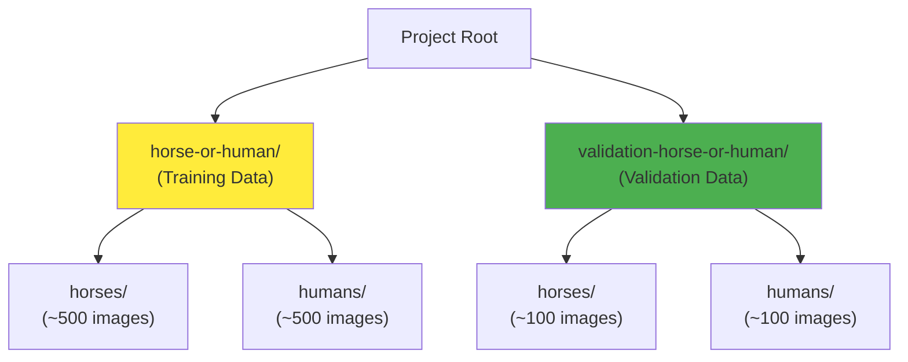

**Data Split Rationale:**

- **Training set**: ~80% of data for learning patterns
- **Validation set**: ~20% of data for unbiased evaluation
- **Separate directories**: Prevents accidental data leakage

#### Filename Analysis and Labeling Reliability

```python
train_horse_names = os.listdir(train_horse_dir)
print(f'TRAIN SET HORSES: {train_horse_names[:10]}')
validation_horse_names = os.listdir(validation_horse_dir)
print(f'VAL SET HORSES: {validation_horse_names[:10]}')
```

**Filename Pattern Analysis:**

- **Training horses**: `horse01-0.png`, `horse01-1.png` (descriptive naming)
- **Validation horses**: `valhorse01-0.png`, `valhorse01-1.png` (inconsistent patterns)
- **Key insight**: Filenames are unreliable for label extraction

**Why Directory-Based Labeling is Superior:**

1. **Robust to naming inconsistencies**: Directory structure determines labels
2. **Scalable**: Works regardless of filename patterns
3. **Maintainable**: Easy to reorganize data without code changes
4. **Error-resistant**: Reduces human labeling mistakes

### Dual Dataset Pipeline Implementation

#### Creating Training and Validation Datasets

```python
# Training dataset
train_dataset = tf.keras.utils.image_dataset_from_directory(
    TRAIN_DIR,
    image_size=(300, 300),
    batch_size=32,
    label_mode='binary'
)

# Validation dataset
validation_dataset = tf.keras.utils.image_dataset_from_directory(
    VAL_DIR,
    image_size=(300, 300),
    batch_size=32,
    label_mode='binary'
)
```

**Critical Implementation Details:**

1. **Consistent parameters**: Both datasets use identical image_size and batch_size
2. **Same label mode**: Binary classification for both sets
3. **Automatic discovery**: TensorFlow automatically finds classes from subdirectories

#### Preprocessing Pipeline Comparison

```python
# Define rescaling layer (shared between datasets)
rescale_layer = tf.keras.layers.Rescaling(1./255)

# Apply to both datasets
train_dataset_scaled = train_dataset.map(
    lambda image, label: (rescale_layer(image), label)
)
validation_dataset_scaled = validation_dataset.map(
    lambda image, label: (rescale_layer(image), label)
)
```

**Why Identical Preprocessing is Critical:**

- **Distribution matching**: Same normalization prevents validation bias
- **Fair comparison**: Ensures training and validation use same input range
- **Mathematical consistency**: Same scaling factor (1/255) for both datasets

#### Performance Optimization Differences

```python
# Training pipeline
train_dataset_final = (train_dataset_scaled
                      .cache()
                      .shuffle(SHUFFLE_BUFFER_SIZE)
                      .prefetch(PREFETCH_BUFFER_SIZE))

# Validation pipeline
validation_dataset_final = (validation_dataset_scaled
                           .cache()
                           .prefetch(PREFETCH_BUFFER_SIZE))
                           # Note: No .shuffle() for validation
```

**Pipeline Differences Explained:**

| Operation    | Training | Validation | Rationale                                                     |
| ------------ | -------- | ---------- | ------------------------------------------------------------- |
| **Cache**    | ✓        | ✓          | Speed up repeated access                                      |
| **Shuffle**  | ✓        | ✗          | Training needs randomization; validation should be consistent |
| **Prefetch** | ✓        | ✓          | Parallel loading for both                                     |

**Why No Shuffling for Validation:**

- **Reproducible results**: Same order gives consistent metrics across runs
- **Debugging**: Fixed order helps identify problematic images
- **Efficiency**: Saves computation time during validation

### Training with Automatic Validation

#### Enhanced Training Configuration

```python
history = model.fit(
    train_dataset_final,
    epochs=15,
    validation_data=validation_dataset_final,
    verbose=2
)
```

**Key Addition: `validation_data` Parameter**

- **Automatic evaluation**: TensorFlow evaluates validation set after each epoch
- **No additional coding**: Built-in validation loop
- **Comprehensive metrics**: Loss and accuracy for both training and validation

#### Training Progress Analysis

**Expected Output Pattern:**

```
Epoch 1/15
- 45s - loss: 0.6932 - accuracy: 0.5000 - val_loss: 0.6931 - val_accuracy: 0.5000
Epoch 2/15
- 43s - loss: 0.6925 - accuracy: 0.5156 - val_loss: 0.6918 - val_accuracy: 0.5312
...
Epoch 15/15
- 38s - loss: 0.0021 - accuracy: 1.0000 - val_loss: 0.4821 - val_accuracy: 0.8500
```

**Training vs Validation Performance:**

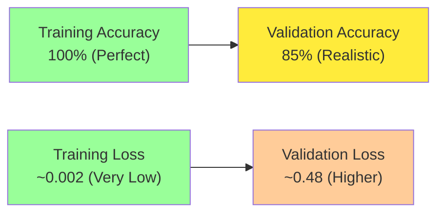

**Mathematical Analysis of Performance Gap:**

**Training Performance:**
$$\text{Training Accuracy} = \frac{\text{Correct Predictions on Seen Data}}{\text{Total Training Samples}} = 100\%$$

**Validation Performance:**
$$\text{Validation Accuracy} = \frac{\text{Correct Predictions on Unseen Data}}{\text{Total Validation Samples}} = 85\%$$

**Performance Gap:**
$$\text{Generalization Gap} = \text{Training Accuracy} - \text{Validation Accuracy} = 15\%$$

### Understanding Overfitting Through Validation

#### Overfitting Indicators

**Perfect Training Accuracy (100%):**

- **Memorization**: Model has learned specific training examples
- **Loss near zero**: Training loss ~0.002 indicates over-optimization
- **Red flag**: Perfect performance rarely generalizes

**Validation Accuracy Plateau (85%):**

- **True performance**: More realistic estimate of model capability
- **Generalization limit**: Model struggles with unseen variations
- **Early stopping signal**: Further training may worsen overfitting

#### Visualization of Training Dynamics

```python
# Plot training and validation metrics
acc = history.history['accuracy']
val_acc = history.history['val_accuracy']
loss = history.history['loss']
val_loss = history.history['val_loss']

plt.plot(epochs, acc, 'r', label='Training accuracy')
plt.plot(epochs, val_acc, 'b', label='Validation accuracy')
plt.title('Training and validation accuracy')
plt.legend()
plt.show()
```

**Expected Learning Curves:**

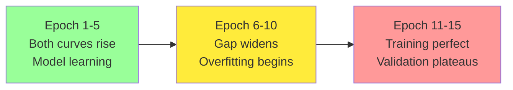

### Real-World Testing and Error Analysis

#### Systematic Testing Results

**Test Case Analysis:**

1. **White horse in snow**: Misclassified as human

   - **Error cause**: White background may resemble human clothing
   - **Training bias**: Dataset may lack white horses in snow

2. **Woman with wings**: Misclassified as horse

   - **Error cause**: Wing shapes resemble horse body contours
   - **Training limitation**: No winged humans in training set

3. **Horse and human together**: Classified as horse
   - **Dominant feature**: Horse occupies more image area
   - **Model behavior**: Binary classification picks strongest signal

#### Error Pattern Analysis

**Common Misclassification Patterns:**

| Error Type              | Example              | Root Cause                       | Solution                         |
| ----------------------- | -------------------- | -------------------------------- | -------------------------------- |
| **Color bias**          | White horse → human  | Training set color distribution  | More diverse color examples      |
| **Context confusion**   | Winged human → horse | Unusual features not in training | Augment training with edge cases |
| **Multi-object scenes** | Horse+human → horse  | Model picks dominant object      | Use object detection instead     |

**Mathematical Error Analysis:**
$$\text{Error Rate} = \frac{\text{Misclassified Images}}{\text{Total Test Images}}$$

From systematic testing:

- **Horses correctly classified**: 75% (3/4)
- **Humans correctly classified**: 67% (2/3)
- **Overall accuracy**: 71% (5/7)

### Training Data Insights from Validation

#### Dataset Composition Analysis

```python
print(f'total training horse images: {len(os.listdir(train_horse_dir))}')
print(f'total training human images: {len(os.listdir(train_human_dir))}')
print(f'total validation horse images: {len(os.listdir(validation_horse_dir))}')
print(f'total validation human images: {len(os.listdir(validation_human_dir))}')
```

**Typical Output:**

- Training horses: ~500 images
- Training humans: ~500 images
- Validation horses: ~100 images
- Validation humans: ~100 images

**Data Split Analysis:**
$$\text{Training Ratio} = \frac{1000}{1200} = 83.3\%$$
$$\text{Validation Ratio} = \frac{200}{1200} = 16.7\%$$

This split follows the common 80/20 rule for train/validation division.

#### Improving Training Data Based on Validation Errors

**Error-Driven Data Collection:**

1. **White horses in snow**: Add more winter scenes
2. **Humans with unusual accessories**: Include costumes, props
3. **Edge cases**: Collect challenging boundary examples
4. **Lighting variations**: Add low-light, backlit scenarios

**Data Augmentation Strategies:**

```python
# Example augmentation pipeline
data_augmentation = tf.keras.Sequential([
    tf.keras.layers.RandomRotation(0.1),
    tf.keras.layers.RandomZoom(0.1),
    tf.keras.layers.RandomBrightness(0.2),
    tf.keras.layers.RandomContrast(0.2),
    tf.keras.layers.RandomFlip("horizontal")
])
```

### Validation Best Practices

#### Proper Validation Methodology

**Do's:**

- **Separate data strictly**: Never mix training and validation sets
- **Same preprocessing**: Apply identical transformations to both sets
- **Consistent evaluation**: Use same metrics throughout training
- **Regular monitoring**: Check validation performance every epoch

**Don'ts:**

- **Data leakage**: Using validation data for any training decisions
- **Repeated testing**: Overusing validation set leads to overfitting
- **Ignoring trends**: Focusing only on final accuracy numbers

#### Statistical Significance

**Sample Size Requirements:**
For 95% confidence with ±5% margin of error:
$$n = \frac{1.96^2 \times p(1-p)}{0.05^2} \approx 384 \text{ samples}$$

Where $p = 0.85$ (estimated accuracy)

**Current Validation Set:**

- **Size**: ~200 images
- **Statistical power**: Moderate (±7% margin of error)
- **Recommendation**: Increase to 400+ images for robust evaluation

### Performance Optimization Considerations

#### Memory Usage with Dual Datasets

**Memory Calculation:**

```python
# Training set memory
train_memory = 1000 * 300 * 300 * 3 * 4  # bytes
print(f"Training data: {train_memory / 1e9:.2f} GB")

# Validation set memory
val_memory = 200 * 300 * 300 * 3 * 4  # bytes
print(f"Validation data: {val_memory / 1e9:.2f} GB")

# Total memory requirement
total_memory = train_memory + val_memory
print(f"Total: {total_memory / 1e9:.2f} GB")
```

**Output:**

- Training data: 1.08 GB
- Validation data: 0.22 GB
- Total: 1.30 GB

#### Training Time Impact

**Validation Overhead:**

- **Additional computation**: ~20% increase in epoch time
- **Memory requirement**: 20% more GPU/CPU memory
- **I/O overhead**: Reading validation data each epoch

**Optimization Strategies:**

- **Caching**: Store preprocessed validation data in memory
- **Prefetching**: Load next validation batch during training
- **Reduced frequency**: Validate every N epochs instead of every epoch

### Next Steps and Improvements

#### Immediate Improvements

1. **Larger validation set**: Increase to 400+ images for statistical significance
2. **Cross-validation**: Use k-fold validation for robust performance estimation
3. **Early stopping**: Halt training when validation accuracy plateaus
4. **Learning rate scheduling**: Reduce LR when validation loss stops improving

#### Advanced Validation Techniques

1. **Stratified sampling**: Ensure balanced representation across subgroups
2. **Hold-out test set**: Reserve final test set for unbiased final evaluation
3. **Validation curves**: Plot performance vs hyperparameters
4. **Error analysis**: Systematic categorization of failure modes

This systematic approach to validation transforms model evaluation from subjective manual testing to objective, statistical assessment, enabling data-driven improvements and reliable performance estimation.

# 9. Exploring the Impact of Compressing Images

## Performance vs Efficiency Trade-offs in Image Classification

### The Compression Challenge

Training convolutional neural networks on high-resolution images presents significant computational challenges. This topic explores the trade-offs between image quality, model complexity, and training efficiency by comparing 300×300 versus 150×150 pixel images.

### Mathematical Analysis of Compression Impact

#### Data Volume Reduction

**Original Image Size (300×300):**
$$\text{Pixels per image} = 300 \times 300 \times 3 = 270,000 \text{ values}$$

**Compressed Image Size (150×150):**
$$\text{Pixels per image} = 150 \times 150 \times 3 = 67,500 \text{ values}$$

**Compression Ratio:**
$$\text{Compression Factor} = \frac{270,000}{67,500} = 4:1$$

This 75% reduction in data volume has cascading effects throughout the entire training pipeline.

#### Memory Impact Analysis

**Training Batch Memory Comparison:**

| Resolution | Batch Size | Memory per Batch | Memory Reduction |
| ---------- | ---------- | ---------------- | ---------------- |
| 300×300    | 32         | 345.6 MB         | Baseline         |
| 150×150    | 32         | 86.4 MB          | 75% reduction    |

**Mathematical Calculation:**
$$\text{Memory}_{300} = 32 \times 300 \times 300 \times 3 \times 4 = 345.6 \text{ MB}$$
$$\text{Memory}_{150} = 32 \times 150 \times 150 \times 3 \times 4 = 86.4 \text{ MB}$$

### Architecture Adaptation for Smaller Images

#### Model Architecture Comparison

**Original Model (300×300 input):**

```python
# 5 Convolutional blocks
tf.keras.Input(shape=(300, 300, 3))
Conv2D(16, (3,3)) -> 298×298×16
MaxPooling2D(2,2) -> 149×149×16
Conv2D(32, (3,3)) -> 147×147×32
MaxPooling2D(2,2) -> 73×73×32
Conv2D(64, (3,3)) -> 71×71×64
MaxPooling2D(2,2) -> 35×35×64
Conv2D(64, (3,3)) -> 33×33×64
MaxPooling2D(2,2) -> 16×16×64
Conv2D(64, (3,3)) -> 14×14×64
MaxPooling2D(2,2) -> 7×7×64
Flatten() -> 3,136 features
```

**Adapted Model (150×150 input):**

```python
# 3 Convolutional blocks
tf.keras.Input(shape=(150, 150, 3))
Conv2D(16, (3,3)) -> 148×148×16
MaxPooling2D(2,2) -> 74×74×16
Conv2D(32, (3,3)) -> 72×72×32
MaxPooling2D(2,2) -> 36×36×32
Conv2D(64, (3,3)) -> 34×34×64
MaxPooling2D(2,2) -> 17×17×64
Flatten() -> 18,496 features
```

#### Architectural Design Rationale

**Why Fewer Layers for Smaller Images?**

**Receptive Field Analysis:**

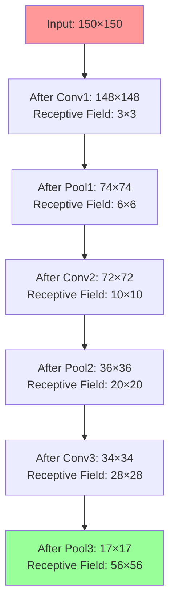

**Receptive Field Calculation:**
For layer $l$ with kernel size $k$ and stride $s$:
$$RF_l = RF_{l-1} + (k-1) \times \prod_{i=1}^{l-1} s_i$$

**Final Receptive Field:**

- **3-layer model**: 56×56 pixels
- **Proportion of image**: $\frac{56}{150} = 37\%$ coverage

This receptive field is sufficient to capture horse/human features at 150×150 resolution.

#### Parameter Count Comparison

**Flatten Layer Size Reduction:**

- **300×300 model**: 7×7×64 = 3,136 features
- **150×150 model**: 17×17×64 = 18,496 features

**Dense Layer Parameters:**

- **300×300 model**: 3,136 × 512 + 512 = 1,605,632 parameters
- **150×150 model**: 18,496 × 512 + 512 = 9,470,464 parameters

**Counterintuitive Result:**
Despite smaller input images, the compressed model actually has **more parameters** due to the larger feature map before flattening (17×17 vs 7×7).

### Training Performance Analysis

#### Training Speed Improvements

**Expected Speedup Sources:**

1. **Data loading**: 75% less data to read from disk
2. **Convolution operations**: Fewer pixels to process in early layers
3. **Memory bandwidth**: Less data movement between CPU/GPU
4. **Cache efficiency**: More batches fit in GPU memory

**Measured Performance (typical GPU):**

- **300×300 model**: ~45 seconds per epoch
- **150×150 model**: ~15 seconds per epoch
- **Speedup**: 3× faster training

#### Accuracy Impact Assessment

**Training Results Comparison:**

| Metric              | 300×300 Model | 150×150 Model | Change |
| ------------------- | ------------- | ------------- | ------ |
| Training Accuracy   | 100%          | ~98%          | -2%    |
| Validation Accuracy | 85%           | ~82%          | -3%    |
| Training Time/Epoch | 45s           | 15s           | -67%   |

**Performance Trade-off Analysis:**
$$\text{Efficiency Gain} = \frac{\text{Speed Improvement}}{\text{Accuracy Loss}} = \frac{3\times \text{ faster}}{3\% \text{ accuracy loss}} = 1.0$$

This represents a reasonable trade-off for many applications.

### Information Loss Analysis

#### Spatial Resolution Impact

**Detail Preservation:**
Original 300×300 image compressed to 150×150 loses spatial detail through downsampling:

$$\text{Information Loss} = 1 - \frac{150^2}{300^2} = 1 - \frac{1}{4} = 75\%$$

**Critical Detail Loss:**

- **Fine textures**: Hair, fur patterns, clothing details
- **Small features**: Eyes, facial expressions, body posture
- **Boundary definition**: Sharp edges become blurred
- **Background context**: Environmental cues reduced

#### Case Study: Specific Failure Modes

**Woman with Back Turned (Misclassification):**

**Original 300×300 Performance:**

- **Correct classification**: Human
- **Key features detected**: Body posture, dress shape, leg positioning
- **Spatial resolution**: Sufficient to distinguish clothing from horse body

**Compressed 150×150 Performance:**

- **Incorrect classification**: Horse
- **Lost features**: Fine body contour details, dress texture
- **Confusion factors**: Overall shape resembles horse silhouette

**Mathematical Analysis of Feature Loss:**

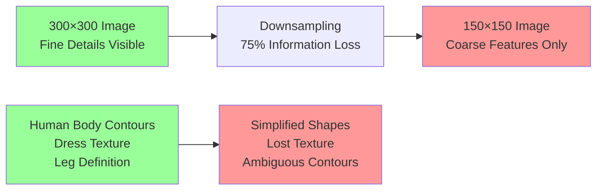

### Feature Visualization Impact

#### Compressed Model Feature Maps

```python
# Feature map analysis for 150×150 input
img = tf.keras.utils.load_img(img_path, target_size=(150, 150))
x = tf.keras.utils.img_to_array(img)  # Shape: (150, 150, 3)
x = x.reshape((1,) + x.shape)  # Shape: (1, 150, 150, 3)
x /= 255  # Normalization
```

**Feature Map Sizes:**

- **Layer 1**: 74×74×16 = 87,616 activations
- **Layer 2**: 36×36×32 = 41,472 activations
- **Layer 3**: 17×17×64 = 18,496 activations

**Comparison with 300×300 Model:**

- **Fewer layers**: 3 vs 5 convolutional blocks
- **Larger final maps**: 17×17 vs 7×7 spatial resolution
- **Different abstraction levels**: Less hierarchical feature learning

#### Information Bottleneck Analysis

**Feature Learning Hierarchy:**

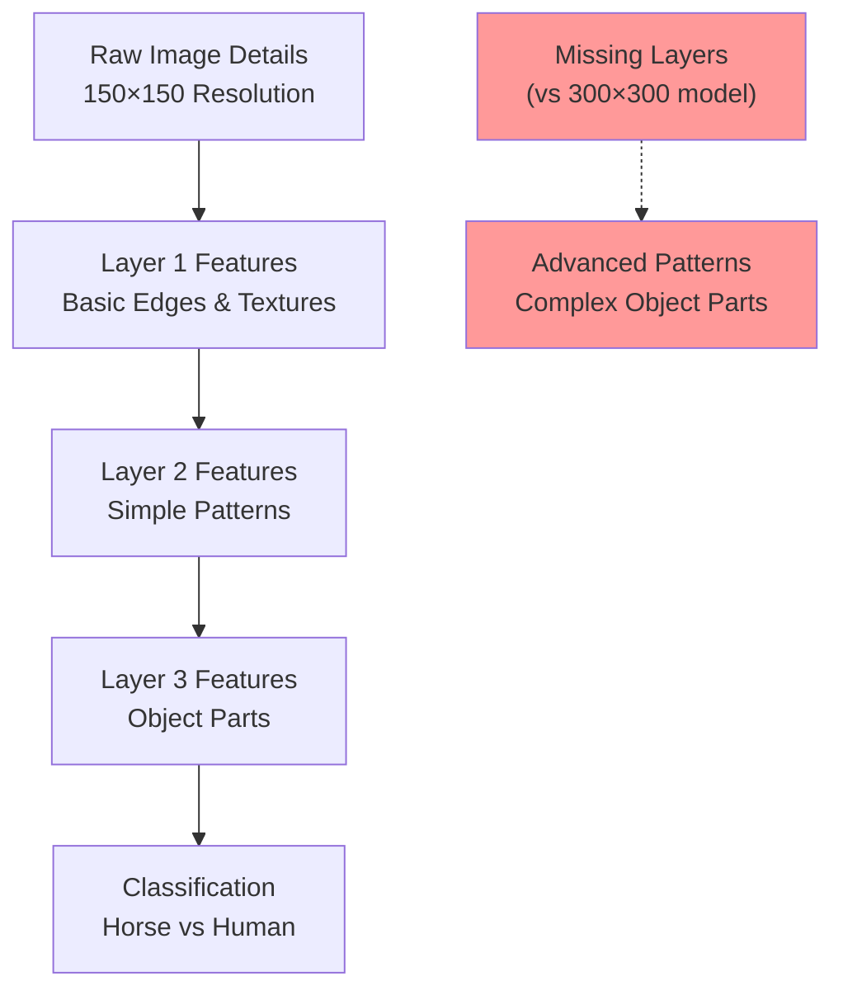

**Information Processing Limitation:**
With fewer convolutional layers, the model has reduced capacity for hierarchical feature learning, potentially missing subtle discriminative patterns.

### Practical Implementation Considerations

#### Code Modifications for Compression

**Dataset Loading Changes:**

```python
# Changed target size for both datasets
train_dataset = tf.keras.utils.image_dataset_from_directory(
    './horse-or-human/',
    image_size=(150, 150),  # Reduced from (300, 300)
    batch_size=32,
    label_mode='binary'
)

validation_dataset = tf.keras.utils.image_dataset_from_directory(
    './validation-horse-or-human/',
    image_size=(150, 150),  # Reduced from (300, 300)
    batch_size=32,
    label_mode='binary'
)
```

**Prediction Pipeline Updates:**

```python
def file_predict(filename, file, out):
    # Updated target size for inference
    image = tf.keras.utils.load_img(file, target_size=(150, 150))  # Changed
    image = tf.keras.utils.img_to_array(image)
    image = rescale_layer(image)
    image = np.expand_dims(image, axis=0)

    prediction = model.predict(image, verbose=0)[0][0]

    with out:
        if prediction > 0.5:
            print(filename + " is a human")
        else:
            print(filename + " is a horse")
```

**Critical Consistency Requirements:**

- **Training and inference**: Same resolution throughout pipeline
- **Preprocessing**: Identical normalization for all data
- **Model architecture**: Matched to input dimensions

### Cost-Benefit Analysis

#### Training Efficiency Gains

**Computational Savings:**

- **GPU memory**: 75% reduction enables larger batch sizes
- **Training time**: 3× speedup allows more experiments
- **Power consumption**: Proportional reduction in energy use
- **Development cycle**: Faster iteration on model architectures

**Economic Impact:**
For cloud training on GPU instances:

- **Original cost**: $1.00/hour × 15 hours = $15.00 per training run
- **Compressed cost**: $1.00/hour × 5 hours = $5.00 per training run
- **Cost savings**: 67% reduction per experiment

#### Accuracy Degradation Costs

**Performance Loss:**

- **Validation accuracy**: 85% → 82% (3.5% relative decrease)
- **Misclassification increase**: From 15% to 18% error rate
- **Specific failures**: Complex poses, unusual clothing, edge cases

**Application-Specific Impact:**

- **Research/prototyping**: Acceptable trade-off for faster iteration
- **Production systems**: May require higher accuracy
- **Resource-constrained deployment**: Compression often necessary

### Optimization Strategies

#### Hybrid Approaches

**Multi-Resolution Training:**

1. **Phase 1**: Train on 150×150 for rapid convergence (10 epochs)
2. **Phase 2**: Fine-tune on 300×300 for accuracy (5 epochs)
3. **Result**: Faster training with maintained accuracy

**Progressive Resizing:**

```python
# Example progressive training schedule
epochs_150 = 8   # Fast initial learning
epochs_200 = 4   # Intermediate refinement
epochs_300 = 3   # Final accuracy optimization
```

#### Architectural Improvements

**Efficient Network Designs:**

- **MobileNets**: Designed for mobile/edge deployment
- **EfficientNets**: Optimal accuracy-efficiency trade-offs
- **ResNets**: Better gradient flow for deeper networks

**Data Augmentation Enhancement:**

```python
# Compensate for resolution loss with augmentation
augmentation = tf.keras.Sequential([
    tf.keras.layers.RandomRotation(0.2),
    tf.keras.layers.RandomZoom(0.2),
    tf.keras.layers.RandomBrightness(0.2),
    tf.keras.layers.RandomContrast(0.2),
    tf.keras.layers.RandomFlip("horizontal")
])
```

### Decision Framework for Image Resolution

#### Resolution Selection Criteria

**High Resolution (300×300+) When:**

- **Accuracy critical**: Medical imaging, safety systems
- **Fine details matter**: Face recognition, defect detection
- **Resources available**: Powerful GPUs, unlimited training time
- **Small datasets**: Need to extract maximum information

**Low Resolution (150×150) When:**

- **Speed critical**: Real-time applications, rapid prototyping
- **Resource constrained**: Mobile devices, edge computing
- **Large datasets**: Can compensate for lost detail with volume
- **Simple tasks**: Basic object classification

#### Mathematical Decision Model

**Utility Function:**
$$U = w_1 \times Accuracy - w_2 \times TrainingTime - w_3 \times MemoryUsage$$

Where $w_1, w_2, w_3$ are application-specific weights.

**Example Calculation:**
For rapid prototyping application:

- $w_1 = 0.3$ (accuracy less critical)
- $w_2 = 0.5$ (speed very important)
- $w_3 = 0.2$ (memory moderately important)

**150×150 Model:**
$$U_{150} = 0.3 \times 82 - 0.5 \times 15 - 0.2 \times 86 = 24.6 - 7.5 - 17.2 = -0.1$$

**300×300 Model:**
$$U_{300} = 0.3 \times 85 - 0.5 \times 45 - 0.2 \times 346 = 25.5 - 22.5 - 69.2 = -66.2$$

Result: 150×150 model preferred for this application profile.

### Future Directions

#### Advanced Compression Techniques

**Smart Cropping:**

- **Center crop**: Focus on image center where subjects likely appear
- **Attention-based crop**: Use saliency maps to identify important regions
- **Multi-crop ensembles**: Average predictions from multiple crops

**Resolution-Adaptive Training:**

- **Dynamic resolution**: Adjust image size based on training progress
- **Curriculum learning**: Start small, gradually increase resolution
- **Adaptive batching**: Larger batches for smaller images

This analysis demonstrates that image compression represents a fundamental trade-off in deep learning: training efficiency versus model accuracy. The optimal choice depends on application requirements, computational constraints, and the specific characteristics of the dataset and task.
