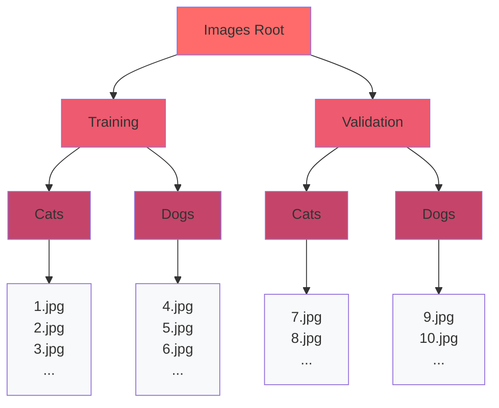
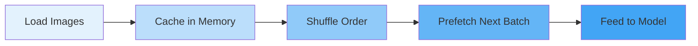
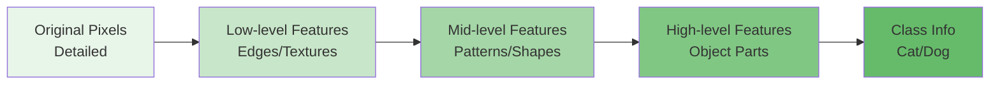
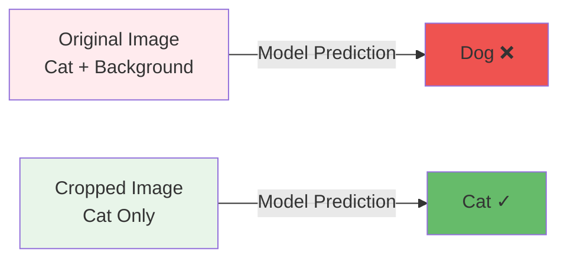
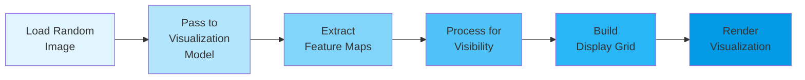
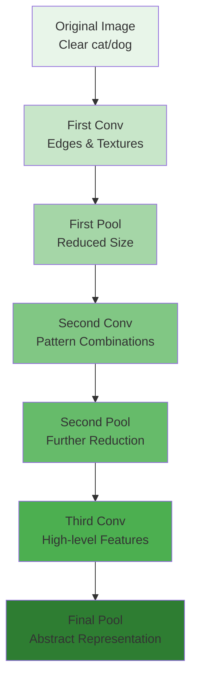
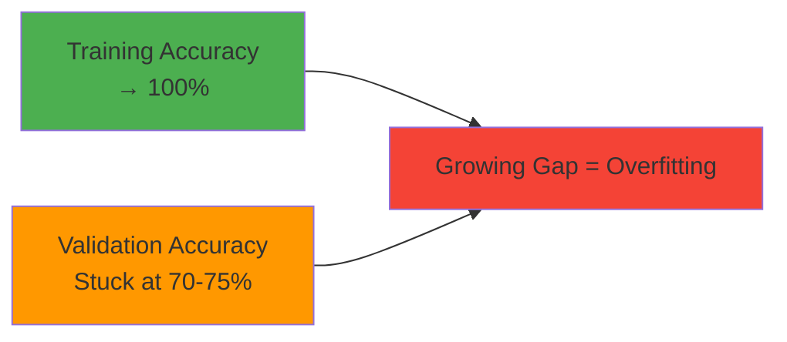
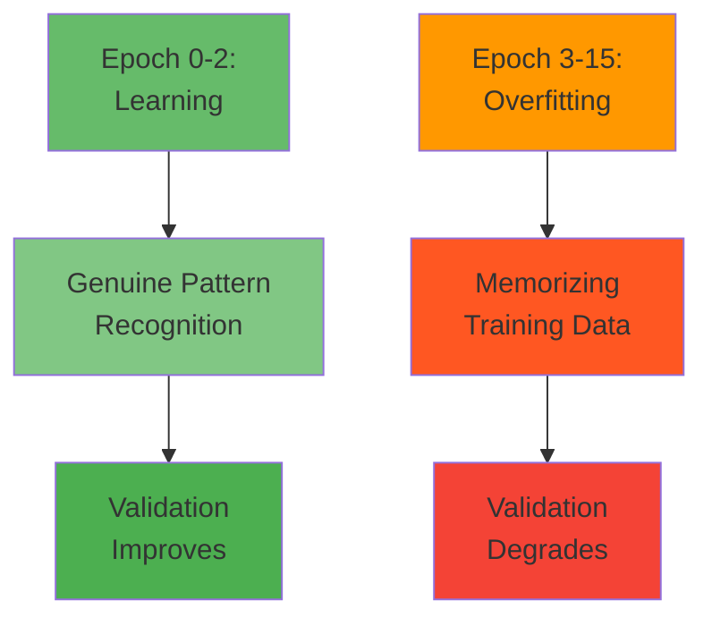
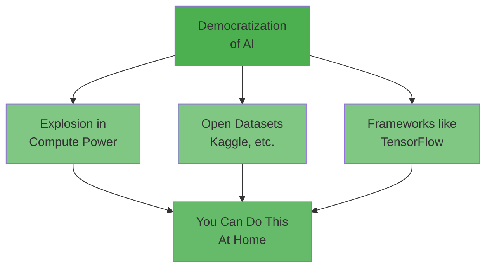

# TensorFlow Specialization

## Course 2: Convolutional Neural Networks in TensorFlow

### Week 1: Exploring a Larger Dataset

---

## Table of Contents

1. [Introduction](#1-introduction)
2. [Working with Real-World Data](#2-working-with-real-world-data)
3. [The Cats vs Dogs Dataset](#3-the-cats-vs-dogs-dataset)
4. [Training with the Cats vs Dogs Dataset](#4-training-with-the-cats-vs-dogs-dataset)
5. [Lab Walkthrough: Building a Cats vs Dogs Classifier](#5-lab-walkthrough-building-a-cats-vs-dogs-classifier)
6. [Fixing Predictions Through Cropping](#6-fixing-predictions-through-cropping)
7. [Visualizing the Effect of Convolutions](#7-visualizing-the-effect-of-convolutions)
8. [Analyzing Accuracy and Loss](#8-analyzing-accuracy-and-loss)
9. [Week 1 Wrap-Up](#9-week-1-wrap-up)

---

# 1. Introduction

## Course Overview

This second course in the TensorFlow Specialization builds significantly upon the foundations established in Course 1, where you learned to implement basic neural networks and convolutional neural networks (CNNs). Course 2 takes these concepts much further by applying them to larger, more complex datasets and introducing advanced techniques for improving model performance.

### Course Structure and Weekly Topics

#### Week 1: Exploring Larger Datasets

- **Primary Dataset:** Kaggle Cats vs Dogs Challenge
- **Dataset Size:** 25,000 images (a massive scale-up from Course 1's ~1,000 images)
- **Learning Focus:** Understanding how to train models on significantly larger datasets
- **Historical Context:** This was a major data science challenge not long ago, and now students can learn to solve it

#### Week 2: Data Augmentation Techniques

- **Purpose:** Additional method for dealing with overfitting beyond just using larger datasets
- **Core Concept:** Creating variations of existing training images without manually editing the dataset
- **TensorFlow Features:** Easy-to-use built-in tools for data augmentation
- **Common Techniques:**
  - **Mirror/Flip:** Creating horizontal flips of images (e.g., a mirrored cat still looks like a cat)
  - **Rotation:** Handling different orientations (e.g., cats lying down or on their side)
  - **Skewing:** Slight distortions of images
  - **Translation:** Moving images around the frame
- **Technical Advantage:** Augmentation happens in memory during training, not by editing actual image files

#### Week 3: Transfer Learning

- **Problem Addressed:** Insufficient data for training from scratch
- **Solution:** Leveraging pre-trained neural networks
- **How It Works:**
  - Download a neural network trained on millions of images (e.g., Inception network)
  - Use the pre-trained parameters to bootstrap your learning process
  - Apply to your smaller, specific dataset
- **Key Benefit:** Pre-trained models have already learned to spot features that might not be detectable in smaller datasets
- **Community Aspect:** "Standing on the shoulders of giants" - building on the open-source work of the AI community
- **Common Practice:** Transfer learning is widely used in real-world applications

#### Week 4: Multiclass Classification

- **Concept:** Extending from binary classification (2 classes) to multiple classes
- **Scale Range:** From 3 classes (e.g., rock-paper-scissors) to 1,000+ classes (e.g., Inception)
- **Technical Note:** The techniques for moving from 2 to many classes are very similar
- **Practical Example:** Rock, paper, scissors classifier

## Understanding Overfitting

### The Problem

- **Small Datasets:** High risk of overfitting (model memorizes training data rather than learning generalizable patterns)
- **Larger Datasets:** Reduced risk of overfitting, but it can still occur

### Solutions Covered in This Course

1. **Using larger datasets** (Week 1)
2. **Data augmentation** (Week 2)
3. **Transfer learning** (Week 3)

## Technical Updates

### TensorFlow Version

- **Current Version:** TensorFlow 2.16
- **Evolution:** TensorFlow continuously evolves with updates from developers
- **Core Concepts:** Remain stable despite updates
- **Changes:** New APIs and syntax introduced over time

### Course Materials

- **Lab Updates:** Periodically updated to reflect the latest TensorFlow version
- **Video Updates:** Laurence Moroney re-records segments when necessary to reflect changes
- **Audio Variations:** You may notice inconsistent audio quality due to these updates
- **Purpose of Updates:** Ensuring students learn the most current and relevant material

## Key Takeaways

1. **Progressive Complexity:** This course significantly advances beyond Course 1 concepts
2. **Real-World Applications:** Training on datasets that were competitive challenges not long ago
3. **Practical Tools:** TensorFlow provides accessible tools for data augmentation and transfer learning
4. **Open Source Community:** Emphasis on leveraging and contributing to the broader AI community
5. **Scalability:** Learning techniques that work from small datasets to thousands of classes

## Looking Ahead

The course applies similar foundational ideas from Course 1 to much bigger challenges, demonstrating how CNNs scale and how to optimize their performance through various techniques. Each week builds on the previous, creating a comprehensive understanding of practical CNN implementation with TensorFlow.

# 2. Working with Real-World Data

## The Reality of AI Development

### The Misconception

Many people imagine AI development as researchers sitting in front of whiteboards in zen gardens, discussing the future of humanity and theoretical concepts.

### The Reality

The actual work of AI involves **substantial data cleaning and preprocessing**. Having great tools to handle data cleaning makes workflows much more efficient and is a critical skill for any AI practitioner.

## Challenges with Public Datasets

### Downloading Real-World Data

When working with public datasets from the internet (like the Cats vs Dogs dataset from Kaggle), you encounter various real-world issues that don't exist in carefully curated academic datasets.

### Common Data Quality Issues

#### 1. **Messy and Unexpected Data**

- **Multiple subjects:** Images containing multiple cats instead of one
- **People in images:** Pictures of people holding cats rather than just cats alone
- **Unexpected variations:** Surprising elements that don't fit expected patterns

#### 2. **Corrupt or Invalid Files**

- **Zero-length files:** Files that have no data or are corrupted
- **Incomplete downloads:** Files that didn't download properly
- **Format issues:** Files that claim to be images but are corrupted

#### 3. **Data Inconsistencies**

- Varying image qualities
- Different image sizes and aspect ratios
- Inconsistent labeling or categorization

## Skills Developed This Week

### 1. **Python Data Handling**

- Using Python skills to identify problematic files
- Filtering out corrupt or invalid data
- Preprocessing data before feeding it to neural networks

### 2. **TensorFlow Data Processing**

- Leveraging TensorFlow's built-in data handling capabilities
- Creating robust data pipelines that handle edge cases
- Implementing data validation checks

### 3. **Building Robust CNNs**

- Creating convolutional neural networks that can handle real-world variations
- Training models that generalize well despite data inconsistencies
- Dealing with scenarios like people holding cats (unexpected elements in images)

## Learning Objectives

### Practical Data Cleaning

This week provides hands-on practice with:

- Identifying and removing problematic data
- Handling edge cases in image datasets
- Building preprocessing pipelines

### Transferable Skills

While the Cats vs Dogs dataset is relatively clean compared to many real-world datasets, the techniques learned here apply to:

- **Messier datasets** with more significant quality issues
- **Custom datasets** you might collect yourself
- **Industry applications** where data is rarely perfect

### Neural Network Training

Despite the data challenges, you'll successfully:

- Train a convolutional neural network
- Classify cats versus dogs with high accuracy
- Implement best practices for handling real-world data

## Key Takeaways

1. **Data cleaning is fundamental** to AI development and takes up significant time in real projects

2. **Real-world data is messy** - you'll encounter corrupt files, unexpected variations, and edge cases

3. **Tools matter** - Having robust frameworks like TensorFlow helps manage data issues efficiently

4. **Skills are transferable** - Techniques learned on this relatively clean dataset prepare you for messier data in production environments

5. **Validation is crucial** - Always check your data for issues like zero-length files before training

## Practical Approach

The week focuses on building practical skills through hands-on work:

- Download and explore a real public dataset
- Identify and handle data quality issues
- Implement filtering and validation
- Train a working classifier despite imperfect data
- Learn workflows applicable to future AI projects

# 3. The Cats vs Dogs Dataset

## Introduction to the Dataset

### Source

**Kaggle Dogs vs Cats Challenge**  
Dataset URL: https://www.kaggle.com/c/dogs-vs-cats

### Historical Context

This dataset was originally created as a **competitive challenge** aimed at the world's best Machine Learning and AI practitioners. What once required cutting-edge expertise and significant effort can now be accomplished in just a few minutes using modern Convolutional Neural Network programming techniques.

### Significance of Technology Advancement

The rapid evolution of deep learning technology means that problems that were extremely challenging just a few years ago are now:

- Accessible to learners and beginners
- Solvable with relatively simple CNN architectures
- Achievable with standard computing resources
- Implementable in minutes rather than days or weeks

## Dataset Characteristics

### Scale and Size

- **Large-scale dataset** compared to introductory examples
- Provides opportunity to work with real-world data volumes
- Offers insights into how models perform with more training data

### Real-World Data Properties

Even though this dataset has been **carefully curated** for machine learning purposes, it still contains real-world imperfections:

- **Corrupt images:** Some image files may be damaged or incomplete
- **Data errors:** Occasional files that cannot be properly processed
- **EXIF metadata issues:** Missing or corrupt metadata embedded in image files

## Learning Objectives

### 1. **Working with Larger Datasets**

- Downloading substantial amounts of data from public sources
- Managing larger collections of training images
- Understanding computational considerations for bigger datasets

### 2. **Data Preparation and Preprocessing**

- Extracting and organizing downloaded data
- Setting up proper directory structures for training
- Validating data integrity before training

### 3. **Handling Data Imperfections**

Practice dealing with common real-world issues:

- **Identifying corrupt images** that cannot be loaded
- **Filtering out problematic files** before they cause training errors
- **Implementing robust data loading** that handles exceptions gracefully

### 4. **Data Pipeline Construction**

- Building efficient data loading mechanisms
- Implementing preprocessing steps
- Creating scalable workflows for larger datasets

## Technical Considerations

### EXIF Data Warnings

**What You'll See:**  
During the image loading process, you may encounter warnings about missing or corrupt EXIF (Exchangeable Image File Format) data.

**What EXIF Data Is:**  
Metadata embedded in image files containing information like:

- Camera settings (exposure, aperture, ISO)
- Date and time photo was taken
- GPS coordinates
- Camera make and model

**Important Note:**  
These EXIF warnings **will not impact your model's performance**. The neural network only uses the pixel data from images, not the metadata. You can safely ignore these warnings.

### Image Corruption Issues

Some images in the dataset may be:

- Partially downloaded or incomplete
- Corrupted during storage or transfer
- Zero-length or empty files
- In unexpected formats

**Solution Approach:**  
Implement validation checks to identify and skip problematic images during data loading.

## Why This Dataset Matters

### 1. **Benchmark for Progress**

The Dogs vs Cats dataset serves as a historical benchmark showing how far the field has advanced. What was once competition-level difficulty is now educational material.

### 2. **Realistic Complexity**

Large enough to require proper data handling strategies, but manageable enough to train on typical hardware.

### 3. **Binary Classification Foundation**

Perfect for learning binary classification (two classes: dog or cat) before moving to multi-class problems.

### 4. **Practical Skills Development**

Forces you to deal with real data issues, building skills that transfer directly to production environments.

## Expected Outcomes

By working with this dataset, you will:

1. **Gain confidence** handling larger, real-world datasets
2. **Develop debugging skills** for data-related issues
3. **Learn robust preprocessing** techniques
4. **Build a working classifier** that performs well on a recognized benchmark
5. **Understand data validation** importance in ML pipelines

## Key Takeaways

1. **Technology evolves rapidly** - Yesterday's expert challenges become today's learning exercises

2. **Even curated data has issues** - Always expect and plan for data imperfections

3. **Scale matters** - Larger datasets require different approaches than toy examples

4. **Metadata vs. pixel data** - Neural networks work with pixels; EXIF warnings are cosmetic

5. **Validation is essential** - Check data integrity before training to avoid runtime errors

# 4. Training with the Cats vs Dogs Dataset

## Dataset Evolution and Context

### Progression of Complexity

**Fashion MNIST → Horses vs Humans → Cats vs Dogs**

1. **Fashion MNIST:** Small, centered images (28x28 pixels) focused directly on the subject
2. **Horses vs Humans:** Larger images with subjects in various action poses
3. **Cats vs Dogs:** Real-world Kaggle competition dataset with diverse, uncontrolled images

### Role of Convolutions

Convolutions help identify features in images **regardless of their location**, making them essential for handling datasets where subjects can appear anywhere in the frame with varying poses and orientations.

### Kaggle Connection

- **What is Kaggle:** Platform where machine learning challenges are posted, often with prizes
- **Cats vs Dogs Challenge:** Famous competition from a few years ago
- **Modern Accessibility:** Techniques learned in this course can now solve what was once a competitive challenge

## Directory Structure and Automatic Labeling

### The Power of Organization

One of TensorFlow and Keras's most convenient features is **automatic label generation** based on directory structure. By organizing images into named subdirectories, you can skip manual labeling entirely.

### Recommended Directory Structure



### Benefits of This Structure

1. **Automatic labeling:** Images in the "Cats" folder are automatically labeled as cats
2. **Clean separation:** Training and validation sets are physically separated
3. **Easy management:** Simple to add, remove, or reorganize images
4. **Scalability:** Works with any number of classes (not just binary classification)

## Loading Data with `image_dataset_from_directory`

### Function Overview

TensorFlow provides a powerful utility function that handles data loading, resizing, and labeling automatically:

```python
tf.keras.utils.image_dataset_from_directory()
```

### Key Parameters Explained

#### 1. **Directory Path**

```python
directory = 'path/to/training'  # Parent folder containing class subdirectories
```

- Points to the training or validation folder
- Should contain subdirectories for each class

#### 2. **Image Size**

```python
image_size = (150, 150)
```

- **Purpose:** Resize all images to match neural network input shape
- **Why needed:** Images in your dataset can have varying dimensions
- **Processing:** Resizing happens **on-the-fly** during loading
- **Example:** All images become 150×150 pixels regardless of original size

#### 3. **Batch Size**

```python
batch_size = 20
```

- **Definition:** Number of images processed together in one iteration
- **Example calculation:** 2,000 images ÷ 20 per batch = 100 batches total
- **Memory consideration:** Larger batches use more memory but can train faster
- **Typical range:** 16-128 depending on available RAM and GPU memory

#### 4. **Label Mode**

```python
label_mode = 'binary'
```

- **Binary:** For two-class problems (cats vs dogs)
- **Categorical:** For multi-class problems (will be covered in Week 4)
- **Output format:** Binary produces single values (0 or 1), categorical produces one-hot vectors

### Complete Loading Example

```python
# Training dataset
train_dataset = tf.keras.utils.image_dataset_from_directory(
    directory='Images/Training',     # Path to training folder
    image_size=(150, 150),            # Resize all images
    batch_size=20,                    # 20 images per batch
    label_mode='binary'               # Binary classification
)

# Validation dataset
validation_dataset = tf.keras.utils.image_dataset_from_directory(
    directory='Images/Validation',    # Path to validation folder
    image_size=(150, 150),            # Same size as training
    batch_size=20,                    # Same batch size
    label_mode='binary'               # Same label mode
)
```

## Dataset Optimization Pipeline

### Three Critical Optimization Methods

After loading, apply these methods to optimize performance:

```python
train_dataset = train_dataset.cache().shuffle(buffer_size).prefetch(buffer_size=tf.data.AUTOTUNE)
```

#### 1. **`.cache()`**

- **Purpose:** Keeps dataset in memory after first epoch
- **Benefit:** Eliminates repeated disk reads
- **When to use:** When dataset fits in RAM
- **Performance gain:** Significant speedup after first epoch

#### 2. **`.shuffle(buffer_size)`**

- **Purpose:** Randomizes order of training examples
- **Why important:** Prevents model from learning order-dependent patterns
- **Buffer size:** Larger = more randomness but more memory usage
- **Best practice:** Set to dataset size if possible

#### 3. **`.prefetch(buffer_size=tf.data.AUTOTUNE)`**

- **Purpose:** Prepares next batch while current batch is being processed
- **How it works:** GPU trains on batch N while CPU loads batch N+1
- **AUTOTUNE:** TensorFlow automatically determines optimal buffer size
- **Result:** Eliminates idle time between batches

### Pipeline Visualization



## Model Architecture

### Input Layer and Rescaling

#### New Approach: Rescaling as a Layer

**Previous Method (Course 1):**

```python
# Used .map() method to rescale separately
dataset = dataset.map(lambda x, y: (x / 255.0, y))
```

**Current Method (Course 2):**

```python
# Rescaling layer as first layer in model
model = tf.keras.Sequential([
    tf.keras.layers.Rescaling(1./255, input_shape=(150, 150, 3)),
    # ... rest of layers
])
```

**Benefits of Layer-Based Rescaling:**

1. **Integrated preprocessing:** No separate mapping step needed
2. **Cleaner code:** Preprocessing is part of model definition
3. **Automatic application:** Rescaling happens automatically during training and inference
4. **Model portability:** Preprocessing travels with the model when saved

### Complete CNN Architecture

```python
model = tf.keras.Sequential([
    # Input and Rescaling
    tf.keras.layers.Rescaling(1./255, input_shape=(150, 150, 3)),

    # First Convolution Block
    tf.keras.layers.Conv2D(32, (3, 3), activation='relu'),
    tf.keras.layers.MaxPooling2D(2, 2),

    # Second Convolution Block
    tf.keras.layers.Conv2D(64, (3, 3), activation='relu'),
    tf.keras.layers.MaxPooling2D(2, 2),

    # Third Convolution Block
    tf.keras.layers.Conv2D(128, (3, 3), activation='relu'),
    tf.keras.layers.MaxPooling2D(2, 2),

    # Flatten and Dense Layers
    tf.keras.layers.Flatten(),
    tf.keras.layers.Dense(512, activation='relu'),

    # Output Layer
    tf.keras.layers.Dense(1, activation='sigmoid')
])
```

### Architecture Analysis

#### Convolution and Pooling Journey

```mermaid
graph LR
    A[150×150×3<br/>Input] --> B[148×148×32<br/>Conv2D]
    B --> C[74×74×32<br/>MaxPool]
    C --> D[72×72×64<br/>Conv2D]
    D --> E[36×36×64<br/>MaxPool]
    E --> F[34×34×128<br/>Conv2D]
    F --> G[17×17×128<br/>MaxPool]
    G --> H[Flatten]
    H --> I[Dense 512]
    I --> J[Output 1<br/>Sigmoid]

    style A fill:#e8f5e9
    style B fill:#c8e6c9
    style C fill:#a5d6a7
    style D fill:#81c784
    style E fill:#66bb6a
    style F fill:#4caf50
    style G fill:#43a047
    style H fill:#2e7d32
    style I fill:#1b5e20
    style J fill:#f44336
```



#### Dimension Changes Explained

1. **150×150 → 148×148:** Convolution with 3×3 filter reduces size by 2 pixels
   - No padding used, so edges are lost
2. **148×148 → 74×74:** Max pooling with 2×2 reduces dimensions by half

3. **Pattern repeats** through three convolution/pooling blocks

4. **Final size 17×17:** Small enough to flatten into dense layers

### Three Convolution Blocks

**Why three blocks?**

- **Progressive feature learning:** Early layers detect edges, later layers detect complex patterns
- **Dimensional reduction:** Each block reduces spatial dimensions while increasing feature depth
- **Hierarchical features:** Builds increasingly abstract representations

**Filter progression: 32 → 64 → 128**

- More filters in deeper layers capture more complex features
- Common pattern in CNN architectures

### Output Layer

```python
tf.keras.layers.Dense(1, activation='sigmoid')
```

- **Single neuron:** Binary classification needs only one output
- **Sigmoid activation:** Outputs probability between 0 and 1
  - Values close to 0 = Dog
  - Values close to 1 = Cat
  - Threshold typically at 0.5

## Model Compilation

```python
model.compile(
    optimizer=tf.keras.optimizers.Adam(learning_rate=0.001),
    loss='binary_crossentropy',
    metrics=['accuracy']
)
```

### Key Components

1. **Optimizer: Adam**

   - Adaptive learning rate algorithm
   - Generally performs well without much tuning
   - **Learning rate parameter:** Can be adjusted to control training speed
     - Too high: Training becomes unstable
     - Too low: Training is very slow

2. **Loss: Binary Crossentropy**

   - Standard loss function for binary classification
   - Measures how different predictions are from true labels

3. **Metrics: Accuracy**
   - Percentage of correct predictions
   - Easy to interpret and monitor

## Training the Model

```python
history = model.fit(
    train_dataset,           # Training data
    validation_data=validation_dataset,  # Validation data
    epochs=15                # Number of complete passes through data
)
```

### Training Process

1. Model processes training batches
2. Updates weights based on loss
3. Validates on separate validation set
4. Repeats for specified number of epochs

### Similarity to Previous Work

The overall structure is very similar to the Horses vs Humans classifier, demonstrating how **the same techniques scale** to different problems and larger datasets.

## Key Takeaways

1. **Directory structure matters:** Proper organization enables automatic labeling

2. **Batch processing is standard:** Loading and processing images in batches is fundamental to deep learning

3. **Pipeline optimization is crucial:** Cache, shuffle, and prefetch significantly improve training speed

4. **Rescaling integrated into model:** Modern approach includes preprocessing as model layers

5. **Architecture patterns transfer:** Same CNN structure works across different image classification problems

6. **Convolutions reduce dimensions:** Each conv/pool block makes images smaller but extracts more features

7. **Binary output is simple:** Single sigmoid neuron for two-class problems

# 5. Lab Walkthrough: Building a Cats vs Dogs Classifier

## Lab Overview

This lab demonstrates how to build a complete image classification pipeline using real-world data. You'll work with a subset of the famous Kaggle "Dogs vs Cats" dataset, learning practical skills in data handling, model building, and evaluation.

**Lab Objectives:**

1. Explore and visualize the Cats vs Dogs dataset
2. Build and train a CNN from scratch
3. Evaluate training and validation performance
4. Test the model on custom images
5. Visualize what the CNN learns (intermediate representations)
6. Understand overfitting and its indicators

## Part 1: Dataset Inspection

### Importing Required Libraries

```python
import os
import random
import numpy as np
from io import BytesIO

# Plotting and dealing with images
import matplotlib.pyplot as plt
import matplotlib.image as mpimg

import tensorflow as tf

# Interactive widgets
from ipywidgets import widgets
```

**What these imports do:**

- **os:** Navigate file directories and list files
- **random:** Select random samples for visualization
- **numpy:** Array operations and numerical processing
- **BytesIO:** Handle byte streams for image uploads
- **matplotlib:** Create visualizations and display images
- **tensorflow:** Build and train neural networks
- **ipywidgets:** Create interactive file upload widgets in Jupyter notebooks

### Dataset Structure

The dataset is organized hierarchically for easy automatic labeling:

```
cats_and_dogs_filtered/
├── train/
│   ├── cats/
│   │   ├── cat.0.jpg
│   │   ├── cat.1.jpg
│   │   └── ... (1,000 images)
│   └── dogs/
│       ├── dog.0.jpg
│       ├── dog.1.jpg
│       └── ... (1,000 images)
└── validation/
    ├── cats/
    │   └── ... (500 images)
    └── dogs/
        └── ... (500 images)
```

**Total Dataset:**

- **Training images:** 2,000 (1,000 cats + 1,000 dogs)
- **Validation images:** 1,000 (500 cats + 500 dogs)
- **Source:** Subset of Kaggle's 25,000 image dataset (reduced for faster training)

### Setting Up Directory Variables

```python
BASE_DIR = '/tf/cats_and_dogs_filtered'

train_dir = os.path.join(BASE_DIR, 'train')
validation_dir = os.path.join(BASE_DIR, 'validation')

# Directory with training cat/dog pictures
train_cats_dir = os.path.join(train_dir, 'cats')
train_dogs_dir = os.path.join(train_dir, 'dogs')

# Directory with validation cat/dog pictures
validation_cats_dir = os.path.join(validation_dir, 'cats')
validation_dogs_dir = os.path.join(validation_dir, 'dogs')

print(f"Contents of base directory: {os.listdir(BASE_DIR)}")
print(f"\nContents of train directory: {train_dir}")
print(f"\nContents of validation directory: {validation_dir}")
```

**Purpose of this code:**

- **Centralized path management:** Store directory paths as variables for easy reference
- **os.path.join():** Safely combine directory paths (works across operating systems)
- **Verification:** Print directory contents to confirm structure is correct

**Key Concept - Training vs Validation:**

- **Training set:** Images the model learns from ("this is what a cat/dog looks like")
- **Validation set:** Unseen images used to test how well the model generalizes
- **Why separate?** Prevents the model from just memorizing training data

### Examining Filenames

```python
train_cat_fnames = os.listdir(train_cats_dir)
train_dog_fnames = os.listdir(train_dogs_dir)

print(f"5 files in cats subdir: {train_cat_fnames[:5]}")
print(f"5 files in dogs subdir: {train_dog_fnames[:5]}")
```

**What this does:**

- Lists all filenames in each directory
- Shows first 5 examples to understand naming convention
- Stores filenames for later random sampling

**Expected output:**

```
5 files in cats subdir: ['cat.0.jpg', 'cat.1.jpg', 'cat.2.jpg', 'cat.3.jpg', 'cat.4.jpg']
5 files in dogs subdir: ['dog.0.jpg', 'dog.1.jpg', 'dog.2.jpg', 'dog.3.jpg', 'dog.4.jpg']
```

### Counting Images

```python
print(f'total training cat images: {len(os.listdir(train_cats_dir))}')
print(f'total training dog images: {len(os.listdir(train_dogs_dir))}')

print(f'total validation cat images: {len(os.listdir(validation_cats_dir))}')
print(f'total validation dog images: {len(os.listdir(validation_dogs_dir))}')
```

**Purpose:**

- Verify you have the expected number of images
- Ensure classes are balanced (equal cats and dogs)
- Confirm data loaded correctly

**Result:** 1,000 of each animal in training, 500 of each in validation = 3,000 total

### Visualizing Random Samples

```python
# Parameters for your graph; you will output images in a 4x4 configuration
nrows = 4
ncols = 4

# Set up matplotlib fig, and size it to fit 4x4 pics
fig = plt.gcf()
fig.set_size_inches(ncols * 4, nrows * 4)

next_cat_pix = [os.path.join(train_cats_dir, fname)
                for fname in random.sample(train_cat_fnames, k=8)]

next_dog_pix = [os.path.join(train_dogs_dir, fname)
                for fname in random.sample(train_dog_fnames, k=8)]

for i, img_path in enumerate(next_cat_pix+next_dog_pix):
    # Set up subplot; subplot indices start at 1
    sp = plt.subplot(nrows, ncols, i + 1)
    sp.axis('Off') # Don't show axes (or gridlines)

    img = mpimg.imread(img_path)
    plt.imshow(img)

plt.show()
```

**Code breakdown:**

1. **Grid setup:** 4×4 = 16 images total (8 cats + 8 dogs)
2. **Figure sizing:** Each image gets 4×4 inches of space
3. **Random sampling:**
   - `random.sample(train_cat_fnames, k=8)` picks 8 random cat filenames
   - `os.path.join()` creates full file paths
   - Combines 8 cats + 8 dogs into single list
4. **Plotting loop:**
   - `enumerate()` provides index and image path
   - `plt.subplot()` creates grid position
   - `sp.axis('Off')` removes coordinate axes for cleaner look
   - `mpimg.imread()` loads image from disk
   - `plt.imshow()` displays image

**Key observations from visualization:**

- **Varying sizes:** Images have different dimensions
- **Different colors:** Various breeds and lighting conditions
- **Different positions:** Subjects appear in different locations within frame
- **Multiple subjects:** Some images contain multiple animals
- **Diverse backgrounds:** Various settings and contexts

**Implication:** Need to resize all images to uniform dimensions before training

## Part 2: Building the Model

### Model Architecture

```python
model = tf.keras.models.Sequential([
    # Rescale the image. Note the input shape is the desired size of the image: 150x150 with 3 bytes for color
    tf.keras.Input(shape=(150, 150, 3)),
    tf.keras.layers.Rescaling(1./255),
    # Convolution and Pooling layers
    tf.keras.layers.Conv2D(16, (3,3), activation='relu'),
    tf.keras.layers.MaxPooling2D(2,2),
    tf.keras.layers.Conv2D(32, (3,3), activation='relu'),
    tf.keras.layers.MaxPooling2D(2,2),
    tf.keras.layers.Conv2D(64, (3,3), activation='relu'),
    tf.keras.layers.MaxPooling2D(2,2),
    # Flatten the results to feed into a DNN
    tf.keras.layers.Flatten(),
    # 512 neuron hidden layer
    tf.keras.layers.Dense(512, activation='relu'),
    # Only 1 output neuron. It will contain a value from 0-1 where 0 for one class ('cats') and 1 for the other ('dogs')
    tf.keras.layers.Dense(1, activation='sigmoid')
])
```

### Layer-by-Layer Explanation

#### 1. Input Layer

```python
tf.keras.Input(shape=(150, 150, 3))
```

- **Dimensions:** 150×150 pixels with 3 color channels (RGB)
- **Why 150×150?** Balances detail with computational efficiency
- **3 channels:** Red, Green, Blue color information

#### 2. Rescaling Layer

```python
tf.keras.layers.Rescaling(1./255)
```

- **Original range:** Pixel values 0-255
- **Rescaled range:** 0-1 (decimal values)
- **Formula:** new_value = old_value × (1/255)
- **Why rescale?** Neural networks train better with smaller numbers
- **Advantage:** Preprocessing integrated into model (no separate step needed)

#### 3. First Convolution Block

```python
tf.keras.layers.Conv2D(16, (3,3), activation='relu')
tf.keras.layers.MaxPooling2D(2,2)
```

- **Conv2D(16, (3,3)):**
  - 16 filters (learns 16 different features)
  - 3×3 filter size (looks at 3×3 pixel neighborhoods)
  - Detects low-level features (edges, corners)
  - Output: 148×148×16 (size reduces by 2 pixels due to no padding)
- **MaxPooling2D(2,2):**
  - Reduces dimensions by half
  - Output: 74×74×16
  - Reduces computational load and provides translation invariance

#### 4. Second Convolution Block

```python
tf.keras.layers.Conv2D(32, (3,3), activation='relu')
tf.keras.layers.MaxPooling2D(2,2)
```

- **32 filters:** Detects more complex features (textures, patterns)
- After conv: 72×72×32
- After pooling: 36×36×32

#### 5. Third Convolution Block

```python
tf.keras.layers.Conv2D(64, (3,3), activation='relu')
tf.keras.layers.MaxPooling2D(2,2)
```

- **64 filters:** Detects high-level features (eyes, ears, fur patterns)
- After conv: 34×34×64
- After pooling: 17×17×64

**Progressive filter increase (16→32→64):**

- More filters = more complex features detected
- Standard pattern in CNN architectures

#### 6. Flatten Layer

```python
tf.keras.layers.Flatten()
```

- Converts 3D tensor (17×17×64) into 1D vector
- Output: 18,496 values (17 × 17 × 64)
- Prepares data for dense layers

#### 7. Dense Hidden Layer

```python
tf.keras.layers.Dense(512, activation='relu')
```

- **512 neurons:** Learn combinations of features
- **ReLU activation:** Introduces non-linearity
- Learns complex decision boundaries

#### 8. Output Layer

```python
tf.keras.layers.Dense(1, activation='sigmoid')
```

- **1 neuron:** Binary classification needs single output
- **Sigmoid activation:** Outputs probability 0-1
  - Close to 0 = Cat
  - Close to 1 = Dog
  - Threshold typically 0.5

### Model Summary

```python
model.summary()
```

**What this shows:**

- Layer names and types
- Output shape after each layer
- Number of trainable parameters per layer
- Total parameters in the model

**Key insight from summary:** Watch how dimensions progressively reduce (150×150 → 74×74 → 36×36 → 17×17) while feature depth increases (3 → 16 → 32 → 64).

### Model Compilation

```python
model.compile(
    optimizer=tf.keras.optimizers.RMSprop(learning_rate=0.001),
    loss='binary_crossentropy',
    metrics = ['accuracy']
    )
```

**Component explanations:**

1. **Optimizer: RMSprop**

   - Adaptive learning rate algorithm
   - Automatically adjusts learning during training
   - `learning_rate=0.001` is the starting point
   - Alternative optimizers: Adam, Adagrad (would work equally well)

2. **Loss: binary_crossentropy**

   - Standard loss for binary classification
   - Measures difference between predicted and actual labels
   - Works with sigmoid output layer

3. **Metrics: accuracy**
   - Percentage of correct predictions
   - Easy to interpret progress during training
   - Monitored for both training and validation

## Part 3: Data Preprocessing Pipeline

### Creating Dataset Objects

```python
# Instantiate the Dataset object for the training set
train_dataset = tf.keras.utils.image_dataset_from_directory(
    train_dir,
    image_size=(150, 150),
    batch_size=20,
    label_mode='binary'
    )

# Instantiate the Dataset object for the validation set
validation_dataset = tf.keras.utils.image_dataset_from_directory(
    validation_dir,
    image_size=(150, 150),
    batch_size=20,
    label_mode='binary'
    )
```

**Function parameters explained:**

- **train_dir / validation_dir:** Parent directory containing class subdirectories
- **image_size=(150, 150):** Automatically resize all images to this size
- **batch_size=20:** Process 20 images at a time
  - 2,000 training images ÷ 20 = 100 batches
  - 1,000 validation images ÷ 20 = 50 batches
- **label_mode='binary':** Binary classification (0 or 1)

**Console output shows:**

```
Found 2000 images in 2 classes.
Found 1000 images in 2 classes.
```

### Optimizing the Dataset Pipeline

```python
SHUFFLE_BUFFER_SIZE = 1000
PREFETCH_BUFFER_SIZE = tf.data.AUTOTUNE

train_dataset_final = train_dataset.cache().shuffle(SHUFFLE_BUFFER_SIZE).prefetch(PREFETCH_BUFFER_SIZE)
validation_dataset_final = validation_dataset.cache().prefetch(PREFETCH_BUFFER_SIZE)
```

**Optimization methods explained:**

#### 1. `.cache()`

- **Purpose:** Store dataset in memory after first use
- **Benefit:** Eliminates repeated disk I/O operations
- **When useful:** When dataset fits in available RAM
- **Performance:** Significant speedup after first epoch

#### 2. `.shuffle(SHUFFLE_BUFFER_SIZE)`

- **Purpose:** Randomize order of training examples
- **Buffer size 1000:** Randomly samples from first 1,000 elements
- **Why shuffle?** Prevents model from learning order-dependent patterns
- **Only for training:** Validation doesn't need shuffling

#### 3. `.prefetch(PREFETCH_BUFFER_SIZE)`

- **Purpose:** Load next batch while current batch is being processed
- **AUTOTUNE:** TensorFlow automatically determines optimal buffer size
- **How it works:** CPU prepares data while GPU trains on current batch
- **Result:** Eliminates waiting time between batches

**Pipeline visualization:**


## Part 4: Training the Model

### Starting Training

```python
history = model.fit(
    train_dataset_final,
    epochs=15,
    validation_data=validation_dataset_final,
    verbose=2
    )
```

**Parameters:**

- **train_dataset_final:** Preprocessed training data
- **epochs=15:** Complete pass through entire dataset 15 times
- **validation_data:** Data for validation metrics
- **verbose=2:** Print one line per epoch (vs verbose=1 shows progress bar)

**Understanding the output:**

Each epoch shows 4 metrics:

1. **loss:** Training loss (lower is better)
2. **accuracy:** Training accuracy (higher is better)
3. **val_loss:** Validation loss
4. **val_accuracy:** Validation accuracy

**Training takes approximately 1 minute** on typical hardware

**What to watch for:**

- Loss should decrease over epochs
- Accuracy should increase
- Gap between training and validation metrics indicates overfitting

## Part 5: Model Prediction on Custom Images

### Interactive File Upload Widget

```python
# Create the widget and take care of the display
uploader = widgets.FileUpload(accept="image/*", multiple=True)
display(uploader)
out = widgets.Output()
display(out)
```

**What this creates:**

- Interactive file upload button in Jupyter notebook
- Accepts any image format
- Allows multiple file uploads
- Output widget to display results

### Prediction Function

```python
def file_predict(filename, file, out):
    """ A function for creating the prediction and printing the output."""
    image = tf.keras.utils.load_img(file, target_size=(150, 150))
    image = tf.keras.utils.img_to_array(image)
    image = np.expand_dims(image, axis=0)

    prediction = model.predict(image, verbose=0)[0][0]

    with out:
        if prediction > 0.5:
            print(filename + " is a dog")
        else:
            print(filename + " is a cat")
```

**Step-by-step breakdown:**

1. **Load image:**

   ```python
   image = tf.keras.utils.load_img(file, target_size=(150, 150))
   ```

   - Loads image from file stream
   - Automatically resizes to 150×150 (matches model input)

2. **Convert to array:**

   ```python
   image = tf.keras.utils.img_to_array(image)
   ```

   - Converts PIL image to NumPy array
   - Shape: (150, 150, 3)

3. **Add batch dimension:**

   ```python
   image = np.expand_dims(image, axis=0)
   ```

   - Shape changes: (150, 150, 3) → (1, 150, 150, 3)
   - Model expects batches, so we create batch of 1

4. **Make prediction:**

   ```python
   prediction = model.predict(image, verbose=0)[0][0]
   ```

   - `model.predict()` returns array of predictions
   - `[0][0]` extracts single value
   - Result: Number between 0 and 1

5. **Interpret result:**
   ```python
   if prediction > 0.5:
       print(filename + " is a dog")
   else:
       print(filename + " is a cat")
   ```
   - Threshold at 0.5 (standard for binary classification)
   - > 0.5 = Dog, ≤ 0.5 = Cat

### Upload Handler

```python
def on_upload_change(change):
    """ A function for getting files from the widget and running the prediction."""
    items = change.new
    for item in items: # Loop if there is more than one file uploaded
        file_jpgdata = BytesIO(item.content)
        file_predict(item.name, file_jpgdata, out)

uploader.observe(on_upload_change, names='value')
```

**How it works:**

- `observe()` triggers function when files are uploaded
- Loops through all uploaded files
- `BytesIO()` converts file content to file-like object
- Calls prediction function for each image

### Prediction Results Analysis

**Example successful predictions:**

1. **Complex scene with small dog:**

   - Dog occupies small portion of image
   - Background includes trees, mountains, skis, lakes
   - Dog facing away from camera
   - **Result:** Correctly identified as dog
   - **Insight:** Model focuses on relevant features despite distractions

2. **Partially obscured dog:**

   - Body not visible (just white mass)
   - Face partially hidden in fur
   - **Result:** Correctly identified as dog
   - **Insight:** Model recognizes key facial features

3. **Different breed:**

   - Very different appearance from previous dogs
   - Eyes, nose, mouth in dark patch
   - **Result:** Correctly identified as dog
   - **Insight:** Model generalizes across breeds

4. **Multiple cats:**

   - Two cats in image
   - One mostly hidden
   - **Result:** Correctly identified as cat
   - **Insight:** Handles multiple subjects well

5. **Failed prediction:**
   - Dark-colored cat
   - Confusing background
   - **Result:** Misclassified
   - **Possible reasons:** Color, background interference, or unusual pose

**Exercise for learners:**

- Upload your own cat/dog images
- Find an "easy" image that gets misclassified
- Edit the image to make it work (crop, adjust contrast, etc.)
- Learn what features the model relies on

## Part 6: Visualizing Intermediate Representations

### Creating Visualization Model

```python
# Define a new Model that will take an image as input, and will output
# intermediate representations for all layers in the previous model
successive_outputs = [layer.output for layer in model.layers]
visualization_model = tf.keras.models.Model(inputs = model.inputs, outputs = successive_outputs)
```

**What this does:**

- Creates a new model with same input as original
- Outputs feature maps from **every layer** (not just final prediction)
- Allows you to see what each layer "sees"

### Preparing an Image

```python
# Prepare a random input image from the training set.
cat_img_files = [os.path.join(train_cats_dir, f) for f in train_cat_fnames]
dog_img_files = [os.path.join(train_dogs_dir, f) for f in train_dog_fnames]
img_path = random.choice(cat_img_files + dog_img_files)
img = tf.keras.utils.load_img(img_path, target_size=(150, 150))
x = tf.keras.utils.img_to_array(img) # Numpy array with shape (150, 150, 3)
x = x.reshape((1,) + x.shape) # Numpy array with shape (1, 150, 150, 3)
```

**Process:**

1. Collect all training image paths
2. Randomly select one image
3. Load and resize to 150×150
4. Convert to array and add batch dimension

### Generating Feature Maps

```python
# Run the image through the network, thus obtaining all
# intermediate representations for this image.
successive_feature_maps = visualization_model.predict(x)

# These are the names of the layers, so you can have them as part of our plot
layer_names = [layer.name for layer in model.layers]
```

**Result:**

- `successive_feature_maps` contains output from every layer
- Used to visualize how image transforms through network

### Displaying Feature Maps

```python
# Display the representations
for layer_name, feature_map in zip(layer_names, successive_feature_maps):

    if len(feature_map.shape) == 4:
        # Just do this for the conv / maxpool layers, not the fully-connected layers
        n_features = feature_map.shape[-1]  # number of features in the feature map
        size = feature_map.shape[1]  # feature map shape (1, size, size, n_features)

        # Tile the images in this matrix
        display_grid = np.zeros((size, size * n_features))

        # Postprocess the feature to be visually palatable
        for i in range(n_features):
            x = feature_map[0, :, :, i]
            x -= x.mean()
            x /= x.std()
            x *= 64
            x += 128
            x = np.clip(x, 0, 255).astype('uint8')
            display_grid[:, i * size : (i + 1) * size] = x

        # Display the grid
        scale = 20. / n_features
        plt.figure(figsize=(scale * n_features, scale))
        plt.title(layer_name)
        plt.grid(False)
        plt.imshow(display_grid, aspect='auto', cmap='viridis')
```

**Code explanation:**

1. **Check if convolutional layer:**

   - Only visualize 4D tensors (conv/pooling layers)
   - Skip dense layers (2D tensors)

2. **Extract dimensions:**

   - `n_features`: Number of filters
   - `size`: Spatial dimensions

3. **Create grid:**

   - Each filter gets one column
   - All filters displayed side-by-side

4. **Normalize for visualization:**

   - Subtract mean and divide by standard deviation
   - Scale and shift to 0-255 range
   - Makes patterns visible

5. **Display:**
   - Use viridis colormap (perceptually uniform)
   - Title shows layer name

### Key Observations from Visualizations

**Early layers (first conv block):**

- Highlight low-level features (edges, textures)
- Most filters show activation
- Detailed spatial information preserved

**Middle layers (second conv block):**

- More abstract patterns
- Some filters highly activated, others not
- Combination of features emerges

**Deep layers (third conv block):**

- Very abstract representations
- Fewer active filters (sparsity)
- Less spatial detail, more semantic meaning

**Concept: Representation Sparsity**

- Deeper layers activate fewer features
- Most filters output zero (dark areas)
- Sign of effective feature learning
- Key characteristic of deep learning

**Information Flow:**



**Takeaway:** CNN acts as an **information distillation pipeline**, progressively extracting more useful, class-relevant features while discarding pixel-level details.

## Part 7: Evaluating Model Performance

### Plotting Accuracy and Loss

```python
def plot_loss_acc(history):
    '''Plots the training and validation loss and accuracy from a history object'''
    acc = history.history['accuracy']
    val_acc = history.history['val_accuracy']
    loss = history.history['loss']
    val_loss = history.history['val_loss']

    epochs = range(len(acc))

    fig, ax = plt.subplots(1,2, figsize=(12, 6))
    ax[0].plot(epochs, acc, 'bo', label='Training accuracy')
    ax[0].plot(epochs, val_acc, 'b', label='Validation accuracy')
    ax[0].set_title('Training and validation accuracy')
    ax[0].set_xlabel('epochs')
    ax[0].set_ylabel('accuracy')
    ax[0].legend()

    ax[1].plot(epochs, loss, 'bo', label='Training Loss')
    ax[1].plot(epochs, val_loss, 'b', label='Validation Loss')
    ax[1].set_title('Training and validation loss')
    ax[1].set_xlabel('epochs')
    ax[1].set_ylabel('loss')
    ax[1].legend()

    plt.show()

plot_loss_acc(history)
```

**What this function does:**

1. **Extract metrics from history:**

   - `history.history` dictionary contains all metrics
   - Separate lists for training and validation

2. **Create side-by-side plots:**

   - Left: Accuracy over epochs
   - Right: Loss over epochs

3. **Plot both training and validation:**
   - Blue dots ('bo'): Training data points
   - Blue line ('b'): Validation data
   - Allows comparison at a glance

### Identifying Overfitting

**What the plots reveal:**

**Training Accuracy:**

- Approaches 100% (nearly perfect)
- Continues improving throughout training

**Validation Accuracy:**

- Stalls around 70%
- Doesn't improve after epoch ~5
- Significant gap from training accuracy

**Validation Loss:**

- Reaches minimum around epoch 5
- Starts increasing afterward (getting worse!)

**Diagnosis: OVERFITTING**

### Understanding Overfitting

**Definition:**
Overfitting occurs when a model learns patterns specific to the training data that don't generalize to new data.

**Visual analogy from the lab:**

"If you only see three lumberjacks and three sailors, and the only person wearing a cap is a lumberjack, you might think wearing a cap = lumberjack. This makes you a lousy lumberjack/sailor classifier."

**Why it happens:**

1. **Too few examples (2,000 images):** Model can memorize rather than learn general patterns
2. **Model capacity:** Network has enough parameters to memorize training data
3. **Irrelevant features:** Model uses background, lighting, etc. instead of actual cat/dog features

**Signs of overfitting:**

- Training accuracy >> Validation accuracy
- Validation loss increases while training loss decreases
- Model performs well on training data but poorly on new data

### The Central Problem in Machine Learning

**Core Question:**
"Given that we're fitting parameters to a training dataset, how can we ensure learned representations apply to unseen data?"

**Challenge:**
How to avoid learning training-set-specific patterns?

**Preview:**
The next labs will explore solutions:

- Data augmentation (Week 2)
- Transfer learning (Week 3)
- Regularization techniques

## Key Takeaways

1. **Real data is messy:** Different sizes, orientations, backgrounds require preprocessing

2. **Directory structure enables automatic labeling:** Organize images in class subdirectories

3. **Pipeline optimization matters:** Cache, shuffle, prefetch significantly improve training speed

4. **Rescaling in model:** Modern approach integrates preprocessing into model architecture

5. **CNNs learn hierarchically:** Early layers detect simple features, deep layers detect complex patterns

6. **Visualization reveals learning:** Feature maps show what the network "sees" at each layer

7. **Sparsity indicates learning:** Deeper layers activate fewer filters, focusing on relevant features

8. **Overfitting is the enemy:** With limited data, models memorize rather than generalize

9. **Monitoring is crucial:** Always track both training and validation metrics

10. **70% accuracy isn't bad:** For a small model on limited data, but there's room for improvement

## Next Steps

The model shows clear overfitting, which will be addressed in subsequent labs through:

- Data augmentation techniques
- Regularization methods
- Transfer learning from pre-trained models

These techniques will help the model generalize better and achieve higher validation accuracy.

# 6. Fixing Predictions Through Cropping

## The Experiment

In the previous lab, you tested the trained model on custom images and likely found some that were misclassified. This short demonstration shows a practical solution to one such misclassification.

### The Problem Image

**Original image:** A cat that the model incorrectly classified as a dog

**Question posed:** Can you edit the image to make the model classify it correctly?

## The Solution: Cropping

### What Was Done

The instructor took the misclassified cat image and **cropped it** to focus more on the cat itself, removing surrounding context and background elements.

### The Result

**Before Cropping:** Model predicted → Dog (incorrect)

**After Cropping:** Model predicted → Cat (correct!)

### Visual Comparison



## Why This Happened

### Background Features Causing Confusion

**Key insight:** "There must have been something in the uncropped image that matched features with a dog."

**Possible explanations:**

1. **Background elements:** Objects, textures, or patterns in the background that resemble typical dog photo backgrounds

   - Example: Grass, outdoor settings, furniture commonly associated with dog photos

2. **Image composition:** How the subject is positioned in the frame

   - Dogs and cats might appear in different contexts or poses in the training data

3. **Color palette:** Background colors that the model associates with dogs

   - The model might have learned spurious correlations with colors

4. **Lighting and shadows:** Environmental factors the model incorrectly learned as features

5. **Size and proportion:** How much of the frame the animal occupies
   - Different framing could trigger different feature activations

### What the Model Actually Learned

This experiment reveals an important truth about neural networks:

**Models don't just learn to identify cats and dogs—they learn ALL patterns in training images, including irrelevant ones.**

The model may have inadvertently learned:

- Background associations
- Common photo settings
- Contextual clues
- Unintended correlations

Rather than focusing purely on the animal's features (whiskers, ears, face shape), the model considers the entire image context.

## Implications for Model Behavior

### The Broader Problem

This demonstrates a fundamental challenge in computer vision:

**Spurious Correlations:** The model learns patterns that happen to be present in training data but aren't actually relevant to the classification task.

### Why This Matters

1. **Reliability:** Model might fail on real-world images with different backgrounds
2. **Generalization:** Performance depends on image composition, not just subject
3. **Robustness:** Minor changes (like cropping) can dramatically change predictions
4. **Trust:** Highlights that high accuracy doesn't mean the model "understands" cats vs dogs

### Comparison Table

| Aspect                           | Uncropped Image    | Cropped Image     |
| -------------------------------- | ------------------ | ----------------- |
| **Content**                      | Cat + background   | Cat focused       |
| **Background noise**             | High               | Low               |
| **Subject prominence**           | Smaller proportion | Larger proportion |
| **Potential confusing features** | Many               | Few               |
| **Prediction**                   | Dog (wrong)        | Cat (correct)     |

## Food for Thought: Impact on Training

### Critical Question Posed

**"What do you think the impact of cropping might have had on training?"**

**"Would that have trained the model to show that this was a cat better than an uncropped image?"**

### Analysis of Training with Cropped Images

**Potential Benefits:**

1. **Focus on relevant features:**

   - Model forced to learn actual animal characteristics
   - Less background noise to create spurious correlations
   - More consistent framing across training examples

2. **Better generalization:**

   - Model relies on subject features, not context
   - More robust to different backgrounds
   - Less likely to be confused by varied settings

3. **Reduced overfitting to backgrounds:**
   - Can't memorize specific background patterns
   - Must learn truly discriminative features
   - Works better on diverse test scenarios

**Potential Drawbacks:**

1. **Lost contextual information:**

   - Sometimes context is legitimately useful
   - Real-world photos include backgrounds
   - Model should handle various framings

2. **Artificial constraint:**
   - Training data doesn't match real-world data distribution
   - In practice, photos come in all compositions
   - Model needs to work on uncropped images

### The Balanced Approach

Rather than choosing between cropped and uncropped:

**Solution: Train on BOTH**

This is precisely what **data augmentation** provides (covered in Week 2):

- Include various crops of the same image
- Train on different zoom levels
- Use multiple framings
- Add random cropping during training

This teaches the model to:

- Recognize subjects regardless of position
- Ignore irrelevant background features
- Focus on discriminative characteristics
- Handle real-world image variety

## Connection to Data Augmentation

This experiment foreshadows the next lesson's topic: **data augmentation**

### Preview of Data Augmentation

By training on many variations of images (including different crops), you can:

1. **Expand training dataset:** One image becomes many training examples
2. **Improve robustness:** Model sees subject in various contexts
3. **Reduce overfitting:** Less memorization of specific image characteristics
4. **Better generalization:** Model learns what truly matters for classification

### Types of Augmentation (Preview)

- **Random cropping:** Exactly what was demonstrated here
- **Rotation:** Handle different orientations
- **Flipping:** Mirror images still show same class
- **Zoom:** Various distances from subject
- **Translation:** Subject at different positions in frame

## Practical Lessons

### For Model Evaluation

1. **Test edge cases:** Find images the model gets wrong
2. **Investigate why:** What features caused the misclassification?
3. **Experiment with variations:** Try cropping, rotating, adjusting brightness
4. **Identify weaknesses:** Understand model limitations

### For Model Improvement

1. **Data matters:** How you frame training images affects what the model learns
2. **Diversity helps:** Include varied compositions in training data
3. **Preprocessing decisions:** Cropping strategy impacts model behavior
4. **Augmentation is key:** Generate variations to improve robustness

### For Understanding Neural Networks

1. **Holistic processing:** Models consider entire image, not just subject
2. **Learned associations:** Can pick up unintended patterns
3. **Context sensitivity:** Background matters to predictions
4. **Interpretability challenges:** Hard to know exactly what model learns

## Key Takeaways

1. **Simple changes, big impact:** Cropping alone changed prediction from wrong to right

2. **Background matters:** Models can be confused by contextual elements unrelated to the subject

3. **Spurious correlations:** Neural networks learn ALL patterns, including irrelevant ones

4. **Training implications:** Image composition affects what features the model learns

5. **Augmentation preview:** This experiment motivates data augmentation techniques

6. **Model limitations:** High training accuracy doesn't guarantee the model learned the "right" features

7. **Debugging approach:** When models fail, try image manipulations to understand why

8. **Real-world consideration:** Production models need to handle various image compositions

## Looking Ahead

This brief but revealing experiment sets the stage for Week 2's focus on **data augmentation**, where you'll learn to systematically apply transformations like cropping during training to create more robust models that generalize better to real-world scenarios.

The question posed—"Would cropping during training help?"—will be answered definitively: **Yes, and you'll learn how to do it automatically with TensorFlow's built-in augmentation tools.**

# 7. Visualizing the Effect of Convolutions

## Understanding What CNNs "See"

One of the most powerful ways to understand how a Convolutional Neural Network works is to visualize what happens to an image as it passes through each layer. This reveals which features the network detects and how it progressively transforms the input into a classification decision.

## The Visualization Approach

### Core Concept

Instead of just seeing the final output (cat or dog prediction), you can inspect the **intermediate outputs** from each convolutional and pooling layer to see what features are being activated.

### Technical Implementation

The visualization uses the **Model Layers API** to access internal representations:

1. **Extract layer outputs:** Get the output from each layer in the network
2. **Create visualization model:** Build a new model that outputs all intermediate results
3. **Feed an image:** Pass a single image through this visualization model
4. **Display feature maps:** Render the activations from each layer

## The Visualization Code (From Lab)

### Key Variable: `display_grid`

The central component of the visualization is the `display_grid` variable, which constructs a visual representation of all feature maps (filters) from each layer.

### Processing Pipeline



### Processing Steps

1. **Load image:** Random cat or dog image converted to array
2. **Predict:** Pass through visualization model to get all layer outputs
3. **Read feature maps:** Extract activations (stored in variable `x`)
4. **Process for visibility:**
   - Normalize values
   - Scale for display
   - Convert to visual format
5. **Construct grid:** Tile all filters side-by-side
6. **Render:** Display each layer's output

## Interpreting the Visualizations

### Layer-by-Layer Breakdown

Using the image you provided, here's what each layer shows:

#### 1. **Rescaling Layer**

- **What it shows:** Three copies of the original image (for the three color channels)
- **What's happening:** Pixel values normalized from 0-255 to 0-1 range
- **Visual:** You can clearly see the cat's face and body
- **Feature level:** Raw pixel data, no feature extraction yet

#### 2. **Conv2D (First Convolution)**

- **What it shows:** 16 different filtered versions of the image
- **Features detected:**
  - Edges (horizontal, vertical, diagonal)
  - Color transitions
  - Basic textures
- **Visual appearance:** Image still recognizable but highlighting different aspects
- **Observation:** Each filter "lights up" for different patterns

#### 3. **Max_Pooling2D_1 (First Pooling)**

- **What it shows:** Downsampled versions of the convolution outputs
- **What's happening:** Spatial dimensions reduced by half
- **Effect:** Features become more compact, less detailed
- **Purpose:** Reduce computation and provide translation invariance

#### 4. **Conv2D_1 (Second Convolution)**

- **What it shows:** 32 more abstract feature maps
- **Features detected:**
  - Combinations of edges
  - Texture patterns
  - Shape elements
- **Visual appearance:** Less recognizable as original image
- **Increasing abstraction:** Starting to focus on meaningful patterns

#### 5. **Max_Pooling2D_1 (Second Pooling)**

- **Spatial reduction:** Further dimensionality reduction
- **Feature consolidation:** Keeps strongest activations

#### 6. **Conv2D_2 (Third Convolution)**

- **What it shows:** 64 highly abstract feature maps
- **Features detected:**
  - High-level patterns specific to cats/dogs
  - Complex combinations of features
- **Visual appearance:** Very abstract, hard to interpret directly
- **Sparsity:** Many filters show little or no activation (mostly dark/inactive)

#### 7. **Max_Pooling2D_2 (Final Pooling)**

- **Final spatial reduction:** Smallest feature maps
- **Highest abstraction:** Most class-relevant information
- **Ready for classification:** Output feeds into dense layers

## Feature Progression Visualization



## What Features Get Highlighted

### For Dog Images

When you run the visualization with dog images, you'll observe activation in areas corresponding to:

1. **Ears:** Particularly floppy or upright ears

   - Specific filters activate strongly around ear regions
   - Edge detectors highlight ear boundaries

2. **Snout:** Dog muzzle and nose area

   - Texture filters detect fur patterns on snout
   - Shape detectors identify protruding muzzle structure

3. **Eyes:** Eye regions often show strong activation

   - High contrast between eye and surrounding fur
   - Distinctive eye shape patterns

4. **Body proportions:** Overall dog body structure
   - Different from cat proportions
   - Specific pose patterns common in dogs

### For Cat Images

Running the visualization multiple times with cat images reveals:

1. **Upright tail:** Distinctive vertical tail position

   - Edge filters strongly activate along tail
   - Unusual in dog images (dogs often have curved tails)

2. **Pointy ears:** Triangular ear shape

   - Different geometry from dog ears
   - Specific angle and position patterns

3. **Face structure:** Rounder face shape

   - Different proportions than dog faces
   - Whisker regions (if visible)

4. **Compact body:** More compact proportions
   - Different body-to-head ratio than dogs
   - Specific posture patterns

## Progressive Abstraction

### How Feature Complexity Evolves

**Early Layers (Conv2D):**

- **Activation pattern:** Many filters activated
- **Features:** Simple (edges, colors, basic textures)
- **Appearance:** Image still somewhat recognizable
- **Function:** Universal feature detectors

**Middle Layers (Conv2D_1):**

- **Activation pattern:** Selective activation
- **Features:** Intermediate (patterns, shapes, texture combinations)
- **Appearance:** More abstract, less recognizable
- **Function:** Combining low-level features

**Deep Layers (Conv2D_2):**

- **Activation pattern:** Sparse activation (many dark/inactive filters)
- **Features:** Complex (object parts, discriminative patterns)
- **Appearance:** Highly abstract, difficult to interpret
- **Function:** Class-specific feature detection

### Representation Sparsity

As you go deeper:

- **Fewer filters activate strongly** (more are dark/zero)
- **More specific to the task** (cat vs dog, not general features)
- **Higher semantic meaning** (less pixel-level information)

This sparsity is a **hallmark of effective deep learning** - the network learns to ignore irrelevant features and focus on discriminative ones.

## Practical Observations

### Running the Visualization Multiple Times

**Suggested experiment:**

1. **Run until you get a dog image:**

   - Observe which filters light up
   - Note which body parts show strongest activation
   - Look for ear and snout features

2. **Run again to find cat images:**

   - Compare to dog activations
   - Notice different patterns (tail, ears)
   - Identify distinctive cat features

3. **Compare across multiple examples:**
   - Do similar features activate for different dogs?
   - Are cat activations consistent across breeds?
   - Which features are most reliable?

### What This Teaches You

1. **Not a black box:** CNNs are interpretable through visualization
2. **Hierarchical learning:** Features build from simple to complex
3. **Automatic feature engineering:** Network discovers relevant features
4. **Selective attention:** Deep layers focus on task-relevant patterns
5. **Biological inspiration:** Similar to hierarchical processing in visual cortex

## Understanding the Display Grid

### How Feature Maps Are Arranged

Looking at the visualization output:

- **Horizontal axis:** Different filters tiled side-by-side
- **Vertical axis:** Spatial dimensions of the feature map
- **Each rectangle:** One filter's activation for the input image
- **Color intensity:** Strength of activation (bright = strong, dark = weak)

### Color Mapping (Viridis)

The visualization uses the **viridis colormap:**

- **Dark purple/blue:** Low or no activation
- **Green:** Moderate activation
- **Yellow:** Strong activation
- **Perceptually uniform:** Equal steps in color = equal steps in value

## Key Insights from Visualization

### 1. Progressive Dimensionality Reduction

**Observation:** Each successive layer shows smaller feature maps

- Rescaling: ~150 pixels wide
- Conv2D: ~148 pixels wide
- Max_Pooling2D: ~74 pixels wide
- Continues to shrink...

**Reason:** Convolutions reduce size, pooling halves dimensions

### 2. Increasing Feature Depth

**Observation:** More filters in deeper layers (16 → 32 → 64)

**Reason:** Model needs more complex feature detectors as abstraction increases

### 3. Feature Selectivity

**Observation:** Early layers activate broadly, deep layers activate sparsely

**Reason:** Deep features are specialized for specific patterns relevant to classification

### 4. Distributed Representation

**Observation:** No single filter represents "cat" or "dog"

**Reason:** Classification emerges from combination of many features

## Connection to Model Performance

### Why Visualization Matters

Understanding what features activate helps explain:

1. **Why certain images get misclassified:**

   - Wrong features activated (like background in cropping example)
   - Expected features not detected
   - Confusing patterns in image

2. **How to improve the model:**

   - Add more diverse training examples for underrepresented features
   - Use data augmentation to vary feature positions
   - Adjust architecture to better capture certain features

3. **Model debugging:**
   - Identify what the model actually learns vs. what you expect
   - Detect overfitting to spurious patterns
   - Verify model focuses on relevant features

## Technical Deep Dive

### Model Layers API

The visualization relies on accessing internal layer outputs:

```python
# Conceptual understanding:
successive_outputs = [layer.output for layer in model.layers]
visualization_model = Model(inputs=model.inputs, outputs=successive_outputs)
```

**What this does:**

- Iterates through all layers in the original model
- Collects the output tensor from each layer
- Creates a new model that outputs all these intermediate results
- Allows you to "see inside" the network

### Feature Map Processing

Raw feature map values need processing for visibility:

1. **Normalization:** Subtract mean, divide by standard deviation
2. **Scaling:** Multiply by 64 (amplify differences)
3. **Shifting:** Add 128 (center in display range)
4. **Clipping:** Ensure values stay in 0-255 range
5. **Type conversion:** Convert to uint8 for image display

Without this processing, many feature maps would appear as uniform gray (too subtle differences to see).

## Comparison: Dogs vs Cats

### Discriminative Features

**Features that reliably distinguish categories:**

| Feature              | Dogs                             | Cats                         |
| -------------------- | -------------------------------- | ---------------------------- |
| **Ears**             | Floppy or upright, varied shapes | Triangular, pointed, upright |
| **Snout**            | Protruding, longer               | Flatter, shorter             |
| **Tail**             | Curved, downward, varied         | Often upright, vertical      |
| **Face shape**       | Elongated, varied                | Rounder, compact             |
| **Body proportions** | Varied, often larger             | Compact, consistent          |

**What the network learns:**

- Combinations of these features
- Not just individual features
- Context and relationships between features

## Exercises and Exploration

### Suggested Activities

1. **Run visualization repeatedly:**

   - Collect examples of dogs and cats
   - Document which features consistently activate
   - Note any surprising activations

2. **Compare different breeds:**

   - Do small dogs activate differently than large dogs?
   - Are certain cat breeds harder to classify?
   - Which features are most robust across breeds?

3. **Analyze misclassifications:**

   - When you find a misclassified image, visualize it
   - Which features activated that shouldn't have?
   - Which expected features were missing?

4. **Layer-by-layer analysis:**
   - Focus on one layer at a time
   - Try to describe what each filter detects
   - See how filters combine in subsequent layers

## Key Takeaways

1. **CNNs are interpretable:** Visualization reveals what networks learn

2. **Hierarchical features:** Simple → Complex → Abstract progression

3. **Automatic discovery:** Network finds relevant features without manual engineering

4. **Sparsity indicates learning:** Deep layers activate selectively, focusing on task-relevant patterns

5. **Not magic:** Clear, logical transformation from pixels to prediction

6. **Debugging tool:** Visualization helps understand and improve models

7. **Feature-based classification:** Final prediction emerges from combination of detected features

8. **Different classes, different patterns:** Dogs and cats activate distinct sets of features

9. **Biological analogy:** Similar to hierarchical processing in human visual system

10. **Foundation for improvement:** Understanding activations guides data augmentation and architecture choices

## Looking Forward

This visualization capability sets the stage for understanding:

- Why data augmentation helps (Week 2)
- How transfer learning works (Week 3)
- What pre-trained models have learned
- How to debug and improve model performance

By seeing inside the "black box," you gain intuition for how neural networks process images and what makes them effective at classification tasks.

# 8. Analyzing Accuracy and Loss

## The History Object

### Capturing Training Metrics

When training a model, you can capture all the metrics by storing the result of `model.fit()`:

```python
history = model.fit(
    train_dataset_final,
    epochs=15,
    validation_data=validation_dataset_final,
    verbose=2
)
```

**Key difference:**

- **Without storing:** `model.fit(...)` - Training happens but metrics are lost
- **With storing:** `history = model.fit(...)` - Training metrics saved for analysis

### What the History Object Contains

The `history` object provides access to all metrics tracked during training:

```python
# Access the metrics
acc = history.history['accuracy']           # Training accuracy per epoch
val_acc = history.history['val_accuracy']   # Validation accuracy per epoch
loss = history.history['loss']              # Training loss per epoch
val_loss = history.history['val_loss']      # Validation loss per epoch
```

**Structure:**

- `history.history` is a dictionary
- Keys are metric names ('accuracy', 'val_accuracy', 'loss', 'val_loss')
- Values are lists containing one value per epoch

## Plotting the Learning History

### The Plotting Function

```python
def plot_loss_acc(history):
    '''Plots the training and validation loss and accuracy from a history object'''
    acc = history.history['accuracy']
    val_acc = history.history['val_accuracy']
    loss = history.history['loss']
    val_loss = history.history['val_loss']

    epochs = range(len(acc))

    fig, ax = plt.subplots(1,2, figsize=(12, 6))

    # Left plot: Accuracy
    ax[0].plot(epochs, acc, 'bo', label='Training accuracy')
    ax[0].plot(epochs, val_acc, 'b', label='Validation accuracy')
    ax[0].set_title('Training and validation accuracy')
    ax[0].set_xlabel('epochs')
    ax[0].set_ylabel('accuracy')
    ax[0].legend()

    # Right plot: Loss
    ax[1].plot(epochs, loss, 'bo', label='Training Loss')
    ax[1].plot(epochs, val_loss, 'b', label='Validation Loss')
    ax[1].set_title('Training and validation loss')
    ax[1].set_xlabel('epochs')
    ax[1].set_ylabel('loss')
    ax[1].legend()

    plt.show()
```

**Function components:**

1. **Data extraction:** Pull metrics from history dictionary
2. **Epoch range:** Create x-axis values (0, 1, 2, ..., 14 for 15 epochs)
3. **Subplot creation:** Two side-by-side plots
4. **Plot styling:**
   - 'bo' = Blue dots for training data
   - 'b' = Blue line for validation data
5. **Labels and legends:** Make plots interpretable

## Interpreting the Results

### Training and Validation Accuracy Plot (Left)

**What the plot shows:**

**Training Accuracy (blue dots):**

- Starts around 0.55 (55%)
- Steadily climbs throughout training
- Approaches 1.0 (100%) by epoch 15
- Nearly perfect on training data

**Validation Accuracy (blue line):**

- Starts around 0.65 (65%)
- Quickly climbs to ~0.70-0.75 (70-75%)
- **Plateaus around epoch 2-3**
- Fluctuates but doesn't significantly improve
- Stays in 0.70-0.75 range throughout

**Critical observation:**



### Training and Validation Loss Plot (Right)

**What the plot shows:**

**Training Loss (blue dots):**

- Starts around 0.8
- Continuously decreases
- Approaches near 0 by epoch 15
- Model fits training data very well

**Validation Loss (blue line):**

- Starts around 0.8
- Initially decreases (epochs 0-2)
- **Reaches minimum around epoch 2**
- **Starts climbing after epoch 2**
- Increases dramatically in later epochs (reaches ~1.6)

**Critical pattern:**

- Training loss ↓ (improving)
- Validation loss ↑ (getting worse)
- **Classic overfitting signature**

### Visual Summary of the Problem

| Metric       | Training      | Validation           | Interpretation               |
| ------------ | ------------- | -------------------- | ---------------------------- |
| **Accuracy** | → 100%        | Stuck at 70-75%      | Memorizing training data     |
| **Loss**     | → 0           | Rising after epoch 2 | Getting worse on unseen data |
| **Gap**      | Growing wider | -                    | **Severe overfitting**       |

## Key Findings and Insights

### 1. Model Performance Assessment

**The Good:**

- Model isn't bad overall
- Achieves ~75% validation accuracy
- Reasonable starting point

**The Problem:**

- Model stopped learning after **epoch 2**
- Validation accuracy plateaus early
- Training continues but doesn't help generalization

### 2. Optimal Training Duration

**Analysis:** "My model is about 75% accurate-ish after two epochs, and I don't really need to train any further."

**Observation from plots:**

- Best validation performance: **Epochs 2-3**
- After epoch 3: No improvement in validation metrics
- After epoch 3: Worsening validation loss

**Conclusion:** **Early stopping at epoch 2-3 would be optimal**

**Why this matters:**

- Saves computational resources (no need for 15 epochs)
- Prevents overfitting from getting worse
- Delivers best possible model for this architecture and data

### 3. Overfitting Evidence

**Signs visible in the plots:**

1. **Diverging accuracy:** Training goes up, validation stays flat
2. **Rising validation loss:** Loss increases while training loss decreases
3. **Training perfection:** Near 100% training accuracy indicates memorization
4. **Early plateau:** Validation stops improving after just 2 epochs

**What this means:**
The model is **fitting the training data very well** but the **validation accuracy needs work**.

## Understanding the Behavior

### What Happens During Training



**Epochs 0-2:**

- Model learns general patterns
- Discovers discriminative features
- Improves on both training and validation
- **Healthy learning**

**Epochs 3-15:**

- Model starts memorizing training examples
- Learns training-specific noise and quirks
- Validation performance stagnates or worsens
- **Unhealthy overfitting**

### Why This Happens

**Root causes:**

1. **Limited dataset:** Only 2,000 training images

   - Small enough to memorize
   - Insufficient to learn robust general patterns

2. **Model capacity:** Network has enough parameters to memorize

   - 512-neuron dense layer provides high capacity
   - Can learn training-specific patterns

3. **Lack of regularization:** No techniques to prevent overfitting

   - No dropout
   - No data augmentation
   - No weight regularization

4. **Training duration:** Continued training past optimal point
   - More epochs = more opportunity to overfit
   - Should have stopped at epoch 2-3

## Implications and Next Steps

### Current Model Status

**Validation accuracy: ~75%**

- Not terrible for a first attempt
- Room for significant improvement
- Baseline to beat with better techniques

**Best achieved at: Epoch 2-3**

- Further training counterproductive
- Early stopping would help

### Why We Used Subset of Data

**Current dataset:** 2,000 training images (subset)
**Full Kaggle dataset:** 25,000 images available

**Rationale for subset:**

- Faster training for educational purposes
- Demonstrates concepts without long waits
- Shows overfitting clearly with limited data

**Expectation:** "Using the entire dataset would likely yield better results"

- More data → Better generalization
- Less overfitting with more examples
- Higher validation accuracy possible

### Alternative Approaches (Preview)

**Before using the full dataset, let's explore other options:**

1. **Data augmentation (Week 2):**

   - Artificially expand training set
   - Create variations of existing images
   - Reduce overfitting without more data

2. **Transfer learning (Week 3):**

   - Use pre-trained model weights
   - Leverage learning from millions of images
   - Better features even with limited data

3. **Regularization techniques:**

   - Dropout layers
   - Weight decay
   - Batch normalization

4. **Early stopping:**
   - Monitor validation loss
   - Stop when it starts increasing
   - Prevent overfitting automatically

## Practical Lessons

### 1. Always Monitor Both Metrics

**Training metrics alone are misleading:**

- High training accuracy doesn't mean good model
- Can have 100% training accuracy with terrible validation
- Must always check validation performance

**Validation metrics reveal truth:**

- Show how model performs on unseen data
- Indicate real-world performance
- Guide when to stop training

### 2. Recognize Overfitting Patterns

**Classic signs in plots:**

- Diverging training/validation accuracy
- Rising validation loss while training loss falls
- Training accuracy approaching 100%
- Validation metrics plateauing early

**Action when detected:**

- Stop training (or use early stopping)
- Apply regularization techniques
- Get more/augment data
- Simplify model architecture

### 3. Epoch Count Isn't Always Better

**Misconception:** "More training = better model"

**Reality:**

- Too little training = Underfitting
- Optimal training = Best generalization
- Too much training = Overfitting

**This model:** Optimal at 2-3 epochs, not 15

### 4. Use History for Analysis

**Benefits of storing history:**

- Visualize learning progress
- Identify optimal stopping point
- Diagnose training problems
- Compare different configurations

**Best practice:** Always capture history object for post-training analysis

## Comparison: Healthy vs Overfitting

### Healthy Training Pattern

```
Epoch  Train_Acc  Val_Acc  Train_Loss  Val_Loss
1      0.65       0.63     0.60        0.62
2      0.72       0.70     0.50        0.52
3      0.78       0.75     0.42        0.44
4      0.82       0.79     0.35        0.37
5      0.85       0.82     0.30        0.32
```

- Both metrics improve together
- Small gap between training and validation
- Steady progress

### Overfitting Pattern (Our Model)

```
Epoch  Train_Acc  Val_Acc  Train_Loss  Val_Loss
1      0.70       0.68     0.65        0.67
2      0.80       0.73     0.45        0.50
3      0.88       0.72     0.30        0.58
4      0.94       0.71     0.18        0.72
5      0.98       0.70     0.08        0.95
```

- Training keeps improving
- Validation plateaus or worsens
- Growing gap
- **Our exact situation**

## Key Takeaways

1. **History object is essential:** Captures all training metrics for analysis

2. **Two plots tell the story:** Accuracy shows performance, loss shows optimization

3. **Watch for divergence:** Growing gap between training and validation indicates overfitting

4. **Early plateau matters:** Validation stopped improving after epoch 2-3

5. **Training ≠ Validation:** Perfect training accuracy doesn't mean good model

6. **Stop at the right time:** Continued training after plateau wastes resources and worsens overfitting

7. **75% is a baseline:** Current performance is acceptable but has room for improvement

8. **More data helps:** Full dataset would likely improve results

9. **Better techniques exist:** Week 2 and 3 will introduce methods to improve generalization

10. **Visualization is powerful:** Plots make problems immediately obvious

## Looking Forward

The analysis reveals clear overfitting, setting up the motivation for upcoming topics:

**Week 2: Data Augmentation**

- Address overfitting without more data
- Create training variations
- Improve generalization

**Week 3: Transfer Learning**

- Leverage pre-trained models
- Better starting point
- Higher accuracy with less data

The journey from 75% validation accuracy to much higher performance begins with understanding why the current approach hits limits—which these plots make crystal clear.

# 9. Week 1 Wrap-Up

## Congratulations on Completing Week 1!

You've successfully completed the first week of Course 2, and you've accomplished something remarkable.

## The Democratization of AI

### What You Just Achieved

You trained a neural network to classify cats versus dogs using the Kaggle dataset—a task that **not long ago was only accessible to:**

- Top-tier researchers
- Best universities
- Elite data science teams
- Organizations with significant resources

### The Transformation

**Then (Just a Few Years Ago):**

- Required specialized hardware
- Needed extensive computational resources
- Limited to academic or corporate research labs
- Exclusive to highly trained specialists

**Now (Today):**

- Achievable on your home computer
- Accessible to anyone learning AI
- Powered by open-source frameworks
- Supported by free datasets

### Three Key Enablers



#### 1. Explosion in Compute Power

**Moore's Law and Beyond:**

- GPUs became affordable and accessible
- Cloud computing provides on-demand resources
- Even personal computers can train CNNs
- Colab and similar platforms offer free GPU access

**Impact:**

- Training that took days now takes minutes
- Complex models run on consumer hardware
- Iteration and experimentation are fast
- No need for expensive infrastructure

#### 2. Open Datasets

**Kaggle and Open Data Movement:**

- High-quality datasets freely available
- Dogs vs Cats: 25,000 labeled images
- ImageNet: Millions of images
- Countless domain-specific datasets

**Impact:**

- No need to collect data yourself
- Standardized benchmarks for comparison
- Learn on real-world, challenging problems
- Focus on modeling, not data gathering

#### 3. Frameworks Like TensorFlow

**Open-Source Deep Learning:**

- TensorFlow, PyTorch, Keras
- High-level APIs hide complexity
- Pre-built layers and optimizers
- Active communities and documentation

**Impact:**

- Build CNNs in minutes, not months
- Focus on architecture, not implementation
- Rapid prototyping and experimentation
- Standing on the shoulders of giants

## What You Accomplished This Week

### Skills Acquired

1. **Working with Real-World Data**

   - Downloaded and organized a large dataset
   - Handled messy, unstructured image data
   - Dealt with corrupt files and data quality issues

2. **Building CNNs from Scratch**

   - Designed a multi-layer convolutional architecture
   - Understood convolution and pooling operations
   - Integrated preprocessing into the model

3. **Data Pipeline Creation**

   - Used `image_dataset_from_directory` for automatic labeling
   - Implemented caching, shuffling, and prefetching
   - Optimized data loading for training efficiency

4. **Model Training**

   - Compiled models with appropriate optimizers and loss functions
   - Trained on real data with training/validation splits
   - Monitored metrics during training

5. **Model Evaluation**

   - Tested on custom images
   - Interpreted predictions and confidence scores
   - Identified failure cases

6. **Visualization and Analysis**

   - Visualized intermediate layer outputs
   - Understood what CNNs learn at each layer
   - Plotted accuracy and loss curves

7. **Problem Diagnosis**
   - Identified overfitting patterns
   - Understood training vs validation gaps
   - Recognized when to stop training

### Conceptual Understanding

**Key Concepts Mastered:**

- **Directory-based labeling:** Organization enables automatic classification
- **Batch processing:** Efficient training through batching
- **Progressive feature learning:** Hierarchical abstraction in CNNs
- **Overfitting:** When models memorize rather than generalize
- **Validation metrics:** True measure of model performance
- **Feature maps:** What each layer "sees" in images
- **Transfer of knowledge:** Applying techniques across problems

## Week 1 Journey Summary

### The Learning Path


**From concept to practice:**

1. Understanding the challenge (cats vs dogs)
2. Exploring real-world data characteristics
3. Building a CNN architecture
4. Training with optimization techniques
5. Testing on custom images
6. Visualizing learned features
7. Diagnosing overfitting

### Key Achievements

✓ Built a working CNN classifier  
✓ Achieved ~75% validation accuracy  
✓ Understood overfitting dynamics  
✓ Learned data preprocessing techniques  
✓ Visualized network internals  
✓ Identified areas for improvement

## Why This Matters

### Historical Context

**The Kaggle Dogs vs Cats Challenge:**

- Launched as a competitive challenge
- Attracted top data scientists worldwide
- Required cutting-edge techniques
- Now: You solved it in Week 1 of a course

**This demonstrates:**

- Rapid advancement in AI accessibility
- Democratization of advanced technology
- Power of modern tools and frameworks
- Your capability to learn and apply ML

### Personal Empowerment

**You now have the skills to:**

- Work with real image datasets
- Build and train CNNs
- Evaluate model performance
- Diagnose and understand problems
- Continue learning advanced techniques

**This is just the beginning:**

- Week 2: Data augmentation techniques
- Week 3: Transfer learning
- Week 4: Multi-class classification
- Beyond: Apply to your own problems

## Current State and Limitations

### What We've Achieved

**Strengths:**

- Working classifier with reasonable accuracy
- Understanding of CNN fundamentals
- Practical experience with TensorFlow
- Ability to diagnose problems

**Identified Limitations:**

- ~75% validation accuracy (room for improvement)
- Clear overfitting after epoch 2
- Small training dataset (2,000 images)
- Limited regularization techniques

### Opportunities for Improvement

These limitations aren't failures—they're **learning opportunities** that set up the next weeks:

**Week 2 will address:**

- Data augmentation to reduce overfitting
- Expanding effective dataset size
- Better generalization techniques

**Week 3 will cover:**

- Transfer learning from pre-trained models
- Leveraging millions of images of training
- Higher accuracy with less data

## The Inspiring Reality

### Accessibility of AI

**What makes this inspiring:**

1. **Technology democratization:** Elite techniques now available to everyone
2. **Low barriers to entry:** Start with just a computer and internet
3. **Rapid learning:** Achieve meaningful results in days/weeks
4. **Real-world applicability:** Skills transfer to practical problems
5. **Community support:** Open source and shared knowledge

### The Power in Your Hands

You can now:

- Classify images with neural networks
- Understand how CNNs process information
- Build solutions to real problems
- Continue advancing your skills
- Contribute to the field

**This wasn't possible for most people just a few years ago.**

## Looking Ahead to Week 2

### Preview: Data Augmentation

**The Challenge:**
Current model overfits with limited data (2,000 images)

**The Solution:**
Data augmentation—creating variations of existing images to effectively expand the training set

**What You'll Learn:**

- Rotation, flipping, zooming techniques
- TensorFlow's built-in augmentation tools
- How augmentation improves generalization
- Preventing overfitting without more data

**Expected Outcome:**
Better validation accuracy and reduced overfitting using the same base dataset

### The Journey Continues

Week 1 established fundamentals. Week 2 enhances them. Week 3 accelerates learning. Week 4 expands capabilities.

**Each week builds on the last**, taking you from basic CNNs to advanced techniques used in production systems.

## Reflection and Motivation

### Take a Moment to Appreciate

**What you've done:**

- Tackled a real data science challenge
- Built a working image classifier
- Understood complex concepts (convolutions, pooling, overfitting)
- Visualized what neural networks learn
- Diagnosed model behavior

**What this represents:**

- Significant technical achievement
- Foundation for advanced learning
- Practical, applicable skills
- Entry into the field of computer vision

### The Bigger Picture

**AI/ML Democratization:**

The fact that you—regardless of background—can now train neural networks on your home computer to solve problems that recently required elite resources represents a fundamental shift in technology accessibility.

**This empowers:**

- Individual learners and creators
- Small teams and startups
- Researchers in developing regions
- Anyone with curiosity and dedication

**The result:**

- More diverse perspectives in AI
- Faster innovation
- Broader problem-solving
- Democratized opportunity

## Final Thoughts

### You're Part of Something Bigger

By learning these techniques, you're joining a global community of AI practitioners, researchers, and enthusiasts who are:

- Pushing boundaries of what's possible
- Solving real-world problems
- Sharing knowledge openly
- Making AI accessible to all

### Keep the Momentum

**As you move to Week 2:**

- Build on your Week 1 foundation
- Experiment with the techniques
- Don't be afraid to modify code and try new things
- Learn from failures (like our overfitting model)
- Celebrate progress

### The Excitement is Real

The ability to train neural networks on your own computer, achieving results that were once limited to elite institutions, **is genuinely exciting and inspiring**.

This accessibility transforms AI from exclusive to inclusive, from theoretical to practical, from distant to immediate.

## Ready for Week 2

You've built the foundation. Now it's time to make it better.

**Week 2 awaits with:**

- Data augmentation techniques
- Better generalization strategies
- Improved model performance
- More practical skills

**Congratulations on completing Week 1, and get ready for Week 2!**

---

## Week 1 Complete ✓

**Total Topics Covered:** 9  
**Skills Acquired:** Comprehensive CNN development pipeline  
**Next Challenge:** Data augmentation and improved generalization  
**Your Progress:** From beginner to building real classifiers

**See you in Week 2!**
