# Week 1: Overview of the ML Lifecycle and Deployment

## Table of Contents

## Table of Contents

1. [Introduction to ML in Production](#1-introduction-to-ml-in-production)
2. [The ML Project Lifecycle](#2-the-ml-project-lifecycle)
3. [Case Study: Speech Recognition](#3-case-study-speech-recognition)
4. [Course Structure](#4-course-structure)
5. [Key Deployment Challenges](#5-key-deployment-challenges)
6. [Common Deployment Patterns](#6-common-deployment-patterns)
7. [Monitoring ML Systems](#7-monitoring-ml-systems)
8. [Pipeline Monitoring](#8-pipeline-monitoring)

---

# 1. Introduction to ML in Production

### The POC to Production Gap

Many ML practitioners can train models successfully in Jupyter Notebooks (Proof of Concept), but deploying these models to production is a different challenge entirely. This course addresses the fundamental question: "I've trained a model, now what?"

**Key Reality Check:**

- ML model code typically represents only 5-10% of a production ML system
- From POC to production deployment can take 6+ months of additional work
- Deployment is not the finish line—it's approximately the halfway point

### What Makes Production Different?

Consider a smartphone defect detection system:

**Training Environment:**

- Clean, well-lit images
- Consistent lighting conditions
- Curated dataset

**Production Environment:**

- Variable lighting conditions
- Different camera angles
- Real-time processing requirements
- Potential hardware changes

This mismatch between training and production is one of many challenges you'll face.

### The Complete ML System Architecture

```mermaid
graph TB
    subgraph Data ["<b>1. Data Pipeline</b>"]
        direction LR
        A[Data Collection] --> B[Data Verification] --> C[Feature Extraction]
    end

    subgraph Model ["<b>2. Model Development</b>"]
        direction LR
        D[Configuration] --> E[ML Model Code] --> F[Analysis Tools]
    end

    subgraph Production ["<b>3. Operations & Serving</b>"]
        direction LR
        G[Process Management] --> H[Serving Infrastructure] --> I[Monitoring]
    end

    %% Row Connections
    C --> D
    F --> G

    %% Global Styles
    classDef default font-family:Arial,font-weight:bold,color:#fff,stroke-width:2px;

    %% Section Specific Styles
    class A,B,C dataClass;
    class D,E,F modelClass;
    class G,H,I prodClass;

    classDef dataClass fill:#2E7D32,stroke:#1B5E20;
    classDef modelClass fill:#1565C0,stroke:#0D47A1;
    classDef prodClass fill:#37474F,stroke:#263238;

    %% Highlighting Key Components
    style E fill:#F9A825,stroke:#F57F17,color:#000
    style I fill:#00ACC1,stroke:#00838F,color:#fff

    %% Subgraph Styling
    style Data fill:#E8F5E9,stroke:#2E7D32,stroke-dasharray: 5 5,color:#2E7D32
    style Model fill:#E3F2FD,stroke:#1565C0,stroke-dasharray: 5 5,color:#1565C0
    style Production fill:#ECEFF1,stroke:#37474F,stroke-dasharray: 5 5,color:#37474F
```

**Note:** The orange box represents the actual ML model code—notice how small it is compared to the entire system!

### Example: Visual Defect Inspection System

Let's understand a complete production system through an example:

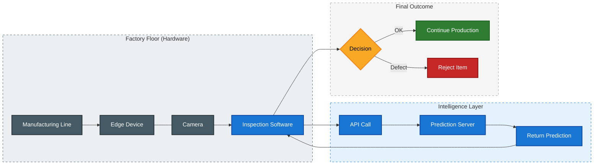

**Components Breakdown:**

1. **Edge Device**: Lives in the factory, controls the camera
2. **Inspection Software**: Orchestrates the entire workflow
3. **Prediction Server**: Can be cloud-based or at the edge
   - Cloud: Better accuracy, requires internet
   - Edge: More reliable (no internet dependency), critical for manufacturing

**Why Edge Deployment in Manufacturing?**
Factories cannot afford downtime when internet connectivity fails. Edge deployment ensures continuous operation.

---

# 2. The ML Project Lifecycle

### The Four Major Phases

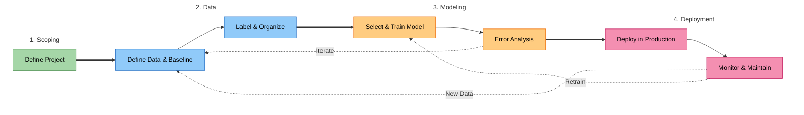

### Phase 1: Scoping

**Goal: Define project**

Questions to answer:

- What exactly will ML be applied to?
- What is X (input) and Y (output)?
- What are the key metrics?
- What resources are needed?
- What is the timeline?

**Example: Speech Recognition for Voice Search**

Metrics to consider:

- **Accuracy**: How correct are the transcriptions?
- **Latency**: How long to transcribe? (Target: < 500ms)
- **Throughput**: Queries per second (QPS)

Resource estimation:

- Compute requirements
- Budget
- Team size and timeline

### Phase 2: Data

**Goal: Define data, establish baseline, label and organize**

Key activities:

1. **Define the data**: What exactly are you collecting?
2. **Establish baseline**: Current performance benchmark
3. **Label and organize**: Consistent, high-quality labels

#### Data Definition Challenge: Label Consistency

Consider this audio clip transcription example:

**Audio:** "Um today's weather"

**Three possible transcriptions:**

1. "Um today's weather" (include hesitation)
2. "Today's weather" (clean transcript)
3. _noise_ (mark as noise)

**The Problem:**
If 1/3 of labelers use each convention, your data becomes inconsistent and confusing for the algorithm.

**The Solution:**
Standardize on ONE convention across all labelers.

#### Other Data Definition Questions

For audio data:

- How much silence before/after speech? (100ms? 300ms? 500ms?)
- How to perform volume normalization?
- What if volume varies within a single clip?

**Important Mindset Shift:**

- **Traditional ML Research:** You treat the **Dataset as fixed** (like a benchmark) and work on the **Code** to get better results.
- **Production ML Approach:** You treat the **Code as fixed** (using proven models) and work on the **Data** (quality/labels) to get better results.

| Approach                 | Logic                       | Focus                    |
| ------------------------ | --------------------------- | ------------------------ |
| **Traditional Research** | `Fixed Dataset → Vary Code` | Optimizing the Algorithm |
| **Production ML**        | `Fixed Code → Vary Data`    | Optimizing Data Quality  |

### Phase 3: Modeling

**Goal: Select/Train model & Perform error analysis**

**Key Activities:**

1. Select model architecture
2. Train the model
3. **Error analysis** (critical!)
4. Iterate based on findings

**Error Analysis → Targeted Data Collection**

Instead of blindly collecting more data:

1. Analyze where model fails
2. Identify specific data gaps
3. Collect targeted data to address gaps
4. Much more efficient than general data collection

#### Model-Centric vs Data-Centric AI

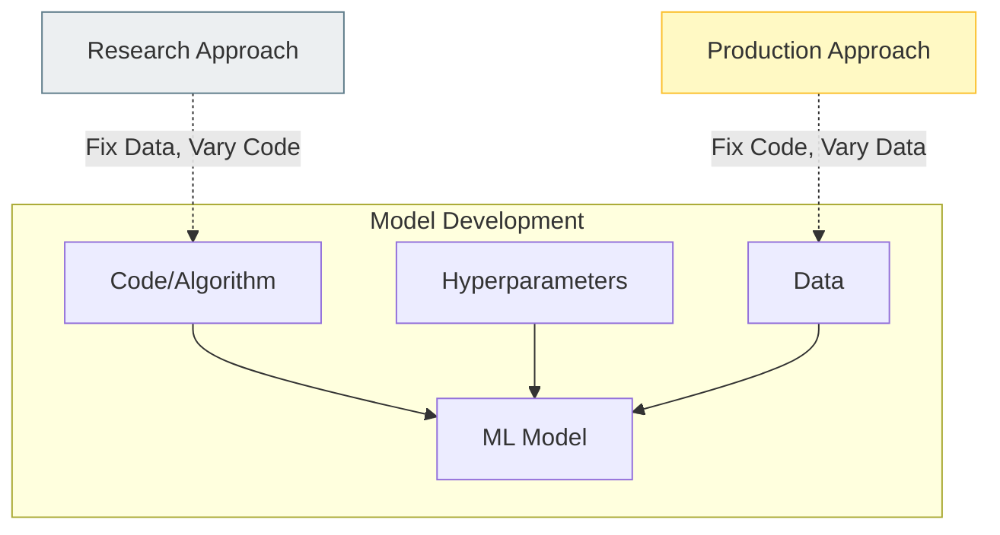

### Phase 4: Deployment

**Goal: Deploy, Monitor & Maintain System**

**Deployment Components:**

1. Write production software
2. Monitor system performance
3. Track incoming data
4. Maintain the system

**Why Deployment is Only Halfway:**

Before deployment:

- Controlled environment
- Known data distribution
- Tested scenarios

After deployment:

- Real-world data
- Edge cases appear
- Data distribution shifts
- New failure modes discovered

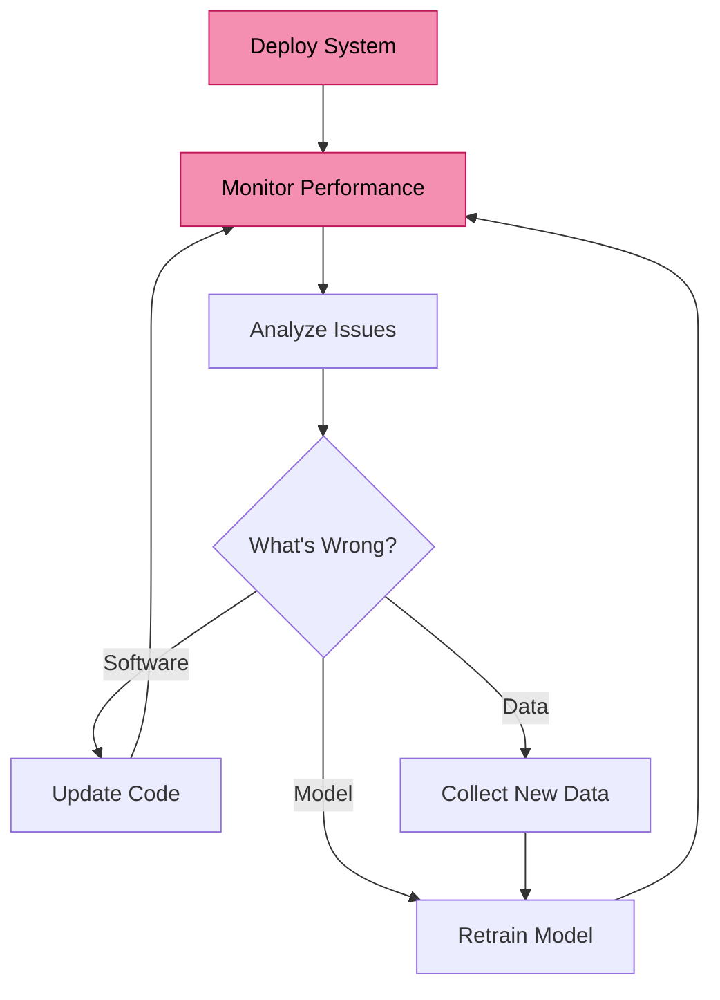

# 3. Case Study: Speech Recognition

This comprehensive case study walks through building a production speech recognition system for voice search, demonstrating how each phase of the ML lifecycle applies to a real-world application.

---

## Overview: The Complete Journey

Speech recognition has been one of deep learning's major success stories, enabling voice search, smart speakers, and mobile assistants. However, building an accurate model is just the beginning. This case study shows what it takes to build a **production-ready** system.

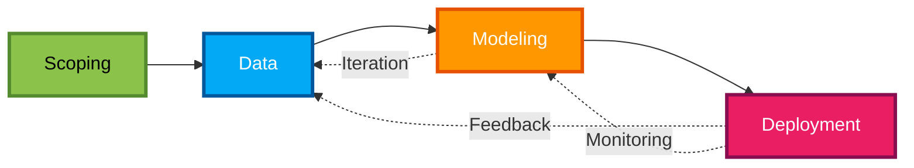

**Key Insight:** Notice the feedback loops. This isn't a linear process—deployment insights inform modeling decisions, which reveal data needs, creating a continuous improvement cycle.

---

## Phase 1: Scoping

### Defining the Project

**Decision:** Build speech recognition for voice search on mobile devices

This seemingly simple statement answers critical questions:

- **What**: Speech recognition
- **Use case**: Voice search (not transcription, not commands)
- **Platform**: Mobile devices (constraints on compute and latency)

### Key Metrics Definition

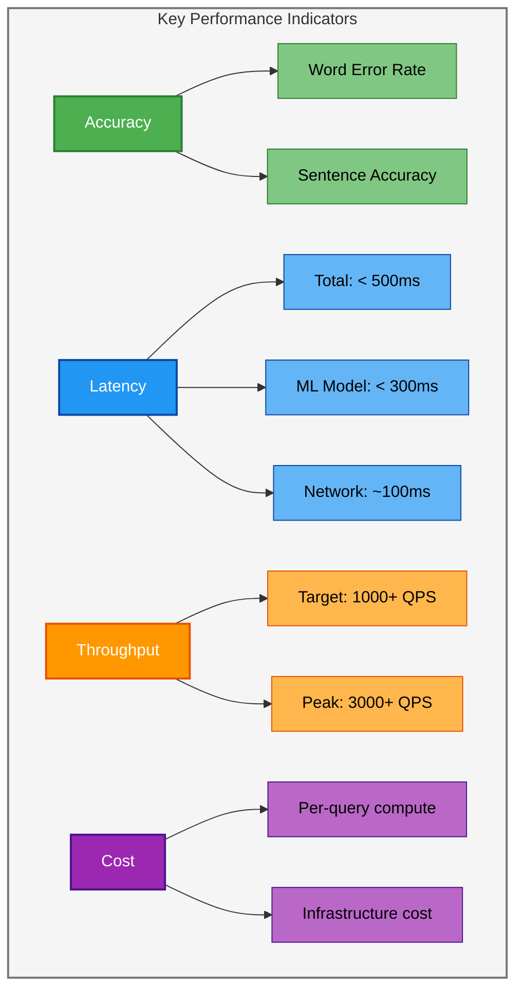

**Why these specific numbers?**

| Metric               | Target    | Reasoning                                                |
| -------------------- | --------- | -------------------------------------------------------- |
| **Total Latency**    | < 500ms   | Human perception threshold; feels "instant"              |
| **ML Model Latency** | < 300ms   | Leaves budget for network, preprocessing, postprocessing |
| **QPS**              | 1000+     | Expected user load based on market research              |
| **Accuracy**         | > 95% WER | Industry standard for production voice search            |

### Resource Estimation

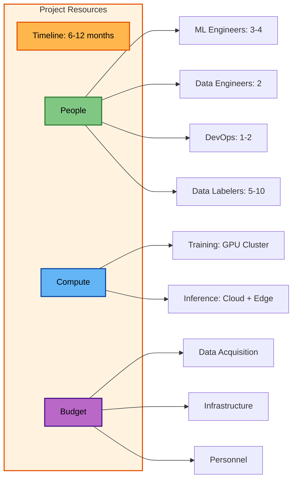

**Timeline Breakdown:**

- **Months 1-2:** Data collection and definition
- **Months 3-4:** Initial model training and iteration
- **Months 5-6:** Production system development
- **Months 7-8:** Testing and refinement
- **Months 9-10:** Deployment and monitoring setup
- **Months 11-12:** Optimization and scaling

---

## Phase 2: Data

### The Challenge: Data Label Consistency

This is where many production systems fail. The problem isn't getting data—it's getting **consistent** data.

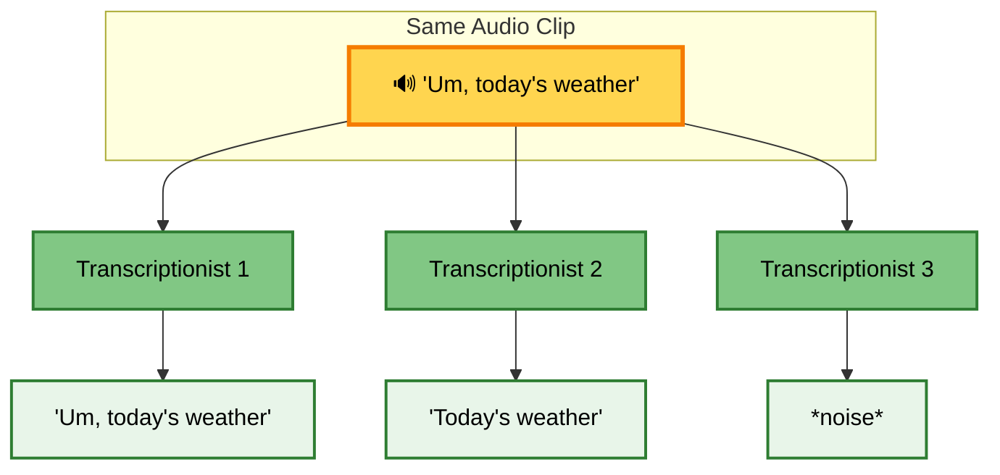

### Why Inconsistency Kills Performance

Let's understand this with a concrete example:

**Scenario 1: Consistent Labeling**

```python
# All 1000 examples labeled the same way
consistent_dataset = [
    ("um_todays_weather.wav", "today's weather"),
    ("um_whats_time.wav", "what's the time"),
    ("uh_tomorrow_forecast.wav", "tomorrow's forecast"),
    # ... 997 more examples, all consistently removing filler words
]

# Model learns: "Remove 'um' and 'uh', transcribe the rest"
# Clear, learnable pattern ✓
```

**Scenario 2: Inconsistent Labeling**

```python
# 1000 examples labeled three different ways
inconsistent_dataset = [
    # 333 examples: keep filler words
    ("um_todays_weather.wav", "um today's weather"),
    ("uh_tomorrow_forecast.wav", "uh tomorrow's forecast"),

    # 333 examples: remove filler words
    ("um_whats_time.wav", "what's the time"),
    ("uh_show_restaurants.wav", "show me restaurants"),

    # 334 examples: mark as noise
    ("um_play_music.wav", "*noise*"),
    ("uh_call_mom.wav", "*noise*"),
]

# Model's confusion:
# - Same input features (audio with 'um')
# - Three different labels
# - No way to know which convention to follow
# Result: Poor performance ✗
```

**Impact on Model Performance:**

```
Consistent Labeling:
  Accuracy: 95%
  Model learns clear patterns

Inconsistent Labeling:
  Accuracy: 72%
  Model cannot learn reliable patterns
  Effectively reduces training data by 3x
```

### Data Definition Decisions

Critical questions that must be answered before labeling begins:

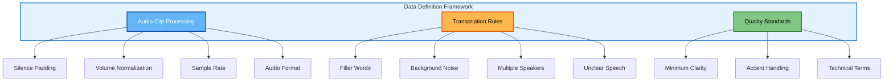

**Detailed Decision Table:**

| Aspect                   | Options                    | Chosen Approach       | Rationale                             |
| ------------------------ | -------------------------- | --------------------- | ------------------------------------- |
| **Silence Padding**      | 100ms / 300ms / 500ms      | **300ms**             | Balances context capture vs data size |
| **Volume Normalization** | Peak / RMS / Loudness      | **RMS normalization** | Handles variable volume clips         |
| **Filler Words**         | Keep / Remove / Mark       | **Remove**            | Matches user intent better            |
| **Background Noise**     | Transcribe / Ignore / Mark | **Ignore (filter)**   | Improves signal clarity               |
| **Multiple Speakers**    | Separate / Primary only    | **Primary only**      | Simplifies use case                   |
| **Accent Variations**    | Standardize / Keep         | **Keep variations**   | Maintains diversity                   |

### Data Sources and Splits

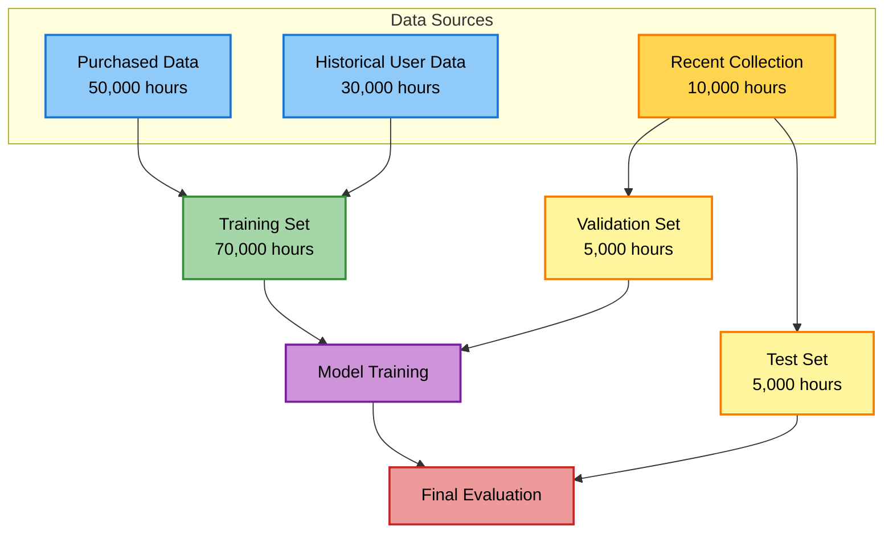

**Critical Insight: Recent Data for Test Set**

Why use recent data (last 3 months) for test/validation?

1. **Language Evolution**: New vocabulary emerges constantly

   ```
   2023: "ChatGPT" didn't exist in voice search
   2024: Now a common query term
   ```

2. **Usage Patterns Change**:
   - Seasonal variations (weather queries)
   - Cultural events (sports, holidays)
   - Technology trends

3. **Production Distribution Match**: Test data should mirror what you'll see in production

**Data Quality Framework:**

```python
# Systematic data quality checks
def validate_audio_clip(clip):
    """
    Ensure every audio clip meets quality standards
    """
    checks = {
        'duration': 0.5 <= clip.duration <= 10.0,  # seconds
        'sample_rate': clip.sample_rate == 16000,   # Hz
        'silence_ratio': clip.silence_ratio < 0.3,  # < 30% silence
        'snr': clip.signal_to_noise_ratio > 10,     # dB
        'clipping': not clip.has_clipping,          # no distortion
    }
    return all(checks.values()), checks

# Label consistency validation
def check_label_consistency(dataset):
    """
    Detect labeling inconsistencies across transcribers
    """
    # Group similar audio clips
    similar_clips = find_similar_audio(dataset)

    inconsistencies = []
    for group in similar_clips:
        labels = [clip.label for clip in group]
        if len(set(labels)) > 1:
            # Same audio, different labels = inconsistency
            inconsistencies.append(group)

    return inconsistencies

# Usage in production pipeline
quality_passed = 0
quality_failed = 0

for clip in raw_dataset:
    is_valid, checks = validate_audio_clip(clip)
    if is_valid:
        quality_passed += 1
        training_dataset.add(clip)
    else:
        quality_failed += 1
        logging.warning(f"Clip failed: {checks}")

print(f"Quality pass rate: {quality_passed/(quality_passed + quality_failed):.2%}")
```

---

## Phase 3: Modeling

### The Production Mindset: Data-Centric AI

Traditional research focuses on model architecture. Production focuses on data quality.

```mermaid
graph TB
    subgraph Research["Research Approach"]
        R1[Fixed Dataset] --> R2[Vary Architecture]
        R2 --> R3[RNN → LSTM → Transformer]
        R3 --> R4[Experiment Hyperparameters]
        R4 --> R5[Best Model]
    end

    subgraph Production["Production Approach"]
        P1[Fixed Architecture] --> P2[Optimize Data]
        P2 --> P3[Improve Consistency]
        P3 --> P4[Add Targeted Examples]
        P4 --> P5[Production Model]
    end

    style Research fill:#FFEBEE,stroke:#C62828,stroke-width:2px
    style Production fill:#E8F5E9,stroke:#2E7D32,stroke-width:2px

    style R1 fill:#EF9A9A,stroke:#C62828,color:#000,stroke-width:2px
    style R5 fill:#A5D6A7,stroke:#388E3C,color:#000,stroke-width:2px
    style P1 fill:#A5D6A7,stroke:#388E3C,color:#000,stroke-width:2px
    style P5 fill:#4CAF50,stroke:#1B5E20,color:#fff,stroke-width:3px
```

### Model Development Components

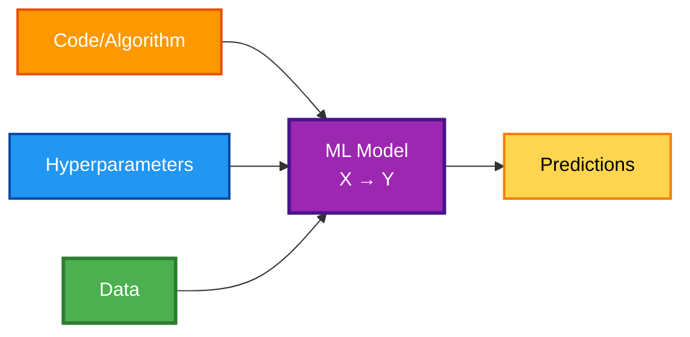

**Key Insight:** In production, Data (green) gets the most attention, not Code (orange).

### Why Fix the Code?

**Rationale for using proven architectures:**

1. **Reduced Risk**: Well-tested architectures are reliable
2. **Resource Efficiency**: Don't reinvent the wheel
3. **Team Bandwidth**: Focus on what matters—data and deployment
4. **Maintenance**: Easier to maintain standard architectures

**Practical Approach:**

```python
# Instead of designing custom architecture
# Use proven, open-source implementation

from transformers import Wav2Vec2ForCTC
import torch

# Use pre-trained model as starting point
model = Wav2Vec2ForCTC.from_pretrained(
    "facebook/wav2vec2-large-960h"
)

# Focus effort on fine-tuning with high-quality data
# Not on architecture experimentation
```

### Error Analysis: The Production Superpower

Error analysis isn't just debugging—it's your data collection strategy.

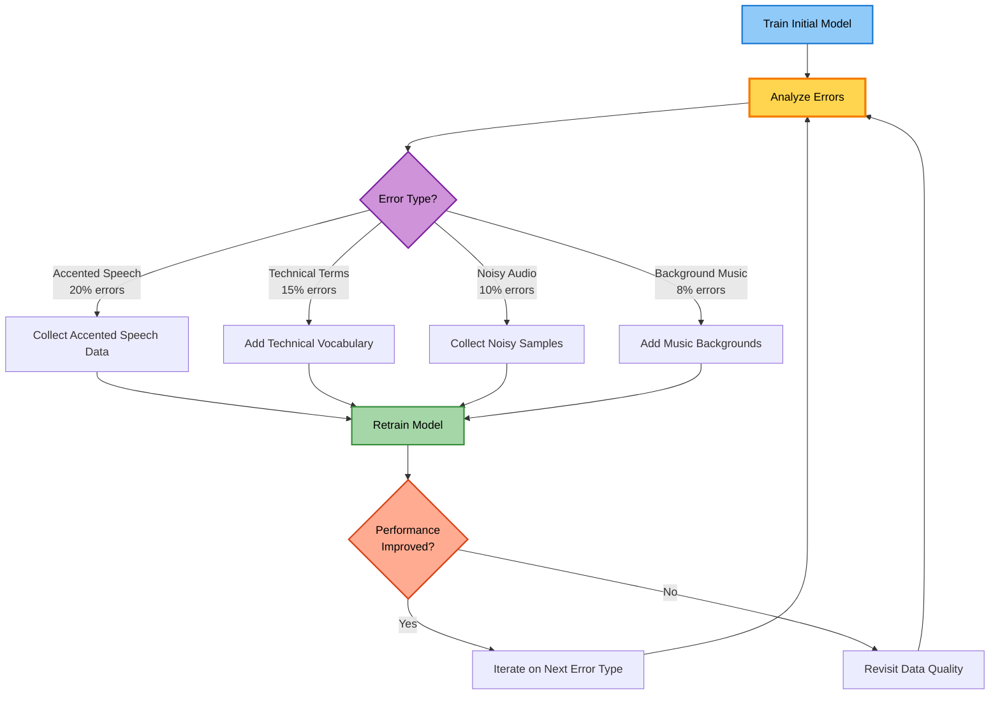

### Targeted Data Collection Strategy

**Before Error Analysis:**

```
"We need more data"
→ Collect 10,000 random audio clips
→ Cost: $50,000
→ Improvement: 1-2% accuracy
```

**After Error Analysis:**

```
"We need data for specific error types"
→ Collect 2,000 targeted samples:
   - 800 accented speech clips
   - 600 technical term clips
   - 400 noisy environment clips
   - 200 multi-speaker clips
→ Cost: $15,000
→ Improvement: 5-7% accuracy
```

**5x more efficient!**

### Practical Error Analysis Workflow

```python
def analyze_errors(model, test_set):
    """
    Systematic error analysis for speech recognition
    """
    errors_by_category = {
        'accents': [],
        'technical_terms': [],
        'background_noise': [],
        'speech_rate': [],
        'multiple_speakers': [],
        'audio_quality': [],
        'other': []
    }

    for sample in test_set:
        prediction = model.predict(sample.audio)
        if prediction != sample.true_transcript:
            # Categorize the error
            category = categorize_error(sample, prediction)
            errors_by_category[category].append({
                'audio': sample.audio,
                'predicted': prediction,
                'actual': sample.true_transcript,
                'metadata': sample.metadata
            })

    # Generate report
    print("\n=== Error Analysis Report ===\n")
    for category, errors in errors_by_category.items():
        error_rate = len(errors) / len(test_set)
        print(f"{category}: {error_rate:.2%} ({len(errors)} samples)")

        # Show examples
        if errors:
            print(f"  Example:")
            print(f"    Predicted: {errors[0]['predicted']}")
            print(f"    Actual: {errors[0]['actual']}")
            print()

    return errors_by_category

# Example output:
"""
=== Error Analysis Report ===

accents: 3.2% (320 samples)
  Example:
    Predicted: "what's the time"
    Actual: "what's the weather"

technical_terms: 2.1% (210 samples)
  Example:
    Predicted: "kubernetes"
    Actual: "communities"

background_noise: 1.5% (150 samples)
  Example:
    Predicted: "play music"
    Actual: "play music now" (last word drowned by noise)
"""
```

---

## Phase 4: Deployment

### Production System Architecture

The deployment phase transforms a model into a real service. Here's the complete system:

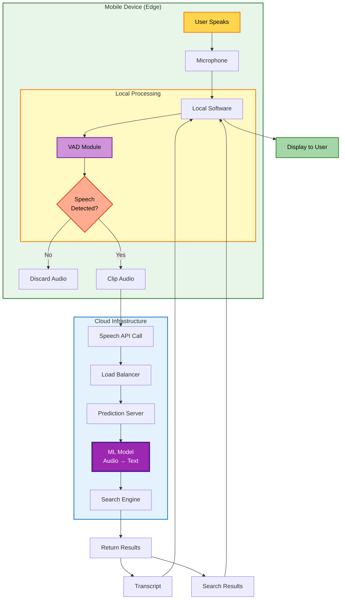

### Component Deep Dive

#### 1. VAD (Voice Activity Detection) Module

**Purpose:** Conserve bandwidth and computational resources

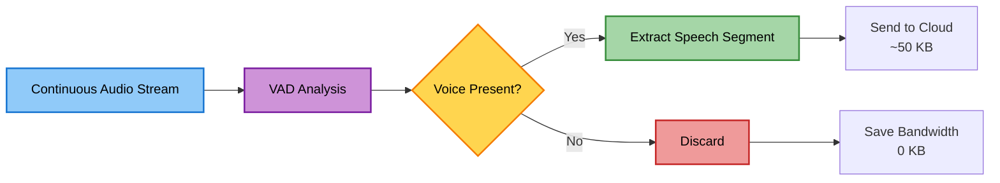

**Why VAD matters:**

```
Without VAD:
- Stream entire audio to cloud
- 1 minute of silence = 960 KB uploaded
- Cost: $$$
- Latency: High
- User experience: Poor

With VAD:
- Only send speech segments
- 1 minute, 10 seconds speech = 160 KB uploaded
- Cost: $
- Latency: Low
- User experience: Good
```

**Simple VAD Implementation:**

```python
def simple_vad(audio_chunk, threshold_energy=0.02):
    """
    Lightweight voice activity detection

    Args:
        audio_chunk: numpy array of audio samples
        threshold_energy: minimum energy to consider as speech

    Returns:
        bool: True if speech detected, False otherwise
    """
    # Calculate energy (simplified)
    energy = np.sqrt(np.mean(audio_chunk ** 2))

    # Check if energy exceeds threshold
    return energy > threshold_energy

# Usage in streaming context
CHUNK_SIZE = 1024  # samples
audio_stream = microphone.get_stream()

for chunk in audio_stream:
    if simple_vad(chunk):
        # Speech detected, accumulate
        speech_buffer.append(chunk)
    elif len(speech_buffer) > 0:
        # Silence after speech, send accumulated audio
        send_to_cloud(speech_buffer)
        speech_buffer.clear()
```

#### 2. Prediction Server

**Architecture decisions:**

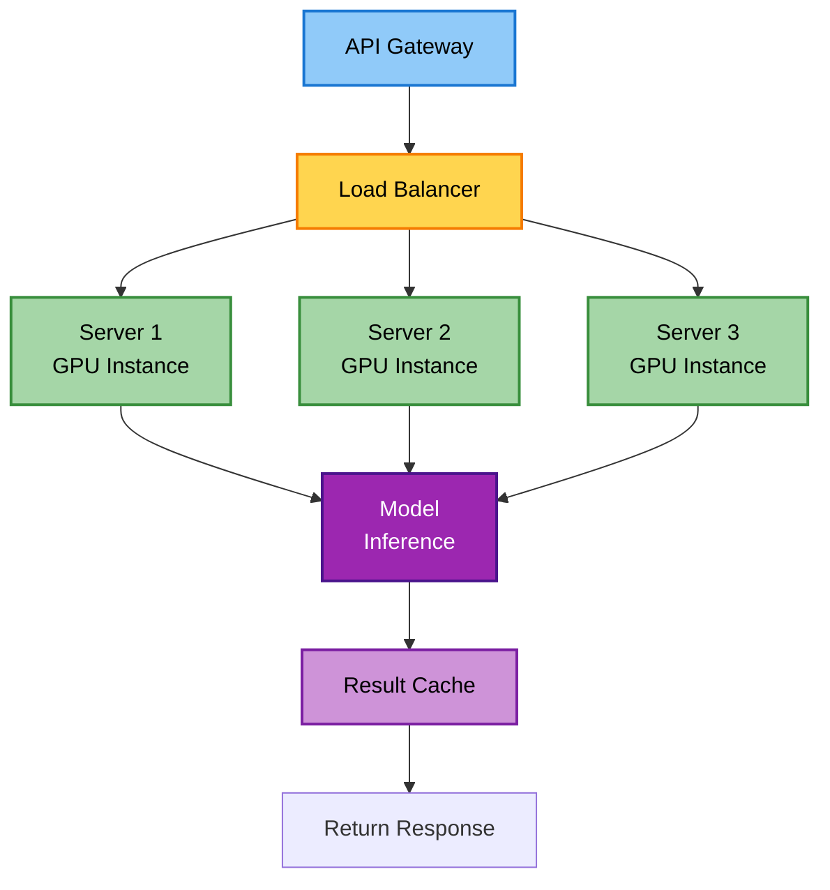

**Server Specifications:**

```python
# Production server configuration
SERVER_CONFIG = {
    'hardware': {
        'gpu': 'NVIDIA T4',
        'cpu': '8 cores',
        'ram': '32 GB',
        'storage': '500 GB SSD'
    },
    'software': {
        'framework': 'PyTorch',
        'serving': 'TorchServe',
        'container': 'Docker',
        'orchestration': 'Kubernetes'
    },
    'performance': {
        'batch_size': 16,
        'max_latency_ms': 300,
        'target_qps': 100  # per server
    }
}

# Auto-scaling rules
SCALING_RULES = {
    'min_instances': 3,
    'max_instances': 20,
    'scale_up_threshold': 'cpu > 70% for 5 minutes',
    'scale_down_threshold': 'cpu < 30% for 15 minutes'
}
```

### Real Deployment Challenge: Concept Drift

**The Problem:** Distribution shift over time

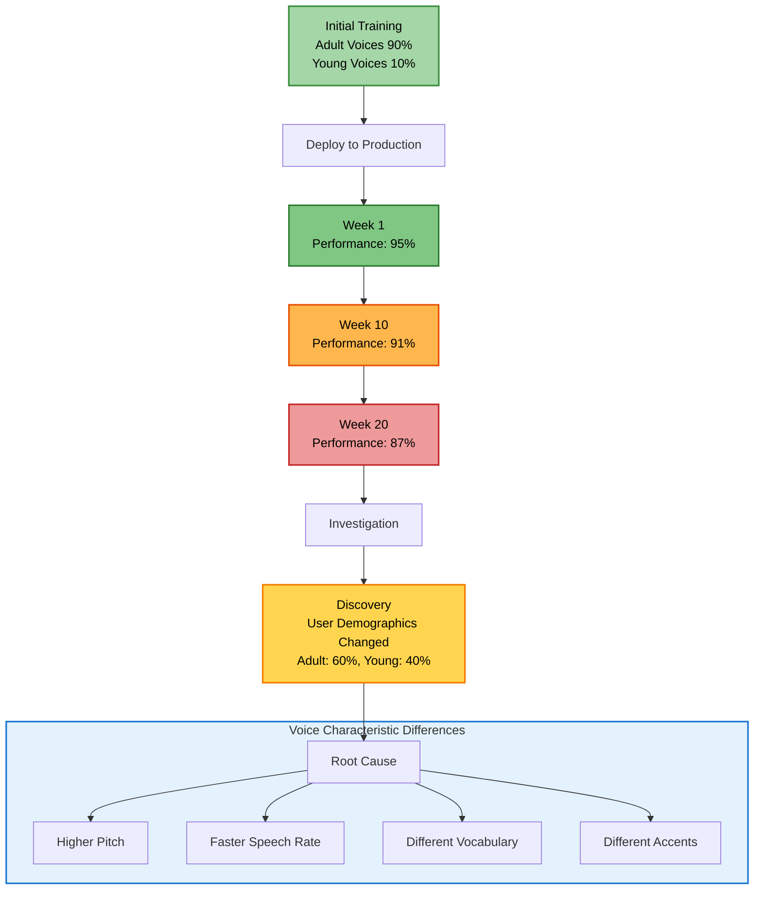

### Understanding the Drift

**What happened?**

Initially:

```
Training Data Distribution:
- Adult voices (age 25-50): 90%
- Young voices (age 13-24): 10%

Model Performance:
- Adult voices: 96% accuracy
- Young voices: 88% accuracy
- Overall: 95% accuracy
```

After 5 months:

```
Production Data Distribution:
- Adult voices: 60%
- Young voices: 40%

Model Performance (unchanged model):
- Adult voices: 96% accuracy (same)
- Young voices: 88% accuracy (same)
- Overall: 93.6% accuracy (degraded!)

Calculation:
0.60 × 0.96 + 0.40 × 0.88 = 0.936 (93.6%)
```

**Why young voices are different:**

| Characteristic            | Adult Voices       | Young Voices       | Impact on Model             |
| ------------------------- | ------------------ | ------------------ | --------------------------- |
| **Fundamental Frequency** | 100-200 Hz         | 200-300 Hz         | Different acoustic features |
| **Speech Rate**           | 140-160 words/min  | 160-200 words/min  | Timing patterns differ      |
| **Vocabulary**            | Formal, complete   | Slang, abbreviated | Unknown words               |
| **Pronunciation**         | Clear articulation | Casual, blended    | Harder to segment           |

### The Solution: Adaptive Data Collection

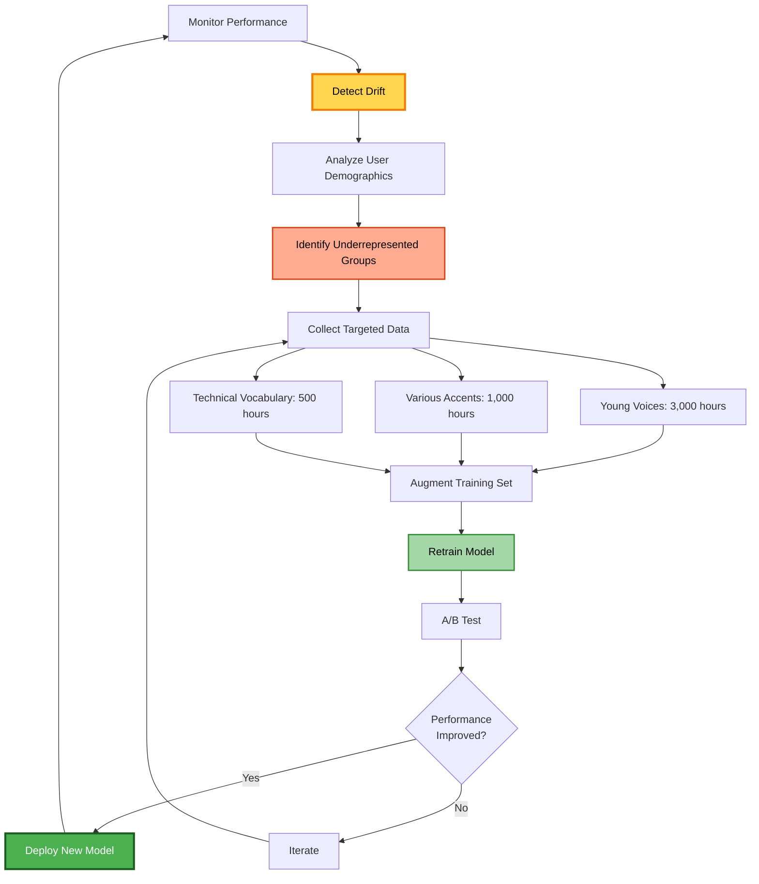

**Retraining Results:**

```
New Training Data:
- Adult voices: 70,000 hours
- Young voices: 13,000 hours (10% → 15.6%)
- Total: 83,000 hours

New Model Performance:
- Adult voices: 96% accuracy (maintained)
- Young voices: 93% accuracy (improved from 88%)
- Overall: 95.2% accuracy (recovered + improved!)

Production Distribution (40% young):
0.60 × 0.96 + 0.40 × 0.93 = 0.952 (95.2%)
```

### Monitoring for Drift

**Key metrics to track:**

```python
# Production monitoring dashboard
class DriftMonitor:
    def __init__(self):
        self.baseline_stats = self.load_baseline()

    def check_drift(self, production_data):
        """
        Monitor for distribution changes
        """
        current_stats = self.calculate_stats(production_data)

        drift_detected = False
        alerts = []

        # Check demographic shifts
        if abs(current_stats['age_distribution'] -
               self.baseline_stats['age_distribution']) > 0.10:
            drift_detected = True
            alerts.append("Age distribution shifted by >10%")

        # Check performance by segment
        for segment in ['adult', 'young', 'elderly']:
            if (current_stats[f'{segment}_accuracy'] <
                self.baseline_stats[f'{segment}_accuracy'] - 0.03):
                drift_detected = True
                alerts.append(f"{segment} accuracy dropped >3%")

        # Check vocabulary drift
        unknown_word_rate = current_stats['unknown_words'] / current_stats['total_words']
        if unknown_word_rate > 0.05:  # >5% unknown words
            drift_detected = True
            alerts.append(f"High unknown word rate: {unknown_word_rate:.2%}")

        return drift_detected, alerts

# Example alert
"""
DRIFT ALERT - 2024-06-15
- Age distribution shifted by 12% (more young users)
- Young segment accuracy dropped 4.2%
- Unknown word rate: 6.3% (threshold: 5%)

Recommended Action: Collect targeted young voice data
"""
```

---

## Key Takeaways from Speech Recognition Case Study

### 1. Scoping Sets the Foundation

Clear metrics and resource planning prevent scope creep:

- Define specific, measurable targets
- Estimate resources realistically
- Plan for 2-3x the time you initially think

### 2. Data Quality > Data Quantity

Inconsistent labels are worse than no labels:

- Invest heavily in labeling guidelines
- Validate consistency across annotators
- Quality control is not optional

### 3. Data-Centric Beats Model-Centric

For production systems:

- Use proven architectures
- Focus on data improvement
- Let error analysis guide data collection

### 4. Deployment is Continuous

Production is never "done":

- Monitor for drift constantly
- Plan for retraining from day one
- Build feedback loops into the system

### 5. Real-World Complexity

Production adds many challenges:

- VAD needed for bandwidth efficiency
- Load balancing for scale
- Drift monitoring for maintenance
- Cost optimization for sustainability

---

## Discussion Questions

### Question 1: Alternative Approaches

How would the system design change if we optimized for:

1. **Privacy first** (no cloud, all on-device)
2. **Cost first** (minimize compute)
3. **Accuracy first** (unlimited budget)

### Question 2: Drift Detection

What are early warning signs of drift in speech recognition?

- Which metrics would you monitor?
- How would you set alert thresholds?
- When would you trigger retraining?

### Question 3: Data Collection Strategy

Given a $50,000 budget for additional training data:

- How would you allocate it?
- What types of data would you prioritize?
- How would you measure ROI?

---

## Practical Exercise

### Build a Drift Simulator

Create a simulation that demonstrates concept drift:

```python
# Exercise: Simulate the young voice drift scenario
import numpy as np

def simulate_drift():
    """
    Simulate performance degradation as user demographics shift
    """
    # Initial distribution
    adult_ratio = 0.90
    young_ratio = 0.10

    # Model accuracy by segment
    adult_accuracy = 0.96
    young_accuracy = 0.88

    # Simulate months
    months = 24
    drift_rate = 0.015  # 1.5% shift per month

    results = []
    for month in range(months):
        # Demographics drift
        current_adult_ratio = max(0.5, adult_ratio - month * drift_rate)
        current_young_ratio = 1 - current_adult_ratio

        # Overall performance
        overall_accuracy = (current_adult_ratio * adult_accuracy +
                           current_young_ratio * young_accuracy)

        results.append({
            'month': month,
            'adult_ratio': current_adult_ratio,
            'young_ratio': current_young_ratio,
            'accuracy': overall_accuracy
        })

    return results

# TODO: Plot the drift over time
# TODO: Determine when to trigger retraining
# TODO: Simulate improvement after retraining
```

**Bonus:** Add noise, seasonal effects, and multiple demographic shifts.

---

This case study demonstrates that building production ML systems requires much more than training accurate models. Success depends on careful planning, systematic data management, continuous monitoring, and adaptive maintenance.

# 4. Course Structure

The course teaches the lifecycle in reverse order (most practical approach):


**Why this order?**

Starting with the end goal (deployment) helps you understand:

- What constraints deployment imposes on modeling
- What data quality requirements exist
- How to scope projects for successful deployment

### What You'll Learn

**Week 1: Deployment**

- Deployment patterns
- Monitoring strategies
- Handling drift
- Production challenges

**Week 2: Modeling**

- Data-centric approach
- Error analysis
- Model iteration
- Baseline establishment

**Week 3: Data + Scoping**

- Data definition
- Labeling strategies
- Baseline establishment
- Project scoping (optional)

**Final Project:**
End-to-end news classification project following the complete lifecycle.

### MLOps Introduction

**MLOps = Machine Learning Operations**

A discipline that comprises:

- Tools and principles
- Best practices
- Automation capabilities
- Supporting the full ML lifecycle

Think of MLOps as DevOps for Machine Learning.

**Before MLOps:**

- Manual data labeling
- Manual model training
- Manual deployment
- Manual monitoring
- Slow iteration cycles

**With MLOps:**

- Automated pipelines
- Systematic monitoring
- Faster iteration
- Reproducible workflows
- Better collaboration

---

# 5. Key Deployment Challenges

### Challenge 1: ML/Statistical Issues

#### Concept Drift vs Data Drift

Let's understand these with clear examples:

**Data Drift: Input Distribution Changes (P(X) changes)**

Example 1: Housing Prices

```
Before: Average house size = 2000 sq ft
After: Average house size = 2500 sq ft
→ Input distribution shifted
```

Example 2: Search Queries

```
Before: No one searches for "COVID-19"
After: Millions of searches for "COVID-19"
→ New concepts appear in input
```

**Concept Drift: Input→Output Mapping Changes (P(Y|X) changes)**

Example 1: Housing Prices

```
X: House size = 2000 sq ft
Before COVID: Y = $300,000
After COVID: Y = $400,000 (same house, different price)
→ The relationship changed
```

Example 2: Fraud Detection

```
X: $500 online purchase
Before COVID: Suspicious (user rarely shops online)
After COVID: Normal (everyone shops online now)
→ What constitutes "fraud" changed
```

**Visual Comparison:**

```mermaid
graph TB
    subgraph "Data Drift"
        A1[X Distribution Changes] --> B1[Houses Built Larger]
        A1 --> C1[New Search Terms Appear]
        A1 --> D1[New Smartphone Models]
    end

    subgraph "Concept Drift"
        A2[X→Y Mapping Changes] --> B2[Same House, Different Price]
        A2 --> C2[Same Purchase, Different Risk]
        A2 --> D2[Same Audio, Different Meaning]
    end
```

#### Gradual vs Sudden Changes

**Gradual Change Example:**

```
Language Evolution:
Month 1: "That's cool" (positive)
Month 12: "That's cool" (positive)
Year 5: "That's mid" (neutral - new slang emerges)
→ Slow drift over years
```

**Sudden Change Example:**

```
COVID-19 Impact on Fraud Detection:
March 2019: Online shopping patterns stable
March 2020: Everything changes overnight
→ Immediate, dramatic shift
```

**Manufacturing Example:**

```mermaid
graph LR
    A[Training Images] --> B[Well-lit Photos]
    C[Production Images] --> D[Dark Photos]
    B -.Different.-> D
    E[Lighting Changed] --> D

    style B fill:#90EE90
    style D fill:#FFB6C1
```

This is data drift—the input images look different due to lighting changes.

### Challenge 2: Software Engineering Issues

#### Design Checklist for Production ML

**1. Real-time vs Batch Predictions**

```mermaid
graph TB
    subgraph "Real-time Prediction"
        A1[User Request] --> B1[Immediate Response]
        B1 --> C1[< 500ms latency]
    end

    subgraph "Batch Prediction"
        A2[Collect Requests] --> B2[Process Overnight]
        B2 --> C2[Results Available Next Day]
    end
```

**When to use each:**

Real-time:

- Voice search
- Fraud detection
- Recommendation systems
- Self-driving cars

Batch:

- Hospital patient risk analysis
- Monthly sales forecasting
- Bulk email classification
- Offline report generation

**2. Cloud vs Edge vs Browser Deployment**

| Deployment  | Pros                                       | Cons                                                | Use Cases                                  |
| ----------- | ------------------------------------------ | --------------------------------------------------- | ------------------------------------------ |
| **Cloud**   | Powerful compute, Easy updates, Scalable   | Requires internet, Higher latency, Privacy concerns | Web search, Email filtering                |
| **Edge**    | Works offline, Lower latency, More private | Limited compute, Harder updates                     | Factory inspection, Car systems            |
| **Browser** | No backend needed, Instant load, Private   | Very limited compute                                | Simple classifiers, Privacy-sensitive apps |

**Example Decision Tree:**

```
Is internet reliability critical?
├─ Yes → Edge deployment (factory, car)
└─ No → Can we afford cloud costs?
    ├─ Yes → Cloud deployment
    └─ No → Edge or Browser
```

**3. Compute Resources**

Common mismatch:

```
Training: 8x NVIDIA A100 GPUs
Deployment Budget: 1x NVIDIA T4 GPU

Problem: Model too large/slow for deployment hardware
Solutions:
- Model compression
- Quantization
- Knowledge distillation
- Simpler architecture
```

**4. Latency Requirements**

Speech recognition example:

```
Total latency budget: 500ms
├─ Network: 100ms
├─ ML model: 300ms
├─ Post-processing: 50ms
└─ Buffer: 50ms
```

If ML model takes 800ms, it fails requirements.

**5. Throughput (QPS - Queries Per Second)**

```python
# Example: Can we handle the load?

# Given:
queries_per_second = 1000
model_latency_ms = 100  # milliseconds per query
servers_available = 5

# Calculate:
queries_per_server = queries_per_second / servers_available  # 200 QPS
time_per_query = model_latency_ms / 1000  # 0.1 seconds
max_qps_per_server = 1 / time_per_query  # 10 QPS

# Result:
# Need 200 QPS but can only handle 10 QPS per server
# Need 100 servers, not 5!
```

**6. Logging**

**Why log everything you can?**

```mermaid
graph TB
    A[Log Inputs] --> E[Debug Issues]
    B[Log Outputs] --> E
    C[Log Latencies] --> E
    D[Log Errors] --> E
    E --> F[Error Analysis]
    E --> G[Retrain with Real Data]
    E --> H[Monitor Performance]
```

Logged data becomes your training data for the next version!

**7. Security and Privacy**

Security levels vary dramatically:

**Low Security:**

```
Public movie recommendations
→ Basic security, public data
```

**High Security:**

```
Electronic health records
→ HIPAA compliance
→ Encryption at rest and in transit
→ Access controls
→ Audit logs
→ Data anonymization
```

**Privacy Considerations:**

- Can you store user data?
- How long to retain logs?
- Compliance requirements (GDPR, HIPAA, etc.)
- User consent for data collection

---

# 6. Common Deployment Patterns

### Pattern 1: Shadow Mode Deployment

**When to use:** Replacing human decisions or existing systems

```mermaid
graph TB
    A[Smartphone Arrives] --> B[Human Inspector]
    A --> C[ML Algorithm]
    B --> D[Make Decision]
    C --> E[Shadow Prediction]
    E -.Not Used.-> D
    E --> F[Log and Compare]
    D --> F
```

**How it works:**

1. ML algorithm runs in parallel with current system
2. ML predictions are logged but NOT used
3. Compare ML predictions with actual decisions
4. Validate ML performance before going live

**Example:**

```
Phone 1:
Human: OK (no defect)
ML: OK
✓ Agreement

Phone 2:
Human: NOT OK (scratch)
ML: NOT OK
✓ Agreement

Phone 3:
Human: NOT OK (small scratch)
ML: OK
✗ Disagreement → Investigate!
```

**Benefits:**

- Zero risk deployment
- Collect performance data
- Identify edge cases
- Build confidence before full deployment

**Duration:** Typically run for days to weeks

### Pattern 2: Canary Deployment

**When to use:** Gradual rollout to production traffic

```mermaid
graph TB
    A[100% Traffic] --> B{Router}
    B -->|5%| C[New Model - Canary]
    B -->|95%| D[Old Model/Humans]
    C --> E[Monitor Closely]
    D --> F[Stable Performance]
    E --> G{Performing Well?}
    G -->|Yes| H[Increase to 10%]
    G -->|No| I[Rollback]
```

**Rollout Strategy:**

```
Week 1: 5% traffic → Monitor
Week 2: 10% traffic → Monitor
Week 3: 25% traffic → Monitor
Week 4: 50% traffic → Monitor
Week 5: 100% traffic → Full deployment
```

**What to monitor during canary:**

- Error rates
- Latency
- User feedback
- System health
- Business metrics

**Example Scenario:**

```
Visual Inspection System:
- Start: 5% of phones inspected by ML
- Monitor: Defect detection accuracy
- If accuracy drops: Rollback immediately
- If accuracy good: Increase percentage
```

**Origin of name:** Reference to "canary in a coal mine"—early warning system.

### Pattern 3: Blue-Green Deployment

**When to use:** Need ability for instant rollback

```mermaid
graph TB
    A[Camera/Input] --> B[Router]
    B -->|Current Traffic| C[Blue: Old System]
    B -.Standby.-> D[Green: New System]

    E[Switch Event] --> B

    F[After Switch] --> G[Router]
    G -.Standby.-> C
    G -->|All Traffic| D
```

**Implementation:**

```
Step 1: Blue (old) system handles all traffic
Step 2: Deploy Green (new) system (no traffic yet)
Step 3: Test Green system thoroughly
Step 4: Router switches traffic: Blue → Green
Step 5: Monitor Green system
Step 6: If issues arise: Switch back to Blue
```

**Advantages:**

- Instant rollback capability
- Full traffic switch (or gradual if preferred)
- Keep old system running as backup
- No downtime during switch

**Resource Requirements:**

```
Need to run BOTH systems simultaneously:
- 2x compute resources
- 2x memory
- Worth it for critical systems
```

### The Automation Spectrum

Not all deployments need full automation. Consider this spectrum:

```mermaid
graph LR
    A[Human Only] --> B[Shadow Mode]
    B --> C[AI Assistance]
    C --> D[Partial Automation]
    D --> E[Full Automation]

    style A fill:#FF6B6B
    style C fill:#FFD93D
    style E fill:#6BCF7F
```

**Level 1: Human Only**

```
Inspector examines phone → Makes decision
No AI involved
```

**Level 2: Shadow Mode**

```
Inspector examines phone → Makes decision
AI examines phone → Prediction logged (not used)
```

**Level 3: AI Assistance**

```
AI highlights potential defects → Inspector makes final decision
AI assists but doesn't decide
```

Example UI:

```
┌─────────────────────┐
│   Phone Image       │
│                     │
│  [!] ← AI detects   │
│  possible scratch   │
│                     │
│ Inspector Decision: │
│ [ OK ] [ Defect ]   │
└─────────────────────┘
```

**Level 4: Partial Automation**

```
AI confidence > 0.95 → Auto-accept
AI confidence < 0.05 → Auto-reject
0.05 ≤ confidence ≤ 0.95 → Send to human
```

```python
def make_decision(image, model):
    prediction, confidence = model.predict(image)

    if confidence > 0.95:
        return prediction  # High confidence: automate
    elif confidence < 0.05:
        return not prediction  # High confidence opposite: automate
    else:
        return send_to_human(image)  # Uncertain: human review
```

This is often the sweet spot for many applications!

**Level 5: Full Automation**

```
AI makes all decisions
No human in the loop
```

**Choosing the Right Level:**

Consumer internet (web search, recommendations):
→ Usually full automation (too much volume for humans)

Manufacturing, healthcare, finance:
→ Often partial automation or AI assistance (high stakes, lower volume)

**Important Note:** You don't have to reach Level 5. AI assistance or partial automation can be the right end goal depending on your application.

---

# 7. Monitoring ML Systems

### Why Monitoring Matters

```mermaid
graph TB
    A[Deploy Model] --> B[Monitor Performance]
    B --> C{Issues Detected?}
    C -->|Yes| D[Diagnose Problem]
    C -->|No| B
    D --> E{Issue Type?}
    E -->|Software| F[Fix Code]
    E -->|Model| G[Retrain Model]
    E -->|Data| H[Update Data]
    F --> B
    G --> B
    H --> G
```

**Key Principle:** Deployment is an iterative process, not a one-time event.

### Brainstorming What to Monitor

**Exercise for your team:**

1. List everything that could go wrong
2. For each problem, identify metrics to detect it
3. Set up dashboards for those metrics
4. Set alert thresholds

**Example Brainstorming Session:**

```
Problem: Server overload
→ Metric: CPU usage, memory usage, QPS
→ Alert: CPU > 80% or QPS > 1000

Problem: Model returning null too often
→ Metric: % null responses
→ Alert: Null rate > 10%

Problem: Data distribution changed
→ Metric: Average input values, missing values %
→ Alert: >20% change from baseline
```

### Three Categories of Metrics

#### 1. Software Metrics

**Standard system health indicators:**

| Metric      | What it Measures    | Example Threshold      |
| ----------- | ------------------- | ---------------------- |
| Memory      | RAM usage           | Alert if > 85%         |
| Compute     | CPU/GPU usage       | Alert if > 90%         |
| Latency     | Response time       | Alert if > 500ms (p99) |
| Throughput  | Requests/second     | Alert if < 100 QPS     |
| Server Load | Overall system load | Alert if > 0.9         |

**Good news:** Most MLOps tools track these automatically.

#### 2. Input Metrics (Has X changed?)

**Detect data drift:**

| Application        | Input Metrics                                              | Why It Matters                        |
| ------------------ | ---------------------------------------------------------- | ------------------------------------- |
| Speech Recognition | Avg audio length, Avg volume, Background noise level       | Detects recording environment changes |
| Visual Inspection  | Avg image brightness, Image resolution, Color distribution | Detects lighting/camera changes       |
| Structured Data    | % missing values, Value ranges, Categorical distribution   | Detects data pipeline issues          |

**Example: Tracking Missing Values**

```python
# Monitor missing values over time
def calculate_missing_rate(df):
    return df.isnull().sum() / len(df)

# Alert if sudden change
baseline_missing_rate = 0.05  # 5%
current_missing_rate = 0.25   # 25%

if current_missing_rate > baseline_missing_rate * 2:
    send_alert("Missing value rate jumped!")
```

**Why this matters:**

```
Week 1: 5% missing values → Normal
Week 2: 25% missing values → Something broke in data pipeline!
```

#### 3. Output Metrics (Has Y or behavior changed?)

**Detect concept drift and system issues:**

| Application        | Output Metrics                                                 | Interpretation                     |
| ------------------ | -------------------------------------------------------------- | ---------------------------------- |
| Speech Recognition | % null outputs, % immediate re-searches, Switch to typing rate | User satisfaction, system failures |
| Recommendations    | Click-through rate (CTR), Time on page, Bounce rate            | Relevance quality                  |
| Fraud Detection    | % flagged transactions, False positive rate (if available)     | Model performance                  |

**Example: Speech Recognition Monitoring**

```python
# Monitoring dashboard
metrics = {
    "null_rate": 0.12,  # 12% of queries return nothing
    "quick_retry_rate": 0.08,  # 8% users retry immediately
    "switch_to_typing": 0.05,  # 5% give up and type
    "avg_latency_ms": 450
}

# Historical baseline
baseline = {
    "null_rate": 0.05,
    "quick_retry_rate": 0.03,
    "switch_to_typing": 0.02,
    "avg_latency_ms": 350
}

# Check for degradation
for metric, value in metrics.items():
    if value > baseline[metric] * 1.5:  # 50% worse
        alert(f"{metric} degraded: {value} vs {baseline[metric]}")
```

### Setting Up Dashboards

**Start broad, then narrow:**

```mermaid
graph TB
    A[Week 1: Monitor 20 Metrics] --> B[Week 4: Remove 5 Useless Metrics]
    B --> C[Week 8: Add 2 New Metrics]
    C --> D[Week 12: Finalize 15 Core Metrics]
    D --> E[Continuous Monitoring]
```

**Sample Dashboard Layout:**

```
┌─────────────────────────────────────────┐
│ System Health (Software Metrics)        │
├─────────────────────────────────────────┤
│ CPU: 67% ████████░░ [OK]                │
│ Memory: 73% █████████░ [OK]             │
│ Latency p99: 420ms [OK]                 │
│ QPS: 850 [OK]                           │
└─────────────────────────────────────────┘

┌─────────────────────────────────────────┐
│ Input Metrics (Data Drift)              │
├─────────────────────────────────────────┤
│ Avg audio length: 3.2s [OK]             │
│ Missing values: 6% [OK]                 │
│ Avg brightness: 0.45 [⚠ Changed]        │
└─────────────────────────────────────────┘

┌─────────────────────────────────────────┐
│ Output Metrics (Performance)            │
├─────────────────────────────────────────┤
│ Null rate: 8% [⚠ Increased]             │
│ CTR: 0.23 [OK]                          │
│ User retries: 4% [OK]                   │
└─────────────────────────────────────────┘
```

### Alert Thresholds

**How to set thresholds:**

1. **Baseline Period**: Run for 2-4 weeks to establish normal behavior
2. **Statistical Approach**: Alert if > 2 standard deviations from mean
3. **Business Impact**: Alert based on acceptable degradation
4. **Iterative Refinement**: Adjust thresholds to reduce false alarms

**Example Threshold Setting:**

```python
# Collect baseline data
baseline_data = {
    "null_rate": [0.05, 0.06, 0.05, 0.05, 0.06],  # 5 weeks
    "latency_p99": [380, 390, 375, 400, 385]
}

import numpy as np

# Calculate thresholds
null_rate_mean = np.mean(baseline_data["null_rate"])  # 0.054
null_rate_std = np.std(baseline_data["null_rate"])    # 0.0055

# Set alert threshold: mean + 2*std
threshold = null_rate_mean + 2 * null_rate_std  # 0.065

print(f"Alert if null_rate > {threshold:.3f}")
# Alert if null_rate > 0.065 (6.5%)
```

### Responding to Alerts

```mermaid
graph TB
    A[Alert Triggered] --> B{Alert Type?}
    B -->|Software| C[Check Logs]
    B -->|Input Metric| D[Check Data Pipeline]
    B -->|Output Metric| E[Check Model Performance]

    C --> F[Fix Infrastructure]
    D --> G[Fix Data Collection]
    E --> H[Retrain Model?]

    H --> I{Retrain Needed?}
    I -->|Yes| J[Collect New Data]
    I -->|No| K[Adjust Thresholds]

    J --> L[Train New Model]
    L --> M[Validate Performance]
    M --> N[Deploy Update]
```

### Manual vs Automatic Retraining

**Manual Retraining (Most Common):**

```
1. Alert triggered
2. Engineer investigates
3. Diagnose root cause
4. Collect/prepare new data
5. Retrain model
6. Validate extensively
7. Deploy new model
```

Pros: Full control, careful validation
Cons: Slower response, requires human intervention

**Automatic Retraining (Less Common):**

```
1. System detects drift
2. Automatically collect new data
3. Automatically retrain
4. Automatically validate
5. Automatically deploy (if validation passes)
```

Pros: Fast response, no human needed
Cons: Risk of errors, harder to debug

**When automatic retraining is used:**

- Consumer internet applications
- High-volume, low-stakes predictions
- Well-understood data pipelines
- Extensive automated testing

**Most applications:** Start with manual, potentially automate over time as confidence grows.

---

# 8. Pipeline Monitoring

### What is an ML Pipeline?

Many production systems chain multiple ML models together:

```mermaid
graph LR
    A[Input] --> B[Model 1]
    B --> C[Model 2]
    C --> D[Model 3]
    D --> E[Output]
```

Each model's output becomes the next model's input, creating dependencies.

### Example 1: Speech Recognition Pipeline

**Simple view:**

```
Audio → Transcript
```

**Actual implementation:**

```mermaid
graph LR
    A[Audio Stream] --> B[VAD]
    B --> C{Speech?}
    C -->|Yes| D[Speech Recognition]
    C -->|No| E[Discard]
    D --> F[Transcript]
```

**Component breakdown:**

1. **VAD (Voice Activity Detection)**
   - Input: Audio stream
   - Output: Audio clips with speech
   - Purpose: Save bandwidth, reduce compute

2. **Speech Recognition**
   - Input: Speech clips (from VAD)
   - Output: Text transcript

**Cascading effects:**

```
Scenario: New smartphone with different microphone

VAD output changes:
- Clips now 0.5s longer on average
- More silence at start/end

Speech Recognition receives different input:
- Model wasn't trained on this input distribution
- Performance degrades
```

**What to monitor:**

| Component          | Input Metrics                         | Output Metrics                      |
| ------------------ | ------------------------------------- | ----------------------------------- |
| VAD                | Audio length, Volume, Noise level     | Clip length, % clips with speech    |
| Speech Recognition | Clip length (from VAD), Audio quality | Null rate, Transcription confidence |

### Example 2: Recommendation System Pipeline

```mermaid
graph TB
    A[Clickstream Data] --> B[User Profiler]
    B --> C[User Profile]
    C --> D[Recommender]
    D --> E[Product Recommendations]
```

**User Profiler:**

Creates attributes like:

- Owns car: Yes/No/Unknown
- Age range: 18-25/26-35/etc.
- Interests: [tech, sports, cooking, ...]
- Location: City, State

**Recommender:**

Uses profile to suggest products

**Cascading Failure Example:**

```
Week 1:
Clickstream data normal
→ User profiler works well
→ Owns car: 70% Yes, 20% No, 10% Unknown
→ Recommender gets good signal

Week 5:
Clickstream data source changes
→ User profiler loses signal
→ Owns car: 30% Yes, 10% No, 60% Unknown ⚠
→ Recommender gets poor signal
→ Recommendation quality drops
```

**The problem:**

```mermaid
graph TB
    A[Data Source Changed] --> B[User Profiler Accuracy Drops]
    B --> C[More 'Unknown' Attributes]
    C --> D[Recommender Input Distribution Changed]
    D --> E[Recommendation Quality Degrades]

    style A fill:#FFB6C1
    style E fill:#FFB6C1
```

**What to monitor:**

```python
# User Profiler Output Monitoring
profile_stats = {
    "owns_car_unknown_rate": 0.60,  # Was 0.10
    "age_unknown_rate": 0.45,        # Was 0.15
    "interests_count_avg": 2.1       # Was 4.5
}

# Each metric change affects downstream recommender
for metric, value in profile_stats.items():
    if value > historical_baseline[metric] * 1.5:
        alert(f"User profiler degradation: {metric}")
```

### Monitoring Strategy for Pipelines

**1. Monitor Each Component:**

```
Component 1:
├─ Input metrics
├─ Output metrics
└─ Software metrics

Component 2:
├─ Input metrics (= Component 1 outputs!)
├─ Output metrics
└─ Software metrics

Component 3:
├─ Input metrics (= Component 2 outputs!)
├─ Output metrics
└─ Software metrics
```

**2. Monitor Inter-Component Metrics:**

Track how components affect each other:

```python
# Example: VAD → Speech Recognition
vad_clip_length_avg = 2.5  # seconds
speech_rec_accuracy = 0.92

# Historical relationship
if vad_clip_length_avg > 3.0:
    expected_accuracy_drop = 0.03
    expected_accuracy = 0.89

if speech_rec_accuracy < expected_accuracy:
    alert("Speech recognition degraded more than expected from VAD changes")
```

**3. End-to-End Metrics:**

Don't forget overall system performance:

```
Pipeline Input → Pipeline Output
Measure: Overall latency, accuracy, user satisfaction
```

### Data Change Velocity

**How quickly does your data change?**

This determines monitoring frequency and retraining cadence.

#### Slow-Changing Data (Months to Years)

**Examples:**

- Face recognition (people's appearance)
- Medical imaging (human anatomy)
- Historical text analysis

**Monitoring:** Monthly checks may suffice

**Retraining:** Annually or when major shifts detected

#### Medium-Changing Data (Days to Weeks)

**Examples:**

- E-commerce trends
- Social media sentiment
- Weather patterns

**Monitoring:** Daily checks

**Retraining:** Quarterly or when drift detected

#### Fast-Changing Data (Minutes to Hours)

**Examples:**

- Stock prices
- Fraud patterns
- Breaking news topics

**Monitoring:** Real-time or hourly

**Retraining:** Weekly or continuous

### User Data vs Enterprise Data

**User Data (Consumer Applications):**

```
Characteristics:
- Large number of users
- Individual behaviors vary
- Aggregate behavior changes slowly
- Gradual drift common

Example: Search engine
- Millions of users
- Individual searches vary wildly
- Overall patterns stable
- Vocabulary evolves slowly
```

**Exception:** Major societal events (COVID-19, elections, disasters)

**Enterprise/B2B Data:**

```
Characteristics:
- Fewer "users" (companies/factories)
- Business decisions drive changes
- Can shift dramatically and suddenly
- Sudden drift more common

Example: Factory inspection
- One factory customer
- CEO decides to change coating
- All products look different overnight
- Immediate, complete distribution shift
```

**Monitoring Implications:**

| Data Type      | Change Pattern | Monitoring Frequency | Retraining Trigger           |
| -------------- | -------------- | -------------------- | ---------------------------- |
| User/Consumer  | Gradual        | Weekly/Monthly       | Scheduled + drift detection  |
| Enterprise/B2B | Sudden         | Daily/Real-time      | Immediate on drift detection |

---

# 9. Key Takeaways

### 1. The ML Production Reality

- ML model code is ~5-10% of a production system
- POC to production can take 6+ months
- Deployment is halfway, not the finish line
- Maintenance and monitoring are ongoing

### 2. The ML Lifecycle

Four phases: Scoping → Data → Modeling → Deployment

Each phase is iterative:

```
Scoping ←→ Data ←→ Modeling ←→ Deployment
```

### 3. Data-Centric AI

**Shift your mindset:**

```
Old: Fixed data → Optimize model
New: Fixed model → Optimize data
```

This is often more effective in production.

### 4. Deployment is Not Binary

```
Automation Spectrum:
Human Only → Shadow → AI Assist → Partial → Full Automation
```

Choose the right level for your application. Partial automation is often the sweet spot.

### 5. Monitor Everything

Three categories:

1. Software metrics (system health)
2. Input metrics (data drift)
3. Output metrics (concept drift, performance)

Start broad, refine over time.

### 6. Deployment Patterns

- **Shadow Mode**: Validate before using
- **Canary**: Gradual rollout
- **Blue-Green**: Easy rollback

Choose based on risk tolerance and rollback needs.

### 7. Pipelines Are Complex

- Monitor each component
- Monitor inter-component effects
- Track end-to-end performance
- Cascading failures are common

### 8. Plan for Drift

Both data drift and concept drift are inevitable:

- Set up monitoring
- Have retraining strategy
- Keep old models for rollback
- Log everything for future training

---

# 10. Discussion Topics for Further Learning

### Topic 1: When is Full Automation Appropriate?

Consider these questions:

- What's the cost of a mistake?
- How much volume do you have?
- Can errors be corrected later?
- What's your organization's risk tolerance?

Discuss with examples from different domains.

### Topic 2: Balancing Metrics

You often face tradeoffs:

- Accuracy vs Latency
- Precision vs Recall
- Coverage vs Quality

How do you decide what to optimize?

### Topic 3: The Data Quality Problem

In production, data quality issues are common:

- Inconsistent labels
- Missing values
- Distribution shift
- Labeling errors

What strategies can systematically improve data quality?

### Topic 4: MLOps Maturity

Organizations are at different levels:

- Level 0: Manual everything
- Level 1: Automated training
- Level 2: Automated deployment
- Level 3: Automated monitoring and retraining

What does the journey look like?

---

# 11. Practical Exercises

### Exercise 1: Design a Monitoring Dashboard

For a fraud detection system, design:

1. List of metrics to monitor
2. Alert thresholds
3. Response procedures

Consider:

- Software metrics
- Input metrics (transaction patterns)
- Output metrics (fraud detection rates)

### Exercise 2: Deployment Strategy

You're deploying a medical diagnosis assistant:

1. Choose deployment pattern (shadow/canary/blue-green)
2. Choose automation level (assist/partial/full)
3. Justify your choices

### Exercise 3: Drift Detection

Given this data, identify the type of drift:

```
Scenario A:
- Input: Average house size increased 20%
- Output: Price per sq ft unchanged
→ What type of drift?

Scenario B:
- Input: Average house size unchanged
- Output: Same house costs 30% more
→ What type of drift?

Scenario C:
- Input: Average house size increased 20%
- Output: Price per sq ft increased 25%
→ What type of drift?
```

---

# 12. Additional Resources

### Papers to Read

1. **"Hidden Technical Debt in Machine Learning Systems"** (Sculley et al.)
   - Classic paper on production ML challenges
   - Discusses why ML systems are complex

2. **"Towards ML Engineering: A Brief History of TensorFlow Extended"** (Konstantinos et al.)
   - Real-world MLOps at Google
   - TFX pipeline architecture

3. **"Challenges in Deploying Machine Learning: A Survey"** (Paleyes et al.)
   - Survey of practical deployment challenges
   - Case studies from industry

### Concepts for Deep Dive

- **Model-centric vs Data-centric AI**: Andrew Ng's perspective on the paradigm shift
- **Concept Drift vs Data Drift**: Technical definitions and detection methods
- **MLOps Tools**: Comparison of different platforms and frameworks

### Hands-on Practice

The optional lab for this week will guide you through:

- Setting up a prediction server
- Implementing basic monitoring
- Deploying a simple model

This practical experience complements the conceptual understanding.

---

## Summary

This week covered the fundamental reality of ML in production: deploying models is about much more than just having a trained model. You learned about the complete ML lifecycle, the common challenges in deployment (both technical and organizational), deployment patterns to mitigate risk, and comprehensive monitoring strategies.

The key insight: **Deployment is an iterative process, not a one-time event**. Success requires careful planning, systematic monitoring, and continuous improvement.

Next week, you'll dive deeper into the modeling phase, learning data-centric approaches to systematically improve model performance for production deployment.
