markdown

# Week 2: Modeling Challenges and Strategies

## Table of Contents

1. [Modeling Overview: Model-Centric vs Data-Centric AI](#1-modeling-overview-model-centric-vs-data-centric-ai)
2. [Key Challenges in Model Development](#2-key-challenges-in-model-development)
3. [Why Low Average Error Isn't Good Enough](#3-why-low-average-error-isnt-good-enough)
4. [Establishing a Baseline](#4-establishing-a-baseline)
5. [Tips for Getting Started](#5-tips-for-getting-started)
6. [Error Analysis Framework](#6-error-analysis-framework)
7. [Prioritizing What to Work On](#7-prioritizing-what-to-work-on)
8. [Handling Skewed Datasets](#8-handling-skewed-datasets)
9. [Performance Auditing](#9-performance-auditing)
10. [Data-Centric AI Development](#10-data-centric-ai-development)
11. [A Useful Picture of Data Augmentation](#11-a-useful-picture-of-data-augmentation)
12. [Data Augmentation Strategies](#12-data-augmentation-strategies)
13. [Can Adding Data Hurt?](#13-can-adding-data-hurt)
14. [Adding Features for Structured Data](#14-adding-features-for-structured-data)
15. [Experiment Tracking](#15-experiment-tracking)
16. [From Big Data to Good Data](#16-from-big-data-to-good-data)

---

## Section 1 - Select and train a model

## 1. Modeling Overview: Model-Centric vs Data-Centric AI

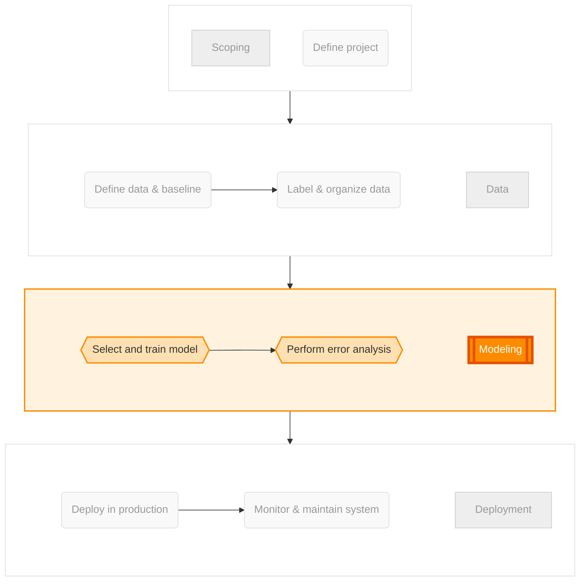

### The Philosophy Shift

This week focuses on a fundamental shift in how we approach machine learning: moving from obsessing about model architecture to focusing on data quality.

**Andrew Ng's Observation:**

> "The advice I give to ML teams is so consistent from project to project, it could almost be replaced with an if-then-else sequence of statements."

This reveals an important truth: production ML success follows predictable patterns.

### The Two Paradigms

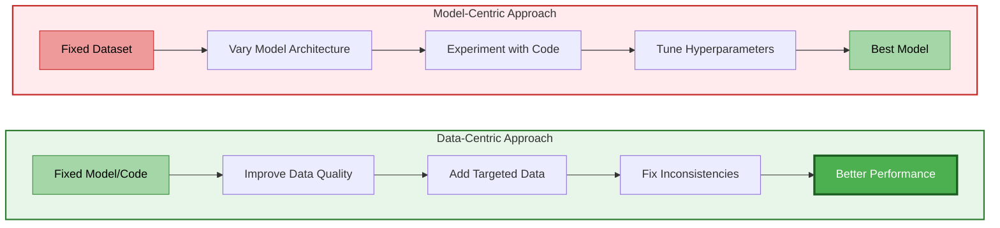

### Where Each Approach Fits in the ML Lifecycle

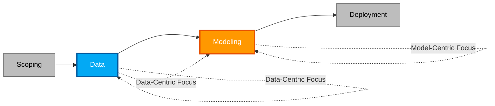

**Key Insight:** For production systems, data-centric approaches often yield better ROI than model-centric approaches.

### AI System Components

An ML system consists of three key components:

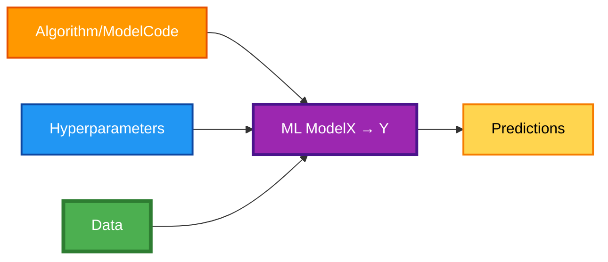

**Thickness indicates priority:**

- **Thickest (Data)**: Primary focus for production systems
- **Medium (Code)**: Use proven architectures
- **Thin (Hyperparameters)**: Important but limited search space

### Why Data-Centric AI for Production?

**Traditional Academic Research:**

```
1. Download benchmark dataset
2. Keep dataset fixed
3. Experiment with models
4. Publish best architecture
→ Advances research
```

**Production Reality:**

```
1. You control the data
2. Data quality varies
3. Known architectures work well
4. Data improvement = performance improvement
→ Builds reliable systems
```

**Practical Example:**

```python
# Model-centric approach
models_to_try = [
    'RNN', 'LSTM', 'GRU', 'Transformer',
    'Custom Architecture 1', 'Custom Architecture 2'
]

for model in models_to_try:
    # Spend weeks implementing and tuning
    # On the same fixed dataset

# Result: 2-3% improvement after 3 months

# Data-centric approach
proven_model = download_from_github('wav2vec2')  # Use proven architecture

data_improvements = [
    'Fix label inconsistencies',
    'Add car noise examples',
    'Balance accent representation'
]

for improvement in data_improvements:
    # Spend days improving data
    # Retrain same model

# Result: 5-7% improvement in 1 month
```

### The Efficiency Argument

| Aspect                  | Model-Centric                          | Data-Centric                          |
| ----------------------- | -------------------------------------- | ------------------------------------- |
| **Time Investment**     | Weeks per model variant                | Days per data improvement             |
| **Reproducibility**     | Complex model = harder to debug        | Better data = more interpretable      |
| **Team Skill Required** | Deep ML architecture expertise         | Domain knowledge + systematic process |
| **Typical Improvement** | 1-3% per iteration                     | 3-7% per iteration                    |
| **Deployment Risk**     | Novel architectures harder to maintain | Proven architectures more stable      |

**Andrew's Philosophy:**

> "For practical projects, good data with a reasonable algorithm will outperform great algorithms with not-so-good data."

---

## 2. Key Challenges in Model Development

### The Iterative Development Loop

Model development isn't linear—it's a cycle you'll go through many times:

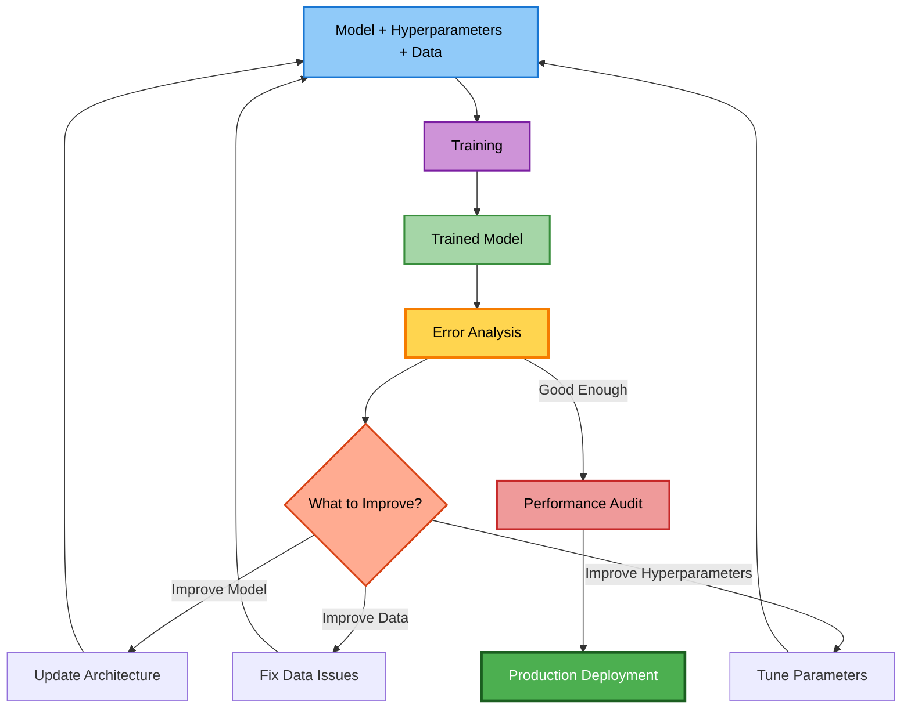

**Critical Success Factor:**

> "Being able to go through this loop many times very quickly is key to improving performance."

### The Three Milestones

Every ML project should achieve these milestones **in order**:

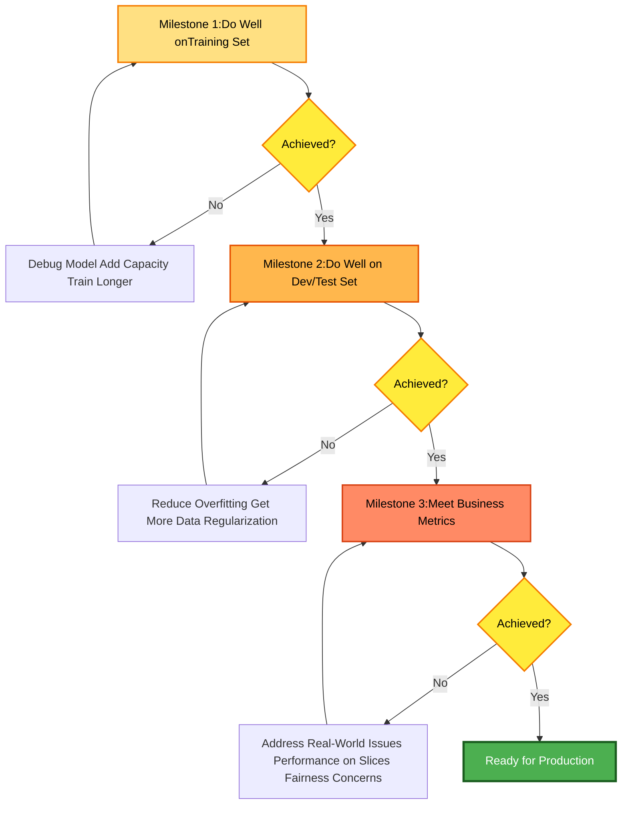

### Milestone 1: Training Set Performance

**Why this matters:**
If you can't fit your training data, you won't generalize.

**Example: Housing Price Prediction**

```python
# Simple check
import numpy as np
import matplotlib.pyplot as plt

# Training data
sizes = np.array([1000, 1500, 2000, 2500, 3000])  # sq ft
prices = np.array([200, 300, 400, 500, 600])       # $k

# Fit model
from sklearn.linear_model import LinearRegression
model = LinearRegression()
model.fit(sizes.reshape(-1, 1), prices)

# Check training performance
train_predictions = model.predict(sizes.reshape(-1, 1))
train_error = np.mean(np.abs(prices - train_predictions))

print(f"Training MAE: ${train_error:.1f}k")

# Visualize
plt.scatter(sizes, prices, label='Training Data')
plt.plot(sizes, train_predictions, 'r-', label='Model Fit')
plt.xlabel('House Size (sq ft)')
plt.ylabel('Price ($k)')
plt.legend()
plt.title(f'Training Set Fit (MAE: ${train_error:.1f}k)')
```

**Common issues if failing:**

- Model too simple (underfitting)
- Bugs in code
- Data quality issues
- Wrong loss function

### Milestone 2: Dev/Test Set Performance

**The gap that matters:**

```
Training Accuracy: 95%
Dev Set Accuracy: 78%
→ 17% gap = OVERFITTING
```

**Diagnosis:**

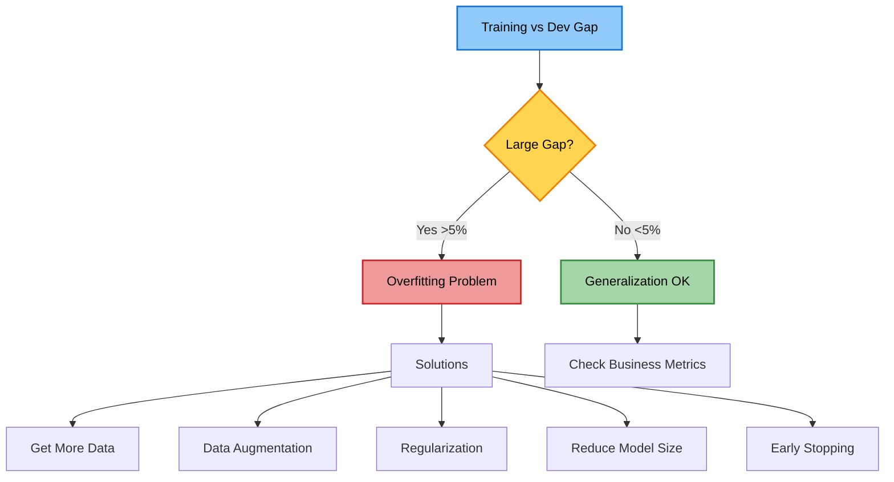

### Milestone 3: Business Metrics

**The hardest milestone**—and the one that causes the most team friction.

**Common Scenario:**

```
ML Engineer: "I achieved 95% test accuracy!"
Product Owner: "But it doesn't work for my users."
ML Engineer: "But... 95% accuracy!"
Product Owner: "It's not good enough."
```

**Why the disconnect?**

Average test set accuracy doesn't capture:

1. Performance on critical user segments
2. Performance on rare but important cases
3. Fairness across demographic groups
4. Business-critical edge cases
5. User experience factors

**Andrew's Advice:**

> "Don't get defensive. Our job is to solve the actual business need, not just to do well on the test set."

---

## 3. Why Low Average Error Isn't Good Enough

### The Core Problem

The job of a machine learning engineer would be much simpler if all we had to do was achieve high accuracy on the test set. Unfortunately, that's not enough for production systems. Even when a model performs well on the test set, it may still fail in real-world deployment for several important reasons.

### Challenge 1: Disproportionately Important Examples

Some examples matter more than others, but average test accuracy treats all examples equally.

#### Web Search Example

Consider two types of search queries:

**Informational/Transactional Queries** (about 80% of searches)

- Examples: "Apple pie recipe", "latest movies", "wireless data plan", "Diwali Festival"
- Users are forgiving if the best result is ranked #2 or #3
- There are many good answers available

**Navigational Queries** (about 20% of searches)

- Examples: "Stanford", "Reddit", "YouTube"
- Users have a very clear intent to reach a specific website
- Users are extremely unforgiving if the exact website isn't the #1 result
- Getting these wrong quickly loses user trust

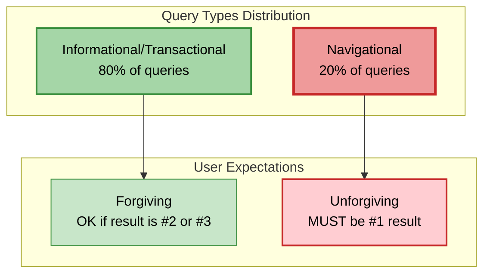

#### The Problem with Average Accuracy

Imagine your search engine achieves:

- 95% accuracy on informational queries (8,000 out of 10,000 queries)
- 85% accuracy on navigational queries (1,700 out of 2,000 queries)

Your overall test accuracy would be 93%, which looks excellent. However, 15% of users searching for specific websites like "Reddit" or "YouTube" don't get the right result as #1. These users will quickly lose trust in your search engine and switch to a competitor.

Average test accuracy weights all examples equally, but in reality, navigational queries are disproportionately important. A search engine that improves average test accuracy but messes up just a small handful of navigational queries may not be acceptable for deployment.

#### Why Simple Weighting Doesn't Fully Solve This

One approach is to give navigational queries higher weight during training. While this can help for some applications, it doesn't always solve the entire problem. You often need more sophisticated techniques like error analysis on specific slices of data to properly address these issues.

### Challenge 2: Performance on Key Slices of Data

Even with high average test accuracy, a system may perform poorly on critical subgroups of data.

#### Loan Approval Example

Consider a machine learning system for loan approval that decides who is likely to repay a loan. Even if the system achieves high average test accuracy, you need to ensure it doesn't unfairly discriminate based on:

- Ethnicity
- Gender
- Location
- Language
- Other protected attributes

Many countries have laws and regulations mandating that financial systems cannot discriminate based on these protected attributes. A loan approval system with 92% overall accuracy but significantly worse performance for certain ethnic groups or genders would not be acceptable for deployment, regardless of the high average accuracy.

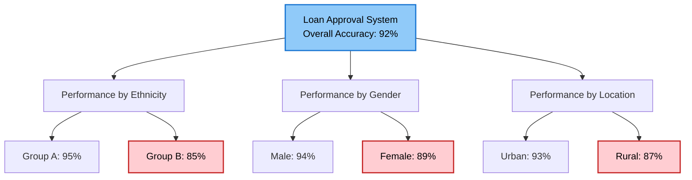

#### E-commerce Recommender Example

The issue of fairness isn't just about fairness to individuals—it also affects business fairness. Consider an online shopping platform that sells products from many different manufacturers and brands.

Even if a recommendation system has high average test accuracy and recommends better products on average, problems can arise:

- If it gives irrelevant recommendations to all users of one ethnicity, that's unacceptable
- If it always pushes products from large retailers and ignores smaller brands, you may lose all the small retailers
- If it never recommends electronics products, electronics retailers would be upset

A recommender system that only promotes large brands while ignoring small businesses may hurt the long-term health of your platform, even if the average test accuracy suggests users are seeing slightly more relevant results.

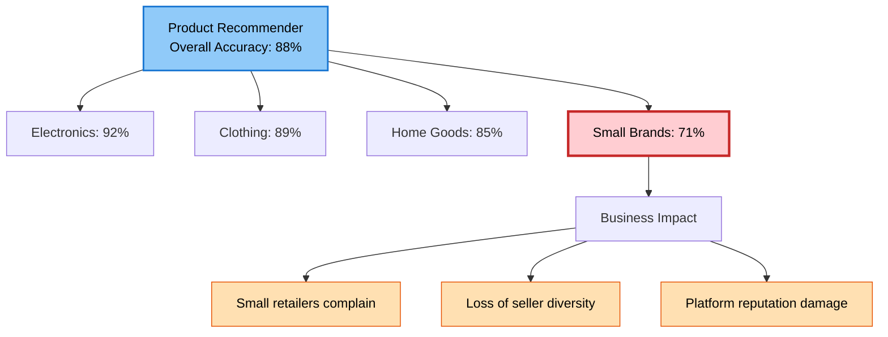

### Challenge 3: Skewed Data Distributions

When positive and negative examples are severely imbalanced, accuracy becomes a misleading metric.

#### Medical Diagnosis Example

In medical diagnosis, it's common for most patients not to have a certain disease. Suppose you have a dataset where 99% of examples are negative (no disease) and only 1% are positive (have disease).

You could achieve 99% test accuracy by writing a program that simply outputs "0" (no disease) for every input. You don't even need a machine learning model—just one line of code that always predicts "no disease" gives you 99% accuracy.

Clearly, this is not a useful algorithm for disease diagnosis.


#### Andrew's Real Experience

Andrew shares: "This actually did happen to me once where my team had trained a huge neural network, found we had 99% average accuracy, and we found it achieved it by printing '0' all the time—so we basically trained a giant neural network that did exactly the same thing as print('0'). Of course, when we discovered this, we then went back to fix the problem. Hopefully this won't happen to you."

### Challenge 4: Rare Classes

Closely related to skewed distributions is the problem of rare classes in multi-class problems.

#### Chest X-ray Diagnosis Example

Andrew worked with Pranav Rajpurkar and others on diagnosing conditions from chest X-rays using deep learning. They found:

**Common Conditions:**

- Effusion: ~10,000 images available → High performance achieved

**Rare Conditions:**

- Hernia: ~100 images available → Much worse performance

From a medical standpoint, it's not acceptable for a diagnosis system to ignore obvious cases of hernia. If a patient's X-ray clearly shows a hernia, missing that diagnosis would be problematic.

However, because hernia was a relatively rare class, the overall average test accuracy wasn't significantly affected. The algorithm could have completely ignored all cases of hernia with only a modest impact on average test accuracy, since hernia cases were rare and each example was weighted equally.

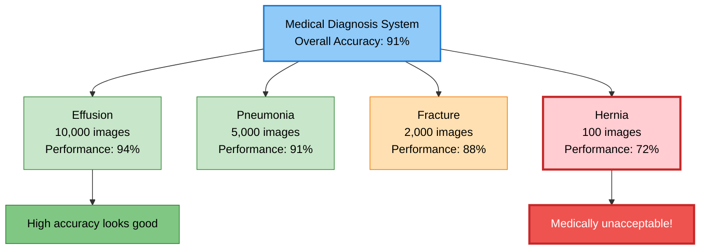

### The Common Conversation

Andrew has heard this conversation too many times in too many companies:

**Machine Learning Engineer:** "I did well on the test set! This works! Let's use it!"

**Product Owner or Business Owner:** "But this doesn't work for my application."

**ML Engineer:** "But I did well on the test set!"

#### Andrew's Advice

"My advice to you, if you ever find yourself in this conversation, is don't get defensive. We as a community have built lots of tools for doing well on the test set, and that's to be celebrated. I think it's great, but we often need to go beyond that because just doing well on the test set isn't enough for many production applications.

When I'm building a machine learning system, I view it as my job not just to do well on the test set, but to produce a machine learning system that solves the actual business or application needs, and I hope you take a similar view as well."

### Looking Ahead

Later this week, we'll learn techniques—usually involving error analysis and analysis on slices of data—that will help you:

- Spot issues that require going beyond average test accuracy
- Address these broader challenges systematically
- Build systems that meet actual business and application needs

These techniques include:

- Systematic error analysis
- Performance auditing on key slices
- Appropriate metrics for skewed data (precision, recall, F1 score)
- Data-centric approaches to improvement

## 4. Establishing a Baseline

### Why Baselines Matter

When starting work on a machine learning project, one of the most useful first steps is to establish a baseline. It's usually only after you've established a baseline level of performance that you can then have tools to efficiently improve on that baseline level.

### Example: Speech Recognition

Let's use the speech recognition example to understand how baselines work.

Suppose you've established that there are four major categories of speech in your data:

1. **Clear speech** - Someone speaks without much background noise
2. **Speech with car noise** - As if they were in a car when using the system
3. **Speech with people noise** - Outdoors with other people talking in the background
4. **Speech on low bandwidth** - Like using a cell phone with a very bad connection

#### Initial Model Performance

Your model achieves the following accuracy on these four categories:

| Type          | Accuracy |
| ------------- | -------- |
| Clear Speech  | 94%      |
| Car Noise     | 89%      |
| People Noise  | 87%      |
| Low Bandwidth | 70%      |

Looking at these numbers, you might be tempted to say, "Well, it does worse on low bandwidth audio, so let's focus our attention on that."

But before leaping to that conclusion, it would be useful to establish a baseline level of performance on all four categories.

#### Establishing Human Level Performance (HLP)

You can establish a baseline by asking some human transcriptionists to label your data and measuring their accuracy. What is human level performance on these four categories of speech?

| Type          | Model Accuracy | Human Level Performance | Gap (Improvement Potential) |
| ------------- | -------------- | ----------------------- | --------------------------- |
| Clear Speech  | 94%            | 95%                     | 1%                          |
| Car Noise     | 89%            | 93%                     | 4%                          |
| People Noise  | 87%            | 89%                     | 2%                          |
| Low Bandwidth | 70%            | 70%                     | ~0%                         |

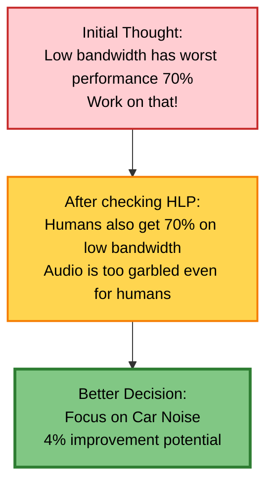

#### What the Baseline Revealed

With this analysis, we realize that:

- **Clear speech**: 1% improvement potential if we reach human level
- **Car noise**: 4% improvement potential - most promising!
- **People noise**: 2% improvement potential
- **Low bandwidth**: ~0% improvement potential - even humans can't do better

Maybe the low bandwidth audio was so garbled that even people, humans can't recognize what was said. It may not be that fruitful to work on that. Instead, it may be more fruitful to focus our attention on improving speech recognition with car noise in the background.

In this example, using **Human Level Performance (HLP)** gives you a point of comparison or a baseline that helps you decide where to focus your efforts—on car noise data rather than on low bandwidth data.

### Unstructured vs Structured Data

The best practices for establishing a baseline are quite different depending on whether you're working on unstructured or structured data.

#### Unstructured Data

**Definition:** Data that humans are very good at interpreting.

**Examples:**

- **Images** - Pictures of cats, photographs
- **Audio** - Speech recognition, music
- **Text** - Natural language, restaurant reviews

Humans evolved to be very good at understanding images, audio, and language. Because humans are so good at unstructured data tasks, measuring **Human Level Performance (HLP)** is often a good way to establish a baseline if you are working on unstructured data.

#### Structured Data

**Definition:** Data stored in databases or spreadsheets with defined fields.

**Examples:**

- E-commerce transactions (user ID, purchase time, price)
- Product inventory data
- Giant Excel spreadsheets
- Database records

Because humans are not as good at looking at data like this to make predictions (we certainly didn't evolve to look at giant spreadsheets!), **Human Level Performance is usually a less useful baseline** for structured data applications.

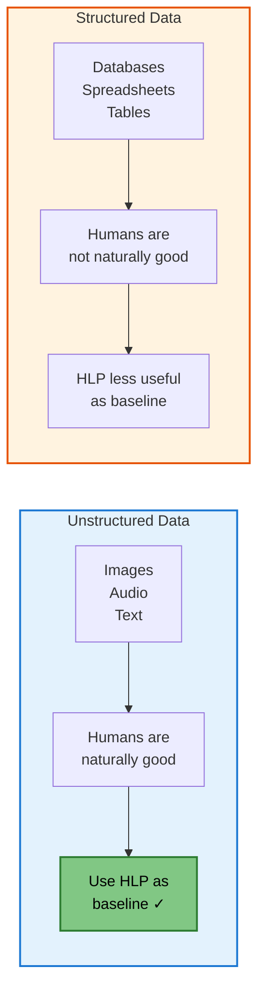

**Visual comparison from the lecture:**

**Unstructured data** (labeled "HLP" in slide):

- Image of a cat
- Audio waveform
- Text: "This restaurant was great!"

**Structured data**:

- Tables with User ID, Purchase, Number, Price
- Product ID, Product name, Inventory
- Traditional database format

Andrew notes: "I find that machine learning development best practices are quite different, depending on whether you're working on an unstructured data or structured data problem."

### Ways to Establish Baselines

Here are different approaches to establishing baselines for both types of problems:

#### 1. Human Level Performance (HLP)

Best for unstructured data problems. Ask human experts to perform the task and measure their accuracy.

#### 2. Literature Search for State-of-the-Art

Look at academic papers or published results to see what others report they are able to accomplish on similar problems.

For example, if you're building a speech recognition system and others report a certain level of accuracy on data that's similar to yours, then that may give you a starting point.

#### 3. Quick-and-Dirty Implementation

Using open source, you may consider coming up with a quick-and-dirty implementation. This won't be your production system, but just a quick-and-dirty implementation that could start to give you a sense of what may be possible.

#### 4. Performance of Older System

If you already have a machine learning system running for your application, then the performance of your previous system can help you establish a baseline that you can then aspire to improve on.

### What Baselines Tell You

A baseline system or baseline level of performance helps to indicate **what might be possible**.

In some cases, especially when using human level performance on unstructured data problems, this baseline can also give you a sense of:

- **Irreducible error** - The minimum error achievable
- **Bayes error** - The theoretical best performance possible

For example, the baseline helped us realize that maybe the low bandwidth audio is so bad that it's just not possible to have more than 70% accuracy.

By helping us get a very rough sense of what might be possible, baselines help us be much more efficient in terms of **prioritizing what to work on**.

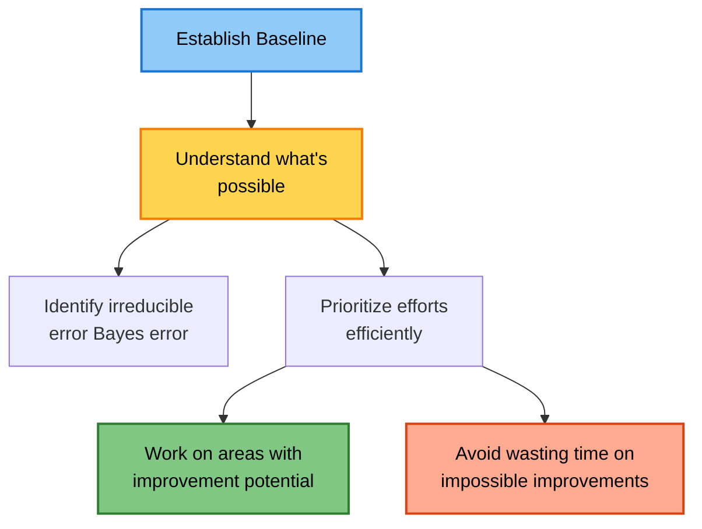

### Dealing with Business Pressure

Sometimes Andrew has seen business teams push a machine learning team to guarantee that the learning algorithm will be 80% accurate or 90% or 99% accurate **before the machine learning team has even had a chance to establish a rough baseline**.

This, unfortunately, puts the machine learning team in a very difficult position.

#### Andrew's Advice

If you are in that position, Andrew urges you to consider **pushing back** and asking for time to establish a rough baseline level of performance before giving a more firm prediction about how accurate the machine learning system can eventually get to be.

> "If it helps you to make your case, feel free to tell them that I asked you to do so. I think establishing that baseline first will help set you and your team up better for long-term success."

### Summary

**Key takeaways about baselines:**

1. Establish a baseline early in your project
2. For unstructured data (images, audio, text), use Human Level Performance
3. For structured data (databases, spreadsheets), HLP is less useful
4. Baselines help you understand what's possible and where to focus
5. Use baselines to prioritize efficiently and avoid wasting effort
6. Don't commit to accuracy targets before establishing a baseline
7. Multiple approaches: HLP, literature search, quick implementation, older system performance

The baseline is your foundation for systematic improvement.

## 5. Tips for Getting Started

### Overview

This section is a collection of practical tips for starting a machine learning project. While it's a bit of a "grab bag" of different ideas, these suggestions can help you work more efficiently.

Remember that machine learning is an iterative process. You start with a model, data, and hyperparameters, train the model, carry out error analysis, and then use that to drive further improvements. After going around this loop enough times and achieving a good enough model, you carry out a final performance audit before taking it to production.

### Tip 1: Start with a Quick Literature Search

When Andrew starts a machine learning project, he almost always begins with a quick literature search to see what's possible. This includes:

- Online courses
- Blog posts
- Open source projects

#### Don't Obsess About the Latest Algorithm

If your goal is to build a practical production system (not to do research), don't obsess about finding the latest, greatest algorithm.

**Andrew's advice:**

- Spend half a day, maybe a small number of days, reading blog posts
- Pick something reasonable that lets you get started quickly
- If you can find an open source implementation, that can help you establish a baseline more efficiently

**Why this matters:**

> "I find that for many practical applications, a reasonable algorithm with good data will often do just fine, and will in fact outperform a great algorithm with not so good data."

Don't obsess about using the algorithm that was just published at some conference last week that is the most cutting edge. Instead, find something reasonable, find a good open source implementation, and use that to get going quickly.

Being able to get started on this first step of the loop makes you more efficient in iterating through more times, and that will help you get to good performance more quickly.

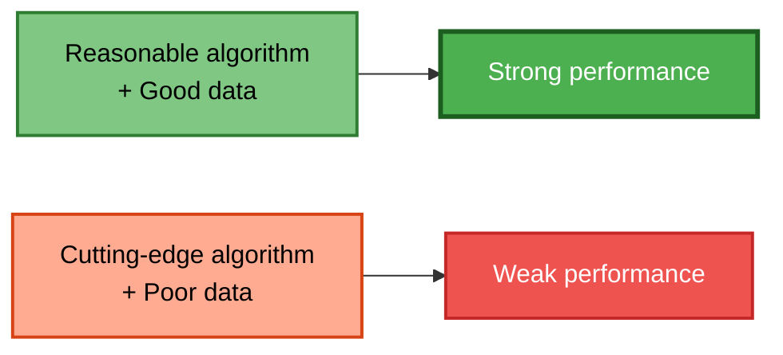

### Tip 2: Should You Consider Deployment Constraints?

A common question: "Hey Andrew, do I need to take into account deployment constraints such as compute constraints when picking a model?"

#### Andrew's Answer: It Depends

**YES, you should take deployment constraints into account IF:**

- The baseline is already established
- You're relatively confident that this project will work
- Your goal is to build and deploy a system

**NO, or maybe not necessarily IF:**

- You haven't yet established a baseline
- You're not yet sure if this project will work and be worthy of deployment
- Your first goal is to just establish a baseline and determine what is possible
- You're still evaluating if this project is even worth pursuing for the long term

In the early exploration phase, it might be okay to ignore deployment constraints and just find some open source implementation to try it out and see what might be possible—even if that implementation is so computationally intensive that you know you will never be able to deploy it.

Of course, there's no harm in taking deployment constraints into account even at this phase of the project. But it might also be okay if you don't, and you focus on more efficiently establishing the baseline first.

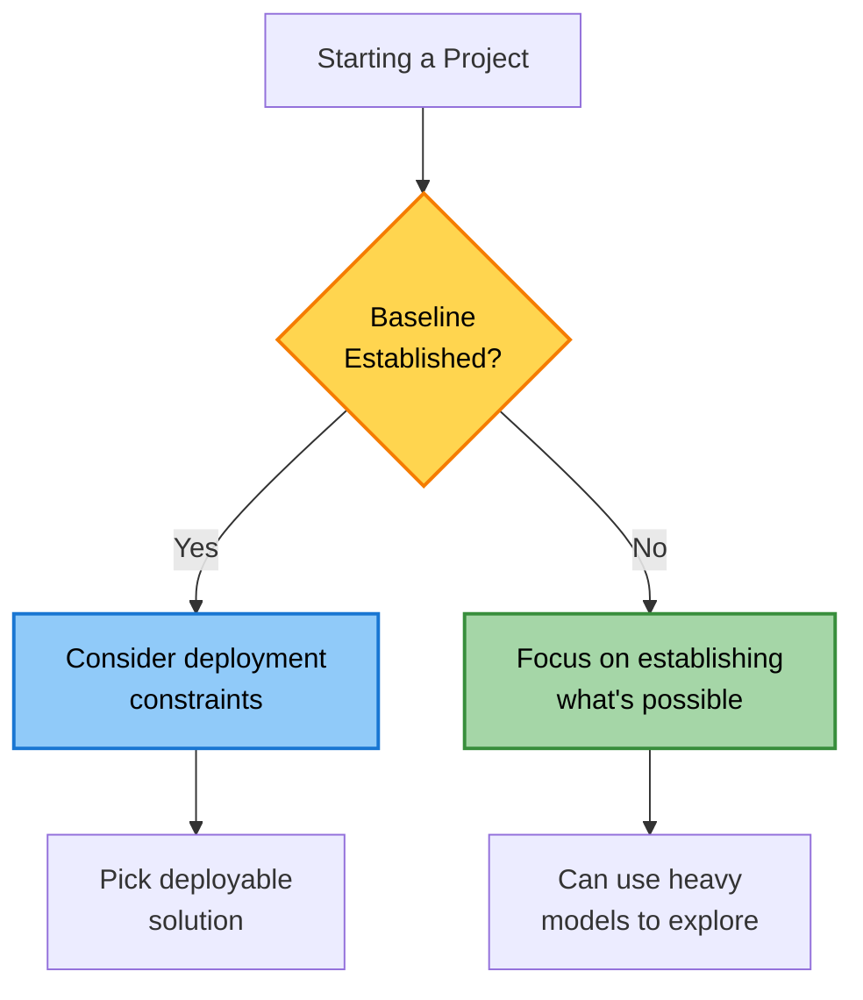

### Tip 3: Run Quick Sanity Checks

Before running your algorithm on all your data, run a few quick sanity checks for your code and algorithm.

#### Sanity Check 1: Try to Overfit a Very Small Training Set

Before spending hours, or sometimes even overnight or days training the algorithm on a large dataset, try to overfit a very small training dataset first. Maybe even try to make sure you can fit just one training example, especially if the output is a complex output.

**Example: Speech Recognition Failure**

Andrew was once working on a speech recognition system where the goal was to input audio and output a transcript. When he trained his speech recognition system on just one audio clip, the system output this:

```
[space] [space] [space] [space] [space] [space]
```

So clearly it wasn't working. Because the speech system couldn't even accurately transcribe one training example, there wasn't much point in spending hours and hours training it on a giant training set.

**Example: Image Segmentation**

If your goal is to take input pictures and segment out the cats in the image, then before spending hours training your system on hundreds or thousands of images, a worthy sanity check would be to feed it just one image and see if it can at least overfit that one training example before scaling up to a larger dataset.

**The advantage:** You may be able to train your algorithm on one or a small handful of examples in just minutes or maybe even seconds, and this lets you find bugs much more quickly.

#### Sanity Check 2: Train on a Small Subset First

For image classification problems, even if you have 10,000 images or 100,000 images, or a million images in your training set, it might be worthwhile to very quickly train your algorithm on a small subset of just 10 or maybe 100 images.

**Why this works:**

- You can do this quickly
- If your algorithm can't even do well on 100 images, it's clearly not going to do well on 10,000 images
- This is another useful sanity check for your code

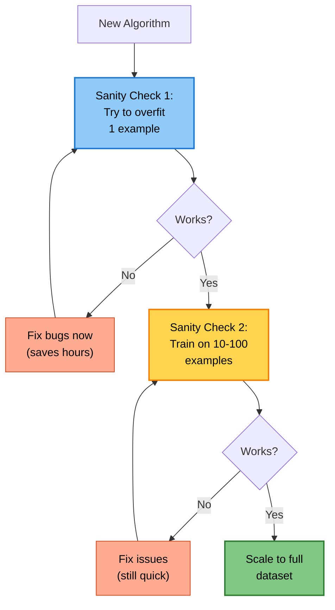

### Summary: The Sanity Check Progression

Follow this progression to catch bugs early:

1. **Test on 1 example** (takes seconds to minutes)
   - Can your model overfit a single example?
   - If not, there's a bug in your code

2. **Test on 10-100 examples** (takes minutes)
   - Can your model learn from a small subset?
   - If not, fix issues before scaling

3. **Scale to full dataset** (takes hours/days)
   - Only do this after passing the sanity checks
   - This saves you from wasting time training a broken model

### Looking Ahead

After you've trained your first machine learning model, one of the most important things is how to carry out error analysis to help you decide how to improve the performance of your algorithm. The next sections will dive into error analysis and performance auditing.

---

## Section 02 - Error analysis and performance auditing

## 6. Error Analysis Framework

### The Reality of Machine Learning Development

The first time you train a learning algorithm, you can almost guarantee that it won't work, not the first time out. This is normal and expected. The key is having a systematic approach to improvement.

Andrew considers error analysis to be the heart of the machine learning development process. When done well, error analysis tells you what's the most efficient use of your time in terms of what you should do to improve your learning algorithm's performance.

### The Basic Process

Error analysis is typically done by examining a sample of misclassified examples from your development (dev) set. You might listen to or look at around 100 mislabeled examples to understand what's going wrong.

### Example: Speech Recognition Error Analysis

Let's walk through a concrete example using speech recognition. This is exactly how Andrew does error analysis himself—in a spreadsheet.

#### Step 1: Set Up Your Spreadsheet

Create a spreadsheet with the following columns:

- Example number
- Ground truth label (correct transcription)
- Model's prediction
- Tags for different error categories (you'll add these as you discover patterns)

#### Step 2: Examine Errors and Add Tags

Here's what the process looks like:

| Example | Label                       | Prediction                | Car noise | People noise | Low bandwidth |
| ------- | --------------------------- | ------------------------- | --------- | ------------ | ------------- |
| 1       | "Stir fried lettuce recipe" | "Stir fry lettuce recipe" | 1         |              |               |
| 2       | "Sweetened coffee"          | "Swedish coffee"          |           | 1            | 1             |
| 3       | "Sail away song"            | "Sell away some"          |           | 1            |               |
| 4       | "Let's catch up"            | "Let's ketchup"           | 1         | 1            | 1             |

**How it works:**

1. **First example:** The ground truth is "stir fried lettuce recipe" but the model predicted "stir fry lettuce recipe". When you listen to this audio clip, you notice it has car noise in the background, so you mark it with a "1" in the car noise column.

2. **Second example:** "Sweetened coffee" was mistranscribed as "Swedish coffee". This clip has people noise in the background and also a low bandwidth connection, so you mark both those columns.

3. **Third example:** "Sail away song" became "sell away some". This one has people noise.

4. **Fourth example:** "Let's catch up" was transcribed as "Let's ketchup". This example has car noise, people noise, AND low bandwidth—you mark all three.

#### Step 3: Discover New Categories

As you go through this process, you may discover new patterns. Notice in the example above that "low bandwidth" wasn't an original category. Andrew added it after listening to the fourth example and realizing that several clips had poor connection quality. At that point, you can:

- Add a new column for this tag
- Go back and check previous examples to see if they also had this issue

**Important notes:**

- Tags don't have to be mutually exclusive (one example can have multiple tags)
- You can discover and add new tags as you go through the analysis
- Andrew literally does this in spreadsheet programs like Google Sheets, Excel, or Numbers on Mac

### Tools for Error Analysis

**Manual approach:**
Until recently, error analysis has typically been done manually in:

- Jupyter Notebooks
- Spreadsheets (Google Sheets, Excel, Numbers)

Andrew still sometimes does it this way, and if that's how you're doing it, that's perfectly fine.

**Emerging MLOps tools:**
There are now specialized tools that make this process easier. For example, when Andrew's team at Landing.AI works on computer vision applications, they use LandingLens, which makes error analysis much easier than spreadsheets.

### Error Analysis is Iterative

Just like training and deploying models, error analysis is an iterative process:

1. Examine and tag a set of examples with initial tags (e.g., "car noise", "people noise")
2. Based on what you find, propose new tags
3. Go back and examine more examples with the expanded tag set
4. Repeat until you identify the most impactful categories to work on

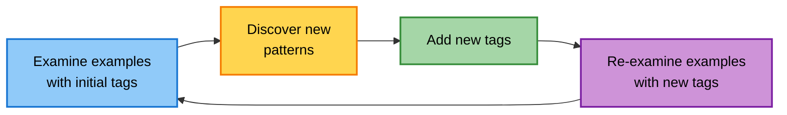

### Types of Tags to Consider

The specific tags you use will depend on your application. Here are examples from different domains:

#### Visual Inspection (Smartphone Defect Detection)

**Class label tags:**

- Does this phone have a scratch?
- Does it have a dent?
- Other specific defect types

Note: It's fine if some tags are associated with specific class labels (y).

**Image property tags:**

- Is this picture blurry?
- Is it against a dark background?
- Is it against a light background?
- Is there unwanted reflection in the picture?

**Metadata tags:**

- What is the phone model?
- What factory was it manufactured in?
- Which manufacturing line captured this image?

#### Product Recommendations (E-commerce)

When analyzing incorrect or irrelevant product recommendations:

**User demographic tags:**

- Recommendations to younger women
- Recommendations to older men
- Other demographic segments

**Product-based tags:**

- Specific product features
- Specific product categories
- Price ranges

### Key Metrics to Track

As you go through different tags, here are useful numbers to look at:

#### 1. What fraction of errors have that tag?

For example, if you examine 100 audio clips and find that 12 of them have the "car noise" tag, that's 12% of errors. This tells you:

- How important is it to work on car noise?
- Even if you fix all car noise issues, performance may improve by only 12% (which is actually not bad)

#### 2. Of all data with that tag, what fraction is misclassified?

So far, we've focused on tagging mislabeled examples. For time efficiency, you might focus attention on the misclassified examples. However, if there's a tag you can apply to both correct and incorrect examples, you can ask: of all the data with car noise, what fraction is mistranscribed?

For example, if you find that 18% of all car noise data is mistranscribed, this tells you:

- The performance level on data with this type of tag
- How hard these examples with car noise really are

#### 3. What fraction of all data has that tag?

This tells you how important this category is relative to your entire dataset. For instance, what percentage of your entire dataset has car noise? This helps you understand the scope of the problem.

#### 4. How much room for improvement is there on data with that tag?

One way to measure this is to compare against human-level performance on data with that tag. This shows you the theoretical ceiling for improvement.

### Making Decisions from Error Analysis

By brainstorming different tags and measuring these metrics, you can:

- Segment your data into different categories
- Understand which categories are causing the most problems
- Decide what to prioritize working on
- Focus your efforts where they'll have the most impact

The goal is to come up with a few categories where you can productively improve the algorithm. For example, in the speech recognition case, you might decide to specifically work on improving performance for speech with car noise in the background.

### Summary

Error analysis is a systematic approach to understanding and improving your model:

1. Sample ~100 mislabeled examples from your dev set
2. Create a spreadsheet to track examples and tags
3. Listen to or examine each example, adding relevant tags
4. Discover new categories and add new tags iteratively
5. Calculate key metrics for each tag category
6. Prioritize which categories to focus on based on the data
7. Use this analysis to guide your improvement efforts

This process helps you work efficiently by focusing on the issues that will give you the biggest performance gains.

## 7. Prioritizing What to Work On

### The Challenge

In the previous section, you learned about brainstorming and tagging your data with different attributes. Now let's see how you can use this to prioritize where to focus your attention.

### Revisiting the Speech Recognition Example

Here's the example we had previously with four tags, showing the accuracy of the algorithm, human level performance (HLP), and the gap between current accuracy and HLP:

| Type          | Accuracy | Human Level Performance | Gap to HLP |
| ------------- | -------- | ----------------------- | ---------- |
| Clean Speech  | 94%      | 95%                     | 1%         |
| Car Noise     | 89%      | 93%                     | 4%         |
| People Noise  | 87%      | 89%                     | 2%         |
| Low Bandwidth | 70%      | 70%                     | 0%         |

At first glance, you might be tempted to work on car noise because the gap to HLP is bigger (4%). But there's another crucial factor to consider.

### Adding Data Distribution to the Analysis

Rather than deciding to work on car noise solely because the gap to HLP is bigger, one other useful factor to look at is: **What's the percentage of data with that tag?**

Let's say the data distribution is:

- 60% of your data is clean speech
- 4% is data with car noise
- 30% has people noise
- 6% is low bandwidth audio

| Type          | Accuracy | HLP | Gap to HLP | % of Data | **Overall Impact** |
| ------------- | -------- | --- | ---------- | --------- | ------------------ |
| Clean Speech  | 94%      | 95% | 1%         | 60%       | **0.6%**           |
| Car Noise     | 89%      | 93% | 4%         | 4%        | **0.16%**          |
| People Noise  | 87%      | 89% | 2%         | 30%       | **0.6%**           |
| Low Bandwidth | 70%      | 70% | 0%         | 6%        | **~0%**            |

### Calculating Overall Impact

Here's how to calculate the overall impact on your system's performance:

**Overall Impact = Gap to HLP × % of Data**

#### Clean Speech:

```
Gap to HLP: 1%
% of Data: 60%
Overall Impact = 1% × 60% = 0.6%
```

If we can improve our performance on clean speech to human level performance, our overall speech system would be **0.6% more accurate**, because we would do 1% better on 60% of the data.

#### Car Noise:

```
Gap to HLP: 4%
% of Data: 4%
Overall Impact = 4% × 4% = 0.16%
```

Improving car noise performance by 4% on just 4% of the data gives us only a **0.16% improvement** overall.

#### People Noise:

```
Gap to HLP: 2%
% of Data: 30%
Overall Impact = 2% × 30% = 0.6%
```

Improving people noise performance gives us a **0.6% improvement** overall.

#### Low Bandwidth:

```
Gap to HLP: 0%
% of Data: 6%
Overall Impact = 0% × 6% = ~0%
```

We can't improve this category at all since we're already at human level.

### The Surprising Conclusion

Whereas previously we might have said there's a lot of room for improvement in car noise (4% gap), in this richer analysis, we see that **because people noise accounts for such a large fraction of the data**, it may be more worthwhile to work on either:

1. **People noise** (0.6% overall impact, affects 30% of data)
2. **Clean speech** (0.6% overall impact, affects 60% of data)

Both have larger potential for improvements than speech with car noise (only 0.16% overall impact).

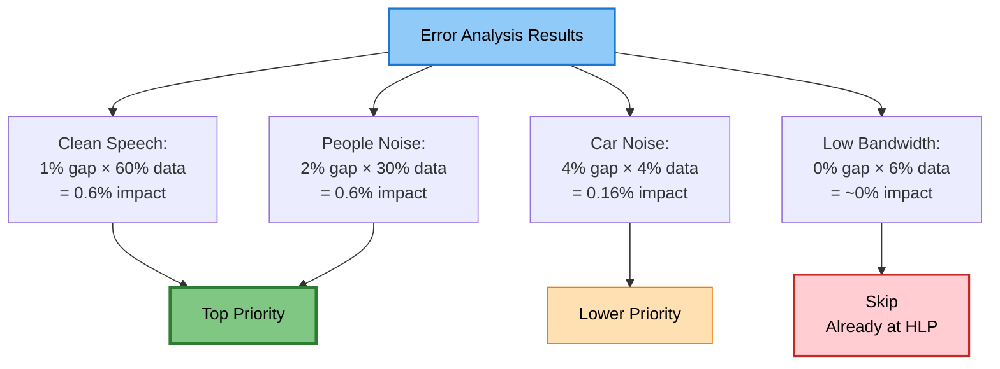

### The Four-Factor Prioritization Framework

When prioritizing what to work on, you might decide on the most important categories based on these factors:

#### Factor 1: How Much Room for Improvement?

Compare to human-level performance or some other baseline. What's the gap between current performance and the best possible performance?

Example: Car noise has 4% gap, people noise has 2% gap.

#### Factor 2: How Frequently Does That Category Appear?

What percentage of your data has this characteristic?

Example: People noise appears in 30% of data, car noise in only 4%.

#### Factor 3: How Easy Is It to Improve?

Do you have ideas for how to improve accuracy in that category?

Example: If you have good ideas for data augmentation for car noise, that might cause you to prioritize that category more highly than some other category where you just don't have as many ideas for how to improve the system.

#### Factor 4: How Important Is It to Improve?

Consider the business context and user needs.

Example: You may decide that improving performance with car noise is especially important because when you're driving, you have a stronger desire to do search—especially search on maps and find addresses without needing to use your hands if your hands are supposed to be holding the steering wheel.

```mermaid
graph LR
    A["Prioritization<br/>Decision"] --> B["Factor 1:<br/>Room for<br/>improvement"]
    A --> C["Factor 2:<br/>Data<br/>frequency"]
    A --> D["Factor 3:<br/>Ease of<br/>improvement"]
    A --> E["Factor 4:<br/>Business<br/>importance"]

    B --> F["Balanced<br/>Decision"]
    C --> F
    D --> F
    E --> F

    style A fill:#90CAF9,stroke:#1976D2,color:#fff,stroke-width:2px
    style F fill:#4CAF50,stroke:#1B5E20,color:#fff,stroke-width:3px
```

### No Mathematical Formula

**Important note:** There is no mathematical formula that will tell you exactly what to work on. But by looking at these four factors together, you should be able to make more fruitful decisions.

### Taking Action: Improving Specific Categories

Once you've decided that there's a category (or maybe a few categories) where you want to improve performance, one fruitful approach is to consider adding data or improving the quality of data for that specific category.

#### Option 1: Collect More Data

If you want to improve performance on speech with car noise, you might go out and collect more data with car noise.

#### Option 2: Use Data Augmentation

If you have a way of using data augmentation to get more data from that data category, that will be another way to improve your algorithm's performance.

#### Option 3: Improve Label Accuracy/Data Quality

This topic will be discussed next week when we talk about the data phase of the machine learning project lifecycle.

### The Efficiency Advantage

In machine learning, we always would like to have more data, but going out to collect more data generically can be very time-consuming and expensive.

**Without error analysis:**

- Collect data randomly
- Expensive and time-consuming
- Inefficient improvements

**With error analysis:**

- Know exactly what types of data to collect
- Can be much more specific (e.g., collect car noise or people noise data)
- Don't waste time collecting data for categories that won't help (e.g., low bandwidth data)
- Much more efficient in how you improve your learning algorithm's performance

```mermaid
graph TB
    A["Error Analysis<br/>Complete"] --> B["Identify priority<br/>categories"]

    B --> C["Clean Speech &<br/>People Noise"]

    C --> D["Collect more<br/>targeted data"]
    C --> E["Use data<br/>augmentation"]
    C --> F["Improve data<br/>quality/labels"]

    D --> G["Focused<br/>Improvement"]
    E --> G
    F --> G

    G --> H["Retrain Model"]

    H --> I["Measure<br/>Impact"]

    I --> J{Good enough?}
    J -->|No| A
    J -->|Yes| K["Deploy!"]

    style A fill:#FFD54F,stroke:#F57C00,color:#000,stroke-width:2px
    style C fill:#90CAF9,stroke:#1976D2,color:#000,stroke-width:2px
    style G fill:#81C784,stroke:#2E7D32,color:#000,stroke-width:2px
    style K fill:#4CAF50,stroke:#1B5E20,color:#fff,stroke-width:3px
```

### Example: Targeted Data Collection

**Scenario:** Based on your analysis, you decide to focus on people noise (0.6% potential impact, 30% of data).

**Actions you might take:**

1. **Collect more data with people noise**
   - Record speech in cafes
   - Record speech at outdoor events
   - Record speech in crowded public spaces

2. **Use data augmentation**
   - Take existing clean speech
   - Add background crowd noise
   - Vary the noise level

3. **Improve existing data quality**
   - Review labels for people noise examples
   - Fix any mislabeled examples
   - Ensure consistent labeling standards

**What you DON'T waste time on:**

- Collecting more low bandwidth data (0% improvement potential)
- Collecting general data without a specific category focus

### Andrew's Perspective

> "This focus on improving your data on the tags that you have determined are most fruitful for you to work on can help you be much more efficient in how you improve your learning algorithm's performance. I found this type of error analysis procedure very useful for many of my projects and I hope it will help you too in building production-ready machine learning systems."

### Summary

**Prioritization process:**

1. Conduct error analysis and tag your data
2. Measure performance gaps (vs HLP or baseline)
3. Determine data frequency for each category
4. Calculate overall impact (gap × frequency)
5. Consider ease of improvement and business importance
6. Make a balanced decision using all four factors
7. Focus data collection/augmentation on priority categories
8. Iterate: retrain, measure, repeat

**Key insight:** A small gap on frequent data (like 1% on 60% clean speech) can have more overall impact than a large gap on rare data (like 4% on 4% car noise). Always consider both the gap AND the frequency.

## 8. Handling Skewed Datasets

### What Are Skewed Datasets?

**Definition:** Datasets where the ratio of positive to negative examples is very far from 50/50.

### Common Examples of Skewed Datasets

#### Example 1: Manufacturing - Smartphone Defect Detection

If a manufacturing company makes smartphones, hopefully the vast majority of them are not defective.

- 99.7% have no defect (labeled y=0)
- Only 0.3% are defective (labeled y=1)

**The Problem:** A useless algorithm that just outputs "0" (no defect) for every phone will achieve 99.7% accuracy!

#### Example 2: Medical Diagnosis

If 99% of patients don't have a disease:

- 99% negative (no disease, y=0)
- 1% positive (has disease, y=1)

An algorithm that predicts no one ever has the disease will have 99% accuracy.

#### Example 3: Wake Word Detection

Systems that listen for words like "Alexa," "OK Google," or "Hey Siri."

Andrew's experience: When he built wake word detection systems, one dataset had:

- 96.7% negative examples (wake word NOT spoken)
- 3.3% positive examples (wake word spoken)

Most of the time, the special wake word is not being spoken, making the dataset very skewed.

### Why Accuracy Fails on Skewed Datasets

When you have a very skewed dataset, **raw accuracy is not that useful** because a trivial algorithm like `print("0")` can get very high accuracy.

Instead, we need better metrics. Enter: **The Confusion Matrix**.

---

### The Confusion Matrix

A confusion matrix is a table that helps you understand your model's performance in detail, especially for skewed datasets.

#### Understanding the Structure

The confusion matrix has two axes:

- **Vertical axis (rows):** What did your model predict?
- **Horizontal axis (columns):** What was the actual truth?

```
                    Actual
                y=0         y=1
              ┌─────────┬─────────┐
Predicted y=0 │   TN    │   FN    │
              ├─────────┼─────────┤
Predicted y=1 │   FP    │   TP    │
              └─────────┴─────────┘
```

#### The Four Outcomes - Explained with Intuition

Let's use the smartphone defect detection example. Imagine you're inspecting phones:

**1. True Negative (TN) - Correct rejection**

- **Actual:** Phone is good (y=0)
- **Predicted:** Phone is good (y=0)
- **Result:** ✓ Correctly identified a good phone
- **Analogy:** You said "safe to ship" and it was indeed safe

**2. True Positive (TP) - Correct detection**

- **Actual:** Phone is defective (y=1)
- **Predicted:** Phone is defective (y=1)
- **Result:** ✓ Correctly caught a defective phone
- **Analogy:** You said "defective!" and it was indeed defective

**3. False Negative (FN) - Miss (Type II Error)**

- **Actual:** Phone is defective (y=1)
- **Predicted:** Phone is good (y=0)
- **Result:** ✗ Missed a defective phone - it ships to customer!
- **Analogy:** You said "safe to ship" but it was actually broken
- **Danger:** This is usually the worst type of error in manufacturing

**4. False Positive (FP) - False alarm (Type I Error)**

- **Actual:** Phone is good (y=0)
- **Predicted:** Phone is defective (y=1)
- **Result:** ✗ Wrongly flagged a good phone as defective
- **Analogy:** You said "defective!" but it was actually fine
- **Impact:** Wasted inspection time, but not as bad as FN

```mermaid
graph LR
    %% The Reality Level
    Root[Is the phone actually defective?] --> Good[No: Good y=0]
    Root --> Bad[Yes: Defective y=1]

    %% The Prediction Level
    Good --> B1["Model says: GOOD"]
    Good --> B2["Model says: DEFECTIVE"]

    Bad --> B3["Model says: GOOD"]
    Bad --> B4["Model says: DEFECTIVE"]

    %% The Results Level
    B1 --> C1["<b>True Negative (TN)</b><br/>Correctly identified good"]
    B2 --> C2["<b>False Positive (FP)</b><br/>Type I Error: False Alarm"]
    B3 --> C3["<b>False Negative (FN)</b><br/>Type II Error: Missed Defect!"]
    B4 --> C4["<b>True Positive (TP)</b><br/>Correctly caught defect"]

    %% Styling
    style C1 fill:#C8E6C9,stroke:#388E3C
    style C2 fill:#FFE0B2,stroke:#F57C00
    style C3 fill:#FFCDD2,stroke:#C62828,stroke-width:3px
    style C4 fill:#81C784,stroke:#2E7D32,stroke-width:3px
```

### Real Example: Filling in the Confusion Matrix

Let's say you tested your algorithm on 1,000 phones from your development set:

```
                    Actual
                y=0         y=1
              ┌─────────┬─────────┐
Predicted y=0 │   905   │   18    │  923 predicted as good
              │   TN    │   FN    │
              ├─────────┼─────────┤
Predicted y=1 │    9    │   68    │  77 predicted as defective
              │   FP    │   TP    │
              └─────────┴─────────┘
                914       86
              actual    actual
               good    defective
```

**What this tells us:**

- **True Negatives (905):** Correctly identified 905 good phones
- **True Positives (68):** Correctly caught 68 defective phones
- **False Negatives (18):** Missed 18 defective phones (they shipped to customers!)
- **False Positives (9):** Incorrectly flagged 9 good phones as defective

**Total counts:**

- Total actual good phones: 905 + 9 = 914
- Total actual defective phones: 18 + 68 = 86
- This is indeed a skewed dataset: 91.4% negative, 8.6% positive

---

### Precision: "When I say positive, how often am I right?"

**Definition:** Of all the examples that the algorithm thought were positive, what fraction did it get right?

$$\text{Precision} = \frac{TP}{TP + FP}$$

#### Intuition with Real-Life Analogy

Think of precision like a **metal detector at the beach**:

- You predict "there's treasure here!" (positive prediction)
- You dig at that spot
- **Precision answers:** "Of all the times I dug, how many times did I actually find treasure?"

High precision = You don't waste time digging where there's nothing  
Low precision = Lots of false alarms, lots of wasted digging

#### Calculating Precision from Our Example

```
Precision = TP / (TP + FP)
         = 68 / (68 + 9)
         = 68 / 77
         = 88.3%
```

**What this means:**

- The model predicted 77 phones were defective
- Of those 77, it was correct 68 times
- **88.3% of the time when the model says "defective," it's actually defective**

```mermaid
graph LR
    A["All predictions<br/>of 'defective'<br/>77 phones"] --> B["Actually defective<br/>TP = 68"]
    A --> C["Actually good<br/>FP = 9"]

    B --> D["Precision = 68/77<br/>= 88.3%"]
    C --> D

    style A fill:#90CAF9,stroke:#1976D2,color:#000,stroke-width:2px
    style B fill:#81C784,stroke:#2E7D32,color:#000,stroke-width:2px
    style C fill:#FFAB91,stroke:#D84315,color:#000,stroke-width:2px
    style D fill:#FFD54F,stroke:#F57C00,color:#000,stroke-width:3px
```

---

### Recall: "Of all the actual positives, how many did I catch?"

**Definition:** Of all the examples that were actually positive, what fraction did the algorithm get right?

$$\text{Recall} = \frac{TP}{TP + FN}$$

#### Intuition with Real-Life Analogy

Think of recall like **airport security screening**:

- There are actual threats (actual positives)
- How many of them do you catch?
- **Recall answers:** "Of all the actual threats, what percentage did we detect?"

High recall = You catch most/all threats (good for security!)  
Low recall = Many threats slip through (dangerous!)

#### Calculating Recall from Our Example

```
Recall = TP / (TP + FN)
       = 68 / (68 + 18)
       = 68 / 86
       = 79.1%
```

**What this means:**

- There were 86 actually defective phones
- The model caught 68 of them
- The model missed 18 of them
- **79.1% of all defective phones were caught**
- **20.9% of defective phones slipped through to customers** (bad!)

```mermaid
graph LR
    A["All actually<br/>defective phones<br/>86 phones"] --> B["Caught by model<br/>TP = 68"]
    A --> C["Missed by model<br/>FN = 18"]

    B --> D["Recall = 68/86<br/>= 79.1%"]
    C --> D

    style A fill:#90CAF9,stroke:#1976D2,color:#000,stroke-width:2px
    style B fill:#81C784,stroke:#2E7D32,color:#000,stroke-width:2px
    style C fill:#EF5350,stroke:#C62828,color:#fff,stroke-width:3px
    style D fill:#FFD54F,stroke:#F57C00,color:#000,stroke-width:3px
```

---

### Why Precision and Recall Are Better Than Accuracy

**The metrics of precision and recall are more useful than raw accuracy** when it comes to evaluating performance on very skewed datasets.

Let's see what happens if your algorithm outputs zero all the time (the "print 0" problem):

#### The "Print 0" Algorithm

```
                    Actual
                y=0         y=1
              ┌─────────┬─────────┐
Predicted y=0 │   914   │   86    │  Always predicts 0
              │   TN    │   FN    │
              ├─────────┼─────────┤
Predicted y=1 │    0    │    0    │  Never predicts 1
              │   FP    │   TP    │
              └─────────┴─────────┘
```

**Calculating metrics:**

**Precision:**

```
Precision = TP / (TP + FP)
          = 0 / (0 + 0)
          = 0/0 (undefined!)
```

Unless your algorithm actually output no positive labels at all, you get 0/0. But more importantly...

**Recall:**

```
Recall = TP / (TP + FN)
       = 0 / (0 + 86)
       = 0%
```

**The "print 0" algorithm achieves 0% recall**, which gives you an easy way to flag that this is not detecting any useful positive examples!

A learning algorithm with high precision but very low recall is usually not very useful.

---

### Comparing Models: The Trade-off

Sometimes you have one model with better recall and a different model with better precision. How do you compare them?

### The F₁ Score: Combining Precision and Recall

There's a common way of combining precision and recall into a single metric called the **F₁ score**.

$$F_1 = \frac{2}{\frac{1}{P} + \frac{1}{R}} = \frac{2 \times P \times R}{P + R}$$

#### Intuition Behind F₁

The F₁ score is the **harmonic mean** of precision and recall.

**Key property:** It emphasizes whichever of precision or recall is worse.

- If either P or R is low, F₁ will be low
- You need BOTH to be high to get a high F₁
- It's like taking an average but placing more emphasis on the lower number

#### Example Comparison

| Model   | Precision (P) | Recall (R) | F₁ Score  |
| ------- | ------------- | ---------- | --------- |
| Model 1 | 88.3%         | 79.1%      | **83.4%** |
| Model 2 | 97.0%         | 7.3%       | **13.6%** |

**Calculating F₁ for Model 1:**

```
F₁ = 2 × (0.883 × 0.791) / (0.883 + 0.791)
   = 2 × 0.698 / 1.674
   = 1.396 / 1.674
   = 0.834 = 83.4%
```

**Calculating F₁ for Model 2:**

```
F₁ = 2 × (0.970 × 0.073) / (0.970 + 0.073)
   = 2 × 0.071 / 1.043
   = 0.142 / 1.043
   = 0.136 = 13.6%
```

**Analysis:**

- Model 2 has very high precision (97%) but terrible recall (7.3%)
- Its F₁ score is quite low (13.6%) because it misses most defects
- **Model 1 is clearly superior** - it balances precision and recall

```mermaid
graph TB
    A["Model 1<br/>P=88.3%, R=79.1%"] --> B["Balanced<br/>F₁=83.4%"]

    C["Model 2<br/>P=97%, R=7.3%"] --> D["Imbalanced<br/>F₁=13.6%"]

    B --> E["Better model!<br/>Good at both"]
    D --> F["Poor model<br/>Misses too many defects"]

    style A fill:#A5D6A7,stroke:#388E3C,color:#000,stroke-width:2px
    style B fill:#81C784,stroke:#2E7D32,color:#000,stroke-width:3px
    style C fill:#FFCDD2,stroke:#C62828,color:#000,stroke-width:2px
    style D fill:#EF5350,stroke:#C62828,color:#fff,stroke-width:2px
    style E fill:#4CAF50,stroke:#1B5E20,color:#fff,stroke-width:3px
```

**Important note:** F₁ isn't the only way to combine precision and recall. For your application, you may have a different weighting between precision and recall. F₁ is just one metric that's commonly used for many applications.

---

### Multi-Class Classification with Skewed Data

So far we've talked about binary classification problems. But precision, recall, and F₁ are also frequently useful for **multi-class classification problems**.

#### Example: Multiple Smartphone Defect Types

If you're detecting defects in smartphones, you may want to detect:

- **Scratches** - Surface damage
- **Dents** - Impact damage
- **Pit marks** - What it looks like if someone poked the phone with a screwdriver
- **Discoloration** - LCD screen or material discoloration

Maybe all four of these defects are actually quite rare.

#### Evaluating Multi-Class Performance

One way to evaluate how your algorithm is doing on all four defects would be to look at precision and recall of **each type individually**:

| Defect Type   | Precision | Recall | F₁ Score |
| ------------- | --------- | ------ | -------- |
| Scratch       | 82.1%     | 99.2%  | 89.8%    |
| Dent          | 92.1%     | 99.5%  | 95.7%    |
| Pit mark      | 85.3%     | 98.7%  | 91.5%    |
| Discoloration | 72.1%     | 97.0%  | 82.7%    |

#### Why Factories Want High Recall

Andrew observes: "You find in manufacturing that many factories will want high recall because you really don't want to let a phone go out that is defective."

"But if an algorithm has slightly lower precision, that's okay. Because through a human re-examining the phone, they will hopefully figure out that the phone is actually okay."

**Translation:**

- **High recall** is critical: Catch all the defects (even if some false alarms)
- **Lower precision** is acceptable: Human inspectors can verify false alarms
- **Missing a defect (low recall)** is very expensive: Defective phone ships to customer
- **False alarm (low precision)** is cheap: Human just double-checks and passes it

#### Using F₁ to Prioritize

By combining precision and recall using F₁, this gives you:

- A single number evaluation metric for each defect type
- Helps you benchmark to human level performance
- Helps prioritize what to work on next

**From the table above:**

- **Discoloration** has lowest F₁ (82.7%) → Focus improvement here
- **Dent** has highest F₁ (95.7%) → This is working well

Instead of just using raw accuracy on scratches, dents, pit marks, and discolorations, using **F₁ score can help you prioritize the most fruitful type of defect to try to work on**.

#### Why Not Just Use Accuracy?

The reason we use F₁ instead of accuracy is because maybe all four defects are very rare. So accuracy would be very high even if the algorithm was missing a lot of these defects.

For example:

- If scratches occur in only 0.5% of phones
- An algorithm that never detects scratches would still have 99.5% accuracy
- But it would have 0% recall - completely useless!

---

### Summary: Key Takeaways

**When to use these metrics:**

1. **Accuracy** → Good for balanced datasets
2. **Precision & Recall** → Essential for skewed datasets
3. **F₁ Score** → Single metric combining both

**The metrics:**

**Precision = TP / (TP + FP)**

- "When I predict positive, how often am I right?"
- Focus: Avoid false alarms

**Recall = TP / (TP + FN)**

- "Of all actual positives, how many did I catch?"
- Focus: Don't miss any positives

**F₁ = 2PR / (P + R)**

- Harmonic mean that emphasizes the lower value
- Need both P and R to be high

**Manufacturing context:**

- Factories prioritize **high recall** (catch all defects)
- Accept **lower precision** (humans can verify false alarms)
- Missing defects is very expensive
- False alarms are relatively cheap

**Multi-class problems:**

- Calculate P, R, F₁ for each class individually
- Use F₁ to prioritize which classes need improvement
- Especially useful when all classes are rare

These tools will help you both **evaluate your algorithm** and **prioritize what to work on**, both in problems with skewed datasets and for problems with multiple rare classes.

## 9. Performance Auditing

### Why Performance Auditing Matters

Even when your learning algorithm is doing well on accuracy or F₁ score or some appropriate metric, **it's often worth one last performance audit before you push it to production**. This can sometimes save you from significant post-deployment problems.

### When to Audit

After you've gone around the iterative development loop multiple times to develop a good learning algorithm, it's worthwhile auditing its performance one last time.

```mermaid
graph TB
    A["Model +<br/>Hyperparameters + Data"] --> B["Training"]
    B --> C["Error Analysis"]
    C --> A

    C --> D["Audit Performance"]

    D --> E{Ready for<br/>Production?}
    E -->|No| A
    E -->|Yes| F["Deploy"]

    style A fill:#90CAF9,stroke:#1976D2,color:#000,stroke-width:2px
    style C fill:#FFD54F,stroke:#F57C00,color:#000,stroke-width:2px
    style D fill:#CE93D8,stroke:#7B1FA2,color:#000,stroke-width:3px
    style F fill:#4CAF50,stroke:#1B5E20,color:#fff,stroke-width:3px
```

### The Performance Audit Framework

Here's a framework for how you can double-check your system for accuracy, fairness/bias, and other possible problems.

#### Step 1: Brainstorm Ways the System Might Go Wrong

Think about different ways your system could fail. Ask questions like:

**Performance on different subsets:**

- Does the algorithm perform sufficiently well on different subsets of the data?
- Individuals of a certain ethnicity?
- Individuals of different genders?
- Different age groups?

**Types of errors:**

- Does the algorithm make certain errors (false positives or false negatives) that you're worried about in skewed datasets?
- How does it perform on certain rare and important classes?

So the types of issues we talked about in the "Key Challenges" video earlier—any of them that concern you, you might include them in this list of brainstormed ways that the system might go wrong.

#### Step 2: Establish Metrics to Assess Performance

For all the ways that you're worried about the system going wrong, establish metrics to assess the performance of your algorithm against these issues.

**Common design pattern: Evaluating Performance on Slices of Data**

Rather than evaluating performance on your entire test set, you take subsets of the data (called **slices**) to analyze performance on those specific slices.

Examples of data slices:

- All individuals of a certain ethnicity
- All individuals of a certain gender
- All examples where there is a scratch defect on a smartphone
- All audio from a specific device type
- All users in a specific age range

```mermaid
graph TB
    A["Full Test Set"] --> B["Slice by<br/>Demographics"]
    A --> C["Slice by<br/>Error Type"]
    A --> D["Slice by<br/>Data Source"]

    B --> B1["Gender"]
    B --> B2["Ethnicity"]
    B --> B3["Age Group"]

    C --> C1["False Positives"]
    C --> C2["False Negatives"]
    C --> C3["Rare Classes"]

    D --> D1["Device Type"]
    D --> D2["Location"]
    D --> D3["Time Period"]

    style A fill:#90CAF9,stroke:#1976D2,color:#000,stroke-width:2px
    style B fill:#A5D6A7,stroke:#388E3C,color:#000,stroke-width:2px
    style C fill:#FFE0B2,stroke:#F57C00,color:#000,stroke-width:2px
    style D fill:#CE93D8,stroke:#7B1FA2,color:#000,stroke-width:2px
```

#### Step 3: Use MLOps Tools for Automatic Evaluation

After establishing appropriate metrics, MLOps tools can help trigger an automatic evaluation for each model to audit its performance.

**Example tool:** TensorFlow Model Analysis (TFMA)

- Computes detailed metrics on new machine learning models
- Works on different slices of data automatically
- Integrates into your deployment pipeline

#### Step 4: Get Stakeholder Buy-in

Andrew advises: Get buy-in from the business or product owner that these are the most appropriate set of problems to worry about and a reasonable set of metrics to assess against these possible problems.

**Why this matters:**

- Ensures everyone agrees on what "good enough" means
- Prevents surprises when you try to deploy
- Aligns technical and business priorities
- Provides documentation of what was checked

#### Step 5: Address Problems Before Deployment

If you do find a problem, then it is great that you discovered this problem **before pushing your system to production**. You can then go back to update the system to address it before deploying a system that may cause problems downstream.

---

### Example: Speech Recognition System Audit

Let's walk through this framework with a concrete example using speech recognition.

#### Step 1: Brainstorm Potential Issues

If you built a speech recognition system, you might brainstorm these ways it could go wrong:

**1. Accuracy on different genders and ethnicities**

Andrew has looked at this before for systems he worked on. A speech system that does poorly on certain genders or ethnicities may be problematic.

**2. Accuracy depending on perceived accent**

Andrew has carried out analysis of accuracy depending on the perceived accent of the speaker, because we want to understand if the speech system's performance is a huge function of the accent.

**3. Accuracy on different devices**

Different devices may have different microphones. If you do much worse on one brand of cell phone, you can proactively fix it.

**4. Prevalence of rude mis-transcriptions**

This might not be an example you would have thought of, but it's important!

#### Real Story: The "GANs" Problem

Here's one example of something that actually happened to some of DeepLearning.AI's courses:

> **The Problem:** One of their instructors, Laurence Moroney, was talking about **GANs** (Generative Adversarial Networks). But because the transcription system was mistranscribing "GANs" (unfortunately not a common word in English), the subtitles had a lot of references to "gun" and "gang."

> **The Impact:** It made it look like there was a lot of gun violence in that DeepLearning.AI course!

> **The Fix:** They actually had to go in and fix it because they didn't want that much gun/gang violence in the subtitles.

**General principle:** Mistranscribing someone's speech into a rude word or a swear word is perceived much more negatively than a more neutral mistranscription. Andrew has built speech systems where they pay special attention to avoiding mistranscriptions that result in the speech system thinking someone said a swear word when they didn't.

```mermaid
graph TB
    A["Input Audio:<br/>'GANs are powerful models'"] --> B["Speech Recognition<br/>System"]

    B --> C["Without Audit:<br/>'Guns are powerful models'"]
    B --> D["With Audit:<br/>'GANs are powerful models'"]

    C --> E["❌ Appears violent<br/>Brand damage<br/>User confusion"]
    D --> F["✓ Accurate<br/>Professional<br/>Clear meaning"]

    style A fill:#90CAF9,stroke:#1976D2,color:#000,stroke-width:2px
    style C fill:#FFCDD2,stroke:#C62828,color:#000,stroke-width:3px
    style D fill:#C8E6C9,stroke:#388E3C,color:#000,stroke-width:2px
    style E fill:#EF5350,stroke:#C62828,color:#fff,stroke-width:2px
    style F fill:#4CAF50,stroke:#1B5E20,color:#fff,stroke-width:2px
```

#### Step 2: Establish Metrics

Based on the brainstormed list, you can establish metrics:

| Concern            | Metric to Measure                  | Slice                                        |
| ------------------ | ---------------------------------- | -------------------------------------------- |
| Gender fairness    | Mean accuracy by gender            | Male / Female / Other                        |
| Ethnicity fairness | Mean accuracy by ethnicity         | Different ethnic groups                      |
| Accent performance | Mean accuracy by accent            | American / British / Indian / Chinese / etc. |
| Device performance | Mean accuracy by device            | iPhone / Android / Different models          |
| Offensive words    | Count of offensive words in output | All transcriptions                           |
| Technical terms    | Accuracy on domain vocabulary      | Technical/specialized terms                  |

#### Example Analysis

```
Performance Audit Results:

Gender:
- Male speakers: 94.2% accuracy ✓
- Female speakers: 93.8% accuracy ✓
- Gap: 0.4% (acceptable)

Ethnicity:
- Group A: 94.5% accuracy ✓
- Group B: 89.1% accuracy ⚠️
- Gap: 5.4% (needs investigation)

Accent:
- American: 95.1% accuracy ✓
- British: 94.3% accuracy ✓
- Indian: 88.7% accuracy ⚠️
- Chinese: 87.2% accuracy ⚠️

Device:
- iPhone: 94.2% accuracy ✓
- Samsung: 93.8% accuracy ✓
- Budget Android: 88.5% accuracy ⚠️

Offensive words:
- "gun" when speaker said "GAN": 23 instances ⚠️
- Other offensive mistranscriptions: 8 instances ⚠️

Action items:
1. Collect more data for Group B ethnicity
2. Improve accent support for Indian and Chinese accents
3. Test and optimize for budget Android devices
4. Add technical vocabulary (GANs, neural networks, etc.)
5. Filter or correct common offensive mistranscriptions
```

---

### Industry-Specific Standards

Andrew notes: "I find that the ways a system might go wrong turns out to be very problem dependent. Different industries, different tasks, will have very different standards."

**Examples of industry-specific concerns:**

| Industry   | Specific Audit Concerns                                                                  |
| ---------- | ---------------------------------------------------------------------------------------- |
| Healthcare | Performance on rare diseases, different patient demographics, liability for misdiagnosis |
| Finance    | Fairness across protected classes, regulatory compliance, false positive rate for fraud  |
| Education  | Performance for students with learning differences, language learners, accessibility     |
| Automotive | Safety-critical scenarios, weather conditions, geographic variations                     |
| E-commerce | Performance across product categories, price ranges, user segments                       |

### Evolving Standards

**Andrew's perspective:**

> "In fact today, our standards in AI for what to consider an unacceptable level of bias, or what is fair and what is not fair—those standards are still continuing to evolve in AI and in many specific industries."

**His advice:**

1. Do a search for your industry to see what is acceptable
2. Keep current with standards of fairness
3. Stay aware of our growing understanding of how to make systems more fair and less biased

**It's an ongoing process:** What's considered acceptable today may change tomorrow as our understanding evolves.

---

### Best Practice: Team-Based Brainstorming

**Andrew's tip:**

> "I find that rather than just one person trying to brainstorm what could go wrong for high-stakes applications, if you can have a team, or sometimes even external advisors help you brainstorm things that you want to watch out for, that can reduce the risk of you or your team being caught later by something that you hadn't thought of."

**Why multiple perspectives help:**

- Different people spot different potential issues
- Diverse backgrounds catch different problems
- External advisors bring fresh eyes
- Reduces blind spots
- More comprehensive audit

```mermaid
graph TB
    A["Performance<br/>Audit Team"] --> B["ML Engineers"]
    A --> C["Product Managers"]
    A --> D["Domain Experts"]
    A --> E["External Advisors"]
    A --> F["Legal/Compliance"]

    B --> G["Comprehensive<br/>Risk Assessment"]
    C --> G
    D --> G
    E --> G
    F --> G

    G --> H["Catch Issues<br/>Before Deployment"]

    style A fill:#90CAF9,stroke:#1976D2,color:#fff,stroke-width:2px
    style G fill:#FFD54F,stroke:#F57C00,color:#000,stroke-width:3px
    style H fill:#4CAF50,stroke:#1B5E20,color:#fff,stroke-width:3px
```

---

### Andrew's Philosophy

> "I know that standards are still evolving for what we consider fair and sufficiently unbiased in many industries. But this is one of the topics that I think it'd be good for us to get ahead of and to proactively try to identify, measure against, and solve problems, rather than deploy a system to be surprised much later by some unexpected consequences."

**Be proactive, not reactive:**

- Identify potential problems early
- Measure performance systematically
- Solve issues before deployment
- Don't wait for unexpected consequences in production

---

### Summary: Performance Auditing Checklist

**Before deploying your model:**

1. ✓ **Brainstorm potential failures**
   - Include diverse perspectives
   - Think about fairness, bias, edge cases
   - Consider industry-specific issues

2. ✓ **Establish slice-based metrics**
   - Define data slices to evaluate
   - Set acceptable performance thresholds per slice
   - Document your criteria

3. ✓ **Run automated evaluation**
   - Use MLOps tools (e.g., TFMA)
   - Generate detailed metrics reports
   - Compare against thresholds

4. ✓ **Get stakeholder buy-in**
   - Review criteria with business owners
   - Align on acceptable performance levels
   - Document agreements

5. ✓ **Address problems proactively**
   - Fix issues before deployment
   - Re-audit after fixes
   - Maintain audit documentation

6. ✓ **Stay current with standards**
   - Monitor industry guidelines
   - Update audit criteria as standards evolve
   - Continuous improvement mindset

**Goal:** Deploy with confidence, knowing you've proactively identified and addressed potential problems rather than discovering them after your system is in production.

## Section 03 - Data iteration

## 10. Data-Centric AI Development

### The Context

Let's say that error analysis has caused you to decide to focus on improving your learning algorithm's performance on data with a certain category or tag—say speech with car noise in the background. Let's take a look at how you can take a data-centric approach to improving your learning algorithm's performance.

### Two Paradigms of AI Development

#### Model-Centric AI Development

**Definition:** Take the data you have and then work really hard to develop a model that does as well as possible on that data.

**The approach:**

- Hold the data fixed
- Iteratively improve the code or model
- Try different architectures
- Tune hyperparameters
- Experiment with different algorithms

**Why this is common:**

Most academic research in AI is model-centric because researchers download a benchmark dataset and try to do well on that benchmark. The benchmark dataset is a **fixed quantity**, so the only thing you can change is the model.

```mermaid
graph LR
    A["Fixed Data<br/>Benchmark Dataset"] --> B["Try Different<br/>Models"]

    B --> C["Model 1:<br/>ResNet"]
    B --> D["Model 2:<br/>Transformer"]
    B --> E["Model 3:<br/>Custom Architecture"]

    C --> F["Evaluate"]
    D --> F
    E --> F

    F --> G["Pick Best<br/>Model"]

    style A fill:#FFEBEE,stroke:#C62828,color:#000,stroke-width:2px
    style B fill:#FFE0B2,stroke:#F57C00,color:#000,stroke-width:2px
    style G fill:#FFD54F,stroke:#F57C00,color:#000,stroke-width:2px
```

#### Data-Centric AI Development

**Definition:** Think of the quality of the data as paramount, and use tools to systematically improve data quality.

**The approach:**

- Hold the code/model fixed
- Iteratively improve the data
- Use error analysis to identify data issues
- Use data augmentation to create more examples
- Fix labeling inconsistencies
- Add targeted data for weak areas

**Andrew's insight:**

> "For many applications, I find that if your data is good enough, there are multiple models that will do just fine."

```mermaid
graph LR
    A["Fixed Model<br/>Proven Architecture"] --> B["Improve<br/>Data Quality"]

    B --> C["Version 1:<br/>Original Data"]
    B --> D["Version 2:<br/>+ Car Noise Data"]
    B --> E["Version 3:<br/>+ Fixed Labels"]

    C --> F["Evaluate"]
    D --> F
    E --> F

    F --> G["Better<br/>Performance"]

    style A fill:#E8F5E9,stroke:#2E7D32,color:#000,stroke-width:2px
    style B fill:#A5D6A7,stroke:#388E3C,color:#000,stroke-width:2px
    style G fill:#4CAF50,stroke:#1B5E20,color:#fff,stroke-width:3px
```

### Comparing the Two Approaches

| Aspect                  | Model-Centric                       | Data-Centric                                       |
| ----------------------- | ----------------------------------- | -------------------------------------------------- |
| **What's fixed**        | Data                                | Code/Model                                         |
| **What you iterate on** | Model architecture, hyperparameters | Data quality, quantity, consistency                |
| **Common in**           | Academic research, benchmarks       | Production ML systems                              |
| **Tools used**          | Architecture search, AutoML         | Error analysis, data augmentation                  |
| **Philosophy**          | "Find the best model for this data" | "Create the best data for this model"              |
| **When most useful**    | Novel problems, no good baseline    | Proven architectures exist, data issues identified |

### The Paradigm Shift

```mermaid
graph TB
    subgraph ModelCentric["Model-Centric Thinking"]
        A1["Question:<br/>'Which model should I try?'"]
        A2["Focus:<br/>Model architecture"]
        A3["Iteration:<br/>Try different models"]
    end

    subgraph DataCentric["Data-Centric Thinking"]
        B1["Question:<br/>'How can I improve my data?'"]
        B2["Focus:<br/>Data quality"]
        B3["Iteration:<br/>Improve data systematically"]
    end

    A3 --> C["Both Have<br/>Their Place"]
    B3 --> C

    style ModelCentric fill:#FFEBEE,stroke:#C62828,stroke-width:2px
    style DataCentric fill:#E8F5E9,stroke:#2E7D32,stroke-width:2px
    style C fill:#90CAF9,stroke:#1976D2,color:#000,stroke-width:2px
```

### Why Data-Centric Matters for Production

**The academic vs. production difference:**

**Academia:**

- Benchmark datasets are fixed
- Competition is about models
- Goal: Beat state-of-the-art
- Data-centric approach not possible

**Production:**

- You control your data
- Can collect more
- Can fix quality issues
- Can augment strategically
- Data-centric approach is powerful

### Andrew's Recommendation

> "There's a role for model-centric development and there's a role for data-centric development. If you've been used to model-centric thinking for most of your experience with machine learning, I would urge you to consider taking a data-centric view as well."

**The key question to ask:**

When you're trying to improve your learning algorithm's performance, try asking: **"How can I make my dataset even better?"**

### Tools for Data-Centric Development

The main tools you'll use in a data-centric approach:

1. **Error Analysis**
   - Identify which categories of data cause problems
   - Understand patterns in failures
   - Prioritize what data to improve

2. **Data Augmentation**
   - Create more examples for weak categories
   - Synthetically generate training data
   - Expand dataset strategically

3. **Label Quality Improvement**
   - Fix inconsistent labels
   - Establish clear labeling guidelines
   - Improve annotator training

4. **Targeted Data Collection**
   - Collect more data for specific categories
   - Focus on identified weak areas
   - Balance class distributions

```mermaid
graph TB
    A["Data-Centric<br/>Tools"] --> B["Error Analysis"]
    A --> C["Data Augmentation"]
    A --> D["Label Quality"]
    A --> E["Targeted Collection"]

    B --> F["Systematically<br/>Better Data"]
    C --> F
    D --> F
    E --> F

    F --> G["Better Model<br/>Performance"]

    style A fill:#90CAF9,stroke:#1976D2,color:#fff,stroke-width:2px
    style F fill:#81C784,stroke:#2E7D32,color:#000,stroke-width:3px
    style G fill:#4CAF50,stroke:#1B5E20,color:#fff,stroke-width:3px
```

### Example: Speech Recognition with Car Noise

**Model-centric approach:**

1. Try RNN → 89% accuracy on car noise
2. Try LSTM → 90% accuracy on car noise
3. Try Transformer → 91% accuracy on car noise
4. Try bigger Transformer → 91.5% accuracy on car noise

**Data-centric approach:**

1. Use proven model (Transformer)
2. Identify problem: Only 4% of data has car noise
3. Collect more car noise data through augmentation
4. Retrain same model → 93% accuracy on car noise

**Result:** Data-centric approach often gives bigger gains with less effort!

### When to Use Each Approach

**Use Model-Centric when:**

- Working on a novel problem with no established solutions
- Competing on a fixed benchmark
- Doing research to advance the field
- Your data quality is already very good
- Architectural innovations are needed

**Use Data-Centric when:**

- Building production systems
- Good baseline models already exist for your problem
- Error analysis reveals data quality issues
- You have control over data collection and labeling
- You've identified specific categories that need improvement

**Andrew's observation:**

> "If your data is good enough, there are multiple models that will do just fine."

This means: Don't spend weeks trying different model architectures when your data has fundamental issues. Fix the data first!

### The Iterative Process

#### Model-Centric Iteration:

```
Data (fixed) → Try Model A → Evaluate → Try Model B → Evaluate → Try Model C → ...
```

Takes days/weeks per iteration

#### Data-Centric Iteration:

```
Model (fixed) → Improve Data v1 → Evaluate → Improve Data v2 → Evaluate → ...
```

Can be faster because you're using proven models and targeted data improvements

### Looking Ahead

> "One of the most important ways to improve the quality of a dataset is data augmentation."

The next sections will dive deep into:

- Data augmentation techniques
- How to augment data effectively
- Whether adding data can hurt performance
- Best practices for different data types

### Summary

**The paradigm shift:**

**From:** "I need a better model for my data"
**To:** "I need better data for my model"

**Key principles:**

1. **Data quality is paramount** - Good data with a reasonable model beats poor data with a sophisticated model

2. **Both approaches have value** - Model-centric for research and novel problems, data-centric for production systems

3. **Systematic improvement** - Use error analysis and data augmentation to improve data systematically, not randomly

4. **Ask the right question** - "How can I make my dataset even better?" not just "Which model should I try next?"

5. **Production reality** - In production, you often have control over data but limited time for model experimentation

**The bottom line:** If you've been thinking model-centric for most of your ML experience, it's time to also embrace data-centric thinking. Many production ML problems are better solved by improving data than by trying dozens of model architectures.

## 11. A Useful Picture of Data Augmentation

### The Rubber Sheet Analogy

There's a conceptual picture that Andrew found useful for thinking about data augmentation and how it can help the performance of a learning algorithm. This mental model helps you predict the effects of collecting more data for specific categories.

### Setting Up the Picture

#### The Axes

**Vertical axis:** Performance (accuracy)

**Horizontal axis:** Space of possible inputs (this is conceptual—a thought experiment)

#### The Speech Recognition Example

Consider different types of noise in speech input:

**Mechanical noises** (similar to each other):

- Plane noise
- Car noise
- Train noise
- Machine noise (washing machines, air conditioners)

**Human interaction noises** (similar to each other):

- Library noise (not that loud)
- Cafe noise
- Food court noise

These types group together because they share similar characteristics—mechanical sounds vs. human sounds.

### The Performance Curves

Your system will have different levels of performance on these different types of input.

#### Visualizing the Concept

Imagine a curve—or better yet, think of it like a **one-dimensional rubber band** or **rubber sheet**—that shows how accurate your speech system is as a function of the type of input it gets.

```
                    ↑ Performance
                    |
            ┌───────┴───────────────────────────────────────→
          HLP →  •─────•───•──────•··········•───•────•
                /       \   \       \    /    /    |     |
      Model → •         •────•───────•··    /     •─────•
             /                              /
            /                              / ← Gap = Opportunity
           /                              /
          ────────────────────────────────────────────────→
          Plane  Car  Train Machine      Library Cafe Food
          noise  noise noise noise       noise  noise court
          └────────────┘                 └──────────────┘
          Mechanical                     Human interaction
          (similar)                      (similar)
```

**Blue curve (bottom curve):** Current model's performance  
**Green curve (top curve):** Human Level Performance (HLP)

**The gap between them:** Opportunity for improvement!

### What Happens When You Add Data

Let's say you use data augmentation or go out to actual cafes to collect more data with cafe noise in the background.

#### The Pulling Effect

**What you're doing:** Imagine grabbing hold of this blue rubber band at the "cafe noise" point and **pulling it upward**.

When you collect or get more data with cafe noise and add it to your training set, you're pulling up the performance of the algorithm on inputs with cafe noise.

```
Before adding cafe noise data:
                    ↑ Performance
                    |
            HLP → •─────•───•──────•··········•───•────•
                                              /    |
      Model → •───•───•───────•··············    •─────•
                                         ↑
                                   Large gap here

After adding cafe noise data:
                    ↑ Performance
                    |
            HLP → •─────•───•──────•··········•───•────•
                                            /   /  |   /
      Model → •───•───•───────•·············  • ←─┘  •
                                              ↑
                                         Pulled up!
```

#### The Ripple Effect

**Key insight:** Pulling up this rubber sheet in one place causes adjacent regions to be pulled up as well!

**What happens:**

- **Nearby points:** Get pulled up quite a lot
- **Far away points:** May be pulled up a little bit, or if you're lucky, maybe more than a little bit

**Example:**

- You add cafe noise data → Cafe noise performance improves (direct effect)
- Library noise performance improves too (nearby, similar type of noise)
- Food court noise improves (also nearby)
- Car noise might improve slightly (far away, but still benefits a bit)

### Why This Works for Unstructured Data

**Important property:** For unstructured data problems, **pulling up one piece of the rubber sheet is unlikely to cause a different piece to dip down really far below**.

This means:

- Improving performance on cafe noise won't hurt performance on car noise
- The effect is generally positive across the board
- Nearby categories benefit most
- Even distant categories don't get worse

```mermaid
graph TB
    A["Add Data for<br/>Cafe Noise"] --> B["Direct Effect:<br/>Cafe noise ↑↑"]

    A --> C["Nearby Effect:<br/>Library noise ↑<br/>Food court noise ↑"]

    A --> D["Distant Effect:<br/>Car noise ↑ slightly<br/>or unchanged"]

    A --> E["No Negative Effect:<br/>Nothing gets worse"]

    style A fill:#90CAF9,stroke:#1976D2,color:#000,stroke-width:2px
    style B fill:#4CAF50,stroke:#1B5E20,color:#fff,stroke-width:3px
    style C fill:#81C784,stroke:#2E7D32,color:#000,stroke-width:2px
    style D fill:#C8E6C9,stroke:#388E3C,color:#000
    style E fill:#FFD54F,stroke:#F57C00,color:#000,stroke-width:2px
```

### The Iterative Strategy

#### How to Use This Mental Model

1. **Identify the biggest gap** between your model and HLP
   - Use error analysis to find where performance is worst
   - Look for the area where the blue curve is farthest from the green curve

2. **Pull up that point**
   - Collect or augment data for that specific category
   - Train the model with the additional data

3. **Observe the ripple effect**
   - Performance improves on that category
   - Nearby categories also improve
   - Distant categories may improve slightly

4. **Find the new biggest gap**
   - After pulling up one point, the location of the biggest gap may shift
   - Error analysis tells you where the new biggest gap is

5. **Repeat**
   - Pull up the new biggest gap
   - Continue iteratively

**This turns out to be a pretty efficient way to decide where on the blue rubber sheet to pull up next** to try to get performance closer to human level performance.

### Visualizing the Iterative Process

```
Iteration 1:
- Biggest gap: Cafe noise
- Action: Add cafe noise data
- Result: Cafe noise improves, nearby points improve

Iteration 2:
- Biggest gap: Machine noise (now the worst)
- Action: Add machine noise data
- Result: Machine noise improves, nearby points improve

Iteration 3:
- Biggest gap: Food court (now the worst)
- Action: Add food court data
- Result: Food court improves, nearby points improve

Continue until close enough to HLP...
```

```mermaid
graph LR
    A["Error<br/>Analysis"] --> B["Find Biggest<br/>Gap"]
    B --> C["Add Data<br/>for That Category"]
    C --> D["Pull Up<br/>That Point"]
    D --> E["Nearby Points<br/>Improve Too"]
    E --> A

    style A fill:#FFD54F,stroke:#F57C00,color:#000,stroke-width:2px
    style B fill:#90CAF9,stroke:#1976D2,color:#000,stroke-width:2px
    style C fill:#A5D6A7,stroke:#388E3C,color:#000,stroke-width:2px
    style D fill:#81C784,stroke:#2E7D32,color:#000,stroke-width:2px
    style E fill:#4CAF50,stroke:#1B5E20,color:#fff,stroke-width:2px
```

### Example Scenario

Let's walk through a concrete example:

**Starting point:**

- Car noise: 89% (HLP: 93%) — Gap: 4%
- Cafe noise: 85% (HLP: 92%) — Gap: 7% ← **Biggest gap!**
- Library noise: 86% (HLP: 91%) — Gap: 5%

**Action:** Add cafe noise data through augmentation

**After adding cafe noise data:**

- Car noise: 89.5% (slightly improved due to ripple effect)
- **Cafe noise: 91%** (directly improved by 6%) ← Gap reduced!
- Library noise: 89% (nearby, improved by 3%)

**New biggest gap:**

- Library noise: Still 2% gap
- Car noise: Now 3.5% gap ← **New biggest gap!**

**Next action:** Add car noise data

### Why This Mental Model is Useful

**Planning your work:**

- Helps predict effects of data augmentation
- Guides where to focus effort
- Shows why targeted data collection is more efficient than random collection

**Understanding trade-offs:**

- Reassures you that improving one area won't hurt others
- Helps estimate how much different categories will benefit
- Guides resource allocation

**Communication:**

- Easy way to explain data strategy to stakeholders
- Visual way to show progress and priorities
- Helps get buy-in for data collection efforts

### Key Takeaways

1. **The rubber sheet analogy:** Think of model performance as a flexible sheet that can be pulled up at different points

2. **Targeted improvement:** Adding data for one category directly improves that category and helps nearby categories

3. **No negative effects:** For unstructured data, improving one area doesn't hurt others

4. **Iterative process:** Find biggest gap → Pull up that point → Find new biggest gap → Repeat

5. **Efficient strategy:** This systematic approach is more efficient than random data collection

6. **Error analysis guides:** Use error analysis to identify where the biggest gaps are

### Looking Ahead

Now that you understand this conceptual picture, the next question is: **How do you actually get more of this data?**

The next sections will cover:

- How to perform data augmentation
- Best practices for data augmentation
- Specific techniques for different data types
- When data augmentation is most effective

### Summary

The rubber sheet analogy provides an intuitive way to think about data augmentation:

- **Vertical axis:** Performance
- **Horizontal axis:** Types of inputs (space of possible inputs)
- **Blue curve:** Your model's performance
- **Green curve:** Human level performance
- **The gap:** Opportunity for improvement

**The key insight:** Adding data for one category **pulls up** performance on that category, with positive ripple effects on nearby categories, and no negative effects on distant categories for unstructured data problems.

This mental model helps you plan an efficient strategy: iteratively find and fix the biggest gaps to systematically improve your model's performance across all categories.

## 12. Data Augmentation Strategies

### What is Data Augmentation?

Data augmentation can be a very efficient way to get more data, especially for **unstructured data problems** such as images, audio, and maybe text.

However, when carrying out data augmentation, there are a lot of choices you have to make:

- What are the parameters?
- How do you design the data augmentation setup?

Let's dive into best practices for making these decisions systematically.

---

### Example 1: Speech Recognition with Audio Augmentation

#### Basic Technique: Adding Background Noise

**Original audio clip:**

```
"AI is the new electricity"
```

**Background cafe noise:**

```
[Ambient cafe sounds - talking, dishes, music]
```

**Augmentation process:**

1. Take the two audio waveforms
2. **Literally sum them up** (add the waveforms together)
3. Result: Synthetic audio that sounds like someone saying "AI is the new electricity" in a noisy cafe

**Benefits:**

- Efficiently creates lots of data that sounds like data collected in an actual cafe
- No need to physically go to cafes to record

#### Variations

**With background music:**

- Original: "AI is the new electricity"
- Add: Background music/radio
- Result: Sounds like someone speaking with the radio on

```mermaid
graph LR
    A["Clean Audio:<br/>'AI is the<br/>new electricity'"] --> C["Audio + Waveform<br/>Addition"]
    B["Background:<br/>Cafe noise or<br/>Music"] --> C

    C --> D["Augmented Audio:<br/>Speech with<br/>background noise"]

    style A fill:#90CAF9,stroke:#1976D2,color:#000,stroke-width:2px
    style B fill:#FFD54F,stroke:#F57C00,color:#000,stroke-width:2px
    style C fill:#A5D6A7,stroke:#388E3C,color:#000,stroke-width:2px
    style D fill:#4CAF50,stroke:#1B5E20,color:#fff,stroke-width:2px
```

#### Key Decisions to Make

When carrying out data augmentation for audio:

1. **What types of background noise should you use?**
   - Cafe noise
   - Car noise
   - Street noise
   - Music
   - Machine noise

2. **How loud should the background noise be relative to the speech?**
   - Too quiet: Not challenging enough
   - Too loud: Impossible to understand

---

### The Goal of Data Augmentation

**Primary objective:** Create examples that your learning algorithm can learn from.

#### The Two-Criteria Framework

Andrew encourages you to think about creating examples that meet **both** of these criteria:

**Criterion 1: Create realistic examples that the algorithm does poorly on**

Why? Because if the algorithm already does well on those examples, then there's less for it to learn from.

**Criterion 2: Examples that a human (or baseline) can do well on**

Why? Otherwise, one way to generate examples that the algorithm does poorly on would be to just create examples that are so noisy that no one can hear what anyone said—but that's not helpful.

```mermaid
graph TB
    A["Good Data<br/>Augmentation"] --> B["Criterion 1:<br/>Algorithm struggles"]
    A --> C["Criterion 2:<br/>Humans can solve"]

    B --> D["Examples are<br/>challenging"]
    C --> E["Examples are<br/>learnable"]

    D --> F["Sweet Spot:<br/>Hard enough to challenge,<br/>not impossible"]
    E --> F

    style A fill:#90CAF9,stroke:#1976D2,color:#fff,stroke-width:2px
    style F fill:#4CAF50,stroke:#1B5E20,color:#fff,stroke-width:3px
```

**Balance:** You want examples that are **hard enough to challenge the algorithm**, but **not so hard that they're impossible** for any human or any algorithm to ever do well on.

---

### Efficient Evaluation: The Checklist Approach

#### The Inefficient Way (Don't Do This!)

Some people do data augmentation like this:

1. Generate an augmented dataset
2. Train the learning algorithm
3. See if algorithm does better on dev set
4. Fiddle with data augmentation parameters
5. Retrain the learning algorithm again
6. Repeat...

**Problem:** This is quite inefficient because every time you change your data augmentation parameters, you need to train your network all over, which can take **hours or sometimes days**.

#### The Efficient Way (Do This!)

Instead, Andrew found that using the two-criteria framework allows you to **sanity check** that your new augmented data is useful **without actually having to spend hours or days training** on it first.

#### The Data Augmentation Checklist

Before adding augmented data to your training set, verify:

**✓ 1. Does it sound/look realistic?**

- You want your audio to actually sound like realistic audio of the sort that you want your algorithm to perform on
- Or for images, look like realistic images

**✓ 2. Is the X → Y mapping clear?**

- Can humans still recognize what was said (for audio)?
- Can humans still detect the defect (for images)?
- This verifies Criterion 2

**✓ 3. Is the algorithm currently doing poorly on this new data?**

- This verifies Criterion 1
- If the algorithm already does well, there's less to learn

If you can generate data that meets **all three** of these criteria, then you have a higher chance that when you put this data into your training set and retrain the algorithm, it will result in successfully **pulling up part of the rubber sheet**.

```mermaid
graph TB
    A["Generated<br/>Augmented Data"] --> B{Checklist}

    B --> C["1. Realistic?"]
    B --> D["2. X→Y clear?<br/>Human can solve?"]
    B --> E["3. Algorithm<br/>struggles?"]

    C --> F{All Yes?}
    D --> F
    E --> F

    F -->|Yes| G["✓ Add to<br/>training set"]
    F -->|No| H["✗ Don't use<br/>Adjust parameters"]

    H --> A

    style A fill:#90CAF9,stroke:#1976D2,color:#000,stroke-width:2px
    style F fill:#FFD54F,stroke:#F57C00,color:#000,stroke-width:2px
    style G fill:#4CAF50,stroke:#1B5E20,color:#fff,stroke-width:3px
    style H fill:#EF5350,stroke:#C62828,color:#fff,stroke-width:2px
```

---

### Example 2: Image Augmentation for Smartphone Scratch Detection

Let's say you have a very small set of images of smartphones with scratches. Here's how you can use data augmentation:

#### Technique 1: Horizontal Flip

**Original image:** Phone with scratch on left side

**Flipped image:** Phone with scratch on right side (buttons now on opposite side)

**Checklist:**

- ✓ Realistic? Yes, phones can be photographed from either side
- ✓ Human can detect scratch? Yes
- ✓ Algorithm struggles? If yes, use it!

**Result:** Pretty realistic image that could be useful to add to training set

#### Technique 2: Contrast Adjustment (Brighten)

**Brightened image:** Scratch is more visible

**Checklist:**

- ✓ Realistic? Yes, different lighting conditions
- ✓ Human can detect scratch? Yes, even more clearly
- ✓ Algorithm struggles? Good example!

**Result:** Passes the checklist!

#### Technique 3: Darken Image (Example of What NOT to Do)

**Darkened image:** Image is so dark that even a person can't tell if there's a scratch

**Checklist:**

- ✓ Realistic? Maybe
- ✗ Human can detect scratch? **No** - too dark!
- ? Algorithm struggles? Doesn't matter if humans can't solve it

**Result:** Fails the checklist! Don't use this.

```
Good Augmentations:
┌─────────────┐  ┌─────────────┐
│   Flipped   │  │  Brightened │
│   ✓ Pass    │  │   ✓ Pass    │
└─────────────┘  └─────────────┘

Bad Augmentation:
┌─────────────┐
│  Too Dark   │
│   ✗ Fail    │
└─────────────┘
```

**Strategy:** Choose data augmentation schemes that generate more examples like the ones on top and fewer like the darkened one at the bottom.

---

### Advanced Techniques

#### Technique 4: Photoshop/Manual Editing

Going off the principle that we want images that look realistic, that humans can do well on, and that the algorithm does poorly on, you can also use more sophisticated techniques:

**Process:**

1. Take a picture of a phone with **no scratches**
2. Use Photoshop to artificially draw a scratch
3. Result: Pretty realistic scratch that looks authentic

**Benefits:**

- Can create unlimited scratch variations
- Control scratch location, size, direction
- Creates realistic examples

**Andrew's experience:** "This technique, literally using Photoshop, can be an effective way to generate more examples, because this example of a scratch here looks like a pretty realistic scratch that's actually generated with Photoshop."

#### Technique 5: GANs (Generative Adversarial Networks)

**What it is:** Use GANs to synthesize scratches automatically

**Andrew's take:**

> "I've also used more advanced techniques like GANs to synthesize scratches automatically, although I found that techniques like that can also be **overkill**, meaning that there are **simpler techniques that are much faster to implement** that work just fine without the complexity of building a GAN to synthesize scratches."

**Lesson:** Don't over-engineer! Start with simple techniques.

```mermaid
graph TB
    A["Data Augmentation<br/>Techniques"] --> B["Simple:<br/>Flip, rotate,<br/>contrast"]
    A --> C["Medium:<br/>Photoshop/<br/>Manual editing"]
    A --> D["Advanced:<br/>GANs"]

    B --> E["Fast to implement<br/>Often sufficient"]
    C --> F["More control<br/>Good for specific cases"]
    D --> G["Complex<br/>Often overkill"]

    E --> H["Start here!"]

    style A fill:#90CAF9,stroke:#1976D2,color:#fff,stroke-width:2px
    style B fill:#81C784,stroke:#2E7D32,color:#000,stroke-width:2px
    style H fill:#4CAF50,stroke:#1B5E20,color:#fff,stroke-width:3px
    style G fill:#FFE0B2,stroke:#F57C00,color:#000
```

---

### Model Iteration vs. Data Iteration

#### Model Iteration

You may have heard of the term **model iteration**, which refers to:

- Iteratively training a model
- Using error analysis
- Deciding how to improve the **model**

#### Data Iteration (Data-Centric Approach)

Taking a data-centric approach to AI development, sometimes it's useful to instead use a **data iteration loop**:

1. Take the data and the model
2. Train your learning algorithm
3. Do error analysis
4. As you go through this loop, **focus on how to add data or improve the quality of the data**

```mermaid
graph LR
    A["Data +<br/>Model"] --> B["Train<br/>Algorithm"]
    B --> C["Error<br/>Analysis"]
    C --> D["Improve<br/>Data Quality"]
    D --> A

    E["Also: Robust<br/>hyperparameter<br/>search"]
    E -.-> A

    style A fill:#90CAF9,stroke:#1976D2,color:#000,stroke-width:2px
    style C fill:#FFD54F,stroke:#F57C00,color:#000,stroke-width:2px
    style D fill:#A5D6A7,stroke:#388E3C,color:#000,stroke-width:3px
```

**Andrew's observation:**

> "For many practical applications, taking this data iteration loop approach, with a robust hyperparameter search (that's important too), results in **faster improvements** to your learning algorithm performance, depending on your problem."

---

### Summary: Data Augmentation Best Practices

#### When to Use Data Augmentation

**Ideal scenarios:**

- Working on unstructured data problems (images, audio, text)
- Error analysis shows algorithm does poorly on specific category (e.g., cafe noise)
- Want to efficiently improve performance without collecting real data

#### The Framework

**Two criteria for good augmented data:**

1. Algorithm struggles on it
2. Humans can solve it

**Three-point checklist:**

1. ✓ Realistic?
2. ✓ X → Y mapping clear?
3. ✓ Algorithm currently struggles?

#### Technique Selection

**Principles:**

1. **Start simple** - Flip, rotate, contrast, noise addition
2. **Progress to medium** - Manual editing (Photoshop) if needed
3. **Avoid over-engineering** - GANs often overkill

#### Efficiency Tips

1. **Use the checklist** - Don't train the model every time you adjust augmentation parameters
2. **Manual verification** - Check if augmented data passes checklist before training
3. **Focus on gaps** - Use error analysis to identify which categories need augmentation
4. **Data iteration loop** - Iterate on data quality, not just model architecture

#### The Rubber Sheet Connection

When you find through error analysis that your algorithm does poorly on speech with cafe noise:

- Data augmentation to generate more cafe noise data
- Pulls up that part of the rubber sheet
- Efficient way to improve performance
- Nearby categories benefit too

---

### Looking Ahead

A question Andrew is often asked: **"Can adding data hurt your learning algorithm's performance?"**

**Preview of answer:** Usually, for unstructured data problems, the answer is **no**, with some caveats.

The next section will dive more deeply into this question and explore when and why adding data might or might not hurt performance.

---

### Key Takeaways

1. **Data augmentation is efficient** for unstructured data (images, audio, text)

2. **Two-criteria framework** - Create examples that are hard for algorithm but solvable by humans

3. **Use the checklist** before training - Saves hours/days of computation time

4. **Start simple** - Don't over-engineer with GANs when flips and rotations work fine

5. **Data iteration loop** - Focus on iteratively improving data quality

6. **Targeted augmentation** - Use error analysis to identify which categories to augment

7. **Verify manually** - Human inspection of augmented data catches issues early

## 13. Can Adding Data Hurt?

### The Question

For a lot of machine learning problems, training sets and dev/test set distributions start out being reasonably similar. But if you're using data augmentation, you're adding to specific parts of the training set—such as adding lots of data with cafe noise.

**The concern:** Now your training set may come from a very different distribution than the dev set and test set. Is this going to hurt your learning algorithm's performance?

**The answer:** Usually **no**, with some caveats, when you're working on unstructured data problems.

Let's take a deeper look at what that really means.

---

### When Adding Data Does NOT Hurt

#### The Three Conditions

If **all three** of these conditions are met, adding accurately labeled data rarely hurts accuracy:

**Condition 1: Working on unstructured data problem**

- Images
- Audio
- Text

**Condition 2: Your model is large (low bias)**

- Such as a neural network that is quite large
- Has large capacity
- Does low bias

**Condition 3: The mapping from X to Y is clear**

- Given only the input X, humans can make accurate predictions
- The label is unambiguous

```mermaid
graph TB
    A["Will Adding Data Hurt?"] --> B{Unstructured<br/>data?}

    B -->|No| C["May need different<br/>techniques"]
    B -->|Yes| D{Model<br/>large enough?}

    D -->|No| E["Small model may<br/>struggle with<br/>diverse data"]
    D -->|Yes| F{X→Y mapping<br/>clear?}

    F -->|No| G["Rare case:<br/>Could hurt"]
    F -->|Yes| H["✓ Adding data<br/>rarely hurts!"]

    style H fill:#4CAF50,stroke:#1B5E20,color:#fff,stroke-width:3px
    style E fill:#FFE0B2,stroke:#F57C00,color:#000,stroke-width:2px
    style G fill:#FFCDD2,stroke:#C62828,color:#000,stroke-width:2px
```

#### Why This Works: The Distribution Shift Example

**Important observation:** Adding data through data augmentation or collecting more of one type of data can really change your input data distribution P(X).

**Example:**

**Before augmentation:**

- 20% of data has cafe noise
- 80% of data has no cafe noise

**After augmentation:**

- 50% of data has cafe noise (added lots of cafe noise examples)
- 50% of data has no cafe noise

**Question:** Won't this hurt performance on non-cafe-noise data?

**Answer:** It turns out that **so long as your model is sufficiently large**, it won't stop it from doing a good job on cafe noise data **as well as** doing a good job on non-cafe-noise data.

```
Distribution Before:
┌──────────────────────────────┐
│ Cafe noise: 20%              │
│ Other: 80%                   │
└──────────────────────────────┘

Distribution After Augmentation:
┌──────────────────────────────┐
│ Cafe noise: 50%              │
│ Other: 50%                   │
└──────────────────────────────┘

Large Model: Handles both well! ✓
Small Model: May struggle ✗
```

---

### When a Small Model Can Hurt Performance

**If your model is small:**

Changing your input data distribution this way may cause it to **spend too much of its resources modeling cafe noise settings**. This could hurt its performance on non-cafe-noise data.

**Why this happens:**

- Small model has limited capacity
- Adding 30% more cafe noise data forces it to allocate more parameters to cafe noise
- Fewer parameters left for other types of data
- Performance on other data may degrade

**Solution:** Use a model that's large enough to learn from diverse data sources!

```mermaid
graph TB
    A["Small Model<br/>Limited Capacity"] --> B["Before: 20% cafe,<br/>80% other"]

    B --> C["Resources allocated<br/>proportionally"]

    A --> D["After: 50% cafe,<br/>50% other"]

    D --> E["Too many resources<br/>on cafe noise"]
    E --> F["Performance drops<br/>on other data ✗"]

    style A fill:#FFCDD2,stroke:#C62828,color:#000,stroke-width:2px
    style F fill:#EF5350,stroke:#C62828,color:#fff,stroke-width:2px
```

```mermaid
graph TB
    A["Large Model<br/>High Capacity"] --> B["Before: 20% cafe,<br/>80% other"]

    B --> C["Enough resources<br/>for all types"]

    A --> D["After: 50% cafe,<br/>50% other"]

    D --> E["Still enough resources<br/>for all types"]
    E --> F["Performance good<br/>on all data ✓"]

    style A fill:#C8E6C9,stroke:#388E3C,color:#000,stroke-width:2px
    style F fill:#4CAF50,stroke:#1B5E20,color:#fff,stroke-width:2px
```

---

### The Rare Case: When X → Y Mapping Is Not Clear

The second problem that could arise is **if the mapping from X to Y is not clear**, meaning given X, the true label of Y is very ambiguous.

**Andrew's note:** "This doesn't really happen much in speech recognition, but let me illustrate this with an example from computer vision. This is very rare, so it's not something I would worry about for most practical problems."

#### Real Example: Google Street View House Numbers

Andrew worked on a system many years ago that used Google Street View images to read house numbers in order to more accurately locate buildings and houses in Google Maps.

**The task:** Take input pictures and figure out what digit this is.

#### The Problem: "1" vs "I" (Ambiguity)

**Clear cases:**

| Image          | Label | Clarity                              |
| -------------- | ----- | ------------------------------------ |
| Clearly a "1"  | 1     | ✓ High accuracy - unambiguous        |
| Clearly an "I" | I     | Low accuracy - rare in house numbers |

**Ambiguous case:**

| Image               | Label?   | Problem                 |
| ------------------- | -------- | ----------------------- |
| Could be "1" or "I" | 1? or I? | Even humans can't tell! |

```
┌─────────────┐  ┌─────────────┐  ┌─────────────┐
│      1      │  │      I      │  │      │      │
│             │  │             │  │             │
│ Clearly "1" │  │ Clearly "I" │  │  1 or I?    │
│             │  │             │  │             │
│ high accurcy│  │ low accurcy │  │  Ambiguous! │
└─────────────┘  └─────────────┘  └─────────────┘
```

#### Why This Is a Problem

**Context matters:**

- You don't see a lot of "I"s in street view images
- There might be a building with a sign: "Navigate to house number 42I"
- But house numbers **really rarely** have an alphabet "I" in them

**The natural inference:**

- In the real world, there are **far more "1"s than "I"s** on house numbers
- If you see an ambiguous character, it's safer to guess "1" than "I"

#### How Data Augmentation Can Hurt Here

**Scenario:**

1. You find that your algorithm has very high accuracy on recognizing "1"s
2. But low accuracy on recognizing "I"s
3. You decide to add a lot more examples of "I"s to your training set

**The problem:**

- If you add a lot of new "I"s, especially **ambiguous examples**
- This may **skew the dataset** to have a lot more "I"s than the real world
- Now when the algorithm sees an ambiguous image, it might guess "I" instead of "1"
- But in reality, it should guess "1" (because "1"s are much more common)

```mermaid
graph TB
    A["Real World:<br/>95% are '1's<br/>5% are 'I's"] --> B["Algorithm sees<br/>ambiguous image"]

    B --> C["Should guess: '1'<br/>safer bet"]

    D["After Augmentation:<br/>50% are '1's<br/>50% are 'I's"] --> E["Algorithm sees<br/>ambiguous image"]

    E --> F["Might guess: 'I'<br/>wrong!"]

    style A fill:#C8E6C9,stroke:#388E3C,color:#000,stroke-width:2px
    style C fill:#4CAF50,stroke:#1B5E20,color:#fff,stroke-width:2px
    style D fill:#FFCDD2,stroke:#C62828,color:#000,stroke-width:2px
    style F fill:#EF5350,stroke:#C62828,color:#fff,stroke-width:2px
```

#### Why This Violates Condition 3

This example of "1" vs "I" contradicts the second bullet point (clear X → Y mapping) because:

**For some images, the mapping from X to Y is not clear.** In particular, given only an image like the ambiguous one, even a human can't really tell what it is.

---

### Important Clarification

**Andrew emphasizes:**

> "Just to be clear, the example that we just went through together is a pretty **rare, almost corner case** and it's **quite unusual** for data augmentation or adding more data to hurt the performance of your learning algorithm."

**Key takeaway:** So long as your model is big enough (maybe a neural network is big enough to learn from diverse sets of data sources), adding data rarely hurts.

---

### Why Understanding the Rare Case Matters

Andrew hopes that understanding this rare case where adding data could hypothetically hurt gives you **more comfort** with:

- Using data augmentation
- Collecting more data to improve performance
- Even if it causes your training set distribution to become different from your dev set and test set distribution

**You can proceed with confidence knowing:**

- The conditions under which adding data is safe (almost always for unstructured data with large models)
- The rare exception to watch out for (ambiguous X → Y mapping)

---

### Summary Table

| Scenario          | Model Size | X → Y Mapping | Data Distribution Shift | Result                        |
| ----------------- | ---------- | ------------- | ----------------------- | ----------------------------- |
| Unstructured data | Large      | Clear         | Training ≠ Dev/Test     | ✓ Safe - rarely hurts         |
| Unstructured data | Small      | Clear         | Training ≠ Dev/Test     | ⚠️ May hurt - model too small |
| Any data          | Any        | **Ambiguous** | Training ≠ Dev/Test     | ⚠️ Rare case - could hurt     |

---

### Practical Guidelines

**✓ Safe to add data when:**

1. Working on unstructured data (images, audio, text)
2. Model is large enough (e.g., deep neural network)
3. Augmented data has clear labels (humans can accurately label it)
4. Augmented data is realistic

**⚠️ Be cautious when:**

1. Model is small with limited capacity
2. X → Y mapping is ambiguous (even humans can't agree on labels)
3. Data distribution becomes extremely skewed away from real-world distribution

**🔍 How to check:**

- Can humans accurately label the augmented data?
- Does the algorithm currently struggle on this data?
- Is your model large enough to learn diverse patterns?

---

### Looking Ahead: Structured Data

**Andrew's transition:**

> "So far, our discussion has focused on unstructured data problems. How about structured data problems? It turns out there's a different set of techniques that's useful for structured data."

The next section will explore techniques specifically designed for structured data problems, where the considerations are quite different from unstructured data.

---

### Key Takeaways

1. **For unstructured data + large models + clear X→Y mapping:** Adding data rarely hurts, even if it changes the distribution

2. **Distribution shift is usually OK:** Training set can differ from dev/test set when using augmentation—this is normal and fine

3. **Model size matters:** Large models can handle diverse data sources; small models may struggle

4. **Clear labeling is critical:** Humans should be able to accurately label the data

5. **The rare exception:** Ambiguous X→Y mapping (like "1" vs "I") where even humans can't tell—very unusual

6. **Proceed with confidence:** Use data augmentation knowing it's safe in the vast majority of cases

7. **Different rules for structured data:** The next section will cover structured data techniques

## 14. Adding Features for Structured Data

### The Challenge with Structured Data

For many structured data problems, it turns out that **creating brand new training examples is difficult**. But there's something else you can do: **take existing training examples and figure out if there are additional useful features you can add to them**.

This is fundamentally different from the data augmentation approaches we used for unstructured data.

---

### Example: Restaurant Recommendation System

#### The Setup

Andrew uses a real example of a restaurant recommendation app. The system works as follows:

**Inputs:**

- Set of features for each user/person
- Set of features for each restaurant

**Process:**

- Feed these features into a learning algorithm (e.g., neural network)

**Output:**

- Prediction: Is this a good recommendation?
- Should we recommend this restaurant to this person?

```mermaid
graph LR
    A["User Features"] --> C["Neural<br/>Network"]
    B["Restaurant Features"] --> C

    C --> D["Prediction:<br/>Good match?"]

    style A fill:#90CAF9,stroke:#1976D2,color:#000,stroke-width:2px
    style B fill:#FFD54F,stroke:#F57C00,color:#000,stroke-width:2px
    style C fill:#A5D6A7,stroke:#388E3C,color:#000,stroke-width:2px
    style D fill:#CE93D8,stroke:#7B1FA2,color:#000,stroke-width:2px
```

#### The Problem Discovered Through Error Analysis

**Issue:** The system was unfortunately frequently recommending to vegetarians restaurants that only had meat options.

**Details:**

- There were users who were pretty clearly vegetarian (based on what they had ordered before)
- The system was still sending them recommendations for hot new restaurants
- These restaurants didn't have good vegetarian options
- **Result:** Not a good experience for anyone!

#### Why Traditional Data Augmentation Doesn't Work

Andrew explains:

> "I didn't know how to synthesize new examples of users or new examples of restaurants because this application had a fixed pool of users and there are only so many restaurants."

**The constraint:**

- Fixed set of users (can't create fake users)
- Fixed set of restaurants (only so many exist)
- Can't use data augmentation to create brand new people or restaurants

**The solution:**

- Rather than trying to augment data
- Add features to either the person inputs or restaurant inputs

---

### Solution: Adding Targeted Features

#### User-Side Features

**Feature to add:** Indicates whether this person appears to be vegetarian

**Implementation options:**

**Binary feature (0/1):**

- 0 = Not vegetarian
- 1 = Vegetarian

**Soft/continuous features (better!):**

- Percentage of prior orders that were vegetarian
- Score indicating how likely they seem to be vegetarian
- Frequency of vegetarian restaurant visits

```
User Features (Before):
┌────────────────────────┐
│ Age: 28                │
│ Location: SF           │
│ Price preference: $$   │
└────────────────────────┘

User Features (After):
┌────────────────────────┐
│ Age: 28                │
│ Location: SF           │
│ Price preference: $$   │
│ Vegetarian score: 0.85 │ ← NEW!
└────────────────────────┘
```

#### Restaurant-Side Features

**Feature to add:** Does this restaurant have vegetarian options or good vegetarian options?

**Based on:** The menu

```
Restaurant Features (Before):
┌────────────────────────┐
│ Cuisine: Italian       │
│ Price: $$              │
│ Rating: 4.5            │
└────────────────────────┘

Restaurant Features (After):
┌────────────────────────┐
│ Cuisine: Italian       │
│ Price: $$              │
│ Rating: 4.5            │
│ Vegetarian options: 7  │ ← NEW!
│ Veg quality score: 0.9 │ ← NEW!
└────────────────────────┘
```

---

### How to Generate New Features

Additional features can be created in multiple ways:

#### Method 1: Hand-Coded

Manually create features based on domain knowledge

**Example:** Human reviews menu and codes vegetarian options

#### Method 2: Generated by Learning Algorithm

Use another ML system to extract features

**Example:**

- Have a learning algorithm try to read the menu
- Classify meals as vegetarian or not
- Automated feature extraction

#### Method 3: Manual Coding (Depending on Application)

Have people code features manually

**When this works:** Smaller datasets where manual effort is feasible

```mermaid
graph TB
    A["Need New<br/>Features"] --> B["Method 1:<br/>Hand-coded<br/>Domain knowledge"]
    A --> C["Method 2:<br/>ML-generated<br/>Automated extraction"]
    A --> D["Method 3:<br/>Manual coding<br/>Human labeling"]

    B --> E["Features Added<br/>to Dataset"]
    C --> E
    D --> E

    style A fill:#FFD54F,stroke:#F57C00,color:#000,stroke-width:2px
    style E fill:#4CAF50,stroke:#1B5E20,color:#fff,stroke-width:3px
```

---

### More Examples from Food Delivery

Andrew found additional patterns through error analysis:

**User Pattern 1: Tea/Coffee Only Users**

- Some users would only ever order tea and coffee
- Feature to add: "tea_coffee_only_user" score

**User Pattern 2: Pizza Only Users**

- Some users only ever order pizza
- Feature to add: "pizza_only_user" score

**Strategy:**
If the product team wants to improve the experience of these users, the machine learning team asks: **"What are the additional features we can add to detect these patterns?"**

**Goal:** Enrich the user features so the learning algorithm can make better recommendations for restaurants that these specific users may be interested in.

---

### Collaborative Filtering vs Content-Based Filtering

#### The Industry Trend

Over the last several years, there's been a trend in product recommendations: **a shift from collaborative filtering to content-based filtering**.

#### Collaborative Filtering

**Definition:** Looks at the user, tries to figure out who is similar to that user, then recommends things that people like you also liked.

**Process:**

1. Find users similar to you
2. See what they liked
3. Recommend those things to you

**Limitation:** Requires historical data of what similar users liked

```
You → Similar Users → What they liked → Recommendation
```

#### Content-Based Filtering

**Definition:** Looks at you as a person AND looks at the description of the restaurant (or menu, or other information) to see if that restaurant is a good match for you.

**Process:**

1. Analyze your features (vegetarian, price preference, etc.)
2. Analyze restaurant features (menu, cuisine, vegetarian options)
3. Match person features to restaurant features
4. Recommend if good match

```
Your Features + Restaurant Features → Match Score → Recommendation
```

#### The Cold Start Problem

**Definition:** How do you recommend a brand new product that almost no one else has purchased, liked, or disliked so far?

**Why collaborative filtering fails:**

- Requires a bunch of people to look at the product first
- Decide if they like it or not
- Before it can recommend to new users
- **New restaurants have no historical data!**

**Why content-based filtering succeeds:**

- Even if there's a new restaurant that hardly anyone else has liked
- By actually looking at the **description** of the restaurant
- Rather than just looking at who else liked it
- You can more quickly make good recommendations

**The key:** Make sure you capture good features for the things you might want to recommend.

```mermaid
graph TB
    subgraph Collaborative["Collaborative Filtering"]
        A1["New Restaurant"] --> A2["Wait for users<br/>to try it"]
        A2 --> A3["Collect ratings"]
        A3 --> A4["Can now<br/>recommend"]
    end

    subgraph ContentBased["Content-Based Filtering"]
        B1["New Restaurant"] --> B2["Extract features<br/>from menu/description"]
        B2 --> B3["Match to users<br/>immediately"]
        B3 --> B4["Recommend<br/>right away!"]
    end

    style A4 fill:#FFE0B2,stroke:#F57C00,color:#000
    style B4 fill:#4CAF50,stroke:#1B5E20,color:#fff,stroke-width:3px
```

---

### Data Iteration for Structured Data

The data iteration loop for structured data problems looks like this:

```mermaid
graph LR
    A["Model +<br/>Current Features"] --> B["Train<br/>Model"]
    B --> C["Error<br/>Analysis"]
    C --> D["Identify<br/>Feature Gaps"]
    D --> E["Add New<br/>Features"]
    E --> A

    style C fill:#FFD54F,stroke:#F57C00,color:#000,stroke-width:2px
    style E fill:#A5D6A7,stroke:#388E3C,color:#000,stroke-width:2px
```

**The process:**

1. **Start** with some model and current features
2. **Train** the model
3. **Error analysis** to find problems

**Challenge:** Error analysis can be harder on structured data problems if there is no good baseline such as human level performance to compare to. Human level performance is hard for structured data because it's really difficult for people to recommend good restaurants even to each other.

**Sources of insight:**

- Error analysis (patterns in failures)
- User feedback (complaints, requests)
- Benchmarking to competitors (what do they do better?)

4. **Identify** categories or tags where you want improvement
5. **Add features** to address those gaps (e.g., vegetarian indicators)
6. **Repeat**

#### Why This Approach Works for Structured Data

Because the specific application may have only a finite list of users and restaurants:

- The users and restaurants you have may be **all the data you have**
- Can't create new users or restaurants
- **Adding features to existing examples** is more fruitful
- Features are a form of data!

**Andrew's perspective:**

> "Of course, I think features are a form of data, which is why this form of data iteration where error analysis helps you decide how to modify the features can be an efficient way as well of improving your learning algorithm's performance."

---

### Deep Learning and Feature Engineering

#### The Promise of Deep Learning

Many years ago, before the rise of deep learning, part of the hope was: **You don't have to hand-design features anymore.**

Andrew notes: "I think that has for the most part come true for **unstructured data problems**."

**Example:**

> "I used to hand-design features for images. I just don't do that anymore. Let the learning algorithm figure it out."

#### When Feature Engineering Still Matters

**But** even with the rise of modern deep learning, if your dataset size isn't massive, **there is still designing of features driven by error analysis that can be useful** for many applications today.

**Key factors:**

**Dataset size matters:**

- **Large dataset** → Pure end-to-end deep learning can work
- **Smaller dataset** → Feature engineering still valuable

**Company size matters:**

- Largest tech companies with massive data → End-to-end DL
- Everyone else (and sometimes even them!) → Feature engineering still important

```mermaid
graph TB
    A["Your Situation"] --> B{Dataset<br/>Size?}

    B -->|Massive| C["End-to-End<br/>Deep Learning"]
    B -->|Small-Medium| D{Data<br/>Type?}

    D -->|Unstructured<br/>Images/Audio/Text| E["Deep Learning<br/>Auto features"]
    D -->|Structured<br/>Tables/DBs| F["Feature Engineering<br/>+ ML"]

    C --> G["Let model learn<br/>features"]
    E --> G
    F --> H["Design features<br/>from error analysis"]

    style G fill:#81C784,stroke:#2E7D32,color:#000,stroke-width:2px
    style H fill:#FFD54F,stroke:#F57C00,color:#000,stroke-width:2px
```

---

### Summary: Feature Engineering Guidelines

#### For Unstructured Data (Images, Audio, Text)

**Modern approach:**

- Let learning algorithms learn features automatically
- Deep learning is very good at this
- Hand-designing features is rarely necessary anymore

**Andrew's practice:**

> "I used to hand-design features for images. I just don't do that anymore."

#### For Structured Data (Tables, Databases, User/Product Data)

**Modern approach:**

- Feature engineering is still very important
- Especially for non-massive datasets
- Driven by error analysis
- Can be a key driver of performance improvements

**Andrew's advice:**

> "For structured data, it's okay to go in and work on the features."

---

### When to Add Features vs Augment Data

| Data Type                                      | Approach            | Reason                                      |
| ---------------------------------------------- | ------------------- | ------------------------------------------- |
| **Unstructured** (images, audio, text)         | Data augmentation   | Can synthesize new examples                 |
| **Structured** (users, products, transactions) | Feature engineering | Fixed set of entities; add features instead |

---

### Key Takeaways

1. **Structured data constraint:** Often have fixed set of users/products/entities—can't synthesize new ones

2. **Solution:** Add features to existing examples rather than creating new examples

3. **Feature sources:** Hand-coded, ML-generated, or manually coded

4. **Content-based > Collaborative:** Better for cold start problem and new items

5. **Error analysis drives features:** Use error analysis, user feedback, and competitive benchmarking to identify which features to add

6. **Features are data:** Feature engineering is a form of data iteration

7. **Deep learning didn't eliminate feature engineering:** Still crucial for structured data with non-massive datasets

8. **Unstructured vs Structured:** Let DL learn features for images/audio/text, but actively engineer features for structured data

9. **Practical reality:** Even largest tech companies sometimes need feature engineering for structured data problems

10. **Iterate:** Model → Train → Error Analysis → Add Features → Repeat

## 15. Experiment Tracking

### Why Experiment Tracking Matters

As you're working to iteratively improve your algorithm, one thing that'll help you be more efficient is to make sure you have **robust experiment tracking**.

**The problem:** When you're running dozens or hundreds (or maybe even more) experiments, it's easy to forget what experiments you have already run.

**The solution:** Having a system to track your experiments can help you be more efficient in making decisions on the data, model, or hyperparameters to systematically improve your algorithm's performance.

---

### What to Track

When you are tracking the experiments you've run (meaning the models you've trained), here are some things Andrew urges you to track:

#### 1. Algorithm and Code Version

**Track:** What algorithm you're using and what version of code

**Why:** Keeping a record of this will make it much easier for you to go back and replicate an experiment you had run maybe two weeks ago, whose details you may not fully remember anymore.

**Examples:**

- ResNet-50
- Custom CNN architecture v2.3
- Transformer with modifications (commit hash: abc123)

#### 2. Dataset Used

**Track:** Which dataset and version

**Examples:**

- Training set: train_v3.csv (10,000 examples)
- Validation set: val_v3.csv (2,000 examples)
- Data preprocessing: normalized, augmented with horizontal flips
- Date collected: 2024-01-15

#### 3. Hyperparameters

**Track:** All hyperparameter settings

**Examples:**

- Learning rate: 0.001
- Batch size: 32
- Number of epochs: 50
- Optimizer: Adam
- Dropout rate: 0.5
- Weight decay: 0.0001

#### 4. Results

**Track:** Save the results somewhere

**Minimum:**

- High-level metrics (accuracy, F₁ score, precision, recall)
- Other relevant metrics specific to your problem

**Ideal:**

- All of the above
- **Save a copy of the trained model** itself
- Training curves (loss over time)
- Validation curves
- Confusion matrices
- Example predictions

```mermaid
graph TB
    A["Experiment<br/>Tracking"] --> B["1. Algorithm &<br/>Code Version"]
    A --> C["2. Dataset<br/>Used"]
    A --> D["3. Hyperparameters"]
    A --> E["4. Results &<br/>Metrics"]

    B --> F["Complete<br/>Experiment Record"]
    C --> F
    D --> F
    E --> F

    F --> G["✓ Can Replicate<br/>✓ Can Compare<br/>✓ Can Learn"]

    style A fill:#90CAF9,stroke:#1976D2,color:#fff,stroke-width:2px
    style F fill:#A5D6A7,stroke:#388E3C,color:#000,stroke-width:2px
    style G fill:#4CAF50,stroke:#1B5E20,color:#fff,stroke-width:3px
```

---

### Tracking Tools: The Progression

#### Level 1: Text Files

**Who uses it:**

- Individuals
- Very small experiments
- Quick prototyping

**How it works:**

- When Andrew runs experiments by himself, he might use a text file
- Make a note with a few lines of text per experiment
- Note down what he was doing

**Pros:**

- Simple
- Fast to set up
- No dependencies

**Cons:**

- **Does not scale well**
- Hard to search
- Hard to compare experiments
- No visualization

**Andrew's verdict:** "May be okay for small experiments"

```
experiments.txt:

Experiment 1 - Jan 15
- ResNet-50, lr=0.001, batch=32
- Accuracy: 87.3%

Experiment 2 - Jan 16
- ResNet-50, lr=0.0001, batch=64
- Accuracy: 89.1%
```

#### Level 2: Spreadsheets

**Who uses it:**

- Individuals
- Teams
- Shared spreadsheets particularly useful

**How it works:**

- Different columns track different things
- Each row is one experiment
- Team members can all view and edit

**Pros:**

- **Scales quite a bit further** than text files
- Easy to compare experiments (sort, filter)
- Shared access for teams
- Basic visualization possible

**Cons:**

- Gets unwieldy with hundreds of experiments
- Limited visualization capabilities
- Manual data entry (error-prone)

**Andrew's verdict:** "Spreadsheets actually scale quite a bit further, especially shared spreadsheets that multiple members of a team may be able to look at."

```
| Exp # | Date   | Model      | LR     | Batch | Accuracy | F1    | Notes           |
|-------|--------|------------|--------|-------|----------|-------|-----------------|
| 1     | Jan 15 | ResNet-50  | 0.001  | 32    | 87.3%    | 85.1% | Baseline        |
| 2     | Jan 16 | ResNet-50  | 0.0001 | 64    | 89.1%    | 87.4% | Lower LR better |
| 3     | Jan 17 | ResNet-101 | 0.0001 | 64    | 90.2%    | 88.9% | Deeper model    |
```

#### Level 3: Formal Experiment Tracking Systems

**When to consider:**

- Beyond a certain point, some teams migrate to more formal systems
- Running many experiments
- Need advanced features
- Team collaboration

**The landscape:**

> "The space of experiment tracking systems is still evolving rapidly, and so there's a growing set of tools out there."

**Examples include:**

- **Weights and Biases (W&B)**
- **Comet**
- **MLflow**
- **Sagemaker Studio**
- **Landing.AI** (where Andrew is CEO) - focusing on computer vision and manufacturing applications

```mermaid
graph LR
    A["Small Scale<br/>1-10 experiments"] --> B["Text Files"]

    C["Medium Scale<br/>10-100 experiments"] --> D["Spreadsheets"]

    E["Large Scale<br/>100+ experiments<br/>Team collaboration"] --> F["Formal Tracking<br/>Systems"]

    style B fill:#FFE0B2,stroke:#F57C00,color:#000
    style D fill:#FFD54F,stroke:#F57C00,color:#000,stroke-width:2px
    style F fill:#4CAF50,stroke:#1B5E20,color:#fff,stroke-width:2px
```

---

### Evaluating Tracking Tools

When Andrew is trying to use a tracking tool (whether a text file, spreadsheet, or larger system), here are some things he looks at:

#### Feature 1: Replicability

**Question:** Does it give me all the information needed to replicate the results?

**What this means:**

- Complete record of code version
- Complete record of data
- Complete record of hyperparameters
- Complete record of random seeds (if applicable)

**⚠️ Warning about Internet Data:**

Andrew notes: "One thing to watch out for is if your learning algorithm pulls data off the Internet. Because data off the Internet can change, that can decrease replicability unless you're careful in how your system is implemented."

**Solution:**

- Save snapshots of data
- Version your data
- Don't rely on live internet data for reproducibility

#### Feature 2: Quick Understanding of Results

**Question:** Does it help you quickly understand the experimental results of a specific training run?

**Desirable capabilities:**

- Useful summary metrics displayed prominently
- In-depth analysis available when needed
- Easy to look at most recent experiments
- Easy to look at older experiments and remember what happened

**Benefits:**

- Quickly assess if experiment was successful
- Compare to previous experiments
- Identify trends

#### Feature 3: Resource Monitoring

**Question:** How much CPU, GPU, or memory resources did it use?

**Why this matters:**

- Cost tracking
- Identify inefficient experiments
- Plan resource allocation
- Debug out-of-memory issues

**Example info:**

- GPU utilization: 95%
- Peak memory: 22GB / 24GB
- Training time: 4.2 hours
- Cost: $12.50

#### Feature 4: Model Visualization

**Question:** Can it help you visualize the trained model?

**Examples:**

- Architecture diagrams
- Layer activations
- Attention maps
- Feature visualizations
- Embedding projections

#### Feature 5: Error Analysis Tools

**Question:** Can it help with more in-depth error analysis?

**Examples:**

- Show misclassified examples
- Group errors by category
- Display confusion matrices
- Slice-based analysis

**Andrew's note:** "I found all of these to sometimes be useful features of experiment tracking frameworks."

---

### The Most Important Takeaway

**Andrew's key message:**

> "Rather than worrying too much about exactly which experiment tracking framework to use, though, the number one thing I hope you take away from this video is: **Do try to have some system**, even if it's just a text file or just a spreadsheet, for keeping track of your experiments."

**And include as much information as is convenient to include.**

**Why:**

> "Because later on, if you're trying to look back and remember how you had generated a certain model, having that information will be really useful for helping you to replicate your own result."

---

### Best Practices

#### Start Simple

Don't over-engineer your tracking system at the beginning:

1. Start with what works for your current scale
2. Text file for solo prototyping → Fine!
3. Spreadsheet for small team → Great!
4. Migrate to formal systems when you need them

#### Track More Rather Than Less

When in doubt, **include more information**:

- Easier to have too much information than too little
- You can always ignore columns you don't need
- Can't go back in time to recover information you didn't save

#### Make It a Habit

**Immediate tracking:**

- Track experiments **as you run them**, not later
- Memory fades quickly
- Details get forgotten
- Small details can matter

**Example workflow:**

```
Before running experiment:
1. Create new row in spreadsheet
2. Fill in: date, model, hyperparameters
3. Note: what you're testing

After experiment completes:
4. Record: all metrics
5. Save: model checkpoint
6. Note: observations, insights
```

#### Version Everything

**Code:**

- Git commit hash
- Branch name
- Tag if applicable

**Data:**

- Dataset version
- Preprocessing applied
- Augmentation used

**Model:**

- Architecture version
- Checkpoint filename
- Location saved

---

### Example Experiment Log Entry

```markdown
Experiment #47 - Jan 20, 2024

CODE:

- Repo: github.com/myteam/project
- Commit: a7b3c9d
- Branch: feature/improved-architecture

DATA:

- Training: data/train_v5.csv (15,000 examples)
- Validation: data/val_v5.csv (3,000 examples)
- Preprocessing: StandardScaler, augmented (flip + rotate)

MODEL:

- Architecture: ResNet-101
- Modification: Added attention layer after block 3

HYPERPARAMETERS:

- Learning rate: 0.0001 (with cosine decay)
- Batch size: 64
- Epochs: 100 (early stopping at epoch 73)
- Optimizer: AdamW
- Weight decay: 0.01
- Dropout: 0.3

RESULTS:

- Validation Accuracy: 92.3%
- Validation F1: 90.8%
- Training Time: 5.2 hours
- GPU: 1x V100, Peak memory: 14GB

SAVED MODEL:

- Path: models/exp47_resnet101_attn.pth
- Size: 180MB

NOTES:

- Best result so far!
- Attention layer helped with ambiguous cases
- Consider trying larger batch size next
```

---

### Common Pitfalls to Avoid

**Not tracking at all**

- "I'll remember" → You won't
- Impossible to replicate good results

**Tracking after the fact**

- Memory is unreliable
- Missing critical details

**Inconsistent tracking**

- Some experiments tracked, others not
- Can't compare fairly

**Using different formats**

- Hard to compare across experiments
- Extra work to standardize later

**Over-complicating too early**

- Spending weeks building tracking system
- Could have used spreadsheet

**Under-tracking important info**

- Random seed not saved
- Data version not recorded
- Can't reproduce results

---

### Summary

**Why track experiments:**

- Remember what you've tried
- Replicate successful results
- Compare experiments systematically
- Learn from past experiments
- Share knowledge with team

**What to track (minimum):**

1. Algorithm & code version
2. Dataset used
3. Hyperparameters
4. Results & metrics

**Tool progression:**

- Solo/small: Text files
- Team/medium: Spreadsheets
- Large/advanced: Formal systems (W&B, MLflow, etc.)

**Key features to look for:**

1. Replicability (complete info)
2. Quick results understanding
3. Resource monitoring
4. Model visualization
5. Error analysis tools

**Most important:** Just have **some system**, even if simple. Track experiments as you run them. Include as much info as convenient.

**Remember:** Future you will thank present you for keeping good records!

## 16. From Big Data to Good Data

### The Paradigm Shift

You've learned about taking a data-centric approach to AI development. In this final section, Andrew shares a thought on **shifting from big data to good data**.

---

### The Big Data Context

**Where modern AI came from:**

A lot of modern AI grew up in large consumer internet companies with maybe a billion users, and those companies like that have a lot of data on their users.

**If you have big data like that:**
- By all means, it could help the performance of your algorithm tremendously
- Large-scale data has driven many AI breakthroughs

**But here's the reality:**

Outside of consumer internet companies, and equally importantly for many other industries, **there just isn't a billion data points**.

Andrew thinks it may be even more important for those applications to **focus not just on big data but on good data**.

```mermaid
graph TB
    subgraph BigTech["Big Tech Companies"]
        A1["Billion+ users"] --> A2["Massive data<br/>Big Data works!"]
    end
    
    subgraph MostCompanies["Most Other Companies"]
        B1["Thousands to<br/>millions of data points"] --> B2["Limited data<br/>Good Data essential!"]
    end
    
    A2 --> C["Both need quality,<br/>but emphasis differs"]
    B2 --> C
    
    style BigTech fill:#E3F2FD,stroke:#1976D2,stroke-width:2px
    style MostCompanies fill:#FFF3E0,stroke:#F57C00,stroke-width:2px
    style B2 fill:#FFD54F,stroke:#F57C00,color:#000,stroke-width:3px
```

---

### The Key Principle

**Andrew's core insight:**

> "I found that if you are able to ensure **consistently high quality data in all phases** of the machine learning project lifecycle, that is key to making sure that you have a high performance and reliable machine learning deployment."

**The shift:**
- From: "More data is always better"
- To: "High-quality data throughout the lifecycle is essential"

---

### What is "Good Data"?

Andrew defines good data with four key characteristics:

#### 1. Covers the Important Cases

**Definition:** You should have good coverage of different inputs X.

**What this means:**
- Diverse examples representing real-world scenarios
- Coverage of edge cases and important categories
- No major gaps in the input space

**How to achieve this:**
- If you find out you don't have enough data with speech with cafe noise
- **Data augmentation can help** you get more data
- Get more diverse inputs X to give you that coverage

**Reference:** "We spent quite a bit of time talking about this in this week's material."

```
Good Coverage:
┌─────────────────────────────┐
│ ✓ Clear speech              │
│ ✓ Car noise                 │
│ ✓ Cafe noise                │
│ ✓ People noise              │
│ ✓ Low bandwidth             │
│ ✓ Different accents         │
│ ✓ Different devices         │
└─────────────────────────────┘

Poor Coverage:
┌─────────────────────────────┐
│ ✓ Clear speech              │
│ ✗ Missing: noisy conditions │
│ ✗ Missing: accents          │
│ ✗ Missing: edge cases       │
└─────────────────────────────┘
```

#### 2. Defined Consistently (Unambiguous Labels)

**Definition:** Labels Y should be defined consistently with unambiguous definitions.

**What this means:**
- Clear labeling guidelines
- Consistent annotation across examples
- No confusion about what each label means
- Agreement among labelers

**Andrew's note:** "We haven't talked about this yet but we'll go into much greater depth on this next week."

**Example issues to avoid:**
- Different annotators using different criteria
- Ambiguous examples labeled inconsistently
- Changing definitions over time
- Unclear edge cases

#### 3. Timely Feedback from Production

**Definition:** Good data has timely feedback from production data.

**What this means:**
- Monitor deployed model performance
- Track concept drift
- Track data drift
- Quick identification of issues
- Continuous learning from production

**Reference:** "We actually talked about this last week when we were covering the deployment section in terms of having monitoring systems to track concept drift and data drift."

**The cycle:**
```
Deploy → Monitor → Detect drift → Update data → Retrain → Deploy
```

#### 4. Reasonable Size

**Definition:** You do need a reasonable size dataset.

**What this means:**
- Not necessarily "big data"
- But enough examples to learn patterns
- Sufficient coverage of important cases
- Balance between quantity and quality

**The key:** Quality over quantity, but you still need sufficient quantity

---

### Good Data Throughout the ML Project Lifecycle

Andrew summarizes how the concept of "good data" appears throughout the ML project lifecycle:

```mermaid
graph LR
    A["Deployment<br/>Week 1"] --> B["Timely<br/>Feedback"]
    
    C["Modeling<br/>Week 2"] --> D["Coverage of<br/>Important Cases"]
    
    E["Data Definition<br/>Week 3"] --> F["Consistent<br/>Labels"]
    
    B --> G["Good Data<br/>Throughout<br/>Lifecycle"]
    D --> G
    F --> G
    
    style A fill:#90CAF9,stroke:#1976D2,color:#000,stroke-width:2px
    style C fill:#A5D6A7,stroke:#388E3C,color:#000,stroke-width:2px
    style E fill:#FFD54F,stroke:#F57C00,color:#000,stroke-width:2px
    style G fill:#4CAF50,stroke:#1B5E20,color:#fff,stroke-width:3px
```

#### Week 1: Deployment Phase

**Focus:** Timely feedback

**How to ensure:**
- Monitoring systems
- Track concept drift
- Track data drift
- Quick detection of performance degradation

#### Week 2: Modeling Phase (This Week)

**Focus:** Good coverage of important cases

**How to ensure:**
- Error analysis to identify gaps
- Data augmentation for underrepresented categories
- Targeted data collection
- Feature engineering (for structured data)

#### Week 3: Data Definition (Next Week)

**Focus:** Data defined consistently

**What's coming:**
- Labeling guidelines
- Handling ambiguous cases
- Ensuring annotator agreement
- Data quality processes

---

### The Complete Picture

**Andrew's vision:**

> "I hope that with the ideas conveyed last week, this week, and next week, you'll be armed with the tools you need to give your learning algorithm **good data through all phases** of the machine learning project lifecycle."

**The four pillars of good data:**

| Pillar | What It Means | How to Achieve | Covered In |
|--------|---------------|----------------|------------|
| **Coverage** | Important cases represented | Data augmentation, targeted collection | Week 2 (Modeling) |
| **Consistency** | Unambiguous, consistent labels | Labeling guidelines, quality control | Week 3 (Data) |
| **Timeliness** | Fresh feedback from production | Monitoring, drift detection | Week 1 (Deployment) |
| **Size** | Reasonable amount of data | Strategic collection, augmentation | All weeks |

---

### Why This Matters for Most Companies

**The reality check:**

Most companies are NOT:
- Google with billions of search queries
- Facebook with billions of users
- Amazon with billions of purchases

Most companies ARE:
- Manufacturing with thousands of products
- Healthcare with thousands of patients
- Finance with thousands to millions of transactions
- Retail with millions (not billions) of customers

**For these companies:**
- Big data strategies don't apply directly
- Good data becomes MORE important
- Quality beats quantity
- Strategic data collection beats random accumulation

```mermaid
graph TB
    A["Your Company"] --> B{Do you have<br/>billions of<br/>data points?}
    
    B -->|Yes<br/>Big Tech| C["Big Data<br/>Approaches<br/>Can Work"]
    B -->|No<br/>Most Companies| D["Good Data<br/>Is Critical"]
    
    C --> E["Still need<br/>quality!"]
    D --> F["Focus on:<br/>Coverage<br/>Consistency<br/>Timeliness"]
    
    E --> G["Success"]
    F --> G
    
    style B fill:#FFD54F,stroke:#F57C00,color:#000,stroke-width:2px
    style D fill:#4CAF50,stroke:#1B5E20,color:#fff,stroke-width:3px
    style G fill:#81C784,stroke:#2E7D32,color:#000,stroke-width:2px
```

---

### Practical Implications

**Shift your mindset from:**

x "We need more data"
✓ "We need better data"

x "Let's collect everything"
✓ "Let's collect strategically"

x "Quantity is key"
✓ "Quality is key"

x "Big data will solve our problems"
✓ "Good data will solve our problems"

**Ask yourself:**

1. **Coverage:** Do we have examples of all important cases?
2. **Consistency:** Are our labels defined clearly and applied consistently?
3. **Timeliness:** Do we have feedback loops from production?
4. **Size:** Do we have enough data (not necessarily massive, but reasonable)?

---

### The Week 2 Journey

**Congratulations!** You've reached the end of Week 2's videos on modeling.

**What you've learned this week:**

1. **Modeling challenges** - Why average accuracy isn't enough
2. **Establishing baselines** - Using HLP and other benchmarks
3. **Error analysis** - Systematic approach to improvement
4. **Prioritization** - Deciding what to work on
5. **Skewed datasets** - Precision, recall, F₁ score
6. **Performance auditing** - Final checks before deployment
7. **Data-centric AI** - Shifting focus from models to data
8. **Data augmentation** - Creating synthetic training examples
9. **Adding features** - For structured data problems
10. **Experiment tracking** - Keeping records for reproducibility
11. **Good data** - Quality throughout the lifecycle

---

### Looking Ahead

**Next week's topics:**

1. **Data definition** - How to ensure data is defined consistently
2. **Labeling** - Best practices for annotation
3. **Data quality** - Processes and tools
4. **Scoping** - Short optional section on scoping ML projects

**Andrew's closing:**

> "I look forward to diving more deeply with you into the data part of the full cycle of a machine learning project. And next week, we'll also have a short optional section on scoping machine learning projects. I look forward to see you next week."

---

### Key Takeaways

1. **Big data ≠ Always better** - Most companies don't have billions of data points

2. **Good data is key** - Consistently high-quality data through all phases of the ML lifecycle

3. **Four pillars:**
   - Coverage of important cases
   - Consistent, unambiguous labels
   - Timely feedback from production
   - Reasonable size

4. **Throughout the lifecycle:**
   - Deployment: Timely feedback
   - Modeling: Good coverage
   - Data: Consistency

5. **Quality over quantity** - Especially for companies without massive data

6. **Strategic approach** - Use error analysis, data augmentation, and targeted collection

7. **Data-centric mindset** - Focus on improving data, not just models

**The ultimate goal:** Give your learning algorithm good data through all phases of the machine learning project lifecycle for high performance and reliable deployment.

---

### Final Thought

**From Andrew:**

The shift from "big data" to "good data" represents a maturation of the field. While having massive amounts of data can help, ensuring your data is:
- **Covering** important cases
- **Consistently** labeled
- **Timely** updated from production
- **Reasonably** sized

...is often more important for achieving reliable, high-performance ML systems in the real world.

**You now have the tools to create good data!** Use them well. 🎯
## Summary: Week 2 Key Takeaways

### The Big Ideas

1. **Data-Centric AI is Key**
   - For production, focus on data quality > model architecture
   - Use proven models, improve data systematically

2. **Low Test Accuracy Isn't Enough**
   - Must work on important slices
   - Must be fair across demographics
   - Must handle rare but critical cases

3. **Error Analysis is the Heart of ML**
   - Systematic tagging and analysis
   - Prioritize based on impact
   - Drive targeted improvements

4. **Skewed Data Needs Special Metrics**
   - Precision and recall over accuracy
   - F₁ score for balanced view
   - Per-class analysis for multi-class

5. **Performance Auditing Prevents Problems**
   - Evaluate on data slices
   - Check fairness proactively
   - Get stakeholder buy-in

6. **Data Augmentation for Unstructured Data**
   - Create realistic examples
   - Algorithm struggles but humans can solve
   - Validate before full training

7. **Feature Engineering for Structured Data**
   - Can't create new entities
   - Add features to existing entities
   - Let error analysis guide features

8. **Track Everything**
   - Even simple tracking beats nothing
   - Enables reproducibility
   - Facilitates comparison

9. **Good Data > Big Data**
   - Quality over quantity
   - Consistency is critical
   - Coverage of important cases

### Workflows to Remember

**The Complete ML Iteration Loop:**

```
1. Error Analysis → Identify problems
2. Prioritize → Based on impact & feasibility
3. Fix → Add data, features, or improve quality
4. Retrain → With improvements
5. Audit → Check for issues
6. Deploy → If passing all checks
7. Monitor → For drift and issues
8. Repeat → Continuous improvement
```

Congratulations on completing Week 2
