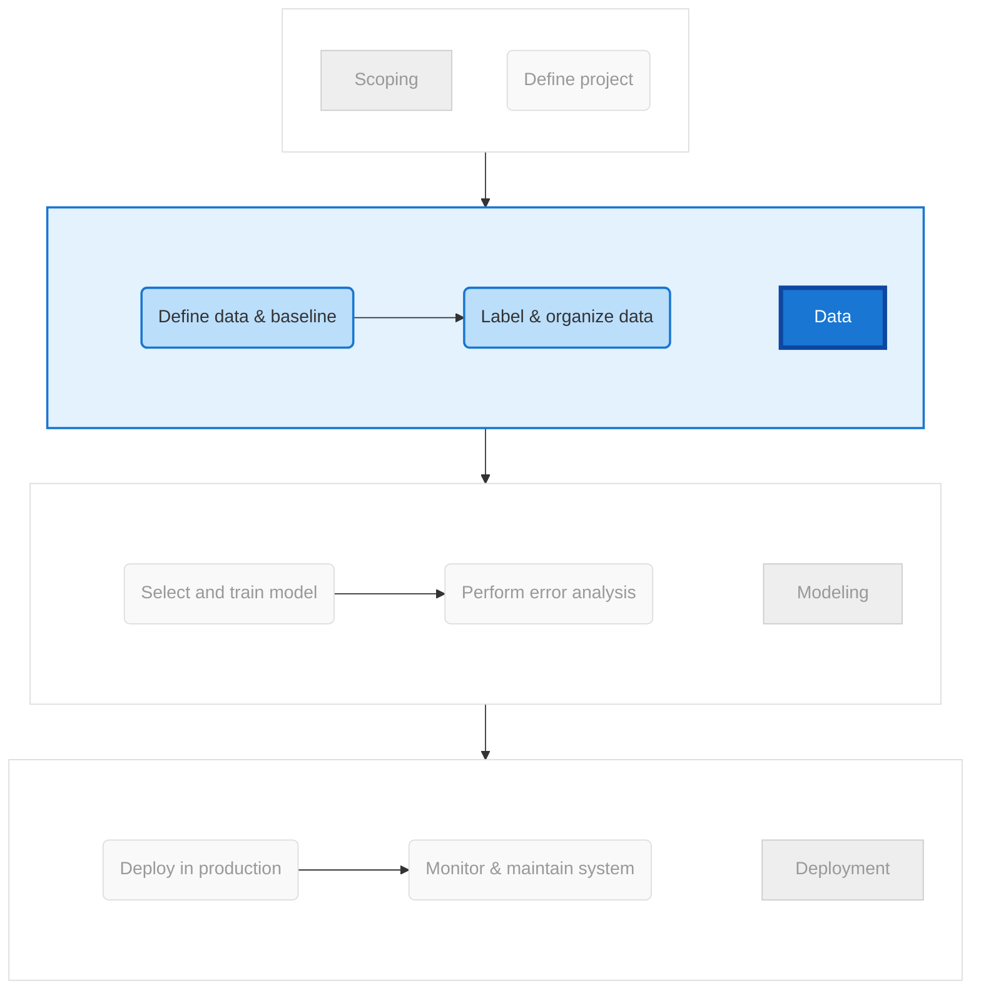
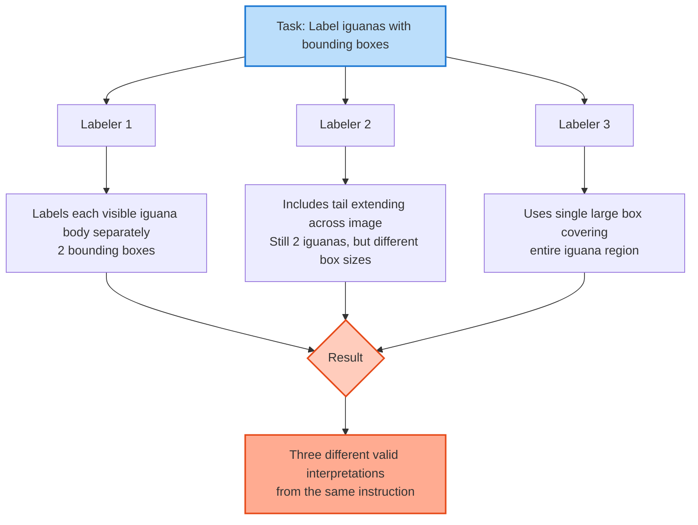
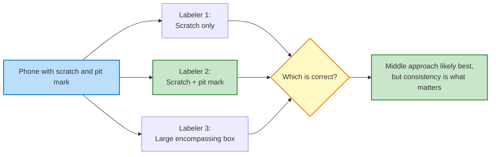
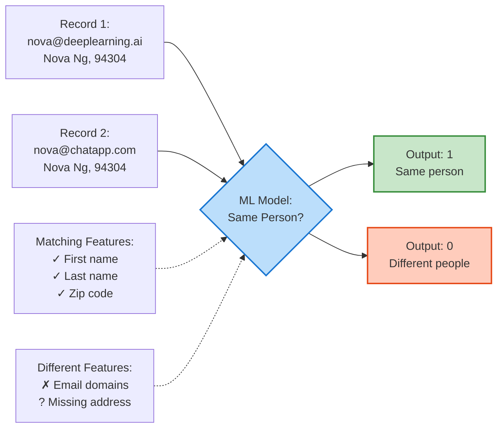
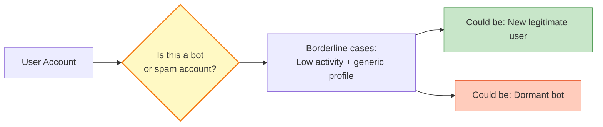

# Week 3: Data Definition and Baseline

## Table of Contents

1. [Why is Data Definition Hard?](#1-why-is-data-definition-hard)
2. [More Label Ambiguity Examples](#2-more-label-ambiguity-examples)
3. [Major Types of Data Problems](#3-major-types-of-data-problems)
4. [Small Data and Label Consistency](#4-small-data-and-label-consistency)
5. [Improving Label Consistency](#5-improving-label-consistency)
6. [Human Level Performance (HLP)](#6-human-level-performance-hlp)
7. [Raising HLP](#7-raising-hlp)
8. [Obtaining Data](#8-obtaining-data)
9. [Data Pipelines](#9-data-pipelines)
10. [Meta-data, Data Provenance and Lineage](#10-meta-data-data-provenance-and-lineage)
11. [Balanced Train/Dev/Test Splits](#11-balanced-traindevtest-splits)

---

## Section 1 - Define Data and Establish Baseline

# Week 3: Data Definition and Baseline

## Table of Contents

1. [Why is Data Definition Hard?](#1-why-is-data-definition-hard)
2. [More Label Ambiguity Examples](#2-more-label-ambiguity-examples)
3. [Major Types of Data Problems](#3-major-types-of-data-problems)
4. [Small Data and Label Consistency](#4-small-data-and-label-consistency)
5. [Improving Label Consistency](#5-improving-label-consistency)
6. [Human Level Performance (HLP)](#6-human-level-performance-hlp)
7. [Raising HLP](#7-raising-hlp)
8. [Obtaining Data](#8-obtaining-data)
9. [Data Pipelines](#9-data-pipelines)
10. [Meta-data, Data Provenance and Lineage](#10-meta-data-data-provenance-and-lineage)
11. [Balanced Train/Dev/Test Splits](#11-balanced-traindevtest-splits)

---

## Section 1 - Define Data and Establish Baseline

## 1. Why is Data Definition Hard?

### Week Overview: Focus on Data Quality

Welcome to Week 3, the final week of this course. This week shifts focus to the data stage of the ML lifecycle—how to get data that sets up your training and modeling for success. While many ML practitioners start by downloading pre-prepared datasets, in practical applications, how you prepare your datasets has a huge impact on project success.



**This week's agenda:**

- Define what is the data (what should be x and what should be y)
- Establish a baseline
- Label and organize the data well
- Prepare a quality dataset for the modeling phase

### The Core Problem: Label Ambiguity

Data definition is hard because even clear instructions can lead to inconsistent labeling when multiple people are involved. The fundamental challenge is that what seems obvious to one person may be interpreted differently by another equally diligent labeler.

### Case Study 1: Iguana Detection

Imagine you've collected hundreds of images from a forest and send them to labelers with the instruction: "Please use bounding boxes to indicate the position of iguanas."



**Three labelers, three different approaches:**

**Labeler 1:** Draws separate bounding boxes for each clearly visible iguana body. Identifies 2 iguanas with tight boxes around their main bodies.

**Labeler 2:** Also identifies 2 iguanas but notices the iguana on the left has a tail extending all the way to the right side of the image. Draws boxes that include the full extent of each iguana including tails.

**Labeler 3:** Draws bounding boxes differently, perhaps using a single large box covering the general region where iguanas are present.

### The Critical Insight: Consistency Matters More Than Convention

Any of these labeling conventions could potentially work. You could train a good iguana detector with any single consistent approach. However, what destroys model performance is inconsistency—if one-third of your dataset uses convention 1, one-third uses convention 2, and one-third uses convention 3, your learning algorithm receives confusing and contradictory training signals.

**The mathematical intuition:** A learning algorithm tries to find patterns that minimize loss across all training examples. When the same visual input (an iguana with an extended tail) sometimes has a small bounding box and sometimes has a large one, the algorithm cannot learn a consistent function mapping from input to output. This inconsistency increases the irreducible error in your model.

### Case Study 2: Phone Defect Detection

This problem manifests in many practical computer vision applications. Consider the phone defect detection example with the instruction: "Use bounding boxes to indicate significant defects."



**Labeler 1:** Focuses on the most obvious defect—the large scratch. Draws a single bounding box around it, reasoning that "significant" means the biggest defect.

**Labeler 2:** Identifies two significant defects: the large scratch and a smaller pit mark (like someone poked the phone with a sharp screwdriver). Draws two separate bounding boxes. This is probably the better approach.

**Labeler 3:** Draws a single large bounding box encompassing the general defect region, treating the entire damaged area as one defect.

### Why Label Ambiguity Arises

The root cause of these inconsistencies is ambiguous labeling instructions. Terms like "significant defects" or "indicate position" seem clear but leave room for interpretation. Even diligent, hardworking labelers will make different reasonable choices when instructions have any ambiguity.

**Real-world insight from production systems:** In Andrew Ng's experience, even with seemingly clear instructions, initial labeling from multiple annotators typically shows 20-30% inconsistency rate. This is why major tech companies invest heavily in detailed labeling guidelines, training programs for annotators, and quality control processes.

### The Path Forward

To address label ambiguity, this week will cover techniques for improving data quality including:

- How to define data clearly (specify what x and y should be)
- Establishing baselines to set performance targets
- Best practices for labeling and organizing data
- Methods for improving label consistency
- When and how to use human-level performance as a benchmark

The fundamental principle is that consistent, clearly-defined data is more valuable than perfect data. A model trained on 1,000 consistently labeled examples will often outperform one trained on 10,000 inconsistently labeled examples.

### Key Takeaway

Data definition is challenging because human interpretation varies even with clear instructions. The solution is not to find the "perfect" labeling convention, but to establish one consistent convention and apply it uniformly across your entire dataset. Inconsistency confuses the learning algorithm and degrades performance—consistency enables learning.

---

## 2. More Label Ambiguity Examples

### Expanding Beyond Computer Vision

While the previous examples focused on bounding boxes in images, label ambiguity affects many other domains. This section explores how the same fundamental problem—inconsistent human interpretation—manifests across different data types and applications.

### Case Study 3: Speech Recognition Transcription

Consider this audio clip: someone standing on a busy roadside asks for the nearest gas station, then a car drives past with road noise. The audio quality makes transcription genuinely ambiguous.

**Possible transcriptions:**

```
Version 1: "Um, nearest gas station"
Version 2: "Umm, nearest gas station"  (two m's)
Version 3: "Um... nearest gas station"  (ellipsis instead of comma)
Version 4: "Um, nearest gas station [unintelligible]"  (acknowledging noise)
```

```mermaid
graph TD
    A[Noisy Audio Clip:<br/>'Um... gas station... car noise'] --> B[Transcription Ambiguities]

    B --> C[Spelling: 'um' vs 'umm']
    B --> D[Punctuation: comma vs ellipsis]
    B --> E[Noise handling: ignore vs '[unintelligible]']

    C --> F{Combinatorial<br/>Possibilities}
    D --> F
    E --> F

    F --> G[2 × 2 × 2 = 8 different<br/>valid transcriptions]

    G --> H[Solution: Standardize<br/>ONE convention]

    style A fill:#FFCCBC,stroke:#E64A19,stroke-width:2px
    style F fill:#FFF9C4,stroke:#F57F17,stroke-width:2px
    style H fill:#C8E6C9,stroke:#388E3C,stroke-width:2px
```

**The combinatorial explosion:** With just three sources of ambiguity (spelling, punctuation, noise handling), you get 8 possible valid transcriptions. Add more variables and the possibilities multiply rapidly. Being able to standardize on one convention helps your speech recognition algorithm learn consistent patterns.

### Case Study 4: User ID Merge (Structured Data)

User ID merging is a common application in large companies—determining whether multiple data records correspond to the same physical person. This often arises after company mergers or when integrating multiple user-facing platforms.

**Scenario setup:**

Imagine you run a website with online job listings. You acquire a second company running a mobile app where people chat about resumes and get career advice. Now you have two separate user databases that need to be merged.

**Example data records:**

| Field      | Job Board (website)  | Resume Chat (app) |
| ---------- | -------------------- | ----------------- |
| Email      | nova@deeplearning.ai | nova@chatapp.com  |
| First Name | Nova                 | Nova              |
| Last Name  | Ng                   | Ng                |
| Address    | 1234 Jane Way        | ?                 |
| State      | CA                   | ?                 |
| Zip        | 94304                | 94304             |

**Matching signals:**

- ✓ First Name: Same
- ✓ Last Name: Same
- ✓ Zip Code: Same

**Different/Missing:**

- ✗ Email domains differ
- ? Address missing in second record
- ? State missing in second record

**The task:** Create a supervised learning algorithm that takes two user data records as input and outputs:

- **1** if same person
- **0** if different person



### The Ground Truth Problem

**When you have ground truth:** If users explicitly link their accounts (e.g., "Connect my job board account with my resume app account"), you have perfect labeled training data. This is the ideal scenario but often unavailable.

**When you don't have ground truth:** Most companies resort to human labelers—often product management teams—who manually examine filtered pairs of records (similar names, similar zip codes) and use judgment to determine matches.

The fundamental challenge is that whether these two records truly represent the same person is genuinely ambiguous. Different labelers will make different reasonable calls. Look at the example above:

- Same first and last name, same zip code → probably same person
- But different email domains → could be different people with the same name
- Missing address data → insufficient information to be certain

Even when ground truth is ambiguous, getting labelers to apply consistent decision criteria can significantly improve algorithm performance.

**Important ethical note:** User ID merging must be done respectfully, with proper privacy protections, and only using data in ways consistent with user permissions. User privacy is paramount.

### Other Ambiguous Structured Data Tasks

Several common business applications involve inherently ambiguous ground truth:

**Bot/Spam Account Detection**



Sometimes account behavior has ambiguous signals. A new account with minimal activity and a generic profile photo could be a bot setting up for spam, or simply a cautious new user.

**Fraudulent Transaction Detection**

An online purchase might show unusual patterns—different shipping address than billing address, larger-than-usual purchase, different device. Is it fraud (stolen account) or legitimate (buying a gift, using a new computer)?

**User Intent: Job Seeking**

Based on website behavior—frequency of visits, types of job postings viewed, resume updates—can you determine if someone is actively looking for a new job? The behavioral signals are often ambiguous. Someone browsing occasionally might be casually exploring opportunities or actively job hunting.

### The Value of Consistency in Ambiguous Tasks

These prediction tasks are valuable and important to businesses, yet the ground truth is genuinely ambiguous. When you ask labelers to make their best guess at ground truth for such tasks, providing labeling instructions that produce more consistent, less noisy, less random labels will improve your learning algorithm's performance.

The algorithm cannot learn stable patterns from inconsistent labels. If the same behavioral pattern sometimes gets labeled "looking for job" and sometimes "not looking for job" based on which labeler happened to review it, the model receives contradictory training signals.

### Defining Data: Critical Questions

When defining data for your learning algorithm, two fundamental questions emerge:

#### Question 1: What is the input x?

The quality of your input features directly impacts model performance.

**For computer vision tasks:**

- Is the lighting good enough?
- Is the camera contrast adequate?
- Is the camera resolution sufficient?

**Real-world example:** If you're detecting defects on smartphones and your images are so dark that even humans cannot see what's happening, the right solution is NOT to just label these poor images. Instead, go to the factory and request improved lighting. Only with better image quality can labelers accurately identify scratches and defects.

**The fundamental principle:** If even a human cannot look at the input and determine what's going on, improving the quality of your sensor or data collection is an essential first step before any labeling work.

**For audio tasks:** Similarly, if your microphone quality is poor or environment is too noisy, improving the recording setup may be more valuable than collecting more low-quality data.

**For structured data tasks:** Defining which features to include has enormous impact on performance.

Example for user ID merge: If you can obtain user location data (even rough GPS coordinates)—with proper user permission—this can be an extremely valuable signal for determining whether two accounts belong to the same person. Two accounts with the same name in the same city are much more likely to match than accounts in different states.

**Critical reminder:** Only use such data if you have explicit user permission. Respect privacy and data usage agreements.

#### Question 2: What should be the target label y?

As you've seen from the examples in this video and the previous one, the key question becomes: How can we ensure labelers give consistent labels?

### Summary: The Systematic Framework

You've now seen various problems with data quality:

- Labels being ambiguous (bounding boxes, transcriptions, user matching)
- Input x not being sufficiently informative (dark images, noisy audio)

In the next video, these data issues will be organized into a more systematic framework that allows you to devise solutions in a structured way. Rather than treating each problem in isolation, you'll learn to categorize data problems and apply appropriate solutions methodically.

### Key Takeaway

Label ambiguity is not limited to computer vision—it pervades speech recognition, structured data analysis, and business prediction tasks. Whether the ambiguity stems from noisy inputs, missing data, or genuinely uncertain ground truth, the solution remains the same: establish consistent labeling conventions and ensure all labelers follow them. Consistency in the presence of ambiguity yields better models than inconsistency with perfect ground truth.

---

## 3. Major Types of Data Problems

### A Useful 2×2 Framework

Different machine learning projects require different data strategies. Best practices that work well for one type of problem may not transfer well to another.

A helpful way to categorize ML problems is using a 2×2 grid with two axes:

1. **Type of data**
   - Unstructured data
   - Structured data

2. **Size of dataset**
   - Small dataset
   - Large dataset

```bash
                            Major Types of Data Problems


                              Unstructured                    Structured
                    ----------------------------------------------------------------
Small Data          |  Manufacturing visual inspection      |  Housing price        |
(< 10,000)          |  from 100 training examples           |  prediction from      |
                    |                                       |  50 examples          |
                    |                                       |                       |
                    ----------------------------------------------------------------
Big Data            |  Speech recognition                   |  Online shopping      |
(> 10,000)          |  from 50 million examples             |  recommendations      |
                    |                                       |  for 1 million users  |
                    ----------------------------------------------------------------


Small Data  (<10,000)  →  Clean labels are critical
Big Data    (>10,000)  →  Emphasis on data process

```

This categorization helps determine:

- How to collect and label data
- Whether data augmentation is useful
- Whether to emphasize clean labels or data processes
- What kind of advice is likely to generalize

---

### Axis 1: Unstructured vs Structured Data

#### Unstructured Data

Examples:

- Images
- Audio
- Text

Humans are naturally good at interpreting unstructured data. We can look at an image or listen to audio and quickly form a judgment.

**Examples:**

- Manufacturing defect detection from 100 images
- Speech recognition from 50 million audio clips

**Key characteristics:**

- Humans can label data effectively
- Data augmentation is often feasible
  - Image transformations (rotation, brightness, cropping)
  - Audio noise injection
  - Synthetic text (emerging methods)

In many real-world systems, there may already be large amounts of **unlabeled data**. For example:

- A factory may have thousands of images stored but not labeled.
- Self-driving car companies collect massive amounts of video, but labeling is expensive.

In such cases, asking humans to label more data can significantly improve performance.

---

#### Structured Data

Examples:

- Tabular datasets
- Database records
- Numeric features

Examples:

- Housing price prediction with 50 examples
- Online shopping recommendations with 1 million users

**Key characteristics:**

- Data is already structured into features
- Harder to “create” new data
- Data augmentation is often limited

If only 50 houses were sold in a region, you cannot synthesize new real house sales. If you have 1 million users, you cannot realistically create fake new users with meaningful behavior.

Human labeling is sometimes possible, but often:

- Labels are more ambiguous
- Even humans may be uncertain about the ground truth
  - Example: determining whether two database records represent the same person

---

### Axis 2: Small Data vs Big Data

There is no strict boundary between small and large datasets. A useful rule of thumb:

- **Small data:** fewer than about 10,000 examples
- **Big data:** more than about 10,000 examples

This threshold is motivated by practicality.

If you have:

- 100 or 1,000 examples → you can manually inspect every example.
- 100,000 or 1,000,000 examples → manual inspection becomes impractical.

The transition is gradual, but best practices differ significantly.

---

### Small Data: Clean Labels Are Critical

When the dataset is small:

- Each mislabeled example has large impact.
  - 1 mislabeled example in 100 = 1% noise.

- The dataset is small enough to manually inspect.
- The labeling team is usually small.

This creates an opportunity:

- Review every example.
- Fix inconsistencies.
- Align labelers on a single labeling convention.

If two people label iguanas differently, you can bring them together, clarify the definition, and relabel consistently.

For small datasets:

- Emphasis is on label quality.
- Clean and consistent labeling can significantly improve performance.

---

### Big Data: Emphasis on Data Process

With large datasets:

- Manually reviewing every example is infeasible.
- There may be 100 or more labelers.
- Relabeling the entire dataset is expensive.

Clean labels still matter. However, the emphasis shifts to:

- Clear labeling guidelines
- Standardized instructions
- Quality control processes
- Well-designed data pipelines

Once a large-scale labeling process is executed, it becomes costly to redo. Therefore:

Design the process carefully before scaling.

In large datasets:

- Process quality matters more than manual inspection.
- Infrastructure and consistency mechanisms become central.

---

### Data Augmentation and Data Availability

For unstructured data:

- Often easier to collect more unlabeled data.
- Humans can help label it.
- Data augmentation is often effective.

For structured data:

- Harder to obtain more genuine examples.
- Harder to augment realistically.
- Labeling may involve inherent ambiguity.

This difference strongly affects strategy.

---

### Advice Does Not Generalize Across Quadrants

A common mistake is giving universal advice such as:
“Always get at least 1,000 labeled examples.”

Machine learning is too diverse for one-size-fits-all rules.

Examples:

- Some computer vision systems work with 100 examples.
- Some require 100 million examples.

Advice tends to generalize better **within the same quadrant** of the 2×2 grid.

If you are working on:

- Small, unstructured data → advice from similar projects is more useful.
- Large, structured data → different instincts apply.

This framework also applies to:

- Hiring machine learning engineers
- Evaluating transferable experience
- Predicting which techniques will generalize

Experience within the same quadrant usually transfers more smoothly than across quadrants.

---

### Summary of the Four Quadrants

|                  | Small Data (<10k)                                                        | Big Data (>10k)                                             |
| ---------------- | ------------------------------------------------------------------------ | ----------------------------------------------------------- |
| **Unstructured** | Clean labels critical. Human review feasible. Data augmentation helpful. | Emphasis on scalable labeling processes and infrastructure. |
| **Structured**   | Hard to obtain more data. Clean labels still crucial.                    | Focus on data engineering, pipelines, and process design.   |

---

### Key Takeaway

Machine learning data problems differ along two fundamental dimensions:

1. Unstructured vs structured data
2. Small vs large datasets

For small datasets, clean and consistent labels are critical.

For large datasets, the emphasis shifts toward robust data processes and scalable labeling systems.

Understanding which quadrant your project belongs to helps determine:

- What practices will work
- What advice is relevant
- What trade-offs matter most

## 4. Small Data and Label Consistency

### Core Idea

When the dataset is small, label quality becomes extremely important.
With few examples, the model cannot average out noise.
If labels are inconsistent, the model learns confusion instead of patterns.

Clean and consistent labels can allow even a small dataset to produce a strong model.

---

### Example 1: Predicting Motor Speed

Task:
Input → Voltage
Output → Rotor speed (rpm)

#### Case 1: Small Data + Noisy Labels

- Only a few training examples (e.g., 5 points).
- Output values are inconsistent or noisy.
- It becomes unclear what function fits the data (linear, curved, saturating, etc.).
- Model uncertainty is high.

#### Case 2: Large Data + Noisy Labels

- Still noisy, but many examples.
- The algorithm can average out noise.
- True pattern becomes clearer.

#### Case 3: Small Data + Clean Labels

- Few examples, but consistent and accurate labels.
- The model can confidently fit a function.
- Good performance is possible even with limited data.

Key takeaway: With small data, label quality matters more than quantity.

---

### Example 2: Phone Defect Inspection

Task:
Input → Image of phone
Output → Defect (1) or No defect (0)

Problem:

- Large scratches are clearly defects.
- Tiny marks are clearly not defects.
- Medium scratches (e.g., 0.2–0.4 mm) are labeled inconsistently by different inspectors.

Result:

- Model sees conflicting supervision.
- Learning becomes unstable.

Solution:

- Define a clear rule (e.g., scratch > 0.3 mm = defect).
- Align labelers to follow the same definition.
- Make labeling consistent.

Result:

- Reduced ambiguity.
- Improved model performance without collecting more data.

---

### Important Insight

Big data problems can still contain small data challenges.

Examples:

1. Web search
   Rare queries have very few examples.

2. Self-driving cars
   Rare but critical events (e.g., child running across road) are infrequent.

3. Recommender systems
   Long-tail products have very little interaction data.

Even in large datasets, rare events behave like small data problems.
Label consistency for these rare cases is crucial.

---

### Final Summary

- Small datasets cannot tolerate noisy labels.
- Clean and consistent labeling can compensate for limited data.
- Large datasets can average noise, but rare events still require high-quality labels.
- Improving label consistency is often more effective than collecting more data.
