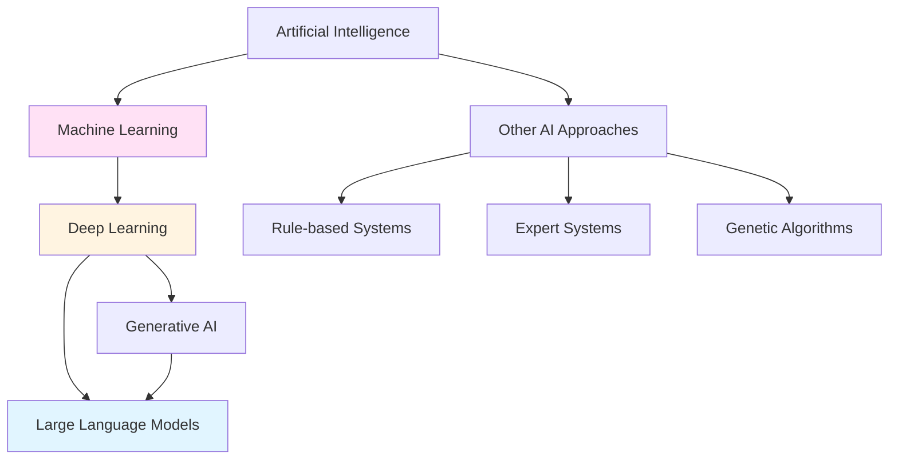
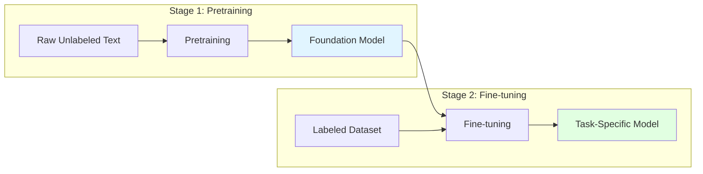
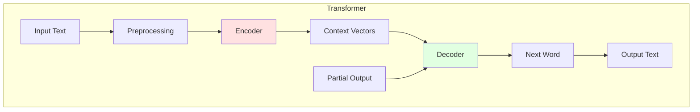
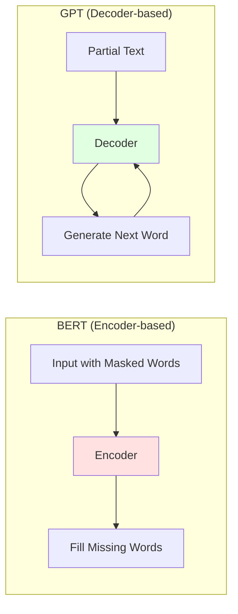
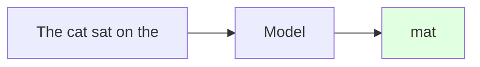
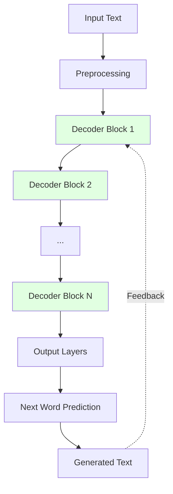
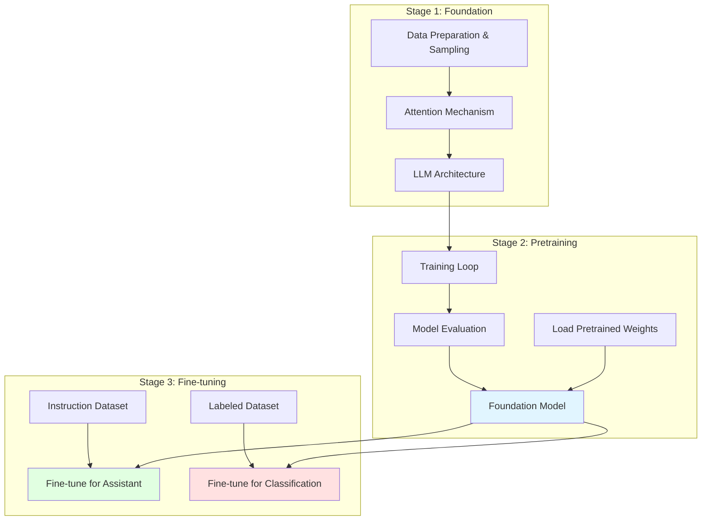

# Chapter 1: Understanding Large Language Models

## Table of Contents

1. [What is an LLM?](#11-what-is-an-llm)
2. [Applications of LLMs](#12-applications-of-llms)
3. [Stages of building and using LLMs](#13-stages-of-building-and-using-llms)
4. [Introducing the transformer architecture](#14-introducing-the-transformer-architecture)
5. [Utilizing large datasets](#15-utilizing-large-datasets)
6. [A closer look at the GPT architecture](#16-a-closer-look-at-the-gpt-architecture)
7. [Building a large language model](#17-building-a-large-language-model)

## Overview

Large language models represent a fundamental shift in natural language processing, moving from rule-based systems and simpler statistical methods to deep learning approaches capable of understanding, generating, and translating human language. This chapter establishes the foundational concepts needed to build an LLM from scratch, covering the transformer architecture, training processes, and the general GPT blueprint that will guide our implementation.

## 1.1 What is an LLM?

A large language model is a deep neural network specifically designed to understand, generate, and respond to human-like text. The term "large" carries dual significance: it refers both to the model's architecture (measured in parameters) and the immense datasets used during training. Modern LLMs like GPT-3 contain tens or hundreds of billions of parameters, which are the adjustable weights optimized during training to predict the next word in a sequence.

When we say LLMs "understand" language, we mean they can process and generate text that appears coherent and contextually relevant, not that they possess human-like consciousness. This capability emerges from training on vast quantities of text data, allowing these models to capture contextual information and linguistic subtleties that would be extremely challenging to encode manually.

The fundamental training task for LLMs is deceptively simple: next-word prediction. By learning to predict the upcoming word in a sequence, the model develops an understanding of context, structure, and relationships within text. This simplicity is what makes the resulting capabilities so surprising to researchers—complex behaviors emerge from this straightforward objective.

### LLMs as Generative AI

LLMs fall under the broader category of generative artificial intelligence because they create new content rather than simply classifying or analyzing existing content. The hierarchical relationship between these fields can be understood as follows:

Artificial intelligence encompasses any system exhibiting human-like intelligence, including pattern recognition, decision-making, and language understanding. Machine learning represents a subset of AI focused on algorithms that learn from data without explicit programming. Deep learning further specializes in neural networks with multiple layers, and LLMs represent a specific application of deep learning for text processing and generation.

The key distinction between traditional machine learning and deep learning lies in feature extraction. In traditional approaches, human experts must manually identify and select relevant features. For example, in spam classification, experts might define features like frequency of trigger words, number of exclamation marks, or presence of suspicious links. Deep learning, including LLMs, performs automatic feature extraction—the model learns which patterns matter directly from the data.

## 1.2 Applications of LLMs

LLMs demonstrate remarkable versatility across numerous domains, fundamentally changing how we interact with technology and process information. Their ability to parse and understand unstructured text enables applications that were previously impractical or impossible.

Contemporary LLMs excel at machine translation, converting text between languages with high accuracy. They generate novel content including fiction, technical articles, and computer code. Sentiment analysis allows businesses to understand customer opinions at scale. Text summarization condenses lengthy documents while preserving key information. These capabilities extend to powering sophisticated chatbots and virtual assistants like ChatGPT and Google's Gemini, which can engage in natural conversations and augment traditional search engines.

In specialized domains, LLMs prove invaluable for knowledge retrieval. Medical and legal professionals use them to sift through vast document collections, summarize complex passages, and answer technical questions. The automation potential extends to nearly any task involving text parsing or generation, making LLMs transformative tools for making technology more conversational, intuitive, and accessible.

The focus of this book is understanding how LLMs work from the ground up by building one capable of generating text. Beyond basic generation, you'll learn techniques that enable LLMs to answer questions, summarize content, translate between languages, and more. By implementing a ChatGPT-like assistant step by step, you'll understand both the capabilities and limitations of these powerful models.

## 1.3 Stages of Building and Using LLMs

Building an LLM from scratch serves multiple purposes beyond creating a working model. The implementation process provides deep insight into the mechanics and limitations of these systems. It also equips you with knowledge needed for pretraining or fine-tuning existing open source architectures on domain-specific datasets or tasks.

### Why Build Custom LLMs?

Research demonstrates that custom-built LLMs tailored for specific tasks or domains often outperform general-purpose models like ChatGPT. Examples include BloombergGPT, specialized for finance, and medical LLMs designed for healthcare question answering. These domain-specific models achieve superior performance because they're optimized for particular use cases rather than designed for broad applicability.

Custom LLMs offer several practical advantages. Data privacy concerns make companies hesitant to share sensitive information with third-party providers like OpenAI. Building proprietary models keeps data in-house and under direct control. Additionally, smaller custom models enable deployment directly on consumer devices such as laptops and smartphones, reducing latency and server costs while giving developers complete autonomy over updates and modifications.

### The Two-Stage Training Process

Creating an LLM follows a two-stage approach: pretraining followed by fine-tuning. This separation allows models to first develop broad language understanding before specialization for particular tasks.

**Pretraining** represents the initial phase where the model learns from massive, diverse datasets without explicit labels. This training uses self-supervised learning, where the model generates its own labels from the input data structure. The next-word prediction task provides natural labels—the actual next word in the sequence becomes the target the model should predict. This self-labeling property enables training on unlabeled text datasets containing trillions of words.

The output of pretraining is a foundation model (also called a base model), such as the original GPT-3. These models demonstrate text completion capabilities and limited few-shot learning—the ability to perform new tasks based on just a few examples rather than extensive training data. While powerful, foundation models aren't optimized for specific applications.

**Fine-tuning** takes a pretrained foundation model and trains it further on smaller, labeled datasets for particular tasks. Two primary fine-tuning categories exist:

Instruction fine-tuning uses datasets consisting of instruction-answer pairs. For example, a translation task would pair a query requesting translation with the correctly translated output. This approach teaches models to follow user instructions and respond appropriately to queries.

Classification fine-tuning uses datasets with texts and associated class labels, such as emails marked as "spam" or "not spam." This specializes models for categorization tasks across various domains.

Both pretraining and fine-tuning implementations will be covered in code throughout this book, providing complete understanding of the full LLM development pipeline.

## 1.4 Introducing the Transformer Architecture

Modern LLMs rely on the transformer architecture, a deep neural network design introduced in the 2017 paper "Attention Is All You Need." Understanding transformers is essential for comprehending how LLMs function, as this architecture forms the foundation for models like GPT and BERT.

### Original Transformer Design

The original transformer was developed for machine translation, specifically translating English to German and French. The architecture consists of two primary submodules working in concert:

The **encoder** processes input text and transforms it into numerical representations (vectors) that capture contextual information. These encoded vectors contain rich semantic meaning derived from the entire input sequence.

The **decoder** takes encoded vectors and generates output text. In translation tasks, the encoder would process source language text into vectors, and the decoder would use those vectors to produce target language text.

Both encoder and decoder contain multiple layers connected through a self-attention mechanism. This mechanism allows the model to weigh the importance of different words or tokens relative to each other within a sequence. Self-attention enables capturing long-range dependencies and contextual relationships, which is crucial for generating coherent and contextually relevant output. The complexity of attention mechanisms warrants dedicated explanation, which will be provided with step-by-step implementation in Chapter 3.

### Evolution: BERT and GPT

Later transformer variants adapted the original architecture for different purposes. BERT (Bidirectional Encoder Representations from Transformers) and GPT (Generative Pretrained Transformers) represent two major evolutionary branches.

**BERT** builds upon the encoder submodule and specializes in masked word prediction. During training, words in sentences are randomly masked, and the model learns to predict these hidden words based on surrounding context. This bidirectional approach (considering both left and right context) makes BERT particularly effective for text classification tasks including sentiment prediction and document categorization. Real-world applications include content moderation—for example, X (formerly Twitter) uses BERT to detect toxic content.

**GPT** focuses on the decoder portion and targets generative tasks requiring text creation. Applications include machine translation, text summarization, creative writing, and code generation. The key distinction is that GPT generates text autoregressively, producing one word at a time based on all previous words.

GPT models demonstrate remarkable versatility through zero-shot and few-shot learning capabilities. Zero-shot learning means the model can generalize to completely unseen tasks without any task-specific examples. Few-shot learning involves learning from minimal examples provided in the input prompt. This flexibility allows a single model to handle diverse tasks without retraining or architectural changes.

## 1.5 Utilizing Large Datasets

The scale and diversity of training data fundamentally determines LLM capabilities. Pretraining datasets for models like GPT-3 encompass billions of words across diverse topics, natural languages, and even programming languages.

### GPT-3 Training Data Composition

The GPT-3 pretraining dataset demonstrates the massive scale required for capable LLMs:

| Dataset                | Description          | Tokens      | Training Proportion |
| ---------------------- | -------------------- | ----------- | ------------------- |
| CommonCrawl (filtered) | Web crawl data       | 410 billion | 60%                 |
| WebText2               | Web crawl data       | 19 billion  | 22%                 |
| Books1                 | Internet book corpus | 12 billion  | 8%                  |
| Books2                 | Internet book corpus | 55 billion  | 8%                  |
| Wikipedia              | High-quality text    | 3 billion   | 3%                  |

A token represents a unit of text the model processes, roughly equivalent to words and punctuation. The tokenization process, which converts text into tokens, will be covered in Chapter 2.

The total dataset contains 499 billion tokens, though GPT-3 was trained on only 300 billion. The authors didn't specify why training stopped before consuming all available data. For context, CommonCrawl alone requires approximately 570 GB of storage.

Later models expanded training data further. Meta's LLaMA incorporated additional sources including Arxiv research papers (92 GB) and StackExchange code-related Q&As (78 GB). The scale and diversity enable these models to perform well across varied tasks, capturing linguistic nuances, contexts, and patterns that would be impractical to encode manually.

### The Economics of Pretraining

Pretraining LLMs from scratch demands substantial resources. GPT-3's pretraining cost is estimated at $4.6 million in cloud computing credits. This economic reality makes openly available pretrained models extremely valuable—they represent foundation models that can be fine-tuned for specific tasks with relatively modest datasets and computational resources.

The good news for practitioners is that many pretrained LLMs are available as open source models. These can serve as general-purpose tools for writing, extracting, and editing text. Fine-tuning these models on specific tasks with smaller datasets significantly reduces computational requirements while improving performance on targeted applications.

This book implements pretraining code for educational purposes, with all computations executable on consumer hardware. After understanding pretraining implementation, you'll learn to load openly available model weights into your architecture, allowing you to skip expensive pretraining when fine-tuning for specific applications.

## 1.6 A Closer Look at the GPT Architecture

GPT (Generative Pretrained Transformer) was introduced in the paper "Improving Language Understanding by Generative Pre-Training" by Radford et al. from OpenAI. GPT-3 scales up this architecture with more parameters and larger training datasets. The original ChatGPT model fine-tuned GPT-3 on instruction datasets using methods from OpenAI's InstructGPT paper.

### Next-Word Prediction as Self-Supervised Learning

The pretraining task for GPT models is elegantly simple: predict the next word in a sequence. This next-word prediction represents self-supervised learning because labels are generated automatically from the data structure itself. The next word in a sentence becomes the label the model should predict, eliminating the need for manual annotation.

This self-labeling property enables training on massive unlabeled text datasets. The simplicity is deceptive—despite being trained only on next-word prediction, GPT models develop emergent capabilities including spelling correction, classification, and language translation. These abilities weren't explicitly programmed but emerged naturally from exposure to vast, diverse text during training.

### Decoder-Only Architecture

Compared to the original transformer with both encoder and decoder, GPT architecture is simpler—it implements only the decoder portion. This decoder-style design makes GPT an autoregressive model, meaning it incorporates previous outputs as inputs for future predictions. Each new word is chosen based on the complete preceding sequence, improving output coherence.

The architecture scales dramatically compared to the original transformer. While the original transformer repeated encoder and decoder blocks six times each, GPT-3 contains 96 transformer layers with 175 billion total parameters. Despite this massive scale, the fundamental architecture remains conceptually straightforward.

### Emergent Translation Capabilities

An unexpected discovery was that GPT models, despite being designed for next-word prediction rather than translation, can perform translation tasks effectively. This emergent behavior wasn't explicitly taught during training but arose naturally from the model's exposure to vast quantities of multilingual data in diverse contexts.

The model "learns" translation patterns between languages without specific translation training. This demonstrates a key advantage of large-scale generative language models: they can perform diverse tasks without requiring diverse specialized models. A single architecture develops multiple capabilities through exposure to sufficient varied data.

### Contemporary Relevance

Although GPT-3 was introduced in 2020, the underlying architectural concepts remain highly relevant. More recent models like Meta's Llama implement only minor modifications to the core GPT design. Understanding GPT architecture provides foundation for comprehending virtually all modern decoder-only LLMs.

This book focuses on implementing the GPT architecture while providing guidance on specific modifications employed by alternative models. The core concepts—decoder-only design, next-word prediction, self-attention mechanisms—form the basis for understanding contemporary LLM development.

## 1.7 Building a Large Language Model

Having established foundational understanding, the book proceeds to implement an LLM from scratch. The development process follows three main stages, each building upon the previous:

### Stage 1: Architecture and Data Foundations

The first stage establishes fundamental components. You'll learn essential data preprocessing steps that prepare raw text for model consumption. The attention mechanism, which sits at the heart of every LLM, receives detailed implementation. This mechanism enables models to selectively focus on different input parts when making predictions, which is crucial for handling language complexity and nuance.

By the end of Stage 1, you'll understand how transformers process text and how attention mechanisms capture relationships between words regardless of their distance in the input sequence.

### Stage 2: Pretraining a Foundation Model

Stage 2 implements and executes the pretraining process to create a GPT-like LLM capable of generating new text. This involves implementing the complete training loop, including forward passes, loss calculation, backpropagation, and parameter updates.

Model evaluation fundamentals are covered extensively, as evaluation is essential for developing capable NLP systems. You'll learn how to assess model performance, understand training dynamics, and diagnose common issues.

Important context: pretraining an LLM from scratch represents a significant undertaking, requiring thousands to millions of dollars in computing resources for GPT-scale models. Therefore, Stage 2 focuses on implementing training for educational purposes using a small dataset that runs on consumer hardware. Additionally, code examples demonstrate loading openly available model weights, allowing you to leverage existing pretrained models and skip expensive pretraining for practical applications.

### Stage 3: Fine-tuning for Specific Tasks

The final stage takes a pretrained foundation model and fine-tunes it to follow instructions or perform classification. These represent the most common tasks in real-world applications and research.

Instruction fine-tuning creates models that can answer queries, follow complex instructions, and engage in helpful dialogue—the capabilities that make LLMs useful as personal assistants. Classification fine-tuning specializes models for categorization tasks such as sentiment analysis, topic classification, or content moderation.

Both fine-tuning approaches significantly improve task-specific performance compared to using the foundation model directly. Fine-tuning requires far less data and computation than pretraining, making it the practical approach for most applications.

## Key Takeaways

Large language models represent a paradigm shift in natural language processing, moving from explicit rule-based systems to deep learning approaches capable of learning patterns directly from data. Modern LLMs undergo two-stage training: pretraining on massive unlabeled datasets using next-word prediction, followed by fine-tuning on smaller labeled datasets for specific tasks.

The transformer architecture, specifically the decoder-only variant used in GPT, forms the foundation of contemporary LLMs. The self-attention mechanism within transformers enables selective focus on relevant input portions when generating output, allowing sophisticated language understanding and generation.

While pretraining requires enormous datasets and computational resources, the resulting foundation models can be fine-tuned efficiently for various downstream tasks. Custom LLMs fine-tuned on domain-specific data often outperform general-purpose models for specialized applications.

Emergent properties distinguish modern LLMs from previous approaches. Despite training primarily on next-word prediction, these models develop capabilities for classification, translation, summarization, and instruction following. This versatility makes LLMs powerful general-purpose tools for text processing and generation tasks.

The following chapters implement these concepts step by step, building a complete understanding of how LLMs work through hands-on coding. By the end of this journey, you'll have implemented a ChatGPT-like model from scratch, understanding both its capabilities and limitations at a fundamental level.
