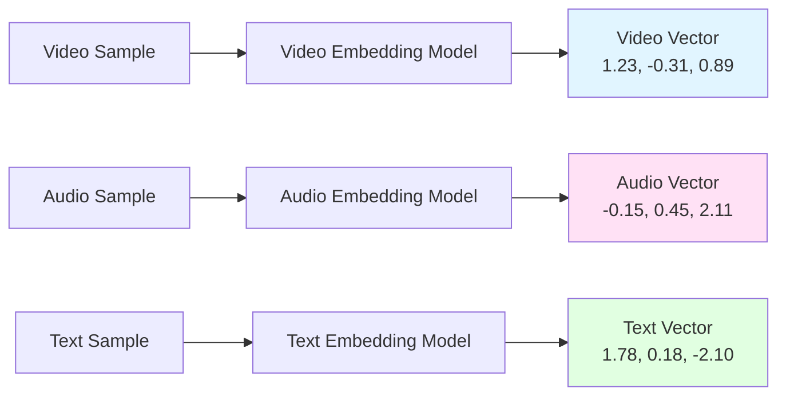
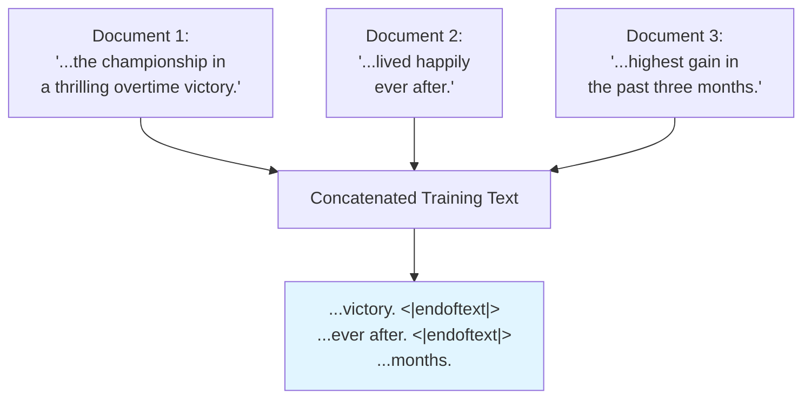
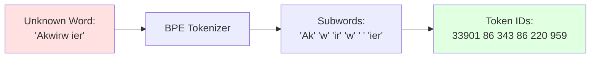
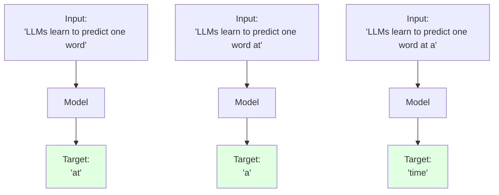
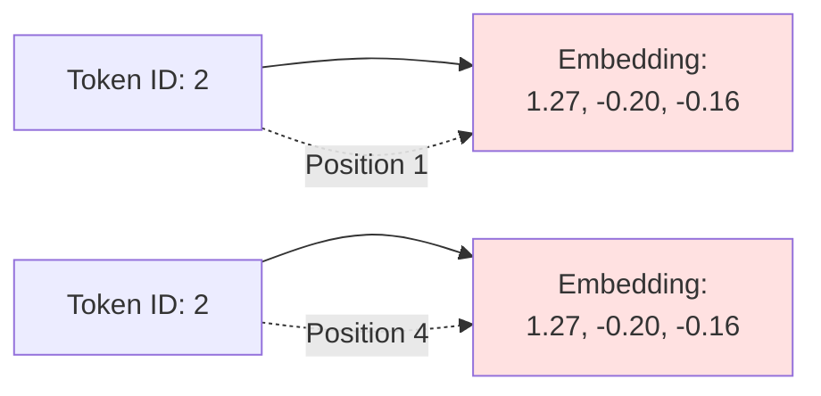
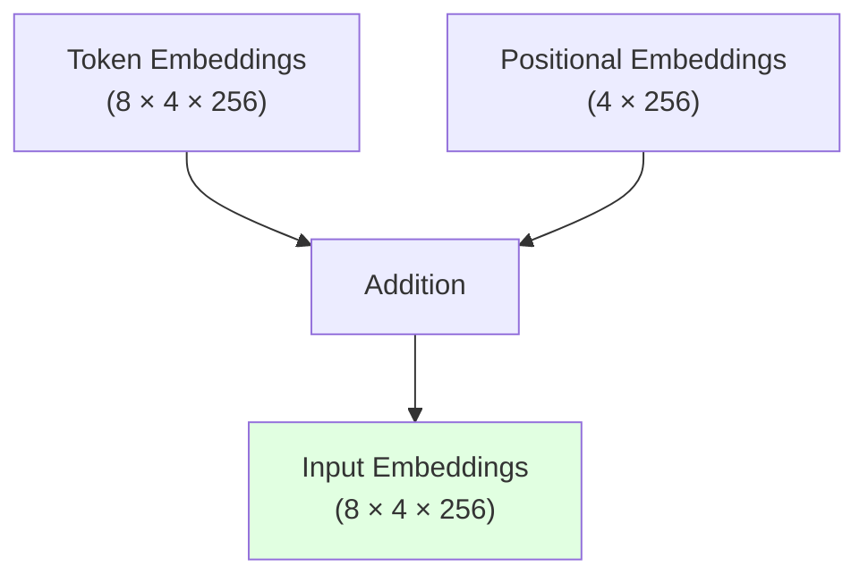

# Chapter 2: Working with Text Data

## Table of Contents

1. [Understanding word embeddings](#21-understanding-word-embeddings)
2. [Tokenizing text](#22-tokenizing-text)
3. [Converting tokens into token IDs](#23-converting-tokens-into-token-ids)
4. [Adding special context tokens](#24-adding-special-context-tokens)
5. [Byte pair encoding](#25-byte-pair-encoding)
6. [Data sampling with a sliding window](#26-data-sampling-with-a-sliding-window)
7. [Creating token embeddings](#27-creating-token-embeddings)
8. [Encoding word positions](#28-encoding-word-positions)

## Overview

Large language models process text one word at a time during pretraining, using a next-word prediction task that yields models with impressive capabilities despite its simplicity. Before implementing and training LLMs, we must prepare the training dataset through a series of text processing steps. This chapter covers the complete data preparation pipeline, from raw text to embedding vectors ready for LLM consumption.

The preparation process involves splitting text into individual tokens (words or subwords), converting these tokens into numerical representations, and ultimately transforming them into continuous vector embeddings. This transformation is essential because deep neural networks, including LLMs, cannot process raw categorical text directly—they require continuous-valued vectors compatible with mathematical operations used in training.

## 2.1 Understanding Word Embeddings

Deep neural network models, including LLMs, face a fundamental incompatibility with raw text. Text is categorical data, and the mathematical operations that implement and train neural networks require continuous numerical inputs. Therefore, we need a mechanism to represent words as continuous-valued vectors—a process called embedding.

### The Concept of Embeddings

At its core, an embedding is a mapping from discrete objects (words, images, entire documents) to points in a continuous vector space. The primary purpose of embeddings is converting nonnumeric data into a format that neural networks can process. Different data types require distinct embedding models—an embedding model designed for text would not be suitable for audio or video data.



While word embeddings are the most common form of text embedding, there are also embeddings for sentences, paragraphs, or whole documents. Sentence or paragraph embeddings are popular for retrieval-augmented generation, which combines text generation with information retrieval from external knowledge bases. Since the goal is training GPT-like LLMs that generate text one word at a time, we focus on word embeddings.

### Word2Vec and Semantic Relationships

Several algorithms and frameworks have been developed to generate word embeddings. Word2Vec represents one of the earlier and most popular approaches. Word2Vec trained neural network architectures to generate word embeddings by predicting the context of a word given the target word, or vice versa. The fundamental idea is that words appearing in similar contexts tend to have similar meanings.

When projected into two-dimensional space for visualization purposes, similar terms cluster together. For instance, different types of birds ("eagle," "duck," "goose") appear closer to each other in embedding space than to countries ("Germany," "England") or cities ("Berlin," "London"). This spatial organization reflects semantic relationships captured during training.

Word embeddings can have varying dimensions, from one to thousands. Higher dimensionality might capture more nuanced relationships but comes at the cost of computational efficiency. This represents a fundamental tradeoff in embedding design.

```
╔════════════════════════════════════════════════════════════════════════════════╗
║                          VECTOR EMBEDDING SPACE                                ║
╚════════════════════════════════════════════════════════════════════════════════╝

   Second
   Dimension
      ^                 Vector embeddings of
      │                 Musical Instruments
      │                /
      │          ____ /____
      │        /            \
      │       │  drums   O   │       ● pencil (Outlier)
      │       │     O        │
      │       │ piano  guitar│
      │        \______O_____/
      │
      │
      │    ● Tokyo           ● large
      │           ● Paris        ● larger
      │   ● Rome                     ● largest
      │
      └─────────────────────────────────────────────────────────► First Dimension

╔════════════════════════════════════════════════════════════════════════════════╗
║ Words with similar meanings are clustered together in vector space.            ║
║ For example, instruments form one group while cities form another.             ║
╚════════════════════════════════════════════════════════════════════════════════╝
```

### LLM-Specific Embedding Approaches

While pretrained models like Word2Vec can generate embeddings for machine learning models, LLMs commonly produce their own embeddings as part of the input layer, with these embeddings updated during training. The advantage of optimizing embeddings as part of LLM training (rather than using Word2Vec) is that the embeddings become optimized for the specific task and data at hand.

The embedding size varies based on the specific model variant and represents a tradeoff between performance and efficiency:

- **GPT-2 smallest models** (117M and 125M parameters): 768-dimensional embeddings
- **GPT-3 largest model** (175B parameters): 12,288-dimensional embeddings

Unfortunately, high-dimensional embeddings present visualization challenges. Our sensory perception and common graphical representations are inherently limited to three dimensions or fewer. When working with LLMs, we typically use embeddings with much higher dimensionality than what can be easily visualized.

The process of preparing embeddings for LLMs involves several sequential steps: splitting text into words, converting words into tokens, and turning tokens into embedding vectors. Each step builds upon the previous one to create the numerical representations that LLMs can process.

## 2.2 Tokenizing Text

Tokenization represents the first step in preparing text for LLM training. This process splits input text into individual tokens—either individual words or special characters including punctuation. Understanding tokenization is crucial because it determines how the model perceives and processes text.

### Dataset and Initial Processing

For demonstration purposes, we use "The Verdict," a short story by Edith Wharton that has been released into the public domain, making it permissible for LLM training tasks. The text contains 20,479 characters and provides a realistic example of natural language text with various punctuation marks, quotation marks, and formatting characters.

The goal is tokenizing this short story into individual words and special characters that can be converted into embeddings for LLM training. While processing millions of articles and hundreds of thousands of books (many gigabytes of text) is common when working with production LLMs, a single book suffices for educational purposes to illustrate the main ideas behind text processing steps and run in reasonable time on consumer hardware.

### Regular Expression-Based Tokenization

Python's regular expression library (`re`) provides a straightforward approach to tokenization. The simplest approach splits text on whitespace characters:

```python
import re
text = "Hello, world. This, is a test."
result = re.split(r'(\s)', text)
# Result: ['Hello,', ' ', 'world.', ' ', 'This,', ' ', 'is', ' ', 'a', ' ', 'test.']
```

This simple scheme mostly works for separating text into individual words, but some words remain connected to punctuation characters. We want punctuation as separate list entries. Additionally, we refrain from making all text lowercase because capitalization helps LLMs distinguish between proper nouns and common nouns, understand sentence structure, and generate text with proper capitalization.

Modifying the regular expression to split on both whitespaces and common punctuation:

```python
result = re.split(r'([,.]|\s)', text)
# Result: ['Hello', ',', '', ' ', 'world', '.', '', ' ', 'This', ',', '', ' ', 'is',
#          ' ', 'a', ' ', 'test', '.', '']
```

Now words and punctuation characters are separate list entries. A remaining issue is that the list includes whitespace characters. We can remove these redundant characters:

```python
result = [item for item in result if item.strip()]
# Result: ['Hello', ',', 'world', '.', 'This', ',', 'is', 'a', 'test', '.']
```

Whether to encode whitespaces as separate characters or remove them depends on the application and its requirements. Removing whitespaces reduces memory and computing requirements. However, keeping whitespaces can be useful for models sensitive to exact text structure (for example, Python code, which is sensitive to indentation and spacing). For simplicity and brevity, we remove whitespaces here. Later, we will switch to a tokenization scheme that includes whitespaces.

### Handling Additional Special Characters

The tokenization scheme needs extension to handle other punctuation types—question marks, quotation marks, double-dashes, and additional special characters:

```python
text = "Hello, world. Is this-- a test?"
result = re.split(r'([,.:;?_!"()\']|--|\s)', text)
result = [item.strip() for item in result if item.strip()]
# Result: ['Hello', ',', 'world', '.', 'Is', 'this', '--', 'a', 'test', '?']
```

This enhanced tokenization scheme successfully handles various special characters in text. Applying this to Edith Wharton's entire short story produces 4,690 tokens (without whitespaces). The first 30 tokens demonstrate that the tokenizer handles the text well, with all words and special characters neatly separated:

```
['I', 'HAD', 'always', 'thought', 'Jack', 'Gisburn', 'rather', 'a',
'cheap', 'genius', '--', 'though', 'a', 'good', 'fellow', 'enough',
'--', 'so', 'it', 'was', 'no', 'great', 'surprise', 'to', 'me', 'to',
'hear', 'that', ',', 'in']
```

```
╔════════════════════════════════════════════════════════════════════════════╗
║                            TOKENIZATION PROCESS                            ║
╚════════════════════════════════════════════════════════════════════════════╝

┌─────────────────────────────────────┐
│         Input Text                  │
│  ┌────────────────────────────────┐ │
│  │ Hello, world. Is this-- a test?│ │
│  └────────────────────────────────┘ │
└──────────────┬──────────────────────┘
               │
               │ Tokenization Process
               │ (splits on punctuation
               │  and whitespace)
               ▼
┌────────────────────────────────────────────────────────────────────────┐
│                         Tokenized Text                                 │
│                                                                        │
│  ┌─────┬───┬─────┬───┬────┬────┬────┬───┬────┬───┐                     │
│  │Hello│ , │world│ . │ Is │this│ -- │ a │test│ ? │                     │
│  └─────┴───┴─────┴───┴────┴────┴────┴───┴────┴───┘                     │
│                                                                        │
│  Each box represents an individual token (word or punctuation)         │
└────────────────────────────────────────────────────────────────────────┘

═══════════════════════════════════════════════════════════════════════════
 The tokenization scheme successfully handles various special characters,
 splitting text into 10 individual tokens in this example.
═══════════════════════════════════════════════════════════════════════════
```

## 2.3 Converting Tokens into Token IDs

After tokenization, the next step converts tokens from Python strings to integer representations, producing token IDs. This conversion is an intermediate step before converting token IDs into embedding vectors. The process requires building a vocabulary that maps each unique word and special character to a unique integer.

### Building the Vocabulary

```
╔════════════════════════════════════════════════════════════════════════════════╗
║                         TOKENIZATION AND VOCABULARY BUILDING                   ║
╚════════════════════════════════════════════════════════════════════════════════╝

┌──────────────────────────┐
│ Complete Training Dataset│
└────────┬────────┬────────┘
         │        │
         │        └─────────────────────┐
         │                              │
         ▼                              ▼
┌────────────────────┐         ┌────────────────────┐
│  1. TOKENIZATION   │         │  2. VOCABULARY     │
│                    │         │     BUILDING       │
└────────┬───────────┘         └─────────┬──────────┘
         │                               │
         ▼                               ▼
┌─────────────────────────────┐   ┌──────────────────────┐
│ Input Text:                 │   │ Alphabetically Sorted│
│ ┌─────────────────────────┐ │   │ Unique Tokens        │
│ │The quick brown fox jumps│ │   │                      │
│ │over the lazy dog        │ │   │ Unique    Token      │
│ └─────────────────────────┘ │   │ Tokens    IDs        │
└──────────┬──────────────────┘   │ ─────────────────    │
           │                      │ brown  ──►  0        │
           ▼                      │ dog    ──►  1        │
┌─────────────────────────────┐   │ fox    ──►  2        │
│ Tokenized Dataset:          │   │ jumps  ──►  3        │
│                             │   │ lazy   ──►  4        │
│ ┌─────┬─────┬─────┬─────┐   │   │ over   ──►  5        │
│ │ The │quick│brown│ ... │   │   │ quick  ──►  6        │
│ └─────┴─────┴─────┴─────┘   │   │ the    ──►  7        │
│                             │   └──────────────────────┘
│ Each token is mapped to     │            │
│ its corresponding token ID  │◄───────────┘
│ using the vocabulary        │
└─────────────────────────────┘

╔════════════════════════════════════════════════════════════════════════════════╗
║ The vocabulary contains all unique tokens in the training set and is usually   ║
║ sorted alphabetically. Each unique token is mapped to a unique integer called  ║
║ token ID.                                                                      ║
╚════════════════════════════════════════════════════════════════════════════════╝
```

A vocabulary defines the mapping from tokens to integers. Starting with the tokenized text stored in the `preprocessed` variable, we create a list of all unique tokens and sort them alphabetically to determine vocabulary size:

```python
all_words = sorted(set(preprocessed))
vocab_size = len(all_words)  # Returns 1,130
```

Creating the vocabulary as a dictionary that maps tokens to integers:

```python
vocab = {token:integer for integer,token in enumerate(all_words)}
```

The first few entries of the vocabulary show individual tokens associated with unique integer labels:

```
('!', 0)
('"', 1)
("'", 2)
...
('Her', 49)
('Hermia', 50)
```

### Implementing the Tokenizer Class

To convert text into token IDs and back again, we implement a complete tokenizer class with two essential methods: `encode` (converts text to token IDs) and `decode` (converts token IDs back to text).

```python
class SimpleTokenizerV1:
    def __init__(self, vocab):
        self.str_to_int = vocab  # Stores vocabulary as class attribute
        self.int_to_str = {i:s for s,i in vocab.items()}  # Creates inverse vocabulary

    def encode(self, text):
        preprocessed = re.split(r'([,.?_!"()\']|--|\s)', text)
        preprocessed = [item.strip() for item in preprocessed if item.strip()]
        ids = [self.str_to_int[s] for s in preprocessed]
        return ids

    def decode(self, ids):
        text = " ".join([self.int_to_str[i] for i in ids])
        # Remove spaces before specified punctuation
        text = re.sub(r'\s+([,.?!"()\'])', r'\1', text)
        return text
```

The inverse vocabulary (`int_to_str`) maps token IDs back to original text tokens, enabling the decode functionality. The encode method processes input text into token IDs, while the decode method converts token IDs back into text, removing spaces before punctuation to restore natural text formatting.

### Testing the Tokenizer

Testing the tokenizer on a passage from Edith Wharton's short story:

```python
tokenizer = SimpleTokenizerV1(vocab)
text = """"It's the last he painted, you know,"
         Mrs. Gisburn said with pardonable pride."""
ids = tokenizer.encode(text)
# Returns: [1, 56, 2, 850, 988, 602, 533, 746, 5, 1126, 596, 5, 1, 67, 7, 38,
#           851, 1108, 754, 793, 7]

decoded_text = tokenizer.decode(ids)
# Returns: '" It\' s the last he painted, you know," Mrs. Gisburn said with
#           pardonable pride.'
```

The decode method successfully converts token IDs back into the original text. However, applying the tokenizer to new text not in the training set reveals a limitation:

```python
text = "Hello, do you like tea?"
tokenizer.encode(text)  # Raises KeyError: 'Hello'
```

The word "Hello" was not used in "The Verdict" short story, so it's not contained in the vocabulary. This highlights the need for large and diverse training sets to extend vocabulary coverage and for mechanisms to handle unknown words.

## 2.4 Adding Special Context Tokens

The tokenizer requires modification to handle unknown words gracefully. Additionally, we need special context tokens that enhance a model's understanding of context and provide relevant information about the text structure. These special tokens include markers for unknown words and document boundaries.

```
╔════════════════════════════════════════════════════════════════════════════════╗
║             ADVANCED TOKENIZATION: SPECIAL TOKENS & VOCABULARY                 ║
╚════════════════════════════════════════════════════════════════════════════════╝

           Sample Text
      ┌──────────────────────────────────────────────────┐
      │ The brown dog playfully chased the swift fox     │
      └────────────────────────┬─────────────────────────┘
                               │
                               ▼
           Tokenized Sample Text
      ┌─────┐┌───────┐┌─────┐┌───────────┐┌──────┐
      │ The ││ brown ││ dog ││ playfully ││ ...  │
      └─────┘└───┬───┘└──┬──┘└─────┬─────┘└──────┘
                 │       │         │
                 │       │         │ (Word not found in vocab)
                 │       │         └──────────────────────────┐
                 │       └──────────────────────┐             │
                 └──────────────────────┐       │             │
                                        ▼       ▼             ▼
      ┌──────────────────────────────────────────────────────────────────┐
      │                       EXISTING VOCABULARY                        │
      │ ┌──────────────┐             ┌────────────────┐                  │
      │ │    TOKEN     │             │       ID       │                  │
      │ ├──────────────┤             ├────────────────┤                  │
      │ │ brown        ├────────────►│       0        │                  │
      │ ├──────────────┤             ├────────────────┤                  │
      │ │ dog          ├────────────►│       1        │                  │
      │ ├──────────────┤             ├────────────────┤                  │
      │ │ fox          ├────────────►│       2        │                  │
      │ └──────────────┘             └────────────────┘                  │
      │        ...                          ...                          │
      │                                                                  │
      │           EXTENDED WITH SPECIAL TOKENS                           │
      │ ┌──────────────┐             ┌────────────────┐                  │
      │ │ <|unk|>      ├────────────►│      783       │◄─────────────────┘
      │ ├──────────────┤             ├────────────────┤   (Mapped to Unknown)
      │ │ <|endoftext|>├────────────►│      784       │
      │ └──────────────┘             └───────┬────────┘
      └──────────────────────────────────────┼───────────────────────────┘
                                             │
                                             ▼
                                         Token IDs
                                   ┌───┐┌───┐┌───┐┌───┐
                                   │ 7 ││ 0 ││ 1 ││783│ ...
                                   └───┘└───┘└───┘└───┘

╔════════════════════════════════════════════════════════════════════════════════╗
║ KEY CONCEPTS:                                                                  ║
║ 1. <|unk|> (Unknown Token): Used when a word (like "playfully") is not found   ║
║    in the existing vocabulary.                        ║
║ 2. <|endoftext|>: A special marker often used to signal the end of a document. ║
╚════════════════════════════════════════════════════════════════════════════════╝
```

### Special Token Types

We modify the vocabulary and tokenizer to support two new tokens with specific purposes:

**<|unk|> (unknown token)**: Represents words not present in the vocabulary. When the tokenizer encounters an unknown word, it replaces it with this token rather than raising an error. This allows the model to process any text, even if it contains previously unseen words.

**<|endoftext|> (end of text token)**: Marks boundaries between unrelated texts. When training GPT-like LLMs on multiple independent documents or books, this token is inserted before each document that follows a previous text source. This helps the LLM understand that although these text sources are concatenated for training, they are factually unrelated.



The <|endoftext|> tokens prepended to each subsequent text source act as markers, signaling the start or end of a particular segment, allowing for more effective processing and understanding by the LLM.

### Other Special Tokens

Depending on the LLM, researchers consider additional special tokens:

**[BOS] (beginning of sequence)**: Marks the start of text, signifying to the LLM where content begins.

**[EOS] (end of sequence)**: Positioned at the end of text, especially useful when concatenating multiple unrelated texts, similar to <|endoftext|>. For instance, when combining different Wikipedia articles or books, [EOS] indicates where one ends and the next begins.

**[PAD] (padding)**: When training LLMs with batch sizes larger than one, the batch might contain texts of varying lengths. To ensure all texts have the same length, shorter texts are extended or "padded" using the [PAD] token up to the length of the longest text in the batch.

The tokenizer used for GPT models uses only an <|endoftext|> token for simplicity. This token is analogous to [EOS] and is also used for padding. When training on batched inputs, we typically use a mask that prevents attending to padded tokens, making the specific padding token choice inconsequential.

### Updated Tokenizer Implementation

Extending the vocabulary to include special tokens:

```python
all_tokens = sorted(list(set(preprocessed)))
all_tokens.extend(["<|endoftext|>", "<|unk|>"])
vocab = {token:integer for integer,token in enumerate(all_tokens)}
# New vocabulary size: 1,132 (previously 1,130)
```

The updated tokenizer (SimpleTokenizerV2) replaces unknown words with <|unk|> tokens:

```python
class SimpleTokenizerV2:
    def __init__(self, vocab):
        self.str_to_int = vocab
        self.int_to_str = {i:s for s,i in vocab.items()}

    def encode(self, text):
        preprocessed = re.split(r'([,.:;?_!"()\']|--|\s)', text)
        preprocessed = [item.strip() for item in preprocessed if item.strip()]
        # Replace unknown words with <|unk|> tokens
        preprocessed = [item if item in self.str_to_int else "<|unk|>"
                       for item in preprocessed]
        ids = [self.str_to_int[s] for s in preprocessed]
        return ids

    def decode(self, ids):
        text = " ".join([self.int_to_str[i] for i in ids])
        text = re.sub(r'\s+([,.:;?!"()\'])', r'\1', text)
        return text
```

Testing with concatenated independent sentences:

```python
text1 = "Hello, do you like tea?"
text2 = "In the sunlit terraces of the palace."
text = " <|endoftext|> ".join((text1, text2))

tokenizer = SimpleTokenizerV2(vocab)
encoded = tokenizer.encode(text)
# Returns: [1131, 5, 355, 1126, 628, 975, 10, 1130, 55, 988, 956, 984, 722, 988, 1131, 7]
# Note: 1130 is <|endoftext|>, 1131 is <|unk|>

decoded = tokenizer.decode(encoded)
# Returns: '<|unk|>, do you like tea? <|endoftext|> In the sunlit terraces of the <|unk|>.'
```

Comparing the detokenized text with the original input reveals that the training dataset does not contain the words "Hello" and "palace," which were replaced with <|unk|> tokens.

## 2.5 Byte Pair Encoding

Byte pair encoding (BPE) represents a more sophisticated tokenization scheme used to train LLMs such as GPT-2, GPT-3, and the original model used in ChatGPT. BPE addresses the limitations of simple vocabulary-based tokenization by handling unknown words without requiring <|unk|> tokens.

### The BPE Advantage

The fundamental advantage of BPE is its ability to break down words that aren't in its predefined vocabulary into smaller subword units or even individual characters. This enables handling out-of-vocabulary words elegantly. If the tokenizer encounters an unfamiliar word during tokenization, it represents it as a sequence of subword tokens or characters.



This ability to break down unknown words into individual characters ensures that the tokenizer and the LLM trained with it can process any text, even if it contains words not present in its training data. No text is truly "unknown" to a BPE tokenizer—it can always decompose unfamiliar words into familiar components.

```
╔════════════════════════════════════════════════════════════════════════════════╗
║             BPE TOKENIZATION: HANDLING UNKNOWN WORDS (SUBWORDS)                ║
╚════════════════════════════════════════════════════════════════════════════════╝

             Text sample with
             unknown words
                  │
                  ▼
          "Akwirw_ier"  ────────────────────────┐
           │  │  │  │  │    │                   │
           │  │  │  │  │    │      Unknown words are tokenized into
           │  │  │  │  │    │      individual characters or subwords.
           ▼  ▼  ▼  ▼  ▼    ▼                   │
Tokens:   ┌────┐┌───┐┌────┐┌───┐┌───┐┌─────┐    │
          │"Ak"││"w"││"ir"││"w"││" "││"ier"│◄───┘
          └─┬──┘└─┬─┘└─┬──┘└─┬─┘└─┬─┘└──┬──┘
            │     │    │     │    │     │
            ▼     ▼    ▼     ▼    ▼     ▼
Token IDs:┌─────┐┌──┐┌───┐┌──┐┌───┐┌───┐
          │33901││86││343││86││220││959│
          └─────┘└──┘└───┘└──┘└───┘└───┘

╔════════════════════════════════════════════════════════════════════════════════╗
║ KEY ADVANTAGE:                                                                 ║
║ BPE tokenizers can parse ANY word by breaking it down into subwords or         ║
║ characters. Unlike simple tokenizers, they do not need to replace unknown      ║
║ words with a generic <|unk|> token.                                            ║
╚════════════════════════════════════════════════════════════════════════════════╝
```

### BPE Algorithm Overview

The algorithm underlying BPE builds its vocabulary by iteratively merging frequent characters into subwords and frequent subwords into words. The process works as follows:

1. **Initial vocabulary**: Start by adding all individual single characters to the vocabulary ("a," "b," "c," etc.)

2. **Character merging**: Merge character combinations that frequently occur together into subwords. For example, "d" and "e" may be merged into the subword "de," which is common in many English words like "define," "depend," "made," and "hidden"

3. **Frequency-based merging**: Merges are determined by a frequency cutoff—character or subword pairs that appear together frequently enough get merged into a single token

4. **Iterative refinement**: This process continues iteratively, building up from characters to subwords to complete words, always based on frequency in the training data

### Using tiktoken for BPE

Implementing BPE from scratch can be relatively complicated. The tiktoken library (https://github.com/openai/tiktoken) provides an efficient implementation based on Rust source code. Installation is straightforward via pip:

```bash
pip install tiktoken
```

The tiktoken library usage mirrors the SimpleTokenizerV2 we implemented:

```python
import tiktoken

tokenizer = tiktoken.get_encoding("gpt2")
text = "Hello, do you like tea? <|endoftext|> In the sunlit terracesof someunknownPlace."

integers = tokenizer.encode(text, allowed_special={"<|endoftext|>"})
# Returns: [15496, 11, 466, 345, 588, 8887, 30, 220, 50256, 554, 262, 4252,
#           18250, 8812, 2114, 286, 617, 34680, 27271, 13]

strings = tokenizer.decode(integers)
# Returns: 'Hello, do you like tea? <|endoftext|> In the sunlit terraces of
#           someunknownPlace.'
```

### Key Observations

Two noteworthy observations emerge from using the BPE tokenizer:

First, the <|endoftext|> token is assigned a relatively large token ID: 50256. The BPE tokenizer used to train GPT-2, GPT-3, and the original ChatGPT model has a total vocabulary size of 50,257, with <|endoftext|> being assigned the largest token ID.

Second, the BPE tokenizer successfully encodes and decodes unknown words like "someunknownPlace" without any errors or <|unk|> tokens. The tokenizer breaks the unknown word into smaller subword units that are in its vocabulary, then reassembles them during decoding.

This capability to handle any arbitrary text without vocabulary limitations makes BPE tokenization particularly powerful for LLMs. The model can process text containing neologisms, technical jargon, misspellings, or words from languages not well-represented in the training data—all by decomposing them into known subword components.

### 2.5.2 Byte Pair Encoding: In-Depth Understanding

Byte pair encoding deserves deeper exploration because it fundamentally differs from simple vocabulary-based tokenization. Understanding BPE's algorithm, mathematics, and implementation provides crucial insight into how modern LLMs handle text preprocessing. This section provides a complete walkthrough with concrete examples, code implementation, and detailed dry runs.

#### The Core BPE Algorithm

BPE operates on a simple but powerful principle: iteratively merge the most frequent pair of tokens in the corpus. The algorithm starts with individual characters and builds up to larger subword units through repeated merging operations.

**Algorithm Steps:**

1. Initialize vocabulary with all individual characters in the corpus
2. Count all adjacent token pairs in the corpus
3. Find the most frequent pair
4. Merge this pair into a new token
5. Replace all occurrences of this pair in the corpus with the new token
6. Repeat steps 2-5 until desired vocabulary size is reached

The beauty of BPE lies in its data-driven approach. The algorithm discovers common subwords automatically based on frequency, without requiring linguistic knowledge or manual rules.

#### Mathematical Foundation

BPE can be formalized as an optimization problem. Given a corpus C and desired vocabulary size V, BPE seeks to find the optimal sequence of merge operations that maximize compression while maintaining vocabulary constraints.

**Frequency Calculation:**

For any token pair (t₁, t₂) in the corpus, we define:

```
freq(t₁, t₂) = number of times t₁ immediately precedes t₂
```

At each iteration, BPE selects the pair with maximum frequency:

```
(t₁*, t₂*) = argmax freq(t₁, t₂)
              (t₁,t₂)
```

**Merge Operation:**

When merging (t₁*, t₂*) into a new token t_new:

```
t_new = t₁* ⊕ t₂*   (concatenation)
```

All occurrences of (t₁*, t₂*) in the corpus are replaced with t_new, creating a new corpus state:

```
C' = replace(C, (t₁*, t₂*) → t_new)
```

**Stopping Criteria:**

The algorithm terminates when either:
1. Vocabulary size reaches target: |V| = V_target
2. Maximum frequency falls below threshold: max freq(t₁, t₂) < threshold
3. No more pairs exist in the corpus

#### Simple Example: Step-by-Step Walkthrough

Let's work through a minimal example with a tiny corpus to understand BPE mechanics completely.

**Initial Corpus:**

```
low low low low lower lower newest newest newest widest widest widest
```

**Step 0: Character Initialization**

```
╔════════════════════════════════════════════════════════════════════════════════╗
║                        STEP 0: INITIALIZE WITH CHARACTERS                      ║
╚════════════════════════════════════════════════════════════════════════════════╝

Original corpus:
┌─────────────────────────────────────────────────────────────────────────────┐
│ "low low low low lower lower newest newest newest widest widest widest"     │
└─────────────────────────────────────────────────────────────────────────────┘

After character-level tokenization (add word boundary marker </w>):
┌─────────────────────────────────────────────────────────────────────────────┐
│ l o w</w> l o w</w> l o w</w> l o w</w>                                     │
│ l o w e r</w> l o w e r</w>                                                 │
│ n e w e s t</w> n e w e s t</w> n e w e s t</w>                             │
│ w i d e s t</w> w i d e s t</w> w i d e s t</w>                             │
└─────────────────────────────────────────────────────────────────────────────┘

Initial vocabulary:
┌──────────────────────────────────────────────┐
│ {d, e, i, l, n, o, r, s, t, w, </w>}         │
│                                              │
│ Total: 11 tokens (10 chars + 1 boundary)     │
└──────────────────────────────────────────────┘
```

**Step 1: First Merge**

Count all adjacent pairs:

```
╔════════════════════════════════════════════════════════════════════════════════╗
║                        STEP 1: COUNT ADJACENT PAIRS                            ║
╚════════════════════════════════════════════════════════════════════════════════╝

Pair frequency count:
┌─────────────────────────────────────────────────────────────────────────────┐
│ Pair          │ Count │ Where it appears                                    │
├───────────────┼───────┼─────────────────────────────────────────────────────┤
│ ('e', 's')    │   6   │ newest (3x), widest (3x)                            │
│ ('e', 'w')    │   6   │ newest (3x)                                         │
│ ('l', 'o')    │   6   │ low (4x), lower (2x)                                │
│ ('o', 'w')    │   6   │ low (4x), lower (2x)                                │
│ ('s', 't')    │   6   │ newest (3x), widest (3x)                            │
│ ('w', 'e')    │   5   │ lower (2x), newest (3x)                             │
│ ('d', 'e')    │   3   │ widest (3x)                                         │
│ ('i', 'd')    │   3   │ widest (3x)                                         │
│ ('n', 'e')    │   3   │ newest (3x)                                         │
│ ('w', 'i')    │   3   │ widest (3x)                                         │
│ ...           │       │                                                     │
└─────────────────────────────────────────────────────────────────────────────┘

Most frequent pair (tie-breaking by first encountered):
┌────────────────────────────┐
│ ('e', 's') with count = 6  │
└────────────────────────────┘

Merge operation:
┌─────────────────────────────────────────────────────────────────────────────┐
│ Create new token: 'es'                                                      │
│ Replace all ('e', 's') → 'es'                                               │
└─────────────────────────────────────────────────────────────────────────────┘

Corpus after merge:
┌─────────────────────────────────────────────────────────────────────────────┐
│ l o w</w> l o w</w> l o w</w> l o w</w>                                     │
│ l o w e r</w> l o w e r</w>                                                 │
│ n e w es t</w> n e w es t</w> n e w es t</w>                                │
│ w i d es t</w> w i d es t</w> w i d es t</w>                                │
└─────────────────────────────────────────────────────────────────────────────┘

Updated vocabulary:
┌──────────────────────────────────────────────┐
│ {d, e, i, l, n, o, r, s, t, w, </w>, es}     │
│                                              │
│ Total: 12 tokens                             │
└──────────────────────────────────────────────┘
```

**Step 2: Second Merge**

```
╔════════════════════════════════════════════════════════════════════════════════╗
║                        STEP 2: SECOND MERGE ITERATION                          ║
╚════════════════════════════════════════════════════════════════════════════════╝

Count pairs in current corpus:
┌─────────────────────────────────────────────────────────────────────────────┐
│ Pair            │ Count │ Notes                                             │
├─────────────────┼───────┼───────────────────────────────────────────────────┤
│ ('es', 't')     │   6   │ newest (3x), widest (3x)                          │
│ ('l', 'o')      │   6   │ low (4x), lower (2x)                              │
│ ('o', 'w')      │   6   │ low (4x), lower (2x)                              │
│ ...             │       │                                                   │
└─────────────────────────────────────────────────────────────────────────────┘

Most frequent: ('es', 't') with count = 6

Merge operation:
┌─────────────────────────────────────────────────────────────────────────────┐
│ Create new token: 'est'                                                     │
│ Replace all ('es', 't') → 'est'                                             │
└─────────────────────────────────────────────────────────────────────────────┘

Corpus after merge:
┌─────────────────────────────────────────────────────────────────────────────┐
│ l o w</w> l o w</w> l o w</w> l o w</w>                                     │
│ l o w e r</w> l o w e r</w>                                                 │
│ n e w est</w> n e w est</w> n e w est</w>                                   │
│ w i d est</w> w i d est</w> w i d est</w>                                   │
└─────────────────────────────────────────────────────────────────────────────┘

Updated vocabulary:
┌──────────────────────────────────────────────┐
│ {d, e, i, l, n, o, r, s, t, w, </w>,         │
│  es, est}                                    │
│                                              │
│ Total: 13 tokens                             │
└──────────────────────────────────────────────┘
```

**Continuing Iterations:**

Following the same process, subsequent merges would be:

```
Step 3: ('l', 'o') → 'lo'       (count = 6)
Step 4: ('lo', 'w') → 'low'     (count = 6)
Step 5: ('n', 'e') → 'ne'       (count = 3)
Step 6: ('ne', 'w') → 'new'     (count = 3)
Step 7: ('new', 'est') → 'newest' (count = 3)
...
```

#### Complete Implementation with Dry Run

Let's implement a working BPE algorithm from scratch and dry run it:

```python
from collections import defaultdict, Counter

def get_stats(vocab):
    """Count all adjacent pairs in the vocabulary."""
    pairs = defaultdict(int)
    for word, freq in vocab.items():
        symbols = word.split()
        for i in range(len(symbols) - 1):
            pairs[symbols[i], symbols[i + 1]] += freq
    return pairs

def merge_vocab(pair, vocab):
    """Merge the most frequent pair in the vocabulary."""
    vocab_out = {}
    bigram = ' '.join(pair)
    replacement = ''.join(pair)
    
    for word in vocab:
        # Replace the pair with merged token
        new_word = word.replace(bigram, replacement)
        vocab_out[new_word] = vocab[word]
    
    return vocab_out

def byte_pair_encoding(corpus, num_merges):
    """
    Perform BPE on a corpus.
    
    Args:
        corpus: Dictionary of {word: frequency}
        num_merges: Number of merge operations to perform
    
    Returns:
        Final vocabulary and list of merge operations
    """
    # Initialize with character-level tokens
    vocab = {' '.join(word) + ' </w>': freq 
             for word, freq in corpus.items()}
    
    merges = []
    
    print("="*80)
    print("INITIAL VOCABULARY (CHARACTER-LEVEL)")
    print("="*80)
    for word, freq in sorted(vocab.items()):
        print(f"{word:30} | freq: {freq}")
    print()
    
    for iteration in range(num_merges):
        # Count adjacent pairs
        pairs = get_stats(vocab)
        
        if not pairs:
            break
        
        # Find most frequent pair
        best_pair = max(pairs, key=pairs.get)
        
        print(f"{'='*80}")
        print(f"ITERATION {iteration + 1}")
        print(f"{'='*80}")
        print(f"Most frequent pair: {best_pair} (count: {pairs[best_pair]})")
        print(f"Merging '{best_pair[0]}' + '{best_pair[1]}' → '{best_pair[0] + best_pair[1]}'")
        print()
        
        # Merge the pair
        vocab = merge_vocab(best_pair, vocab)
        merges.append(best_pair)
        
        print("Vocabulary after merge:")
        for word, freq in sorted(vocab.items()):
            print(f"{word:30} | freq: {freq}")
        print()
    
    return vocab, merges

# Example corpus
corpus = {
    'low': 4,
    'lower': 2,
    'newest': 3,
    'widest': 3
}

print("STARTING BPE ALGORITHM")
print("="*80)
print(f"Corpus: {corpus}")
print(f"Number of merges: 8")
print()

final_vocab, merge_operations = byte_pair_encoding(corpus, num_merges=8)

print("="*80)
print("FINAL RESULTS")
print("="*80)
print("\nFinal Vocabulary:")
for word, freq in sorted(final_vocab.items()):
    print(f"  {word:30} | freq: {freq}")

print("\nMerge Operations (in order):")
for i, (token1, token2) in enumerate(merge_operations, 1):
    print(f"  {i}. ('{token1}', '{token2}') → '{token1 + token2}'")
```

**Dry Run Output:**

```
================================================================================
STARTING BPE ALGORITHM
================================================================================
Corpus: {'low': 4, 'lower': 2, 'newest': 3, 'widest': 3}
Number of merges: 8

================================================================================
INITIAL VOCABULARY (CHARACTER-LEVEL)
================================================================================
l o w </w>                     | freq: 4
l o w e r </w>                 | freq: 2
n e w e s t </w>               | freq: 3
w i d e s t </w>               | freq: 3

================================================================================
ITERATION 1
================================================================================
Most frequent pair: ('e', 's') (count: 6)
Merging 'e' + 's' → 'es'

Vocabulary after merge:
l o w </w>                     | freq: 4
l o w e r </w>                 | freq: 2
n e w es t </w>                | freq: 3
w i d es t </w>                | freq: 3

================================================================================
ITERATION 2
================================================================================
Most frequent pair: ('es', 't') (count: 6)
Merging 'es' + 't' → 'est'

Vocabulary after merge:
l o w </w>                     | freq: 4
l o w e r </w>                 | freq: 2
n e w est </w>                 | freq: 3
w i d est </w>                 | freq: 3

================================================================================
ITERATION 3
================================================================================
Most frequent pair: ('l', 'o') (count: 6)
Merging 'l' + 'o' → 'lo'

Vocabulary after merge:
lo w </w>                      | freq: 4
lo w e r </w>                  | freq: 2
n e w est </w>                 | freq: 3
w i d est </w>                 | freq: 3

================================================================================
ITERATION 4
================================================================================
Most frequent pair: ('lo', 'w') (count: 6)
Merging 'lo' + 'w' → 'low'

Vocabulary after merge:
low </w>                       | freq: 4
low e r </w>                   | freq: 2
n e w est </w>                 | freq: 3
w i d est </w>                 | freq: 3

================================================================================
ITERATION 5
================================================================================
Most frequent pair: ('n', 'e') (count: 3)
Merging 'n' + 'e' → 'ne'

Vocabulary after merge:
low </w>                       | freq: 4
low e r </w>                   | freq: 2
ne w est </w>                  | freq: 3
w i d est </w>                 | freq: 3

================================================================================
ITERATION 6
================================================================================
Most frequent pair: ('ne', 'w') (count: 3)
Merging 'ne' + 'w' → 'new'

Vocabulary after merge:
low </w>                       | freq: 4
low e r </w>                   | freq: 2
new est </w>                   | freq: 3
w i d est </w>                 | freq: 3

================================================================================
ITERATION 7
================================================================================
Most frequent pair: ('new', 'est') (count: 3)
Merging 'new' + 'est' → 'newest'

Vocabulary after merge:
low </w>                       | freq: 4
low e r </w>                   | freq: 2
newest </w>                    | freq: 3
w i d est </w>                 | freq: 3

================================================================================
ITERATION 8
================================================================================
Most frequent pair: ('w', 'i') (count: 3)
Merging 'w' + 'i' → 'wi'

Vocabulary after merge:
low </w>                       | freq: 4
low e r </w>                   | freq: 2
newest </w>                    | freq: 3
wi d est </w>                  | freq: 3

================================================================================
FINAL RESULTS
================================================================================

Final Vocabulary:
  low </w>                       | freq: 4
  low e r </w>                   | freq: 2
  newest </w>                    | freq: 3
  wi d est </w>                  | freq: 3

Merge Operations (in order):
  1. ('e', 's') → 'es'
  2. ('es', 't') → 'est'
  3. ('l', 'o') → 'lo'
  4. ('lo', 'w') → 'low'
  5. ('n', 'e') → 'ne'
  6. ('ne', 'w') → 'new'
  7. ('new', 'est') → 'newest'
  8. ('w', 'i') → 'wi'
```

#### Visual Representation of Merge Sequence

```
╔════════════════════════════════════════════════════════════════════════════════╗
║                    BPE MERGE SEQUENCE VISUALIZATION                            ║
╚════════════════════════════════════════════════════════════════════════════════╝

Word: "newest"
─────────────────────────────────────────────────────────────────────────────────

Initial:    [ n ][ e ][ w ][ e ][ s ][ t ][</w>]
              └─┬─┘
Merge 1:    [ ne ][ w ][ e ][ s ][ t ][</w>]    ← ('n','e') → 'ne'
                    └─┬─┘
Merge 2:    [ ne ][ w ][ es ][ t ][</w>]        ← ('e','s') → 'es'
                          └───┬──┘
Merge 3:    [ ne ][ w ][ est ][</w>]            ← ('es','t') → 'est'
              └───┬──┘
Merge 4:    [ new ][ est ][</w>]                ← ('ne','w') → 'new'
              └──────┬──────┘
Merge 5:    [ newest ][</w>]                    ← ('new','est') → 'newest'

Final token: "newest"

─────────────────────────────────────────────────────────────────────────────────
Word: "low"
─────────────────────────────────────────────────────────────────────────────────

Initial:    [ l ][ o ][ w ][</w>]
              └─┬─┘
Merge 1:    [ lo ][ w ][</w>]                   ← ('l','o') → 'lo'
              └───┬──┘
Merge 2:    [ low ][</w>]                       ← ('lo','w') → 'low'

Final token: "low"

─────────────────────────────────────────────────────────────────────────────────
Word: "lower"
─────────────────────────────────────────────────────────────────────────────────

Initial:    [ l ][ o ][ w ][ e ][ r ][</w>]
              └─┬─┘
Merge 1:    [ lo ][ w ][ e ][ r ][</w>]         ← ('l','o') → 'lo'
              └───┬──┘
Merge 2:    [ low ][ e ][ r ][</w>]             ← ('lo','w') → 'low'

Final tokens: "low", "e", "r"
(Note: 'lower' as a complete token would require more merges)
```

#### How BPE Handles Unknown Words

The true power of BPE emerges when processing words not seen during training. Let's see how it handles "lowest" (not in training corpus):

```
╔════════════════════════════════════════════════════════════════════════════════╗
║               BPE TOKENIZATION OF UNKNOWN WORD: "lowest"                       ║
╚════════════════════════════════════════════════════════════════════════════════╝

Step 1: Start with character-level representation
┌─────────────────────────────────────────────────────────────────────────────┐
│ [ l ][ o ][ w ][ e ][ s ][ t ]                                              │
└─────────────────────────────────────────────────────────────────────────────┘

Step 2: Apply learned merge operations in sequence
─────────────────────────────────────────────────────────────────────────────────

Check merge 1: ('e', 's') → 'es'
  Current: [ l ][ o ][ w ][ e ][ s ][ t ]
                          └─┬─┘
  Match found! Apply merge.
  Result:  [ l ][ o ][ w ][ es ][ t ]

Check merge 2: ('es', 't') → 'est'
  Current: [ l ][ o ][ w ][ es ][ t ]
                          └────┬───┘
  Match found! Apply merge.
  Result:  [ l ][ o ][ w ][ est ]

Check merge 3: ('l', 'o') → 'lo'
  Current: [ l ][ o ][ w ][ est ]
           └─┬─┘
  Match found! Apply merge.
  Result:  [ lo ][ w ][ est ]

Check merge 4: ('lo', 'w') → 'low'
  Current: [ lo ][ w ][ est ]
           └───┬──┘
  Match found! Apply merge.
  Result:  [ low ][ est ]

Remaining merges (5-8): No matches in current tokens

Final tokenization of "lowest":
┌──────────────────────────────────────┐
│ Tokens: [ low ][ est ]               │
│ Token IDs: [1234] [5678]  (example)  │
└──────────────────────────────────────┘

Key insight: Even though "lowest" was never in the training corpus, BPE successfully
tokenizes it using learned subword units "low" and "est" that appeared in other words.
```

#### Comparison: Simple Tokenizer vs BPE

```
╔════════════════════════════════════════════════════════════════════════════════╗
║                    SIMPLE TOKENIZER VS BPE COMPARISON                          ║
╚════════════════════════════════════════════════════════════════════════════════╝

Test word: "smartphone" (not in training vocabulary)

SIMPLE TOKENIZER:
─────────────────────────────────────────────────────────────────────────────────
Input:      "smartphone"
            │
            ▼
Lookup in vocabulary... NOT FOUND!
            │
            ▼
Output:     <|unk|>

Token IDs:  [9999]  (generic unknown token)

Problem: All unknown words map to the same token, losing all semantic information.

BPE TOKENIZER:
─────────────────────────────────────────────────────────────────────────────────
Input:      "smartphone"
            │
            ▼
Character-level: [ s ][ m ][ a ][ r ][ t ][ p ][ h ][ o ][ n ][ e ]
            │
            ▼
Apply learned merges:
  - ('s', 'm') → 'sm'       (if learned)
  - ('sm', 'a') → 'sma'     (if learned)
  - ('a', 'r') → 'ar'       (if learned)
  - ('p', 'h') → 'ph'       (if learned)
  - ('ph', 'o') → 'pho'     (if learned)
  - ('o', 'n') → 'on'       (if learned)
  - ('on', 'e') → 'one'     (if learned)
            │
            ▼
Possible output: [ smart ][ phone ]  or  [ sm ][ art ][ ph ][ one ]

Token IDs:  [4512, 8934]  or  [1234, 5678, 9012, 3456]

Advantage: Even unknown words are decomposed into meaningful subword units,
preserving semantic information.
```

#### Vocabulary Size and Token Granularity Trade-off

The number of merge operations directly affects vocabulary size and tokenization granularity:

```
╔════════════════════════════════════════════════════════════════════════════════╗
║              VOCABULARY SIZE vs TOKENIZATION GRANULARITY                       ║
╚════════════════════════════════════════════════════════════════════════════════╝

Number of merges: 0
─────────────────────────────────────────────────────────────────────────────────
Vocabulary size: ~100 (just characters)
Tokenization:    "lower" → [ l ][ o ][ w ][ e ][ r ]
Tokens per word: High (5 tokens)
Advantage:       Can represent ANY text, very flexible
Disadvantage:    Very long sequences, computationally expensive

Number of merges: 1000
─────────────────────────────────────────────────────────────────────────────────
Vocabulary size: ~1,100 (chars + 1000 subwords)
Tokenization:    "lower" → [ low ][ er ]
Tokens per word: Medium (2 tokens)
Advantage:       Balanced: common subwords captured
Disadvantage:    May not capture all useful patterns

Number of merges: 50,000
─────────────────────────────────────────────────────────────────────────────────
Vocabulary size: ~50,100 (chars + 50,000 subwords)
Tokenization:    "lower" → [ lower ]
Tokens per word: Low (1 token for common words)
Advantage:       Efficient: common words are single tokens
Disadvantage:    Larger model, rare words still multi-token

GPT-2/GPT-3 uses ~50,000 merges
─────────────────────────────────────────────────────────────────────────────────
This provides a good balance:
  - Common words: single tokens
  - Uncommon words: 2-3 tokens
  - Very rare words: multiple subword tokens
  - Unknown words: character-level fallback
```

#### Time Complexity Analysis

Understanding BPE's computational complexity helps explain why efficient implementations (like tiktoken) matter:

**Training Phase:**

```
For each merge iteration i (1 to M):
  1. Count all pairs in corpus: O(N)
     where N = total number of tokens in corpus
  
  2. Find maximum frequency pair: O(P)
     where P = number of unique pairs
  
  3. Merge all occurrences: O(N)

Total training complexity: O(M × N)
where M = number of merges (vocabulary growth)
```

**Encoding Phase (applying BPE to new text):**

```
For a word of length L:
  1. Start with L character tokens
  
  2. For each merge operation (M total):
       Check if merge applies: O(L)
       Apply merge if found: O(L)
  
Total encoding complexity per word: O(M × L)
```

For efficient encoding, tiktoken uses:
- Pre-compiled merge rules stored as lookup tables
- Optimized string matching algorithms
- Parallel processing for batch tokenization
- Rust implementation for speed

#### Practical Considerations

**Why GPT Uses ~50,257 Vocabulary:**

1. **Computational efficiency**: Larger vocabularies mean larger embedding matrices and output layers
2. **Coverage**: 50,000 subwords cover most common words and subwords in English
3. **Flexibility**: Can still decompose any rare or unknown word
4. **Historical**: BPE with ~50K merges became a standard after showing good results

**Byte-Level BPE (used in GPT-2):**

GPT-2 uses a variant called byte-level BPE:
- Operates on bytes rather than characters
- Vocabulary guaranteed to handle ANY text (even non-Unicode)
- Base vocabulary: 256 (all possible bytes)
- After merges: 256 + 50,001 = 50,257 total tokens

**Special Tokens in BPE:**

```
Regular BPE tokens:        0 to 50,255
Special token (endoftext): 50,256
Total vocabulary:          50,257
```

#### Summary: Why BPE Works

BPE succeeds because it:

1. **Learns from data**: Discovers common patterns automatically
2. **Balances efficiency and flexibility**: Common words are single tokens, rare words decompose into subwords
3. **Handles unknown words**: Can always fall back to character-level representation
4. **Is language-agnostic**: Works for any language or text type
5. **Controls vocabulary size**: Number of merges directly controls vocabulary growth

The key insight is that BPE creates a vocabulary optimized for the specific corpus while maintaining the ability to encode any possible text through subword decomposition. This makes it ideal for LLMs that need to handle diverse, open-ended text inputs.

## 2.6 Data Sampling with a Sliding Window

After tokenizing text and converting tokens to token IDs, the next step creates the input-target pairs required for training an LLM. These pairs implement the next-word prediction task that forms the foundation of LLM pretraining.

### Next-Word Prediction Task

LLMs are pretrained by predicting the next word in a sequence. Given an input sequence, the model learns to predict what word comes next. This simple task, when applied to massive amounts of text, enables LLMs to develop sophisticated language understanding capabilities.



The LLM cannot access words past the target during training—this ensures the model learns to predict based only on preceding context, mimicking the actual generation scenario where future words are unknown.

### Creating Input-Target Pairs

Starting with tokenized text from "The Verdict" short story (5,145 tokens total), we create input-target pairs using a sliding window approach. For demonstration, we use a small context size of 4:

```python
context_size = 4
enc_sample = enc_text[50:]  # Remove first 50 tokens for interesting text

x = enc_sample[:context_size]
y = enc_sample[1:context_size+1]

# x: [290, 4920, 2241, 287]
# y: [4920, 2241, 287, 257]
```

The variable `x` contains input tokens, and `y` contains targets (inputs shifted by 1). This creates multiple training examples from a single sequence:

```
[290] ----> 4920
[290, 4920] ----> 2241
[290, 4920, 2241] ----> 287
[290, 4920, 2241, 287] ----> 257
```

In text format:

```
 and ----> established
 and established ----> himself
 and established himself ----> in
 and established himself in ----> a
```

Each line represents a training example where the model receives the input (left of arrow) and must predict the target (right of arrow).

### Implementing the Dataset Class

To efficiently iterate over the dataset and return inputs and targets as PyTorch tensors, we implement a custom Dataset class. Tensors are multidimensional arrays that serve as the fundamental data structure for PyTorch operations.

```python
import torch
from torch.utils.data import Dataset, DataLoader

class GPTDatasetV1(Dataset):
    def __init__(self, txt, tokenizer, max_length, stride):
        self.input_ids = []
        self.target_ids = []

        token_ids = tokenizer.encode(txt)  # Tokenize entire text

        # Use sliding window to chunk text into overlapping sequences
        for i in range(0, len(token_ids) - max_length, stride):
            input_chunk = token_ids[i:i + max_length]
            target_chunk = token_ids[i + 1: i + max_length + 1]
            self.input_ids.append(torch.tensor(input_chunk))
            self.target_ids.append(torch.tensor(target_chunk))

    def __len__(self):
        return len(self.input_ids)  # Total number of rows in dataset

    def __getitem__(self, idx):
        return self.input_ids[idx], self.target_ids[idx]  # Returns single row
```

The `stride` parameter controls how much the window shifts between samples. A stride of 1 moves the window by one position, creating maximum overlap. A stride equal to `max_length` prevents any overlap between batches.

### Creating the DataLoader

A DataLoader wraps the dataset and provides batching, shuffling, and parallel loading capabilities:

```python
def create_dataloader_v1(txt, batch_size=4, max_length=256,
                        stride=128, shuffle=True, drop_last=True,
                        num_workers=0):
    tokenizer = tiktoken.get_encoding("gpt2")
    dataset = GPTDatasetV1(txt, tokenizer, max_length, stride)

    dataloader = DataLoader(
        dataset,
        batch_size=batch_size,
        shuffle=shuffle,
        drop_last=drop_last,  # Drop last batch if shorter than batch_size
        num_workers=num_workers  # Number of CPU processes for preprocessing
    )

    return dataloader
```

The `drop_last=True` setting prevents loss spikes during training by ensuring all batches have consistent size.

### Understanding Stride Effects

Testing with different stride values illustrates the sliding window behavior:

```python
dataloader = create_dataloader_v1(
    raw_text, batch_size=1, max_length=4, stride=1, shuffle=False)

first_batch = next(iter(dataloader))
# [tensor([[ 40, 367, 2885, 1464]]), tensor([[ 367, 2885, 1464, 1807]])]

second_batch = next(iter(dataloader))
# [tensor([[ 367, 2885, 1464, 1807]]), tensor([[2885, 1464, 1807, 3619]])]
```

The second batch's token IDs are shifted by one position compared to the first batch (stride=1). Setting stride=4 would prevent overlap between batches, utilizing the dataset without redundancy.

### Batching Multiple Samples

With batch_size greater than 1, the DataLoader returns multiple input-target pairs:

```python
dataloader = create_dataloader_v1(
    raw_text, batch_size=8, max_length=4, stride=4, shuffle=False)

inputs, targets = next(iter(dataloader))

# Inputs shape: torch.Size([8, 4])
# 8 text samples with 4 tokens each
```

The batch size represents a tradeoff: small batch sizes require less memory but lead to noisier model updates, while larger batches provide more stable gradients but consume more memory. This is a hyperparameter to experiment with during LLM training.

## 2.7 Creating Token Embeddings

The final step in preparing input text for LLM training converts token IDs into embedding vectors. As a preliminary step, we initialize embedding weights with random values. This initialization serves as the starting point for the LLM's learning process—the embedding weights will be optimized as part of LLM training.

### Why Embeddings Are Necessary

A continuous vector representation is necessary because GPT-like LLMs are deep neural networks trained with the backpropagation algorithm. Backpropagation requires continuous, differentiable functions to compute gradients and update weights. Discrete token IDs don't provide this mathematical structure—they need transformation into continuous vector space.

### Token ID to Embedding Conversion

Starting with a simple example, suppose we have four input tokens with IDs [2, 3, 5, 1]:

```python
input_ids = torch.tensor([2, 3, 5, 1])
```

For simplicity, assume a small vocabulary of only 6 words (instead of the 50,257 words in the BPE tokenizer vocabulary) and embedding size of 3 dimensions (GPT-3 uses 12,288 dimensions):

```python
vocab_size = 6
output_dim = 3

torch.manual_seed(123)  # For reproducibility
embedding_layer = torch.nn.Embedding(vocab_size, output_dim)
```

The embedding layer's weight matrix contains small, random values initialized at creation:

```
Parameter containing:
tensor([[ 0.3374, -0.1778, -0.1690],
        [ 0.9178,  1.5810,  1.3010],
        [ 1.2753, -0.2010, -0.1606],
        [-0.4015,  0.9666, -1.1481],
        [-1.1589,  0.3255, -0.6315],
        [-2.8400, -0.7849, -1.4096]], requires_grad=True)
```

The weight matrix has six rows (one for each vocabulary token) and three columns (one for each embedding dimension). These values will be optimized during LLM training as part of the overall optimization process.

### Embedding as Lookup Operation

Applying the embedding layer to a token ID retrieves the corresponding embedding vector:

```python
embedding_layer(torch.tensor([3]))
# Returns: tensor([[-0.4015, 0.9666, -1.1481]], grad_fn=<EmbeddingBackward0>)
```

This embedding vector is identical to the fourth row (index 3) of the embedding matrix. The embedding layer essentially performs a lookup operation, retrieving rows from the weight matrix via token IDs.

The embedding layer approach is functionally equivalent to one-hot encoding followed by matrix multiplication in a fully connected layer, but more efficient. Because it's mathematically equivalent to a neural network layer, it can be optimized via backpropagation.

### Embedding Multiple Tokens

Applying the embedding layer to all four input IDs produces a 4 × 3 matrix:

```python
embedding_layer(input_ids)
# Returns:
# tensor([[ 1.2753, -0.2010, -0.1606],
#         [-0.4015,  0.9666, -1.1481],
#         [-2.8400, -0.7849, -1.4096],
#         [ 0.9178,  1.5810,  1.3010]], grad_fn=<EmbeddingBackward0>)
```

Each row represents the embedding vector for the corresponding token ID, obtained via lookup from the embedding weight matrix.

### Realistic Embedding Dimensions

Moving to more realistic dimensions, consider embedding size of 256 dimensions (smaller than GPT-3's 12,288 but reasonable for experimentation) with the full BPE tokenizer vocabulary of 50,257:

```python
vocab_size = 50257
output_dim = 256
token_embedding_layer = torch.nn.Embedding(vocab_size, output_dim)
```

For a batch size of 8 with four tokens each, the embedding layer produces an 8 × 4 × 256 tensor—eight samples, four tokens per sample, 256 dimensions per token embedding.

## 2.8 Encoding Word Positions

While token embeddings provide a suitable input for LLMs, they have a significant shortcoming: the self-attention mechanism (covered in Chapter 3) doesn't inherently have a notion of position or order for tokens within a sequence. The same token ID always maps to the same vector representation, regardless of where the token appears in the input sequence.

### The Position Problem

This position-independence creates a problem. In the sentence "The cat sat on the mat," the word "the" appears twice. Without positional information, the model treats both instances of "the" identically, even though their roles and relationships to other words differ based on position.



The deterministic, position-independent embedding is good for reproducibility purposes. However, since the self-attention mechanism itself is also position-agnostic, injecting additional position information into the LLM becomes necessary for understanding word order and relationships.

### Types of Positional Embeddings

Two broad categories of position-aware embeddings exist:

**Absolute positional embeddings** are directly associated with specific positions in a sequence. For each position in the input sequence, a unique embedding is added to the token's embedding to convey its exact location. The first token receives a specific positional embedding, the second token receives another distinct embedding, and so on.

**Relative positional embeddings** focus on the relative position or distance between tokens rather than absolute position. The model learns relationships in terms of "how far apart" rather than "at which exact position." The advantage is better generalization to sequences of varying lengths, even lengths not seen during training.

Both types aim to augment LLM capacity to understand order and relationships between tokens, ensuring more accurate and context-aware predictions. The choice between them depends on the specific application and data characteristics.

### GPT's Absolute Positional Embeddings

OpenAI's GPT models use absolute positional embeddings that are optimized during training rather than being fixed or predefined. This optimization is part of the model training itself, similar to how token embedding weights are learned.

Creating positional embeddings requires another embedding layer with the same embedding dimension as the token embeddings:

```python
context_length = max_length
pos_embedding_layer = torch.nn.Embedding(context_length, output_dim)

pos_embeddings = pos_embedding_layer(torch.arange(context_length))
# Shape: torch.Size([4, 256])
```

The input to `pos_embeddings` is a placeholder vector `torch.arange(context_length)` containing a sequence of numbers 0, 1, ..., up to the maximum input length minus 1. The `context_length` represents the supported input size of the LLM (here equal to the maximum length of input text).

In practice, input text can be longer than the supported context length, in which case the text must be truncated. The positional embedding tensor consists of four 256-dimensional vectors (one for each position up to context length).

### Combining Token and Positional Embeddings

The positional embeddings are added directly to the token embeddings. PyTorch broadcasts the 4 × 256 positional embedding tensor to each 4 × 256 token embedding tensor in all eight batches:

```python
input_embeddings = token_embeddings + pos_embeddings
# Shape: torch.Size([8, 4, 256])
```

This addition creates the final input embeddings that combine both token identity and position information:



The input embeddings created through this process are ready to be processed by the main LLM modules. They contain both semantic information (what the token means) and positional information (where the token appears in the sequence).

## Key Takeaways

Large language models require textual data conversion into numerical vectors called embeddings, as they cannot process raw text directly. Embeddings transform discrete data (words, images) into continuous vector spaces compatible with neural network operations.

The text processing pipeline begins with breaking raw text into tokens—either words or characters. These tokens convert into integer representations called token IDs using a vocabulary built from the training data. Special tokens like <|unk|> and <|endoftext|> enhance the model's understanding, handling unknown words and marking boundaries between unrelated texts.

Byte pair encoding (BPE) tokenization, used for GPT-2 and GPT-3, efficiently handles unknown words by breaking them into subword units or individual characters. This eliminates the need for <|unk|> tokens and ensures the tokenizer can process any arbitrary text.

A sliding window approach on tokenized data generates input-target pairs for LLM training, implementing the next-word prediction task. The stride parameter controls overlap between consecutive samples, affecting both computational efficiency and data utilization.

Embedding layers in PyTorch function as lookup operations, retrieving vectors corresponding to token IDs from an embedding weight matrix. The resulting embedding vectors provide continuous representations crucial for training deep learning models like LLMs through backpropagation.

While token embeddings provide consistent vector representations for each token, they lack positional information. Positional embeddings—either absolute or relative—address this limitation. GPT models use absolute positional embeddings added to token embeddings, with both optimized during model training. The combined embeddings provide complete input representations encoding both token identity and sequential position.
