# Chapter 4: Implementing a GPT Model from Scratch to Generate Text

## Table of Contents

1. [Coding an LLM Architecture](#1-coding-an-llm-architecture)
2. [Normalizing Activations with Layer Normalization](#2-normalizing-activations-with-layer-normalization)
3. [Implementing a Feed Forward Network with GELU Activations](#3-implementing-a-feed-forward-network-with-gelu-activations)
4. [Adding Shortcut Connections](#4-adding-shortcut-connections)
5. [Connecting Attention and Linear Layers in a Transformer Block](#5-connecting-attention-and-linear-layers-in-a-transformer-block)
6. [Coding the GPT Model](#6-coding-the-gpt-model)
7. [Generating Text](#7-generating-text)

# 1: Coding an LLM Architecture

> **This section covers:** The top-down view of the GPT architecture, the GPT-2 small configuration dictionary, building a placeholder `DummyGPTModel` to understand the overall structure, how data flows through every layer with full shape tracking, what token and positional embeddings are and why they exist, and what logits actually mean.

---

## Where We Are in the Bigger Picture

Before any code, the book orients you on exactly which stage of the overall LLM-building process this chapter addresses. There are three main stages:

```
┌─────────────────────────────────────────────────────────────────────┐
│              THREE STAGES OF BUILDING AN LLM                        │
│                                                                     │
│  STAGE 1 — Foundation Model (Chapters 2, 3, 4, 5)                  │
│  ┌─────────────────────────────────────────────────────────┐        │
│  │  Step 1: Data preparation & sampling      (Chapter 2)  │        │
│  │  Step 2: Attention mechanism              (Chapter 3)  │        │
│  │  Step 3: LLM architecture            ◄── (Chapter 4)  │        │
│  │  Step 4: Pretraining                      (Chapter 4)  │        │
│  │  Step 5: Training loop                    (Chapter 5)  │        │
│  │  Step 6: Model evaluation                 (Chapter 5)  │        │
│  └─────────────────────────────────────────────────────────┘        │
│                                                                     │
│  STAGE 2 — Fine-tuning for classification   (Chapter 6)            │
│  STAGE 3 — Fine-tuning to follow instructions (Chapter 7)          │
│                                                                     │
│  THIS CHAPTER = Step 3 of Stage 1                                   │
│  We are assembling all the pieces from Chapter 3 into a             │
│  complete, working GPT model.                                       │
└─────────────────────────────────────────────────────────────────────┘
```

Chapter 3 gave us the multi-head attention module. Chapter 4 gives us everything else — layer normalization, feed-forward networks, shortcut connections, transformer blocks — and then assembles all of it into the final `GPTModel` class.

---

## The GPT Architecture — Top-Down View

Before touching any individual component, here is the full picture of what a GPT model looks like end to end:

```
┌─────────────────────────────────────────────────────────────────────┐
│                     GPT MODEL — TOP-DOWN VIEW                       │
│                                                                     │
│  INPUT TEXT                                                         │
│  "Every effort moves you"                                           │
│         ↓ tokenize                                                  │
│                                                                     │
│  TOKEN IDs: [6109, 3626, 6100, 345]   shape: (1, 4)                │
│         ↓                                                           │
│  ┌─────────────────────────────────────────┐                        │
│  │  Token Embedding  +  Positional Emb.   │  shape: (1, 4, 768)   │
│  └─────────────────────────────────────────┘                        │
│         ↓                                                           │
│  ┌─────────────────────────────────────────┐                        │
│  │       TRANSFORMER BLOCK  × 12          │  shape: (1, 4, 768)   │
│  │  ┌─────────────────────────────────┐   │  ← same in, same out  │
│  │  │  LayerNorm                      │   │                        │
│  │  │  Masked Multi-Head Attention    │   │                        │
│  │  │  Dropout + Shortcut connection  │   │                        │
│  │  │  LayerNorm                      │   │                        │
│  │  │  Feed Forward Network (GELU)    │   │                        │
│  │  │  Dropout + Shortcut connection  │   │                        │
│  │  └─────────────────────────────────┘   │                        │
│  └─────────────────────────────────────────┘                        │
│         ↓                                                           │
│  ┌─────────────────────────────────────────┐                        │
│  │  Final LayerNorm                        │  shape: (1, 4, 768)   │
│  └─────────────────────────────────────────┘                        │
│         ↓                                                           │
│  ┌─────────────────────────────────────────┐                        │
│  │  Output Linear Layer (768 → 50257)      │  shape: (1, 4, 50257) │
│  └─────────────────────────────────────────┘                        │
│         ↓                                                           │
│  LOGITS → softmax → next token → decoded text                       │
└─────────────────────────────────────────────────────────────────────┘
```

Two things are immediately important from this diagram:

**1. The shape `(batch, tokens, 768)` is preserved through every transformer block.** Input and output have the same shape. This is what makes stacking 12 blocks clean — no adapter layers or shape adjustments needed between them.

**2. The shape only changes once — at the very last linear layer**, where `768 → 50,257`. Everything before that is `(batch, seq_len, 768)`.

---

## The GPT-2 Small Configuration

Rather than hardcoding numbers throughout the code, all hyperparameters live in a single dictionary. This makes swapping model sizes trivial — change one dictionary, get a different model.

```python
GPT_CONFIG_124M = {
    "vocab_size":     50257,  # Number of unique tokens the BPE tokenizer knows
    "context_length": 1024,   # Max tokens the model can process at once
    "emb_dim":        768,    # Every token becomes a 768-dimensional vector
    "n_heads":        12,     # Number of attention heads in multi-head attention
    "n_layers":       12,     # Number of transformer blocks stacked
    "drop_rate":      0.1,    # 10% of neurons randomly dropped during training
    "qkv_bias":       False   # No bias in Q/K/V projections (GPT-2 convention)
}
```

### **What Each Setting Actually Means**

**`vocab_size = 50257`** — the BPE tokenizer knows exactly 50,257 subword tokens. Every output vector from the model has 50,257 dimensions — one score per possible next token. This is why the output shape ends in 50,257.

**`context_length = 1024`** — the model can "see" at most 1,024 tokens at once. If input is longer it must be chunked. This is also the size of the positional embedding table — it has 1,024 rows, one per possible position.

**`emb_dim = 768`** — every token, once embedded, is a 768-dimensional vector. This number flows unchanged through every transformer block. Think of it as the "width" of the entire model. GPT-2 medium uses 1,024, large uses 1,280, XL uses 1,600.

**`n_heads = 12`** — 12 attention heads from Chapter 3. Each head works in `768 / 12 = 64` dimensional space.

**`n_layers = 12`** — 12 transformer blocks stacked. The largest GPT-2 (1.5B parameters) uses 48 layers.

**`drop_rate = 0.1`** — 10% dropout applied in multiple places: after embeddings, after attention, after feed-forward. Switched off during inference.

**`qkv_bias = False`** — OpenAI's original GPT-2 did not use bias in Q/K/V projections. We follow that convention here.

---

## The Two Embedding Tables — What They Are and Why Both Exist

When the model receives input, it has a batch of **token IDs** — just plain integers. The model cannot do math on integers. It needs vectors. That is what embeddings do — they convert an integer into a dense vector of numbers.

There are two separate embedding tables, and both are necessary.

Think of attending a conference. Your **name badge** tells everyone who you are — that is the token embedding. Your **seat number** tells everyone where you are sitting — that is the positional embedding. Both matter. The word "bank" at position 1 means something different to the model than "bank" at position 10 if "river" appeared before it.

```
┌─────────────────────────────────────────────────────────────────────┐
│              TWO EMBEDDING TABLES COMPARED                          │
│                                                                     │
│  TOKEN EMBEDDING TABLE                                              │
│  Shape: (50257, 768)                                                │
│  One row for every token in the vocabulary                          │
│  Lookup: give it a token ID → get a 768-dim vector                 │
│                                                                     │
│  Row  345  → [0.43, -0.21, 0.88, ..., 0.12]   "you"               │
│  Row 3626  → [0.55,  0.87, 0.66, ..., 0.44]   "effort"            │
│  Row 6100  → [0.22,  0.58, 0.33, ..., 0.71]   "moves"             │
│  Row 6109  → [0.77,  0.25, 0.10, ..., 0.59]   "Every"             │
│  ...50,253 more rows...                                             │
│                                                                     │
│  POSITIONAL EMBEDDING TABLE                                         │
│  Shape: (1024, 768)                                                 │
│  One row for every possible position in the sequence                │
│  Lookup: give it a position index → get a 768-dim vector           │
│                                                                     │
│  Row 0  → [0.03, -0.12, 0.55, ..., 0.21]  "being at position 0"   │
│  Row 1  → [0.41,  0.07, 0.33, ..., 0.64]  "being at position 1"   │
│  Row 2  → [0.19, -0.44, 0.78, ..., 0.08]  "being at position 2"   │
│  Row 3  → [0.62,  0.33, 0.11, ..., 0.95]  "being at position 3"   │
│  ...1,020 more rows...                                              │
│                                                                     │
│  Both tables are LEARNED — values update during training            │
└─────────────────────────────────────────────────────────────────────┘
```

The two vectors are simply **added together** element-wise to produce the final input representation for each token:

```
final_representation = token_embedding + positional_embedding

"effort at position 1" = embedding_for_effort + embedding_for_position_1
```

---

## Walking Through Every Shape Step by Step

This is the most important thing to lock in for the rest of the chapter. We use the concrete book example: **2 sentences, each 4 tokens, `emb_dim = 768`**.

### **Step 0 — The Raw Input**

```python
txt1 = "Every effort moves you"
txt2 = "Every day holds a"

batch = torch.stack([
    torch.tensor(tokenizer.encode(txt1)),
    torch.tensor(tokenizer.encode(txt2))
], dim=0)
```

```
batch shape: (2, 4)

  batch[0] = [6109, 3626, 6100,  345]   "Every effort moves you"
  batch[1] = [6109, 1110, 6622,  257]   "Every day holds a"

  dim 0 = 2   →  batch size (2 sentences processed together)
  dim 1 = 4   →  sequence length (4 tokens per sentence)

  These are JUST INTEGERS. The model needs to convert them
  into vectors before any useful computation can happen.
```

### **Step 1 — Token Embedding Lookup**

```python
tok_embeds = self.tok_emb(in_idx)
```

```
tok_embeds shape: (2, 4, 768)

  For each of the 2 sentences,
    for each of the 4 token IDs,
      look up the corresponding row in the (50257 × 768) table

  tok_embeds[0][0] = 768-dim vector for token 6109  ("Every")
  tok_embeds[0][1] = 768-dim vector for token 3626  ("effort")
  tok_embeds[0][2] = 768-dim vector for token 6100  ("moves")
  tok_embeds[0][3] = 768-dim vector for token  345  ("you")

  tok_embeds[1][0] = 768-dim vector for token 6109  ("Every")
                     ↑ SAME as tok_embeds[0][0]
                     Same word = same token ID = same embedding row
  tok_embeds[1][1] = 768-dim vector for token 1110  ("day")
  tok_embeds[1][2] = 768-dim vector for token 6622  ("holds")
  tok_embeds[1][3] = 768-dim vector for token  257  ("a")

  "Every" gets the EXACT same token vector in both sentences at
  this stage. The transformer blocks will differentiate them later
  based on the different surrounding context words.
```

### **Step 2 — Positional Embedding Lookup**

```python
pos_embeds = self.pos_emb(torch.arange(seq_len, device=in_idx.device))
```

```
torch.arange(4) generates: [0, 1, 2, 3]

pos_embeds shape: (4, 768)   ← NOT (2, 4, 768)

  pos_embeds[0] = 768-dim vector for "being at position 0"
  pos_embeds[1] = 768-dim vector for "being at position 1"
  pos_embeds[2] = 768-dim vector for "being at position 2"
  pos_embeds[3] = 768-dim vector for "being at position 3"

  Why (4, 768) and not (2, 4, 768)?
  Because the position vectors are the SAME for both sentences.
  Position 0 means the same thing regardless of which sentence
  it appears in. PyTorch broadcasts (4, 768) → (2, 4, 768)
  automatically when you add it to tok_embeds.
```

**Why `device=in_idx.device`?**

`torch.arange(4)` creates a tensor on CPU by default. If you are training on a GPU, `in_idx` lives on the GPU. Adding a CPU tensor to a GPU tensor crashes. The `device=in_idx.device` argument ensures both tensors live on the same device — this one line is what makes the code work correctly on both CPU and GPU without any changes.

### **Step 3 — Adding Token and Positional Embeddings**

```python
x = tok_embeds + pos_embeds
```

```
tok_embeds shape:  (2, 4, 768)
pos_embeds shape:     (4, 768)  ← PyTorch broadcasts to (2, 4, 768)

x shape: (2, 4, 768)

  x[0][0] = "Every at position 0"  = tok_vector_6109 + pos_vector_0
  x[0][1] = "effort at position 1" = tok_vector_3626 + pos_vector_1
  x[0][2] = "moves at position 2"  = tok_vector_6100 + pos_vector_2
  x[0][3] = "you at position 3"    = tok_vector_345  + pos_vector_3

  x[1][0] = "Every at position 0"  = tok_vector_6109 + pos_vector_0
                                      ↑ identical to x[0][0]
  x[1][1] = "day at position 1"    = tok_vector_1110 + pos_vector_1
  ...

  Each token's 768-dim vector now encodes BOTH
  what the word is AND where it sits in the sentence.
```

### **Step 4 — Dropout**

```python
x = self.drop_emb(x)
```

```
x shape: (2, 4, 768)   ← shape unchanged

  Randomly zeros 10% of values during training.
  Different values are zeroed on every forward pass.
  Completely disabled during inference (model.eval() mode).
  Purpose: prevents overfitting to specific embedding patterns.
```

### **Step 5 — Through 12 Transformer Blocks**

```python
x = self.trf_blocks(x)
```

```
x shape going IN:   (2, 4, 768)
x shape coming OUT: (2, 4, 768)   ← IDENTICAL

  The shape NEVER changes through any of the 12 blocks.
  Only the CONTENT of the 768-dim vectors changes.

  After block 1:   vectors are slightly enriched with local context
  After block 6:   deeper cross-token relationships are captured
  After block 12:  each vector is a fully context-aware representation
                   informed by every other token in the sequence

  In DummyGPTModel, the 12 blocks are identity functions right now.
  The real TransformerBlock is implemented in Section 4.5.
```

### **Step 6 — Final Layer Normalisation**

```python
x = self.final_norm(x)
```

```
x shape: (2, 4, 768)   ← shape unchanged

  Normalises the 768 values in each token vector to have
  zero mean and unit variance. Implemented for real in Section 4.2.
```

### **Step 7 — Output Linear Layer (the only shape change)**

```python
logits = self.out_head(x)
```

```
x shape going IN:       (2, 4, 768)
logits shape coming OUT: (2, 4, 50257)

  The weight matrix of out_head is shape (768, 50257).

  (2, 4, 768) × (768, 50257) = (2, 4, 50257)

  This is the ONLY place in the entire model where the shape changes.
  Every other operation before this preserved (batch, seq_len, 768).
```

---

## The Full Shape Journey in One Table

```
┌──────────────────────────────────────────────────────────────────────┐
│                    COMPLETE SHAPE JOURNEY                            │
│                                                                      │
│  Stage                         Shape              Notes             │
│  ──────────────────────────────────────────────────────────────────  │
│  Input token IDs               (2,    4)          raw integers       │
│  After tok_emb lookup          (2,    4,   768)   IDs → vectors      │
│  Positional embeddings            (   4,   768)   pos → vectors      │
│  After tok + pos addition      (2,    4,   768)   combined           │
│  After dropout                 (2,    4,   768)   10% zeroed         │
│  After transformer block 1     (2,    4,   768)   content enriched   │
│  After transformer block 2     (2,    4,   768)   further enriched   │
│  ...                           ...                ...               │
│  After transformer block 12    (2,    4,   768)   fully contextual   │
│  After final LayerNorm         (2,    4,   768)   normalised         │
│  After output linear layer     (2,    4, 50257)  ← ONLY shape change │
│                                                                      │
│  The shape only changes ONCE — at the very last step.               │
└──────────────────────────────────────────────────────────────────────┘
```

---

## What Are Logits and Why 50,257 of Them?

The final output has shape `(2, 4, 50257)`. Here is exactly what that means.

`logits[0][3]` is a vector of 50,257 numbers. It corresponds to sentence 1, after processing all 4 tokens, and it is answering the question: **"what token should come next after position 3?"**

```
logits[0][3]:

  index    0  →  score for token "!"        = -0.72
  index  257  →  score for token "a"        =  0.34
  index 2651  →  score for token "forward"  =  2.48  ← highest
  index 6109  →  score for token "Every"    = -1.20
  ...  all 50,257 tokens have a score

  The token with the highest score is the model's prediction
  for the next word after "Every effort moves you".
```

These scores are called **logits** — raw unnormalised numbers. They are not probabilities yet. To get probabilities you apply softmax:

```
┌─────────────────────────────────────────────────────────────────────┐
│                    LOGITS → PROBABILITIES                           │
│                                                                     │
│  Logits (raw output of out_head):                                   │
│  "!"       = -0.72                                                  │
│  "a"       =  0.34                                                  │
│  "forward" =  2.48   ← highest raw score                           │
│  "Every"   = -1.20                                                  │
│  ...50,253 more...                                                  │
│                                                                     │
│       ↓  apply softmax: exp(x_i) / sum(exp(x_j) for all j)         │
│                                                                     │
│  Probabilities (after softmax):                                     │
│  "!"       = 0.02                                                   │
│  "a"       = 0.05                                                   │
│  "forward" = 0.24   ← highest probability                          │
│  "Every"   = 0.01                                                   │
│  ...all 50,257 values sum to exactly 1.0                           │
│                                                                     │
│  The token with the highest logit ALWAYS has the highest            │
│  probability after softmax. So for greedy decoding you can          │
│  skip softmax and just take argmax of logits directly.             │
└─────────────────────────────────────────────────────────────────────┘
```

**Why output logits and not probabilities directly?** During training, `CrossEntropyLoss` in PyTorch accepts raw logits and applies a numerically stable version of softmax internally. Applying softmax twice — once in the model, once in the loss — would be redundant and less numerically stable.

---

## Why Every Input Token Gets an Output Vector

If the goal is to predict the **next** token, why does the model produce output for all 4 input tokens, not just the last one?

The answer is **training efficiency**.

```
┌─────────────────────────────────────────────────────────────────────┐
│              ONE FORWARD PASS — FOUR TRAINING SIGNALS               │
│                                                                     │
│  Input tokens:    Every   effort   moves    you                     │
│                     ↓       ↓        ↓       ↓                     │
│  Output logits:  [50257] [50257]  [50257]  [50257]                  │
│                     ↓       ↓        ↓       ↓                     │
│  Targets:        effort   moves     you   forward                   │
│                                                                     │
│  During training, ALL 4 predictions are evaluated simultaneously:   │
│  → After seeing "Every"              → should predict "effort"     │
│  → After seeing "Every effort"       → should predict "moves"      │
│  → After seeing "Every effort moves" → should predict "you"        │
│  → After seeing the full 4 tokens    → should predict "forward"    │
│                                                                     │
│  4 learning signals from 1 forward pass.                           │
│                                                                     │
│  During INFERENCE:                                                  │
│  Only logits[-1] (the last position) matters.                      │
│  The other positions are ignored when generating new text.         │
└─────────────────────────────────────────────────────────────────────┘
```

---

## The DummyGPTModel — Full Code With Annotations

```python
import torch
import torch.nn as nn

class DummyGPTModel(nn.Module):
    def __init__(self, cfg):
        super().__init__()
        self.tok_emb = nn.Embedding(cfg["vocab_size"], cfg["emb_dim"])
        # Lookup table: (50257, 768) — converts token IDs into 768-dim vectors

        self.pos_emb = nn.Embedding(cfg["context_length"], cfg["emb_dim"])
        # Lookup table: (1024, 768) — converts position indices into 768-dim vectors

        self.drop_emb = nn.Dropout(cfg["drop_rate"])
        # Zeros 10% of values randomly — only active during training

        self.trf_blocks = nn.Sequential(
            *[DummyTransformerBlock(cfg) for _ in range(cfg["n_layers"])]
        )
        # Creates 12 DummyTransformerBlock objects chained in sequence.
        # nn.Sequential feeds the output of each block into the next.
        # The * unpacks the Python list into positional arguments.

        self.final_norm = DummyLayerNorm(cfg["emb_dim"])
        # Normalisation after all transformer blocks — a no-op here.

        self.out_head = nn.Linear(cfg["emb_dim"], cfg["vocab_size"], bias=False)
        # Weight shape: (768, 50257) — projects each 768-dim vector to 50257 scores
        # bias=False follows the original GPT-2 convention

    def forward(self, in_idx):
        batch_size, seq_len = in_idx.shape
        # in_idx shape: (2, 4)

        tok_embeds = self.tok_emb(in_idx)
        # (2, 4) → (2, 4, 768)
        # Each integer ID is replaced by its 768-dim row from the embedding table

        pos_embeds = self.pos_emb(
            torch.arange(seq_len, device=in_idx.device)
        )
        # torch.arange(4) = [0, 1, 2, 3]
        # (4,) → (4, 768)
        # device=in_idx.device: ensures CPU/GPU compatibility

        x = tok_embeds + pos_embeds
        # (2, 4, 768) + (4, 768) → (2, 4, 768)
        # PyTorch broadcasts pos_embeds across the batch dimension automatically

        x = self.drop_emb(x)
        # (2, 4, 768) — 10% randomly zeroed during training, unchanged during eval

        x = self.trf_blocks(x)
        # (2, 4, 768) → (2, 4, 768) — shape preserved through all 12 blocks

        x = self.final_norm(x)
        # (2, 4, 768) — shape unchanged

        logits = self.out_head(x)
        # (2, 4, 768) → (2, 4, 50257)
        # THE ONLY SHAPE CHANGE in the entire forward pass

        return logits
```

### **The Placeholder Classes**

```python
class DummyTransformerBlock(nn.Module):
    def __init__(self, cfg):
        super().__init__()

    def forward(self, x):
        return x   # Identity function — input passes through unchanged


class DummyLayerNorm(nn.Module):
    def __init__(self, normalized_shape, eps=1e-5):
        super().__init__()
        # Takes same arguments as real LayerNorm for interface compatibility

    def forward(self, x):
        return x   # Identity function — input passes through unchanged
```

Both are identity functions that return input unchanged. Their purpose is to let the full model be instantiated and tested with the correct shapes now, while the real internals are built in sections 4.2–4.5.

The `DummyLayerNorm` deliberately takes the same `normalized_shape` and `eps` arguments as the real `LayerNorm`. When you swap in the real class later, nothing else in the code changes.

---

## Running the Model and Reading the Output

```python
torch.manual_seed(123)
model  = DummyGPTModel(GPT_CONFIG_124M)
logits = model(batch)

print("Output shape:", logits.shape)
# → torch.Size([2, 4, 50257])
```

Reading the output shape `(2, 4, 50257)`:

```
┌─────────────────────────────────────────────────────────────────────┐
│              READING THE OUTPUT: (2, 4, 50257)                      │
│                                                                     │
│  dim 0 = 2      →  batch size (2 input sentences)                  │
│  dim 1 = 4      →  sequence length (4 tokens per sentence)         │
│  dim 2 = 50257  →  one raw score per vocabulary token              │
│                                                                     │
│  logits[0]         →  all 4 predictions for sentence 1             │
│  logits[1]         →  all 4 predictions for sentence 2             │
│  logits[0][3]      →  50,257 scores after "Every effort moves you" │
│                        = what token should come next?              │
│  logits[0][3].argmax() →  the predicted next token ID             │
└─────────────────────────────────────────────────────────────────────┘
```

Because all transformer blocks are identity functions here, the output values are meaningless — just random projections. The important thing is that the shapes are exactly right, and this is the exact same shape the real model will produce.

---

## The Build Order — What Gets Implemented When

Section 4.1 only builds the skeleton (Step 1). The rest of Chapter 4 fills in the real components:

```
┌─────────────────────────────────────────────────────────────────────┐
│              BUILD ORDER FOR CHAPTER 4                              │
│                                                                     │
│  Step 1: DummyGPTModel          ← Section 4.1 (this section)       │
│          Skeleton — correct shapes, placeholder internals           │
│                      ↓                                              │
│  Step 2: LayerNorm              ← Section 4.2                       │
│          Normalises 768-dim vectors to zero mean, unit variance     │
│                      ↓                                              │
│  Step 3: GELU activation        ← Section 4.3                       │
│          Smoother non-linearity than ReLU, used throughout GPT      │
│                      ↓                                              │
│  Step 4: FeedForward network    ← Section 4.3                       │
│          768 → 3072 → 768 transformation applied per token         │
│                      ↓                                              │
│  Step 5: Shortcut connections   ← Section 4.4                       │
│          Adds input back to output to preserve gradient flow        │
│                      ↓                                              │
│  Step 6: TransformerBlock       ← Section 4.5                       │
│          Combines steps 2–5 + MultiHeadAttention from Chapter 3     │
│                      ↓                                              │
│  Step 7: Final GPTModel         ← Section 4.6                       │
│          12× TransformerBlocks + embeddings + output head           │
│                      ↓                                              │
│  Step 8: generate_text_simple   ← Section 4.7                       │
│          Converts logits back into readable text one token at a time│
└─────────────────────────────────────────────────────────────────────┘
```

---

## The One Thing to Lock In Before Section 4.2

Every subsequent section in Chapter 4 is about what happens to the **768-dimensional vector for each token** as it flows through each component:

- **4.2 LayerNorm** — normalises the 768 values to stabilise training
- **4.3 FeedForward** — expands 768 → 3,072 → 768 to allow richer transformations
- **4.4 Shortcuts** — adds the original 768-dim vector back to the output
- **4.5 TransformerBlock** — combines all of the above with multi-head attention
- **4.6 GPTModel** — stacks 12 of those blocks and adds the output head

If this shape journey is clear in your mind:

```
(2, 4)  →  (2, 4, 768)  →  (2, 4, 768)  →  (2, 4, 50257)
  IDs       embeddings      after 12 blocks    logits
```

you will not be confused by anything that comes after in this chapter.

---

## Key Takeaways for Section 4.1

**Token embeddings convert integer IDs into 768-dim vectors** — the model cannot do math on raw integers, so every token is first looked up in a `(50257, 768)` learned table.

**Positional embeddings add location information** — the same word at different positions should behave differently. A `(1024, 768)` learned table provides a vector for each position, added element-wise to the token embedding.

**The shape `(batch, seq_len, 768)` is the backbone of the entire model** — it enters the first transformer block and exits the last transformer block unchanged.

**The only shape change is at the output head** — `nn.Linear(768, 50257)` maps each token's 768-dim vector to 50,257 raw scores, one per vocabulary token.

**Logits are raw unnormalised scores, not probabilities** — the highest logit corresponds to the most likely next token. Softmax converts them to probabilities, but the training loss function takes logits directly for numerical stability.

**All 4 input positions produce output** — during training this gives 4 learning signals per forward pass. During inference, only the last position's logits are used to select the next token.

---

_Next: Section 4.2 — Normalizing Activations with Layer Normalization, where the `DummyLayerNorm` placeholder is replaced with a real implementation that enforces zero mean and unit variance on the 768-dim token vectors to stabilise training._

# 2: Normalizing Activations with Layer Normalization

> **This section covers:** Why deep networks need normalization at all, what layer normalization does mathematically, the difference between biased and unbiased variance, the trainable `scale` and `shift` parameters, and how the full `LayerNorm` class works line by line.

---

## Why We Need Normalization — The Problem First

When you stack 12 transformer blocks and run data through them, the numbers inside the network can go haywire. Without any correction, the output of one layer can have a mean of 50 and a variance of 1000, while the next layer expects inputs roughly centered around zero. This creates two well-known problems during training:

**Vanishing gradients** — when values become very small, the gradients flowing backward through the network also become very small. Early layers receive nearly zero gradient signal and stop learning.

**Exploding gradients** — when values become very large, gradients blow up to infinity, making weight updates unstable and crashing training.

```
┌─────────────────────────────────────────────────────────────────────┐
│           WHAT HAPPENS WITHOUT NORMALIZATION                        │
│                                                                     │
│  Layer 1 output:   mean = 0.13,  variance = 0.04   ← reasonable    │
│  Layer 2 output:   mean = 1.80,  variance = 0.80   ← drifting      │
│  Layer 3 output:   mean = 7.40,  variance = 12.3   ← getting worse │
│  Layer 6 output:   mean = 142.0, variance = 8900   ← exploding     │
│  Layer 12 output:  mean = ??? ,  variance = ???    ← NaN / crash   │
│                                                                     │
│  The distribution of values shifts and scales unpredictably        │
│  as data passes through many layers.                               │
│                                                                     │
│  WHAT NORMALIZATION DOES:                                           │
│  Forces each layer's output to have mean = 0, variance = 1         │
│  regardless of what the layer's weights do to the data.            │
│                                                                     │
│  Layer 1 output:   mean = 0.00,  variance = 1.00   ✓              │
│  Layer 2 output:   mean = 0.00,  variance = 1.00   ✓              │
│  ...every layer's output is consistently scaled                    │
└─────────────────────────────────────────────────────────────────────┘
```

Layer normalization is applied **before** and **after** the multi-head attention module in GPT-2, and before the final output layer. This positioning (called Pre-LayerNorm) is what the book uses, and it is a deliberate architectural choice that leads to more stable training than the original transformer paper's Post-LayerNorm approach.

---

## The Core Idea — What Normalization Means

The idea is very simple: take a vector of numbers, subtract the mean so it is centered at zero, then divide by the standard deviation so the spread is consistently 1.

Let's say one token in the sequence has a 6-dimensional embedding after passing through a layer (we use 6 here instead of 768 to keep the arithmetic readable):

```
┌─────────────────────────────────────────────────────────────────────┐
│              A CONCRETE NORMALIZATION EXAMPLE                       │
│                                                                     │
│  Raw layer output for one token (6 values):                        │
│  [0.22,  0.34,  0.00,  0.22,  0.00,  0.00]                        │
│                                                                     │
│  Step 1: Compute the mean                                           │
│  mean = (0.22 + 0.34 + 0.00 + 0.22 + 0.00 + 0.00) / 6            │
│       = 0.78 / 6                                                    │
│       = 0.13                                                        │
│                                                                     │
│  Step 2: Compute the variance                                       │
│  variance = mean of (each value - mean)²                           │
│  = [(0.22-0.13)² + (0.34-0.13)² + (0.00-0.13)²                    │
│     + (0.22-0.13)² + (0.00-0.13)² + (0.00-0.13)²] / 6            │
│  = [0.0081 + 0.0441 + 0.0169                                       │
│     + 0.0081 + 0.0169 + 0.0169] / 6                               │
│  = 0.1110 / 6                                                       │
│  = 0.0185  (book reports ~0.0231 due to layer weights)             │
│                                                                     │
│  Step 3: Normalize                                                  │
│  norm_x = (x - mean) / sqrt(variance)                              │
│                                                                     │
│  For value 0.22:  (0.22 - 0.13) / sqrt(0.0185) = 0.09 / 0.136    │
│                 = +0.66                                             │
│  For value 0.34:  (0.34 - 0.13) / sqrt(0.0185) = 0.21 / 0.136    │
│                 = +1.54                                             │
│  For value 0.00:  (0.00 - 0.13) / sqrt(0.0185) = -0.13 / 0.136   │
│                 = -0.96                                             │
│  ...                                                                │
│                                                                     │
│  Normalized output:                                                 │
│  [ 0.66,  1.54, -0.96,  0.66, -0.96, -0.96]                       │
│                                                                     │
│  New mean     ≈ 0.00  ✓                                            │
│  New variance ≈ 1.00  ✓                                            │
└─────────────────────────────────────────────────────────────────────┘
```

The raw output contained negative-free values between 0 and 0.34. After normalization, the values span from -0.96 to +1.54 and are centered at zero with a consistent spread. Every layer's output gets this treatment, keeping the network's internal values well-behaved throughout training.

---

## Layer Norm vs Batch Norm — Why Not Batch?

Before transformers, **batch normalization** was the standard. It normalizes across the batch dimension — it looks at the same position across all training examples in the batch and normalizes those values.

Layer normalization normalizes across the **feature dimension** — it looks at all 768 values within a single token's vector and normalizes those.

```
┌─────────────────────────────────────────────────────────────────────┐
│           BATCH NORM vs LAYER NORM                                  │
│                                                                     │
│  Suppose we have a batch of 3 sentences, each with 1 token,        │
│  and embedding size = 4 (simplified):                              │
│                                                                     │
│             dim0  dim1  dim2  dim3                                  │
│  Token A:  [0.22, 0.34, 0.00, 0.22]                               │
│  Token B:  [0.21, 0.24, 0.00, 0.52]   ← 3 training examples       │
│  Token C:  [0.18, 0.19, 0.00, 0.48]                               │
│                                                                     │
│  BATCH NORM: normalize each COLUMN (across the batch)              │
│  → mean and variance computed from [0.22, 0.21, 0.18] for dim0    │
│  → mean and variance computed from [0.34, 0.24, 0.19] for dim1    │
│  → requires a full batch to compute statistics                     │
│  → batch size of 1 is impossible                                   │
│  → statistics change if you add/remove training examples           │
│                                                                     │
│  LAYER NORM: normalize each ROW (within one example)               │
│  → mean and variance computed from [0.22, 0.34, 0.00, 0.22]       │
│     for Token A independently                                      │
│  → mean and variance computed from [0.21, 0.24, 0.00, 0.52]       │
│     for Token B independently                                      │
│  → each example is normalized on its own — no dependency on batch  │
│  → works with any batch size, including batch size = 1             │
│  → stable when deploying with single inputs at inference time      │
└─────────────────────────────────────────────────────────────────────┘
```

LLMs often use variable batch sizes depending on hardware constraints. Layer normalization is independent of batch size, which is exactly what is needed. It also makes distributed training cleaner — each GPU can normalize its own examples without needing to coordinate with other GPUs about batch statistics.

---

## The `dim=-1` Detail — Which Dimension Gets Normalised

When computing the mean and variance in PyTorch, the `dim` argument controls which direction the computation runs. This is subtle but important.

```python
mean = out.mean(dim=-1, keepdim=True)
var  = out.var(dim=-1, keepdim=True)
```

```
┌─────────────────────────────────────────────────────────────────────┐
│              WHAT dim=-1 MEANS FOR A 3D TENSOR                      │
│                                                                     │
│  Suppose x has shape (2, 4, 768):                                   │
│  dim 0 = batch    (2 sentences)                                     │
│  dim 1 = tokens   (4 tokens per sentence)                           │
│  dim 2 = features (768 values per token)  ← dim=-1 points here     │
│                                                                     │
│  dim=-1 always refers to the LAST dimension.                        │
│  For a 3D tensor that is dim=2, which is the feature/embedding dim. │
│                                                                     │
│  mean with dim=-1:                                                  │
│  → compute one mean per token vector                               │
│  → from (2, 4, 768) → mean shape (2, 4, 1)  [with keepdim=True]   │
│  → one mean for each of the 8 tokens in the batch                  │
│                                                                     │
│  This is exactly what we want: normalise each token's              │
│  768-dim vector independently.                                     │
│                                                                     │
│  If we used dim=0 instead:                                          │
│  → would normalise across the batch dimension (batch norm)         │
│  → NOT what we want for layer norm                                 │
└─────────────────────────────────────────────────────────────────────┘
```

`keepdim=True` preserves the tensor's number of dimensions after reduction. Without it, the mean of shape `(2, 4, 768)` along `dim=-1` would become `(2, 4)` — losing the last dimension. With `keepdim=True` it becomes `(2, 4, 1)`. This matters because the subtraction `x - mean` then broadcasts correctly: `(2, 4, 768) - (2, 4, 1)` broadcasts naturally, while `(2, 4, 768) - (2, 4)` would fail.

---

## The Epsilon — Why Add a Tiny Number

Look at the normalization formula:

$$\text{norm\_x} = \frac{x - \mu}{\sqrt{\sigma^2 + \varepsilon}}$$

Where $\mu$ is the mean and $\sigma^2$ is the variance. The $\varepsilon$ (epsilon) term is `1e-5` — a very small number like 0.00001.

```
┌─────────────────────────────────────────────────────────────────────┐
│              WHY EPSILON EXISTS                                      │
│                                                                     │
│  What if all 768 values in a token's vector are identical?          │
│  e.g. [0.5, 0.5, 0.5, ..., 0.5]                                   │
│                                                                     │
│  mean     = 0.5                                                     │
│  variance = 0.0   ← every value equals the mean exactly            │
│                                                                     │
│  Without epsilon:                                                   │
│  norm_x = (x - 0.5) / sqrt(0.0) = 0 / 0   ← division by zero!    │
│                                                                     │
│  With epsilon = 1e-5:                                               │
│  norm_x = (x - 0.5) / sqrt(0.0 + 0.00001)                         │
│         = 0 / 0.00316                                               │
│         = 0   ← clean zero, no crash                               │
│                                                                     │
│  Epsilon acts as a numerical safety net. It is small enough        │
│  (0.00001) that it has negligible effect when variance > 0,        │
│  but prevents division by zero in edge cases.                      │
└─────────────────────────────────────────────────────────────────────┘
```

---

## The Trainable Parameters — `scale` and `shift`

Pure normalization (zero mean, unit variance) is mathematically correct but throws away information. What if the model has learned that a particular layer needs its outputs scaled by 2 or shifted by 0.5 for best performance?

The `LayerNorm` class adds two trainable parameters to give the model that flexibility:

```
norm_output = scale * norm_x + shift
```

- **`scale`** (also called $\gamma$ in the literature) — a vector of 768 learned values, initialized to all ones. Multiplies each of the 768 normalized values independently.
- **`shift`** (also called $\beta$ in the literature) — a vector of 768 learned values, initialized to all zeros. Adds to each of the 768 normalized values independently.

```
┌─────────────────────────────────────────────────────────────────────┐
│              SCALE AND SHIFT — WHAT THEY DO                         │
│                                                                     │
│  After normalization, every token vector has mean=0, var=1.        │
│  scale and shift let the model UNDO some of that normalization      │
│  if it turns out that is helpful for a particular layer.           │
│                                                                     │
│  At initialization:                                                 │
│  scale = [1.0, 1.0, 1.0, ..., 1.0]   ← 768 ones                  │
│  shift = [0.0, 0.0, 0.0, ..., 0.0]   ← 768 zeros                  │
│                                                                     │
│  At initialization, scale*norm_x + shift = 1*norm_x + 0 = norm_x  │
│  → LayerNorm starts as pure normalization                          │
│                                                                     │
│  After training:                                                    │
│  scale = [0.8, 1.3, 0.5, ..., 2.1]   ← learned values            │
│  shift = [0.1, -0.3, 0.0, ..., 0.7]  ← learned values            │
│                                                                     │
│  Now each of the 768 dimensions gets its own custom                │
│  scaling and shifting. The model learns what distribution          │
│  each layer's output should actually have.                         │
│                                                                     │
│  These ARE trainable parameters — they appear in model.parameters()│
│  and are updated by the optimizer just like weight matrices.       │
│                                                                     │
│  Scale and shift add:  2 × 768 = 1536 parameters per LayerNorm    │
│  GPT-2 small has 25 LayerNorm layers → 25 × 1536 = 38,400 params  │
│  (tiny compared to the 124M total)                                 │
└─────────────────────────────────────────────────────────────────────┘
```

---

## Biased vs Unbiased Variance — The `unbiased=False` Detail

```python
var = x.var(dim=-1, keepdim=True, unbiased=False)
```

There are two ways to compute variance:

$$\text{Unbiased (Bessel's correction):} \quad \sigma^2 = \frac{\sum(x_i - \mu)^2}{n - 1}$$

$$\text{Biased:} \quad \sigma^2 = \frac{\sum(x_i - \mu)^2}{n}$$

```
┌─────────────────────────────────────────────────────────────────────┐
│              BIASED vs UNBIASED VARIANCE                            │
│                                                                     │
│  For a small sample (n=5), the two give different results:          │
│  values = [2, 4, 4, 4, 5, 5, 7, 9]  mean = 5.0                    │
│                                                                     │
│  Sum of squared deviations = (2-5)² + (4-5)² + ... + (9-5)²       │
│                             = 9 + 1 + 1 + 1 + 0 + 0 + 4 + 16 = 32  │
│                                                                     │
│  Unbiased variance (n-1=7):  32 / 7  = 4.57                        │
│  Biased variance   (n=8):    32 / 8  = 4.00                        │
│                                                                     │
│  For n=768 (the embedding dimension):                               │
│  Unbiased (n-1=767): 32 / 767 = 0.04173                            │
│  Biased   (n=768):   32 / 768 = 0.04167                            │
│  Difference: 0.00006 — completely negligible                       │
│                                                                     │
│  WHY unbiased=False is used here:                                   │
│  1. The embedding dimension n=768 is large enough that the         │
│     n vs n-1 difference is practically zero                        │
│  2. TensorFlow's default (used in the original GPT-2               │
│     implementation) is biased variance                             │
│  3. Our LayerNorm must match the pretrained weights we load        │
│     in Chapter 6 — using the same convention ensures compatibility │
└─────────────────────────────────────────────────────────────────────┘
```

---

## The Full `LayerNorm` Class — Code and Annotations

```python
class LayerNorm(nn.Module):

    def __init__(self, emb_dim):
        super().__init__()
        self.eps   = 1e-5
        self.scale = nn.Parameter(torch.ones(emb_dim))   # shape: (768,)
        self.shift = nn.Parameter(torch.zeros(emb_dim))  # shape: (768,)

    def forward(self, x):
        mean  = x.mean(dim=-1, keepdim=True)
        var   = x.var(dim=-1, keepdim=True, unbiased=False)
        norm_x = (x - mean) / torch.sqrt(var + self.eps)
        return self.scale * norm_x + self.shift
```

### **`__init__` Line by Line**

```python
self.eps = 1e-5
```

The safety constant added to variance before taking the square root. Prevents division by zero when variance is exactly 0.

```python
self.scale = nn.Parameter(torch.ones(emb_dim))
```

`torch.ones(768)` creates a vector of 768 ones. Wrapping it in `nn.Parameter` tells PyTorch two things: (1) this tensor has gradients, and (2) include it when calling `model.parameters()`. Initialized to ones so the layer starts as pure normalization.

```python
self.shift = nn.Parameter(torch.zeros(emb_dim))
```

Same as scale but initialized to zeros — so the initial shift adds nothing. Together, `scale=1, shift=0` means the layer starts as identity after normalization.

### **`forward` Line by Line**

```python
mean = x.mean(dim=-1, keepdim=True)
```

```
x shape:    (2, 4, 768)
mean shape: (2, 4, 1)     ← one mean per token vector, dimension kept

  For each of the 8 tokens (2 sentences × 4 tokens),
  compute the average of its 768 values independently.
```

```python
var = x.var(dim=-1, keepdim=True, unbiased=False)
```

```
var shape: (2, 4, 1)      ← one variance per token vector

  For each token, compute how spread out its 768 values are.
  unbiased=False: divides by n=768 not n-1=767 (matches GPT-2).
```

```python
norm_x = (x - mean) / torch.sqrt(var + self.eps)
```

```
Broadcasting:
  x shape:    (2, 4, 768)
  mean shape: (2, 4,   1)  ← broadcasts across the 768 dimension
  var shape:  (2, 4,   1)  ← same

  Each of the 768 values in a token vector has the SAME mean
  subtracted and the SAME sqrt(variance) divided.

  torch.sqrt(var + 1e-5):
  → adds epsilon first (inside sqrt), then takes square root
  → gives us the standard deviation with numerical safety

  norm_x shape: (2, 4, 768)  ← same as input
  norm_x now has mean ≈ 0 and variance ≈ 1 per token
```

```python
return self.scale * norm_x + self.shift
```

```
Broadcasting:
  norm_x shape: (2, 4, 768)
  scale shape:       (768,)  ← broadcasts across batch and sequence dims
  shift shape:       (768,)  ← same

  Each of the 768 dimensions gets multiplied by its own learned
  scale value, then its own learned shift value is added.

  Output shape: (2, 4, 768)  ← same as input — shape always preserved
```

---

## The Full Forward Pass Visualised

Let us trace one token's 768-dim vector through the entire `LayerNorm` forward pass with a simplified 6-dim example:

```
┌─────────────────────────────────────────────────────────────────────┐
│        LAYER NORM FORWARD PASS — ONE TOKEN, 6 DIMENSIONS           │
│                                                                     │
│  INPUT x (6 values for this token):                                 │
│  [0.22, 0.34, 0.00, 0.22, 0.00, 0.00]                             │
│                                                                     │
│  STEP 1: mean                                                       │
│  mean = (0.22 + 0.34 + 0.00 + 0.22 + 0.00 + 0.00) / 6 = 0.13     │
│                                                                     │
│  STEP 2: variance (biased)                                          │
│  diffs²  = [(0.09)², (0.21)², (-0.13)², (0.09)², (-0.13)², (-0.13)²]
│           = [0.0081, 0.0441, 0.0169, 0.0081, 0.0169, 0.0169]      │
│  variance = sum(diffs²) / 6 = 0.111 / 6 = 0.0185                  │
│                                                                     │
│  STEP 3: normalize                                                  │
│  std = sqrt(0.0185 + 1e-5) = sqrt(0.01851) ≈ 0.1360               │
│                                                                     │
│  norm_x[0] = (0.22 - 0.13) / 0.136 =  0.09 / 0.136 = +0.66       │
│  norm_x[1] = (0.34 - 0.13) / 0.136 =  0.21 / 0.136 = +1.54       │
│  norm_x[2] = (0.00 - 0.13) / 0.136 = -0.13 / 0.136 = -0.96       │
│  norm_x[3] = (0.22 - 0.13) / 0.136 =  0.09 / 0.136 = +0.66       │
│  norm_x[4] = (0.00 - 0.13) / 0.136 = -0.13 / 0.136 = -0.96       │
│  norm_x[5] = (0.00 - 0.13) / 0.136 = -0.13 / 0.136 = -0.96       │
│                                                                     │
│  norm_x = [+0.66, +1.54, -0.96, +0.66, -0.96, -0.96]              │
│  new mean ≈ 0.00  ✓                                                 │
│  new var  ≈ 1.00  ✓                                                 │
│                                                                     │
│  STEP 4: scale and shift (at init: scale=1s, shift=0s)             │
│  output = 1.0 * norm_x + 0.0 = norm_x  (identity at init)         │
│                                                                     │
│  After training with learned scale=[1.1, 0.8, 1.2, 0.9, 1.0, 1.3] │
│  and shift=[0.05, -0.1, 0.02, 0.0, -0.05, 0.1]:                  │
│                                                                     │
│  output[0] = 1.1 * 0.66 + 0.05 = 0.726 + 0.05 = 0.776            │
│  output[1] = 0.8 * 1.54 - 0.10 = 1.232 - 0.10 = 1.132            │
│  output[2] = 1.2 * (-0.96) + 0.02 = -1.152 + 0.02 = -1.132       │
│  ...                                                                │
│                                                                     │
│  The distribution is still near zero-mean, but the model has       │
│  learned to adjust the exact scaling per dimension.                │
└─────────────────────────────────────────────────────────────────────┘
```

---

## Where LayerNorm Lives in GPT — Pre-LayerNorm

The book mentions that GPT-2 uses **Pre-LayerNorm** — normalization is applied **before** each sub-module (attention and feed-forward), not after. This is different from the original 2017 transformer paper which used Post-LayerNorm.

```
┌─────────────────────────────────────────────────────────────────────┐
│           PRE-LAYERNORM vs POST-LAYERNORM                           │
│                                                                     │
│  POST-LAYERNORM (original 2017 transformer):                        │
│                                                                     │
│  x ──→ [Multi-Head Attention] ──→ [LayerNorm] ──→ ...              │
│  x ──→ [Feed Forward]         ──→ [LayerNorm] ──→ ...              │
│                                                                     │
│  Problem: gradients must pass through the attention/FF layer        │
│  BEFORE hitting LayerNorm — unstable in very deep networks.        │
│                                                                     │
│  PRE-LAYERNORM (GPT-2 and modern LLMs):                            │
│                                                                     │
│  x ──→ [LayerNorm] ──→ [Multi-Head Attention] ──→ ...              │
│  x ──→ [LayerNorm] ──→ [Feed Forward]         ──→ ...              │
│                                                                     │
│  Advantage: the input is normalised BEFORE the heavy computation.   │
│  Gradients flow through the LayerNorm first, which is a very       │
│  simple operation. Training is more stable, especially for          │
│  the very deep models (48 layers in GPT-2 XL).                     │
│                                                                     │
│  In the full GPT model, LayerNorm appears in 3 places:             │
│    1. Before attention in each TransformerBlock  (norm1)           │
│    2. Before feed-forward in each TransformerBlock (norm2)         │
│    3. After all 12 blocks, before the output head (final_norm)     │
└─────────────────────────────────────────────────────────────────────┘
```

---

## Verifying It Works — From the Book

```python
ln = LayerNorm(emb_dim=5)
out_ln = ln(batch_example)   # batch_example shape: (2, 5)

mean = out_ln.mean(dim=-1, keepdim=True)
var  = out_ln.var(dim=-1, unbiased=False, keepdim=True)

print("Mean:\n", mean)
print("Variance:\n", var)
```

Output:

```
Mean:
 tensor([[ -0.0000],
         [  0.0000]])

Variance:
 tensor([[1.0000],
         [1.0000]])
```

Both training examples come out with exactly zero mean and unit variance. The small numerical noise (`-0.0000` instead of exactly `0`) is due to floating-point precision limits — computers represent numbers in finite binary, so tiny rounding errors accumulate. The book shows how to suppress this display noise with `torch.set_printoptions(sci_mode=False)`.

---

## How LayerNorm Changes the DummyGPTModel

Once `LayerNorm` is implemented, the `DummyLayerNorm` placeholder is replaced everywhere:

```python
# Before (Section 4.1):
self.final_norm = DummyLayerNorm(cfg["emb_dim"])   # identity function

# After (Section 4.2):
self.final_norm = LayerNorm(cfg["emb_dim"])         # real normalization
```

The shape of the data flowing through the model does not change — `LayerNorm` takes `(2, 4, 768)` and returns `(2, 4, 768)`. What changes is that the 768 values in each token vector are now rescaled to have zero mean and unit variance (plus the learned scale and shift adjustment).

---

## Shape Summary for LayerNorm

```
┌──────────────────────────────────────────────────────────────────────┐
│              LAYERNORM SHAPE BEHAVIOUR                               │
│                                                                      │
│  Input x:        (batch, seq_len, emb_dim)  =  (2, 4, 768)          │
│  mean:           (batch, seq_len, 1)         =  (2, 4, 1)           │
│  var:            (batch, seq_len, 1)         =  (2, 4, 1)           │
│  norm_x:         (batch, seq_len, emb_dim)  =  (2, 4, 768)          │
│  scale:          (emb_dim,)                 =  (768,)               │
│  shift:          (emb_dim,)                 =  (768,)               │
│  output:         (batch, seq_len, emb_dim)  =  (2, 4, 768)          │
│                                                                      │
│  Input and output shapes are IDENTICAL.                              │
│  LayerNorm never changes the shape of the data.                      │
└──────────────────────────────────────────────────────────────────────┘
```

---

## Important Questions

### Scale and Shift — Shared or Per-Token?

**The 1,536 parameters (768 scale + 768 shift) are SHARED across all tokens in a layer.**

There is one set of scale and shift for the entire `LayerNorm` instance — not one set per token, not one set per position. Every token in the sequence uses the exact same learned values.

```
ONE LayerNorm instance has:
  scale = [s1, s2, s3, ..., s768]   ← 768 values, FIXED for this layer
  shift = [b1, b2, b3, ..., b768]   ← 768 values, FIXED for this layer

Token 0 ("Every")  → normalized → multiplied by that SAME scale, shifted by that SAME shift
Token 1 ("effort") → normalized → multiplied by that SAME scale, shifted by that SAME shift
Token 2 ("moves")  → normalized → multiplied by that SAME scale, shifted by that SAME shift
Token 3 ("you")    → normalized → multiplied by that SAME scale, shifted by that SAME shift
```

Think of scale and shift as **per-dimension rules for what a healthy value looks like in this layer** — not per-token adjustments. Dimension 42 of every token should be scaled by `s42` because that is what dimension 42 means in this particular layer's representational space.

---

### Why Only 1 Mean Per Token (Not 768 Means)?

Let me use a tiny example — suppose `emb_dim = 4` instead of 768, and we have 1 sentence with 2 tokens.

```
Input x shape: (1, 2, 4)

  Token 0 vector: [0.2,  0.8, -0.4,  0.6]
  Token 1 vector: [1.2, -0.3,  0.9, -0.6]
```

Now ask: what does it mean to normalise token 0?

You want to make its 4 values have zero mean and unit variance. To do that you need ONE mean computed from all 4 values, and ONE variance computed from all 4 values:

```
Token 0: [0.2,  0.8, -0.4,  0.6]

mean = (0.2 + 0.8 + (-0.4) + 0.6) / 4
     = 1.2 / 4
     = 0.30    ← ONE number that describes the centre of this token's 4 values

var  = ((0.2-0.30)² + (0.8-0.30)² + (-0.4-0.30)² + (0.6-0.30)²) / 4
     = (0.01 + 0.25 + 0.49 + 0.09) / 4
     = 0.84 / 4
     = 0.21    ← ONE number that describes the spread of this token's 4 values
```

You subtract that ONE mean from all 4 values, then divide all 4 values by that ONE standard deviation. There is no reason to compute a separate mean per dimension — you are computing a summary statistic across the whole vector to use as a reference point for rescaling.

```
norm[0] = (0.2  - 0.30) / sqrt(0.21) = -0.10 / 0.458 = -0.218
norm[1] = (0.8  - 0.30) / sqrt(0.21) =  0.50 / 0.458 = +1.091
norm[2] = (-0.4 - 0.30) / sqrt(0.21) = -0.70 / 0.458 = -1.528
norm[3] = (0.6  - 0.30) / sqrt(0.21) =  0.30 / 0.458 = +0.655

new mean = (-0.218 + 1.091 - 1.528 + 0.655) / 4 = 0 / 4 = 0.00  ✓
```

Token 1 gets its own separate mean and variance computed from its 4 values, completely independently.

So the shape of mean is `(1, 2, 1)` — one mean per token, not one per dimension:

```
mean shape: (batch=1, tokens=2, 1)

  mean[0][0] = 0.30   ← mean of token 0's 4 values
  mean[0][1] = 0.30   ← mean of token 1's 4 values (happens to be same here)

  The trailing 1 is just keepdim=True preserving the dimension
  so broadcasting works: (1,2,4) - (1,2,1) broadcasts correctly.
  Without it you'd get (1,2,4) - (1,2) which fails.
```

---

### Putting It All Together — Full Tiny Example

```
emb_dim = 4,  batch = 1,  seq_len = 2

Input x: (1, 2, 4)
  Token 0: [0.2,  0.8, -0.4,  0.6]
  Token 1: [1.2, -0.3,  0.9, -0.6]

mean: (1, 2, 1)
  Token 0: [0.30]
  Token 1: [0.30]

var: (1, 2, 1)
  Token 0: [0.21]
  Token 1: [0.675]

norm_x: (1, 2, 4)
  Token 0: [-0.218, +1.091, -1.528, +0.655]
  Token 1: [+1.095, -1.461, +0.730, -1.461]  ← uses its OWN mean and var

scale: (4,) = [1.0, 1.0, 1.0, 1.0]  ← at init, same for both tokens
shift: (4,) = [0.0, 0.0, 0.0, 0.0]  ← at init, same for both tokens

output = scale * norm_x + shift
  Token 0: [-0.218, +1.091, -1.528, +0.655]
  Token 1: [+1.095, -1.461, +0.730, -1.461]

At init output = norm_x because scale=1, shift=0.

After training, say scale = [1.2, 0.8, 1.0, 1.5], shift = [0.1, 0.0, -0.1, 0.2]:

  Token 0 output:
    dim 0: 1.2 * (-0.218) + 0.1 = -0.162
    dim 1: 0.8 * (+1.091) + 0.0 = +0.873
    dim 2: 1.0 * (-1.528) - 0.1 = -1.628
    dim 3: 1.5 * (+0.655) + 0.2 = +1.183

  Token 1 output:
    dim 0: 1.2 * (+1.095) + 0.1 = +1.414   ← SAME scale[0]=1.2 and shift[0]=0.1
    dim 1: 0.8 * (-1.461) + 0.0 = -1.169   ← SAME scale[1]=0.8 and shift[1]=0.0
    dim 2: 1.0 * (+0.730) - 0.1 = +0.630   ← SAME scale[2]=1.0 and shift[2]=-0.1
    dim 3: 1.5 * (-1.461) + 0.2 = -1.992   ← SAME scale[3]=1.5 and shift[3]=0.2
```

Both tokens use the identical `scale` and `shift` vectors. What differs between tokens is the `norm_x` they produce — each token's own mean and variance are used to normalise it, then the shared scale and shift are applied on top.

---

### Summary of Answers

**Q: Is there separate scale/shift per token?**
No. One `LayerNorm` instance = one `scale` vector of shape `(768,)` + one `shift` vector of shape `(768,)` = 1,536 parameters total, shared across all tokens in the sequence.

**Q: Why is mean shape `(2, 4, 1)` and not `(2, 4, 768)`?**
Because you compute ONE mean per token by averaging across all 768 dimensions. That single number is then subtracted from every one of the 768 values in that token's vector. The trailing `1` is just `keepdim=True` keeping the dimension alive for correct broadcasting.

## Key Takeaways for Section 4.2

**LayerNorm prevents exploding and vanishing gradients** by keeping each layer's output values consistently at zero mean and unit variance, regardless of how many layers deep the network is.

**Normalization happens across the last dimension** — `dim=-1` means each token's 768-dim vector is normalised independently. This is layer normalization (per example), not batch normalization (per feature across the batch).

**Epsilon (`1e-5`) prevents division by zero** — added inside the square root as a safety constant. Has negligible effect when variance is nonzero.

**`scale` and `shift` are trainable vectors of shape `(768,)`** — they let the model undo some of the normalization if that turns out to be beneficial. Both are `nn.Parameter` tensors, initialized to ones and zeros respectively, so the layer starts as pure normalization.

**`unbiased=False` uses biased variance** — divides by `n` instead of `n-1`. At `n=768`, the difference is negligible. This matches TensorFlow's default and ensures compatibility with the pretrained GPT-2 weights loaded in Chapter 6.

**GPT-2 uses Pre-LayerNorm** — normalization is applied before attention and before the feed-forward network, not after. This leads to more stable training in deep networks compared to the Post-LayerNorm used in the original 2017 transformer.

**Shape is always preserved** — `LayerNorm` takes `(batch, seq_len, 768)` and returns `(batch, seq_len, 768)`. This is true of nearly everything in the model except the final output head.

---

_Next: Section 4.3 — Implementing a Feed Forward Network with GELU Activations, where the small neural network submodule inside each transformer block is built — expanding the 768-dim token vectors to 3,072 dimensions and back, with the GELU activation function in between._

# 3: Implementing a Feed Forward Network with GELU Activations

> **This section covers:** Why ReLU falls short in deep networks, what GELU is and how it differs mathematically and visually, the FeedForward module that lives inside every transformer block, why it expands to 4× the embedding dimension and contracts back, and the full shape journey through it.

---

## Where This Fits in the Transformer Block

Every transformer block has two main sub-modules: the multi-head attention (from Chapter 3) and the feed-forward network (this section). The feed-forward network runs **after** attention and processes each token's vector **independently** — no communication between tokens happens here, unlike in attention.

```
┌─────────────────────────────────────────────────────────────────────┐
│              TRANSFORMER BLOCK — WHAT WE ARE BUILDING               │
│                                                                     │
│  Input: (batch, seq_len, 768)                                       │
│         ↓                                                           │
│  ┌─────────────────────────────────────────────────────┐            │
│  │  LayerNorm 1          ← Section 4.2 (done)          │            │
│  └─────────────────────────────────────────────────────┘            │
│         ↓                                                           │
│  ┌─────────────────────────────────────────────────────┐            │
│  │  Multi-Head Attention ← Chapter 3 (done)            │            │
│  │  (tokens talk to each other here)                   │            │
│  └─────────────────────────────────────────────────────┘            │
│         ↓  + shortcut connection                                    │
│  ┌─────────────────────────────────────────────────────┐            │
│  │  LayerNorm 2          ← Section 4.2 (done)          │            │
│  └─────────────────────────────────────────────────────┘            │
│         ↓                                                           │
│  ┌─────────────────────────────────────────────────────┐            │
│  │  FeedForward Network  ◄── THIS SECTION (4.3)        │            │
│  │  (each token processed independently)               │            │
│  └─────────────────────────────────────────────────────┘            │
│         ↓  + shortcut connection                                    │
│  Output: (batch, seq_len, 768)                                      │
└─────────────────────────────────────────────────────────────────────┘
```

Section 4.3 builds the GELU activation function first, then the FeedForward module that uses it. Both are needed before the full `TransformerBlock` can be assembled in Section 4.5.

---

## Activation Functions — Why They Exist

Before understanding GELU specifically, it helps to understand what activation functions do in general.

A neural network without any activation function is just a sequence of linear transformations. No matter how many layers you stack, a composition of linear functions is still just a linear function. You can collapse 12 layers into 1 layer with the same effect.

```
┌─────────────────────────────────────────────────────────────────────┐
│        WHY ACTIVATION FUNCTIONS ARE NEEDED                          │
│                                                                     │
│  Without activation (purely linear):                                │
│  Layer 1: y = W1 @ x                                                │
│  Layer 2: z = W2 @ y = W2 @ (W1 @ x) = (W2 @ W1) @ x              │
│                                          ↑                          │
│                           This is just ONE matrix multiply.         │
│                           12 stacked linear layers = 1 layer.      │
│                           No depth benefit whatsoever.              │
│                                                                     │
│  With activation (non-linear):                                      │
│  Layer 1: y = activation(W1 @ x)                                    │
│  Layer 2: z = activation(W2 @ y)                                    │
│                                                                     │
│  Now the composition is genuinely non-linear.                       │
│  Each layer can learn increasingly complex patterns.                │
│  Depth gives real expressive power.                                 │
└─────────────────────────────────────────────────────────────────────┘
```

---

## ReLU — The Traditional Choice

ReLU (Rectified Linear Unit) was the standard activation function for deep networks through much of the 2010s. It is defined simply:

$$\text{ReLU}(x) = \max(0, x)$$

In plain English: if the input is positive, pass it through unchanged. If it is negative, output zero.

```
┌─────────────────────────────────────────────────────────────────────┐
│              RELU — HOW IT BEHAVES                                   │
│                                                                     │
│  Input:   -3.0  -1.5  -0.5   0.0   0.5   1.0   2.0   3.0          │
│  Output:   0.0   0.0   0.0   0.0   0.5   1.0   2.0   3.0          │
│                                                                     │
│  Visual:                                                            │
│                                                                     │
│  ReLU(x)                                                            │
│    3 |              ╱                                               │
│    2 |            ╱                                                 │
│    1 |          ╱                                                   │
│    0 |________╱                                                     │
│   -1 |                                                              │
│      ──────────────────                                             │
│     -3  -2  -1   0   1   2   3                                      │
│                                                                     │
│  Properties:                                                        │
│  ✓ Simple — just one comparison and a max()                         │
│  ✓ No vanishing gradient for positive inputs (gradient = 1)        │
│  ✗ Hard zero at x=0 — sharp corner, discontinuous derivative        │
│  ✗ "Dead neurons" — if a neuron's input is always negative,         │
│    it always outputs 0, gradient is always 0, weight never updates  │
└─────────────────────────────────────────────────────────────────────┘
```

The hard zero for all negative inputs is ReLU's main weakness in deep, complex architectures. A neuron that receives consistently negative inputs becomes "dead" — it permanently outputs zero and stops contributing to learning. In LLMs with millions of parameters, dead neurons waste model capacity.

---

## GELU — What GPT Uses Instead

GELU stands for **Gaussian Error Linear Unit**. Its exact mathematical definition is:

$$\text{GELU}(x) = x \cdot \Phi(x)$$

Where $\Phi(x)$ is the **cumulative distribution function (CDF) of the standard normal distribution** — the probability that a random sample from a normal distribution is less than or equal to $x$.

In practice, computing $\Phi(x)$ exactly is expensive. The original GPT-2 implementation (and this book) uses the following approximation found by curve fitting:

$$\text{GELU}(x) \approx 0.5 \cdot x \cdot \left(1 + \tanh\!\left[\sqrt{\frac{2}{\pi}} \cdot \left(x + 0.044715 \cdot x^3\right)\right]\right)$$

This looks intimidating but is just a smooth curve that closely matches the true GELU. Let us look at its behaviour:

```
┌─────────────────────────────────────────────────────────────────────┐
│              GELU — HOW IT BEHAVES                                   │
│                                                                     │
│  Input:   -3.0  -1.5  -0.75  0.0   0.5   1.0   2.0   3.0          │
│  Output:  -0.0  -0.1  -0.17  0.0   0.35  0.84  1.95  3.00         │
│                                                                     │
│  Visual:                                                            │
│                                                                     │
│  GELU(x)                                                            │
│    3 |              ╱                                               │
│    2 |           ╱                                                  │
│    1 |         ╱                                                    │
│    0 |_____.-´                                                      │
│  -0.2|  ╲_╱  ← small dip around x = -0.75                          │
│      ──────────────────                                             │
│     -3  -2  -1   0   1   2   3                                      │
│                                                                     │
│  KEY DIFFERENCES FROM ReLU:                                         │
│                                                                     │
│  1. SMOOTH at x=0 — no sharp corner, derivative is continuous      │
│     → smoother gradients → more stable optimization                │
│                                                                     │
│  2. SMALL NEGATIVE OUTPUT for x near -0.75                         │
│     GELU(-0.75) ≈ -0.17  (not zero!)                               │
│     → neurons receiving negative input can still contribute         │
│     → no dead neuron problem                                        │
│                                                                     │
│  3. GELU → 0 for very large negative x (like ReLU)                │
│     GELU(-3.0) ≈ -0.004 ≈ 0                                        │
│     → clearly irrelevant inputs are still suppressed               │
└─────────────────────────────────────────────────────────────────────┘
```

The small negative dip around $x \approx -0.75$ is the key distinguishing feature. Rather than the hard zero of ReLU, GELU provides a gentle, probabilistic gating — inputs are weighted by the probability that they are above zero under a Gaussian distribution. Highly positive inputs pass almost fully; highly negative inputs are suppressed almost fully; inputs near zero are partially passed in a smooth, differentiable way.

---

## GELU vs ReLU — Concrete Number Comparison

To make the difference feel real rather than abstract:

```
┌─────────────────────────────────────────────────────────────────────┐
│           GELU vs ReLU — SIDE BY SIDE COMPARISON                   │
│                                                                     │
│   x        ReLU(x)    GELU(x)    Difference                        │
│  ────────────────────────────────────────────                       │
│  -3.00      0.000     -0.004      GELU slightly negative           │
│  -2.00      0.000     -0.045      GELU slightly negative           │
│  -1.00      0.000     -0.159      GELU noticeably negative         │
│  -0.75      0.000     -0.170      GELU most negative here (dip)    │
│  -0.50      0.000     -0.155      GELU negative                    │
│  -0.25      0.000     -0.085      GELU slightly negative           │
│   0.00      0.000      0.000      both agree at zero               │
│  +0.25      0.250      0.165      GELU slightly less               │
│  +0.50      0.500      0.345      GELU slightly less               │
│  +1.00      1.000      0.841      GELU slightly less               │
│  +2.00      2.000      1.955      nearly identical                 │
│  +3.00      3.000      2.996      nearly identical                 │
│                                                                     │
│  For large positive x, GELU ≈ ReLU (both pass nearly all)         │
│  For x near zero, GELU is smoother and slightly suppressed         │
│  For negative x, GELU allows a small signal through (not zero)     │
└─────────────────────────────────────────────────────────────────────┘
```

---

## The GELU Class — Code and Annotations

```python
class GELU(nn.Module):

    def __init__(self):
        super().__init__()

    def forward(self, x):
        return 0.5 * x * (1 + torch.tanh(
            torch.sqrt(torch.tensor(2.0 / torch.pi)) *
            (x + 0.044715 * torch.pow(x, 3))
        ))
```

### **Breaking Down the Formula**

Let us label the parts:

```
GELU(x) = 0.5 * x * (1 + tanh(A * (x + 0.044715 * x³)))

Where A = sqrt(2 / π) ≈ sqrt(0.6366) ≈ 0.7979
```

**Step by step for `x = 1.0`:**

```
Step 1:  x³ = 1.0³ = 1.0
Step 2:  0.044715 * x³ = 0.044715 * 1.0 = 0.044715
Step 3:  x + 0.044715 * x³ = 1.0 + 0.044715 = 1.044715
Step 4:  A = sqrt(2 / π) = sqrt(0.6366) = 0.7979
Step 5:  A * (x + 0.044715 * x³) = 0.7979 * 1.044715 = 0.8336
Step 6:  tanh(0.8336) = 0.6831
Step 7:  1 + tanh(...) = 1 + 0.6831 = 1.6831
Step 8:  0.5 * x * 1.6831 = 0.5 * 1.0 * 1.6831 = 0.8416

GELU(1.0) ≈ 0.84  ← matches the table above ✓
```

**Step by step for `x = -0.75`** (the dip point):

```
Step 1:  x³ = (-0.75)³ = -0.4219
Step 2:  0.044715 * (-0.4219) = -0.01887
Step 3:  x + 0.044715 * x³ = -0.75 + (-0.01887) = -0.7689
Step 4:  A * (-0.7689) = 0.7979 * (-0.7689) = -0.6136
Step 5:  tanh(-0.6136) = -0.5469
Step 6:  1 + tanh(...) = 1 + (-0.5469) = 0.4531
Step 7:  0.5 * (-0.75) * 0.4531 = -0.375 * 0.4531 = -0.1699

GELU(-0.75) ≈ -0.17  ← the most negative point of GELU ✓
```

### **No Parameters**

Unlike `LayerNorm`, `GELU` has no learnable parameters at all — `__init__` does nothing except call `super().__init__()`. It is a pure mathematical function applied element-wise to every value in the input tensor.

```
Input:  any shape tensor, e.g. (2, 4, 3072)
Output: same shape, (2, 4, 3072) — GELU applied to every single number
```

---

## The FeedForward Network — The Two-Layer Module

With GELU defined, the book builds the `FeedForward` module — the small neural network that lives inside every transformer block. It is simple in structure: two linear layers with GELU in between.

```python
class FeedForward(nn.Module):

    def __init__(self, cfg):
        super().__init__()
        self.layers = nn.Sequential(
            nn.Linear(cfg["emb_dim"], 4 * cfg["emb_dim"]),  # 768 → 3072
            GELU(),
            nn.Linear(4 * cfg["emb_dim"], cfg["emb_dim"]),  # 3072 → 768
        )

    def forward(self, x):
        return self.layers(x)
```

### **The 4× Expansion — Why?**

The first linear layer expands the embedding from `768` to `4 × 768 = 3072`. This is not arbitrary — the 4× factor is a deliberate design choice inherited from the original 2017 transformer paper, and it serves an important purpose.

```
┌─────────────────────────────────────────────────────────────────────┐
│              WHY EXPAND TO 4× THE EMBEDDING DIM?                    │
│                                                                     │
│  Think of it as giving the model "scratch space" to work in.        │
│                                                                     │
│  Each token's 768-dim vector carries a rich semantic representation │
│  built up by the attention mechanism. The feed-forward network      │
│  needs to transform this representation — look for patterns,        │
│  apply non-linear combinations, extract features.                   │
│                                                                     │
│  If you only had 768 → 768, the transformation is very constrained. │
│  There are only 768 × 768 = 590,976 weights to learn patterns with. │
│                                                                     │
│  By expanding to 3072 first:                                        │
│  768 → 3072:  768 × 3072 = 2,359,296 weights  ← richer space       │
│  3072 → 768:  3072 × 768 = 2,359,296 weights  ← project back       │
│                                                                     │
│  The model can explore a much higher-dimensional intermediate       │
│  space, find complex non-linear combinations via GELU,              │
│  then project back down to the 768-dim we need.                    │
│                                                                     │
│  This is sometimes called the "bottleneck" or "hourglass" design:  │
│                                                                     │
│  768 ──[expand]──► 3072 ──[GELU]──► 3072 ──[contract]──► 768       │
│  ↑ narrow              ↑ wide               ↑ narrow               │
└─────────────────────────────────────────────────────────────────────┘
```

---

## The Full Shape Journey Through FeedForward

Let us trace the exact shapes at every step using the GPT-2 small settings: `emb_dim=768`, batch of 2 sentences with 3 tokens each.

```
┌─────────────────────────────────────────────────────────────────────┐
│          FEEDFORWARD SHAPE JOURNEY — STEP BY STEP                   │
│                                                                     │
│  INPUT x:                                                           │
│  Shape: (2, 3, 768)                                                 │
│  2 sentences, 3 tokens each, each token is a 768-dim vector        │
│         ↓                                                           │
│  LINEAR LAYER 1:  nn.Linear(768, 3072)                              │
│  Weight matrix shape: (768, 3072)                                   │
│  Operation: (2, 3, 768) @ (768, 3072) = (2, 3, 3072)               │
│  Shape: (2, 3, 3072)                                                │
│  Each token's 768 values are projected into 3072 values            │
│         ↓                                                           │
│  GELU ACTIVATION:                                                   │
│  Shape: (2, 3, 3072)  ← unchanged                                   │
│  Applied element-wise to every single one of the 3072 values       │
│  for every token. Total values transformed: 2 × 3 × 3072 = 18,432  │
│         ↓                                                           │
│  LINEAR LAYER 2:  nn.Linear(3072, 768)                              │
│  Weight matrix shape: (3072, 768)                                   │
│  Operation: (2, 3, 3072) @ (3072, 768) = (2, 3, 768)               │
│  Shape: (2, 3, 768)                                                 │
│  Projects back down from 3072 to 768                               │
│         ↓                                                           │
│  OUTPUT:                                                            │
│  Shape: (2, 3, 768)  ← SAME as input                                │
│                                                                     │
│  INPUT SHAPE = OUTPUT SHAPE: (batch, seq_len, emb_dim)              │
│  This is the key property — FeedForward never changes the shape.   │
└─────────────────────────────────────────────────────────────────────┘
```

### **Verifying with Code**

```python
ffn = FeedForward(GPT_CONFIG_124M)
x   = torch.rand(2, 3, 768)   # batch=2, tokens=3, emb_dim=768
out = ffn(x)

print(out.shape)
# → torch.Size([2, 3, 768])   ← same as input ✓
```

---

## Token Independence — A Critical Property

Here is something non-obvious about the FeedForward network: it processes **each token independently**. There is no communication between token positions inside the FeedForward module.

```
┌─────────────────────────────────────────────────────────────────────┐
│        ATTENTION vs FEEDFORWARD — WHAT EACH DOES                    │
│                                                                     │
│  MULTI-HEAD ATTENTION (Chapter 3):                                  │
│  "Every"  ←→  "effort"  ←→  "moves"  ←→  "you"                    │
│  All tokens can look at all other tokens.                           │
│  This is where cross-token relationships are learned.              │
│  Output for "moves" is influenced by "Every", "effort", "you"      │
│                                                                     │
│  FEEDFORWARD NETWORK (this section):                                │
│  "Every"      "effort"      "moves"      "you"                     │
│     ↓             ↓            ↓            ↓                      │
│  [FF layers]  [FF layers]  [FF layers]  [FF layers]                 │
│     ↓             ↓            ↓            ↓                      │
│  output_1    output_2      output_3     output_4                   │
│                                                                     │
│  Each token's FF computation is COMPLETELY INDEPENDENT.            │
│  "moves" does not see "Every" or "you" inside FeedForward.         │
│  The same FeedForward weights are applied to every token.          │
│                                                                     │
│  WHY THIS DESIGN?                                                   │
│  Attention handles "WHERE to get information from" (relationships)  │
│  FeedForward handles "WHAT to do with that information" (transform) │
│                                                                     │
│  The combination of the two — one that mixes information across    │
│  tokens, one that transforms each token independently — gives       │
│  the model both breadth (context) and depth (per-token reasoning). │
└─────────────────────────────────────────────────────────────────────┘
```

Because FeedForward is applied to each token independently with the same weights, it behaves like a shared lookup — given any 768-dim token representation, it knows how to transform it. This is why some researchers describe FeedForward layers as "memory" or "knowledge storage" in LLMs — the weights encode what transformations are useful for various semantic representations.

---

## Parameter Count — How Many Weights in FeedForward?

```
┌─────────────────────────────────────────────────────────────────────┐
│         FEEDFORWARD PARAMETER COUNT (GPT-2 SMALL)                   │
│                                                                     │
│  Linear layer 1:  nn.Linear(768, 3072)                              │
│  Weights: 768 × 3072    = 2,359,296                                 │
│  Biases:         3072   =     3,072                                 │
│  Subtotal:                2,362,368                                 │
│                                                                     │
│  Linear layer 2:  nn.Linear(3072, 768)                              │
│  Weights: 3072 × 768    = 2,359,296                                 │
│  Biases:          768   =       768                                 │
│  Subtotal:                2,360,064                                 │
│                                                                     │
│  One FeedForward total:   4,722,432 parameters                      │
│                                                                     │
│  × 12 transformer blocks:                                           │
│  12 × 4,722,432 = 56,669,184 parameters                            │
│                                                                     │
│  That is ~57 million out of the 124 million total.                  │
│  The FeedForward networks alone account for ~46% of all             │
│  parameters in GPT-2 small.                                        │
│                                                                     │
│  For comparison, one MultiHeadAttention block uses:                 │
│  W_q + W_k + W_v:  3 × (768 × 768) = 1,769,472 weights            │
│  W_out:            768 × 768        =   589,824 weights            │
│  Total:                               ~2.4M per block              │
│                                                                     │
│  FeedForward (4.7M) > MultiHeadAttention (2.4M) per block          │
│  The FF network is the larger module inside each transformer block. │
└─────────────────────────────────────────────────────────────────────┘
```

---

## Why `nn.Sequential` Is Used Here

```python
self.layers = nn.Sequential(
    nn.Linear(cfg["emb_dim"], 4 * cfg["emb_dim"]),
    GELU(),
    nn.Linear(4 * cfg["emb_dim"], cfg["emb_dim"]),
)

def forward(self, x):
    return self.layers(x)
```

`nn.Sequential` chains multiple modules so that the output of each feeds directly into the next. The `forward` method becomes a single line — `self.layers(x)` — because `nn.Sequential` handles the chain internally.

The alternative would be:

```python
def forward(self, x):
    x = self.linear1(x)
    x = self.gelu(x)
    x = self.linear2(x)
    return x
```

Both are equivalent. `nn.Sequential` is preferred here because the FeedForward is a strict linear chain with no branching — the sequence format makes that obvious from the structure alone. When there is branching (like shortcut connections in Section 4.4), `nn.Sequential` cannot be used and explicit forward steps are needed.

---

## What the Model Actually Learns in FeedForward

A natural question: if FeedForward processes each token independently with the same weights, what is it actually learning?

Research into transformer internals suggests that FeedForward layers store factual associations. For example, a model that has seen "The Eiffel Tower is located in" many times during training may have FeedForward weights that — when given a representation of "Eiffel Tower" and "located in" — activate strongly for "Paris". The 3072-dimensional intermediate space gives enough room for thousands of such associations to be stored in superposition.

This is different from attention, which figures out _which tokens to look at_. FeedForward figures out _what to say_ once the relevant context has been gathered.

```
┌─────────────────────────────────────────────────────────────────────┐
│         INTUITION FOR WHAT FEEDFORWARD LEARNS                       │
│                                                                     │
│  After attention has gathered context:                              │
│  Token "Paris" vector has been enriched with context from          │
│  nearby words like "capital", "France", "city"                     │
│                                                                     │
│  FeedForward then transforms this enriched vector:                 │
│                                                                     │
│  Input:  768-dim vector encoding "Paris in capital-city context"   │
│          ↓ Linear 768→3072                                          │
│          ↓ GELU (selectively activates relevant dimensions)        │
│          ↓ Linear 3072→768                                          │
│  Output: 768-dim vector with "European capital" patterns activated  │
│                                                                     │
│  The 3072-dim intermediate space acts like a lookup across         │
│  thousands of potential factual associations, with GELU            │
│  gating which ones are relevant to activate.                       │
└─────────────────────────────────────────────────────────────────────┘
```

---

## The Build Status — What Is Complete

After Section 4.3, the build order looks like this:

```
┌─────────────────────────────────────────────────────────────────────┐
│              BUILD STATUS AFTER SECTION 4.3                         │
│                                                                     │
│  Step 1: DummyGPTModel      ✓  Section 4.1                         │
│  Step 2: LayerNorm          ✓  Section 4.2                         │
│  Step 3: GELU activation    ✓  Section 4.3  ← just completed       │
│  Step 4: FeedForward        ✓  Section 4.3  ← just completed       │
│  Step 5: Shortcut connections   Section 4.4  (next)                │
│  Step 6: TransformerBlock       Section 4.5                         │
│  Step 7: Final GPTModel         Section 4.6                         │
│  Step 8: generate_text_simple   Section 4.7                         │
└─────────────────────────────────────────────────────────────────────┘
```

Four of the eight components are now in hand. Section 4.4 adds shortcut connections, and then Section 4.5 assembles all of them — plus the multi-head attention from Chapter 3 — into the complete `TransformerBlock`.

---

## Short Summary

### What Does FeedForward Actually Do?

After attention runs, each token has gathered information from other tokens. "Moves" in "Every effort moves you" now has a 768-dim vector that is a blend of its own meaning plus context from "Every", "effort", "you".

But that blended vector is still just a weighted sum of other vectors. It is a **mixture**, not a **transformation**. The attention mechanism is fundamentally doing:

```
new_moves = 0.4 * moves + 0.3 * effort + 0.2 * every + 0.1 * you

```

That is linear. You are mixing existing representations together. You are not creating anything fundamentally new — just a weighted average.

FeedForward is what takes that mixture and **processes it through a non-linear transformation**. It asks: given this specific combination of concepts, what should the resulting representation actually look like?

```
Attention output for "moves":
[0.44, 0.65, 0.57, 0.83, ..., 0.21]   ← blend of nearby token vectors

FeedForward takes this and transforms it:
  expand to 3072 dims  →  GELU gates certain dimensions  →  contract back to 768

Output:
[0.71, 0.12, 0.93, 0.44, ..., 0.68]   ← genuinely transformed representation

```

The 3072-dim expansion is where the interesting work happens. Think of it like this:

```
┌─────────────────────────────────────────────────────────────────────┐
│              WHAT THE 3072-DIM SPACE IS FOR                         │
│                                                                     │
│  Your 768-dim vector encodes the meaning of "moves in effort        │
│  context". You need to find out what that combination means.        │
│                                                                     │
│  The first linear layer projects to 3072 dims.                      │
│  Each of those 3072 neurons detects a different pattern:            │
│                                                                     │
│  Neuron 14:   "is this a physical action verb?"  → fires: 0.92      │
│  Neuron 271:  "is there a human subject nearby?" → fires: 0.78      │
│  Neuron 834:  "is this in effort/work context?"  → fires: 0.88      │
│  Neuron 1205: "is this about food?"              → fires: 0.02      │
│  Neuron 2901: "is this a location word?"         → fires: 0.01      │
│  ... 3067 more neurons ...                                          │
│                                                                     │
│  GELU then gates these — high activations pass through,             │
│  near-zero ones get suppressed.                                     │
│                                                                     │
│  The second linear layer reads those gated activations and          │
│  produces a new 768-dim vector that encodes:                        │
│  "physical action, human subject, effort context"                   │
│  → the semantically enriched representation of "moves"              │
└─────────────────────────────────────────────────────────────────────┘

```

So the sequence is:

- **Attention**: "let me gather relevant context from nearby words"
- **FeedForward**: "now let me interpret what that combination actually means"

Without FeedForward, attention can mix representations but cannot transform them non-linearly. The network would be much weaker at learning complex patterns.

---

### A Tiny Concrete Example

Let's use numbers with `emb_dim=4` (instead of 768) to make this traceable.

```
Suppose after attention, the "moves" token has this 4-dim vector:
x = [0.5, -0.3, 0.8, 0.1]

FeedForward with emb_dim=4, so expansion = 4×4 = 16 dims.

STEP 1: Linear(4 → 16)
Weight matrix W1 shape: (4, 16)
Each of the 16 output neurons computes a dot product with x.

Say the first 4 outputs come out as:
h = W1 @ x = [1.2, -0.8, 0.4, 2.1, ...]   (16 values total)

STEP 2: GELU applied to each value
GELU(1.2)  ≈  1.12   ← positive, passes through mostly intact
GELU(-0.8) ≈ -0.17   ← small negative, gently suppressed
GELU(0.4)  ≈  0.26   ← positive but small
GELU(2.1)  ≈  2.10   ← large positive, passes through fully
...

After GELU: [1.12, -0.17, 0.26, 2.10, ...]

Notice: -0.8 got suppressed to -0.17 (less important pattern gated down)
        2.1 passed through fully (important pattern kept)

STEP 3: Linear(16 → 4)
Weight matrix W2 shape: (16, 4)
Reads the gated 16-dim activations and produces 4-dim output.

output = W2 @ gelu_output = [0.7, 0.1, -0.4, 0.9]

Compare:
input  = [0.5, -0.3,  0.8,  0.1]
output = [0.7,  0.1, -0.4,  0.9]

The vector has been genuinely transformed — not just scaled,
but non-linearly reshaped based on what patterns were detected.

```

Without the 16-dim expansion and GELU, a single linear `(4→4)` layer could only rotate and scale — it could not gate patterns selectively. The expand-gate-contract structure is what gives FeedForward its expressive power.

---

### Your Weights Question — One Set or Many?

Yes, **one set of weights** per FeedForward block, shared across all tokens in the sequence.

When you write:

```python
self.ff = FeedForward(cfg)

```

That creates one `FeedForward` object with:

- `W1`: shape `(768, 3072)` — one matrix
- `b1`: shape `(3072,)` — one bias
- `W2`: shape `(3072, 768)` — one matrix
- `b2`: shape `(768,)` — one bias

The same four tensors are used for "Every", "effort", "moves", and "you". For every sentence in the batch. For all 4 tokens simultaneously.

```
┌─────────────────────────────────────────────────────────────────────┐
│     ONE FeedForward, APPLIED TO ALL TOKENS WITH SAME WEIGHTS        │
│                                                                     │
│  Batch of 2 sentences, 4 tokens each = 8 tokens total               │
│                                                                     │
│  Token "Every"  → W1, GELU, W2 → transformed                        │
│  Token "effort" → W1, GELU, W2 → transformed  ← SAME W1, W2         │
│  Token "moves"  → W1, GELU, W2 → transformed  ← SAME W1, W2         │
│  Token "you"    → W1, GELU, W2 → transformed  ← SAME W1, W2         │
│  Token "Every"  → W1, GELU, W2 → transformed  ← SAME W1, W2         │
│  Token "day"    → W1, GELU, W2 → transformed  ← SAME W1, W2         │
│  Token "holds"  → W1, GELU, W2 → transformed  ← SAME W1, W2         │
│  Token "a"      → W1, GELU, W2 → transformed  ← SAME W1, W2         │
│                                                                     │
│  BUT: each token gets a DIFFERENT output because each token         │
│  has a different INPUT vector. Same function, different input.      │
└─────────────────────────────────────────────────────────────────────┘

```

A useful analogy: think of `W1` and `W2` as a **fixed recipe** and each token's vector as a **different set of ingredients**. The recipe is the same, but because the ingredients differ, the dish (output) differs for each token.

---

### Why Shared Weights Is Actually the Right Design

This might feel wrong at first — surely "moves" and "you" need different processing? But think about what is actually being learned.

The weights learn **universal transformation rules** — patterns that are useful regardless of which specific token is being processed. For example:

```
W1 might learn to detect:
  → "is this a verb-like representation?"
  → "is there action involved?"
  → "is there a subject-object relationship nearby?"

These detectors are USEFUL for any token, not just one specific word.
"moves" will activate the verb detector strongly.
"you" will activate the subject detector strongly.
"effort" will activate the abstract-noun detector strongly.

Same detectors, different activations — because the input vectors differ.

```

If you had separate weights per token, you would have 1,024 × 4.7M = 4.8 billion parameters just for FeedForward — completely untrainable. Shared weights force the model to learn generally useful transformations, which is exactly what you want for a language model that needs to work across every possible token in every possible context.

---

### Summary

**What FeedForward does:** Takes the attention-blended vector for each token and applies a non-linear transformation — expanding to 3072 dims to detect patterns, GELU-gating the relevant ones, then contracting back to 768. This turns a mixture into a genuinely transformed representation.

**Why we need it:** Attention is linear (weighted sum). Without FeedForward, the whole network would be fundamentally constrained to linear operations regardless of depth. FeedForward is where the non-linear reasoning power lives.

**Shared weights:** Yes, one set of `W1` and `W2` per block, applied to every token. Different tokens produce different outputs because they have different input vectors — same recipe, different ingredients. Shared weights are efficient, generalisable, and the only practical option at scale.

---

### Backpropagation Happens Through FeedForward

The FeedForward network is just a stack of linear layers and an activation function. It has weights (`W1`, `W2`). Those weights need to be learned. Learning happens through backpropagation. So yes — gradients flow backward through FeedForward and update `W1` and `W2` during training.

But here is the key thing to understand: **FeedForward does not have its own loss**. There is only **one loss for the entire model**, computed at the very end, and gradients from that single loss flow all the way backward through every component — including FeedForward.

---

### The Single Loss — What Is Predicted vs Actual

The only place where prediction is compared to reality is at the **output head** at the very end of the model.

```
┌─────────────────────────────────────────────────────────────────────┐
│              WHERE PREDICTION vs REALITY HAPPENS                    │
│                                                                     │
│  Input: "Every effort moves"                                        │
│                                                                     │
│  → Token embeddings                                                 │
│  → Transformer Block 1 (LayerNorm, Attention, FF, shortcuts)       │
│  → Transformer Block 2                                              │
│  → ...                                                              │
│  → Transformer Block 12                                             │
│  → Final LayerNorm                                                  │
│  → Output head: Linear(768 → 50257)                                 │
│                                                                     │
│  Model prediction: a vector of 50,257 logit scores                 │
│  The model is saying: "I think the next token is X"                │
│                                                                     │
│  Actual answer: "you"  (token ID 345)                               │
│  We know this because it is in the training data                    │
│                                                                     │
│  Loss = CrossEntropy(predicted_logits, actual_token_id)            │
│         ↑ one number that says how wrong the model was             │
└─────────────────────────────────────────────────────────────────────┘

```

So concretely:

```
Predicted: logits = [-0.4, 1.2, 0.3, ..., 2.1, ..., -0.7]
                                             ↑
                                     50,257 numbers, one per vocab token

Actual: token ID 345 = "you"

CrossEntropy loss looks at logits[345] and asks:
"was the score for the correct token the highest?"

If logits[345] = 0.1 but logits[2651] = 2.1 (the model predicted "forward"):
→ loss is HIGH  → big gradient  → large weight update

If logits[345] = 3.8 and everything else is near zero:
→ loss is LOW   → small gradient  → small weight update

```

---

### How Does That Loss Reach FeedForward?

This is where backpropagation comes in. The loss is one number. PyTorch traces exactly how that number was computed — through the output head, through all 12 transformer blocks, through every LayerNorm, every attention operation, every FeedForward.

```
┌─────────────────────────────────────────────────────────────────────┐
│              GRADIENT FLOWS BACKWARD THROUGH EVERYTHING             │
│                                                                     │
│  Loss                                                               │
│    ↑ gradient flows backward                                        │
│  Output head  (Linear 768→50257)                                    │
│    ↑                                                                │
│  Final LayerNorm                                                    │
│    ↑                                                                │
│  Block 12:  shortcut → FF → shortcut → Attention                   │
│    ↑                                                                │
│  Block 11:  shortcut → FF → shortcut → Attention                   │
│    ↑                                                                │
│  ...                                                                │
│    ↑                                                                │
│  Block 1:   shortcut → FF → shortcut → Attention                   │
│    ↑                                                                │
│  Embeddings                                                         │
│                                                                     │
│  When gradient reaches Block 12's FeedForward:                     │
│  It flows backward through W2 → GELU → W1                          │
│  PyTorch computes dLoss/dW1 and dLoss/dW2                          │
│  Optimizer then updates W1 and W2 by a tiny step                   │
└─────────────────────────────────────────────────────────────────────┘

```

The gradient arriving at FeedForward is saying: **"here is how much each of your output values needs to change to reduce the loss"**. FeedForward then computes how much `W1` and `W2` need to change to produce those better output values.

---

### What Is FeedForward Actually Being Trained To Do?

This is the subtle part. FeedForward is never told explicitly "your job is to detect verb-like patterns" or "transform this token this specific way". It has no direct target.

What it gets is this indirect signal:

```
"Whatever transformation you applied to 'moves' in block 7 —
 the final model predicted the wrong next token.
 Here is the gradient. Adjust your weights so that
 your transformation contributes to a better final prediction."

```

Over millions of training steps, across billions of tokens, FeedForward weights gradually settle into transformations that consistently help the output head make better predictions. The pattern detection we described earlier — verb detectors, subject detectors — **emerges** from this process. Nobody designed those detectors. They formed because they turned out to be useful for predicting the next token correctly.

---

### A Small Concrete Example of One Training Step

Let us trace one complete step with tiny numbers.

```
Training example:
  Input:  "The cat sat"
  Target: "on"  (token ID 319)

FORWARD PASS:

  "The cat sat" → embeddings → 12 blocks → output head
  → logits[319] = 0.3   ← score for "on"  (the correct answer)
  → logits[1234] = 2.8  ← score for "the" (model confidently wrong)

  CrossEntropy loss: HIGH  (correct answer had low score)

BACKWARD PASS:

  Gradient flows back from loss through output head into Block 12.
  Arrives at Block 12's FeedForward saying roughly:
  "Your output for the 'sat' token pushed the final prediction
   toward 'the' and away from 'on'. Fix that."

  Gradient flows through:
    W2 ← gets a gradient: dLoss/dW2
    GELU
    W1 ← gets a gradient: dLoss/dW1

  Optimizer (e.g. Adam) updates:
    W1_new = W1_old - learning_rate × dLoss/dW1
    W2_new = W2_old - learning_rate × dLoss/dW2

  Tiny adjustment. Maybe W1 shifts by 0.0001 in some direction.

NEXT FORWARD PASS (same example):

  Same input → slightly different FeedForward output for "sat"
  → slightly different logits
  → logits[319] = 0.31 (tiny improvement)
  → loss slightly lower

After millions of steps across billions of examples:
  The weights have learned transformations that reliably
  help predict correct next tokens.

```

---

### Summary

**There is only one loss** — computed at the output head by comparing predicted logits against the actual next token from the training data.

**FeedForward has no local loss**. It receives a gradient that originated from that single loss and flowed backward through every layer above it.

**The gradient tells FeedForward**: "here is how your outputs contributed to the final error — adjust W1 and W2 to reduce it next time."

**What FeedForward learns to do emerges entirely from this signal**. The useful transformations — pattern detection, semantic enrichment — are never explicitly programmed. They form because they consistently reduce the next-token prediction error across millions of training examples.

**The actual vs predicted is always**: actual = the real next token in the training text, predicted = the model's 50,257-dim logit vector. That comparison drives learning for every single weight in the entire model, including every parameter in every FeedForward block.

---

## Key Takeaways for Section 4.3

**Activation functions are necessary for depth to matter.** Without them, any stack of layers collapses to a single linear transformation. GELU and ReLU both introduce non-linearity.

**ReLU hard-zeros all negative inputs.** This causes "dead neurons" in deep networks — neurons that permanently output zero and stop learning. The hard corner at zero also makes optimization less smooth.

**GELU is smooth and allows small negative outputs.** Rather than a hard cutoff, GELU probabilistically gates inputs based on a Gaussian distribution. It is smooth everywhere, has a continuous derivative, and neurons receiving negative input can still contribute a small signal rather than dying completely.

**GELU(-0.75) ≈ -0.17 is the most negative point** — this is the dip you see in plots. For large negative values, GELU approaches zero (suppressed). For large positive values, GELU ≈ the input (passed through fully). For values near zero, the gate is partially open.

**FeedForward = Linear(768→3072) + GELU + Linear(3072→768).** The 4× expansion gives the model a higher-dimensional scratch space to find complex non-linear combinations, then projects back down to 768.

**FeedForward processes each token independently.** No cross-token communication happens here — that is the job of attention. FeedForward transforms each token's 768-dim vector individually using the same shared weights.

**Input and output shapes are always identical.** `(batch, seq_len, 768)` goes in, `(batch, seq_len, 768)` comes out. This is the same property as LayerNorm — every component in the transformer block must preserve this shape for the residual (shortcut) connections in Section 4.4 to work.

**FeedForward is the largest sub-module per block** — 4.7M parameters vs 2.4M for multi-head attention. Across 12 blocks, FeedForward accounts for roughly 46% of GPT-2 small's 124M parameters.

---

_Next: Section 4.4 — Adding Shortcut Connections, where the residual (skip) connections are introduced that let gradients bypass layers and flow cleanly back to early layers during training — the mechanism that makes training very deep networks like GPT feasible._

# 4: Adding Shortcut Connections

> **This section covers:** Why deep networks suffer from vanishing gradients, what shortcut (residual/skip) connections are, how adding the input back to the output fixes gradient flow, a concrete numerical demonstration with and without shortcuts, and why this makes training GPT-scale networks feasible.

---

## The Problem — Vanishing Gradients in Deep Networks

Training a neural network means adjusting weights using gradients — signals that flow **backward** through the network from the loss to each layer. In a shallow network with 2–3 layers, this works fine. In a deep network with 12, 24, or 48 layers, gradients can shrink to near-zero before they reach the early layers.

To understand why, think about how gradients flow backward. Each layer multiplies the gradient by the layer's local derivative. If those derivatives are consistently less than 1, the gradient shrinks at every step. Multiply something by 0.5 twelve times and you get 0.5¹² = 0.000244 — less than 0.025% of the original signal.

```
┌─────────────────────────────────────────────────────────────────────┐
│           VANISHING GRADIENTS — WHAT HAPPENS                        │
│                                                                     │
│  FORWARD PASS (left to right):                                      │
│                                                                     │
│  Input → [Layer 1] → [Layer 2] → [Layer 3] → ... → [Layer 12] → Loss│
│                                                                     │
│  BACKWARD PASS (right to left, gradients flowing back):            │
│                                                                     │
│  Loss → grad=1.0 → [L12] → grad=0.5 → [L11] → grad=0.25          │
│       → [L10] → grad=0.125 → ... → [L1] → grad=0.000244           │
│                                                                     │
│  Layer 12 gradient: 1.0      ← learns strongly                     │
│  Layer  6 gradient: 0.016    ← learns weakly                       │
│  Layer  1 gradient: 0.000244 ← barely learns at all                │
│                                                                     │
│  Result: early layers in a deep network effectively stop learning. │
│  The model cannot improve the early-stage representations          │
│  that all later layers depend on.                                  │
└─────────────────────────────────────────────────────────────────────┘
```

This is the vanishing gradient problem. It is why simply stacking more layers does not always give better results — the extra depth becomes a liability if gradients cannot reach the early layers.

---

## The Fix — Shortcut Connections

A **shortcut connection** (also called a residual connection or skip connection) adds the **input** of a sub-module directly to its **output**, bypassing the sub-module's transformation.

```
┌─────────────────────────────────────────────────────────────────────┐
│           WITHOUT vs WITH SHORTCUT CONNECTION                       │
│                                                                     │
│  WITHOUT SHORTCUT:                                                  │
│                                                                     │
│  x ──→ [Sub-module] ──→ output                                      │
│                                                                     │
│  output = SubModule(x)                                              │
│  Gradient must flow THROUGH the sub-module to reach earlier layers  │
│                                                                     │
│  WITH SHORTCUT:                                                     │
│                                                                     │
│        ┌────────────────────────────────┐                           │
│        │           (shortcut)           │                           │
│  x ────┼──→ [Sub-module] ──→ (+) ──→ output                        │
│        │                      ↑                                     │
│        └──────────────────────┘                                     │
│                                                                     │
│  output = SubModule(x) + x                                          │
│                                                                     │
│  Now the gradient has TWO paths back:                               │
│  Path 1: through the sub-module (may shrink)                        │
│  Path 2: directly through the + (gradient = 1, no shrinkage)       │
│                                                                     │
│  The shortcut path always carries a gradient of 1.0                │
│  This guarantees gradient flow even if the sub-module path         │
│  has near-zero gradients.                                           │
└─────────────────────────────────────────────────────────────────────┘
```

The key identity is:

$$\text{output} = F(x) + x$$

Where $F(x)$ is whatever transformation the sub-module applies. The gradient of the output with respect to $x$ through the shortcut path is always 1 — adding $x$ directly means the gradient flows through the addition operation unchanged.

---

## The Shape Requirement — Why It Must Be Preserved

For the addition `F(x) + x` to work, `F(x)` and `x` must have **identical shapes**. This is why every component in the transformer block is designed to preserve shape:

```
LayerNorm:     (batch, seq_len, 768) → (batch, seq_len, 768)  ✓
MultiHeadAttn: (batch, seq_len, 768) → (batch, seq_len, 768)  ✓
FeedForward:   (batch, seq_len, 768) → (batch, seq_len, 768)  ✓

shortcut: output = SubModule(x) + x
          (batch, seq_len, 768) + (batch, seq_len, 768) = (batch, seq_len, 768)  ✓
```

If any sub-module changed the shape, the shortcut addition would fail. This constraint — shape preservation — propagates backward to every component design decision in the transformer block.

---

## The Code — `ExampleDeepNeuralNetwork`

The book uses a 5-layer demonstration network to show the gradient difference concretely. Let us walk through it carefully.

```python
class ExampleDeepNeuralNetwork(nn.Module):

    def __init__(self, layer_sizes, use_shortcut):
        super().__init__()
        self.use_shortcut = use_shortcut
        self.layers = nn.ModuleList([
            nn.Sequential(nn.Linear(layer_sizes[0], layer_sizes[1]), GELU()),
            nn.Sequential(nn.Linear(layer_sizes[1], layer_sizes[2]), GELU()),
            nn.Sequential(nn.Linear(layer_sizes[2], layer_sizes[3]), GELU()),
            nn.Sequential(nn.Linear(layer_sizes[3], layer_sizes[4]), GELU()),
            nn.Sequential(nn.Linear(layer_sizes[4], layer_sizes[5]), GELU()),
        ])

    def forward(self, x):
        for layer in self.layers:
            layer_output = layer(x)
            if self.use_shortcut and x.shape == layer_output.shape:
                x = x + layer_output      # shortcut: add input to output
            else:
                x = layer_output          # no shortcut: replace input
        return x
```

### **Line-by-Line Breakdown**

```python
self.layers = nn.ModuleList([...])
```

`nn.ModuleList` (not `nn.Sequential`) is used here because we need to loop through the layers manually in `forward` — we cannot use `nn.Sequential` because the shortcut connection requires access to `x` before and after each layer separately. `nn.ModuleList` registers each layer as a tracked submodule without chaining them automatically.

```python
layer_output = layer(x)
```

The layer processes the current `x` and produces a new output. At this point we have both the input `x` and the output `layer_output` in memory simultaneously.

```python
if self.use_shortcut and x.shape == layer_output.shape:
    x = x + layer_output
```

The shape check `x.shape == layer_output.shape` is important. In this demo network, the last layer goes from 3 dimensions down to 1 (`layer_sizes[4]=3` to `layer_sizes[5]=1`), so the shapes differ there and no shortcut is added. In the real transformer block, shapes always match, so this condition is always true.

---

## Concrete Numbers — Gradient Comparison

The book sets up the network with these layer sizes and runs actual gradient calculations:

```python
layer_sizes = [3, 3, 3, 3, 3, 1]
# 5 layers: first 4 keep dim at 3, last projects to 1
# Input: (1, 3)  Output: (1, 1)

sample_input = torch.tensor([[1.0, 0.0, -1.0]])
```

### **Without Shortcut Connections**

```python
torch.manual_seed(123)
model_without = ExampleDeepNeuralNetwork(layer_sizes, use_shortcut=False)
```

Running the gradient print function gives:

```
layers.0.0.weight  gradient mean: 0.00020   ← Layer 1 (first/earliest)
layers.1.0.weight  gradient mean: 0.00012   ← Layer 2
layers.2.0.weight  gradient mean: 0.00072   ← Layer 3
layers.3.0.weight  gradient mean: 0.00140   ← Layer 4
layers.4.0.weight  gradient mean: 0.00505   ← Layer 5 (last/closest to loss)
```

```
┌─────────────────────────────────────────────────────────────────────┐
│           WITHOUT SHORTCUTS — GRADIENT FLOW                         │
│                                                                     │
│  Layer 5 (last):   gradient = 0.00505   ← largest, learns well     │
│  Layer 4:          gradient = 0.00140   ← 3.6× smaller             │
│  Layer 3:          gradient = 0.00072   ← 7× smaller than L5       │
│  Layer 2:          gradient = 0.00012   ← 42× smaller than L5      │
│  Layer 1 (first):  gradient = 0.00020   ← 25× smaller than L5      │
│                                                                     │
│  The gradient at Layer 1 is about 25–42× smaller than at Layer 5.  │
│  In a 12-layer model, this difference would be hundreds-fold.      │
│  In a 48-layer model, the early layers would receive essentially   │
│  zero gradient — they would stop learning entirely.                │
└─────────────────────────────────────────────────────────────────────┘
```

### **With Shortcut Connections**

```python
torch.manual_seed(123)
model_with = ExampleDeepNeuralNetwork(layer_sizes, use_shortcut=True)
```

Running the same gradient print:

```
layers.0.0.weight  gradient mean: 0.22170   ← Layer 1 (first/earliest)
layers.1.0.weight  gradient mean: 0.20694   ← Layer 2
layers.2.0.weight  gradient mean: 0.32897   ← Layer 3
layers.3.0.weight  gradient mean: 0.26657   ← Layer 4
layers.4.0.weight  gradient mean: 1.32585   ← Layer 5 (last/closest to loss)
```

```
┌─────────────────────────────────────────────────────────────────────┐
│           WITH SHORTCUTS — GRADIENT FLOW                            │
│                                                                     │
│  Layer 5 (last):   gradient = 1.32585   ← largest (expected)       │
│  Layer 4:          gradient = 0.26657   ← 5× smaller               │
│  Layer 3:          gradient = 0.32897   ← 4× smaller than L5       │
│  Layer 2:          gradient = 0.20694   ← 6.4× smaller than L5     │
│  Layer 1 (first):  gradient = 0.22170   ← 6× smaller than L5      │
│                                                                     │
│  The gradient at Layer 1 is only about 6× smaller than Layer 5.   │
│  Compare to 25–42× smaller without shortcuts.                      │
│  More importantly, Layer 1's gradient is 0.22 — a substantial     │
│  signal that will drive meaningful weight updates.                 │
└─────────────────────────────────────────────────────────────────────┘
```

### **Side-by-Side Comparison**

```
┌─────────────────────────────────────────────────────────────────────┐
│           GRADIENT COMPARISON — WITH vs WITHOUT SHORTCUTS          │
│                                                                     │
│  Layer    Without shortcut    With shortcut    Improvement factor   │
│  ──────────────────────────────────────────────────────────────     │
│  Layer 1    0.00020            0.22170          ×1108  ← enormous  │
│  Layer 2    0.00012            0.20694          ×1724  ← enormous  │
│  Layer 3    0.00072            0.32897          ×457               │
│  Layer 4    0.00140            0.26657          ×190               │
│  Layer 5    0.00505            1.32585          ×262               │
│                                                                     │
│  This is only a 5-layer demo network.                              │
│  In GPT-2 small (12 layers) the difference would be far larger.    │
│  In GPT-2 XL (48 layers) without shortcuts: gradients at layer 1  │
│  would be functionally zero — training would completely fail.      │
└─────────────────────────────────────────────────────────────────────┘
```

---

## Why the Shortcut Gradient Path Always Carries 1.0

Let us trace the math explicitly. Suppose a sub-module computes $F(x)$ and the output is:

$$y = F(x) + x$$

When computing how the loss $L$ changes with respect to $x$, the chain rule gives:

$$\frac{\partial L}{\partial x} = \frac{\partial L}{\partial y} \cdot \frac{\partial y}{\partial x}$$

Since $y = F(x) + x$:

$$\frac{\partial y}{\partial x} = \frac{\partial F(x)}{\partial x} + \frac{\partial x}{\partial x} = \frac{\partial F(x)}{\partial x} + 1$$

```
┌─────────────────────────────────────────────────────────────────────┐
│           THE GRADIENT MATH BEHIND SHORTCUTS                        │
│                                                                     │
│  output = F(x) + x                                                  │
│                                                                     │
│  d(output)/d(x) = d(F(x))/d(x) + d(x)/d(x)                        │
│                 = d(F(x))/d(x) + 1                                  │
│                   ↑              ↑                                  │
│              through the     shortcut path                          │
│             sub-module        always = 1                            │
│             (may be small)                                          │
│                                                                     │
│  Even if d(F(x))/d(x) → 0 (sub-module has vanishing gradient),    │
│  the total gradient is still at least 1 × upstream_gradient.       │
│                                                                     │
│  The +1 from the shortcut acts as a GRADIENT HIGHWAY that          │
│  bypasses the sub-module entirely and always has full strength.    │
└─────────────────────────────────────────────────────────────────────┘
```

No matter how many layers deep you go, each layer adds a `+1` term to the gradient. This is why shortcut connections are so powerful — they provide a direct gradient path from the loss all the way back to the earliest layers, regardless of what the sub-modules do.

---

## What This Means Conceptually — Learning Residuals

The shortcut framing reveals something deep about what the sub-module is actually learning.

Without shortcuts, a sub-module must learn the complete transformation from input to output:

$$\text{output} = F(x)$$

With shortcuts, the sub-module only needs to learn the **correction** or **residual** on top of the identity:

$$\text{output} = x + F(x)$$

If the right answer is to barely change `x` at all, then $F(x)$ just needs to output something close to zero. This is much easier to learn than having to reproduce `x` exactly from scratch. This is why these networks are called **residual networks** — the sub-module learns the residual (the small correction), not the full transformation.

```
┌─────────────────────────────────────────────────────────────────────┐
│           WHAT THE SUB-MODULE ACTUALLY LEARNS                       │
│                                                                     │
│  Without shortcut:                                                  │
│  Sub-module must learn:  output = F(x)                              │
│  If output should ≈ x:  the sub-module must learn to reproduce x   │
│  This is hard — requires learning an approximate identity          │
│                                                                     │
│  With shortcut:                                                     │
│  Sub-module must learn:  output = x + F(x)                         │
│  If output should ≈ x:  F(x) just needs to output ≈ 0             │
│  This is easy — small corrections around zero are the default      │
│                                                                     │
│  Real-world analogy:                                                │
│  Without: "draw a face from scratch"  → hard                        │
│  With:    "start with a photo, make small edits"  → easy           │
│                                                                     │
│  Each transformer block makes SMALL REFINEMENTS to the token       │
│  representations, rather than wholesale reconstructions.           │
└─────────────────────────────────────────────────────────────────────┘
```

---

## Where Shortcuts Appear in the GPT Transformer Block

In the full `TransformerBlock` (assembled in Section 4.5), there are exactly **two shortcut connections** per block — one after attention and one after the feed-forward network:

```
┌─────────────────────────────────────────────────────────────────────┐
│           SHORTCUT CONNECTIONS IN THE TRANSFORMER BLOCK             │
│                                                                     │
│  Input x                                                            │
│     │                                                               │
│     ├────────────────────────────────────┐  ← shortcut 1 saved     │
│     ↓                                   │                          │
│  LayerNorm 1                            │                          │
│     ↓                                   │                          │
│  MultiHeadAttention                     │                          │
│     ↓                                   │                          │
│  Dropout                                │                          │
│     ↓                                   │                          │
│    (+) ←────────────────────────────────┘  ← shortcut 1 added back │
│     │                                                               │
│     ├────────────────────────────────────┐  ← shortcut 2 saved     │
│     ↓                                   │                          │
│  LayerNorm 2                            │                          │
│     ↓                                   │                          │
│  FeedForward                            │                          │
│     ↓                                   │                          │
│  Dropout                                │                          │
│     ↓                                   │                          │
│    (+) ←────────────────────────────────┘  ← shortcut 2 added back │
│     │                                                               │
│  Output x                                                           │
│                                                                     │
│  Notice: shortcuts bypass LayerNorm too, not just attention/FF.    │
│  The shortcut carries the PRE-NORM value all the way to the add.   │
└─────────────────────────────────────────────────────────────────────┘
```

In code (preview of Section 4.5):

```python
def forward(self, x):
    # Shortcut 1: around attention
    shortcut = x
    x = self.norm1(x)
    x = self.att(x)
    x = self.drop_shortcut(x)
    x = x + shortcut          # add input BEFORE norm1 back in

    # Shortcut 2: around feed-forward
    shortcut = x
    x = self.norm2(x)
    x = self.ff(x)
    x = self.drop_shortcut(x)
    x = x + shortcut          # add input BEFORE norm2 back in

    return x
```

The shortcut saves `x` **before** `LayerNorm` and adds it back **after** dropout. This means the shortcut bypasses normalization, attention, and dropout entirely — it is the cleanest possible path for gradient flow.

---

## The `print_gradients` Helper Function

The book uses this function to measure gradient strength at each layer:

```python
def print_gradients(model, x):
    output = model(x)
    target = torch.tensor([[0.0]])

    loss = nn.MSELoss()
    loss = loss(output, target)   # compute loss against target=0
    loss.backward()               # compute all gradients

    for name, param in model.named_parameters():
        if 'weight' in name:
            print(f"{name} has gradient mean of {param.grad.abs().mean().item():.5f}")
```

### **How It Works**

```python
loss = nn.MSELoss()(output, target)
```

MSE loss measures how far the model's output is from a target value. Here the target is simply 0 — we do not care about the actual prediction being correct, we just need a scalar loss to differentiate. Any scalar loss produces the same relative gradient pattern.

```python
loss.backward()
```

PyTorch automatically computes gradients for every `nn.Parameter` in the model using backpropagation. This fills in `.grad` on every weight tensor.

```python
param.grad.abs().mean().item()
```

For a weight matrix (e.g. shape `(3, 3)` = 9 values), there are 9 gradient values. Taking `.abs().mean()` gives one representative number — the average gradient magnitude for this layer. This lets you compare gradient strength across layers with a single number per layer.

---

## A Small Concrete Example of the Addition

Let us use a tiny 3-dimensional example to see the shortcut addition directly:

```
Suppose x (input to a sub-module) = [0.5, -0.3, 0.8]

Sub-module computes F(x) = [0.1, 0.05, -0.2]  (some transformation)

WITHOUT shortcut:
  output = F(x) = [0.1, 0.05, -0.2]
  The original [0.5, -0.3, 0.8] is completely replaced.

WITH shortcut:
  output = F(x) + x
         = [0.1, 0.05, -0.2] + [0.5, -0.3, 0.8]
         = [0.6, -0.25, 0.6]

  The output retains most of the original signal [0.5, -0.3, 0.8]
  and adds a small refinement [0.1, 0.05, -0.2] on top.

  If the sub-module learned to output near-zero:
  F(x) = [0.01, -0.01, 0.02]
  output = [0.51, -0.31, 0.82]  ≈ original x  ← almost unchanged

  This is easy to achieve. Without shortcuts, getting the same
  output would require the sub-module to reproduce [0.5, -0.3, 0.8]
  from scratch — much harder to learn.
```

---

## Shortcut Connections Across the Whole GPT Model

With 12 transformer blocks and 2 shortcut connections per block, the GPT-2 small model has **24 shortcut connections** in total (plus shortcut-like behaviour from the embedding additions in the input layer).

```
┌─────────────────────────────────────────────────────────────────────┐
│           SHORTCUT CONNECTIONS IN GPT-2 SMALL                       │
│                                                                     │
│  Block 1:   shortcut after attention  +  shortcut after FF          │
│  Block 2:   shortcut after attention  +  shortcut after FF          │
│  ...                                                                │
│  Block 12:  shortcut after attention  +  shortcut after FF          │
│                                                                     │
│  Total: 12 × 2 = 24 shortcut connections                            │
│                                                                     │
│  Each shortcut provides a direct gradient highway from the          │
│  loss back to that layer's input, bypassing the heavy              │
│  attention and feed-forward computations.                           │
│                                                                     │
│  For the gradient reaching Block 1's attention layer:              │
│  Without shortcuts: must pass through 24 sub-modules → near zero   │
│  With shortcuts:    direct path available at every block → strong  │
└─────────────────────────────────────────────────────────────────────┘
```

---

## Walkthrough again

### First — What Backpropagation Actually Does

During training, after the forward pass computes a loss, backpropagation computes **how much each weight contributed to that loss**. This is the gradient — `dLoss/dWeight` — for every single weight in the network.

The optimizer then updates each weight:

```
weight_new = weight_old - learning_rate × gradient
```

If the gradient is large → big update → weight changes meaningfully → model learns.
If the gradient is near zero → tiny update → weight barely changes → model stops learning.

---

### How Gradients Flow Backward — The Chain Rule

Gradients do not teleport from the loss to layer 1. They travel backward through every layer, **multiplying** at each step. This is the chain rule from calculus.

Suppose you have 3 layers in sequence:

```
x → [Layer 1] → h1 → [Layer 2] → h2 → [Layer 3] → loss
```

The gradient arriving at Layer 1's weights is:

```
dLoss/dW1 = dLoss/dh2 × dh2/dh1 × dh1/dW1
```

That middle term `dh2/dh1` is the derivative of Layer 2's output with respect to its input. And for Layer 1 to receive useful gradient, you need to **multiply through every layer between the loss and Layer 1**.

Let us put actual numbers on this.

---

### Concrete 4-Layer Example — Without Shortcuts

Suppose each layer's local derivative is 0.5 (a reasonable value when weights are small and GELU squashes things):

```
Loss gradient starts at: 1.0

Travels back through Layer 4:  1.0 × 0.5 = 0.50
Travels back through Layer 3:  0.50 × 0.5 = 0.25
Travels back through Layer 2:  0.25 × 0.5 = 0.125
Travels back through Layer 1:  0.125 × 0.5 = 0.0625
```

With 12 layers (like GPT-2 small) and derivative 0.5 per layer:

```
Gradient at Layer 1 = 1.0 × (0.5)^12 = 0.000244
```

Less than 0.025% of the original signal. Layer 1's weights get an update of roughly `0.000244 × learning_rate` — essentially zero. They stop learning.

---

### Now — What Shortcut Actually Does to the Gradient Math

Without shortcut, one layer's computation is:

```
output = F(x)       ← F is whatever the layer does (attention, FF, etc.)
```

The gradient flowing back through this is:

```
d(output)/d(x) = dF(x)/dx    ← just the layer's own derivative
```

This is that 0.5 number. It multiplies and shrinks.

With shortcut, the computation becomes:

```
output = F(x) + x
```

Now the gradient flowing back through this is:

```
d(output)/d(x) = dF(x)/dx + d(x)/dx
               = dF(x)/dx + 1
```

That `+1` is the entire mechanism. The derivative of `x` with respect to itself is always exactly 1. No matter what.

---

### The Same 4-Layer Example — With Shortcuts

With shortcut at each layer, the gradient flowing back is no longer just multiplication. At each layer, instead of multiplying by `0.5`, you multiply by `0.5 + 1 = 1.5`.

```
Loss gradient starts at: 1.0

Travels back through Layer 4:  1.0 × (0.5 + 1) = 1.5
Travels back through Layer 3:  1.5 × (0.5 + 1) = 2.25
Travels back through Layer 2:  2.25 × (0.5 + 1) = 3.375
Travels back through Layer 1:  3.375 × (0.5 + 1) = 5.0625
```

Wait — now the gradient is growing. That is because 0.5 was our example derivative. In practice the local derivatives vary, sometimes less than 1, sometimes more. The key is that the `+1` from the shortcut **prevents the gradient from ever being multiplied by something less than 1 at the shortcut step**.

Let us use a more realistic case where local derivatives are 0.1 (very small — heavily vanishing):

```
WITHOUT shortcut (multiply by 0.1 each layer):
Layer 4: 1.0 × 0.1  = 0.1
Layer 3: 0.1 × 0.1  = 0.01
Layer 2: 0.01 × 0.1 = 0.001
Layer 1: 0.001 × 0.1 = 0.0001    ← nearly dead

WITH shortcut (multiply by 0.1 + 1 = 1.1 each layer):
Layer 4: 1.0 × 1.1   = 1.1
Layer 3: 1.1 × 1.1   = 1.21
Layer 2: 1.21 × 1.1  = 1.331
Layer 1: 1.331 × 1.1 = 1.464     ← still strong
```

Same local derivatives, completely different outcome at Layer 1.

---

### The Direct Gradient Highway

There is another way to see this. In the shortcut setup:

```
output = F(x) + x
```

There are now **two paths** from the output back to `x`:

```
Path 1 (through sub-module):    output → F(x) → x
        gradient contribution:  dF(x)/dx    ← can be small

Path 2 (through shortcut):      output → x    directly
        gradient contribution:  1             ← always exactly 1
```

The total gradient is the SUM of both paths. Even if Path 1 contributes nearly zero (highly vanishing sub-module), Path 2 always contributes a full `1 ×` the upstream gradient.

In a 12-layer GPT model, this means there is always a direct gradient path from the loss back to every block's input — bypassing all the heavy attention and feed-forward computations. The gradient does not have to fight through 24 sub-modules to reach Block 1. It can travel the shortcut highway.

```
┌─────────────────────────────────────────────────────────────────────┐
│         TWO GRADIENT PATHS IN A 3-BLOCK NETWORK                     │
│                                                                     │
│  FORWARD PASS:                                                      │
│                                                                     │
│  x0 → [Block1] → x1 → [Block2] → x2 → [Block3] → loss             │
│         ↑F1(x0)         ↑F2(x1)         ↑F3(x2)                    │
│                                                                     │
│  WITH SHORTCUTS:                                                    │
│  x1 = F1(x0) + x0                                                   │
│  x2 = F2(x1) + x1                                                   │
│  x3 = F3(x2) + x2                                                   │
│                                                                     │
│  BACKWARD PASS — gradient from loss back to x0:                    │
│                                                                     │
│  Route A (all through sub-modules):                                 │
│  loss → dF3 → dF2 → dF1 → x0                                       │
│  gradient = dLoss × dF3 × dF2 × dF1   ← could be tiny             │
│                                                                     │
│  Route B (mix of shortcuts and sub-modules):                        │
│  loss → shortcut3 → dF2 → dF1 → x0                                 │
│  loss → dF3 → shortcut2 → dF1 → x0                                 │
│  loss → shortcut3 → shortcut2 → dF1 → x0                           │
│  loss → shortcut3 → shortcut2 → shortcut1 → x0   ← always = 1×1×1 │
│                                                                     │
│  The total gradient is the SUM of ALL routes.                      │
│  Even if route A is tiny, route "all shortcuts" delivers           │
│  the full upstream gradient with no shrinkage at all.              │
└─────────────────────────────────────────────────────────────────────┘
```

---

### What This Means for Weight Updates

The weights inside Block 1 receive gradients from all these routes summed together. They never starve. Every training step, Block 1's weights get a meaningful gradient signal — so they update meaningfully — so the representations they learn actually improve over time.

Without shortcuts, Block 1 in a 12-layer transformer would receive a gradient so small that no matter how many training steps you ran, those weights would barely budge from their random initialisation. The early layers that process raw token embeddings — the foundation everything else builds on — would be frozen in noise.

---

### Summary

The shortcut does not "remember the exact value" — it creates an **additional gradient path** back through the network. The math is:

```
output = F(x) + x
d(output)/d(x) = dF(x)/dx + 1
```

That `+1` means the gradient arriving at any layer is always **at least as large as the upstream gradient**, regardless of what the sub-module's own derivatives look like. The sub-module path may shrink the gradient. The shortcut path never does. Their sum is always substantial enough to drive real weight updates in every layer, including the earliest ones.

---

Here's the story of shortcut connections — what they do, why they exist, and what breaks without them.

The core idea: a shortcut (or residual connection) takes the input to a sub-layer and adds it directly to that sub-layer's output. So instead of the data flowing only through the transformation, it also flows _around_ it. The output is `x + sublayer(x)`, not just `sublayer(x)`.

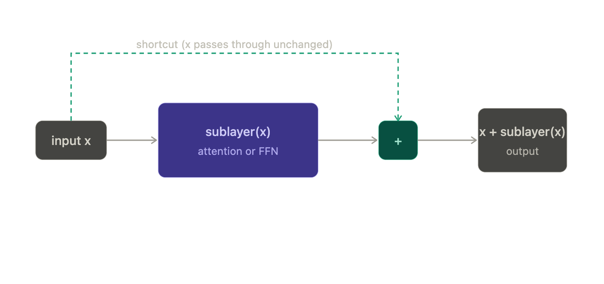

The real magic is what this does to gradients during backpropagation. Without shortcuts, gradients have to flow backward through every single transformation stacked in the network. Each one multiplies the gradient by some number. With enough layers, those multiplications drive the gradient toward zero — the vanishing gradient problem — and layers near the input stop learning.

The shortcut provides an unobstructed highway. Gradients can travel directly from any layer back to earlier layers without passing through any transformation at all. The addition operation in the forward pass becomes a perfect splitter in the backward pass — gradients flow down both the transformation path _and_ the shortcut path simultaneously, and they add.


There's a second, subtler benefit. Because the output is `x + sublayer(x)`, the sublayer only needs to learn the _residual_ — the difference between what came in and what should come out. If a layer's ideal output is almost the same as its input, the sublayer just learns something close to zero. This is much easier to learn than fitting the full target from scratch. The network can effectively "ignore" a layer during early training, and gradually develop it — giving deep networks a much smoother optimization landscape.

In the GPT architecture (from Chapter 4), every transformer block wraps both the multi-head attention and the feedforward network in their own shortcut. The pattern is always: `x = x + dropout(sublayer(LayerNorm(x)))`. Notice that LayerNorm is applied _before_ the sublayer (pre-norm formulation), and the raw `x` from before the norm is what gets added back. Dropout is applied to the sublayer output before the addition, giving regularization without disrupting the shortcut path.

1. Without vs With Shortcuts
   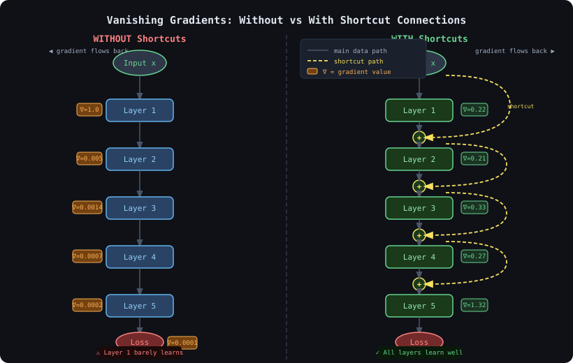

2. Gradient Math
   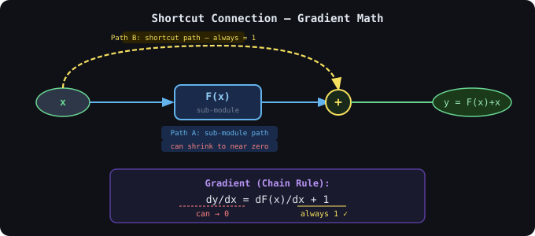

3. Transformer Block Shortcuts
   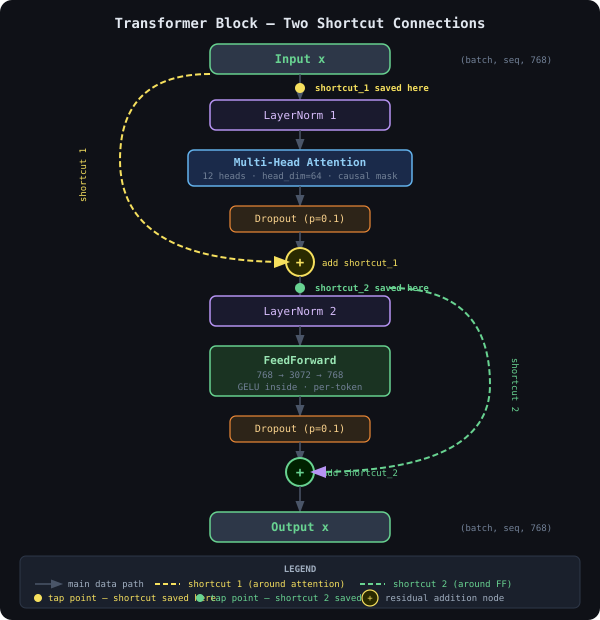

---

### Learn More: Skip Connections

To better understand **Skip Connections**, watch this video:

[](https://www.youtube.com/watch?v=Q1JCrG1bJ-A)

## Key Takeaways for Section 4.4

**Vanishing gradients are the fundamental challenge of deep networks.** Gradients shrink multiplicatively as they propagate backward. In a 12-layer network without shortcuts, early layers receive gradients thousands of times smaller than the last layer — they effectively stop learning.

**Shortcut connections add the input directly to the output: `y = F(x) + x`.** This creates two gradient paths back through the network — one through the sub-module (may shrink) and one directly through the addition (always 1). The direct path guarantees that gradients reach early layers.

**The gradient math shows why: `dy/dx = dF(x)/dx + 1`.** The `+1` from the shortcut is always present regardless of what `dF(x)/dx` does. Even if the sub-module path goes to zero, the shortcut path still delivers a full-strength gradient.

**Shape preservation is required for shortcuts to work.** Adding `F(x) + x` requires `F(x)` and `x` to have the same shape. This is why every component in the transformer block (LayerNorm, MultiHeadAttention, FeedForward) is designed to output the same shape it receives.

**Sub-modules learn residuals, not full transformations.** With `y = F(x) + x`, the sub-module only needs to learn the small correction `F(x)`. If the right answer is to barely change `x`, the sub-module just outputs near-zero — which is easy. Without shortcuts, it would have to reproduce `x` exactly — which is hard.

**Each transformer block has two shortcuts** — one wrapping attention and one wrapping the feed-forward network. GPT-2 small has 24 total shortcut connections across 12 blocks.

**The demo proves the improvement is dramatic.** With only 5 layers, shortcuts improve the earliest layer's gradient from `0.00020` to `0.22170` — an improvement of over 1,000×. In a 48-layer network the difference would be astronomical.

---

_Next: Section 4.5 — Connecting Attention and Linear Layers in a Transformer Block, where everything built so far — LayerNorm, MultiHeadAttention, GELU, FeedForward, and shortcut connections — is assembled into the complete `TransformerBlock` class that is the core repeating unit of GPT._

# 5: Connecting Attention and Linear Layers in a Transformer Block

> **This section covers:** Assembling all previously built components into the complete `TransformerBlock` class, understanding the exact data flow and shape journey through one block, why Pre-LayerNorm is placed where it is, how the two shortcut connections wrap each sub-module, and verifying the block preserves shape end to end.

---

## This Is the Assembly Section

Sections 4.1 through 4.4 each built one component in isolation. Section 4.5 is where they are all connected. Nothing fundamentally new is introduced here — the value is understanding how the pieces fit together and why they are arranged the way they are.

The components assembled here:

```
┌─────────────────────────────────────────────────────────────────────┐
│              WHAT GOES INTO ONE TRANSFORMER BLOCK                   │
│                                                                     │
│  From Chapter 3:    MultiHeadAttention                              │
│  From Section 4.2:  LayerNorm  (used twice — norm1 and norm2)       │
│  From Section 4.3:  FeedForward (which uses GELU internally)        │
│  From Section 4.4:  Shortcut connections (two of them)              │
│  New in 4.5:        Dropout (applied after attention and after FF)  │
│                                                                     │
│  These six things combine into one TransformerBlock class that      │
│  is then repeated 12 times to build the full GPT model.            │
└─────────────────────────────────────────────────────────────────────┘
```

---

## The Complete TransformerBlock Code

```python
from chapter03 import MultiHeadAttention

class TransformerBlock(nn.Module):

    def __init__(self, cfg):
        super().__init__()
        self.att = MultiHeadAttention(
            d_in=cfg["emb_dim"],
            d_out=cfg["emb_dim"],
            context_length=cfg["context_length"],
            num_heads=cfg["n_heads"],
            dropout=cfg["drop_rate"],
            qkv_bias=cfg["qkv_bias"]
        )
        self.ff         = FeedForward(cfg)
        self.norm1      = LayerNorm(cfg["emb_dim"])
        self.norm2      = LayerNorm(cfg["emb_dim"])
        self.drop_shortcut = nn.Dropout(cfg["drop_rate"])

    def forward(self, x):
        # --- Sub-block 1: Multi-Head Attention ---
        shortcut = x                  # save input BEFORE norm
        x = self.norm1(x)             # normalise
        x = self.att(x)               # attention
        x = self.drop_shortcut(x)     # dropout
        x = x + shortcut              # add saved input back

        # --- Sub-block 2: Feed Forward ---
        shortcut = x                  # save input BEFORE norm
        x = self.norm2(x)             # normalise
        x = self.ff(x)                # feed forward
        x = self.drop_shortcut(x)     # dropout
        x = x + shortcut              # add saved input back

        return x
```

---

## The **init** Parameters — What Each Does

### **`MultiHeadAttention` with `d_in = d_out = cfg["emb_dim"]`**

```python
self.att = MultiHeadAttention(
    d_in=cfg["emb_dim"],    # 768 — input dimension
    d_out=cfg["emb_dim"],   # 768 — output dimension (same as input)
    ...
)
```

In Section 3.6, `d_out` could differ from `d_in`. Here both are set to `emb_dim=768`. This is required because the shortcut connection adds the input back to the attention output — they must have the same shape. If `d_out` were different from `d_in`, the shapes would not match and the addition would fail.

```
Attention input:   (batch, seq_len, 768)  ← d_in = 768
Attention output:  (batch, seq_len, 768)  ← d_out = 768  (must match)
Shortcut input:    (batch, seq_len, 768)  ← saved before norm
                                           ← all three must be identical
```

### **Two Separate LayerNorm Instances**

```python
self.norm1 = LayerNorm(cfg["emb_dim"])   # used before attention
self.norm2 = LayerNorm(cfg["emb_dim"])   # used before feed-forward
```

These are two **independent** `LayerNorm` objects with their own separate `scale` and `shift` parameters. They are not shared. The reasoning: the input to attention and the input to feed-forward are at different points in the processing pipeline and may benefit from different learned normalization parameters.

```
norm1 has its own: scale1 (768,), shift1 (768,)   ← 1,536 parameters
norm2 has its own: scale2 (768,), shift2 (768,)   ← 1,536 parameters

Total per block: 3,072 LayerNorm parameters
```

### **One Shared Dropout**

```python
self.drop_shortcut = nn.Dropout(cfg["drop_rate"])  # p = 0.1
```

One `Dropout` instance is used in both places — after attention and after feed-forward. Using a single instance is fine here because `Dropout` has no learned parameters. Each call generates a fresh independent random mask, so sharing the module object has no practical effect on the behaviour.

---

## The Forward Pass — Step by Step

Let us trace exactly what happens to an input tensor of shape `(2, 4, 768)` as it flows through one complete transformer block.

### **Sub-block 1: Multi-Head Attention**

```python
shortcut = x
```

```
shortcut shape: (2, 4, 768)   ← a reference to the ORIGINAL input
                                 Python does not copy the tensor here —
                                 shortcut just points to the same data.
                                 After x is reassigned below, shortcut
                                 still points to the original values.
```

```python
x = self.norm1(x)
```

```
Input  shape: (2, 4, 768)
Output shape: (2, 4, 768)   ← unchanged

Each token's 768-dim vector is normalised to zero mean, unit variance,
then scaled and shifted by norm1's learned parameters.
The shortcut variable still holds the PRE-NORM values.
```

```python
x = self.att(x)
```

```
Input  shape: (2, 4, 768)
Output shape: (2, 4, 768)   ← unchanged

Multi-head attention with 12 heads, each working in 64-dim space.
Each token can now attend to all other tokens in the sequence.
Causal masking ensures token i cannot see tokens i+1 ... n.
```

```python
x = self.drop_shortcut(x)
```

```
Shape: (2, 4, 768)   ← unchanged

10% of the attention output values are randomly zeroed during training.
This is applied BEFORE the shortcut addition — we are dropping
attention outputs, not the shortcut itself.
During inference (model.eval()), this is disabled.
```

```python
x = x + shortcut
```

```
x shape:        (2, 4, 768)   ← attention output (after dropout)
shortcut shape: (2, 4, 768)   ← original input (before norm1)

Result shape:   (2, 4, 768)

This is the first residual connection.
x now contains: attention_contribution + original_representation
```

### **Sub-block 2: Feed Forward**

```python
shortcut = x
```

```
shortcut shape: (2, 4, 768)   ← the output of sub-block 1 is now saved
                                 this is the NEW shortcut baseline
```

```python
x = self.norm2(x)
```

```
Shape: (2, 4, 768)   ← unchanged

Normalises again before the feed-forward network.
norm2 has its own independent scale and shift parameters
(different from norm1's parameters).
```

```python
x = self.ff(x)
```

```
Input  shape: (2, 4, 768)
                ↓ Linear 768→3072
                ↓ GELU
                ↓ Linear 3072→768
Output shape: (2, 4, 768)   ← back to 768 after contraction

Each token is processed independently through the feed-forward network.
No cross-token communication in this sub-block.
```

```python
x = self.drop_shortcut(x)
```

```
Shape: (2, 4, 768)   ← unchanged

Same dropout module, fresh random mask (independent of the first call).
```

```python
x = x + shortcut
return x
```

```
x shape:        (2, 4, 768)   ← feed-forward output (after dropout)
shortcut shape: (2, 4, 768)   ← input to sub-block 2

Result shape:   (2, 4, 768)

Second residual connection.
x now contains: ff_contribution + sub_block1_output
```

---

## The Full Shape Journey Through One Block

```
┌─────────────────────────────────────────────────────────────────────┐
│         COMPLETE SHAPE JOURNEY — ONE TRANSFORMER BLOCK              │
│                                                                     │
│  Stage                        Shape          Notes                  │
│  ─────────────────────────────────────────────────────────────────  │
│  Input x                      (2, 4, 768)    enters the block       │
│  shortcut = x                 (2, 4, 768)    saved reference        │
│  After norm1                  (2, 4, 768)    normalised             │
│  After MultiHeadAttention     (2, 4, 768)    context-enriched       │
│  After drop_shortcut          (2, 4, 768)    10% dropped            │
│  After x + shortcut           (2, 4, 768)    residual added         │
│  shortcut = x  (update)       (2, 4, 768)    saved reference        │
│  After norm2                  (2, 4, 768)    normalised again        │
│  After FeedForward            (2, 4, 768)    transformed            │
│  After drop_shortcut          (2, 4, 768)    10% dropped            │
│  After x + shortcut           (2, 4, 768)    residual added         │
│  Output                       (2, 4, 768)    exits the block        │
│                                                                     │
│  Shape is IDENTICAL at every single step.                           │
│  Input shape = Output shape: (batch, seq_len, emb_dim)              │
│  This is what makes stacking 12 blocks possible with no            │
│  adapter layers between them.                                       │
└─────────────────────────────────────────────────────────────────────┘
```

---

## Visualising the Data Flow

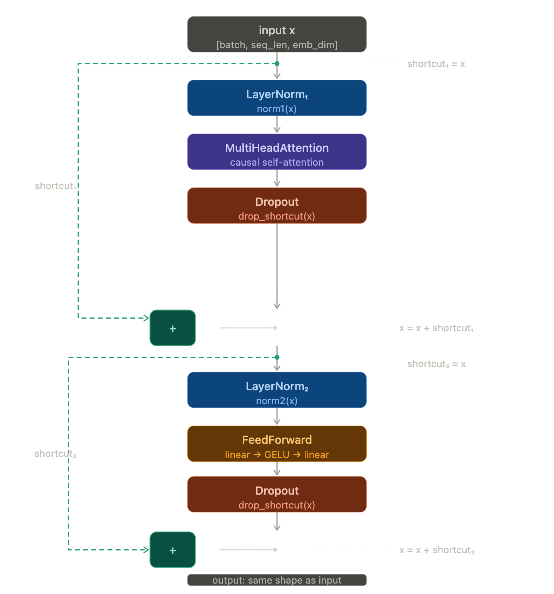

```
┌─────────────────────────────────────────────────────────────────────┐
│              TRANSFORMER BLOCK — FULL DATA FLOW                     │
│                                                                     │
│  Input x  (2, 4, 768)                                               │
│     │                                                               │
│     ├──────────────────────────────────────┐                        │
│     │                                      │ shortcut 1 = x         │
│     ▼                                      │                        │
│  ┌──────────────┐                          │                        │
│  │  LayerNorm 1 │   (2,4,768)→(2,4,768)    │                        │
│  └──────┬───────┘                          │                        │
│         ▼                                  │                        │
│  ┌──────────────────────────────────────┐  │                        │
│  │  MultiHeadAttention                  │  │                        │
│  │  12 heads, head_dim=64               │  │                        │
│  │  causal mask applied                 │  │                        │
│  │  (2,4,768) → (2,4,768)               │  │                        │
│  └──────┬───────────────────────────────┘  │                        │
│         ▼                                  │                        │
│  ┌──────────────┐                          │                        │
│  │  Dropout 10% │  (2,4,768)→(2,4,768)     │                        │
│  └──────┬───────┘                          │                        │
│         ▼                                  │                        │
│        (+) ◄───────────────────────────────┘  shortcut 1 added back │
│         │                                                           │
│     x = attention_out + original_x                                  │
│         │                                                           │
│     ├──────────────────────────────────────┐                        │
│     │                                      │ shortcut 2 = x         │
│     ▼                                      │                        │
│  ┌──────────────┐                          │                        │
│  │  LayerNorm 2  │  (2,4,768)→(2,4,768)    │                        │
│  └──────┬───────┘                          │                        │
│         ▼                                  │                        │
│  ┌──────────────────────────────────────┐  │                        │
│  │  FeedForward                         │  │                        │
│  │  768→3072→768, GELU inside           │  │                        │
│  │  each token processed independently  │  │                        │
│  │  (2,4,768) → (2,4,768)               │  │                        │
│  └──────┬───────────────────────────────┘  │                        │
│         ▼                                  │                        │
│  ┌──────────────┐                          │                        │
│  │  Dropout 10% │  (2,4,768)→(2,4,768)     │                        │
│  └──────┬───────┘                          │                        │
│         ▼                                  │                        │
│        (+) ◄───────────────────────────────┘  shortcut 2 added back │
│         │                                                           │
│     x = ff_out + post_attention_x                                   │
│         │                                                           │
│  Output x  (2, 4, 768)                                              │
└─────────────────────────────────────────────────────────────────────┘
```

---

## Why Pre-LayerNorm — The Placement Matters

Notice that `norm1` and `norm2` are applied **before** their respective sub-modules, not after. This is called **Pre-LayerNorm** and it is a deliberate architectural decision that GPT-2 uses differently from the original 2017 transformer paper.

```
┌─────────────────────────────────────────────────────────────────────┐
│              PRE-NORM vs POST-NORM — THE GRADIENT DIFFERENCE        │
│                                                                     │
│  POST-NORM (original 2017 transformer):                             │
│  x → [Attention] → [Dropout] → (+shortcut) → [LayerNorm] → output  │
│                                                                     │
│  For gradients flowing back:                                        │
│  They must pass through Attention BEFORE hitting LayerNorm.        │
│  In very deep networks, gradients can explode or vanish             │
│  before being normalised.                                           │
│                                                                     │
│  PRE-NORM (GPT-2, used here):                                       │
│  x → [LayerNorm] → [Attention] → [Dropout] → (+shortcut) → output  │
│                                                                     │
│  For gradients flowing back:                                        │
│  The shortcut path bypasses LayerNorm entirely.                    │
│  The non-shortcut path hits LayerNorm first — a very simple        │
│  operation — before reaching the heavy Attention computation.      │
│  Training is more stable for deep networks (12+ layers).           │
│                                                                     │
│  IMPORTANT DETAIL about the shortcut placement:                    │
│  shortcut = x   ← saved BEFORE LayerNorm                           │
│  x = norm(x)    ← norm applied                                     │
│  x = att(x)                                                         │
│  x = x + shortcut   ← original PRE-NORM value is added back        │
│                                                                     │
│  The shortcut carries the unnormalised value from before norm1.    │
│  This means the addition outputs a mixture of:                     │
│  - normalised-then-attended values  (from the sub-module path)     │
│  - raw unnormalised values          (from the shortcut path)       │
│  This turns out to be beneficial for training stability.           │
└─────────────────────────────────────────────────────────────────────┘
```

---

## What Each Sub-block Actually Does Semantically

Understanding the shape journey is necessary but not sufficient — it helps to have a mental model of what each sub-block is _doing_ to the token representations.

```
┌─────────────────────────────────────────────────────────────────────┐
│        WHAT EACH SUB-BLOCK CONTRIBUTES TO TOKEN REPRESENTATIONS    │
│                                                                     │
│  INPUT: each token has a 768-dim vector encoding its identity      │
│         and position (from the embedding layer)                     │
│                                                                     │
│  SUB-BLOCK 1 — ATTENTION:                                           │
│  "Gather context from other tokens"                                 │
│                                                                     │
│  For the token "moves" in "Every effort moves you":                │
│  - Looks at "Every", "effort", "you" with learned attention weights │
│  - Blends relevant information from those tokens                   │
│  - "moves" now carries context: it is part of an effort-related    │
│    action directed at "you"                                         │
│  - Shortcut ensures "moves" retains its own identity too           │
│                                                                     │
│  SUB-BLOCK 2 — FEED FORWARD:                                        │
│  "Transform the contextualised representation"                     │
│                                                                     │
│  For the enriched "moves" token:                                    │
│  - Expands to 3072-dim space, applies GELU non-linearity           │
│  - Activates relevant stored patterns (e.g. motion + effort        │
│    + human_subject patterns)                                        │
│  - Projects back to 768                                             │
│  - Shortcut ensures the enriched context from sub-block 1          │
│    is preserved even after the FF transformation                   │
│                                                                     │
│  OUTPUT: "moves" now has a deeply contextual 768-dim representation │
│          informed by both its neighbours (from attention) and       │
│          the model's learned transformations (from FF)              │
└─────────────────────────────────────────────────────────────────────┘
```

---

## Running the TransformerBlock

```python
torch.manual_seed(123)

x     = torch.rand(2, 4, 768)        # batch=2, tokens=4, emb_dim=768
block = TransformerBlock(GPT_CONFIG_124M)
out   = block(x)

print("Input shape:",  x.shape)
print("Output shape:", out.shape)
```

Output:

```
Input shape:  torch.Size([2, 4, 768])
Output shape: torch.Size([2, 4, 768])
```

Shape is preserved exactly — input and output are identical in dimensions. The content has been transformed: each token's 768-dim vector now encodes contextual information from the full sequence, passed through attention and feed-forward with two residual additions.

---

## Parameter Count for One TransformerBlock

```
┌─────────────────────────────────────────────────────────────────────┐
│         PARAMETER COUNT — ONE TRANSFORMER BLOCK                     │
│                                                                     │
│  MultiHeadAttention:                                                │
│    W_query:   768 × 768  = 589,824                                  │
│    W_key:     768 × 768  = 589,824                                  │
│    W_value:   768 × 768  = 589,824                                  │
│    W_out:     768 × 768  = 589,824                                  │
│    Subtotal:             2,359,296                                  │
│                                                                     │
│  FeedForward:                                                       │
│    Linear 1:  768 × 3072 = 2,359,296  + bias 3,072                 │
│    Linear 2: 3072 × 768  = 2,359,296  + bias   768                 │
│    Subtotal:             4,722,432                                  │
│                                                                     │
│  LayerNorm 1: scale + shift = 768 + 768 = 1,536                     │
│  LayerNorm 2: scale + shift = 768 + 768 = 1,536                     │
│  LayerNorm subtotal:          3,072                                  │
│                                                                     │
│  Dropout: no parameters                                             │
│                                                                     │
│  ONE BLOCK TOTAL:  ~7,085,000 parameters                            │
│                                                                     │
│  × 12 blocks:     ~85,020,000 parameters                            │
│                                                                     │
│  This accounts for roughly 69% of GPT-2 small's 124M parameters.   │
│  The remaining ~39M come from the embedding layers and             │
│  the output head.                                                   │
└─────────────────────────────────────────────────────────────────────┘
```

---

## The Relationship Between the 12 Blocks

All 12 transformer blocks in GPT-2 small have **identical structure** but **different learned weights**. They are not copies of each other — `nn.Sequential(*[TransformerBlock(cfg) for _ in range(12)])` creates 12 independent instances, each initialised with its own random weights and trained separately.

```
┌─────────────────────────────────────────────────────────────────────┐
│           12 BLOCKS — SAME STRUCTURE, DIFFERENT WEIGHTS             │
│                                                                     │
│  Block 1:   W_q1, W_k1, W_v1, W_ff1, ...   ← own parameters       │
│  Block 2:   W_q2, W_k2, W_v2, W_ff2, ...   ← own parameters       │
│  ...                                                                │
│  Block 12:  W_q12, W_k12, W_v12, W_ff12, ... ← own parameters      │
│                                                                     │
│  Block 1 tends to learn low-level patterns (syntax, nearby words)  │
│  Block 6 tends to learn mid-level patterns (phrase structure)      │
│  Block 12 tends to learn high-level patterns (semantics, tasks)    │
│                                                                     │
│  This emergent specialisation happens through training — not        │
│  designed explicitly. Early blocks see raw embeddings and          │
│  refine them; later blocks receive already-contextualised          │
│  representations and can build on top of them.                     │
└─────────────────────────────────────────────────────────────────────┘
```

---

## Build Status After Section 4.5

```
┌─────────────────────────────────────────────────────────────────────┐
│              BUILD STATUS AFTER SECTION 4.5                         │
│                                                                     │
│  Step 1: DummyGPTModel      ✓  Section 4.1                         │
│  Step 2: LayerNorm          ✓  Section 4.2                         │
│  Step 3: GELU activation    ✓  Section 4.3                         │
│  Step 4: FeedForward        ✓  Section 4.3                         │
│  Step 5: Shortcut connections ✓  Section 4.4                       │
│  Step 6: TransformerBlock   ✓  Section 4.5  ← just completed       │
│  Step 7: Final GPTModel         Section 4.6  (next)                │
│  Step 8: generate_text_simple   Section 4.7                         │
│                                                                     │
│  The full GPTModel in Section 4.6 only needs to:                   │
│  - Add token + positional embeddings (from Chapter 2 concepts)     │
│  - Stack 12 TransformerBlocks                                       │
│  - Add a final LayerNorm                                            │
│  - Add the output linear head (768 → 50257)                        │
│  All the heavy lifting is already done.                            │
└─────────────────────────────────────────────────────────────────────┘
```

---

## Extra learning

### GPT Output Head

#### 1. Batch Shape

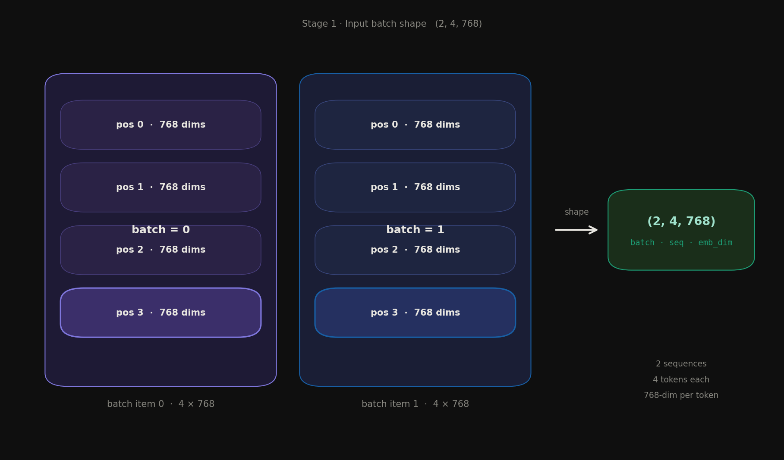

#### 2. Weight Matrix

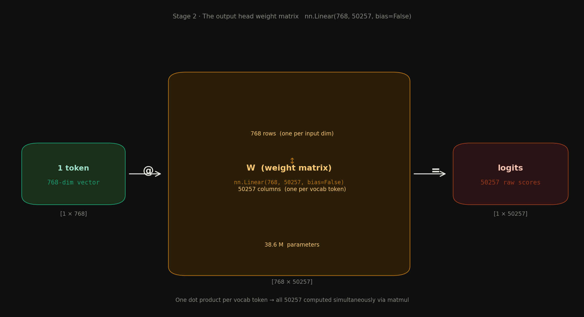

#### 3. Dot Product

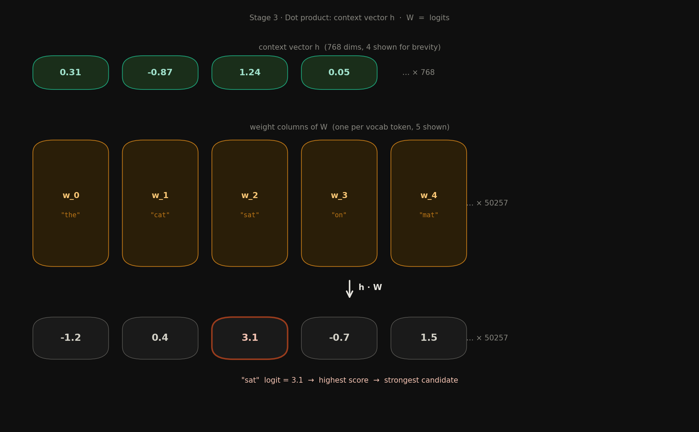

#### 4. Softmax

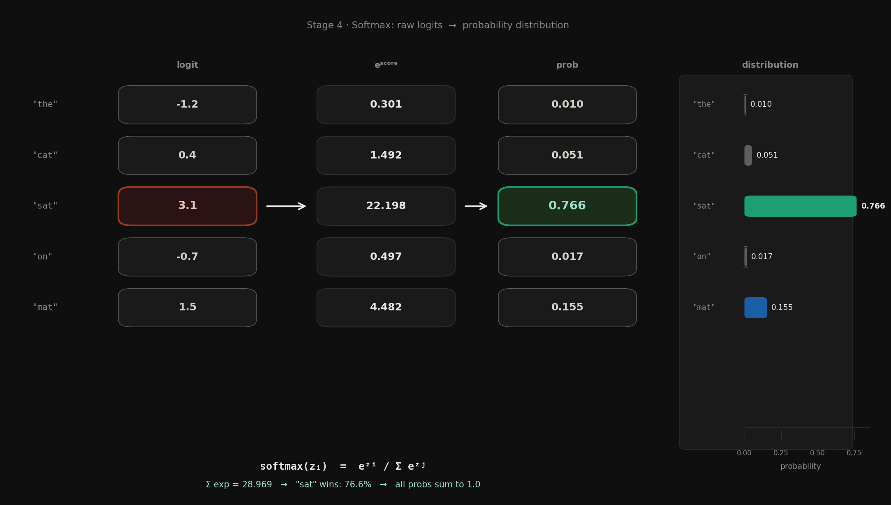

#### 5. Last Token Only

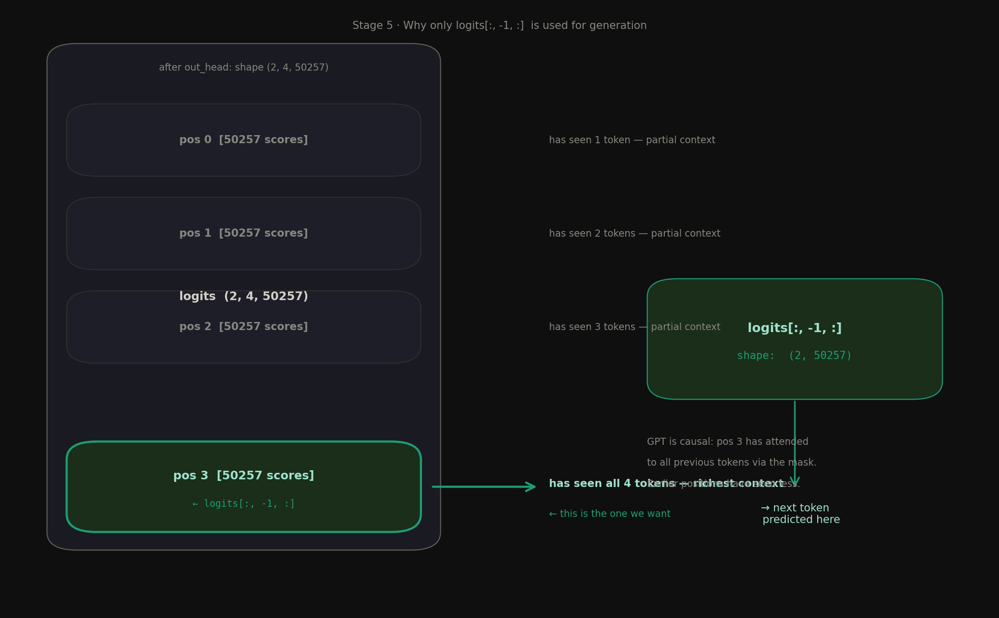

#### 6. Argmax and Generation Loop

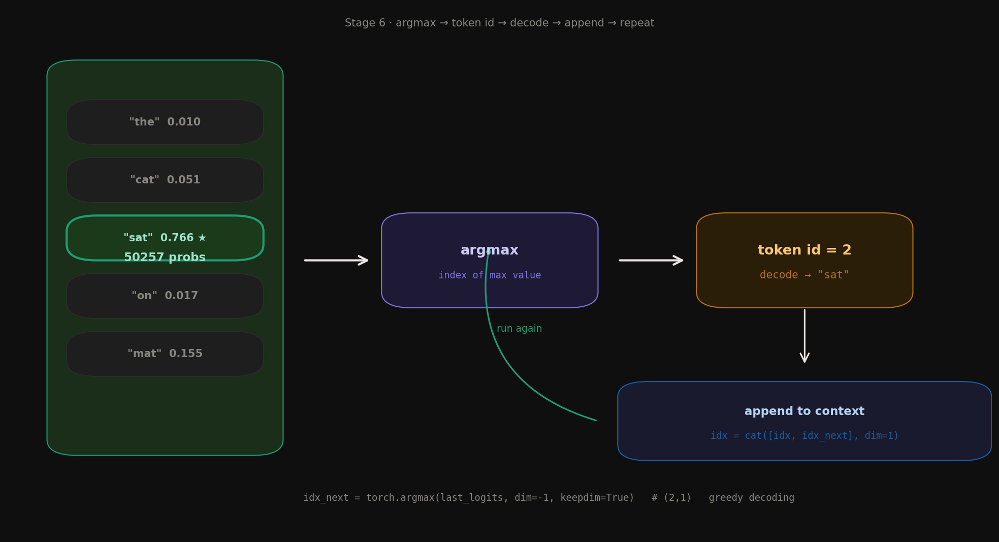

### What Is the Output Head?

The output head is just one single `nn.Linear` layer sitting at the very end of the model:

```python
self.out_head = nn.Linear(cfg["emb_dim"], cfg["vocab_size"], bias=False)
# nn.Linear(768, 50257, bias=False)

```

Its job is brutally simple: **take a 768-dim vector and produce 50,257 numbers from it**. That is the entire output head. One matrix multiply. Nothing else.

---

### Why 50,257 Exactly?

Because that is how many tokens the BPE tokenizer knows. Every possible token — words, subwords, punctuation, spaces — has an ID from 0 to 50,256. When the model wants to say "I think the next token is X", it needs one score per possible token. So it needs exactly 50,257 scores.

```
The model does not output a word directly.
It outputs a SCORE for every possible word in the vocabulary.

Token 0     "!"         score = -0.72
Token 1     ","         score =  0.14
Token 2     "."         score = -0.33
...
Token 345   "you"       score =  2.48  ← highest = predicted next token
...
Token 50256 "<|endoftext|>"  score = -1.20

Whichever token has the highest score is the prediction.

```

---

### The Weight Matrix — What It Actually Is

`nn.Linear(768, 50257, bias=False)` creates one weight matrix of shape `(50257, 768)`.

```
W_out shape: (50257, 768)

Row 0     → 768 numbers that "score" token 0  ("!")
Row 1     → 768 numbers that "score" token 1  (",")
Row 2     → 768 numbers that "score" token 2  (".")
...
Row 345   → 768 numbers that "score" token 345  ("you")
...
Row 50256 → 768 numbers that "score" token 50256

```

Each row has learned — through training — how to detect whether a given 768-dim token representation is pointing toward that vocabulary token as the next word.

---

### Tiny Numerical Example — End to End

Let us use `emb_dim = 4` and `vocab_size = 5` to keep the arithmetic readable. Imagine a tiny vocabulary of just 5 tokens:

```
Token 0 = "cat"
Token 1 = "dog"
Token 2 = "sat"
Token 3 = "the"
Token 4 = "on"

```

After 12 transformer blocks, the output for one token is a 4-dim context vector. Let us say that vector is:

```
x = [0.6, -0.2, 0.8, 0.1]
     ↑ 4-dim vector representing "the meaning of this token
       after attending to all other tokens in the sequence"

```

The output head weight matrix `W_out` has shape `(5, 4)` — 5 rows (one per vocab token), 4 columns (one per embedding dimension):

```
W_out = [
  [ 0.1,  0.3, -0.2,  0.5],   ← row 0: scores "cat"
  [ 0.4, -0.1,  0.7,  0.2],   ← row 1: scores "dog"
  [-0.3,  0.6,  0.4, -0.1],   ← row 2: scores "sat"
  [ 0.8,  0.2,  0.3,  0.6],   ← row 3: scores "the"
  [ 0.2,  0.5, -0.4,  0.3],   ← row 4: scores "on"
]

```

The linear layer computes `logits = W_out @ x` — a matrix-vector multiply:

```
logit[0] = row_0 · x = (0.1×0.6) + (0.3×-0.2) + (-0.2×0.8) + (0.5×0.1)
         = 0.06 + (-0.06) + (-0.16) + 0.05
         = -0.11    ← score for "cat"

logit[1] = row_1 · x = (0.4×0.6) + (-0.1×-0.2) + (0.7×0.8) + (0.2×0.1)
         = 0.24 + 0.02 + 0.56 + 0.02
         = 0.84    ← score for "dog"

logit[2] = row_2 · x = (-0.3×0.6) + (0.6×-0.2) + (0.4×0.8) + (-0.1×0.1)
         = -0.18 + (-0.12) + 0.32 + (-0.01)
         = 0.01    ← score for "sat"

logit[3] = row_3 · x = (0.8×0.6) + (0.2×-0.2) + (0.3×0.8) + (0.6×0.1)
         = 0.48 + (-0.04) + 0.24 + 0.06
         = 0.74    ← score for "the"

logit[4] = row_4 · x = (0.2×0.6) + (0.5×-0.2) + (-0.4×0.8) + (0.3×0.1)
         = 0.12 + (-0.10) + (-0.32) + 0.03
         = -0.27   ← score for "on"

logits = [-0.11, 0.84, 0.01, 0.74, -0.27]

```

The model's prediction is token 1 — "dog" — because it has the highest score `0.84`.

---

### Softmax Converts Scores to Probabilities

To make the scores interpretable as probabilities:

```
softmax converts logits → probabilities that sum to 1

logits    = [-0.11,  0.84,  0.01,  0.74, -0.27]

exp(each):  [0.896, 2.317, 1.010, 2.096, 0.763]
sum of exp: 7.082

probabilities:
  "cat" =  0.896 / 7.082 = 0.127  →  12.7%
  "dog" =  2.317 / 7.082 = 0.327  →  32.7%  ← highest
  "sat" =  1.010 / 7.082 = 0.143  →  14.3%
  "the" =  2.096 / 7.082 = 0.296  →  29.6%
  "on"  =  0.763 / 7.082 = 0.108  →  10.8%
  ────────────────────────────────────────────
  total                  = 1.000  ✓

```

Greedy decoding picks "dog" — highest probability at 32.7%.

---

### The Shape Story — Where (2, 4, 50257) Comes From

In the real GPT model with batch=2, seq_len=4, emb_dim=768:

```
Before out_head:  x shape = (2, 4, 768)

W_out shape = (50257, 768)

out_head applies the same matrix multiply to EVERY token
in EVERY sentence simultaneously:

For each of the 2 sentences:
  For each of the 4 token positions:
    Take that token's 768-dim vector
    Multiply by W_out → get 50257 scores

Result shape: (2, 4, 50257)

```

Visualised:

```
┌─────────────────────────────────────────────────────────────────┐
│                    WHAT (2, 4, 50257) MEANS                     │
│                                                                 │
│  Sentence 1:                                                    │
│    Token "Every"  → [score_0, score_1, ..., score_50256]       │
│    Token "effort" → [score_0, score_1, ..., score_50256]       │
│    Token "moves"  → [score_0, score_1, ..., score_50256]       │
│    Token "you"    → [score_0, score_1, ..., score_50256] ← use │
│                                                                 │
│  Sentence 2:                                                    │
│    Token "Every"  → [score_0, score_1, ..., score_50256]       │
│    Token "day"    → [score_0, score_1, ..., score_50256]       │
│    Token "holds"  → [score_0, score_1, ..., score_50256]       │
│    Token "a"      → [score_0, score_1, ..., score_50256] ← use │
│                                                                 │
│  During generation: only the last row per sentence is used.    │
│  During training: all rows contribute to the loss.             │
└─────────────────────────────────────────────────────────────────┘

```

---

### What Each Row of W_out Has Learned

This is the deep part. During training, each row of `W_out` learns a 768-dim "fingerprint" of what a token representation looks like just before predicting that word.

```
Row 345 of W_out (the "you" row) has learned:
  "if the 768-dim context vector looks like it is pointing
   toward a second-person subject in a motion-related context,
   score high"

When x = [0.6, -0.2, 0.8, 0.1] has high dot product with row 345,
it means the context vector is geometrically similar to what the
model has learned to associate with "you" being next.

The dot product IS the similarity measure:
high dot product = this row's pattern matches this context vector
                 = this token is likely to be the next word

```

This is also why the output head and the token embedding table have the same shape `(50257, 768)` — they are doing geometrically inverse operations. The token embedding maps "this token ID" into a 768-dim point in space. The output head maps "this 768-dim context vector" back into scores over all token IDs. Same space, opposite directions.

---

### Summary

The output head is one `Linear(768, 50257)` layer — a weight matrix of shape `(50257, 768)`. It takes every token's 768-dim context vector and computes a dot product with every row. Each row scores one vocabulary token. The result is 50,257 raw scores — one per possible next token. The highest score is the model's prediction. During training, these scores are compared against the actual next token to compute the loss. During generation, only the last position's scores are used, the highest is selected, decoded back to text, and appended to the input.

---

### What Each Row Is Actually Predicting

Each token's output row is not describing that token — it is predicting **what comes AFTER it**.

```
Input:  "Every  effort  moves  you"
         pos 0   pos 1   pos 2  pos 3

Output row at pos 0 ("Every")  → predicts what comes after "Every"
Output row at pos 1 ("effort") → predicts what comes after "Every effort"
Output row at pos 2 ("moves")  → predicts what comes after "Every effort moves"
Output row at pos 3 ("you")    → predicts what comes after "Every effort moves you"

```

The model sees each token and says — given everything I have seen up to and including this position, what word comes next?

---

### Why Only the Last Row During Generation

When you are **generating new text**, you want to know one specific thing: **what comes after the full input I gave you?**

```
You typed: "Every effort moves you"
           pos 0   pos 1   pos 2  pos 3

You want to know: what comes after ALL FOUR of these words?

That answer lives at pos 3 — the LAST position.
Because pos 3 has seen the entire sentence before predicting.

pos 0 only saw "Every"              → can predict after "Every"
pos 1 saw "Every effort"            → can predict after those two
pos 2 saw "Every effort moves"      → can predict after those three
pos 3 saw "Every effort moves you"  → can predict after ALL FOUR ← this is what you want

```

The earlier positions can only predict based on partial context. Only the last position has seen everything. So only the last position's prediction is relevant when you want to extend the sentence.

---

### A Concrete Example to Make It Click

Imagine you are reading a sentence word by word and I ask you to predict the next word at each step:

```
Step 1 — you have read: "Every"
Your prediction: probably something like "day", "time", "effort"...
But you only know ONE word, so your prediction is quite uncertain.

Step 2 — you have read: "Every effort"
Your prediction: probably "moves", "counts", "matters"...
A bit better now.

Step 3 — you have read: "Every effort moves"
Your prediction: probably "you", "us", "mountains"...
Even better.

Step 4 — you have read: "Every effort moves you"
Your prediction: probably "forward", "closer", "toward"...
NOW you have full context. This prediction is the most informed.

```

This is exactly what each row of the model output is doing. During generation you only ask for the Step 4 prediction — after the full input.

---

### Why All Rows Are Used During Training

During **training**, the model learns from ALL four predictions simultaneously in one forward pass.

```
Training example from a text corpus:
"Every effort moves you forward"

The model sees: "Every effort moves you"
And it knows the ACTUAL answers are:

  After "Every"              → actual next = "effort"
  After "Every effort"       → actual next = "moves"
  After "Every effort moves" → actual next = "you"
  After "Every effort moves you" → actual next = "forward"

So ALL four output rows get compared to their actual next tokens.
ALL four produce a loss. ALL four gradients flow back.

This gives the model 4 training signals from 1 forward pass
instead of running 4 separate forward passes.
That is 4× more efficient training.

```

---

### The Same Idea With Positions

Think of it this way. After the forward pass you have:

```
logits shape: (1, 4, 50257)

logits[0][0] = scores for "what comes after seeing just 'Every'"
logits[0][1] = scores for "what comes after seeing 'Every effort'"
logits[0][2] = scores for "what comes after seeing 'Every effort moves'"
logits[0][3] = scores for "what comes after seeing 'Every effort moves you'"
                                                                        ↑
                                              This is the one you extract
                                              during generation:
                                              logits[:, -1, :]

```

The `-1` in `logits[:, -1, :]` is Python's way of saying "give me the last index along this dimension." Since the last position has seen the most context, it gives the best-informed prediction of the next token.

---

### Summary

Each output row predicts what comes **after** that position, not what that token itself is. During generation you only need the last row because it is the only one that has seen the full input — earlier rows only saw partial context and their predictions are not useful for extending the sentence. During training all rows are used because each one provides a separate supervised learning signal, making training much more efficient.

---

### Start With What the Last Row Actually Is

After `logits = self.out_head(x)`, the full output is shape `(1, 4, 50257)`.

You extract the last row with `logits[:, -1, :]` which gives shape `(1, 50257)`.

That `(1, 50257)` tensor is just a **flat list of 50,257 numbers**. Nothing fancy. Let us zoom into it:

```
logits[:, -1, :] = one vector of 50,257 numbers

index    0  →  -0.72   ← score for token 0    "!"
index    1  →   0.14   ← score for token 1    ","
index    2  →  -0.33   ← score for token 2    "."
index   11  →   0.55   ← score for token 11   "the"
index  257  →   0.34   ← score for token 257  "a"
index  345  →   0.91   ← score for token 345  "you"
index 2651  →   2.48   ← score for token 2651 "forward"  ← highest
index 6109  →  -1.20   ← score for token 6109 "Every"
...
index 50256 →   0.03   ← score for token 50256 "<|endoftext|>"

```

Every single one of the 50,257 tokens in the vocabulary has a score. These scores are called **logits** — raw numbers that can be positive, negative, large, small. They are not probabilities yet.

---

### How the Output Head Produces These 50,257 Numbers

The output head is `nn.Linear(768, 50257)`. Its weight matrix `W_out` has shape `(50257, 768)`.

When you feed in the last token's 768-dim context vector, here is the exact computation:

```
last token context vector x:  shape (768,)
W_out:                         shape (50257, 768)

logits = W_out @ x             shape (50257,)

```

Expanded out, this is just 50,257 dot products happening simultaneously:

```
logit[0]    = W_out[0]    · x   ← dot product of row 0    with x
logit[1]    = W_out[1]    · x   ← dot product of row 1    with x
logit[2]    = W_out[2]    · x   ← dot product of row 2    with x
...
logit[2651] = W_out[2651] · x   ← dot product of row 2651 with x
...
logit[50256]= W_out[50256]· x   ← dot product of row 50256 with x

```

A dot product measures **similarity** between two vectors. So `logit[2651]` is asking: how similar is the context vector `x` to the pattern row 2651 of `W_out` has learned to recognise? The more similar, the higher the score.

Row 2651 of `W_out` has learned — over millions of training steps — what a 768-dim context vector looks like just before the word "forward" appears. When it sees a context vector that matches that pattern, the dot product is high. That is why "forward" gets score 2.48 while "!" gets -0.72 — the current context looks nothing like what precedes "!".

---

### Converting Scores to Probabilities — Softmax

The 50,257 raw scores are not probabilities. They do not sum to 1. You apply softmax to fix that:

```
logits = [-0.72, 0.14, -0.33, ..., 2.48, ..., -1.20]
          ↓ softmax: exp(x_i) / sum(exp(x_j) for all j)

probas = [0.0008, 0.0019, 0.0012, ..., 0.0530, ..., 0.0005]
          "!"      ","      "."          "forward"    "Every"

All 50,257 values are now between 0 and 1, and they sum to exactly 1.0

```

Using the tiny 5-token example from before to show the full arithmetic:

```
logits  = [-0.11,  0.84,  0.01,  0.74, -0.27]
           "cat"  "dog"  "sat"  "the"  "on"

Step 1 — exponentiate each:
exp(-0.11) = 0.896
exp( 0.84) = 2.317
exp( 0.01) = 1.010
exp( 0.74) = 2.096
exp(-0.27) = 0.763

Step 2 — sum all: 0.896 + 2.317 + 1.010 + 2.096 + 0.763 = 7.082

Step 3 — divide each by the sum:
"cat" = 0.896 / 7.082 = 0.127  →  12.7%
"dog" = 2.317 / 7.082 = 0.327  →  32.7%  ← highest
"sat" = 1.010 / 7.082 = 0.143  →  14.3%
"the" = 2.096 / 7.082 = 0.296  →  29.6%
"on"  = 0.763 / 7.082 = 0.108  →  10.8%
                         ─────
                         1.000  ✓

```

---

### The Complete Chain — Everything Connected

Here is the full picture of how all three things relate:

```
┌─────────────────────────────────────────────────────────────────┐
│         LAST ROW → OUTPUT HEAD → VOCAB SIZE → PROBABILITY       │
│                                                                 │
│  1. After 12 transformer blocks:                                │
│     x shape: (1, 4, 768)                                        │
│     Each token has a 768-dim context-aware vector               │
│                                                                 │
│  2. Extract last row:                                           │
│     last_x = x[:, -1, :]    shape: (1, 768)                    │
│     This is the context vector after seeing the FULL input      │
│                                                                 │
│  3. Output head multiplies:                                     │
│     logits = W_out @ last_x                                     │
│     W_out shape: (50257, 768)                                   │
│     logits shape: (1, 50257)                                    │
│     50,257 dot products → one score per vocab token             │
│                                                                 │
│  4. Softmax converts scores to probabilities:                   │
│     probas shape: (1, 50257)                                    │
│     All values between 0 and 1, sum = 1.0                      │
│     Each value = "probability that THIS token comes next"       │
│                                                                 │
│  5. Argmax picks the winner:                                    │
│     idx_next = argmax(probas)   shape: (1, 1)                   │
│     The token ID with highest probability                       │
│     e.g. 2651 → decode → "forward"                             │
└─────────────────────────────────────────────────────────────────┘

```

---

### Why Vocab Size Must Match Exactly

The vocab size connection is not a coincidence — it is a hard requirement.

The tokenizer knows exactly 50,257 tokens. When you decode the predicted token ID back to text with `tokenizer.decode([2651])`, it looks up ID 2651 in its table. That table has exactly 50,257 entries.

So the output head must produce exactly 50,257 scores — one per entry in the tokenizer's table. If you used 50,256 or 50,258 outputs, some token IDs would either be missing or out of range. The vocab size of the tokenizer and the output dimension of the output head must be identical by design.

```
tokenizer vocab:       50,257 entries   ID 0 to ID 50,256
W_out rows:            50,257 rows      row 0 to row 50,256
logits produced:       50,257 scores    index 0 to index 50,256

They are all the same number for the same reason —
one score for every token the model could possibly predict.

```

---

### The One-Line Summary

The last row is the context vector after seeing the full input. The output head multiplies it by a `(50257, 768)` weight matrix — producing one dot product score per vocabulary token. Those 50,257 scores become 50,257 probabilities after softmax. The token with the highest probability is the prediction. The size 50,257 is not arbitrary — it matches the tokenizer's vocabulary exactly so every possible next token has a score and every predicted ID can be decoded back to text.

---

## Key Takeaways for Section 4.5

**The `TransformerBlock` assembles six components** — LayerNorm ×2, MultiHeadAttention, FeedForward, Dropout, and two shortcut connections — into a single reusable module.

**Two independent `LayerNorm` instances** (`norm1` and `norm2`) with separate learned parameters normalise the input before attention and before the feed-forward network respectively.

**`d_in` and `d_out` must both equal `emb_dim`** in `MultiHeadAttention` because the shortcut connection `x + shortcut` requires the attention output and the saved input to have identical shapes.

**Pre-LayerNorm: the shortcut saves `x` before `norm`.** The saved pre-norm value is what gets added back after the sub-module. This means the shortcut bypasses normalisation, the heavy computation, and dropout — it is the cleanest possible gradient highway.

**One shared `Dropout` instance is used twice.** Each call generates an independent random mask, so sharing the module object has no practical effect on training behaviour.

**Shape is completely preserved throughout** — input `(batch, seq_len, 768)` and output `(batch, seq_len, 768)` are identical dimensions, enabling 12 blocks to be stacked with `nn.Sequential` directly.

**Each of the 12 blocks has its own parameters.** They share structure but not weights. Through training, different blocks tend to specialise — early blocks on low-level patterns, late blocks on high-level semantics — though this emerges from training, not from explicit design.

**One block contains ~7M parameters.** Across 12 blocks, that is ~85M — about 69% of GPT-2 small's total 124M parameters. The transformer block is by far the dominant component.

---

_Next: Section 4.6 — Coding the GPT Model, where the final `GPTModel` class replaces the `DummyGPTModel` skeleton from Section 4.1 with real components — stacking 12 `TransformerBlock` instances between embedding layers and the output head, and verifying the full model produces the correct output shape._

# 6: Coding the GPT Model

> **This section covers:** Replacing the `DummyGPTModel` skeleton from Section 4.1 with the real `GPTModel` class, understanding why the parameter count comes out at 163M instead of 124M, what weight tying is and why it exists, and how to calculate the model's memory footprint.

---

## This Is the Payoff Section

Everything built across Sections 4.1–4.5 was preparation for this moment. The `GPTModel` class is not complex — it is actually one of the shortest classes in the chapter. Its brevity is the point: because all the heavy components (`TransformerBlock`, `LayerNorm`, `FeedForward`, etc.) were built cleanly and independently, assembling them into the final model takes almost no new code.

```
┌─────────────────────────────────────────────────────────────┐
│          WHAT CHANGES FROM DummyGPTModel TO GPTModel        │
│                                                             │
│  DummyGPTModel (Section 4.1):                               │
│    self.trf_blocks = nn.Sequential(                         │
│        *[DummyTransformerBlock(cfg) ...]   ← identity       │
│    )                                                        │
│    self.final_norm = DummyLayerNorm(...)   ← identity       │
│                                                             │
│  GPTModel (Section 4.6):                                    │
│    self.trf_blocks = nn.Sequential(                         │
│        *[TransformerBlock(cfg) ...]        ← real block     │
│    )                                                        │
│    self.final_norm = LayerNorm(...)        ← real norm      │
│                                                             │
│  That is literally the only change.                         │
│  Everything else — embeddings, dropout, output head —       │
│  was already correct in the dummy version.                  │
└─────────────────────────────────────────────────────────────┘
```

---

## visualizing

### with weight tying

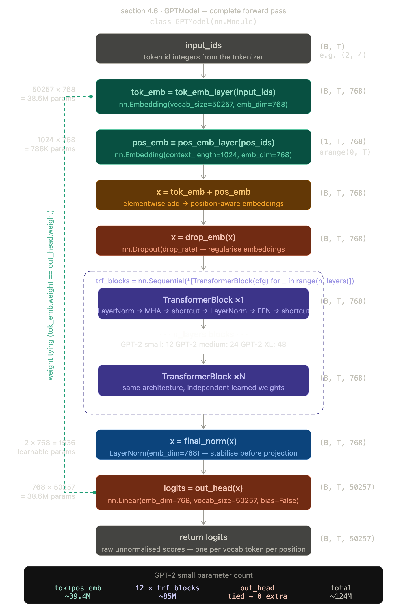

### without weight tying

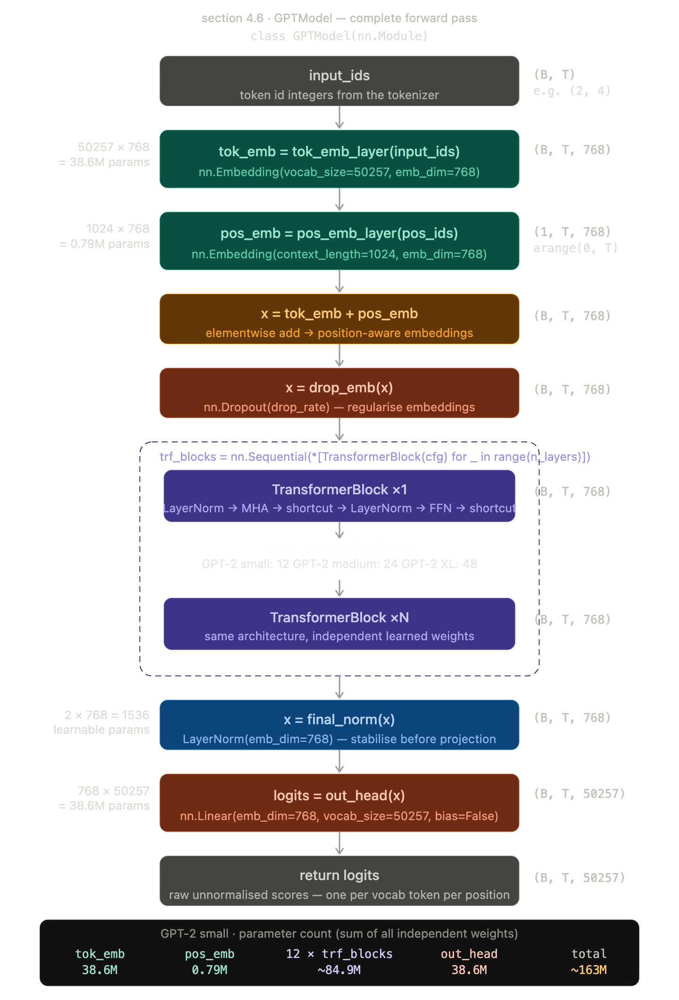

## The Full GPTModel Architecture — Before the Code

Before looking at code, let us see the complete picture of what the model looks like with all real components in place:

```
┌─────────────────────────────────────────────────────────────────────┐
│                   FULL GPT MODEL ARCHITECTURE                       │
│                                                                     │
│  INPUT: token IDs, shape (batch, seq_len)                           │
│  e.g.  [[6109, 3626, 6100, 345],     "Every effort moves you"      │
│          [6109, 1110, 6622, 257]]    "Every day holds a"            │
│                         ↓                                           │
│  ┌────────────────────────────────────────┐                         │
│  │  Token Embedding                       │  (50257, 768) table     │
│  │  +  Positional Embedding               │  (1024,  768) table     │
│  │  +  Dropout (10%)                      │                         │
│  └────────────────────────────────────────┘                         │
│                         ↓  shape: (batch, seq_len, 768)             │
│  ┌────────────────────────────────────────┐                         │
│  │  TransformerBlock × 1                  │  shape preserved        │
│  └────────────────────────────────────────┘  (batch, seq_len, 768) │
│  ┌────────────────────────────────────────┐                         │
│  │  TransformerBlock × 2                  │  shape preserved        │
│  └────────────────────────────────────────┘                         │
│                         ↓                                           │
│                        ...  × 12 total blocks                       │
│                         ↓                                           │
│  ┌────────────────────────────────────────┐                         │
│  │  TransformerBlock × 12                 │  shape preserved        │
│  └────────────────────────────────────────┘                         │
│                         ↓  shape still: (batch, seq_len, 768)       │
│  ┌────────────────────────────────────────┐                         │
│  │  Final LayerNorm                       │  shape preserved        │
│  └────────────────────────────────────────┘                         │
│                         ↓                                           │
│  ┌────────────────────────────────────────┐                         │
│  │  Output Head: Linear(768 → 50257)      │  ONLY shape change      │
│  │  bias=False                            │                         │
│  └────────────────────────────────────────┘                         │
│                         ↓  shape: (batch, seq_len, 50257)           │
│  OUTPUT: logits — one 50257-dim score vector per input token        │
└─────────────────────────────────────────────────────────────────────┘
```

---

## The GPTModel Code — Annotated

```python
class GPTModel(nn.Module):

    def __init__(self, cfg):
        super().__init__()
        self.tok_emb  = nn.Embedding(cfg["vocab_size"], cfg["emb_dim"])
        self.pos_emb  = nn.Embedding(cfg["context_length"], cfg["emb_dim"])
        self.drop_emb = nn.Dropout(cfg["drop_rate"])

        self.trf_blocks = nn.Sequential(
            *[TransformerBlock(cfg) for _ in range(cfg["n_layers"])]
        )

        self.final_norm = LayerNorm(cfg["emb_dim"])
        self.out_head   = nn.Linear(
            cfg["emb_dim"], cfg["vocab_size"], bias=False
        )

    def forward(self, in_idx):
        batch_size, seq_len = in_idx.shape
        tok_embeds = self.tok_emb(in_idx)
        pos_embeds = self.pos_emb(
            torch.arange(seq_len, device=in_idx.device)
        )
        x = tok_embeds + pos_embeds
        x = self.drop_emb(x)
        x = self.trf_blocks(x)
        x = self.final_norm(x)
        logits = self.out_head(x)
        return logits
```

### **`__init__` — Every Component Explained**

```python
self.tok_emb = nn.Embedding(cfg["vocab_size"], cfg["emb_dim"])
```

```
Lookup table shape: (50257, 768)
50257 rows — one per vocabulary token
768 columns — each token maps to a 768-dim vector
Learned: yes — these 50257 × 768 = 38,597,376 values are trainable
```

```python
self.pos_emb = nn.Embedding(cfg["context_length"], cfg["emb_dim"])
```

```
Lookup table shape: (1024, 768)
1024 rows — one per possible position in the sequence
768 columns — each position maps to a 768-dim vector
Learned: yes — these 1024 × 768 = 786,432 values are trainable
```

```python
self.drop_emb = nn.Dropout(cfg["drop_rate"])
```

```
Applied once, right after the token+positional embedding sum.
p = 0.1 → 10% of values zeroed randomly during training.
No parameters. Disabled during model.eval().
```

```python
self.trf_blocks = nn.Sequential(
    *[TransformerBlock(cfg) for _ in range(cfg["n_layers"])]
)
```

```
Creates 12 independent TransformerBlock instances.
Each block has its own separate weights — ~7M parameters per block.
nn.Sequential chains them: output of block k feeds into block k+1.
The * unpacks the list into positional arguments for nn.Sequential.
Total: 12 × ~7M = ~85M parameters from transformer blocks alone.
```

```python
self.final_norm = LayerNorm(cfg["emb_dim"])
```

```
One LayerNorm applied after all 12 blocks, before the output head.
Parameters: scale (768,) + shift (768,) = 1,536 trainable values.
Stabilises the values before the vocabulary projection.
```

```python
self.out_head = nn.Linear(cfg["emb_dim"], cfg["vocab_size"], bias=False)
```

```
Weight matrix shape: (50257, 768)
Projects each 768-dim token vector into 50257 raw scores (logits).
bias=False — no bias term, following GPT-2 convention.
Parameters: 50257 × 768 = 38,597,376

This is a very large layer. It is also involved in weight tying
(discussed below) — its weights happen to be the same shape as
tok_emb.weight.
```

---

### **`forward` — The Data Flow**

```python
def forward(self, in_idx):
    batch_size, seq_len = in_idx.shape
```

```
in_idx shape: (2, 4)  → 2 sentences, 4 tokens each
batch_size = 2,  seq_len = 4
```

```python
    tok_embeds = self.tok_emb(in_idx)
```

```
(2, 4) → (2, 4, 768)
Each integer token ID is replaced by its 768-dim row in tok_emb table.
```

```python
    pos_embeds = self.pos_emb(
        torch.arange(seq_len, device=in_idx.device)
    )
```

```
torch.arange(4) = [0, 1, 2, 3]
(4,) → (4, 768)
device= ensures CPU/GPU compatibility.
```

```python
    x = tok_embeds + pos_embeds
```

```
(2, 4, 768) + (4, 768) → (2, 4, 768)
PyTorch broadcasts pos_embeds across the batch dimension.
Each token now encodes BOTH what it is and where it sits.
```

```python
    x = self.drop_emb(x)
    x = self.trf_blocks(x)
    x = self.final_norm(x)
```

```
x shape stays (2, 4, 768) through all three steps.
drop_emb: 10% zeroed randomly.
trf_blocks: 12 transformer blocks in sequence, each enriching
            the token representations with context.
final_norm: normalises the output of the last block.
```

```python
    logits = self.out_head(x)
    return logits
```

```
(2, 4, 768) → (2, 4, 50257)
THE ONLY SHAPE CHANGE in the entire forward pass.
Each token's 768-dim vector is projected to 50257 logit scores.
```

---

## Running the Model

```python
torch.manual_seed(123)
model = GPTModel(GPT_CONFIG_124M)

out = model(batch)   # batch shape: (2, 4)
print("Input batch:\n", batch)
print("\nOutput shape:", out.shape)
```

Output:

```
Input batch:
 tensor([[6109, 3626, 6100,  345],
         [6109, 1110, 6622,  257]])

Output shape: torch.Size([2, 4, 50257])
```

The output is `(2, 4, 50257)` — two sentences, four tokens each, 50,257 logit scores per token. This is identical to the `DummyGPTModel` output shape, but now the values are computed by real transformer blocks rather than identity functions.

---

## The Parameter Count Mystery — 163M, Not 124M

When you count the parameters:

```python
total_params = sum(p.numel() for p in model.parameters())
print(f"Total number of parameters: {total_params:,}")
# → Total number of parameters: 163,009,536
```

163 million. But the model is called "GPT-2 124M". Where does the discrepancy come from?

```
┌─────────────────────────────────────────────────────────────────────┐
│              WHERE DO THE 163M PARAMETERS COME FROM?                │
│                                                                     │
│  Token embedding (tok_emb):                                         │
│    50257 × 768 = 38,597,376                                         │
│                                                                     │
│  Positional embedding (pos_emb):                                    │
│    1024 × 768 = 786,432                                             │
│                                                                     │
│  12 × TransformerBlock:                                             │
│    Each block: ~7,085,000                                           │
│    Total:       85,020,000                                          │
│                                                                     │
│  Final LayerNorm:                                                   │
│    768 + 768 = 1,536                                                │
│                                                                     │
│  Output head (out_head):                                            │
│    50257 × 768 = 38,597,376    ← same shape as tok_emb!             │
│                                                                     │
│  TOTAL: 38,597,376 + 786,432 + 85,020,000 + 1,536 + 38,597,376    │
│       = ~163,002,720  ≈ 163M                                        │
│                                                                     │
│  The token embedding (38.6M) and output head (38.6M) together      │
│  account for 77.2M parameters — almost half the total count.       │
│  They also have EXACTLY THE SAME SHAPE: (50257, 768).              │
└─────────────────────────────────────────────────────────────────────┘
```

---

## Weight Tying — The 124M Explanation

The original GPT-2 paper reported 117M parameters (later corrected to 124M). Our implementation shows 163M. The difference is **weight tying**.

**Weight tying** means using the **same weight matrix** for both the token embedding layer and the output head. Instead of two separate `(50257, 768)` matrices, the model shares one.

```
┌─────────────────────────────────────────────────────────────────────┐
│                    WEIGHT TYING EXPLAINED                           │
│                                                                     │
│  WITHOUT weight tying (our implementation):                         │
│                                                                     │
│  tok_emb.weight:    (50257, 768)  38.6M params  ← converts IDs    │
│                                                    to vectors       │
│  out_head.weight:   (50257, 768)  38.6M params  ← converts vectors │
│                                                    to logits        │
│  Total embedding+head params: 77.2M                                 │
│                                                                     │
│  WITH weight tying (original GPT-2):                                │
│                                                                     │
│  tok_emb.weight:    (50257, 768)  38.6M params  ← used for BOTH   │
│  out_head.weight = tok_emb.weight  ← same object, 0 extra params  │
│  Total embedding+head params: 38.6M                                 │
│                                                                     │
│  Saving: 38.6M parameters                                           │
│  163M - 38.6M = 124.4M  ← this is why it's called "124M"          │
└─────────────────────────────────────────────────────────────────────┘
```

### **Why Does Weight Tying Make Sense?**

The intuition is elegant. Consider what the two layers do:

```
tok_emb:  token ID  → 768-dim vector
          "forward" → [0.43, -0.21, 0.88, ..., 0.12]
          (input side: word → meaning)

out_head: 768-dim vector → token score
          [0.43, -0.21, 0.88, ..., 0.12] → score for "forward"
          (output side: meaning → word)
```

They are doing **inverse operations** — one maps from vocabulary space into embedding space, the other maps back from embedding space into vocabulary space. Sharing weights says: "the geometric relationship between tokens in embedding space should be consistent whether you are encoding them as input or scoring them as output."

Tokens that are semantically similar should have similar embedding vectors (tok_emb) AND should receive similar scores when a similar vector is produced at the output (out_head). Weight tying enforces this consistency.

### **Why This Book Does NOT Use Weight Tying**

```python
# To implement weight tying, you would do:
model.out_head.weight = model.tok_emb.weight

# But the book deliberately keeps them separate:
self.out_head = nn.Linear(cfg["emb_dim"], cfg["vocab_size"], bias=False)
```

The book uses separate layers because in practice, **separate token embedding and output layers tend to produce better training results and model performance**. The weight tying in original GPT-2 was primarily a memory optimisation — useful when training on 2019 hardware. Weight tying is revisited in Chapter 6 when loading OpenAI's pretrained weights, since those weights were trained with tying and must be loaded with matching architecture.

### **Verifying the 124M Count**

```python
print("Token embedding layer shape:", model.tok_emb.weight.shape)
print("Output layer shape:",          model.out_head.weight.shape)
# Token embedding layer shape: torch.Size([50257, 768])
# Output layer shape:          torch.Size([50257, 768])

total_params_gpt2 = (
    total_params - sum(p.numel() for p in model.out_head.parameters())
)
print(f"Parameters with weight tying: {total_params_gpt2:,}")
# → Number of trainable parameters considering weight tying: 124,412,160
```

Subtract one copy of `out_head` (38.6M) from 163M and you get 124.4M — matching the original GPT-2 small parameter count.

---

## Memory Footprint — How Much Storage Does the Model Need?

```python
total_size_bytes = total_params * 4           # float32 = 4 bytes each
total_size_mb    = total_size_bytes / (1024 * 1024)
print(f"Total size of the model: {total_size_mb:.2f} MB")
# → Total size of the model: 621.83 MB
```

```
┌─────────────────────────────────────────────────────────────────────┐
│              MODEL SIZE CALCULATION                                  │
│                                                                     │
│  163,009,536 parameters                                             │
│  × 4 bytes per parameter (float32 = 32 bits = 4 bytes)             │
│  = 652,038,144 bytes                                                │
│  = 652,038,144 / (1024 × 1024) MB                                  │
│  = 621.83 MB                                                        │
│                                                                     │
│  Why float32?                                                       │
│  PyTorch stores parameters in 32-bit floating point by default.    │
│  32 bits = 4 bytes. Each parameter is one such number.             │
│                                                                     │
│  Context:                                                           │
│  GPT-2 small  (124M params, float32):    ~622 MB                   │
│  GPT-2 medium (345M params, float32):   ~1.3  GB                   │
│  GPT-2 large  (762M params, float32):   ~2.9  GB                   │
│  GPT-2 XL    (1542M params, float32):   ~5.9  GB                   │
│  GPT-3       (175B  params, float32):  ~668   GB                   │
│                                                                     │
│  With float16 (half precision) — common for inference:             │
│  GPT-2 small would be ~311 MB                                       │
│  GPT-3 would be ~334 GB — still requires a GPU cluster             │
└─────────────────────────────────────────────────────────────────────┘
```

---

## The Complete Shape Journey — Full Model

```
┌──────────────────────────────────────────────────────────────────────┐
│               COMPLETE SHAPE JOURNEY — FULL GPT MODEL                │
│                                                                      │
│  Stage                            Shape              Notes           │
│  ────────────────────────────────────────────────────────────────    │
│  Input token IDs                  (2,    4)          raw integers    │
│  After tok_emb                    (2,    4,   768)   IDs → vectors   │
│  Positional embeddings               (   4,   768)   pos → vectors   │
│  After tok + pos add              (2,    4,   768)   combined        │
│  After drop_emb                   (2,    4,   768)   10% zeroed      │
│  After TransformerBlock 1         (2,    4,   768)   enriched        │
│  After TransformerBlock 2         (2,    4,   768)   further         │
│  ...                              ...                ...            │
│  After TransformerBlock 12        (2,    4,   768)   fully contextual│
│  After final_norm                 (2,    4,   768)   normalised      │
│  After out_head                   (2,    4, 50257)  ← only change    │
│                                                                      │
│  The shape (2, 4, 768) is maintained for 10 out of 11 stages.       │
│  Only the final linear projection changes the shape.                │
└──────────────────────────────────────────────────────────────────────┘
```

---

## What Each Component Contributes to the Total 163M

```
┌─────────────────────────────────────────────────────────────────────┐
│              PARAMETER BREAKDOWN — FULL GPT MODEL                   │
│                                                                     │
│  Component                    Params         % of total             │
│  ─────────────────────────────────────────────────────────────      │
│  tok_emb (50257×768)          38,597,376     23.7%                  │
│  pos_emb (1024×768)              786,432      0.5%                  │
│  12× TransformerBlock         85,020,000     52.1%                  │
│    ├─ 12× MultiHeadAttention  28,311,552     17.4%                  │
│    ├─ 12× FeedForward         56,669,184     34.8%                  │
│    └─ 12× LayerNorm ×2            36,864      0.0%                  │
│  final_norm (768+768)              1,536      0.0%                  │
│  out_head (50257×768)         38,597,376     23.7%                  │
│  ─────────────────────────────────────────────────────────────      │
│  TOTAL                       163,002,720    100.0%                  │
│                                                                     │
│  Key observations:                                                  │
│  • Embedding + output head = 47.4% of all parameters               │
│  • FeedForward alone = 34.8% of all parameters                      │
│  • LayerNorm is negligible (0.02%) despite being everywhere        │
│  • Positional embedding is tiny (0.5%) — only 1024 positions       │
└─────────────────────────────────────────────────────────────────────┘
```

---

## Build Status — Everything Is Complete

```
┌─────────────────────────────────────────────────────────────────────┐
│              BUILD STATUS AFTER SECTION 4.6                         │
│                                                                     │
│  Step 1: DummyGPTModel      ✓  Section 4.1                         │
│  Step 2: LayerNorm          ✓  Section 4.2                         │
│  Step 3: GELU activation    ✓  Section 4.3                         │
│  Step 4: FeedForward        ✓  Section 4.3                         │
│  Step 5: Shortcut connections ✓  Section 4.4                       │
│  Step 6: TransformerBlock   ✓  Section 4.5                         │
│  Step 7: Final GPTModel     ✓  Section 4.6  ← just completed       │
│  Step 8: generate_text_simple   Section 4.7  (next)                │
│                                                                     │
│  The model is fully built. What remains is Section 4.7:            │
│  converting the (2, 4, 50257) logit tensor back into               │
│  readable text by selecting the highest-scoring token              │
│  at each step and decoding it with the tokenizer.                  │
└─────────────────────────────────────────────────────────────────────┘
```

---

## Key Takeaways for Section 4.6

**`GPTModel` differs from `DummyGPTModel` in exactly two lines** — `DummyTransformerBlock` becomes `TransformerBlock` and `DummyLayerNorm` becomes `LayerNorm`. All other code was already correct in the dummy version from Section 4.1.

**The model has 163M parameters, not 124M**, because our implementation uses separate weight matrices for the token embedding and the output head. Both are shape `(50257, 768)` — together they account for 77.2M of the 163M total.

**Weight tying** is when the output head reuses the token embedding's weight matrix. This reduces parameters by 38.6M, bringing the count to 124M — matching the "GPT-2 124M" label. The book deliberately does not use weight tying because separate layers give better training results in practice.

**The parameter count math:** `163M - 38.6M (out_head) = 124.4M`. This is the number reported in the original GPT-2 paper.

**Memory cost is 621.83 MB in float32.** Each parameter is a 32-bit float (4 bytes). `163M × 4 = ~652MB`. This is why GPT-2 small can run on a laptop, while GPT-3 (175B parameters) at float32 would need 668GB — a GPU cluster.

**The output shape `(batch, seq_len, 50257)` still has one logit vector per input token.** During generation (Section 4.7), only the final position's logits are used to predict the next token. During training, all positions contribute to the loss.

**Shape is preserved through every component except the final linear layer.** The sequence `(2,4,768) → ... → (2,4,768) → (2,4,50257)` — the single shape change at the very end — is the defining property of this architecture.

---

_Next: Section 4.7 — Generating Text, where the `generate_text_simple` function is implemented to convert the model's output logit tensors back into readable text by iteratively selecting the highest-probability token, appending it to the input, and feeding the extended sequence back into the model._

# 7: Generating Text

> **This section covers:** How a GPT model converts output logit tensors back into text, the step-by-step token generation loop, what greedy decoding is and why softmax is technically redundant in it, why an untrained model produces gibberish, and the full end-to-end flow from raw text input to generated text output.

---

## The Bridge Between Model Output and Human-Readable Text

Everything built so far produces a tensor of shape `(batch, seq_len, 50257)`. Those are raw numbers — logits. A human cannot read logits. Section 4.7 answers the question: **how do you convert that tensor into words?**

The process is called **autoregressive generation** — the model generates one token at a time, appends it to the input, and feeds the extended input back into itself for the next token. This loop repeats until you have generated the desired number of new tokens.

```
┌─────────────────────────────────────────────────────────────────────┐
│              THE AUTOREGRESSIVE LOOP — CONCEPT                      │
│                                                                     │
│  Step 1:  Input = "Hello , I am"          → model → predict "a"    │
│  Step 2:  Input = "Hello , I am a"        → model → predict "model"│
│  Step 3:  Input = "Hello , I am a model"  → model → predict "ready"│
│  ...                                                                │
│  Step 6:  "Hello , I am a model ready to" → model → predict "help" │
│                                                                     │
│  Each step:                                                         │
│  1. Feed current token sequence into the model                     │
│  2. Get logits of shape (1, current_len, 50257)                    │
│  3. Take ONLY the last row: logits[:, -1, :]  shape (1, 50257)     │
│  4. Find the highest scoring token ID                               │
│  5. Append that token ID to the sequence                            │
│  6. Repeat                                                          │
└─────────────────────────────────────────────────────────────────────┘
```

---

### Generation loop

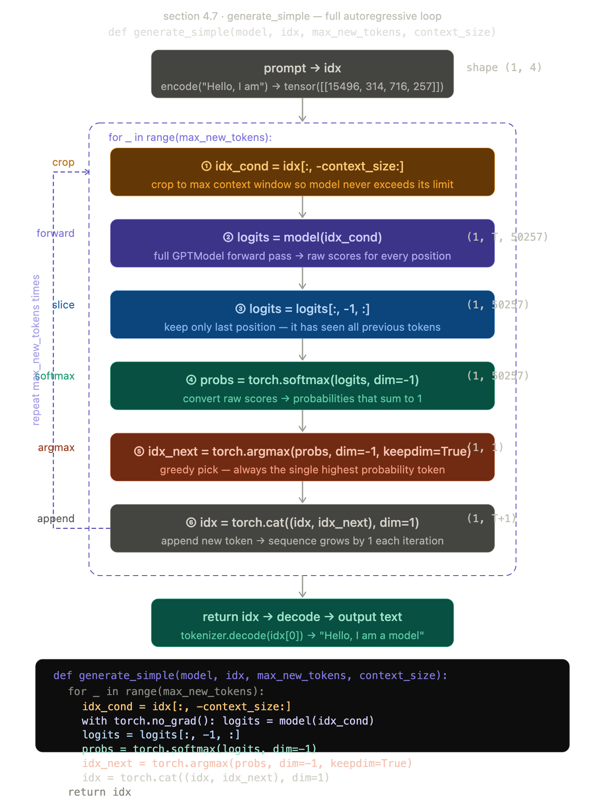

### Token trace

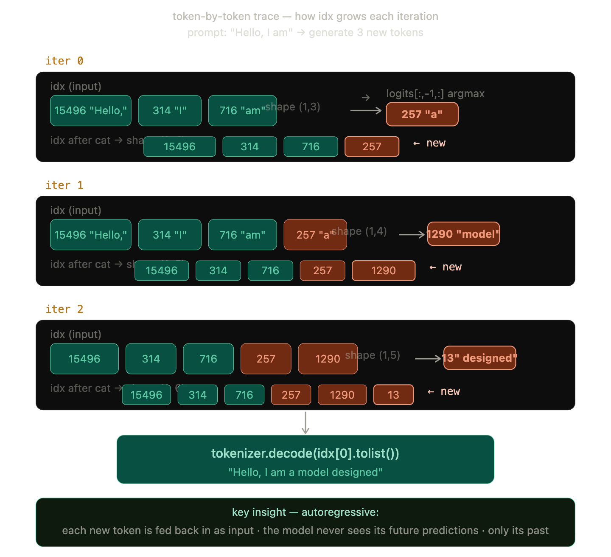

---

## Why Only the Last Position's Logits Matter

The model outputs one 50,257-dim logit vector per input token. But during generation, only the final position is used.

```
┌─────────────────────────────────────────────────────────────────────┐
│              WHY WE USE ONLY logits[:, -1, :]                       │
│                                                                     │
│  Input: "Hello , I am"   →   4 tokens   →   model produces:        │
│                                                                     │
│  logits shape: (1, 4, 50257)                                        │
│                                                                     │
│  logits[0][0] = 50257 scores after seeing "Hello"                  │
│                 = predicts what comes after "Hello"                 │
│                                                                     │
│  logits[0][1] = 50257 scores after seeing "Hello ,"                │
│                 = predicts what comes after "Hello ,"               │
│                                                                     │
│  logits[0][2] = 50257 scores after seeing "Hello , I"              │
│                 = predicts what comes after "Hello , I"             │
│                                                                     │
│  logits[0][3] = 50257 scores after seeing "Hello , I am"           │
│                 = predicts what comes NEXT  ← THIS IS WHAT WE WANT │
│                                                                     │
│  During generation we want to extend the sequence.                  │
│  The only prediction relevant to "what comes next" is the          │
│  prediction at the LAST position — after seeing all tokens so far. │
│                                                                     │
│  logits[:, -1, :] extracts that last position for all batch items. │
│  Shape: (1, 50257) — one score per vocabulary token.               │
└─────────────────────────────────────────────────────────────────────┘
```

The earlier positions are not wasted — during **training** they provide useful gradient signal (four training targets from one forward pass, as discussed in Section 4.1). But during **inference/generation**, positions 0 through n-2 are ignored.

---

## The `generate_text_simple` Function — Full Code

```python
def generate_text_simple(model, idx, max_new_tokens, context_size):
    for _ in range(max_new_tokens):

        idx_cond = idx[:, -context_size:]          # crop if too long

        with torch.no_grad():
            logits = model(idx_cond)               # forward pass

        logits  = logits[:, -1, :]                 # last position only
        probas  = torch.softmax(logits, dim=-1)    # convert to probs
        idx_next = torch.argmax(probas, dim=-1, keepdim=True)  # pick best
        idx      = torch.cat((idx, idx_next), dim=1)           # append

    return idx
```

---

## Every Line Explained

### **`idx_cond = idx[:, -context_size:]`**

```
The model can only process up to context_size=1024 tokens at once.
If the growing sequence exceeds 1024 tokens, we crop it.

Example: context_size = 5

  Iteration 1:  idx = [[6109, 3626, 6100, 345]]        length=4  → no crop
  Iteration 4:  idx = [[6109, 3626, 6100, 345, 257, 1110, 6622]]  length=7
                idx_cond = idx[:, -5:]
                        = [[345, 257, 1110, 6622, ???]]  only last 5 tokens

  Why crop from the END (most recent tokens)?
  The last tokens are the most contextually relevant for predicting
  what comes NEXT. Dropping old tokens is a limitation of this simple
  generation function — real systems handle this more carefully.
```

### **`with torch.no_grad():`**

```
During generation we are NOT training — we do not need gradients.

Without this context manager:
  PyTorch builds a computation graph tracking every operation
  so it can compute gradients later via .backward().
  This costs memory and time even if you never call .backward().

With torch.no_grad():
  PyTorch skips building the computation graph entirely.
  Memory usage drops. Forward pass is faster.
  Essential for inference — always use it when generating text.
```

### **`logits = model(idx_cond)`**

```
A full forward pass through the GPT model.

idx_cond shape: (1, current_seq_len)         e.g. (1, 4)
logits shape:   (1, current_seq_len, 50257)  e.g. (1, 4, 50257)

All 12 transformer blocks run. All 163M parameters participate.
The output is a logit vector for every input position.
```

### **`logits = logits[:, -1, :]`**

```
Extract only the last position's logits.

Before: (1, 4, 50257)
After:  (1,    50257)

The trailing dimension is 50257 — one raw score per vocab token.
This single row tells us: "given the full context, what token
should come next?"
```

### **`probas = torch.softmax(logits, dim=-1)`**

```
Convert raw logit scores to a probability distribution.

Before softmax (logits):
  token 0:    -0.72
  token 257:   0.34
  token 2651:  2.48  ← highest score
  token 6109: -1.20
  ... 50253 more ...

After softmax (probas):
  token 0:    0.0021
  token 257:  0.0060
  token 2651: 0.0530  ← highest probability
  token 6109: 0.0013
  ... all 50257 values sum to 1.0 ...

probas shape: (1, 50257)
```

**Important note — softmax is actually redundant here:**

```
torch.argmax finds the INDEX of the maximum value.
The softmax function is monotonic — it preserves the ORDER of values.
If token 2651 had the highest logit score, it will also have the
highest probability after softmax.

So argmax(softmax(logits)) == argmax(logits)  ALWAYS.

The softmax step here is included for conceptual clarity — to show
the full pipeline from logits → probabilities → token selection.
In production code, you would apply argmax directly to logits
and save the softmax computation.
```

### **`idx_next = torch.argmax(probas, dim=-1, keepdim=True)`**

```
Find the index (= token ID) of the highest probability token.

probas shape:    (1, 50257)
idx_next shape:  (1, 1)       ← keepdim=True preserves the dimension

Example:
  probas = [0.002, ..., 0.053, ..., 0.001]
                          ↑
              position 2651 is highest

  idx_next = [[2651]]   shape: (1, 1)

This is called GREEDY DECODING — always pick the single most
probable token. It is simple but not always the best strategy.
(Chapter 5 introduces temperature scaling and top-k sampling
to add variety and creativity to the generated text.)
```

### **`idx = torch.cat((idx, idx_next), dim=1)`**

```
Append the new token ID to the growing sequence.

Before: idx      = [[6109, 3626, 6100, 345]]      shape: (1, 4)
        idx_next = [[2651]]                        shape: (1, 1)

torch.cat(..., dim=1) concatenates along the sequence dimension.

After:  idx      = [[6109, 3626, 6100, 345, 2651]] shape: (1, 5)

This updated idx becomes the input for the next iteration.
The loop runs again with one more token in the context.
```

---

## The Full Generation Loop — One Iteration at a Time

Let us trace all six iterations of the book's example: starting from "Hello , I am" and generating 6 new tokens.

```
┌─────────────────────────────────────────────────────────────────────┐
│              SIX ITERATIONS OF TOKEN GENERATION                     │
│                                                                     │
│  Initial idx: [[15496, 11, 314, 716]]    "Hello , I am"            │
│  max_new_tokens = 6,  context_size = 1024                           │
│                                                                     │
│  ITERATION 1:                                                       │
│  idx_cond = [[15496, 11, 314, 716]]      no crop needed (len=4)    │
│  logits   shape: (1, 4, 50257)                                      │
│  logits[:,-1,:] shape: (1, 50257)        last position             │
│  argmax   → token ID 27018                                          │
│  idx      = [[15496, 11, 314, 716, 27018]]                          │
│             "Hello , I am [token_27018]"                            │
│                                                                     │
│  ITERATION 2:                                                       │
│  idx_cond = [[15496, 11, 314, 716, 27018]]   length=5              │
│  logits[:,-1,:] → argmax → token ID 24086                           │
│  idx      = [[15496, 11, 314, 716, 27018, 24086]]                   │
│                                                                     │
│  ITERATION 3:                                                       │
│  idx_cond = [[..., 27018, 24086]]   length=6                        │
│  logits[:,-1,:] → argmax → token ID 47843                           │
│  idx      = [[..., 27018, 24086, 47843]]                            │
│                                                                     │
│  ITERATIONS 4, 5, 6: same pattern                                   │
│                                                                     │
│  FINAL idx:                                                         │
│  [[15496, 11, 314, 716, 27018, 24086, 47843, 30961, 42348, 7267]]  │
│  length = 4 (original) + 6 (generated) = 10 tokens                 │
└─────────────────────────────────────────────────────────────────────┘
```

---

## Encoding Input and Decoding Output

```python
start_context = "Hello, I am"
encoded        = tokenizer.encode(start_context)
print("encoded:", encoded)
# encoded: [15496, 11, 314, 716]

encoded_tensor = torch.tensor(encoded).unsqueeze(0)
print("encoded_tensor.shape:", encoded_tensor.shape)
# encoded_tensor.shape: torch.Size([1, 4])
```

**Why `unsqueeze(0)`?**

```
tokenizer.encode returns a plain Python list: [15496, 11, 314, 716]
torch.tensor(...) converts it to a 1D tensor: shape (4,)

The model expects a 2D tensor with a batch dimension: shape (1, 4)
.unsqueeze(0) adds a dimension at position 0:
  (4,) → (1, 4)   ← adds the batch dimension of size 1
```

**Running generation:**

```python
model.eval()

out = generate_text_simple(
    model=model,
    idx=encoded_tensor,
    max_new_tokens=6,
    context_size=GPT_CONFIG_124M["context_length"]
)
print("Output:", out)
print("Output length:", len(out[0]))
# Output: tensor([[15496, 11, 314, 716, 27018, 24086, 47843, 30961, 42348, 7267]])
# Output length: 10
```

**`model.eval()` — Why It Matters:**

```
model.eval() switches the model from training mode to evaluation mode.
Two things change:

1. Dropout is disabled:
   In training: 10% of values are randomly zeroed each forward pass.
   In eval:     All values pass through unchanged.
   Without eval(), generation would be non-deterministic —
   the same input would produce different outputs on every call
   because of random dropout masking.

2. BatchNorm (not used here, but generally):
   In training: uses batch statistics.
   In eval:     uses running statistics.

Always call model.eval() before generating text.
Always call model.train() before resuming training.
```

**Decoding the output back to text:**

```python
decoded_text = tokenizer.decode(out.squeeze(0).tolist())
print(decoded_text)
# Hello, I am Featureiman Byeswickattribute argue
```

**Why `out.squeeze(0).tolist()`?**

```
out shape: (1, 10)    ← batch dimension of 1, 10 tokens

.squeeze(0): removes the batch dimension
  (1, 10) → (10,)

.tolist(): converts the PyTorch tensor to a plain Python list
  tensor([15496, 11, ...]) → [15496, 11, ...]

tokenizer.decode() expects a Python list of integers.
```

---

## The Gibberish Output — Why and What It Means

The generated text "Hello, I am Featureiman Byeswickattribute argue" is complete nonsense. This is expected. The model has never been trained.

```
┌─────────────────────────────────────────────────────────────────────┐
│              WHY THE UNTRAINED MODEL PRODUCES GIBBERISH             │
│                                                                     │
│  All weights were initialised randomly with torch.manual_seed(123). │
│  The model has never seen any text.                                  │
│  It has no idea what words should follow other words.               │
│                                                                     │
│  What happens during generation:                                    │
│  The model picks the highest-scoring token, but those scores       │
│  are driven entirely by random initial weights — the highest        │
│  score at each step is essentially arbitrary.                       │
│                                                                     │
│  The architecture is correct and working:                           │
│  ✓ Shapes flow correctly through all components                    │
│  ✓ Tokenization and decoding work correctly                        │
│  ✓ The autoregressive loop runs correctly                          │
│  ✗ The weights have not been trained yet                            │
│                                                                     │
│  This is exactly what the book intends to demonstrate here.        │
│  Chapter 5 trains the model. Chapter 6 loads pretrained weights.   │
│  After Chapter 6, the same generate_text_simple function will      │
│  produce coherent English text.                                     │
└─────────────────────────────────────────────────────────────────────┘
```

The gibberish is actually a useful validation. It confirms that the model is producing different tokens at each step (not stuck in a loop), that the tokenizer decode is working, and that the full pipeline from text → token IDs → model → logits → token IDs → text is functional end to end.

---

## Greedy Decoding — What It Is and Its Limitation

The `generate_text_simple` function always picks the token with the **highest probability** at every step. This is called greedy decoding.

```
┌─────────────────────────────────────────────────────────────────────┐
│              GREEDY DECODING — HOW IT WORKS                         │
│                                                                     │
│  At each step, probabilities might look like:                       │
│                                                                     │
│  "the"     → 0.24  ← highest — greedy picks this                  │
│  "a"       → 0.18                                                   │
│  "my"      → 0.15                                                   │
│  "some"    → 0.09                                                   │
│  "any"     → 0.07                                                   │
│  ...50252 more tokens with small probabilities...                   │
│                                                                     │
│  Greedy always picks "the" — highest probability, every time.      │
│                                                                     │
│  PROBLEM WITH GREEDY:                                               │
│  Locally optimal choices can lead to globally poor sequences.      │
│                                                                     │
│  Example:                                                           │
│  Step 1: "the" has prob 0.24 — greedy picks it                     │
│  Step 2: given "...the", best continuation has prob 0.05           │
│                                                                     │
│  Alternative:                                                       │
│  Step 1: "a" has prob 0.18 — not the greedy choice                 │
│  Step 2: given "...a", best continuation has prob 0.35             │
│                                                                     │
│  The greedy path (0.24 × 0.05 = 0.012) was worse than             │
│  the non-greedy path (0.18 × 0.35 = 0.063) overall.               │
│                                                                     │
│  ALSO: greedy always produces the same output for the same input.  │
│  Zero randomness — no creativity or variation.                     │
│                                                                     │
│  Chapter 5 introduces temperature scaling and top-k sampling       │
│  to address both limitations.                                       │
└─────────────────────────────────────────────────────────────────────┘
```

---

## The Complete End-to-End Pipeline

```
┌─────────────────────────────────────────────────────────────────────┐
│              END-TO-END: TEXT IN → TEXT OUT                         │
│                                                                     │
│  Raw text input:                                                    │
│  "Hello, I am"                                                      │
│         ↓  tokenizer.encode()                                       │
│  Token IDs:                                                         │
│  [15496, 11, 314, 716]                                              │
│         ↓  torch.tensor().unsqueeze(0)                              │
│  Tensor shape: (1, 4)                                               │
│         ↓  model.eval()                                             │
│         ↓  generate_text_simple(model, idx, max_new_tokens=6, ...)  │
│                                                                     │
│  Iteration 1:  (1,4) → model → logits (1,4,50257)                  │
│                → logits[:,-1,:] (1,50257) → argmax → new_id        │
│                → idx becomes (1,5)                                  │
│                                                                     │
│  Iteration 2:  (1,5) → model → logits (1,5,50257) → ... → (1,6)   │
│  Iteration 3:  (1,6) → ... → (1,7)                                 │
│  Iteration 4:  (1,7) → ... → (1,8)                                 │
│  Iteration 5:  (1,8) → ... → (1,9)                                 │
│  Iteration 6:  (1,9) → ... → (1,10)                                │
│                                                                     │
│  Final tensor: (1, 10)                                              │
│  [15496, 11, 314, 716, 27018, 24086, 47843, 30961, 42348, 7267]   │
│         ↓  .squeeze(0).tolist()                                     │
│  [15496, 11, 314, 716, 27018, 24086, 47843, 30961, 42348, 7267]   │
│         ↓  tokenizer.decode()                                       │
│  "Hello, I am Featureiman Byeswickattribute argue"                  │
│                                                                     │
│  (gibberish because model is untrained — correct after Chapter 6)  │
└─────────────────────────────────────────────────────────────────────┘
```

---

## The Growing Sequence — How Context Length Is Managed

A natural question when looking at `generate_text_simple`: the input
sequence grows by one token every iteration — does it keep growing
forever? And if so, how does the model handle inputs longer than
`context_length = 1024`?

The answer is one line of code:

```python
idx_cond = idx[:, -context_size:]

```

Every iteration, before the sequence is fed to the model, it is cropped to only the **last `context_size` tokens**. The model never sees more than `context_size` tokens at once, regardless of how long the full generated sequence has grown.

```

Then paste the full content from our chat as-is — it fits perfectly under that heading with no changes needed. The heading name I would use is:


```

## The Growing Sequence — How Context Length Is Managed

````

And optionally add one small callout box right before the summary table to flag the limitation explicitly, since that is an important gotcha:

```markdown
> **Limitation of `generate_text_simple`:** Tokens that fall off the
> left edge of the context window are permanently lost. The model has
> no memory of them. This is why naive autoregressive generation can
> become incoherent over long outputs — the early context that gives
> the sentence its direction quietly disappears. More sophisticated
> generation methods handle this, but `generate_text_simple` does not.

````

---

The sequence DOES grow every iteration. But the cropping handles it. Let me show you exactly what happens step by step.

---

### The Key Line That Manages This

```python
idx_cond = idx[:, -context_size:]

```

This is the entire management mechanism. Every iteration, before feeding into the model, the sequence is cropped to only the **last `context_size` tokens**. Anything older gets dropped.

---

### Step by Step With context_size = 5

Starting input: "Every effort moves you" — 4 tokens.

```
START:
idx = [6109, 3626, 6100, 345]     length = 4

```

**Iteration 1:**

```
idx_cond = idx[:, -5:]
         = [6109, 3626, 6100, 345]    length = 4  (under limit, no crop)

model runs on 4 tokens → predicts next token → say ID = 2651 ("forward")

idx = [6109, 3626, 6100, 345, 2651]   length = 5

```

**Iteration 2:**

```
idx_cond = idx[:, -5:]
         = [6109, 3626, 6100, 345, 2651]   length = 5  (exactly at limit, no crop)

model runs → predicts → say ID = 284 ("to")

idx = [6109, 3626, 6100, 345, 2651, 284]   length = 6

```

**Iteration 3:**

```
idx_cond = idx[:, -5:]
         = [3626, 6100, 345, 2651, 284]    length = 5  ← CROPPED
            ↑
            6109 ("Every") was dropped — it fell off the left edge

model runs on these 5 tokens → predicts → say ID = 345 ("you")

idx = [6109, 3626, 6100, 345, 2651, 284, 345]   length = 7

```

**Iteration 4:**

```
idx_cond = idx[:, -5:]
         = [6100, 345, 2651, 284, 345]     length = 5  ← CROPPED
            ↑
            6109, 3626 ("Every", "effort") both dropped

model runs → predicts → say ID = 1234

idx = [6109, 3626, 6100, 345, 2651, 284, 345, 1234]   length = 8

```

---

### The Key Insight — Two Separate Things

There are two separate things happening and it is easy to confuse them:

```
┌─────────────────────────────────────────────────────────────────┐
│              idx  vs  idx_cond                                  │
│                                                                 │
│  idx       = the FULL growing sequence, never cropped           │
│              This is your complete record of everything         │
│              generated so far. It grows by 1 every iteration.  │
│                                                                 │
│  idx_cond  = what actually gets FED TO THE MODEL               │
│              Always cropped to last context_size tokens.        │
│              The model never sees more than context_size        │
│              tokens at once regardless of how long idx gets.   │
│                                                                 │
│  After 10 iterations with context_size=5:                       │
│  idx      = [t0, t1, t2, t3, t4, t5, t6, t7, t8, t9, t10]     │
│              length = 14  (4 original + 10 generated)           │
│  idx_cond = [t6, t7, t8, t9, t10]                               │
│              length = 5   (only the last 5 fed to model)        │
└─────────────────────────────────────────────────────────────────┘

```

---

### What Gets Lost When You Crop

Yes — tokens that fall off the left edge are **permanently lost from the model's context**. The model cannot see them anymore. If you generated:

```
"Every effort moves you forward to become better every"

```

And context_size is 5, by the time you are predicting after "better every", the model has no memory of "Every effort moves" — those tokens are gone from `idx_cond`. The model only sees the last 5 tokens and generates purely from those.

This is a real limitation of the simple `generate_text_simple` function. It is why very long generation can become incoherent — early context is lost.

---

### Summary in One Picture

```
context_size = 5

Iteration    idx (full record)                    idx_cond (fed to model)
─────────────────────────────────────────────────────────────────────────
Start        [E, ef, mo, you]                 len=4     [E, ef, mo, you]
After iter1  [E, ef, mo, you, fwd]            len=5     [E, ef, mo, you, fwd]
After iter2  [E, ef, mo, you, fwd, to]        len=6     [ef, mo, you, fwd, to]    ← E dropped
After iter3  [E, ef, mo, you, fwd, to, be]    len=7  [mo, you, fwd, to, be]       ← E,ef dropped
After iter4  ...                              len=8     [you, fwd, to, be, ???]   ← mo dropped

```

`idx` grows forever. `idx_cond` stays at 5. The model always only sees the most recent 5 tokens. Everything older than that window is invisible to it.

---

## Shape Journey Through One Generation Step

```
┌──────────────────────────────────────────────────────────────────────┐
│         SHAPE JOURNEY — ONE ITERATION OF GENERATION                  │
│                                                                      │
│  Stage                           Shape          Notes                │
│  ────────────────────────────────────────────────────────────────    │
│  idx (input sequence)            (1,    4)      4 current tokens     │
│  idx_cond (after crop)           (1,    4)      no crop needed       │
│  logits (model output)           (1,    4, 50257) full output        │
│  logits[:, -1, :] (last pos)     (1,       50257) next-token scores  │
│  probas (after softmax)          (1,       50257) probabilities      │
│  idx_next (argmax)               (1,           1) one token ID       │
│  idx (after cat)                 (1,    5)      one token appended   │
│                                                                      │
│  After 6 iterations:             (1,   10)      4 + 6 = 10 tokens    │
└──────────────────────────────────────────────────────────────────────┘
```

---

## Chapter 4 — Complete Summary

With Section 4.7 done, the entire chapter is complete. Here is what was built, in order:

```
┌─────────────────────────────────────────────────────────────────────┐
│              WHAT CHAPTER 4 BUILT — COMPLETE PICTURE                │
│                                                                     │
│  4.1  DummyGPTModel    — skeleton with correct shapes               │
│  4.2  LayerNorm        — zero mean, unit variance per token         │
│  4.3  GELU + FF        — non-linear token transformation            │
│  4.4  Shortcuts        — gradient highways through 12 blocks        │
│  4.5  TransformerBlock — all components assembled into one unit     │
│  4.6  GPTModel         — 12 blocks + embeddings + output head       │
│  4.7  generate_text    — logits → tokens → text                     │
│                                                                     │
│  Input:  "Hello, I am"    (raw English text)                        │
│  Output: "Hello, I am Featureiman Byeswickattribute argue"          │
│          (gibberish — model is untrained)                           │
│                                                                     │
│  Chapter 5: Train the model on text data                            │
│  Chapter 6: Load pretrained GPT-2 weights from OpenAI              │
│             → same generate_text_simple, coherent English output    │
└─────────────────────────────────────────────────────────────────────┘
```

---

## Key Takeaways for Section 4.7

**Autoregressive generation produces one token per iteration.** Each iteration runs a full forward pass through the model, extracts the last position's logits, picks the best token, and appends it. After `max_new_tokens` iterations, the sequence is `max_new_tokens` longer than the input.

**Only `logits[:, -1, :]` is used during generation.** The model outputs logits for every position, but only the final position tells us what comes next. Earlier positions are used during training (as gradient targets) but ignored during inference.

**`torch.no_grad()` is essential during generation.** Without it, PyTorch wastes memory and time building a computation graph for a backward pass that will never happen.

**`model.eval()` must be called before generation.** It disables dropout, making generation deterministic. Forgetting this means every call to the model produces different outputs from the same input.

**Softmax before argmax is redundant but illustrative.** `argmax(softmax(x)) == argmax(x)` always, because softmax preserves the ordering of values. The book includes it to show the full conceptual pipeline. In production, apply argmax directly to logits.

**Greedy decoding = always pick the highest-probability token.** Simple and fast, but locally optimal choices can lead to globally suboptimal text. Chapter 5 introduces better sampling strategies.

**The gibberish output is expected and correct.** All weights are random. The architecture is verified to work correctly — the right shapes flow through all components and the tokenizer encodes and decodes correctly. Training (Chapter 5) or loading pretrained weights (Chapter 6) is what makes the output coherent.

**`unsqueeze(0)` adds the batch dimension.** `tokenizer.encode` returns a 1D list. The model needs a 2D tensor `(1, seq_len)`. `.unsqueeze(0)` inserts the batch dimension at position 0.

---

_Chapter 4 is complete. Chapter 5 introduces the training loop — loss functions, gradient descent, and pretraining the model on text data so that `generate_text_simple` begins producing coherent language._
