# Chapter 5: Pretraining on Unlabeled Data

## Table of Contents

1. [Evaluating Generative Text Models](#1-evaluating-generative-text-models)
2. [Training an LLM](#2-training-an-llm)
3. [Decoding Strategies to Control Randomness](#3-decoding-strategies-to-control-randomness)
4. [Loading and Saving Model Weights in PyTorch](#4-loading-and-saving-model-weights-in-pytorch)
5. [Loading Pretrained Weights from OpenAI](#5-loading-pretrained-weights-from-openai)

> **Chapter 5 opens here.** Chapter 4 produced a fully assembled `GPTModel` — correct architecture, all shapes verified, every component wired. But the weights are random draws from an initialization distribution, so `generate_text_simple` outputs gibberish. Chapter 5 is where the model stops being a hollow shell and starts actually learning language. It covers evaluating text quality numerically, implementing the pretraining loop, controlling generation randomness, persisting model state to disk, and finally loading real GPT-2 weights from OpenAI so the same generation function produces coherent English.

The chapter works through five topics in sequence:

```
┌─────────────────────────────────────────────────────────────────────┐
│              CHAPTER 5 ROADMAP                                      │
│                                                                     │
│  5.1  Evaluating generative text models                             │
│       Define a numeric loss; compute train & validation losses      │
│                      ↓                                              │
│  5.2  Training an LLM                                               │
│       Implement the full pretraining loop with loss tracking        │
│                      ↓                                              │
│  5.3  Decoding strategies to control randomness                     │
│       Temperature scaling and top-k sampling                        │
│                      ↓                                              │
│  5.4  Loading and saving model weights in PyTorch                   │
│       Persist model and optimizer state; resume training            │
│                      ↓                                              │
│  5.5  Loading pretrained weights from OpenAI                        │
│       Map GPT-2 weights into our GPTModel; generate coherent text   │
└─────────────────────────────────────────────────────────────────────┘
```

The chapter sits at Step 4–7 of Stage 1 in the overall three-stage LLM build:

```
┌─────────────────────────────────────────────────────────────────────┐
│              WHERE CHAPTER 5 SITS                                   │
│                                                                     │
│  STAGE 1 — Foundation Model                                         │
│  ┌─────────────────────────────────────────────────────────┐        │
│  │  Data prep & sampling         (Chapter 2)               │        │
│  │  Attention mechanism          (Chapter 3)               │        │
│  │  LLM architecture             (Chapter 4)               │        │
│  │  Pretraining & evaluation  ◄── (Chapter 5)              │        │
│  └─────────────────────────────────────────────────────────┘        │
│                                                                     │
│  STAGE 2 — Fine-tuning for classification    (Chapter 6)           │
│  STAGE 3 — Fine-tuning to follow instructions (Chapter 7)          │
└─────────────────────────────────────────────────────────────────────┘
```

Section 5.1 covers the first prerequisite before any training can happen: establishing a numeric signal that tells us whether the model is improving. That signal is the cross entropy loss.

---

# 1. Evaluating Generative Text Models

> **This section covers:** Recapping text generation using `generate_text_simple`, defining cross entropy loss as a differentiable quality signal for generated text, walking through every step of the loss computation from logits to a scalar, implementing `calc_loss_batch` and `calc_loss_loader`, and computing the initial training and validation losses on "The Verdict" dataset before any training has occurred.

---

## Recap: What generate_text_simple Does

Before building the loss, the book re-establishes the generation pipeline from Chapter 4. Every part of the loss computation will be built on top of this same machinery, so it is worth having the three-step cycle clear in memory:

```
┌─────────────────────────────────────────────────────────────────────┐
│              TEXT GENERATION — THREE STEPS                          │
│                                                                     │
│  INPUT TEXT                                                         │
│  "Every effort moves you"                                           │
│         ↓  tokenizer.encode()                                       │
│                                                                     │
│  TOKEN IDs: [6109, 3626, 6100, 345]   shape: (1, 4)                │
│         ↓  GPTModel forward pass                                    │
│                                                                     │
│  LOGITS: shape (1, 4, 50257)                                        │
│          a vector of 50 257 raw scores for each of the 4 positions  │
│         ↓  argmax on last position → token ID → decode              │
│                                                                     │
│  NEXT TOKEN appended → repeat until max_new_tokens reached          │
│                                                                     │
│  OUTPUT: "Every effort moves you rentingetic wasn? refres..."       │
│          (gibberish — random weights)                               │
└─────────────────────────────────────────────────────────────────────┘
```

Two helper functions centralise encoding and decoding for the rest of the chapter:

```python
def text_to_token_ids(text, tokenizer):
    encoded = tokenizer.encode(text, allowed_special={'<|endoftext|>'})
    encoded_tensor = torch.tensor(encoded).unsqueeze(0)  # adds batch dim
    return encoded_tensor

def token_ids_to_text(token_ids, tokenizer):
    flat = token_ids.squeeze(0)                          # removes batch dim
    return tokenizer.decode(flat.tolist())
```

`unsqueeze(0)` inserts the batch dimension that `GPTModel` expects. `squeeze(0)` removes it so the tokenizer receives a plain list. These two functions are called throughout the rest of the chapter.

---

## Why a Numeric Loss Is Necessary

Qualitative inspection — "the output is gibberish" — cannot drive gradient descent. Training requires a differentiable scalar that measures how wrong the current weights are at every step. The signal must be:

- **differentiable** — so gradients can flow back through the model to update weights
- **scalar** — gradient descent operates on a single number, not a tensor
- **interpretable** — low is good, high is bad, and the scale should be stable across different batch sizes and sequence lengths

That scalar is the **cross entropy loss**, and the rest of Section 5.1 is a careful step-by-step derivation of exactly how it is computed.

---

## Using GPT to generate text

This section sets up the GPT model for text generation and introduces the two helper functions — `text_to_token_ids` and `token_ids_to_text` — that will be used throughout the rest of the chapter. The generation pipeline itself was built in Chapter 4; the goal here is to establish the exact code scaffolding and understand each piece precisely before the training and evaluation machinery is layered on top.

---

### A Note on Weight Parameters

Before touching any code, the book defines the term that will be used constantly through the rest of the chapter: **weight parameters**.

In the context of LLMs and other deep learning models, weights refer to the trainable parameters that the learning process adjusts. These weights are also known as weight parameters or simply parameters. In frameworks like PyTorch, these weights are stored in linear layers — used to implement the multi-head attention module in Chapter 3 and the `GPTModel` in Chapter 4.

There are two ways to access them:

```python
# Access weights of a specific layer
new_layer = torch.nn.Linear(...)
new_layer.weight     # the weight matrix of that layer

# Access all trainable parameters across the entire model at once
model.parameters()   # used later when implementing model training
```

`model.parameters()` returns an iterator over all trainable tensors in the model — every weight matrix and bias vector across all 12 transformer blocks, the embedding layers, and the output head. This is the method that will be passed to the optimizer when the training loop is implemented. The book's sidebar uses `model.parameters()` as a forward pointer — it will appear in the optimizer initialisation in Section 5.2.

---

### Initialising the Model

```python
import torch
from chapter04 import GPTModel

GPT_CONFIG_124M = {
    "vocab_size":       50257,
    "context_length":   256,    # ← reduced from 1024 for training convenience
    "emb_dim":          768,
    "n_heads":          12,
    "n_layers":         12,
    "drop_rate":        0.1,    # ← it is possible and common to set this to 0
    "qkv_bias":         False
}

torch.manual_seed(123)
model = GPTModel(GPT_CONFIG_124M)
model.eval()
```

Two important annotations the book calls out explicitly on this config:

**Context length reduced from 1024 to 256.** The original GPT-2 model with 124 million parameters was configured to handle up to 1024 tokens. Reducing to 256 significantly lowers the computational demands of training, making it possible to run on a standard laptop. This is a deliberate tradeoff for educational purposes — after the training process is complete, the context size will be updated back to 1024 and the pretrained OpenAI weights will be loaded.

**Dropout rate of 0.1.** Setting `drop_rate=0.1` means 10% of activations are randomly zeroed during each forward pass in training mode. The book notes it is possible and common to set dropout to 0 for pretraining at this scale, since the regularisation effect of dropout is most useful when the dataset is small relative to the model size.

**`model.eval()` is called immediately.** This switches the model from training mode to evaluation mode before any text is generated. The difference between the two modes is consequential:


In training mode, dropout randomly zeros 10% of activations at each forward pass, which means the same input produces different outputs on different calls. In evaluation mode, dropout is disabled and all activations pass through unchanged — the output is deterministic. Since we are generating text for inspection, not computing gradients, `eval()` mode is mandatory. Weights do not change between modes; only dropout behaviour (and batch normalisation behaviour, if present) changes.

`torch.manual_seed(123)` is set before initialisation to make the random weight initialisation reproducible. Without this, each run produces a different random model and the example outputs would vary.

---

### The Three-Step Generation Pipeline

The book introduces two helper functions — `text_to_token_ids` and `token_ids_to_text` — to wrap the encoding and decoding steps that appear constantly throughout the chapter. Combined with `generate_text_simple` from Chapter 4, they form a clean three-step cycle:


The three steps, as the book describes them:

**Step 1 — encode:** The tokenizer converts input text into a series of token IDs. "Every effort moves you" becomes `tensor([[6109, 3626, 6100, 345]])` — a 2D tensor of shape `(1, 4)`.

**Step 2 — model forward pass:** The `GPTModel` receives these token IDs and generates corresponding logits — vectors representing the probability distribution for each token in the vocabulary. Given four input token IDs, the model produces 4 logit vectors (rows) where each vector has 50 257 elements (columns) equal to the vocabulary size. The actual values from the book: `[-0.2968, …, -0.1714]` for position 0, `[-1.3747, …, 0.3993]` for position 1, `[1.8251, …, -0.9297]` for position 2, `[-0.0922, …, -0.6768]` for position 3.

**Step 3 — decode:** After converting the logits to token IDs, the tokenizer decodes these IDs back into a text representation, completing the cycle from textual input to textual output.

---

### The Two Helper Functions

```python
import tiktoken
from chapter04 import generate_text_simple

def text_to_token_ids(text, tokenizer):
    encoded = tokenizer.encode(text, allowed_special={'<|endoftext|>'})
    encoded_tensor = torch.tensor(encoded).unsqueeze(0)   # adds batch dim
    return encoded_tensor

def token_ids_to_text(token_ids, tokenizer):
    flat = token_ids.squeeze(0)                           # removes batch dim
    return tokenizer.decode(flat.tolist())
```

The `unsqueeze(0)` and `squeeze(0)` calls are the only non-obvious parts. The tokenizer works with plain Python lists — `tokenizer.encode()` returns a list, and `tokenizer.decode()` expects a list. But `GPTModel` expects 2D tensors with a batch dimension. These two functions handle that translation:


`unsqueeze(0)` inserts a new dimension at position 0, turning shape `(4,)` into `(1, 4)`. This is the batch dimension — even though there is only one sequence, the model always expects the batch axis to be present. `squeeze(0)` does the reverse, removing the size-1 batch dimension so the tokenizer receives a plain 1D tensor that `.tolist()` can convert to a Python list.

`allowed_special={'<|endoftext|>'}` tells the tokenizer to treat the end-of-text token as a regular token rather than raising an error when it appears in the input. This is necessary because the GPT-2 tokenizer's default behaviour is to disallow special tokens in user-provided strings.

---

### Running the Generation

```python
start_context = "Every effort moves you"
tokenizer = tiktoken.get_encoding("gpt2")

token_ids = generate_text_simple(
    model=model,
    idx=text_to_token_ids(start_context, tokenizer),
    max_new_tokens=10,
    context_size=GPT_CONFIG_124M["context_length"]
)

print("Output text:\n", token_ids_to_text(token_ids, tokenizer))
```

```
Output text:
 Every effort moves you rentingetic wasn? refres RexMeCHicular stren
```

The output is gibberish — "rentingetic wasn? refres RexMeCHicular stren" — because the model weights are random. Nothing has been learned yet. The architecture is correct and the pipeline is functional: the right shapes flow through every component, the tokenizer encodes and decodes correctly, and `generate_text_simple` appends one token per iteration. The weights simply haven't been trained to produce meaningful predictions.

To define what makes text coherent or high quality, a numerical method to evaluate the generated content is needed. This approach enables monitoring and enhancing the model's performance throughout the training process. The loss that will be computed in Section 5.1.2 serves as a progress and success indicator of training. Furthermore, in later chapters when the LLM is fine-tuned, additional methodologies for assessing model quality will be introduced.

---

### Key Takeaways

`model.eval()` must always be called before generating text. It disables dropout, making outputs deterministic. Forgetting this means the same prompt produces different outputs on different calls — useful for training, wrong for generation or evaluation.

`text_to_token_ids` and `token_ids_to_text` are thin wrappers around the tokenizer that handle one specific mismatch: the tokenizer speaks in 1D lists, the model speaks in 2D tensors. `unsqueeze(0)` adds the batch dimension going in; `squeeze(0)` removes it coming out.

The context length is set to 256 rather than the real GPT-2 value of 1024. This is a training convenience only — it reduces memory and compute requirements so the educational examples run on consumer hardware. The setting is restored to 1024 when the OpenAI pretrained weights are loaded at the end of the chapter.

Gibberish output from the untrained model is not a bug — it is confirmation that the architecture and pipeline are working correctly. Random weights produce random predictions. Training (Section 5.2) or loading pretrained weights (Section 5.5) is what produces coherent language.

---

## Calculating the Text Generation Loss

The model built in Chapter 4 generates text, but the output is gibberish — "rentingetic wasn? refres RexMeCHicular stren" — because all weights are random initializations. To train the model, we need to replace the qualitative judgment "this is bad" with a number: a differentiable scalar that measures exactly how wrong the current weights are at every step. That number is the **cross entropy loss**.

This section builds up to that number from scratch, starting with a recap of what the generation pipeline actually produces internally, then showing why those outputs are wrong, and finally deriving the loss step by step using small concrete numbers before showing how PyTorch computes all of it in one call.

---

### The Generation Pipeline — What the Model Actually Produces Internally

Before computing any loss, it helps to be precise about what the model outputs internally at each step. The book uses a compact 7-token vocabulary to make every number visible on one diagram:

```
┌─────────────────────────────────────────────────────────────────────┐
│       TEXT GENERATION — FIVE STEPS (7-token vocabulary)             │
│                                                                     │
│  vocabulary  = {a:0, effort:1, every:2, forward:3,                 │
│                 moves:4, you:5, zoo:6}                              │
│                                                                     │
│  INPUT TEXT: "every effort moves"                                   │
│                                                                     │
│  Step 1 — map to token IDs via vocabulary:                          │
│    "every"→2,  "effort"→1,  "moves"→4   →  token IDs: [2, 1, 4]   │
│                                                                     │
│  Step 2 — model + softmax produces one probability row per token:   │
│    pos 0 ("every"):  [0.10, 0.60, 0.20, 0.05, 0.00, 0.02, 0.01]   │
│    pos 1 ("effort"): [0.06, 0.07, 0.01, 0.26, 0.35, 0.13, 0.12]   │
│    pos 2 ("moves"):  [0.01, 0.10, 0.10, 0.20, 0.12, 0.34, 0.13]   │
│    index:             0     1     2     3     4     5     6         │
│                                                                     │
│  Step 3 — argmax of each row finds highest-probability index:       │
│    pos 0: highest at index 1   pos 1: index 4   pos 2: index 5     │
│                                                                     │
│  Step 4 — predicted token IDs: [1, 4, 5]                           │
│                                                                     │
│  Step 5 — decode via inverse vocabulary:                            │
│    1→"effort",  4→"moves",  5→"you"  →  output: "effort moves you" │
└─────────────────────────────────────────────────────────────────────┘
```

This example is convenient — the probability values happen to put the correct tokens at the top. The real untrained model with 50 257 tokens produces something different. Running the same pipeline on "Every effort moves you" with the real model:

```python
token_ids = torch.argmax(probas, dim=-1, keepdim=True)
print("Token IDs:\n", token_ids)
```

```
Token IDs:
 tensor([[[16657],
          [  339],
          [42826]],
         [[49906],
          [29669],
          [41751]]])
```

```python
print(f"Targets batch 1: {token_ids_to_text(targets[0], tokenizer)}")
print(f"Outputs batch 1: {token_ids_to_text(token_ids[0].flatten(), tokenizer)}")
```

```
Targets batch 1:  effort moves you
Outputs batch 1:  Armed heNetflix
```

Token IDs [16657, 339, 42826] decode to "Armed heNetflix" instead of the correct "effort moves you". The model is wrong, and we need a number to say _how_ wrong — and more importantly, _in which direction to move the weights_ to make it less wrong.

---

### The Inputs and Targets

The loss computation works with two example sequences — small enough to trace manually, structurally identical to what the real data loader produces in training.


```python
inputs  = torch.tensor([[16833, 3626, 6100],   # "every effort moves"
                         [   40, 1107,  588]])  # "I really like"

targets = torch.tensor([[ 3626, 6100,  345],   # "effort moves you"
                         [ 1107,  588, 11311]]) # "really like chocolate"
```

The targets are the inputs shifted one position to the right. At position 0 the model sees "every" and must predict "effort". At position 1 it sees "effort" and must predict "moves". At position 2 it sees "moves" and must predict "you". This one-position shift is the next-token prediction framing established in Chapter 2.

---

### Step 1 — Forward Pass: Logits and Probabilities

```python
with torch.no_grad():            # disables gradient tracking since we are not training yet
    logits = model(inputs)

probas = torch.softmax(logits, dim=-1)   # probability of each token in vocabulary
print(probas.shape)

# First batch:  tensor([[[...], [...], [...]]])
# Second batch: tensor([[[...], [...], [...]]])
```

`torch.no_grad()` disables gradient tracking — this is an evaluation pass, not a training step, so there is no reason to build the computation graph. This pattern — wrapping evaluation forward passes in `no_grad` — will appear throughout the chapter; the inline annotation is there as a reminder of why it is used every time it appears.

The shape `(2, 3, 50257)` has three dimensions. The first number, 2, is the batch size — two example sequences. The second number, 3, is the sequence length — three tokens per example. The third number, 50 257, is the vocabulary size — one probability per possible next token at each position. More precisely, this last dimension is what the book calls the embedding dimensionality, which is determined by the vocabulary size: the two are equal because the output head projects each 768-dimensional token representation into a score for every token in the vocabulary.

Softmax converts the raw logit scores into a proper probability distribution: every value is between 0 and 1, and the 50 257 values in each row sum to exactly 1.

$$p_i = \frac{e^{z_i}}{\sum_{j} e^{z_j}}$$

Following the conversion from logits to probabilities via the softmax function, `generate_text_simple` converts the resulting probability scores back into text (Figure 5.4, steps 3–5).

**Dry run — softmax on the 7-token vocabulary for position 0 ("every"):**

```
raw logits:    [0.5,  2.1,  1.2,  0.3, -1.0,  0.1, -0.4]
index:          0     1     2     3     4      5     6

exp(logits):   [1.65, 8.17, 3.32, 1.35, 0.37, 1.10, 0.67]
sum = 16.63

probabilities: [0.10, 0.49, 0.20, 0.08, 0.02, 0.07, 0.04]
```

Token 1 ("effort") gets probability 0.49 — the highest. The training goal is to push this value toward 1.0 for the correct target token at every position.

---

### What the Pipeline Produces at Each Stage

Figure 5.7 in the book shows the exact values flowing through all six steps. Steps 1–3 are already complete at the point where target probabilities have been extracted. For reference, the values at each stage are:

```
Stage                       Values
──────────────────────────────────────────────────────────────────────
1  Logits                   [[[ 0.1113, −0.1057, −0.3666, …]]]
                            shape (2, 3, 50257)

2  Probabilities            [[[1.8849e-05, 1.5172e-05, 1.1687e-05, …]]]
                            shape (2, 3, 50257)

3  Target probabilities     [7.4541e-05, 3.1061e-05, 1.1563e-05, …]
                            shape (6,)  — only the 6 correct-token probs

4  Log probabilities        [−9.5042, −10.3796, −11.3677, …]
                            shape (6,)

5  Average log probability  −10.7940
                            scalar

6  Negative average         10.7940   ← the cross entropy loss
                            scalar
```

Steps 1 and 2 produce full tensors covering all 50 257 vocabulary positions. Step 3 collapses them to just 6 values — one per input token position across both examples — by indexing only the positions corresponding to the correct target token IDs. Steps 4–6 then operate on those 6 numbers alone.

---

### The Training Goal — What the Model Must Learn

The model training aims to increase the softmax probability at the index position corresponding to the correct target token ID. The higher the probability in the correct position, the better. This softmax probability is also the basis of the evaluation metric implemented next — the higher the probability in the correct positions, the better.

For a 7-token vocabulary, an untrained model produces near-uniform distributions — each token gets approximately $1/7 \approx 0.14$. The actual probability rows from Figure 5.6 of the book:

```
Untrained model outputs for "every effort moves":

  pos 0 ("every"):   [0.14, 0.14, 0.13, 0.17, 0.15, 0.13, 0.14]
  pos 1 ("effort"):  [0.15, 0.13, 0.13, 0.16, 0.14, 0.15, 0.14]
  pos 2 ("moves"):   [0.13, 0.14, 0.15, 0.16, 0.15, 0.13, 0.14]
  index:               0     1     2     3     4     5     6

  targets:  [1, 4, 5]  →  "effort", "moves", "you"
  target probabilities: [0.14, 0.14, 0.13]  ← near-uniform, near random
```

For GPT-2 with 50 257 tokens the random baseline is $1/50257 \approx 0.00002$ — far smaller. The goal of training an LLM is to maximise the likelihood of the correct token, which involves increasing its probability relative to all other tokens. This ensures the LLM consistently picks the target token — essentially the next word in the sentence — as the next token it generates.


---

### Step 2 — Extracting Target Probabilities

The model assigns a probability to every token in the vocabulary at every position. For the loss, only the probability assigned to the _correct_ token matters — the one in `targets`. We index directly into `probas` to pull those out:

```python
text_idx = 0
target_probas_1 = probas[text_idx, [0, 1, 2], targets[text_idx]]
print("Text 1:", target_probas_1)

text_idx = 1
target_probas_2 = probas[text_idx, [0, 1, 2], targets[text_idx]]
print("Text 2:", target_probas_2)
```

```
Text 1: tensor([7.4541e-05, 3.1061e-05, 1.1563e-05])
Text 2: tensor([1.0337e-05, 5.6776e-05, 4.7559e-06])
```

**Reading the indexing:** `probas[0, [0,1,2], targets[0]]` means — for batch 0, at token positions 0, 1, and 2, give me the probability at the index specified by each corresponding target ID. It pulls exactly the six numbers we care about from a tensor containing $2 \times 3 \times 50257 = 301\,542$ values.

All six values are around $10^{-5}$. The random baseline is $1/50257 \approx 0.00002$. The untrained model is at chance. Training's job is to push these six numbers toward 1.0.

---

### Why Log Probabilities?

Working with raw probabilities during optimisation has two problems.

The first is **numerical underflow**. When probabilities are multiplied across long sequences they collapse to zero in floating-point arithmetic. A sequence of 256 tokens where each correct-token probability is $10^{-5}$ gives a joint probability of $(10^{-5})^{256}$ — a number so small no floating-point format can represent it.

The second is **mathematical convenience in optimisation**. Working with logarithms of probability scores is more manageable in mathematical optimisation than handling the scores directly. The natural logarithm maps $(0, 1]$ to $(-\infty, 0]$ and turns products into sums:

$$\log(p_1 \cdot p_2 \cdots p_n) = \log p_1 + \log p_2 + \cdots + \log p_n$$

**Dry run — log transforms the scale:**

```
   p              log(p)       interpretation
   1.000           0.000       perfect prediction
   0.500          −0.693       fairly confident
   0.143          −1.946       uniform over 7 tokens (7-vocab baseline)
   0.00002       −10.820       uniform over 50 257 tokens (GPT-2 baseline)
   0.000001      −13.816       very wrong
```

The optimisation goal flips from "maximise $p$" to "minimise $-\log(p)$" — equivalent, but numerically tractable.

---

### Steps 3–6 — From Target Probabilities to the Loss Scalar

**Step 3 — apply log to all six target probabilities:**

```python
log_probas = torch.log(torch.cat((target_probas_1, target_probas_2)))
print(log_probas)
```

```
tensor([ −9.5042, −10.3796, −11.3677, −11.4798, −9.7764, −12.2561])
```

**Dry run — verify the first value:**

```
target_probas_1[0] = 7.4541e-05
log(7.4541e-05) = log(0.000074541) = −9.5042  ✓
```

Working with logarithms of probability scores is more manageable in mathematical optimisation than handling the scores directly. The deeper mathematical justification for why log-space is the right choice is outside the scope of this book but is detailed further in a supplementary lecture in Appendix B.

**Step 4 — average the log probabilities:**

```python
avg_log_probas = torch.mean(log_probas)
print(avg_log_probas)
# tensor(−10.7940)
```

**Dry run — verify:**

```
(−9.5042 + −10.3796 + −11.3677 + −11.4798 + −9.7764 + −12.2561) / 6
= −64.7638 / 6
= −10.7940  ✓
```

**Step 5 — negate to get the cross entropy loss:**

```python
neg_avg_log_probas = avg_log_probas * -1
print(neg_avg_log_probas)
# tensor(10.7940)
```

The goal is to get the average log probability as close to 0 as possible by updating the model's weights. However, in deep learning the common practice is not to push the average log probability _up_ to 0 but rather to bring the _negative_ average log probability _down_ to 0. The negative average log probability is simply the average log probability multiplied by −1. This sign flip is the final step. The result — **10.7940** — is the cross entropy loss.

The complete pipeline with the real numbers at every stage:


---

### Backpropagation: Why the Loss Must Be a Scalar

The reason for averaging to a single number is a requirement of backpropagation, not just convenience.

How do we maximise the softmax probability values corresponding to the target tokens? The big picture is that we update the model weights so that the model outputs higher values for the respective token IDs we want to generate. The weight update is done via backpropagation — a standard technique for training deep neural networks. For a detailed treatment of how it works mechanically — the chain rule, the computation graph, and the actual gradient calculations — see sections A.3 to A.7 in Appendix A.

Backpropagation requires a loss function, which calculates the difference between the model's predicted output (here, the probabilities corresponding to the target token IDs) and the actual desired output. This loss function measures how far off the model's predictions are from the target values. Once `loss.backward()` is called, PyTorch walks the computation graph backwards and computes $\partial \text{loss} / \partial w$ for every one of the 124 million trainable weights $w$. The optimizer then uses those gradients to nudge each weight in the direction that reduces the loss.

```
┌─────────────────────────────────────────────────────────────────────┐
│              HOW THE LOSS CONNECTS TO WEIGHT UPDATES                │
│                                                                     │
│  inputs → [GPTModel] → logits → softmax → target probs             │
│                ↑                              ↓                     │
│           weights w                      log + mean + negate        │
│                ↑                              ↓                     │
│           optimizer.step()            loss scalar (10.7940)         │
│                ↑                              ↓                     │
│           ∂loss/∂w  ◄────── loss.backward() ──┘                    │
│                                                                     │
│  Every weight gets a gradient: "move in this direction to           │
│  increase the probability of the correct next token"                │
└─────────────────────────────────────────────────────────────────────┘
```

The loss is not just a measurement — it is the signal that makes learning possible. Without a differentiable scalar loss, there are no gradients, and without gradients there is no way to update the weights.

---

### Cross Entropy — The Formal Definition

Cross entropy loss is a popular measure in machine learning and deep learning that measures the difference between two probability distributions — typically the true distribution of labels (here, tokens in a dataset) and the predicted distribution from a model (for instance, the token probabilities generated by an LLM).

In general, the cross entropy between a true distribution $p$ and a predicted distribution $q$ over $N$ outcomes is:

$$H(p, q) = -\sum_{i=1}^{N} p_i \log q_i$$

In the LLM setting, the true distribution $p$ is a one-hot vector — probability 1 on the correct token, 0 everywhere else. This simplifies the sum to a single term:

$$H(p, q) = -\log q_{\text{target}}$$

Because only the term where $p_i = 1$ survives. Averaged over all token positions in a batch, this becomes exactly the negative average log probability computed above. In the context of PyTorch, the `cross_entropy` function computes this measure for discrete outcomes, which is similar to the negative average log probability of the target tokens given the model's generated token probabilities — making the terms "cross entropy" and "negative average log probability" related and often used interchangeably in practice.

---

### Using PyTorch's cross_entropy Directly

All six steps collapse into a single function call. Before applying it, recall the shapes of the logits and target tensors:

```python
print("Logits shape:", logits.shape)
print("Targets shape:", targets.shape)
```

```
Logits shape:  torch.Size([2, 3, 50257])
Targets shape: torch.Size([2, 3])
```

The logits tensor has three dimensions: batch size, number of tokens, and vocabulary size. The targets tensor has two dimensions: batch size and number of tokens. PyTorch's `cross_entropy` expects logits in shape `(N, C)` — total tokens × vocabulary size — and targets in shape `(N,)`. The batch and sequence dimensions must be merged first by combining them over the batch dimension:

```python
logits_flat  = logits.flatten(0, 1)
targets_flat = targets.flatten()

print("Flattened logits:", logits_flat.shape)
print("Flattened targets:", targets_flat.shape)
```

```
Flattened logits:  torch.Size([6, 50257])
Flattened targets: torch.Size([6])
```

The targets are the token IDs the LLM should generate. The logits contain the unscaled model outputs before they enter the softmax function to obtain the probability scores. PyTorch's `cross_entropy` takes care of all six steps — softmax, log, index, mean, negate — for us:

```python
loss = torch.nn.functional.cross_entropy(logits_flat, targets_flat)
print(loss)
# tensor(10.7940)
```

The result is identical to the manual six-step derivation. PyTorch's implementation is also numerically more stable — it uses the log-sum-exp trick internally rather than computing softmax and log separately, which avoids floating-point errors when any logit is very large or very small.

**Dry run — what cross_entropy does to position 0:**

```
logits_flat[0]   = 50257-dim vector of raw scores
targets_flat[0]  = 3626   (token ID of "effort" — the correct target)

internally:
  probs  = softmax(logits_flat[0])     → prob over 50257 tokens
  p_tgt  = probs[3626]                 → 7.4541e-05
  loss_0 = −log(7.4541e-05)            → 9.5042

Repeat for all 6 positions, average → 10.7940
```

---

### Perplexity

Perplexity is a measure often used alongside cross entropy loss to evaluate the performance of models in tasks like language modelling. It can provide a more interpretable way to understand the uncertainty of a model in predicting the next token in a sequence.

$$\text{perplexity} = e^{\text{loss}}$$

```python
perplexity = torch.exp(loss)
print(perplexity)
# tensor(48725.8203)
```

Perplexity measures how well the probability distribution predicted by the model matches the actual distribution of words in the dataset. Similar to the loss, a lower perplexity indicates that the model predictions are closer to the actual distribution. Perplexity is often considered more interpretable than the raw loss value because it directly signifies the effective vocabulary size about which the model is uncertain at each step. A loss of 10.79 is not immediately meaningful; a perplexity of 48 725 — meaning the model is almost as uncertain as if it were choosing uniformly from the entire vocabulary — is. In this example, the model is unsure which among 48 725 tokens to generate as the next token.

```
┌─────────────────────────────────────────────────────────────────────┐
│              LOSS AND PERPLEXITY — INTERPRETIVE SCALE               │
│                                                                     │
│  Loss      Perplexity     Interpretation                            │
│  ──────    ──────────     ─────────────────────────────────         │
│  10.82     50 257         completely random (theoretical floor)     │
│  10.79     48 725         untrained GPT on this example             │
│   3.0       20.1          uncertain but narrowing                   │
│   1.0        2.7          quite confident, mostly right             │
│   0.0        1.0          perfect predictions                       │
│                                                                     │
│  Theoretical floor:  −log(1/50257) = log(50257) ≈ 10.82            │
│  Untrained model loss of 10.79 lands exactly here — correct.        │
└─────────────────────────────────────────────────────────────────────┘
```

---

### Small Example Walkthrough

Let me walk through this with the smallest possible example so every number is traceable.

---

Say we have a tiny vocabulary of just 4 tokens:

```
vocab = { "cat":0,  "sat":1,  "on":2,  "mat":3 }

```

Our input is the single token **"cat"** (ID 0), and the target — the correct next token — is **"sat"** (ID 1).

The model runs a forward pass and spits out **logits** for this one position. Logits are just raw numbers, unbounded, no constraint:

```
logits = [ 1.2,  0.5,  2.1,  0.3 ]
index:      0     1     2     3
           cat   sat   on   mat

```

---

#### Step 1 — Softmax turns logits into probabilities

$$p_i = \frac{e^{z_i}}{\sum_j e^{z_j}}$$

```
exp(logits):
  e^1.2 = 3.32
  e^0.5 = 1.65
  e^2.1 = 8.17    ← highest
  e^0.3 = 1.35

sum = 3.32 + 1.65 + 8.17 + 1.35 = 14.49

probabilities:
  cat:  3.32 / 14.49 = 0.229
  sat:  1.65 / 14.49 = 0.114   ← this is the TARGET token
  on:   8.17 / 14.49 = 0.564   ← model predicts this (highest prob)
  mat:  1.35 / 14.49 = 0.093
                      ──────
  sum =                1.000  ✓

```

---

#### Step 2 — Argmax picks the predicted token

The model predicts **"on"** (index 2) because it has the highest probability (0.564). But the correct answer is **"sat"** (index 1). The model is wrong.

```
┌──────────────────────────────────────────────────────────────────┐
│  probs:  [0.229,  0.114,  0.564,  0.093]                        │
│  index:     0       1       2       3                            │
│            cat     sat      on     mat                           │
│                     ↑               ↑                            │
│                  TARGET          PREDICTED                       │
│                (what we want)   (what model chose)              │
└──────────────────────────────────────────────────────────────────┘

```

---

#### Step 3 — For the loss, we only care about the target's probability

Here is the key insight. We do **not** compare predicted vs target by asking "did it pick the right one?" — that is a binary right/wrong question that cannot produce gradients. Instead we ask: **what probability did the model assign to the correct token?**

We index directly into the probability vector at the target's position:

```
target ID = 1   (that's "sat")

target_prob = probas[target_id] = probas[1] = 0.114

```

That single number — **0.114** — is all we need. A perfect model would give "sat" probability 1.0. This model gave it 0.114. That gap is what the loss will measure.

---

#### Step 4 — Apply log

```
log(0.114) = −2.17

```

Why log? Two reasons you already know from the notes — numerical stability and turning products into sums. But intuitively: log maps the range $(0, 1]$ to $(-\infty, 0]$. Perfect probability of 1.0 gives log(1.0) = 0. Terrible probability near 0 gives a very large negative number.

```
   target_prob     log(target_prob)
   1.000            0.000    ← perfect
   0.500           −0.693
   0.114           −2.170    ← our case
   0.001           −6.908
   0.0001          −9.210    ← near random

```

---

#### Step 5 — Negate (and average if multiple positions)

```
loss = −log(target_prob) = −(−2.17) = 2.17

```

The negation flips the sign so that:

- perfect model (prob = 1.0) → loss = 0
- bad model (prob near 0) → loss = large positive number

**That is the cross entropy loss for one token position.**

In practice a batch has many token positions. You compute this for every position and average them:

```
Say we had 3 positions with target probs: [0.114,  0.320,  0.055]

log probs:  [−2.17,  −1.14,  −2.90]

average:    (−2.17 + −1.14 + −2.90) / 3 = −2.07

negate:     2.07   ← the batch cross entropy loss

```

---

#### The full picture in one diagram

```
┌──────────────────────────────────────────────────────────────────┐
│  INPUT TOKEN: "cat"  →  TARGET TOKEN: "sat" (ID 1)              │
│                                                                  │
│  logits:   [ 1.2,   0.5,   2.1,   0.3 ]                        │
│                ↓ softmax                                         │
│  probas:   [0.229,  0.114,  0.564,  0.093]                      │
│                       ↑                                          │
│             index into position 1 (target ID)                   │
│                       ↓                                          │
│  target_prob = 0.114                                             │
│                       ↓ log                                      │
│  log_prob    = −2.17                                             │
│                       ↓ negate                                   │
│  loss        =  2.17                                             │
│                                                                  │
│  Training pushes this toward 0                                   │
│  by making probas[1] → 1.0                                       │
└──────────────────────────────────────────────────────────────────┘

```

---

#### Why not just check if the prediction is correct?

You might wonder — why not just check argmax == target and count errors? Two reasons:

**Gradients.** Argmax is not differentiable. You cannot compute $\partial(\text{argmax}) / \partial w$ — there is no smooth slope to follow. Cross entropy loss _is_ differentiable, so gradient descent can follow it.

**Soft signal.** Even when the model gets the prediction right, the loss tells you _how confidently_ it got it right. If it predicted "sat" with probability 0.51 vs 0.99, the loss is different — and gradient descent will keep pushing it toward 0.99 even after it's technically correct. This is what makes the model more and more certain over training, not just "right or wrong."

---

### Key Takeaways

Cross entropy loss is the negative average log probability of the correct next token across all positions in a batch. It measures how far the model's predicted distribution is from the true one-hot distribution at each position. The six manual steps — forward pass, softmax, index into target IDs, log, mean, negate — collapse into `torch.nn.functional.cross_entropy(logits_flat, targets_flat)`.

The flattening step is not optional. `cross_entropy` requires logits in shape `(N, C)` — the batch and sequence dimensions must be merged before the call.

Log-space is essential. Without it, multiplying small probabilities across long sequences hits floating-point underflow, and gradients vanish before they can update the weights.

The loss is not just a measurement — it is the signal backpropagation uses to compute $\partial \text{loss} / \partial w$ for all 124 million parameters. Without a differentiable scalar loss there are no gradients, and without gradients there is no learning.

The common practice in deep learning is not to push the average log probability up to 0, but to bring the _negative_ average log probability _down_ to 0 — these are equivalent targets, but the sign convention matters for how optimisers are set up.

An untrained model sits at the theoretical random-guess floor: $-\log(1/50257) \approx 10.82$. The example losses (10.79) land right there. The training loop in Section 5.2 drives them down from here.

## Calculating Training and Validation Set Losses

The previous section computed the cross entropy loss for two tiny hand-crafted examples. That was enough to understand what the loss number means and how it is derived. Now the same loss computation is applied to a real dataset — split into a training portion and a validation portion — so that every stage of the actual training loop has a concrete, measurable quality signal to work with.

---

### The Dataset — "The Verdict"

Computing the cross entropy for both sets is an important component of the model training process — without it there is no way to tell whether the model is improving during training or merely memorising the training data.

To compute the loss on real data, the chapter uses "The Verdict" by Edith Wharton — a short story already worked with in Chapter 2, now revisited here for training. Choosing a public-domain text avoids any usage rights concerns. Its small size means all code examples run on a standard laptop in minutes rather than weeks:

```python
file_path = "the-verdict.txt"
with open(file_path, "r", encoding="utf-8") as file:
    text_data = file.read()

total_characters = len(text_data)
total_tokens = len(tokenizer.encode(text_data))
print("Characters:", total_characters)
print("Tokens:", total_tokens)
```

```
Characters: 20479
Tokens:     5145
```

With just 5 145 tokens the dataset is intentionally tiny. The explicit tradeoff: this chapter is about understanding the training loop, not producing a capable model. Later in the chapter the pretrained OpenAI weights are loaded into the same `GPTModel` — so the model does not actually need to learn from these 5 145 tokens to produce good text.

> **The cost of pretraining LLMs.** To put the scale in perspective: the 7-billion-parameter Llama 2 model required 184 320 GPU hours on expensive A100 GPUs, processing 2 trillion tokens. Running an 8×A100 cloud server on AWS costs approximately $30 per hour at the time of writing. A rough estimate puts the total training cost of such a model at around $690 000 (184 320 ÷ 8 × $30). Readers who want to train on larger data can use the supplementary code in Appendix D, which prepares a dataset of more than 60 000 public-domain books from Project Gutenberg.

---

### Train / Validation Split

The dataset is divided 90% for training and 10% for validation:

```python
train_ratio = 0.90
split_idx   = int(train_ratio * len(text_data))

train_data = text_data[:split_idx]   # first 90%
val_data   = text_data[split_idx:]   # last 10%
```


The split produces approximately 4 630 training tokens and 515 validation tokens. With a context length of 256 and non-overlapping strides, this yields 9 training batches and 1 validation batch.

The data preparation process is visualised in Figure 5.9 of the book. Due to spatial constraints, the figure uses `max_length=6` to show the chunking steps. For the actual data loaders, `max_length` is set to the full 256-token context length so the model sees longer texts during training.

> **Note.** Training with similarly-sized fixed-length chunks is simple and efficient. In practice it can also be beneficial to train with variable-length inputs, which helps the LLM generalise better across different input types at inference time.

---

### Creating the Data Loaders

The same `create_dataloader_v1` from Chapter 2 is reused. The key difference between the two loaders is in four settings:

```python
from chapter02 import create_dataloader_v1

torch.manual_seed(123)

train_loader = create_dataloader_v1(
    train_data,
    batch_size=2,
    max_length=GPT_CONFIG_124M["context_length"],   # 256
    stride=GPT_CONFIG_124M["context_length"],       # non-overlapping chunks
    drop_last=True,                                 # discard incomplete final batch
    shuffle=True,                                   # randomise chunk order each epoch
    num_workers=0
)

val_loader = create_dataloader_v1(
    val_data,
    batch_size=2,
    max_length=GPT_CONFIG_124M["context_length"],
    stride=GPT_CONFIG_124M["context_length"],
    drop_last=False,                                # keep the single partial batch
    shuffle=False,                                  # fixed order for reproducibility
    num_workers=0
)
```

`drop_last=True` for the training loader discards any final batch smaller than `batch_size`, keeping all gradient updates based on a uniform batch size. `shuffle=True` randomises the order of chunks across epochs so the model does not memorise positional patterns in the text. The validation loader uses `shuffle=False` and `drop_last=False` — evaluation order should be fixed and no data should be thrown away.

The batch size of 2 is deliberately small to reduce computational demand on a small dataset. In practice, LLM pretraining uses batch sizes of 1 024 or larger.

The full data preparation flow — from raw text through the split, tokenisation, chunking, and batching — is shown below:


---

### Verifying the Loaders

An optional but useful sanity check is to iterate through both loaders and print the batch shapes:

```python
print("Train loader:")
for x, y in train_loader:
    print(x.shape, y.shape)

print("\nValidation loader:")
for x, y in val_loader:
    print(x.shape, y.shape)
```

```
Train loader:
torch.Size([2, 256]) torch.Size([2, 256])
torch.Size([2, 256]) torch.Size([2, 256])
torch.Size([2, 256]) torch.Size([2, 256])
torch.Size([2, 256]) torch.Size([2, 256])
torch.Size([2, 256]) torch.Size([2, 256])
torch.Size([2, 256]) torch.Size([2, 256])
torch.Size([2, 256]) torch.Size([2, 256])
torch.Size([2, 256]) torch.Size([2, 256])
torch.Size([2, 256]) torch.Size([2, 256])

Validation loader:
torch.Size([2, 256]) torch.Size([2, 256])
```

Nine training batches, each containing 2 samples of 256 tokens. One validation batch of the same shape. The input `x` and target `y` have identical shapes because targets are inputs shifted by one position — the data loader handles the shift automatically, as established in Chapter 2.

---

### calc_loss_batch — Loss for a Single Batch

The first of two utility functions computes the cross entropy loss for a single `(input_batch, target_batch)` pair:

```python
def calc_loss_batch(input_batch, target_batch, model, device):
    input_batch  = input_batch.to(device)   # move data to same device as model
    target_batch = target_batch.to(device)
    logits = model(input_batch)
    loss = torch.nn.functional.cross_entropy(
        logits.flatten(0, 1), target_batch.flatten()
    )
    return loss
```

The `.to(device)` calls transfer both tensors to the same device as the model. If the model is on a GPU, the input and target batches must also be on that GPU before the forward pass — leaving them on CPU while the model is on GPU raises a runtime error.

The shape journey through this function:


`input_batch` arrives with shape `(2, 256)`. The model forward pass produces `logits` of shape `(2, 256, 50257)`. `flatten(0, 1)` merges the batch and sequence dimensions into `(512, 50257)` — 512 total token positions, each with a 50 257-score vocabulary vector. `target_batch.flatten()` produces shape `(512,)` — one target ID per position. `cross_entropy` then computes the negative average log probability across all 512 positions and returns a scalar.

---

### calc_loss_loader — Loss Over an Entire Loader

The second utility function uses `calc_loss_batch` in a loop to compute the average loss across all batches in a data loader (Listing 5.2):

```python
def calc_loss_loader(data_loader, model, device, num_batches=None):
    total_loss = 0.
    if len(data_loader) == 0:
        return float("nan")                              # guard against empty loader
    elif num_batches is None:
        num_batches = len(data_loader)                   # use all batches by default
    else:
        num_batches = min(num_batches, len(data_loader)) # cap to available batches

    for i, (input_batch, target_batch) in enumerate(data_loader):
        if i < num_batches:
            loss = calc_loss_batch(input_batch, target_batch, model, device)
            total_loss += loss.item()                    # accumulate as Python float
        else:
            break

    return total_loss / num_batches                      # return average, not sum
```

The flow through this function:


Several design decisions are worth noting explicitly:

**`float("nan")` guard.** If an empty data loader is passed, the function returns `NaN` rather than raising a ZeroDivisionError. This is a defensive measure for edge cases during experimentation.

**`num_batches` parameter.** By default the function evaluates every batch in the loader. Passing a smaller `num_batches` value lets the training loop call `calc_loss_loader` on just a subset of batches — useful for getting a quick loss estimate without waiting for a full pass through the data at every evaluation step.

**`min(num_batches, len(data_loader))`.** If the requested `num_batches` exceeds the number of batches in the loader, it is silently capped rather than raising an error. This makes the function safe to call with a fixed `eval_iter` value regardless of loader size.

**`loss.item()`.** The scalar tensor returned by `calc_loss_batch` must be converted to a Python float before accumulation. Without `.item()`, PyTorch would keep the entire computation graph in memory for each accumulated loss, leaking memory over many iterations.

**Average, not sum.** Dividing by `num_batches` at the end means the returned value is comparable across different loader sizes — a loss of 10.98 means the same thing regardless of whether it was computed over 1 batch or 9.

---

### Computing the Initial Losses

With both utility functions in place, the initial losses — before any training — can be computed:

```python
device = torch.device("cuda" if torch.cuda.is_available() else "cpu")
model.to(device)

with torch.no_grad():                                        # no gradients needed for eval
    train_loss = calc_loss_loader(train_loader, model, device)
    val_loss   = calc_loss_loader(val_loader,   model, device)

print("Training loss:", train_loss)
print("Validation loss:", val_loss)
```

```
Training loss:   10.98758347829183
Validation loss: 10.98110580444336
```

If a machine with a CUDA-supported GPU is available, the model trains on the GPU without any changes to the code — the `device` variable handles the routing automatically.

`torch.no_grad()` is used because evaluation does not require building a computation graph. Disabling gradient tracking here reduces memory overhead substantially — the model is large, and storing intermediate activations for a backward pass that will never happen wastes both memory and time.

The two loss values are high because the model has not yet been trained. For comparison, the loss approaches 0 when the model learns to generate the next tokens exactly as they appear in the training and validation sets. The theoretical random-guess floor for a 50 257-token vocabulary is $-\log(1/50257) \approx 10.82$ — both values sit right at that floor, confirming the model is currently guessing at chance level.

The training and validation losses being nearly identical at this stage is also expected. With random weights there is no overfitting — both splits look equally meaningless to the model. The gap between them will grow once training begins and the model starts to memorise the training set.

Now that there is a way to measure the quality of the generated text, the next step is to train the LLM to reduce this loss so that it becomes better at generating text. Figure 5.10 in the book marks steps 1 (text generation), 2 (text evaluation), and 3 (training and validation losses) as complete, and points to step 4 — implementing the training function — which is what Section 5.2 covers.

---

### Key Takeaways

`calc_loss_batch` is a thin wrapper that handles the two mechanical requirements for `cross_entropy`: moving tensors to the correct device with `.to(device)`, and flattening the 3D logit tensor to 2D with `.flatten(0, 1)`.

`calc_loss_loader` wraps `calc_loss_batch` in a loop and returns an average across batches. The `num_batches` parameter is the practical concession to training speed — computing loss over a fixed small subset rather than the full loader at every evaluation step keeps the training loop responsive.

`loss.item()` converts the single-element tensor to a Python float before accumulation. Without it, PyTorch retains the computation graph for each loss value, causing a memory leak over many loop iterations.

The untrained model sits at the theoretical random-guess floor (~10.82). Both initial losses (~10.98) land right there. Section 5.2 implements the training loop that will drive these values down.

## Key Takeaways

Cross entropy loss is the negative average log probability of the correct next token across all positions in a batch. All six manual steps — forward pass, softmax, indexing, log, mean, negate — collapse into `torch.nn.functional.cross_entropy`, which is numerically more stable because it uses log-sum-exp internally rather than computing softmax and log separately.

Training minimises this loss by adjusting model weights via gradient descent. The validation loss tracks whether the improvement generalises to unseen data. An untrained model sits at the random-guess floor; the job of Section 5.2 is to implement the loop that drives it down from there.

`torch.no_grad()` must always be used during evaluation — it blocks graph construction and cuts memory usage substantially for the many-layer GPT forward pass.

The 256-token context length used throughout this section is a training convenience. After loading pretrained weights at the end of the chapter, the configuration switches to 1 024, the setting GPT-2 was actually trained with.

---

_Section 5.1 complete. Section 5.2 implements the training loop — the gradient descent procedure that repeatedly calls these loss functions, computes gradients via backpropagation, and updates weights until the training loss converges._

# 2. Training an LLM

> **This section covers:** The eight-step PyTorch training loop, implementing `train_model_simple` as the main pretraining function, the two helper functions `evaluate_model` and `generate_and_print_sample`, the AdamW optimizer and why it is preferred over vanilla Adam, running a full 10-epoch training run, plotting and interpreting the resulting loss curves, and understanding why overfitting on a small dataset is expected.

---

## Revision notes

### What is an Epoch?

An **epoch** is one complete pass through the **entire training dataset** — every single training example has been seen by the model exactly once.

That's it. Simple definition. But the _how_ of that pass is where it gets interesting.

---

### The relationship: Dataset → Batches → Epoch

In practice, you never feed all your training data into the model at once (it would require enormous memory). Instead, the dataset is split into smaller chunks called **batches** (also called _mini-batches_).

```
Training Dataset (1000 examples)
│
├── Batch 1  → examples 1–100
├── Batch 2  → examples 101–200
├── Batch 3  → examples 201–300
│   ...
└── Batch 10 → examples 901–1000

```

One epoch = processing **all 10 batches**, in sequence.

Each batch produces one **forward pass + backward pass + weight update**. So in 1 epoch, with 10 batches, you do **10 weight updates**.

---

### Concrete Example

Say you have:

- Training dataset: **1000 sentences**
- Batch size: **100**
- So you have: 1000 ÷ 100 = **10 batches**

**Epoch 1:**

- Feed batch 1 (sentences 1–100) → compute loss → update weights
- Feed batch 2 (sentences 101–200) → compute loss → update weights
- ...
- Feed batch 10 (sentences 901–1000) → compute loss → update weights
- Epoch 1 complete. All 1000 sentences seen once.

**Epoch 2:**

- The dataset is typically **shuffled** (randomly reordered)
- Feed batch 1 (now maybe sentences 473, 12, 891, ...) → compute loss → update weights
- ...continues through all 10 new batches
- Epoch 2 complete.

The model sees the same 1000 sentences again, but in a different order. This randomness helps it generalize better rather than memorizing the order.

---

### Why multiple epochs?

One pass through the data is usually not enough for the model to learn well. The loss is still high after 1 epoch. You repeat the loop many times — typically 3 to 100+ epochs depending on the task and dataset size — until the loss converges (stops improving meaningfully).

```
Epoch 1  →  loss = 4.2
Epoch 2  →  loss = 3.1
Epoch 3  →  loss = 2.5
Epoch 4  →  loss = 2.3
Epoch 5  →  loss = 2.29   ← converging, diminishing returns

```

---

### Summary table

| Term                  | Meaning                                   | Example                          |
| --------------------- | ----------------------------------------- | -------------------------------- |
| **Training set**      | All data available for training           | 1000 sentences                   |
| **Batch size**        | How many examples per forward pass        | 100                              |
| **Number of batches** | Training set ÷ batch size                 | 10                               |
| **Epoch**             | One full pass through all batches         | All 10 batches processed once    |
| **Training steps**    | Total batches processed across all epochs | 10 batches × 5 epochs = 50 steps |

---

### In the context of Raschka Chapter 5

In Section 5.1 you already saw the `train_loader` and `val_loader` — those are DataLoaders that yield batches. The training loop in 5.2 will look roughly like:

```python
for epoch in range(num_epochs):        # outer loop: repeat full dataset
    for batch in train_loader:         # inner loop: process one batch at a time
        optimizer.zero_grad()
        loss = calc_loss_batch(batch)
        loss.backward()
        optimizer.step()

```

Each iteration of the **inner loop** = one batch = one weight update.  
One full run of the **inner loop** = one epoch.

---

## The Standard PyTorch Training Loop

It is finally time to implement the code for pretraining the GPTModel. The training loop is kept straightforward, concise, and readable. More advanced techniques — learning rate warmup, cosine annealing, gradient clipping — are covered in Appendix D. For anyone new to training deep neural networks with PyTorch, sections A.5–A.8 in Appendix A give a full treatment of the steps.

The training workflow follows eight steps:


Steps 1–6 are the standard operations used for training any deep neural network in PyTorch. Steps 7–8 are optional monitoring steps for tracking progress.

Each step maps directly to a line or block of code:

```
Step 1 — iterate over training epochs
         one epoch = one complete pass over the training set

Step 2 — iterate over batches in each epoch
         number of batches = training set size ÷ batch size

Step 3 — reset gradients:       optimizer.zero_grad()
Step 4 — compute loss:          calc_loss_batch(input_batch, target_batch, model, device)
Step 5 — backward pass:         loss.backward()
Step 6 — update weights:        optimizer.step()

Step 7 — print losses:          evaluate_model(...)             ← optional
Step 8 — generate sample text:  generate_and_print_sample(...)  ← optional
```

---

## train_model_simple — Listing 5.3

The full function implements the flow above:

```python
def train_model_simple(model, train_loader, val_loader,
                       optimizer, device, num_epochs,
                       eval_freq, eval_iter, start_context, tokenizer):

    train_losses, val_losses, track_tokens_seen = [], [], []  # track losses and tokens seen
    tokens_seen, global_step = 0, -1

    for epoch in range(num_epochs):       # starts the main training loop
        model.train()

        for input_batch, target_batch in train_loader:
            optimizer.zero_grad()         # reset gradients from previous batch
            loss = calc_loss_batch(
                input_batch, target_batch, model, device
            )
            loss.backward()               # calculate loss gradients
            optimizer.step()              # update model weights
            tokens_seen += input_batch.numel()
            global_step += 1

            if global_step % eval_freq == 0:   # optional evaluation step
                train_loss, val_loss = evaluate_model(
                    model, train_loader, val_loader, device, eval_iter)
                train_losses.append(train_loss)
                val_losses.append(val_loss)
                track_tokens_seen.append(tokens_seen)
                print(f"Ep {epoch+1} (Step {global_step:06d}): "
                      f"Train loss {train_loss:.3f}, "
                      f"Val loss {val_loss:.3f}"
                )

        generate_and_print_sample(        # prints a sample text after each epoch
            model, tokenizer, device, start_context
        )

    return train_losses, val_losses, track_tokens_seen
```

The three nested levels — epoch loop, batch loop, conditional evaluation — and how they connect is shown below:


### Line-by-line explanation

**`train_losses, val_losses, track_tokens_seen = [], [], []`**
Three lists initialised before the loop to accumulate losses and token counts at every evaluation step. These are returned at the end and used to plot the loss curves.

**`tokens_seen, global_step = 0, -1`**

- `tokens_seen` counts total token positions processed — with batch size 2 and context length 256, each batch contributes $2 \times 256 = 512$ tokens.
- `global_step` counts total weight updates and starts at −1 so that after the first `+= 1` it becomes 0, triggering the evaluation block immediately at step 0.

**`model.train()`**
Called at the start of every epoch. Enables dropout (set to 0.1 in the config), which randomly zeros 10% of activations during each forward pass to reduce overfitting. Forgetting this call after any `model.eval()` call means dropout stays disabled, producing misleadingly low training losses.

**`optimizer.zero_grad()`**
PyTorch accumulates gradients by default. Without clearing them, gradients from the previous batch add to the current batch's gradients, making each weight update larger than intended.

**Dry run — why zero_grad matters:**

```
Batch 1:  gradient for weight w = +0.5 → correct update applied

Batch 2 WITHOUT zero_grad:
  gradient = +0.5 (batch 2) + 0.5 (leftover from batch 1) = +1.0
  → update is twice as large as intended → unstable training

Batch 2 WITH zero_grad:
  gradient = +0.5 (batch 2 only) → correct update
```

**`loss.backward()`**
Runs reverse-mode automatic differentiation. PyTorch walks the computation graph built during the forward pass and populates `.grad` on every trainable parameter with $\partial \text{loss} / \partial w$.

**`optimizer.step()`**
Reads each parameter's `.grad` and applies the AdamW update rule, nudging each weight in the direction that reduces the loss.

**`tokens_seen += input_batch.numel()`**
`.numel()` returns the total number of elements in the tensor — $2 \times 256 = 512$ per batch. This counter is used as a second x-axis in the loss plot so curves from different batch sizes remain comparable.

**`global_step % eval_freq == 0`**
Evaluation runs every `eval_freq` steps (set to 5). With 9 training batches per epoch and 10 epochs there are 90 total steps, so evaluation runs 18 times throughout training.

---

## evaluate_model and generate_and_print_sample

Note that `train_model_simple` uses two functions not yet defined: `evaluate_model` and `generate_and_print_sample`. Their distinction matters:


### evaluate_model — numeric progress signal

`evaluate_model` corresponds to step 7 in Figure 5.11. It prints the training and validation set losses after each model update so we can evaluate whether the training improves the model.

```python
def evaluate_model(model, train_loader, val_loader, device, eval_iter):
    model.eval()                       # dropout disabled for stable, reproducible results
    with torch.no_grad():              # no computation graph needed — reduces memory
        train_loss = calc_loss_loader(
            train_loader, model, device, num_batches=eval_iter
        )
        val_loss = calc_loss_loader(
            val_loader, model, device, num_batches=eval_iter
        )
    model.train()
    return train_loss, val_loss
```

`model.eval()` disables dropout so both losses are computed deterministically — the same input always gives the same loss. Without it, stochastic dropout would add noise to the loss estimates, making it hard to tell whether the model is genuinely improving. `torch.no_grad()` prevents PyTorch from building a computation graph during this evaluation pass, reducing memory overhead. `model.train()` at the end restores training mode before returning.

`num_batches=eval_iter` (set to 5) means only 5 batches are used to estimate each loss. This is a practical speed tradeoff — evaluating the full loader at every eval step would slow training significantly.

### generate_and_print_sample — qualitative progress signal

`generate_and_print_sample` is a convenience function used to track whether the model improves during training. It takes a text snippet (`start_context`) as input, converts it into token IDs, and feeds it to the LLM to generate a text sample using `generate_text_simple`.

```python
def generate_and_print_sample(model, tokenizer, device, start_context):
    model.eval()
    context_size = model.pos_emb.weight.shape[0]   # reads context size from the model itself
    encoded = text_to_token_ids(start_context, tokenizer).to(device)
    with torch.no_grad():
        token_ids = generate_text_simple(
            model=model, idx=encoded,
            max_new_tokens=50, context_size=context_size
        )
    decoded_text = token_ids_to_text(token_ids, tokenizer)
    print(decoded_text.replace("\n", " "))           # compact print format
    model.train()
```

`context_size = model.pos_emb.weight.shape[0]` reads the context length directly from the positional embedding matrix, making the function self-contained regardless of what config was used. `decoded_text.replace("\n", " ")` keeps the output on one line — a compact print format to avoid cluttering the training log.

While `evaluate_model` gives a numeric estimate of training progress, `generate_and_print_sample` provides a concrete text example generated by the model to judge its capabilities qualitatively during training.

---

## The AdamW Optimizer

Adam optimizers are a popular choice for training deep neural networks. In the training loop, AdamW is used instead of vanilla Adam. AdamW is a variant of Adam that improves the weight decay approach.


**Weight decay** aims to minimise model complexity and prevent overfitting by penalising larger weights. Large weights tend to produce overconfident predictions that memorise training data. Penalising them pushes the model toward simpler, more generalisable solutions.

**Why AdamW specifically?** Vanilla Adam mixes weight decay into the gradient moment estimates — this is mathematically incorrect and leads to less effective regularisation. AdamW decouples weight decay from the gradient updates, applying it as a separate direct penalty on the weight values. This allows AdamW to achieve more effective regularisation and better generalisation, which is why it is frequently used in the training of LLMs.

**Dry run — what weight decay does to a single weight:**

```
weight w = 2.5,  lr = 0.0004,  weight_decay = 0.1

AdamW weight decay step (separate from gradient update):
  w = w × (1 - lr × weight_decay)
  w = 2.5 × (1 - 0.0004 × 0.1)
  w = 2.5 × 0.99996
  w = 2.49990   ← slightly smaller every step

A large weight of 2.5 shrinks gradually toward 0.
A small weight of 0.001 × 0.99996 ≈ 0.001 — barely changes.

Weight decay selectively penalises large weights, leaving small ones almost unchanged.
```

---

## Running the Training Loop

```python
torch.manual_seed(123)
model = GPTModel(GPT_CONFIG_124M)
model.to(device)

optimizer = torch.optim.AdamW(
    model.parameters(),     # all trainable weight parameters of the model
    lr=0.0004, weight_decay=0.1
)

num_epochs = 10
train_losses, val_losses, tokens_seen = train_model_simple(
    model, train_loader, val_loader, optimizer, device,
    num_epochs=num_epochs, eval_freq=5, eval_iter=5,
    start_context="Every effort moves you", tokenizer=tokenizer
)
```

`model.parameters()` returns all trainable weight parameters — every weight matrix and bias vector across all 12 transformer blocks, the embedding layers, and the output head. This iterator is passed to the optimizer so it knows which tensors to update.

Executing `train_model_simple` takes about 5 minutes on a MacBook Air or similar laptop. The output printed during training (with intermediate results removed to save space):

```
Ep 1 (Step 000000): Train loss 9.781, Val loss 9.933
Ep 1 (Step 000005): Train loss 8.111, Val loss 8.339
Every effort moves you,,,,,,,,,,,,.

Ep 2 (Step 000010): Train loss 6.661, Val loss 7.048
Ep 2 (Step 000015): Train loss 5.961, Val loss 6.616
Every effort moves you, and, and, and, and, and, and, and, and, and, and,
 and, and, and, and, and, and, and, and, and, and, and, and,, and, and,

[...]

Ep 9 (Step 000080): Train loss 0.541, Val loss 6.393
Every effort moves you?"  "Yes--quite insensible to the irony. She wanted
him vindicated--and by me!"  He laughed again, and threw back the
window-curtains, I had the donkey. "There were days when I

Ep 10 (Step 000085): Train loss 0.391, Val loss 6.452
Every effort moves you know," was one of the axioms he laid down across the
Sevres and silver of an exquisitely appointed luncheon-table, when, on a
later day, I had again run over from Monte Carlo; and Mrs. Gis
```

The training loss improves drastically, starting at 9.781 and converging to 0.391. The progression of the generated text tells the story of learning concretely:

```
┌─────────────────────────────────────────────────────────────────────┐
│  QUALITATIVE PROGRESSION OF GENERATED TEXT                          │
│                                                                     │
│  Epoch 1:  "Every effort moves you,,,,,,,,,,,,"                     │
│            → model can only append commas                           │
│                                                                     │
│  Epoch 2:  "Every effort moves you, and, and, and, and..."          │
│            → found a common word but stuck in a repetition loop     │
│                                                                     │
│  Epoch 9:  "Yes--quite insensible to the irony. She wanted..."      │
│            → near-coherent prose, beginning to pull from text       │
│                                                                     │
│  Epoch 10: "...one of the axioms he laid down across the Sevres..." │
│            → grammatically correct, memorised verbatim passage      │
└─────────────────────────────────────────────────────────────────────┘
```

The validation loss starts at 9.933, decreases during training, but never becomes as small as the training loss and remains at 6.452 after the 10th epoch.

---

## Plotting and Reading the Loss Curves

```python
import matplotlib.pyplot as plt
from matplotlib.ticker import MaxNLocator

def plot_losses(epochs_seen, tokens_seen, train_losses, val_losses):
    fig, ax1 = plt.subplots(figsize=(5, 3))
    ax1.plot(epochs_seen, train_losses, label="Training loss")
    ax1.plot(
        epochs_seen, val_losses, linestyle="-.", label="Validation loss"
    )
    ax1.set_xlabel("Epochs")
    ax1.set_ylabel("Loss")
    ax1.legend(loc="upper right")
    ax1.xaxis.set_major_locator(MaxNLocator(integer=True))
    ax2 = ax1.twiny()                 # creates a second x-axis sharing the same y-axis
    ax2.plot(tokens_seen, train_losses, alpha=0)   # invisible plot for aligning ticks
    ax2.set_xlabel("Tokens seen")
    fig.tight_layout()
    plt.show()

epochs_tensor = torch.linspace(0, num_epochs, len(train_losses))
plot_losses(epochs_tensor, tokens_seen, train_losses, val_losses)
```

`ax2 = ax1.twiny()` creates a second x-axis that shares the same y-axis. The `alpha=0` invisible plot aligns the token-count tick marks with the epoch positions without drawing anything visible. This dual-axis approach lets the same loss curve be read against both epochs and total tokens seen — useful for comparing runs with different batch sizes.

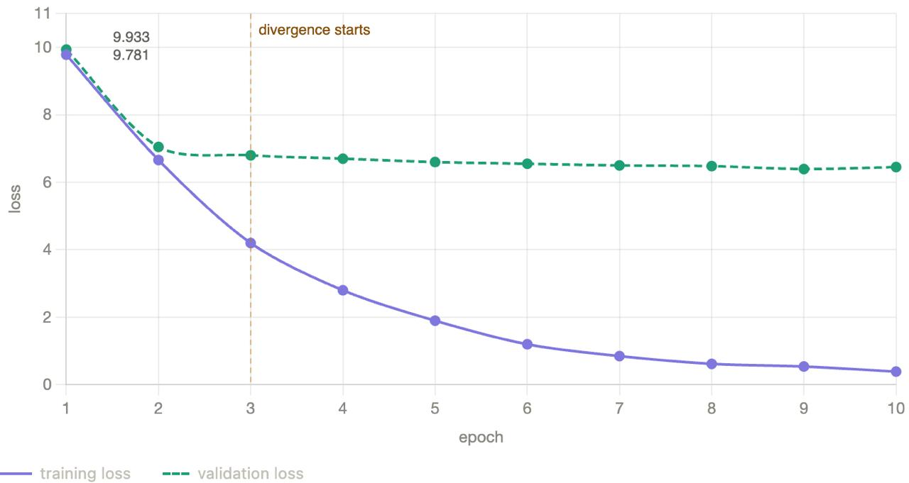

Both training and validation losses sharply decrease during the first epoch — a sign the model is learning. However, the losses start to diverge past the second epoch. The training loss continues to fall while the validation loss stagnates around 6.5. This is a sign that the model is still learning, but it is overfitting to the training set past epoch 2. This divergence and the fact that the validation loss is much larger than the training loss indicate that the model is overfitting to the training data.

The overfitting can be confirmed directly: searching for "quite insensible to the irony" in "The Verdict" text file finds it verbatim — the model memorised that passage rather than generalising from it.

```
┌─────────────────────────────────────────────────────────────────────┐
│  DIAGNOSING LOSS CURVE PATTERNS                                     │
│                                                                     │
│  Pattern                        Diagnosis                           │
│  ────────────────────────────   ──────────────────────────────────  │
│  Both losses fall together       healthy learning                   │
│  Train falls, val plateaus       overfitting — model memorising     │
│  Both losses plateau high        learning rate too low or bad init  │
│  Train loss rises                learning rate too high             │
│  Val loss lower than train       eval set is easier / shuffle bug   │
└─────────────────────────────────────────────────────────────────────┘
```

This memorisation is expected given the very small training dataset — 5 145 tokens across 10 epochs means the model sees the same text 10 times. Usually it is common to train a model on a much larger dataset for only one epoch, so the same text is never seen twice and cannot be memorised.

> **Note.** Interested readers can train the model on 60 000 public-domain books from Project Gutenberg, where this overfitting does not occur — see Appendix B for details.

---

## Key Takeaways

The training loop has four mandatory operations per batch: `zero_grad()` → `calc_loss_batch()` → `backward()` → `step()`. Everything else — tracking tokens, logging losses, generating sample text — is bookkeeping and monitoring.

`optimizer.zero_grad()` must come before `loss.backward()` every step. PyTorch's gradient accumulation default means skipping it causes incorrect, too-large weight updates and unstable training.

`model.train()` and `model.eval()` are not optional. Dropout is the concrete reason: active during training to prevent overfitting, disabled during evaluation to produce deterministic and reproducible loss estimates.

AdamW is preferred over vanilla Adam because it correctly decouples weight decay from the gradient moment estimates, achieving more effective regularisation. The `weight_decay=0.1` setting penalises large weights slightly each step, nudging the model toward simpler, more generalisable solutions.

Overfitting on "The Verdict" is expected — the dataset is tiny relative to the model's 124 million parameters. The training loop is verified to work correctly. Having completed the text generation, text evaluation, training/validation loss, and training function objectives, the next step is to cover text generation strategies to reduce training data memorisation and increase the originality of the LLM-generated text, before covering weight saving and loading and finally loading pretrained weights from OpenAI's GPT model.

---

## Extra notes

**GELU** and **AdamW** are completely different kinds of things operating at completely different parts of the architecture. Let me clear this up definitively.

---

### The Core Confusion

GELU and AdamW are not alternatives to each other. You cannot "use one instead of the other." They solve **different problems entirely**.

Think of it like this: when building a car, the **engine** and the **GPS navigation** are both important — but one powers the vehicle and the other guides the route. You use both. Similarly:

- **GELU** is an **activation function** — part of the model's architecture itself
- **AdamW** is an **optimizer** — part of the training procedure that adjusts the model's weights

---

### GELU — Where and What

GELU lives **inside the FeedForward network**, which lives inside every TransformerBlock. It was built in Chapter 4 (Section 4.3).

```
GPTModel
  └── TransformerBlock (×12)
        └── FeedForward
              ├── Linear(768 → 3072)
              ├── GELU          ← HERE — activation function
              └── Linear(3072 → 768)
```

Its job is to introduce **non-linearity** into the model. Without it, stacking 12 transformer blocks would mathematically collapse into a single linear transformation — no matter how deep you go, you'd learn nothing complex.

GELU is applied **during the forward pass** — every single time data flows through the network, whether you're training or generating text. It is a permanent part of the model structure. It has **no learnable parameters**. It is just a mathematical function:

$$\text{GELU}(x) = x \cdot \Phi(x)$$

applied element-wise to every number in the tensor.

---

### AdamW — Where and What

AdamW is used **during training only**, entirely outside the model architecture. It was introduced in Chapter 5 (Section 5.2).

Its job is to look at the **gradients** computed by backpropagation and decide **how much to update each weight** in the model.

```
Training loop:
  1. Forward pass → model produces output   (GELU fires here, inside FeedForward)
  2. Compute loss
  3. loss.backward() → gradients flow backward through every layer
  4. optimizer.step() → AdamW reads gradients, updates all weights   ← AdamW acts here
  5. optimizer.zero_grad() → clear gradients for next step
```

AdamW never "sees" the input data or the activations. It only sees the **gradients** — numbers that say "weight X should increase a little" or "weight Y should decrease a lot." AdamW decides _how_ to act on those signals (adjusting learning rates per parameter, applying weight decay, etc.).

During **inference** (text generation), AdamW is not involved at all. You don't even create an optimizer object when generating text.

---

### Side-by-side summary

|                      | **GELU**                                                  | **AdamW**                                 |
| -------------------- | --------------------------------------------------------- | ----------------------------------------- |
| **Type**             | Activation function                                       | Optimizer                                 |
| **Chapter**          | Chapter 4 (Section 4.3)                                   | Chapter 5 (Section 5.2)                   |
| **Lives in**         | Inside FeedForward, inside every TransformerBlock         | Outside the model entirely                |
| **Acts during**      | Every forward pass (training + inference)                 | Only during training, after backward pass |
| **Learns anything?** | No — fixed math function                                  | Tracks per-weight learning rate history   |
| **Purpose**          | Add non-linearity so the model can learn complex patterns | Adjust weights to minimize the loss       |

---

### One-line analogy

**GELU** is like the shape of the neurons in the brain — it determines how signals flow and transform.

**AdamW** is like the brain's learning mechanism — it decides which connections to strengthen or weaken after each experience.

You always need both. GELU makes the model expressive; AdamW makes the model learn.

# 3: Decoding Strategies to Control Randomness

> After training, the model often memorises passages from the training set verbatim — a direct consequence of training on a very small dataset for many epochs. The root cause is `generate_text_simple`: it always picks the single highest-probability token at every step, which produces identical output on every run. This section introduces two techniques — temperature scaling and top-k sampling — that replace or modify that deterministic token selection, giving the model genuine variety and originality in its outputs.

---

## The problem with greedy decoding

`generate_text_simple` from Chapter 4 always picks the token with the highest probability at every step — greedy decoding. It is simple and deterministic, but it has two concrete problems.

The first is **local optimality**. Greedy choices are optimal for the current step but can lead to worse sequences overall:

```
┌─────────────────────────────────────────────────────────────────────┐
│              WHY GREEDY IS NOT GLOBALLY OPTIMAL                     │
│                                                                     │
│  Step 1 probabilities:                                              │
│    "the"  → 0.24   ← greedy picks this                             │
│    "a"    → 0.18                                                    │
│                                                                     │
│  Step 2, given "...the":    best continuation prob → 0.05          │
│  Step 2, given "...a":      best continuation prob → 0.35          │
│                                                                     │
│  Greedy path joint probability:     0.24 × 0.05 = 0.012            │
│  Non-greedy path joint probability: 0.18 × 0.35 = 0.063            │
│                                                                     │
│  The greedy path was worse by a factor of 5.                        │
└─────────────────────────────────────────────────────────────────────┘
```

The "5 times worse" comes from dividing the two joint probabilities:

$$\frac{0.063}{0.012} = 5.25 \approx 5$$

The key insight is that **joint probability multiplies**. When two steps are strung together, the overall probability of that sequence is the product of each step's probability. So even though "the" looked like the better choice at step 1 (0.24 vs 0.18), it led into a poor neighbourhood at step 2 — the best word that could follow it had only 5% probability. "A" opened up far richer continuations at 35%.

A concrete dry-run with named tokens:

```
Step 1: pick "the"  (prob 0.24)
Step 2: best word following "the" → say "cat"  (prob 0.05)
Full sequence: "...the cat"         joint prob = 0.24 × 0.05 = 0.012

Step 1: pick "a"    (prob 0.18)
Step 2: best word following "a"   → say "magnificent"  (prob 0.35)
Full sequence: "...a magnificent"   joint prob = 0.18 × 0.35 = 0.063
```

Greedy has no lookahead — it cannot know that "the" leads somewhere bad until it is already there. A locally suboptimal first token can compound into a globally better sequence if it opens up high-probability continuations.

The second problem is **determinism**. Given the same prompt, greedy decoding always produces exactly the same output. There is no variation, no creativity — calling the function ten times gives ten identical strings. This is why the trained model always reproduces the same memorised passage.

To demonstrate both problems, the book moves the model back to CPU and puts it into evaluation mode before running inference:

```python
model.to("cpu")
model.eval()
```

`model.to("cpu")` is used because inference on a small model does not require a GPU. `model.eval()` disables dropout, making the forward pass fully deterministic. This is the correct setup for inference regardless of which decoding strategy is used.

Running `generate_text_simple` on the prompt "Every effort moves you":

```python
tokenizer = tiktoken.get_encoding("gpt2")
token_ids = generate_text_simple(
    model=model,
    idx=text_to_token_ids("Every effort moves you", tokenizer),
    max_new_tokens=25,
    context_size=GPT_CONFIG_124M["context_length"]
)
print("Output text:\n", token_ids_to_text(token_ids, tokenizer))
```

Output:

```
Every effort moves you know," was one of the axioms he laid down across the
Sevres and silver of an exquisitely appointed lun
```

This is a verbatim passage from the training corpus. Run the same function again and it produces the exact same output — always, without exception. The determinism problem is on full display.

Temperature scaling and top-k sampling address both problems without requiring any retraining.

---

## Probabilistic sampling with `torch.multinomial`

The first fix is to replace `argmax` with a function that samples proportionally from the probability distribution rather than always picking the maximum.

To make the mechanism concrete, the book introduces a tiny 9-token vocabulary:

```python
vocab = {
    "closer": 0, "every": 1, "effort": 2, "forward": 3,
    "inches": 4, "moves": 5,  "pizza": 6, "toward": 7, "you": 8
}
inverse_vocab = {v: k for k, v in vocab.items()}
```

Given the context "every effort moves you", the model produces these logits:

```python
next_token_logits = torch.tensor(
    [4.51, 0.89, -1.90, 6.75, 1.63, -1.62, -1.89, 6.28, 1.79]
)
```

Under greedy decoding, `argmax(softmax(logits))` always returns index 3 → "forward", because it has the highest logit (6.75).

Replacing `argmax` with `torch.multinomial` changes the selection rule:

```python
probas = torch.softmax(next_token_logits, dim=0)

# greedy — always "forward"
next_token_id = torch.argmax(probas).item()

# probabilistic — samples proportional to probability
torch.manual_seed(123)
next_token_id = torch.multinomial(probas, num_samples=1).item()
```

`torch.multinomial` draws a sample where the probability of selecting token $i$ equals $p_i$. "Forward" still wins most of the time — its probability is highest — but other tokens get selected proportionally.

Running this 1,000 times with `print_sampled_tokens` reveals the sampling distribution:

```python
def print_sampled_tokens(probas):
    torch.manual_seed(123)
    sample = [torch.multinomial(probas, num_samples=1).item()
              for i in range(1_000)]
    sampled_ids = torch.bincount(torch.tensor(sample))
    for i, freq in enumerate(sampled_ids):
        print(f"{freq} x {inverse_vocab[i]}")

print_sampled_tokens(probas)
```

```
 73 x closer
  0 x every
  0 x effort
582 x forward
  2 x inches
  0 x moves
  0 x pizza
343 x toward
```

"Forward" is chosen 582 times, "toward" 343 times, "closer" 73 times. The model now occasionally generates "every effort moves you toward" or "every effort moves you closer" instead of always the same memorised phrase.

### How `torch.multinomial` works internally

It is worth understanding the mechanism that makes sampling proportional to probability, rather than treating `multinomial` as a black box.

Internally, `torch.multinomial` uses **inverse CDF sampling** (also called the inverse transform method). Given a probability vector $\mathbf{p} = [p_0, p_1, \ldots, p_{n-1}]$, it proceeds in three steps:

**Step 1 — build the cumulative distribution function (CDF).** Sum the probabilities from left to right to produce a running total. Each entry $F_i$ represents the total probability mass of all tokens up to and including index $i$:

$$F_i = \sum_{j=0}^{i} p_j$$

For our 9-token example, the probabilities after softmax are approximately:

```
token     prob     cumulative (CDF)
closer    0.073    0.073
every     0.006    0.079
effort    0.000    0.079
forward   0.582    0.661   ← large jump
inches    0.012    0.673
moves     0.000    0.673
pizza     0.000    0.673
toward    0.320    0.993
you       0.007    1.000
```

**Step 2 — draw a uniform random number** $u \sim \text{Uniform}(0, 1)$.

**Step 3 — find which bucket $u$ falls into.** Return the smallest index $i$ such that $F_i \geq u$:

```
if u = 0.45  → lands in [0.079, 0.661)  → index 3  → "forward"
if u = 0.72  → lands in [0.661, 0.993)  → index 7  → "toward"
if u = 0.03  → lands in [0.000, 0.073)  → index 0  → "closer"
```

Each token "owns" a segment of the $[0, 1]$ interval proportional to its probability. A token with probability 0.582 owns 58.2% of the interval and gets hit by a random $u$ 58.2% of the time. A token with probability 0.000 owns no interval and is never selected. This is why the observed sampling frequencies converge to the softmax probabilities as the number of samples grows — the CDF construction guarantees it exactly.


---

## Temperature scaling

Probabilistic sampling introduces variety, but the degree of variety is fixed by the raw softmax probabilities. Temperature scaling adds a dial that controls how sharp or flat the distribution is before sampling.

### The formula

The operation is a single division applied to the logits before softmax:

$$p_i = \frac{\exp(z_i / T)}{\sum_j \exp(z_j / T)}$$

```python
def softmax_with_temperature(logits, temperature):
    scaled_logits = logits / temperature
    return torch.softmax(scaled_logits, dim=0)
```

Why divide the logits and not the probabilities? Because softmax is non-linear — dividing the output probabilities would not produce the same sharpening/flattening effect. The clean mathematical behaviour only works when you divide the pre-softmax scores.

### Why division sharpens or flattens

When $T < 1$, dividing logits by $T$ makes them larger in magnitude. Larger differences between logits → more extreme probabilities after softmax → sharper, more peaked distribution.

When $T > 1$, dividing brings logits closer together. Smaller differences → probabilities closer to uniform → flatter distribution.

A concrete dry-run with three tokens:

```
Logits: [2.0, 1.0, 0.1]

T = 1.0:
  scaled: [2.0, 1.0, 0.1]
  exp:    [7.39, 2.72, 1.11]   sum = 11.22
  probs:  [0.659, 0.242, 0.099]

T = 0.5:
  scaled: [4.0, 2.0, 0.2]
  exp:    [54.6, 7.39, 1.22]   sum = 63.21
  probs:  [0.864, 0.117, 0.019]   ← much more peaked

T = 2.0:
  scaled: [1.0, 0.5, 0.05]
  exp:    [2.72, 1.65, 1.05]   sum = 5.42
  probs:  [0.501, 0.304, 0.194]   ← much more uniform
```

### The three cases

```
┌─────────────────────────────────────────────────────────────────────┐
│              TEMPERATURE — EFFECT ON PROBABILITY DISTRIBUTION       │
│                                                                     │
│  T = 0.1  (low — sharper):                                         │
│    Top token gets probability ≈ 0.98                                │
│    Almost all probability mass on one token                         │
│    Behaviour approaches argmax (near-deterministic)                 │
│                                                                     │
│  T = 1.0  (neutral — unchanged):                                   │
│    Probabilities as the model learned them                          │
│    "forward" selected roughly 60% of the time                      │
│                                                                     │
│  T = 5.0  (high — flatter):                                        │
│    Probabilities become more uniform across tokens                  │
│    "forward" falls to ~28%, "pizza" appears ~4% of the time        │
│                                                                     │
│  Low T  →  concentrated  →  confident but repetitive               │
│  High T →  spread out    →  creative but potentially incoherent    │
└─────────────────────────────────────────────────────────────────────┘
```


---

## Top-k sampling

Temperature scaling alone has a flaw: by flattening the distribution, it can give non-trivial probability to tokens that are genuinely irrelevant — including ones the model has very little reason to predict, like "pizza" in a literary context. The result is occasional nonsense regardless of how carefully temperature is tuned.

Top-k sampling addresses this by restricting the candidate pool before sampling. Only the $k$ tokens with the highest logits are eligible. All others are masked to $-\infty$ before softmax is applied.

```
┌─────────────────────────────────────────────────────────────────────┐
│              TOP-K SAMPLING — WHAT IT DOES  (k = 3)                │
│                                                                     │
│  Full logits (9-token vocab):                                       │
│    closer  → 4.51   ← keep (3rd highest)                           │
│    every   → 0.89   ← mask                                         │
│    effort  → -1.90  ← mask                                         │
│    forward → 6.75   ← keep (1st highest)                           │
│    inches  → 1.63   ← mask                                         │
│    moves   → -1.62  ← mask                                         │
│    pizza   → -1.89  ← mask  (can never be sampled)                 │
│    toward  → 6.28   ← keep (2nd highest)                           │
│    you     → 1.79   ← mask                                         │
│                                                                     │
│  After masking:  [4.51, -inf, -inf, 6.75, -inf, -inf, -inf,        │
│                   6.28, -inf]                                       │
│                                                                     │
│  After softmax:  [0.06,  0.00, 0.00, 0.58,  0.00, 0.00, 0.00,     │
│                   0.36,  0.00]   → sum = 1.00 ✓                    │
└─────────────────────────────────────────────────────────────────────┘
```

The reason $-\infty$ works exactly is that $e^{-\infty} = 0$, so the softmax numerator for any masked token is exactly zero — not approximately zero, but precisely zero. The surviving probabilities are renormalised to sum to 1 across only the top-k positions.

```python
top_k = 3
top_logits, top_pos = torch.topk(next_token_logits, top_k)
# Top logits: tensor([6.7500, 6.2800, 4.5100])
# Top positions: tensor([3, 7, 0])  → forward, toward, closer

new_logits = torch.where(
    condition=next_token_logits < top_logits[-1],
    input=torch.tensor(float('-inf')),
    other=next_token_logits
)
# tensor([4.5100, -inf, -inf, 6.7500, -inf, -inf, -inf, 6.2800, -inf])

topk_probas = torch.softmax(new_logits, dim=0)
# tensor([0.0615, 0.0000, 0.0000, 0.5775, 0.0000, 0.0000, 0.0000, 0.3610, 0.0000])
```

Only three tokens have non-zero probability. Their probabilities sum to 1.0. "Pizza" and every other low-logit token can never be selected, regardless of temperature.

This masking trick is the same one used in the causal attention module from Chapter 3 (section 3.5.1) — future positions were masked to $-\infty$ so that softmax assigned them zero attention weight. The mechanism is identical here.


---

## The new `generate` function

The book combines both techniques into a new `generate` function that replaces `generate_text_simple`. The signature adds three new parameters:

```python
def generate(model, idx, max_new_tokens, context_size,
             temperature=0.0, top_k=None, eos_id=None):
```

The function iterates token-by-token as before, but each iteration passes through up to four conditional branches before appending the new token:

```python
for _ in range(max_new_tokens):
    idx_cond = idx[:, -context_size:]
    with torch.no_grad():
        logits = model(idx_cond)
    logits = logits[:, -1, :]           # (batch, vocab_size)

    # Branch 1 — top-k masking (optional)
    if top_k is not None:
        top_logits, _ = torch.topk(logits, top_k)
        min_val = top_logits[:, -1]
        logits = torch.where(
            logits < min_val,
            torch.tensor(float('-inf')).to(logits.device),
            logits
        )

    # Branch 2 & 3 — temperature scaling or greedy fallback
    if temperature > 0.0:
        logits = logits / temperature
        probs = torch.softmax(logits, dim=-1)
        idx_next = torch.multinomial(probs, num_samples=1)
    else:
        idx_next = torch.argmax(logits, dim=-1, keepdim=True)

    # Branch 4 — early stopping on end-of-sequence token
    if idx_next == eos_id:
        break

    idx = torch.cat((idx, idx_next), dim=1)

return idx
```


### What each branch does

**Branch 1 — top-k masking.** When `top_k` is not `None`, logits below the k-th highest value are replaced with $-\infty$ before any subsequent step. This happens first so that temperature scaling and sampling operate only over the surviving candidates.

**Branch 2 — temperature + multinomial.** When `temperature > 0.0`, logits are divided by the temperature, passed through softmax to get probabilities, then `torch.multinomial` draws one sample. This is the probabilistic path.

**Branch 3 — greedy fallback.** When `temperature = 0.0` (the default), `torch.argmax` is used instead. This exactly replicates the behaviour of `generate_text_simple`, providing a clean deterministic fallback with no code duplication.

**Branch 4 — EOS early stopping.** The `eos_id` parameter allows generation to terminate before reaching `max_new_tokens` if the model produces an end-of-sequence token. For GPT-2, this is token ID 50256 (`<|endoftext|>`). If `eos_id=None` (the default), this branch is never triggered and generation always runs for the full `max_new_tokens` steps.

### Order of operations

Top-k filtering happens before temperature scaling, and both happen before softmax. The order matters:

```
┌─────────────────────────────────────────────────────────────────────┐
│              ORDER OF OPERATIONS IN generate()                      │
│                                                                     │
│  logits  (batch, vocab_size)   raw model output                    │
│      ↓  top-k masking  (non-top-k set to -inf)                     │
│      ↓  divide by temperature                                       │
│      ↓  softmax                                                     │
│  probs   top-k tokens have valid probability, rest are 0            │
│      ↓  multinomial sample                                          │
│  idx_next  (batch, 1)   one token drawn                             │
└─────────────────────────────────────────────────────────────────────┘
```

Running the new function with `top_k=25` and `temperature=1.4`:

```python
torch.manual_seed(123)
token_ids = generate(
    model=model,
    idx=text_to_token_ids("Every effort moves you", tokenizer),
    max_new_tokens=15,
    context_size=GPT_CONFIG_124M["context_length"],
    top_k=25,
    temperature=1.4
)
print("Output text:\n", token_ids_to_text(token_ids, tokenizer))
# Output: Every effort moves you stand to work on surprise, a one of us had gone with random
```

This output is novel — it is not a memorised passage from the training set. The model is generating, not reciting.

---

## How temperature and top-k interact

The two parameters work together rather than independently. Top-k limits which tokens can be sampled; temperature controls the probability distribution over that limited pool.


```
┌─────────────────────────────────────────────────────────────────────┐
│              (TEMPERATURE, TOP-K) COMBINATION EFFECTS               │
│                                                                     │
│  Low T + low k   → safe, repetitive. Code gen, factual Q&A         │
│  Low T + high k  → confident picks from a wider candidate pool     │
│  High T + low k  → forced variety from a narrow pool               │
│  High T + high k → max diversity, risk of incoherence              │
└─────────────────────────────────────────────────────────────────────┘
```

The practical sweet spot for creative text generation is usually `temperature` in the range 0.7–1.4 combined with `top_k` between 20 and 50. Lower temperature and k for factual tasks; higher for creative ones. When tuning: raise $k$ before raising $T$ — a larger candidate pool at moderate temperature is safer than a small pool at extreme temperature.

---

## When and how model stops generating text

There are **three different ways** generation can stop, and they are completely independent of each other.

---

### Stopping condition 1 — `max_new_tokens` (always active)

This is the hard ceiling. You tell the function "generate at most N new tokens" and it simply counts. When it hits N, the loop ends. No questions asked.

```python
for _ in range(max_new_tokens):   # counts down from N to 0
    ...
    idx = torch.cat((idx, idx_next), dim=1)

return idx   # loop exhausted, return whatever we have
```

Small example — `max_new_tokens=3`, prompt = "The cat":

```
Iteration 1: model picks "sat"   → sequence = "The cat sat"
Iteration 2: model picks "on"    → sequence = "The cat sat on"
Iteration 3: model picks "the"   → sequence = "The cat sat on the"
Loop ends. Return. Done.
```

The model had no say in stopping. You stopped it at 3. This is the only stopping condition in `generate_text_simple` from Chapter 4 — there is no other mechanism there.

---

### Stopping condition 2 — `eos_id` (optional, needs fine-tuning)

This is the model deciding for itself that it is done. There is a special token in the vocabulary called the **end-of-sequence token**. For GPT-2 it is token ID 50256, represented as `<|endoftext|>`.

```python
if idx_next == eos_id:
    break
```

If the model generates that token, the loop breaks immediately — even if `max_new_tokens` has not been reached yet.

Small example — `max_new_tokens=100`, `eos_id=50256`, prompt = "The cat":

```
Iteration 1: model picks "sat"          → "The cat sat"
Iteration 2: model picks "on"           → "The cat sat on"
Iteration 3: model picks "the"          → "The cat sat on the"
Iteration 4: model picks "mat"          → "The cat sat on the mat"
Iteration 5: model picks <|endoftext|>  → idx_next == eos_id → BREAK
Return "The cat sat on the mat"
```

Generation stopped at iteration 5 even though you allowed 100 tokens. The model signalled it was done.

**The important catch:** this only works if the model was trained to produce `<|endoftext|>` at natural stopping points. The base GPT-2 model we trained from scratch on "The Verdict" was NOT trained this way — it just learned to continue text, not to end it. So passing `eos_id=50256` to our model would either never trigger (the model rarely produces that token) or trigger at a random meaningless point. This is why `eos_id=None` is the default and why the book does not use it in the pretraining chapter. It becomes relevant later during fine-tuning, where the model is specifically trained to emit `<|endoftext|>` at the right moments.

---

### Stopping condition 3 — `max_new_tokens` as a safety net

In practice these two conditions are used together:

```python
token_ids = generate(
    model=model,
    idx=...,
    max_new_tokens=200,   # "don't go beyond 200 tokens no matter what"
    eos_id=50256          # "but stop early if the model says it's done"
)
```

Whichever fires first wins. `eos_id` is the natural stop; `max_new_tokens` is the safety net in case the model never produces the EOS token.

---

### Summary

```
Who stops generation?   How?                        When active?
─────────────────────   ─────────────────────────   ─────────────────
You (the caller)        max_new_tokens counter       Always — no way to disable
The model itself        produces eos_id token        Only if eos_id is passed AND
                                                     model was trained to use it
```

So to directly answer your question — **the model by itself does not inherently know when to stop**. In the base pretraining setup we have right now, it never stops on its own. You stop it by setting `max_new_tokens`. The model learning to stop itself is a behaviour that gets taught during fine-tuning, not pretraining.

---

## Key gotchas

`temperature=0.0` is the greedy fallback, not "no temperature". Setting it to zero activates `argmax`, not `softmax`. The zero is a sentinel value checked by the `if temperature > 0.0` branch.

`argmax(softmax(logits)) == argmax(logits)` always. Softmax is monotone — it preserves the ordering of values. You never need softmax before argmax; the book includes it for conceptual clarity, but production code skips it.

Top-k and temperature apply to the logits, not the probabilities. The division in temperature scaling and the $-\infty$ masking in top-k both happen before softmax. Applying these operations after softmax would have fundamentally different and usually wrong effects.

The `eos_id` parameter is `None` by default, so generation always runs for `max_new_tokens` steps unless explicitly configured. In fine-tuned or instruction-following models, passing `eos_id=50256` allows the model to terminate naturally.

Neither temperature nor top-k requires any change to the model weights. They operate purely on the logit output during inference. The same trained model can produce deterministic, conservative, or creative text simply by adjusting these parameters at call time.

# 4. Loading and Saving Model Weights in PyTorch

> **This section covers:** Why saving model state matters, what `state_dict` is and what it contains, saving and loading model weights with `torch.save` and `torch.load`, why the optimizer state must also be saved to resume training correctly, and the full save/load pattern for checkpointing.

---

## Why Saving State Matters

Training a model like GPT-2 small on real data takes hours to days. Two practical situations make saving state essential:

```
┌─────────────────────────────────────────────────────────────────────┐
│              TWO REASONS TO SAVE MODEL STATE                        │
│                                                                     │
│  1. INTERRUPTION                                                    │
│     Training crashes, machine shuts down, cloud instance expires.  │
│     Without a checkpoint, all progress is lost and training        │
│     must restart from random weights.                               │
│                                                                     │
│  2. DEPLOYMENT                                                      │
│     A trained model needs to be loaded on a different machine,     │
│     in a different process, or at a later time for inference.      │
│     The model must be serialised to disk and deserialised later.   │
└─────────────────────────────────────────────────────────────────────┘
```

Both cases require saving not just the model weights but also the optimizer state, so that training can resume from exactly where it left off.

---

## The simple save and load pattern

The book introduces saving with the simplest case first — saving model weights only, with a single line:

```python
torch.save(model.state_dict(), "model.pth")
```

`"model.pth"` is the filename. The `.pth` extension is a convention for PyTorch files — PyTorch does not enforce it and any extension works.

Loading the weights back requires two steps: instantiate a fresh model with the same architecture, then overwrite its random weights with the saved ones:

```python
model = GPTModel(GPT_CONFIG_124M)
model.load_state_dict(torch.load("model.pth", map_location=device))
model.eval()
```

This pattern is sufficient for inference — loading a trained model to run `generate` without any intention of continuing training. The `map_location=device` argument is explained below. The more complete pattern that also saves the optimizer state is needed only when training will be resumed.

---

## What state_dict Contains

PyTorch models expose their trainable parameters through a method called `state_dict()`. It returns an `OrderedDict` mapping layer names to their weight tensors:

```python
print(model.state_dict())
```

```
OrderedDict([
  ('tok_emb.weight',          tensor([[...]]) ),   # shape: (50257, 768)
  ('pos_emb.weight',          tensor([[...]]) ),   # shape: (1024,  768)
  ('trf_blocks.0.att.W_query.weight', tensor(...)),
  ('trf_blocks.0.att.W_query.bias',   tensor(...)),
  ...
  ('final_norm.scale',        tensor([...]) ),
  ('out_head.weight',         tensor([[...]]) ),
])
```

Every key is the dotted path to a parameter in the module hierarchy. Every value is the tensor holding the current learned values for that parameter. The `state_dict` is a complete snapshot of everything the model has learned.

The optimizer also has a `state_dict`, but its contents are different — it stores the running moment estimates (first and second moments for AdamW) that the optimizer maintains per parameter to adapt the learning rate. These are not model weights but they are essential for resuming training faithfully.

---

## Saving Model and Optimizer State

```python
torch.save({
    "model_state_dict":     model.state_dict(),
    "optimizer_state_dict": optimizer.state_dict(),
}, "model_and_optimizer.pth")
```

`torch.save` serialises any Python object to disk using Python's `pickle` format. The `.pth` extension is a convention for PyTorch checkpoint files — it is not enforced by PyTorch itself.

Saving both states together in one dictionary is the standard pattern. It keeps the two related objects in a single file and makes it impossible to accidentally load a model checkpoint with a mismatched optimizer checkpoint.

---

## Loading Model and Optimizer State

```python
checkpoint = torch.load("model_and_optimizer.pth", weights_only=True)

model = GPTModel(GPT_CONFIG_124M)
model.load_state_dict(checkpoint["model_state_dict"])

optimizer = torch.optim.AdamW(model.parameters(), lr=5e-4, weight_decay=0.1)
optimizer.load_state_dict(checkpoint["optimizer_state_dict"])

model.train()
```

The loading sequence has a fixed order that matters:

```
┌─────────────────────────────────────────────────────────────────────┐
│              CORRECT LOADING ORDER                                  │
│                                                                     │
│  Step 1: torch.load()                                               │
│          Deserialise the checkpoint dictionary from disk            │
│                      ↓                                              │
│  Step 2: GPTModel(config)                                           │
│          Instantiate a fresh model with the same architecture       │
│          (random weights — just the skeleton)                       │
│                      ↓                                              │
│  Step 3: model.load_state_dict(...)                                 │
│          Overwrite the random weights with the saved ones           │
│                      ↓                                              │
│  Step 4: AdamW(model.parameters(), ...)                             │
│          Instantiate a fresh optimizer with the same hyperparameters│
│                      ↓                                              │
│  Step 5: optimizer.load_state_dict(...)                             │
│          Restore the moment estimates so AdamW resumes correctly    │
│                      ↓                                              │
│  Step 6: model.train()                                              │
│          Switch to training mode before resuming the loop           │
└─────────────────────────────────────────────────────────────────────┘
```

### Why the Architecture Must Be Instantiated First

`load_state_dict` is not a constructor — it cannot create a model from a file alone. It copies saved tensor values into the parameter slots of an already-existing model. The model architecture (number of layers, embedding dimensions, attention heads) must match exactly between what was saved and what is being loaded into. If they differ, PyTorch raises a `RuntimeError` listing the mismatched keys.

### weights_only=True

The `weights_only=True` argument tells `torch.load` to only deserialise tensor data, refusing to unpickle arbitrary Python objects. This is a security measure: a malicious `.pth` file could otherwise execute arbitrary code during loading. For checkpoints that contain only tensors and standard Python types — which all well-formed model checkpoints do — `weights_only=True` is the safe default.

`map_location=device` tells PyTorch where to place the loaded tensors. If the model was saved on a GPU machine and is being loaded on a CPU machine (or vice versa), PyTorch will raise an error without this argument because the saved tensor locations no longer exist on the current hardware. Passing `map_location=device` remaps all tensors to whatever device is currently available, making checkpoints portable across machines.

### Why the Optimizer State Matters for Resumption

AdamW maintains two running statistics per parameter:

$$m_t = \beta_1 m_{t-1} + (1 - \beta_1) g_t \quad \text{(first moment — mean of gradients)}$$
$$v_t = \beta_2 v_{t-1} + (1 - \beta_2) g_t^2 \quad \text{(second moment — variance of gradients)}$$

These moments encode the training history — which parameters have been receiving large consistent gradients and which have not. If the optimizer is restored from fresh zero-initialised moments, it behaves as if training is just starting: large initial steps, incorrect effective learning rates per parameter, and a few unstable update steps before the moments catch up. Loading the saved optimizer state avoids this disruption entirely.

```
┌─────────────────────────────────────────────────────────────────────┐
│              WHAT HAPPENS IF OPTIMIZER STATE IS NOT SAVED           │
│                                                                     │
│  Training at step 10 000:                                           │
│    Parameter A: small gradient history → small effective lr        │
│    Parameter B: large gradient history → large effective lr        │
│                                                                     │
│  Resume from checkpoint without optimizer state:                    │
│    Both parameters start with zeroed moments                        │
│    Effective learning rate reverts to initial warm-up behaviour     │
│    Loss may spike temporarily before stabilising                   │
│                                                                     │
│  Resume from checkpoint WITH optimizer state:                       │
│    Moments are exactly as they were at step 10 000                  │
│    Training continues smoothly from where it left off              │
└─────────────────────────────────────────────────────────────────────┘
```

---

## Saving Weights Only — For Inference

When the goal is deployment rather than resuming training, only the model weights are needed:

```python
# Save weights only
torch.save(model.state_dict(), "model_weights_only.pth")

# Load for inference
model = GPTModel(GPT_CONFIG_124M)
model.load_state_dict(
    torch.load("model_weights_only.pth", weights_only=True)
)
model.eval()
```

This produces a smaller file (no optimizer moments) and is all that is needed for running `generate`. The `model.eval()` call at the end is mandatory before inference — it disables dropout so that generation is deterministic.

---

## Key Takeaways

`state_dict` is an `OrderedDict` mapping parameter names to tensors. It is a complete, portable snapshot of everything the model has learned. It does not include the model architecture — the architecture must be reinstantiated separately before `load_state_dict` can be called.

Always save both model and optimizer state when checkpointing during training. The optimizer's running moment estimates are training history; discarding them forces AdamW to rebuild that history from scratch, causing unstable updates at the resumption point.

`weights_only=True` in `torch.load` is the safe default for all standard checkpoints. It prevents arbitrary code execution during deserialisation.

For inference-only deployment, only the model `state_dict` needs to be saved. The optimizer state can be omitted, reducing the file size roughly in half.

---

_Section 5.4 complete. Section 5.5 uses this same loading machinery to bring in the real GPT-2 weights released by OpenAI — bypassing the expensive pretraining step entirely and giving the model the ability to generate coherent English immediately._

# 5: Loading Pretrained Weights from OpenAI

> **This section covers:** Why loading pretrained weights is preferable to training from scratch for most purposes, downloading GPT-2 weights using the `gpt2` Python package, the architectural differences between OpenAI's naming conventions and the `GPTModel` implementation, manually mapping and copying each weight tensor into the correct parameter slot, handling the transposed weight convention for linear layers, and verifying the loaded model generates coherent English text.

---

## Why load pretrained weights

Pretraining GPT-2 small (124M parameters) from scratch on real data required hundreds of gigabytes of text and significant compute — estimated at thousands of GPU-hours. The entire point of releasing pretrained weights is that no one else needs to repeat that expense. The same `GPTModel` architecture built in Chapter 4 can be loaded with OpenAI's trained parameter values and immediately generates coherent English, without a single gradient step.

```
┌─────────────────────────────────────────────────────────────────────┐
│              TWO PATHS TO A WORKING MODEL                           │
│                                                                     │
│  PATH A — Train from scratch (what Chapter 5.2 did):               │
│    Random weights → training loop on "The Verdict" → overfit model  │
│    Result: coherent-ish on training data, poor generalisation       │
│    Cost: minutes on a small story, months on real pretraining data  │
│                                                                     │
│  PATH B — Load pretrained weights (this section):                  │
│    Random weights → copy OpenAI tensors into matching slots         │
│    Result: immediate coherent English generation                    │
│    Cost: one download + a few seconds of tensor copying             │
└─────────────────────────────────────────────────────────────────────┘
```

This is also the realistic workflow for fine-tuning (Chapters 6 and 7): start from pretrained weights, then train further on a small task-specific dataset. Starting from scratch for fine-tuning would be both wasteful and likely to produce worse results.

---

## Downloading the GPT-2 weights

OpenAI released four sizes of GPT-2. The book works with the smallest:

```
┌──────────────────────────────────────────────────────────────────────┐
│              GPT-2 MODEL SIZES                                       │
│                                                                      │
│  Model          Parameters    Layers    Heads    Embedding dim       │
│  ───────────    ──────────    ──────    ─────    ─────────────       │
│  gpt2           124M          12        12       768                 │
│  gpt2-medium    355M          24        16       1024                │
│  gpt2-large     774M          36        20       1280                │
│  gpt2-xl        1558M         48        25       1600                │
│                                                                      │
│  This chapter uses "gpt2" (124M) — identical architecture to        │
│  GPT_CONFIG_124M from Chapter 4, with one config change:            │
│  context_length updated from 256 → 1024                             │
└──────────────────────────────────────────────────────────────────────┘
```

OpenAI originally saved the GPT-2 weights via TensorFlow, which must be installed to load the weights in Python. The `tqdm` library is also needed to track the download progress:

```python
pip install tensorflow>=2.15.0 tqdm>=4.66
```

The download helper itself is not a standard library — it is a Python module fetched directly from the book's GitHub repository:

```python
import urllib.request
url = (
    "https://raw.githubusercontent.com/rasbt/"
    "LLMs-from-scratch/main/ch05/"
    "01_main-chapter-code/gpt_download.py"
)
filename = url.split('/')[-1]
urllib.request.urlretrieve(url, filename)
```

After downloading, briefly inspect the file to confirm it contains valid Python code before importing from it.

With the helper in place, the download and load call is:

```python
from gpt_download import download_and_load_gpt2

settings, params = download_and_load_gpt2(
    model_size="124M",
    models_dir="gpt2"
)
```

`settings` is a dictionary of model hyperparameters read from the checkpoint. `params` is a nested dictionary of NumPy arrays, one per weight tensor. The download happens once; subsequent calls load from the cached local directory.

After downloading, inspect the contents of `settings` and `params` to confirm the download succeeded:

```python
print("Settings:", settings)
print("Parameter dictionary keys:", params.keys())
```

Output:

```
Settings: {'n_vocab': 50257, 'n_ctx': 1024, 'n_embd': 768, 'n_head': 12, 'n_layer': 12}
Parameter dictionary keys: dict_keys(['blocks', 'b', 'g', 'wpe', 'wte'])
```

`settings` mirrors the architecture config — the same values as `GPT_CONFIG_124M`. `params` has five top-level keys: `blocks` (the 12 transformer blocks), `b` and `g` (the final LayerNorm shift and scale), `wpe` (positional embeddings), and `wte` (token embeddings). The token embedding weights can be inspected directly:

```python
print("Token embedding weight tensor dimensions:", params["wte"].shape)
# Token embedding weight tensor dimensions: (50257, 768)
```

To transfer the downloaded weights into a `GPTModel` instance, the book defines a `model_configs` dictionary covering all four GPT-2 sizes, then builds `NEW_CONFIG` from it with three explicit updates:

```python
model_configs = {
    "gpt2-small (124M)":  {"emb_dim": 768,  "n_layers": 12, "n_heads": 12},
    "gpt2-medium (355M)": {"emb_dim": 1024, "n_layers": 24, "n_heads": 16},
    "gpt2-large (774M)":  {"emb_dim": 1280, "n_layers": 36, "n_heads": 20},
    "gpt2-xl (1558M)":    {"emb_dim": 1600, "n_layers": 48, "n_heads": 25},
}

model_name = "gpt2-small (124M)"
NEW_CONFIG = GPT_CONFIG_124M.copy()
NEW_CONFIG.update(model_configs[model_name])   # update emb_dim, n_layers, n_heads
NEW_CONFIG.update({"context_length": 1024})    # GPT-2 was trained on 1024 tokens, not 256
NEW_CONFIG.update({"qkv_bias": True})          # OpenAI used bias vectors in QKV projections
```

The `context_length` update is necessary because the book used 256 tokens in training for computational convenience; the real GPT-2 was trained with 1024. The `qkv_bias` update is necessary because bias vectors in the attention projections are not common in modern LLMs, but OpenAI used them — the architecture must match the checkpoint exactly or `load_state_dict` will raise a shape mismatch error.

```python
gpt = GPTModel(NEW_CONFIG)
gpt.eval()
```

---

## The architecture mismatch problem

OpenAI's checkpoint uses different naming conventions from the `GPTModel` implementation. The weights exist and are correct — they just need to be mapped to the right parameter slots. The mapping is not automatic; it must be done manually.

```
┌─────────────────────────────────────────────────────────────────────┐
│              NAMING CONVENTION DIFFERENCES                          │
│                                                                      │
│  OpenAI checkpoint key          GPTModel parameter path             │
│  ─────────────────────────      ────────────────────────────────    │
│  wte                            tok_emb.weight                      │
│  wpe                            pos_emb.weight                      │
│  h.{i}.ln_1.g                   trf_blocks.{i}.norm1.scale          │
│  h.{i}.ln_1.b                   trf_blocks.{i}.norm1.shift          │
│  h.{i}.attn.c_attn.w            trf_blocks.{i}.att.W_query/key/val  │
│  h.{i}.attn.c_attn.b            trf_blocks.{i}.att.W_query/key/val  │
│  h.{i}.attn.c_proj.w            trf_blocks.{i}.att.out_proj.weight  │
│  h.{i}.attn.c_proj.b            trf_blocks.{i}.att.out_proj.bias    │
│  h.{i}.ln_2.g                   trf_blocks.{i}.norm2.scale          │
│  h.{i}.ln_2.b                   trf_blocks.{i}.norm2.shift          │
│  h.{i}.mlp.c_fc.w               trf_blocks.{i}.ff.layers.0.weight   │
│  h.{i}.mlp.c_fc.b               trf_blocks.{i}.ff.layers.0.bias     │
│  h.{i}.mlp.c_proj.w             trf_blocks.{i}.ff.layers.2.weight   │
│  h.{i}.mlp.c_proj.b             trf_blocks.{i}.ff.layers.2.bias     │
│  ln_f.g                         final_norm.scale                    │
│  ln_f.b                         final_norm.shift                    │
└─────────────────────────────────────────────────────────────────────┘
```

There are two additional complications beyond naming.

### The transposed weight convention

OpenAI stored the weight matrices for linear layers with the opposite shape convention from PyTorch's `nn.Linear`. In PyTorch, `nn.Linear(in, out)` stores its weight as shape `(out, in)`. OpenAI's checkpoint stores the equivalent matrices as `(in, out)`. A direct copy without transposing would wire the wrong dimensions together.

The fix is to transpose affected tensors during the copy:

```python
# OpenAI shape: (in_features, out_features)
# PyTorch shape: (out_features, in_features)
model.trf_blocks[i].ff.layers[0].weight = torch.nn.Parameter(
    torch.tensor(params["blocks"][i]["mlp"]["c_fc"]["w"]).T
)
```

This applies to all `c_attn.w`, `c_proj.w`, `c_fc.w`, and `c_proj.w` entries — every weight matrix stored by OpenAI's TensorFlow checkpoint. Bias vectors are one-dimensional and do not need transposing.

### The combined QKV weight

OpenAI stores all three query, key, and value projection matrices concatenated into a single tensor `c_attn.w` with shape `(768, 2304)` where `2304 = 3 × 768`. The `GPTModel` implementation uses three separate `nn.Linear` modules. The combined tensor must be split along its last dimension and assigned individually:

```python
q_w, k_w, v_w = np.split(params["blocks"][i]["attn"]["c_attn"]["w"], 3, axis=-1)

model.trf_blocks[i].att.W_query.weight = torch.nn.Parameter(torch.tensor(q_w).T)
model.trf_blocks[i].att.W_key.weight   = torch.nn.Parameter(torch.tensor(k_w).T)
model.trf_blocks[i].att.W_value.weight = torch.nn.Parameter(torch.tensor(v_w).T)
```

The same split applies to the bias vector `c_attn.b` with shape `(2304,)`:

```python
q_b, k_b, v_b = np.split(params["blocks"][i]["attn"]["c_attn"]["b"], 3, axis=-1)

model.trf_blocks[i].att.W_query.bias = torch.nn.Parameter(torch.tensor(q_b))
model.trf_blocks[i].att.W_key.bias   = torch.nn.Parameter(torch.tensor(k_b))
model.trf_blocks[i].att.W_value.bias = torch.nn.Parameter(torch.tensor(v_b))
```

---

## The `load_weights_into_gpt` function

The book encapsulates all of the above into a single function that iterates over every layer and assigns each tensor:

```python
import numpy as np

def load_weights_into_gpt(gpt, params):
    gpt.pos_emb.weight = assign(gpt.pos_emb.weight, params['wpe'])
    gpt.tok_emb.weight = assign(gpt.tok_emb.weight, params['wte'])

    for b in range(len(params["blocks"])):
        q_w, k_w, v_w = np.split(params["blocks"][b]["attn"]["c_attn"]["w"], 3, axis=-1)
        gpt.trf_blocks[b].att.W_query.weight = assign(gpt.trf_blocks[b].att.W_query.weight, q_w.T)
        gpt.trf_blocks[b].att.W_key.weight   = assign(gpt.trf_blocks[b].att.W_key.weight,   k_w.T)
        gpt.trf_blocks[b].att.W_value.weight = assign(gpt.trf_blocks[b].att.W_value.weight, v_w.T)

        q_b, k_b, v_b = np.split(params["blocks"][b]["attn"]["c_attn"]["b"], 3, axis=-1)
        gpt.trf_blocks[b].att.W_query.bias = assign(gpt.trf_blocks[b].att.W_query.bias, q_b)
        gpt.trf_blocks[b].att.W_key.bias   = assign(gpt.trf_blocks[b].att.W_key.bias,   k_b)
        gpt.trf_blocks[b].att.W_value.bias = assign(gpt.trf_blocks[b].att.W_value.bias, v_b)

        gpt.trf_blocks[b].att.out_proj.weight = assign(gpt.trf_blocks[b].att.out_proj.weight,
                                                        params["blocks"][b]["attn"]["c_proj"]["w"].T)
        gpt.trf_blocks[b].att.out_proj.bias   = assign(gpt.trf_blocks[b].att.out_proj.bias,
                                                        params["blocks"][b]["attn"]["c_proj"]["b"])

        gpt.trf_blocks[b].ff.layers[0].weight = assign(gpt.trf_blocks[b].ff.layers[0].weight,
                                                        params["blocks"][b]["mlp"]["c_fc"]["w"].T)
        gpt.trf_blocks[b].ff.layers[0].bias   = assign(gpt.trf_blocks[b].ff.layers[0].bias,
                                                        params["blocks"][b]["mlp"]["c_fc"]["b"])
        gpt.trf_blocks[b].ff.layers[2].weight = assign(gpt.trf_blocks[b].ff.layers[2].weight,
                                                        params["blocks"][b]["mlp"]["c_proj"]["w"].T)
        gpt.trf_blocks[b].ff.layers[2].bias   = assign(gpt.trf_blocks[b].ff.layers[2].bias,
                                                        params["blocks"][b]["mlp"]["c_proj"]["b"])

        gpt.trf_blocks[b].norm1.scale = assign(gpt.trf_blocks[b].norm1.scale,
                                               params["blocks"][b]["ln_1"]["g"])
        gpt.trf_blocks[b].norm1.shift = assign(gpt.trf_blocks[b].norm1.shift,
                                               params["blocks"][b]["ln_1"]["b"])
        gpt.trf_blocks[b].norm2.scale = assign(gpt.trf_blocks[b].norm2.scale,
                                               params["blocks"][b]["ln_2"]["g"])
        gpt.trf_blocks[b].norm2.shift = assign(gpt.trf_blocks[b].norm2.shift,
                                               params["blocks"][b]["ln_2"]["b"])

    gpt.final_norm.scale = assign(gpt.final_norm.scale, params["g"])
    gpt.final_norm.shift = assign(gpt.final_norm.shift, params["b"])
    gpt.out_head.weight  = assign(gpt.out_head.weight,  params["wte"])  # weight tying
```

### The `assign` helper

```python
def assign(left, right):
    if left.shape != right.shape:
        raise ValueError(f"Shape mismatch. Left: {left.shape}, Right: {right.shape}")
    return torch.nn.Parameter(torch.tensor(right))
```

`assign` converts the NumPy array from the checkpoint into a PyTorch `nn.Parameter` and checks shapes first. The shape check turns a silent wrong-dimension bug into an immediate, informative error. Without it, a transposed weight that was accidentally not transposed would load silently and produce subtly wrong outputs that could take hours to diagnose.

### Weight tying

The last line of `load_weights_into_gpt` assigns `params["wte"]` to both `tok_emb.weight` and `out_head.weight`. This is **weight tying** — the token embedding matrix and the output projection matrix share the same values. GPT-2 was designed and trained this way.

```
┌─────────────────────────────────────────────────────────────────────┐
│              WEIGHT TYING — WHY IT WORKS                            │
│                                                                     │
│  Token embedding (input):                                           │
│    Maps token ID → 768-dim vector                                   │
│    Shape: (50257, 768)                                              │
│                                                                     │
│  Output head (output):                                              │
│    Maps 768-dim hidden state → 50257 logit scores                  │
│    Shape: (50257, 768)  used as (768, 50257) via transpose          │
│                                                                     │
│  Both learn "what each token means in 768-dim space."              │
│  Tying them halves the parameter count for these two matrices       │
│  (50257 × 768 × 2 → 50257 × 768 × 1 = ~39M params saved)          │
│  and has been empirically shown not to hurt quality.               │
└─────────────────────────────────────────────────────────────────────┘
```

---

## Verifying the loaded model

```python
load_weights_into_gpt(gpt, params)
gpt.to(device)

torch.manual_seed(123)
token_ids = generate(
    model=gpt,
    idx=text_to_token_ids("Every effort moves you", tokenizer).to(device),
    max_new_tokens=25,
    context_size=NEW_CONFIG["context_length"],
    top_k=50,
    temperature=1.5
)
print("Output text:\n", token_ids_to_text(token_ids, tokenizer))
```

Output:

```
Output text:
 Every effort moves you toward finding an ideal new way to practice something!
What makes us want to be on top of that?
```

The same `generate` function from Section 5.3, the same `GPTModel` architecture from Chapter 4, and the same tokenizer from Chapter 2 — but with real pretrained weights, the output is coherent English prose instead of gibberish. Nothing in the generation pipeline changed; only the parameter values did. A tiny mistake anywhere in the weight loading process would cause the model to produce incoherent output — clean generation here confirms every tensor landed in the right slot.

---

## Key takeaways

Loading pretrained weights requires manually mapping between OpenAI's naming conventions and the `GPTModel` parameter hierarchy. The mapping is mechanical but must be done correctly — a shape mismatch check in `assign` catches errors immediately rather than letting them propagate silently to produce wrong outputs.

The transposed weight convention is the most common source of bugs when loading external checkpoints. PyTorch's `nn.Linear` stores weights as `(out, in)`; OpenAI's TensorFlow checkpoint stores them as `(in, out)`. Every weight matrix from the checkpoint must be transposed; bias vectors must not be.

The combined QKV tensor in OpenAI's format must be split into three equal pieces before assigning to the separate `W_query`, `W_key`, and `W_value` modules. `np.split(..., 3, axis=-1)` handles this cleanly.

Weight tying between the token embedding and the output head is an architectural decision baked into GPT-2. It saves approximately 39 million parameters and reflects the intuition that the same geometric space used to represent input token identity is also appropriate for scoring output token candidates.

After loading, the model is fully functional with no further training. The same generation code from Sections 5.2 and 5.3 immediately produces coherent English — the payoff for all the infrastructure built across Chapters 2 through 5.

---

_Section 5.5 complete. Chapter 5 is complete. Chapter 6 uses these same pretrained weights as the starting point for fine-tuning — adapting the general-purpose language model to a specific classification task with a small labelled dataset._
