# Chapter 6: Fine-Tuning for Classification

## Table of Contents

1. [Different Categories of Fine-Tuning](#1-different-categories-of-fine-tuning)
2. [Preparing the Dataset](#2-preparing-the-dataset)
3. [Creating Data Loaders](#3-creating-data-loaders)
4. [Initializing a Model with Pretrained Weights](#4-initializing-a-model-with-pretrained-weights)
5. [Adding a Classification Head](#5-adding-a-classification-head)
6. [Calculating the Classification Loss and Accuracy](#6-calculating-the-classification-loss-and-accuracy)
7. [Fine-Tuning the Model on Supervised Data](#7-fine-tuning-the-model-on-supervised-data)
8. [Using the LLM as a Spam Classifier](#8-using-the-llm-as-a-spam-classifier)

> Chapters 1–5 built and pretrained the GPT architecture from scratch and loaded real GPT-2 weights from OpenAI. Chapter 6 is where that foundation gets put to work: the pretrained model is fine-tuned on a specific target task — classifying text messages as spam or not spam — without retraining from scratch. The chapter introduces the two dominant fine-tuning paradigms (classification and instruction), then works through the full classification fine-tuning pipeline from dataset preparation to final inference.

This chapter covers preparing a dataset for text classification, the two approaches to LLM fine-tuning, modifying the pretrained model architecture for classification, fine-tuning the model to identify spam, evaluating the accuracy of the fine-tuned classifier, and using it to classify new data.

The concrete example throughout is binary spam classification. Figure 6.1 shows where this work sits in the three-stage picture of building an LLM — Stage 3, step 8.

```
┌─────────────────────────────────────────────────────────────────────────┐
│           FIGURE 6.1 — THREE STAGES OF BUILDING AN LLM                  │
│                                                                         │
│  STAGE 1 — Building the LLM                                             │
│  ┌─────────────────────────────────────────────────────────────────┐    │
│  │  1) Data preparation    2) Attention mechanism   3) LLM arch.  │     │
│  │                 (Chapters 2, 3, 4)                              │    │
│  └─────────────────────────────────────────────────────────────────┘    │
│                              ↓                                          │
│  STAGE 2 — Foundation Model                                             │
│  ┌─────────────────────────────────────────────────────────────────┐    │
│  │  4) Pretraining   5) Training loop   6) Model evaluation        │    │
│  │  7) Load pretrained weights                                     │    │
│  │                 (Chapter 5)                                     │    │
│  └─────────────────────────────────────────────────────────────────┘    │
│                              ↓                                          │
│  STAGE 3 — Fine-Tuning (two paths)                                      │
│                                                                         │
│       ┌───────────────────────────┐   ┌───────────────────────────┐     │
│       │   8) Classification       │   │   9) Instruction          │     │
│       │      Fine-Tuning          │   │      Fine-Tuning          │     │
│       │                           │   │                           │     │
│       │  Dataset with             │   │  Instruction              │     │
│       │  class labels             │   │  dataset                  │     │
│       │         ↓                 │   │         ↓                 │     │
│       │    → Classifier           │   │    → Personal             │     │
│       │      (spam / not spam)    │   │      assistant            │     │
│       └───────────────────────────┘   └───────────────────────────┘     │
│                    ↑                                                    │
│             THIS CHAPTER                                                │
│                                                                         │
│  In chapter 4, we implemented the GPT-like LLM architecture.            │
│  In chapter 5, we pretrained it and loaded OpenAI weights.              │
│  In chapter 6, we fine-tune the pretrained LLM to classify texts.       │
└─────────────────────────────────────────────────────────────────────────┘
```

# 1: Different Categories of Fine-Tuning

> Fine-tuning takes a pretrained model and continues training it on a smaller, task-specific dataset. The two dominant paradigms are instruction fine-tuning — which produces flexible generalist models — and classification fine-tuning — which produces efficient, predictable specialists. This section establishes the conceptual difference between them, the trade-offs involved, and when to choose one over the other.

---

## What is fine-tuning and why does it exist?

Pretraining teaches a model language — grammar, facts, reasoning, world knowledge — by training on vast amounts of unlabelled text using a next-word prediction objective. The result is a strong general-purpose representation. But a general-purpose model has no awareness of any specific task. It does not know that it should output only "spam" or "not spam," or that it should always reply in formal German.

Fine-tuning bridges this gap. Rather than training a new model from scratch — which would be enormously expensive and throw away all the learned representations — fine-tuning starts from the pretrained weights and continues training on a much smaller, task-specific dataset. The model retains its general language understanding while adapting to the target task.

This is the same principle as transfer learning in computer vision: a model pretrained on ImageNet already understands edges, textures, and shapes. Fine-tuning it on a small medical imaging dataset transfers those general visual representations into the new domain without requiring millions of labelled medical images. For LLMs, the "general representations" are linguistic — and they are even more broadly reusable than vision features, because language underlies almost every task.

The cost argument is decisive. GPT-2 small (124M parameters) took days of compute to pretrain on billions of tokens. Classification fine-tuning the same model on a few thousand labelled examples takes minutes. The pretrained weights are the expensive artifact; fine-tuning is cheap.

---

## Instruction fine-tuning

Instruction fine-tuning trains a model on a dataset of (instruction, response) pairs. Each training example consists of a natural language instruction describing a task, optional input text, and the expected output. The model learns to read the instruction and produce the appropriate response — and because the training set covers many different task types, the resulting model handles varied instructions at inference time.

The defining property is that the instruction travels with the input at inference time. The model is not permanently wired to one task; what it does depends entirely on the instruction it receives. The same model can be asked to classify spam, translate a sentence, summarise a document, or answer a question — just by changing the instruction in the prompt.


The figure above shows two instruction fine-tuning scenarios. In the first, the instruction tells the model to answer yes or no about whether a text is spam. In the second, the instruction tells the model to translate into German. Both use the same model — the instruction is what changes the behaviour. This is the generalist pattern.

Real-world instruction-tuning datasets include Google's FLAN (which covered over 60 task types), OpenAI's InstructGPT training data, and the open-source Alpaca dataset. These are large, diverse collections designed to cover the breadth of natural language tasks a user might ask.

---

## Classification fine-tuning

Classification fine-tuning trains a model on a labelled dataset of (input, class label) pairs. The model learns to map any input to one of a fixed set of predetermined labels. The output vocabulary is not the full 50,257-token vocabulary — it is collapsed to exactly $N$ class labels, where $N$ is the number of categories in the task.

The defining property is the closed output set. A classification fine-tuned model cannot produce anything outside its trained classes. It will never say "I'm not sure" or generate a sentence. It outputs one label, deterministically.


The figure shows this constraint clearly. Both messages go straight into the LLM with no instruction prepended. The model produces either "Spam" or "Not spam" — nothing else. This is the specialist pattern.

Classification tasks appear across almost every domain. Beyond spam detection: identifying plant species from images, categorising news articles into politics, sports, and technology, distinguishing benign from malignant tumours in medical imaging, and sentiment analysis (positive, negative, neutral). The pattern is always the same — fixed input, fixed output space, labelled training data.

One important implication: if a class was not present in the training data, the model cannot predict it. A spam classifier trained on two classes cannot suddenly handle a third class "phishing" without retraining. The closed output set is both the strength (predictability) and the limitation (inflexibility) of this approach.

---

## Comparing the two approaches

The choice between instruction and classification fine-tuning is determined by the problem structure, not by personal preference.


The key dimensions are output type, instruction need, data requirement, compute cost, and flexibility. Classification fine-tuning wins on efficiency and predictability; instruction fine-tuning wins on versatility. Neither is universally better.

```
┌──────────────────────────────────────────────────────────────────────────┐
│            INSTRUCTION vs CLASSIFICATION — WHEN TO CHOOSE               │
│                                                                          │
│  Choose INSTRUCTION fine-tuning when:                                    │
│    - The task requires open-ended text generation                        │
│    - Users will send varied, unpredictable prompts                       │
│    - You need one model to handle many different task types              │
│    - You have a large, diverse instruction dataset available             │
│                                                                          │
│  Choose CLASSIFICATION fine-tuning when:                                 │
│    - The output is a fixed set of categories                             │
│    - Predictability and consistency matter (production systems)          │
│    - You have limited labelled data and limited compute                  │
│    - You need a fast, reliable specialist for one task                   │
│                                                                          │
│  Rule of thumb: if the output can be a label, use classification.        │
│  If the output must be natural language text, use instruction.           │
└──────────────────────────────────────────────────────────────────────────┘
```

A useful way to think about this: classification fine-tuning is like hiring a specialist who does one job reliably and cheaply. Instruction fine-tuning is like hiring a generalist who can do many things but requires far more training, more oversight, and more resources to develop well.

---

## What changes architecturally (preview of Section 6.5)

Pretraining uses the full GPT model with an output head that projects from $d_{model}$ to the full vocabulary size — 50,257 for GPT-2. At every token position, the model scores all 50,257 possible next tokens.

Classification fine-tuning swaps that output head for a new linear layer that projects to $N$ classes instead:

$$\text{output head:} \quad \mathbb{R}^{d_{model}} \to \mathbb{R}^{N_{classes}}$$

For binary spam classification, $N_{classes} = 2$. The transformer body — all the attention layers, feed-forward blocks, layer normalisations — is inherited intact from pretraining. Only the final projection changes.

```
┌──────────────────────────────────────────────────────────────────────────┐
│              SWAPPING THE OUTPUT HEAD FOR CLASSIFICATION                 │
│                                                                          │
│  PRETRAINING                        CLASSIFICATION FINE-TUNING           │
│                                                                          │
│  ┌──────────────────┐               ┌──────────────────┐                 │
│  │  Transformer     │               │  Transformer     │                 │
│  │  body            │               │  body            │                 │
│  │  (12 blocks)     │               │  (12 blocks)     │  ← inherited,   │
│  │                  │               │                  │    unchanged    │
│  └────────┬─────────┘               └────────┬─────────┘                 │
│           │                                  │                           │
│           ▼                                  ▼                           │
│  ┌──────────────────┐               ┌──────────────────┐                 │
│  │  Output head     │   replaced    │  Output head     │                 │
│  │  d_model→50257   │  ──────────►  │  d_model→2       │  ← new,         │
│  │  (vocabulary)    │               │  (classes)       │    random init  │
│  └──────────────────┘               └──────────────────┘                 │
│                                                                          │
│  The expensive part (transformer body) is reused.                        │
│  Only the cheap part (output head) is replaced and retrained.            │
└──────────────────────────────────────────────────────────────────────────┘
```

The new output head is initialised randomly and trained from scratch during fine-tuning. The transformer body is either frozen entirely or fine-tuned with a very small learning rate so the pretrained representations are not destroyed. Section 6.5 implements the head replacement; Section 6.7 runs the fine-tuning loop.

---

## Key takeaways

Fine-tuning reuses expensive pretrained representations rather than discarding them, which is why it works with far less data and compute than pretraining from scratch. This is the core idea behind the pretrain-then-fine-tune paradigm.

Instruction fine-tuning produces generalist models that follow varied natural language prompts. Classification fine-tuning produces specialist models with a fixed, predictable output set. The two serve different problem structures and are not in competition.

Classification fine-tuning requires only a swap of the output head. The full transformer body is inherited from the pretrained checkpoint — which is exactly why this chapter's pipeline starts by loading the GPT-2 weights from Chapter 5 rather than initialising randomly.

---

_Section 6.1 complete. Section 6.2 prepares the spam dataset: downloading it, handling the class imbalance by undersampling, and splitting into train/validation/test subsets before any model code is touched._

# 2: Preparing the Dataset

> Before any model code is touched, the data must be in shape. This section downloads the SMS Spam Collection dataset, confronts its class imbalance by undersampling, converts string labels to integers, and splits everything into train/validation/test subsets. These three steps — balance, encode labels, split — are the same for almost every classification fine-tuning project.

---

## The fine-tuning pipeline — where Section 6.2 sits

The chapter organises classification fine-tuning into three stages. Section 6.2 covers all of Stage 1.

```
┌──────────────────────────────────────────────────────────────────────────┐
│           CLASSIFICATION FINE-TUNING PIPELINE (Figure 6.4)              │
│                                                                          │
│  STAGE 1 — Dataset preparation        ◄── THIS SECTION                  │
│  ┌─────────────────────────────────────────────────────────┐            │
│  │  1) Download dataset                                    │            │
│  │  2) Preprocess dataset (balance + encode labels)        │            │
│  │  3) Create data loaders                                 │            │
│  └─────────────────────────────────────────────────────────┘            │
│                              ↓                                          │
│  STAGE 2 — Model setup                                                  │
│  ┌─────────────────────────────────────────────────────────┐            │
│  │  4) Initialise model   5) Load pretrained weights       │            │
│  │  6) Modify model for fine-tuning                        │            │
│  │  7) Implement evaluation utilities                      │            │
│  └─────────────────────────────────────────────────────────┘            │
│                              ↓                                          │
│  STAGE 3 — Fine-tuning and usage                                        │
│  ┌─────────────────────────────────────────────────────────┐            │
│  │  8) Fine-tune model    9) Evaluate    10) Use on new data│            │
│  └─────────────────────────────────────────────────────────┘            │
└──────────────────────────────────────────────────────────────────────────┘
```

---

## The dataset — SMS Spam Collection

The dataset used is the UCI SMS Spam Collection, a public benchmark of 5,572 text messages labelled either "ham" (not spam) or "spam". It ships as a tab-separated file with two columns — `Label` and `Text`.

```python
import urllib.request
import zipfile
import os
from pathlib import Path

url = "https://archive.ics.uci.edu/static/public/228/sms+spam+collection.zip"
zip_path = "sms_spam_collection.zip"
extracted_path = "sms_spam_collection"
data_file_path = Path(extracted_path) / "SMSSpamCollection.tsv"

def download_and_unzip_spam_data(url, zip_path, extracted_path, data_file_path):
    if data_file_path.exists():
        print(f"{data_file_path} already exists. Skipping download and extraction.")
        return
    with urllib.request.urlopen(url) as response:      # downloads the file
        with open(zip_path, "wb") as out_file:
            out_file.write(response.read())
    with zipfile.ZipFile(zip_path, "r") as zip_ref:    # unzips it
        zip_ref.extractall(extracted_path)
    original_file_path = Path(extracted_path) / "SMSSpamCollection"
    os.rename(original_file_path, data_file_path)      # adds .tsv extension
    print(f"File downloaded and saved as {data_file_path}")

download_and_unzip_spam_data(url, zip_path, extracted_path, data_file_path)
```

Once downloaded, load it into a pandas DataFrame:

```python
import pandas as pd

df = pd.read_csv(data_file_path, sep="\t", header=None, names=["Label", "Text"])
```

The result is a table of 5,572 rows. Each row has a label ("ham" or "spam") and the message text. A few example rows:

```
Label   Text
ham     Go until jurong point, crazy.. Available only in bugis...
ham     Ok lar... Joking wif u oni...
spam    Free entry in 2 a wkly comp to win FA Cup final tkts...
ham     U dun say so early hor... U c already then say...
spam    WINNER!! As a valued network customer you have been selected...
```

---

## Class imbalance — why it matters and how to fix it

Checking the label distribution immediately reveals a problem:

```python
print(df["Label"].value_counts())
# ham     4825
# spam     747
```

Ham outnumbers spam by more than 6:1. This is a classic class imbalance problem.

**Why imbalance matters.** Imagine training a model on this raw data. A model that predicts "ham" for every single message would be right 4825 out of 5572 times — an accuracy of about 86.6% — despite never detecting a single spam. The model learns the majority class distribution, not the actual decision boundary between ham and spam.

A small concrete example makes this clear:

```
Dataset: 10 messages — 9 ham, 1 spam
Model that always predicts "ham":
  Correct: 9/10 = 90% accuracy
  Spam caught: 0/1 = 0% recall
```

High accuracy but completely useless for the actual task. A balanced dataset forces the model to learn genuine distinguishing features rather than just favouring the majority label.

**The fix: undersampling.** The book uses the simplest approach — keep all 747 spam messages, randomly sample 747 ham messages to match, discard the rest.

```python
def create_balanced_dataset(df):
    num_spam = df[df["Label"] == "spam"].shape[0]           # count spam → 747
    ham_subset = df[df["Label"] == "ham"].sample(
        num_spam, random_state=123                          # randomly pick 747 ham
    )
    balanced_df = pd.concat([ham_subset, df[df["Label"] == "spam"]])
    return balanced_df

balanced_df = create_balanced_dataset(df)
print(balanced_df["Label"].value_counts())
# ham     747
# spam    747
```

The `random_state=123` makes the sampling reproducible — running the code twice gives the same 747 ham messages both times.

Note that undersampling discards 4,078 ham messages. Alternative approaches (oversampling spam, synthetic data generation with SMOTE, class-weighted loss) exist but are beyond this chapter's scope.

---

## Encoding labels as integers

The model cannot operate on string labels. They must be converted to integers before feeding into a PyTorch tensor.

```python
balanced_df["Label"] = balanced_df["Label"].map({"ham": 0, "spam": 1})
```

The mapping is arbitrary in one direction — what matters is consistency. "ham" → 0, "spam" → 1 is the convention used here. After this step the `Label` column contains only 0s and 1s.

This is conceptually identical to token IDs: just as "hello" maps to a token ID like 31373 in the GPT-2 vocabulary, "ham" maps to 0 and "spam" maps to 1. The difference is that the full GPT vocabulary has 50,257 entries; here the vocabulary has exactly 2.

---

## Train / validation / test split

The balanced dataset of 1,494 messages is split into three subsets:

```
Total: 1,494 messages
  Train:      70%  →  1,045 messages   (model learns from these)
  Validation: 10%  →    149 messages   (tune hyperparameters, watch for overfitting)
  Test:       20%  →    300 messages   (final honest evaluation, touched once)
```

**Why three splits, not two?** Two splits (train/test) seem sufficient, but there is a subtle problem. Every time you look at validation performance and make a decision — adjusting the learning rate, stopping early, choosing between model variants — you are implicitly using the validation set to guide training. After enough such decisions, the model has been indirectly tuned to that data. The test set is kept completely untouched so that the final reported accuracy is an honest estimate of performance on unseen data.

```
Train      → model sees this, learns from it
Validation → you see this, make decisions from it
Test       → neither you nor the model sees this until the very end
```

The split function shuffles first, then cuts by index:

```python
def random_split(df, train_frac, validation_frac):
    df = df.sample(frac=1, random_state=123).reset_index(drop=True)  # shuffle
    train_end = int(len(df) * train_frac)
    validation_end = train_end + int(len(df) * validation_frac)

    train_df      = df[:train_end]
    validation_df = df[train_end:validation_end]
    test_df       = df[validation_end:]
    return train_df, validation_df, test_df

train_df, validation_df, test_df = random_split(balanced_df, 0.7, 0.1)
```

**Dry run with small numbers.** Take 10 messages, same fractions:

```
n = 10,  train_frac = 0.7,  validation_frac = 0.1

train_end       = int(10 × 0.7) = int(7.0) = 7
validation_end  = 7 + int(10 × 0.1) = 7 + 1 = 8

train_df       = df[0:7]   → rows 0,1,2,3,4,5,6    (7 rows)
validation_df  = df[7:8]   → row  7                 (1 row)
test_df        = df[8:]    → rows 8,9               (2 rows)

7 + 1 + 2 = 10 ✓   (no rows lost, no rows duplicated)
```

The test fraction is never passed explicitly — it is just whatever remains after train and validation. For the real 1,494-row dataset:

```
train_end      = int(1494 × 0.7) = 1045
validation_end = 1045 + int(1494 × 0.1) = 1045 + 149 = 1194

train:      1045 rows
validation:  149 rows
test:        300 rows   (1494 − 1194 = 300)
Total:      1494 ✓
```

Finally, the splits are saved to CSV so they can be reloaded without re-running the split logic:

```python
train_df.to_csv("train.csv", index=None)
validation_df.to_csv("validation.csv", index=None)
test_df.to_csv("test.csv", index=None)
```

---

## Key takeaways

Class imbalance produces deceptively high accuracy scores while making the model useless for the actual task. Undersampling to the minority class size is the simplest fix and sufficient here.

String labels must be converted to integers before PyTorch can process them. The mapping is just `{"ham": 0, "spam": 1}` — a two-entry vocabulary compared to GPT-2's 50,257.

Three-way splitting (train/validation/test) is standard because the validation set gets consumed by hyperparameter decisions during training. The test set must remain completely untouched until the final evaluation.

---

_Section 6.2 complete. Section 6.3 builds the PyTorch data loaders: tokenising the messages, deciding how to handle variable-length sequences, and assembling them into batches for training._

# 2: Preparing the Dataset

> Before any model code is touched, the data must be in shape. This section downloads the SMS Spam Collection dataset, confronts its class imbalance by undersampling, converts string labels to integers, and splits everything into train/validation/test subsets. These three steps — balance, encode labels, split — are the same for almost every classification fine-tuning project.

---

## The fine-tuning pipeline — where Section 6.2 sits

The chapter organises classification fine-tuning into three stages. Section 6.2 covers all of Stage 1.

```
┌──────────────────────────────────────────────────────────────────────────┐
│           CLASSIFICATION FINE-TUNING PIPELINE (Figure 6.4)              │
│                                                                          │
│  STAGE 1 — Dataset preparation        ◄── THIS SECTION                  │
│  ┌─────────────────────────────────────────────────────────┐            │
│  │  1) Download dataset                                    │            │
│  │  2) Preprocess dataset (balance + encode labels)        │            │
│  │  3) Create data loaders                                 │            │
│  └─────────────────────────────────────────────────────────┘            │
│                              ↓                                          │
│  STAGE 2 — Model setup                                                  │
│  ┌─────────────────────────────────────────────────────────┐            │
│  │  4) Initialise model   5) Load pretrained weights       │            │
│  │  6) Modify model for fine-tuning                        │            │
│  │  7) Implement evaluation utilities                      │            │
│  └─────────────────────────────────────────────────────────┘            │
│                              ↓                                          │
│  STAGE 3 — Fine-tuning and usage                                        │
│  ┌─────────────────────────────────────────────────────────┐            │
│  │  8) Fine-tune model    9) Evaluate    10) Use on new data│            │
│  └─────────────────────────────────────────────────────────┘            │
└──────────────────────────────────────────────────────────────────────────┘
```

---

## The dataset — SMS Spam Collection

The dataset used is the UCI SMS Spam Collection, a public benchmark of 5,572 text messages labelled either "ham" (not spam) or "spam". It ships as a tab-separated file with two columns — `Label` and `Text`.

```python
import urllib.request
import zipfile
import os
from pathlib import Path

url = "https://archive.ics.uci.edu/static/public/228/sms+spam+collection.zip"
zip_path = "sms_spam_collection.zip"
extracted_path = "sms_spam_collection"
data_file_path = Path(extracted_path) / "SMSSpamCollection.tsv"

def download_and_unzip_spam_data(url, zip_path, extracted_path, data_file_path):
    if data_file_path.exists():
        print(f"{data_file_path} already exists. Skipping download and extraction.")
        return
    with urllib.request.urlopen(url) as response:      # downloads the file
        with open(zip_path, "wb") as out_file:
            out_file.write(response.read())
    with zipfile.ZipFile(zip_path, "r") as zip_ref:    # unzips it
        zip_ref.extractall(extracted_path)
    original_file_path = Path(extracted_path) / "SMSSpamCollection"
    os.rename(original_file_path, data_file_path)      # adds .tsv extension
    print(f"File downloaded and saved as {data_file_path}")

download_and_unzip_spam_data(url, zip_path, extracted_path, data_file_path)
```

Once downloaded, load it into a pandas DataFrame:

```python
import pandas as pd

df = pd.read_csv(data_file_path, sep="\t", header=None, names=["Label", "Text"])
```

The result is a table of 5,572 rows. Each row has a label ("ham" or "spam") and the message text. A few example rows:

```
Label   Text
ham     Go until jurong point, crazy.. Available only in bugis...
ham     Ok lar... Joking wif u oni...
spam    Free entry in 2 a wkly comp to win FA Cup final tkts...
ham     U dun say so early hor... U c already then say...
spam    WINNER!! As a valued network customer you have been selected...
```

---

## Class imbalance — why it matters and how to fix it

Checking the label distribution immediately reveals a problem:

```python
print(df["Label"].value_counts())
# ham     4825
# spam     747
```

Ham outnumbers spam by more than 6:1. This is a classic class imbalance problem.

**Why imbalance matters.** Imagine training a model on this raw data. A model that predicts "ham" for every single message would be right 4825 out of 5572 times — an accuracy of about 86.6% — despite never detecting a single spam. The model learns the majority class distribution, not the actual decision boundary between ham and spam.

A small concrete example makes this clear:

```
Dataset: 10 messages — 9 ham, 1 spam
Model that always predicts "ham":
  Correct: 9/10 = 90% accuracy
  Spam caught: 0/1 = 0% recall
```

High accuracy but completely useless for the actual task. A balanced dataset forces the model to learn genuine distinguishing features rather than just favouring the majority label.

**The fix: undersampling.** The book uses the simplest approach — keep all 747 spam messages, randomly sample 747 ham messages to match, discard the rest.

```python
def create_balanced_dataset(df):
    num_spam = df[df["Label"] == "spam"].shape[0]           # count spam → 747
    ham_subset = df[df["Label"] == "ham"].sample(
        num_spam, random_state=123                          # randomly pick 747 ham
    )
    balanced_df = pd.concat([ham_subset, df[df["Label"] == "spam"]])
    return balanced_df

balanced_df = create_balanced_dataset(df)
print(balanced_df["Label"].value_counts())
# ham     747
# spam    747
```

The `random_state=123` makes the sampling reproducible — running the code twice gives the same 747 ham messages both times.

Note that undersampling discards 4,078 ham messages. Alternative approaches (oversampling spam, synthetic data generation with SMOTE, class-weighted loss) exist but are beyond this chapter's scope.

---

## Encoding labels as integers

The model cannot operate on string labels. They must be converted to integers before feeding into a PyTorch tensor.

```python
balanced_df["Label"] = balanced_df["Label"].map({"ham": 0, "spam": 1})
```

The mapping is arbitrary in one direction — what matters is consistency. "ham" → 0, "spam" → 1 is the convention used here. After this step the `Label` column contains only 0s and 1s.

This is conceptually identical to token IDs: just as "hello" maps to a token ID like 31373 in the GPT-2 vocabulary, "ham" maps to 0 and "spam" maps to 1. The difference is that the full GPT vocabulary has 50,257 entries; here the vocabulary has exactly 2.

---

## Train / validation / test split

The balanced dataset of 1,494 messages is split into three subsets:

```
Total: 1,494 messages
  Train:      70%  →  1,045 messages   (model learns from these)
  Validation: 10%  →    149 messages   (tune hyperparameters, watch for overfitting)
  Test:       20%  →    300 messages   (final honest evaluation, touched once)
```

**Why three splits, not two?** Two splits (train/test) seem sufficient, but there is a subtle problem. Every time you look at validation performance and make a decision — adjusting the learning rate, stopping early, choosing between model variants — you are implicitly using the validation set to guide training. After enough such decisions, the model has been indirectly tuned to that data. The test set is kept completely untouched so that the final reported accuracy is an honest estimate of performance on unseen data.

```
Train      → model sees this, learns from it
Validation → you see this, make decisions from it
Test       → neither you nor the model sees this until the very end
```

The split function shuffles first, then cuts by index:

```python
def random_split(df, train_frac, validation_frac):
    df = df.sample(frac=1, random_state=123).reset_index(drop=True)  # shuffle
    train_end = int(len(df) * train_frac)
    validation_end = train_end + int(len(df) * validation_frac)

    train_df      = df[:train_end]
    validation_df = df[train_end:validation_end]
    test_df       = df[validation_end:]
    return train_df, validation_df, test_df

train_df, validation_df, test_df = random_split(balanced_df, 0.7, 0.1)
```

**Dry run with small numbers.** Take 10 messages, same fractions:

```
n = 10,  train_frac = 0.7,  validation_frac = 0.1

train_end       = int(10 × 0.7) = int(7.0) = 7
validation_end  = 7 + int(10 × 0.1) = 7 + 1 = 8

train_df       = df[0:7]   → rows 0,1,2,3,4,5,6    (7 rows)
validation_df  = df[7:8]   → row  7                 (1 row)
test_df        = df[8:]    → rows 8,9               (2 rows)

7 + 1 + 2 = 10 ✓   (no rows lost, no rows duplicated)
```

The test fraction is never passed explicitly — it is just whatever remains after train and validation. For the real 1,494-row dataset:

```
train_end      = int(1494 × 0.7) = 1045
validation_end = 1045 + int(1494 × 0.1) = 1045 + 149 = 1194

train:      1045 rows
validation:  149 rows
test:        300 rows   (1494 − 1194 = 300)
Total:      1494 ✓
```

Finally, the splits are saved to CSV so they can be reloaded without re-running the split logic:

```python
train_df.to_csv("train.csv", index=None)
validation_df.to_csv("validation.csv", index=None)
test_df.to_csv("test.csv", index=None)
```

---

## Key takeaways

Class imbalance produces deceptively high accuracy scores while making the model useless for the actual task. Undersampling to the minority class size is the simplest fix and sufficient here.

String labels must be converted to integers before PyTorch can process them. The mapping is just `{"ham": 0, "spam": 1}` — a two-entry vocabulary compared to GPT-2's 50,257.

Three-way splitting (train/validation/test) is standard because the validation set gets consumed by hyperparameter decisions during training. The test set must remain completely untouched until the final evaluation.

---

_Section 6.2 complete. Section 6.3 builds the PyTorch data loaders: tokenising the messages, deciding how to handle variable-length sequences, and assembling them into batches for training._

# 3: Creating Data Loaders

> PyTorch requires all samples in a batch to be the same shape. SMS messages have variable lengths, so they must be brought to a uniform length before batching. This section establishes the two options for doing that, picks padding over truncation, builds the `SpamDataset` class that tokenises and pads each message, and wraps it in `DataLoader` objects ready for training.

---

## The variable-length problem

During pretraining, the dataset was chopped into fixed-size chunks using a sliding window. Every chunk was exactly `context_length` tokens — same shape, no padding needed. Batching was trivial.

Classification fine-tuning is different. Real text messages have wildly different lengths:

```
"Ok"                          →  2 tokens
"Hi, still on for dinner?"    →  9 tokens
"WINNER!! You have been selected as a lucky winner..."  →  47 tokens
```

PyTorch's matrix operations require every row in a batch tensor to have the same number of columns. If you try to stack tensors of different lengths into a batch, PyTorch raises a shape mismatch error. This is not optional — the GPU cannot operate on jagged arrays.

Two options exist to achieve uniform length:

```
┌──────────────────────────────────────────────────────────────────────────┐
│            TRUNCATE vs PAD — THE TWO OPTIONS                             │
│                                                                          │
│  Option A — TRUNCATE to shortest                                         │
│    "Ok"                   [42, 198]                 → [42, 198]          │
│    "Hi, still on for..."  [17250, 11, 991, 319, ...]→ [17250, 11]        │
│    "WINNER!! You have..." [29646, 3228, 921, ...]   → [29646, 3228]      │
│                                                                          │
│    Pro: computationally cheaper (shorter sequences)                      │
│    Con: throws away most of the longer messages — information loss        │
│                                                                          │
│  Option B — PAD to longest                                               │
│    "Ok"                   [42, 198]      → [42, 198, 50256, 50256, ...]  │
│    "Hi, still on for..."  [17250, 11, ...] → [17250, 11, ..., 50256]     │
│    "WINNER!! You have..." [29646, 3228, ...] → [29646, 3228, ... ]       │
│                            (already longest — no padding)                │
│                                                                          │
│    Pro: every message preserved in full                                  │
│    Con: slightly more compute (but padding tokens add no information)    │
│                                                                          │
│  The book chooses Option B.                                              │
└──────────────────────────────────────────────────────────────────────────┘
```

Truncating to the shortest message discards the vast majority of text in longer messages — a two-token message would reduce every other message to two tokens. That is unacceptable for a classification task where the content of the message is the signal. Padding preserves all content.

---

## The padding token — why `<|endoftext|>`

The padding token used is `<|endoftext|>`, whose token ID in the GPT-2 vocabulary is 50256. Verify this:

```python
import tiktoken
tokenizer = tiktoken.get_encoding("gpt2")
print(tokenizer.encode("<|endoftext|>", allowed_special={"<|endoftext|>"}))
# [50256]
```

Why reuse an existing special token rather than inventing a new one? Because the model's vocabulary and embedding matrix are fixed — they were defined during pretraining with 50,257 entries (IDs 0–50256). Adding a brand-new token would require expanding the embedding matrix and training a new embedding vector from scratch. Reusing `<|endoftext|>` means the model already has a learned embedding for token 50256, even if that embedding was not designed for padding. The model will learn during fine-tuning to ignore positions filled with it.

The important thing is that padding positions are filled with a consistent, recognisable token ID — not a random value and not a real content token.

---

## Figure 6.6 — tokenise then pad


The figure shows the two-step pipeline for three example messages. Step 1 tokenises each message into a list of integer token IDs. Step 2 identifies the longest tokenised sequence and pads all shorter sequences to match that length by appending token ID 50256. The longest message receives no padding. All three outputs have the same length — ready to be stacked into a batch tensor.

---

## The PyTorch Dataset protocol

Before building `DataLoader` objects, PyTorch requires a `Dataset` — a class that knows how to load and return individual examples. Any class that inherits from `torch.utils.data.Dataset` must implement exactly two methods:

- `__len__` — returns the total number of examples in the dataset
- `__getitem__(index)` — returns the single example at position `index`

The `DataLoader` uses these two methods internally: `__len__` to know how many batches to produce, `__getitem__` to fetch individual samples which it then collates into batches.

---

## `SpamDataset` — the full class

```python
import torch
from torch.utils.data import Dataset

class SpamDataset(Dataset):
    def __init__(self, csv_file, tokenizer, max_length=None, pad_token_id=50256):
        self.data = pd.read_csv(csv_file)

        # Phase 1 — pretokenise every message into a list of token IDs
        self.encoded_texts = [
            tokenizer.encode(text) for text in self.data["Text"]
        ]

        # Phase 2 — determine max_length
        if max_length is None:
            self.max_length = self._longest_encoded_length()  # auto-detect from data
        else:
            self.max_length = max_length                      # use caller-supplied value

        # Phase 3 — truncate sequences longer than max_length
        self.encoded_texts = [
            encoded_text[:self.max_length]
            for encoded_text in self.encoded_texts
        ]

        # Phase 4 — pad sequences shorter than max_length
        self.encoded_texts = [
            encoded_text + [pad_token_id] * (self.max_length - len(encoded_text))
            for encoded_text in self.encoded_texts
        ]

    def __getitem__(self, index):
        encoded = self.encoded_texts[index]
        label   = self.data.iloc[index]["Label"]
        return (
            torch.tensor(encoded, dtype=torch.long),  # shape: (max_length,)
            torch.tensor(label,   dtype=torch.long),  # shape: () — scalar
        )

    def __len__(self):
        return len(self.data)

    def _longest_encoded_length(self):
        max_length = 0
        for encoded_text in self.encoded_texts:
            if len(encoded_text) > max_length:
                max_length = len(encoded_text)
        return max_length
```

Walking through each phase:

**Phase 1 — pretokenise.** Every message is encoded to a list of integers up front in `__init__`, not lazily on each `__getitem__` call. This avoids repeated tokenisation overhead during training.

**Phase 2 — determine max_length.** If `max_length=None`, the class scans all tokenised texts and finds the longest. If an explicit value is passed, it uses that. The training dataset always uses `None` (auto-detect); val and test datasets always pass the training dataset's `max_length` explicitly — more on this below.

**Phase 3 — truncate.** The slice `encoded_text[:self.max_length]` is applied to every sequence. For most messages this is a no-op (they are shorter than `max_length`). For the rare message that is longer it gets silently trimmed. In this dataset the longest training message is 120 tokens, so nothing gets truncated in practice.

**Phase 4 — pad.** For a sequence of length $L$ and `max_length` of $M$, the expression `[pad_token_id] * (M - L)` produces a list of $(M - L)$ copies of 50256. Concatenating this to the encoded text brings every sequence to exactly $M$ tokens.

**Dry run with small numbers.** Suppose `max_length = 5` and three messages:

```
Message A tokens: [10, 20, 30]          length 3
Message B tokens: [10, 20, 30, 40, 50]  length 5  (the longest)
Message C tokens: [10, 20]              length 2

After truncate (nothing changes — all ≤ 5):
  A: [10, 20, 30]
  B: [10, 20, 30, 40, 50]
  C: [10, 20]

After pad:
  A: [10, 20, 30, 50256, 50256]    (5 - 3 = 2 pads)
  B: [10, 20, 30, 40,    50]       (5 - 5 = 0 pads)
  C: [10, 20, 50256, 50256, 50256] (5 - 2 = 3 pads)

All three now have length 5 — stackable into a (3, 5) tensor.
```

**`__getitem__` returns a pair.** It returns `(token_tensor, label_tensor)` — a 1-D tensor of shape `(max_length,)` and a scalar label tensor of shape `()`. The `DataLoader` collects `batch_size` such pairs and stacks them: the token tensors stack into `(batch_size, max_length)`, and the label scalars stack into `(batch_size,)`.

---

## Instantiating the datasets

```python
train_dataset = SpamDataset(
    csv_file="train.csv",
    max_length=None,        # auto-detect from training data
    tokenizer=tokenizer
)

print(train_dataset.max_length)  # 120
```

The training set auto-detects its longest sequence: 120 tokens. This value is then pinned for val and test:

```python
val_dataset = SpamDataset(
    csv_file="validation.csv",
    max_length=train_dataset.max_length,   # 120 — fixed to training length
    tokenizer=tokenizer
)
test_dataset = SpamDataset(
    csv_file="test.csv",
    max_length=train_dataset.max_length,   # 120 — fixed to training length
    tokenizer=tokenizer
)
```

Why must val and test use the training set's `max_length` rather than their own? Because the model's input size is defined at training time. If `train_dataset.max_length = 120` and a val message tokenises to 135 tokens, passing `max_length=None` for val would pad val sequences to 135 — a different shape than training — and the model would receive tensors of an unexpected length. Fixing all three datasets to the same `max_length` guarantees consistent shapes throughout. Any val or test message longer than 120 tokens is simply truncated.

The GPT-2 model supports sequences up to 1,024 tokens. Since 120 ≪ 1,024 there is no risk of exceeding the context length here.

---

## Figure 6.7 — a single training batch


With `batch_size = 8` and `max_length = 120`, each batch yields two tensors. The input tensor has shape `(8, 120)` — 8 messages, each represented as 120 token IDs, with real tokens in the early columns and padding tokens (50256) filling the tail. The label tensor has shape `(8,)` — one integer per message, 0 for ham and 1 for spam.

---

## `DataLoader` instantiation

```python
from torch.utils.data import DataLoader

num_workers = 0    # 0 = load data in the main process; compatible with all systems
batch_size  = 8

torch.manual_seed(123)

train_loader = DataLoader(
    dataset=train_dataset,
    batch_size=batch_size,
    shuffle=True,       # randomise order each epoch — essential for training
    num_workers=num_workers,
    drop_last=True,     # discard final incomplete batch
)

val_loader = DataLoader(
    dataset=val_dataset,
    batch_size=batch_size,
    num_workers=num_workers,
    drop_last=False,    # keep every example — we want full evaluation coverage
)

test_loader = DataLoader(
    dataset=test_dataset,
    batch_size=batch_size,
    num_workers=num_workers,
    drop_last=False,
)
```

Four arguments deserve attention:

`shuffle=True` is set only for the training loader. Shuffling ensures the model does not memorise the order of examples — without it, the model would always see the same sequence of batches epoch after epoch, which can cause it to overfit to that specific ordering. Val and test loaders do not shuffle because the order of evaluation examples does not affect accuracy.

`drop_last=True` is set only for the training loader. If 1,045 training examples are split into batches of 8, the last batch would contain $1045 - (130 \times 8) = 1045 - 1040 = 5$ examples. An incomplete batch of 5 has a different shape from the expected 8. During training, certain operations (like batch normalisation) can behave differently on incomplete batches, causing subtle bugs. Dropping this final batch keeps every training batch exactly size 8. For val and test, dropping examples would mean evaluating on fewer samples and slightly misreporting accuracy — so `drop_last=False` there.

`num_workers=0` loads data in the main process rather than spawning worker processes. Higher values speed up data loading on multi-core machines but can cause issues with some operating systems and Jupyter environments. Zero is the safe default.

**Verifying shapes:**

```python
for input_batch, target_batch in train_loader:
    pass

print("Input batch dimensions:", input_batch.shape)
# Input batch dimensions: torch.Size([8, 120])

print("Label batch dimensions:", target_batch.shape)
# Label batch dimensions: torch.Size([8])
```

**Batch counts:**

```python
print(f"{len(train_loader)} training batches")   # 130
print(f"{len(val_loader)} validation batches")   # 19
print(f"{len(test_loader)} test batches")         # 38
```

Verify the training count: $\lfloor 1045 / 8 \rfloor = 130$ batches (the 5-example remainder was dropped). Val: $\lceil 149 / 8 \rceil = 19$ batches. Test: $\lceil 300 / 8 \rceil = 38$ batches.

---

## Key takeaways

PyTorch requires uniform tensor shapes within a batch. Padding to the longest sequence is preferred over truncation because it preserves the full content of every message.

The padding token ID is 50256 (`<|endoftext|>`), reused from the existing GPT-2 vocabulary to avoid expanding the embedding matrix.

`SpamDataset` executes three phases in `__init__`: pretokenise all texts, truncate any sequence exceeding `max_length`, then pad all sequences to exactly `max_length`. After construction, every `__getitem__` call returns a fixed-shape `(max_length,)` token tensor and a scalar label tensor.

Val and test datasets must be constructed with `max_length=train_dataset.max_length`, not their own auto-detected length. Using the training `max_length` as the fixed reference ensures consistent input shapes across all three splits.

`drop_last=True` on the training loader and `shuffle=True` on the training loader are training-specific settings. Val and test loaders never shuffle and never drop examples.

---

_Section 6.3 complete. Section 6.4 initialises the pretrained GPT-2 model that will be fine-tuned — loading the same weights from Chapter 5 as the starting point before modifying the architecture for classification._

# 4: Initializing a Model with Pretrained Weights

> Stage 1 is complete — the dataset is downloaded, balanced, encoded, split, and wrapped in data loaders. Stage 2 begins here. This section loads the same pretrained GPT-2 weights used in Chapter 5, verifies the load is correct by generating coherent text, then exposes the key limitation that motivates Section 6.5: the pretrained model has deep language knowledge but cannot follow instructions or perform classification without architectural modification.

---

## Where this section sits

```
┌──────────────────────────────────────────────────────────────────────────┐
│           CLASSIFICATION FINE-TUNING PIPELINE (Figure 6.8)              │
│                                                                          │
│  STAGE 1 — Dataset preparation          (complete)                      │
│  ┌─────────────────────────────────────────────────────────┐            │
│  │  1) Download   2) Preprocess   3) Create data loaders   │            │
│  └─────────────────────────────────────────────────────────┘            │
│                              ↓                                          │
│  STAGE 2 — Model setup                  ◄── THIS SECTION                │
│  ┌─────────────────────────────────────────────────────────┐            │
│  │  4) Initialise model  ◄── here                          │            │
│  │  5) Load pretrained weights  ◄── here                   │            │
│  │  6) Modify model for fine-tuning    (Section 6.5)       │            │
│  │  7) Implement evaluation utilities  (Section 6.6)       │            │
│  └─────────────────────────────────────────────────────────┘            │
│                              ↓                                          │
│  STAGE 3 — Fine-tuning and usage        (Sections 6.7–6.8)              │
└──────────────────────────────────────────────────────────────────────────┘
```

---

## Model configuration

The same configuration dictionaries from Chapter 5 are reused here unchanged. Two dicts are defined and merged:

```python
CHOOSE_MODEL = "gpt2-small (124M)"

BASE_CONFIG = {
    "vocab_size":     50257,   # GPT-2 vocabulary size — fixed
    "context_length": 1024,    # max sequence length the model supports
    "drop_rate":      0.0,     # dropout disabled for fine-tuning
    "qkv_bias":       True,    # must match the released GPT-2 weights
}

model_configs = {
    "gpt2-small (124M)":  {"emb_dim": 768,  "n_layers": 12, "n_heads": 12},
    "gpt2-medium (355M)": {"emb_dim": 1024, "n_layers": 24, "n_heads": 16},
    "gpt2-large (774M)":  {"emb_dim": 1280, "n_layers": 36, "n_heads": 20},
    "gpt2-xl (1558M)":    {"emb_dim": 1600, "n_layers": 48, "n_heads": 25},
}

BASE_CONFIG.update(model_configs[CHOOSE_MODEL])
```

After `update`, `BASE_CONFIG` contains all six keys needed to construct `GPTModel`:

```
vocab_size:     50257
context_length: 1024
drop_rate:      0.0
qkv_bias:       True
emb_dim:        768
n_layers:       12
n_heads:        12
```

Two config choices deserve attention.

**`drop_rate = 0.0`.** During pretraining, dropout (say 0.1) was used as a regulariser — randomly zeroing activations during each forward pass forces the model to not rely on any single pathway, reducing overfitting to the training data. For fine-tuning, this is counterproductive. The pretrained weights already encode rich, well-tuned representations built from billions of tokens. Dropout would randomly destroy parts of these representations on every forward pass, adding noise to exactly the signal we are trying to preserve. Setting `drop_rate = 0.0` disables dropout completely, so every forward pass uses the full network.

**`qkv_bias = True`.** OpenAI's released GPT-2 checkpoints were trained with bias terms in the query, key, and value projections of every attention layer. When loading these weights into `GPTModel`, the architecture must match — if `qkv_bias = False`, the model would have no bias parameter slots for those tensors, and `load_weights_into_gpt` would encounter a shape mismatch. This is purely a compatibility constraint dictated by how OpenAI trained the model. If training a GPT from scratch, `qkv_bias = False` is common and slightly reduces parameter count.

---

## Loading the pretrained weights

```python
from gpt_download import download_and_load_gpt2
from chapter05 import GPTModel, load_weights_into_gpt

# Extract "124M" from "gpt2-small (124M)"
model_size = CHOOSE_MODEL.split(" ")[-1].lstrip("(").rstrip(")")

# Download the GPT-2 checkpoint and return settings + weight arrays
settings, params = download_and_load_gpt2(
    model_size=model_size,
    models_dir="gpt2"
)

# Build the architecture shell
model = GPTModel(BASE_CONFIG)

# Pour the downloaded weights into the shell
load_weights_into_gpt(model, params)

# Switch to evaluation mode
model.eval()
```

The sequence here is deliberate. `GPTModel(BASE_CONFIG)` creates a model with randomly initialised weights — it is the correct shape but knows nothing. `load_weights_into_gpt` then replaces every randomly initialised tensor with the corresponding tensor from the checkpoint, precisely the mapping developed in Chapter 5. After this call the model is no longer random; it is the full GPT-2 small.

**`model.eval()`.** PyTorch modules have two modes — training mode and evaluation mode. In training mode, dropout randomly zeros activations and batch normalisation uses running statistics. In evaluation mode both are disabled: all activations pass through unchanged and batch normalisation uses its stored running mean and variance. Since `drop_rate = 0.0` dropout is already a no-op here, but calling `model.eval()` is still essential before any inference or generation. It is the correct and expected state for a model that is about to be used, not trained. Forgetting it is a common source of subtle, hard-to-diagnose bugs where the model gives slightly different outputs on each run despite having identical input.

---

## Sanity check — verifying the weights loaded correctly

A coherent generation test is the fastest way to confirm the weight loading worked end to end. If any tensor landed in the wrong slot, or if a transpose was missed, the outputs would be gibberish regardless of the prompt.

```python
from chapter04 import generate_text_simple
from chapter05 import text_to_token_ids, token_ids_to_text

text_1 = "Every effort moves you"

token_ids = generate_text_simple(
    model=model,
    idx=text_to_token_ids(text_1, tokenizer),
    max_new_tokens=15,
    context_size=BASE_CONFIG["context_length"]
)

print(token_ids_to_text(token_ids, tokenizer))
```

Output:

```
Every effort moves you forward.
The first step is to understand the importance of your work
```

This is coherent, natural English — exactly what a properly loaded GPT-2 small produces for this prompt. Nothing about `GPTModel` or `generate_text_simple` changed since Chapter 5; only the weights powering them did. Coherent output here means every weight tensor arrived in the right parameter slot with the right shape and orientation. If even one weight matrix had been transposed incorrectly the output would collapse into token repetition or nonsense.

---

## The instruction-following test — why Section 6.5 is necessary

Before modifying anything, it is worth confirming that the pretrained model cannot already do classification. It might seem like a model with strong language understanding could answer "yes or no, is this spam?" if you simply ask it.

```python
text_2 = (
    "Is the following text 'spam'? Answer with 'yes' or 'no':"
    " 'You are a winner you have been specially"
    " selected to receive $1000 cash or a $2000 award.'"
)

token_ids = generate_text_simple(
    model=model,
    idx=text_to_token_ids(text_2, tokenizer),
    max_new_tokens=23,
    context_size=BASE_CONFIG["context_length"]
)

print(token_ids_to_text(token_ids, tokenizer))
```

Output:

```
Is the following text 'spam'? Answer with 'yes' or 'no': 'You are a winner
you have been specially selected to receive $1000 cash or a $2000 award.'
The following text 'spam'? Answer with 'yes' or 'no': 'You are a winner
```

The model ignores the instruction entirely and loops back into the prompt, essentially repeating fragments of its own input. It has no concept of "answer this question." This is expected and not a bug.

The distinction comes back to Section 6.1: pretraining only teaches next-token prediction. The model learned to continue text, not to follow instructions or output structured decisions. Instruction-following is a separate capability that requires instruction fine-tuning (Chapter 7). Classification fine-tuning — what this chapter does — takes a different architectural route: instead of teaching the model to understand instructions, it replaces the output head entirely so the model is forced to produce one of two class labels, making instruction-following irrelevant.

This experiment is a clean illustration of the pretrain/fine-tune boundary. The knowledge is there — the model clearly understands what "spam" means and can parse the sentence — but the behavioural scaffolding to act on an instruction is absent. Section 6.5 puts that scaffolding in place through architecture rather than further text training.

---

## Key takeaways

`drop_rate = 0.0` is correct for fine-tuning. Dropout regularises against overfitting during pretraining, but during fine-tuning it degrades the pretrained representations. Disabling it preserves the signal in the weights.

`qkv_bias = True` is a compatibility requirement. OpenAI trained GPT-2 with QKV bias terms; any `GPTModel` loading those weights must include bias slots in the same positions.

`model.eval()` must always be called before inference or generation. It disables dropout and switches batch normalisation to use stored running statistics rather than batch statistics.

The coherent generation test is the correct way to verify a weight load. Nonsense output means something went wrong in the loading pipeline — not in the architecture code, not in the generation logic, but specifically in the weight transfer.

The pretrained model has no instruction-following ability. It cannot answer "yes or no" questions without instruction fine-tuning. Classification fine-tuning side-steps this by replacing the output head rather than teaching the model to understand prompts.

---

_Section 6.4 complete. Section 6.5 performs the architectural modification: replacing the 50,257-class output head with a 2-class head and deciding which layers to freeze during fine-tuning._

# 5: Adding a Classification Head

> The pretrained GPT-2 model has rich language understanding but its output head projects to 50,257 vocabulary scores — one per possible next token. For spam classification we need exactly 2 scores — one per class. This section makes three surgical changes: replace the output head with a `Linear(768 → 2)` layer, freeze all existing weights so only the new head trains, then selectively unfreeze the last transformer block and the final LayerNorm to improve performance. The section ends by explaining why the last token's output row — not any other — is used for the classification decision.

---

## The architectural change — Figure 6.9

Before this section, `out_head` maps the 768-dimensional hidden state at every token position to 50,257 logits — one per vocabulary entry. That is the correct setup for next-token prediction. For classification it is wrong: we need 2 logits, not 50,257.


The GPT body — all 12 transformer blocks, the embeddings, the final LayerNorm — is untouched. Only the very last linear projection changes. This is the minimum possible modification to repurpose the model.

**Why 2 output nodes and not 1?** Binary classification could technically use a single output node (a sigmoid instead of softmax). But using 2 nodes and cross-entropy loss is the standard general approach: for a 3-class problem use 3 nodes, for N classes use N nodes. The code and loss function stay identical regardless of the number of classes. Using 1 node would require a different loss function (binary cross-entropy) and is harder to generalise.

---

## Reading the model architecture printout

Before making any changes, print the full model to locate `out_head`:

```python
print(model)
```

```
GPTModel(
  (tok_emb): Embedding(50257, 768)
  (pos_emb): Embedding(1024, 768)
  (drop_emb): Dropout(p=0.0, inplace=False)
  (trf_blocks): Sequential(
    ...
    (11): TransformerBlock(
      (att): MultiHeadAttention(
        (W_query): Linear(in_features=768, out_features=768, bias=True)
        (W_key):   Linear(in_features=768, out_features=768, bias=True)
        (W_value): Linear(in_features=768, out_features=768, bias=True)
        (out_proj):Linear(in_features=768, out_features=768, bias=True)
        (dropout): Dropout(p=0.0, inplace=False)
      )
      (ff): FeedForward(
        (layers): Sequential(
          (0): Linear(in_features=768, out_features=3072, bias=True)
          (1): GELU()
          (2): Linear(in_features=3072, out_features=768, bias=True)
        )
      )
      (norm1): LayerNorm()
      (norm2): LayerNorm()
      (drop_resid): Dropout(p=0.0, inplace=False)
    )
  )
  (final_norm): LayerNorm()
  (out_head): Linear(in_features=768, out_features=50257, bias=False)  # ← this gets replaced
)
```

The target is the last line: `out_head: Linear(768 → 50257)`. Everything above it stays.

---

## Step 1 — Freeze all parameters

```python
for param in model.parameters():
    param.requires_grad = False
```

`requires_grad` is a boolean flag on every tensor in PyTorch. When `True`, PyTorch tracks operations on that tensor and computes gradients for it during backpropagation. When `False`, the tensor is skipped entirely during the backward pass — no gradient is computed, no update is applied.

Setting it `False` on every parameter in the model makes the entire network frozen. No weight will change during training — the pretrained knowledge is locked in place.

**Why freeze at all?** The pretrained weights encode years' worth of language knowledge. If all layers trained on the small spam dataset (1,045 examples), the early layers would drift away from their general representations towards spam-specific patterns, destroying their broader usefulness. This phenomenon is called catastrophic forgetting. Freezing prevents it.

**Why lower layers specifically need freezing:** Neural networks learn hierarchically. Early layers in a language model learn general patterns — word morphology, basic syntax, common phrase structures. These are useful for every downstream task. Later layers learn more task-specific, high-level patterns. Freezing the early layers preserves the general knowledge; training only the late layers adapts the task-specific parts.

A small concrete picture:

```
Layer 0-3:   "is → verb", "the → article"    general grammar rules
Layer 4-7:   "free money" → suspicious        emerging topic signals
Layer 8-10:  complex reasoning patterns       high-level understanding
Layer 11:    task-specific output patterns    ← most useful to retrain
```

---

## Step 2 — Replace the output head

```python
torch.manual_seed(123)
num_classes = 2

model.out_head = torch.nn.Linear(
    in_features=BASE_CONFIG["emb_dim"],   # 768
    out_features=num_classes              # 2
)
```

This single assignment replaces the old `Linear(768 → 50257)` with a fresh `Linear(768 → 2)`. The new layer is:

- randomly initialised (using `manual_seed(123)` for reproducibility)
- `requires_grad = True` by default — every new `nn.Module` starts trainable

At this point, the new `out_head` is the only trainable parameter in the entire model. Every other tensor has `requires_grad = False`.

**Parameter count reduction:**

```
Old out_head weights: 768 × 50257 = 38,597,376 parameters
New out_head weights: 768 ×     2 =      1,536 parameters
Reduction: ~38.6 million parameters removed from the output head
```

The total model parameter count drops from ~124M to ~86M in terms of what needs to be stored and updated during training. The frozen parameters still exist and still do computation in the forward pass — they just don't receive gradient updates.

---

## Step 3 — Unfreeze the last transformer block and final LayerNorm

Technically, training only `out_head` is sufficient. But experiments show that also training the final transformer block and the LayerNorm connecting it to the output head improves accuracy noticeably.

```python
for param in model.trf_blocks[-1].parameters():
    param.requires_grad = True

for param in model.final_norm.parameters():
    param.requires_grad = True
```

`model.trf_blocks[-1]` accesses the last element of the `Sequential` — block index 11 in a 12-block model. `model.final_norm` is the LayerNorm that sits between the transformer stack and `out_head`.


The result is three trainable regions: `out_head`, `final_norm`, and `trf_blocks[11]`. Blocks 0–10 and all embedding layers remain frozen.

**Trainable parameter count after unfreeze:**

```
out_head:                      768 × 2 = 1,536  weights  +  2  bias  =  1,538
final_norm:                    768 scale + 768 bias = 1,536
trf_blocks[11] attention:      4 × (768 × 768) + biases ≈ 2.36M
trf_blocks[11] feed-forward:   768×3072 + 3072×768 + biases ≈ 4.72M
──────────────────────────────────────────────────────────────────
Total trainable: ~7.1M parameters  (out of ~124M total)
```

Only about 5.7% of the model's parameters actually update during fine-tuning. The other 94.3% are locked.

---

## Shape verification — forward pass dry run

With the architecture modified, verify the output shape changes as expected. Input: "Do you have time" — 4 tokens.

```python
inputs = tokenizer.encode("Do you have time")
inputs = torch.tensor(inputs).unsqueeze(0)

print("Inputs:", inputs)
# Inputs: tensor([[5211, 345, 423, 640]])

print("Inputs dimensions:", inputs.shape)
# Inputs dimensions: torch.Size([1, 4])
```

The input is a `(1, 4)` tensor — batch size 1, sequence length 4.

```python
with torch.no_grad():
    outputs = model(inputs)

print("Outputs:\n", outputs)
print("Outputs dimensions:", outputs.shape)
```

```
Outputs:
 tensor([[[-1.5854,  0.9904],
          [-3.7235,  7.4548],
          [-2.2661,  6.6049],
          [-3.5983,  3.9902]]])

Outputs dimensions: torch.Size([1, 4, 2])
```

**Tracing the shape through the model:**

```
Input:                  (1, 4)         — batch=1, tokens=4
After embeddings:       (1, 4, 768)    — each token → 768-dim vector
After 12 transformer
  blocks:               (1, 4, 768)    — shape unchanged, content enriched
After final_norm:       (1, 4, 768)    — shape unchanged
After new out_head:     (1, 4, 2)      — 768 → 2 per token position
```

Before this modification the same input would have produced `(1, 4, 50257)`. Now it produces `(1, 4, 2)`. The output has one row per input token (4 rows) and 2 columns — one logit per class.

**What the raw logit values mean:**

Each row `[a, b]` is a pair of unnormalised scores. A positive `b` larger than `a` means the model currently leans towards class 1 (spam). The values are not probabilities yet — they can be negative, and they don't sum to 1. Converting to probabilities requires softmax (Section 6.6).

Looking at row 3 (the last token "time"):

```
[-3.5983,  3.9902]
class 0 score: -3.5983   (ham)
class 1 score:  3.9902   (spam)
```

The model (before any fine-tuning!) is already guessing "spam" for the phrase "Do you have time". That is wrong — it is a ham message — but the raw output head weights are random, so this result is expected and meaningless at this stage.

---

## Why only the last token? — Figure 6.12

The output tensor has shape `(1, 4, 2)` — four rows, one per token. For classification we need exactly one prediction per message. Which row do we pick?

```python
print("Last output token:", outputs[:, -1, :])
# Last output token: tensor([[-3.5983, 3.9902]])
```

We always pick the last row: `outputs[:, -1, :]`.

The reason comes directly from the causal attention mask studied in Chapter 3.


In causal (masked) self-attention, token $i$ can only attend to tokens $0, 1, \ldots, i$. It cannot attend to any token that comes after it. This is the mechanism that makes GPT autoregressive — during text generation, position $i$ cannot cheat by peeking at future tokens.

The consequence for classification is clear from the matrix above. For input "Do you have time":

```
Token "Do"   (position 0): attends to positions {0}        → sees 1 token
Token "you"  (position 1): attends to positions {0, 1}     → sees 2 tokens
Token "have" (position 2): attends to positions {0, 1, 2}  → sees 3 tokens
Token "time" (position 3): attends to positions {0, 1, 2, 3} → sees ALL
```

Only "time" at position 3 has attended to all four positions. Its hidden state at every layer is a function of the entire input sequence. The hidden states of "Do", "you", and "have" are functions of only a partial prefix — they have never seen the tokens that come after them.

For classification, we want a representation of the whole message. The last token's hidden state is the only one that qualifies. All other positions have incomplete information by construction.

**Dry run with a 3-token example:**

Suppose the message is "Win cash now" — tokens at positions 0, 1, 2.

```
After the model: outputs shape = (1, 3, 2)

Row 0 "Win":  hidden state is a function of {"Win"} only
Row 1 "cash": hidden state is a function of {"Win", "cash"}
Row 2 "now":  hidden state is a function of {"Win", "cash", "now"} ← use this

outputs[:, -1, :]  →  row 2  →  shape (1, 2)  →  [logit_ham, logit_spam]
```

Regardless of how many tokens the input has — 5, 20, 120 — the pattern is always the same: `outputs[:, -1, :]` extracts the last row, which is the only row that has seen the entire sequence.

---

## Key takeaways

The architectural change is one line: `model.out_head = torch.nn.Linear(768, 2)`. Everything else in the model is structurally identical to the pretrained GPT-2.

Freezing all parameters with `requires_grad = False` before the replacement ensures the pretrained knowledge survives intact. The new `out_head` is the only thing that trains initially.

Selectively unfreezing `trf_blocks[-1]` and `final_norm` with `requires_grad = True` adds ~7.1M trainable parameters on top of the 1,538 in `out_head`. These layers are the most task-specific in the network and benefit most from adaptation.

The output shape changes from `(batch, tokens, 50257)` to `(batch, tokens, 2)`. For classification, only `outputs[:, -1, :]` is used — shape `(batch, 2)` — because the causal attention mask guarantees that the last token's hidden state is the only one that has processed the full input sequence.

---

_Section 6.5 complete. Section 6.6 implements the evaluation utilities: converting the 2-logit output into a class prediction via softmax and argmax, computing classification accuracy, and calculating cross-entropy loss for use in the training loop._

# 6: Calculating the Classification Loss and Accuracy

> Before the training loop can run, two evaluation functions must exist: one that measures accuracy (fraction of correct predictions) and one that computes cross-entropy loss (the differentiable proxy used to drive gradient updates). This section implements both, runs them on the untrained model to establish a baseline, and explains why accuracy alone cannot train a neural network.

---

## Where this section sits

```
┌──────────────────────────────────────────────────────────────────────────┐
│           CLASSIFICATION FINE-TUNING PIPELINE                            │
│                                                                          │
│  STAGE 2 — Model setup                                                   │
│  ┌─────────────────────────────────────────────────────────┐            │
│  │  4) Initialise model       (Section 6.4)  complete      │            │
│  │  5) Load pretrained weights(Section 6.4)  complete      │            │
│  │  6) Modify model           (Section 6.5)  complete      │            │
│  │  7) Implement eval utils   ◄── THIS SECTION             │            │
│  └─────────────────────────────────────────────────────────┘            │
│                              ↓                                          │
│  STAGE 3 — Fine-tuning and usage        (Sections 6.7–6.8)              │
└──────────────────────────────────────────────────────────────────────────┘
```

---

## From logits to a class label — Figure 6.14

After Section 6.5, the model produces output tensors of shape `(batch, tokens, 2)`. For each input we extract the last token row — shape `(batch, 2)` — which contains two raw unnormalised scores called logits. Converting these to a class prediction requires two operations: softmax to turn logits into probabilities, then argmax to pick the class with the highest probability.


The diagram shows both steps for two messages. The prediction is always the index of the larger value — class 0 (ham) or class 1 (spam).

**Full numerical dry run — "You won the lottery":**

The last token logits are `[-3.9846, 5.2940]`.

Step 1 — softmax. For a 2-element vector $[z_0, z_1]$:

$$p_i = \frac{e^{z_i}}{e^{z_0} + e^{z_1}}$$

$$e^{-3.9846} = 0.01855 \qquad e^{5.2940} = 199.48$$

$$p_0 = \frac{0.01855}{0.01855 + 199.48} = \frac{0.01855}{199.50} \approx 0.0001 \approx 0.01$$

$$p_1 = \frac{199.48}{199.50} \approx 0.9999 \approx 0.99$$

Step 2 — argmax. $p_1 = 0.99 > p_0 = 0.01$, so argmax returns index 1.

Prediction: class 1 → spam. ✓

**The softmax shortcut.** Softmax is a monotonically increasing transformation — it preserves the order of values. The largest logit always becomes the largest probability. Therefore `argmax(logits)` gives exactly the same result as `argmax(softmax(logits))`:

```python
# Full version — explicit probabilities
probas = torch.softmax(outputs[:, -1, :], dim=-1)
label  = torch.argmax(probas)

# Equivalent shortcut — skip softmax entirely
label  = torch.argmax(outputs[:, -1, :])
```

The shortcut is correct for prediction. Softmax is still needed when computing cross-entropy loss, where the actual probability values matter — not just their order.

---

## `calc_accuracy_loader` — computing accuracy over a dataset

Accuracy is the fraction of examples the model predicts correctly. For a single example: compare the predicted label to the true label. For a whole dataset: sum the matches, divide by the total count.

```python
def calc_accuracy_loader(data_loader, model, device, num_batches=None):
    model.eval()
    correct_predictions, num_examples = 0, 0

    if num_batches is None:
        num_batches = len(data_loader)          # use all batches
    else:
        num_batches = min(num_batches, len(data_loader))  # cap at available batches

    for i, (input_batch, target_batch) in enumerate(data_loader):
        if i < num_batches:
            input_batch  = input_batch.to(device)
            target_batch = target_batch.to(device)

            with torch.no_grad():                          # no gradients needed
                logits = model(input_batch)[:, -1, :]      # (batch, 2)
            predicted_labels = torch.argmax(logits, dim=-1) # (batch,)

            num_examples        += predicted_labels.shape[0]
            correct_predictions += (predicted_labels == target_batch).sum().item()
        else:
            break

    return correct_predictions / num_examples
```

Walking through each piece:

`model.eval()` ensures dropout is disabled and batchnorm uses stored statistics. Always called before any evaluation pass.

`model(input_batch)[:, -1, :]` runs the full forward pass and immediately slices to the last token's output. Shape goes from `(8, 120, 2)` → `(8, 2)`.

`torch.argmax(logits, dim=-1)` finds the index of the maximum value along the last dimension (dim=-1, the class dimension). For each of the 8 rows in the batch, it returns 0 or 1. Output shape: `(8,)`.

`(predicted_labels == target_batch)` produces a boolean tensor of shape `(8,)` — True where prediction matches label. `.sum()` counts the Trues. `.item()` converts the 0-dimensional tensor to a plain Python integer.

**Dry run with batch_size = 4:**

```
logits (4, 2):
  row 0: [-1.2,  2.3]  → argmax = 1  (spam)
  row 1: [ 3.1, -0.5]  → argmax = 0  (ham)
  row 2: [-0.8,  1.9]  → argmax = 1  (spam)
  row 3: [ 2.2, -1.1]  → argmax = 0  (ham)

predicted_labels: [1, 0, 1, 0]
target_batch:     [1, 1, 0, 0]   (true labels)

predicted_labels == target_batch: [True, False, False, True]
correct = 2,  total = 4
accuracy = 2/4 = 0.50
```

**Baseline accuracy on the untrained model:**

```python
device = torch.device("cuda" if torch.cuda.is_available() else "cpu")
model.to(device)
torch.manual_seed(123)

train_accuracy = calc_accuracy_loader(train_loader, model, device, num_batches=10)
val_accuracy   = calc_accuracy_loader(val_loader,   model, device, num_batches=10)
test_accuracy  = calc_accuracy_loader(test_loader,  model, device, num_batches=10)

print(f"Training accuracy:   {train_accuracy*100:.2f}%")   # 46.25%
print(f"Validation accuracy: {val_accuracy*100:.2f}%")     # 45.00%
print(f"Test accuracy:       {test_accuracy*100:.2f}%")    # 48.75%
```

All three are near 50%. This is exactly what random weights should produce on a balanced dataset. The new `out_head` was randomly initialised — its weight values have no meaningful relationship to spam detection. With two classes and a balanced 50/50 split, random predictions land right around the 50% mark. After fine-tuning, these numbers should rise significantly above 50%.

---

## Why accuracy cannot be the training objective

It seems natural to directly maximise accuracy during training. The problem is that accuracy is not differentiable — gradient descent cannot optimise it.

To see why, consider what happens when a predicted logit changes slightly. The argmax operation is a step function: it returns 0 until the other class surpasses it, then jumps to 1. There is no smooth gradient to follow.

```
logits: [-0.1, +0.1]  → argmax = 1  (correct, if true label = 1)
logits: [-0.1, +0.05] → argmax = 1  (still correct)
logits: [-0.1, -0.05] → argmax = 0  (now wrong)

The accuracy jumped from 1 to 0 with a tiny change in the logit.
The gradient of this step is zero everywhere except at the jump,
where it is undefined. Gradient descent has nothing to follow.
```

Cross-entropy loss solves this by providing a smooth, differentiable signal. It measures how far the predicted probability distribution is from the true label distribution, and its gradient is well-defined everywhere.

---

## Cross-entropy loss — the differentiable proxy

For a single example with true label $y \in \{0, 1\}$ and predicted probability $p_y$ for the correct class:

$$\mathcal{L} = -\log(p_y)$$

When the model is very confident and correct ($p_y \approx 1.0$): $\mathcal{L} = -\log(1.0) = 0$ — no loss.

When the model is very wrong ($p_y \approx 0.01$): $\mathcal{L} = -\log(0.01) = 4.6$ — large loss.

**Numerical example.** True label = 1 (spam). Logits = `[-3.98, 5.29]`.

Softmax: $p_0 \approx 0.01$, $p_1 \approx 0.99$.

Cross-entropy for the correct class (class 1): $-\log(0.99) = 0.010$.

Very small loss — model is nearly certain of the right answer.

Now suppose logits = `[0.1, 0.1]` (random initialisation, equal logits):

Softmax: $p_0 = 0.5$, $p_1 = 0.5$.

Cross-entropy: $-\log(0.5) = 0.693$.

Larger loss — model is uncertain. Gradient descent will push the weights to increase $p_1$ and decrease $p_0$.

**PyTorch's `F.cross_entropy` accepts raw logits, not probabilities.** It applies log-softmax internally. Passing softmax output into it would apply softmax twice and produce wrong gradients:

```python
# Correct — pass raw logits
loss = torch.nn.functional.cross_entropy(logits, target_batch)

# Wrong — do not pre-apply softmax
probas = torch.softmax(logits, dim=-1)
loss   = torch.nn.functional.cross_entropy(probas, target_batch)  # BUG
```

---

## `calc_loss_batch` — loss for one batch

```python
def calc_loss_batch(input_batch, target_batch, model, device):
    input_batch  = input_batch.to(device)
    target_batch = target_batch.to(device)
    logits = model(input_batch)[:, -1, :]   # (batch, 2) — last token only
    loss   = torch.nn.functional.cross_entropy(logits, target_batch)
    return loss
```

The only difference from the pretraining loss function is `[:, -1, :]` — we optimise only the last token position, not all token positions. During pretraining every token position contributed to the loss (each predicted the next token). Here, only the final position carries the classification signal.

**Dry run:**

```
batch_size = 2
logits (2, 2):
  row 0: [-0.5,  1.2]   true label = 1 (spam)
  row 1: [ 1.8, -0.3]   true label = 0 (ham)

softmax row 0: p0 = e^(-0.5)/(e^(-0.5)+e^(1.2)) = 0.607/(0.607+3.320) = 0.155
               p1 = 3.320/3.927 = 0.845
loss row 0: -log(0.845) = 0.168   (correct class = 1, p1 = 0.845)

softmax row 1: p0 = e^(1.8)/(e^(1.8)+e^(-0.3)) = 6.050/(6.050+0.741) = 0.891
               p1 = 0.741/6.791 = 0.109
loss row 1: -log(0.891) = 0.115   (correct class = 0, p0 = 0.891)

mean cross-entropy = (0.168 + 0.115) / 2 = 0.142
```

A loss of 0.142 is low — both predictions are reasonably confident and correct. After random initialisation the actual losses are around 2.4–2.6 (high uncertainty).

---

## `calc_loss_loader` — loss averaged over many batches

```python
def calc_loss_loader(data_loader, model, device, num_batches=None):
    total_loss = 0.0
    if len(data_loader) == 0:
        return float("nan")
    elif num_batches is None:
        num_batches = len(data_loader)
    else:
        num_batches = min(num_batches, len(data_loader))

    for i, (input_batch, target_batch) in enumerate(data_loader):
        if i < num_batches:
            loss = calc_loss_batch(input_batch, target_batch, model, device)
            total_loss += loss.item()
        else:
            break

    return total_loss / num_batches
```

`loss.item()` converts the scalar tensor to a plain Python float so it can be accumulated in `total_loss`. The function returns the mean loss across however many batches were processed.

**Baseline loss on the untrained model:**

```python
with torch.no_grad():
    train_loss = calc_loss_loader(train_loader, model, device, num_batches=5)
    val_loss   = calc_loss_loader(val_loader,   model, device, num_batches=5)
    test_loss  = calc_loss_loader(test_loader,  model, device, num_batches=5)

print(f"Training loss:   {train_loss:.3f}")   # 2.453
print(f"Validation loss: {val_loss:.3f}")     # 2.583
print(f"Test loss:       {test_loss:.3f}")    # 2.322
```

These values are around $\ln(2) \times 3.5 \approx 2.4$, consistent with a randomly initialised model producing near-equal logits. Random logits give softmax probabilities near 0.5, and $-\log(0.5) = 0.693$. The actual values are higher than 0.693 because random weights rarely produce perfectly equal logits — they lean slightly wrong on many examples.

For comparison: a perfectly trained model would approach 0.0 loss. A model that always guesses the majority class (which is 50/50 here) would produce loss around 0.693. Starting at 2.4 means there is a lot of room for improvement.

---

## Key takeaways

Converting logits to a class label is two steps: softmax to get probabilities, then argmax to pick the highest. Since softmax is monotonic, argmax of logits gives the same result as argmax of softmax(logits) — the explicit softmax can be skipped for prediction but not for loss computation.

Accuracy cannot be used as a training objective because argmax is a step function with zero gradient almost everywhere. Cross-entropy is the differentiable proxy — it is smooth, its gradient pushes the model towards confident correct predictions, and minimising it empirically maximises accuracy.

`F.cross_entropy` in PyTorch expects raw logits. It applies log-softmax internally. Never pass softmax output into it.

Both functions are evaluated on `num_batches` subsets during training to keep monitoring cheap. The full dataset is only needed for the final reported accuracy.

The baseline accuracy (~46–49%) and loss (~2.4) confirm the model is essentially random before fine-tuning. Section 6.7 runs the training loop to bring these numbers up.

---

_Section 6.6 complete. Section 6.7 implements the fine-tuning training loop, combining `calc_loss_batch` with the AdamW optimiser to iteratively update the trainable layers until accuracy rises well above 90%._

# 7: Fine-Tuning the Model on Supervised Data

> All the infrastructure from Sections 6.2–6.6 converges here. The training loop runs for five epochs over the spam dataset, driving classification accuracy from a random ~46% to 97%+ using only the ~7.1 million trainable parameters identified in Section 6.5. The loop itself is structurally identical to the pretraining loop from Chapter 5 — the only differences are that examples rather than tokens are counted, and accuracy is reported after each epoch instead of sample text.

---

## The training loop — Figure 6.15

The classification fine-tuning loop follows the standard PyTorch training pattern. Two nested loops — one over epochs, one over batches — execute four core steps on every batch, with optional monitoring steps interspersed.


The four purple core steps are the same in every PyTorch training loop, for any task:

1. `optimizer.zero_grad()` — clear accumulated gradients from the previous iteration
2. `loss = calc_loss_batch(...)` — run the forward pass and compute loss
3. `loss.backward()` — backpropagate to compute gradients for all trainable parameters
4. `optimizer.step()` — update every trainable parameter using its gradient

The dashed monitoring block runs only every `eval_freq` steps (here, every 50 steps) and after each full epoch. It is optional — removing it does not affect the weights.

---

## `train_classifier_simple` — full walkthrough

```python
def train_classifier_simple(
        model, train_loader, val_loader, optimizer, device,
        num_epochs, eval_freq, eval_iter):

    # tracking containers
    train_losses, val_losses, train_accs, val_accs = [], [], [], []
    examples_seen, global_step = 0, -1

    for epoch in range(num_epochs):
        model.train()                              # enable training mode each epoch

        for input_batch, target_batch in train_loader:

            # ── 4 core steps ───────────────────────────────────────────
            optimizer.zero_grad()                  # 1. clear old gradients
            loss = calc_loss_batch(
                input_batch, target_batch, model, device)  # 2. forward + loss
            loss.backward()                        # 3. backprop
            optimizer.step()                       # 4. weight update
            # ───────────────────────────────────────────────────────────

            examples_seen += input_batch.shape[0]  # track examples, not tokens
            global_step   += 1

            # optional: log losses every eval_freq steps
            if global_step % eval_freq == 0:
                train_loss, val_loss = evaluate_model(
                    model, train_loader, val_loader, device, eval_iter)
                train_losses.append(train_loss)
                val_losses.append(val_loss)
                print(f"Ep {epoch+1} (Step {global_step:06d}): "
                      f"Train loss {train_loss:.3f}, Val loss {val_loss:.3f}")

        # after each epoch: compute and log accuracy
        train_accuracy = calc_accuracy_loader(
            train_loader, model, device, num_batches=eval_iter)
        val_accuracy = calc_accuracy_loader(
            val_loader, model, device, num_batches=eval_iter)
        print(f"Training accuracy: {train_accuracy*100:.2f}% | "
              f"Validation accuracy: {val_accuracy*100:.2f}%")
        train_accs.append(train_accuracy)
        val_accs.append(val_accuracy)

    return train_losses, val_losses, train_accs, val_accs, examples_seen
```

**`model.train()` is called at the start of every epoch.** After `evaluate_model` runs inside the epoch, it calls `model.eval()` and then `model.train()` before returning — but it is safest to explicitly set `model.train()` at the top of the outer loop to guarantee training mode is active before any batch updates.

**`examples_seen` counts samples, not tokens.** During pretraining the analogous counter tracked tokens (since the task was token-level prediction). Here, the task is one prediction per message, so the natural unit is messages (examples). With batch size 8 and 130 training batches, one epoch processes 1,040 examples.

**`global_step` starts at -1.** It is incremented before the `eval_freq` check, so step 0 triggers at the very first batch (before any weight update), giving a baseline reading of the initial loss.

---

## Why `zero_grad()` is necessary every iteration

PyTorch accumulates gradients by default — each call to `.backward()` adds to whatever gradients are already stored in each parameter's `.grad` attribute. It does not replace them.

Without `zero_grad()`:

```
Iteration 1: loss1.backward()  → param.grad = g1
Iteration 2: loss2.backward()  → param.grad = g1 + g2  (accumulated!)
             optimizer.step()  → update uses g1 + g2   (wrong)
```

With `zero_grad()`:

```
Iteration 1: zero_grad()       → param.grad = 0
             loss1.backward()  → param.grad = g1
             optimizer.step()  → update uses g1        (correct)
Iteration 2: zero_grad()       → param.grad = 0
             loss2.backward()  → param.grad = g2
             optimizer.step()  → update uses g2        (correct)
```

This accumulation behaviour is intentional for cases where gradient accumulation across multiple batches is desired (e.g., simulating a larger batch size on limited memory). For standard training, `zero_grad()` before every batch is the correct pattern.

---

## `evaluate_model` helper

```python
def evaluate_model(model, train_loader, val_loader, device, eval_iter):
    model.eval()
    with torch.no_grad():
        train_loss = calc_loss_loader(train_loader, model, device, num_batches=eval_iter)
        val_loss   = calc_loss_loader(val_loader,   model, device, num_batches=eval_iter)
    model.train()
    return train_loss, val_loss
```

This is identical to the pretraining helper. The `model.eval()` / `model.train()` sandwich ensures dropout is disabled during evaluation and re-enabled afterwards. `torch.no_grad()` prevents gradient computation during the evaluation forward passes — necessary since gradients are not needed for monitoring and computing them wastes memory and time.

---

## Optimizer and hyperparameters

```python
torch.manual_seed(123)
optimizer = torch.optim.AdamW(model.parameters(), lr=5e-5, weight_decay=0.1)
num_epochs = 5
```

**AdamW over vanilla Adam.** Adam adapts the learning rate per parameter using gradient history, which makes it well-suited to fine-tuning tasks with sparse gradient signals. However, vanilla Adam has a subtle bug: weight decay is incorrectly coupled to the adaptive learning rate scaling, meaning regularisation is applied inconsistently across parameters. AdamW fixes this by applying weight decay directly to the weights — decoupled from the gradient update — which is the mathematically correct formulation.

**`lr=5e-5` is very small intentionally.** The pretrained weights encode linguistic representations built from billions of tokens over days of compute. A large learning rate would destroy these representations in a few hundred steps — the weights would jump far from their pretrained values and lose their general language understanding. Fine-tuning requires a learning rate small enough that the pretrained weights are nudged rather than overwritten.

A rule of thumb: pretraining learning rates are typically in the range $10^{-3}$ to $10^{-4}$. Fine-tuning learning rates are typically 10–100x smaller, in the range $10^{-4}$ to $10^{-5}$.

**`weight_decay=0.1`** applies L2 regularisation — a small penalty proportional to the magnitude of each weight is subtracted on every update step. This discourages weights from growing very large and helps prevent overfitting on the small fine-tuning dataset.

---

## Training output — epoch by epoch

```
Ep 1 (Step 000000): Train loss 2.153, Val loss 2.392
Ep 1 (Step 000050): Train loss 0.617, Val loss 0.637
Ep 1 (Step 000100): Train loss 0.523, Val loss 0.557
Training accuracy: 70.00% | Validation accuracy: 72.50%

Ep 2 (Step 000150): Train loss 0.561, Val loss 0.489
Ep 2 (Step 000200): Train loss 0.419, Val loss 0.397
Ep 2 (Step 000250): Train loss 0.409, Val loss 0.353
Training accuracy: 82.50% | Validation accuracy: 85.00%

Ep 3 (Step 000300): Train loss 0.333, Val loss 0.320
Ep 3 (Step 000350): Train loss 0.340, Val loss 0.306
Training accuracy: 90.00% | Validation accuracy: 90.00%

Ep 4 (Step 000400): Train loss 0.136, Val loss 0.200
Ep 4 (Step 000450): Train loss 0.153, Val loss 0.132
Ep 4 (Step 000500): Train loss 0.222, Val loss 0.137
Training accuracy: 100.00% | Validation accuracy: 97.50%

Ep 5 (Step 000550): Train loss 0.207, Val loss 0.143
Ep 5 (Step 000600): Train loss 0.083, Val loss 0.074
Training accuracy: 100.00% | Validation accuracy: 97.50%
```

**Step arithmetic.** With 130 training batches per epoch:

```
Epoch 1: steps 0–129     (130 batches × 1 epoch)
Epoch 2: steps 130–259
Epoch 3: steps 260–389
Epoch 4: steps 390–519
Epoch 5: steps 520–649
Total:   650 steps        (130 × 5)
```

With `eval_freq=50`, evaluation runs at steps 0, 50, 100, 150, … — every 50 steps. This accounts for the log entries every ~50 steps.

**The loss drop in epoch 1 is dramatic.** Loss falls from 2.153 (near-random) to 0.523 over 130 batches. The new `out_head` weights, which started random, receive strong gradient signal from every batch and update quickly. The pretrained transformer body also starts updating (last block and final LayerNorm are unfrozen), reinforcing the learning signal.

**Epochs 4–5 show near-perfect training accuracy.** 100% train accuracy with 97.5% val accuracy means the model has essentially memorised the correct classifications for all 1,040 training examples while still generalising to the 149 validation examples. The small gap between train and val accuracy is normal and expected.

---

## Loss and accuracy curves — Figures 6.16 and 6.17

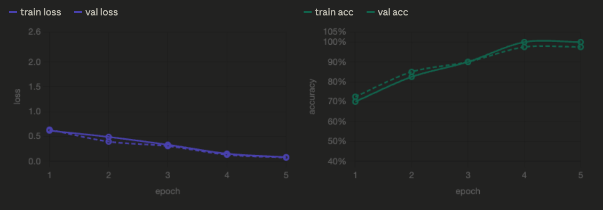

The left chart (loss) shows both training and validation loss falling steeply in the first two epochs, then gradually flattening towards zero. The two lines stay close together throughout — there is no point where training loss keeps falling while validation loss plateaus or rises. This is the signature of a healthy fine-tuning run with no significant overfitting.

The right chart (accuracy) mirrors this: both curves climb steeply from ~70% to ~90% in the first three epochs, then plateau near 100%/97.5% in epochs 4 and 5. Again, the proximity of the two lines confirms the model generalises well.

**What overfitting would look like:** the training loss would continue falling towards zero while the validation loss stopped improving or began rising. The training accuracy would approach 100% while the validation accuracy plateaued significantly lower. Neither pattern appears here, suggesting five epochs is a reasonable stopping point.

The accuracy metrics during training are computed on only `eval_iter=5` batches (40 examples) for speed. This is why there is some jitter in the numbers — 40 examples is a small sample. The final reported numbers below use the full dataset.

---

## Final full-dataset evaluation

After training, accuracy is recomputed across the full dataset (no `num_batches` cap):

```python
train_accuracy = calc_accuracy_loader(train_loader, model, device)
val_accuracy   = calc_accuracy_loader(val_loader,   model, device)
test_accuracy  = calc_accuracy_loader(test_loader,  model, device)

# Training accuracy:   97.21%
# Validation accuracy: 97.32%
# Test accuracy:       95.67%
```

All three numbers are well above 95%. The training accuracy (97.21%) is actually slightly lower than the validation accuracy (97.32%) — this happens because accuracy during training was measured on a shuffled loader, and some hard examples appear more often in the sampled batches. The full-pass numbers smooth this out.

The test accuracy (95.67%) is 1.65 percentage points below the validation accuracy. This gap is typical and expected. Throughout the model development process — choosing the learning rate, the number of unfrozen layers, `weight_decay`, `num_epochs` — every decision was implicitly evaluated against the validation set. The model has been tuned, even indirectly, to perform well on validation. The test set was untouched until this final evaluation, so its accuracy is an honest estimate of real-world performance.

To close this gap, options include: increasing `drop_rate` (adding dropout to the fine-tuning forward pass), increasing `weight_decay`, reducing `num_epochs` to avoid slight overfit, or increasing the training set size.

---

## Key takeaways

The four core PyTorch training steps — `zero_grad`, forward+loss, `backward`, `step` — are the same for every supervised training task. `zero_grad` must be called every iteration because PyTorch accumulates gradients by default.

AdamW is preferred over Adam for fine-tuning because it applies weight decay correctly, decoupled from the adaptive learning rate scaling.

`lr=5e-5` is deliberately small to prevent the pretrained weights from being overwritten. Fine-tuning learning rates are typically 10–100x smaller than pretraining learning rates.

The model goes from ~46% accuracy (random) to 97%+ over five epochs, training only ~7.1M of 124M parameters. The loss and accuracy curves show no significant overfitting — training and validation performance stay close throughout.

The small train/test gap (97.21% vs 95.67%) is normal and reflects implicit tuning towards the validation set during development.

---

_Section 6.7 complete. Section 6.8 wraps the fine-tuned model in a `classify_review` function and tests it on new, unseen messages — the final verification that the fine-tuning pipeline worked end to end._

# 8: Using the LLM as a Spam Classifier

> The fine-tuned model is now ready for inference on unseen text. This section wraps the complete preprocessing and prediction pipeline into a single `classify_review` function, tests it on two examples, and saves the fine-tuned weights to disk so the model can be reloaded without retraining.

---

## Where this section sits

```
┌──────────────────────────────────────────────────────────────────────────┐
│           CLASSIFICATION FINE-TUNING PIPELINE                            │
│                                                                          │
│  STAGE 3 — Fine-tuning and usage                                         │
│  ┌─────────────────────────────────────────────────────────┐            │
│  │  8) Fine-tune model          (Section 6.7)  complete    │            │
│  │  9) Evaluate fine-tuned model(Section 6.7)  complete    │            │
│  │  10) Use model on new data   ◄── THIS SECTION           │            │
│  └─────────────────────────────────────────────────────────┘            │
└──────────────────────────────────────────────────────────────────────────┘
```

---

## `classify_review` — the complete inference function

Everything from Sections 6.2–6.7 comes together here. The function mirrors the preprocessing steps in `SpamDataset` exactly, then runs a single forward pass and returns a string label.

```python
def classify_review(
        text, model, tokenizer, device,
        max_length=None, pad_token_id=50256):

    model.eval()                                        # inference mode

    # Step 1 — tokenise
    input_ids = tokenizer.encode(text)

    # Step 2 — determine safe maximum length
    supported_context_length = model.pos_emb.weight.shape[1]  # 1024 for GPT-2

    # Step 3 — truncate if too long
    input_ids = input_ids[:min(max_length, supported_context_length)]

    # Step 4 — pad to max_length
    input_ids += [pad_token_id] * (max_length - len(input_ids))

    # Step 5 — convert to tensor and add batch dimension
    input_tensor = torch.tensor(input_ids, device=device).unsqueeze(0)

    # Step 6 — forward pass, no gradients
    with torch.no_grad():
        logits = model(input_tensor)[:, -1, :]          # last token, shape (1, 2)

    # Step 7 — decode to label
    predicted_label = torch.argmax(logits, dim=-1).item()
    return "spam" if predicted_label == 1 else "not spam"
```

**Line-by-line annotation:**

`model.eval()` disables dropout and switches batchnorm to stored statistics. Always required before any inference pass.

`tokenizer.encode(text)` converts the raw string to a list of integer token IDs — exactly the same tokeniser used during training.

`model.pos_emb.weight.shape[1]` reads the model's actual positional embedding table size programmatically. `pos_emb` is an `Embedding(1024, 768)` layer; its weight matrix has shape `(1024, 768)`, so `shape[1] = 1024` gives the maximum supported sequence length without hard-coding it.

`input_ids[:min(max_length, supported_context_length)]` enforces two limits at once: the training `max_length` (120) and the model's hard architectural limit (1024). For this dataset the training length is always the binding constraint since 120 < 1024.

`input_ids += [pad_token_id] * (max_length - len(input_ids))` appends token ID 50256 until the sequence reaches exactly `max_length`. A short message like "Hi!" becomes `[17250, 0]` followed by 118 copies of 50256.

`.unsqueeze(0)` adds the batch dimension. The 1D list `[id0, id1, ..., id119]` becomes a `(1, 120)` tensor — the model always expects shape `(batch, tokens)`.

`torch.no_grad()` prevents PyTorch from building the computational graph during this forward pass. Gradients are not needed for inference — skipping them saves both memory and computation.

`model(input_tensor)[:, -1, :]` runs the forward pass on the `(1, 120)` tensor, producing shape `(1, 120, 2)`, then slices to the last token row: shape `(1, 2)`.

`torch.argmax(logits, dim=-1).item()` picks the index of the larger logit (0 or 1) and converts the resulting 0-dimensional tensor to a plain Python integer with `.item()`.

**Why `max_length=train_dataset.max_length` must be passed.**

The model was trained exclusively on sequences of length 120. During training, the positional embedding at every position from 0 to 119 was updated to encode useful position information for classification. If inference were run with a different length — say, padding to 200 — the model would encounter positional embeddings at positions 120–199 that were never trained on spam data. The positional embeddings at those positions encode pretraining signal (general next-token prediction patterns), not classification signal. Keeping `max_length=120` ensures the model operates at exactly the sequence length it was fine-tuned on.

---

## Inference on two examples

```python
text_1 = (
    "You are a winner you have been specially"
    " selected to receive $1000 cash or a $2000 award."
)
print(classify_review(
    text_1, model, tokenizer, device,
    max_length=train_dataset.max_length
))
# spam
```

```python
text_2 = (
    "Hey, just wanted to check if we're still on"
    " for dinner tonight? Let me know!"
)
print(classify_review(
    text_2, model, tokenizer, device,
    max_length=train_dataset.max_length
))
# not spam
```

Both predictions are correct. The prize-money language in `text_1` is a strong spam signal the model learned during fine-tuning. The conversational register of `text_2` — question, informal phrasing, personal context — is characteristic of ham.

These two examples are deliberately drawn from the same distribution as the training data (SMS messages). Real-world deployment would require evaluation on out-of-distribution inputs — longer texts, different languages, email rather than SMS — which may need a different or more diverse training set.

---

## Saving and loading the fine-tuned model

```python
# Save
torch.save(model.state_dict(), "review_classifier.pth")

# Load
model_state_dict = torch.load("review_classifier.pth", map_location=device)
model.load_state_dict(model_state_dict)
```

`model.state_dict()` returns an ordered dictionary mapping parameter names to tensors — all the learned weights and biases, nothing else. It does not save the model architecture, the class definition, or the training configuration.

This is an important distinction: `state_dict` saves the numbers, not the structure. To reload, the architecture must be reconstructed first:

```
# Correct reload sequence:
# 1. Reconstruct the architecture (including the modified out_head)
model = GPTModel(BASE_CONFIG)
model.out_head = torch.nn.Linear(
    in_features=BASE_CONFIG["emb_dim"], out_features=2
)

# 2. Load the saved weights into it
model.load_state_dict(
    torch.load("review_classifier.pth", map_location=device)
)
model.eval()
```

If the architecture does not exactly match — for example, if `out_head` were still `Linear(768, 50257)` — `load_state_dict` would raise a shape mismatch error. This safeguard catches the most common mistake of forgetting to apply the Section 6.5 modification before loading fine-tuned weights.

`map_location=device` ensures the weights are loaded onto the correct device (CPU or GPU) regardless of where they were saved. A model saved on a GPU can be loaded cleanly onto a CPU machine with `map_location="cpu"`.

---

## Chapter summary

The book's own summary of Chapter 6, reproduced here as a concise recap:

There are two main strategies for fine-tuning LLMs: classification fine-tuning and instruction fine-tuning. Classification fine-tuning replaces the model's output layer with a small classification layer — for binary spam detection this is a `Linear(768, 2)` layer replacing the original `Linear(768, 50257)`. The new layer outputs one score per class rather than one score per vocabulary token.

Instead of predicting the next token as in pretraining, classification fine-tuning trains the model to output the correct class label — spam or not spam — for each input message. The model input is tokenised text padded to a fixed length, identical in form to pretraining inputs.

Before fine-tuning, the pretrained model is loaded as the base. Only selected layers are made trainable — the new output head, the final LayerNorm, and the last transformer block — while the remaining parameters are frozen. Evaluating a classification model uses accuracy (fraction of correct predictions). The training objective is cross-entropy loss, the same function used during pretraining, now applied only to the last token output of each sequence.

---

## Key takeaways

`classify_review` is a thin wrapper around the same three operations used throughout this chapter: tokenise → pad/truncate → forward pass → argmax. The only new element is `.unsqueeze(0)` to add the batch dimension for a single input.

`max_length` must match the training sequence length exactly. Positional embeddings at positions beyond the training length were not fine-tuned for classification and carry only pretraining signal.

`state_dict` saves weights only, not architecture. The correct reload sequence is: reconstruct the modified architecture first, then call `load_state_dict`.

`map_location=device` in `torch.load` ensures portability between GPU and CPU environments.

---

_Chapter 6 complete. Chapter 7 covers instruction fine-tuning — adapting the same pretrained model to follow natural language instructions rather than predicting a fixed class label, producing a general-purpose assistant rather than a specialist classifier._
