# Chapter 7: Fine-Tuning to Follow Instructions

> **What this chapter is about:** Chapters 1–6 built a GPT model from scratch, pretrained it, and fine-tuned it for a fixed classification task. Chapter 7 closes the loop on the full LLM development cycle by tackling the harder and more general problem: teaching the model to follow arbitrary natural-language instructions. This is the technique behind instruction-following assistants — the thing that turns a raw text-completion engine into something that feels like a conversational AI. The chapter walks the complete pipeline end-to-end: dataset preparation, batching with a custom collate function, loading a pretrained LLM, supervised fine-tuning, response extraction, and automated evaluation using a separate LLM judge.

---

## Table of Contents

1. [Introduction to Instruction Fine-Tuning](#1-introduction-to-instruction-fine-tuning)
2. [Preparing a Dataset for Supervised Instruction Fine-Tuning](#2-preparing-a-dataset-for-supervised-instruction-fine-tuning)
3. [Organizing Data into Training Batches](#3-organizing-data-into-training-batches)
4. [Creating Data Loaders for an Instruction Dataset](#4-creating-data-loaders-for-an-instruction-dataset)
5. [Loading a Pretrained LLM](#5-loading-a-pretrained-llm)
6. [Fine-Tuning the LLM on Instruction Data](#6-fine-tuning-the-llm-on-instruction-data)
7. [Extracting and Saving Responses](#7-extracting-and-saving-responses)
8. [Evaluating the Fine-Tuned LLM](#8-evaluating-the-fine-tuned-llm)
9. [Conclusions](#9-conclusions)

---

## Where Chapter 7 Sits in the Bigger Picture

This is the final chapter of the book. It covers Step 9 of the three-stage LLM development framework — instruction fine-tuning, which is Stage 3.

```
┌────────────────────────────────────────────────────────────────────────┐
│             THREE STAGES OF BUILDING AN LLM (Figure 7.1)              │
│                                                                        │
│  STAGE 1 — Foundation Model                                            │
│  ┌──────────────────────────────────────────────────────────────┐      │
│  │  1) Data preparation & sampling          (Chapter 2)        │      │
│  │  2) Attention mechanism                  (Chapter 3)        │      │
│  │  3) LLM architecture                     (Chapter 4)        │      │
│  │  4) Pretraining                           (Chapter 4)        │      │
│  │  5) Training loop                         (Chapter 5)        │      │
│  │  6) Model evaluation                      (Chapter 5)        │      │
│  │  7) Load pretrained weights               (Chapter 5)        │      │
│  └──────────────────────────────────────────────────────────────┘      │
│                                                                        │
│  STAGE 2 — Fine-tuning for Classification                              │
│  ┌──────────────────────────────────────────────────────────────┐      │
│  │  8) Fine-tuning (classifier)              (Chapter 6)        │      │
│  └──────────────────────────────────────────────────────────────┘      │
│                                                                        │
│  STAGE 3 — Fine-tuning to Follow Instructions                          │
│  ┌──────────────────────────────────────────────────────────────┐      │
│  │  9) Fine-tuning (instruction)         ◄── (Chapter 7)        │      │
│  └──────────────────────────────────────────────────────────────┘      │
└────────────────────────────────────────────────────────────────────────┘
```

Chapter 6 replaced the output head and fine-tuned on labelled spam/not-spam data — a specialist model with a two-class output. Chapter 7 keeps the original vocabulary-sized output head and instead teaches the model to produce free-form text responses conditioned on natural-language instructions. The output is a generalist personal assistant rather than a fixed-class classifier.

---

## The Chapter 7 Fine-Tuning Pipeline

The chapter organises the work into three stages, mirroring the broader book structure at a smaller scale:

```
┌────────────────────────────────────────────────────────────────────────┐
│     INSTRUCTION FINE-TUNING PIPELINE (Figure 7.3)                     │
│                                                                        │
│  STAGE 1 — Preparing the Dataset                                       │
│  ┌──────────────────────────────────────────────────────────┐          │
│  │  Step 1: Dataset download and formatting  (Section 7.2)  │          │
│  │  Step 2: Batching the dataset             (Section 7.3)  │          │
│  │  Step 3: Creating data loaders            (Section 7.4)  │          │
│  └──────────────────────────────────────────────────────────┘          │
│                              ↓                                         │
│  STAGE 2 — Fine-Tuning the LLM                                         │
│  ┌──────────────────────────────────────────────────────────┐          │
│  │  Step 4: Loading a pretrained LLM         (Section 7.5)  │          │
│  │  Step 5: Instruction fine-tuning the LLM  (Section 7.6)  │          │
│  │  Step 6: Inspecting the modeling loss     (Section 7.6)  │          │
│  └──────────────────────────────────────────────────────────┘          │
│                              ↓                                         │
│  STAGE 3 — Evaluating the LLM                                          │
│  ┌──────────────────────────────────────────────────────────┐          │
│  │  Step 7: Extracting responses             (Section 7.7)  │          │
│  │  Step 8: Qualitative evaluation           (Section 7.7)  │          │
│  │  Step 9: Scoring the responses            (Section 7.8)  │          │
│  └──────────────────────────────────────────────────────────┘          │
└────────────────────────────────────────────────────────────────────────┘
```

---

# 1: Introduction to Instruction Fine-Tuning

> **This section covers:** What a pretrained LLM can and cannot do out of the box, why instruction fine-tuning exists, the conceptual distinction between the two fine-tuning paradigms (classification vs instruction), and the high-level three-stage pipeline that will guide the rest of the chapter. No code appears in this section — it is purely conceptual orientation before the work begins.

---

## Where we are in the book

Chapters 1–5 built and pretrained the GPT model from scratch. Chapter 5 also loaded real GPT-2 weights from OpenAI. Chapter 6 took that pretrained model and fine-tuned it for a specific, narrow task — binary spam classification — by replacing the output head and training on labelled examples. That was Step 8 of the three-stage framework.

Chapter 7 is Step 9 and the final chapter of the book. Instead of a fixed output head with two classes, the full vocabulary-sized output head is kept, and the model is trained to produce free-form text responses conditioned on natural-language instructions. This is the technique behind chatbot applications, personal assistants, and conversational AI systems.


The diagram above captures the essential fork. Both paths start from the same pretrained checkpoint. Classification fine-tuning (Chapter 6, Step 8) produces a **specialist** — it knows one task extremely well, outputs a fixed label, and cannot do anything else. Instruction fine-tuning (Chapter 7, Step 9) produces a **generalist** — it can handle a wide variety of requests phrased in natural language, outputting free-form text for each.

---

## What a pretrained LLM can and cannot do

A pretrained LLM learns by predicting the next token, one word at a time, over a massive corpus of text. After pretraining, the model becomes very good at **text completion** — given a fragment, it can plausibly continue it. For example:

```
Input:  "The capital of France is"
Output: " Paris, a city known for..."
```

However, pretrained LLMs often struggle when given **instructions** that require a specific action or transformation. For example:

```
Input:  "Fix the grammar in this text: He go to store every day."
Output: (may simply continue the text rather than fixing it)

Input:  "Convert this sentence to passive voice: The chef cooks the meal."
Output: (may generate more active-voice sentences rather than obeying the directive)
```

The model has seen these kinds of requests in its training data, but it was not explicitly trained to follow them. Its objective was next-token prediction, not instruction-following. Instruction fine-tuning — also called **supervised instruction fine-tuning** — is the process that bridges this gap.

---

## What instruction fine-tuning adds

Instruction fine-tuning takes the pretrained model and continues training it on a dataset of **instruction–response pairs**. Each training example has a natural-language instruction (and optionally some input context) paired with the ideal response. The model learns to condition its output on the instruction rather than simply completing any plausible continuation.

The book illustrates this with three concrete examples (Figure 7.2):

| Instruction                                                                                     | Desired response                     |
| ----------------------------------------------------------------------------------------------- | ------------------------------------ |
| Convert 45 kilometres to metres.                                                                | 45 kilometres is 45,000 metres.      |
| Edit the following sentence to remove all passive voice: "The song was composed by the artist." | The artist composed the song.        |
| Provide a synonym for "bright."                                                                 | A synonym for "bright" is "radiant." |

In each case the model receives an instruction and must produce a specific, correct, targeted response — not just any plausible continuation. The training signal comes from how well the model's generated response matches the ideal response in the dataset.

---

## The two fine-tuning paradigms side by side

It is worth being precise about how classification fine-tuning and instruction fine-tuning differ at the architectural and data level, not just conceptually.

**Classification fine-tuning (Chapter 6):**

- The final transformer output at the last token position is passed through a small linear head mapping to the number of classes (e.g. 2 for spam/not-spam).
- The original vocabulary-sized output head is replaced.
- The dataset consists of (text, label) pairs.
- The loss is cross-entropy over a fixed label set.
- The model outputs a probability distribution over classes — argmax gives the predicted label.

**Instruction fine-tuning (Chapter 7):**

- The original vocabulary-sized output head is kept — the model still predicts the next token over the full vocabulary at every position.
- The dataset consists of (instruction, response) pairs formatted into a structured text template.
- The loss is standard language modelling cross-entropy, but computed only on the response tokens (not on the instruction prefix).
- The model generates free-form text one token at a time, stopped by an end-of-sequence token.

The key insight: instruction fine-tuning is not an architectural change. It is a **training data** change. The same GPT architecture from Chapter 4, the same next-token prediction objective from Chapter 5, the same AdamW training loop — just a different dataset structure, and a different slice of tokens over which the loss is computed.

---

## The three-stage pipeline for this chapter

The chapter organises the work into three stages. This pipeline is the roadmap for everything from Section 7.2 through Section 7.8.

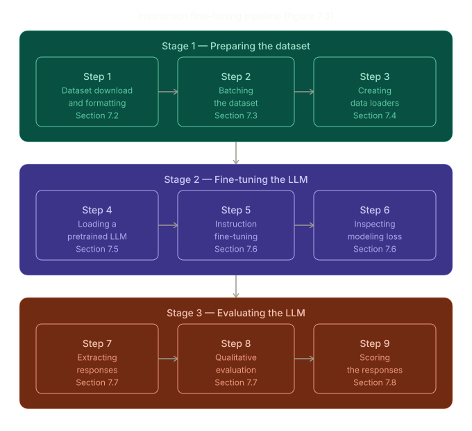

The three stages are:

**Stage 1 — Preparing the dataset (Sections 7.2–7.4):** Download and inspect the instruction dataset (1,100 instruction–response pairs in JSON format). Format each entry into the Alpaca prompt style. Tokenise, pad, create targets, and build PyTorch `DataLoader` objects for train, validation, and test splits.

**Stage 2 — Fine-tuning the LLM (Sections 7.5–7.6):** Load the pretrained GPT-2 medium model (355M parameters — larger than the 124M model used in pretraining, because a bigger model is needed to achieve useful instruction-following ability). Run the fine-tuning training loop for two epochs, monitoring training and validation loss.

**Stage 3 — Evaluating the LLM (Sections 7.7–7.8):** Extract the fine-tuned model's responses on the held-out test set. Evaluate qualitatively by comparing model responses to correct answers. Then automate the evaluation by using a separate 8-billion-parameter Llama 3 model (via Ollama) as a judge, which scores each response numerically.

---

## Why dataset preparation dominates the chapter

A recurring emphasis in Section 7.1 is that **preparing the dataset is a key aspect of instruction fine-tuning**. This is not a throwaway line. Instruction fine-tuning reuses nearly all the code from pretraining — the architecture is identical, the training loop is nearly identical. The difference that produces an instruction-following model rather than a text-completion model is almost entirely in how the data is structured, tokenised, padded, and batched.

This is why Sections 7.2, 7.3, and 7.4 — all three of the Stage 1 sections — deal exclusively with data. The model setup and training in Sections 7.5–7.6 are comparatively straightforward once the data pipeline is correct.

---

_Section 7.1 complete. Section 7.2 begins the concrete work: downloading the 1,100-entry instruction dataset from GitHub, inspecting its JSON structure, and formatting each entry into the Alpaca prompt style that the model will be trained on._

# 2: Preparing a Dataset for Supervised Instruction Fine-Tuning

> **This section covers:** Downloading the 1,100-entry instruction dataset in JSON format, understanding what each entry looks like and why the `'input'` field is optional, formatting entries into the Alpaca prompt style (with a detailed comparison to Phi-3), and splitting the dataset into training, validation, and test subsets with correct proportions. This is the first concrete step of Stage 1 — and it is entirely about data, not model code.

---

## Where this section sits in the pipeline

This section covers **Step 1 of Stage 1** from the chapter pipeline: dataset download and formatting. No model, no training loop, no tensors yet. Everything here is about getting raw JSON into a clean, consistently formatted list of strings that later sections will tokenise and batch.

```
STAGE 1 — Preparing the dataset
┌───────────────────────────────────────────────────────────────┐
│  Step 1: Dataset download and formatting   ◄── THIS SECTION   │
│  Step 2: Batching the dataset                  (Section 7.3)  │
│  Step 3: Creating data loaders                 (Section 7.4)  │
└───────────────────────────────────────────────────────────────┘
```

---

## The dataset — what it contains and why

The instruction dataset used in this chapter consists of **1,100 instruction–response pairs** created specifically for this book. It is a small dataset by real-world standards — the Stanford Alpaca dataset, for comparison, has 52,002 entries — but it is large enough to demonstrate the full fine-tuning pipeline and small enough to train in minutes on a modest GPU.

The file is stored in **JSON format**. JSON (JavaScript Object Notation) is essentially a text encoding of nested Python-like data structures — dicts become `{}` objects, lists become `[]` arrays, strings are quoted. Python's `json` module can read a JSON file directly into native Python objects with a single call.

The dataset is tiny at **204 KB** — a plain-text file containing 1,100 short dictionary-like records. It is downloaded from the book's GitHub repository on first run and cached locally so subsequent runs skip the network request entirely.

---

## Listing 7.1 — `download_and_load_file`

```python
import json
import os
import urllib

def download_and_load_file(file_path, url):
    if not os.path.exists(file_path):              # only download if not already saved
        with urllib.request.urlopen(url) as response:
            text_data = response.read().decode("utf-8")
        with open(file_path, "w", encoding="utf-8") as file:
            file.write(text_data)
    else:                                          # file already exists — load from disk
        with open(file_path, "r", encoding="utf-8") as file:
            text_data = file.read()
    with open(file_path, "r") as file:
        data = json.load(file)                     # parse JSON → Python list of dicts
    return data

file_path = "instruction-data.json"
url = (
    "https://raw.githubusercontent.com/rasbt/LLMs-from-scratch"
    "/main/ch07/01_main-chapter-code/instruction-data.json"
)
data = download_and_load_file(file_path, url)
print("Number of entries:", len(data))
# Output: Number of entries: 1100
```

### What each line does

`os.path.exists(file_path)` — checks whether the file has been downloaded before. This is a simple but important pattern: expensive operations (network requests) should only happen once. On the second run the function goes straight to loading from disk.

`urllib.request.urlopen(url)` — opens the URL and streams the response. `.read().decode("utf-8")` reads all bytes and decodes them to a Python string. No third-party libraries are needed — `urllib` is part of Python's standard library.

`json.load(file)` — parses the JSON text into native Python objects. The JSON file contains a list of dicts, so `data` becomes a `list` of `dict` objects. Each dict has string keys and string values.

### Dry run with tiny example

Imagine the JSON file contains only 3 entries instead of 1,100:

```
JSON on disk:
[
  {"instruction": "Fix grammar.", "input": "He go store.", "output": "He goes to the store."},
  {"instruction": "Synonym for big.", "input": "", "output": "Large."},
  {"instruction": "Translate to French.", "input": "Hello", "output": "Bonjour"}
]

After json.load():
data = [
  {'instruction': 'Fix grammar.',    'input': 'He go store.', 'output': 'He goes to the store.'},
  {'instruction': 'Synonym for big.','input': '',             'output': 'Large.'},
  {'instruction': 'Translate to French.', 'input': 'Hello',  'output': 'Bonjour'}
]

len(data) → 3
data[0]['instruction'] → 'Fix grammar.'
data[1]['input']       → ''          ← empty string, not None
data[2]['output']      → 'Bonjour'
```

The result is a plain Python list you can index, slice, and iterate — no special dataset class needed at this stage.

---

## Understanding the entry structure

The book inspects two specific entries to illustrate the structure.

**Entry with a non-empty `'input'` field (`data[50]`):**

```python
{
  'instruction': 'Identify the correct spelling of the following word.',
  'input':       'Ocassion',
  'output':      "The correct spelling is 'Occasion.'"
}
```

Here the instruction is a general task ("find the correct spelling") and the `'input'` provides the specific material to act on (the misspelled word). The response is the corrected spelling.

**Entry with an empty `'input'` field (`data[999]`):**

```python
{
  'instruction': "What is an antonym of 'complicated'?",
  'input':       '',
  'output':      "An antonym of 'complicated' is 'simple'."
}
```

Here the instruction is self-contained — it does not need extra input material. The antonym question carries all the information the model needs. The `'input'` field is still present in the dict but its value is an empty string `''`.

This distinction matters because `format_input` (Listing 7.2) must handle both cases — including the `### Input:` section when `'input'` is non-empty, and silently skipping it when empty.

---

## Prompt styles — why they exist and how they differ

Raw JSON entries cannot be fed directly to a language model. The model receives a single flat string of tokens — it has no way to know which part is the instruction, which is the input, and which is the expected response, unless the formatting makes these boundaries explicit.

A **prompt style** (also called a prompt template) is a formatting convention that converts a structured dict entry into a flat string with clear section markers. Different research teams and model families have adopted different conventions. The chapter introduces two of the most widely used.


### Alpaca style (used throughout this chapter)

Alpaca was released by researchers at Stanford and was one of the first models to publicly document its instruction fine-tuning procedure. Its prompt format became influential partly because it is readable, structured, and easy to parse.

The full formatted string for a **with-input** entry looks like this:

```
Below is an instruction that describes a task. Write a response
that appropriately completes the request.

### Instruction:
Identify the correct spelling of the following word.

### Input:
Ocassion

### Response:
The correct spelling is 'Occasion.'
```

And for a **no-input** entry:

```
Below is an instruction that describes a task. Write a response
that appropriately completes the request.

### Instruction:
What is an antonym of 'complicated'?

### Response:
An antonym of 'complicated' is 'simple'.
```

The `### Response:` section is the target — the part the model is being trained to generate. During training, everything up to and including `### Response:\n` is the prompt (input to the model); the text after it is the completion (target for the loss).

### Phi-3 style (Microsoft)

Phi-3, developed by Microsoft, uses a different convention based on **special role tokens** rather than section headers. The same entry in Phi-3 style looks like:

```
<|user|>
Identify the correct spelling of the following word: 'Ocassion'
<|assistant|>
The correct spelling is 'Occasion.'
```

Key differences from Alpaca:

The instruction and input are **merged** into a single user turn, rather than kept in separate labelled sections. There is no preamble paragraph — the format is more compact. The boundary between user and assistant is marked by special tokens (`<|user|>`, `<|assistant|>`) rather than `###` headers.

### Why the choice of prompt style matters

The prompt style is baked into the model during fine-tuning. At inference time, you must use the same template — the model has learned to expect the `### Response:` cue (Alpaca) or the `<|assistant|>` token (Phi-3) as the signal to start generating. Mixing styles at inference will produce degraded or incoherent outputs because the model has never seen that input format.

This chapter standardises on **Alpaca** throughout because it is the more popular style for open-source community models and has the most tooling and documentation around it. Exercise 7.1 (at the end of the section) invites you to experiment by swapping in the Phi-3 style and observing whether response quality changes.

---

## Listing 7.2 — `format_input`

```python
def format_input(entry):
    instruction_text = (
        f"Below is an instruction that describes a task. "
        f"Write a response that appropriately completes the request."
        f"\n\n### Instruction:\n{entry['instruction']}"
    )
    input_text = (
        f"\n\n### Input:\n{entry['input']}" if entry["input"] else ""
    )
    return instruction_text + input_text
```

### What each part does

`instruction_text` — always constructed. It concatenates the fixed preamble paragraph with the `### Instruction:` header and the actual instruction text from the entry. The `\n\n` creates a blank line between the preamble and the header, and another `\n` after the header puts the instruction on its own line.

`input_text` — conditionally constructed. The expression `if entry["input"] else ""` evaluates to the `### Input:` block when the input field is non-empty, and to an empty string `""` when it is empty. Empty string concatenation is a no-op, so the returned string simply has no `### Input:` section for entries that don't need one.

Notice what is **not** in `format_input`: the `### Response:` section. The function returns only the prompt side of the formatted string. The response is appended separately when needed:

```python
model_input    = format_input(data[50])
desired_response = f"\n\n### Response:\n{data[50]['output']}"
full_string    = model_input + desired_response
```

This separation is intentional. At training time, the full string (prompt + response) is passed in, but only the response tokens contribute to the loss. At inference time, only the prompt is passed, and the model generates the response. Keeping them separate in code makes both use cases clean.

### Dry run — entry WITH input (`data[50]`)

```python
entry = {
    'instruction': 'Identify the correct spelling of the following word.',
    'input':       'Ocassion',
    'output':      "The correct spelling is 'Occasion.'"
}

# Step 1: instruction_text
instruction_text = (
    "Below is an instruction that describes a task. "
    "Write a response that appropriately completes the request."
    "\n\n### Instruction:\n"
    "Identify the correct spelling of the following word."
)

# Step 2: entry["input"] = 'Ocassion'  → truthy → build input_text
input_text = "\n\n### Input:\nOcassion"

# Step 3: return instruction_text + input_text
result = """Below is an instruction that describes a task. Write a response \
that appropriately completes the request.

### Instruction:
Identify the correct spelling of the following word.

### Input:
Ocassion"""
```

### Dry run — entry WITHOUT input (`data[999]`)

```python
entry = {
    'instruction': "What is an antonym of 'complicated'?",
    'input':       '',
    'output':      "An antonym of 'complicated' is 'simple'."
}

# Step 1: instruction_text (same structure)
instruction_text = (
    "Below is an instruction that describes a task. "
    "Write a response that appropriately completes the request."
    "\n\n### Instruction:\n"
    "What is an antonym of 'complicated'?"
)

# Step 2: entry["input"] = ''  → falsy → input_text = ""
input_text = ""

# Step 3: return instruction_text + ""  → no ### Input: section at all
result = """Below is an instruction that describes a task. Write a response \
that appropriately completes the request.

### Instruction:
What is an antonym of 'complicated'?"""
```

The `if entry["input"] else ""` guard is doing something subtle: an empty string `''` is falsy in Python, so the ternary evaluates to `""` even though the key exists in the dict. This is cleaner than checking `entry["input"] is not None` or `len(entry["input"]) > 0` — empty string already means "no input provided."

---

## Listing 7.3 — train / validation / test split

```python
train_portion = int(len(data) * 0.85)   # 85% → 935
test_portion  = int(len(data) * 0.10)   # 10% → 110
val_portion   = len(data) - train_portion - test_portion  # remainder → 55

train_data = data[:train_portion]
test_data  = data[train_portion : train_portion + test_portion]
val_data   = data[train_portion + test_portion:]

print("Training set length:",   len(train_data))   # 935
print("Validation set length:", len(val_data))     # 55
print("Test set length:",       len(test_data))    # 110
```


### Why three splits, not two

It is tempting to just split data into train and test. But every time you look at validation or test performance and make a decision — adjusting the learning rate, stopping early, choosing between model variants — you are implicitly using that data to guide training. After enough such decisions the model has been indirectly tuned to that held-out set.

The solution is three splits:

```
train_data  → model sees this, gradients flow through it every step
val_data    → you watch this during training to detect overfitting
              (never used to update weights)
test_data   → untouched until the final evaluation
              neither you nor the model sees this until the very end
```

The test set gives you an honest, unbiased estimate of how the model performs on truly unseen data. If you used the test set to make decisions, it would no longer be unseen and the estimate would be optimistic.

### Dry run with small numbers

Take 20 entries instead of 1,100, same proportions:

```
n = 20

train_portion = int(20 * 0.85) = int(17.0) = 17
test_portion  = int(20 * 0.10) = int(2.0)  = 2
val_portion   = 20 - 17 - 2              = 1

train_data = data[0:17]       → 17 entries (indices 0–16)
test_data  = data[17:19]      → 2  entries (indices 17–18)
val_data   = data[19:]        → 1  entry   (index 19)

17 + 2 + 1 = 20 ✓  (no entries lost, no entries duplicated)
```

For the real 1,100-entry dataset:

```
train_portion = int(1100 * 0.85) = 935
test_portion  = int(1100 * 0.10) = 110
val_portion   = 1100 - 935 - 110 = 55

train_data = data[0:935]       → 935 entries
test_data  = data[935:1045]    → 110 entries
val_data   = data[1045:]       → 55  entries

935 + 110 + 55 = 1100 ✓
```

### Why `val_portion` is computed as a remainder

`val_portion` is not independently computed as `int(1100 * 0.05)`. It is calculated as `len(data) - train_portion - test_portion`. This is deliberate — it ensures that rounding errors in the `int(...)` conversions never cause entries to be dropped or duplicated. If you computed all three independently, rounding could give you `935 + 110 + 54 = 1099` (one entry lost) or `935 + 110 + 56 = 1101` (one entry duplicated). Computing the last portion as a remainder guarantees the three sets always add up to exactly `len(data)`.

### Why this split is not shuffled

Unlike Chapter 6 (spam classification), the data here is **not shuffled before splitting**. The 1,100 entries in `instruction-data.json` are already varied — they were constructed to be diverse across topic and difficulty — so a sequential slice gives a representative sample without needing to shuffle. Shuffling before splitting is the safer general habit (it was done in Chapter 6 with `random_split`), but for this dataset a sequential split is sufficient.

---

## Exercise 7.1 — Changing prompt styles

After fine-tuning the model with the Alpaca prompt style, rewrite `format_input` to use the Phi-3 template:

```python
def format_input_phi3(entry):
    if entry["input"]:
        user_text = f"{entry['instruction']}\n{entry['input']}"
    else:
        user_text = entry['instruction']
    return f"<|user|>\n{user_text}\n<|assistant|>"
```

Then fine-tune with this template and compare response quality. The key question is whether the simpler, more compact Phi-3 format is equally effective at teaching the model to follow instructions, or whether the explicit section structure of Alpaca provides a stronger training signal.

---

_Section 7.2 complete. Section 7.3 moves to the next step: constructing training batches. Instruction fine-tuning has a non-trivial batching problem — entries have different lengths, targets must be created by shifting inputs by one position, and padding tokens must be masked so they do not contribute to the loss. A custom `collate_fn` handles all of this._

# 3: Organizing Data into Training Batches

> **This section covers:** Why instruction fine-tuning needs a custom collate function instead of PyTorch's default, implementing `InstructionDataset` to pre-tokenize all entries, building the collate function in three iterative drafts — padding only, then adding targets by shifting, then masking extra padding tokens with `-100` — understanding exactly why `-100` is special in PyTorch's cross-entropy loss, and an optional discussion on masking instruction tokens as well. This is the most mechanically dense section of Stage 1.

---

## Where this section sits

```
STAGE 1 — Preparing the dataset
┌───────────────────────────────────────────────────────────────┐
│  Step 1: Dataset download and formatting   (Section 7.2)      │
│  Step 2: Batching the dataset          ◄── THIS SECTION       │
│  Step 3: Creating data loaders             (Section 7.4)      │
└───────────────────────────────────────────────────────────────┘
```

---

## Why instruction fine-tuning needs a custom collate function

In Chapter 6 (spam classification), padding happened inside the `SpamDataset` class itself — every sequence was padded to the same fixed `max_length` during construction. By the time PyTorch's `DataLoader` received examples, they were all the same shape and could be stacked into a batch tensor automatically using the default collate function.

Instruction fine-tuning cannot do this. Each entry in the dataset tokenises to a different length depending on how long the instruction, input, and response are. Padding every sequence globally to the maximum length in the entire dataset (which could be 1,000+ tokens) would be extremely wasteful — most sequences would be 90% padding. The better approach is **dynamic padding**: pad only to the length of the longest sequence within each individual batch. A batch where the longest sequence is 60 tokens gets padded to 60, not to 1,024.

Dynamic padding requires a custom collate function — a function that receives a list of variable-length samples from the dataset and knows how to assemble them into a properly padded, equal-length batch tensor.

The section builds this in three stages, each adding one more piece of functionality.

---

## The five sub-steps overview

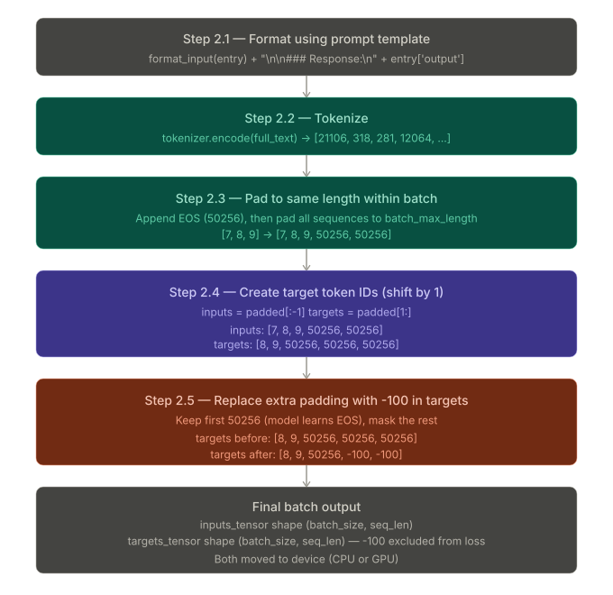

The complete batching process has five sub-steps. Steps 2.1 and 2.2 happen inside `InstructionDataset`. Steps 2.3, 2.4, and 2.5 happen inside the custom collate function.

---

## Listing 7.4 — `InstructionDataset` (sub-steps 2.1 and 2.2)

```python
import torch
from torch.utils.data import Dataset

class InstructionDataset(Dataset):
    def __init__(self, data, tokenizer):
        self.data = data
        self.encoded_texts = []
        for entry in data:                                     # iterate all entries
            instruction_plus_input = format_input(entry)      # 2.1: Alpaca prompt
            response_text = f"\n\n### Response:\n{entry['output']}"
            full_text = instruction_plus_input + response_text
            self.encoded_texts.append(
                tokenizer.encode(full_text)                   # 2.2: tokenise
            )

    def __getitem__(self, index):
        return self.encoded_texts[index]   # returns a plain Python list of ints

    def __len__(self):
        return len(self.data)
```

### What each part does

`__init__` runs once when the dataset object is created. It iterates over every entry, builds the full formatted string (instruction + optional input + response), tokenises it, and stores the resulting list of token IDs in `self.encoded_texts`. This pre-tokenisation pattern means the (relatively expensive) tokenisation call happens once at startup rather than once per training step.

Notice that `__getitem__` returns a plain Python **list of integers**, not a padded tensor. This is deliberate — the sequences are all different lengths at this point. Tensors require fixed dimensions, so padding happens later in the collate function.

`__len__` returns the number of entries, which `DataLoader` uses internally to know how many batches to produce.

### Small example — what one encoded entry looks like

Take a tiny entry:

```python
entry = {
    'instruction': 'Translate to French.',
    'input': 'Hello',
    'output': 'Bonjour'
}
```

After `format_input(entry)`:

```
Below is an instruction that describes a task. Write a response
that appropriately completes the request.

### Instruction:
Translate to French.

### Input:
Hello
```

After appending the response:

```
...
### Response:
Bonjour
```

After `tokenizer.encode(full_text)` — this becomes a list like:

```python
[21106, 318, 281, 12064, ..., 33, 15496, 198, 198, 21017, 18261, 25, 198, 45312, 73, 448]
```

Each number is a token ID in GPT-2's vocabulary. The exact values depend on GPT-2's tokeniser, but the point is: this is a flat list of integers, variable in length depending on the entry. `InstructionDataset` stores one such list per entry.

---

## Sub-step 2.3: Padding — Draft 1 of the collate function

Before diving into targets, the first draft demonstrates padding alone. This is a useful simplification to understand the core mechanics.

```python
def custom_collate_draft_1(
    batch,
    pad_token_id=50256,
    device="cpu"
):
    batch_max_length = max(len(item) + 1 for item in batch)  # +1 reserves room for EOS
    inputs_lst = []

    for item in batch:
        new_item = item.copy()
        new_item += [pad_token_id]                            # append one EOS token

        padded = (
            new_item + [pad_token_id] *
            (batch_max_length - len(new_item))                # pad to batch_max_length
        )
        inputs = torch.tensor(padded[:-1])                    # drop the last token
        inputs_lst.append(inputs)

    inputs_tensor = torch.stack(inputs_lst).to(device)
    return inputs_tensor
```

### Why `max(len(item) + 1 for item in batch)`?

The `+ 1` reserves one extra slot beyond the longest sequence. This extra slot is needed because we append an EOS token to every sequence, and the final `padded[:-1]` slice removes it. The net effect is that the output length equals `max(len(item))` in the batch — but the intermediate representation needs one extra position to absorb the appended EOS before it gets sliced off.

### Why `padded[:-1]`?

The slice `[:-1]` removes the last element of `padded`. Here is why this is necessary. After appending EOS and padding, the list looks like this for a length-2 sequence in a batch where max length is 5:

```
new_item = [5, 6, 50256]           ← original 2 tokens + 1 EOS
padded   = [5, 6, 50256, 50256, 50256, 50256]  ← padded to batch_max_length=6
padded[:-1] = [5, 6, 50256, 50256, 50256]      ← 5 elements (correct!)
```

The slice brings the length back to `batch_max_length - 1` = 5, which is the correct input length. The next draft will use `padded[1:]` to create targets, and the combination of `padded[:-1]` (inputs) and `padded[1:]` (targets) is the mechanism that creates the next-token prediction alignment.

### Dry run with the test batch

```python
inputs_1 = [0, 1, 2, 3, 4]    # length 5
inputs_2 = [5, 6]              # length 2
inputs_3 = [7, 8, 9]           # length 3
batch = (inputs_1, inputs_2, inputs_3)
```

Step-by-step:

```
batch_max_length = max(5+1, 2+1, 3+1) = max(6,3,4) = 6

--- item = [0,1,2,3,4] ---
new_item = [0,1,2,3,4,50256]
padded   = [0,1,2,3,4,50256]            (already length 6, no extra padding needed)
inputs   = padded[:-1] = [0,1,2,3,4]   (length 5)

--- item = [5,6] ---
new_item = [5,6,50256]
padded   = [5,6,50256] + [50256]*(6-3) = [5,6,50256,50256,50256,50256]   (length 6)
inputs   = padded[:-1] = [5,6,50256,50256,50256]                          (length 5)

--- item = [7,8,9] ---
new_item = [7,8,9,50256]
padded   = [7,8,9,50256] + [50256]*(6-4) = [7,8,9,50256,50256,50256]     (length 6)
inputs   = padded[:-1] = [7,8,9,50256,50256]                              (length 5)

Result:
tensor([[ 0,  1,  2,  3,     4],
        [ 5,  6, 50256, 50256, 50256],
        [ 7,  8,  9, 50256, 50256]])
```

All three sequences are now the same length (5), padded with `50256` where needed.

---

## Sub-step 2.4: Creating target token IDs — Draft 2

The second draft adds targets. Recall from pretraining: the model is trained to predict the **next** token at every position. So if the input at position `i` is token `A`, the target at position `i` is token `B` — the token that should come next.

This means targets = inputs shifted one position to the right. In list terms: `targets = padded[1:]` and `inputs = padded[:-1]`.

```python
def custom_collate_draft_2(
    batch,
    pad_token_id=50256,
    device="cpu"
):
    batch_max_length = max(len(item) + 1 for item in batch)
    inputs_lst, targets_lst = [], []

    for item in batch:
        new_item = item.copy()
        new_item += [pad_token_id]
        padded = new_item + [pad_token_id] * (batch_max_length - len(new_item))

        inputs  = torch.tensor(padded[:-1])   # drop last  → input sequence
        targets = torch.tensor(padded[1:])    # drop first → target sequence (shifted right)

        inputs_lst.append(inputs)
        targets_lst.append(targets)

    inputs_tensor  = torch.stack(inputs_lst).to(device)
    targets_tensor = torch.stack(targets_lst).to(device)
    return inputs_tensor, targets_tensor
```

### Understanding the shift with a tiny example

Take a simple sequence `[A, B, C]` (tokens for "the cat sat"). After appending EOS and not needing any padding:

```
padded   = [A, B, C, 50256]

inputs  = padded[:-1] = [A,     B,    C    ]
targets = padded[1:]  = [   B,     C, 50256]
                          ↑     ↑    ↑
                        what comes after A, B, C respectively
```

At position 0: input is `A`, target is `B` — model should predict `B` given `A`
At position 1: input is `B`, target is `C` — model should predict `C` given `A,B`
At position 2: input is `C`, target is `50256` (EOS) — model should predict end-of-sequence

This is exactly the next-token prediction task from pretraining, applied here to instruction-response sequences.


### Dry run with the test batch

```
--- item = [0,1,2,3,4] ---
padded   = [0,1,2,3,4,50256]
inputs   = [0,1,2,3,4]
targets  = [1,2,3,4,50256]

--- item = [5,6] ---
padded   = [5,6,50256,50256,50256,50256]
inputs   = [5,6,50256,50256,50256]
targets  = [6,50256,50256,50256,50256]

--- item = [7,8,9] ---
padded   = [7,8,9,50256,50256,50256]
inputs   = [7,8,9,50256,50256]
targets  = [8,9,50256,50256,50256]

inputs tensor:
tensor([[ 0,  1,  2,  3,     4],
        [ 5,  6, 50256, 50256, 50256],
        [ 7,  8,  9, 50256, 50256]])

targets tensor:
tensor([[ 1,  2,  3,  4, 50256],
        [ 6, 50256, 50256, 50256, 50256],
        [ 8,  9, 50256, 50256, 50256]])
```

There is a problem here. Look at the targets for `[5, 6]`: `[6, 50256, 50256, 50256, 50256]`. The model will be trained to predict `50256` three times after the real sequence ends. That is wasted gradient signal — the model is spending capacity learning to predict padding, which has no semantic meaning. This is what sub-step 2.5 fixes.

---

## Sub-step 2.5: Masking extra padding with `-100` — the final `custom_collate_fn`

### The problem with multiple padding targets

Every padding position in `targets` produces a loss contribution. If a sequence has length 2 and the batch length is 5, then 3 out of 5 target positions are padding. The loss averages over all positions, so the training signal from the 2 real tokens gets diluted by 3 meaningless positions. Worse, the model wastes capacity learning to generate endless `50256` tokens.

### Why keep one `50256` in targets?

We do not want to mask **all** padding tokens in targets. We keep the **first** `50256` in each target sequence — the one that immediately follows the last real response token. This is the token that signals "the response is complete." The model needs to learn to generate this end-of-sequence signal so that during inference it knows when to stop generating. Only the **extra** padding tokens beyond that first EOS get masked.

### Why `-100` specifically?

PyTorch's `cross_entropy` function has a built-in parameter called `ignore_index` whose default value is `-100`. Any position in the target tensor labeled with `-100` is **completely excluded from the loss calculation** — its gradient is zero, it contributes nothing to the average. This is a deliberate PyTorch design choice, and we exploit it here.

### Proof via a tiny numerical example

```python
import torch
import torch.nn.functional as F

# Scenario 1: 2 real tokens, no padding
logits_1  = torch.tensor([[-1.0, 1.0],   # predictions for position 0 (2-class vocab)
                           [-0.5, 1.5]])  # predictions for position 1
targets_1 = torch.tensor([0, 1])         # correct tokens
loss_1    = F.cross_entropy(logits_1, targets_1)
# loss_1 = 1.1269
```

Now add a third position — a padding token that should not influence training:

```python
# Scenario 2a: naive — third token contributes to loss
logits_2   = torch.tensor([[-1.0, 1.0],
                            [-0.5, 1.5],
                            [-0.5, 1.5]])   # extra position
targets_2a = torch.tensor([0, 1, 1])        # third target is a real token ID
loss_2a    = F.cross_entropy(logits_2, targets_2a)
# loss_2a = 0.7936  ← DIFFERENT from loss_1! The extra position changed the average.

# Scenario 2b: correct — third token is masked with -100
targets_2b = torch.tensor([0, 1, -100])     # -100 = ignore
loss_2b    = F.cross_entropy(logits_2, targets_2b)
# loss_2b = 1.1269

print(loss_1 == loss_2b)  # tensor(True) ← SAME as having only 2 real tokens
```

The proof: replacing the padding target with `-100` restores the loss to exactly what it would have been with only the two real tokens. The padding position has zero influence on training. The masking is mathematically perfect, not approximate.

### The final `custom_collate_fn`

```python
def custom_collate_fn(
    batch,
    pad_token_id=50256,
    ignore_index=-100,
    allowed_max_length=None,
    device="cpu"
):
    batch_max_length = max(len(item) + 1 for item in batch)
    inputs_lst, targets_lst = [], []

    for item in batch:
        new_item = item.copy()
        new_item += [pad_token_id]
        padded = new_item + [pad_token_id] * (batch_max_length - len(new_item))

        inputs  = torch.tensor(padded[:-1])
        targets = torch.tensor(padded[1:])

        # Find all positions in targets that are padding (50256)
        mask    = targets == pad_token_id           # boolean tensor, True where 50256
        indices = torch.nonzero(mask).squeeze()     # positions of all 50256 tokens

        # Keep the first 50256 (real EOS), replace the rest with -100
        if indices.numel() > 1:
            targets[indices[1:]] = ignore_index     # mask positions 2, 3, 4, ...

        # Optionally truncate to max context length
        if allowed_max_length is not None:
            inputs  = inputs[:allowed_max_length]
            targets = targets[:allowed_max_length]

        inputs_lst.append(inputs)
        targets_lst.append(targets)

    inputs_tensor  = torch.stack(inputs_lst).to(device)
    targets_tensor = torch.stack(targets_lst).to(device)
    return inputs_tensor, targets_tensor
```

### Line-by-line explanation of the masking logic

`mask = targets == pad_token_id` — creates a boolean tensor of the same shape as `targets`. Every position where `targets` equals `50256` becomes `True`, every other position becomes `False`.

`indices = torch.nonzero(mask).squeeze()` — `torch.nonzero` returns a tensor of the indices where the mask is `True` (i.e., all the positions of `50256` in `targets`). `.squeeze()` removes the extra dimension so `indices` is a 1-D list of positions.

`if indices.numel() > 1` — `numel()` returns the number of elements. If there is only one `50256` in targets (the real EOS token at the end of a non-padded sequence), there is nothing to mask. We only enter this branch when there are two or more `50256` positions.

`targets[indices[1:]] = ignore_index` — `indices[1:]` is all positions after the first one. We replace those positions in `targets` with `-100`. The first `50256` at `indices[0]` is untouched.

### Dry run of the masking step on the test batch

Before masking (from draft 2):

```
targets row 0: [1, 2, 3, 4, 50256]
targets row 1: [6, 50256, 50256, 50256, 50256]
targets row 2: [8, 9, 50256, 50256, 50256]
```

Applying the masking:

```
row 0: mask = [F, F, F, F, T]  →  indices = [4]  →  numel=1, no change
       targets row 0 stays: [1, 2, 3, 4, 50256]   ← first 50256 kept ✓

row 1: mask = [F, T, T, T, T]  →  indices = [1, 2, 3, 4]  →  numel=4 > 1
       indices[1:] = [2, 3, 4]  →  replace with -100
       targets row 1 becomes: [6, 50256, -100, -100, -100]  ✓

row 2: mask = [F, F, T, T, T]  →  indices = [2, 3, 4]  →  numel=3 > 1
       indices[1:] = [3, 4]  →  replace with -100
       targets row 2 becomes: [8, 9, 50256, -100, -100]  ✓
```

Final output of `custom_collate_fn`:

```
inputs tensor:
tensor([[ 0,  1,  2,  3,     4],
        [ 5,  6, 50256, 50256, 50256],
        [ 7,  8,  9, 50256, 50256]])

targets tensor:
tensor([[ 1,  2,  3,     4, 50256],
        [ 6, 50256,  -100,  -100,  -100],
        [ 8,  9, 50256,  -100,  -100]])
```

This is the complete, correct batch. The model will receive `inputs`, predict the next token at each position, compare against `targets`, and compute the cross-entropy loss — with `-100` positions silently excluded.

### The `allowed_max_length` parameter

The optional `allowed_max_length` truncates both `inputs` and `targets` to the specified length. GPT-2 supports sequences up to 1,024 tokens. If you use your own dataset with long entries that tokenise to more than 1,024 tokens, passing `allowed_max_length=1024` ensures no sequence exceeds the model's context window. For the book's 1,100-entry dataset, sequences are short enough that this parameter is not needed.

---

## Optional extension: instruction masking (Figure 7.13)

The masking we have done so far only masks the **extra padding tokens** in targets. There is a further optional technique: masking the **instruction tokens** as well.

The idea is this: during training, the loss is computed over every position in the response. But a large portion of each formatted sequence is the instruction itself — the preamble, `### Instruction:`, the instruction text, and optionally `### Input:`. These tokens carry no information about how to generate a good response. They are fixed template text. Should the model waste gradient signal learning to reconstruct the instruction?

Instruction masking replaces all target token IDs corresponding to the instruction portion with `-100`, so the loss is computed **only over the response tokens**. The input to the model is still the full sequence (prompt + response); only the loss target is restricted.

```
Input text:   [preamble ... ### Instruction: ... ### Response: Great results were achieved ...]
              [21106, 318, 281, 12064, 326, ...,  13]

Target text:  [-100, -100, -100, -100, -100, ..., 13, 50256]
               ← instruction tokens masked →       ↑ response tokens kept
```

### Research note

Researchers are divided on whether instruction masking actually helps. A 2024 paper by Shi et al. ("Instruction Tuning With Loss Over Instructions") demonstrated that **not masking** the instructions can benefit performance — the model may benefit from learning to reconstruct the instruction as additional context. The book does not apply instruction masking and leaves it as **Exercise 7.2**: implement instruction masking and evaluate whether it improves response quality.

The practical implementation requires knowing the token length of the instruction portion for each entry so you can replace exactly those positions with `-100` in the target tensor.

---

## Summary of what the three listing versions added

```
custom_collate_draft_1   → padding only         (inputs tensor, no targets)
custom_collate_draft_2   → padding + shift       (inputs and targets tensors)
custom_collate_fn        → padding + shift + -100 masking + length truncation
                           (final production version, used in DataLoader)
```

The final function takes raw variable-length token ID lists from `InstructionDataset` and returns two fixed-shape tensors — `inputs_tensor` and `targets_tensor` — ready to be fed directly into the model and loss function.

---

## Extra notes

**Important points:**

- The input to the model is the FULL formatted text — instruction + optional input + response, all of it concatenated together as one flat string
- The target is the same sequence shifted one position to the left (next-token prediction)
- Everything gets tokenised into integer IDs

**The one clarification:** In the book, the instruction part is **NOT masked** in the target by default. The `-100` masking only applies to the extra padding tokens. Masking the instruction tokens is discussed as an optional technique (Figure 7.13) and left as Exercise 7.2. Let me show you this clearly.Good question — let me nail this with a small concrete example and a diagram. I'll use tiny fake token IDs so the numbers stay readable.

**The key thing to understand first:** The full text fed to the model is instruction + response concatenated as one flat string. There's no special separator — the `### Response:` header is just part of the string. The model sees the whole thing as a sequence of tokens and learns to predict each next token.

Let me show you step by step with a mini example:

```
Entry: {
  instruction: "Make passive voice.",
  input: "",
  output: "It was done."
}

Full formatted string (what gets tokenised):
"Below is... ### Instruction:\nMake passive voice.\n\n### Response:\nIt was done.<EOS>"

Fake token IDs (I'm making these tiny for clarity):
[10,  20,  30,  40,  50,  60,  70, 80]
└─ instruction part ──┘ └─ response ─┘

Imagine this is in a batch with a shorter sequence, so we pad to length 9:
padded = [10, 20, 30, 40, 50, 60, 70, 80, 99]
                                          ↑ one EOS appended then padded

```

Now the shift:

```
inputs  = padded[:-1] = [10, 20, 30, 40, 50, 60, 70, 80]
targets = padded[1:]  = [20, 30, 40, 50, 60, 70, 80, 99]
                                                      ↑ EOS = learn to stop
```


So to directly answer:

**"We give instruction and response — everything right?"** Yes, exactly. The full formatted string — preamble + `### Instruction:` + `### Input:` (if any) + `### Response:` + the actual response — all gets concatenated and tokenised as one flat sequence. The model sees it all.

**"For target we slide one level to the left?"** Almost — it's actually shifted one to the _right_ (targets = `padded[1:]`). Think of it this way: at position 0 the input is token A and the target is token B, meaning "given A, predict B." The target is the _next_ token, not the previous one. The diagram shows this clearly — the target row is the input row shifted forward by one slot.

**"Do we mask the instruction part in the book?"** This is the key clarification. The book does **NOT** mask it by default. Only extra padding tokens get replaced with `-100`. The instruction tokens in the target are left as real token IDs, so the model learns to predict both the instruction tokens and the response tokens. Instruction masking (where you also replace instruction target tokens with `-100` so the loss is computed only on response tokens) is presented as an optional technique in Figure 7.13 of the book and left as Exercise 7.2. The argument for it is that the model should focus on learning _responses_, not on memorising instruction phrasing. The argument against it (Shi et al. 2024) is that keeping the instruction in the loss actually helps performance.

_Section 7.3 complete. Section 7.4 plugs `InstructionDataset` and `custom_collate_fn` into PyTorch `DataLoader` objects for train, validation, and test splits — the final step before the model can be loaded and fine-tuned._

# 4: Creating Data Loaders for an Instruction Dataset

> **This section covers:** Setting up the device correctly and understanding why moving data to device inside the collate function is smarter than doing it in the training loop, using `functools.partial` to pre-fill collate function arguments, instantiating three `DataLoader` objects with carefully chosen settings for train, val, and test splits, and verifying that dynamic per-batch padding is working by inspecting the output shapes. This section is short in code but rich in the reasoning behind each parameter choice.

---

## Where this section sits

```
STAGE 1 — Preparing the dataset
┌───────────────────────────────────────────────────────────────┐
│  Step 1: Dataset download and formatting   (Section 7.2)      │
│  Step 2: Batching the dataset              (Section 7.3)      │
│  Step 3: Creating data loaders         ◄── THIS SECTION       │
└───────────────────────────────────────────────────────────────┘
```

This is the payoff section for Sections 7.2 and 7.3. All the data formatting, tokenisation, padding, and masking work is already done. Here we simply plug `InstructionDataset` and `custom_collate_fn` into PyTorch's `DataLoader` machinery and verify the output looks correct. Stage 1 ends here.

---

## Device setup — why it matters and where it happens

Before creating the loaders, the code determines which compute device is available:

```python
device = torch.device("cuda" if torch.cuda.is_available() else "cpu")
# Uncomment for Apple Silicon:
# if torch.backends.mps.is_available():
#     device = torch.device("mps")

print("Device:", device)
# Prints: "Device: cuda"  or  "Device: cpu"
```

This is standard PyTorch device detection. `torch.cuda.is_available()` returns `True` if an NVIDIA GPU with CUDA drivers is present. If not, it falls back to CPU. Apple Silicon (M1/M2/M3) has its own backend called MPS (Metal Performance Shaders), commented out here because it was still experimental at the time of writing — using it may produce slightly different numerical results compared to CUDA or CPU.

### Why device transfer lives inside the collate function

In Chapters 4 and 5, data was moved to the GPU inside the training loop — something like `inputs = inputs.to(device)` at the start of each iteration. That works, but it has a hidden cost: while the `.to(device)` call is executing, the GPU is waiting. The forward pass cannot start until the transfer is done.

Moving the device transfer into `custom_collate_fn` changes when this happens. The `DataLoader` can prefetch the next batch — including its device transfer — while the current batch is being processed by the model on the GPU. The two operations overlap in time rather than running sequentially. This is a subtle but meaningful performance improvement on large datasets.

```
Without prefetching:
  [GPU: forward pass batch 1] → [CPU: collate + to(device) batch 2] → [GPU: forward pass batch 2] → ...
  CPU and GPU take turns — one always waits for the other

With collate-function device transfer:
  [GPU: forward pass batch 1]
  [CPU: collate + to(device) batch 2] (running in parallel in background)
  → [GPU: forward pass batch 2]  (batch 2 already on GPU, no wait)
```

The gains depend on how much time the device transfer takes relative to the forward pass. For small models or fast GPUs the difference is modest, but it is always at least as fast as moving data in the training loop, never slower.

---

## `functools.partial` — solving the collate_fn signature problem

PyTorch's `DataLoader` accepts a `collate_fn` argument, but it has a strict contract: the function must accept exactly one argument — the batch list. It cannot accept any other positional or keyword arguments, because `DataLoader` calls it internally as `collate_fn(batch)` with no other arguments.

Our `custom_collate_fn` has four parameters: `batch`, `pad_token_id`, `ignore_index`, `allowed_max_length`, and `device`. We cannot pass it directly to `DataLoader` as-is because the extra parameters have no way to receive their values.

The solution is `functools.partial`, which creates a new function with some arguments pre-filled:

```python
from functools import partial

customized_collate_fn = partial(
    custom_collate_fn,
    device=device,
    allowed_max_length=1024
)
```

### What `partial` does — with a tiny example

Think of `partial` like making a custom stamp. You have a stamp machine (the original function) that takes four inputs. You pre-load two of the slots with fixed values and hand the partially-loaded machine to someone else. They only need to provide the remaining two inputs — the machine handles the rest internally.

```python
# Original function
def greet(greeting, name, punctuation):
    return f"{greeting}, {name}{punctuation}"

# Create a partial: fix greeting="Hello" and punctuation="!"
say_hello = partial(greet, greeting="Hello", punctuation="!")

# Now say_hello only needs one argument
print(say_hello(name="Alice"))  # "Hello, Alice!"
print(say_hello(name="Bob"))    # "Hello, Bob!"
```

Applied to our case:

```python
# Before partial: custom_collate_fn needs 5 arguments
# custom_collate_fn(batch, pad_token_id=50256, ignore_index=-100,
#                   allowed_max_length=None, device="cpu")

# After partial: customized_collate_fn needs only 1 argument
# customized_collate_fn(batch)   ← device and allowed_max_length are pre-filled
```

`DataLoader` calls `customized_collate_fn(batch)` — it has no idea about the hidden `device` and `allowed_max_length` arguments. Those are already baked in via `partial`.

### What `allowed_max_length=1024` does

GPT-2 has a maximum context length of 1,024 tokens. If any sequence in the dataset is longer than 1,024 tokens after formatting and tokenising, passing it to the model would exceed its positional embedding table and cause an error. Setting `allowed_max_length=1024` inside the collate function truncates any sequence exceeding this limit before it reaches the model. For the book's 1,100-entry dataset, all entries are comfortably below 1,024 tokens, so this is a safety guard rather than an active operation.

---

## Listing 7.6 — Instantiating the three DataLoaders

```python
from torch.utils.data import DataLoader

num_workers = 0
batch_size  = 8
torch.manual_seed(123)

train_dataset = InstructionDataset(train_data, tokenizer)
train_loader  = DataLoader(
    train_dataset,
    batch_size=batch_size,
    collate_fn=customized_collate_fn,
    shuffle=True,
    drop_last=True,
    num_workers=num_workers
)

val_dataset = InstructionDataset(val_data, tokenizer)
val_loader  = DataLoader(
    val_dataset,
    batch_size=batch_size,
    collate_fn=customized_collate_fn,
    shuffle=False,
    drop_last=False,
    num_workers=num_workers
)

test_dataset = InstructionDataset(test_data, tokenizer)
test_loader  = DataLoader(
    test_dataset,
    batch_size=batch_size,
    collate_fn=customized_collate_fn,
    shuffle=False,
    drop_last=False,
    num_workers=num_workers
)
```


---

## Parameter-by-parameter reasoning

### `collate_fn=customized_collate_fn`

This is the key difference from Chapter 6's spam loaders, which used PyTorch's default collate. The default collate expects all samples from the dataset to already be tensors of the same shape — it just stacks them. `InstructionDataset.__getitem__` returns a variable-length Python list, not a fixed-length tensor, so the default collate would crash trying to stack lists of different lengths.

Passing `customized_collate_fn` tells `DataLoader` to use our custom logic to handle the variable-length lists: pad them to the batch maximum, create targets by shifting, and mask extra padding with `-100`.

### `shuffle=True` (train only) vs `shuffle=False` (val and test)

Shuffling randomises the order in which entries are drawn from the dataset each epoch. For training, this is essential. Without shuffling, the model sees the same sequence of batches every epoch. If entries in the JSON file happen to be ordered (e.g., all short instructions first, then all long ones), the model would encounter easy batches early and hard batches late in every epoch — a bias that can hurt learning. Shuffling breaks any such ordering.

Val and test loaders do not shuffle because evaluation results should not depend on the order in which examples are evaluated. Whether we compute the validation loss on example 1 first or example 55 first makes no difference to the final number.

### `drop_last=True` (train only) vs `drop_last=False` (val and test)

With 935 training examples and `batch_size=8`:

```
935 / 8 = 116.875

Full batches: 116  (116 × 8 = 928 examples)
Remaining:     7   (the last 7 examples form an incomplete batch)
```

`drop_last=True` silently discards those last 7 examples. Why? Because the training loop computes gradients over each batch. An incomplete batch of 7 has a different batch size from the expected 8, which changes the effective learning rate (since most optimisers normalise the gradient by batch size). Dropping the last batch keeps all gradient updates comparable in scale.

For val and test, `drop_last=False` keeps every single example. When evaluating, we want the full picture — dropping 7 examples from a 55-entry validation set would mean losing 12.7% of the evaluation data.

```
val: 55 entries / 8 = 6 full batches (48 examples) + 1 partial of 7
     → drop_last=False keeps that partial batch
     → all 55 examples are evaluated

test: 110 entries / 8 = 13 full batches (104 examples) + 1 partial of 6
      → drop_last=False keeps that partial batch
      → all 110 examples are evaluated
```

### `num_workers=0`

`num_workers` controls how many parallel subprocesses PyTorch spawns to load data in the background. Setting it to `0` means all data loading happens in the main process — no subprocesses. This is the safest and most compatible setting, since some operating systems (particularly Windows) have restrictions on spawning subprocesses from within Jupyter or IPython. The book notes that you can increase this number if your OS supports it, which would provide some additional speedup from parallel data loading.

### `torch.manual_seed(123)`

Setting the manual seed before constructing the loaders ensures that the shuffling order is reproducible. With the same seed, the train loader will always shuffle entries in the same order, making training runs comparable and results reproducible across machines.

---

## Verifying the output — batch shapes

After creating the loaders, the book iterates over the training loader to inspect what the batches look like:

```python
print("Train loader:")
for inputs, targets in train_loader:
    print(inputs.shape, targets.shape)
```

Output (truncated):

```
Train loader:
torch.Size([8, 61]) torch.Size([8, 61])
torch.Size([8, 76]) torch.Size([8, 76])
torch.Size([8, 73]) torch.Size([8, 73])
...
```

### Reading these shapes

Each shape is `(batch_size, sequence_length)`. For batch 1: 8 sequences, each padded to 61 tokens. For batch 2: 8 sequences, each padded to 76 tokens. Both the input tensor and target tensor have the same shape because they are created from the same padded sequence — one truncated from the end (`padded[:-1]`), one truncated from the start (`padded[1:]`).

### What the varying second dimension proves

The second dimension — the sequence length — changes between batches. Batch 1 has length 61, batch 2 has length 76, batch 3 has length 73. This is **dynamic padding in action**.

If padding were global (to the maximum length in the entire dataset), every single batch would have the same second dimension — likely 200+ tokens — even for batches where all sequences are 50–70 tokens long. Most of that space would be wasted padding. Dynamic padding means each batch only pads as far as it needs to, saving memory and computation.

This varying shape also means the model must handle variable-length inputs across batches, which it does because the GPT architecture's self-attention mechanism scales naturally with sequence length — there is no fixed matrix dimension that assumes a specific input length.

### A concrete small example

Imagine a tiny dataset with 3 entries and `batch_size=2`:

```
Entry A: tokenises to [10, 20, 30, 40, 50]           → length 5
Entry B: tokenises to [11, 22]                        → length 2
Entry C: tokenises to [13, 26, 39, 52, 65, 78, 91]   → length 7
```

With `batch_size=2` and `shuffle=False`, two batches are produced:

```
Batch 1: [Entry A, Entry B]
  batch_max_length = max(5+1, 2+1) = 6
  inputs shape: (2, 5)   ← sequences padded to 5 (batch_max_length - 1)
  targets shape: (2, 5)

Batch 2: [Entry C]  ← only 1 entry, drop_last=False keeps it
  batch_max_length = max(7+1) = 8
  inputs shape: (1, 7)   ← this batch's max is 7
  targets shape: (1, 7)
```

Batch 1 uses length 5, batch 2 uses length 7. Neither pads to the global maximum of 7 for batch 1, or wastes computation on the shorter entry in batch 2 — each batch is independently optimal.

---

## What `InstructionDataset` actually stores vs what the loader returns

It is worth being precise about what lives where:

```
InstructionDataset.__init__:
  self.encoded_texts = [
      [21106, 318, 281, ...],   ← entry 0: plain Python list of ints, variable length
      [21106, 318, 281, ...],   ← entry 1: plain Python list of ints, different length
      ...
  ]

InstructionDataset.__getitem__(i):
  returns self.encoded_texts[i]   ← a plain Python list, NOT a tensor

DataLoader with customized_collate_fn:
  takes a list of such Python lists (one per sample in the batch)
  → calls customized_collate_fn([list_0, list_1, ..., list_7])
  → returns (inputs_tensor, targets_tensor) both shape (8, seq_len)
  → seq_len = max length in that batch, not globally
```

The dataset stores raw lists. The collate function is the only place where padding, shifting, `-100` masking, and tensor creation happen — all per-batch, dynamically.

---

## Summary: Stage 1 is complete

With Section 7.4 done, all three steps of Stage 1 are finished:

```
Stage 1 — Preparing the dataset                        ✓ COMPLETE
┌──────────────────────────────────────────────────────────────┐
│  Step 1: Download + format 1,100 entries    (Section 7.2)   │
│  Step 2: Build InstructionDataset           (Section 7.3)   │
│          + custom_collate_fn with padding,                   │
│            target shift, and -100 masking                    │
│  Step 3: Wrap in DataLoader objects         (Section 7.4)   │
│          → train_loader, val_loader, test_loader             │
└──────────────────────────────────────────────────────────────┘
```

The pipeline from raw JSON entry to a properly formatted, padded, target-shifted, device-resident batch tensor is fully operational.

---

_Section 7.4 complete. Section 7.5 begins Stage 2: loading a pretrained GPT-2 model with 355 million parameters as the starting point for instruction fine-tuning. The 124M model used in previous chapters is too small for useful instruction-following ability, so a larger checkpoint is loaded using the same weight-loading code from Chapter 5._

# 5: Loading a Pretrained LLM

> **This section covers:** Why the 355M GPT-2 medium is chosen over the 124M small for instruction fine-tuning, the two-dictionary config pattern (`BASE_CONFIG` + `model_configs`) and what each config parameter means, how the model size string is extracted for the downloader, the three-step load sequence (shell → fill → eval mode), establishing a qualitative baseline by generating a response before any fine-tuning, and computing the initial numerical loss as a before-training benchmark. This is the first step of Stage 2 — the data pipeline from Sections 7.2–7.4 is complete, and now a real model enters the picture.

---

## Where this section sits

```
STAGE 2 — Fine-tuning the LLM
┌───────────────────────────────────────────────────────────────┐
│  Step 4: Loading a pretrained LLM      ◄── THIS SECTION       │
│  Step 5: Instruction fine-tuning           (Section 7.6)      │
│  Step 6: Inspecting the modelling loss     (Section 7.6)      │
└───────────────────────────────────────────────────────────────┘
```

Stage 1 is complete — the 1,100-entry dataset is downloaded, formatted, tokenised, dynamically padded, and wrapped in three DataLoader objects. The pipeline is ready to produce batches. Now we need a model to receive them.

---

## Why 355M and not 124M

Chapters 4, 5, and 6 all used the GPT-2 small model (124M parameters). It was chosen for computational convenience — it trains and loads quickly, making it ideal for learning the mechanics. For instruction fine-tuning, however, the 124M model is genuinely inadequate, not just slower.

Instruction-following requires the model to learn a complex conditional behaviour: given a natural language directive with arbitrary phrasing, produce a correct, well-formed response. Smaller models lack the representational capacity to store and reliably retrieve the thousands of subtle patterns that distinguish good instruction following from bad. In practice, fine-tuning gpt2-small on instruction data produces outputs that partially repeat the prompt, confuse instruction and response sections, or fail to stay on task — exactly the kind of failure shown in the baseline evaluation below.

GPT-2 medium (355M) is the minimum practical size for useful instruction-following results in this context. It has three times the parameters of the small model, achieved by doubling the layers (12 → 24) and widening the embedding dimension (768 → 1024). This gives the model significantly more capacity to learn and retain instruction-response associations. If hardware is limited, you can fall back to `gpt2-small (124M)` by changing the `CHOOSE_MODEL` string — the rest of the code is unchanged.

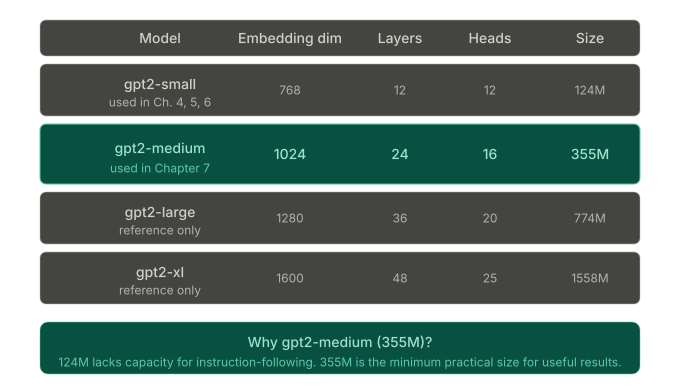

---

## Listing 7.7 — Loading the pretrained model

```python
from gpt_download import download_and_load_gpt2
from chapter04 import GPTModel
from chapter05 import load_weights_into_gpt

BASE_CONFIG = {
    "vocab_size":     50257,   # GPT-2 vocabulary size
    "context_length": 1024,    # max tokens the model can process
    "drop_rate":      0.0,     # dropout disabled for fine-tuning
    "qkv_bias":       True     # must match OpenAI's trained checkpoint
}

model_configs = {
    "gpt2-small (124M)":  {"emb_dim": 768,  "n_layers": 12, "n_heads": 12},
    "gpt2-medium (355M)": {"emb_dim": 1024, "n_layers": 24, "n_heads": 16},
    "gpt2-large (774M)":  {"emb_dim": 1280, "n_layers": 36, "n_heads": 20},
    "gpt2-xl (1558M)":    {"emb_dim": 1600, "n_layers": 48, "n_heads": 25},
}

CHOOSE_MODEL = "gpt2-medium (355M)"
BASE_CONFIG.update(model_configs[CHOOSE_MODEL])

model_size = CHOOSE_MODEL.split(" ")[-1].lstrip("(").rstrip(")")
settings, params = download_and_load_gpt2(model_size=model_size, models_dir="gpt2")

model = GPTModel(BASE_CONFIG)
load_weights_into_gpt(model, params)
model.eval()
```

---

## The config system — understanding every parameter

### Why two dictionaries?

`BASE_CONFIG` holds the four parameters that are the same across all four GPT-2 sizes. `model_configs` holds the three parameters that vary by size. Calling `BASE_CONFIG.update(model_configs[CHOOSE_MODEL])` merges them into a single complete config. After the update, `BASE_CONFIG` contains all six keys that `GPTModel` needs:

```
After BASE_CONFIG.update(model_configs["gpt2-medium (355M)"]):

vocab_size:     50257   ← fixed, all sizes
context_length: 1024    ← fixed, all sizes
drop_rate:      0.0     ← fixed, all sizes
qkv_bias:       True    ← fixed, all sizes
emb_dim:        1024    ← size-specific (was 768 for small)
n_layers:       24      ← size-specific (was 12 for small)
n_heads:        16      ← size-specific (was 12 for small)
```

### `vocab_size = 50257`

GPT-2 uses Byte Pair Encoding (BPE) tokenisation with a vocabulary of 50,257 tokens (50,000 merge rules + 256 byte tokens + 1 special end-of-text token). This is fixed for all four model sizes — they all use the same tokeniser, just different-sized transformer internals.

### `context_length = 1024`

This is the maximum number of tokens the model can process in a single forward pass. Earlier chapters used `context_length = 256` as a training convenience to speed up experiments on small datasets. The real GPT-2 was trained with 1,024 tokens. When loading OpenAI's weights, we must use 1,024 because the positional embedding table has exactly 1,024 rows — one learned embedding vector per possible position. If we set `context_length = 256` and tried to load a checkpoint with 1,024 positional embeddings, the shapes would mismatch and the load would fail.

### `drop_rate = 0.0` — why dropout is disabled

During pretraining, dropout with a non-zero rate (typically 0.1) helps regularise the model — it randomly zeros out some activations during each forward pass, preventing the model from becoming over-reliant on any single pathway. This is useful when training from scratch on a large dataset where overfitting is a real risk.

Fine-tuning is a very different situation. The pretrained weights already encode rich, carefully-learned representations built from billions of tokens. These representations are exactly what we are trying to exploit. Applying dropout during fine-tuning randomly damages these representations on every forward pass, adding noise to the signal we are preserving. The fine-tuning dataset (935 training examples) is also tiny compared to pretraining data, so there is far less risk of overfitting to the training format. Setting `drop_rate = 0.0` disables dropout completely for the duration of fine-tuning.

### `qkv_bias = True` — an architectural compatibility requirement

In the attention mechanism, the query, key, and value matrices are computed from the input using linear projections: `Q = xW_Q`, `K = xW_K`, `V = xW_V`. Modern LLM implementations often omit bias terms from these projections (i.e., no `+ b_Q`, `+ b_K`, `+ b_V`), slightly reducing parameter count with negligible impact on performance.

OpenAI's original GPT-2 training included these bias terms. The released checkpoint therefore contains bias weight tensors for every attention layer in every transformer block. When `load_weights_into_gpt` copies weights from the checkpoint into the `GPTModel` parameter slots, it must find matching shapes. If `qkv_bias = False`, the model has no bias slots in those positions, and the function would encounter a shape mismatch. Setting `qkv_bias = True` creates the bias slots, making the architecture exactly match what OpenAI trained.

This is purely a compatibility constraint — it has nothing to do with whether QKV bias is theoretically beneficial. If you were training GPT from scratch you could freely set `qkv_bias = False`.

---

## The model size string extraction

```python
model_size = CHOOSE_MODEL.split(" ")[-1].lstrip("(").rstrip(")")
```

This is a small but important string manipulation. Let's trace it:

```
CHOOSE_MODEL = "gpt2-medium (355M)"

.split(" ")      → ["gpt2-medium", "(355M)"]
[-1]             → "(355M)"
.lstrip("(")     → "355M)"
.rstrip(")")     → "355M"
```

The `download_and_load_gpt2` function uses this string to find the correct directory on OpenAI's servers and in the local cache. It needs exactly `"355M"` — not `"gpt2-medium"`, not `"(355M)"`. The string manipulation extracts it cleanly from the human-readable model name string.

---

## The three-step load sequence

```python
model = GPTModel(BASE_CONFIG)       # Step 1: build the shell
load_weights_into_gpt(model, params)  # Step 2: fill with pretrained weights
model.eval()                          # Step 3: switch to inference mode
```

Each step has a distinct purpose.

**Step 1 — `GPTModel(BASE_CONFIG)`:** This creates the model architecture with all the right shapes and dimensions, but filled with random (or zero-initialised) weights. It is a correctly-shaped container with no learned knowledge. At this stage, calling `generate` on it would produce random token sequences.

**Step 2 — `load_weights_into_gpt(model, params)`:** This function (defined in Chapter 5) iterates through every parameter tensor in `params` — the NumPy arrays downloaded from OpenAI's checkpoint — and copies each one into the corresponding slot in `model`. After this call, the model contains exactly the weights that OpenAI trained. The function handles name mapping between OpenAI's TensorFlow naming conventions and our PyTorch `GPTModel` parameter names, as well as transposing weight matrices where necessary (linear layer weights are stored transposed in the TF checkpoint).

**Step 3 — `model.eval()`:** PyTorch modules have two modes: training mode and evaluation mode. In training mode, dropout is active and batch normalisation uses batch statistics. In evaluation mode, dropout is inactive (all neurons are always active) and batch normalisation uses stored running statistics. Since we want deterministic, reproducible generation for the baseline evaluation, `model.eval()` must be called before any forward pass.

### The download output

On first run, the following files are downloaded to the `gpt2/355M/` directory:

```
checkpoint:                        77.0 B
encoder.json:                    1.04 MB   (BPE merge vocabulary)
hparams.json:                      91 B    (architecture config)
model.ckpt.data-00000-of-00001:  1.42 GB   (the actual weights)
model.ckpt.index:               10.4 KB
model.ckpt.meta:                 927 KB
vocab.bpe:                       456 KB   (BPE merge rules)
```

The 1.42 GB data file contains all 355 million parameter tensors stored in TensorFlow's checkpoint format. On subsequent runs, the download is skipped and the local cache is used.

---

## Baseline evaluation — testing before fine-tuning

Before any fine-tuning, the book generates a response from the freshly loaded pretrained model. This serves two purposes: it confirms the weight load was successful (the model can generate coherent language), and it establishes a qualitative baseline showing what instruction-following looks like without any instruction training.

```python
torch.manual_seed(123)
input_text = format_input(val_data[0])
print(input_text)
```

The formatted input (using the Alpaca template) for `val_data[0]`:

```
Below is an instruction that describes a task. Write a response that
appropriately completes the request.

### Instruction:
Convert the active sentence to passive: 'The chef cooks the meal every day.'
```

Now generating the model's response:

```python
from chapter05 import generate, text_to_token_ids, token_ids_to_text

token_ids = generate(
    model=model,
    idx=text_to_token_ids(input_text, tokenizer),
    max_new_tokens=35,
    context_size=BASE_CONFIG["context_length"],
    eos_id=50256,
)
generated_text = token_ids_to_text(token_ids, tokenizer)
response_text = generated_text[len(input_text):].strip()
print(response_text)
```

### Understanding the response extraction

`generate` returns the full token sequence including both the input prompt and the model's continuation. This is the standard text-completion behaviour — the model simply predicts what comes next after the prompt. The result is `prompt + generated_continuation` as a single string.

To see only what the model added, we slice off the input:

```python
response_text = generated_text[len(input_text):].strip()
```

`len(input_text)` is the number of characters in the formatted prompt string. Slicing from that position onward gives only the tokens the model generated. `.strip()` removes any leading or trailing whitespace.

### What the pretrained model actually outputs

```
### Response:
The chef cooks the meal every day.

### Instruction:
Convert the active sentence to passive: 'The chef cooks the...
```

This is the characteristic failure mode of a text-completion model given an instruction prompt. It does not follow the instruction at all. Instead it:

1. Generates the `### Response:` header correctly (it has seen this pattern in web text)
2. Repeats the original sentence verbatim rather than transforming it
3. Starts generating another `### Instruction:` section, looping back into the template

The model is doing exactly what it was trained to do: predict the most plausible continuation of the input text. From its perspective, the most likely thing after a `### Response:` header followed by an instruction is... another example in the same format. It has no concept of "follow this instruction." That capability is what fine-tuning adds.


---

## Initial loss — the numerical baseline

Before training begins, the initial loss is computed over a sample of batches:

```python
from chapter05 import calc_loss_loader, train_model_simple

model.to(device)
torch.manual_seed(123)

with torch.no_grad():
    train_loss = calc_loss_loader(train_loader, model, device, num_batches=5)
    val_loss   = calc_loss_loader(val_loader,   model, device, num_batches=5)

print("Training loss:", train_loss)   # 3.825908660888672
print("Validation loss:", val_loss)   # 3.7619335651397705
```

### What these numbers mean

The loss here is cross-entropy — the negative average log probability the model assigns to the correct next token across all positions in the batch. A value of 3.83 means the model assigns an average probability of approximately $e^{-3.83} \approx 0.022$ (about 2.2%) to each correct token. That sounds low, but consider: with a vocabulary of 50,257 tokens, a completely random model would assign probability $1/50257 \approx 0.002\%$ to each correct token, giving a theoretical loss floor of $-\log(1/50257) \approx 10.82$.

The pretrained model's loss of 3.83 is dramatically better than chance (10.82), because the model has strong language modelling ability. It correctly assigns high probability to plausible next tokens in English text. But it is not yet calibrated to the specific format of instruction-response pairs — the response tokens after `### Response:` are not what the model predicts with high confidence yet.

### Why `num_batches=5`?

Computing loss over the entire training set (116 batches) before every training run would be slow. Sampling 5 batches gives a representative estimate without the full cost. This is the same strategy used in Chapter 5's training loop for intermediate evaluations during training — quick approximate checks rather than full-dataset measurements.

### Why `torch.no_grad()`?

Loss computation for evaluation does not require building a computational graph for backpropagation. `torch.no_grad()` disables graph construction, which significantly reduces memory usage during the forward pass. Without it, PyTorch would store all intermediate activations needed for gradient computation — activations that will never be used. For a 355M parameter model, that is a lot of wasted memory.

### Training loss vs validation loss

At 3.83 (train) and 3.76 (val), the two losses are close to each other. This is expected before any fine-tuning: the model has not memorised anything from the training set, so there is no overfitting and no generalisation gap. Once fine-tuning begins, the training loss will fall faster than the validation loss as the model starts fitting the training examples. Watching this gap is how we detect overfitting.

### Hardware runtime reference

| Model              | Device               | Time for 2 epochs |
| ------------------ | -------------------- | ----------------- |
| gpt2-medium (355M) | CPU (M3 MacBook Air) | 15.78 min         |
| gpt2-medium (355M) | GPU (NVIDIA L4)      | 1.83 min          |
| gpt2-medium (355M) | GPU (NVIDIA A100)    | 0.86 min          |
| gpt2-small (124M)  | CPU (M3 MacBook Air) | 5.74 min          |
| gpt2-small (124M)  | GPU (NVIDIA L4)      | 0.69 min          |
| gpt2-small (124M)  | GPU (NVIDIA A100)    | 0.39 min          |

The RTX A6000 used in this repository falls between the L4 and A100 figures. No code changes are needed to use a GPU — `device` detection handles it automatically.

---

## Summary — what Section 7.5 established

At the end of this section, three things are in place:

```
✓ A pretrained GPT-2 medium model (355M parameters) is loaded and verified
✓ A qualitative baseline is established: model cannot follow instructions yet
✓ A numerical baseline is recorded: train loss 3.83, val loss 3.76
```

Everything is ready for Section 7.6, which runs the fine-tuning training loop and drives both losses down significantly.

---

_Section 7.5 complete. Section 7.6 begins the actual fine-tuning: setting up the AdamW optimiser with a low learning rate, running `train_model_simple` for two epochs, and watching the model learn to follow instructions from a starting loss of ~3.8 down to below 1.0._

# 6: Fine-Tuning the LLM on Instruction Data

> **This section covers:** Setting up the AdamW optimiser with carefully chosen hyperparameters, running `train_model_simple` (reused from Chapter 5) for two epochs over 935 training examples, watching the training and validation loss fall from ~3.8 to ~0.3, inspecting the qualitative improvement in generated responses after each epoch, plotting and reading the loss curves, and saving the fine-tuned model to disk. This is the section where the model actually learns to follow instructions — everything in Sections 7.2–7.5 was preparation for these ~100 lines of code.

---

## Where this section sits

```
STAGE 2 — Fine-tuning the LLM
┌───────────────────────────────────────────────────────────────┐
│  Step 4: Loading a pretrained LLM          (Section 7.5)      │
│  Step 5: Instruction fine-tuning the LLM  ◄── THIS SECTION    │
│  Step 6: Inspecting the modelling loss    ◄── THIS SECTION    │
└───────────────────────────────────────────────────────────────┘
```

Stage 1 (data pipeline) is complete. The pretrained 355M model is loaded. All that remains is to run the training loop — and because the book reuses `train_model_simple` from Chapter 5 without modification, the section is shorter than the dataset sections but mechanically crucial.

---

## What changes from pretraining — and what does not

It is worth being explicit about exactly what is different in fine-tuning compared to pretraining, because the code looks nearly identical.

**What stays the same:** The `GPTModel` architecture is unchanged. The `train_model_simple` function is unchanged. The `calc_loss_loader` and `plot_losses` utilities are unchanged. The loss function is still cross-entropy over next-token prediction. The optimiser is still AdamW.

**What is different:** The data (instruction-response pairs instead of raw text). The learning rate (10x smaller to preserve pretrained weights). The number of epochs (2 instead of 10). The starting weights (OpenAI's pretrained checkpoint instead of random initialisation). The `start_context` (an Alpaca-formatted instruction instead of a free text prompt).

The entire effect of instruction fine-tuning comes from these differences in configuration and data, not from any new architectural machinery.

---

## Listing 7.8 — the fine-tuning setup and run

```python
import time
from chapter05 import calc_loss_loader, train_model_simple

start_time = time.time()
torch.manual_seed(123)

optimizer = torch.optim.AdamW(
    model.parameters(), lr=0.00005, weight_decay=0.1
)
num_epochs = 2

train_losses, val_losses, tokens_seen = train_model_simple(
    model, train_loader, val_loader, optimizer, device,
    num_epochs=num_epochs,
    eval_freq=5,
    eval_iter=5,
    start_context=format_input(val_data[0]),
    tokenizer=tokenizer
)

end_time = time.time()
execution_time_minutes = (end_time - start_time) / 60
print(f"Training completed in {execution_time_minutes:.2f} minutes.")
```

---

## The AdamW optimiser — and why the hyperparameters are what they are

### `lr=0.00005` (5×10⁻⁵)

This is an extremely small learning rate by pretraining standards. When GPT-2 was originally trained, learning rates in the range of 10⁻³ to 10⁻⁴ were used. Fine-tuning learning rates are typically 10–100× smaller than pretraining rates, landing in the 10⁻⁴ to 10⁻⁵ range.

The reason is preservation. The 355M pretrained weights encode linguistic representations built from billions of tokens over days of compute. These representations are precisely what we want to exploit — the model's ability to understand English, produce grammatical sentences, and generalise across topics. A large learning rate would cause weights to jump far from their pretrained values in just a few hundred steps, overwriting this knowledge with signal from only 935 short examples. The result would be a model that knows nothing about language and has only partially learned instruction-following.

With `lr=5e-5`, each update nudges the weights very slightly. The pretrained representations are preserved as a strong starting point, and the model incrementally adjusts them toward instruction-following behaviour.

### `weight_decay=0.1`

Weight decay (L2 regularisation) adds a small penalty proportional to the squared magnitude of each weight. On every update step, each weight shrinks slightly toward zero before the gradient update is applied. Large weights shrink faster than small ones.

A small numerical example:

```
weight w = 2.5,  lr = 0.00005,  weight_decay = 0.1

Weight decay step (applied before gradient update):
  w_decayed = w × (1 - lr × weight_decay)
  w_decayed = 2.5 × (1 - 0.00005 × 0.1)
  w_decayed = 2.5 × 0.999995
  w_decayed = 2.4999875   ← shrinks by 0.0000125 each step

A small weight of 0.001 would shrink by 0.0000000005 — negligible.
```

Over thousands of steps, large weights accumulate meaningful shrinkage while small weights are barely affected. This discourages the model from developing very large, overconfident weight values that memorise training examples, and encourages solutions that spread signal across many moderate weights — which generalise better.

With only 935 training examples, there is real risk of overfitting. `weight_decay=0.1` provides regularisation pressure without significantly slowing learning.

### `num_epochs=2`

Two complete passes through the 935-entry training set. The book explicitly states that extending to a third epoch or more is not essential and may be counterproductive — it would likely increase the gap between training and validation loss as the model begins to memorise specific instruction-response pairs rather than learning the general skill of following instructions.

The 2-epoch choice is supported by the training output: by the end of epoch 2, the model can already produce the correct passive voice conversion for the validation example. The loss is still decreasing but at a much slower rate, suggesting diminishing returns.

### `eval_freq=5` and `eval_iter=5`

Every 5 training steps, the training loop pauses to measure loss. It uses `eval_iter=5` batches from each loader to estimate the loss quickly — computing over the full training set of 116 batches would be far too slow. Five batches gives a good representative sample in a fraction of the time.

The `eval_freq=5` choice means we get a loss reading approximately every 5 × 8 = 40 training examples — frequent enough to see the loss curve clearly without dominating the runtime.

### `start_context=format_input(val_data[0])`

At the end of each epoch, `train_model_simple` generates a text sample starting from this prompt and prints it. The instruction in `val_data[0]` is:

```
Below is an instruction that describes a task. Write a response that
appropriately completes the request.

### Instruction:
Convert the active sentence to passive: 'The chef cooks the meal every day.'
```

Using the same fixed prompt at every evaluation point lets you watch the model's qualitative progress directly. As the loss falls, the generated response should become more coherent and eventually correct.

---

## The training output — reading the numbers

```
Ep 1 (Step 000000): Train loss 2.637, Val loss 2.626
Ep 1 (Step 000005): Train loss 1.174, Val loss 1.103
Ep 1 (Step 000010): Train loss 0.872, Val loss 0.944
Ep 1 (Step 000015): Train loss 0.857, Val loss 0.906
...
Ep 1 (Step 000115): Train loss 0.520, Val loss 0.665

[Generated at end of epoch 1:]
The meal is prepared every day by the chef.<|endoftext|>

Ep 2 (Step 000120): Train loss 0.438, Val loss 0.670
Ep 2 (Step 000125): Train loss 0.453, Val loss 0.685
...
Ep 2 (Step 000230): Train loss 0.300, Val loss 0.657

[Generated at end of epoch 2:]
The meal is cooked every day by the chef.<|endoftext|>

Training completed in 0.87 minutes.
```

### Step arithmetic

With `batch_size=8` and 935 training examples, `drop_last=True` gives:

```
935 / 8 = 116.875 → 116 full batches per epoch
```

Each epoch runs 116 batch iterations. With `eval_freq=5`, evaluations happen at steps 0, 5, 10, ..., 115 within epoch 1 (24 evaluations per epoch), then 120, 125, ..., 230 within epoch 2 — giving approximately 48 loss readings across both epochs.

### What the numbers tell us

The drop from 2.637 to 1.174 in just 5 steps (40 training examples) is dramatic. This is the pretrained weights doing their job — the model already understands language, so it quickly learns the shape of the instruction-response format. The first few gradient updates are strong because the initial responses are very wrong (the model is using its text-completion mode rather than instruction-following mode), giving large loss values and therefore large gradients.

By step 10 (loss 0.872), the model has already learned the basic structure: it knows to put content after `### Response:` rather than looping back to the instruction. By step 115 (loss 0.520), it is getting the transformation approximately right.

The validation loss follows the training loss closely throughout epoch 1, staying only slightly above it. This small gap indicates the model is generalising rather than memorising — it is learning to follow instructions in general, not just the specific 935 training examples.

### The qualitative progression


**End of epoch 1 (step 115, loss 0.520):**

```
The meal is prepared every day by the chef.
```

This is almost correct — the sentence structure is right (subject = "the meal", passive verb, "by the chef"). The verb is wrong: "prepared" instead of "cooked". The model has learned the passive construction pattern but hasn't yet perfectly matched the specific verb from the input.

**End of epoch 2 (step 230, loss 0.300):**

```
The meal is cooked every day by the chef.
```

This is exactly correct. The model correctly converts "The chef cooks the meal every day" to its passive form, uses the right verb, preserves the temporal adverb "every day", and appends the EOS token (`<|endoftext|>`) to signal it is done generating.

The `<|endoftext|>` in the output is important — it shows the model has also learned to stop generating at the right moment. Before fine-tuning, the model would loop into more instruction text. Now it knows that after the response, the sequence is complete.

After the EOS, the model continues to generate what looks like the beginning of a new instruction — "The following is an instruction that describes a task..." — which is expected because `generate` was called without `eos_id=50256`. In actual extraction (Section 7.7), the `eos_id` argument stops generation at the first EOS token.

### Train vs validation loss — the healthy gap

The training loss (0.300) is lower than the validation loss (0.657) at the end of training. This gap is expected and healthy for this size of dataset. Some key observations:

The gap opens up in epoch 2 — training loss continues falling sharply while validation loss barely moves (from ~0.665 to ~0.657). This is mild overfitting: the model is starting to fit specific training examples more precisely than the instruction-following pattern in general.

The gap is not alarming because the validation loss is still decreasing (just slowly) and the qualitative output is correct. The book's warning is that continuing to epoch 3 or 4 would widen this gap further as the model memorises training responses rather than generalising.

---

## Inspecting the loss curves — Figure 7.17

```python
from chapter05 import plot_losses

epochs_tensor = torch.linspace(0, num_epochs, len(train_losses))
plot_losses(epochs_tensor, tokens_seen, train_losses, val_losses)
```

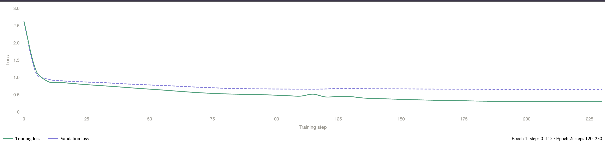

`torch.linspace(0, num_epochs, len(train_losses))` creates a tensor of epoch positions for each loss reading. With `num_epochs=2` and ~48 evaluation points, this maps each step to a fractional epoch position (e.g., step 5 in epoch 1 → epoch position ~0.04).

`plot_losses` from Chapter 5 draws two x-axes: epochs on the primary axis, and total tokens seen on a secondary axis. This dual-axis format lets you compare runs with different batch sizes on equal footing — a run with batch size 16 will see twice as many tokens per step but the epoch axis will still align correctly.

### Reading the curve shape

The training loss (solid line) shows two distinct phases:

Phase 1 (epoch 1, steps 0–115): Steep, rapid decrease from 2.637 down to ~0.52. The model is learning the basic mechanics of instruction-following format — where to put the response, when to stop, how to transform the input. This is fast because the pretrained weights already give it a head start.

Phase 2 (epoch 2, steps 120–230): Slower, more gradual decrease from ~0.44 to 0.300. The model is now refining finer details — exact word choices, grammatical precision, response completeness. Diminishing returns are setting in.

The validation loss (dashed line) closely tracks the training loss through epoch 1, then diverges slightly in epoch 2. This is the signature of a well-behaved fine-tuning run: both losses fall together through the bulk of training, with only mild divergence at the end.

---

## Saving the fine-tuned model

```python
import re

file_name = f"{re.sub(r'[ ()]', '', CHOOSE_MODEL)}-sft.pth"
torch.save(model.state_dict(), file_name)
print(f"Model saved as {file_name}")
```

The regular expression `re.sub(r'[ ()]', '', CHOOSE_MODEL)` removes all spaces and parentheses from the model name string:

```
CHOOSE_MODEL = "gpt2-medium (355M)"

re.sub(r'[ ()]', '', "gpt2-medium (355M)")
→ removes ' ', '(', ')'
→ "gpt2-medium355M"

file_name = "gpt2-medium355M" + "-sft.pth"
→ "gpt2-medium355M-sft.pth"
```

`sft` stands for **Supervised Fine-Tuning** — the standard abbreviation in the LLM literature for this type of training (distinguishing it from RLHF or DPO which are further alignment steps).

`torch.save(model.state_dict(), file_name)` saves only the model weights (the `state_dict` dictionary mapping parameter names to tensors), not the model architecture class or the optimizer state. This is the standard pattern for deployment — a separate script recreates the `GPTModel(BASE_CONFIG)` shell and loads the weights into it.

To reload for inference:

```python
model = GPTModel(BASE_CONFIG)
model.load_state_dict(torch.load("gpt2-medium355M-sft.pth"))
model.eval()
```

---

## Hardware and runtime context

| Model              | Device               | Time for 2 epochs |
| ------------------ | -------------------- | ----------------- |
| gpt2-medium (355M) | CPU (M3 MacBook Air) | 15.78 min         |
| gpt2-medium (355M) | GPU (NVIDIA L4)      | 1.83 min          |
| gpt2-medium (355M) | GPU (NVIDIA A100)    | 0.87 min          |
| gpt2-small (124M)  | CPU (M3 MacBook Air) | 5.74 min          |
| gpt2-small (124M)  | GPU (NVIDIA L4)      | 0.69 min          |
| gpt2-small (124M)  | GPU (NVIDIA A100)    | 0.39 min          |

No code changes are needed to switch between CPU and GPU — the `device` variable detected in Section 7.4 is used consistently throughout. If hardware is limiting, switching `CHOOSE_MODEL` to `"gpt2-small (124M)"` reduces training time by ~4× at the cost of response quality.

---

## What fine-tuning actually changes in the weights

A key conceptual point: fine-tuning does not add any new weights to the model. The 355M parameter count is the same before and after. What changes is the values of those parameters.

The gradient updates during instruction fine-tuning push the model's internal representations in a specific direction: the attention patterns and feed-forward computations that were previously optimised for "predict the next token in any English text" are now additionally optimised for "given this Alpaca-formatted instruction, generate the correct response."

The pretrained weights provide the foundation (language understanding, grammar, world knowledge). The fine-tuning updates provide the specialisation (follow the Alpaca format, respond to instructions rather than completing text).

This is why fine-tuning works with just 935 examples and 2 epochs. The model does not need to re-learn language from scratch — it only needs to learn to redirect its existing capabilities toward the instruction-following task.

---

_Section 7.6 complete. The fine-tuned model can now correctly follow simple instructions. Section 7.7 extracts and saves its responses on the full 110-entry test set, storing them alongside the correct answers for the quantitative evaluation in Section 7.8._

# 7: Extracting and Saving Responses

> **This section covers:** Running the fine-tuned model on the first three test entries for a qualitative sanity check, understanding exactly how the response is isolated from `generate()`'s output, interpreting the three results and why instruction evaluation is fundamentally harder than classification accuracy, the three main evaluation approaches used in practice, running the full extraction loop over all 110 test entries using `tqdm`, adding the `model_response` key to each dict, saving to `instruction-data-with-response.json` for use in Section 7.8, and saving the fine-tuned model weights to disk. This is the transition section from training into evaluation — the first time we hold the model accountable on genuinely unseen data.

---

## Where this section sits

```
STAGE 3 — Evaluating the LLM
┌───────────────────────────────────────────────────────────────┐
│  Step 7: Extracting responses         ◄── THIS SECTION        │
│  Step 8: Qualitative evaluation       ◄── THIS SECTION        │
│  Step 9: Scoring the responses            (Section 7.8)       │
└───────────────────────────────────────────────────────────────┘
```

Stage 2 (fine-tuning) is complete. The model knows how to follow instructions. Now we need to measure how well it does that across the full test set — 110 entries it has never seen. This section collects the evidence; Section 7.8 uses an automated judge to score it.

---

## Part 1 — Qualitative preview on three entries

Before running the full 110-entry extraction, the book first generates responses for three entries from the test set and prints them side by side with the correct answers. This serves as a quick sanity check: do the responses look coherent? Is the model at least attempting to follow the instruction?

```python
torch.manual_seed(123)
for entry in test_data[:3]:
    input_text = format_input(entry)
    token_ids = generate(
        model=model,
        idx=text_to_token_ids(input_text, tokenizer).to(device),
        max_new_tokens=256,
        context_size=BASE_CONFIG["context_length"],
        eos_id=50256
    )
    generated_text = token_ids_to_text(token_ids, tokenizer)
    response_text = (
        generated_text[len(input_text):]
        .replace("### Response:", "")
        .strip()
    )
    print(input_text)
    print(f"\nCorrect response:\n>> {entry['output']}")
    print(f"\nModel response:\n>> {response_text.strip()}")
    print("-------------------------------------")
```

### The response extraction logic — step by step

The `generate` function was designed for text completion: given a prompt, it appends tokens until it hits the EOS token or `max_new_tokens`. The return value is therefore the full concatenation:

```
generated_text = input_text + model's_continuation
```

To isolate only what the model generated, we slice from the end of the input:

```python
generated_text[len(input_text):]
```

`len(input_text)` is the character count of the formatted prompt string. Characters 0 through that index are the input we provided; characters from that index onward are what the model added.

But there is a subtlety. The model was trained with `### Response:` as a section header in the target sequence, so when generating, it will often prepend its answer with that header token. We strip it:

```python
.replace("### Response:", "")
```

Finally `.strip()` removes any leading or trailing whitespace or newlines left behind after the replacement.

A concrete trace:

```
input_text (abbreviated):
  "Below is an instruction... ### Instruction: Rewrite using a simile.
   ### Input: The car is very fast."

generated_text (what generate() returns):
  "Below is an instruction... ### Instruction: Rewrite using a simile.
   ### Input: The car is very fast.
   ### Response: The car is as fast as a bullet.<|endoftext|>"

generated_text[len(input_text):]:
  "\n### Response: The car is as fast as a bullet.<|endoftext|>"

.replace("### Response:", ""):
  "\n The car is as fast as a bullet.<|endoftext|>"

.strip():
  "The car is as fast as a bullet.<|endoftext|>"
```

The `<|endoftext|>` token ID (50256) was used as `eos_id` in `generate`, so generation stopped there. The text conversion includes it, but in practice it is ignored in evaluation — only the text before it matters.

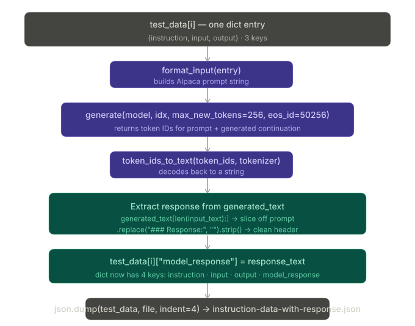

---

## The three qualitative results

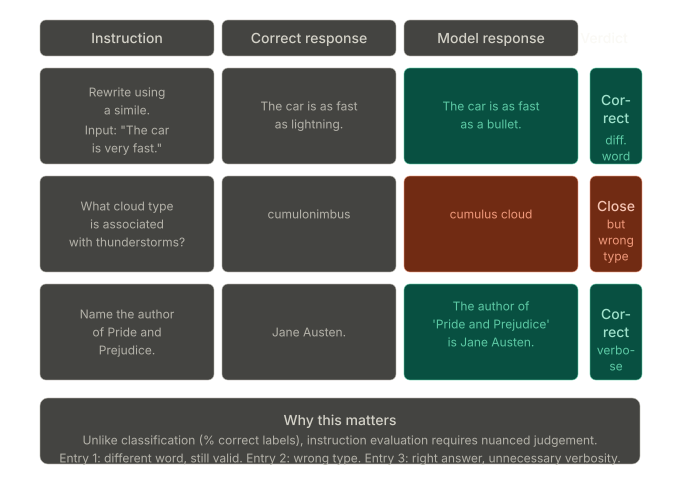

### Entry 1 — Simile rewrite

```
Instruction: Rewrite the sentence using a simile.
Input:       The car is very fast.

Correct:     The car is as fast as lightning.
Model:       The car is as fast as a bullet.
```

The model produces a valid simile using the correct construction "as X as Y" and a plausible comparator. "A bullet" is a recognised symbol of speed — it is an entirely reasonable simile. The answer differs from the expected output only in which fast-moving object is chosen. This is clearly a correct response.

This entry illustrates a fundamental problem with instruction evaluation: there is no single correct answer for many tasks. Any well-formed simile conveying speed would be acceptable. A metric that compared the model output character-by-character against the reference would mark this as wrong, which is clearly incorrect.

### Entry 2 — Cloud type identification

```
Instruction: What type of cloud is typically associated with thunderstorms?

Correct:     The type of cloud typically associated with thunderstorms is cumulonimbus.
Model:       The type of cloud associated with thunderstorms is a cumulus cloud.
```

The model gets the sentence structure right — it produces a full sentence that directly answers the question. But the specific answer is wrong: "cumulus cloud" rather than "cumulonimbus." The book notes that cumulus clouds can develop into cumulonimbus clouds, so there is partial understanding here. The model knows clouds are involved and constructs a proper factual sentence format — it just retrieves the wrong cloud type from memory.

This is a factual error, not a structural or reasoning error. The model clearly understood the question type and attempted a factual answer.

### Entry 3 — Author identification

```
Instruction: Name the author of 'Pride and Prejudice.'

Correct:     Jane Austen.
Model:       The author of 'Pride and Prejudice' is Jane Austen.
```

The model is factually correct. Jane Austen is the right answer. However, the response is more verbose than the expected answer — it rephrases the question as part of the response rather than just stating the name. This verbose-but-correct style is a known pattern in instruction-fine-tuned models, particularly smaller ones trained on varied instruction formats.

Is this a correct answer? Functionally yes. The information is there and accurate. The verbosity is mildly suboptimal but not wrong. A strict string-comparison evaluation would mark it as incorrect, which is again clearly inadequate as a measure.

---

## Why instruction evaluation is not like classification accuracy

The spam classifier from Chapter 6 had a simple evaluation: compute what percentage of test messages were correctly labelled as spam or ham. Binary outputs, exact match, one number.

Instruction fine-tuning does not have this luxury. The three examples above already reveal three distinct flavour of answer quality:

Entry 1 shows that there can be multiple correct answers — the task is creative and open-ended. Any reasonable simile would be acceptable.

Entry 2 shows a factual error — the model retrieved the wrong specific term. This is clear-cut wrong, but the model still demonstrated it understood the question structure.

Entry 3 shows correct-but-verbose — the model knows the answer but packages it in more words than needed. Depending on the application, this might be fine or might be penalised.

None of these are cleanly captured by "percentage correct." A richer evaluation framework is needed.

---

## Three evaluation approaches for instruction-tuned LLMs

The book introduces three standard approaches used in practice:

### 1. Short-answer and multiple-choice benchmarks

Examples: MMLU (Measuring Massive Multitask Language Understanding — arxiv.org/abs/2009.03300).

These present the model with a question and several candidate answers (A, B, C, D). The model selects one. This constrains the output space to a finite set of choices, making evaluation trivially exact-match.

The advantage is objectivity and reproducibility: every researcher using the same benchmark gets comparable numbers. The disadvantage is that multiple-choice tests a different skill than open-ended generation. A model might score well on MMLU while producing poor conversational responses, or vice versa. The format forces the model to recognise the right answer rather than generate it.

### 2. Human preference comparison

Examples: LMSYS Chatbot Arena (arena.lmsys.org).

Humans are shown responses from two different models side by side (without knowing which model produced which) and asked which response they prefer. The preferences are aggregated into an Elo-style ranking.

This is the gold standard for conversational quality — it directly measures what users actually find helpful. The disadvantage is scale: rating thousands of responses requires significant human time and is expensive. It also has inconsistency issues as different raters have different preferences.

### 3. Automated conversational benchmarks (LLM-as-judge)

Examples: AlpacaEval (tatsu-lab.github.io/alpaca_eval/).

A separate, stronger LLM is used to evaluate the responses automatically. Given the instruction, the reference answer, and the model's response, the judge LLM assigns a score. This combines the scale advantage of automated evaluation with the nuanced judgement advantage of language understanding.

The limitation is that the judge LLM is not infallible — it has its own biases and blind spots, and its scores correlate but do not perfectly align with human preferences. It is also sensitive to prompt design: the same response can receive different scores with different judge prompts.

**What Section 7.8 does:** It adopts approach 3, using Llama 3 8B (via Ollama) as the judge. This is inspired by AlpacaEval but uses the book's own custom test set rather than a standardised benchmark. The quantitative score from Section 7.8 is the first concrete number the chapter produces for model quality — the loss curves from Section 7.6 measure training progress, but not actual response quality.

---

## Part 2 — Full extraction loop (Listing 7.9)

With the qualitative preview done, the section runs extraction over the entire 110-entry test set:

```python
from tqdm import tqdm

for i, entry in tqdm(enumerate(test_data), total=len(test_data)):
    input_text = format_input(entry)
    token_ids = generate(
        model=model,
        idx=text_to_token_ids(input_text, tokenizer).to(device),
        max_new_tokens=256,
        context_size=BASE_CONFIG["context_length"],
        eos_id=50256
    )
    generated_text = token_ids_to_text(token_ids, tokenizer)
    response_text = (
        generated_text[len(input_text):]
        .replace("### Response:", "")
        .strip()
    )
    test_data[i]["model_response"] = response_text

with open("instruction-data-with-response.json", "w") as file:
    json.dump(test_data, file, indent=4)
```

### `tqdm` — tracking progress over 110 entries

`tqdm` wraps any iterable and displays a progress bar in the terminal:

```
100%|████████████████| 110/110 [01:05<00:00, 1.68it/s]
```

`tqdm(enumerate(test_data), total=len(test_data))` — the `total=len(test_data)` argument is needed because `enumerate` produces a lazy iterator and `tqdm` cannot determine its length automatically. Without `total`, tqdm would still work but would not know the denominator for the percentage display.

The generation rate of `1.68it/s` on an A100 means each entry takes roughly 0.6 seconds to generate. This is because `max_new_tokens=256` means the model may generate up to 256 tokens per entry, each requiring a full forward pass through all 24 layers of the 355M model.

### Why `test_data[i]` not `entry`

The loop uses `tqdm(enumerate(test_data), ...)` to get both the index `i` and the dictionary `entry`. The line:

```python
test_data[i]["model_response"] = response_text
```

modifies the original list in place using the index. This is necessary because `entry` is a copy of the dict reference in CPython's `for` loop — assigning `entry["model_response"] = response_text` would work for adding a key to the dict object itself (since dicts are mutable), but using `test_data[i]` makes the intent explicit and unambiguous.

### The `model_response` key — dict structure before and after

Before extraction, each entry in `test_data` has three keys:

```python
{
    "instruction": "Rewrite the sentence using a simile.",
    "input":       "The car is very fast.",
    "output":      "The car is as fast as lightning."
}
```

After the loop, each entry has four:

```python
{
    "instruction":    "Rewrite the sentence using a simile.",
    "input":          "The car is very fast.",
    "output":         "The car is as fast as lightning.",
    "model_response": "The car is as fast as a bullet."
}
```

The `output` key (the dataset's reference answer) is preserved untouched alongside the new `model_response` key. Section 7.8 uses both together to evaluate quality: `output` is the gold standard, `model_response` is what the model produced.

### Verification

```python
print(test_data[0])
# {'instruction': 'Rewrite the sentence using a simile.',
#  'input': 'The car is very fast.',
#  'output': 'The car is as fast as lightning.',
#  'model_response': 'The car is as fast as a bullet.'}
```

The `model_response` key appears correctly alongside the original three keys, confirming the in-place update worked as expected.

### Saving to JSON

```python
with open("instruction-data-with-response.json", "w") as file:
    json.dump(test_data, file, indent=4)
```

`json.dump` serialises the Python list of dicts to JSON format. `indent=4` produces pretty-printed output with four-space indentation, making the file human-readable when opened in a text editor. Without `indent`, the entire JSON would be written on a single line — valid but unreadable.

The file is named `instruction-data-with-response.json` to distinguish it clearly from the original `instruction-data.json`. The naming convention makes clear that this is the original dataset extended with model responses — not a new dataset, but an augmented version of the existing one.

### Runtime

| Device               | Time for 110 entries |
| -------------------- | -------------------- |
| GPU (NVIDIA A100)    | ~1 minute            |
| CPU (M3 MacBook Air) | ~6 minutes           |

The bottleneck is sequential generation: each of the 110 entries requires a separate `generate` call, and generation is sequential at the token level — token N cannot be generated until token N-1 is complete. Batch generation over multiple entries simultaneously is possible but not implemented here.

---

## Model save

Also appearing in this section (after extraction) is the model save:

```python
import re

file_name = f"{re.sub(r'[ ()]', '', CHOOSE_MODEL)}-sft.pth"
torch.save(model.state_dict(), file_name)
print(f"Model saved as {file_name}")
# Model saved as gpt2-medium355M-sft.pth
```

The regex removes spaces and parentheses from `"gpt2-medium (355M)"` → `"gpt2-medium355M"`, and `sft` (Supervised Fine-Tuning) is appended as a suffix to distinguish the fine-tuned checkpoint from the base pretrained weights.

To reload in a future session:

```python
model = GPTModel(BASE_CONFIG)
model.load_state_dict(torch.load("gpt2-medium355M-sft.pth"))
model.eval()
```

---

## Exercise 7.3 — Fine-tuning on the original Stanford Alpaca dataset

The book's custom dataset has 1,100 entries. The original Stanford Alpaca dataset contains 52,002 entries — roughly 50× more. It is available at https://mng.bz/NBnE and represents one of the earliest and most influential openly shared instruction datasets.

Using it would give the model significantly more varied instruction-following examples to learn from. The expected result is a model that follows a wider range of instructions more reliably. The tradeoffs are compute and memory:

Training on 52,002 entries with batch size 8 produces ~6,500 batches per epoch — roughly 56× more steps than the book's 116 batches. A GPU becomes essentially mandatory.

If you encounter out-of-memory errors: reduce `batch_size` from 8 to 4, 2, or 1. If memory is still insufficient, reduce `allowed_max_length` from 1,024 to 512 or 256 — this truncates the longer entries but keeps the short ones intact.

---

_Section 7.7 complete. The 110-entry test set now has model responses attached to each entry, saved in `instruction-data-with-response.json`. Section 7.8 loads this file and passes each (instruction, correct_output, model_response) triple to Llama 3 8B running locally via Ollama, which assigns a numerical score from 0 to 100. The average score across all 110 entries gives the chapter's final quantitative verdict on the fine-tuned model._

# 8: Evaluating the Fine-Tuned LLM

> **This section covers:** The motivation for automated LLM-as-judge evaluation over manual scoring, setting up Ollama to run Llama 3 8B locally, verifying the Ollama process is active before making API calls, implementing `query_model` to communicate with Llama 3 via its REST API, running a verbose qualitative scoring pass on the first three test entries to understand the judge's reasoning, switching to an integer-only prompt for scalable scoring, running `generate_model_scores` over all 110 test entries, interpreting the final score of 50.32 against reference baselines, and the book's suggested strategies for improvement. This section completes the instruction fine-tuning pipeline and produces the chapter's only concrete performance number.

---

## Where this section sits

```
STAGE 3 — Evaluating the LLM
┌───────────────────────────────────────────────────────────────┐
│  Step 7: Extracting responses          (Section 7.7)          │
│  Step 8: Qualitative evaluation        (Section 7.7)          │
│  Step 9: Scoring the responses        ◄── THIS SECTION        │
└───────────────────────────────────────────────────────────────┘
```

Section 7.7 gave us qualitative evidence — three side-by-side examples showing the model can produce reasonable answers. But three examples do not tell us how the model performs across the full 110-entry test set, nor do they give us a number we can compare against other models. Section 7.8 provides both.

---

## Why automated LLM evaluation

The manual approach — reading each response and assigning a rating — does not scale. Reading and scoring all 110 responses would take significant time, and there is no practical way to do it for thousands or millions of responses. More importantly, human evaluation is inconsistent: different people have different standards for what counts as "correct," especially for tasks like creative writing or paraphrase where there is no single right answer.

The solution adopted here is inspired by AlpacaEval: use a separate, stronger LLM as the judge. The judge receives the instruction, the reference answer, and the model's response, and assigns a score. This scales to any number of responses and applies a consistent standard across all entries.

The judge chosen is Llama 3 8B — a capable open-source instruction-fine-tuned model from Meta AI. It is significantly larger than the 355M model being evaluated, giving it better general knowledge and reasoning ability. Running it locally via Ollama avoids sending proprietary data to external APIs.


---

## What Ollama is — and what it is not

Ollama is an application that wraps `llama.cpp`, a C/C++ implementation of LLM inference optimised for CPU and Apple Silicon. It exposes a local REST API at `http://localhost:11434` that can be queried from Python.

Two things Ollama is specifically not: it is not a training framework (cannot fine-tune models), and it is not a cloud service (everything runs locally on your machine). The model weights are downloaded once and cached on disk.

### Installing and starting Ollama

Installation depends on the operating system. For macOS and Windows: download the Ollama app from `https://ollama.com` and open it; select Yes if prompted about CLI access. For Linux: use the install command provided on the Ollama website.

Once installed, Ollama must be actively running before any API calls. Two ways to ensure this:

```bash
# Option 1: run the Ollama application (macOS — runs as background process)

# Option 2: start the server explicitly in a terminal
ollama serve
```

Both options are shown in Figure 7.20 of the book. Keep whichever option you choose running for the remainder of the chapter.

### Downloading and verifying Llama 3

In a separate terminal, run:

```bash
ollama run llama3
```

On first run, this downloads the model (~4.7 GB):

```
pulling 6a0746a1ec1a... 100%  4.7 GB
pulling 4fa551d4f938... 100%   12 KB
pulling 8ab4849b038c... 100%  254 B
...
success
```

Once downloaded, Ollama presents an interactive CLI. You can test it:

```
>>> What do llamas eat?
Llamas are ruminant animals, which means they have a four-chambered
stomach that allows them to digest plant-based foods. Their diet
typically consists of: 1. Grasses...
```

Type `/bye` to exit the interactive session. Crucially, keep `ollama serve` or the Ollama application running — the Python API calls in the notebook need it.

### Alternative models by RAM availability

| Model                  | Command                 | RAM needed  |
| ---------------------- | ----------------------- | ----------- |
| Llama 3 8B (default)   | `ollama run llama3`     | ~16 GB      |
| Phi-3 3.8B (fallback)  | `ollama run phi3`       | ~8 GB       |
| Llama 3 70B (high-end) | `ollama run llama3:70b` | much higher |

If your machine does not have 16 GB RAM, `phi3` is a reasonable fallback though scores will differ from the book's numbers.

---

## `check_if_running` — verifying Ollama before API calls

Before making any API calls, the code checks that the Ollama process is actually running:

```python
import psutil

def check_if_running(process_name):
    running = False
    for proc in psutil.process_iter(["name"]):
        if process_name in proc.info["name"]:
            running = True
            break
    return running

ollama_running = check_if_running("ollama")
if not ollama_running:
    raise RuntimeError(
        "Ollama not running. Launch ollama before proceeding."
    )
print("Ollama running:", check_if_running("ollama"))
# → "Ollama running: True"
```

`psutil.process_iter(["name"])` iterates over all running processes and returns their names. Checking for `"ollama"` as a substring of any process name catches both the `ollama` server process and the Ollama application. The `RuntimeError` fails loudly rather than silently making API calls that will all fail with connection refused errors.

---

## Listing 7.10 — `query_model`: calling Ollama's REST API

Rather than using the Ollama CLI, Python communicates with Ollama via its HTTP API. This is the same endpoint any Ollama-compatible client uses:

```python
import urllib.request

def query_model(
    prompt,
    model="llama3",
    url="http://localhost:11434/api/chat"
):
    data = {
        "model": model,
        "messages": [
            {"role": "user", "content": prompt}
        ],
        "options": {
            "seed": 123,
            "temperature": 0,
            "num_ctx": 2048
        }
    }
    payload = json.dumps(data).encode("utf-8")
    request = urllib.request.Request(url, data=payload, method="POST")
    request.add_header("Content-Type", "application/json")

    response_data = ""
    with urllib.request.urlopen(request) as response:
        while True:
            line = response.readline().decode("utf-8")
            if not line:
                break
            response_json = json.loads(line)
            response_data += response_json["message"]["content"]
    return response_data
```

### The request structure

The payload follows the OpenAI chat API format that Ollama adopts. `"messages"` is a list of conversation turns — here just one turn with `role: "user"` and the prompt as `content`. The `options` dict controls generation behaviour.

### The three generation options

`seed=123` — sets the random seed for sampling, making the output reproducible across runs on the same machine. Combined with `temperature=0`, this pushes the output toward deterministic.

`temperature=0` — greedy decoding: at each step, always pick the highest-probability token with no randomness. A temperature of 0 means the sampling distribution is concentrated entirely on the top token. This maximises reproducibility and produces consistent scores.

`num_ctx=2048` — sets the context window for Llama 3 during this call. Our judge prompts include the full instruction text plus both responses, which can be long. 2,048 tokens is sufficient for the entries in this dataset.

### The streaming response

Ollama streams its response — instead of waiting until generation is complete and returning everything at once, it sends one JSON object per generated token over the connection. The loop:

```python
while True:
    line = response.readline().decode("utf-8")
    if not line:
        break
    response_json = json.loads(line)
    response_data += response_json["message"]["content"]
```

reads the stream one line at a time, parses each line as JSON, extracts the `content` field (which holds the newly generated token text), and appends it to `response_data`. When the stream ends (`not line`), the loop breaks and the fully assembled response is returned.

This NDJSON (Newline-Delimited JSON) streaming format is common in LLM APIs because it lets the caller display partial results incrementally rather than waiting for the full generation. Here we discard the streaming benefit and accumulate everything, but the same code structure works for streaming UIs too.

### Testing `query_model`

```python
model = "llama3"
result = query_model("What do Llamas eat?", model)
print(result)
# → "Llamas are ruminant animals, which means they have a four-chambered
#    stomach that allows them to digest plant-based foods..."
```

A coherent, detailed answer confirms the API is working correctly before running the evaluation loop.

---

## Verbose scoring on the first three entries

Before running integer-only scoring over all 110 entries, the book first runs a verbose version on the first three entries from Section 7.7. This shows the judge's reasoning — not just the number, but why it assigned that score.

```python
for entry in test_data[:3]:
    prompt = (
        f"Given the input `{format_input(entry)}` "
        f"and correct output `{entry['output']}`, "
        f"score the model response `{entry['model_response']}`"
        f" on a scale from 0 to 100, where 100 is the best score. "
    )
    print("Dataset response:", entry['output'])
    print("Model response:", entry["model_response"])
    print("Score:", query_model(prompt))
```

### Entry 1 — simile (score: 85/100)

```
Dataset response: The car is as fast as lightning.
Model response:   The car is as fast as a bullet.
Score: I'd rate the model response an 85 out of 100. Here's why:
  The response uses a simile correctly...
  The comparison is relevant and makes sense...
  The only reason I wouldn't give it a perfect score is that some
  people might find the comparison slightly less vivid or evocative.
  Lightning can be more dramatic and attention-grabbing than a bullet.
```

Llama 3 correctly identifies that the model's response is a valid simile and awards it high marks. The 15-point deduction is for the lower vividness of "bullet" compared to "lightning" — a reasonable aesthetic judgement, not a factual error. This is exactly the kind of nuanced, partial-credit scoring that makes LLM judges useful.

### Entry 2 — cloud type (score: 40/100)

```
Dataset response: cumulonimbus
Model response:   cumulus cloud
Score: I'd score this model response as 40 out of 100. Here's why:
  The model correctly identifies that thunderstorms are related to clouds.
  However, it incorrectly specifies the type of cloud.
  Cumulus clouds are not typically associated with thunderstorms;
  cumulonimbus clouds are.
  The response lacks precision and accuracy in its description.
```

The score is 40, not 0. Llama 3 recognises that the model understood the question structure (cloud type, associated with thunderstorms) and attempted a factual answer — it just retrieved the wrong specific term. A completely wrong answer that showed no understanding would score lower. The partial credit reflects genuine partial understanding.

### Entry 3 — Jane Austen (score: 95/100)

```
Dataset response: Jane Austen.
Model response:   The author of 'Pride and Prejudice' is Jane Austen.
Score: I'd rate this response as 95 out of 100. Here's why:
  The response accurately answers the question.
  It is concise and clear.
  No grammatical errors or ambiguities.
  The only reason not to give a perfect score: the response is slightly
  redundant — it rephrases the question in the answer. A more concise
  response would be simply "Jane Austen."
```

Factually correct, awarded near-perfect marks. The 5-point deduction is for unnecessary verbosity — embedding the question into the answer adds no information. This is again a well-calibrated judgement: the answer is right, and the penalty for verbosity is proportionally small.

---

## Listing 7.11 — `generate_model_scores`: integer-only scoring at scale

The verbose prompt produces readable reasoning but cannot be used to compute an average score — you cannot `int("I'd rate the model response an 85...")`. The integer-only version adds a single sentence to the prompt:

```python
def generate_model_scores(json_data, json_key, model="llama3"):
    scores = []
    for entry in tqdm(json_data, desc="Scoring entries"):
        prompt = (
            f"Given the input `{format_input(entry)}` "
            f"and correct output `{entry['output']}`, "
            f"score the model response `{entry[json_key]}`"
            f" on a scale from 0 to 100, where 100 is the best score. "
            f"Respond with the integer number only."   # ← key addition
        )
        score = query_model(prompt, model)
        try:
            scores.append(int(score))
        except ValueError:
            print(f"Could not convert score: {score}")
            continue
    return scores
```

### Why `int(score)` can fail — the `ValueError` catch

Even with the instruction "Respond with the integer number only," language models occasionally produce text that cannot be parsed as an integer. Llama 3 might respond with `"85"` (works), `"85."` (works — Python's `int()` handles trailing punctuation in some cases but not all), or `"85 out of 100"` (fails). The `ValueError` catch logs the problematic output and continues to the next entry rather than crashing the entire scoring run.

For this dataset the book reports all 110 scores were successfully converted (`Number of scores: 110 of 110`), but the guard is essential for robustness with other datasets.

### The `json_key` parameter

`generate_model_scores(json_data, json_key, ...)` takes the key name as a parameter rather than hardcoding `"model_response"`. This makes the function reusable — you could call it with `json_key="model_response"` for our fine-tuned model, or with a different key to score responses from another model, enabling direct comparison on the same test set.

### Running the full scoring

```python
scores = generate_model_scores(test_data, "model_response")
print(f"Number of scores: {len(scores)} of {len(test_data)}")
print(f"Average score: {sum(scores)/len(scores):.2f}")
```

```
Scoring entries: 100%|████████| 110/110 [01:10<00:00, 1.56it/s]
Number of scores: 110 of 110
Average score: 50.32
```

The scoring runs at approximately 1.56 entries per second — similar to the response generation rate from Section 7.7. Each entry requires a full Llama 3 forward pass to generate the score.

---

## Interpreting 50.32

The score of 50.32 out of 100 on its own means very little. Context is everything.

The book provides two reference points:

| Model                                             | Score |
| ------------------------------------------------- | ----- |
| GPT-2 medium 355M (our fine-tuned model)          | 50.32 |
| Llama 3 8B base (no fine-tuning)                  | 58.51 |
| Llama 3 8B instruct (fine-tuned for instructions) | 82.6  |

**Compared to Llama 3 8B base (58.51):** Our model scores about 8 points lower. This gap is explained primarily by the model size difference — 355M vs 8B parameters is a 22× difference in capacity. The larger model simply has more world knowledge and stronger language understanding encoded in its weights. With a tiny dataset of 1,100 examples, we cannot compensate for this capacity gap through more training data.

**Compared to Llama 3 8B instruct (82.6):** The gap of ~32 points reflects both the size difference and the training data quality difference. The Llama 3 instruct model was fine-tuned on a much larger, professionally curated instruction-following dataset using more sophisticated training procedures. This sets a concrete upper bound for what strong instruction fine-tuning can achieve at the 8B scale.

**What 50.32 actually means practically:** Slightly above half the possible maximum. Llama 3 is telling us that on average our model gets things roughly right, with frequent instances of partial credit (like the cumulus cloud case) and some fully correct answers (like the Jane Austen case) mixed with factual errors. For a 355M model trained on 935 examples for 2 epochs, this is a reasonable result.

---

## On the limits of LLM-as-judge

`seed=123` and `temperature=0` reduce but do not eliminate non-determinism. The book notes that Ollama is not fully deterministic across operating systems — the same prompt may produce slightly different scores on macOS vs Linux. For more robust results, the recommendation is to repeat the evaluation multiple times and average the scores.

More fundamentally, the judge LLM has its own biases. Llama 3 may have preferences for certain response styles, lengths, or formats that are independent of factual correctness. A response that is factually correct but phrased unusually might receive a lower score than a confidently stated but slightly incorrect response. These biases tend to be consistent across entries, so the relative comparison between models is more reliable than the absolute number.

---

## Strategies to improve performance

The book closes the section with four practical improvement directions:

**Hyperparameter adjustment** — the learning rate (`5e-5`), batch size (8), and number of epochs (2) were chosen for this specific small dataset. A larger dataset might benefit from more epochs before overfitting; a different dataset structure might need a different learning rate.

**Dataset size and diversity** — the most impactful lever. Exercise 7.3 (Section 7.7) already pointed to Stanford Alpaca's 52,002 entries as a 50× larger alternative. More diverse training examples covering a wider range of topics and styles would help the model generalise better.

**Prompt and instruction format** — the Alpaca format (`### Instruction:`, `### Input:`, `### Response:`) is one of several instruction templates in common use. Phi-3 format, ChatML format, and others all exist. A model fine-tuned on Alpaca format will perform differently if evaluated with a different format.

**Larger pretrained model** — this is the most direct path to a higher score. If 355M gives 50.32, a properly fine-tuned 1.3B or 7B model would likely score significantly higher, approaching the Llama 3 instruct baseline. The tradeoff is compute and memory.

---

## Exercise 7.4 — Parameter-efficient fine-tuning with LoRA

Full fine-tuning (what this chapter does) updates all 355M parameters. Low-Rank Adaptation (LoRA, from Appendix E) instead adds small low-rank weight matrices to specific layers and trains only those — typically reducing the number of trainable parameters by 90%+ while achieving comparable performance.

The exercise asks you to replace the chapter's fine-tuning loop with LoRA, then compare: how much faster does training run? Does the final score change? LoRA is widely used in practice precisely because it makes fine-tuning accessible on consumer hardware.

---

## Reloading in a new Python session

If the Python session was closed after Section 7.7, the test data and `format_input` function must be reloaded:

```python
import json
from tqdm import tqdm

with open("instruction-data-with-response.json", "r") as file:
    test_data = json.load(file)

def format_input(entry):
    instruction_text = (
        f"Below is an instruction that describes a task. "
        f"Write a response that appropriately completes the request."
        f"\n\n### Instruction:\n{entry['instruction']}"
    )
    input_text = (
        f"\n\n### Input:\n{entry['input']}" if entry["input"] else ""
    )
    return instruction_text + input_text
```

The model itself does not need to be reloaded for scoring — scoring uses Llama 3 via Ollama, not the fine-tuned GPT-2. Only `test_data` and `format_input` are needed.

---

_Section 7.8 complete — and with it, the entire instruction fine-tuning pipeline. Section 7.9 closes the chapter and the book: a summary of everything covered across all seven chapters, the optional preference fine-tuning step (DPO), and pointers to production-grade tools for real-world LLM fine-tuning._

# 9: Conclusions

> **This section covers:** A summary of the complete journey through the book's LLM development lifecycle, the optional preference fine-tuning step (DPO) that sits above supervised instruction fine-tuning, Exercise 7.4 on parameter-efficient fine-tuning with LoRA, resources for staying current in a fast-moving field, final thoughts on building from scratch as the foundation for genuine understanding, and pointers to production-grade tools for real-world use. No new code is introduced — this section closes the chapter and the book.

---

## What was built across the book

Chapter 7 is the final chapter, and Section 7.9 is the moment to look at the whole picture. Figure 7.21 in the book shows the three-stage LLM development cycle that the book traversed from beginning to end:

```
BUILDING AN LLM — THE COMPLETE LIFECYCLE

STAGE 1 — Foundation model
┌────────────────────────────────────────────────────────────┐
│  1) Data preparation and sampling     (Chapter 2)          │
│  2) Attention mechanism               (Chapter 3)          │
│  3) LLM architecture                 (Chapter 4)          │
│  4) Pretraining                       (Chapter 5)          │
│  5) Training loop                     (Chapter 5)          │
│  6) Model evaluation                  (Chapter 5)          │
│  7) Load pretrained weights           (Chapter 5)          │
└────────────────────────────────────────────────────────────┘
                          ↓
STAGE 2 / STAGE 3 — Specialised models (two paths)
┌──────────────────────────┐  ┌──────────────────────────────┐
│  8) Fine-tuning          │  │  9) Fine-tuning               │
│     → Classifier         │  │     → Personal assistant      │
│     (Chapter 6)          │  │     (Chapter 7)               │
│     Dataset: class labels│  │     Dataset: instructions     │
└──────────────────────────┘  └──────────────────────────────┘
```

Every component in that diagram was implemented from scratch in Python and PyTorch. The attention mechanism in Chapter 3 — every query, key, value projection, every softmax and weighted sum — was coded by hand before any pre-built module was used. The GPT architecture in Chapter 4 was assembled piece by piece: token embeddings, positional embeddings, transformer blocks, layer norms, feed-forward networks, all connected into a complete model. Pretraining in Chapter 5 built the training loop from the ground up: `calc_loss_batch`, `calc_loss_loader`, `train_model_simple`, the full eight-step PyTorch gradient descent cycle. Chapters 6 and 7 showed how the same pretrained model can be taken in two completely different directions depending on what fine-tuning data and objective are used.

The key insight that unifies it all: every powerful LLM in production follows this same conceptual pipeline. The details differ in scale — trillions of tokens, billions of parameters, weeks of compute — but the stages are the same. Understanding each stage at the implementation level means the abstractions in production tools are not magic; they are recognisable components.

---

## Section 7.9.1 — What's next

### Preference fine-tuning: the step above SFT

Supervised instruction fine-tuning (what Chapter 7 implements) teaches the model to follow instructions by training on input–output pairs. It is the first alignment step.

The next optional step is **preference fine-tuning** — training the model not just to produce correct outputs, but to produce outputs that humans prefer over alternatives. The distinction matters: a model trained purely on SFT data produces responses that match the training distribution; a model additionally trained on preference data learns to optimise for human judgements of quality, helpfulness, and tone.

The most accessible current method for preference fine-tuning is **Direct Preference Optimisation (DPO)**, which bypasses the reward model training step required by the original RLHF approach. DPO directly optimises the policy using a binary preference dataset — pairs of responses where humans have indicated which is better — making it significantly more practical to implement.

Supplementary code implementing DPO fine-tuning is available in the book's GitHub repository at `https://mng.bz/dZwD` in the `04_preference-tuning-with-dpo` folder.

### Exercise 7.4 — LoRA for parameter-efficient fine-tuning

Full fine-tuning (what Chapter 7 does) updates all 355M parameters on every gradient step. This is expensive in memory and compute. For many practical use cases there is a better way: **Low-Rank Adaptation (LoRA)**.

LoRA freezes all the original model weights and inserts small, trainable low-rank decomposition matrices into specific layers (typically the attention projection matrices). Instead of updating a full $d \times d$ weight matrix, LoRA trains two small matrices of shapes $d \times r$ and $r \times d$ where $r \ll d$ is the rank — typically 4, 8, or 16. The product of these two matrices approximates the weight update.

The effect is striking: with rank 8 and updates to all attention projections in a 355M model, the number of trainable parameters drops from 355M to roughly 2–4M — a 100× reduction — while performance remains competitive. This makes fine-tuning feasible on consumer GPUs that could not hold the full gradient computation for a large model.

The exercise in Appendix E asks you to apply LoRA to the Chapter 7 fine-tuning loop and compare the training time and final score against the full fine-tuning baseline.

### Bonus material in the GitHub repository

The book's GitHub repository contains a Bonus Material section (README at `https://mng.bz/r12g`) with additional notebooks covering topics not in the main chapters: more advanced evaluation methods, different training configurations, experiments with alternative architectures, and practical deployment considerations.

---

## Section 7.9.2 — Staying current in a fast-moving field

LLM research moves faster than any book can keep pace with. The core concepts in this book — attention, transformers, pretraining, supervised fine-tuning, preference alignment — are stable foundations. The specific architectures, training recipes, and benchmark numbers change constantly.

The most useful ways to track developments:

**arXiv** (`https://arxiv.org/list/cs.LG/recent`) — the primary venue for LLM research papers. New architectures, training techniques, evaluation methods, and alignment approaches appear here first, typically weeks or months before publication in conferences.

**r/LocalLLaMA** on Reddit — an active community focused on running and fine-tuning LLMs locally. Practically oriented, with discussions of new model releases, fine-tuning techniques, hardware requirements, and quantisation methods. Useful for staying connected to what practitioners are actually doing rather than just what researchers are publishing.

**X (formerly Twitter) and LinkedIn** — many researchers and practitioners share paper summaries, code releases, and commentary in real time. Following the authors of key papers and the teams at major AI labs gives early signal about what is coming.

**The author's blog** at `https://magazine.sebastianraschka.com` and `https://sebastianraschka.com/blog/` — Sebastian Raschka regularly publishes accessible write-ups on recent LLM research, with a focus on practical understanding rather than hype.

---

## Section 7.9.3 — Final words and production tools

The book's primary purpose was always educational. Building from scratch — rather than calling `from transformers import AutoModelForCausalLM` — is the most effective path to genuine understanding. When you have implemented attention from first principles, the "multi-head attention layer" in any library is not a black box. When you have written `train_model_simple` step by step, the training loop in any framework is recognisable rather than mysterious. When you have implemented the collate function that handles dynamic padding, the `DataCollatorForSeq2Seq` in HuggingFace is a named thing with known behaviour rather than unexplained machinery.

That foundation does not mean building from scratch for production. For real-world instruction fine-tuning at scale, two tools worth knowing:

**Axolotl** (`https://github.com/OpenAccess-AI-Collective/axolotl`) — a training framework that wraps HuggingFace transformers with support for many fine-tuning methods (SFT, DPO, LoRA, QLoRA), flexible YAML-based configuration, and multi-GPU training. Widely used for community fine-tuning of open-source models.

**LitGPT** (`https://github.com/Lightning-AI/litgpt`) — a production-grade implementation of several LLM architectures (Llama, Mistral, Gemma, Phi) with clean, well-documented code designed for fine-tuning and pretraining. The author of this book is actively involved in its development, making it a natural extension of the concepts here.

Both tools implement the same pipeline taught in this book — pretraining, SFT, preference alignment, LoRA — but with optimisations, multi-GPU support, and model coverage that go far beyond what a single-chapter implementation can provide.

---

## Chapter 7 summary — the book's own bullet points

The instruction fine-tuning process adapts a pretrained LLM to follow human instructions and generate desired responses.

Preparing the dataset involves downloading an instruction-response dataset, formatting the entries into a prompt template, and splitting into train, validation, and test sets.

Training batches are constructed using a custom collate function that pads sequences to the batch maximum length, creates target token IDs by shifting input IDs one position to the right, and replaces extra padding tokens with `-100` to exclude them from the cross-entropy loss.

A pretrained GPT-2 medium model with 355 million parameters is loaded as the starting point, providing the language understanding that makes instruction-following learnable from a small dataset.

The pretrained model is fine-tuned using the same training loop as pretraining, with a lower learning rate (`5e-5`) and only two epochs to preserve pretrained representations and avoid overfitting.

Evaluation involves extracting model responses on the held-out test set and scoring them using another LLM as a judge — a scalable alternative to manual evaluation that handles the nuanced, open-ended nature of instruction-following responses.

The Ollama application running Llama 3 8B locally can automatically score the fine-tuned model's responses on a 0–100 scale, producing an average score of 50.32 for the 355M model — a useful benchmark for comparing against Llama 3 8B base (58.51) and Llama 3 8B instruct (82.6).

---

_Chapter 7 and the book are complete. The journey from raw token embeddings in Chapter 2 through the full instruction fine-tuning pipeline ends here. The foundations are in place: implement, understand, then scale._

---

---

# Extra - Notes

> Wrote this notes just out of curiosity. Will write more notes on the current production system later. But I guess for now this notes are amazed (Hail Mary reference). Plus I guess the writer of this book did a great work here. This is exactly the type of book that i wanted to read

# Current scenario of prompt

## What actually changed between "book GPT-2" and a real deployed model

The book's model uses the Alpaca format — a flat string with `### Instruction:`, `### Input:`, `### Response:` headers. This works but it's primitive. Real deployed models use a **chat template** system that is more structured and supports multi-turn conversations.

The core idea is the same as the book: the model is still a next-token predictor, and you still have to stuff everything into one flat token sequence. But the structure of how you do that stuffing is more carefully designed.

## The role-tagged message structure

Every modern chat API (OpenAI, Anthropic, Llama, Mistral, etc.) represents a conversation as a list of messages, where each message has a **role** and **content**:

```python
messages = [
    {"role": "system",    "content": "You are a helpful assistant."},
    {"role": "user",      "content": "What is passive voice?"},
    {"role": "assistant", "content": "Passive voice is when the subject receives..."},
    {"role": "user",      "content": "Give me an example."},
]
```

There are three roles: `system` (instructions to the model about how to behave — the user never writes this), `user` (what the human typed), and `assistant` (what the model previously replied). This is the API-level structure. It is clean and human-readable.

## What actually gets sent to the model — the chat template

Behind the scenes, that list of dicts gets serialised into a single flat string using a **chat template** — a Jinja2 template that is specific to each model family. Different models use completely different formats. Let me show you three real ones.

**Llama 3 format** (what Ollama uses in Section 7.8):

```
<|begin_of_text|>
<|start_header_id|>system<|end_header_id|>

You are a helpful assistant.<|eot_id|>
<|start_header_id|>user<|end_header_id|>

What is passive voice?<|eot_id|>
<|start_header_id|>assistant<|end_header_id|>

Passive voice is when the subject receives...<|eot_id|>
<|start_header_id|>user<|end_header_id|>

Give me an example.<|eot_id|>
<|start_header_id|>assistant<|end_header_id|>
```

Notice the last line ends right after `<|start_header_id|>assistant<|end_header_id|>` with nothing after it. That trailing empty assistant turn is the signal to the model: "start generating here." The model then predicts the next tokens to fill in that assistant response, and stops when it generates `<|eot_id|>`.

**ChatML format** (used by many models including older GPT-4, Mistral, Qwen):

```
<|im_start|>system
You are a helpful assistant.<|im_end|>
<|im_start|>user
What is passive voice?<|im_end|>
<|im_start|>assistant
Passive voice is when the subject receives...<|im_end|>
<|im_start|>user
Give me an example.<|im_end|>
<|im_start|>assistant
```

Same idea, different special tokens. `<|im_start|>` marks the beginning of a message, `<|im_end|>` marks the end.

**Alpaca format** (what the book uses — a simplified single-turn version):

```
Below is an instruction that describes a task. Write a response that
appropriately completes the request.

### Instruction:
What is passive voice?

### Response:
```

The book's format is a simplified single-turn chat template. It has no system role, no multi-turn history, and uses plain text headers instead of special tokens. It is genuinely what early instruction-tuned models used — Alpaca was one of the first and the book correctly implements it.

Now let me show you all three visually side by side:


## How multi-turn conversation works mechanically

Now the multi-turn case, which is the key thing that distinguishes a real chatbot from a single-query system. Each time the user sends a new message, the entire conversation history is reconstructed and sent to the model from scratch:

```
Turn 1 — what actually goes to the model:
  [system] + [user: "What is passive voice?"]
  → model generates: "Passive voice is when..."

Turn 2 — what actually goes to the model:
  [system] + [user: "What is passive voice?"]
            + [assistant: "Passive voice is when..."]
            + [user: "Give me an example."]
  → model generates: "The cake was eaten by John."

Turn 3:
  [system] + [user msg 1] + [assistant msg 1]
           + [user msg 2] + [assistant msg 2]
           + [user: "One more."]
  → model generates again
```

The model has no memory. It has no state. Every single turn reconstructs the full conversation history as one flat token sequence and runs a complete forward pass. The "memory" is entirely in the context window — the growing list of messages. This is why context window length matters so much: every additional turn adds more tokens to the sequence, and eventually you hit the limit.

## The system prompt — what it actually is

The `system` role message is a set of instructions injected before any user message. It is invisible to the user but shapes every response. It might say:

```
You are a customer support agent for Acme Corp. Be concise.
Never mention competitor products. Always ask for an order number
before looking up any account information. Respond only in English.
```

This is how products built on top of models like Claude or GPT-4 customise behaviour — the system prompt is the product's "personality layer." The underlying model is the same for everyone; the system prompt is what makes `Acme Support Bot` different from `Legal Research Assistant` built on the same API.

## The key summary

```
What the model fundamentally is:  a flat token sequence → next token predictor
What the chat template does:       packages role-tagged messages into that flat sequence
What the application layer does:   strips everything except the assistant turn before showing the user
What "memory" actually is:         not memory — just the growing context window re-sent every turn
What the system prompt is:         product-layer instructions injected before the user's first message
```

The book's Alpaca format is a stripped-down single-turn version of exactly this pattern — no system role, no multi-turn history, plain text delimiters instead of special tokens. All the real-world formats are refinements of the same core idea the book teaches.

# 2 stages of training

Let me break this down clearly.

---

## There are actually **two separate training stages**, and they use completely different data

The `### Instruction / ### Input / ### Response` format is **only for Stage 2 (instruction fine-tuning)**. The vast majority of training happens in **Stage 1 (pretraining)**, which uses raw internet data with absolutely no such structure.

---

### Stage 1 — Pretraining: raw text, next-token prediction

This is where the model learns language, facts, reasoning, and world knowledge. The training data is essentially **a giant dump of the internet** — Common Crawl, Wikipedia, books, code, papers, Reddit, news articles, etc. There is no instruction/response format whatsoever. The data looks like:

```
The Eiffel Tower was constructed between 1887 and 1889 as the entrance
arch for the 1889 World's Fair. It was designed by Gustave Eiffel...
```

The training objective is simply: **predict the next token**. That's it. The model sees a sequence and tries to predict what comes next, over trillions of tokens. This is self-supervised — no human labels needed, the labels are just the next word in the existing text.

This is why pretraining is so expensive — GPT-4 is estimated to have been trained on trillions of tokens using thousands of GPUs for months.

The output of this stage is called the **base model** or **foundation model**. It can complete text very well, but if you ask it "Fix the grammar in this sentence," it might just... continue generating more instructions rather than actually fixing the grammar, because that's what it learned — predict what comes next.

---

### Stage 2 — Instruction fine-tuning: structured format, small dataset

Now you take the base model and fine-tune it on a **much smaller, curated dataset** of instruction-response pairs (thousands to millions of examples, vs trillions of tokens in pretraining). This is where the `### Instruction / ### Response` format appears.

The key insight: **the model already knows language perfectly from pretraining**. The instruction fine-tuning isn't teaching it new knowledge — it's teaching it a _behaviour_: "when you see an instruction, respond helpfully to it rather than just continuing the text."

Think of it this way:

```
Pretraining:   learns WHAT language is (knowledge, grammar, reasoning)
Fine-tuning:   learns HOW to behave (follow instructions, be helpful)
```

---

### Stage 3 — RLHF (what modern frontier models also do)

Models like Claude, GPT-4, and Gemini go one step further with **Reinforcement Learning from Human Feedback (RLHF)**:

1. Human raters compare two model responses and pick the better one
2. A **reward model** is trained on these preferences
3. The LLM is then trained with RL to maximise the reward model's score

This is what gives models their "assistant personality" — the helpfulness, harmlessness, and honesty alignment. The Alpaca-style fine-tuning from the book is a simplified version of this pipeline.

---

### So to directly answer your question

| Stage          | Data                         | Format                              | Size                             |
| -------------- | ---------------------------- | ----------------------------------- | -------------------------------- |
| Pretraining    | Raw internet text            | No format — just raw text           | Trillions of tokens              |
| Instruction FT | Curated Q&A pairs            | `### Instruction / ### Response`    | Thousands–millions of examples   |
| RLHF           | Human preference comparisons | Pairs of responses ranked by humans | Tens of thousands of comparisons |

The `### Instruction` format doesn't need to be in the pretraining data because by the time instruction fine-tuning happens, the model **already understands the meaning of those words**. You're not teaching it what "instruction" means — you're conditioning it to respond to that structure in a particular way.

This is why fine-tuning works with surprisingly small datasets: you're not learning from scratch, you're redirecting already-learned capabilities.


