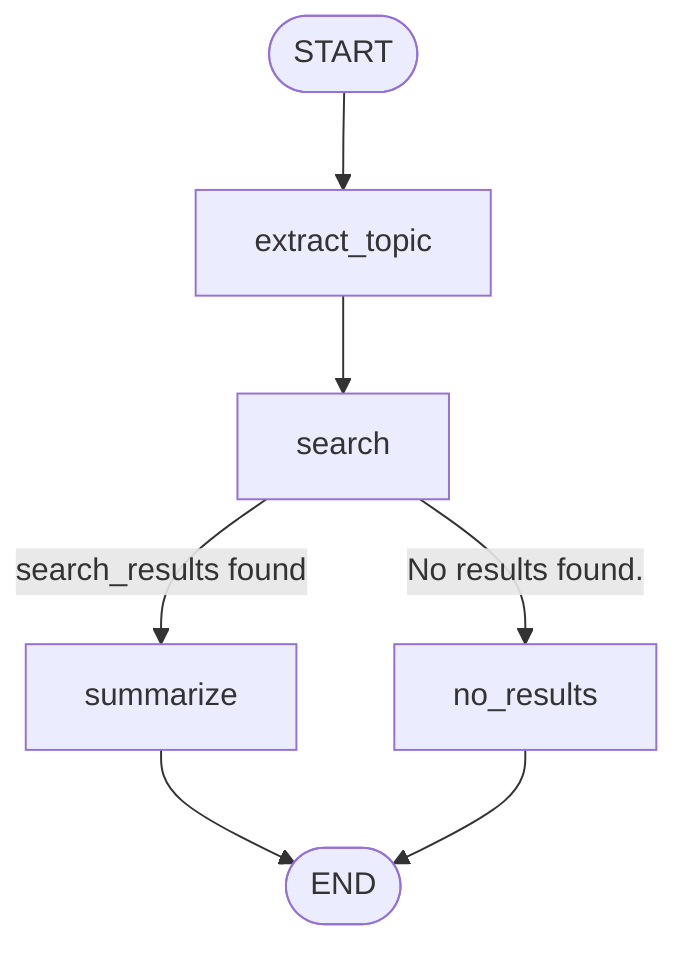

# Topic 2 — LangGraph: Code Explanation

This file walks through every cell of `02-langgraph-practice.ipynb`, section
by section, showing the actual output each cell produces and — for the two
exercise cells (Section 5 and Section 6) — the canonical implementation with
a line-by-line explanation and a dry run against the exact data used in the
notebook.

For the *why* behind each concept (intuition, formal notation, diagrams), see
[`../../notes/02-langgraph.md`](../../notes/02-langgraph.md) and the topic
plan, [`../../../02-langgraph.md`](../../../02-langgraph.md). This file stays
close to the code.

---

## Table of Contents

- [1. State Schema & Reducers](#1-state-schema--reducers)
- [2. Nodes & Edges — a Research Assistant Graph](#2-nodes--edges--a-research-assistant-graph)
- [3. Cycles & the ReAct Loop](#3-cycles--the-react-loop)
- [4. Checkpointers & Persistence](#4-checkpointers--persistence)
- [5. Human-in-the-Loop — Exercise: `human_review_node`](#5-human-in-the-loop--exercise-human_review_node)
- [6. Multi-Agent Graphs — Exercise: a 2-agent supervisor](#6-multi-agent-graphs--exercise-a-2-agent-supervisor)
- [7. Streaming](#7-streaming)
- [Putting It All Together](#putting-it-all-together)
- [Where to Go Next](#where-to-go-next)

---

## 1. State Schema & Reducers

```python
m1 = [HumanMessage(content="What is LangGraph?", id="1")]
m2 = [AIMessage(content="LangGraph is a library for building stateful agents.", id="2")]

merged = add_messages(m1, m2)
for message in merged:
    print(type(message).__name__, message.id, "->", message.content)

m3 = [AIMessage(content="LangGraph models LLM apps as graphs of nodes and edges.", id="2")]
merged_again = add_messages(merged, m3)
for message in merged_again:
    print(type(message).__name__, message.id, "->", message.content)
```

Output:

```
HumanMessage 1 -> What is LangGraph?
AIMessage 2 -> LangGraph is a library for building stateful agents.

HumanMessage 1 -> What is LangGraph?
AIMessage 2 -> LangGraph models LLM apps as graphs of nodes and edges.
```

`add_messages(m1, m2)` appends `m2` after `m1` because they have different
`id`s. `add_messages(merged, m3)` does **not** append `m3` — `m3`'s message
shares `id="2"` with the existing `AIMessage`, so it *replaces* it in place.
This replace-by-id behavior is what lets a real model's streaming output
(many `AIMessageChunk`s, all sharing one `id`) accumulate into a single final
message in `state["messages"]`.

### Reducer vs. no reducer

```python
class NoReducerState(TypedDict):
    messages: list

class ReducerState(TypedDict):
    messages: Annotated[list, add_messages]
```

Both `no_reducer_app` and `reducer_app` run the same two nodes — `node_a`
returns `{"messages": [HumanMessage("from node_a")]}`, `node_b` returns
`{"messages": [AIMessage("from node_b")]}` — starting from
`{"messages": [HumanMessage("initial")]}`.

Output:

```
without add_messages reducer:
  AIMessage 'from node_b'

with add_messages reducer:
  HumanMessage 'initial'
  HumanMessage 'from node_a'
  AIMessage 'from node_b'
```

With the default (overwrite) reducer, each node's `{"messages": [...]}`
update *replaces* `state["messages"]` wholesale — so only `node_b`'s update
(the last one to run) survives. With `add_messages`, every node's update is
*appended*, so the final list contains the initial message plus both nodes'
contributions, in order. This is why every state schema in this notebook that
carries a conversation declares `messages: Annotated[list, add_messages]`.

### `ResearchState`

```python
class ResearchState(TypedDict):
    messages: Annotated[list, add_messages]
    topic: str
    search_results: str
    summary: str
```

`messages` accumulates via `add_messages`; `topic`, `search_results`, and
`summary` each hold *one current value* per run, so the default overwrite
reducer is exactly right for them — a node that sets `topic` should replace
whatever `topic` was, not append to a list of topics.

---

## 2. Nodes & Edges — a Research Assistant Graph

```python
SEARCH_INDEX = {
    "langgraph": "LangGraph is a library for building stateful, multi-step LLM applications as graphs of nodes and edges.",
    "checkpointer": "A checkpointer persists the state of a graph after every step, identified by a thread_id.",
    "react": "The ReAct pattern interleaves reasoning (LLM thoughts) with acting (tool calls) in a loop.",
}

def search_index(query: str) -> str:
    query_lower = query.lower()
    for keyword, snippet in SEARCH_INDEX.items():
        if keyword in query_lower:
            return snippet
    return "No results found."
```

Output:

```
LangGraph is a library for building stateful, multi-step LLM applications as graphs of nodes and edges.
No results found.
```

`search_index` is a deliberately tiny "retriever" — a case-insensitive
substring match over a 3-entry dict — in the same spirit as Topic 1's
`SimpleKeywordRetriever`. It returns the literal string `"No results found."`
when nothing matches; that exact string is what `route_after_search` checks
for below.

### The four nodes

```python
research_llm = GenericFakeChatModel(messages=iter([
    AIMessage(content="LangGraph models LLM applications as graphs of nodes and edges with persistent state."),
]))

def extract_topic(state: ResearchState) -> dict:
    last_message = state["messages"][-1]
    return {"topic": last_message.content}

def search_node(state: ResearchState) -> dict:
    return {"search_results": search_index(state["topic"])}

def route_after_search(state: ResearchState) -> str:
    if state["search_results"] == "No results found.":
        return "no_results"
    return "summarize"

def summarize_node(state: ResearchState) -> dict:
    prompt = f"Summarize this in one sentence: {state['search_results']}"
    response = research_llm.invoke([HumanMessage(content=prompt)])
    return {"summary": response.content, "messages": [response]}

def no_results_node(state: ResearchState) -> dict:
    message = AIMessage(content=f"I couldn't find anything about '{state['topic']}'.")
    return {"summary": message.content, "messages": [message]}
```

`research_llm` is scripted with exactly **one** response, because exactly one
of the two demo queries below reaches `summarize_node` (the other reaches
`no_results_node`, which doesn't call the model at all). `extract_topic`
treats the *entire content* of the latest human message as the topic —
deliberately simple, so the graph's branching logic (not topic extraction) is
the focus. `route_after_search` is the conditional-edge function: it returns
the *name* of the next node as a string, which `add_conditional_edges` maps
back to an actual node via the dict passed as its third argument.

### Building and compiling the graph

```python
research_graph = StateGraph(ResearchState)
research_graph.add_node("extract_topic", extract_topic)
research_graph.add_node("search", search_node)
research_graph.add_node("summarize", summarize_node)
research_graph.add_node("no_results", no_results_node)
research_graph.add_edge(START, "extract_topic")
research_graph.add_edge("extract_topic", "search")
research_graph.add_conditional_edges(
    "search",
    route_after_search,
    {"summarize": "summarize", "no_results": "no_results"},
)
research_graph.add_edge("summarize", END)
research_graph.add_edge("no_results", END)
research_app = research_graph.compile()
```

The mapping `{"summarize": "summarize", "no_results": "no_results"}` looks
redundant (the keys equal the values), but it's required: `route_after_search`
returns a string, and `add_conditional_edges` needs to know which *node names*
those strings correspond to. If `route_after_search` returned, say, `"yes"`
or `"no"`, the mapping would translate those into `"summarize"` /
`"no_results"`.

### Two queries through the graph

```python
result = research_app.invoke({
    "messages": [HumanMessage(content="langgraph")],
    "topic": "", "search_results": "", "summary": "",
})
print("topic:", result["topic"])
print("search_results:", result["search_results"])
print("summary:", result["summary"])
```

Output:

```
topic: langgraph
search_results: LangGraph is a library for building stateful, multi-step LLM applications as graphs of nodes and edges.
summary: LangGraph models LLM applications as graphs of nodes and edges with persistent state.
```

```python
result = research_app.invoke({
    "messages": [HumanMessage(content="quantum gravity")],
    "topic": "", "search_results": "", "summary": "",
})
print("topic:", result["topic"])
print("search_results:", result["search_results"])
print("summary:", result["summary"])
```

Output:

```
topic: quantum gravity
search_results: No results found.
summary: I couldn't find anything about 'quantum gravity'.
```

`"langgraph"` matches a `SEARCH_INDEX` keyword, so `route_after_search`
returns `"summarize"` and `research_llm`'s one scripted response is consumed.
`"quantum gravity"` matches nothing, `search_results == "No results found."`,
`route_after_search` returns `"no_results"`, and `no_results_node` writes a
canned message — `research_llm` is never called for this second `invoke`.



---

## 3. Cycles & the ReAct Loop

```python
@tool
def web_search(query: str) -> str:
    """Search the web for a query and return a one-sentence snippet."""
    return search_index(query)

print(web_search.name)
print(web_search.description)
print(web_search.invoke({"query": "Tell me about LangGraph"}))
```

Output:

```
web_search
Search the web for a query and return a one-sentence snippet.
LangGraph is a library for building stateful, multi-step LLM applications as graphs of nodes and edges.
```

`@tool` turns `web_search` into a `BaseTool`: `.name` and `.description` come
from the function's name and docstring (the same mechanism Topic 1 covered),
and `.invoke({"query": ...})` calls the underlying function with that
argument.

### The agent/tools cycle

```python
class AgentState(TypedDict):
    messages: Annotated[list, add_messages]

agent_llm = GenericFakeChatModel(messages=iter([
    AIMessage(content="", tool_calls=[{"name": "web_search", "args": {"query": "LangGraph"}, "id": "call_1"}]),
    AIMessage(content="LangGraph is great for building agents."),
]))

def agent_node(state: AgentState) -> dict:
    return {"messages": [agent_llm.invoke(state["messages"])]}

agent_graph = StateGraph(AgentState)
agent_graph.add_node("agent", agent_node)
agent_graph.add_node("tools", ToolNode([web_search]))
agent_graph.add_edge(START, "agent")
agent_graph.add_conditional_edges("agent", tools_condition)
agent_graph.add_edge("tools", "agent")
agent_app = agent_graph.compile()
```

`agent_llm` is scripted with **two** responses, in order: first an
`AIMessage` whose `content` is `""` but whose `tool_calls` field requests
`web_search(query="LangGraph")`, then a plain-text final answer.
`add_conditional_edges("agent", tools_condition)` — note there's no third
`mapping` argument here, because `tools_condition` is a LangGraph-provided
function that already returns either `"tools"` or `END` directly.
`ToolNode([web_search])` is the prebuilt dispatcher: given an `AIMessage`
with `tool_calls`, it calls each named tool with its `args` and wraps each
result in a `ToolMessage` whose `tool_call_id` matches the request's `id`.

```python
result = agent_app.invoke({"messages": [HumanMessage(content="What is LangGraph?")]})
for message in result["messages"]:
    print(type(message).__name__, "|", repr(message.content), "| tool_calls:", getattr(message, "tool_calls", None))
```

Output:

```
HumanMessage | 'What is LangGraph?' | tool_calls: None
AIMessage | '' | tool_calls: [{'name': 'web_search', 'args': {'query': 'LangGraph'}, 'id': 'call_1', 'type': 'tool_call'}]
ToolMessage | 'LangGraph is a library for building stateful, multi-step LLM applications as graphs of nodes and edges.' | tool_calls: None
AIMessage | 'LangGraph is great for building agents.' | tool_calls: []
```

Trace through the cycle: **agent** runs (1st `agent_llm` call) and produces
message 2, the tool-call `AIMessage`. `tools_condition` sees a non-empty
`tool_calls` and routes to **tools**. `ToolNode` calls
`web_search(query="LangGraph")` (which calls `search_index("LangGraph")`) and
produces message 3, the `ToolMessage`. The plain edge `tools -> agent` runs
**agent** again (2nd `agent_llm` call), producing message 4 — `tool_calls == []`
this time, so `tools_condition` returns `END` and the walk stops.

```
        ┌────────────────────────────────────────────┐
        │                                              │
        ▼                                              │
START → [ agent ] ──tool_calls present──▶ [ tools ] ───┘
            │
            │ tool_calls == []
            ▼
           END
```

---

## 4. Checkpointers & Persistence

```python
checkpoint_llm = GenericFakeChatModel(messages=iter([
    AIMessage(content="", tool_calls=[{"name": "web_search", "args": {"query": "LangGraph"}, "id": "call_1"}]),
    AIMessage(content="LangGraph is great for building agents."),
]))

def checkpoint_agent_node(state: AgentState) -> dict:
    return {"messages": [checkpoint_llm.invoke(state["messages"])]}

checkpoint_graph = StateGraph(AgentState)
checkpoint_graph.add_node("agent", checkpoint_agent_node)
checkpoint_graph.add_node("tools", ToolNode([web_search]))
checkpoint_graph.add_edge(START, "agent")
checkpoint_graph.add_conditional_edges("agent", tools_condition)
checkpoint_graph.add_edge("tools", "agent")

checkpointer = InMemorySaver()
checkpoint_app = checkpoint_graph.compile(checkpointer=checkpointer)

config = {"configurable": {"thread_id": "thread-1"}}
result = checkpoint_app.invoke({"messages": [HumanMessage(content="What is LangGraph?")]}, config=config)
print("number of messages after invoke:", len(result["messages"]))
```

Output:

```
number of messages after invoke: 4
```

This is structurally identical to Section 3's `agent_graph`, with two
additions: `checkpointer = InMemorySaver()` passed to `.compile()`, and a
`config` dict carrying a `thread_id`. Every `.invoke()` (and every internal
step of one) against this `checkpoint_app` with this `config` now writes a
checkpoint.

```python
snapshot = checkpoint_app.get_state(config)
print("next:", snapshot.next)
print("number of messages:", len(snapshot.values["messages"]))
```

Output:

```
next: ()
number of messages: 4
```

`get_state(config)` returns the *latest* checkpoint as a `StateSnapshot`.
`snapshot.values` is the state dict (same shape as `result` above);
`snapshot.next` is the tuple of node names scheduled to run next — empty,
because the graph reached `END`.

```python
print(f"{'idx':>3} | {'next':<14} | len(messages)")
for idx, snapshot in enumerate(checkpoint_app.get_state_history(config)):
    print(f"{idx:>3} | {str(snapshot.next):<14} | {len(snapshot.values['messages'])}")
```

Output:

```
idx | next           | len(messages)
  0 | ()             | 4
  1 | ('agent',)     | 3
  2 | ('tools',)     | 2
  3 | ('agent',)     | 1
  4 | ('__start__',) | 0
```

`get_state_history` yields **newest first**. Reading bottom-to-top tells the
forward story: idx 4 is the empty initial state (about to run `__start__`),
idx 3 is right after the input `HumanMessage` was recorded (about to run
`agent` for the first time), idx 2 is after the tool-call `AIMessage` (about
to run `tools`), idx 1 is after the `ToolMessage` (about to run `agent`
again), and idx 0 is the final state (`next == ()`, nothing left to run).
Each row corresponds 1:1 to a row of Section 3's message trace.

### `SqliteSaver`

```python
import sqlite3
from langgraph.checkpoint.sqlite import SqliteSaver

conn = sqlite3.connect(":memory:", check_same_thread=False)
sqlite_checkpointer = SqliteSaver(conn)
sqlite_app = checkpoint_graph.compile(checkpointer=sqlite_checkpointer)
print(type(sqlite_app.checkpointer).__name__)
```

Output:

```
SqliteSaver
```

The notebook uses `:memory:` only so this cell stays self-contained and fast;
pointing `sqlite3.connect(...)` at a real file path (or using
`SqliteSaver.from_conn_string("checkpoints.db")`) is the only change needed
to make threads survive a process restart. `checkpoint_graph` (the
*uncompiled* `StateGraph` builder) can be `.compile()`-d more than once, with
different checkpointers — each call returns an independent compiled graph.

---

## 5. Human-in-the-Loop — Exercise: `human_review_node`

### The docstring (as given in the template)

> Pause for human approval before a requested tool call runs.
> `state["messages"][-1]` is the agent's latest `AIMessage`, which has a
> non-empty `tool_calls` list (that's why this node was reached).
>
> 1. Call `interrupt(...)` with a dict payload describing the proposed call,
>    e.g. `{"question": "Approve this tool call?", "tool_call": state["messages"][-1].tool_calls[0]}`.
>    `interrupt` blocks here until the graph is resumed with
>    `Command(resume=decision)`, then **returns** `decision`.
> 2. If `decision["type"] == "approve"`, return `{}` — no state change, so
>    the graph proceeds to the `"tools"` node.
> 3. Otherwise, raise a `ValueError` describing the rejection.

### Canonical implementation

```python
def human_review_node(state: AgentState) -> dict:
    last_message = state["messages"][-1]
    tool_call = last_message.tool_calls[0]
    decision = interrupt({
        "question": "Approve this tool call?",
        "tool_call": tool_call,
    })
    if decision["type"] == "approve":
        return {}
    raise ValueError(f"Tool call rejected: {decision}")
```

**What each line does**:

- `last_message = state["messages"][-1]` — the most recent `AIMessage`,
  guaranteed to have `tool_calls` because `route_after_agent` only sends the
  graph here when that's true.
- `tool_call = last_message.tool_calls[0]` — the first (only, in this
  notebook) requested tool call: a dict with `name`, `args`, and `id` keys.
- `decision = interrupt({...})` — pauses the graph. The dict
  `{"question": ..., "tool_call": tool_call}` is surfaced to whatever called
  `.invoke()`, under `result["__interrupt__"]`. When later resumed via
  `Command(resume=some_value)`, this line *returns* `some_value` and
  execution continues from here.
- `if decision["type"] == "approve": return {}` — `{}` is a no-op state
  update (no field changes), so the reducer leaves `state` untouched and the
  graph follows the edge `human_review -> tools`.
- `raise ValueError(...)` — any other decision aborts the run with an
  exception. (A richer implementation might instead return `{"messages": [...]}`
  with a message explaining the tool call was skipped, and route to `END`
  or back to `agent` — left as a further extension.)

### About the unsolved template

With the exercise left as `pass` (returning `None`), LangGraph treats a
`None` return as "no state update" — the same as `human_review_node` running
to completion having done nothing. Since it never calls `interrupt(...)`, the
graph never pauses: `route_after_agent` still sends execution to
`human_review`, but it's a no-op, so the walk continues straight on to
`tools` and then `agent` again, finishing in one `.invoke()` call. The
notebook's demo cells therefore print `interrupt: None` and `next: ()` for
the unsolved template — "ran to completion, no pause" — which is a valid
(if incomplete) result, not an error. The outputs below are from the
**canonical** implementation above.

### Dry run — pause and resume

```python
def route_after_agent(state: AgentState) -> str:
    last_message = state["messages"][-1]
    if getattr(last_message, "tool_calls", None):
        return "human_review"
    return END

hitl_llm = GenericFakeChatModel(messages=iter([
    AIMessage(content="", tool_calls=[{"name": "web_search", "args": {"query": "LangGraph"}, "id": "call_1"}]),
    AIMessage(content="LangGraph is great for building agents."),
    AIMessage(content="LangGraph is a graph-based framework for building agents."),
]))

def hitl_agent_node(state: AgentState) -> dict:
    return {"messages": [hitl_llm.invoke(state["messages"])]}

hitl_graph = StateGraph(AgentState)
hitl_graph.add_node("agent", hitl_agent_node)
hitl_graph.add_node("human_review", human_review_node)
hitl_graph.add_node("tools", ToolNode([web_search]))
hitl_graph.add_edge(START, "agent")
hitl_graph.add_conditional_edges("agent", route_after_agent, {"human_review": "human_review", END: END})
hitl_graph.add_edge("human_review", "tools")
hitl_graph.add_edge("tools", "agent")

hitl_checkpointer = InMemorySaver()
hitl_app = hitl_graph.compile(checkpointer=hitl_checkpointer)
```

`hitl_llm` is scripted with **three** responses: the first two are consumed by
the initial run below (tool-call, then final answer); the third is reserved
for the time-travel fork further down.

```python
hitl_config = {"configurable": {"thread_id": "thread-2"}}
result = hitl_app.invoke({"messages": [HumanMessage(content="What is LangGraph?")]}, config=hitl_config)
print("interrupt:", result.get("__interrupt__"))
print("next:", hitl_app.get_state(hitl_config).next)
```

Output (canonical implementation):

```
interrupt: [Interrupt(value={'question': 'Approve this tool call?', 'tool_call': {'name': 'web_search', 'args': {'query': 'LangGraph'}, 'id': 'call_1', 'type': 'tool_call'}}, id='41e06c8a609dc4084f4a22510f8cf523')]
next: ('human_review',)
```

`agent` ran once (1st `hitl_llm` response, the tool-call `AIMessage`),
`route_after_agent` sent execution to `human_review`, and
`human_review_node`'s `interrupt(...)` paused the graph. `next == ("human_review",)`
means: the next time this thread is invoked, `human_review` is the node that
will (re-)run.

```python
result = hitl_app.invoke(Command(resume={"type": "approve"}), config=hitl_config)
for message in result["messages"]:
    print(type(message).__name__, "|", repr(message.content))
```

Output:

```
HumanMessage | 'What is LangGraph?'
AIMessage | ''
ToolMessage | 'LangGraph is a library for building stateful, multi-step LLM applications as graphs of nodes and edges.'
AIMessage | 'LangGraph is great for building agents.'
```

`Command(resume={"type": "approve"})` re-enters `human_review_node`;
`interrupt(...)` returns `{"type": "approve"}`, the function returns `{}`,
and the walk continues: `tools` runs `web_search` (producing the
`ToolMessage`), then `agent` runs again (2nd `hitl_llm` response), producing
the final `AIMessage` with no `tool_calls` — `route_after_agent` returns
`END`.

### Time travel

```python
history = list(hitl_app.get_state_history(hitl_config))
print(f"{'idx':>3} | {'next':<16} | len(messages)")
for idx, snapshot in enumerate(history):
    print(f"{idx:>3} | {str(snapshot.next):<16} | {len(snapshot.values['messages'])}")

fork_point = next(s for s in history if s.next == ("agent",))
print("\nforking from checkpoint with next =", fork_point.next, "and", len(fork_point.values["messages"]), "messages")

forked_result = hitl_app.invoke(None, config=fork_point.config)
for message in forked_result["messages"]:
    print(type(message).__name__, "|", repr(message.content))
```

Output:

```
idx | next             | len(messages)
  0 | ()               | 4
  1 | ('agent',)       | 3
  2 | ('tools',)       | 2
  3 | ('human_review',) | 2
  4 | ('agent',)       | 1
  5 | ('__start__',)   | 0

forking from checkpoint with next = ('agent',) and 3 messages
HumanMessage | 'What is LangGraph?'
AIMessage | ''
ToolMessage | 'LangGraph is a library for building stateful, multi-step LLM applications as graphs of nodes and edges.'
AIMessage | 'LangGraph is a graph-based framework for building agents.'
```

This thread has **six** checkpoints — one more than Section 4's agent, because
`human_review` is now its own step (idx 3, `next == ("human_review",)`,
recorded right after the tool-call `AIMessage` and before the interrupt
fires). `next(s for s in history if s.next == ("agent",))` finds the
*first* (i.e. most recent) checkpoint whose `next` is `("agent",)` — that's
idx 1, with 3 messages (`Human`, `AI(tool_calls)`, `ToolMessage`), taken right
after `tools` produced the `ToolMessage` and right before the *second*
`agent` call.

`hitl_app.invoke(None, config=fork_point.config)` re-runs the graph starting
from that checkpoint: the first three messages are replayed unchanged from
the saved checkpoint, but `agent` runs *again* — consuming `hitl_llm`'s
**third** scripted response, `"LangGraph is a graph-based framework for
building agents."`, which differs from the first run's second response
(`"LangGraph is great for building agents."`). This is exactly the
"regenerate this response" / "edit an earlier step and re-run" mechanism: the
same prefix, a different continuation.

### Gotcha — the rejection path isn't demonstrated in the notebook

If `interrupt(...)` is resumed with `Command(resume={"type": "reject"})`
instead of `{"type": "approve"}`, the canonical implementation's
`raise ValueError(f"Tool call rejected: {decision}")` propagates out of
`.invoke()` as a real exception — there is no built-in "rejected gracefully"
path. Running this against a fresh thread:

```
interrupt: [Interrupt(value={'question': 'Approve this tool call?', ...}, id='...')]
ERROR: ValueError - Tool call rejected: {'type': 'reject'}
```

The notebook only exercises the approval path so that `--execute` completes
without raising. A production implementation would likely catch this (or
have `human_review_node` itself return a `ToolMessage`-like rejection and
route to `agent` instead of `tools`, so the model can react to "your request
was denied").

---

## 6. Multi-Agent Graphs — Exercise: a 2-agent supervisor

### The docstrings (as given in the template)

> **`supervisor_node`**: Classify the latest message by calling
> `supervisor_llm` with `state["messages"]`, and store its (stripped) reply
> content in `next_agent`. Return `{"next_agent": ...}`.
>
> **`math_specialist`**: Parse the latest human message as `"<a> + <b>"`,
> compute the sum, and return
> `{"messages": [AIMessage(content=f"The answer is {total}.")]}`.
>
> **`research_specialist`**: Look up the latest human message with
> `search_index` and return `{"messages": [AIMessage(content=snippet)]}`.

### Canonical implementation

```python
class SupervisorState(TypedDict):
    messages: Annotated[list, add_messages]
    next_agent: str

def route_to_specialist(state: SupervisorState) -> str:
    if state.get("next_agent") == "math":
        return "math_specialist"
    return "research_specialist"

supervisor_llm = GenericFakeChatModel(messages=iter([
    AIMessage(content="math"),
    AIMessage(content="research"),
]))

def supervisor_node(state: SupervisorState) -> dict:
    response = supervisor_llm.invoke(state["messages"])
    return {"next_agent": response.content.strip()}

def math_specialist(state: SupervisorState) -> dict:
    last_message = state["messages"][-1].content
    a, _, b = last_message.partition("+")
    total = int(a.strip()) + int(b.strip())
    return {"messages": [AIMessage(content=f"The answer is {total}.")]}

def research_specialist(state: SupervisorState) -> dict:
    last_message = state["messages"][-1].content
    snippet = search_index(last_message)
    return {"messages": [AIMessage(content=snippet)]}
```

**What each line does**:

- `route_to_specialist` (given, not part of the exercise) reads
  `state.get("next_agent")` — using `.get` rather than `state["next_agent"]`
  so it doesn't raise `KeyError` if `supervisor_node` hasn't run yet (or, in
  the unsolved template, never sets it). It returns `"math_specialist"` only
  for the exact string `"math"`; *anything else* (including `""`,
  `"research"`, or a malformed model reply) routes to
  `"research_specialist"` — a safe default.
- `supervisor_llm = GenericFakeChatModel(messages=iter(["math", "research"]))`
  (as `AIMessage`s) — scripted to classify the first demo request as `"math"`
  and the second as `"research"`, in that order.
- `supervisor_node`: `response = supervisor_llm.invoke(state["messages"])`
  calls the model with the full message list (just the one `HumanMessage` in
  this notebook); `response.content.strip()` takes the model's one-word reply
  verbatim (`.strip()` removes any incidental whitespace a real model might
  add) and stores it as `next_agent`.
- `math_specialist`: `state["messages"][-1].content` is the original question,
  e.g. `"12 + 30"`. `last_message.partition("+")` splits it into
  `("12 ", "+", " 30")` — `partition` always returns a 3-tuple
  `(before, sep, after)`, and `_` discards the separator. `int(a.strip())` and
  `int(b.strip())` strip surrounding whitespace and convert to `int`
  (`"12 "` -> `12`, `" 30"` -> `30`), and `total = 12 + 30 = 42`.
- `research_specialist`: reuses `search_index` from Section 2 directly —
  `state["messages"][-1].content` is `"langgraph"`, and
  `search_index("langgraph")` returns the `SEARCH_INDEX["langgraph"]` snippet
  verbatim (no LLM call at all).

### About the unsolved template

With all three node functions left as `pass` (returning `None`):
`supervisor_node` returning `None` means `next_agent` is never set, so it
keeps its initial value `""`. `route_to_specialist` sees `"" != "math"` and
routes to `research_specialist` — for *both* demo requests, including the
`"12 + 30"` one. `research_specialist` also returns `None`, so
`state["messages"]` is unchanged: `result["messages"][-1]` is still the
original `HumanMessage`. The notebook's demo cells therefore print
`next_agent: ''` and echo the input question back as the "answer" for the
unsolved template — again, "ran without error, exercise not yet solved", not
a crash. The outputs below are from the **canonical** implementation above.

### Dry run — two requests

```python
result = supervisor_app.invoke({"messages": [HumanMessage(content="12 + 30")], "next_agent": ""})
print("next_agent:", repr(result["next_agent"]))
print("answer:", result["messages"][-1].content)
```

Output:

```
next_agent: 'math'
answer: The answer is 42.
```

```python
result = supervisor_app.invoke({"messages": [HumanMessage(content="langgraph")], "next_agent": ""})
print("next_agent:", repr(result["next_agent"]))
print("answer:", result["messages"][-1].content)
```

Output:

```
next_agent: 'research'
answer: LangGraph is a library for building stateful, multi-step LLM applications as graphs of nodes and edges.
```

For `"12 + 30"`: `supervisor_llm`'s first response is `"math"`, so
`next_agent = "math"`, `route_to_specialist` returns `"math_specialist"`, and
`math_specialist` computes `12 + 30 = 42`. For `"langgraph"`:
`supervisor_llm`'s second response is `"research"`, `route_to_specialist`
returns `"research_specialist"`, and `research_specialist` returns
`SEARCH_INDEX["langgraph"]` via `search_index`.

```mermaid
graph TD
    START([START]) --> supervisor
    supervisor -->|next_agent == "math"| math_specialist
    supervisor -->|otherwise| research_specialist
    math_specialist --> END_([END])
    research_specialist --> END_
```

---

## 7. Streaming

```python
stream_llm = GenericFakeChatModel(messages=iter([
    AIMessage(content="", tool_calls=[{"name": "web_search", "args": {"query": "LangGraph"}, "id": "call_1"}]),
    AIMessage(content="LangGraph is great for building agents."),
]))

def stream_agent_node(state: AgentState) -> dict:
    return {"messages": [stream_llm.invoke(state["messages"])]}

stream_graph = StateGraph(AgentState)
stream_graph.add_node("agent", stream_agent_node)
stream_graph.add_node("tools", ToolNode([web_search]))
stream_graph.add_edge(START, "agent")
stream_graph.add_conditional_edges("agent", tools_condition)
stream_graph.add_edge("tools", "agent")
stream_app = stream_graph.compile()

for update in stream_app.stream({"messages": [HumanMessage(content="What is LangGraph?")]}, stream_mode="updates"):
    for node_name, node_update in update.items():
        message = node_update["messages"][0]
        print(node_name, "->", type(message).__name__, repr(message.content))
```

Output:

```
agent -> AIMessage ''
tools -> ToolMessage 'LangGraph is a library for building stateful, multi-step LLM applications as graphs of nodes and edges.'
agent -> AIMessage 'LangGraph is great for building agents.'
```

This is the same agent/tools cycle as Section 3, but `.stream(..., stream_mode="updates")`
yields one dict **per node execution**, of the form `{node_name: <that node's
return value>}` — i.e. `node_update` is exactly the `Δstate` dict the node
function returned, *before* it's merged into the overall state. Three nodes
ran (`agent`, `tools`, `agent` again), so three events are yielded.

```python
stream_llm_2 = GenericFakeChatModel(messages=iter([
    AIMessage(content="", tool_calls=[{"name": "web_search", "args": {"query": "LangGraph"}, "id": "call_1"}]),
    AIMessage(content="LangGraph is great for building agents."),
]))

# ... identical graph wiring as stream_graph, using stream_llm_2 ...

for state in stream_app_2.stream({"messages": [HumanMessage(content="What is LangGraph?")]}, stream_mode="values"):
    print("len(messages):", len(state["messages"]))
```

Output:

```
len(messages): 1
len(messages): 2
len(messages): 3
len(messages): 4
```

`stream_mode="values"` instead yields the **entire state** after each node —
already merged via the `add_messages` reducer. The message count grows
1 -> 2 -> 3 -> 4, one per node execution, matching Section 4's checkpoint
history (`len(messages)` going 1, 2, 3, 4 across checkpoints idx 3, 2, 1, 0).
A fresh `stream_llm_2`/`stream_app_2` pair is used here only so this cell
doesn't consume tokens from `stream_llm` above — each `GenericFakeChatModel`
is a one-shot iterator.

### Token-level streaming

```python
class SimpleState(TypedDict):
    messages: Annotated[list, add_messages]

respond_llm = GenericFakeChatModel(messages=iter([
    AIMessage(content="LangGraph is great for building agents."),
]))

def respond_node(state: SimpleState) -> dict:
    return {"messages": [respond_llm.invoke(state["messages"])]}

respond_graph = StateGraph(SimpleState)
respond_graph.add_node("respond", respond_node)
respond_graph.add_edge(START, "respond")
respond_graph.add_edge("respond", END)
respond_app = respond_graph.compile()

for token, metadata in respond_app.stream({"messages": [HumanMessage(content="What is LangGraph?")]}, stream_mode="messages"):
    print(repr(token.content), "| node:", metadata["langgraph_node"])
```

Output:

```
'LangGraph' | node: respond
' ' | node: respond
'is' | node: respond
' ' | node: respond
'great' | node: respond
' ' | node: respond
'for' | node: respond
' ' | node: respond
'building' | node: respond
' ' | node: respond
'agents.' | node: respond
```

`stream_mode="messages"` yields `(chunk, metadata)` pairs, one per LLM token.
`GenericFakeChatModel._stream` implements this by splitting its scripted
`content` string on whitespace with a capturing regex (`re.split(r"(\s)", content)`),
so each word *and* each space becomes its own `AIMessageChunk`.
`metadata["langgraph_node"]` is `"respond"` for every chunk, since this graph
has only one node that calls a model.

### Gotcha — `stream_mode="messages"` and empty-content tool-call messages

This single-node `respond_graph` (rather than the Section 3 `agent_graph`) is
used here deliberately. The Section 3 agent's *first* response is
`AIMessage(content="", tool_calls=[...])` — `content` is the empty string
`""`. `GenericFakeChatModel._stream` only yields content chunks `if content:`,
and `tool_calls` (a structured field, not part of `additional_kwargs`) isn't
broken into chunks either — so for that message, `_stream` yields **zero**
chunks, and `langchain_core` raises
`ValueError: No generations found in stream.` A real model's streaming
implementation always emits at least one chunk (even an empty-content
tool-call response arrives as one or more `tool_call_chunk`s), so this is a
sharp edge specific to scripting `tool_calls` through `GenericFakeChatModel`,
not a general LangGraph limitation.

---

## Putting It All Together

```
START -> extract_topic -> search -+-> summarize ---------> END     (Section 2)
                                   +-> no_results --------> END

START -> agent <--tools_condition--> tools                          (Section 3)
            |  no tool_calls
            v
           END

agent --tool_calls--> human_review --> tools --> agent --> ...      (Section 5)
  |  no tool_calls                       ^
  v                                       | interrupt() / Command(resume=...)
 END                                checkpointer (Section 4)

START -> supervisor -+-> math_specialist -----> END                 (Section 6)
                      +-> research_specialist -> END

app.stream(..., stream_mode="values" | "updates" | "messages")      (Section 7)
```

Every section reuses the same handful of building blocks: `ResearchState` /
`AgentState` / `SupervisorState` are all `TypedDict`s with
`messages: Annotated[list, add_messages]`; `search_index` /
`SEARCH_INDEX` is the one piece of "knowledge" shared by the research
assistant (Section 2), the `web_search` tool (Sections 3, 5, 7), and
`research_specialist` (Section 6); and `GenericFakeChatModel` with a
freshly-scripted `iter([...])` per graph keeps every demo deterministic and
offline.

---

## Where to Go Next

Topic 3 (Model Context Protocol) picks up the `web_search` tool used in
Sections 3, 5, and 6: instead of a Python function defined in this notebook,
MCP standardizes how a node's tools can live in a separate process (or
machine) and still be discovered and called the same way —
`tool_calls -> ToolMessage`, now crossing a process boundary.

Topic 4 (AI Agent Patterns & Frameworks) compares this hand-built supervisor
graph against higher-level abstractions — LangGraph's own prebuilt agents,
CrewAI, the Claude Agent SDK — that wrap the same node/edge/checkpoint
primitives in different APIs.
