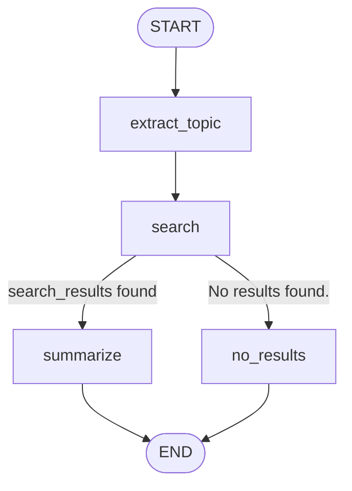

# LangGraph

Topic 1 gave every LLM call the same shape — `invoke(messages) -> AIMessage` — and showed how to chain those calls together with the `|` operator. That works beautifully for pipelines that flow in one direction: prompt in, model, parser, done. But most real agents don't flow in one direction. They loop ("let me search again with a better query"), they pause ("let a human approve this before I send the email"), they branch ("if this is a billing question, hand it to the billing specialist"), and they need to remember exactly where they were if the process restarts. **LangGraph** is the library that makes these patterns explicit: instead of a hidden `while` loop buried inside a framework, you draw the loop yourself as a graph — a set of **nodes** (plain Python functions that read and write a shared **state**), connected by **edges** (including **conditional edges** that pick the next node based on the current state).

This note builds that vocabulary the same way Topic 1 did: every concept gets a tiny, fully offline example using `GenericFakeChatModel`, with the exact state dictionary shown before and after every step. The running example throughout is a small "research assistant" — given a topic, it searches a tiny in-memory index and summarizes what it finds — which we extend, section by section, into a tool-calling agent, a checkpointed/resumable agent, a human-approved agent, and finally a two-agent supervisor system.

---

## Table of Contents

1. [Where This Sits](#where-this-sits)
2. [State Schema & Reducers](#1-state-schema--reducers)
3. [Nodes & Edges](#2-nodes--edges)
4. [Cycles & the ReAct Loop](#3-cycles--the-react-loop)
5. [Checkpointers & Persistence](#4-checkpointers--persistence)
6. [Human-in-the-Loop](#5-human-in-the-loop)
7. [Multi-Agent Graphs](#6-multi-agent-graphs)
8. [Streaming](#7-streaming)
9. [Summary & Connection Forward](#summary--connection-forward)

---

## Where This Sits

```
┌─────────────────────────────────────────────────────────────────┐
│  B03 Topic 1 — LangChain Fundamentals                             │
│  messages, prompts, parsers, LCEL, memory, retrievers, tools     │
│  every piece is a Runnable: invoke(input) -> output, ONE PASS    │
└─────────────────────────────────────────────────────────────────┘
                              │
                              │  these Runnables become NODES
                              │  inside a graph that can loop,
                              │  branch, pause, and persist
                              ▼
┌─────────────────────────────────────────────────────────────────┐
│  B03 Topic 2 — LangGraph (THIS NOTE)                              │
│  StateGraph: nodes + edges + conditional edges + checkpointer    │
└─────────────────────────────────────────────────────────────────┘
                              │
                              ▼
┌─────────────────────────────────────────────────────────────────┐
│  B03 Topic 3 — Model Context Protocol (MCP)                       │
│  standardizes how nodes/tools talk to EXTERNAL servers/tools     │
└─────────────────────────────────────────────────────────────────┘
```

Everything that was a `Runnable` in Topic 1 — a prompt-template-then-model chain, a retriever, a tool — can be dropped into a LangGraph node almost unchanged. What LangGraph adds on top is *control flow with memory*: the shared state object that every node reads and writes, and the checkpointer that snapshots that state after every step.

---

## 1. State Schema & Reducers

**Summary**: A LangGraph graph is built around one shared **state** object — usually a `TypedDict` — and every node is a function that takes the current state and returns a partial update to it.

**The problem it solves**: In Topic 1's LCEL chains, data flowed through a pipe: the output of one step was *exactly* the input of the next (`prompt | model | parser`). That's too rigid for an agent, which needs to accumulate things over many steps — the running conversation, search results found three steps ago, a running plan — while different nodes only touch *some* of those things. You need one object that represents "everything the graph knows so far," with rules for how each piece of it gets updated.

**The intuition**: Think of the state as a shared whiteboard in a room full of specialists (the nodes). Each specialist walks up, reads whatever is currently written, and then writes their own update — but they don't necessarily *erase* what's there. A node that does a web search might add a new line to the "search results" section without touching the "conversation" section. The question this section answers is: *when two specialists both write to the same section of the whiteboard, what happens — does the new note replace the old one, or get added next to it?* That rule, per field, is called a **reducer**.

**The math**: Formally, the state is a structured object $S = (S_1, S_2, \dots, S_n)$, one value per field declared in the `TypedDict`. A node is a function

$$f_v : S \rightarrow \Delta S$$

that reads the full state $S$ and returns a *partial update* $\Delta S$ — a dict containing only the fields it wants to change. For each field $i$, LangGraph combines the old value and the update using a **reducer function**

$$S_i' = r_i(S_i, \Delta S_i)$$

The **default reducer**, used for any field with a plain type annotation (e.g. `topic: str`), is simple overwrite: $r_i(S_i, \Delta S_i) = \Delta S_i$ — whatever the node returns *replaces* the old value, and if the node doesn't mention that field at all, $S_i$ is left unchanged. The `messages` field is special: it's annotated `Annotated[list, add_messages]`, which installs `add_messages` as $r$. `add_messages` does two things — it **appends** new messages to the existing list, and if a new message has the *same `id`* as an existing one, it **replaces** that message in place (used later for streaming partial updates to the same AI message).

**Dry-run 1 — the `add_messages` reducer**:

```
m1 = [HumanMessage("What is LangGraph?", id="1")]
m2 = [AIMessage("LangGraph is a library for building stateful agents.", id="2")]

Step 1: add_messages(m1, m2)
  -> [HumanMessage("What is LangGraph?", id="1"),
      AIMessage("LangGraph is a library for building stateful agents.", id="2")]
  (different ids -> m2 is appended after m1)

m3 = [AIMessage("LangGraph models LLM apps as graphs of nodes and edges.", id="2")]

Step 2: add_messages(step1_result, m3)
  -> [HumanMessage("What is LangGraph?", id="1"),
      AIMessage("LangGraph models LLM apps as graphs of nodes and edges.", id="2")]
  (same id "2" as an existing message -> REPLACES it instead of appending)
```

**Dry-run 2 — reducer vs. no reducer**: Suppose a two-node graph starts with `{"messages": [HumanMessage("initial")]}`. Node `a` returns `{"messages": [HumanMessage("from node_a")]}` and node `b` returns `{"messages": [AIMessage("from node_b")]}`.

```
Field declared as `messages: list` (NO reducer -> default overwrite):

  start:        ["initial"]
  after node a: ["from node_a"]      <- REPLACED "initial"
  after node b: ["from node_b"]      <- REPLACED "from node_a"

  FINAL: ["from node_b"]   (only the last write survives!)


Field declared as `messages: Annotated[list, add_messages]`:

  start:        ["initial"]
  after node a: ["initial", "from node_a"]              <- appended
  after node b: ["initial", "from node_a", "from node_b"]  <- appended

  FINAL: ["initial", "from node_a", "from node_b"]   (full history kept)
```

This is *the* gotcha that motivates this whole section: without `add_messages`, every node would silently wipe out the conversation history left by the previous node. The notebook's `ResearchState` (used from Section 2 onward) therefore declares `messages: Annotated[list, add_messages]`, alongside plain fields (`topic: str`, `search_results: str`, `summary: str`) that use the default overwrite reducer — which is exactly what we want for those, since each run should have *one current* topic, not a growing list of every topic ever asked about.

---

## 2. Nodes & Edges

**Summary**: A graph is built by registering **nodes** (functions `state -> partial state update`) and connecting them with **edges** (fixed `A -> B` transitions) and **conditional edges** (functions `state -> name of next node`, for branching).

**The problem it solves**: A plain LCEL chain (`step1 | step2 | step3`) can't express "if the search came back empty, do something different than if it found results" — `|` always runs every step, in the same order, every time. Real workflows need branches.

**The intuition**: A LangGraph graph is a flowchart you've actually drawn before, just executable. `add_node("search", search_fn)` is "put a box on the diagram labeled *search* that runs `search_fn`." `add_edge("search", "summarize")` is "draw an arrow from the *search* box to the *summarize* box — always take this path." `add_conditional_edges("search", router_fn, {...})` is "after *search*, run `router_fn(state)` to decide *which* arrow to follow out of this box." `START` and `END` are two special nodes representing "where execution begins" and "where it stops."

**The math**: A graph is a pair $G = (V, E)$. $V$ is the set of nodes, each $v \in V$ a function $f_v: S \to \Delta S$ as defined in Section 1. $E$ is the set of edges; a normal edge is a fixed pair $(u, v)$ meaning "after $u$ runs, run $v$ next." A conditional edge from $u$ is instead a function $g_u: S \to V$ together with a mapping from $g_u$'s possible return values to actual node names — "after $u$ runs, *compute* which $v$ comes next by calling $g_u$ on the current state." Execution is a walk through this graph starting at `START`: at each step, the current node's function is applied to the state (producing $\Delta S$, which is reduced into $S$ via the rules from Section 1), then the appropriate edge (fixed or conditional) determines the next node. The walk ends when it reaches `END`.

**The running example — a research assistant**: The notebook defines a tiny in-memory "search index" — a Python dict mapping a few keywords (`"langgraph"`, `"checkpointer"`, `"react"`) to one-sentence descriptions, with a `search_index(query)` function that does a case-insensitive substring match and returns `"No results found."` if nothing matches (the same flavor of toy retriever as Topic 1's `SimpleKeywordRetriever`). The state schema, `ResearchState`, has four fields: `messages` (the conversation, with the `add_messages` reducer), `topic` (extracted from the latest human message), `search_results` (whatever `search_index` returned), and `summary` (the final answer).

The graph has four nodes:

```
extract_topic  — reads the last HumanMessage, sets state["topic"] to its content
search         — calls search_index(state["topic"]), sets state["search_results"]
summarize      — (only reached if search found something) asks the LLM to
                  summarize state["search_results"] in one sentence
no_results     — (only reached if search found nothing) writes a canned
                  "I couldn't find anything about '<topic>'" message
```

and is wired up as: `START -> extract_topic -> search -> [conditional: summarize | no_results] -> END`.

**Dry-run — two queries through the graph**:

```
Query: "langgraph"

  extract_topic:  topic = "langgraph"
  search:         search_results = "LangGraph is a library for building
                   stateful, multi-step LLM applications as graphs of
                   nodes and edges."
  router:         search_results != "No results found." -> go to "summarize"
  summarize:      summary = "LangGraph models LLM applications as graphs
                   of nodes and edges with persistent state."

Query: "quantum gravity"

  extract_topic:  topic = "quantum gravity"
  search:         search_results = "No results found."
  router:         search_results == "No results found." -> go to "no_results"
  no_results:     summary = "I couldn't find anything about 'quantum gravity'."
```

**Diagram**:



---

## 3. Cycles & the ReAct Loop

**Summary**: Topic 1's tool-calling section showed the *shape* of a tool call — `AIMessage.tool_calls -> ToolMessage`s — but the actual *loop* (call model, maybe call tools, call model again, maybe call tools again, ... until the model stops asking for tools) was left as a manual exercise. LangGraph makes that loop a literal **cycle** in the graph: an edge that points *backward*.

**The problem it solves**: A linear graph (Section 2) runs each node at most once. But a "ReAct" agent (Reason + Act) doesn't know in advance how many tool calls it will need — it might need zero, one, or several rounds of "call a tool, look at the result, decide whether to call another tool." You can't pre-draw a fixed-length chain for that; you need a loop whose exit condition is decided at runtime.

**The intuition**: Picture two boxes on the whiteboard: **agent** (the LLM) and **tools** (a dispatcher that runs whatever tools the LLM just asked for). After **agent** runs, a conditional edge asks one question: *"does the message the LLM just produced contain `tool_calls`?"* If yes, go to **tools**; if no, go to `END`. After **tools** runs, there's a plain edge straight back to **agent** — so the LLM gets to see the tool results and decide what to do next. This two-node loop, with one conditional exit, *is* the ReAct pattern. LangGraph ships this exact conditional function as `tools_condition`, and the "run whichever tools were requested" dispatcher as `ToolNode` — so you don't hand-write the dispatch loop from Topic 1's gotcha; LangGraph's prebuilt `ToolNode` *is* that loop, wired as a node.

**The math**: This is a graph with a cycle: $E$ contains both $(\text{agent}, \text{tools})$ — via the conditional `tools_condition` — and $(\text{tools}, \text{agent})$, a plain edge. The walk through the graph is therefore not a simple path but can revisit `agent` arbitrarily many times: $\text{agent} \to \text{tools} \to \text{agent} \to \text{tools} \to \dots \to \text{agent} \to \text{END}$. The loop terminates because each pass through `agent` appends a new `AIMessage` to `state["messages"]` (via the `add_messages` reducer), and `tools_condition` checks *that newest message* — once the LLM produces an `AIMessage` with `tool_calls == []`, `tools_condition` returns `END` and the walk stops. Termination is therefore a property of the *model's output*, not of the graph structure — same as a `while` loop whose condition depends on a value computed inside the loop body.

**The running example — `web_search` as a tool**: The same `search_index` function from Section 2 is wrapped with `@tool` as `web_search(query: str) -> str`, and the agent's state is just `AgentState(TypedDict)` with a single `messages: Annotated[list, add_messages]` field. `GenericFakeChatModel` is scripted with two responses: first an `AIMessage` whose `content` is empty but whose `tool_calls` field requests `web_search(query="LangGraph")`, and second a plain-text `AIMessage` with the final answer.

**Dry-run — message list after `app.invoke(...)`**:

```
1. HumanMessage("What is LangGraph?")

   -- agent runs (1st LLM call) --
2. AIMessage(content="", tool_calls=[{"name": "web_search",
                                       "args": {"query": "LangGraph"},
                                       "id": "call_1"}])

   -- tools_condition sees tool_calls -> route to "tools" --
   -- ToolNode runs web_search(query="LangGraph") --
3. ToolMessage(content="LangGraph is a library for building stateful,
                 multi-step LLM applications as graphs of nodes and edges.",
                tool_call_id="call_1")

   -- plain edge tools -> agent; agent runs again (2nd LLM call) --
4. AIMessage(content="LangGraph is great for agents.")

   -- tools_condition sees tool_calls == [] -> route to END --
```

**Diagram**:

```
        ┌────────────────────────────────────────────┐
        │                                              │
        ▼                                              │
START → [ agent ] ──tool_calls present──▶ [ tools ] ───┘
            │
            │ tool_calls == []
            ▼
           END
```

---

## 4. Checkpointers & Persistence

**Summary**: A **checkpointer** saves a full snapshot of the graph's state — and which node runs next — after *every* step (every "superstep"), keyed by a `thread_id`. This is what lets a graph run be paused, inspected, resumed later (even after a process restart), or rewound.

**The problem it solves**: Sections 1-3 ran a graph start-to-finish in one Python call. But a real agent might take a tool call that requires a human's approval (Section 5), or might be one of thousands of concurrent conversations a server is handling — you can't keep all of those in a single process's memory indefinitely. You need the state to live *outside* the call to `invoke`, addressable by an ID, so execution can stop and a *different* call (even in a different process, hours later) can pick it back up exactly where it left off.

**The intuition**: Compiling a graph with `graph.compile(checkpointer=...)` is like turning on "track changes" plus "autosave" for the whiteboard. Every time a node finishes writing its update, the *entire current whiteboard* (the full state dict) is photographed and filed under today's date and a "thread" label (the `thread_id`) — along with a note saying which box should run next. `app.get_state(config)` reads back the *latest* photo for a thread; `app.get_state_history(config)` reads back *every* photo ever taken for that thread, newest first.

**The math**: A checkpoint is a pair $(S_t, \text{next}_t)$ — the state after superstep $t$, and the set of nodes scheduled to run at superstep $t+1$ (empty once the graph reaches `END`). A thread is the ordered sequence of all checkpoints recorded for one `thread_id`: $C = [(S_0, \text{next}_0), (S_1, \text{next}_1), \dots, (S_T, \emptyset)]$, where $S_0$ is the initial input and $S_T$ is the final state. `get_state(config)` returns $(S_T, \emptyset)$ (or, if the graph is paused, $(S_t, \text{next}_t)$ for whatever $t$ it stopped at). `get_state_history(config)` returns the *entire list* $C$, traversed newest-first.

**Dry-run — checkpoint history for the Section 3 ReAct agent**: Running the agent from Section 3 with `checkpointer=InMemorySaver()` and `config={"configurable": {"thread_id": "thread-1"}}` produces five checkpoints. `get_state_history` yields them newest-first — reading the table bottom-to-top tells the *forward* story of the run:

```
 idx | next            | len(messages) | what just happened
-----+-----------------+---------------+------------------------------------
  4  | ("__start__",)  |       0       | (before anything ran)
  3  | ("agent",)      |       1       | input HumanMessage recorded;
     |                 |               |  "agent" is about to run
  2  | ("tools",)      |       2       | agent produced the tool-call
     |                 |               |  AIMessage; "tools" is about to run
  1  | ("agent",)      |       3       | ToolNode produced the ToolMessage;
     |                 |               |  "agent" is about to run again
  0  | ()              |       4       | agent produced the final AIMessage;
     |                 |               |  graph reached END
```

`app.get_state(config)` (the *latest* checkpoint) returns row `idx=0`: `next = ()` and 4 messages — the graph is finished.

**Production note**: `InMemorySaver` keeps every checkpoint in a Python dict — perfect for development and for this notebook (and for the Section 5/6 examples below), but it disappears when the process exits. `langgraph-checkpoint-sqlite`'s `SqliteSaver` and the Postgres equivalent `PostgresSaver` write the same checkpoint records to a real database, so a thread survives process restarts and can be shared across server instances. The *interface* — `get_state`, `get_state_history`, `invoke(..., config={"configurable": {"thread_id": ...}})` — is identical; only the constructor changes (e.g. `SqliteSaver.from_conn_string("checkpoints.db")` instead of `InMemorySaver()`).

---

## 5. Human-in-the-Loop

**Summary**: Calling `interrupt(payload)` from inside a node **pauses the entire graph run** at that exact point and returns `payload` to the caller as part of the result. The graph stays paused — its state safely checkpointed — until the caller resumes it with `Command(resume=value)`, at which point `interrupt(...)` *returns* `value` to the node, exactly as if it were a regular function call that had been "sleeping."

**The problem it solves**: Some tool calls are too risky, expensive, or irreversible to let an LLM execute unsupervised — sending an email, deleting a file, placing an order. You want the agent to *propose* the action and then wait — possibly for minutes or hours, possibly across a server restart — for a human to approve, edit, or reject it, *before* the tool actually runs.

**The intuition**: `interrupt()` is best understood as a *very long-lived input() call*. In a normal script, `answer = input("Approve? ")` pauses the whole program until a human types something. `interrupt(payload)` does the same thing for one node in a graph — except instead of blocking a process for hours, the *checkpointer* (Section 4) saves the paused state and the process is free to exit entirely. Whenever (and wherever) `Command(resume=approval)` is later passed to `app.invoke(...)` with the *same* `thread_id`, LangGraph reloads that checkpoint, re-enters the node, and `interrupt(payload)` returns `approval` — the node continues from that exact line as if no time had passed.

**The math**: Extending Section 4's checkpoint model, a node that calls `interrupt(payload)` causes the superstep to end early with $\text{next}_t = (\text{this node},)$ and an additional **interrupt record** $I_t = (\text{payload}, \text{interrupt\_id})$ attached to the result. `app.invoke(Command(resume=v), config)` looks up the checkpoint at $t$, re-runs the node from the start *but* substitutes $v$ for the `interrupt(payload)` call (matched by `interrupt_id`), and continues the walk normally from there.

**The running example — approving a tool call**: The notebook extends the Section 3 ReAct agent with a new node, `human_review`, inserted between `agent` and `tools`. The exercise (Section 5 of the notebook) is to implement `human_review_node`: when the agent's last message contains `tool_calls`, call

```python
decision = interrupt({"question": "Approve this tool call?", "tool_call": tool_call})
```

and, once resumed, branch on `decision["type"]` (e.g. `"approve"` lets execution continue to `tools`; anything else could skip or rewrite the call). The routing is: `START -> agent -> [conditional: human_review if tool_calls else END] -> human_review -> tools -> agent -> ...` (same cycle as Section 3, with one extra stop).

**Dry-run — pause and resume**:

```
Step 1: app.invoke({"messages": [HumanMessage("What is LangGraph?")]}, config)

  agent runs -> AIMessage(tool_calls=[web_search(query="LangGraph")])
  conditional edge -> "human_review" (tool_calls present)
  human_review runs -> calls interrupt({"question": "Approve this tool call?",
                                          "tool_call": {"name": "web_search", ...}})
  -- graph PAUSES here --

  result["__interrupt__"] = [Interrupt(value={"question": "Approve this tool call?",
                                                "tool_call": {...}}, id="...")]
  app.get_state(config).next = ("human_review",)


Step 2: app.invoke(Command(resume={"type": "approve"}), config)

  human_review's interrupt(...) call returns {"type": "approve"}
  human_review returns {} (no state change) -> edge to "tools"
  tools runs web_search(query="LangGraph") -> ToolMessage(...)
  agent runs again -> AIMessage("LangGraph is great for agents.")
  conditional edge -> END (no tool_calls)

  result["messages"] = [Human, AI(tool_calls), ToolMessage, AI(final)]
```

**Time-travel**: Because `get_state_history` (Section 4) returns *every* checkpoint, you can resume from one that *isn't* the latest — this is "time travel." Calling `app.invoke(None, config=<an earlier checkpoint's config>)` re-runs the graph **from that point forward**, as if everything after it hadn't happened yet. In the notebook, forking from the checkpoint where `next == ("agent",)` and 3 messages exist (right after the `ToolMessage` was produced) re-runs `agent` with a *fresh* model response — producing a *different* final `AIMessage` than the first run did, while the first three messages (`Human`, `AI(tool_calls)`, `ToolMessage`) are replayed unchanged from the saved checkpoint. This is the mechanism behind "regenerate response" and "edit an earlier step and re-run" features in production agent UIs.

---

## 6. Multi-Agent Graphs

**Summary**: Once an agent is "just a graph," nothing stops one node *from being another whole graph* (or simply a differently-specialized node). The **supervisor pattern** has one router node that looks at the request and dispatches to one of several specialist nodes, each an expert at one kind of task.

**The problem it solves**: A single agent with a long list of tools and a long, do-everything system prompt tends to get *worse* at every individual task — the prompt is harder to follow, the model is more likely to pick the wrong tool, and tool lists that are useful for "research" questions are noise for "math" questions. Splitting responsibilities — one specialist per task type, plus a small router that just decides *which* specialist to use — keeps each piece's prompt and toolset small and focused.

**The intuition**: This is an org chart. The **supervisor** is a manager who reads an incoming request and says "this is a math question, send it to the math specialist" or "this is a research question, send it to the research specialist." The manager doesn't *solve* the request themselves — they just route it. Each **specialist** is an expert who only ever sees requests of their own kind. (The alternative, the **swarm** pattern, is flatter: instead of a manager routing every request, agents hand off directly to each other — "I've done my part, you take it from here" — useful when the *sequence* of specialists isn't known in advance and emerges from the conversation itself.)

**The math**: The state gains a routing field, e.g. `next_agent: str` (default-overwrite reducer — only the *current* routing decision matters). The supervisor node is $f_{\text{supervisor}}: S \to \{\text{next\_agent}: \ell\}$ for some label $\ell$ (e.g. `"math"` or `"research"`), and a conditional edge $g_{\text{supervisor}}(S) = \text{specialist}(S[\text{next\_agent}])$ maps that label to the actual node name. Each specialist $f_{\text{specialist}_i}: S \to \Delta S$ produces the final answer and routes to `END` (in a richer supervisor system, specialists could route *back* to the supervisor instead, for multi-step plans — but the notebook's exercise keeps it to one round-trip per request).

**The running example**: `SupervisorState` adds `next_agent: str` to the familiar `messages` field. `supervisor_node` asks the LLM to classify the request and sets `next_agent` to its (one-word) reply; `route_to_specialist` reads `next_agent` and returns `"math_specialist"` or `"research_specialist"` (defaulting to research if the supervisor's answer is anything else, so the graph never routes to an undefined node). `math_specialist` parses a simple `"a + b"` arithmetic question and computes the sum; `research_specialist` reuses `search_index` from Section 2.

**Dry-run — two requests**:

```
Request: "12 + 30"
  supervisor:  LLM replies "math"        -> next_agent = "math"
  router:      next_agent == "math"      -> "math_specialist"
  math_specialist: parses "12 + 30" -> 12 + 30 = 42
                   -> AIMessage("The answer is 42.")

Request: "langgraph"
  supervisor:  LLM replies "research"    -> next_agent = "research"
  router:      next_agent != "math"      -> "research_specialist"
  research_specialist: search_index("langgraph")
                   -> AIMessage("LangGraph is a library for building
                       stateful, multi-step LLM applications as graphs
                       of nodes and edges.")
```

**Diagram**:

```mermaid
graph TD
    START([START]) --> supervisor
    supervisor -->|next_agent == "math"| math_specialist
    supervisor -->|otherwise| research_specialist
    math_specialist --> END_([END])
    research_specialist --> END_
```

---

## 7. Streaming

**Summary**: `app.stream(input, stream_mode=...)` runs the graph the same way `app.invoke(...)` does, but **yields output incrementally** instead of waiting for the whole run to finish. The `stream_mode` argument controls *what granularity* of incremental output you get: full state snapshots after each step (`"values"`), just the diff produced by each node (`"updates"`), or individual LLM tokens as they're generated, tagged with which node produced them (`"messages"`).

**The problem it solves**: Sections 1-6 all called `app.invoke(...)` and waited for a `dict` back. For a chat UI, that means the user stares at a blank screen until the *entire* multi-step agent run (possibly several LLM calls and tool calls) finishes — which could be many seconds. Streaming lets the UI show "Searching..." the moment the `search` node starts, and show the final answer's tokens appearing one-by-one as the model generates them, the same way ChatGPT's UI does.

**The intuition**: Three different "zoom levels" on the same run:

```
"updates" — one event per NODE, containing only what that node changed
            ("agent just added this message", "tools just added this message")
            -> good for a debug log / trace view

"values"  — one event per NODE, containing the ENTIRE state so far
            -> good when the UI needs the full picture at every step
               (e.g. re-render a "current state" panel)

"messages" — one event per TOKEN of any LLM call inside the graph,
              tagged with which node it came from
              -> good for the token-by-token "typing" effect in a chat UI
```

**The math**: For `"updates"`, each yielded item is $\{v: \Delta S_v\}$ — the node name $v$ that just ran, mapped to the partial update $\Delta S_v$ it returned (before the reducer is applied). For `"values"`, each yielded item is $S_t$ — the *full* state after superstep $t$ (i.e. $\Delta S$ already reduced in). For `"messages"`, each yielded item is a pair $(\text{chunk}, \text{metadata})$ where `chunk` is an `AIMessageChunk` (one token's worth of content) and `metadata["langgraph_node"]` identifies which node's LLM call produced it; `GenericFakeChatModel` implements this by splitting its scripted response on whitespace and yielding one chunk per word (and per space).

**Dry-run — the Section 3 ReAct agent, `stream_mode="updates"`**:

```
{'agent': {'messages': [AIMessage(content="", tool_calls=[{"name": "web_search", ...}])]}}
{'tools': {'messages': [ToolMessage(content="LangGraph is a library for ...", tool_call_id="call_1")]}}
{'agent': {'messages': [AIMessage(content="LangGraph is great for agents.")]}}
```

**Dry-run — the same run, `stream_mode="values"`** (each item is the *cumulative* message list):

```
len(messages) == 1   (just the input HumanMessage)
len(messages) == 2   (+ the tool-call AIMessage)
len(messages) == 3   (+ the ToolMessage)
len(messages) == 4   (+ the final AIMessage)
```

**Dry-run — a single-LLM-call node, `stream_mode="messages"`** (response: `"LangGraph is great for building agents."`):

```
'LangGraph' | node: respond
' '         | node: respond
'is'        | node: respond
' '         | node: respond
'great'     | node: respond
' '         | node: respond
'for'       | node: respond
' '         | node: respond
'building'  | node: respond
' '         | node: respond
'agents.'   | node: respond
```

**Gotcha**: `"messages"` streaming requires the model's `_stream` method to actually be exercised, which only happens for plain-text `AIMessage` content. An `AIMessage` whose `content` is `""` (empty, because it's *only* carrying `tool_calls` — as in Section 3's first response) produces **zero** chunks under `_stream`, which causes `GenericFakeChatModel` to raise `ValueError: No generations found in stream`. In the notebook, the `"messages"` streaming demo therefore uses a small standalone single-node graph with a plain-text response, rather than the tool-calling agent — with a *real* model this isn't an issue (real models always emit at least one content chunk, or a separate tool-call chunk type), but it's a sharp edge specific to scripting `tool_calls` through `GenericFakeChatModel`.

---

## Summary & Connection Forward

```
TypedDict + Annotated[list, add_messages]  ->  shared state with per-field merge rules
add_node / add_edge / add_conditional_edges -> nodes (functions) + branches
agent <-> tools cycle + tools_condition     -> the ReAct loop, made explicit
checkpointer + thread_id                    -> pause/resume/inspect any run
interrupt() + Command(resume=...)           -> human approval, mid-run
supervisor + specialists                    -> split one big agent into focused ones
stream_mode="values"/"updates"/"messages"   -> incremental output for a UI
```

Topic 3 (Model Context Protocol) picks up right where the `web_search` tool from Sections 3, 5, and 6 leaves off: instead of a Python function defined in the same file as the graph, MCP standardizes how a node's tools can live in a *separate process* (or on a different machine entirely) and still be discovered and called the same way — the same `tool_calls -> ToolMessage` shape from Topic 1, now crossing a process boundary. Topic 4 (AI Agent Patterns & Frameworks) then zooms out and compares this hand-built supervisor graph against higher-level abstractions (LangGraph's own prebuilt agents, CrewAI, the Claude Agent SDK) that wrap the same node/edge/checkpoint primitives in different APIs.
