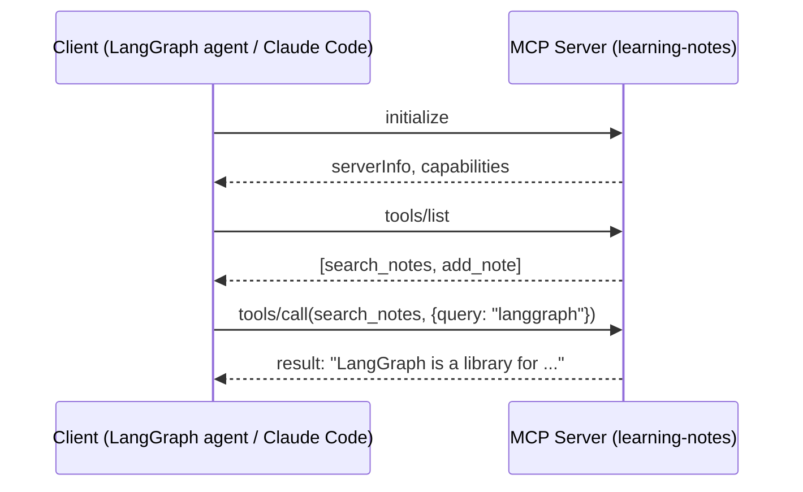
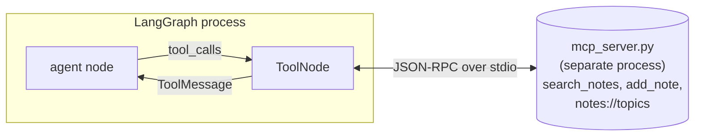

# Model Context Protocol (MCP)

In Topic 2, the `web_search` tool was a plain Python function (`search_index`) decorated with `@tool` and imported directly into the same process as the LangGraph agent. That works as long as every capability your agent needs can live in your codebase, in your language, in your process. Real systems break that assumption constantly: the data your agent needs lives in a company database, a SaaS API, a separate microservice — often written by a different team, in a different language, running on a different machine. **MCP (Model Context Protocol)** is the standard that lets an AI application (the **client**) talk to any of these external capabilities (exposed by a **server**) through one shared protocol, instead of writing a bespoke integration for each one. You are, in fact, already using an MCP-capable application: Claude Code itself is an MCP **host**, and every permission prompt you've seen ("Claude wants to run this command") is the security model this note explains.

This note follows the same shape as Topic 2: every concept gets a small, fully offline, runnable example. The running example is a **learning-notes server** — a tiny SQLite database of one-sentence notes (reusing the `langgraph` / `checkpointer` / `react` / `mcp` topics from Topic 2's `SEARCH_INDEX`, plus a couple of new ones) exposed as an MCP server with one tool (`search_notes`), one resource (`notes://topics`), and a second tool you'll implement yourself (`add_note`). Section 4 then reconnects this server to a Topic-2-style LangGraph agent.

---

## Table of Contents

1. [Where This Sits](#where-this-sits)
2. [Protocol Basics](#1-protocol-basics)
3. [Building a Minimal MCP Server](#2-building-a-minimal-mcp-server)
4. [Running & Inspecting the Server](#3-running--inspecting-the-server)
5. [Connecting a Client](#4-connecting-a-client)
6. [Transports](#5-transports)
7. [Security Model](#6-security-model)
8. [Summary & Connection Forward](#summary--connection-forward)

---

## Where This Sits

```
┌─────────────────────────────────────────────────────────────────┐
│  B03 Topic 2 — LangGraph                                          │
│  StateGraph: nodes + edges + conditional edges + checkpointer    │
│  tools are plain Python functions, imported directly (in-process)│
└─────────────────────────────────────────────────────────────────┘
                              │
                              │  the SAME tool now lives in its own
                              │  process, behind a standard protocol
                              │  that any client can speak
                              ▼
┌─────────────────────────────────────────────────────────────────┐
│  B03 Topic 3 — Model Context Protocol (MCP)  (THIS NOTE)          │
│  client <--JSON-RPC--> server : tools, resources, prompts        │
└─────────────────────────────────────────────────────────────────┘
                              │
                              ▼
┌─────────────────────────────────────────────────────────────────┐
│  B03 Topic 4 — AI Agent Patterns & Frameworks                     │
│  compare hand-built LangGraph+MCP agents vs CrewAI, Claude Agent  │
│  SDK, and other higher-level frameworks                           │
└─────────────────────────────────────────────────────────────────┘
```

A LangGraph `ToolNode` doesn't care *how* a tool's `.invoke()` is implemented — only that it takes a dict of arguments and returns a result. MCP exploits exactly that: `langchain-mcp-adapters` wraps an MCP tool in a `BaseTool` whose `.invoke()` quietly does a JSON-RPC round trip to a separate process. From the graph's point of view, nothing changes.

---

## 1. Protocol Basics

**Summary**: MCP defines a **client/server** architecture where every message is a **JSON-RPC 2.0** message, and a server can expose three kinds of capability: **tools** (actions with side effects), **resources** (read-only data identified by a URI), and **prompts** (reusable, parameterized prompt templates).

**The problem it solves**: Suppose ten different AI applications (a chat UI, an IDE assistant, a CLI agent, ...) all want to query your company's ticket-tracking system. Without a standard, each application's developers write their own integration: their own auth handling, their own way of describing "here's how you search tickets" to the model, their own response parsing. Multiply that by every tool and every application, and you get an *M × N* integration problem — M applications each writing custom code for N tools. MCP turns this into an *M + N* problem: each tool is wrapped **once** as an MCP server, and each application implements the MCP **client** side **once**; after that, any client can use any server.

**The intuition**: This is the "USB-C of AI tooling" comparison, and it's worth taking literally. Before USB-C, a charger for one phone often didn't fit another phone, and a printer cable didn't fit a webcam — every device had its own connector *and* its own electrical protocol. USB-C standardized both the physical connector and the protocol spoken over it, so any compliant cable works with any compliant port. MCP standardizes the "protocol spoken over the wire" between an AI application and a tool/data source: the *connector* is the **transport** (Section 5 — stdio or HTTP), and the *protocol* is JSON-RPC 2.0 messages shaped according to the MCP specification. Anthropic published the spec, but governance has since moved to the Linux Foundation's Agentic AI Foundation — the same kind of neutral home that USB-IF provides for USB.

**The math (message structure)**: Every MCP message is a JSON-RPC 2.0 object. A **request** is the tuple

$$\text{Request} = (\texttt{jsonrpc}=\text{"2.0"},\ \texttt{id},\ \texttt{method},\ \texttt{params})$$

where `id` is a value (number or string) chosen by the sender to correlate this request with its response, `method` is a string naming the operation (e.g. `"tools/call"`), and `params` is a dict of arguments for that method. A **response** is either a **result**

$$\text{Response}_{\text{ok}} = (\texttt{jsonrpc}=\text{"2.0"},\ \texttt{id},\ \texttt{result})$$

or an **error**

$$\text{Response}_{\text{err}} = (\texttt{jsonrpc}=\text{"2.0"},\ \texttt{id},\ \texttt{error})$$

with the *same* `id` as the request it answers. Crucially, `id` is what makes the protocol **transport-agnostic**: over stdio, messages are newline-delimited JSON written to stdin/stdout; over HTTP, they're POST bodies/SSE events — but in both cases, the client matches a response back to its request purely by `id`, regardless of ordering or timing.

**The three primitives**:

- **Tools** are actions the *model* decides to invoke — functions with side effects (write to a database, call an API, run code), discovered via `tools/list` and invoked via `tools/call`. This is the direct generalization of Topic 1/2's `@tool`-decorated functions.
- **Resources** are read-only data identified by a **URI** (e.g. `notes://topics`, `file:///path/to/doc.md`) — discovered via `resources/list` and fetched via `resources/read`. The key difference from a tool: the *application* (not necessarily the model) typically decides which resources to attach to context, the same way you might `@`-mention a file in a chat UI.
- **Prompts** are reusable, parameterized prompt templates the *server* exposes — discovered via `prompts/list` and filled in via `prompts/get`. Think of these as a server saying "here are some good questions to ask me," surfaced to the user as e.g. slash commands.

**Dry-run — the connection handshake**: Before any tools/resources/prompts can be used, the client sends an `initialize` request and the server responds with its identity and capabilities:

```
--> {"jsonrpc": "2.0", "id": 0, "method": "initialize",
     "params": {"protocolVersion": "2025-11-25", "capabilities": {...},
                 "clientInfo": {"name": "...", "version": "..."}}}

<-- {"jsonrpc": "2.0", "id": 0,
     "result": {"protocolVersion": "2025-11-25",
                 "serverInfo": {"name": "learning-notes", "version": "..."},
                 "capabilities": {"tools": {...}, "resources": {...}}}}
```

Section 3 shows this handshake for real, against the server built in Section 2.



---

## 2. Building a Minimal MCP Server

**Summary**: The official Python SDK's `FastMCP` class turns plain Python functions into MCP tools and resources via decorators — `@mcp.tool()` and `@mcp.resource(uri)` — deriving each tool's JSON Schema from its type hints, exactly as `@tool` did in Topic 1/2.

**The problem it solves**: The MCP spec defines a precise JSON-RPC message format for `tools/list`, `tools/call`, `resources/read`, and so on — handling all of that by hand (serializing requests, matching `id`s, converting Python exceptions into JSON-RPC errors) for every tool you write would be pure boilerplate. `FastMCP` handles the protocol plumbing so you can write ordinary Python functions.

**The intuition**: This is the same move as `@tool` in Topic 1 — a decorator that reads a function's name, docstring, and type hints to build a machine-readable description — but the *output* is now a server object that can run a full MCP transport loop (`mcp.run(transport=...)`), not just a `BaseTool` for one process's `ToolNode`.

**Dry-run — decorator to JSON Schema**: Define a tiny in-process server with one tool, then introspect it directly (no transport needed yet — `FastMCP` objects can answer `list_tools()`/`call_tool()` calls in-process):

```
@demo_mcp.tool()
def add_numbers(a: int, b: int) -> int:
    """Add two integers together."""
    return a + b

await demo_mcp.list_tools()
-> [Tool(name='add_numbers',
         description='Add two integers together.',
         inputSchema={'properties': {'a': {'title': 'A', 'type': 'integer'},
                                      'b': {'title': 'B', 'type': 'integer'}},
                       'required': ['a', 'b'],
                       'title': 'add_numbersArguments', 'type': 'object'})]

await demo_mcp.call_tool('add_numbers', {'a': 3, 'b': 4})
-> ([TextContent(type='text', text='7', ...)], {'result': 7})
```

`a: int, b: int` becomes `inputSchema.properties` with `type: "integer"` for each — the exact JSON Schema mechanism Topic 1 covered for `bind_tools`, now used to describe a tool *across a protocol boundary* instead of inside one process's prompt.

**The real server — `mcp_server.py`**: Because MCP servers run as **separate processes** (Section 3 spawns this file as a subprocess), it lives in its own file rather than a notebook cell. It defines:

```python
NOTES = {
    "langgraph": "LangGraph is a library for building stateful, multi-step LLM applications as graphs of nodes and edges.",
    "checkpointer": "A checkpointer persists the state of a graph after every step, identified by a thread_id.",
    "react": "The ReAct pattern interleaves reasoning (LLM thoughts) with acting (tool calls) in a loop.",
    "attention": "Self-attention lets each token in a sequence weigh and combine information from every other token.",
    "mcp": "The Model Context Protocol standardizes how LLM applications connect to external tools, data, and prompts.",
}
```

seeded into a small SQLite database (`learning_notes.db`, created on first run), and three capabilities built on top of it:

- `search_notes(query: str) -> str` — a **tool**, marked `readOnlyHint=True, openWorldHint=False` (Section 6), that does a substring lookup over the `notes` table — the same lookup logic as Topic 2's `search_index`, just backed by SQLite instead of a Python dict.
- `notes://topics` — a **resource** that returns a comma-separated list of every topic in the database. Unlike `search_notes`, this isn't "called" with arguments by the model; a client *reads* it by URI.
- `add_note(topic: str, content: str) -> str` — a second **tool**, marked `destructiveHint=True, idempotentHint=False` (Section 6), that writes a new row into the database. **This is the exercise** — its body is left for you to implement in Section 4.

---

## 3. Running & Inspecting the Server

**Summary**: A client connects to a server process via a **transport** (here, **stdio** — the client spawns the server as a subprocess and talks over its stdin/stdout), performs the `initialize` handshake, and then can call `list_tools`, `list_resources`, `call_tool`, and `read_resource`.

**The problem it solves**: Section 2 introspected `FastMCP` *in-process* — convenient for understanding the decorator, but it doesn't exercise the protocol at all (no JSON-RPC messages are actually serialized). Section 4's LangGraph agent needs the *real* thing: a separate process, a real transport, real serialized messages.

**The intuition**: `StdioServerParameters(command="python3", args=["mcp_server.py"])` is "here's how to start the server"; `stdio_client(...)` spawns that process and gives you two streams (read/write) wired to its stdin/stdout; `ClientSession(read, write)` wraps those streams with the MCP protocol — `await session.initialize()`, `await session.list_tools()`, etc. — turning each call into a JSON-RPC request, writing it to the subprocess's stdin, and reading the matching response (by `id`) from its stdout.

**Dry-run — the full session** (against `mcp_server.py` from Section 2):

```
server name: learning-notes
protocol version: 2025-11-25

--- list_tools ---
name: search_notes
description: Search the learning notes database for a topic and return its content.
input_schema: {"properties": {"query": {"title": "Query", "type": "string"}},
                "required": ["query"], "title": "search_notesArguments", "type": "object"}
name: add_note
description: Add or update a note in the learning notes database. ...

--- list_resources ---
uri: notes://topics
name: list_topics
description: List every topic available in the learning notes database.

--- call_tool: search_notes(query='langgraph') ---
isError: False
content: LangGraph is a library for building stateful, multi-step LLM applications as graphs of nodes and edges.

--- call_tool: search_notes(query='quantum gravity') ---
content: No results found.

--- read_resource: notes://topics ---
text: attention, checkpointer, langgraph, mcp, react
```

**Dry-run — raw JSON-RPC for one `tools/call`**: `session.call_tool("search_notes", {"query": "react"})` sends, over stdio, the request

```json
{
  "jsonrpc": "2.0",
  "id": 99,
  "method": "tools/call",
  "params": {
    "name": "search_notes",
    "arguments": {"query": "react"}
  }
}
```

and receives back the response

```json
{
  "jsonrpc": "2.0",
  "id": 99,
  "result": {
    "content": [
      {"type": "text", "text": "The ReAct pattern interleaves reasoning (LLM thoughts) with acting (tool calls) in a loop."}
    ],
    "isError": false
  }
}
```

Compare this to Topic 2's `web_search.invoke({"query": "..."})`, which directly returned the string `"The ReAct pattern interleaves..."`. Here, the *same* string arrives wrapped in a `result.content` list of typed content blocks (`{"type": "text", "text": ...}`) — MCP results are a list because a tool can return multiple pieces of content (text, images, embedded resources) in one response, and `isError: false` signals the call succeeded rather than raising.

---

## 4. Connecting a Client

**Summary**: `langchain-mcp-adapters`'s `MultiServerMCPClient` connects to one or more MCP servers and exposes their tools as ordinary LangChain `BaseTool` objects via `await client.get_tools()` — which then drop into a LangGraph `ToolNode` exactly like Topic 2's `web_search`.

**The problem it solves**: Topic 2's `agent_graph` had `ToolNode([web_search])`, where `web_search` was a `@tool`-decorated function living in the same process. We want the *identical* graph shape, but with `search_notes` running inside `mcp_server.py` as a separate process. The agent's code (the `StateGraph`, the `agent_node`, `tools_condition`) shouldn't need to know or care that the tool now lives across a process boundary.

**The intuition**: `MultiServerMCPClient({"learning_notes": {"transport": "stdio", "command": "python3", "args": ["mcp_server.py"]}})` is a small "address book" of servers. `await client.get_tools()` connects to each configured server, runs `tools/list`, and wraps each returned `Tool` description in a `BaseTool` whose `.invoke()`/`.ainvoke()` performs the `tools/call` round trip under the hood — spawning (or reusing) the server connection, sending the JSON-RPC request, and unwrapping `result.content` back into a value `ToolNode` can put into a `ToolMessage`.

**Dry-run — the agent loop, MCP-backed**:

```
tool: search_notes - Search the learning notes database for a topic and return its content.

HumanMessage | 'What is MCP?'
AIMessage | ''                       (tool_calls=[search_notes(query="mcp")])
ToolMessage | [{'type': 'text', 'text': 'The Model Context Protocol standardizes how LLM
                applications connect to external tools, data, and prompts.', 'id': '...'}]
AIMessage | 'MCP standardizes tool/data access for LLM apps.'
```

**Gotcha**: notice the `ToolMessage.content` is a **list of content-block dicts**, not a plain string — `[{"type": "text", "text": "...", "id": "..."}]` — directly reflecting the `result.content` shape from Section 3's raw JSON-RPC response. Topic 2's in-process `web_search` returned a plain string, so its `ToolMessage.content` was a plain string too. `langchain-mcp-adapters` preserves MCP's richer content-block structure rather than collapsing it, since a tool *can* return images or embedded resources alongside text.

**The exercises**:

1. `build_mcp_agent_graph(tools, llm)` — build the same `AgentState` / `agent_node` / `StateGraph` / `ToolNode` / `tools_condition` wiring as Topic 2 Section 3, but parameterized over the MCP-loaded `tools` list and an `llm`. This is "Topic 2's agent graph, reusable."
2. `add_note(topic, content)` in `mcp_server.py` — implement the second tool (Section 2): insert/replace a row in the `notes` table and return a confirmation string. Once implemented, calling `add_note(topic="transports", content="...")` followed by `search_notes(query="transports")` round-trips through the SQLite database — demonstrating that an MCP server can have **state that persists across calls** (and across separate client connections), unlike Topic 2's `SEARCH_INDEX`, which was a fixed Python dict baked into the process.



---

## 5. Transports

**Summary**: MCP defines how messages are framed and delivered independently of *what* the messages say. The two transports you'll meet in practice are **stdio** (this notebook) and **Streamable HTTP** (the modern replacement for the older HTTP+SSE transport).

**The problem it solves**: Section 3's server is a subprocess of the notebook's Python kernel — perfect for a tool that only the local agent needs, but useless if the tool needs to be shared by multiple clients, run on a different machine, or survive after any single client disconnects.

**The intuition**: stdio is like plugging a USB peripheral directly into your laptop — one cable, one device, one user, zero network configuration, and the "device" (server process) exists only as long as something is using it. Streamable HTTP is like a network printer — it has its own address, stays running independently of any one client, and many clients can connect to (and share) it over the network, at the cost of needing a host, a port, and (per Section 6) authentication.

| | **stdio** | **Streamable HTTP** |
|---|---|---|
| How it starts | Client spawns the server as a subprocess | Server runs independently (`mcp.run(transport="streamable-http")`), listening on a host:port |
| Who can connect | Exactly the process that spawned it | Any client that can reach the URL |
| Lifetime | Tied to the client's process | Independent — keeps running after a client disconnects |
| Typical use | Local dev tools, CLI agents (Claude Code's local MCP servers) | Remote/shared services, multi-user deployments |
| Auth | Inherits the OS process's permissions | Needs explicit auth (OAuth, API keys — see `mcp.server.fastmcp`'s `auth` settings) |

**Dry-run — the only line that changes**: The server-side code for `mcp_server.py` is identical regardless of transport, except for the final line:

```python
# stdio (this notebook):
mcp.run(transport="stdio")

# Streamable HTTP (a shared, remote server):
mcp.run(transport="streamable-http", host="0.0.0.0", port=8000)
```

and the client-side connection config changes correspondingly:

```python
# stdio
{"transport": "stdio", "command": "python3", "args": ["mcp_server.py"]}

# Streamable HTTP
{"transport": "streamable_http", "url": "http://localhost:8000/mcp"}
```

Everything *above* the transport — `@mcp.tool()`, `@mcp.resource()`, `ClientSession.call_tool()`, the `langchain-mcp-adapters` wrapping — is unchanged. This is the entire point of standardizing the protocol separately from the transport: you can develop and test against stdio locally, then deploy the same server behind Streamable HTTP without touching its tool/resource definitions.

---

## 6. Security Model

**Summary**: Because MCP tools can have arbitrary side effects — write to a database, call a paid API, delete a file — the protocol includes **tool annotations** (`readOnlyHint`, `destructiveHint`, `idempotentHint`, `openWorldHint`) that a server can attach to each tool as *hints* about its risk profile, which a client can use to decide when to ask for explicit user consent.

**The problem it solves**: An AI agent that can silently call *any* tool the model decides to call is dangerous — a model might be manipulated (via a malicious search result, document, or prompt injection) into calling `delete_database()` just as readily as `search_notes()`. The client needs *some* signal, beyond "the model wants to," about how cautious to be.

**The intuition**: You've experienced this directly in Claude Code. Reading a file or running `git status` happens silently — these are read-only, non-destructive operations. But editing a file, running `rm`, or pushing to a remote repository triggers a permission prompt — these are operations a user should consciously approve. `ToolAnnotations` give an MCP server a standard vocabulary to declare *which category a tool falls into*, so any MCP client (Claude Code, a custom LangGraph agent, anything else) can apply a consistent consent policy without having to guess from the tool's name or description alone.

**The annotations**, as set on this notebook's two tools:

```
search_notes -> readOnlyHint=True,  destructiveHint=None, idempotentHint=None, openWorldHint=False
add_note     -> readOnlyHint=None,  destructiveHint=True,  idempotentHint=False, openWorldHint=None
```

`readOnlyHint=True` on `search_notes` declares "this tool does not modify its environment" — a client can reasonably auto-approve repeated calls. `openWorldHint=False` declares "this tool only interacts with a closed set of entities it knows about" (our fixed `notes` table), as opposed to, say, a general web-search tool that could touch *anything* on the internet. `add_note`, by contrast, is `destructiveHint=True` (it can overwrite existing data) and `idempotentHint=False` (calling it twice with the same arguments is not guaranteed to be a no-op — each call is a meaningful write) — exactly the profile of a tool a careful client should pause on before running, the same way Claude Code pauses before an `Edit` or a `Bash` command that isn't on your auto-allow list.

**The gotcha**: annotations are **hints**, not enforcement — a malicious or buggy server could mark a destructive tool `readOnlyHint=True`. The *real* security boundary is still the client's own policy (what it chooses to auto-approve vs. prompt for) and, ultimately, the user's judgment when a consent prompt appears. MCP standardizes the *vocabulary* for that conversation between server and client; it doesn't replace the human in the loop — which is precisely the role `interrupt()` / `Command(resume=...)` played in Topic 2's human-in-the-loop section, now applied at the *tool-call* layer instead of inside a graph.

---

## Summary & Connection Forward

Topic 1 gave us the vocabulary for a single tool call (`@tool`, JSON Schema, `bind_tools`). Topic 2 wired tool calls into a stateful, looping, checkpointed, human-supervised graph — but every tool still lived in the same Python process as the graph. This topic took that exact same tool-calling shape and moved it **across a process boundary**: `mcp_server.py` runs independently, speaks JSON-RPC over stdio (or, with one line changed, over HTTP), exposes `search_notes` (read-only) and `add_note` (destructive, with persistent SQLite state) as tools and `notes://topics` as a resource — and `langchain-mcp-adapters` makes that server's tools indistinguishable, from the LangGraph agent's perspective, from Topic 2's in-process `web_search`.

Topic 4 (AI Agent Patterns & Frameworks) zooms back out: now that you've hand-built a stateful graph (Topic 2) wired to an external tool server (Topic 3), how do higher-level frameworks — LangGraph's own prebuilt agents, CrewAI, the Claude Agent SDK — package these same primitives (state, tools, MCP connections, human approval) behind different APIs, and what do you gain or lose by using them instead of building the graph yourself?
