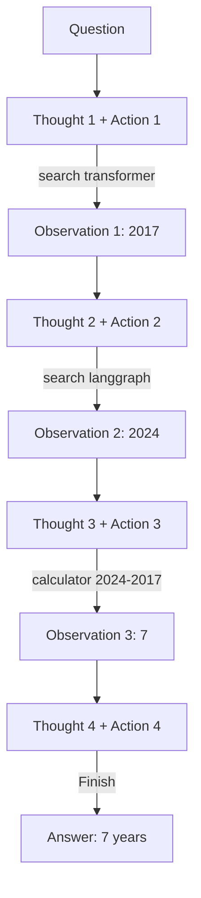
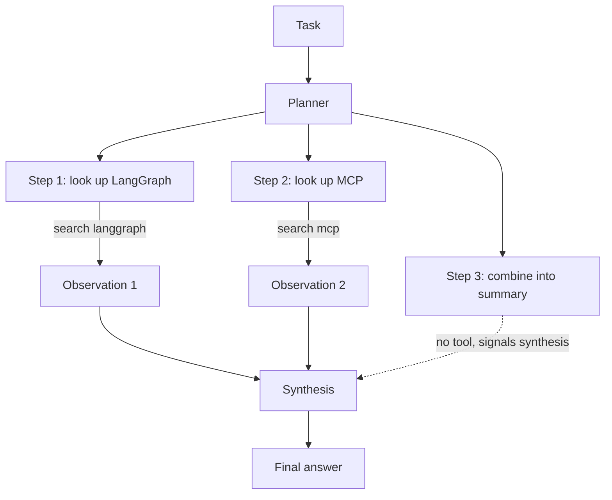
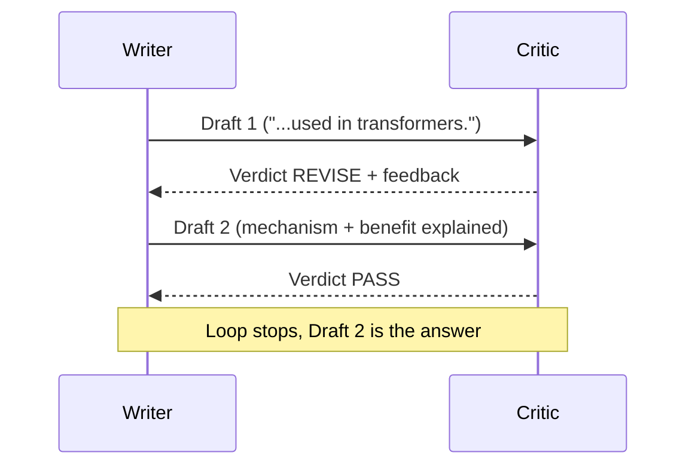

# AI Agent Patterns & Frameworks

Topics 1-3 built the primitives an agent needs: a chat model wrapped in a runnable (Topic 1), a stateful graph that can loop between an LLM and its tools with persistence (Topic 2), and a standard protocol for those tools to live in their own processes (Topic 3). None of those topics, though, answered a more basic question: when the LLM is given a question and a set of tools, in what *shape* does it actually go about answering it? "Call tools until done" is not a single algorithm — it is a family of algorithms, each with different costs, different failure modes, and different amounts of human-inspectable structure. This note walks through three of the most common shapes (ReAct, Plan-and-Execute, Reflection) by hand, then looks at how three frameworks (LangGraph, CrewAI, the Claude Agent SDK) package those shapes up, and finally zooms out one more level to **A2A**, a protocol for agents talking to *other agents* rather than to tools.

Every pattern in this note is implemented with `GenericFakeChatModel` and scripted responses, exactly as in Topics 1-3 — fully offline and deterministic. The point is not "does the LLM produce a good plan" (that depends on the model and prompt), but "what does the *agent code* do with whatever the LLM produces."

---

## Table of Contents

1. [Where This Sits](#where-this-sits)
2. [ReAct Pattern](#1-react-pattern)
3. [Plan-and-Execute](#2-plan-and-execute)
4. [Reflection / Self-Critique](#3-reflection--self-critique)
5. [Framework Tour](#4-framework-tour)
6. [Comparison & Decision Framework](#5-comparison--decision-framework)
7. [Agent-to-Agent (A2A) Protocol](#6-agent-to-agent-a2a-protocol)
8. [Summary & Connection Forward](#summary--connection-forward)

---

## Where This Sits

```
┌─────────────────────────────────────────────────────────────────┐
│  B03 Topic 3 — Model Context Protocol (MCP)                       │
│  client <--JSON-RPC--> server : tools, resources, prompts         │
└─────────────────────────────────────────────────────────────────┘
                              │
                              │  same agent loop, but now we name and
                              │  compare the *shape* of the loop itself
                              ▼
┌─────────────────────────────────────────────────────────────────┐
│  B03 Topic 4 — AI Agent Patterns & Frameworks  (THIS NOTE)         │
│  ReAct / Plan-and-Execute / Reflection, by hand                    │
│  then: LangGraph vs CrewAI vs Claude Agent SDK                     │
│  then one level up: A2A (agent <-> agent, vs MCP's agent <-> tool) │
└─────────────────────────────────────────────────────────────────┘
                              │
                              ▼
┌─────────────────────────────────────────────────────────────────┐
│  B03 Topic 5 — Advanced RAG                                        │
│  agents that decide *when* and *how* to retrieve, not just         │
│  retrieve-once-then-answer                                          │
└─────────────────────────────────────────────────────────────────┘
```

---

## 1. ReAct Pattern

**Summary**: ReAct ("Reasoning + Acting") is a loop in which the model alternates between writing a **Thought** (free-text reasoning about what to do next), an **Action** (a tool name and argument, in a fixed text format), and receiving an **Observation** (the tool's output) — repeating until the model emits a special `Finish` action containing the final answer.

**The problem it solves**: An LLM asked "What is 2024 minus 2017?" can usually just answer directly. But "How many years passed between the introduction of the Transformer architecture and the release of LangGraph?" requires the model to *first* retrieve two facts it doesn't reliably know (or might hallucinate), *then* do arithmetic on them — and LLMs are notoriously unreliable at multi-step arithmetic done "in its head" inside free-form text. ReAct's answer is to never let the model do either step silently: every fact retrieval and every calculation becomes an explicit, externally-executed **Action**, and the model's job is reduced to (a) deciding which action to take next and (b) reading the result.

**The intuition**: Think of ReAct as the difference between someone solving a research question entirely from memory versus someone solving it with a notebook, a search engine tab, and a calculator open — narrating each step out loud ("ok, first let me look up X... got it, now let me look up Y... now let me compute X minus Y... got my answer"). The "narrating out loud" *is* the Thought; opening the search tab or calculator *is* the Action; reading what comes back *is* the Observation. Nothing here is hidden — that is precisely why this note implements it with raw text parsing rather than the structured `tool_calls` API from Topic 2: in production code you would use `bind_tools`/`ToolNode` (which is doing this same job with a more reliable, model-native format), but seeing the text form first means you understand exactly what that structured API is standing in for.

**The math**: Let $q$ be the question and $\{\text{Tool}_1, \dots, \text{Tool}_k\}$ be the available tools. Define the **history** after $t-1$ completed steps as the concatenation of everything produced so far:

$$h_t = (T_1, A_1, O_1,\ \dots,\ T_{t-1}, A_{t-1}, O_{t-1})$$

where $T_i$ is the Thought, $A_i = (\text{name}_i, \text{arg}_i)$ is the Action, and $O_i$ is the Observation at step $i$. At step $t$, a single LLM call produces *both* the next thought and action together, conditioned on the question and everything so far:

$$T_t,\ A_t = \text{LLM}(q,\ h_t)$$

If $\text{name}_t = \texttt{Finish}$, the loop terminates and the answer is $\text{arg}_t$. Otherwise, the agent code executes the chosen tool:

$$O_t = \text{Tool}_{\text{name}_t}(\text{arg}_t)$$

and $h_{t+1} = h_t \cup (T_t, A_t, O_t)$. Notice $T_t$ never appears on the right-hand side of any computation — it is not consumed by anything except the *next* LLM call, as part of $h_{t+1}$. Its only function is to give the model "room to think" before it has to commit to a concrete, parseable action, which empirically improves the reliability of $A_t$.

**Dry-run**: The notebook poses the question *"How many years passed between the introduction of the Transformer architecture and the release of LangGraph?"* with two tools — `search(query)` (a 3-entry in-memory knowledge base) and `calculator(expression)` (a safe `ast`-based arithmetic evaluator supporting `+ - * /` and unary minus). The scripted trace runs for exactly 4 steps:

```
Step 1
  Thought: I need to find when the Transformer architecture was introduced.
  Action:  search[transformer]
  Observation: The Transformer architecture was introduced in 2017 in the
               paper 'Attention Is All You Need'.

Step 2
  Thought: Now I need to find when LangGraph was released.
  Action:  search[langgraph]
  Observation: LangGraph was first released in 2024 as a library for
               building stateful, graph-based LLM applications.

Step 3
  Thought: I have both years (2017 and 2024). I need to compute the difference.
  Action:  calculator[2024 - 2017]
  Observation: 7

Step 4
  Thought: I now know the final answer.
  Action:  Finish[7 years passed between the introduction of the Transformer
                   architecture (2017) and the release of LangGraph (2024).]
```

`parse_action` extracts `(name, arg)` from the `"Action: name[arg]"` line with the regex `Action:\s*(\w+)\[(.*)\]`. The `calculator` tool parses `"2024 - 2017"` into an `ast.BinOp(left=Constant(2024), op=Sub(), right=Constant(2017))` and walks it with a small dispatch table (`{ast.Sub: operator.sub, ...}`), returning `"7"` as a string — note every tool returns a **string** observation, since that's what gets concatenated back into the next prompt.



**The gotcha**: A real LLM won't always produce a perfectly-formatted `Action: name[arg]` line — it might add extra prose, use different brackets, or forget the `Action:` prefix entirely. `parse_action` here returns `None` if the regex doesn't match, and `run_react` raises immediately. Production ReAct implementations need a recovery strategy for malformed actions (e.g. re-prompt with "please respond in the exact format..."), which is exactly the kind of robustness that frameworks like LangGraph's structured `tool_calls` sidestep by having the *model provider* guarantee well-formed JSON instead of free text.

---

## 2. Plan-and-Execute

**Summary**: Plan-and-Execute splits an agent run into two phases. A **planner** LLM call looks at the task once and produces an ordered list of steps. An **executor** then works through that list — calling tools where a step needs one — and a final **synthesis** call combines all the gathered information into the answer.

**The problem it solves**: In ReAct, every single tool call costs a full LLM round trip *and* the model re-derives "what should I do next" from scratch each time, re-reading the entire growing history. For tasks where the overall structure is knowable upfront ("to compare X and Y, I need to look up X, look up Y, then compare them"), repeatedly re-deriving that structure is wasted work — and wasted latency, since each LLM call in this notebook's examples is the dominant cost.

**The intuition**: This is the difference between improvising a road trip turn-by-turn (checking the map after every intersection) versus looking at the whole map once, writing down "take Highway 1 to exit 12, then Route 9 to the destination," and then just *executing* that route, only consulting the map again if something goes wrong. The upfront plan is itself a useful artifact: you (or in production, a human reviewer) can read the 3-step plan *before* any tool runs and sanity-check it, something that's much harder with ReAct's "decide one step at a time" style.

**The math**: Given task $q$, the planner produces an ordered list of steps:

$$\text{Plan} = \pi_{\text{planner}}(q) = [s_1, s_2, \dots, s_n]$$

The executor then processes each step $s_i$ independently. For each step, an LLM call decides whether a tool is needed:

$$A_i = \pi_{\text{executor}}(s_i)$$

and if $A_i$ names a tool, $O_i = \text{Tool}_{A_i.\text{name}}(A_i.\text{arg})$ is computed; if not, $O_i$ is omitted (the step needed no tool — e.g. it's a "now write the summary" instruction meant for the synthesis phase). Finally, a synthesis call combines the question with everything gathered:

$$\text{Answer} = \pi_{\text{synth}}(q,\ O_1, \dots, O_k)$$

For an $n$-step plan where $k \le n$ steps use tools, this is $1 + n + 1$ LLM calls total (planner + one per step + synthesis) — versus ReAct's $m$ calls for an $m$-step trace, where in ReAct $m$ also includes the final `Finish` step. For small $n$ the counts are similar; the real saving is that *re-reading the full history* at every step (ReAct) is replaced by *each executor call seeing only its own step* (Plan-and-Execute), which keeps prompts shorter as the task grows.

**Dry-run**: Task: *"Write a one-paragraph summary comparing LangGraph and MCP, including the year each was introduced."* The planner produces:

```
Plan:
1. Look up information about LangGraph.
2. Look up information about MCP.
3. Combine both lookups into a one-paragraph summary mentioning both release years.
```

`parse_plan` extracts the three step strings with `re.findall(r"^\d+\.\s*(.+)$", text, flags=re.MULTILINE)`. The executor then processes each:

```
Executing step 1: Look up information about LangGraph.
  Action: search[langgraph]
  Observation: LangGraph was first released in 2024 as a library for
               building stateful, graph-based LLM applications.

Executing step 2: Look up information about MCP.
  Action: search[mcp]
  Observation: The Model Context Protocol (MCP) was introduced by
               Anthropic in late 2024 as an open standard for connecting
               LLMs to tools and data.

Executing step 3: Combine both lookups into a one-paragraph summary
                   mentioning both release years.
  No tool needed -- ready to write the summary.
```

Step 3's executor response contains no `"Action: name[arg]"` line, so `parse_action` returns `None`, the loop `break`s, and the two collected observations become the `context` for the synthesis call:

```
Final answer:
LangGraph and MCP were both introduced in 2024: LangGraph is a library for
building stateful, graph-based LLM applications, while MCP is an open
standard for connecting LLMs to tools and data. Together they form a
complementary stack -- LangGraph orchestrates an agent's control flow, and
MCP standardizes how that agent reaches external tools.
```



**The gotcha — the adaptivity tradeoff**: Notice the executor never goes *back*. If step 1's observation had been `"No results found."` (e.g. the planner misspelled a topic), the naive loop above would still proceed to step 2 and synthesis, producing a final answer that's silently missing half its information — there's no mechanism for "step 2 made me realize step 1 was wrong, let me redo it." ReAct's tight Thought→Action→Observation→Thought loop *does* get a chance to notice this on every single step, because the next Thought is conditioned on the latest Observation. This is the central tradeoff named in the topic outline: Plan-and-Execute trades adaptivity for a cheaper, more inspectable, more parallelizable structure (independent steps could even run concurrently, though this notebook's implementation runs them sequentially for simplicity).

---

## 3. Reflection / Self-Critique

**Summary**: Reflection adds a **critic** role on top of a writer. The writer produces a draft; the critic reviews it and returns either `Verdict: PASS` or `Verdict: REVISE` with specific feedback; if `REVISE`, the writer produces a new draft incorporating that feedback, and the cycle repeats up to a maximum number of rounds.

**The problem it solves**: ReAct and Plan-and-Execute both stop the moment *an* answer exists — neither pattern has any notion of "is this answer actually good?" For tasks where quality is hard to get right in one pass but *easy to check* (a classic example: it's hard to write a bug-free function on the first try, but easy to spot that a test fails), a second pass focused purely on evaluation can catch mistakes the first pass made.

**The intuition**: This is a first draft and an editor. A writer under deadline pressure will often produce a draft that's *technically responsive* to the prompt but shallow — present, but not good. An editor reading that draft with fresh eyes, *specifically looking for problems* rather than trying to produce the answer themselves, is much more likely to notice "this doesn't actually explain the *mechanism*, it just restates the question." The same asymmetry holds for LLMs: a model asked "is this draft missing anything?" is, in practice, often better at finding gaps than the same model was at avoiding those gaps while writing the first draft — generation and verification are different skills even for the same model.

**The math**: Let $d_1 = \pi_{\text{writer}}(q)$ be the first draft. For round $r = 1, 2, \dots, R$:

$$c_r = \pi_{\text{critic}}(q, d_r)$$

If $c_r$ begins with `Verdict: PASS`, the loop returns $d_r$ immediately. Otherwise:

$$d_{r+1} = \pi_{\text{writer}}(q, d_r, c_r)$$

and the loop continues. If no $c_r$ is `PASS` after $R$ rounds, the loop returns $d_{R+1}$ (the latest draft) anyway — Reflection trades *guaranteed* extra LLM calls (at least $1 + R$: one writer call plus one critic call per round) for a *probabilistic* quality improvement, with no guarantee the critic itself is correct. A 2-round reflection that needs a revision both times costs $1 + 2 \times 2 = 5$ LLM calls versus 1 for a single draft — a 5x cost for (hopefully) a meaningfully better answer.

**Dry-run**: Task: *"Write a 2-sentence summary of what self-attention does."*

```
Draft 1:
Self-attention is a mechanism used in transformers.

Critique (round 1):
Verdict: REVISE. The draft says self-attention is 'used in transformers' but
doesn't explain what it actually computes or why it's useful -- add the
token-to-token weighting mechanism and its benefit.

Draft 2:
Self-attention lets each token in a sequence weigh and combine information
from every other token, producing context-aware representations. This
allows transformers to capture long-range dependencies without recurrence.

Critique (round 2):
Verdict: PASS. The revised draft explains both the mechanism and its benefit.

Critic approved -- stopping.
```

Draft 1 is *not wrong* — self-attention genuinely is "a mechanism used in transformers" — but it's vacuous: it tells the reader nothing they didn't already know from the question. The critic's `REVISE` verdict names a concrete, checkable gap ("doesn't explain what it computes"), which the writer's second call directly addresses. The critic's second verdict, `PASS`, ends the loop with `return draft` on round 2 — note the loop never reaches a third writer call, since `max_rounds=2` bounds the *critique* rounds, and the second critique already passed.



**The gotcha**: This loop has no protection against the critic and writer **oscillating** — e.g. a critic that alternates between "too long, shorten it" and "too short, add detail" forever, never reaching `PASS`. `max_rounds` is the safety valve: the function always terminates, returning whatever the latest draft is, even if the critic never approved it. In production, you'd typically also track *whether the draft is actually changing* between rounds and bail out early if it's converged (or stopped converging) regardless of the critic's verdict.

---

## 4. Framework Tour

Sections 1-3 are deliberately "raw" — every prompt, parse, and loop is visible. Real frameworks implement variations of these same patterns but hide most of this machinery behind higher-level APIs. To compare frameworks on equal footing, the notebook poses **one task** to all three:

> Research the topic **"attention"** using the `learning-notes` MCP server (Topic 3's `mcp_server.py`, copied into this folder) and write a **3-bullet summary with sources**.

### LangGraph (reference — already built)

This reuses the exact `agent`/`tools` graph from Topic 3 Section 4, renamed `build_research_agent_graph`. The scripted `agent_llm` first emits a tool call to `search_notes(query="attention")`, then a final 3-bullet `AIMessage`:

```
HumanMessage | 'Research self-attention and write a 3-bullet summary with sources.'
AIMessage | ''
ToolMessage | [{'type': 'text', 'text': 'Self-attention lets each token in a
              sequence weigh and combine information from every other
              token.', 'id': 'lc_...'}]
AIMessage | "Here is a 3-bullet summary of self-attention:
- Self-attention lets each token weigh and combine information from every
  other token.
- It produces context-aware representations without recurrence.
- Source: learning-notes database, topic 'attention'."
```

Underneath, this *is* a ReAct loop: `agent_node` is $T_t, A_t = \text{LLM}(\dots)$, `ToolNode` is $O_t = \text{Tool}_{A_t}(\dots)$, and `tools_condition` is the `Finish`-vs-continue check — just expressed as graph nodes/edges with structured `tool_calls` instead of parsed text. Nothing about the *pattern* changed since Section 1; only its packaging.

### CrewAI (exercise)

[CrewAI](https://docs.crewai.com/) frames work as a **crew**: a list of `Agent`s, each with a `role`, `goal`, and `backstory` (these are prompt-engineering inputs — they get woven into that agent's system prompt), and a list of `Task`s, each assigned to one agent. A `Crew` with `process=Process.sequential` runs the tasks in order, and `Task(..., context=[other_task])` lets one task's output feed into another's prompt as context — this is how you'd wire a "researcher" task's findings into a "writer" task.

Mapped onto the shared task: a `researcher` Agent (`role="Researcher"`) gets a `Task` to look up "attention"; a `writer` Agent (`role="Writer"`) gets a `Task` (with `context=[research_task]`) to turn that research into a 3-bullet summary with sources. `crew.kickoff()` runs both tasks and returns the final output.

The exercise cell in the notebook is a **graceful-skip skeleton**: it checks `import crewai` and prints an install/API-key message if unavailable, since CrewAI requires a real LLM provider (via LiteLLM — `OPENAI_API_KEY`, `ANTHROPIC_API_KEY`, etc.) and this notebook must remain offline. [`04-agent-patterns-code-explanation.md`](../code/solutions/04-agent-patterns-code-explanation.md) has a worked-through canonical implementation for when you have an API key.

### Claude Agent SDK (exercise)

The [Claude Agent SDK](https://docs.claude.com/en/api/agent-sdk/overview) is the same agent loop that runs Claude Code itself. Rather than you building a graph or a crew, you call `query(prompt=..., options=ClaudeAgentOptions(...))` and the SDK runs an entire ReAct-style loop internally — including its own tool-calling, its own MCP client (you can pass MCP server configs directly in `ClaudeAgentOptions`), and its own context management — streaming back every message (thoughts, tool calls, tool results, final response) as it goes.

Mapped onto the shared task: `ClaudeAgentOptions(system_prompt="...", mcp_servers={"learning_notes": {...}})` would give the agent direct access to the same `mcp_server.py` from Topic 3, and a single `query(prompt="Research self-attention and write a 3-bullet summary with sources.")` call would handle discovery, tool calls, and the final write-up — *zero* lines of agent-loop code, only configuration. The notebook's exercise cell is again a graceful-skip skeleton (`pip install claude-agent-sdk` + the Claude Code CLI + `ANTHROPIC_API_KEY`).

---

## 5. Comparison & Decision Framework

| Framework | Lines of code (approx.) | Debuggability | Persistence support | Multi-agent support | MCP / A2A support |
|---|---|---|---|---|---|
| **LangGraph** | ~10 (graph definition) + reused MCP tool loading | High — every node/edge is explicit Python; `result["messages"]` shows the full trace, including raw `ToolMessage` content | Built-in via checkpointers (Topic 2) — pause/resume any thread | Possible, but manual: each agent is its own node or subgraph you wire up yourself | Native — `langchain-mcp-adapters` (Topic 3); A2A via community adapters |
| **CrewAI** | ~15-20 (2 `Agent`s + 2 `Task`s + `Crew`) | Medium — `Crew(..., verbose=True)` prints each agent's reasoning/tool calls, but the control flow itself (sequential vs hierarchical process) is inside the library, not your code | Limited out of the box — CrewAI Flows add state/persistence on top of crews, but a plain `Crew` is stateless per `kickoff()` | First-class — the framework's central abstraction; adding a third role is one more `Agent` + `Task` | MCP via `crewai-tools`' MCP adapter; no built-in A2A |
| **Claude Agent SDK** | ~5 (one `query()` call + options) | Lower for *your* code (the loop is opaque), but the SDK streams every intermediate message, so the trace is visible — you just can't single-step it | Session-based — the SDK manages conversation state across turns within a session | Possible via subagents / multiple `query()` calls, but the framework's unit is "one agent, well-equipped," not "many small agents" | Native MCP (pass server configs directly in options); A2A not built in |

The pattern: **LangGraph** gives you the most control and the most code — every line in this notebook's Sections 1-4 is something LangGraph would otherwise still require *you* to write, just with nicer plumbing (`ToolNode`, `tools_condition`, checkpointers) for the repetitive parts. **CrewAI** trades control for a vocabulary (`role`/`goal`/`backstory`/`Task`/`Crew`) that maps naturally onto "a small team with defined responsibilities" — appropriate when the task genuinely decomposes into distinct roles. **Claude Agent SDK** trades the *most* control for the *least* code — appropriate when "a capable general agent with the right tools" is sufficient and you don't need to dictate the control flow at all, only the available tools and the system prompt.

---

## 6. Agent-to-Agent (A2A) Protocol

**Summary**: A2A (Agent-to-Agent), an open protocol now under the Linux Foundation, standardizes how one agent discovers and communicates with *another agent* — as opposed to MCP, which standardizes how an agent communicates with *tools, resources, and prompts*.

**The problem it solves**: Suppose your LangGraph agent needs a sub-task done — "research this topic in depth" — and a separate team has already built a dedicated research agent (in CrewAI, say, with its own tools, its own retries, its own quality checks). Without a standard, integrating that research agent means either reimplementing it, or building a bespoke API around it. A2A defines a standard "shape" for *any* agent to expose itself as a callable service to *any* other agent, regardless of what framework built either side.

**The intuition**: MCP and A2A sit at different layers of the same idea. MCP is "how does an agent call a *function*" (well-defined inputs/outputs, like `search_notes(query) -> str`). A2A is "how does an agent call *another agent*" (a task description in, a result — possibly after the other agent does its own multi-step reasoning, its own tool calls, maybe its own MCP servers — out). A single system can use both: a top-level orchestrator agent might use A2A to delegate "research topic X" to a specialist research agent, which internally uses MCP to query a database — the orchestrator never needs to know that.

**The Agent Card**: Before calling another agent, a client needs to know what that agent *can do*. A2A's answer is the **Agent Card** — a JSON document (conventionally served at `/.well-known/agent.json`) describing the agent's identity, supported communication modes, and **skills**. This plays the same discovery role that MCP's `tools/list` response plays for tools, but one level up — describing whole capabilities of an agent-as-a-service rather than individual function signatures.

**Dry-run**: The notebook builds and prints an illustrative Agent Card for a hypothetical "learning-notes research agent" — the same kind of agent built in Section 4's LangGraph reference, exposed as an A2A service:

```json
{
  "name": "learning-notes-research-agent",
  "description": "Researches topics in the learning notes database and writes a 3-bullet summary with sources.",
  "url": "https://example.local/a2a/research-agent",
  "version": "1.0.0",
  "capabilities": {
    "streaming": true,
    "pushNotifications": false
  },
  "defaultInputModes": ["text/plain"],
  "defaultOutputModes": ["text/plain"],
  "skills": [
    {
      "id": "research-and-summarize",
      "name": "Research and summarize",
      "description": "Look up a topic in the learning notes database and produce a 3-bullet summary with sources.",
      "tags": ["research", "summarization"]
    }
  ]
}
```

Compare this to Topic 3 Section 1's `types.Tool` JSON for `search_notes`: both are JSON descriptions of "what can be invoked and how," but `Tool.inputSchema` describes a single function's parameters, while an Agent Card's `skills` list describes higher-level *capabilities* of an entire agent — `"research-and-summarize"` here might internally involve several tool calls, an MCP server, and even its own Reflection loop, none of which is visible to whoever is just reading the Agent Card.

**The gotcha**: As with MCP's `ToolAnnotations` (Topic 3 Section 6), an Agent Card is **self-declared** — the agent describes its own capabilities, and nothing prevents a card from being inaccurate or a server from misrepresenting what its `skills` actually do. The trust model is the same: a client (or the human operating it) decides how much to trust an unfamiliar agent before delegating real work to it, exactly as Claude Code's permission prompts mediate trust for MCP tool calls.

---

## Summary & Connection Forward

ReAct, Plan-and-Execute, and Reflection are not competing frameworks — they are three different *shapes* of loop, each addressing a different weakness of "just let the model call tools until it stops": ReAct keeps the model adaptive at the cost of re-deriving context every step; Plan-and-Execute front-loads structure at the cost of adaptivity; Reflection adds a quality check at the cost of extra LLM calls. LangGraph, CrewAI, and the Claude Agent SDK each implement variations of these shapes (most commonly ReAct-like loops) behind progressively higher-level APIs — more code and control with LangGraph, role-based structure with CrewAI, near-zero code with the Claude Agent SDK. A2A then adds one more layer: once you can build *one* good agent, A2A is how that agent becomes a building block other agents — possibly built by other people, in other frameworks — can call.

Topic 5 (Advanced RAG) returns to the retrieval problem from B02, but through this lens: instead of "retrieve once at the start, then answer," an agent built with these patterns can decide *during* its reasoning loop whether it needs to retrieve at all, retrieve again with a refined query, or retrieve from a different source — retrieval becomes another tool an agent calls, subject to the same ReAct/Plan-and-Execute/Reflection choices covered here.
