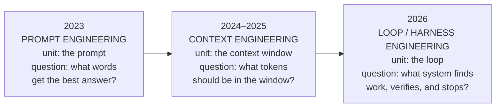

# Chapter 1: The 2026 Agent Landscape

## Table of Contents

1. [Why This Chapter Exists](#1-why-this-chapter-exists)
2. [The Agent Loop: Think → Act → Observe](#2-the-agent-loop-think--act--observe)
3. [Workflows vs Agents: Anthropic's Line in the Sand](#3-workflows-vs-agents-anthropics-line-in-the-sand)
4. [The Equation: Agent = Model + Harness](#4-the-equation-agent--model--harness)
5. [Three Eras of Effort: Prompt → Context → Loop Engineering](#5-three-eras-of-effort-prompt--context--loop-engineering)
6. [Proof From the Field: The Terminal-Bench Result](#6-proof-from-the-field-the-terminal-bench-result)
7. [Three Named Failure Modes the Harness Must Defeat](#7-three-named-failure-modes-the-harness-must-defeat)
8. [The Autonomy Ladder](#8-the-autonomy-ladder)
9. [What the Model Already Eats For You](#9-what-the-model-already-eats-for-you)
10. [The 2026 Stack Map](#10-the-2026-stack-map)
11. [Dry-Run: Token & Cost Arithmetic for One Agent Run](#11-dry-run-token--cost-arithmetic-for-one-agent-run)
12. [Reading the Field Without Getting Burned](#12-reading-the-field-without-getting-burned)
13. [Key Takeaways + Master Decision Table](#13-key-takeaways--master-decision-table)

---

# 1: Why This Chapter Exists

## What This Chapter Is Really About

You already know how to call an LLM, get a response, and maybe let it call a
tool once. That is not the hard part anymore, and it was never really the
interesting part. The hard part — the part that separates a demo that works
once from a system that works the two-hundredth time, unattended, on a task
that takes forty minutes — is everything that happens *around* the model call.
By mid-2026 the field has a name for that surrounding structure: the
**harness**. This chapter's only job is to install the vocabulary and the
mental model for the harness before you write a single line of agent code, so
that every later chapter (loop engineering, memory, evals, security, RL) has a
slot to click into instead of arriving as an unrelated new idea.

*Nothing in this chapter needs a framework. That is deliberate — you cannot
judge what LangGraph or the Claude Agent SDK is doing *for* you until you know
what it would take to do it yourself.*

---

# 2: The Agent Loop: Think → Act → Observe

## The Intuition

Picture a **line cook** working a ticket rail. A ticket comes in (the goal).
The cook looks at what's already plated and what's still raw (observes),
decides the next single thing to do — sear the fish, not the whole dish at
once (thinks), does that one thing (acts), and then looks at the pan again
before deciding the next step. The cook never plans all forty minutes of a
busy dinner service in one uninterrupted stretch with their eyes closed; they
re-observe after every action. That re-observation is the entire trick. A
short-order cook who plans once and executes blind burns the fish.

This is the whole definition of an agent, stripped to its atomic unit: a
**loop**, not a single clever prompt. Everything else in this folder —
memory, verification, permissions, evals — is scaffolding built *around* this
one repeating cycle.

## The Cycle, Named Precisely

```
                 ┌───────────────────────────────────────────┐
                 │                                           │
                 ▼                                           │
        ┌────────────────┐      ┌───────────────┐     ┌───────────────┐
        │    THINK       │─────▶│     ACT       │────▶│   OBSERVE     │
        │ (model reasons │      │ (call a tool, │     │ (read the     │
        │  about state)  │      │  write memory)│     │  result back) │
        └────────────────┘      └───────────────┘     └───────┬───────┘
                 ▲                                            │
                 └──────────────── loop until done ───────────┘

        stop when: goal reached │ budget spent │ no progress │ human says stop
```

**Think** is the model reading the current state (the message transcript so
far) and deciding what happens next — not necessarily visible chain-of-thought,
just the forward pass that picks the next token, be it a tool call or a final
answer. **Act** is that decision leaving the model's head and touching the
world: a function executes, a file gets written, an API gets hit. **Observe**
is the result of that action being fed back in as new input for the next
Think step. The loop is the atomic unit of agency in the same sense that the
attention head is the atomic unit of a transformer — everything bigger is
built by composing more of this one thing.

## Key Takeaways for Section 2

An agent is not a prompt, a framework, or a demo — it is a loop that
re-observes after every action instead of planning blind. If a system never
re-observes (it decides everything up front and executes without checking),
it is not agentic, no matter how clever the single prompt that produced the
plan was. Section 3 formalizes exactly where that line sits.

*Next: Anthropic drew this exact line in writing, and it is worth knowing the
precise wording, because "just add a loop" is not always the right call.*

---

# 3: Workflows vs Agents: Anthropic's Line in the Sand

## The Problem It Solves

"Agent" got used as a marketing word for almost anything with an LLM in it for
about two years. That vagueness costs you real money and real debugging time,
because a system that dynamically decides its own path needs an entirely
different harness (verification, budgets, stop rules) than a system that
follows a path *you* wrote in code. Anthropic's December 2024 engineering post
"Building Effective Agents" is still the cleanest primary source for drawing
this line, and its wording has held up well enough that the 2026 field still
quotes it verbatim.

## The Definitions, Word for Word

> **Workflows** are systems where LLMs and tools are orchestrated through
> predefined code paths.
>
> **Agents** are systems where LLMs dynamically direct their own processes and
> tool usage, maintaining control over how they accomplish tasks.

The distinguishing question is **who owns control flow**. In a workflow, *your
code* has an `if/else` or a fixed pipeline, and the LLM fills in a step. In an
agent, *the LLM* decides which step comes next, including whether there is a
next step at all. Neither is "better" in the abstract — a workflow is more
predictable, cheaper, and easier to test; an agent is more adaptive but harder
to bound. Anthropic's actual guidance, and it is worth taking seriously before
you reach for Chapter 2's loop: **build the simplest thing that passes your
evaluation, and only add agentic complexity when you cannot hardcode the path
but you can still verify progress.** A one-shot LLM call with good tools beats
an agent loop if the task doesn't need adaptive branching — the extra
complexity buys you nothing but more ways to fail silently.

## The Augmented LLM: The Substrate Underneath Both

Before "workflow" or "agent" enters the picture, there is a baseline unit both
are built from: the **augmented LLM** — a model plus three capabilities it can
invoke on its own initiative:

1. **Retrieval** — the model writes its own search queries and reads the
   results back.
2. **Tools** — the model picks a tool, runs it, and reads the output.
3. **Memory** — the model decides what to keep across turns (recap of B03's
   basic memory, deepened in Chapter 9 of this folder).

Every pattern below — and every "agent" you will build for the rest of this
folder — is an augmented LLM wired into either a fixed pipeline (workflow) or a
self-directed loop (agent).

## The Five Workflow Patterns (Memorize the Shapes, Not the Names)

| Pattern | Shape | Use when |
|---|---|---|
| **Prompt chaining** | Step 1's output feeds Step 2's input, in a straight line | The task decomposes cleanly into fixed sequential subtasks |
| **Routing** | Classify the input first, then send it down one of several fixed paths | Inputs fall into distinct categories that need different handling |
| **Parallelization — sectioning** | Split one task into independent subtasks, run them at once, merge | Subtasks are genuinely independent (no shared state) |
| **Parallelization — voting** | Run the *same* task N times, combine via majority/consensus | You want confidence from redundancy, not speed |
| **Orchestrator–workers** | One LLM call plans a breakdown, dispatches worker LLM calls, synthesizes results | The subtask list can't be fixed in code ahead of time (forward pointer to Ch 13) |
| **Evaluator–optimizer** | One LLM generates, a second LLM critiques, loop until the critic is satisfied | There's a clear quality bar a second pass can check (forward pointer to Ch 6's verifier ladder) |

Notice something important: **orchestrator–workers and evaluator–optimizer
already look like agents.** That's not a mistake in the taxonomy — it's the
actual boundary. The moment "which workers do I need" or "is this good enough"
can't be decided by code you wrote in advance, you've crossed from workflow
into agent, even if you call it a workflow in your architecture diagram.

## Decision Guide

| You're building... | Reach for | Why |
|---|---|---|
| A fixed sequence of LLM-assisted steps | Prompt chaining | Predictable, cheap, easy to eval per step |
| Different handling per input category | Routing | Keeps each downstream prompt focused and simple |
| Independent subtasks you can fan out | Parallelization (sectioning) | Wall-clock speedup, no coordination needed |
| Higher confidence via redundancy | Parallelization (voting) | Cheap insurance against a single bad sample |
| A task whose subtask list depends on the input | Orchestrator–workers | You genuinely can't hardcode the breakdown |
| Output with a checkable quality bar | Evaluator–optimizer | A second LLM (or a real check) can catch what the first missed |
| A task with no fixed path *and* no way to verify short of running it | A full agent loop (Ch 2 onward) | This is the only case that actually needs the harness machinery in this folder |

## Key Takeaways for Section 3

"Agent" specifically means *the LLM controls its own path*, not "an LLM did
something." The augmented LLM (retrieval + tools + memory) is the shared
substrate under every pattern above. Anthropic's own advice — start simple,
add agentic control only when you can't hardcode the path but can still
verify progress — is the single best piece of scope discipline in this whole
folder, and it will save you from building an agent loop for a task that a
three-step workflow would have solved more cheaply and more reliably.

*Next: once you've decided you actually need an agent, the question becomes —
what makes one agent reliable and another one flaky, given the exact same
model?*

---

# 4: The Equation: Agent = Model + Harness

## The Intuition

Think of the model like a **brilliant new hire on their first day** — genuinely
smart, well-read, capable of excellent judgment in the moment, but with zero
institutional memory and no idea what's actually allowed. Left alone in an
empty room with no manual, no checklist, and no manager checking their work,
even a brilliant new hire produces inconsistent results: sometimes brilliant,
sometimes confidently wrong, occasionally declaring a half-finished task
"done" because nobody told them what "done" means here. What turns that new
hire into someone who reliably ships good work isn't a smarter new hire —
it's onboarding docs, a checklist, a code reviewer, clear escalation rules, and
a manager who checks in. That surrounding structure is the **harness**, and it
is the entire subject of this folder.

## The Equation

$$\text{Agent} = \text{Model} + \text{Harness}$$

Read the two terms literally. The **Model** side is the part you rent from a
provider and cannot change turn-to-turn: its weights, its training, its raw
capability ceiling. The **Harness** side is everything you write and own: the
loop that calls it, the tools you expose, what tokens you put in its context
and when, what it's allowed to do without asking, what checks its work before
you trust it, what it remembers between sessions, and how you measure whether
a change made things better or worse. As of 2026 the field's working
consensus, stated plainly: **for a fixed model, harness quality is the
dominant lever on real-world success rate** — not prompt wording, not which
frontier model you picked this month.

```
        ┌──────────────────────────────────────────────────────────────┐
        │                          AGENT                               │
        │                                                              │
        │   ┌─────────────────┐        ┌──────────────────────────┐    │
        │   │     MODEL       │        │        HARNESS           │    │
        │   │  (rented,       │◀──────▶│  (yours, changeable      │    │
        │   │   fixed weights)│        │   every day)             │    │
        │   │                 │        │                          │    │
        │   │ raw reasoning   │        │ • loop control (Ch 2, 6) │    │
        │   │ raw capability  │        │ • tool interface (Ch 3)  │    │
        │   │ ceiling         │        │ • context mgmt (Ch 4)    │    │
        │   │                 │        │ • planning artifacts(Ch7)│    │
        │   │                 │        │ • memory (Ch 9)          │    │
        │   │                 │        │ • permissions (Ch 16)    │    │
        │   │                 │        │ • verification (Ch 6)    │    │
        │   │                 │        │ • persistence (Ch 12)    │    │
        │   │                 │        │ • observability (Ch 15)  │    │
        │   │                 │        │ • evals (Ch 14)          │    │
        │   └─────────────────┘        └──────────────────────────┘    │
        └──────────────────────────────────────────────────────────────┘

        You cannot ship a smarter model next Tuesday.
        You CAN ship a better harness next Tuesday.
```

## Why This Framing Matters Practically

Every chapter number in the diagram above is a chapter later in this folder —
that's not decoration, it's the point. When your agent fails, the instinct is
to reach for a bigger or newer model. The harness framing asks a different
first question: **which of the ten boxes on the right is actually missing or
broken?** A model that "hallucinates a finished task" usually has no
verification step (Ch 6), not a reasoning deficit. A model that "forgets the
instructions from twenty minutes ago" usually has a context manager that
never re-injects durable rules (Ch 4), not a memory deficit in the
architecture sense. Treating every failure as a model problem is expensive and
frequently wrong; treating it as a harness problem is testable in an
afternoon.

## Key Takeaways for Section 4

The model is fixed and rented; the harness is yours and it's where the real
engineering lives. When an agent fails, diagnose which harness component is
missing before reaching for a different model. This one-line equation is the
organizing principle for the entire rest of B04.

*Next: the equation didn't appear out of nowhere — it's the endpoint of three
years of the field moving the unit of effort further outward, from words, to
context, to the loop itself.*

---

# 5: Three Eras of Effort: Prompt → Context → Loop Engineering

## The Intuition

Imagine you're coaching someone through a task over a phone call versus over a
long expedition. On a two-minute call, the only thing that matters is
*exactly what you say* — word choice, one clear instruction. Over a
day-long hike, word choice barely matters anymore; what matters is *what
information they're carrying* — do they have the map, the right gear, do they
know which fork they already tried. Over a week-long, unattended expedition
where you can't even be on the phone the whole time, neither of those is
enough — what matters now is *the system* you set up before they left: check-in
points, a turn-back rule if they're lost, a way to know if they're actually
making progress or just wandering. Three completely different jobs, same
underlying goal ("get them there"), and each era of AI engineering has
matched one of these three regimes as agent runs got longer.

## The Three Eras, Concretely



| Era | Unit of work | Central question | What you actually tuned |
|---|---|---|---|
| 2023 — Prompt engineering | The prompt | "What words get the best answer?" | Wording, few-shot examples, instruction phrasing |
| 2024–2025 — Context engineering | The context window | "What tokens should occupy the window right now?" | Retrieval, file selection, project rules, compaction (this folder's Ch 4) |
| 2026 — Loop / harness engineering | The loop | "What system finds the work, does it, verifies it, and stops — without me typing the next instruction?" | The loop, verifiers, memory, permissions, evals (this folder's Ch 5–17) |

**Loop engineering**, the name for the current era, was coined in June 2026
(commonly credited to Addy Osmani and Boris Cherny) precisely because the
older two names stopped describing where the work was going. Where prompt
engineering asks *"what should I say to get the best output?"* and context
engineering asks *"what should be in the window?"*, loop engineering asks
*"what system should I build so the agent finds the work, does it, verifies
it, and remembers what it did — without me in the loop at all?"* The
intelligence still lives in the model. The reliability now lives in the loop
around it.

## Why the Progression Happened in This Order

This is not an arbitrary sequence — each era became the bottleneck only once
the previous one stopped being one. Prompt wording mattered most when a single
call answered a single question and there was nothing else to tune. Once
models started reading retrieved documents and tool outputs across many
turns, wording stopped being the ceiling — what was *in the window*, and in
what order, became the thing that made or broke a run (context rot, covered
properly in Chapter 4, is the empirical face of this ceiling). Now that
single agent runs can last an hour and touch dozens of files, and the model
itself has gotten good enough at reasoning within one turn, the ceiling has
moved again: a perfectly-worded prompt over a perfectly-curated context still
fails if there's no verifier to catch a wrong turn, no stop rule to prevent
runaway cost, and no memory to survive a crash. Each era subsumes rather than
replaces the last — you still need good wording and a well-managed context
window inside a well-engineered loop.

## Key Takeaways for Section 5

The unit of engineering effort has moved outward three times: word choice →
window contents → the surrounding control system. This isn't fashion — each
move happened because the previous unit stopped being the bottleneck once
agent runs got longer and more autonomous. B04 is built almost entirely at the
third layer, which is why Chapters 5–17 exist and why they lean on Chapter 4's
context discipline as a prerequisite rather than a competitor.

*Next: this progression sounds like a nice story until you see it produce a
measured, attributable result on a real benchmark.*

---

# 6: Proof From the Field: The Terminal-Bench Result

## The Claim

In March 2026, engineers at LangChain reported moving their coding agent from
**30th place to 5th place on Terminal-Bench 2.0** — a benchmark of
hand-crafted terminal tasks spanning software engineering, system
administration, and data science — **without changing the underlying model
at all.** Every point of that jump came from changes to the harness: how tools
were exposed, how context was managed, how progress was verified, how the
loop decided to retry or stop. This specific result is now the most-cited
single data point for the "harness matters more than model" argument, and it
is worth internalizing exactly *why* it is such strong evidence rather than
just repeating it as a slogan.

## Why This Is Strong Evidence, Not Just a Good Story

The experiment design is what makes it convincing: **one variable changed**
(the harness), **one variable held fixed** (the model), **one external,
already-standardized scoreboard** (Terminal-Bench 2.0, not a benchmark the
team invented themselves). That's a controlled comparison, not an anecdote.
Contrast this with the much more common (and much weaker) claim you'll see
elsewhere online: "we switched to Model X and our agent got way better" — that
comparison almost always changes the harness *and* the model at the same
time (different tool-calling format, different context window size, different
default system prompt from the new provider), so you can't actually attribute
the improvement to either one. The Terminal-Bench result is exactly the
experiment you'll be running yourself, in miniature, throughout this folder:
Chapter 6 calls this discipline "hill-climbing" and Chapter 14 builds you the
regression harness to do it rigorously — change one component, re-run the
same eval, keep or revert.

## What "Harness Changes" Actually Looked Like

Reported categories of change behind results like this one match exactly the
component list from Section 4's diagram: better tool descriptions and
granularity (Ch 3), smarter context compaction so the agent didn't degrade on
long tasks (Ch 4), a verification step that stopped it from declaring victory
prematurely (Ch 6, and see Section 7 below), and tighter stop/retry logic so
failed attempts didn't compound (Ch 6 again). None of it was a new model
checkpoint.

## Key Takeaways for Section 6

A controlled, model-held-fixed benchmark jump from 30th to 5th place is the
strongest kind of evidence for the harness thesis: it isolates the one
variable this entire folder is about. The lesson to carry forward is
methodological, not just factual — when you improve your own agent later,
change one harness component at a time against a fixed eval set, or you will
never know what actually helped.

*Next: what specifically goes wrong inside a bad harness has names now — three
of them, and they'll recur constantly for the rest of this folder.*

---

# 7: Three Named Failure Modes the Harness Must Defeat

## The Problem It Solves

"The agent got worse near the end" or "it said it was done but it wasn't" used
to be vague complaints you'd shrug at. In 2026 harness-engineering literature,
three specific, recurring failure patterns got names — and naming them matters
because a named failure mode is one you can build a specific harness
countermeasure against, rather than throwing a vaguely bigger prompt at it.

## 1. Victory Declaration Bias

**What it is.** The agent marks a task complete without actually verifying the
outcome. It *decides* it's done before it *checks* that it's done. The output
looks finished — files are written, a summary is printed, the tone is
confident — right up until you actually run the code, or read the file, and
discover it's broken, empty, or half of what was asked for.

**Why it happens.** Nothing in a bare agent loop (Section 2's Think → Act →
Observe) forces a distinction between "I produced output" and "I confirmed the
output is correct." The model's own judgment about its own success is being
used as the success signal, and that judgment has no access to ground truth
the model didn't generate itself.

**The countermeasure (previewed here, built in Chapter 6).** Never let the
model's self-report be the stop condition when *anything* machine-checkable
exists instead: an exit code, a test suite, a type checker, a schema
validator. "Prove it" beats "trust it," always, when proof is available at all.

## 2. Context Anxiety

**What it is.** As the context window fills up, the model's behavior shifts —
it starts rushing, cutting corners, and wrapping up prematurely, as if it can
sense the window closing in and wants to land the plane before running out of
room. Output quality visibly degrades in the last stretch of a long run, not
because the task got harder, but because the *window* got fuller.

**Why it happens.** This is the behavioral symptom of **context rot** (the
measured phenomenon that model accuracy degrades as input length grows and as
relevant information sits further from the end of the context — the full
mechanism and the numbers behind it are Chapter 4's subject). Context anxiety
is context rot as it shows up in an agent's *decisions*, not just its recall
accuracy.

**The countermeasure (previewed here, built in Chapter 4).** Proactive
compaction *before* the window is nearly full, not reactive compaction at the
last possible moment — the whole point is to never let the model feel the
walls closing in, because by the time it's rushing, the damage to that run's
quality is already done.

## 3. One-Shotting Overreach

**What it is.** The agent attempts an entire large task in one unbroken pass —
touching dozens of files, making a tangle of undocumented changes — instead of
working in small, independently verifiable increments. As the task grows
inside a single pass, the agent pushes deeper into its own context window,
loses track of earlier decisions it made minutes ago, and the result comes out
partial, inconsistent, or structurally broken.

**Why it happens.** Nothing in a bare loop enforces step *sizing*. A model
given a 40-file task and no external structure will often just start
editing everything at once rather than decomposing the work — especially
since decomposition itself takes deliberate effort the model has no built-in
incentive to spend.

**The countermeasure (previewed here, built in Chapters 6 and 7).** Force
small, verified increments: a plan artifact that breaks the task into
independently checkable steps (Chapter 7), and a loop that verifies after
*each* step rather than only at the very end (Chapter 6) — the "commit-per-step"
discipline.

## Why All Three Belong in the Same Section

Notice the shared shape: in every one of these three failure modes, **the
model is not malfunctioning** — it is behaving exactly as a token predictor
would given the situation the harness put it in. Victory declaration bias is
the rational move when nothing is checking your claim. Context anxiety is the
rational move when the space you have left is genuinely shrinking. One-shot
overreach is the rational move when nobody told you to slow down. That
reframing — *these are harness gaps, not model defects* — is the single most
useful habit this chapter can hand you, and Section 4's equation is exactly
why: fix the Harness side, because the Model side isn't going to fix itself.

## Key Takeaways for Section 7

Victory declaration bias, context anxiety, and one-shotting overreach are
three named, recurring, harness-level failure patterns — not random model
flakiness. Each has a specific structural countermeasure (verification,
proactive compaction, forced small increments) that later chapters build in
full. Recognizing which of the three you're looking at is usually the fastest
route to diagnosing a broken agent run.

*Next: given that agents can fail this way, how much freedom should you even
give one before a human has to check in?*

---

# 8: The Autonomy Ladder

## The Intuition

Think of this like **how much rope you give a new employee**, and how that
rope should lengthen only as trust is earned through track record — never
granted up front on faith. Nobody hands a first-week hire the company credit
card and zero oversight; nobody keeps a five-year veteran locked into
approving every single email they send, either. The right amount of autonomy
is a function of demonstrated reliability *on this specific kind of task*, not
a global setting you pick once.

## The Ladder

| Rung | What the agent can do without asking | What the human still does | Appropriate for |
|---|---|---|---|
| 1. Suggest only | Nothing — proposes an action, does not execute it | Reviews and manually executes everything | Brand-new task type, high-stakes domain, no eval data yet |
| 2. Approve-each-action | Nothing without a per-step yes | Approves (or rejects) every single tool call | Early production use; building trust and an eval baseline |
| 3. Approve-risky-only | Reversible, low-blast-radius actions (reads, drafts) run freely | Approves only destructive/irreversible actions (writes, sends, deletes, spends money) | The common production sweet spot once Ch 16's permission system exists |
| 4. Fully autonomous with rollback | Everything, including destructive actions | Reviews after the fact; can roll back via version control / undo logs | Task type has a strong eval track record and cheap, reliable rollback |

## Why the Ladder Matters Here, Specifically

The tempting mistake is treating "autonomy" as a single dial you turn up as
models get smarter. It isn't — it's a per-task-type trust budget that you earn
with **evidence**, not confidence. A model can be extremely capable and still
belong at rung 2 for a task type you have zero eval data on, because the risk
of an unverified mistake (Section 7's victory declaration bias, unchecked) is
what's actually being managed here, not raw capability. This ladder is the
frame you'll reuse concretely in Chapter 16 (permission systems: which rung
maps to which technical control) and Chapter 17 (production hardening: how a
rollback playbook lets you sit safely at rung 4).

## Key Takeaways for Section 8

Autonomy should climb with demonstrated, evaluated reliability on a specific
task type — never granted by default just because the model is capable.
Rung 3 (approve only the risky/irreversible actions) is where most production
agents actually live in 2026, because it's the first rung where the human
approval cost stays low while the blast radius of an unverified mistake stays
bounded.

*Next: some of what used to require careful harness scaffolding, the model
itself now just does. Knowing which parts saves you from building scaffolding
that fights the model instead of helping it.*

---

# 9: What the Model Already Eats For You

## The Problem It Solves

Plenty of "agent framework" code you'll find online — including in some
now-dated tutorials — spends enormous effort hand-rolling elaborate
chain-of-thought scaffolds: multi-step reasoning templates, explicit
"first think, then verify your thinking, then think again" prompt chains,
hand-built reflection loops that ask the model to critique its own last
message before continuing. As native reasoning models (models that do
extended internal reasoning before responding, as a first-class capability
rather than a prompted behavior) became standard through 2025 and 2026, a
meaningful fraction of that hand-rolled scaffolding became **redundant** — the
model was already doing internally what the external scaffold was clumsily
forcing it to do externally, at the cost of extra tokens, extra latency, and
sometimes worse results (an externally forced reasoning template can actually
constrain a model away from the reasoning path it would have found on its
own).

## What Got Absorbed vs What Didn't

| Scaffolding type | Status in 2026 | Why |
|---|---|---|
| Explicit "think step by step" prompting | Largely redundant on reasoning models | The model reasons internally by default; the instruction adds tokens without adding capability |
| Hand-rolled single-pass reflection ("critique your last answer") | Often redundant | Native extended reasoning frequently already includes this kind of self-check before the model commits to an answer |
| Elaborate manual ReAct scaffolds for simple lookups | Often unnecessary overhead | The model can plan the tool sequence internally for straightforward cases; the explicit scaffold mainly helps for *transparency*, not capability |
| **Verification against ground truth** (Ch 6) | **Not absorbed — still entirely your job** | No amount of internal reasoning gives the model access to your test suite's actual pass/fail result |
| **Permissions and blast-radius limits** (Ch 16) | **Not absorbed — still entirely your job** | This is a policy decision about *your* environment; the model has no way to know it |
| **Persistence across a crash** (Ch 12) | **Not absorbed — still entirely your job** | This is an infrastructure property, not a reasoning property |
| **Memory across sessions** (Ch 9) | **Not absorbed — still entirely your job** | The model has no channel to your storage layer unless you build one |
| **Evals that tell you if a harness change helped** (Ch 14) | **Not absorbed — still entirely your job** | Measurement is inherently external to the thing being measured |

## The Practical Rule

Before adding a reasoning scaffold to your harness, ask: *am I giving the
model information it couldn't otherwise have (a test result, a permission
boundary, a memory it can't derive), or am I just asking it to think in a
shape it would have found on its own?* The first kind of scaffolding is real
harness work and belongs in this folder's chapters. The second kind is often
just extra tokens and extra latency on a model that already does that part
for free — a wasted line item on the token-cost arithmetic you're about to
work through in Section 11.

## Key Takeaways for Section 9

Native reasoning absorbed a real chunk of hand-rolled prompting scaffolds —
don't rebuild what the model already does internally. It did **not** absorb
verification, permissions, persistence, memory, or evals, because those
require information and infrastructure the model has no access to by
definition. Every chapter from here forward is deliberately about the second
category.

*Next: with the vocabulary in place, here's what the actual toolchain looks
like as of August 2026 — so you know which layer any given framework you
encounter online is actually operating at.*

---

# 10: The 2026 Stack Map

## The Intuition

Think of the 2026 agent ecosystem like a **city's utility stack**, laid out
bottom to top: bedrock (the model), pipes and wiring that any building can tap
into (open protocols), the building's internal systems (runtime and memory),
and finally the building itself — the specific agent you actually shipped.
Confusing which layer a tool sits at is the single most common source of
"but I thought X did Y" disappointment when evaluating a new framework.

## The Map

```
        ┌──────────────────────────────────────────────────────────────┐
        │  YOUR AGENT (the thing you actually ship)                    │
        └──────────────────────────────────────────────────────────────┘
        ┌──────────────────────────────────────────────────────────────┐
        │  RUNTIME / FRAMEWORK LAYER  (Ch 11)                          │
        │                                                              │
        │   Provider-native SDKs          Independent frameworks       │
        │   (one model family)            (any model family)           │
        │   • Claude Agent SDK             • LangGraph                 │
        │   • OpenAI Agents SDK            • CrewAI                    │
        │   • Google ADK                   • Pydantic AI               │
        │                                  • Strands                   │
        │                                  • Microsoft Agent Framework │
        │                                  • smolagents                │
        └──────────────────────────────────────────────────────────────┘
        ┌──────────────────────────────────────────────────────────────┐
        │  MEMORY LAYER  (Ch 9)                                        │
        │   Mem0 · Zep/Graphiti · Letta · LangMem · roll-your-own      │
        └──────────────────────────────────────────────────────────────┘
        ┌───────────────────────────────────────────────────────────────┐
        │  PROTOCOL LAYER — open, governed by the Agentic AI            │
        │  Foundation (Linux Foundation, since Dec 2025)                │
        │                                                               │
        │   MCP — model ↔ tool connection ("USB-C for AI")              │
        │   A2A (v1.0, Jan 2026) — agent ↔ agent delegation + identity  │
        │   Agent Skills — packaged procedure, layered on top of both   │
        └───────────────────────────────────────────────────────────────┘
        ┌───────────────────────────────────────────────────────────────┐
        │  DURABILITY / SANDBOX LAYER  (Ch 12, 16)                      │
        │   Temporal · Inngest · Modal · E2B                            │
        └───────────────────────────────────────────────────────────────┘
        ┌───────────────────────────────────────────────────────────────┐
        │  EVAL / OBSERVABILITY LAYER  (Ch 14, 15)                      │
        │   Inspect AI · LangSmith · Braintrust · OTel GenAI convention │
        └───────────────────────────────────────────────────────────────┘
        ┌──────────────────────────────────────────────────────────────┐
        │  MODEL (rented, fixed) — Claude, GPT, Gemini, open weights   │
        └──────────────────────────────────────────────────────────────┘
```

## Reading the Map

Two families sit in the runtime layer for a reason worth internalizing:
**provider-native SDKs** (Claude Agent SDK, OpenAI Agents SDK, Google ADK) are
optimized tightly for one model family and tend to hide more of the harness
machinery from you in exchange for simplicity; **independent frameworks**
(LangGraph, CrewAI, Pydantic AI, Strands, Microsoft Agent Framework,
smolagents) work across model providers and generally expose more control at
the cost of more code. Neither family is "the standard" — Chapter 11 builds
you the actual decision framework once you've felt the tradeoffs by hand.

The protocol layer is the one part of this map that has genuinely stabilized
since 2024: **MCP** and **A2A** were both donated to the **Agentic AI
Foundation**, a neutral top-level project under the Linux Foundation,
announced 9 December 2025, with member organizations including Anthropic,
OpenAI, Google, Microsoft, and AWS. MCP standardizes how an agent *connects*
to a tool or data source (solving what used to be an N×M integration problem
— every app needing a custom connector for every tool — down to N+M). A2A
reached **v1.0 in January 2026**, marking its move from experimental to
production status, and introduced **signed AgentCards** — a cryptographically
verifiable identity document at `/.well-known/agent-card.json` describing what
an agent can do — which matters once agents start delegating tasks to *other*
agents (Chapter 13's whole subject). **Agent Skills** sit conceptually beside
both: MCP and tools are about *capability* ("can this agent call this
function"), Skills are about *procedure* ("does this agent know the right
multi-step way to do this specific job") — complementary layers, not
competing standards.

## Key Takeaways for Section 10

The stack has a model at the bottom (fixed), protocols in the middle that have
genuinely standardized (MCP for tool connection, A2A for agent-to-agent
delegation, both under Linux Foundation governance since December 2025), and a
runtime layer on top that's still genuinely contested between provider-native
and cross-provider frameworks. When you read about a new tool, first place it
on this map before deciding whether it competes with something you already
know, or sits at a completely different layer.

*Next: everything above has been vocabulary and diagrams. Time for the one
piece of real arithmetic this chapter owes you — what a single agent run
actually costs, and why that number grows faster than you'd expect.*

---

# 11: Dry-Run: Token & Cost Arithmetic for One Agent Run

## The Setup

Take a modest agent: a **15-step loop**, a **3,000-token system prompt**,
**6 tool schemas at ~200 tokens each** (1,200 tokens total), and tool
**observations averaging 800 tokens** per step, with the model producing an
average **150-token completion** (its "thought" plus the tool call) per step.
This is Chapter 2's mini-agent from the code deliverable, instrumented.

$$\text{fixed prefix} = \text{system prompt} + \text{tool schemas} = 3{,}000 + 1{,}200 = 4{,}200 \text{ tokens}$$

Here $\text{system prompt}$ is the durable instructions sent every single
call, $\text{tool schemas}$ is the JSON description of every tool the model is
allowed to call (Chapter 3's subject — this cost recurs *every step* because
the whole message history, tools included, gets resent each turn), and
$\text{fixed prefix}$ is the part of the context that does not change from
step to step.

## Step-by-Step: How the Context Grows

At step $k$ (the $k$-th time the model is called, $k = 1 \dots 15$), the
prefill (input) sent to the model is the fixed prefix **plus every prior
turn's completion and observation**, because the agent loop from Section 2 is
append-only — nothing gets removed yet (that's Chapter 4's whole job):

$$\text{prefill}_k = 4{,}200 + (k-1) \times (150 + 800) = 4{,}200 + (k-1) \times 950$$

Here $(k-1)$ is the number of previous turns already sitting in the
transcript, and $950$ is how many tokens each of those turns adds (150 for the
model's own prior completion, 800 for the tool observation that followed it).

```
Step  1: prefill = 4,200 + (0)(950) = 4,200 tokens
Step  2: prefill = 4,200 + (1)(950) = 5,150 tokens
Step  3: prefill = 4,200 + (2)(950) = 6,100 tokens
   ...
Step 15: prefill = 4,200 + (14)(950) = 17,500 tokens
```

Summing every step's prefill gives total prefill tokens processed across the
whole 15-step run:

$$\sum_{k=1}^{15} \text{prefill}_k = 15 \times 4{,}200 + 950 \times \sum_{k=0}^{14} k = 63{,}000 + 950 \times 105 = 162{,}750 \text{ tokens}$$

Plus $15 \times 150 = 2{,}250$ output tokens across the run. **A 15-step agent
on a modest task processes over 160,000 input tokens — not because any single
message is long, but because the transcript is resent in full, every single
step.** This is the concrete arithmetic behind Section 7's "context anxiety":
by step 15 the model is reading a 17,500-token prefix just to decide one more
150-token move.

## Adding Prompt Caching

Anthropic's prompt caching (illustrative of the mechanism every major
provider now offers in some form) lets you mark a stable prefix once; later
calls that reuse it pay a **cache-read** rate instead of the full input rate.
As of 2026, typical published rates are: a **cache write** costs **1.25×**
the standard input price (5-minute cache) and a **cache read** costs **0.1×**
the standard input price — a 90% discount on the cached portion specifically.
Using illustrative Sonnet-class prices of **$3 / 1M input tokens**, **$15 / 1M
output tokens** (cache write $3.75/1M, cache read $0.30/1M — check current
published rates before trusting these for a real budget):

**Only the fixed prefix (4,200 tokens) is cacheable** — the growing tail
changes every single step, so it can never hit a cache. That distinction is
the entire point of this dry-run.

```
Fixed prefix (4,200 tokens), appears in all 15 calls:
  1 cache WRITE:  4,200 × $3.75 / 1,000,000 = $0.01575
  14 cache READs: 4,200 × 14 = 58,800 tokens × $0.30 / 1,000,000 = $0.01764

Growing tail (never cacheable — changes every step), total across all 15 calls:
  sum_{k=1}^{15} (k-1) × 950 = 950 × 105 = 99,750 tokens
  99,750 × $3.00 / 1,000,000 = $0.29925

Output tokens:
  2,250 × $15.00 / 1,000,000 = $0.03375

TOTAL WITH CACHING = 0.01575 + 0.01764 + 0.29925 + 0.03375 = $0.36639
```

```
WITHOUT caching, everything (162,750 input tokens) pays the full rate:
  162,750 × $3.00 / 1,000,000 = $0.48825
  + output: $0.03375
TOTAL WITHOUT CACHING = $0.522

Savings from caching: (0.522 - 0.366) / 0.522 ≈ 30%
```

## The Counterintuitive Result — Read This Twice

Caching cut the cost of the *fixed prefix* specifically by about **84%**
($4{,}200 + 5{,}880$ effective billed tokens vs. $63{,}000$ tokens repeated in
full), but it only cut the **total run cost by about 30%.** The reason:
**the growing, uncacheable tail dominates the bill**, not the repeated fixed
prefix. Prompt caching is real and worth doing — you should always do it — but
it does not fix the underlying problem, which is that an append-only
transcript grows without bound and most of what you pay for on a long run is
*old turns you've already paid to generate once, being re-read again and
again.* Caching is a discount on repetition; it is not a cure for growth. The
cure for growth — compaction, eviction, externalization — is Chapter 4's
entire subject, and this arithmetic is exactly why that chapter has to exist.

## Key Takeaways for Section 11

A modest 15-step agent run processes over 160,000 input tokens because the
whole transcript resends every step; prompt caching saves real money (~30% in
this worked example) but caps out because it can only discount the *stable*
part of the context, never the growing conversation tail. Any serious cost
estimate for an agent must separately account for the fixed prefix (cacheable)
and the accumulating transcript (not cacheable without active context
management) — conflating the two badly under- or over-estimates a real
budget.

*Next: one last piece of hygiene before you start building — how to tell a
primary source from noise when the whole field is producing blog posts about
itself in real time.*

---

# 12: Reading the Field Without Getting Burned

## The Problem It Solves

This space moves fast enough that a blog post from early 2025 can describe an
architecture that is now actively bad advice, and a huge fraction of the
content search engines surface is aggregator restatement of someone else's
post, several links removed from any primary source. If you're going to keep
learning past this folder — and you should, this field will look different
again in a year — you need a habit for filtering signal, not just a reading
list with an expiration date.

## The Habit

**Date-check before you trust.** Anything written about agent architecture
before mid-2025 predates the harness/loop-engineering framing entirely and
should be read as history, not current practice — the concepts underneath
(the loop, tools, memory) still hold, but specific recommendations about
frameworks or patterns may be stale.

**Prefer primary engineering sources over aggregator content.** Anthropic's
and LangChain's own engineering blogs, published protocol specifications
(MCP, A2A), and papers with actual benchmark numbers behind them beat
"Top 10 AI Agent Trends" listicles every time — the latter are frequently
summaries of summaries with the specifics quietly rounded off or subtly
wrong.

**Distrust a claim that changed two variables at once.** Section 6's
Terminal-Bench result is trustworthy specifically because the model was held
fixed. A post claiming "switching models fixed our agent" almost always
changed the harness in the same breath (different tool format, different
default context handling) and is not the controlled evidence it presents
itself as.

**Trace a named term back to its origin once.** "Loop engineering,"
"context rot," "the lethal trifecta," "victory declaration bias" — every
named concept in this folder traces back to a specific person, post, or paper
that coined it with a precise meaning. Knowing that origin lets you recognize
when a later, looser use of the term has drifted from what it originally
meant.

## Where to Actually Look (Starting Points, Not a Closed List)

Engineering blogs worth checking directly: Anthropic's and LangChain's
engineering blogs, Simon Willison's blog (security and field commentary),
Hamel Husain's and Chip Huyen's blogs (evals and production practice), Phil
Schmid's blog (context engineering specifics). Open specifications worth
reading in their primary form rather than a summary: the MCP specification,
the A2A specification, the OpenTelemetry GenAI semantic conventions. When in
doubt about whether something you read is still current, the fastest check is
simply: does this post name the harness/model split explicitly, or does it
still talk as if a better prompt is the main lever? The latter is a strong
signal you're reading something written for an earlier era of this same
field.

## Key Takeaways for Section 12

Date-check everything, prefer primary engineering sources and published specs
over aggregator content, be suspicious of any comparison that changed two
variables at once, and trace a named term back to its coiner at least once so
you can tell when later usage has drifted. This habit matters more here than
in most technical subjects, because the field is genuinely producing new
primary sources faster than any single course can absorb them.

---

# 13: Key Takeaways + Master Decision Table

The single mental model for this entire chapter: **Agent = Model + Harness**,
and the model is rented while the harness is yours to engineer. Everything
that follows in B04 is one component of that harness, built out in full.

| I want to know... | Reach for | Key fact |
|---|---|---|
| Whether my system is a "workflow" or an "agent" | Section 3 | Who owns control flow — your code, or the LLM |
| Whether I even need an agent loop | Section 3 | Anthropic's rule: simplest thing that passes eval; agent only if you can't hardcode the path but can still verify progress |
| Why my agent got worse near the end of a long run | Section 7 | Context anxiety — the behavioral symptom of context rot (full mechanism: Ch 4) |
| Why my agent claims "done" when it isn't | Section 7 | Victory declaration bias — no machine check was substituted for self-report (fix: Ch 6) |
| Why a 40-file change came out broken | Section 7 | One-shotting overreach — no forced step sizing (fix: Ch 6, 7) |
| How much autonomy to grant my agent | Section 8 | Climb the ladder with evidence per task type, not by default; rung 3 is the 2026 production sweet spot |
| Whether I need to hand-build a reasoning scaffold | Section 9 | Only if it supplies information the model can't get internally (a test result, a permission, a memory) |
| Where a new tool/framework I'm reading about actually sits | Section 10 | Place it on the stack map — model, protocol, memory, runtime, or eval layer |
| How much a real agent run costs | Section 11 | Compute fixed-prefix cost and growing-tail cost *separately* — caching only discounts the former |
| Whether a blog post's advice is still current | Section 12 | Date-check; prefer primary sources; distrust two-variables-changed comparisons |

**Connection forward:** Chapter 2 stops talking *about* the loop and writes
one — a real, working agent in plain Python, no framework, so that every
harness component this chapter named (verification, context management,
memory, permissions) has an actual loop to attach to instead of a diagram to
point at.
