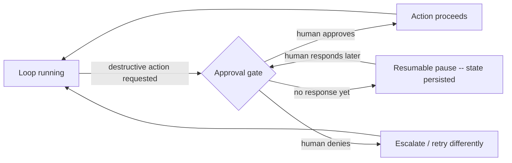

# Chapter 6: Loop Engineering

## Table of Contents

1. [Why This Chapter Exists](#1-why-this-chapter-exists)
2. [The Verifier Ladder: Cheapest and Most Trustworthy First](#2-the-verifier-ladder-cheapest-and-most-trustworthy-first)
3. [Defeating Victory-Declaration Bias](#3-defeating-victory-declaration-bias)
4. [Retry Policy: Changed Context, Never Identical](#4-retry-policy-changed-context-never-identical)
5. [Stop Rules: More Than Just `stop_reason`](#5-stop-rules-more-than-just-stop_reason)
6. [Progress Signals: Telling Slow From Stuck](#6-progress-signals-telling-slow-from-stuck)
7. [Self-Healing Loops](#7-self-healing-loops)
8. [One-Shotting Overreach and Step Sizing](#8-one-shotting-overreach-and-step-sizing)
9. [Triggers and Autonomy](#9-triggers-and-autonomy)
10. [Human-in-the-Loop as a Loop Primitive](#10-human-in-the-loop-as-a-loop-primitive)
11. [Parallelism Inside the Loop: Best-of-N](#11-parallelism-inside-the-loop-best-of-n)
12. [Dry-Run: The Reliability Arithmetic That Explains Why Verification Beats Better Prompting](#12-dry-run-the-reliability-arithmetic-that-explains-why-verification-beats-better-prompting)
13. [What This Chapter Still Leaves Open](#13-what-this-chapter-still-leaves-open)
14. [Key Takeaways + Master Decision Table](#14-key-takeaways--master-decision-table)

---

# 1: Why This Chapter Exists

## Starting From Plain Language

Chapter 5 named **loop control** as one of ten harness components and moved
on without opening it up. Here's the plain-language version of what was
left inside that box: an agent loop, at its core, is just four repeating
steps — **something triggers it, it acts, something verifies the result,
and something decides whether to stop.** Chapter 2 built the "act" part in
full detail. This chapter builds the other three, which turn out to matter
more than "act" ever did, because a model that acts well but never gets
checked, and never really knows when to stop, is not yet trustworthy no
matter how good its individual actions are.

```
        ┌──────────┐      ┌──────────┐      ┌──────────┐      ┌──────────┐
        │  TRIGGER  │ ──▶ │   ACT    │ ──▶ │  VERIFY  │ ──▶ │   STOP?   │
        │ (Sec. 9)  │      │ (Ch. 2)  │      │ (Sec. 2) │      │ (Sec. 5)  │
        └──────────┘      └──────────┘      └────┬─────┘      └────┬─────┘
                                 ▲                 │ verify fails    │ no
                                 └─────────────────┴─────────────────┘
                                     retry with changed context (Sec. 4)
```

## Why "Verify" Is the Chapter's Real Subject

Every other section here — retry policy, stop rules, progress signals,
self-healing, step sizing, parallelism — is, underneath, a variation on one
question: **how do you know a step actually worked, and what do you do once
you know?** Chapter 1 already named "victory declaration bias" as one of
three core agent failure modes; this chapter is where that problem finally
gets a real fix instead of just a name. The chapter's own goal statement is
worth keeping in view throughout: build a control system where a **verifier**
checks the agent's work and the loop repeats until a real goal is met or a
real stop rule fires — **with a human outside the loop, not trusting the
agent's own word for it.**

*Everything mechanical below — hooks, verifier wiring, retry logic — slots
directly into Chapter 5's `Harness` class: verification is a `post_tool_use`
or `stop`-adjacent hook, retry policy lives in the loop-control component,
and stop rules are a condition checked every iteration. Nothing here
requires a new architecture; it requires taking loop control seriously as
its own subject, the way Chapter 3 did for tools and Chapter 4 did for
context.*

## Key Takeaways for Section 1

An agent loop is trigger → act → verify → stop, repeating; Chapter 2 built
"act," and this chapter builds the other three. The unifying question behind
every section here is "how do you know a step worked, and what happens
next" — verification is the real subject, not a side concern.

*Next: verification isn't one technique — it's a ladder, and which rung you
reach for changes everything about how much you can trust the result.*

---

# 2: The Verifier Ladder: Cheapest and Most Trustworthy First

## Starting From Plain Language

Imagine checking a piece of writing for mistakes. A spell-checker catches
some things instantly and for free. A careful human editor catches more,
but costs time and money. Asking a second writer "does this seem good to
you?" catches yet another category of problem, but their opinion is worth
less than the spell-checker's certainty about a genuine typo. Verifying an
agent's work has the exact same shape: several tools exist, they cost wildly
different amounts, and — this is the part worth internalizing — **cheaper
does not mean less trustworthy.** A compiler's "this code has a syntax
error" is more trustworthy than an LLM's "this code looks fine," even
though the compiler cost a fraction of a cent and the LLM call cost real
money.

## The Ladder, Rung by Rung

Ordered from cheapest-and-most-certain to most-expensive-and-least-certain:

```
  MOST TRUSTWORTHY, CHEAPEST                    LEAST TRUSTWORTHY, MOST EXPENSIVE
  ──────────────────────────────────────────────────────────────────────────▶

  ┌───────────┐  ┌───────────┐  ┌───────────┐  ┌───────────┐  ┌───────────┐
  │ Exit codes │─▶│   Type    │─▶│   Tests    │─▶│   Diff    │─▶│  LLM-as-  │─▶ Human
  │  / asserts │  │ checkers  │  │            │  │  review   │  │  judge    │
  └───────────┘  └───────────┘  └───────────┘  └───────────┘  └───────────┘
   "did it even    "is this      "does behavior  "does this    "does this
    run?"           the right     match spec?"    change look   read as
                    shape?"                       reasonable?"  correct?"
```

Two named research framings converge on almost this exact ladder
independently. A 2026 survey covering roughly 1,250 papers on AI
self-improvement organizes verification by trustworthiness into **formal
verifiers** (proof checkers, type systems), **execution feedback** (tests,
compilers, benchmarks), and **learned judges** (reward models, LLM-as-judge)
— the same low-to-high-trust ordering, just grouped into three bands instead
of five rungs. A separate five-level formulation used in harness-engineering
training material draws the line explicitly: deterministic
assertions/exit-codes and rule/schema linters form what it calls the
**"autonomous zone"** — checks that can run completely unattended — while
field-truth tests, LLM-as-judge scoring, and human checkpoints sit on the
other side of a boundary between **objective verification and assisted
judgment.**

## The One Rule That Matters More Than the Ladder Itself

**Never let a model self-certify what a compiler, a type checker, or a test
suite can certify instead.** This is stated as its own principle because
it's the single most common way teams under-use verification: reaching for
an LLM-as-judge call to check "does this code compile" when `tsc` or `mypy`
would answer the same question, deterministically, for a thousandth of the
cost, with zero chance of being talked into a wrong answer. Deterministic
checks — schema validation, tool-call format checks, output length bounds,
JSON parsing — catch the most common classes of failure at essentially zero
cost; reserve the expensive rungs for the things only they can actually
answer (does this satisfy an ambiguous, subjective spec; would a human find
this acceptable).

## Key Takeaways for Section 2

Verification is a ladder, not a single technique, ordered from cheap and
certain (exit codes, type checkers) to expensive and probabilistic
(LLM-as-judge, human review). The rule that matters most: always reach for
the cheapest rung that can actually answer the question, and never spend an
LLM-as-judge call re-answering something a compiler already answered for
free.

*Next: the specific failure this whole ladder exists to prevent — an agent
telling you it succeeded when it didn't.*

---

# 3: Defeating Victory-Declaration Bias

## Starting From Plain Language

Ask someone to grade their own exam and, on average, they'll be generous
with themselves — not out of dishonesty, but because they already believe
their answer was right, and re-checking your own belief with the same
reasoning that produced it rarely surfaces the mistake. Language models
have a well-documented, measured version of the same problem: research on
model calibration going back to 2017 established that modern neural
networks are **systematically overconfident** — the confidence a model
reports regularly exceeds its actual accuracy. An agent asked "did that
work?" right after doing the work is being asked to grade its own exam,
using the same reasoning that just produced the (possibly wrong) answer.

## Why This Gets Worse, Not Better, Under Agentic Tasks

A specific, sharper failure mode than plain overconfidence shows up in
agent settings: **local vs. global evaluation**. An agent judges its own
work based on what it can see up close — the code looks syntactically
correct, the function it just wrote appears logically sound — while genuine
correctness requires checking things the agent has no natural reason to
re-examine: did an earlier step's assumption still hold, did a downstream
component's interface actually match, did a database migration finish
before the code that depends on it ran. One tracked real-world example: a
password-reset feature passed its unit tests and looked complete, while
three things silently remained broken — the end-to-end flow was never
actually executed, a database migration had failed mid-run leaving
inconsistent state, and the email service's configuration was missing in
the target environment. Every individual piece "looked done." Nothing had
actually been proven to work end-to-end.

This isn't a rare edge case. Recent work examining agent trajectories at
scale (thousands of runs, across multiple benchmarks) characterizes this as
a systematic, measurable phenomenon it labels **"false success"**: agents
declare task completion while the environment's actual state contradicts
them, having learned to *produce the linguistic markers of completion*
without reliably *verifying against ground truth first*. A separate,
smaller study (58 traces) reported a related "outcome fallacy": a striking
majority of traces graded as successful were later found to contain hidden
procedural or safety violations the outcome-only grading missed entirely —
worth treating as a strong directional warning rather than a universal
percentage, given the small sample, but the direction itself shows up
consistently across this whole line of research.

## The Fix: Separate the Worker From the Checker

The concrete mitigation named across this research is consistent and
simple to state: **don't let the agent that did the work be the same agent
that decides whether the work is done.** A worker/checker split — the
checker specifically calibrated to be skeptical rather than agreeable —
outperforms self-assessment because it removes the exact bias described
above: a checker that never produced the original answer has no prior
belief in it to defend.

One illustrative, worked comparison (from a harness-engineering course
covering a small 2D game-editor task, not a controlled industry benchmark
— worth citing for the shape of the result, not as a universal number):
a single agent, asked to build and grade its own success, finished in 20
minutes for about $9 — and produced a nonfunctional game. A three-role
harness (a planner, a generator, and a genuinely separate evaluator role)
took roughly 6 hours and $200 on the identical underlying task — and
produced a fully playable result. The gap is the entire chapter's argument
in one comparison: the *model* didn't change between the two runs. The
*harness*, specifically whether verification was separated from
generation, did.

## Machine-Checkable Definitions of Done

The other half of the fix is making "done" something a machine can check at
all, rather than a judgment call the agent narrates in prose. A concrete
pattern: state the definition of done as a sequence of *gates*, each one
blocking progression to the next until it passes —

```
Feature complete  =  unit tests pass  ─▶  integration tests pass  ─▶  end-to-end flow passes
                      (gate 1)              (gate 2)                   (gate 3)

  Failing gate 2 means the agent NEVER reaches "check gate 3" or
  "declare done" — the gate structure makes skipping ahead impossible,
  the same "structurally impossible to repeat" idea from Chapter 5.
```

"Feature complete" is redefined, in writing, as "gate 3 passed" — not "code
is written," not "tests exist," not "I believe this works." This is
Chapter 5, Section 4's determinism boundary applied specifically to the
question of what counts as finished.

## Key Takeaways for Section 3

Victory-declaration bias is a real, measured phenomenon — models are
systematically overconfident, and agents specifically tend toward "local"
evaluation (does this piece look right) over "global" evaluation (did the
whole system actually work), producing "false success" at a rate multiple
independent studies characterize as systematic rather than occasional. The
fix is structural, not motivational: separate the worker role from the
checker role, and write "done" as a sequence of machine-checkable gates
rather than a claim the agent gets to make about itself.

*Next: once a verifier catches a failure, what should the loop actually do
next?*

---

# 4: Retry Policy: Changed Context, Never Identical

## Starting From Plain Language

If a locked door doesn't open, trying the exact same key the exact same way
a second time isn't going to work any better the second time — you need
either a different key, more force, or to accept it's the wrong door.
Retrying an agent step works the same way: **retrying with the identical
context that just failed is close to useless**, because nothing about the
situation changed, and the same reasoning that produced the failure is
likely to produce it again.

## Error-Informed Retry

The fix follows directly from Chapter 3, Section 5's error-message
principle, applied at the loop level instead of the tool level: a retry
should carry the **verifier's specific failure information** forward into
the next attempt, not just re-ask the same question. "That failed, try
again" gives the model nothing new to work with. "That failed: `test_login`
expects a 401 on bad credentials, got a 500 — check the exception handler
around the password comparison" gives the retry attempt an actual chance of
succeeding, because the context genuinely changed between attempts.

## Escalation After N Failures

A retry policy needs an exit, not just an entry: after some fixed number of
failed attempts on the same step (a small number — 2 or 3 is typical),
stop retrying automatically and escalate instead — to a fresh-context
restart (below), to a different strategy entirely, or to Section 10's
human-in-the-loop gate. Retrying indefinitely on a step that keeps failing
is Section 5's oscillation problem in miniature, and it burns real budget
(Section 5's tracked incident — an oscillation loop that ran for three
weeks and produced a $2,400 bill, triple the intended budget, before anyone
noticed — is exactly what an escalation ceiling exists to prevent).

## When to Restart With a Fresh Context Instead of Retrying Dirty

Sometimes the right move isn't a smarter retry — it's throwing the attempt
away entirely. If a step has failed twice and the transcript leading up to
it is now cluttered with two failed attempts' worth of dead-end reasoning
(Chapter 4's context-rot argument, applied to a single step instead of a
whole run), a **fresh-context restart** — re-attempting the step from a
clean slate, carrying forward only the verifier's error message and the
original task, not the failed attempts' full reasoning trace — often
outperforms a third retry inside the same increasingly cluttered context.

```
                    ┌──────────────┐
                    │  Step fails   │
                    └──────┬────────┘
                           ▼
                 ┌─────────────────────┐
                 │ Attempt < N failures? │── no ──▶ ESCALATE (Sec. 10 / abort)
                 └──────┬──────────────┘
                        │ yes
                        ▼
              ┌───────────────────────┐
              │ Is context still clean │── no ──▶ FRESH-CONTEXT RESTART
              │  enough to reuse?      │            (error msg + original task only)
              └──────┬─────────────────┘
                     │ yes
                     ▼
         RETRY WITH VERIFIER'S ERROR APPENDED
```

## Key Takeaways for Section 4

A retry must carry the verifier's specific failure information forward —
retrying with identical context wastes an attempt on the same reasoning
that just failed. Cap retries at a small number and escalate past that
ceiling rather than looping indefinitely (a real, expensive incident: a
three-week, $2,400 oscillation loop that a ceiling would have stopped in
minutes), and prefer a fresh-context restart over a third retry once the
transcript itself has become part of the problem.

*Next: retry policy handles one failed step — stop rules decide when the
whole loop is actually finished, for reasons well beyond "the model said
so."*

---

# 5: Stop Rules: More Than Just `stop_reason`

## Starting From Plain Language

Chapter 2's loop already checks one stop condition: `stop_reason ==
"end_turn"`. Section 3 just spent an entire argument establishing why
trusting the model's own claim of completion is not enough on its own. Stop
rules are the concrete list of *other* conditions, checked independently of
what the model believes, any one of which should end the loop.

## The Five Stop Conditions

**Success** — Section 3's machine-checkable gates actually passed, not the
model saying so. **Budget** — a hard ceiling on tokens, dollars, or
wall-clock time, checked the same way Chapter 2's `MAX_TOKEN_BUDGET` guard
worked, extended to cover money and time as well as tokens. **No-progress
detection** — Section 6 defines this properly; the short version is
"nothing meaningfully changed across the last several steps." **Oscillation
detection** — the specific case of no-progress where the *same action*
repeats: fingerprint each step's (tool call + result), and stop once a
fingerprint repeats some small number of times (3 is a commonly cited
threshold) — this is exactly the mechanism that would have caught the
three-week, $2,400 loop from Section 4 within minutes instead of weeks.
**Confidence floors** — for any rung of Section 2's verifier ladder that
produces a score rather than a pass/fail (an LLM-as-judge rung, especially),
a minimum threshold below which the loop stops and escalates rather than
continuing to iterate on a low-confidence result.

```
                         ┌─────────────────────────┐
                         │   after each iteration    │
                         └────────────┬──────────────┘
                                      ▼
        ┌──────────┐   ┌──────────┐   ┌──────────────┐   ┌──────────────┐   ┌───────────┐
        │ SUCCESS?  │──▶│ BUDGET   │──▶│ NO PROGRESS?  │──▶│ OSCILLATING? │──▶│ CONFIDENCE │
        │(Sec. 3    │   │EXCEEDED? │   │ (Sec. 6)      │   │ (same        │   │  FLOOR MET? │
        │ gates)    │   │          │   │               │   │ fingerprint  │   │             │
        └────┬──────┘   └────┬─────┘   └──────┬────────┘   │ repeats 3x)  │   └──────┬──────┘
             │yes            │yes             │yes         └──────┬───────┘          │no
             ▼               ▼                ▼                   │yes               ▼
           STOP            STOP             STOP                  ▼               STOP
          (done)        (escalate)        (escalate)             STOP          (escalate)
                                                                (escalate)
                                      any "no" at every gate ──▶ CONTINUE THE LOOP
```

## The Gotcha Worth Naming Here Directly

A stop-rule set that only checks **success** isn't a stop-rule set — it's
one condition wearing five hats' worth of responsibility. The whole reason
this section lists five independent conditions is that a loop with only a
success check runs forever on any task it can't actually complete, burning
budget the entire time, which is precisely the failure mode budget, no-
progress, and oscillation detection each independently exist to catch.

## Key Takeaways for Section 5

Five independent stop conditions — success (machine-checked, not claimed),
budget, no-progress, oscillation, and confidence floors — should each be
capable of ending a loop on their own. A stop-rule design that checks only
success has, in practice, no real stop rule for the failure case at all,
which is exactly how real, expensive oscillation incidents happen.

*Next: "no progress" needs a real, measurable definition — not a feeling.*

---

# 6: Progress Signals: Telling Slow From Stuck

## Starting From Plain Language

A student who's slowly working through a hard problem and a student who's
stuck rereading the same paragraph for the tenth time can look identical
from across the room — both are quiet and staring at the page. The only way
to actually tell them apart is to check whether anything is *changing*: has
the student written anything new, crossed anything out, moved to a new
line. Section 5's no-progress stop rule needs exactly this kind of concrete,
checkable signal — not a vague sense that things feel slow.

## Concrete Progress Metrics

**Diff size** — is the code actually changing between iterations, or is the
agent repeatedly producing near-identical output? A near-zero diff across
several consecutive steps is a strong no-progress signal, independent of
whether the model's narration sounds active and engaged. **Tests passing**
— a monotonically non-decreasing count (3 passing → 5 passing → 5 passing →
7 passing) is genuine forward motion even when the raw diff looks large and
messy at each step; a flat or oscillating count across several steps
despite continued edits is the no-progress signal. **Checklist items
closed** — Chapter 7's planning artifacts give an agent a written-down list
of subtasks; counting how many are checked off, step over step, is a
progress signal that doesn't require inspecting code at all, useful
specifically for tasks where diff size is a poor proxy (research,
documentation, multi-file refactors where a large diff is normal at every
step regardless of real progress).

## Why Multiple Signals, Not One

Any single metric can be gamed or coincidentally flat for legitimate
reasons — a step that reads five files and plans carefully before writing
anything can show zero diff and zero new passing tests while still making
real progress. This is why Section 5's no-progress stop rule should combine
signals (e.g., "no diff change AND no test-count change AND no checklist
change, sustained for 3+ steps") rather than triggering on any one metric's
momentary flatness.

## Key Takeaways for Section 6

"No progress" needs a real, measured definition — diff size, passing-test
count, or checklist items closed, combined rather than used alone, since
any single metric has legitimate reasons to be momentarily flat. This
concrete signal is what Section 5's no-progress stop rule actually checks
against, not a subjective impression of whether the loop "feels" stuck.

*Next: what happens when an agent doesn't just get verified — it reads its
own failure and tries to fix it.*

---

# 7: Self-Healing Loops

## Starting From Plain Language

This section names something you've technically already seen: Section 4's
error-informed retry, generalized. A **self-healing loop** is one where the
agent reads its own verifier's failure output, diagnoses what went wrong,
and adjusts its own next attempt — without a human writing the fix or even
articulating what should change next.

## What Makes This Actually Work

Self-healing works when the failure signal is specific and actionable —
Chapter 3, Section 5's whole argument about error messages, now applied to
verifier output specifically: a stack trace with a line number and an
exception type gives the model something concrete to reason about; "tests
failed" gives it almost nothing. This is why Section 2's verifier ladder
matters here directly — a self-healing loop built on top of a rich rung
(a full test failure with assertion diffs) genuinely repairs itself; one
built on top of a thin rung (a bare pass/fail exit code, no detail) mostly
just retries blindly and calls it self-healing.

## How This Degenerates

The failure mode is exactly Section 5's oscillation case, arrived at
through a specific mechanism worth naming: the agent "fixes" the reported
symptom in a way that satisfies the specific verifier check without
addressing the underlying cause, the verifier passes, a *different* check
fails next, gets "fixed" the same superficial way, and the loop
oscillates between two or three symptom-level patches indefinitely. This is
precisely why Section 5's oscillation detector (same action fingerprint
repeating) is not a nice-to-have alongside self-healing — it's the
mechanism that actually catches self-healing's most characteristic failure
mode, since a self-healing loop that's gone wrong tends to look exactly like
oscillation from the outside.

## Key Takeaways for Section 7

Self-healing is error-informed retry generalized into a full read-diagnose-
adjust cycle, and it only works as well as the verifier feedback it's built
on — rich, specific failure detail produces real repairs; thin pass/fail
signals produce blind retries wearing a self-healing label. Its
characteristic failure mode is symptom-chasing oscillation, which is why
Section 5's oscillation detector is load-bearing infrastructure for this
pattern, not an optional extra.

*Next: a failure mode that has nothing to do with verification quality at
all — simply attempting too much in one uninterrupted step.*

---

# 8: One-Shotting Overreach and Step Sizing

## Starting From Plain Language

Trying to cook an entire five-course meal in one uninterrupted attempt,
tasting nothing until the very end, is a worse plan than tasting and
adjusting after each course — even if you're a genuinely skilled cook. The
problem isn't skill; it's that thirty things can go quietly wrong across a
long unverified stretch, and by the time you taste anything, you have no
way to tell which of the thirty things to blame. **One-shotting** is this
exact mistake applied to an agent: attempting a large, multi-step change in
one continuous unverified pass.

## Why a Large Unverified Change Always Fails Eventually

A 40-file change attempted with zero intermediate verification fails for
the same reason Chapter 5, Section 11's multi-component harness versions
produced unattributable deltas: once something breaks, there is no way to
localize *which* of the 40 files' worth of changes caused it, because
nothing was checked in between. This connects directly to this chapter's
own Section 12 math: every unverified step in a chain multiplies the
chance of an undetected failure into the next step, and a 40-file change
with no intermediate checks is, mechanically, a very long unverified chain.

## The Fix: Small Verified Increments

Force small, independently verifiable steps, each checked against Section
2's ladder before the next one starts — and pair this with a
**commit-per-step** discipline: each verified increment becomes its own
commit, so that if step 12 of 20 turns out to be wrong, the previous 11
verified, committed steps are never in doubt and never need to be
re-examined. This is the direct, practical payoff of small steps: not just
"catch problems earlier" in the abstract, but "know exactly which specific
change to revert" when a problem is caught.

```
ONE-SHOT (bad):     [────────────── 40 files changed, unverified ──────────────] ──▶ verify ──▶ FAILS
                                                                                                (which of 40 changes broke it?)

STEP-SIZED (good):  [file 1] ─▶verify─▶commit ─▶ [file 2] ─▶verify─▶commit ─▶ ... ─▶ [file 40] ─▶verify─▶commit
                                                                                    (any failure localizes to ONE step)
```

## Key Takeaways for Section 8

One-shotting a large change means nothing gets checked until everything is
already done, at which point a failure can't be localized to any specific
part of the attempt. Small, independently verified, committed increments
fix this directly — not by preventing mistakes, but by guaranteeing every
mistake is immediately localizable to exactly one step.

*Next: everything so far assumed a human kicks off each run — what happens
when the loop starts itself?*

---

# 9: Triggers and Autonomy

## Starting From Plain Language

Every agent run needs something that starts it. So far in this folder,
that's implicitly been "a person typed a prompt." This section is about
the other ways a run can begin — and about the fact that *how* a loop gets
triggered is itself a real design decision, not an afterthought.

## The Trigger Types

**Cron** — runs on a fixed schedule, no external event needed (a nightly
dependency-update check). **Webhook** — an external system calls in
directly (a CI failure notification kicks off a debugging run). **File-watch**
— a change to a specific file or directory starts a run (a spec document
changes, triggering a re-plan). **Queue-driven** — work items accumulate in
a queue and a loop pulls from it continuously. **Issue-tracker-driven** — a
new or labeled ticket becomes a task the agent picks up on its own. The
common thread across all five: **the loop finds its own work**, rather than
waiting for a human to hand it a prompt each time.

## Why This Connects Directly to Chapter 1's Autonomy Ladder

Chapter 1 introduced an autonomy ladder without a mechanism for actually
climbing it. Triggers are that mechanism: a human-prompted loop sits at the
bottom rung by construction (a human is present at the very start of every
run, by definition), while a cron- or queue-driven loop has climbed at
least one rung — it started, acted, and potentially finished an entire run
with no human present at any point until someone reviews the result
afterward. Every other section in this chapter (verification, stop rules,
retry policy) matters *more*, not less, as a loop moves up this ladder,
because there is no human present in the moment to catch what those
mechanisms miss.

## Key Takeaways for Section 9

Cron, webhook, file-watch, queue, and issue-tracker triggers all share one
property: the loop finds its own work instead of waiting for a prompt.
This is the literal mechanism behind climbing Chapter 1's autonomy ladder,
and it raises the stakes on everything else in this chapter, since no human
is present in the moment to catch what verification and stop rules miss.

*Next: even a highly autonomous, self-triggering loop still needs a
deliberate place for a human to step back in.*

---

# 10: Human-in-the-Loop as a Loop Primitive

## Starting From Plain Language

"Human-in-the-loop" can sound like an admission that the automation isn't
finished yet. Reframed correctly, it's a first-class piece of the loop's
own design, with the same status as a stop rule or a retry policy — a
specific point where the loop pauses, hands control to a person, and
resumes once they respond.

## The Three Primitives

**Interrupts** — a way to pause a running loop from outside, at any point,
without losing state (Chapter 5's persistence component, applied here
specifically). **Approval gates** — Chapter 3, Section 7's `destructive`
flag, fully wired: a specific action the loop refuses to take until a human
explicitly approves it, blocking exactly there and nowhere else. **Resumable
pauses** — the loop can sit paused indefinitely (waiting for approval,
waiting for external input) and resume from exactly where it left off, not
from scratch — a direct application of Chapter 5, Section 6's filesystem-as-
state pattern to a human-shaped delay instead of a crash.



## Designing an Approval That's Cheap to Grant

An approval gate that dumps a wall of raw logs on a human and asks "is this
okay?" is expensive to grant — the human has to reconstruct context the
loop already had, every single time. A cheap-to-grant approval states,
concretely and specifically: what action is about to happen, why (one
sentence, not the full transcript), and what the reversible/irreversible
consequences are — the same discipline as Chapter 3, Section 5's tool
error messages, aimed at a human reader instead of a model. The design
target is a yes/no decision a human can make in seconds, not a
investigation they have to conduct first.

## Key Takeaways for Section 10

Human-in-the-loop is a designed primitive, not a fallback: interrupts,
approval gates, and resumable pauses are specific, first-class stop-and-
resume points, exactly as deliberate as any other stop rule in this
chapter. An approval gate is only as good as how cheap it is for a human to
actually grant — a wall of raw context is not a good gate design.

*Next: verification and retry handle one attempt at a time — what happens
when you run several attempts at once and let the verifier pick?*

---

# 11: Parallelism Inside the Loop: Best-of-N

## Starting From Plain Language

If one attempt at a hard problem has a real chance of failing, running
several independent attempts and keeping the best one is a straightforward
way to raise the odds — as long as you have a genuine way to tell which
attempt was actually best. That "genuine way to tell" clause is doing all
the work, and it's exactly Section 2's verifier ladder, reused: **best-of-N
without a real verifier is just picking a random attempt and calling it the
best one.**

## The Math

For $n$ independent attempts, each with an individual success probability
$p$, the probability that *at least one* attempt succeeds is:

$$P(\text{at least one success}) = 1 - (1-p)^n$$

Here $(1-p)$ is a single attempt's failure probability, $(1-p)^n$ is the
probability that *every* one of the $n$ independent attempts fails, and
subtracting from 1 gives the probability that at least one didn't. This
is a **strict improvement** for any $n > 1$ whenever $p > 0$ — running more
independent attempts never hurts your odds, though it does cost
proportionally more.

## The Dry-Run

Take a single genuinely hard step — say, a tricky refactor with only a
$p = 0.6$ chance of a correct attempt on any given try:

```
n=1: 1 - (1-0.6)^1 = 1 - 0.400 = 0.6000  (60.0% -- a single attempt)
n=2: 1 - (1-0.6)^2 = 1 - 0.160 = 0.8400  (84.0%)
n=3: 1 - (1-0.6)^3 = 1 - 0.064 = 0.9360  (93.6%)
n=5: 1 - (1-0.6)^5 = 1 - 0.010 = 0.9898  (99.0%)
```

Three independent attempts turn a 60%-reliable step into a 93.6%-reliable
one — **provided** a real verifier (Section 2) actually identifies which of
the three attempts succeeded; without one, you have three attempts and no
way to know which, if any, to trust, and the math above simply doesn't
apply.

## Where This Actually Belongs

Best-of-N is expensive — $n$ full attempts cost roughly $n\times$ a single
attempt's tokens — so it earns its keep specifically on steps that are
*individually* hard and *individually* well-verified, not applied
uniformly across an entire loop. A step already sitting at $p=0.95$ (Section
12's baseline) gains far less from best-of-3 (0.95 → 0.9999 — a negligible
absolute gain, per the formula above) than a step at $p=0.6$ does (0.6 →
0.936, a large absolute gain) — spend the extra attempts where the
per-step odds are actually bad, not everywhere uniformly.

## Key Takeaways for Section 11

Best-of-N fans out $n$ independent attempts and keeps the one a real
verifier scores highest; the math ($1-(1-p)^n$) shows the gain is real but
only as good as the verifier picking the winner, and the absolute
improvement is largest precisely on the steps that are individually
unreliable to begin with — not a technique to apply uniformly everywhere.

*Next: the full arithmetic behind this chapter's central claim — verification
beats better prompting, provable with one calculation.*

---

# 12: Dry-Run: The Reliability Arithmetic That Explains Why Verification Beats Better Prompting

## The Setup

Take a 20-step agent task where each step, independently, has a $p = 0.95$
chance of succeeding — a genuinely good per-step success rate, the kind a
well-prompted, capable model plausibly achieves on a well-scoped step.

## Baseline: No Verification, No Retry

With no verification at all, the whole task succeeds only if *every one* of
the 20 steps succeeds:

$$P(\text{success}) = p^{20} = 0.95^{20}$$

```
0.95^20 = 0.3585
```

**A 95%-reliable-per-step agent succeeds on the whole 20-step task only
35.85% of the time**, with no visibility into which step failed when it
doesn't. This is the concrete arithmetic behind why a capable, well-prompted
model can still feel unreliable on multi-step work — no single step is the
problem; the *chain* is.

## Adding a Verifier That Catches a Fraction $c$ of Failures, With One Retry

Now add a verifier (Section 2) that, whenever a step actually fails, catches
that failure with probability $c$ (its detection rate) and allows exactly
one retry, itself succeeding with the same per-attempt probability $p$. A
step now has three possible paths: succeed outright ($p$); fail, get
caught, and succeed on retry ($qc \cdot p$, where $q = 1-p$); or fail
without being caught, or fail again on retry — in both remaining cases the
step counts as failed. The step's *effective* success probability becomes:

$$p_{\text{eff}}(c) = p + q \cdot c \cdot p = p(1 + qc)$$

```
p = 0.95, q = 0.05

c = 0.50:  p_eff = 0.95 + (0.05)(0.50)(0.95) = 0.97375
c = 0.80:  p_eff = 0.95 + (0.05)(0.80)(0.95) = 0.98800
c = 0.95:  p_eff = 0.95 + (0.05)(0.95)(0.95) = 0.99513
```

Raising each to the 20th power gives the whole task's success probability:

```
c = 0.50:  0.97375^20 = 0.5874   (58.7%,  +22.9 points over the 35.85% baseline)
c = 0.80:  0.98800^20 = 0.7855   (78.6%,  +42.7 points)
c = 0.95:  0.99513^20 = 0.9069   (90.7%,  +54.8 points)
```

## The Counterintuitive Result — Read This Twice

A verifier that only catches **half** of all failures ($c=0.5$) — a
genuinely mediocre verifier, wrong or blind as often as it's right — still
raises whole-task success from 35.85% to 58.7%: nearly 23 percentage
points, from *one* retry chance on *half* the failures. A strong verifier
($c=0.95$) pushes the same task to 90.7% — turning a chain that fails on the
whole task **roughly two-thirds of the time** into one that fails only
**about one time in ten**, without the per-step model getting any better at
all. **This is the entire argument for why verification beats better
prompting**: improving $p$ itself (a better-prompted, more capable model)
helps, but improving $c$ (catching more of the failures that still happen,
however rarely) compounds across every one of the 20 steps multiplicatively,
the same way Chapter 1's caching math and Chapter 4's compaction math both
turned out to hinge on what happens when one effect applies *repeatedly*
across a chain rather than once.

## Key Takeaways for Section 12

At $p=0.95$ per step, an unverified 20-step chain succeeds only 35.85% of
the time end-to-end — the chain, not any single step, is the problem. Even
a mediocre verifier ($c=0.5$, one retry) raises this to 58.7%; a strong one
($c=0.95$) reaches 90.7%. Because this effect compounds across every step,
investing in verification quality has a larger, more reliable payoff than
investing the same effort in making the underlying model marginally better
at each individual step.

*Next: the mistakes this chapter's ideas produce when applied carelessly.*

---

# 13: What This Chapter Still Leaves Open

## Real Gotchas, Named Precisely

**LLM-as-judge where a test exists.** Section 2's core rule, restated as a
gotcha because it's the most common way teams under-use verification they
already have: reaching for a subjective, expensive judge call to answer a
question a deterministic check already answers for free.

**Retrying the identical prompt.** Section 4's whole argument — a retry
with no new information is close to a coin flip on the same odds that just
failed, not a genuine second chance.

**Stop rules that only check success.** Section 5's gotcha — a "stop rule"
that only knows how to recognize success has no actual plan for the failure
case, which is precisely how unbounded, expensive oscillation happens.

**Verifiers slower than the work.** A rung of Section 2's ladder that takes
longer to run than the step it's checking inverts the loop's whole
economics — the agent spends more time waiting on its own verification than
doing useful work, and under budget pressure (Section 5) this pushes teams
toward skipping verification entirely, which is a worse outcome than a
slow verifier in the first place.

## What's Still Missing, By Design

| Missing capability | Symptom without it | Where it's built |
|---|---|---|
| **A real planning artifact for progress signals to check against** | Section 6 named checklist-based progress; nothing here builds the checklist itself | Chapter 7 |
| **Formal, repeatable eval suites for verifier quality itself** | Section 12's $c$ (detection rate) is treated as a given number; nothing here measures a real verifier's actual $c$ | Chapter 14 |
| **Durable state across a genuine crash, not just a human-approval pause** | Section 10's resumable pauses assume the process is still alive, just waiting | Chapter 12 |
| **A real permission layer backing Section 10's approval gates** | The gate is a concept here, not an enforced boundary | Chapter 16 |
| **Multi-agent coordination for parallel best-of-N at scale** | Section 11 covers the math for one step; running many parallel full agents is Chapter 13's subject | Chapter 13 |

## Key Takeaways for Section 13

The four gotchas — misusing LLM-as-judge, retrying blindly, checking only
success, and verifiers slower than the work they check — are the concrete
failure modes of applying this chapter's ideas carelessly. What remains
unbuilt (planning artifacts, verifier-quality evals, crash-durable
persistence, a real permission layer, multi-agent parallelism) each has an
exact later chapter.

*Next: the whole chapter, compressed into one table.*

---

# 14: Key Takeaways + Master Decision Table

The single mental model for this chapter: **trigger → act → verify → stop**,
and every section here is either a way to verify more trustworthily
(Sections 2, 3, 12), a way to respond once you know the result (Sections 4,
5, 6, 7, 8, 11), or a way to decide when the loop starts and ends at all
(Sections 9, 10).

| I want to know... | Reach for | Key fact |
|---|---|---|
| Which verification method to use for a given check | Section 2 | Reach for the cheapest rung that can actually answer the question — never spend an LLM-as-judge call on what a compiler already answers for free |
| Why my agent claims success on broken work | Section 3 | Victory-declaration bias is real and measured — separate the worker role from the checker role, and define "done" as machine-checkable gates |
| What to do when a verifier catches a failure | Section 4 | Retry with the verifier's specific error appended, never identically; cap retries and escalate past a small ceiling |
| When my loop should actually stop | Section 5 | Five independent conditions: success (checked, not claimed), budget, no-progress, oscillation, confidence floor |
| How to tell "working slowly" from "stuck" | Section 6 | A combined, measured signal — diff size, passing-test count, checklist items closed — never a single metric alone |
| Why my "self-healing" loop keeps flapping | Section 7 | It's Section 5's oscillation failure mode wearing a different name — the fix is the same oscillation detector, plus richer verifier feedback |
| Why a big unverified change always eventually fails | Section 8 | Nothing was checked in between, so a failure can't be localized — small verified, committed increments fix this by construction |
| How a loop starts without a human typing a prompt | Section 9 | Cron, webhook, file-watch, queue, issue-tracker triggers — the mechanism behind climbing Chapter 1's autonomy ladder |
| How to design an approval a human will actually grant quickly | Section 10 | State the action, the one-sentence why, and the reversible/irreversible consequence — never a wall of raw context |
| When parallel attempts are actually worth the extra cost | Section 11 | The absolute gain from $1-(1-p)^n$ is largest exactly where per-step odds are already bad — not a uniform technique |
| Why verification beats better prompting, provably | Section 12 | A 95%-per-step, 20-step chain succeeds only 35.85% of the time unverified; a strong verifier ($c=0.95$, one retry) reaches 90.7% with the model completely unchanged |

**Connection forward:** Chapter 7 takes the "planning artifacts" component
Chapter 5 named and this chapter leaned on repeatedly (checklists for
progress signals, gates for definitions of done) and builds it properly:
how an agent decomposes an ambiguous task into a real, durable plan, keeps
that plan up to date as it works, and uses it as the shared source of truth
this entire chapter's verification and progress-tracking machinery checks
against.
