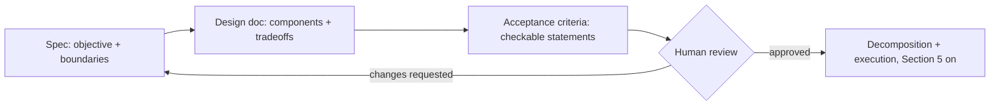

# Chapter 7: Planning, Decomposition & Artifacts

## Table of Contents

1. [Why This Chapter Exists: Planning as a Context Strategy](#1-why-this-chapter-exists-planning-as-a-context-strategy)
2. [Plan-Then-Execute vs Interleaved Planning](#2-plan-then-execute-vs-interleaved-planning)
3. [The Todo/Checklist Artifact](#3-the-todochecklist-artifact)
4. [Milestone Artifacts: Specs, Design Docs, Acceptance Criteria](#4-milestone-artifacts-specs-design-docs-acceptance-criteria)
5. [Decomposition Heuristics](#5-decomposition-heuristics)
6. [Re-Planning Triggers](#6-re-planning-triggers)
7. [Dependency Ordering: DAGs, Critical Path, Parallel Width](#7-dependency-ordering-dags-critical-path-parallel-width)
8. [Progressive Summarization: the Rolling PROGRESS.md](#8-progressive-summarization-the-rolling-progressmd)
9. [Spec-Driven Agent Development](#9-spec-driven-agent-development)
10. [Anti-Patterns](#10-anti-patterns)
11. [Dry-Run: A 12-Subtask Feature, Critical Path, and Parallel Width](#11-dry-run-a-12-subtask-feature-critical-path-and-parallel-width)
12. [Key Takeaways + Master Decision Table](#12-key-takeaways--master-decision-table)

---

# 1: Why This Chapter Exists: Planning as a Context Strategy

## Starting From Plain Language

Chapter 6 gave the agent a way to know whether one step worked. It said
nothing about what happens when the *goal itself* is bigger than one step —
bigger, in fact, than one context window. A three-hour feature build might
touch a database migration, a new API endpoint, a storage client, a resize
service, a frontend widget, and a test suite. No single conversation with a
model holds all of that cleanly for three hours; by hour two, Chapter 4's
compaction has already fired at least once, and everything not written down
somewhere durable is gone.

This is the sentence worth sitting with before anything else in this
chapter: **a plan is not a to-do list for the human's benefit — it is a
compression scheme that survives compaction.** The goal, the decomposition,
and the current status all get written to a file *outside* the context
window specifically so that when the window itself gets rewritten,
truncated, or wiped, the work in progress does not disappear with it. A
plan file is memory that does not depend on the conversation remembering
anything.

```
        WITHOUT A PLAN FILE                    WITH A PLAN FILE

  context window (grows, then compacts)   context window (grows, then compacts)
  ┌─────────────────────────────┐         ┌─────────────────────────────┐
  │ turn 1: "build the feature" │         │ turn 1: "build the feature" │
  │ turn 2: ...                 │         │ turn 2: write PLAN.md ──────┼──┐
  │ ...                         │         │ ...                          │  │
  │ turn 40: [COMPACTED]        │         │ turn 40: [COMPACTED]         │  │
  └─────────────────────────────┘         └─────────────────────────────┘  │
           │                                        │                       │
           ▼                                        ▼                       ▼
   "what was I building              "read PLAN.md" ──────────────►  PLAN.md (on disk)
    again? which parts               recovers the goal, the           survives the
    are done?" — GONE                decomposition, and progress      compaction event
```

This is not a new idea invented for agents — it is the oldest idea in
project management, applied to a system with a much smaller and much more
volatile memory than a human team has. What is new is the mechanism:
a plan file works for an agent specifically *because* files are cheap to
write, cheap to re-read, and — critically — untouched by whatever a context
manager decides to evict.

## Why This Sits After Chapter 6, Not Before It

Planning without verification is exactly the failure mode Chapter 1 named
*one-shotting overreach*: a plan that looks complete on paper but was never
checked against reality at any intermediate point. This chapter deliberately
comes after loop engineering so that every planning artifact built here has
somewhere to plug into a verifier — a checklist item is not "done" because
the agent says so; it's done because Chapter 6's ladder said so. Planning
gives the loop *scope*; verification gives the loop *honesty*. Neither one
is sufficient alone.

## Key Takeaways for Section 1

A plan file is a context-management technique, not a courtesy for human
readers: it externalizes the goal and the decomposition so that Chapter 4's
compaction can safely destroy the in-context conversation without destroying
the work. Planning only pays off once Chapter 6's verification exists to
check each piece against — a plan nobody verifies against is just a longer
way of one-shotting.

*Next: does the agent write the whole plan up front, or figure it out one
step at a time? Both approaches are legitimate, and reasoning models changed
the calculus between them.*

---

# 2: Plan-Then-Execute vs Interleaved Planning

## Starting From Plain Language

Picture two ways to cook a multi-course dinner. One cook writes the entire
menu and prep schedule on a card before touching a single ingredient, then
works straight down the card. Another cook starts chopping the onion for
course one, and only decides what course two needs once they taste how
course one turned out. Both produce dinner. The first is more predictable
and easier for someone else to review before any food is wasted; the second
adapts faster when the first course reveals something the cook didn't know
walking in (the onions were sweeter than expected, so course two's plan
should change too).

## The Two Patterns, Precisely

**Plan-then-execute** produces a full decomposition before any action is
taken: the agent (or a dedicated planning call) emits the entire task list
up front, and a separate executor works through it. This is the pattern
B03 covered as one member of its ReAct/Plan-and-Execute comparison — the
version worth carrying forward here is specifically the *artifact* half of
that pattern: the plan is written down, not just held in the planning
model's own generation.

**Interleaved planning** — closer to ReAct's think-act-observe cycle, one
step at a time — re-derives the next action from the *current* state after
every observation, without ever committing to a full task list in advance.

```
  PLAN-THEN-EXECUTE                        INTERLEAVED PLANNING

  ┌──────────────┐                         ┌──────┐  ┌──────┐  ┌──────┐
  │ Full plan     │                        │ act 1 │─▶│observe│─▶│ act 2 │─▶ ...
  │ written once  │                        └──────┘  └──────┘  └──────┘
  └──────┬───────┘                             ▲          re-derive next step
         ▼                                     │          from current state,
  ┌──────────────┐                             │          no committed list
  │ Executor works│                            │
  │ the list      │────────────────────────────┘
  └──────────────┘         (re-plan only on trigger, Section 6)
```

## What Changed With Reasoning Models

The comparison in B03 predates models with native extended thinking. A
model that reasons internally before its first visible action is already
doing a lightweight version of interleaved planning *inside a single turn*
— it doesn't need an explicit "now plan" step to sketch an approach before
acting, the way earlier chat-completion-style models often did. What
reasoning did **not** replace, and this is the point worth being precise
about (it echoes the closing item on B04's "what changed" list in the
README): a written plan file. Internal reasoning is invisible once the turn
ends and disappears from view the moment compaction runs; a file on disk
does neither. The honest 2026 framing is not "plan-then-execute vs
interleaved planning" as competing philosophies anymore — it's "how much of
the plan should live in a durable file regardless of how much internal
reasoning the model does per step." Every real system in this chapter
answers that question the same way: write it down, always, no matter how
good the model's turn-by-turn judgement is.

## When Each Shape Actually Fits

A full plan-then-execute artifact earns its cost when the task is long
enough to survive multiple compactions, when a human needs to review the
approach before any work happens (Section 4's milestone-artifact review
gate), or when subtasks can run in parallel and something needs to know the
whole shape to find that parallelism (Section 7). Interleaved planning fits
short tasks, exploratory work where the shape of the problem is genuinely
unknown until the first few actions reveal it, and situations where writing
a plan before exploring would just be guessing (Section 10's anti-pattern).
In practice, most real long-running agents run **both at once**: a
plan-then-execute artifact at the feature level, with interleaved,
model-driven reasoning inside each individual subtask.

## Key Takeaways for Section 2

Plan-then-execute commits to a full task list up front and hands it to an
executor; interleaved planning re-derives the next step from current state
every time, with no committed list. Reasoning models absorbed some of
interleaved planning's *within-turn* benefit, but did not remove the need
for a durable, on-disk plan artifact — that need comes from context
volatility (Section 1), not from the model's planning ability. Most
production agents combine both: a written plan at the feature level,
interleaved judgement inside each subtask.

*Next: the plan needs a concrete shape on disk — here's the first and
simplest one.*

---

# 3: The Todo/Checklist Artifact

## Starting From Plain Language

A grocery list works because of one property that has nothing to do with
groceries: every item on it is either checked or not, with no ambiguous
middle state to argue about. That binary clarity is exactly what a
long-running agent needs from its own task list — not prose describing
progress ("I've made good headway on the storage layer"), but discrete
items each in one of a small number of unambiguous states.

## The States, and Why More Than Two Exist

A minimal checklist item needs more than "done / not done." Real systems
converge on four states:

| State | Meaning | Who sets it |
|---|---|---|
| `pending` | Not started; dependencies may or may not be satisfied yet | The planner, at creation |
| `in_progress` / `active` | Currently being worked | The executor, when it picks the item up |
| `completed` / `done` | Finished **and verified** — not merely "the agent stopped touching it" | The executor, only after a Chapter 6 verifier passes |
| `blocked` | Cannot proceed — a dependency failed, or new information invalidated the approach | Either side, when Section 6's re-planning trigger fires |

```
                    ┌─────────┐
              ┌────▶│ pending │
              │      └────┬────┘
              │           │ picked up by executor
              │           ▼
              │      ┌─────────────┐
   dependency │      │ in_progress │
   re-satisfied      └──────┬──────┘
              │             │
              │      ┌──────┴───────┐
              │      ▼              ▼
              │ ┌─────────┐   ┌───────────┐
              └─│ blocked │   │ completed │  ◀── only after a real
                └─────────┘   └───────────┘      verifier passes (Ch 6)
```

*(`[DIAGRAM]` — the state machine above is the one artifact this section
requires; every checklist implementation in this chapter's notebook is a
direct realization of exactly these four states and these transitions.)*

The word **done** carries a specific trap here, worth naming plainly: it is
tempting to let "done" mean "the agent stopped generating tool calls for
this item," which is precisely Chapter 1's victory-declaration bias wearing
a checkbox. The fix is the same fix Chapter 6 already built: a checklist
item moves to `completed` only when something outside the model's own
narration — a test suite, a lint pass, a diff review — says so. A todo list
with no verifier attached to its `completed` transition is decoration, not
a control artifact.

## Why Writing It Down Measurably Helps, Not Just Aesthetically

The mechanism is the same one from Section 1, applied at finer grain: a
checklist externalizes "what's left" so the agent never has to hold that
information purely in the conversation. Concretely, this changes what a
compaction event costs. Without a checklist, a compacted context has to
either lose track of remaining subtasks entirely or spend tokens
re-deriving them from scratch by re-reading everything that happened so
far. With a checklist, recovery after compaction is one file read — the
`pending` and `in_progress` items are already sitting there, unaffected by
whatever got summarized away.

## The 2026 Split: Todo for the Turn, Task for the Map

Real production coding harnesses converged on splitting this artifact into
two tiers rather than one flat list, and it is worth being precise about
why, since the split answers a question this section would otherwise leave
open: what happens once a checklist itself gets too large to hold in one
place? The pattern — visible in Claude Code's own tool evolution — is a
**project-level structure** that tracks features, phases, and dependencies
as a genuine graph on disk, separate from a **lightweight, per-subtask
list** that tracks the step-by-step inside whichever single subtask is
currently active. The big structure persists on disk and rarely changes
shape; the small structure stays cheap, gets rewritten constantly, and
never needs to represent anything more complex than a short flat sequence.
This chapter's `PLAN.md` (Section 5 onward) is the project-level tier;
Section 7's DAG is what that tier looks like once dependencies matter, not
a competing artifact.

*A concrete, dated fact worth keeping in mind if you go looking at how
Claude Code itself implements this: as of Claude Code v2.1.142, the
original flat `TodoWrite` tool became a legacy compatibility path, disabled
by default, superseded by a small family of task-lifecycle tools
(`TaskCreate` / `TaskUpdate` / `TaskGet` / `TaskList`) whose items move
through exactly `pending → in_progress → completed`, plus a `deleted`
state for items no longer needed. The state machine above is deliberately
the same shape — this section is teaching the concept a real, current tool
already committed to, not a simplified toy version of it.*

## Key Takeaways for Section 3

A checklist item needs at least four states — `pending`, `in_progress`,
`completed`, `blocked` — not a binary done/not-done, and `completed` must be
gated by a real verifier (Chapter 6), never by the model's own claim.
Writing the list down is what makes compaction recovery cheap: a file read
instead of a re-derivation. Production systems split this into a durable,
project-level structure and a cheap, per-subtask list, rather than one flat
file trying to serve both jobs.

*Next: a checklist tells you what's left to do — it doesn't tell you what
"done" for the whole feature actually means. That's a different artifact.*

---

# 4: Milestone Artifacts: Specs, Design Docs, Acceptance Criteria

## Starting From Plain Language

A checklist item that reads "wire the frontend to the API" is checkable
against a verifier the moment someone has already decided what "wired
correctly" means. Something has to decide that *before* the checklist is
useful, and that something is a different kind of artifact than a
checklist — not a list of actions, but a description of a target state, and
the criteria by which that state gets judged reached.

## What a Milestone Artifact Actually Contains

These artifacts are written **before** acting, by the agent itself or by a
human reviewing the agent's proposal, and the executor is later judged
against them rather than against its own sense of completion:

A **spec** states the objective in plain terms, what commands or interfaces
are involved, the boundaries of what's in and out of scope, and how success
will be checked. A **design doc** goes one layer deeper into *how* — which
components exist, how they connect, what tradeoffs were consciously made
and why (so a later re-read doesn't have to reverse-engineer intent from
code alone). **Acceptance criteria** are the sharpest of the three: concrete,
checkable statements that a verifier can actually evaluate — "uploading a
file over 10MB returns a 413" is an acceptance criterion; "the upload
should feel fast" is not, because nothing can check it mechanically.

## Why This Order, and Why a Human Belongs in It

The value of writing these down *before* acting is specifically that they
are reviewable while they are still cheap to change. A human catching "this
approach won't scale past 10K users" in a one-page design doc costs a few
minutes; catching the same problem after 40 files have been written against
that approach costs a rewrite. This is the same principle Chapter 6's
verifier ladder rests on — catch problems as cheaply and as early as
possible — applied one level up, to the plan itself rather than to
individual actions.



## Key Takeaways for Section 4

A milestone artifact defines the target and the checkable criteria for
reaching it, written *before* execution starts, specifically so a human can
review the approach while it is still cheap to change. Acceptance criteria
must be mechanically checkable — if nothing can verify a criterion, it
belongs in the design doc's prose, not in the list an executor will be
judged against.

*Next: given a target, how do you actually cut it into pieces small enough
to execute and verify one at a time?*

---

# 5: Decomposition Heuristics

## Starting From Plain Language

Cutting a cake vertically gives everyone a full slice — crust, filling, and
frosting together, immediately edible and immediately judgeable on its own.
Cutting it horizontally into layers gives you a plate of crust for everyone,
then a plate of filling, then a plate of frosting — nothing edible, nothing
judgeable, until the very last cut is made. Decomposing a feature has
exactly this choice, and it is not a stylistic preference: it changes
whether any individual subtask can be checked in isolation.

## Vertical Slices Over Horizontal Layers

A **horizontal** decomposition of the avatar-upload feature from Section 1
might look like: "all the database work," then "all the backend work,"
then "all the frontend work." Nothing in that ordering is independently
verifiable — you cannot check whether an avatar uploads correctly until
every layer is finished, because each layer alone does nothing a user
could observe. A **vertical** decomposition instead cuts by user-visible
capability: "upload a raw file and store it, end to end" as one slice
(touching the DB, the API, and a bare-minimum frontend button), then "add
resizing" as the next slice, then "add a preview" as the next. Each slice
is a thin, ugly, but *complete* path through every layer, and each one is
independently checkable the moment it lands.

```
  HORIZONTAL (bad for agent decomposition)      VERTICAL (good)

  ┌─────────────────────────┐                   ┌──────┬──────┬──────┐
  │  All database work      │  nothing works    │ Slice 1: raw upload  │
  ├─────────────────────────┤  until every      │ (DB + API + button)  │ ◀ verifiable now
  │  All backend work       │  layer is done    ├──────────────────────┤
  ├─────────────────────────┤                   │ Slice 2: add resize  │ ◀ verifiable now
  │  All frontend work      │                   ├──────────────────────┤
  └─────────────────────────┘                   │ Slice 3: add preview │ ◀ verifiable now
                                                 └──────────────────────┘
```

## The Sizing Rule: One Subtask, One Context Window

The second heuristic is a direct consequence of everything Chapter 4
already established about context rot: a subtask should be sized so that
the agent working on it never needs more context than fits comfortably —
not right up against the ceiling — in one window. A subtask that requires
reading twelve files, three previous decisions, and the full history of two
earlier attempts before it can even start is not one subtask; it is several
subtasks wearing a trench coat, and it will degrade the moment its own
context starts approaching the position-dependent accuracy drop Chapter 4
measured. The practical test: can this subtask's prompt be written in a
few paragraphs, referencing a small, fixed set of files, with no dependency
on anything not already captured in the milestone artifact or the plan
file itself? If not, cut it smaller.

## Independent Verifiability as the Real Constraint

Both heuristics above are really in service of one underlying requirement:
**every subtask must be checkable on its own**, against Chapter 6's
verifier ladder, without needing the rest of the plan to be finished first.
This is the actual reason vertical slicing wins over horizontal layering —
it isn't about aesthetics, it's that a vertical slice produces something a
verifier can evaluate immediately, while a horizontal layer produces
nothing checkable until the very last layer completes. A decomposition that
fails this test will always eventually collapse into exactly the
one-shotting overreach failure mode Chapter 1 named: a huge amount of
unverified work, discovered broken only at the very end.

## Key Takeaways for Section 5

Prefer vertical slices (a thin, complete path through every layer) over
horizontal layers (a complete layer with nothing checkable until the last
one lands), because only the former is independently verifiable at each
step. Size each subtask to comfortably fit one context window — a subtask
needing a dozen files of background before it can start is several
subtasks in disguise. The unifying constraint behind both rules is
verifiability: if a subtask can't be checked on its own, it's cut wrong.

*Next: no plan survives first contact with reality unchanged — what
actually justifies tearing one up mid-run?*

---

# 6: Re-Planning Triggers

## Starting From Plain Language

A road trip's plan says "take the highway." Halfway there, the radio
reports a multi-hour accident ahead. A driver who never re-plans grinds
through the jam because the plan said highway; a driver who re-plans on
every single traffic light changing color never actually gets anywhere,
constantly recalculating a new route for information that changes nothing
about which road is fastest. The right amount of re-planning sits between
those two failure modes, and it is triggered by *specific, named events* —
not by a vague sense that things feel different now.

## The Triggers Worth Actually Wiring Up

**New information that contradicts a planning assumption** — a subtask
discovers the database schema doesn't support the approach the plan
assumed; the plan was built on stale information and the rest of it, not
just the current subtask, may need to change. **A verifier failing
repeatedly on the same subtask** — this is Chapter 6's oscillation
detection, one level up: if a subtask can't pass verification after several
genuinely different attempts (not identical retries), the subtask itself
may be decomposed wrong, not just executed wrong, and the plan — not just
the attempt — needs revisiting. **A dependency becoming permanently
blocked** — Section 3's `blocked` state, propagated: if a subtask three
levels downstream depends on one that just got marked blocked, the plan's
ordering needs to change, not just wait indefinitely. **Scope discovered
mid-execution** — exploration (reading the actual codebase, hitting a real
API's actual behavior) surfaces a requirement the milestone artifact never
mentioned; Section 10 covers the mirror-image mistake of never re-planning
here at all.

## Guarding Against Plan Thrash

Re-planning has a real cost: every re-plan re-derives some amount of
decomposition, potentially invalidating checklist items already in
`in_progress`, and it costs tokens and time the way any planning call does.
The guard is structurally identical to Chapter 6's retry-vs-restart
distinction: **re-plan on a named trigger with new information attached,
never on a schedule and never "just in case."** A useful discipline
borrowed directly from that same instinct: require that any re-plan cite
*which* trigger fired and *what new fact* justifies the change, the same
way Chapter 6 required retries to carry changed context rather than
identical resubmission. A re-plan with no cited trigger is a symptom of
plan thrash, not of genuine new information.

## Key Takeaways for Section 6

Re-plan on four named triggers — a contradicted assumption, repeated
verifier failure on one subtask, a permanently blocked dependency, or
scope discovered mid-execution — never on a vague feeling that "things have
changed." Require every re-plan to cite the specific trigger and the new
fact behind it; that discipline is what prevents plan thrash, the same way
Chapter 6 required retries to carry real new context rather than resending
the same request.

*Next: once subtasks exist, which ones can actually run at the same time?*

---

# 7: Dependency Ordering: DAGs, Critical Path, Parallel Width

## Starting From Plain Language

A recipe that says "preheat the oven; chop the vegetables; mix the batter;
bake" is quietly telling you something about parallelism it never states
outright: preheating, chopping, and mixing can all happen at the same time,
because none of them needs the others' output — only baking has to wait,
because it needs the batter *and* the hot oven. A flat numbered list hides
this. A dependency graph makes it visible.

## Expressing Subtasks as a DAG

A **directed acyclic graph** represents each subtask as a node and each
"must finish before" relationship as a directed edge. It must be acyclic —
a cycle (A needs B, B needs A) is not a plan, it's a contradiction, and
building a DAG structure at all forces that contradiction to surface
immediately rather than being discovered by an executor stuck between two
subtasks each waiting on the other.

```
        T1 ──▶ T2 ──┐
                     ├──▶ T5 ──▶ T8 ──┐
        T3 ──▶ T4 ──┘         ▲       │
                T3 ──▶ T9 ─────┘      ├──▶ T11 ──▶ T12
        T6 ──▶ T7 ─────────────────▶ ┘      ▲
                                              │
        T1 ──┐                               │
              ├──▶ T10 ───────────────────────┘
        T4 ──┘
```

## Critical Path: the Floor on Wall-Clock Time, No Matter How Many Workers

Every node carries an estimated duration. The **critical path** is the
longest total-duration path from any source node (no dependencies) to any
sink node (nothing depends on it) — and it is a hard floor on how fast the
whole plan can finish, *even with infinite parallel workers*, because
nothing on that path can start before its predecessor on the path finishes.

$$T_{\text{critical}} = \max_{\text{path } P} \sum_{t \in P} d(t)$$

Every symbol: $P$ ranges over every directed path from a source to a sink
in the DAG; $d(t)$ is subtask $t$'s estimated duration; the sum is that
path's total length; $T_{\text{critical}}$ is the maximum such sum across
every path — the single longest chain of dependencies, measured in time,
not in number of hops.

## Parallel Width: How Many Workers Actually Help

The **parallel width** at any instant is the number of subtasks whose
dependencies are all satisfied and which have not yet finished — the
count of nodes genuinely runnable *right now*. The maximum width across the
whole schedule is the most workers (subagents, in Chapter 13's terms) that
this particular DAG can actually keep busy at once; adding a sixth worker
to a DAG whose maximum width is four buys nothing; the fifth and sixth
workers sit idle no matter how eagerly they're scheduled.

## Sequential vs Parallel Wall-Clock

With one worker, total wall-clock is the sum of every subtask's duration —
$T_{\text{sequential}} = \sum_t d(t)$. With unlimited workers respecting the
DAG's edges, wall-clock collapses to exactly the critical path,
$T_{\text{parallel}} = T_{\text{critical}}$, because that is the one chain
nothing can shortcut. The ratio between the two,
$T_{\text{sequential}} / T_{\text{critical}}$, is the theoretical maximum
speedup this specific decomposition can ever deliver — no scheduling
cleverness gets you past it, because it's a property of the dependency
structure itself, not of how well you schedule around it.

## Key Takeaways for Section 7

A DAG makes dependency structure explicit and catches contradictory cycles
immediately. Critical path length is a hard floor on wall-clock time
regardless of worker count; maximum parallel width is the ceiling on how
many workers this specific decomposition can actually use. The ratio of
sequential time to critical-path time is the plan's theoretical maximum
speedup — Section 11 computes all three numbers by hand on one concrete
feature.

*Next: a plan and a DAG both describe the future — something also has to
narrate what already happened, in a form that survives a long run.*

---

# 8: Progressive Summarization: the Rolling PROGRESS.md

## Starting From Plain Language

A ship's log doesn't re-tell the entire voyage every day — it appends one
new entry, written the way a person who was there would write it, and
trusts that yesterday's entries are still there if anyone needs to look
back. A `PROGRESS.md` maintained by the agent is exactly this: a rolling,
append-mostly narrative of a long run, distinct from both the checklist
(Section 3, which is state) and the plan (Section 5–7, which is structure).
Its job is answering a question neither of those artifacts is shaped to
answer well: *what actually happened, and why, in the order it happened?*

## What Goes In, and Why It's Not Just the Checklist Restated

A good `PROGRESS.md` entry captures the things Chapter 4's compaction is
most likely to discard and Section 4's milestone artifact never anticipated
in advance: a decision made mid-run and the reason for it ("switched the
resize library after the first choice OOM'd on images over 20MB"), an
obstacle hit and how it was resolved, and a link back to which checklist
item or DAG node the entry belongs to. This is deliberately narrative,
not another table of states — the checklist already tracks state
efficiently; `PROGRESS.md` exists to carry the *why*, which a status field
cannot hold.

```python
def append_progress(entry_text: str, task_id: str, progress_path="PROGRESS.md"):
    """Append one dated, task-linked entry -- never rewrite prior entries."""
    with open(progress_path, "a") as f:
        f.write(f"\n## [{task_id}]\n{entry_text}\n")
```

## Why "Progressive" and Why This Is Compaction's Direct Counterpart

The word choice matters: this summarization happens *progressively*, one
small append at a time as the run proceeds, rather than as one large
summarization pass at the end (which would require holding the whole run in
context simultaneously — precisely the thing Chapter 4 established doesn't
scale). Practically, `PROGRESS.md` is the artifact a re-injected instruction
(Chapter 4's mitigation for what compaction destroys) can point to instead
of trying to reconstruct: "read `PROGRESS.md` for what's happened so far"
is a cheap, reliable recovery instruction that a compacted context can
carry forward even after the details it summarizes are gone.

## Key Takeaways for Section 8

`PROGRESS.md` is a rolling, append-only narrative — decisions, obstacles,
and their resolutions, linked to specific checklist items — distinct from
the checklist's state and the plan's structure. Write it progressively, one
entry per event, not as one large end-of-run summary; that's what lets it
survive being the *only* thing left after a compaction event and still be
useful.

*Next: an increasingly common 2026 practice makes the milestone artifact
itself the thing the loop is executed against — worth naming precisely.*

---

# 9: Spec-Driven Agent Development

## Starting From Plain Language

Test-driven development's whole insight was writing the check before the
code, so "done" has an unambiguous, pre-committed definition instead of a
retroactively negotiated one. **Spec-driven development (SDD)**, as it
crystallized across coding tools through 2026, applies the identical
insight one level up: write the *specification* before any code, as the
executable artifact the agent is measured against — not as documentation
produced afterward to describe what already got built.

## The Gated Four-Phase Shape

The pattern that most 2026 tooling converged on independently is a
strictly gated pipeline, with a human checkpoint between each phase rather
than one long unsupervised run from idea to finished code:

```
   SPECIFY ──▶ PLAN ──▶ TASKS ──▶ IMPLEMENT
      │           │         │
      ▼           ▼         ▼
   human       human      human
   reviews     reviews    reviews
   the spec    the plan   the task list
```

**Specify** produces the milestone artifact from Section 4 — objective,
boundaries, and acceptance criteria — as a reviewable document before a
single line of implementation exists. **Plan** turns that spec into a
technical approach: which components, which existing conventions apply,
where the real risk sits. **Tasks** turns the plan into the decomposed,
dependency-ordered checklist Sections 5 and 7 already built the theory
for — genuinely discrete, independently verifiable, acceptance-criteria-
bearing work items. Only then does **Implement** begin. The gate between
each phase exists for the same reason Section 4 argued for reviewing a
design doc before code exists: catching "this spec is solving the wrong
problem" costs a few minutes at the Specify gate and a full rewrite if
it's caught only after Implement is underway.

*A concrete, current convention worth naming exactly because it matches
this chapter's own artifacts so closely: real SDD tooling in 2026 commonly
persists the Plan phase's output to a file like `tasks/plan.md` and the
Tasks phase's output to `tasks/todo.md` — the same plan-file-plus-checklist
split this chapter has been building since Section 3, arrived at
independently by production tooling rather than invented for this course.*

## Where SDD Earns Its Cost, and Where It's Overkill

The four-phase gate is worth its overhead exactly where Section 4 already
said milestone artifacts pay off: new features, ambiguous requirements,
changes spanning multiple files or components, and anything a
back-of-envelope estimate puts well past a single short session. It is
active overhead — four review gates, real wall-clock spent waiting for a
human at each one — on a one-line typo fix or an unambiguous, fully-scoped
single-file change, which is exactly Section 10's first anti-pattern in a
different costume: process imposed on work too small to need it.

## Key Takeaways for Section 9

Spec-driven development writes the specification as the executable artifact
an agent is measured against, gated through Specify → Plan → Tasks →
Implement with a human checkpoint at each transition — the same insight
TDD applied to tests, one level up. It converges, independently, on the
same plan-file-plus-checklist artifact split this chapter builds from
Section 3 onward. Reach for the full gate on genuinely ambiguous or
multi-file work; skip it on changes too small to need a review checkpoint
at all.

*Next: four ways all of this goes wrong in practice, named precisely so
they're recognizable when they start happening.*

---

# 10: Anti-Patterns

## Planning Before Exploring

Writing a confident, detailed plan before reading any of the actual code,
actual API responses, or actual data the plan depends on produces a plan
built on assumptions rather than facts — and every one of those assumptions
is a landmine for Section 6's re-planning to step on later, at a point when
changing course costs far more than it would have up front. The fix is
sequencing, not more planning skill: a short, deliberately time-boxed
exploration pass (read the relevant files, run the existing tests, hit the
real API once) belongs *before* Section 4's milestone artifact gets
written, not after.

## Plans Living in Context Instead of on Disk

A plan the agent only ever states in a chat turn — never written to a file
— is exactly as vulnerable to Chapter 4's compaction as anything else in
the conversation, which defeats Section 1's entire premise. If the plan
cannot survive a compaction event, it was never actually a planning
*artifact* in this chapter's sense — it was just a longer piece of
in-context prose, gone the moment the context manager decides it's safe to
evict.

## Plans Nobody Verifies Against

A checklist whose `completed` state is set by the model's own narration,
with no Chapter 6 verifier ever consulted, is Section 3's core warning
restated as a full anti-pattern: it looks like structure and produces none
of structure's actual benefit, because nothing is stopping the exact
victory-declaration bias the checklist was supposed to guard against in the
first place.

## Forty-Step Plans Generated Before Any Exploration

A plan that names forty granular subtasks before the agent has looked at a
single file is not thorough — it's a symptom of skipping exploration
(this section's first anti-pattern) while also violating Section 5's
sizing heuristic in the opposite direction: forty subtasks generated purely
from imagination will not match the real decomposition boundaries the
actual codebase demands, and most of them will need re-planning (Section 6)
the moment execution starts touching real files. A short exploration pass
followed by a *smaller*, honestly uncertain plan — one that expects to
re-plan at named triggers — outperforms a long plan that pretends to
certainty it doesn't have.

## Key Takeaways for Section 10

All four anti-patterns are variations on one mistake: treating the planning
artifact as a substitute for contact with reality, rather than as a
structure built *from* contact with reality and *checked against* it
continuously. Explore before planning, write plans to disk not just to
context, verify every completion claim, and prefer a smaller honest plan
that expects to re-plan over a large confident one that doesn't.

*Next: putting numbers on Section 7's DAG concepts, by hand, on one
concrete feature.*

---

# 11: Dry-Run: A 12-Subtask Feature, Critical Path, and Parallel Width

## The Setup

Same feature as Section 1's running example — avatar upload — decomposed
into 12 subtasks per Section 5's heuristics, each with an estimated
duration in hours and its real dependencies:

| Task | Description | Duration | Depends on |
|---|---|---|---|
| T1 | DB migration for avatar column | 2h | — |
| T2 | Upload API endpoint (accepts file, no storage yet) | 3h | T1 |
| T3 | Storage client (S3-style, no resize) | 2h | — |
| T4 | Image resize service | 4h | T3 |
| T5 | Wire endpoint to storage + resize | 2h | T2, T4 |
| T6 | Frontend upload widget | 3h | — |
| T7 | Frontend preview component | 2h | T6 |
| T8 | Wire frontend to API | 2h | T5, T7 |
| T9 | Avatar display component (reads storage directly) | 2h | T3 |
| T10 | Migration script for existing avatars | 3h | T1, T4 |
| T11 | End-to-end test suite | 3h | T8, T9, T10 |
| T12 | Docs update | 1h | T11 |

## Total Work, Computed by Hand

Sequential wall-clock — every subtask, one after another, ignoring
dependency structure entirely — is simply the sum of all twelve durations:

```
2 + 3 + 2 + 4 + 2 + 3 + 2 + 2 + 2 + 3 + 3 + 1 = 29 hours
```

## Critical Path, Computed by Hand

Working forward through the DAG, tracking the longest path arriving at
each node (a node with multiple dependencies takes the *maximum* of the
paths into it, not the sum, because it only has to wait for its slowest
predecessor):

```
T1: 2                          (no deps)
T3: 2                          (no deps)
T6: 3                          (no deps)
T2: T1 + 3 = 2 + 3 = 5
T4: T3 + 4 = 2 + 4 = 6
T7: T6 + 2 = 3 + 2 = 5
T9: T3 + 2 = 2 + 2 = 4
T5: max(T2, T4) + 2 = max(5, 6) + 2 = 8
T10: max(T1, T4) + 3 = max(2, 6) + 3 = 9
T8: max(T5, T7) + 2 = max(8, 5) + 2 = 10
T11: max(T8, T9, T10) + 3 = max(10, 4, 9) + 3 = 13
T12: T11 + 1 = 13 + 1 = 14
```

$$T_{\text{critical}} = 14 \text{ hours, along the path } T3 \to T4 \to T5 \to T8 \to T11 \to T12$$

Notice the path runs through T4, not T2 — even though T2 feeds the same
node (T5), T4's branch (T3 + T4 = 6h) is slower than T2's branch (T1 + T2 =
5h), so T4's branch is what actually gates T5's start. This is exactly what
$\max$ rather than $\text{sum}$ in the recurrence captures: a node waits
for its *slowest* predecessor, not all of them added together.

## Parallel Width, Computed by Hand

Simulating a schedule with unlimited workers, starting every task the
instant its dependencies clear:

```
t=0: T1, T3, T6 start                                    → width 3
t=2: T1, T3 finish. T2 starts (needs T1), T4 starts (needs T3),
     T9 starts (needs T3). T6 still running.              → width 4  (T2,T4,T9,T6)
t=3: T6 finishes. T7 starts (needs T6).                    → width 4  (T2,T4,T9,T7)
t=4: T9 finishes.                                          → width 3  (T2,T4,T7)
t=5: T2, T7 finish. T4 still running (finishes t=6).       → width 1  (T4)
t=6: T4 finishes. T5 starts (needs T2,T4 — both now done),
     T10 starts (needs T1,T4 — both now done).             → width 2  (T5,T10)
t=8: T5 finishes. T8 starts (needs T5,T7 — both now done). → width 2  (T8,T10)
t=9: T10 finishes.                                         → width 1  (T8)
t=10: T8 finishes. T11 starts (needs T8,T9,T10 — all done).→ width 1  (T11)
t=13: T11 finishes. T12 starts.                            → width 1  (T12)
t=14: done
```

$$\text{max parallel width} = 4 \text{, achieved during } t \in [2, 3)$$

A fifth or sixth subagent assigned to this DAG would sit idle the entire
run — this specific decomposition never has more than four independently
runnable subtasks at once, no matter how many workers Chapter 13's
orchestrator has available.

## Adding a 20% Retry Rate

Assume each subtask independently has an 80% chance of passing verification
on the first attempt and a 20% chance of needing exactly one full retry
(the whole subtask redone once, doubling its own duration for that one
occurrence). Expected duration per subtask:

$$\mathbb{E}[d] = 0.8 \cdot d + 0.2 \cdot 2d = 1.2d$$

Applying the $1.2\times$ multiplier: expected sequential time is
$29 \times 1.2 = 34.8$ hours. For the critical path, applying the same
multiplier to just the six subtasks that actually sit on it
($T3, T4, T5, T8, T11, T12$, summing to $14$ hours) gives
$14 \times 1.2 = 16.8$ hours — an approximation, since a retry could in
principle shift *which* path is longest, but a reasonable estimate for a
back-of-envelope comparison.

$$\text{Sequential (with retries): } 34.8\text{h} \qquad \text{Parallel (with retries): } 16.8\text{h} \qquad \text{Speedup} \approx 2.07\times$$

## Key Takeaways for Section 11

On this one 12-subtask feature: 29 hours of total work, a 14-hour critical
path (running through the *slower* of two branches feeding the same node,
not through every branch), and a maximum useful parallel width of 4 — a
fifth worker buys nothing. Adding a realistic 20% single-retry rate scales
both numbers by roughly $1.2\times$ per subtask, preserving the same
~2× theoretical speedup between sequential and fully-parallel execution.
This is the entire arithmetic case for Chapter 13's multi-agent chapter,
made concrete on one plan instead of asserted in the abstract.

*Next: pulling every artifact in this chapter — plan, checklist, DAG,
progress log — into one master reference.*

---

# 12: Key Takeaways + Master Decision Table

The single mental model for this chapter: **planning is context management
applied to goals larger than one window** — every artifact here (plan,
checklist, DAG, `PROGRESS.md`) exists to put durable structure on disk so
that neither the goal, the decomposition, nor the history depends on the
conversation remembering it.

| I want to know... | Reach for | Key fact |
|---|---|---|
| Why bother writing a plan file at all | Section 1 | It's a compression scheme that survives compaction, not a courtesy for human readers |
| Full plan up front, or figure it out as I go | Section 2 | Both are legitimate; reasoning models absorbed some of interleaved planning's within-turn benefit but didn't remove the need for a durable file |
| What states a checklist item needs | Section 3 | Four: `pending`, `in_progress`, `completed` (verifier-gated, never self-declared), `blocked` |
| What goes in a milestone artifact | Section 4 | Objective, boundaries, and *mechanically checkable* acceptance criteria — reviewed by a human while still cheap to change |
| How to cut a feature into subtasks | Section 5 | Vertical slices (complete, checkable end-to-end) over horizontal layers (nothing checkable until the last layer); size each to one context window |
| When to tear up the plan mid-run | Section 6 | Four named triggers only — contradicted assumption, repeated verifier failure, permanently blocked dependency, discovered scope — never on a vague feeling |
| How to find real parallelism in a plan | Section 7 | Express subtasks as a DAG; critical path is the wall-clock floor, max parallel width is the worker-count ceiling |
| How to narrate a long run cheaply | Section 8 | `PROGRESS.md` — rolling, append-only, task-linked, written progressively, not as one end-of-run summary |
| What spec-driven development actually is | Section 9 | A gated Specify → Plan → Tasks → Implement pipeline with a human checkpoint at each transition; converges independently on this chapter's own plan-plus-checklist split |
| What goes wrong most often | Section 10 | Planning before exploring, plans that only live in context, plans nobody verifies against, and over-long plans generated from imagination |
| How to compute critical path and max width by hand | Section 11 | Longest-path-by-max-not-sum recurrence for critical path; instant-by-instant runnable-count simulation for width |

**Connection forward:** Chapter 8 goes back to a problem this chapter's
plan artifacts made sharper without solving: a plan with forty subtasks
across a hundred available tools means every subtask's context is now
competing with schemas for capabilities it doesn't even need yet. Skills
and progressive disclosure are the answer to scaling *capability count*
the same way this chapter scaled *goal size* — by refusing to hold
everything in context at once and trusting a durable, external structure
to hold the rest.
