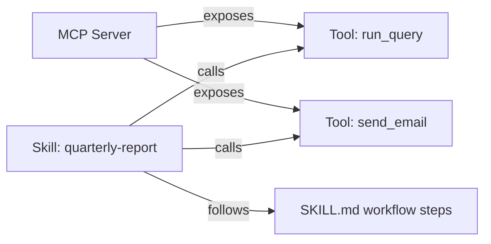

# Chapter 8: Skills, Progressive Disclosure & Code Execution

## Table of Contents

1. [Why This Chapter Exists: the Scaling Problem](#1-why-this-chapter-exists-the-scaling-problem)
2. [Agent Skills: Folder, `SKILL.md`, and Three Levels](#2-agent-skills-folder-skillmd-and-three-levels)
3. [Skills vs Tools vs MCP](#3-skills-vs-tools-vs-mcp)
4. [Writing a Good Skill](#4-writing-a-good-skill)
5. [Skill Discovery and the 2026 Ecosystem](#5-skill-discovery-and-the-2026-ecosystem)
6. [Code Execution as Tool Use ("Code Mode")](#6-code-execution-as-tool-use-code-mode)
7. [When Code Mode Wins and When It Hurts](#7-when-code-mode-wins-and-when-it-hurts)
8. [Sandbox Requirements for Code Mode](#8-sandbox-requirements-for-code-mode)
9. [Progressive Disclosure Beyond Skills](#9-progressive-disclosure-beyond-skills)
10. [Composing Skills](#10-composing-skills)
11. [Dry-Run: 50 Capabilities, Three Designs, One 20-Step Run](#11-dry-run-50-capabilities-three-designs-one-20-step-run)
12. [Key Takeaways + Master Decision Table](#12-key-takeaways--master-decision-table)

---

# 1: Why This Chapter Exists: the Scaling Problem

## Starting From Plain Language

Chapter 3 solved tool design assuming a library of a handful to a few dozen
tools. Chapter 7 solved planning assuming a fixed, known set of capabilities
to draw on while executing a plan. Neither chapter had to answer a much
blunter question: what happens once an agent's real capability surface is
not 6 tools, or even 40, but **500** — a realistic number the moment you
connect a handful of MCP servers (Chapter 3, Section 10), each contributing
a dozen-plus tools of its own? This chapter is about the three curves that
force an answer, and the two mechanisms — Agent Skills and code execution —
that 2026 tooling actually converged on.

## The Three Curves

```
   cost / accuracy
        │
        │                                    ╱── prefill token cost
        │                                  ╱     (linear in capability count,
        │                                ╱       Chapter 3 Section 8's math,
        │                              ╱         restated at 10x the scale)
        │                            ╱
        │                          ╱
        │  ─ ─ ─ ─ ─ ─ ─ ─ ─ ─ ─╱─ ─ ─ ─ ─ ─ ─ ─ ─ ─ ─ ─ ─
        │ ╲                    ╱
        │   ╲                ╱          selection accuracy
        │     ╲            ╱            (flat, then degrades past
        │       ╲ ─ ─ ─ ─╱               ~20-50 tools, Chapter 3
        │                                Section 9)
        └──────────────────────────────────────────────► capability count
             5         40        150         500
```

*(`[DRY-RUN]` — Section 11 puts real numbers under exactly this picture, at
the 50-capability scale the chapter's code deliverable targets.)*

Two of these curves are already fully derived: Chapter 3, Section 8 computed
the token cost curve in dollars for a 40-tool library; Chapter 3, Section 9
established that selection *accuracy* — a second, independent cost — starts
degrading somewhere in the 20–50 tool range, not because any tool got worse,
but because discriminating between many visible candidates is itself a
cognitive load. Both curves point at the same conclusion from different
directions: **the fix cannot be "write better tool descriptions" once the
count itself is the problem.** Something has to keep most of a 500-capability
surface out of context *by default*, and reveal only what the current task
actually needs. That something is progressive disclosure, and this chapter
covers its two dominant 2026 implementations.

## Key Takeaways for Section 1

Three curves — token cost, selection accuracy, and (implicitly) engineering
effort to maintain hundreds of tool schemas — all get worse as capability
count grows past a few dozen, and no amount of better tool writing (Chapter
3's whole subject) fixes a problem that is fundamentally about *how many
candidates are visible at once*, not how well any one of them is described.
This chapter's two answers — Skills (Sections 2–5, 9–10) and code execution
(Sections 6–8) — both work by the same underlying trick: reveal capability
just-in-time, never all at once.

*Next: the first mechanism, and the specific file format that carries it.*

---

# 2: Agent Skills: Folder, `SKILL.md`, and Three Levels

## Starting From Plain Language

A new hire doesn't read the entire employee handbook before their first
task — they skim the table of contents, find the one section relevant to
what they're doing right now, and read *that* section in full only once
they know they need it. Deeper reference material (the tax form templates,
the vendor contact list) stays untouched until the task in front of them
actually calls for it. An **Agent Skill** is this exact reading discipline,
formalized as a folder on disk instead of a mental habit.

## The Three Levels

A skill is a directory containing a required `SKILL.md` file plus, often,
bundled resources — templates, scripts, reference documents — that the
model reads only when it needs them. Loading happens in three distinct
tiers, and the tier boundaries are themselves the entire point of the
design:

| Level | What loads | Typical size | When |
|---|---|---|---|
| 1 — Discovery | Just the skill's `name` and `description` | ~50–100 tokens per skill | Always, for every installed skill, at startup |
| 2 — Activation | The full body of `SKILL.md` — workflow steps, output format, quality checks | Convention keeps this under roughly 5,000 tokens | Only once the current task's description plausibly matches this skill |
| 3 — Execution | Bundled reference files, templates, or scripts named in `SKILL.md` | Unbounded — as large as the task needs | Only when the skill's own instructions tell the agent to read that specific file |

```
              LEVEL 1 (always resident)          LEVEL 2 (on activation)
        ┌───────────────────────────────┐   ┌─────────────────────────────┐
        │ name: "pdf-report"             │──▶│ Full SKILL.md body:          │
        │ description: "Generate a PDF   │   │ workflow steps, output       │
        │  report from tabular data"     │   │ format, definition of done   │
        └───────────────────────────────┘   └──────────────┬──────────────┘
                                                             │ references
                                                             ▼
                                              ┌───────────────────────────┐
                                              │ LEVEL 3 (read on demand)   │
                                              │ templates/cover_page.html  │
                                              │ scripts/render_table.py   │
                                              └───────────────────────────┘
```

## The Arithmetic This Buys

With 50 skills installed and only Level 1 resident by default, standing
context cost is roughly $50 \times 100 = 5{,}000$ tokens — not
$50 \times 5{,}000 = 250{,}000$ tokens if every skill's full body were
resident at once. This is precisely Chapter 3's `defer_loading` mechanic
(Section 8 there), applied to *procedures* instead of *tool schemas* —
same trick, one layer up the capability stack. Section 11 below carries
this exact arithmetic through a full run.

## Key Takeaways for Section 2

A skill is a folder with a required `SKILL.md`, loaded in three tiers:
always-resident name/description (Level 1), full instructions only on
activation (Level 2), and bundled reference files read only when the
skill's own text points at them (Level 3). The tier boundaries are what
make a library of hundreds of skills affordable — you pay for the ones
that matched, and only pay Level 1's small flat cost for the rest.

*Next: skills, tools, and MCP servers all show up in the same conversations
about "capability" — here's what actually distinguishes them.*

---

# 3: Skills vs Tools vs MCP

## Starting From Plain Language

A phone line, a phone number, and a conversation are three different
things, even though "call the plumber" seems to name just one action. The
phone line is the infrastructure that makes any call possible (MCP: it
standardizes *connection*). The phone number is the specific capability you
reach through that infrastructure (a tool: it exposes one *capability*, one
callable action with a schema). The actual conversation — "here's how you
describe the leak, here's what to ask, here's how you know the plumber
understood" — is a *procedure*, not a wire or a phone number, and that's
what a skill encodes.

## The Decision Table

| | MCP | Tool | Skill |
|---|---|---|---|
| What it standardizes | **Connection** — a transport for exposing tools/resources across a process boundary | **Capability** — one callable action with a name, description, and schema | **Procedure** — how to actually carry out a multi-step task well, including which tools to use and in what order |
| Where it lives | A server process, possibly remote | A schema, resident or deferred, in context | A folder: `SKILL.md` + bundled resources |
| Granularity | N servers, each exposing M tools | One action per tool (Chapter 3, Section 3's granularity question) | One coherent workflow, which may call several tools |
| Analogy | The phone network | A phone number | Knowing what to actually say on the call |



## Why This Is Complementary, Not Competing

The relationship in the diagram is the entire point: a skill does not
replace a tool, and MCP does not replace a skill. A skill's `SKILL.md` body
routinely *names* the tools it expects to be available (perhaps ones an MCP
server provides) and tells the model the order and judgement calls involved
in using them well — the same information a senior colleague would give a
new hire verbally, now written down once and loaded on demand instead of
re-explained in every conversation. Reach for a **tool** when you need one
new callable capability; reach for **MCP** when that capability needs to be
exposed across a process or organizational boundary; reach for a **skill**
when the hard part isn't *having* the capability but *knowing how to use it
well* — sequencing, formatting, common mistakes, a definition of done.

## Key Takeaways for Section 3

MCP standardizes connection, tools expose capability, skills encode
procedure — three different layers, not three competing choices for the
same job. A skill typically calls tools it doesn't itself provide, often
ones an MCP server exposes; the decision of which one you need comes down
to whether the gap is "we can't reach this capability at all" (MCP), "this
specific action doesn't exist yet" (a tool), or "the model keeps doing this
multi-step task wrong even though every tool it needs already exists" (a
skill).

*Next: skills are easy to write badly — one part of the format is
disproportionately hard to get right.*

---

# 4: Writing a Good Skill

## Starting From Plain Language

A restaurant's exterior sign is the only information a passerby has before
deciding to walk in. If the sign just says "Restaurant," nobody with a
specific craving ever stops. If it says "Restaurant — Thai, Open Late,
Vegan Options," the right customer self-selects accurately, without ever
reading the menu. A skill's `description` field — Level 1 in Section 2's
table — is that sign, and it is, without close competition, the hardest
part of writing a skill.

## The Trigger Description Is the Hardest Part, and Here Is Why

The model deciding whether to activate a skill has to make that decision
from the description *alone* — the full body hasn't loaded yet, by design
(Section 2). A vague description ("helps with documents") either never
triggers when it should, or triggers constantly on unrelated tasks, both of
which are worse than no skill at all: a skill that never fires is dead
weight at Level 1's small but nonzero cost, and a skill that over-fires
pollutes context with an irrelevant Level 2 body loaded for no reason. The
fix mirrors Chapter 3, Section 2's tool-description advice exactly, one
level up: describe *when to reach for this*, concretely, not just what it
produces — "Generate a formatted PDF report from a CSV or dataframe,
including a title page and summary charts" beats "PDF report generator" for
the same reason "call this when you need current stock prices, not for
historical data" beat a bare capability statement in Chapter 3.

## The Rest of `SKILL.md`

Once activated, the body should carry, in order: the **workflow steps** —
a concrete sequence, not a vague goal restated; the **output format** —
exactly what the deliverable should look like, since "make a good report"
and "make a report with sections X, Y, Z in that order, as a PDF" produce
measurably different consistency; a **definition of done** — the same
machine-checkable spirit as Chapter 7, Section 4's acceptance criteria,
applied to a skill's own completion; and **quality checks** — common
mistakes this specific procedure is prone to, named explicitly, the same
proactive-misconception-naming principle CLAUDE.md itself asks for in
explanations.

## How a Skill Differs From a Prompt Template

A prompt template is text a human pastes into a conversation by hand, every
time, and it competes for space in context the instant it's pasted — there
is no discovery tier, no on-demand loading, and no bundled resources beyond
what fits in the paste itself. A skill is *discovered automatically* by
matching its Level 1 description against the current task, *loads itself*
only when relevant, and can bundle arbitrarily large Level 3 resources that
never touch context until specifically needed. The difference is not
stylistic — it's the entire progressive-disclosure mechanism from Section 1
that a pasted template has no way to participate in.

## Key Takeaways for Section 4

The trigger description is the hardest and most consequential part of a
skill, because it is the *only* information available at the moment the
activation decision gets made — word it as a concrete "when to use this,"
not a bare capability statement. A complete skill body adds workflow steps,
an explicit output format, a checkable definition of done, and named
quality checks. A skill differs from a prompt template specifically in
having a discovery tier and on-demand resource loading — capabilities a
pasted block of text structurally cannot have.

*Next: skills, once written, need somewhere to live and some way to be
found beyond a single repo.*

---

# 5: Skill Discovery and the 2026 Ecosystem

## Starting From Plain Language

A cookbook that only its author can find is not really a cookbook — it's a
private notebook. Skills only realize their full value once there's a
shared, standard way for one person's (or one team's, or one vendor's)
skill to be found and used by someone else's agent, without both sides
agreeing on a bespoke integration first.

## Skills as an Open, Cross-Vendor Format

What started as an Anthropic-specific mechanism spread, through 2026,
into a genuinely open convention: multiple independent agent frameworks now
read and write the same `SKILL.md` shape, and a community specification
(commonly referenced as the **agentskills.io** effort) has been circulating
in draft form, working toward a first stable release later in 2026. The
practical takeaway is not the exact governance details — those are still
settling — but that a skill written once, following the open convention
instead of a single vendor's private format, is increasingly portable
across whichever harness ends up running it.

## Discovery From MCP Servers, and Marketplaces

The boundary drawn in Section 3 — MCP for connection, skills for procedure
— gets interesting exactly at the seam: some 2026 frameworks can *discover*
skills that an MCP server advertises alongside its tools, meaning a single
server connection can hand an agent both new capabilities and the
procedural knowledge for using them well, in one step. Separately,
skill marketplaces emerged the same way package registries did for
software libraries — a place to publish, version, and pull in a skill
someone else already wrote and tested, rather than reinventing a
`quarterly-report` skill from scratch in every organization that needs one.

*A concrete, present-tense example, worth naming because it isn't
hypothetical: this very course's own working environment ships with a
whole roster of installed skills — spanning PR review, memory search,
plugin version bumps, and dozens of other procedures — each discovered by
a short description and loaded in full only when a task actually matches
it. That roster is a live instance of exactly this section's subject, not
a toy example built for teaching purposes.*

## Versioning Skills in a Repo

Because a skill is just a folder, it versions the same way any other code
does: committed to a repository, diffed on review, and tagged on release.
This matters more than it sounds — a skill's `SKILL.md` encodes a workflow
that will drift out of date exactly as fast as the tools or conventions it
references do, and an un-versioned skill has no way to answer "which
version of this procedure did last month's run actually follow?" The same
hill-climbing discipline Chapter 5, Section 10 established for a harness
(change one thing, measure, keep or revert) applies just as directly to a
skill's own instructions.

## Key Takeaways for Section 5

Skills moved from a single-vendor mechanism toward an open, cross-framework
format through 2026, with a community specification converging in draft
form. Discovery increasingly happens through MCP servers (bundling
procedure with the capability it operates) and through marketplaces (the
package-registry model, applied to procedures instead of libraries).
Version skills like code — an unversioned procedure has no way to explain
which behavior produced last month's results.

*Next: an entirely different mechanism for the same underlying problem —
what if the model never sees most tool schemas at all, because it writes
code instead of making tool calls?*

---

# 6: Code Execution as Tool Use ("Code Mode")

## Starting From Plain Language

Compare two ways to get a large filing job done. In the first, a clerk
reads a list of 200 file-cabinet drawer numbers out loud to an assistant,
one drawer at a time, waiting for the assistant to walk to that drawer and
report back before naming the next one. In the second, the clerk simply
hands the assistant a written procedure — "sort these into the drawers
matching each folder's year, skip anything already filed" — and the
assistant executes the whole thing without narrating each drawer visit back
to the clerk. **Code mode** is the second picture: instead of the model
making one tool call, reading the result, and deciding the next tool call
— all through the context window, all billed as tokens — the model writes
a short program that calls as many tools as the task needs, and only the
program's *final* result comes back into context.

## The Mechanism

Rather than declaring every tool's schema in context, code mode exposes a
**client library** — ordinary function signatures the model can read (via
type stubs, docstrings, or on-demand file reads) and call from inside a
single piece of generated code, executed in a sandbox (Section 8). The
model never receives 500 tool schemas up front; it receives one tool —
something like `run_python` or `run_code` — and writes code against a
library it can inspect as needed, the same way a human developer reads a
library's documentation only for the functions they're actually about to
call, not the whole package's API surface on every task.

```
   WITHOUT CODE MODE                          WITH CODE MODE

   context: 500 tool schemas               context: 1 tool (run_code)
   step 1: call tool A -> result in context   step 1: model writes a program
   step 2: call tool B -> result in context           calling A, B, C, D
   step 3: call tool C -> result in context           inside the sandbox
   step 4: call tool D -> result in context   step 2: only the PROGRAM'S
   ... every intermediate result                       FINAL OUTPUT returns
       re-enters context and gets                       to context
       re-sent on every future call
```

## The Real, Measured Result

Anthropic's own reported case is worth stating exactly because the number
sounds implausible until you see the mechanism: a Google-Drive-to-Salesforce
data-move workflow dropped from roughly **150,000 tokens to roughly 2,000
tokens** — a reduction on the order of 98% — when rewritten from
turn-by-turn tool calls into a single generated program executed against
the same underlying MCP tools. The saving isn't from the tools doing less
work; it's from **every intermediate result no longer having to round-trip
through the model's own context** the way Chapter 2, Section 11's dry-run
showed a single chained tool-to-tool handoff costing extra tokens purely to
re-emit content the model had already seen once. Code mode doesn't reduce
that duplication — it eliminates the need for the model to be the pipe the
data flows through at all.

## Key Takeaways for Section 6

Code mode replaces N declared tool schemas with one `run_code`-style tool
plus a client library the model reads on demand, and replaces N
round-tripped tool results with one final program output. Anthropic's own
published case shows a ~98% token reduction on a genuinely large MCP
surface — not because the underlying tools changed, but because
intermediate results stopped passing back through the model's context at
all.

*Next: this sounds like a strict upgrade over declaring tool schemas — it
isn't, and knowing exactly where it stops helping matters as much as
knowing where it helps.*

---

# 7: When Code Mode Wins and When It Hurts

## Where It Wins

Code mode's advantage compounds with **tool-surface size**: the more tools
a task might touch (dozens of MCP servers, hundreds of endpoints), the more
schema tokens it removes from context by never declaring them all up front.
It compounds again with **data transformation and looping**: a task like
"pull these 400 records, reshape them, and write them to a different
system" is naturally one program with a loop, not 400 individual tool
calls each round-tripping a record through the model's context one at a
time. Both cases share the same shape — many mechanical, structurally
similar operations that a program expresses in a few lines and a
turn-by-turn tool-call sequence expresses in hundreds of expensive
round trips.

## Where It Hurts

Code mode is a poor fit for **a single, high-risk, side-effecting action
that genuinely needs a human approval gate before it happens** — `send_wire_transfer`,
`delete_production_database`. A tool call sitting in context, visible and
inspectable, with a clean permission-layer hook (Chapter 16) before
execution, is the right shape for exactly this case; a generated program
that calls the same dangerous function *from inside its own execution*
is much harder for an external approval gate to intercept at the right
moment — by the time you'd want to approve it, the sandbox may already be
mid-execution. The general shape of this tradeoff: code mode is excellent
when the goal is throughput over many similar operations, and worse when
the goal is a checkpoint before one consequential one.

## Key Takeaways for Section 7

Code mode wins on large tool surfaces and on data-heavy, repetitive
operations, where the alternative is many expensive round trips through
context. It hurts on single, high-risk, side-effecting actions that need a
clean approval gate — a visible tool call in context is easier to intercept
before it fires than a dangerous call buried inside a generated program's
own execution. Neither case argues for abandoning ordinary tool calls
entirely; they argue for choosing per task, the same way Chapter 3
Section 3 argued for choosing tool granularity per task rather than
picking one size for everything.

*Next: a sandbox running arbitrary generated code is not a detail to add
later — it's the thing that makes code mode safe to run at all.*

---

# 8: Sandbox Requirements for Code Mode

## Starting From Plain Language

Letting a model write and run its own code without a sandbox is like
handing a new employee the master keys to the building on their first day
because it's more convenient than issuing a visitor badge. Convenient right
up until the one time it matters.

## The Requirements, Named

A code-mode sandbox needs, at minimum: a **filesystem scope** — a
restricted directory the generated code can read and write, with no path
outside it reachable, ever, regardless of what the generated code tries;
a **network policy** — which hosts, if any, the sandbox may reach, since a
generated program with unrestricted egress can exfiltrate data as easily as
it can call a legitimate API; and **time and memory limits** — a generated
program can contain an accidental infinite loop or unbounded allocation
just as easily as human-written code can, and nothing about the model
having written it makes that safer to run unbounded.

## Why Code Mode Expands, Not Shrinks, the Attack Surface

It is tempting to think of code mode as strictly safer than tool calls,
because it *removes* hundreds of tool schemas from view. The opposite is
true for a different reason: a tool call can only do exactly what that
tool's implementation allows, by construction — the model chose from a
fixed menu. Generated code is a **general-purpose computation**, and a
sandbox that permits arbitrary code execution is, by definition, permitting
arbitrary behavior within whatever the sandbox's own boundaries allow. This
is precisely why Chapter 16 (Security & Sandboxing) exists as a forward
pointer here rather than a settled question: the sandbox's own boundaries
*are* the security model once code mode is in play, in a way that a curated
tool list with individual schemas never had to be, because the tool
implementations themselves were already the boundary.

## Key Takeaways for Section 8

A code-mode sandbox needs filesystem scoping, a network egress policy, and
time/memory limits, at minimum, before it is safe to run generated code
against real capabilities. Code mode trades a curated menu of individually-
bounded tool calls for general-purpose computation inside a sandbox boundary
— which is a net *expansion* of what needs defending, not a reduction, even
though it reduces what's visible in context. Chapter 16 covers this
properly; this section names the requirement so it isn't skipped in the
meantime.

*Next: skills and code mode are the two mechanisms this chapter names
directly — a few more progressive-disclosure techniques round out the
picture, including one you may already be using in this very
conversation.*

---

# 9: Progressive Disclosure Beyond Skills

## Starting From Plain Language

Skills (Sections 2–5) and code mode (Sections 6–8) are the two headline
mechanisms, but "reveal capability just-in-time" is a general principle
with more than two implementations, and it's worth naming the rest so the
pattern reads as a family, not two unrelated tricks.

## Lazy Tool Schemas and Tool Search — a Direct Recap

Chapter 3, Sections 8 and 11 already built this mechanism in full: tools
marked `defer_loading`, discovered and *appended* (never swapped) into
context by a small, always-resident search tool, only once the model
actually needs them. That chapter's dry-run showed the exact arithmetic —
a 40-tool, $0.60-per-run library falling to roughly a cent once just-in-time
loading replaced declaring everything upfront. Nothing about the mechanism
changes at this chapter's larger scale; it's the same tool, applied to a
bigger library.

*A live, present-tense instance of this exact mechanism, not a
hypothetical one: this course's own working environment exposes a set of
**deferred tools** — visible by name only, with no schema loaded — until a
tool-search call fetches the full definition for the specific ones a given
task needs. That is Chapter 3's Tool Search Tool, unmodified, running in
the background of the very course you're reading.*

## Hierarchical Retrieval of Instructions

The same discipline applies to *instructions*, not just tool schemas: a
large `CLAUDE.md`-or-`AGENTS.md`-style instruction file (Chapter 5, Section
5) can itself be organized hierarchically — a short top-level index always
resident, with deeper, topic-specific instruction files pulled in only when
the current task's directory or subject matches. This is structurally
identical to a skill's Level 1 / Level 2 split (Section 2), applied to
project conventions instead of procedures.

## File-Tree-as-Index Patterns

A directory structure itself can serve as a zero-cost index: an agent that
lists a repository's file tree before reading anything is using the
filesystem's own hierarchy as a form of progressive disclosure — the
directory names alone (`billing/`, `auth/`, `notifications/`) often
narrow down which files are worth reading in full, at the cost of a single,
cheap `ls`-equivalent call, before spending any tokens on file contents
that turn out to be irrelevant.

## Key Takeaways for Section 9

Progressive disclosure is a family, not two isolated tricks: lazy tool
schemas via search (Chapter 3, recapped here and demonstrably running in
this very course's own tooling), hierarchical instruction files with a
resident index and deep files loaded on demand, and file-tree browsing as a
near-free index over a codebase before committing tokens to file contents.
All three share Section 1's underlying fix: reveal detail only once
something concrete indicates it's needed.

*Next: skills calling other skills is where this chapter's subject starts
to overlap with a much bigger topic this book covers on its own later.*

---

# 10: Composing Skills

## Starting From Plain Language

A recipe for a layered cake can itself call out "prepare the vanilla
buttercream (see recipe on page 12)" rather than re-explaining buttercream
inline — one procedure invoking another, each independently useful, each
independently maintainable. Skills compose the same way: a `SKILL.md` body
is free to instruct the model to activate a *different* skill as one step
of its own workflow, rather than duplicating that skill's procedure inline.

## Where Composition Becomes Multi-Agent

Composition has a natural ceiling, and it's worth naming precisely where it
sits: as long as a composed skill runs *inside the same context window* as
the skill that invoked it, it's still one agent, sequentially working
through a longer, composed procedure — Section 2's three-level loading
still governs everything, just with more skills activating over the course
of one run. The moment a composed step needs its **own isolated context** —
because the sub-procedure is long enough to pollute the parent's window, or
because it benefits from a narrower, purpose-built toolset the parent
shouldn't see — composition has crossed into Chapter 13's subject:
delegating to a subagent with its own window is a different mechanism than
loading a second skill into the same one, even though from the outside
both look like "one capability calling another."

## Key Takeaways for Section 10

Skills can invoke other skills as steps within their own workflow, and as
long as everything still runs in one context window, that's still
progressive disclosure operating at a slightly larger scale — not a new
mechanism. It becomes a new mechanism, and Chapter 13's subject, the moment
a composed step needs an isolated context of its own rather than sharing
the parent's window.

*Next: putting real numbers under this chapter's central claim — a
50-capability library, three designs, one run.*

---

# 11: Dry-Run: 50 Capabilities, Three Designs, One 20-Step Run

## The Setup

Fifty capabilities, ~250 tokens per schema — Chapter 3's same per-schema
estimate, just at a larger, realistic-once-you-connect-several-MCP-servers
count. A 20-step run. Three designs for delivering those 50 capabilities to
the model, compared on prefill tokens per step and total tokens across the
whole run — the same $3/1M-token illustrative pricing Chapter 1, Section 11
established, applied here purely to the capability-delivery overhead, in
isolation from everything else the run would also cost.

## Design (a): All 50 Schemas Resident, Every Step

$$\text{tokens/step} = 50 \times 250 = 12{,}500$$

Flat across all 20 steps, since nothing here is deferred:

$$\text{total} = 20 \times 12{,}500 = 250{,}000 \text{ tokens} \quad (\$0.75 \text{ at } \$3/1\text{M})$$

## Design (b): Skills, Level-1 Only Until Activated

Standing Level-1 catalog for all 50 skills: $50 \times 100 = 5{,}000$
tokens per step, always. Suppose this particular task genuinely needs two
of the fifty: Skill A's Level-2 body (3,000 tokens) activates at step 3 and
stays resident for the rest of the run (18 steps); Skill B's body (2,500
tokens) activates at step 10 and stays resident for the remaining 11 steps
— nothing here evicts a loaded body once it's in, the conservative
assumption, matching Section 2's description exactly.

```
steps 1-2   (2 steps):  5,000 tokens/step               = 10,000
steps 3-9   (7 steps):  5,000 + 3,000 = 8,000 tokens/step = 56,000
steps 10-20 (11 steps): 5,000 + 3,000 + 2,500 = 10,500/step = 115,500

total = 10,000 + 56,000 + 115,500 = 181,500 tokens   ($0.545 at $3/1M)
```

## Design (c): Code Mode, a Single `run_code` Tool

Only one schema is ever resident — the model discovers the other 49
capabilities' equivalents by reading a client library on demand from
*inside* generated code, never by having their schemas declared in the
message list at all:

$$\text{tokens/step} = 250 \quad \text{(flat, all 20 steps)}$$

$$\text{total} = 20 \times 250 = 5{,}000 \text{ tokens} \quad (\$0.015 \text{ at } \$3/1\text{M})$$

## The Comparison

| Design | Tokens/step (typical) | Total (20 steps) | Cost @ $3/1M |
|---|---|---|---|
| (a) All schemas resident | 12,500 (flat) | 250,000 | $0.75 |
| (b) Skills, Level-1 + on-demand bodies | 5,000 → 10,500 (grows) | 181,500 | $0.545 |
| (c) Code mode, single tool | 250 (flat) | 5,000 | $0.015 |

$$\frac{\text{Design (a)}}{\text{Design (c)}} = \frac{250{,}000}{5{,}000} = 50\times$$

That ratio is not a coincidence of these particular numbers — it falls out
directly from the capability count itself: fifty capabilities declared
individually versus one `run_code` schema standing in for all of them is,
by construction, a 50-to-1 ratio, the same way Chapter 3's dry-run showed a
40-tool library costing roughly 40 times a single-tool baseline. Design
(b) sits meaningfully between the two — a real, honest ~1.4× improvement
over declaring everything, not the full 50× code mode achieves, because
Section 2's conservative "nothing gets evicted once loaded" assumption
means an activated skill's cost lingers for the rest of the run. Prompt
caching (Chapter 1, Chapter 3 Section 8) would shrink all three totals by
a similar proportion — it does not change which design wins, because
caching applies uniformly to whatever happens to be resident.

## Key Takeaways for Section 11

At 50 capabilities over 20 steps: declaring everything costs 250,000
tokens; skills with on-demand Level-2 loading costs roughly 182,000 (a
real but modest win, eroded by bodies that never get evicted); code mode
with one tool schema costs 5,000 — a 50× gap against the naive baseline,
following directly from the capability count itself. None of these numbers
change if you add caching; caching is a proportional discount, not a
re-ranking of which design is cheapest.

*Next: closing the loop on which mechanism to reach for, and why.*

---

# 12: Key Takeaways + Master Decision Table

The single mental model for this chapter: **capability count is its own
context-management problem**, separate from token budgeting (Chapter 4)
and separate from tool design quality (Chapter 3) — no amount of skill at
either fixes an agent that has to hold 500 capabilities' schemas in view on
every single turn. Skills and code execution are the two dominant 2026
answers, and both work by the same principle Section 1 opened with:
reveal detail only once something concrete says it's needed.

| I want to know... | Reach for | Key fact |
|---|---|---|
| Why 500 tools is a real problem, not a hypothetical one | Section 1 | Token cost and selection accuracy both degrade with capability count, independent of how well any individual tool is described |
| What a skill actually is | Section 2 | A folder with `SKILL.md`, loaded in three tiers — name/description always, full body on activation, bundled files on demand |
| Skill vs tool vs MCP | Section 3 | MCP standardizes connection, tools expose capability, skills encode procedure — complementary layers, not competing choices |
| How to write a skill that actually triggers | Section 4 | The trigger description is the hardest part — word it as a concrete "when to use this," not a bare capability statement |
| Where to find or publish skills | Section 5 | An open, cross-framework convention (draft spec circulating as agentskills.io), discoverable via MCP servers or marketplaces, versioned like code |
| What code mode actually changes | Section 6 | One `run_code` tool replaces N schemas; the model writes a program instead of round-tripping every intermediate result through context — ~98% reduction in Anthropic's own reported case |
| When code mode is the wrong choice | Section 7 | Single, high-risk, side-effecting actions needing a clean approval gate — a generated program is harder to intercept mid-execution than a visible tool call |
| What a code-mode sandbox needs at minimum | Section 8 | Filesystem scoping, network policy, time/memory limits — and the honest acknowledgment that this expands the attack surface, it doesn't shrink it |
| What else counts as progressive disclosure | Section 9 | Lazy tool schemas via search (Chapter 3, recapped), hierarchical instruction files, file-tree-as-index — one family of techniques, not isolated tricks |
| When composing skills becomes multi-agent | Section 10 | The instant a composed step needs its own isolated context rather than sharing the parent's window |
| How big is the actual gap | Section 11 | ~50× between declaring 50 schemas and one code-mode tool, on this chapter's own numbers; skills land in between at roughly 1.4× |

**Connection forward:** Chapters 9 and 10 turn to a different kind of
scaling problem this chapter didn't touch — not *how many things the agent
can do*, but *what the agent remembers once the session that did all this
work has ended*. Skills and code mode both assumed the current run's
context was the only thing that mattered; memory is what happens once that
run is over.
