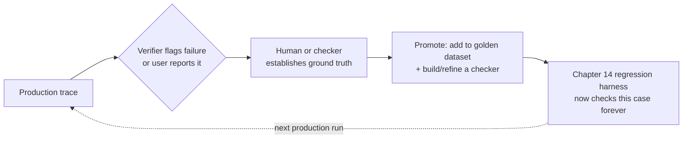

# Chapter 15: Observability, Tracing & Debugging

## Table of Contents

1. [Why Agent Debugging Is Different](#1-why-agent-debugging-is-different)
2. [The Trace Model](#2-the-trace-model)
3. [OpenTelemetry GenAI Semantic Conventions](#3-opentelemetry-genai-semantic-conventions)
4. [What to Record Per Step](#4-what-to-record-per-step)
5. [Sampling and Privacy](#5-sampling-and-privacy)
6. [From Trace to Eval](#6-from-trace-to-eval)
7. [Debugging Techniques](#7-debugging-techniques)
8. [Cost and Token Attribution](#8-cost-and-token-attribution)
9. [Dashboards and Alerting That Matter](#9-dashboards-and-alerting-that-matter)
10. [Platform Tour](#10-platform-tour)
11. [Dry-Run: Critical Path, Parallelizable Fraction, and Amdahl's Trap](#11-dry-run-critical-path-parallelizable-fraction-and-amdahls-trap)
12. [Key Takeaways and Master Decision Table](#12-key-takeaways-and-master-decision-table)

---

# 1: Why Agent Debugging Is Different

## Starting From Plain Language

Debugging a single LLM call is close to debugging a pure function: one prompt goes in, one response comes out, and if the response is wrong you read the prompt and the response side by side and you're most of the way to an answer. Chapter 13 built systems where that is no longer true — an orchestrator spawning 3 isolated subagents (Chapter 13's context-isolation topology), each subagent making several tool calls, a checkpointer (Chapter 11) that might replay part of the graph, and a durability layer (Chapter 12) that might resume a crashed run from the middle. When *that* fails, "read the prompt and the response" doesn't even identify which of the 12+ steps across 4 concurrently-running branches is the one that went wrong. This chapter's goal, stated plainly by the README, is narrow and practical: be able to answer "why did *that* specific run fail" purely from artifacts that already exist on disk or in a trace store, without re-running the task and hoping the same failure reproduces.

## The Concrete Difference: One Prompt vs. a Graph of Prompts

A single-turn debugging session has one axis of uncertainty: is this one response correct. A multi-agent, multi-step run has at least four independent axes stacked on top of each other, and a failure can live on any one of them, or on the interaction between two of them:

**Which step** — among 12 steps spread across an orchestrator and 3 subagents, which one is where things went sideways; **which branch** — since 3 subagents ran concurrently (Chapter 13's fan-out pattern), a failure in subagent 2 might not show up until the orchestrator's synthesis step tries to combine results and gets something malformed from a branch that itself looked locally fine; **which boundary** — a tool call crossing a process boundary (Chapter 12's durable subprocess), an A2A call crossing an agent boundary (Chapter 13's signed AgentCard), or a checkpoint replay boundary (Chapter 11) each have their own way of losing information about what happened, unless something on the other side of that boundary specifically records it; and **which layer** — the bug could be in the prompt, in a tool's return value, in the harness code stitching tool results back into messages, or in the verifier that decided a wrong answer was acceptable. Single-turn debugging collapses all four axes into one (there is only one step, one branch, no boundary, and usually one layer to inspect); multi-agent debugging requires a structure that keeps all four axes visible simultaneously, which is exactly what Section 2's trace model is built to do.

## Key Takeaways for Section 1

Treat "debug this agent run" and "debug this LLM call" as different disciplines, not different difficulty levels of the same discipline — an agent run failure can hide in the step, the concurrent branch, the process/agent boundary, or the harness layer, and any debugging tool that only shows you one axis (a flat log of LLM calls, say) will systematically miss failures that live in the other three. Everything from Section 2 onward exists to make all four axes inspectable from stored artifacts alone, so "why did that run fail" never requires re-running the task and hoping it fails the same way twice.

---

# 2: The Trace Model

## Starting From Plain Language

The fix for "which step, which branch, which boundary, which layer" is a data structure that was invented decades before agents existed, for exactly this class of problem: distributed tracing, the same technology that lets you debug a request that crosses ten microservices. A **trace** is the record of one end-to-end run (one user request through the whole orchestrator-plus-subagents system). A **span** is the record of one unit of work inside that trace — one LLM call, one tool call, one retrieval, one subagent's entire run — with a start time, an end time, and a set of attributes describing what happened. Spans nest: a subagent's overall run is a span, and every LLM call and tool call *inside* that subagent is a child span of it. The result is not a flat log line per event, it is a tree, and that tree is precisely the structure that makes all four of Section 1's axes visible at once: walk the tree and you see which step (each node), which branch (which subtree), which boundary (parent/child links that cross a process or agent boundary), and which layer (the span's `kind` — LLM call vs. tool call vs. subagent run) every single piece of the run belongs to.

## Parent/Child Stitching, Precisely

Every span carries three IDs that make the tree reconstructable from a pile of otherwise-unordered records: a `trace_id` shared by every span in the same end-to-end run, a `span_id` unique to this span, and a `parent_span_id` pointing at the span that spawned it (empty or null for the root span). A collector or trace viewer's entire job, mechanically, is: group every span by `trace_id`, then link each span under its `parent_span_id`, and you have the tree — no timestamps, ordering logic, or clever inference required, because the parent/child relationship is recorded explicitly by whoever created the span, not reconstructed after the fact.

The part that's easy to get wrong is stitching *across* a boundary Section 1 called out — a subagent spawned in a different process (Chapter 12's durable subprocess) or a different machine entirely (Chapter 13's A2A call to a remote agent) needs to receive the parent's `trace_id` and `span_id` explicitly, usually propagated as a header on whatever request crosses the boundary (an HTTP header for A2A, an environment variable or CLI argument for a subprocess), specifically so the child's spans can still declare the right `parent_span_id` even though they were created by a different process that never shared memory with the parent. Drop this propagation step and you get two disconnected trace fragments instead of one stitched tree — a failure mode common enough that the README's own gotchas (Section 12) call it out by name: "logging without correlation IDs."

## The Span Tree for a Chapter 13-Style Run

Reusing Chapter 13's orchestrator-plus-3-subagents shape directly, here is what the tree actually looks like once every LLM call, tool call, and subagent run is captured as its own span:

```
invoke_agent "orchestrator"                                    (root span, trace_id=T1)
├── chat "orchestrator: plan the 3 sub-questions"               (span_id=S2,  parent=S1)
├── invoke_agent "subagent_1: research question A"              (span_id=S3,  parent=S1)
│   ├── chat "subagent_1: decide to search"                     (span_id=S4,  parent=S3)
│   └── execute_tool "subagent_1: web_search(...)"               (span_id=S5,  parent=S3)
├── invoke_agent "subagent_2: research question B"              (span_id=S6,  parent=S1)
│   ├── chat "subagent_2: decide to search"                     (span_id=S7,  parent=S6)
│   └── execute_tool "subagent_2: web_search(...)"               (span_id=S8,  parent=S6)
├── invoke_agent "subagent_3: research question C"              (span_id=S9,  parent=S1)
│   ├── chat "subagent_3: decide to search"                     (span_id=S10, parent=S9)
│   └── execute_tool "subagent_3: web_search(...)"               (span_id=S11, parent=S9)
└── chat "orchestrator: synthesize the 3 findings"               (span_id=S12, parent=S1)
```

Every one of the 12 spans above shares `trace_id=T1`; the 3 `invoke_agent` subagent spans run concurrently (their wall-clock intervals overlap, which is visible directly from each span's own start/end timestamps, no separate "was this parallel" flag needed) and each is its own subtree, so a failure that surfaces only in subagent_2's branch is immediately visible as confined to spans S6/S7/S8 without touching subagent_1 or subagent_3's spans at all — this is the concrete payoff of the tree structure over a flat log: locality of failure is structural, not something you have to reconstruct by reading timestamps by hand.

## Key Takeaways for Section 2

A trace is a tree of spans, not a flat log, and the tree structure is what makes a multi-step, multi-branch, multi-boundary failure locatable: `trace_id` groups everything in one run, `span_id`/`parent_span_id` reconstruct the tree exactly as it happened, and every one of Section 1's four axes (step, branch, boundary, layer) is legible directly from a span's position in that tree and its `kind`. The one place this breaks is a boundary crossing that fails to propagate `trace_id`/`span_id` forward — every process- or agent-boundary-crossing call in your harness must carry these IDs explicitly, or the resulting trace silently splits into two unlinked fragments.

---

# 3: OpenTelemetry GenAI Semantic Conventions

## Starting From Plain Language

Section 2 established *that* you need spans with `trace_id`/`span_id`/`parent_span_id` and attributes — but if every team invents its own attribute names (`model_name` here, `llm_model` there, `modelId` somewhere else), no trace viewer, dashboard, or eval-promotion tool (Section 6) can be written once and reused across projects, and switching observability vendors means rewriting your instrumentation from scratch. **OpenTelemetry (OTel)** is the vendor-neutral standard for exactly this problem across all of software, not just AI — it defines the wire format for traces, and its **GenAI semantic conventions** define the specific attribute *names* an LLM or agent span should use, so that any OTel-compatible collector, viewer, or dashboard understands your spans without custom glue code.

## A Necessary Correction to the README's Framing

The README describes these as "the stable conventions (GenAI semconv 1.29+)," and it's worth being precise about what "stable" means here as of this chapter's writing (mid-2026), because getting this wrong leads to brittle instrumentation. As of a June 2026 reorganization (OpenTelemetry v1.42.0), the `gen_ai.*` attributes and spans were moved out of the main OpenTelemetry semantic-conventions repository into a dedicated `semantic-conventions-genai` repository — but this was an *organizational* move, not a graduation to stable. As of July 2026, **no GenAI-specific span, event, metric, or attribute is marked Stable** in that dedicated repository; the conventions remain in **Development** status, meaning attribute names can still change between releases. The practical takeaway is not "don't bother instrumenting to the standard" — it's the opposite: instrument to the standard *anyway*, because the standard's whole purpose is to keep your migration door open regardless of which vendor's collector you point your spans at, but budget for attribute-name churn as the spec matures, and use the `OTEL_SEMCONV_STABILITY_OPT_IN` environment variable, which lets an SDK dual-emit both legacy and newer attribute names during a transition so you don't have to flip every consumer over atomically.

## The Attribute Names You Should Emit

Three span kinds cover essentially everything an agent harness does: `invoke_agent` for an agent's or subagent's overall run, `chat` for one model call, and `execute_tool` for one tool invocation — the same three kinds already used in Section 2's tree. Every span, regardless of kind, should carry `gen_ai.operation.name` (one of `invoke_agent`, `chat`, `execute_tool`, or a handful of other predefined operation names — use a predefined value if one applies, and only invent a custom name if genuinely nothing standard fits) and `gen_ai.provider.name` (which underlying provider served the request — e.g. `anthropic` or `aws.bedrock` for this repo's Bedrock-routed setup). A `chat` span additionally carries `gen_ai.request.model` (the model name/ID requested), `gen_ai.usage.input_tokens`, and `gen_ai.usage.output_tokens` (token counts for that specific call — the raw material Section 8's cost attribution is built from). An `execute_tool` span carries the tool's name and, per Section 4 below, its arguments and result. Emitting exactly this minimal set on every span — even before anything more elaborate — already gives you provider-agnostic cost attribution, per-model breakdowns, and a tool-call inventory for free, purely because every consumer of OTel GenAI data knows to look for these specific names.

```
                        THREE SPAN KINDS, ONE SHARED SHAPE
   ┌───────────────────────────────────────────────────────────────────┐
   │ invoke_agent   gen_ai.operation.name="invoke_agent"                │
   │                gen_ai.provider.name, agent name/id                 │
   │                (wraps everything the agent/subagent does)          │
   │                                                                     │
   │ chat           gen_ai.operation.name="chat"                        │
   │                gen_ai.request.model, gen_ai.usage.input_tokens,    │
   │                gen_ai.usage.output_tokens                          │
   │                                                                     │
   │ execute_tool   gen_ai.operation.name="execute_tool"                 │
   │                tool name, arguments, result (Section 4/5)          │
   └───────────────────────────────────────────────────────────────────┘
   every span, regardless of kind, also carries: trace_id, span_id,
   parent_span_id (Section 2) -- OTel's own base fields, not GenAI-specific
```

## Key Takeaways for Section 3

Instrument to the OTel GenAI attribute names (`gen_ai.operation.name`, `gen_ai.provider.name`, `gen_ai.request.model`, `gen_ai.usage.input_tokens`/`output_tokens`, plus the three span kinds `invoke_agent`/`chat`/`execute_tool`) rather than a vendor SDK's own field names, because doing so keeps every downstream consumer — collector, dashboard, eval-promotion tool — swappable without rewriting instrumentation. But go in with accurate expectations: as of mid-2026 these conventions are explicitly in Development, not Stable, so treat `OTEL_SEMCONV_STABILITY_OPT_IN` and dual-emission as a normal part of adopting them, not a workaround for a bug.

---

# 4: What to Record Per Step

## Starting From Plain Language

Section 3 covered the *minimum* attribute set every span needs to be OTel-compliant. This section is about the *complete* set you actually want for debugging, which is larger — because the question "why did this fail" is usually answered by a piece of context that a bare-minimum trace omits, and the single most expensive mistake in this chapter's gotchas (Section 12) is a trace that omits the one span attribute that would have made the failure obvious in five seconds instead of an hour.

## The Full Attribute Checklist, and Why Each One Earns Its Place

**Inputs and outputs** — the literal prompt/messages sent and the literal response received, not a summary of them — are non-negotiable, because every other piece of debugging depends on being able to see exactly what the model was asked and exactly what it said, the same "real object shapes, not paraphrases" principle Chapter 2 Section 3 applied to a single turn, now applied per-span across the whole tree. **Token counts, cost, and latency** (Section 3's `gen_ai.usage.*` plus a wall-clock duration per span) are what Section 8's cost attribution and Section 9's dashboards are computed from — record them on every span, not just a rolled-up total at the end, because a rolled-up total cannot tell you *which* span was expensive. **Cache-hit** (did this call hit a prompt cache, Chapter-level detail this repo's Bedrock setup cares about directly) matters because a cache-hit call that looks fast and cheap in a dashboard is not evidence the underlying prompt is efficient — it's evidence the cache is working, a different fact, and conflating the two leads to false confidence that a bloated prompt is fine. **Tool args/results** — not just "a tool was called" but the exact arguments passed in and the exact result returned — are what makes Section 7's trajectory-diffing and Section 6's eval-promotion possible, since a tool call that returned an unexpected error is often the actual root cause hiding one step upstream of where the final answer looks wrong. **Model + harness version** (which model ID, and which version/commit of your prompt/tool/harness code produced this specific span) is what makes Section 6's trace-to-eval promotion and Chapter 14's regression-gate attribution meaningful at all — without it, you cannot tell whether a bad trace from last week is still reproducible with today's harness or was already fixed. **Decision rationale** — any text the model produced explaining *why* it chose a tool or an answer, even a short aside like Chapter 2 Section 3's "Let me check that file." text block — is frequently the single fastest way a human debugging a trace understands what the model thought was going on, since it's the model's own account of its reasoning at that exact step, in its own words, not an inference from raw JSON blocks. **Verifier outcome** — whatever a verification step (Chapter 13's diverse-lens panels, or Chapter 14's programmatic checkers) concluded about this specific step or the run as a whole — is called out explicitly in the README's gotchas as "the most important span" to never omit, and the reasoning is direct: every other attribute tells you *what happened*; the verifier outcome is the one attribute that tells you *whether what happened was correct*, and a trace missing it forces a human to re-derive correctness by hand from everything else, which is exactly the manual re-judging Chapter 14 built programmatic checkers and calibrated judges to avoid.

## A Concrete Span, Fully Populated

Following Chapter 2 Section 3's discipline of showing real object shapes rather than describing them abstractly, here is `execute_tool` span `S8` from Section 2's tree (subagent_2's web search), populated with every attribute from the checklist above:

```json
{
  "trace_id": "T1",
  "span_id": "S8",
  "parent_span_id": "S6",
  "name": "execute_tool",
  "start_time": "2026-08-12T00:41:03.210Z",
  "end_time": "2026-08-12T00:41:04.710Z",
  "attributes": {
    "gen_ai.operation.name": "execute_tool",
    "gen_ai.tool.name": "web_search",
    "gen_ai.tool.call.arguments": {"query": "coral bleaching primary causes 2026"},
    "gen_ai.tool.call.result": "Coral bleaching is primarily driven by sustained ocean temperature increases of 1-2C above seasonal norms, which cause coral to expel their symbiotic algae...",
    "gen_ai.tool.call.is_error": false,
    "harness.model_id": "anthropic.claude-sonnet-5",
    "harness.version": "ch13-orchestrator@a1b2c3d",
    "harness.cache_hit": false,
    "harness.verifier_outcome": null
  }
}
```

`harness.verifier_outcome` is `null` here deliberately -- this is a tool-call span, not a final-answer span, and there is nothing to verify yet at this point in the trace; the root `invoke_agent` span (`S1`) is where `harness.verifier_outcome` would carry the real value (e.g. `{"checker": "pass", "judge_score": 4}`) once the run completes, which is exactly why the gotcha warns about *omitting* it there specifically, not about every span needing a non-null value.

## Key Takeaways for Section 4

Record inputs/outputs verbatim, token counts/cost/latency/cache-hit per span (not just rolled up), tool args/results verbatim, the model+harness version, any decision-rationale text the model produced, and — non-negotiably, on the span where a verdict exists — the verifier's outcome. Every one of these earns its place by being the fact that turns a five-minute "why did this fail" investigation back into a five-second one; the single field the README calls out as most commonly and most damagingly omitted is the verifier outcome, since it's the only attribute that separates "what happened" from "was it right."

---

# 5: Sampling and Privacy

## Starting From Plain Language

Section 4 argued for recording everything, verbatim, on every span. Taken completely literally at production scale, that recommendation collides with two hard constraints: cost (storing full payloads for every single run, forever, at high request volume gets expensive fast) and privacy (if your agent ever touches a customer's private data, "record the full input/output verbatim" now means storing that customer's private data in your trace store, subject to every retention and access-control obligation that implies). This section is about resolving that collision without silently losing the debugging power Section 4 just established.

## Redaction

**Payload redaction** means stripping or masking specific fields (a customer's email, a document's private contents, an API key that leaked into a tool argument) from a span's recorded payload before it's written to the trace store, while keeping everything else — timing, token counts, span structure, tool names — fully intact. Redaction should happen at the instrumentation layer, as close to the point of capture as possible, rather than as a downstream scrubbing pass over already-stored data, because a downstream pass means the unredacted data existed in your trace store, even briefly, and "briefly" is still a real exposure window and a real compliance liability. This is Chapter 14's exercise cell topic revisited from the opposite side: Chapter 14 built a regression harness assuming full visibility into every trace; this section is what makes full visibility *safe* to have by construction, not despite the presence of sensitive data.

## Stratified Sampling of Full Payloads

Recording every attribute *except* the raw payload for 100% of traces, and the full, un-redacted payload for only a **stratified sample** — a deliberately chosen subset that still spans every difficulty tier, every subagent topology, and every outcome category (pass, fail, flagged-by-verifier) rather than an arbitrary random 1% — gets you both cost control and debugging power simultaneously: the 100%-attributed-but-partial trace is what Section 9's dashboards and Section 8's cost attribution are computed from (they don't need full payloads, only the structured attributes), while the smaller, stratified full-payload sample is what Section 6's trace-to-eval promotion and Section 7's deep debugging techniques draw from. The word "stratified" is doing real work here — a naive random sample systematically under-represents rare failure categories exactly because they're rare, and rare failure categories are disproportionately the ones worth a golden-dataset slot (Chapter 14 Section 3's same "30 real tasks, stratified by difficulty" logic, now applied to sampling live traffic instead of harvesting historical logs).

## Retention Policy for Traces Containing Customer Data

Even a redacted-and-sampled trace store needs an explicit, enforced retention window for any span that still carries customer data after redaction (redaction is rarely perfect — a customer's own free-text message, kept for legitimate debugging value, may still contain PII that no automated redaction rule anticipated). A retention policy states, in advance and independent of any specific incident, how long a trace containing customer data is kept before automatic deletion, and it should be short enough to satisfy your actual compliance obligations and long enough to still support Section 7's debugging workflows on genuinely recent incidents — the tension between those two is real and does not have a universal right answer, which is precisely why it needs to be a written, deliberate policy rather than "however long the trace store happens to keep things by default."

## Key Takeaways for Section 5

Redact sensitive fields at the instrumentation layer (never as a downstream scrub of already-stored unredacted data), keep 100% of structured attributes (timing, tokens, span tree) for every trace, and reserve full, un-redacted payloads for a deliberately *stratified* sample that still covers rare failure categories rather than a naive random slice. Pair this with an explicit, written retention window for any trace that still carries customer data after redaction — the goal of this whole section is to make Section 4's "record everything" recommendation compatible with real privacy and cost constraints, not to walk it back.

---

# 6: From Trace to Eval

## Starting From Plain Language

This section is the flywheel the README names directly, and it is the single most valuable connective thread this chapter builds to Chapter 14: a real production trace where something went wrong is raw material for a new golden-dataset entry, and every time you promote one, your eval suite gets a little more representative of the failures that actually happen, for free, as a side effect of normal operation rather than a deliberate data-collection effort.

## The Mechanism, Concretely

The loop runs like this: a production trace fails — a verifier outcome (Section 4) comes back negative, or a user reports the output was wrong. That trace already has, sitting in the trace store, exactly the raw materials Chapter 14 Section 3 said a golden task needs: a real prompt (drawn from real usage, not imagined), a real trajectory, and — critically — enough context (the tool args/results, the model+harness version from Section 4) to establish what the *correct* outcome should have been, either because a human reviews the failed trace and determines ground truth, or because the failure is one Chapter 14 Section 4's programmatic checkers could have caught if it existed yet. Once ground truth is established, the trace is promoted: its prompt and any necessary setup become a new entry in the golden dataset, with the checker or rubric built (or refined) specifically to catch this exact failure mode next time. The next time the regression harness (Chapter 14 Section 8) runs, this promoted trace is now part of what every future harness change is checked against.



## Why This Is a Flywheel and Not Just a One-Time Task

A golden dataset built once, by hand, at project start (Chapter 14 Section 3's "30 real tasks harvested from logs") is a snapshot — it reflects the failure modes visible *at that moment*. Production traffic keeps producing new failure modes that snapshot never anticipated, and without a promotion mechanism, the eval suite quietly falls behind reality: it gets very good at catching the failures that were common six months ago and blind to whatever's actually breaking today. Trace-to-eval promotion turns eval-suite growth into something that happens automatically as a byproduct of the system being used and monitored, rather than a separate, easily-deprioritized maintenance task — the eval suite grows itself, in the README's own words, precisely because every real failure the observability layer catches is also a candidate for a permanent regression check.

## Key Takeaways for Section 6

A failed production trace is not just an incident to fix once — with a verifier outcome and full context already attached (Section 4), it is a ready-made golden-dataset candidate, and promoting it closes the loop between Chapter 15's observability and Chapter 14's regression harness. Treat this promotion path as a standing process, not a one-off cleanup task, since it's what keeps the eval suite representative of *current* failure modes instead of the ones that were common when the suite was first built.

---

# 7: Debugging Techniques

## Starting From Plain Language

Everything so far has been about capturing the right data. This section is about what you actually *do* with a captured trace once a run has failed and you're staring at the tree from Section 2, trying to find the one span responsible.

## Time-Travel Replay From Checkpoints

Chapter 11 built a checkpointer specifically so an execution graph's state could be paused, saved, and resumed. That same mechanism, pointed backward instead of forward, is a debugging tool: load the checkpoint from immediately *before* the step you suspect went wrong, and re-run only from that point, with the exact same upstream state the original run had — no need to re-run the entire multi-minute, multi-subagent trace from scratch just to inspect one suspicious step. This only works if the checkpoint captured *enough* state to be a faithful replay starting point (Chapter 11's determinism requirements apply here directly) — a checkpoint missing a piece of state that the suspect step depends on will replay into a different (and equally uninformative) failure, or no failure at all, and you'll wrongly conclude the step was fine.

## Diffing Two Trajectories

When the same task was run twice — once successfully, once not, or once on yesterday's harness version and once on today's — the fastest way to find where they diverge is a structural diff of the two span trees: walk both trees in parallel, and at the first span where the two traces' tool calls, tool arguments, or model responses differ, stop — that span is very often either the root cause or the earliest visible symptom of it. This is meaningfully different from diffing two flat text logs, because the tree structure (Section 2) means "the same step" in both traces is unambiguous — you're comparing span S6 of trace A against span S6-equivalent of trace B by *position in the tree*, not by guessing which log line corresponds to which based on timestamps or text similarity.

## Minimizing a Failing Trajectory

Borrowed directly from classical software debugging's "bisect the input to find the smallest failing case": if a long, multi-step trajectory fails, and you suspect the failure doesn't actually depend on most of those steps, try re-running with pieces of the setup removed (fewer subagents, a shorter tool-result, an earlier stopping point) and see whether the failure still reproduces. A trajectory that still fails after removing 8 of its 12 steps tells you the remaining 4 steps are where the actual bug lives — a much smaller, faster-to-inspect artifact than the original 12-step failure, and one that's far easier to hand to a teammate or attach to a bug report.

## Bisecting Harness Versions

When a regression surfaces (Chapter 14 Section 2's fourth eval type) and you know it wasn't present N harness-version-commits ago, git-bisect-style search across those N versions — re-run the failing task against the harness at the midpoint commit, see if it still fails, and narrow the range by half each time — finds the exact commit that introduced the regression in $\lceil \log_2 N \rceil$ runs instead of $N$ runs. This is only possible at all because Section 4 insisted on recording the model+harness version on every span and Chapter 14 Section 8 insisted on version-attributable dashboards — bisecting harness versions is a technique that has no artifacts to work with if that discipline was skipped.

## Key Takeaways for Section 7

Four techniques, each suited to a different debugging situation: time-travel replay from a checkpoint when you want to re-inspect one step without re-running everything before it; trajectory diffing when you have a working and a failing run of the same task to compare; trajectory minimization when a long failing run needs to be reduced to its smallest reproducing case; and harness-version bisection when a regression appeared somewhere across N commits and you need to find exactly which one. All four depend on discipline established earlier in this chapter — full-state checkpoints (Section 4/Chapter 11), tree-structured traces (Section 2), and version-tagged spans (Section 4) — none of them work retroactively on data that wasn't captured that way from the start.

---

# 8: Cost and Token Attribution

## Starting From Plain Language

"This agent costs $X per day" is rarely the useful question. The useful questions are "which run cost the most," "which user's usage is driving cost," "which tool call type is the expensive one," and "which subagent in a fan-out is burning tokens disproportionately" — and every one of those requires attributing cost down to the specific span that incurred it, not just summing a global total.

## The Attribution Chain

Because every `chat` span already carries `gen_ai.usage.input_tokens`/`output_tokens` (Section 3) and every span carries its position in the tree (`trace_id`, `parent_span_id`, Section 2), per-run cost is a straightforward rollup: sum every `chat` span's token counts (converted to dollars via the relevant model's per-token rate) across all spans sharing a `trace_id`. Per-user attribution needs one more piece of context attached to the root span — a `user_id` attribute — so that rolling up by `user_id` across many traces produces a per-user total. Per-tool attribution rolls up by `gen_ai.tool.name` across every `execute_tool` span (tool calls themselves are usually free of direct token cost, but they drive the token cost of the *next* chat call that has to process their result — Chapter 14 Section 6's "tokens per solved task" metric is exactly this, computed per-task rather than per-tool). Per-subagent attribution rolls up by which `invoke_agent` subtree a span sits under — in Section 2's tree, every span under `S3` belongs to subagent_1's attribution bucket, regardless of how many chat/tool spans are nested inside it.

## Why This Is Documented as Genuinely Hard Without Granular Instrumentation

The README calls this out explicitly as a documented difficulty, and the reason is structural, not incidental: attribution granularity is a ceiling set entirely by instrumentation granularity, and that ceiling cannot be raised after the fact. If your instrumentation only recorded one aggregate token count per top-level trace (no per-span breakdown, no `user_id`, no `gen_ai.tool.name` on tool spans), no amount of clever post-hoc analysis can recover which subagent or which tool call actually drove that number — the information was never captured, and unlike a bug in application logic, you cannot "just fix it and re-run" against traces that have already completed and aged out of any short retention window (Section 5). This is the concrete cost of skipping Section 4's granular-attribute discipline: it isn't a debugging inconvenience discovered later, it's a permanent gap in exactly the data a cost investigation needs, for every trace instrumented before the gap was noticed and fixed.

## Key Takeaways for Section 8

Cost attribution is a rollup problem that only works if the underlying spans carry the right attributes from the start: token counts per `chat` span, a `user_id` on the root span, `gen_ai.tool.name` on every `execute_tool` span, and the tree structure itself for per-subagent rollups. There is no retroactive fix for an under-instrumented trace — granular attribution is a property of what you chose to record at capture time, which is exactly why Section 4's checklist should be treated as a floor, not an optional upgrade to add once cost becomes a visible problem.

## 8-Bis: Dry-Run — Attributing a $0.062 Trace Across 4 Buckets

Take the 12-span trace from Section 2, with the token counts assigned per `chat` span in the table below (tool spans carry no direct token cost of their own), and a flat illustrative rate of **$0.003 per 1,000 tokens** (matching Chapter 14's illustrative rate, combining input and output at one blended rate for simplicity):

| Span | Kind | Subtree | Input tokens | Output tokens | Total tokens | Cost |
|---|---|---|---|---|---|---|
| S2 | chat (orchestrator plan) | orchestrator | 600 | 200 | 800 | $0.0024 |
| S4 | chat (subagent_1 decide) | subagent_1 | 900 | 300 | 1200 | $0.0036 |
| S7 | chat (subagent_2 decide) | subagent_2 | 500 | 250 | 750 | $0.0023 |
| S10 | chat (subagent_3 decide) | subagent_3 | 400 | 150 | 550 | $0.0017 |
| S12 | chat (orchestrator synthesize) | orchestrator | 1200 | 400 | 1600 | $0.0048 |

$$\text{Total tokens} = 800 + 1200 + 750 + 550 + 1600 = 4900 \qquad \text{Total cost} = \frac{4900}{1000} \times 0.003 = \$0.0147$$

**Per-subagent attribution** (rolling up by subtree): orchestrator's own spans (S2 + S12) = 2400 tokens = $0.0072 (49.0% of total cost); subagent_1 (S4) = 1200 tokens = $0.0036 (24.5%); subagent_2 (S7) = 750 tokens = $0.0023 (15.6%); subagent_3 (S10) = 550 tokens = $0.0017 (11.6%). Note the orchestrator itself — the piece of the system that does no "research," only planning and synthesis — is responsible for **almost half** the total token cost of this run, entirely because its synthesis call (S12) has to read all three subagents' findings at once, a concrete, numeric illustration of Chapter 13 Section 10's token-multiplier cost model: fan-out doesn't just cost the subagents' own work, it costs the orchestrator an aggregation call sized by *all* of their combined output.

## Key Takeaways for Section 8-Bis

Rolling the same 5 chat spans up by subtree rather than just summing a flat total surfaces a fact a single "$0.0147 per run" number would hide entirely: the orchestrator's synthesis step, not any individual subagent's research, is the single largest cost driver in this trace — exactly the kind of finding per-subagent attribution exists to surface, and exactly the kind of finding that's structurally invisible without it.

---

# 9: Dashboards and Alerting That Matter

## Starting From Plain Language

A trace store full of perfectly-instrumented spans is not yet useful to a human who needs to know, at a glance, whether the system is healthy right now — that's what a dashboard is for, and the README is specific about which metrics actually earn a place on one, as opposed to the much longer list of things you *could* chart but that wouldn't change anyone's next action.

## The Metrics, and the Decision Each One Drives

**Success rate** is the obvious one — the same final-outcome metric from Chapter 14 Section 2, now tracked over live traffic rather than a golden set — and a sudden drop is usually the first alert anyone sets up. **p50/p95 steps** (the median and 95th-percentile number of steps-to-completion across recent runs, Chapter 14 Section 6's trajectory metric applied live) catches thrashing or oscillation creeping into the harness before it shows up as an outright failure — a rising p95 with a stable success rate is an early warning that some fraction of runs are getting less efficient even though they still eventually succeed. **Cost per solved task** (Chapter 14 Section 6 again, now computed on live traffic, and Section 8-Bis's per-subagent attribution feeding into it) is the number finance actually cares about, and tracking it live catches a cost regression (a prompt bloat, a caching failure) well before a monthly bill does. **Verifier failure mix** — not just "how many verifier failures," but a breakdown of *which* verifier lens or *which* checker is failing most often — tells you where to point Section 6's trace-to-eval promotion effort next, since the most common failure category is the one most worth turning into a permanent regression check. **Oscillation rate** (the fraction of runs where the agent revisited a state it had already been in — Chapter 11's graph-runtime concept, tracked as a live health metric) is a leading indicator of a broken termination condition or a confused planning step, usually visible well before it degrades success rate outright. **Escalation rate** (the fraction of runs that triggered a human-in-the-loop handoff, Chapter 16's territory previewed here) matters because a rising escalation rate can mean either "the system is appropriately cautious about a new class of hard tasks" or "the system just got worse at handling tasks it used to handle alone" — distinguishing those two requires looking at *which* tasks are escalating, but the raw rate is what tells you to go look.

```
                    DASHBOARD METRICS, BY WHAT EACH ONE CATCHES
   ┌───────────────────────────────────────────────────────────────────┐
   │ success rate            outright failure, the headline number     │
   │ p50/p95 steps            thrashing/inefficiency creeping in early  │
   │ cost per solved task      prompt bloat, caching regressions        │
   │ verifier failure mix      where to point trace-to-eval promotion   │
   │ oscillation rate          broken termination / confused planning   │
   │ escalation rate           more hard tasks, or worse handling —     │
   │                           check WHICH tasks escalate to tell which │
   └───────────────────────────────────────────────────────────────────┘
```

## Alerting: The Same Statistical Discipline as Chapter 14, Applied Live

An alert that fires on any single dip in success rate is Chapter 14 Section 7's single-run-comparison mistake, replayed in production: a batch of 30 live runs has the same standard-error floor a 30-task golden-set batch does, and a threshold set without accounting for that floor will either fire constantly on noise (alert fatigue, the same "flaky test" fatigue Chapter 14 Section 8 warned about) or, tuned too loose to avoid that, miss real degradations. The fix is the same one Chapter 14 built for offline evaluation, applied to whatever rolling window your alerting uses: set the alert threshold relative to the window's own minimum detectable difference, not to an arbitrary round number.

## Key Takeaways for Section 9

Six metrics earn dashboard space because each one drives a distinct next action, not because they're easy to compute: success rate for outright failure, p50/p95 steps and oscillation rate as early-warning leading indicators, cost per solved task for the finance-relevant number, verifier failure mix to direct trace-to-eval promotion, and escalation rate to catch changes in how often the system needs a human. Set alert thresholds using the same MDD-aware discipline Chapter 14 Section 7 built for offline eval comparisons — a live rolling window has exactly the same noise floor a golden-set batch does, and ignoring it produces either constant false alarms or missed real regressions.

---

# 10: Platform Tour

## Starting From Plain Language

Chapter 14 Section 11 already made the case for picking exactly one eval platform and going deep. The same advice applies here, for the same reason, but the specific options differ because observability and eval are adjacent-but-distinct needs, and the 2026 landscape has real, differentiated choices worth understanding before picking one.

## The Options, and What Distinguishes Them

**LangSmith** (already introduced in Chapter 14 Section 11 as an eval platform) covers observability too, tightly integrated for teams already on LangChain/LangGraph-adjacent tooling, with tracing and eval sharing the same surface. **Braintrust** (also from Chapter 14) is framework-independent and eval-first, with tracing as a supporting feature of its experiment-and-dataset-centric design. **Langfuse** grew specifically as a full LLM-engineering platform — tracing, prompt management, datasets, and evals together — with a genuinely open-source, self-hostable core (Postgres + ClickHouse) alongside a paid cloud offering, making it, as of 2026, the most commonly cited self-hosting leader in this space. **Arize Phoenix** grew out of Arize's ML-observability heritage as a local-first, notebook-friendly tool built tightly around OpenTelemetry and the OpenInference semantic conventions (a close relative of Section 3's OTel GenAI conventions), and it's specifically noted in 2026 comparisons for having deeper eval primitives than most competitors — a legacy of Arize's original ML-monitoring product, not something bolted on later. A genuinely common 2026 setup, per current comparisons, uses **both**: Phoenix during development, in a notebook, to diagnose retrieval and iterate on prompts quickly and locally; Langfuse in production, self-hosted, for live monitoring, cost tracking, and online evaluation — the two tools' different strengths (notebook-friendly local iteration vs. production-grade self-hosted monitoring) turn out to be complementary rather than competing.

**Plus OTel + your existing stack** is the README's fourth option and deserves to be taken seriously on its own: if your organization already runs an OTel collector and a general-purpose observability backend (Grafana, Datadog, Honeycomb) for non-AI services, instrumenting your agent to the GenAI semantic conventions (Section 3) and routing those spans into infrastructure you already operate, monitor, and have on-call runbooks for can be the lowest-friction choice of all — you gain nothing from a dedicated AI-observability vendor if the actual cost is standing up and learning an entirely new platform for something your existing stack could ingest with one more collector configuration.

## Key Takeaways for Section 10

LangSmith and Braintrust extend naturally from Chapter 14's eval-platform choice into observability; Langfuse is the current self-hosting leader with tracing, prompts, and evals unified; Arize Phoenix brings the deepest eval primitives from its ML-observability lineage and pairs well with Langfuse in a dev/production split; and routing OTel GenAI spans into an existing general-purpose observability stack can be the right call specifically when that stack, and the operational muscle around it, already exists. As with Chapter 14's tooling advice: pick one path deliberately, based on what your team already operates and what your framework choices constrain, rather than running a shallow bake-off across all four.

---

# 11: Dry-Run — Critical Path, Parallelizable Fraction, and Amdahl's Trap

## Setting Up the Trace

Take Section 2's 12-span trace exactly as drawn, now with real durations and token counts assigned to every span (token counts on the 5 `chat` spans reuse Section 8-Bis's table directly, so the two dry-runs describe the same underlying trace):

| Span | Kind | Duration | Notes |
|---|---|---|---|
| S1 | invoke_agent (orchestrator, root) | — | container span; duration = sum of its critical path below |
| S2 | chat (orchestrator plan) | 800 ms | sequential, before any subagent starts |
| S3 | invoke_agent (subagent_1) | 2100 ms | container; = S4 + S5 |
| S4 | chat (subagent_1 decide) | 1200 ms | inside S3 |
| S5 | execute_tool (subagent_1 web_search) | 900 ms | inside S3 |
| S6 | invoke_agent (subagent_2) | 2100 ms | container; = S7 + S8 |
| S7 | chat (subagent_2 decide) | 600 ms | inside S6 |
| S8 | execute_tool (subagent_2 web_search) | 1500 ms | inside S6 |
| S9 | invoke_agent (subagent_3) | 1100 ms | container; = S10 + S11 |
| S10 | chat (subagent_3 decide) | 400 ms | inside S9 |
| S11 | execute_tool (subagent_3 web_search) | 700 ms | inside S9 |
| S12 | chat (orchestrator synthesize) | 1000 ms | sequential, after ALL of S3/S6/S9 finish |

S3, S6, and S9 run concurrently (Section 2's fan-out) — their wall-clock intervals overlap — while S2 happens before any of them start, and S12 happens only after all three finish (the orchestrator needs every subagent's result before it can synthesize).

## Step 1: Critical Path

The **critical path** is the longest chain of *dependent* (must-happen-in-order) work — exactly Chapter 7's DAG critical-path concept, now applied to spans instead of planning steps. S2 must finish before any subagent starts; then the three subagents run in parallel, so the path only has to wait for the *slowest* one; then S12 must wait for all three to finish:

$$\text{Critical path} = \text{S2} + \max(\text{S3}, \text{S6}, \text{S9}) + \text{S12} = 800 + \max(2100, 2100, 1100) + 1000$$

$$= 800 + 2100 + 1000 = 3900 \text{ ms}$$

The critical path runs through **S2 → S3 (via either S4+S5 or, tied, S6 via S7+S8) → S12** — S3 and S6 are exactly tied at 2100 ms each, so either is "the" bottleneck branch; S9 (1100 ms) has **1000 ms of slack** — it could take up to an additional 1000 ms without changing the trace's overall wall-clock time at all, since S3/S6 would still be the limiting factor.

## Step 2: Parallelizable Fraction

The **fully-sequential baseline** — what the wall-clock would be if S3, S6, and S9 ran one after another instead of concurrently, since that's the counterfactual Amdahl's law needs to reason about "how much speedup did parallelizing this section buy us":

$$\text{Sequential baseline} = \text{S2} + \text{S3} + \text{S6} + \text{S9} + \text{S12} = 800 + 2100 + 2100 + 1100 + 1000 = 7100 \text{ ms}$$

Of that 7100 ms, the **parallelizable portion** is the S3+S6+S9 section (the part that actually got run concurrently): $2100 + 2100 + 1100 = 5300$ ms. The **serial portion** — S2 and S12, which can never be parallelized no matter how many processors or subagents you throw at them, since S2 must finish before subagents can start and S12 must wait for them all to finish — is $800 + 1000 = 1800$ ms.

$$p = \frac{\text{parallelizable}}{\text{total}} = \frac{5300}{7100} \approx 0.7465 \quad (74.65\%)$$

## Step 3: Amdahl's-Law Best Case, and Why It Overstates the Real Ceiling Here

Amdahl's law, in its classical infinite-processor form, says the best-case speedup from parallelizing a fraction $p$ of the work is:

$$S_{\infty} = \frac{1}{1-p} = \frac{1}{1 - 0.7465} = \frac{1}{0.2535} \approx 3.945\times$$

This number is a real, correctly-computed application of the formula — and it is also **misleading** for this specific trace, which is the actual pedagogical point of this dry-run. Amdahl's classical formula implicitly assumes the parallelizable work is *infinitely divisible* — that adding more processors keeps shrinking the parallel section's wall-clock time without limit. Agent fan-out is not that kind of parallelism: it's **task-parallel**, not **data-parallel** — S3, S6, and S9 are three fixed, indivisible units of work (you cannot split subagent_2's 2100 ms branch across more processors to make it finish faster; it is one sequential chain of one chat call and one tool call, already assigned to one subagent). The real achievable ceiling, no matter how many additional subagents or processors you throw at this exact task decomposition, is bounded by the **longest single branch**, which Step 1 already computed as part of the critical path:

$$\text{Real best-case wall-clock} = \text{S2} + \max(\text{S3}, \text{S6}, \text{S9}) + \text{S12} = 3900 \text{ ms (identical to the critical path, by construction)}$$

$$\text{Real best-case speedup} = \frac{\text{sequential baseline}}{\text{real best-case wall-clock}} = \frac{7100}{3900} \approx 1.821\times$$

**1.82×**, not **3.95×** — Amdahl's formula overstates the achievable speedup by more than double here, because $S_\infty$ silently assumes you could keep adding processors to shrink the 5300 ms of "parallel work" arbitrarily close to zero, when in reality the slowest of the three fixed branches (2100 ms) is a hard floor no amount of added parallelism below the task-decomposition level can lower. This is the gotcha worth internalizing beyond this one trace: **whenever the "parallel section" of a trace is a small number of large, indivisible task-parallel branches (a fan-out of a handful of subagents) rather than a large number of small, divisible units of data-parallel work, use the critical-path bound, not the classical Amdahl formula, to state your real best-case speedup** — the two only agree when the parallel work is finely and evenly divisible, which agent fan-out over a handful of subagents essentially never is.

## Step 4: Identifying the One Span Worth Optimizing

Slack (from Step 1) is the direct guide here: **S9 has 1000 ms of slack and is not worth touching** — shaving time off subagent_3 does not change the 3900 ms wall-clock at all, since S3/S6 remain the bottleneck regardless. Optimization effort only pays off on spans that sit **on the critical path with zero slack**: S2 (800 ms, sequential, on the path), S12 (1000 ms, sequential, on the path), and whichever of S4/S5 (inside S3) or S7/S8 (inside S6) is largest. Comparing every leaf span on the critical path — S2 (800), S4 (1200), S5 (900), S7 (600), S8 (1500), S12 (1000) — the single largest is **S8, subagent_2's `execute_tool` web-search call at 1500 ms**. Optimizing S8 (a faster search backend, a cache, a narrower query) is the one change on this entire 12-span trace that improves overall wall-clock **millisecond-for-millisecond**, up to the point where subagent_2's total (S7+S8) drops to meet subagent_1's 2100 ms — beyond that point, S3 becomes the sole bottleneck and further gains on S8 alone stop helping, a fact directly readable from Step 1's tie between S3 and S6.

## Key Takeaways for Section 11

Critical path (the longest dependent chain, accounting for which spans run concurrently) gives the real best-case wall-clock directly; the fully-sequential baseline minus that critical path gives the parallelizable fraction $p$; and Amdahl's classical $1/(1-p)$ formula, while correctly computed, systematically overstates achievable speedup for task-parallel agent fan-out over a small, fixed number of indivisible branches — the true ceiling in that case is the critical path itself, not the infinite-processor Amdahl limit. The one span worth optimizing is never chosen by looking at duration alone; it's the largest-duration span that also has **zero slack** — every other span, however large, is either off the critical path entirely or dwarfed by a co-bottleneck that optimization won't route around.

---

# 12: Key Takeaways and Master Decision Table

Agent debugging differs from single-turn LLM debugging because a failure can hide on any of four independent axes — which step, which concurrent branch, which process/agent boundary, which harness layer — and a flat log structurally cannot keep all four visible at once; a tree of OTel-standard spans, linked by `trace_id`/`span_id`/`parent_span_id`, can. Instrument to the GenAI semantic conventions' attribute names even though, as of mid-2026, they remain in Development rather than Stable, because the entire point of the standard is migration-door-open regardless of vendor, and dual-emission during churn is a normal cost of adopting an evolving spec, not evidence the spec isn't worth adopting. Record the full checklist per span — inputs/outputs verbatim, token/cost/latency/cache-hit, tool args/results verbatim, model+harness version, decision rationale, and the verifier's outcome — with the verifier outcome singled out as the one field whose absence turns "what happened" into an un-answerable "was it right." Resolve the tension between that full-capture discipline and real privacy/cost constraints with instrumentation-layer redaction plus a stratified (not naive-random) sample of full payloads, never a downstream scrub of already-stored raw data. Treat every failed, verifier-flagged production trace as a candidate golden-dataset promotion — the flywheel that keeps Chapter 14's eval suite representative of *current* failure modes rather than the ones visible when the suite was first built. Reach for time-travel checkpoint replay, trajectory diffing, trajectory minimization, or harness-version bisection depending on exactly what you're trying to isolate, and recognize that all four depend on capture-time discipline from earlier sections that cannot be added retroactively. Attribute cost by rolling up token counts through the span tree (per-user, per-tool, per-subagent), and recognize that attribution granularity is a ceiling set once, at instrumentation time — a gap discovered later cannot be filled in for traces already captured. Put only success rate, p50/p95 steps, cost per solved task, verifier failure mix, oscillation rate, and escalation rate on a dashboard, each because it drives a specific next action, and gate every alert on the window's own statistical noise floor exactly as Chapter 14 Section 7 gated regression decisions. Pick exactly one observability platform (LangSmith, Braintrust, Langfuse, Phoenix, or OTel-into-your-existing-stack) deliberately rather than shallowly sampling several — and finally, when a trace's "parallel section" is a handful of large, indivisible task-parallel branches rather than many small divisible units, trust the critical path over the classical Amdahl-infinite-processors number, and spend optimization effort only on critical-path spans with zero slack.

| Situation | What to reach for | Why |
|---|---|---|
| A multi-agent run failed and you don't know where | The span tree (Section 2), walked by `trace_id`/`parent_span_id` | Structurally isolates which step, branch, boundary, layer — a flat log can't |
| Choosing attribute names for your spans | OTel GenAI conventions (`gen_ai.operation.name`, `gen_ai.provider.name`, `gen_ai.request.model`, `gen_ai.usage.*`) | Keeps you vendor-swappable; still Development-status in 2026, so budget for churn via dual-emission |
| Deciding what to record on a span | The full Section 4 checklist, with verifier outcome mandatory | Verifier outcome is the one field that separates "what happened" from "was it correct" |
| Full payloads at production scale conflict with cost/privacy | Instrumentation-layer redaction + stratified full-payload sampling | Downstream scrubbing means unredacted data existed at some point; naive random sampling misses rare failure categories |
| A production trace just failed | Promote it into the golden dataset (Section 6) | Closes the loop with Chapter 14; keeps the eval suite current instead of stale |
| Need to inspect one suspicious step without re-running everything | Time-travel checkpoint replay (Section 7) | Only valid if the checkpoint captured full state — Chapter 11's determinism requirement |
| Have a working run and a failing run of the same task | Trajectory diff, stopping at first divergence in the tree | Position-in-tree comparison is unambiguous; text-log diffing isn't |
| A long trace fails and you need the minimal reproducing case | Trajectory minimization (bisect out steps) | Same principle as classical input-minimization debugging |
| A regression appeared somewhere across N harness versions | Harness-version bisection | $O(\log N)$ instead of $O(N)$ — but only works if spans carry version tags |
| Estimating best-case speedup from parallel subagent fan-out | Critical path, not classical Amdahl $1/(1-p)$ | Task-parallel branches are indivisible; Amdahl assumes infinitely divisible work and overstates the ceiling |
| Picking which span to optimize in a slow trace | The largest-duration span with zero slack on the critical path | High duration alone is not sufient — off-critical-path or dwarfed-by-a-tied-bottleneck spans don't move the wall-clock |

**Gotchas, collected.** Logging without correlation IDs (a boundary crossing that drops `trace_id`/`span_id` propagation splits one trace into two disconnected fragments); vendor-locked attribute names (defeats the entire migration-door-open purpose of instrumenting to a standard in the first place); and traces that omit the verifier's verdict — called out by name as the single most damaging omission, since every other attribute tells you what happened, and only this one tells you whether it was right.
