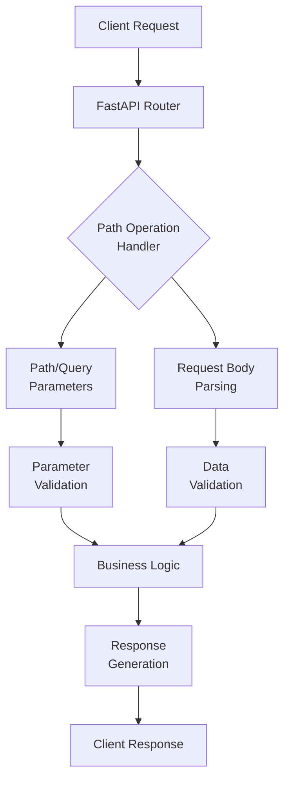

# 1.1 Introduction to FastAPI

# What is FastAPI?

## Definition and Core Concepts

FastAPI is a modern, high-performance web framework for building APIs with Python based on standard Python type hints. It was created by Sebastián Ramírez and first released in 2018. The name "FastAPI" reflects its two main goals: fast development and fast execution.

### Key Characteristics

- **High Performance**: Built on Starlette for the web parts and Pydantic for the data parts, FastAPI is one of the fastest Python frameworks available, on par with NodeJS and Go.
- **Type Hints Focused**: Uses Python 3.6+ type hints to validate, serialize, and document APIs simultaneously.
- **Automatic Docs**: Generates interactive API documentation (using Swagger UI and ReDoc) automatically from your code.
- **Standards-based**: Based on open standards for APIs: OpenAPI (previously known as Swagger) and JSON Schema.
- **Modern Python**: Takes full advantage of modern Python features (3.6+) including async/await syntax.

## How FastAPI Works

FastAPI operates on a simple principle: it uses Python type annotations to:

1. **Define** your data models and API endpoints
2. **Validate** incoming requests against those models
3. **Document** your API automatically
4. **Serialize/deserialize** data

This approach means you write your code once, and FastAPI handles validation, documentation, and serialization for you.



_Note: A diagram would be helpful here showing the request flow in FastAPI. I recommend adding an image that shows how a request moves from client through FastAPI's validation layers to your business logic and back._

## A Simple Example

Here's a basic example of a FastAPI application that demonstrates its core concepts:

```python
from fastapi import FastAPI, Path, Query
from pydantic import BaseModel
from typing import Optional

# Create a FastAPI instance
app = FastAPI()

# Define a Pydantic model for our data
class Item(BaseModel):
    name: str
    description: Optional[str] = None
    price: float
    tax: Optional[float] = None

# Define a GET endpoint with path parameter
@app.get("/items/{item_id}")
async def read_item(
    item_id: int = Path(..., title="The ID of the item to get", ge=1),
    q: Optional[str] = Query(None, max_length=50)
):
    """
    Get an item by its ID.

    - **item_id**: ID of the item (must be greater than or equal to 1)
    - **q**: Optional query parameter
    """
    return {"item_id": item_id, "q": q}

# Define a POST endpoint that accepts an Item
@app.post("/items/")
async def create_item(item: Item):
    """
    Create a new item.

    The request body will be validated against the Item model.
    """
    item_dict = item.dict()
    if item.tax:
        # Calculate price with tax
        price_with_tax = item.price + item.tax
        item_dict.update({"price_with_tax": price_with_tax})
    return item_dict
```

In this example:

- We create a FastAPI instance
- Define a data model using Pydantic
- Create two endpoints (GET and POST) with type annotations
- FastAPI automatically handles validation and documentation

## Advantages of FastAPI

### 1. Developer Experience

- **Reduced Boilerplate**: Less code to write compared to other frameworks
- **Excellent Editor Support**: Type hints provide great autocomplete in modern IDEs
- **Clear Error Messages**: Validation errors are descriptive and helpful

### 2. Performance

- **Extremely Fast**: One of the fastest Python frameworks available
- **Async Support**: Native support for asynchronous code

### 3. Documentation

- **Automatic Interactive Docs**: OpenAPI documentation generated automatically
- **Two Documentation UIs**: Swagger UI and ReDoc available out of the box

### 4. Standards Compliance

- **OpenAPI Specification**: Follows the OpenAPI standard
- **JSON Schema**: Uses JSON Schema for data validation and serialization

## Real-Life Applications

FastAPI is suitable for various applications, including:

1. **Microservices Architecture**: Its lightweight nature and high performance make it ideal for microservices.
2. **Data Science APIs**: Data scientists use FastAPI to expose machine learning models as APIs.
3. **IoT Backends**: The async capabilities make it suitable for handling many concurrent IoT connections.
4. **Mobile App Backends**: The automatic documentation helps mobile developers understand the API.

## Accessing the Automatic Documentation

When you run a FastAPI application, it automatically generates interactive documentation. You can access it at:

- Swagger UI: `http://localhost:8000/docs`
- ReDoc: `http://localhost:8000/redoc`

The documentation is interactive, allowing developers to:

- See all available endpoints
- Understand required parameters and request bodies
- Test endpoints directly from the browser
- View response models and status codes

## Running a FastAPI Application

To run the example above, you would:

1. Save it as `main.py`
2. Install the required packages:

```bash
pip install fastapi uvicorn

```

1. Run the server:

```bash
uvicorn main:app --reload
```

This starts a development server at `http://localhost:8000`

## Conclusion

FastAPI represents a modern approach to API development in Python, combining speed, ease of use, and robust features. Its use of type hints for multiple purposes (validation, serialization, and documentation) makes it particularly efficient for developers, reducing the amount of code needed while improving the quality and reliability of APIs.
