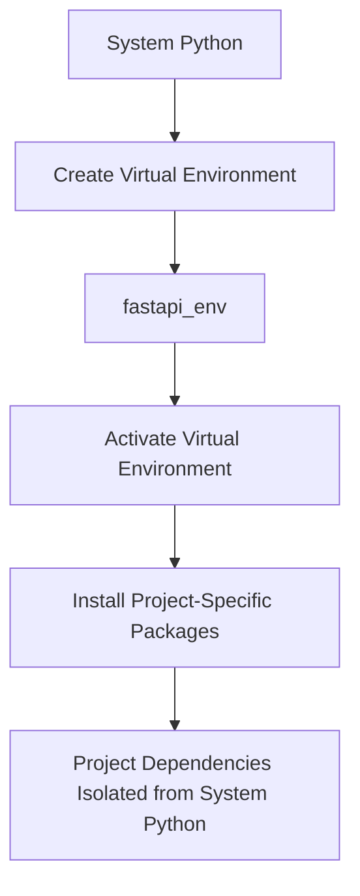

# 1.2 Setting Up Your Environment

## Python Installation and Virtual Environments

### Python Installation

FastAPI requires Python 3.6+ due to its dependency on type hints. The recommended version is Python 3.8+ for optimal performance and feature compatibility.

### Installing Python:

- **Windows**: Download the installer from [python.org](https://www.python.org/downloads/) and check "Add Python to PATH" during installation.
- **macOS**: Use Homebrew: `brew install python` or download from python.org.
- **Linux**: Most distributions come with Python pre-installed. If not: `sudo apt install python3 python3-pip` (Ubuntu/Debian) or `sudo dnf install python3` (Fedora).

### Virtual Environments

Virtual environments create isolated Python environments for projects, preventing package version conflicts between different projects.

### Creating and Activating a Virtual Environment:

```bash
# Create a virtual environment
python -m venv fastapi_env

# Activate the virtual environment
# Windows
fastapi_env\Scripts\activate

# macOS/Linux
source fastapi_env/bin/activate

```

When activated, your terminal prompt should change to show the environment name.



## Installing FastAPI and Uvicorn

Once your virtual environment is activated, install FastAPI and Uvicorn (an ASGI server):

```bash
pip install fastapi uvicorn[standard]

```

- **FastAPI**: The web framework itself
- **Uvicorn**: An ASGI server required to run FastAPI applications
- **[standard]**: Includes additional optional dependencies for better performance

For more specialized requirements:

```bash
# For development (includes debugging tools)
pip install fastapi "uvicorn[standard]" python-multipart python-jose pydantic email-validator

# For production with database support
pip install fastapi "uvicorn[standard]" sqlalchemy

```

## Project Structure Best Practices

A well-organized FastAPI project structure helps with maintainability and scalability.

### Basic Project Structure

```
my_fastapi_app/
│
├── app/                    # Application package
│   ├── __init__.py         # Makes app a package
│   ├── main.py             # FastAPI application creation and configuration
│   ├── models/             # Pydantic models
│   │   ├── __init__.py
│   │   └── user.py         # User-related data models
│   ├── api/                # API endpoints organized by feature
│   │   ├── __init__.py
│   │   ├── routes/         # Route modules for different resources
│   │   │   ├── __init__.py
│   │   │   ├── users.py    # User-related endpoints
│   │   │   └── items.py    # Item-related endpoints
│   │   └── dependencies.py # Shared dependencies for routes
│   ├── core/               # Core application code
│   │   ├── __init__.py
│   │   ├── config.py       # Configuration handling
│   │   └── security.py     # Security utilities
│   └── services/           # Business logic
│       ├── __init__.py
│       └── user_service.py # User-related business logic
│
├── tests/                  # Test package
│   ├── __init__.py
│   ├── test_main.py        # Test main application
│   ├── test_users.py       # Test user endpoints
│   └── test_items.py       # Test item endpoints
│
├── .env                    # Environment variables (not in version control)
├── .gitignore              # Git ignore file
├── requirements.txt        # Project dependencies
└── README.md               # Project documentation

```

### Larger Project Structure

For larger applications, consider organizing by feature rather than technical role:

```
my_fastapi_app/
│
├── app/
│   ├── __init__.py
│   ├── main.py             # FastAPI app initialization
│   ├── core/               # Core modules (config, security, etc.)
│   ├── features/           # Feature modules
│   │   ├── __init__.py
│   │   ├── users/          # Everything related to users
│   │   │   ├── __init__.py
│   │   │   ├── models.py   # User models
│   │   │   ├── routes.py   # User routes
│   │   │   └── service.py  # User business logic
│   │   └── items/          # Everything related to items
│   │       ├── __init__.py
│   │       ├── models.py   # Item models
│   │       ├── routes.py   # Item routes
│   │       └── service.py  # Item business logic
│   └── db/                 # Database connection and configuration
│       ├── __init__.py
│       ├── base.py         # Base database setup
│       └── models.py       # SQLAlchemy models
│
├── tests/                  # Tests organized by feature
└── [other files as above]

```

## Setting Up Your First FastAPI Project

Let's walk through setting up a new FastAPI project from scratch:

### Step 1: Create the project directory and virtual environment

```bash
mkdir my_fastapi_app
cd my_fastapi_app
python -m venv venv
source venv/bin/activate  # On Windows: venv\Scripts\activate

```

### Step 2: Install dependencies

```bash
pip install fastapi uvicorn[standard]
pip freeze > requirements.txt  # Save dependencies to requirements.txt

```

### Step 3: Create basic project structure

```bash
mkdir -p app/api/routes app/models app/core app/services tests
touch app/__init__.py app/api/__init__.py app/api/routes/__init__.py app/models/__init__.py app/core/__init__.py app/services/__init__.py
touch app/main.py
touch tests/__init__.py
touch README.md .gitignore

```

### Step 4: Create main application file (app/main.py)

```python
from fastapi import FastAPI

app = FastAPI(
    title="My FastAPI Application",
    description="A sample FastAPI application",
    version="0.1.0",
)

@app.get("/")
async def root():
    return {"message": "Hello, FastAPI!"}

if __name__ == "__main__":
    import uvicorn
    uvicorn.run("app.main:app", host="0.0.0.0", port=8000, reload=True)

```

### Step 5: Run the application

```bash
uvicorn app.main:app --reload

```

The `--reload` flag enables auto-reloading when code changes, which is helpful during development.

## Development Tools and IDE Setup

### IDE Recommendations

- **Visual Studio Code**: Great Python and FastAPI support with extensions.
  - Extensions: Python, Pylance, autoDocstring
- **PyCharm**: Excellent Python IDE with great type hint support.
- **Vim/Neovim**: With plugins like CoC or Jedi for code completion.

### VS Code Setup for FastAPI

1. Install VS Code extensions:
   - Python
   - Pylance (for enhanced type checking)
   - autoDocstring
   - REST Client (for testing API endpoints)
2. Create `.vscode/settings.json`:

```json
{
  "python.linting.enabled": true,
  "python.linting.pylintEnabled": true,
  "python.formatting.provider": "black",
  "editor.formatOnSave": true,
  "python.analysis.typeCheckingMode": "basic"
}
```

1. Set up Python path:
   - Press `Ctrl+Shift+P` (or `Cmd+Shift+P` on macOS)
   - Select "Python: Select Interpreter"
   - Choose your virtual environment Python

## Summary

Setting up a FastAPI environment involves:

1. Installing Python 3.6+ and setting up a virtual environment
2. Installing FastAPI and Uvicorn
3. Creating a well-organized project structure
4. Creating a basic FastAPI application
5. Running the application with Uvicorn
6. Setting up development tools and IDE

By following these practices, you'll have a solid foundation for developing FastAPI applications that are maintainable and scalable.
