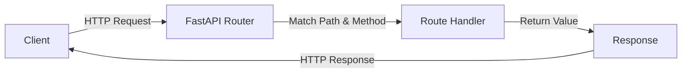
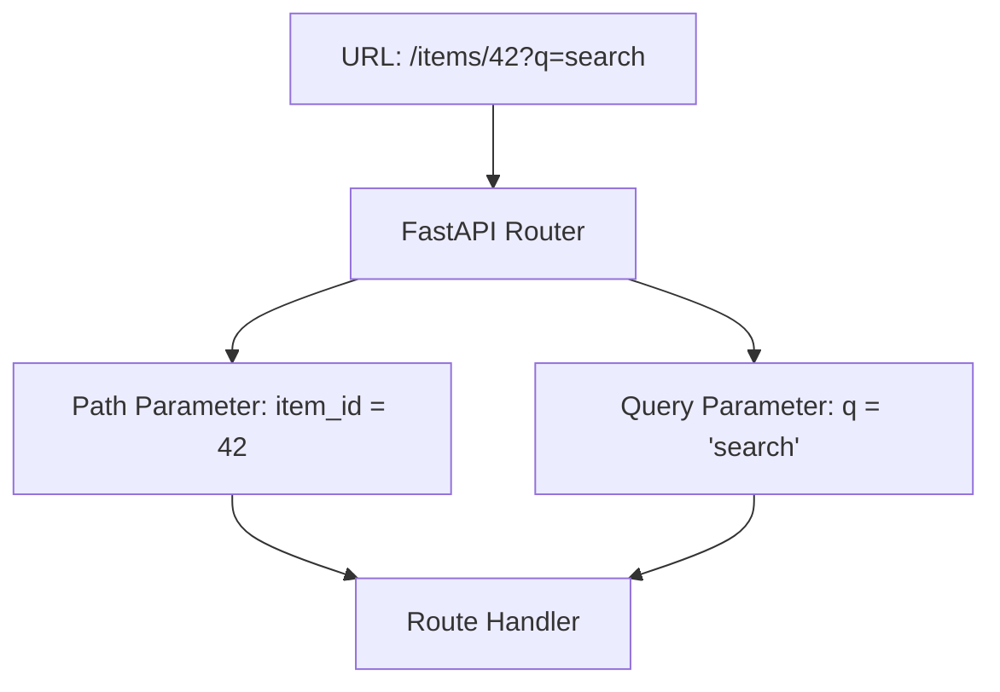

# 1.3 Creating Your First API

## Basic Route Definitions

In FastAPI, a route is a path to an endpoint that responds to HTTP requests. Routes are defined using decorators that specify the HTTP method and path.

### Basic Route Structure

```python
from fastapi import FastAPI

app = FastAPI()

@app.get("/")  # HTTP method decorator with path
def root():    # Route handler function
    return {"message": "Hello World"}  # Return value (automatically converted to JSON)

```

The decorator `@app.get("/")` specifies:

- HTTP method: GET
- Path: / (root path)

FastAPI supports all standard HTTP methods with corresponding decorators:

- `@app.get()`
- `@app.post()`
- `@app.put()`
- `@app.delete()`
- `@app.patch()`
- `@app.options()`
- `@app.head()`



## Path Operations (GET, POST, PUT, DELETE)

Each HTTP method serves a different purpose in RESTful API design:

### GET: Retrieve Data

```python
@app.get("/items")
def read_items():
    return [{"name": "Item 1"}, {"name": "Item 2"}]

@app.get("/items/{item_id}")
def read_item(item_id: int):
    return {"item_id": item_id, "name": f"Item {item_id}"}

```

### POST: Create Data

```python
from pydantic import BaseModel

class Item(BaseModel):
    name: str
    description: str = None
    price: float
    tax: float = None

@app.post("/items/")
def create_item(item: Item):
    return {"item_name": item.name, "price_with_tax": item.price + (item.tax or 0)}

```

### PUT: Update Data

```python
@app.put("/items/{item_id}")
def update_item(item_id: int, item: Item):
    return {"item_id": item_id, "item": item}

```

### DELETE: Remove Data

```python
@app.delete("/items/{item_id}")
def delete_item(item_id: int):
    return {"deleted": item_id}

```

A complete CRUD (Create, Read, Update, Delete) example for an item resource:

```python
from fastapi import FastAPI, HTTPException
from pydantic import BaseModel
from typing import List, Optional, Dict

app = FastAPI()

# In-memory database (for demonstration)
items_db: Dict[int, dict] = {}

class Item(BaseModel):
    name: str
    description: Optional[str] = None
    price: float

# Create
@app.post("/items/", response_model=Item)
def create_item(item: Item):
    item_id = len(items_db) + 1
    items_db[item_id] = item.dict()
    return {**item.dict(), "id": item_id}

# Read (all)
@app.get("/items/", response_model=List[Item])
def read_items():
    return [{"id": k, **v} for k, v in items_db.items()]

# Read (single)
@app.get("/items/{item_id}", response_model=Item)
def read_item(item_id: int):
    if item_id not in items_db:
        raise HTTPException(status_code=404, detail="Item not found")
    return {"id": item_id, **items_db[item_id]}

# Update
@app.put("/items/{item_id}", response_model=Item)
def update_item(item_id: int, item: Item):
    if item_id not in items_db:
        raise HTTPException(status_code=404, detail="Item not found")
    items_db[item_id] = item.dict()
    return {"id": item_id, **items_db[item_id]}

# Delete
@app.delete("/items/{item_id}")
def delete_item(item_id: int):
    if item_id not in items_db:
        raise HTTPException(status_code=404, detail="Item not found")
    del items_db[item_id]
    return {"message": "Item deleted successfully"}

```

## Path Parameters and Query Parameters

### Path Parameters

Path parameters are variable parts of the URL path. They're defined with curly braces `{}` in the path.

```python
@app.get("/items/{item_id}")
def read_item(item_id: int):
    return {"item_id": item_id}

```

FastAPI automatically validates and converts path parameters to the specified type. If `item_id` can't be converted to an integer, FastAPI returns a validation error.

### Query Parameters

Query parameters are optional parameters appended to the URL after a question mark (`?`).

```python
from typing import Optional

@app.get("/items/")
def read_items(skip: int = 0, limit: int = 10, q: Optional[str] = None):
    # skip and limit are common pagination parameters
    # q is an optional search query
    return {"skip": skip, "limit": limit, "q": q}

```

In this example:

- `/items/?skip=20&limit=30` - Both skip and limit are provided
- `/items/?q=searchterm` - Only q is provided, skip and limit use default values
- `/items/` - All parameters use their default values



## Request Bodies and Response Models

### Request Bodies

FastAPI automatically parses and validates request bodies using Pydantic models.

```python
from fastapi import FastAPI
from pydantic import BaseModel

app = FastAPI()

class Item(BaseModel):
    name: str
    description: Optional[str] = None
    price: float
    tax: Optional[float] = None

@app.post("/items/")
def create_item(item: Item):
    # item is automatically parsed from the request body
    # and validated against the Item model
    return item

```

### Response Models

The `response_model` parameter defines the model used to validate and filter the output data.

```python
from fastapi import FastAPI
from pydantic import BaseModel
from typing import List, Optional

app = FastAPI()

class ItemBase(BaseModel):
    name: str
    description: Optional[str] = None
    price: float
    tax: Optional[float] = None

class ItemCreate(ItemBase):
    # Input model - used for creating items
    pass

class Item(ItemBase):
    # Output model - used for returning items
    id: int

    class Config:
        # This tells Pydantic to convert models to JSON-compatible types
        orm_mode = True

@app.post("/items/", response_model=Item)
def create_item(item: ItemCreate):
    # In a real app, you'd save the item to the database
    # and get back the created item with its ID
    return {"id": 1, **item.dict()}

@app.get("/items/", response_model=List[Item])
def read_items():
    # Return a list of items
    return [
        {"id": 1, "name": "Item 1", "price": 50.2},
        {"id": 2, "name": "Item 2", "price": 30.0, "description": "A nice item"}
    ]

```

Benefits of using response models:

1. Data validation
2. Filtering out extra data
3. Converting to the expected type
4. Creating automatic API documentation

## Status Codes and Response Types

### Status Codes

HTTP status codes indicate the result of the request. FastAPI defaults to:

- 200: Successful GET, PUT, PATCH, DELETE
- 201: Successful POST (creation)
- 204: Successful request with no content to return

You can customize status codes:

```python
from fastapi import FastAPI, status

app = FastAPI()

@app.post("/items/", status_code=status.HTTP_201_CREATED)
def create_item(name: str):
    return {"name": name}

@app.delete("/items/{item_id}", status_code=status.HTTP_204_NO_CONTENT)
def delete_item(item_id: int):
    # Delete item logic here
    return None  # Return None for 204 responses

```

### Response Types

FastAPI supports various response types:

### JSONResponse (default)

```python
from fastapi import FastAPI
from fastapi.responses import JSONResponse

app = FastAPI()

@app.get("/items/")
def read_items():
    return JSONResponse(
        content={"message": "Hello World"},
        status_code=200,
    )

```

### PlainTextResponse

```python
from fastapi.responses import PlainTextResponse

@app.get("/", response_class=PlainTextResponse)
def read_root():
    return "Hello World"

```

### HTMLResponse

```python
from fastapi.responses import HTMLResponse

@app.get("/html", response_class=HTMLResponse)
def read_html():
    return """
    <html>
        <head>
            <title>FastAPI HTML Response</title>
        </head>
        <body>
            <h1>Hello World!</h1>
        </body>
    </html>
    """

```

### FileResponse

```python
from fastapi.responses import FileResponse

@app.get("/download-file")
def download_file():
    return FileResponse(
        path="./files/example.pdf",
        filename="example.pdf",
        media_type="application/pdf"
    )

```

### StreamingResponse

```python
from fastapi.responses import StreamingResponse
import io

def generate_csv():
    # Generator function that yields chunks of data
    yield "id,name,price\n"
    for i in range(1000):
        yield f"{i},item {i},{i*10.5}\n"

@app.get("/csv")
def download_csv():
    return StreamingResponse(
        generate_csv(),
        media_type="text/csv",
        headers={"Content-Disposition": "attachment; filename=items.csv"}
    )

```

## Complete Example: A Simple CRUD API

Let's build a simple but complete API for managing a to-do list:

```python
from fastapi import FastAPI, HTTPException, status
from pydantic import BaseModel
from typing import List, Optional
from datetime import datetime

app = FastAPI(
    title="Todo API",
    description="A simple API for managing todo items",
    version="0.1.0"
)

# In-memory database
todos = {}
todo_id_counter = 1

class TodoBase(BaseModel):
    title: str
    description: Optional[str] = None
    due_date: Optional[datetime] = None

class TodoCreate(TodoBase):
    pass

class Todo(TodoBase):
    id: int
    created_at: datetime
    completed: bool = False

    class Config:
        orm_mode = True

@app.post("/todos/", response_model=Todo, status_code=status.HTTP_201_CREATED)
def create_todo(todo: TodoCreate):
    """Create a new todo item"""
    global todo_id_counter

    new_todo = Todo(
        id=todo_id_counter,
        created_at=datetime.now(),
        **todo.dict()
    )

    todos[todo_id_counter] = new_todo
    todo_id_counter += 1

    return new_todo

@app.get("/todos/", response_model=List[Todo])
def read_todos(skip: int = 0, limit: int = 100, completed: Optional[bool] = None):
    """Get all todo items with optional filtering"""
    filtered_todos = list(todos.values())

    # Filter by completion status if specified
    if completed is not None:
        filtered_todos = [todo for todo in filtered_todos if todo.completed == completed]

    # Apply pagination
    return filtered_todos[skip : skip + limit]

@app.get("/todos/{todo_id}", response_model=Todo)
def read_todo(todo_id: int):
    """Get a specific todo item by ID"""
    if todo_id not in todos:
        raise HTTPException(
            status_code=status.HTTP_404_NOT_FOUND,
            detail=f"Todo with ID {todo_id} not found"
        )

    return todos[todo_id]

@app.put("/todos/{todo_id}", response_model=Todo)
def update_todo(todo_id: int, todo: TodoBase):
    """Update a todo item"""
    if todo_id not in todos:
        raise HTTPException(
            status_code=status.HTTP_404_NOT_FOUND,
            detail=f"Todo with ID {todo_id} not found"
        )

    # Preserve id, created_at, and completed status
    updated_todo = todos[todo_id]
    update_data = todo.dict(exclude_unset=True)

    for key, value in update_data.items():
        setattr(updated_todo, key, value)

    todos[todo_id] = updated_todo
    return updated_todo

@app.patch("/todos/{todo_id}/complete", response_model=Todo)
def complete_todo(todo_id: int, completed: bool = True):
    """Mark a todo as completed or not completed"""
    if todo_id not in todos:
        raise HTTPException(
            status_code=status.HTTP_404_NOT_FOUND,
            detail=f"Todo with ID {todo_id} not found"
        )

    todos[todo_id].completed = completed
    return todos[todo_id]

@app.delete("/todos/{todo_id}", status_code=status.HTTP_204_NO_CONTENT)
def delete_todo(todo_id: int):
    """Delete a todo item"""
    if todo_id not in todos:
        raise HTTPException(
            status_code=status.HTTP_404_NOT_FOUND,
            detail=f"Todo with ID {todo_id} not found"
        )

    del todos[todo_id]
    return None

```

To run this API:

```bash
# Save the code as main.py
uvicorn main:app --reload

```

Visit http://localhost:8000/docs to see the automatically generated interactive documentation.

## Summary

Creating your first API with FastAPI involves:

1. Defining routes with path operation decorators
2. Using path parameters for data in the URL path
3. Using query parameters for optional filters
4. Using Pydantic models for request bodies
5. Setting response models for output validation
6. Setting appropriate status codes
7. Using different response types when needed

The combination of these features allows you to create robust, well-documented APIs with minimal code.
