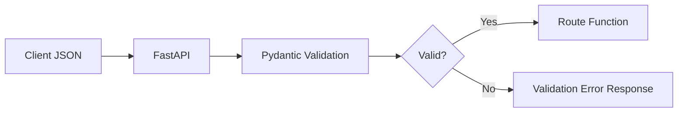

# 1.4 Understanding Pydantic

## Introduction to Pydantic Models

Pydantic is a data validation and settings management library using Python type annotations. FastAPI leverages Pydantic extensively for:

1. Request validation
2. Response serialization
3. Configuration management
4. Data modeling

### Basic Pydantic Model

A basic Pydantic model is a class that inherits from `BaseModel`:

```python
from pydantic import BaseModel
from typing import Optional

class User(BaseModel):
    id: int
    name: str
    email: str
    is_active: bool = True  # Default value
    age: Optional[int] = None  # Optional field with default None

```

Key aspects:

- Type annotations define the data structure
- Default values are supported using `=`
- Optional fields use Python's `Optional` from the typing module

### How FastAPI Uses Pydantic

```python
from fastapi import FastAPI
from pydantic import BaseModel
from typing import Optional

app = FastAPI()

class User(BaseModel):
    name: str
    email: str
    age: Optional[int] = None

@app.post("/users/")
def create_user(user: User):
    # FastAPI automatically:
    # 1. Reads the request body as JSON
    # 2. Validates it against the User model
    # 3. Reports any validation errors to the client
    # 4. Provides the parsed and validated User object
    return {"name": user.name, "email": user.email, "age": user.age}

```



## Data Validation with Pydantic

Pydantic doesn't just check types; it also validates data based on constraints:

### Field Constraints

```python
from pydantic import BaseModel, Field, EmailStr

class User(BaseModel):
    name: str = Field(..., min_length=2, max_length=50)
    email: EmailStr  # Validates email format
    age: int = Field(..., ge=18, le=120)  # Between 18 and 120
    password: str = Field(..., min_length=8)

```

The `...` in `Field(...)` indicates that the field is required.

### Validators

Custom validators allow complex validation rules:

```python
from pydantic import BaseModel, Field, validator
from typing import List

class Item(BaseModel):
    name: str
    price: float = Field(..., gt=0)
    tags: List[str] = []

    @validator('name')
    def name_must_be_capitalized(cls, v):
        if not v[0].isupper():
            raise ValueError('Name must be capitalized')
        return v

    @validator('tags', each_item=True)
    def tags_must_be_lowercase(cls, v):
        if not v.islower():
            raise ValueError('Tags must be lowercase')
        return v

```

### Root Validators

For validations that involve multiple fields:

```python
from pydantic import BaseModel, root_validator

class OrderItem(BaseModel):
    item_id: int
    quantity: int
    price_per_unit: float
    discount: float = 0

    @root_validator
    def check_discount_and_calculate_total(cls, values):
        quantity = values.get('quantity', 0)
        price = values.get('price_per_unit', 0)
        discount = values.get('discount', 0)

        if discount < 0 or discount > 1:
            raise ValueError('Discount must be between 0 and 1')

        # Add calculated field
        values['total_price'] = quantity * price * (1 - discount)

        return values

```

## Creating Complex Pydantic Models

### Nested Models

Models can include other models as fields:

```python
from pydantic import BaseModel
from typing import List, Optional
from datetime import datetime

class Address(BaseModel):
    street: str
    city: str
    country: str
    postal_code: str

class User(BaseModel):
    id: int
    name: str
    addresses: List[Address]  # A list of Address models
    created_at: datetime

```

### Inheritance

Models can inherit from other models:

```python
from pydantic import BaseModel
from typing import Optional

class PersonBase(BaseModel):
    name: str
    age: int

class Student(PersonBase):
    school: str
    grade: float

class Teacher(PersonBase):
    school: str
    subject: str
    salary: float

```

### Generic Models

For reusable model patterns:

```python
from pydantic import BaseModel, Field
from typing import Generic, TypeVar, Optional, List

# Define type variables
T = TypeVar('T')

class PaginatedResponse(BaseModel, Generic[T]):
    items: List[T]
    total: int
    page: int
    size: int
    next_page: Optional[int] = None
    prev_page: Optional[int] = None

# Usage with a specific model
class User(BaseModel):
    id: int
    name: str

# Create a paginated response of users
user_response = PaginatedResponse[User](
    items=[User(id=1, name="Alice"), User(id=2, name="Bob")],
    total=10,
    page=1,
    size=2,
    next_page=2
)

```

## Field Types and Validation

Pydantic supports various field types and validations:

### Basic Types

```python
from pydantic import BaseModel
from typing import List, Dict, Set, Tuple, Union, Optional

class ExampleModel(BaseModel):
    # Basic types
    string_field: str
    int_field: int
    float_field: float
    bool_field: bool

    # Collection types
    list_field: List[str]
    dict_field: Dict[str, int]
    set_field: Set[int]
    tuple_field: Tuple[str, int, float]

    # Union and Optional
    union_field: Union[str, int]  # Either str or int
    optional_field: Optional[str]  # Same as Union[str, None]

```

### Special Types

Pydantic provides specialized types for common validation scenarios:

```python
from pydantic import (
    BaseModel,
    EmailStr,  # Email validation
    HttpUrl,   # URL validation
    constr,    # Constrained string
    conint,    # Constrained integer
    confloat,  # Constrained float
    SecretStr  # For sensitive data (not shown in repr)
)
from datetime import datetime, date, time
from uuid import UUID

class AdvancedModel(BaseModel):
    # String constraints
    email: EmailStr
    website: HttpUrl
    username: constr(min_length=3, max_length=50, regex=r'^[a-zA-Z0-9_]+$')
    password: SecretStr

    # Number constraints
    age: conint(ge=18, lt=120)  # Greater or equal to 18, less than 120
    score: confloat(ge=0, le=100.0)  # Between 0 and 100

    # Date and time
    created_at: datetime
    birth_date: date
    reminder_time: time

    # Identifiers
    id: UUID

```

## Config Classes and Model Behaviors

The `Config` inner class controls model behavior:

```python
from pydantic import BaseModel
from typing import Optional

class User(BaseModel):
    id: int
    name: str
    email: str
    password: str
    age: Optional[int] = None

    class Config:
        # Extra attributes behavior:
        # - ignore: ignore extra attributes (default)
        # - forbid: raise an error if extra attributes provided
        # - allow: include extra attributes in the model
        extra = "forbid"

        # Allow field population by alias
        allow_population_by_field_name = True

        # Include in serialization only non-None values
        exclude_none = True

        # Make the model immutable
        frozen = False

        # Validate field assignments
        validate_assignment = True

        # Convert camelCase to snake_case
        alias_generator = lambda string: ''.join(
            '_' + char.lower() if char.isupper() else char
            for char in string
        ).lstrip('_')

        # Fields to include/exclude in the serialized output
        # fields = {'id': {'exclude': True}}  # Exclude id field

        # Schema configuration
        schema_extra = {
            "example": {
                "id": 1,
                "name": "John Doe",
                "email": "john@example.com",
                "password": "secretpassword",
                "age": 30
            }

```

## Schema Generation and JSON Serialization

Pydantic models automatically generate JSON Schema and provide serialization methods:

### Schema Generation

```python
from pydantic import BaseModel
from typing import List, Optional

class Item(BaseModel):
    id: int
    name: str
    description: Optional[str] = None
    tags: List[str] = []

# Get JSON Schema
schema = Item.schema()
print(schema)
# {
#   'title': 'Item',
#   'type': 'object',
#   'properties': {
#     'id': {'title': 'Id', 'type': 'integer'},
#     'name': {'title': 'Name', 'type': 'string'},
#     'description': {'title': 'Description', 'type': 'string'},
#     'tags': {'title': 'Tags', 'type': 'array', 'items': {'type': 'string'}, 'default': []}
#   },
#   'required': ['id', 'name']
# }

```

### JSON Serialization

```python
from pydantic import BaseModel
from datetime import datetime

class User(BaseModel):
    id: int
    name: str
    created_at: datetime

user = User(id=1, name="John", created_at=datetime.now())

# Convert to dict
user_dict = user.dict()

# Convert to JSON string
user_json = user.json()

# Include/exclude specific fields
user_partial = user.dict(include={"id", "name"})  # Only id and name
user_filtered = user.dict(exclude={"created_at"})  # All except created_at

# Custom encoders
user_custom = user.dict(
    exclude_none=True,  # Skip None values
    by_alias=True,      # Use field aliases
)

```

## Practical Examples with FastAPI

### Example 1: User Registration API

```python
from fastapi import FastAPI, HTTPException
from pydantic import BaseModel, EmailStr, Field, validator
from typing import Optional
import re

app = FastAPI()

class UserCreate(BaseModel):
    username: str = Field(..., min_length=3, max_length=50)
    email: EmailStr
    password: str = Field(..., min_length=8)
    confirm_password: str
    full_name: Optional[str] = None

    @validator('username')
    def username_alphanumeric(cls, v):
        if not re.match(r'^[a-zA-Z0-9_]+}', v):
            raise ValueError('Username must be alphanumeric')
        return v

    @validator('confirm_password')
    def passwords_match(cls, v, values, **kwargs):
        if 'password' in values and v != values['password']:
            raise ValueError('Passwords do not match')
        return v

    class Config:
        schema_extra = {
            "example": {
                "username": "johndoe",
                "email": "john@example.com",
                "password": "strongpassword",
                "confirm_password": "strongpassword",
                "full_name": "John Doe"
            }
        }

class UserResponse(BaseModel):
    id: int
    username: str
    email: str
    full_name: Optional[str] = None

@app.post("/users/", response_model=UserResponse)
def create_user(user: UserCreate):
    # In a real app, you would store the user in a database
    # and hash the password

    # Return the created user (without password fields)
    return {
        "id": 1,
        "username": user.username,
        "email": user.email,
        "full_name": user.full_name
    }

```

### Example 2: Hierarchical Data Model

```python
from fastapi import FastAPI
from pydantic import BaseModel, HttpUrl
from typing import List, Optional
from datetime import datetime

app = FastAPI()

class Image(BaseModel):
    url: HttpUrl
    name: str

class Tag(BaseModel):
    id: int
    name: str

class Category(BaseModel):
    id: int
    name: str
    description: Optional[str] = None

class Product(BaseModel):
    id: int
    name: str
    description: Optional[str] = None
    price: float
    tax: Optional[float] = None
    tags: List[Tag] = []
    category: Category
    images: List[Image] = []
    created_at: datetime
    updated_at: Optional[datetime] = None

    class Config:
        orm_mode = True  # Enables reading data from ORM objects

@app.get("/products/{product_id}", response_model=Product)
def get_product(product_id: int):
    # In a real app, get from database
    return {
        "id": product_id,
        "name": "Smartphone",
        "description": "Latest model with great features",
        "price": 699.99,
        "tax": 69.99,
        "tags": [
            {"id": 1, "name": "electronics"},
            {"id": 2, "name": "gadgets"}
        ],
        "category": {
            "id": 1,
            "name": "Electronics",
            "description": "Electronic devices and gadgets"
        },
        "images": [
            {
                "url": "https://example.com/img1.jpg",
                "name": "Front view"
            },
            {
                "url": "https://example.com/img2.jpg",
                "name": "Side view"
            }
        ],
        "created_at": datetime.now(),
        "updated_at": None
    }

```

### Example 3: Data Transformation

```python
from fastapi import FastAPI
from pydantic import BaseModel, validator
from typing import List, Dict, Any
from datetime import date

app = FastAPI()

class SensorReading(BaseModel):
    device_id: str
    temperature: float
    humidity: float
    timestamp: int  # Unix timestamp

    @validator('temperature')
    def convert_celsius_to_fahrenheit(cls, v):
        # Convert Celsius to Fahrenheit
        return v * 9/5 + 32

    def to_normalized_dict(self) -> Dict[str, Any]:
        """Convert to a normalized format with readable timestamp"""
        data = self.dict()
        # Convert Unix timestamp to ISO format
        data['readable_time'] = date.fromtimestamp(data['timestamp']).isoformat()
        return data

@app.post("/readings/")
def process_reading(reading: SensorReading):
    # Process and return normalized data
    return reading.to_normalized_dict()

```

## Integration with Databases

Pydantic's `orm_mode` allows seamless integration with ORMs like SQLAlchemy:

```python
from sqlalchemy import Column, Integer, String, create_engine
from sqlalchemy.ext.declarative import declarative_base
from sqlalchemy.orm import sessionmaker
from pydantic import BaseModel
from fastapi import FastAPI, Depends, HTTPException
from typing import List

# SQLAlchemy setup
SQLALCHEMY_DATABASE_URL = "sqlite:///./test.db"
engine = create_engine(SQLALCHEMY_DATABASE_URL)
SessionLocal = sessionmaker(autocommit=False, autoflush=False, bind=engine)
Base = declarative_base()

# SQLAlchemy model
class UserDB(Base):
    __tablename__ = "users"

    id = Column(Integer, primary_key=True, index=True)
    email = Column(String, unique=True, index=True)
    name = Column(String)
    hashed_password = Column(String)

# Create tables
Base.metadata.create_all(bind=engine)

# Pydantic models
class UserBase(BaseModel):
    email: str
    name: str

class UserCreate(UserBase):
    password: str

class User(UserBase):
    id: int

    class Config:
        orm_mode = True  # This enables reading data from ORM objects

# FastAPI app
app = FastAPI()

# Dependency to get DB session
def get_db():
    db = SessionLocal()
    try:
        yield db
    finally:
        db.close()

@app.post("/users/", response_model=User)
def create_user(user: UserCreate, db = Depends(get_db)):
    # Check if email exists
    db_user = db.query(UserDB).filter(UserDB.email == user.email).first()
    if db_user:
        raise HTTPException(status_code=400, detail="Email already registered")

    # In a real app, hash the password
    hashed_password = user.password + "_hashed"  # NEVER DO THIS IN PRODUCTION

    # Create DB model instance
    db_user = UserDB(
        email=user.email,
        name=user.name,
        hashed_password=hashed_password
    )

    # Save to database
    db.add(db_user)
    db.commit()
    db.refresh(db_user)

    # Return Pydantic model (ORM mode converts from DB model)
    return db_user

@app.get("/users/", response_model=List[User])
def read_users(skip: int = 0, limit: int = 100, db = Depends(get_db)):
    users = db.query(UserDB).offset(skip).limit(limit).all()
    return users

```

## Summary

Pydantic is a powerful library for data validation and serialization that FastAPI uses extensively. Key points to remember:

1. **Type Definition**: Use Python type annotations to define data structures
2. **Validation**: Automatic validation with clear error messages
3. **Field Constraints**: Add constraints like min_length, regex, etc.
4. **Custom Validators**: Add custom validation logic with validators
5. **Model Composition**: Create complex models using nesting and inheritance
6. **Config Options**: Customize model behavior with Config class
7. **Serialization**: Easy conversion to and from Python dictionaries and JSON
8. **ORM Integration**: Bridge between database models and API models

Understanding Pydantic is crucial for FastAPI development as it forms the foundation for request/response handling, validation, and documentation.
