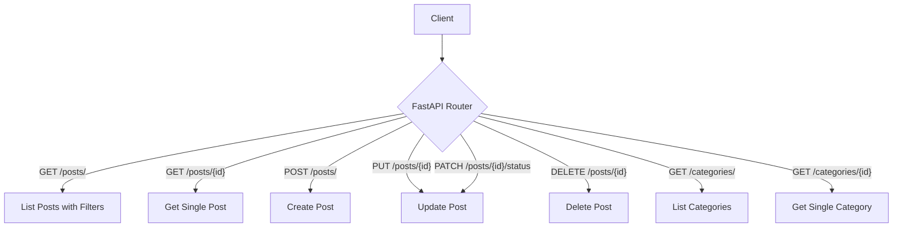

# 2.1 Advanced Routing

## Path Operation Advanced Features

FastAPI provides several advanced features for route definitions beyond the basic path operations.

### Multiple Path Decorators

You can apply multiple path operation decorators to a single function:

```python
from fastapi import FastAPI

app = FastAPI()

@app.get("/items/")
@app.get("/items/all")
def read_items():
    return {"items": ["Item1", "Item2"]}

```

This allows multiple paths to trigger the same function. Requests to both `/items/` and `/items/all` will call the `read_items` function.

### Custom Operation IDs

For OpenAPI documentation, you can set custom operation IDs:

```python
from fastapi import FastAPI

app = FastAPI()

@app.get("/items/", operation_id="get_all_items")
def read_items():
    return {"items": ["Item1", "Item2"]}

```

### Response Description and Examples

You can enhance documentation with detailed response descriptions and examples:

```python
from fastapi import FastAPI
from pydantic import BaseModel

app = FastAPI()

class Item(BaseModel):
    id: int
    name: str
    description: str = None

@app.get(
    "/items/{item_id}",
    response_description="Successful response returns the item details",
    responses={
        200: {
            "description": "Successfully retrieved item",
            "content": {
                "application/json": {
                    "example": {"id": 1, "name": "Sample Item", "description": "A sample item for example"}
                }
            }
        },
        404: {
            "description": "Item not found",
            "content": {
                "application/json": {
                    "example": {"detail": "Item not found"}
                }
            }
        }
    }
)
def read_item(item_id: int):
    # Your code here
    return {"id": item_id, "name": "Sample Item", "description": "A sample item"}

```

### Tags and Summary/Description

Organize your API with tags and add summaries and descriptions:

```python
from fastapi import FastAPI

app = FastAPI()

@app.get(
    "/users/",
    tags=["users"],
    summary="Get all users",
    description="Retrieve a list of all registered users with pagination support."
)
def read_users(skip: int = 0, limit: int = 100):
    # Your code here
    return {"users": []}

@app.post(
    "/users/",
    tags=["users"],
    summary="Create a new user",
    description="""
    Create a new user with the provided information.

    The following fields are required:
    - **email**: A valid, unique email address
    - **password**: A strong password (minimum 8 characters)
    """
)
def create_user():
    # Your code here
    return {"result": "User created"}

```

### Deprecating Operations

Mark operations as deprecated when they're being phased out:

```python
from fastapi import FastAPI

app = FastAPI()

@app.get("/users/", deprecated=True)
def read_users_deprecated():
    return {"message": "This route is deprecated, use /users/list instead"}

@app.get("/users/list")
def read_users():
    return {"users": ["User1", "User2"]}

```

## Path Parameters with Type Validation

FastAPI provides powerful path parameter validation using Python's type hints and Pydantic models.

### Built-in Type Validation

```python
from fastapi import FastAPI, Path
from enum import Enum

app = FastAPI()

class ModelName(str, Enum):
    alexnet = "alexnet"
    resnet = "resnet"
    lenet = "lenet"

@app.get("/items/{item_id}")
def read_item(item_id: int):
    # item_id is automatically converted to an integer
    # If the conversion fails, FastAPI returns a validation error
    return {"item_id": item_id}

@app.get("/models/{model_name}")
def get_model(model_name: ModelName):
    # model_name is validated against the ModelName enum
    if model_name == ModelName.alexnet:
        return {"model_name": model_name, "message": "Deep Learning FTW!"}

    if model_name.value == "lenet":
        return {"model_name": model_name, "message": "LeCNN all the images"}

    return {"model_name": model_name, "message": "Have some residuals"}

```

### Path Parameter Validation with Path

Use the `Path` class for more advanced validation:

```python
from fastapi import FastAPI, Path

app = FastAPI()

@app.get("/items/{item_id}")
def read_item(
    item_id: int = Path(
        ...,  # ... means the parameter is required
        title="The ID of the item to get",
        description="This is a unique identifier for the item",
        ge=1,  # greater than or equal to 1
        le=1000,  # less than or equal to 1000
    )
):
    return {"item_id": item_id}

```

Additional validators include:

- `gt`: greater than
- `lt`: less than
- `ge`: greater than or equal to
- `le`: less than or equal to

### UUID Path Parameters

For unique identifiers, you can use UUID format:

```python
from fastapi import FastAPI
from uuid import UUID

app = FastAPI()

@app.get("/items/{item_id}")
def read_item(item_id: UUID):
    # item_id will be converted to a UUID object
    return {"item_id": str(item_id)}

```

### Date and DateTime Path Parameters

Parse dates and times automatically:

```python
from fastapi import FastAPI
from datetime import date, datetime

app = FastAPI()

@app.get("/items/{item_date}")
def read_item_by_date(item_date: date):
    # item_date will be converted to a date object
    return {"item_date": item_date, "day_of_week": item_date.weekday()}

@app.get("/events/{event_time}")
def read_event_by_time(event_time: datetime):
    # event_time will be converted to a datetime object
    return {"event_time": event_time, "hour": event_time.hour}

```

## Query Parameters with Validations

Query parameters can also be validated and documented:

### Basic Query Parameters

```python
from fastapi import FastAPI, Query
from typing import Optional, List

app = FastAPI()

@app.get("/items/")
def read_items(
    skip: int = 0,
    limit: int = 10,
    q: Optional[str] = None
):
    return {"skip": skip, "limit": limit, "q": q}

```

### Query Parameter Validation

```python
from fastapi import FastAPI, Query
from typing import Optional, List

app = FastAPI()

@app.get("/items/")
def read_items(
    q: Optional[str] = Query(
        None,
        min_length=3,
        max_length=50,
        regex="^[a-zA-Z0-9_-]+$",
        title="Query string",
        description="Query string for searching items"
    )
):
    results = {"items": []}
    if q:
        results["items"].append({"item_id": "Foo", "query": q})
    return results

```

### Required Query Parameters

To make a query parameter required:

```python
@app.get("/items/")
def read_items(
    q: str = Query(
        ...,  # ... means it's required
        min_length=3
    )
):
    return {"q": q}

```

### List/Array Query Parameters

For query parameters that can be repeated:

```python
@app.get("/items/")
def read_items(
    q: Optional[str] = None,
    tags: List[str] = Query(
        [],  # Default empty list
        title="Tags",
        description="Filter items by tags"
    )
):
    return {"q": q, "tags": tags}

```

This allows requests like `/items/?tags=foo&tags=bar` where `tags` will be a list `["foo", "bar"]`.

### Alias Query Parameters

Use different parameter names in code vs. in the API:

```python
@app.get("/items/")
def read_items(
    q: Optional[str] = None,
    item_query: Optional[str] = Query(
        None,
        alias="item-query",
        title="Item query",
        description="Query string for specific item search"
    )
):
    return {"q": q, "item_query": item_query}

```

This allows using the parameter as `item-query` in requests while using `item_query` in your code.

## Header Parameters

Similar to query parameters, you can define and validate header parameters:

```python
from fastapi import FastAPI, Header
from typing import Optional, List

app = FastAPI()

@app.get("/items/")
def read_items(
    user_agent: Optional[str] = Header(None),
    x_token: Optional[str] = Header(None),
    # For headers with underscores
    content_type: Optional[str] = Header(None, convert_underscores=False)
):
    return {
        "User-Agent": user_agent,
        "X-Token": x_token,
        "Content-Type": content_type
    }

```

### Custom Headers

For custom headers, especially with hyphens:

```python
@app.get("/items/")
def read_items(
    strange_header: Optional[str] = Header(None, alias="X-Strange-Header")
):
    return {"strange_header": strange_header}

```

### List Headers

For headers that can appear multiple times:

```python
@app.get("/items/")
def read_items(
    x_token: Optional[List[str]] = Header(None)
):
    return {"X-Token values": x_token}

```

## Cookie Parameters

Read and validate cookies:

```python
from fastapi import FastAPI, Cookie
from typing import Optional

app = FastAPI()

@app.get("/items/")
def read_items(
    session: Optional[str] = Cookie(None),
    preferences: Optional[str] = Cookie(None)
):
    return {"session": session, "preferences": preferences}

```

## Form Data and File Uploads

### Form Data

For form submissions, use the `Form` class:

```python
from fastapi import FastAPI, Form
from typing import Optional

app = FastAPI()

@app.post("/login/")
def login(
    username: str = Form(...),
    password: str = Form(...),
    remember_me: Optional[bool] = Form(False)
):
    return {"username": username, "remember_me": remember_me}

```

You need to install `python-multipart` to use forms:

```bash
pip install python-multipart

```

### File Uploads

For file uploads, use the `File` and `UploadFile` classes:

```python
from fastapi import FastAPI, File, UploadFile
from typing import List

app = FastAPI()

@app.post("/uploadfile/")
async def create_upload_file(
    file: UploadFile = File(...)
):
    return {
        "filename": file.filename,
        "content_type": file.content_type,
        "size": await file.read()  # Read the file content
    }

@app.post("/uploadfiles/")
async def create_upload_files(
    files: List[UploadFile] = File(...)
):
    return {"filenames": [file.filename for file in files]}

```

`UploadFile` has several advantages over `bytes`:

- It uses a spooled file (stored in memory up to a maximum size, then on disk)
- You can get metadata like filename and content-type
- It has file-like async methods (read, write, seek, close)

### Combining File Uploads with Regular Form Fields

```python
@app.post("/files/")
async def create_file(
    file: UploadFile = File(...),
    description: str = Form(...),
    category: Optional[str] = Form(None)
):
    return {
        "filename": file.filename,
        "description": description,
        "category": category,
    }

```

## Request Body with Multiple Parts

Combine different types of data in a single request:

```python
from fastapi import FastAPI, File, Form, UploadFile
from typing import List, Optional
from pydantic import BaseModel

app = FastAPI()

class Item(BaseModel):
    name: str
    description: Optional[str] = None
    price: float
    tax: Optional[float] = None

@app.put("/items/{item_id}")
async def update_item(
    item_id: int,
    item: Item,
    user_agent: Optional[str] = Header(None),
    authorization: Optional[str] = Header(None),
):
    return {
        "item_id": item_id,
        "item": item,
        "user_agent": user_agent,
        "authorization": authorization,
    }

```

## Advanced Response Handling

### Customizing Response Status Code

```python
from fastapi import FastAPI, status

app = FastAPI()

@app.post("/items/", status_code=status.HTTP_201_CREATED)
def create_item(name: str):
    return {"name": name}

```

### Dynamic Status Codes

```python
from fastapi import FastAPI, status, Response

app = FastAPI()

@app.get("/items/{item_id}")
def read_item(item_id: int, response: Response):
    if item_id < 0:
        response.status_code = status.HTTP_404_NOT_FOUND
        return {"error": "Item not found"}
    response.status_code = status.HTTP_200_OK
    return {"item_id": item_id}

```

### Custom Response Headers

```python
from fastapi import FastAPI, Response

app = FastAPI()

@app.get("/headers/")
def get_headers(response: Response):
    response.headers["X-Custom-Header"] = "custom value"
    response.headers["Cache-Control"] = "max-age=3600"
    return {"message": "Check the headers"}

```

## Real-World Example: Advanced Routing in a Blog API

Let's build a blog API with advanced routing features:

```python
from fastapi import FastAPI, Path, Query, Header, HTTPException, status
from typing import List, Optional
from pydantic import BaseModel, Field
from datetime import datetime
from enum import Enum
from uuid import UUID

app = FastAPI(
    title="Blog API",
    description="A complete blog API with advanced routing features",
    version="0.1.0"
)

# Models
class PostStatus(str, Enum):
    draft = "draft"
    published = "published"
    archived = "archived"

class CategoryBase(BaseModel):
    name: str = Field(..., min_length=2, max_length=50)
    slug: str = Field(..., min_length=2, max_length=50, regex="^[a-z0-9-]+$")

class Category(CategoryBase):
    id: int
    post_count: int = 0

class PostBase(BaseModel):
    title: str = Field(..., min_length=3, max_length=100)
    content: str = Field(..., min_length=10)
    status: PostStatus = PostStatus.draft
    categories: List[int] = []

class Post(PostBase):
    id: UUID
    created_at: datetime
    updated_at: Optional[datetime] = None

    class Config:
        orm_mode = True

# Tag groups for API documentation
tags_metadata = [
    {
        "name": "posts",
        "description": "Operations with blog posts",
    },
    {
        "name": "categories",
        "description": "Manage blog categories",
    },
    {
        "name": "admin",
        "description": "Administrative operations",
    },
]

app.openapi_tags = tags_metadata

# Sample data
posts_db = [
    {
        "id": "550e8400-e29b-41d4-a716-446655440000",
        "title": "Introduction to FastAPI",
        "content": "FastAPI is a modern, fast web framework for building APIs with Python...",
        "status": "published",
        "categories": [1, 2],
        "created_at": "2023-04-10T12:00:00Z",
        "updated_at": "2023-04-10T13:30:00Z",
    }
]

categories_db = [
    {"id": 1, "name": "Python", "slug": "python", "post_count": 1},
    {"id": 2, "name": "Web Development", "slug": "web-dev", "post_count": 1},
]

# Routes with advanced features
@app.get(
    "/posts/",
    response_model=List[Post],
    tags=["posts"],
    summary="Get all blog posts",
    response_description="List of blog posts"
)
def read_posts(
    skip: int = Query(0, ge=0, description="Number of posts to skip"),
    limit: int = Query(10, ge=1, le=100, description="Max number of posts to return"),
    status: Optional[PostStatus] = Query(
        None,
        description="Filter posts by status"
    ),
    search: Optional[str] = Query(
        None,
        min_length=3,
        max_length=50,
        description="Search term in title or content"
    ),
    category_id: Optional[int] = Query(
        None,
        description="Filter by category ID"
    ),
    sort_by: str = Query(
        "created_at",
        regex="^(created_at|updated_at|title)$",
        description="Field to sort by"
    ),
    order: str = Query(
        "desc",
        regex="^(asc|desc)$",
        description="Sort order (asc or desc)"
    )
):
    """
    Retrieve blog posts with filtering, sorting, and pagination.

    - **skip**: Number of posts to skip for pagination
    - **limit**: Maximum number of posts to return
    - **status**: Filter by post status (draft, published, archived)
    - **search**: Search term to filter posts
    - **category_id**: Filter posts by category
    - **sort_by**: Field to sort results by
    - **order**: Sort order (ascending or descending)
    """
    # Here would be the implementation for filtering, sorting, etc.
    return posts_db

@app.get(
    "/posts/{post_id}",
    response_model=Post,
    tags=["posts"],
    responses={
        200: {
            "description": "Successful response",
            "content": {
                "application/json": {
                    "example": {
                        "id": "550e8400-e29b-41d4-a716-446655440000",
                        "title": "Introduction to FastAPI",
                        "content": "FastAPI is a modern, fast web framework...",
                        "status": "published",
                        "categories": [1, 2],
                        "created_at": "2023-04-10T12:00:00Z",
                        "updated_at": "2023-04-10T13:30:00Z",
                    }
                }
            }
        },
        404: {
            "description": "Post not found",
            "content": {
                "application/json": {
                    "example": {"detail": "Post not found"}
                }
            }
        }
    }
)
def read_post(
    post_id: UUID = Path(
        ...,
        title="Post ID",
        description="UUID of the post to retrieve"
    )
):
    """
    Get a specific blog post by its UUID.

    - **post_id**: UUID of the post to retrieve
    """
    for post in posts_db:
        if str(post["id"]) == str(post_id):
            return post
    raise HTTPException(status_code=404, detail="Post not found")

@app.post(
    "/posts/",
    response_model=Post,
    status_code=status.HTTP_201_CREATED,
    tags=["posts"]
)
def create_post(
    post: PostBase,
    admin_token: str = Header(
        ...,
        alias="X-Admin-Token",
        description="Admin authentication token"
    )
):
    """
    Create a new blog post.

    Requires admin authentication via X-Admin-Token header.
    """
    # Check admin token (simplified)
    if admin_token != "secret-admin-token":
        raise HTTPException(
            status_code=status.HTTP_401_UNAUTHORIZED,
            detail="Invalid admin token"
        )

    # Create post logic would go here
    new_post = {
        "id": "660e8400-e29b-41d4-a716-446655440000",
        "created_at": datetime.now(),
        **post.dict()
    }
    posts_db.append(new_post)
    return new_post

@app.put(
    "/posts/{post_id}",
    response_model=Post,
    tags=["posts"]
)
@app.patch(
    "/posts/{post_id}/status",
    response_model=Post,
    tags=["posts"]
)
def update_post(
    post_id: UUID,
    post: PostBase = None,
    status: PostStatus = None,
    admin_token: str = Header(
        ...,
        alias="X-Admin-Token"
    )
):
    """
    Update a blog post.

    This endpoint can be used in two ways:
    - PUT /posts/{post_id} - Update the entire post
    - PATCH /posts/{post_id}/status - Update just the status
    """
    # Implementation would go here
    return posts_db[0]

# Admin routes
@app.delete(
    "/admin/posts/{post_id}",
    status_code=status.HTTP_204_NO_CONTENT,
    tags=["admin"],
    deprecated=True
)
def delete_post_old(post_id: UUID):
    """
    This endpoint is deprecated. Use /posts/{post_id} with DELETE method instead.
    """
    pass

@app.delete(
    "/posts/{post_id}",
    status_code=status.HTTP_204_NO_CONTENT,
    tags=["posts"]
)
def delete_post(
    post_id: UUID,
    permanent: bool = Query(
        False,
        description="Whether to permanently delete the post"
    ),
    admin_token: str = Header(
        ...,
        alias="X-Admin-Token"
    )
):
    """
    Delete a blog post.

    By default, this performs a soft delete (sets status to archived).
    Set permanent=true to permanently delete the post.
    """
    # Implementation would go here
    return None

# Category routes
@app.get(
    "/categories/",
    response_model=List[Category],
    tags=["categories"]
)
def read_categories():
    """Get all categories"""
    return categories_db

@app.get(
    "/categories/{category_id}",
    response_model=Category,
    tags=["categories"]
)
def read_category(category_id: int):
    """Get a specific category by ID"""
    for category in categories_db:
        if category["id"] == category_id:
            return category
    raise HTTPException(status_code=404, detail="Category not found")

```

This example demonstrates:

1. Path parameters with validation
2. Query parameters with filtering, sorting, and pagination
3. Header parameters for authentication
4. Form data for post creation
5. Different HTTP methods for the same resource
6. Status code customization
7. Documentation enhancements with tags, summaries, and examples
8. Deprecated endpoints



## Summary

Advanced routing in FastAPI provides powerful tools to build sophisticated APIs:

1. **Enhanced Path Operations**: Multiple paths, custom IDs, responses, tags
2. **Path Parameters**: Type validation, constraints, advanced types (UUID, datetime)
3. **Query Parameters**: Validation, defaults, lists, aliases
4. **Headers and Cookies**: Reading and validating headers and cookies
5. **Form Data and File Uploads**: Handle form submissions and file uploads
6. **Request Bodies**: JSON data with validation
7. **Advanced Responses**: Custom status codes, headers, and content
8. **Documentation**: Enhance documentation with examples, descriptions, and tags

These features allow you to build APIs that are not only functional but also well-documented, validated, and user-friendly.
