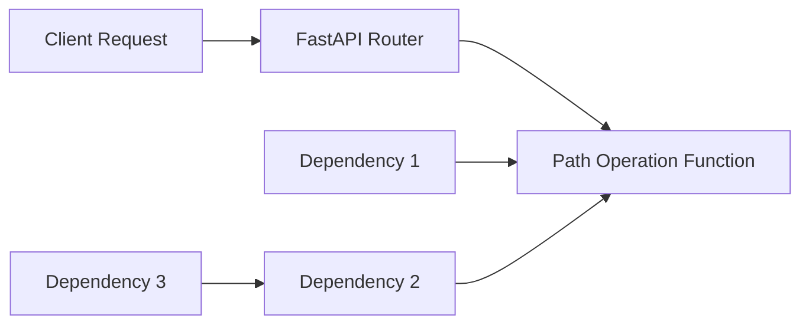
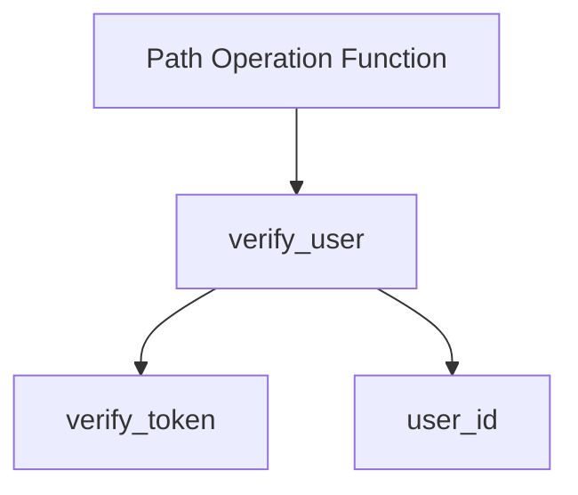
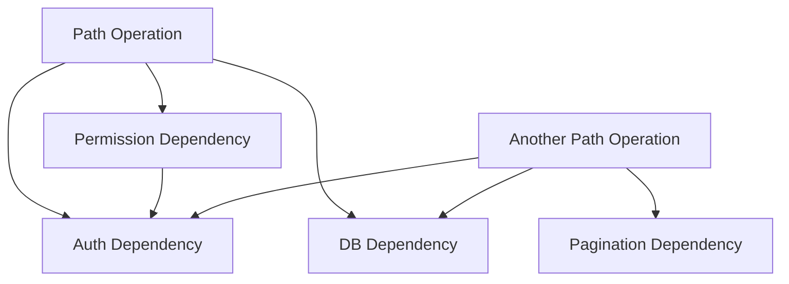

# 2.2 Dependencies and Dependency Injection

## Understanding Dependency Injection

Dependency Injection (DI) is a software design pattern where a component receives other objects that it depends on, rather than creating them internally. FastAPI provides a powerful DI system based on function parameters.

### Benefits of Dependency Injection

1. **Code Reusability**: Shared logic can be defined once and reused across multiple endpoints.
2. **Separation of Concerns**: Business logic can be separated from request handling.
3. **Testability**: Dependencies can be easily mocked during testing.
4. **Maintainability**: Modifying shared functionality requires changes in only one place.



### Basic Dependency Concepts

In FastAPI, anything that can be passed as a parameter to a path operation function can be a dependency. Dependencies are resolved based on their parameter types, with an optional `Depends()` function to explicitly mark dependencies.

## Creating and Using Dependencies

### Basic Dependency

```python
from fastapi import FastAPI, Depends

app = FastAPI()

# Define a dependency
def get_query_parameters(skip: int = 0, limit: int = 10):
    return {"skip": skip, "limit": limit}

# Use the dependency in a path operation
@app.get("/items/")
def read_items(commons: dict = Depends(get_query_parameters)):
    return {"commons": commons}

```

In this example:

1. The `get_query_parameters` function is a dependency that extracts and validates query parameters.
2. The `read_items` function depends on `get_query_parameters` through the `Depends()` function.
3. FastAPI automatically calls the dependency when the endpoint is requested.

### Dependency with Type Hint

You can also use type hints for dependency injection:

```python
from fastapi import FastAPI, Depends
from typing import Optional

app = FastAPI()

# Define a class-based dependency
class CommonQueryParams:
    def __init__(self, skip: int = 0, limit: int = 10, q: Optional[str] = None):
        self.skip = skip
        self.limit = limit
        self.q = q

# Use the dependency with type hint
@app.get("/items/")
def read_items(commons: CommonQueryParams = Depends()):
    response = {}
    if commons.q:
        response.update({"q": commons.q})
    return {
        "skip": commons.skip,
        "limit": commons.limit,
        **response
    }

```

This is especially useful for complex parameters and to take advantage of Python's type checking.

### Dependency with Yield

For dependencies that need cleanup after the path operation completes (such as database connections), use `yield`:

```python
from fastapi import FastAPI, Depends
from typing import Generator

app = FastAPI()

# Database dependency with cleanup
def get_db() -> Generator:
    db = DBSession()
    try:
        yield db  # Return the db session
    finally:
        db.close()  # Close the session after the path operation completes

@app.get("/items/")
def read_items(db = Depends(get_db)):
    # Use the db session
    items = db.query(Item).all()
    return items

```

The code after the `yield` statement will be executed after the path operation is completed, even if there's an exception.

## Path Operation Dependencies

Dependencies can be attached to path operations rather than to function parameters. This is useful for dependencies that don't return a value but perform some action (like authentication).

```python
from fastapi import FastAPI, Depends, HTTPException, status

app = FastAPI()

# Authentication dependency
def verify_token(x_token: str = Header(...)):
    if x_token != "valid-token":
        raise HTTPException(
            status_code=status.HTTP_401_UNAUTHORIZED,
            detail="Invalid X-Token header"
        )
    return x_token

# Dependency applied to the path operation
@app.get("/items/", dependencies=[Depends(verify_token)])
def read_items():
    return [{"item": "Foo"}, {"item": "Bar"}]

```

This enforces token verification for any request to the `/items/` endpoint, without needing to use the token value in the function.

## Global Dependencies

To apply dependencies to all path operations in an application, add them to the FastAPI app:

```python
from fastapi import FastAPI, Depends, Header, HTTPException

async def verify_token(x_token: str = Header(...)):
    if x_token != "valid-token":
        raise HTTPException(status_code=401, detail="Invalid X-Token")
    return x_token

async def verify_key(x_key: str = Header(...)):
    if x_key != "valid-key":
        raise HTTPException(status_code=401, detail="Invalid X-Key")
    return x_key

app = FastAPI(dependencies=[Depends(verify_token), Depends(verify_key)])

@app.get("/items/")
async def read_items():
    return [{"item": "Foo"}, {"item": "Bar"}]

@app.get("/users/")
async def read_users():
    return [{"username": "johndoe"}, {"username": "alice"}]

```

Every endpoint now requires valid `X-Token` and `X-Key` headers.

## Router-Level Dependencies

You can also apply dependencies to a router, affecting all path operations in that router:

```python
from fastapi import APIRouter, Depends, FastAPI, Header, HTTPException

app = FastAPI()

def verify_token(x_token: str = Header(...)):
    if x_token != "valid-token":
        raise HTTPException(status_code=401, detail="Invalid X-Token")
    return x_token

# Create router with dependencies
router = APIRouter(
    prefix="/items",
    tags=["items"],
    dependencies=[Depends(verify_token)],
    responses={401: {"description": "Invalid token"}},
)

@router.get("/")
async def read_items():
    return [{"item": "Foo"}, {"item": "Bar"}]

@router.post("/")
async def create_item(item: dict):
    return {"item": item}

app.include_router(router)

```

## Sub-dependencies (dependencies with dependencies)

Dependencies can have their own dependencies, creating a chain or tree of dependencies:

```python
from fastapi import FastAPI, Depends, Header, HTTPException

app = FastAPI()

# First level dependency
def verify_token(x_token: str = Header(...)):
    if x_token != "valid-token":
        raise HTTPException(status_code=401, detail="Invalid X-Token")
    return x_token

# Second level dependency (depends on verify_token)
def verify_user(token: str = Depends(verify_token), user_id: int = None):
    if user_id is None:
        raise HTTPException(status_code=400, detail="Missing user_id")
    # Here you could verify that the token belongs to the user_id
    # For simplicity, we'll just return the user_id
    return user_id

# Path operation using the second level dependency
@app.get("/users/{user_id}/items/")
def read_user_items(user_id: int, verified_id: int = Depends(verify_user)):
    # The verify_user dependency will automatically use verify_token
    return {"user_id": user_id, "verified_id": verified_id}

```

In this example:

1. `verify_token` is a dependency that checks the X-Token header.
2. `verify_user` depends on `verify_token` and also checks the user_id.
3. The path operation depends on `verify_user`, which automatically creates a dependency chain.



## Dependency Caching

By default, FastAPI caches the result of dependencies with the same parameter values during a request. This improves performance but may not be desirable in all cases.

### Default Caching Behavior

```python
from fastapi import FastAPI, Depends
import time

app = FastAPI()

# A slow dependency for demonstration
async def get_current_time():
    # Simulate a slow operation
    time.sleep(1)
    return time.time()

@app.get("/time/")
async def read_time(
    time1: float = Depends(get_current_time),
    time2: float = Depends(get_current_time)
):
    # time1 and time2 will have the same value because of caching
    return {"time1": time1, "time2": time2}

```

In this example, `get_current_time()` is only called once per request, even though it's injected twice.

### Disabling Caching

To disable caching for a specific dependency, use `use_cache=False`:

```python
from fastapi import FastAPI, Depends
import time

app = FastAPI()

async def get_current_time():
    time.sleep(1)
    return time.time()

@app.get("/time/")
async def read_time(
    time1: float = Depends(get_current_time),
    time2: float = Depends(get_current_time, use_cache=False)
):
    # time1 and time2 will have different values
    # because caching is disabled for time2
    return {"time1": time1, "time2": time2}

```

## Classes as Dependencies

While the previous examples used function-based dependencies, you can also use classes as dependencies in two ways:

### 1. Using Class Instance

Define a class with a `__call__` method to make instances callable:

```python
from fastapi import FastAPI, Depends
from typing import Optional

app = FastAPI()

class QueryChecker:
    def __init__(self, min_length: int = 3):
        self.min_length = min_length

    def __call__(self, q: Optional[str] = None):
        if q is not None and len(q) < self.min_length:
            raise ValueError(f"Query string too short, min length: {self.min_length}")
        return q

# Create an instance with custom settings
query_checker = QueryChecker(min_length=5)

@app.get("/items/")
async def read_items(q: str = Depends(query_checker)):
    return {"q": q}

```

This approach allows configuring the dependency when creating the instance.

### 2. Using Class Directly

```python
from fastapi import FastAPI, Depends
from typing import Optional

app = FastAPI()

class CommonQueryParams:
    def __init__(self, q: Optional[str] = None, skip: int = 0, limit: int = 100):
        self.q = q
        self.skip = skip
        self.limit = limit

@app.get("/items/")
async def read_items(commons: CommonQueryParams = Depends(CommonQueryParams)):
    return {
        "q": commons.q,
        "skip": commons.skip,
        "limit": commons.limit
    }

```

This can be simplified further by using type annotations:

```python
@app.get("/items/")
async def read_items(commons: CommonQueryParams = Depends()):
    return {
        "q": commons.q,
        "skip": commons.skip,
        "limit": commons.limit
    }

```

FastAPI will automatically infer the dependency class from the type annotation.

## Real-World Example: Database Session Management

A common use case for dependencies is database session management:

```python
from fastapi import FastAPI, Depends, HTTPException
from sqlalchemy import create_engine
from sqlalchemy.ext.declarative import declarative_base
from sqlalchemy.orm import sessionmaker, Session
from typing import Generator
from pydantic import BaseModel

# Database setup
SQLALCHEMY_DATABASE_URL = "sqlite:///./test.db"
engine = create_engine(SQLALCHEMY_DATABASE_URL)
SessionLocal = sessionmaker(autocommit=False, autoflush=False, bind=engine)
Base = declarative_base()

# Pydantic model for API
class ItemCreate(BaseModel):
    name: str
    description: str = None

class Item(ItemCreate):
    id: int

    class Config:
        orm_mode = True

# SQLAlchemy model
class ItemModel(Base):
    __tablename__ = "items"
    id = Column(Integer, primary_key=True, index=True)
    name = Column(String, index=True)
    description = Column(String, index=True)

# Create tables
Base.metadata.create_all(bind=engine)

# Database dependency
def get_db() -> Generator:
    db = SessionLocal()
    try:
        yield db
    finally:
        db.close()

app = FastAPI()

@app.post("/items/", response_model=Item)
def create_item(item: ItemCreate, db: Session = Depends(get_db)):
    db_item = ItemModel(**item.dict())
    db.add(db_item)
    db.commit()
    db.refresh(db_item)
    return db_item

@app.get("/items/", response_model=list[Item])
def read_items(skip: int = 0, limit: int = 100, db: Session = Depends(get_db)):
    items = db.query(ItemModel).offset(skip).limit(limit).all()
    return items

@app.get("/items/{item_id}", response_model=Item)
def read_item(item_id: int, db: Session = Depends(get_db)):
    item = db.query(ItemModel).filter(ItemModel.id == item_id).first()
    if item is None:
        raise HTTPException(status_code=404, detail="Item not found")
    return item

```

This example demonstrates:

1. Creating a database dependency with proper session cleanup
2. Using the dependency in multiple path operations
3. Combining the dependency with path and query parameters

## Advanced Dependency Patterns

### Parameterized Dependencies

You can create dependencies that accept parameters:

```python
from fastapi import FastAPI, Depends, HTTPException
from typing import Optional

app = FastAPI()

def pagination(
    skip: int = 0,
    limit: int = 10,
    max_limit: Optional[int] = None
):
    if max_limit is not None and limit > max_limit:
        limit = max_limit
    return {"skip": skip, "limit": limit}

# Create a dependency with parameters
def limited_pagination(max_limit: int = 100):
    # Return a function that closes over max_limit
    def _pagination(skip: int = 0, limit: int = 10):
        return pagination(skip, limit, max_limit)
    return _pagination

# Regular endpoints with different pagination limits
@app.get("/items/")
def read_items(pagination: dict = Depends(limited_pagination(max_limit=50))):
    # pagination will be {"skip": x, "limit": y} where limit <= 50
    return {"pagination": pagination}

@app.get("/users/")
def read_users(pagination: dict = Depends(limited_pagination(max_limit=20))):
    # pagination will be {"skip": x, "limit": y} where limit <= 20
    return {"pagination": pagination}

```

This creates a configurable dependency that can be used with different parameters in different path operations.

### Conditional Dependencies

You can create dependencies that conditionally apply business logic:

```python
from fastapi import FastAPI, Depends, Query, HTTPException
from enum import Enum
from typing import Optional

app = FastAPI()

class UserRole(str, Enum):
    admin = "admin"
    editor = "editor"
    viewer = "viewer"

# Simple auth dependency (in reality, this would check tokens, etc.)
def get_current_user(user_id: int = Query(...)):
    # In a real app, this would validate a token and retrieve user info
    if user_id < 1:
        raise HTTPException(status_code=401, detail="Invalid user ID")

    # For demo, we'll just assign roles based on ID
    if user_id == 1:
        role = UserRole.admin
    elif user_id <= 10:
        role = UserRole.editor
    else:
        role = UserRole.viewer

    return {"id": user_id, "role": role}

# Role-based permission checker
def check_permission(required_role: UserRole):
    def _check_permission(user = Depends(get_current_user)):
        user_role = user["role"]

        # Define role hierarchy
        role_priority = {
            UserRole.admin: 3,
            UserRole.editor: 2,
            UserRole.viewer: 1
        }

        if role_priority.get(user_role, 0) < role_priority.get(required_role, 0):
            raise HTTPException(
                status_code=403,
                detail=f"Insufficient permissions. {required_role} role required"
            )

        return user

    return _check_permission

# Routes with different permission requirements
@app.get("/items/", dependencies=[Depends(check_permission(UserRole.viewer))])
def read_items():
    # All authenticated users can access this
    return [{"item": "Item 1"}, {"item": "Item 2"}]

@app.post("/items/", dependencies=[Depends(check_permission(UserRole.editor))])
def create_item(item: dict):
    # Only editors and admins can create items
    return {"item": item}

@app.delete("/items/{item_id}", dependencies=[Depends(check_permission(UserRole.admin))])
def delete_item(item_id: int):
    # Only admins can delete items
    return {"deleted": item_id}

```

This example shows a role-based access control system using parameterized dependencies.

### Context Manager Dependencies

Dependencies can act as context managers, especially useful for managing database transactions:

```python
from fastapi import FastAPI, Depends
from contextlib import contextmanager
from typing import Generator

app = FastAPI()

# Database session manager
@contextmanager
def get_db_transaction():
    db = SessionLocal()
    try:
        db.begin()  # Start a transaction
        yield db
        db.commit()  # Commit if no exception
    except:
        db.rollback()  # Rollback on exception
        raise
    finally:
        db.close()

# Convert context manager to a dependency
def db_transaction() -> Generator:
    with get_db_transaction() as db:
        yield db

@app.post("/items/")
def create_items(items: list[dict], db = Depends(db_transaction)):
    # All database operations here are in a single transaction
    # If any operation fails, the transaction is rolled back
    for item in items:
        db_item = ItemModel(**item)
        db.add(db_item)
    # No need to call db.commit() - the dependency handles it
    return {"status": "Items created"}

```

This pattern ensures that all database operations in the endpoint are executed within a single transaction.

## Dependency Structure Visualization

For complex applications, dependencies form a directed acyclic graph (DAG):



Understanding this structure helps in designing efficient and maintainable dependency systems.

## Testing with Dependencies

When testing FastAPI applications, you can easily override dependencies:

```python
from fastapi import FastAPI, Depends
from fastapi.testclient import TestClient

app = FastAPI()

def get_db():
    # Real database dependency
    db = SessionLocal()
    try:
        yield db
    finally:
        db.close()

@app.get("/items/")
def read_items(db = Depends(get_db)):
    return db.query(Item).all()

# Testing
client = TestClient(app)

def override_get_db():
    # Test database dependency
    db = TestSessionLocal()
    try:
        yield db
    finally:
        db.close()

# Override the dependency for testing
app.dependency_overrides[get_db] = override_get_db

def test_read_items():
    response = client.get("/items/")
    assert response.status_code == 200
    # further assertions...

# Don't forget to clean up after testing
app.dependency_overrides = {}

```

This allows testing endpoints with mock or test-specific dependencies.

## Summary

FastAPI's dependency injection system provides powerful tools for structuring your application:

1. **Basic Dependencies**: Create reusable components with `Depends()`
2. **Dependency Chains**: Dependencies can depend on other dependencies
3. **Path/Router Dependencies**: Apply dependencies to specific operations or routers
4. **Global Dependencies**: Apply dependencies to all path operations
5. **Caching Control**: Optimize performance with dependency caching
6. **Class-based Dependencies**: Use classes for more complex dependency logic
7. **Parameterized Dependencies**: Create configurable dependencies
8. **Context Manager Dependencies**: Manage resources with proper cleanup
9. **Testing Support**: Override dependencies for testing

Using dependencies effectively leads to more maintainable, testable, and modular code by enforcing separation of concerns and promoting code reuse.
