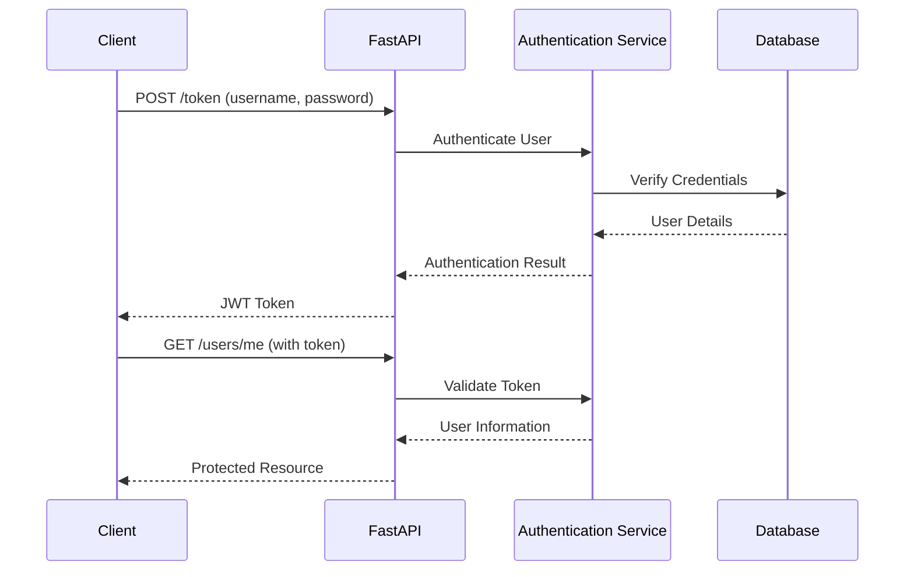
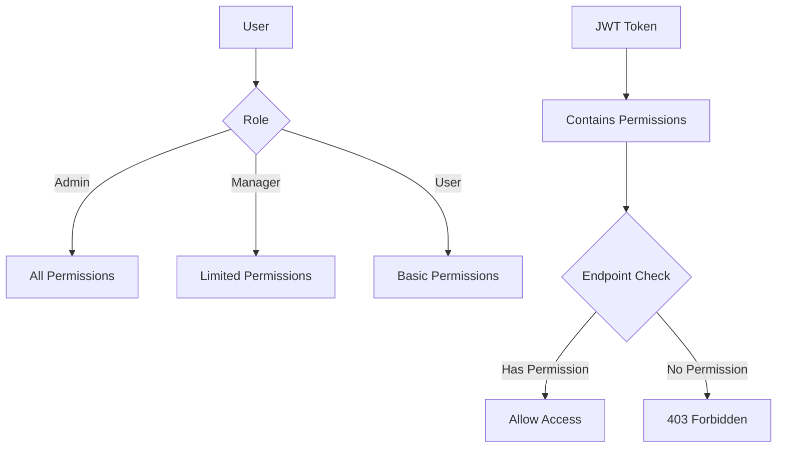
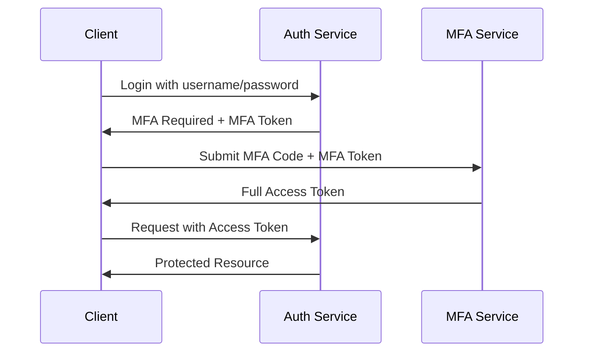

# 2.3 Security and Authentication

## Basic Authentication

Basic Authentication is a simple authentication scheme built into the HTTP protocol. The client sends HTTP requests with the `Authorization` header containing the word `Basic` followed by a space and a base64-encoded string of `username:password`.

### Implementing Basic Auth in FastAPI

```python
from fastapi import FastAPI, Depends, HTTPException, status
from fastapi.security import HTTPBasic, HTTPBasicCredentials
import secrets
from typing import Optional

app = FastAPI()

security = HTTPBasic()

def get_current_username(credentials: HTTPBasicCredentials = Depends(security)):
    # In a real application, you'd check against a database
    correct_username = secrets.compare_digest(credentials.username, "admin")
    correct_password = secrets.compare_digest(credentials.password, "password123")

    if not (correct_username and correct_password):
        raise HTTPException(
            status_code=status.HTTP_401_UNAUTHORIZED,
            detail="Invalid credentials",
            headers={"WWW-Authenticate": "Basic"},
        )

    return credentials.username

@app.get("/users/me")
def read_current_user(username: str = Depends(get_current_username)):
    return {"username": username}

```

This implementation:

1. Uses FastAPI's `HTTPBasic` security scheme
2. Creates a dependency to validate credentials
3. Uses `secrets.compare_digest()` for secure string comparison to prevent timing attacks
4. Returns a 401 error with `WWW-Authenticate` header for invalid credentials

### Basic Auth Limitations

- Credentials are base64 encoded, not encrypted (must use HTTPS)
- Credentials are sent with every request (performance overhead)
- No built-in mechanism for token expiration
- No standard way to log out other than on the client side

## OAuth2 with Password Flow

OAuth2 Password Flow (Resource Owner Password Credentials) allows clients to use username and password to obtain an access token.

### Implementing OAuth2 Password Flow

```python
from fastapi import FastAPI, Depends, HTTPException, status
from fastapi.security import OAuth2PasswordBearer, OAuth2PasswordRequestForm
from pydantic import BaseModel
from typing import Optional
from datetime import datetime, timedelta
from jose import JWTError, jwt
from passlib.context import CryptContext

# Security configuration
SECRET_KEY = "09d25e094faa6ca2556c818166b7a9563b93f7099f6f0f4caa6cf63b88e8d3e7"
ALGORITHM = "HS256"
ACCESS_TOKEN_EXPIRE_MINUTES = 30

# Password hashing
pwd_context = CryptContext(schemes=["bcrypt"], deprecated="auto")

# OAuth2 scheme
oauth2_scheme = OAuth2PasswordBearer(tokenUrl="token")

app = FastAPI()

# User models
class User(BaseModel):
    username: str
    email: Optional[str] = None
    full_name: Optional[str] = None
    disabled: Optional[bool] = None

class UserInDB(User):
    hashed_password: str

# Token models
class Token(BaseModel):
    access_token: str
    token_type: str

class TokenData(BaseModel):
    username: Optional[str] = None

# Fake user database
fake_users_db = {
    "johndoe": {
        "username": "johndoe",
        "full_name": "John Doe",
        "email": "johndoe@example.com",
        "hashed_password": pwd_context.hash("secret"),
        "disabled": False,
    },
    "alice": {
        "username": "alice",
        "full_name": "Alice Wonderson",
        "email": "alice@example.com",
        "hashed_password": pwd_context.hash("password123"),
        "disabled": True,
    },
}

# Helper functions
def verify_password(plain_password, hashed_password):
    return pwd_context.verify(plain_password, hashed_password)

def get_user(db, username: str):
    if username in db:
        user_dict = db[username]
        return UserInDB(**user_dict)

def authenticate_user(fake_db, username: str, password: str):
    user = get_user(fake_db, username)
    if not user:
        return False
    if not verify_password(password, user.hashed_password):
        return False
    return user

def create_access_token(data: dict, expires_delta: Optional[timedelta] = None):
    to_encode = data.copy()
    if expires_delta:
        expire = datetime.utcnow() + expires_delta
    else:
        expire = datetime.utcnow() + timedelta(minutes=15)
    to_encode.update({"exp": expire})
    encoded_jwt = jwt.encode(to_encode, SECRET_KEY, algorithm=ALGORITHM)
    return encoded_jwt

# Dependencies
async def get_current_user(token: str = Depends(oauth2_scheme)):
    credentials_exception = HTTPException(
        status_code=status.HTTP_401_UNAUTHORIZED,
        detail="Could not validate credentials",
        headers={"WWW-Authenticate": "Bearer"},
    )
    try:
        payload = jwt.decode(token, SECRET_KEY, algorithms=[ALGORITHM])
        username: str = payload.get("sub")
        if username is None:
            raise credentials_exception
        token_data = TokenData(username=username)
    except JWTError:
        raise credentials_exception
    user = get_user(fake_users_db, username=token_data.username)
    if user is None:
        raise credentials_exception
    return user

async def get_current_active_user(current_user: User = Depends(get_current_user)):
    if current_user.disabled:
        raise HTTPException(status_code=400, detail="Inactive user")
    return current_user

# Token endpoint
@app.post("/token", response_model=Token)
async def login_for_access_token(form_data: OAuth2PasswordRequestForm = Depends()):
    user = authenticate_user(fake_users_db, form_data.username, form_data.password)
    if not user:
        raise HTTPException(
            status_code=status.HTTP_401_UNAUTHORIZED,
            detail="Incorrect username or password",
            headers={"WWW-Authenticate": "Bearer"},
        )
    access_token_expires = timedelta(minutes=ACCESS_TOKEN_EXPIRE_MINUTES)
    access_token = create_access_token(
        data={"sub": user.username}, expires_delta=access_token_expires
    )
    return {"access_token": access_token, "token_type": "bearer"}

# Protected routes
@app.get("/users/me", response_model=User)
async def read_users_me(current_user: User = Depends(get_current_active_user)):
    return current_user

@app.get("/users/me/items")
async def read_own_items(current_user: User = Depends(get_current_active_user)):
    return [{"item_id": "Foo", "owner": current_user.username}]

```

Key components in this implementation:

1. **Password Handling**: Using `passlib` for secure password hashing
2. **Token Generation**: Creating JWT tokens with `python-jose`
3. **Token Validation**: Decoding and validating tokens in dependencies
4. **User Authentication**: Verifying username/password against a database
5. **Protected Routes**: Using dependencies to secure endpoints



### Required Libraries

For this implementation, you need to install:

```bash
pip install python-jose[cryptography] passlib[bcrypt]

```

## JWT Tokens

JSON Web Tokens (JWT) provide a compact, URL-safe means of representing claims securely between two parties.

### JWT Structure

A JWT consists of three parts separated by dots:

1. **Header**: Contains the token type and signing algorithm
2. **Payload**: Contains the claims (data)
3. **Signature**: Used to verify the token hasn't been tampered with

```
eyJhbGciOiJIUzI1NiIsInR5cCI6IkpXVCJ9.eyJzdWIiOiJqb2huZG9lIiwiZXhwIjoxNjE1NTY0ODk5fQ.signature

```

### JWT Best Practices

1. **Keep it Secret**: Store your signing key securely
2. **Keep it Short**: Include only necessary data in the payload
3. **Set Expiration**: Always include an expiration time
4. **Use HTTPS**: Always transmit tokens over HTTPS
5. **Consider Refresh Tokens**: For longer sessions, use refresh tokens

### Refresh Tokens

For longer sessions, implement a refresh token system:

```python
from fastapi import FastAPI, Depends, HTTPException, status
from fastapi.security import OAuth2PasswordBearer, OAuth2PasswordRequestForm
from pydantic import BaseModel
from typing import Optional
from datetime import datetime, timedelta
from jose import JWTError, jwt
import uuid

# Configuration
ACCESS_TOKEN_EXPIRE_MINUTES = 30
REFRESH_TOKEN_EXPIRE_DAYS = 7
# ... other config from previous example

# Token models
class Token(BaseModel):
    access_token: str
    refresh_token: str
    token_type: str

# Extended user model with refresh token
class UserInDB(User):
    hashed_password: str
    refresh_token: Optional[str] = None
    refresh_token_expires: Optional[datetime] = None

# Refresh token storage (in a real app, use Redis or a database)
refresh_tokens = {}

# Create refresh token
def create_refresh_token(username: str):
    refresh_token = str(uuid.uuid4())
    expires = datetime.utcnow() + timedelta(days=REFRESH_TOKEN_EXPIRE_DAYS)

    # Store in our fake DB
    refresh_tokens[refresh_token] = {
        "username": username,
        "expires": expires
    }

    return refresh_token, expires

# Validate refresh token
def validate_refresh_token(token: str):
    if token not in refresh_tokens:
        return None

    token_data = refresh_tokens[token]
    if datetime.utcnow() > token_data["expires"]:
        del refresh_tokens[token]
        return None

    return token_data["username"]

# Login endpoint with refresh token
@app.post("/token", response_model=Token)
async def login_for_access_token(form_data: OAuth2PasswordRequestForm = Depends()):
    user = authenticate_user(fake_users_db, form_data.username, form_data.password)
    if not user:
        raise HTTPException(
            status_code=status.HTTP_401_UNAUTHORIZED,
            detail="Incorrect username or password",
            headers={"WWW-Authenticate": "Bearer"},
        )

    # Create access token
    access_token_expires = timedelta(minutes=ACCESS_TOKEN_EXPIRE_MINUTES)
    access_token = create_access_token(
        data={"sub": user.username}, expires_delta=access_token_expires
    )

    # Create refresh token
    refresh_token, expires = create_refresh_token(user.username)

    return {
        "access_token": access_token,
        "refresh_token": refresh_token,
        "token_type": "bearer"
    }

# Refresh token endpoint
@app.post("/token/refresh", response_model=Token)
async def refresh_access_token(refresh_token: str):
    username = validate_refresh_token(refresh_token)
    if not username:
        raise HTTPException(
            status_code=status.HTTP_401_UNAUTHORIZED,
            detail="Invalid refresh token",
            headers={"WWW-Authenticate": "Bearer"},
        )

    # Create new access token
    access_token_expires = timedelta(minutes=ACCESS_TOKEN_EXPIRE_MINUTES)
    access_token = create_access_token(
        data={"sub": username}, expires_delta=access_token_expires
    )

    # Create new refresh token (rotate tokens for security)
    new_refresh_token, expires = create_refresh_token(username)

    # Invalidate old refresh token
    del refresh_tokens[refresh_token]

    return {
        "access_token": access_token,
        "refresh_token": new_refresh_token,
        "token_type": "bearer"
    }

```

This implementation adds refresh token support:

1. Generates a refresh token on login
2. Stores refresh tokens with expiration
3. Provides an endpoint to refresh access tokens
4. Rotates refresh tokens for security

## OAuth2 with Scopes

Scopes allow granular access control within your API.

### Implementing OAuth2 with Scopes

```python
from fastapi import FastAPI, Depends, HTTPException, status, Security
from fastapi.security import (
    OAuth2PasswordBearer,
    OAuth2PasswordRequestForm,
    SecurityScopes,
)
from pydantic import BaseModel, ValidationError
from typing import Optional, List, Dict
from datetime import datetime, timedelta
from jose import JWTError, jwt

# Configuration
SECRET_KEY = "09d25e094faa6ca2556c818166b7a9563b93f7099f6f0f4caa6cf63b88e8d3e7"
ALGORITHM = "HS256"
ACCESS_TOKEN_EXPIRE_MINUTES = 30

# OAuth2 scheme with scopes
oauth2_scheme = OAuth2PasswordBearer(
    tokenUrl="token",
    scopes={
        "users:read": "Read user information",
        "users:write": "Create or update users",
        "items:read": "Read items",
        "items:write": "Create or update items",
    },
)

app = FastAPI()

# Token models
class Token(BaseModel):
    access_token: str
    token_type: str

class TokenData(BaseModel):
    username: Optional[str] = None
    scopes: List[str] = []

# User model with scopes
class User(BaseModel):
    username: str
    email: Optional[str] = None
    full_name: Optional[str] = None
    disabled: Optional[bool] = None
    scopes: List[str] = []

class UserInDB(User):
    hashed_password: str

# Fake users database with scopes
fake_users_db = {
    "johndoe": {
        "username": "johndoe",
        "full_name": "John Doe",
        "email": "johndoe@example.com",
        "hashed_password": "$2b$12$EixZaYVK1fsbw1ZfbX3OXePaWxn96p36WQoeG6Lruj3vjPGga31lW",
        "disabled": False,
        "scopes": ["users:read", "items:read", "items:write"],
    },
    "alice": {
        "username": "alice",
        "full_name": "Alice Wonderson",
        "email": "alice@example.com",
        "hashed_password": "$2b$12$gSvqqUPvlXP2tfVFaWK1Be7DlH.PKZbv5H8KnzzVgXXbVxpva.pFm",
        "disabled": True,
        "scopes": ["users:read"],
    },
}

# Helper functions (same as before)
def verify_password(plain_password, hashed_password):
    # ... implementation from before
    return True  # Simplified for example

def get_user(db, username: str):
    if username in db:
        user_dict = db[username]
        return UserInDB(**user_dict)

def authenticate_user(fake_db, username: str, password: str):
    user = get_user(fake_db, username)
    if not user:
        return False
    if not verify_password(password, user.hashed_password):
        return False
    return user

def create_access_token(data: dict, expires_delta: Optional[timedelta] = None):
    to_encode = data.copy()
    if expires_delta:
        expire = datetime.utcnow() + expires_delta
    else:
        expire = datetime.utcnow() + timedelta(minutes=15)
    to_encode.update({"exp": expire})
    encoded_jwt = jwt.encode(to_encode, SECRET_KEY, algorithm=ALGORITHM)
    return encoded_jwt

# Dependencies with scope checking
async def get_current_user(
    security_scopes: SecurityScopes,
    token: str = Depends(oauth2_scheme),
):
    if security_scopes.scopes:
        authenticate_value = f'Bearer scope="{security_scopes.scope_str}"'
    else:
        authenticate_value = "Bearer"

    credentials_exception = HTTPException(
        status_code=status.HTTP_401_UNAUTHORIZED,
        detail="Could not validate credentials",
        headers={"WWW-Authenticate": authenticate_value},
    )

    try:
        payload = jwt.decode(token, SECRET_KEY, algorithms=[ALGORITHM])
        username: str = payload.get("sub")
        if username is None:
            raise credentials_exception

        token_scopes = payload.get("scopes", [])
        token_data = TokenData(scopes=token_scopes, username=username)

    except (JWTError, ValidationError):
        raise credentials_exception

    user = get_user(fake_users_db, username=token_data.username)
    if user is None:
        raise credentials_exception

    # Check if the token has the required scopes
    for scope in security_scopes.scopes:
        if scope not in token_data.scopes:
            raise HTTPException(
                status_code=status.HTTP_403_FORBIDDEN,
                detail=f"Not enough permissions. Required scope: {scope}",
                headers={"WWW-Authenticate": authenticate_value},
            )

    return user

async def get_current_active_user(
    current_user: User = Security(get_current_user, scopes=["users:read"])
):
    if current_user.disabled:
        raise HTTPException(status_code=400, detail="Inactive user")
    return current_user

# Token endpoint with scopes
@app.post("/token", response_model=Token)
async def login_for_access_token(form_data: OAuth2PasswordRequestForm = Depends()):
    user = authenticate_user(fake_users_db, form_data.username, form_data.password)
    if not user:
        raise HTTPException(
            status_code=status.HTTP_401_UNAUTHORIZED,
            detail="Incorrect username or password",
            headers={"WWW-Authenticate": "Bearer"},
        )

    # Check if requested scopes are allowed for this user
    requested_scopes = form_data.scopes
    for scope in requested_scopes:
        if scope not in user.scopes:
            raise HTTPException(
                status_code=status.HTTP_401_UNAUTHORIZED,
                detail=f"The scope {scope} is not available for this user",
                headers={"WWW-Authenticate": "Bearer"},
            )

    access_token_expires = timedelta(minutes=ACCESS_TOKEN_EXPIRE_MINUTES)
    access_token = create_access_token(
        data={"sub": user.username, "scopes": requested_scopes},
        expires_delta=access_token_expires,
    )

    return {"access_token": access_token, "token_type": "bearer"}

# Protected routes with different scopes
@app.get("/users/me", response_model=User)
async def read_users_me(
    current_user: User = Security(get_current_user, scopes=["users:read"])
):
    return current_user

@app.get("/users/", response_model=List[User])
async def read_users(
    current_user: User = Security(get_current_user, scopes=["users:read"])
):
    # In a real app, you'd fetch from database
    return list(fake_users_db.values())

@app.post("/users/", response_model=User)
async def create_user(
    user: User,
    current_user: User = Security(get_current_user, scopes=["users:write"])
):
    # In a real app, you'd save to database
    return user

@app.get("/items/", response_model=List[Dict])
async def read_items(
    current_user: User = Security(get_current_user, scopes=["items:read"])
):
    return [{"item_id": 1, "owner": "johndoe"}, {"item_id": 2, "owner": "alice"}]

@app.post("/items/", response_model=Dict)
async def create_item(
    item: Dict,
    current_user: User = Security(get_current_user, scopes=["items:write"])
):
    return item

```

This implementation adds scope support:

1. Defines available scopes in the OAuth2 scheme
2. Stores user-specific scopes in the user database
3. Validates requested scopes during token generation
4. Checks required scopes when accessing protected endpoints
5. Uses `Security` dependency with scope requirements

## Security Utilities and Tools

FastAPI provides several security utilities beyond the basic authentication mechanisms.

### CORS (Cross-Origin Resource Sharing)

CORS is a security feature implemented by browsers to restrict requests from different origins:

```python
from fastapi import FastAPI
from fastapi.middleware.cors import CORSMiddleware

app = FastAPI()

# Configure CORS
app.add_middleware(
    CORSMiddleware,
    allow_origins=["http://localhost:8080", "https://example.com"],
    allow_credentials=True,
    allow_methods=["*"],
    allow_headers=["*"],
)

@app.get("/api/items")
async def read_items():
    return [{"id": 1, "name": "Item 1"}]

```

Settings explained:

- `allow_origins`: List of allowed origins (domain URLs)
- `allow_credentials`: Allow cookies in cross-origin requests
- `allow_methods`: HTTP methods allowed for CORS requests
- `allow_headers`: HTTP headers allowed for CORS requests

### HTTPS Redirection

Force HTTPS for all requests:

```python
from fastapi import FastAPI
from starlette.middleware.httpsredirect import HTTPSRedirectMiddleware

app = FastAPI()

# Add HTTPS redirect middleware
app.add_middleware(HTTPSRedirectMiddleware)

```

### Content Security Policy (CSP)

Implement Content Security Policy headers:

```python
from fastapi import FastAPI, Request
from fastapi.responses import HTMLResponse
from fastapi.middleware.trustedhost import TrustedHostMiddleware

app = FastAPI()

# Only allow requests from specific hosts
app.add_middleware(
    TrustedHostMiddleware, allowed_hosts=["example.com", "*.example.com"]
)

@app.middleware("http")
async def add_security_headers(request: Request, call_next):
    response = await call_next(request)
    response.headers["Content-Security-Policy"] = "default-src 'self'"
    response.headers["X-Frame-Options"] = "DENY"
    response.headers["X-Content-Type-Options"] = "nosniff"
    response.headers["Strict-Transport-Security"] = "max-age=31536000; includeSubDomains"
    return response

@app.get("/", response_class=HTMLResponse)
async def root():
    return """
    <html>
        <head><title>Secure Page</title></head>
        <body><h1>Secure Page with CSP</h1></body>
    </html>
    """

```

## Role-Based Access Control

Building a more comprehensive role-based access control (RBAC) system:

```python
from fastapi import FastAPI, Depends, HTTPException, status, Security
from fastapi.security import OAuth2PasswordBearer, OAuth2PasswordRequestForm
from pydantic import BaseModel, Field
from typing import Optional, List, Dict, Set
from enum import Enum
from datetime import datetime, timedelta
from jose import JWTError, jwt

app = FastAPI()

# Role definitions
class Role(str, Enum):
    ADMIN = "admin"
    MANAGER = "manager"
    USER = "user"

# Permission definitions
class Permission(str, Enum):
    READ_USERS = "read:users"
    WRITE_USERS = "write:users"
    DELETE_USERS = "delete:users"
    READ_ITEMS = "read:items"
    WRITE_ITEMS = "write:items"
    DELETE_ITEMS = "delete:items"
    READ_REPORTS = "read:reports"
    GENERATE_REPORTS = "generate:reports"

# Role to permissions mapping
ROLE_PERMISSIONS = {
    Role.ADMIN: {
        Permission.READ_USERS, Permission.WRITE_USERS, Permission.DELETE_USERS,
        Permission.READ_ITEMS, Permission.WRITE_ITEMS, Permission.DELETE_ITEMS,
        Permission.READ_REPORTS, Permission.GENERATE_REPORTS
    },
    Role.MANAGER: {
        Permission.READ_USERS,
        Permission.READ_ITEMS, Permission.WRITE_ITEMS,
        Permission.READ_REPORTS, Permission.GENERATE_REPORTS
    },
    Role.USER: {
        Permission.READ_ITEMS,
        Permission.READ_REPORTS
    }
}

# User model with roles
class User(BaseModel):
    username: str
    email: Optional[str] = None
    full_name: Optional[str] = None
    disabled: Optional[bool] = False
    roles: List[Role] = [Role.USER]  # Default role

    @property
    def permissions(self) -> Set[Permission]:
        """Get all permissions for the user based on their roles"""
        result = set()
        for role in self.roles:
            result.update(ROLE_PERMISSIONS.get(role, set()))
        return result

class UserInDB(User):
    hashed_password: str

# Token model
class Token(BaseModel):
    access_token: str
    token_type: str

class TokenData(BaseModel):
    username: Optional[str] = None
    permissions: List[str] = []

# Authentication and token functions (simplified)
SECRET_KEY = "secret-key-for-jwt-signing"
ALGORITHM = "HS256"
ACCESS_TOKEN_EXPIRE_MINUTES = 30

# Fake users database with roles
fake_users_db = {
    "admin": {
        "username": "admin",
        "full_name": "Admin User",
        "email": "admin@example.com",
        "hashed_password": "hashed_admin_password",
        "disabled": False,
        "roles": [Role.ADMIN]
    },
    "manager": {
        "username": "manager",
        "full_name": "Manager User",
        "email": "manager@example.com",
        "hashed_password": "hashed_manager_password",
        "disabled": False,
        "roles": [Role.MANAGER]
    },
    "user": {
        "username": "user",
        "full_name": "Regular User",
        "email": "user@example.com",
        "hashed_password": "hashed_user_password",
        "disabled": False,
        "roles": [Role.USER]
    }
}

# OAuth2 scheme
oauth2_scheme = OAuth2PasswordBearer(tokenUrl="token")

# Helper functions
def verify_password(plain_password, hashed_password):
    # In a real app, use proper password verification
    return plain_password == f"unhashed_{hashed_password}"

def get_user(db, username: str):
    if username in db:
        user_dict = db[username]
        return UserInDB(**user_dict)

def authenticate_user(db, username: str, password: str):
    user = get_user(db, username)
    if not user:
        return False
    if not verify_password(password, user.hashed_password):
        return False
    return user

def create_access_token(data: dict, expires_delta: Optional[timedelta] = None):
    to_encode = data.copy()
    if expires_delta:
        expire = datetime.utcnow() + expires_delta
    else:
        expire = datetime.utcnow() + timedelta(minutes=15)
    to_encode.update({"exp": expire})
    encoded_jwt = jwt.encode(to_encode, SECRET_KEY, algorithm=ALGORITHM)
    return encoded_jwt

# Permission dependency
def require_permissions(required_permissions: List[Permission]):
    async def permission_dependency(token: str = Depends(oauth2_scheme)):
        try:
            payload = jwt.decode(token, SECRET_KEY, algorithms=[ALGORITHM])
            username: str = payload.get("sub")
            if username is None:
                raise HTTPException(
                    status_code=status.HTTP_401_UNAUTHORIZED,
                    detail="Invalid authentication credentials",
                    headers={"WWW-Authenticate": "Bearer"},
                )
            token_permissions = set(payload.get("permissions", []))

        except JWTError:
            raise HTTPException(
                status_code=status.HTTP_401_UNAUTHORIZED,
                detail="Invalid authentication credentials",
                headers={"WWW-Authenticate": "Bearer"},
            )

        user = get_user(fake_users_db, username=username)
        if user is None:
            raise HTTPException(
                status_code=status.HTTP_401_UNAUTHORIZED,
                detail="Invalid authentication credentials",
                headers={"WWW-Authenticate": "Bearer"},
            )

        # Check if user has all required permissions
        user_permissions = user.permissions
        for permission in required_permissions:
            if permission not in user_permissions and permission.value not in token_permissions:
                raise HTTPException(
                    status_code=status.HTTP_403_FORBIDDEN,
                    detail=f"Permission denied. Required permission: {permission}"
                )

        return user

    return permission_dependency

# Token endpoint
@app.post("/token", response_model=Token)
async def login_for_access_token(form_data: OAuth2PasswordRequestForm = Depends()):
    user = authenticate_user(fake_users_db, form_data.username, form_data.password)
    if not user:
        raise HTTPException(
            status_code=status.HTTP_401_UNAUTHORIZED,
            detail="Incorrect username or password",
            headers={"WWW-Authenticate": "Bearer"},
        )

    # Include user permissions in the token
    permissions = [p.value for p in user.permissions]

    access_token_expires = timedelta(minutes=ACCESS_TOKEN_EXPIRE_MINUTES)
    access_token = create_access_token(
        data={"sub": user.username, "permissions": permissions},
        expires_delta=access_token_expires,
    )

    return {"access_token": access_token, "token_type": "bearer"}

# Protected routes with permission checking
@app.get("/users/", response_model=List[User])
async def read_users(
    current_user: User = Depends(require_permissions([Permission.READ_USERS]))
):
    return list(fake_users_db.values())

@app.get("/items/")
async def read_items(
    current_user: User = Depends(require_permissions([Permission.READ_ITEMS]))
):
    return [{"id": 1, "name": "Item 1"}, {"id": 2, "name": "Item 2"}]

@app.post("/items/")
async def create_item(
    item: Dict,
    current_user: User = Depends(require_permissions([Permission.WRITE_ITEMS]))
):
    return {"id": 3, **item}

@app.delete("/items/{item_id}")
async def delete_item(
    item_id: int,
    current_user: User = Depends(require_permissions([Permission.DELETE_ITEMS]))
):
    return {"deleted": item_id}

@app.get("/reports/")
async def list_reports(
    current_user: User = Depends(require_permissions([Permission.READ_REPORTS]))
):
    return [{"id": 1, "name": "Sales Report"}, {"id": 2, "name": "Inventory Report"}]

@app.post("/reports/generate")
async def generate_report(
    report_type: str,
    current_user: User = Depends(require_permissions([Permission.GENERATE_REPORTS]))
):
    return {"message": f"Generating {report_type} report", "status": "processing"}

```

This implementation provides:

1. Role definitions with a hierarchy
2. Fine-grained permissions
3. Mapping of roles to permissions
4. Token generation with embedded permissions
5. Permission checking dependency
6. Protected routes with specific permission requirements



## API Key Authentication

For machine-to-machine communication, API keys are often simpler than OAuth2:

```python
from fastapi import FastAPI, Depends, HTTPException, status
from fastapi.security.api_key import APIKeyHeader, APIKey
from typing import Optional, Dict, List
from pydantic import BaseModel

app = FastAPI()

# API key configuration
API_KEY_NAME = "X-API-Key"
API_KEY_HEADER = APIKeyHeader(name=API_KEY_NAME, auto_error=False)

# Fake API key database with associated permissions
api_keys = {
    "abcdef123456": {
        "client": "mobile-app",
        "permissions": ["read:items", "write:items"]
    },
    "987654321xyz": {
        "client": "admin-dashboard",
        "permissions": ["read:items", "write:items", "delete:items", "read:users"]
    }
}

# API key dependency
async def get_api_key(
    api_key: Optional[str] = Depends(API_KEY_HEADER)
):
    if api_key is None:
        raise HTTPException(
            status_code=status.HTTP_401_UNAUTHORIZED,
            detail="API Key header not provided",
        )

    if api_key not in api_keys:
        raise HTTPException(
            status_code=status.HTTP_401_UNAUTHORIZED,
            detail="Invalid API Key",
        )

    return api_keys[api_key]

# Check API key permissions
def check_api_key_permission(permission: str):
    async def _check_permission(api_key_data: Dict = Depends(get_api_key)):
        if permission not in api_key_data["permissions"]:
            raise HTTPException(
                status_code=status.HTTP_403_FORBIDDEN,
                detail=f"API key doesn't have {permission} permission"
            )
        return api_key_data

    return _check_permission

# Models
class Item(BaseModel):
    name: str
    description: Optional[str] = None
    price: float

# Routes with API key authentication
@app.get("/items/", response_model=List[Item])
async def read_items(
    api_key_data: Dict = Depends(check_api_key_permission("read:items"))
):
    # Log the client who made the request
    client = api_key_data["client"]
    print(f"Request from client: {client}")

    # Return items
    return [
        {"name": "Item 1", "price": 50.2},
        {"name": "Item 2", "price": 30.0, "description": "A nice item"}
    ]

@app.post("/items/", response_model=Item)
async def create_item(
    item: Item,
    api_key_data: Dict = Depends(check_api_key_permission("write:items"))
):
    # Process the request
    return item

@app.delete("/items/{item_id}")
async def delete_item(
    item_id: int,
    api_key_data: Dict = Depends(check_api_key_permission("delete:items"))
):
    return {"deleted": item_id}

```

This API key implementation:

1. Uses HTTP headers for API key transmission
2. Associates permissions with each API key
3. Validates API keys and their permissions
4. Keeps track of which client is making requests

## Multi-Factor Authentication (MFA/2FA)

Implement two-factor authentication for additional security:

```python
from fastapi import FastAPI, Depends, HTTPException, status
from fastapi.security import OAuth2PasswordBearer, OAuth2PasswordRequestForm
from pydantic import BaseModel
from typing import Optional
from datetime import datetime, timedelta
import pyotp  # For generating and validating TOTP codes
import qrcode  # For generating QR codes
import io
import base64
from jose import JWTError, jwt

app = FastAPI()

# MFA-related models
class MFASetup(BaseModel):
    secret: str
    qr_code: str  # Base64 encoded QR code image

class MFAVerify(BaseModel):
    code: str

# User models
class User(BaseModel):
    username: str
    email: Optional[str] = None
    full_name: Optional[str] = None
    disabled: Optional[bool] = False
    mfa_enabled: bool = False
    mfa_secret: Optional[str] = None

class UserInDB(User):
    hashed_password: str

# Token models
class Token(BaseModel):
    access_token: str
    token_type: str
    requires_mfa: bool = False
    mfa_token: Optional[str] = None

# Fake users database with MFA info
fake_users_db = {
    "johndoe": {
        "username": "johndoe",
        "full_name": "John Doe",
        "email": "johndoe@example.com",
        "hashed_password": "fakehashedsecret",
        "disabled": False,
        "mfa_enabled": True,
        "mfa_secret": "JBSWY3DPEHPK3PXP"  # Example secret
    },
    "alice": {
        "username": "alice",
        "full_name": "Alice Wonderson",
        "email": "alice@example.com",
        "hashed_password": "fakehashedsecret2",
        "disabled": False,
        "mfa_enabled": False,
        "mfa_secret": None
    }
}

# OAuth2 scheme
oauth2_scheme = OAuth2PasswordBearer(tokenUrl="token")

# Security configuration
SECRET_KEY = "09d25e094faa6ca2556c818166b7a9563b93f7099f6f0f4caa6cf63b88e8d3e7"
ALGORITHM = "HS256"
ACCESS_TOKEN_EXPIRE_MINUTES = 30
MFA_TOKEN_EXPIRE_MINUTES = 5

# Helper functions (simplified)
def verify_password(plain_password, hashed_password):
    return plain_password == f"unhashed_{hashed_password}"

def get_user(db, username: str):
    if username in db:
        user_dict = db[username]
        return UserInDB(**user_dict)

def authenticate_user(db, username: str, password: str):
    user = get_user(db, username)
    if not user:
        return False
    if not verify_password(password, user.hashed_password):
        return False
    return user

def create_token(data: dict, expires_delta: timedelta, token_type: str = "access"):
    to_encode = data.copy()
    expire = datetime.utcnow() + expires_delta
    to_encode.update({"exp": expire, "type": token_type})
    encoded_jwt = jwt.encode(to_encode, SECRET_KEY, algorithm=ALGORITHM)
    return encoded_jwt

# Dependencies
async def get_current_user(token: str = Depends(oauth2_scheme)):
    credentials_exception = HTTPException(
        status_code=status.HTTP_401_UNAUTHORIZED,
        detail="Could not validate credentials",
        headers={"WWW-Authenticate": "Bearer"},
    )

    try:
        payload = jwt.decode(token, SECRET_KEY, algorithms=[ALGORITHM])
        username: str = payload.get("sub")
        token_type: str = payload.get("type", "access")

        if username is None:
            raise credentials_exception

        if token_type != "access" and token_type != "mfa_verified":
            raise HTTPException(
                status_code=status.HTTP_401_UNAUTHORIZED,
                detail="Not an access token",
                headers={"WWW-Authenticate": "Bearer"},
            )

    except JWTError:
        raise credentials_exception

    user = get_user(fake_users_db, username=username)
    if user is None:
        raise credentials_exception

    # Check if MFA is required but not verified
    if user.mfa_enabled and token_type != "mfa_verified":
        raise HTTPException(
            status_code=status.HTTP_401_UNAUTHORIZED,
            detail="MFA verification required",
            headers={"WWW-Authenticate": "Bearer"},
        )

    return user

async def get_current_active_user(current_user: User = Depends(get_current_user)):
    if current_user.disabled:
        raise HTTPException(status_code=400, detail="Inactive user")
    return current_user

# MFA helper functions
def generate_mfa_secret():
    """Generate a new MFA secret"""
    return pyotp.random_base32()

def generate_mfa_qrcode(username: str, secret: str):
    """Generate a QR code for MFA setup"""
    totp = pyotp.TOTP(secret)
    uri = totp.provisioning_uri(username, issuer_name="FastAPI App")

    # Generate QR code
    qr = qrcode.QRCode(version=1, box_size=10, border=5)
    qr.add_data(uri)
    qr.make(fit=True)
    img = qr.make_image(fill_color="black", back_color="white")

    # Convert to base64
    buffered = io.BytesIO()
    img.save(buffered)
    img_str = base64.b64encode(buffered.getvalue()).decode()

    return f"data:image/png;base64,{img_str}"

def verify_mfa_code(secret: str, code: str):
    """Verify a TOTP code"""
    totp = pyotp.TOTP(secret)
    return totp.verify(code)

# Login endpoints with MFA support
@app.post("/token", response_model=Token)
async def login_for_access_token(form_data: OAuth2PasswordRequestForm = Depends()):
    user = authenticate_user(fake_users_db, form_data.username, form_data.password)
    if not user:
        raise HTTPException(
            status_code=status.HTTP_401_UNAUTHORIZED,
            detail="Incorrect username or password",
            headers={"WWW-Authenticate": "Bearer"},
        )

    # If MFA is enabled, return a temporary MFA token
    if user.mfa_enabled:
        mfa_token_expires = timedelta(minutes=MFA_TOKEN_EXPIRE_MINUTES)
        mfa_token = create_token(
            data={"sub": user.username},
            expires_delta=mfa_token_expires,
            token_type="mfa_required"
        )

        return {
            "access_token": "",
            "token_type": "bearer",
            "requires_mfa": True,
            "mfa_token": mfa_token
        }

    # If MFA is not enabled, return a regular access token
    access_token_expires = timedelta(minutes=ACCESS_TOKEN_EXPIRE_MINUTES)
    access_token = create_token(
        data={"sub": user.username},
        expires_delta=access_token_expires,
        token_type="access"
    )

    return {"access_token": access_token, "token_type": "bearer", "requires_mfa": False}

@app.post("/verify-mfa", response_model=Token)
async def verify_mfa(
    mfa_verify: MFAVerify,
    mfa_token: str
):
    try:
        payload = jwt.decode(mfa_token, SECRET_KEY, algorithms=[ALGORITHM])
        username: str = payload.get("sub")
        token_type: str = payload.get("type", "")

        if token_type != "mfa_required":
            raise HTTPException(
                status_code=status.HTTP_401_UNAUTHORIZED,
                detail="Invalid token type",
            )

        user = get_user(fake_users_db, username)
        if not user or not user.mfa_enabled or not user.mfa_secret:
            raise HTTPException(
                status_code=status.HTTP_401_UNAUTHORIZED,
                detail="Invalid user or MFA not enabled",
            )

        # Verify the MFA code
        if not verify_mfa_code(user.mfa_secret, mfa_verify.code):
            raise HTTPException(
                status_code=status.HTTP_401_UNAUTHORIZED,
                detail="Invalid MFA code",
            )

        # Generate a fully verified access token
        access_token_expires = timedelta(minutes=ACCESS_TOKEN_EXPIRE_MINUTES)
        access_token = create_token(
            data={"sub": user.username},
            expires_delta=access_token_expires,
            token_type="mfa_verified"
        )

        return {"access_token": access_token, "token_type": "bearer", "requires_mfa": False}

    except JWTError:
        raise HTTPException(
            status_code=status.HTTP_401_UNAUTHORIZED,
            detail="Invalid MFA token",
        )

# MFA setup endpoints
@app.post("/mfa/setup", response_model=MFASetup)
async def setup_mfa(current_user: User = Depends(get_current_active_user)):
    if current_user.mfa_enabled:
        raise HTTPException(
            status_code=status.HTTP_400_BAD_REQUEST,
            detail="MFA already enabled"
        )

    # Generate a new secret
    secret = generate_mfa_secret()

    # Generate QR code
    qr_code = generate_mfa_qrcode(current_user.username, secret)

    # In a real app, you'd store the secret in the database
    # For demo, we'll update our fake DB
    fake_users_db[current_user.username]["mfa_secret"] = secret

    return {"secret": secret, "qr_code": qr_code}

@app.post("/mfa/enable")
async def enable_mfa(
    mfa_verify: MFAVerify,
    current_user: User = Depends(get_current_active_user)
):
    if current_user.mfa_enabled:
        raise HTTPException(
            status_code=status.HTTP_400_BAD_REQUEST,
            detail="MFA already enabled"
        )

    if not current_user.mfa_secret:
        raise HTTPException(
            status_code=status.HTTP_400_BAD_REQUEST,
            detail="MFA not set up yet"
        )

    # Verify the provided code
    if not verify_mfa_code(current_user.mfa_secret, mfa_verify.code):
        raise HTTPException(
            status_code=status.HTTP_401_UNAUTHORIZED,
            detail="Invalid MFA code"
        )

    # Enable MFA for the user
    fake_users_db[current_user.username]["mfa_enabled"] = True

    return {"message": "MFA enabled successfully"}

@app.post("/mfa/disable")
async def disable_mfa(
    mfa_verify: MFAVerify,
    current_user: User = Depends(get_current_active_user)
):
    if not current_user.mfa_enabled:
        raise HTTPException(
            status_code=status.HTTP_400_BAD_REQUEST,
            detail="MFA not enabled"
        )

    # Verify the provided code
    if not verify_mfa_code(current_user.mfa_secret, mfa_verify.code):
        raise HTTPException(
            status_code=status.HTTP_401_UNAUTHORIZED,
            detail="Invalid MFA code"
        )

    # Disable MFA for the user
    fake_users_db[current_user.username]["mfa_enabled"] = False

    return {"message": "MFA disabled successfully"}

# Protected route
@app.get("/users/me", response_model=User)
async def read_users_me(current_user: User = Depends(get_current_active_user)):
    return current_user

```

The MFA implementation includes:

1. Setup endpoints to generate MFA secrets and QR codes
2. Verification to confirm codes work before enabling
3. Login flow that requires MFA when enabled
4. Optional disable endpoint for removing MFA



## Summary

FastAPI provides a comprehensive security and authentication toolkit:

1. **Basic Authentication**: Simple username/password authentication
   - Quick to implement but limited in features
   - Best for internal APIs or simple applications
2. **OAuth2 Password Flow**: Username/password with token-based authentication
   - More secure than Basic Auth
   - Includes token generation, validation, and expiration
   - Suitable for most web applications
3. **JWT Tokens**: Secure, stateless tokens for authentication
   - Encodes user information and permissions
   - Self-contained with built-in expiration
   - Can include any necessary claims or metadata
4. **OAuth2 with Scopes**: Granular permission control
   - Define specific permissions for different operations
   - Validate permissions before allowing access
   - Enables fine-grained access control
5. **Role-Based Access Control**: Comprehensive permission system
   - Organize permissions into roles
   - Assign roles to users
   - Simplify permission management
6. **API Key Authentication**: For service-to-service communication
   - Simpler than OAuth2 for machine clients
   - Can include permissions or rate limiting
   - Good for backend services and integrations
7. **Multi-Factor Authentication**: Additional security layer
   - Combines something you know (password) with something you have (device)
   - Significantly enhances security
   - Essential for applications with sensitive data
8. **Security Utilities**: Supporting security features
   - CORS for browser security
   - HTTPS redirection for secure communication
   - Content Security Policy for XSS protection

Best practices for FastAPI authentication:

1. **Always use HTTPS** in production
2. **Store passwords securely** using proper hashing (bcrypt, Argon2)
3. **Set appropriate token expiration** times
4. **Implement refresh tokens** for longer sessions
5. **Use dependency injection** for consistency across endpoints
6. **Validate tokens properly** on each request
7. **Include only necessary data** in tokens
8. **Apply the principle of least privilege** with scopes and permissions
9. **Consider rate limiting** for authentication endpoints
10. **Implement account lockout** after failed attempts

By implementing these security features and following best practices, you can build secure, robust FastAPI applications that protect sensitive data and provide appropriate access control.
