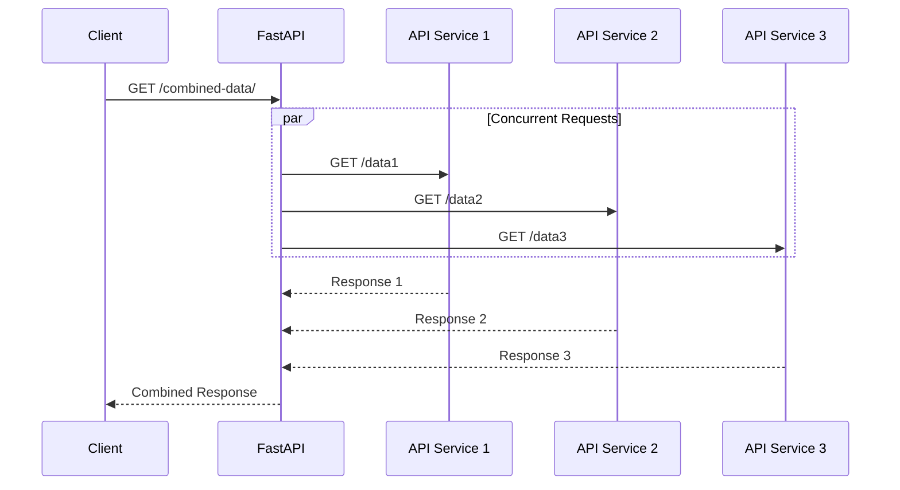
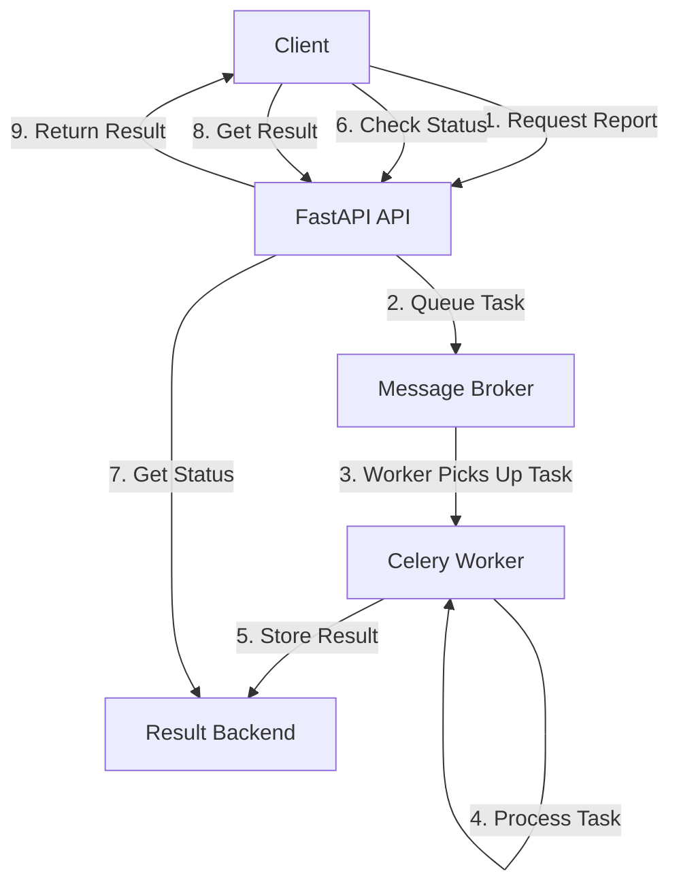
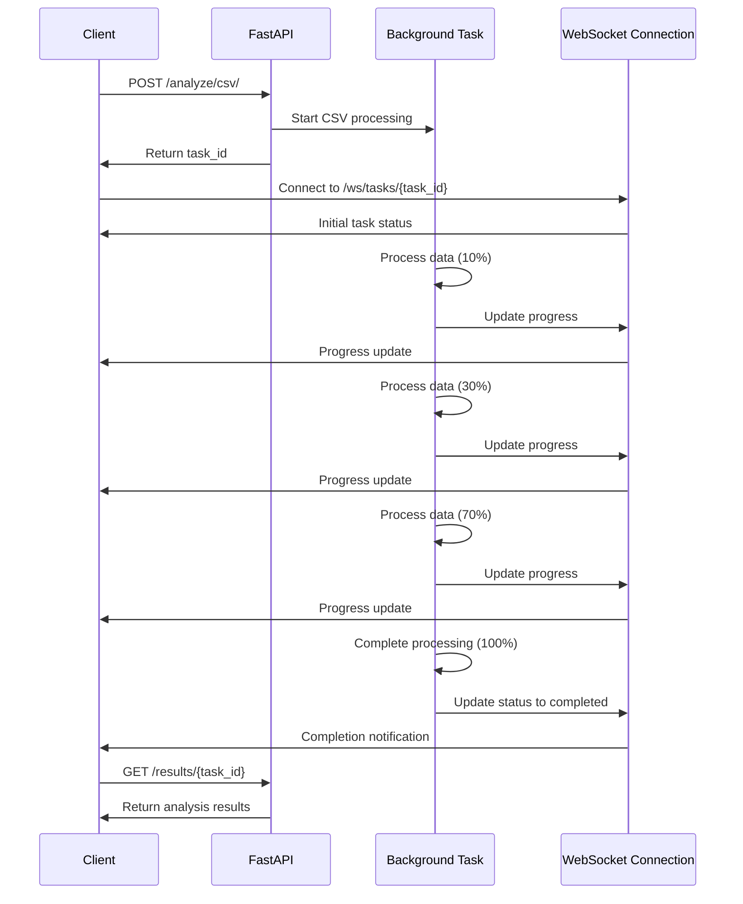

# 2.4 Background Tasks and Concurrency

## Using Background Tasks

FastAPI provides built-in support for background tasks, allowing you to perform operations after returning a response to the client. This is useful for operations that don't need to happen before the response is sent, such as:

1. Sending emails
2. Processing data
3. Updating caches
4. Writing logs
5. Performing cleanup operations

### Simple Background Tasks

```python
from fastapi import FastAPI, BackgroundTasks
from typing import Optional
import time

app = FastAPI()

def write_log(message: str):
    with open("log.txt", "a") as log_file:
        log_file.write(f"{message}\n")

def process_item(item_id: int):
    # Simulate a time-consuming process
    time.sleep(5)
    with open("processed_items.txt", "a") as processed_file:
        processed_file.write(f"Processed item {item_id}\n")

@app.post("/items/{item_id}")
async def create_item(
    item_id: int,
    background_tasks: BackgroundTasks,
    q: Optional[str] = None
):
    # Add background tasks
    background_tasks.add_task(write_log, f"Created item {item_id}")
    background_tasks.add_task(process_item, item_id)

    # Return response immediately
    return {"message": f"Item {item_id} creation initiated"}

```

In this example:

1. `BackgroundTasks` is injected as a parameter
2. Tasks are added to be executed after the response is sent
3. The client gets a quick response while processing continues in the background

### Multiple Background Tasks

You can add multiple tasks that will be executed in the order they were added:

```python
@app.post("/users/")
async def create_user(
    email: str,
    background_tasks: BackgroundTasks
):
    # These tasks run in sequence after response is sent
    background_tasks.add_task(write_log, f"User created with email: {email}")
    background_tasks.add_task(send_welcome_email, email)
    background_tasks.add_task(add_to_newsletter, email)

    return {"message": "User creation initiated"}

```

### Passing Background Tasks to Dependencies

You can pass the `BackgroundTasks` object to dependencies or other functions:

```python
from fastapi import FastAPI, BackgroundTasks, Depends

app = FastAPI()

def notify_admin(task_name: str):
    # Send notification to admin
    print(f"Admin notified about {task_name}")

def get_notification_dependencies(background_tasks: BackgroundTasks):
    background_tasks.add_task(notify_admin, "dependency injection")
    return {"background_tasks": background_tasks}

@app.post("/send-notification/{email}")
async def send_notification(
    email: str,
    background_tasks: BackgroundTasks,
    dependencies: dict = Depends(get_notification_dependencies)
):
    background_tasks.add_task(write_log, f"Notification sent to {email}")
    return {"message": "Notification sent in background"}

```

### Limitations of Background Tasks

While background tasks are convenient, they have limitations:

1. They run in the same process as the FastAPI application
2. If the server restarts, running background tasks are lost
3. They're not suitable for very long-running operations
4. They lack advanced features like retries or scheduling

For more complex background processing needs, consider using task queues like Celery or RQ.

## Creating and Managing Concurrent Operations

FastAPI is built on top of ASGI (Asynchronous Server Gateway Interface) and leverages Python's `async`/`await` syntax for handling concurrent operations efficiently.

### Asynchronous Endpoints

FastAPI allows you to define asynchronous path operation functions using `async def`:

```python
from fastapi import FastAPI
import asyncio

app = FastAPI()

@app.get("/items/")
async def read_items():
    # This endpoint can handle other requests while waiting
    await asyncio.sleep(1)  # Simulate I/O operation
    return {"items": ["Item1", "Item2"]}

```

When you define an endpoint with `async def`, FastAPI will:

1. Handle the request asynchronously
2. Allow the server to process other requests during I/O waiting
3. Resume the function when the `await` expression completes

### Mixing Sync and Async

FastAPI supports both synchronous and asynchronous path operations:

```python
from fastapi import FastAPI
import time
import asyncio

app = FastAPI()

@app.get("/async/")
async def read_async():
    # Non-blocking sleep
    await asyncio.sleep(1)
    return {"type": "async"}

@app.get("/sync/")
def read_sync():
    # Blocking sleep
    time.sleep(1)
    return {"type": "sync"}

```

Guidelines for choosing sync vs. async:

1. Use `async def` when you call other async functions with `await`
2. Use `def` (sync) when your code doesn't use `await` or is CPU-bound
3. Don't use `time.sleep()` in async functions; use `asyncio.sleep()` instead

### Concurrent HTTP Requests

For making multiple HTTP requests concurrently, use an async HTTP client:

```python
from fastapi import FastAPI
import httpx
import asyncio

app = FastAPI()

async def fetch_data(url: str):
    async with httpx.AsyncClient() as client:
        response = await client.get(url)
        return response.json()

@app.get("/combined-data/")
async def get_combined_data():
    # Execute requests concurrently
    tasks = [
        fetch_data("https://api.example.com/data1"),
        fetch_data("https://api.example.com/data2"),
        fetch_data("https://api.example.com/data3"),
    ]

    # Wait for all tasks to complete
    results = await asyncio.gather(*tasks)

    return {
        "data1": results[0],
        "data2": results[1],
        "data3": results[2],
    }

```

This approach allows multiple HTTP requests to be performed concurrently, significantly reducing the total time compared to sequential requests.



### Database Operations with Async

For database operations, use an async database driver:

```python
from fastapi import FastAPI, Depends
import databases
import sqlalchemy
from pydantic import BaseModel

# Database setup
DATABASE_URL = "sqlite:///./test.db"
database = databases.Database(DATABASE_URL)

metadata = sqlalchemy.MetaData()

users = sqlalchemy.Table(
    "users",
    metadata,
    sqlalchemy.Column("id", sqlalchemy.Integer, primary_key=True),
    sqlalchemy.Column("name", sqlalchemy.String),
    sqlalchemy.Column("email", sqlalchemy.String),
)

engine = sqlalchemy.create_engine(
    DATABASE_URL, connect_args={"check_same_thread": False}
)
metadata.create_all(engine)

# Models
class User(BaseModel):
    id: int
    name: str
    email: str

class UserCreate(BaseModel):
    name: str
    email: str

app = FastAPI()

@app.on_event("startup")
async def startup():
    await database.connect()

@app.on_event("shutdown")
async def shutdown():
    await database.disconnect()

@app.get("/users/", response_model=list[User])
async def read_users():
    query = users.select()
    return await database.fetch_all(query)

@app.post("/users/", response_model=User)
async def create_user(user: UserCreate):
    query = users.insert().values(name=user.name, email=user.email)
    last_record_id = await database.execute(query)
    return {**user.dict(), "id": last_record_id}

@app.get("/users/{user_id}", response_model=User)
async def read_user(user_id: int):
    query = users.select().where(users.c.id == user_id)
    return await database.fetch_one(query)

```

By using async database drivers like `databases`, you can perform database operations without blocking the event loop, allowing your API to handle more concurrent requests.

## Working with Async Functions

### AsyncIO Basics

When working with async functions, it's important to understand some AsyncIO concepts:

```python
import asyncio

# Define async functions
async def fetch_user(user_id: int):
    await asyncio.sleep(1)  # Simulate API call
    return {"id": user_id, "name": f"User {user_id}"}

async def fetch_post(post_id: int):
    await asyncio.sleep(0.5)  # Simulate API call
    return {"id": post_id, "title": f"Post {post_id}"}

# Sequential execution
async def get_user_and_posts_sequential(user_id: int):
    user = await fetch_user(user_id)
    posts = []
    for i in range(3):
        post = await fetch_post(i)
        posts.append(post)
    return {"user": user, "posts": posts}

# Concurrent execution
async def get_user_and_posts_concurrent(user_id: int):
    # Start user fetch
    user_task = asyncio.create_task(fetch_user(user_id))

    # Start post fetches concurrently
    post_tasks = [asyncio.create_task(fetch_post(i)) for i in range(3)]

    # Await user result
    user = await user_task

    # Await all post results
    posts = await asyncio.gather(*post_tasks)

    return {"user": user, "posts": posts}

```

Key AsyncIO concepts:

1. `async def` defines a coroutine function
2. `await` suspends execution until the awaited coroutine completes
3. `asyncio.create_task()` schedules a coroutine to run concurrently
4. `asyncio.gather()` waits for multiple awaitables to complete

### Integration with FastAPI

```python
from fastapi import FastAPI
import asyncio

app = FastAPI()

async def fetch_user(user_id: int):
    await asyncio.sleep(1)  # Simulate API call
    return {"id": user_id, "name": f"User {user_id}"}

async def fetch_post(post_id: int):
    await asyncio.sleep(0.5)  # Simulate API call
    return {"id": post_id, "title": f"Post {post_id}"}

@app.get("/users/{user_id}/profile")
async def get_user_profile(user_id: int):
    # Run tasks concurrently
    user_task = asyncio.create_task(fetch_user(user_id))
    post_tasks = [asyncio.create_task(fetch_post(i)) for i in range(3)]

    # Await results
    user = await user_task
    posts = await asyncio.gather(*post_tasks)

    return {"user": user, "recent_posts": posts}

```

This endpoint handles fetching a user and their posts concurrently, reducing the total response time.

## Handling Long-Running Tasks

For tasks that take too long to complete within a regular request-response cycle, you have several options:

### 1. Background Tasks (for short operations)

```python
from fastapi import FastAPI, BackgroundTasks
import time

app = FastAPI()

def generate_report(user_id: int):
    # Simulate a report generation that takes time
    time.sleep(10)
    with open(f"report_{user_id}.txt", "w") as f:
        f.write(f"Report for user {user_id}")

@app.post("/reports/{user_id}")
async def create_report(user_id: int, background_tasks: BackgroundTasks):
    background_tasks.add_task(generate_report, user_id)
    return {"message": "Report generation started"}

```

### 2. Task Queues (for longer operations)

For more complex or longer-running tasks, integrate with a task queue like Celery:

```python
from fastapi import FastAPI
from celery_app import celery_app  # Your Celery app
from pydantic import BaseModel

app = FastAPI()

class ReportRequest(BaseModel):
    user_id: int
    report_type: str

@app.post("/reports/")
async def create_report(request: ReportRequest):
    # Submit task to Celery
    task = celery_app.send_task(
        "tasks.generate_report",
        args=[request.user_id, request.report_type]
    )

    return {"task_id": task.id, "message": "Report generation queued"}

@app.get("/reports/status/{task_id}")
async def get_report_status(task_id: str):
    # Check task status in Celery
    task_result = celery_app.AsyncResult(task_id)

    result = {
        "task_id": task_id,
        "status": task_result.status,
    }

    if task_result.status == "SUCCESS":
        result["result"] = task_result.get()

    return result

```

A basic Celery setup for the above example:

```python
# celery_app.py
from celery import Celery

celery_app = Celery(
    "tasks",
    broker="redis://localhost:6379/0",
    backend="redis://localhost:6379/0"
)

# tasks.py
from celery_app import celery_app
import time

@celery_app.task
def generate_report(user_id, report_type):
    # Simulate long report generation
    time.sleep(30)
    return {
        "user_id": user_id,
        "report_type": report_type,
        "report_url": f"/reports/download/{user_id}_{report_type}.pdf"
    }

```



### 3. WebSockets for Real-Time Updates

For tasks where you want to provide real-time updates to clients:

```python
from fastapi import FastAPI, WebSocket
import asyncio
import random

app = FastAPI()

@app.websocket("/ws/tasks/{task_id}")
async def task_status(websocket: WebSocket, task_id: str):
    await websocket.accept()

    # Simulate a long-running task with progress updates
    total_steps = 10
    for step in range(1, total_steps + 1):
        # Simulate work
        await asyncio.sleep(1)

        # Send progress update
        progress = step / total_steps * 100
        await websocket.send_json({
            "task_id": task_id,
            "progress": progress,
            "status": "in_progress" if step < total_steps else "completed",
            "current_step": step,
            "total_steps": total_steps
        })

    await websocket.close()

```

## Task Management Strategies

### Task Status Tracking

For tracking the status of long-running tasks:

```python
from fastapi import FastAPI, BackgroundTasks, HTTPException
from pydantic import BaseModel
from typing import Dict, Optional
import asyncio
import uuid
import time

app = FastAPI()

# In-memory task storage (use Redis or a database in production)
tasks_store = {}

class TaskStatus(BaseModel):
    task_id: str
    status: str
    progress: float = 0
    result: Optional[Dict] = None
    error: Optional[str] = None

class ProcessRequest(BaseModel):
    data: Dict

async def process_data_task(task_id: str, data: Dict):
    try:
        # Update status to in progress
        tasks_store[task_id].status = "in_progress"

        # Simulate steps of processing
        total_steps = 5
        for step in range(total_steps):
            # Simulate work
            await asyncio.sleep(2)

            # Update progress
            progress = (step + 1) / total_steps * 100
            tasks_store[task_id].progress = progress

        # Simulate result
        result = {"processed_items": len(data), "summary": "Processing complete"}

        # Update status to completed
        tasks_store[task_id].status = "completed"
        tasks_store[task_id].result = result

    except Exception as e:
        # Update status to failed
        tasks_store[task_id].status = "failed"
        tasks_store[task_id].error = str(e)

@app.post("/process/", response_model=TaskStatus)
async def process_data(request: ProcessRequest, background_tasks: BackgroundTasks):
    # Generate a unique task ID
    task_id = str(uuid.uuid4())

    # Initialize task status
    task_status = TaskStatus(task_id=task_id, status="pending")
    tasks_store[task_id] = task_status

    # Start processing in the background
    background_tasks.add_task(process_data_task, task_id, request.data)

    return task_status

@app.get("/tasks/{task_id}", response_model=TaskStatus)
async def get_task_status(task_id: str):
    if task_id not in tasks_store:
        raise HTTPException(status_code=404, detail="Task not found")

    return tasks_store[task_id]

```

This implementation:

1. Creates a unique ID for each task
2. Stores the task status in memory (use Redis or a database in production)
3. Updates the status as the task progresses
4. Provides an endpoint to check the current status

### Task Cancellation

For tasks that may need to be cancelled:

```python
from fastapi import FastAPI, BackgroundTasks, HTTPException
import asyncio
import uuid
from typing import Dict

app = FastAPI()

# Store for tasks and their cancellation events
tasks_store = {}
cancellation_events = {}

async def long_running_task(task_id: str, cancellation_event: asyncio.Event):
    try:
        # Store reference to the task
        tasks_store[task_id] = {
            "status": "running",
            "progress": 0
        }

        # Simulate a long-running task with cancellation support
        total_steps = 20
        for step in range(total_steps):
            # Check for cancellation
            if cancellation_event.is_set():
                tasks_store[task_id]["status"] = "cancelled"
                return

            # Do some work
            await asyncio.sleep(1)

            # Update progress
            progress = (step + 1) / total_steps * 100
            tasks_store[task_id]["progress"] = progress

        # Task completed successfully
        tasks_store[task_id]["status"] = "completed"

    except Exception as e:
        tasks_store[task_id]["status"] = "failed"
        tasks_store[task_id]["error"] = str(e)

@app.post("/tasks/start")
async def start_task(background_tasks: BackgroundTasks):
    task_id = str(uuid.uuid4())

    # Create a cancellation event
    cancellation_event = asyncio.Event()
    cancellation_events[task_id] = cancellation_event

    # Start the task
    background_tasks.add_task(long_running_task, task_id, cancellation_event)

    return {"task_id": task_id, "status": "started"}

@app.post("/tasks/{task_id}/cancel")
async def cancel_task(task_id: str):
    if task_id not in cancellation_events:
        raise HTTPException(status_code=404, detail="Task not found")

    # Set the cancellation event
    cancellation_events[task_id].set()

    return {"task_id": task_id, "status": "cancellation_requested"}

@app.get("/tasks/{task_id}")
async def get_task_status(task_id: str):
    if task_id not in tasks_store:
        raise HTTPException(status_code=404, detail="Task not found")

    return {"task_id": task_id, **tasks_store[task_id]}

```

This implementation:

1. Uses asyncio.Event for cancellation signaling
2. Periodically checks if cancellation is requested
3. Provides endpoints to start, cancel, and check tasks

### Rate Limiting and Throttling

For controlling the rate of task execution:

```python
from fastapi import FastAPI, BackgroundTasks, HTTPException, Depends
import asyncio
import time
from pydantic import BaseModel
import uuid
from typing import Dict

app = FastAPI()

# Simple rate limiter for tasks
class TaskRateLimiter:
    def __init__(self, max_concurrent: int = 3, rate_limit: int = 10):
        self.semaphore = asyncio.Semaphore(max_concurrent)
        self.rate_limit = rate_limit  # tasks per minute
        self.task_timestamps = []

    async def acquire(self):
        # Check rate limit
        current_time = time.time()
        minute_ago = current_time - 60

        # Remove timestamps older than 1 minute
        self.task_timestamps = [ts for ts in self.task_timestamps if ts > minute_ago]

        # Check if we've exceeded the rate limit
        if len(self.task_timestamps) >= self.rate_limit:
            return False

        # Add current timestamp
        self.task_timestamps.append(current_time)

        # Acquire semaphore (blocks if max_concurrent is reached)
        await self.semaphore.acquire()
        return True

    def release(self):
        self.semaphore.release()

# Create rate limiter instance
rate_limiter = TaskRateLimiter(max_concurrent=3, rate_limit=30)

# Task storage
tasks_store = {}

class TaskRequest(BaseModel):
    data: Dict

async def process_task(task_id: str, data: Dict):
    try:
        tasks_store[task_id] = {"status": "running", "progress": 0}

        # Simulate processing
        total_steps = 10
        for step in range(total_steps):
            await asyncio.sleep(1)
            progress = (step + 1) / total_steps * 100
            tasks_store[task_id]["progress"] = progress

        tasks_store[task_id]["status"] = "completed"
        tasks_store[task_id]["result"] = {"processed": True}

    except Exception as e:
        tasks_store[task_id]["status"] = "failed"
        tasks_store[task_id]["error"] = str(e)

    finally:
        # Release the semaphore to allow another task to start
        rate_limiter.release()

@app.post("/tasks/")
async def create_task(request: TaskRequest, background_tasks: BackgroundTasks):
    # Try to acquire the rate limiter
    if not await rate_limiter.acquire():
        raise HTTPException(
            status_code=429,
            detail="Too many requests. Please try again later."
        )

    task_id = str(uuid.uuid4())
    tasks_store[task_id] = {"status": "pending"}

    # Start the task
    background_tasks.add_task(process_task, task_id, request.data)

    return {"task_id": task_id, "status": "accepted"}

@app.get("/tasks/{task_id}")
async def get_task_status(task_id: str):
    if task_id not in tasks_store:
        raise HTTPException(status_code=404, detail="Task not found")

    return {"task_id": task_id, **tasks_store[task_id]}

```

This implementation:

1. Limits the number of concurrent tasks using a semaphore
2. Implements a rate limit for tasks per minute
3. Properly releases resources when tasks complete

## Real-World Example: Processing and Analyzing Data

Let's create a more comprehensive example that demonstrates background tasks, concurrency, and task management for a data processing API:

```python
from fastapi import FastAPI, BackgroundTasks, UploadFile, File, HTTPException, WebSocket, WebSocketDisconnect
from fastapi.responses import JSONResponse
from pydantic import BaseModel
from typing import List, Dict, Optional, Set
import pandas as pd
import asyncio
import json
import uuid
import time
from datetime import datetime
import os

app = FastAPI()

# Storage for tasks and active WebSocket connections
tasks_store = {}
active_connections = {}

# Models
class AnalysisRequest(BaseModel):
    analysis_type: str
    filters: Optional[Dict] = None
    aggregations: Optional[List[str]] = None

class TaskStatus(BaseModel):
    task_id: str
    status: str
    progress: float = 0
    started_at: datetime
    completed_at: Optional[datetime] = None
    result_file: Optional[str] = None
    error: Optional[str] = None

# Helper functions
async def process_csv_file(task_id: str, file_path: str, analysis_request: AnalysisRequest):
    try:
        # Update task status
        tasks_store[task_id].status = "processing"

        # Simulate data loading
        await asyncio.sleep(2)
        tasks_store[task_id].progress = 10
        await notify_clients(task_id, tasks_store[task_id])

        # In a real app, we'd use pandas to process the CSV
        # Here we simulate the processing steps

        # Simulate data cleaning
        await asyncio.sleep(2)
        tasks_store[task_id].progress = 30
        await notify_clients(task_id, tasks_store[task_id])

        # Simulate filtering
        await asyncio.sleep(2)
        tasks_store[task_id].progress = 50
        await notify_clients(task_id, tasks_store[task_id])

        # Simulate aggregation
        await asyncio.sleep(2)
        tasks_store[task_id].progress = 70
        await notify_clients(task_id, tasks_store[task_id])

        # Simulate result generation
        await asyncio.sleep(2)
        result_file = f"results_{task_id}.json"

        # Create a dummy result file
        with open(result_file, "w") as f:
            json.dump({
                "analysis_type": analysis_request.analysis_type,
                "row_count": 1000,
                "summary": {
                    "min": 10,
                    "max": 1000,
                    "mean": 500
                },
                "top_values": [
                    {"category": "A", "count": 400},
                    {"category": "B", "count": 350},
                    {"category": "C", "count": 250}
                ]
            }, f)

        # Update task status to completed
        tasks_store[task_id].status = "completed"
        tasks_store[task_id].progress = 100
        tasks_store[task_id].completed_at = datetime.now()
        tasks_store[task_id].result_file = result_file

        # Notify connected clients
        await notify_clients(task_id, tasks_store[task_id])

    except Exception as e:
        # Update task status to failed
        tasks_store[task_id].status = "failed"
        tasks_store[task_id].error = str(e)
        tasks_store[task_id].completed_at = datetime.now()

        # Notify connected clients
        await notify_clients(task_id, tasks_store[task_id])

# WebSocket notification handler
async def notify_clients(task_id: str, status_update):
    if task_id in active_connections:
        for connection in active_connections[task_id]:
            try:
                await connection.send_json(status_update.dict())
            except Exception:
                # Connection might be closed
                pass

# Endpoints
@app.post("/analyze/csv/", response_model=TaskStatus)
async def analyze_csv(
    background_tasks: BackgroundTasks,
    file: UploadFile = File(...),
    request: AnalysisRequest = None
):
    # Generate task ID
    task_id = str(uuid.uuid4())

    # Save uploaded file
    file_path = f"uploads/{file.filename}"
    os.makedirs("uploads", exist_ok=True)

    with open(file_path, "wb") as f:
        f.write(await file.read())

    # Initialize task status
    tasks_store[task_id] = TaskStatus(
        task_id=task_id,
        status="queued",
        started_at=datetime.now()
    )

    # Initialize active connections for this task
    active_connections[task_id] = set()

    # Start background processing
    background_tasks.add_task(process_csv_file, task_id, file_path, request)

    return tasks_store[task_id]

@app.get("/tasks/{task_id}", response_model=TaskStatus)
async def get_task_status(task_id: str):
    if task_id not in tasks_store:
        raise HTTPException(status_code=404, detail="Task not found")

    return tasks_store[task_id]

@app.get("/results/{task_id}")
async def get_task_results(task_id: str):
    if task_id not in tasks_store:
        raise HTTPException(status_code=404, detail="Task not found")

    task = tasks_store[task_id]

    if task.status != "completed":
        raise HTTPException(
            status_code=400,
            detail=f"Task is not completed. Current status: {task.status}"
        )

    if not task.result_file or not os.path.exists(task.result_file):
        raise HTTPException(status_code=404, detail="Result file not found")

    with open(task.result_file, "r") as f:
        result = json.load(f)

    return result

@app.websocket("/ws/tasks/{task_id}")
async def task_status_websocket(websocket: WebSocket, task_id: str):
    await websocket.accept()

    if task_id not in tasks_store:
        await websocket.send_json({"error": "Task not found"})
        await websocket.close()
        return

    # Add connection to active connections
    if task_id not in active_connections:
        active_connections[task_id] = set()

    active_connections[task_id].add(websocket)

    try:
        # Send current status immediately
        await websocket.send_json(tasks_store[task_id].dict())

        # Keep connection open until client disconnects
        while True:
            # Wait for client message (used to detect disconnection)
            await websocket.receive_text()

    except WebSocketDisconnect:
        # Remove from active connections
        active_connections[task_id].remove(websocket)

```

This advanced example demonstrates:

1. Asynchronous processing of uploaded CSV files
2. Real-time status updates via WebSockets
3. Task management with status tracking
4. Result file generation and retrieval
5. Error handling throughout the process



## Advanced Concurrency Patterns

### Parallel vs. Concurrent Execution

It's important to understand the difference between parallelism and concurrency:

- **Concurrency**: Managing multiple tasks at the same time (not necessarily executing them simultaneously)
- **Parallelism**: Executing multiple tasks simultaneously (requires multiple CPU cores)

FastAPI and `asyncio` provide concurrency, which is ideal for I/O-bound operations like:

- HTTP requests
- Database queries
- File operations
- Network operations

For CPU-bound operations requiring parallelism, consider:

### CPU-Bound Operations with ProcessPoolExecutor

```python
from fastapi import FastAPI
import asyncio
from concurrent.futures import ProcessPoolExecutor
import time

app = FastAPI()

# Create a process pool
process_pool = ProcessPoolExecutor()

def cpu_bound_function(x):
    # Simulate CPU-intensive computation
    start = time.time()
    # Calculate prime numbers as a CPU-intensive task
    result = 0
    for i in range(10**7):
        result += i * i
    return {
        "input": x,
        "result": result,
        "time_taken": time.time() - start
    }

@app.get("/cpu-bound/{param}")
async def cpu_bound_endpoint(param: int):
    # Run CPU-bound function in a separate process
    loop = asyncio.get_event_loop()
    result = await loop.run_in_executor(
        process_pool,
        cpu_bound_function,
        param
    )
    return result

@app.get("/cpu-bound-parallel/")
async def cpu_bound_parallel():
    # Run multiple CPU-bound functions in parallel
    loop = asyncio.get_event_loop()
    tasks = [
        loop.run_in_executor(process_pool, cpu_bound_function, i)
        for i in range(4)  # Run 4 tasks in parallel
    ]

    # Wait for all tasks to complete
    results = await asyncio.gather(*tasks)

    return results

```

This approach:

1. Uses `ProcessPoolExecutor` to run CPU-bound tasks in separate processes
2. Avoids blocking the event loop during heavy computation
3. Utilizes multiple CPU cores for parallel execution

### Thread Pool for I/O-Bound Operations with Blocking Libraries

While `asyncio` is great for I/O operations, some Python libraries are not async-compatible. For these, use `ThreadPoolExecutor`:

```python
from fastapi import FastAPI
import asyncio
from concurrent.futures import ThreadPoolExecutor
import requests  # A blocking HTTP library
import time

app = FastAPI()

# Create a thread pool
thread_pool = ThreadPoolExecutor(max_workers=10)

def fetch_url(url):
    # Blocking HTTP request
    start = time.time()
    response = requests.get(url)
    return {
        "url": url,
        "status": response.status_code,
        "time_taken": time.time() - start,
        "content_length": len(response.content)
    }

@app.get("/fetch-urls/")
async def fetch_multiple_urls():
    urls = [
        "https://www.example.com",
        "https://www.google.com",
        "https://www.github.com",
        "https://www.microsoft.com"
    ]

    # Run blocking requests in a thread pool
    loop = asyncio.get_event_loop()
    tasks = [
        loop.run_in_executor(thread_pool, fetch_url, url)
        for url in urls
    ]

    # Wait for all requests to complete
    results = await asyncio.gather(*tasks)

    return results

```

This approach:

1. Uses `ThreadPoolExecutor` for blocking I/O operations
2. Allows concurrent execution of non-async code
3. Prevents blocking the event loop

## Task Scheduling

For recurring tasks or tasks that need to run at specific times:

```python
from fastapi import FastAPI, BackgroundTasks
import asyncio
import time
from datetime import datetime, timedelta
from typing import Dict, List, Optional, Callable
import uuid

app = FastAPI()

# Task scheduling system
class TaskScheduler:
    def __init__(self):
        self.tasks: Dict[str, Dict] = {}
        self.running = False
        self.scheduler_task = None

    async def start(self):
        if self.running:
            return

        self.running = True
        self.scheduler_task = asyncio.create_task(self._scheduler_loop())

    async def stop(self):
        if not self.running:
            return

        self.running = False
        if self.scheduler_task:
            self.scheduler_task.cancel()
            try:
                await self.scheduler_task
            except asyncio.CancelledError:
                pass

    async def _scheduler_loop(self):
        while self.running:
            now = datetime.now()

            for task_id, task in list(self.tasks.items()):
                if task["next_run"] <= now:
                    # Schedule the task to run
                    asyncio.create_task(self._run_task(task_id))

                    # Update next run time for recurring tasks
                    if task["interval"]:
                        task["next_run"] = now + task["interval"]
                    else:
                        # One-time task, remove it
                        del self.tasks[task_id]

            # Sleep for a short time before checking again
            await asyncio.sleep(1)

    async def _run_task(self, task_id):
        task = self.tasks.get(task_id)
        if not task:
            return

        try:
            # Execute the task function with arguments
            await task["func"](*task["args"], **task["kwargs"])

            # Update last run time
            task["last_run"] = datetime.now()
            task["runs"] += 1

        except Exception as e:
            # Handle task execution error
            task["errors"].append(str(e))

    def schedule_task(
        self,
        func: Callable,
        args: List = None,
        kwargs: Dict = None,
        interval: Optional[timedelta] = None,
        run_at: Optional[datetime] = None
    ):
        args = args or []
        kwargs = kwargs or {}

        # Generate task ID
        task_id = str(uuid.uuid4())

        # Determine next run time
        if run_at:
            next_run = run_at
        else:
            next_run = datetime.now()

        # Store task information
        self.tasks[task_id] = {
            "func": func,
            "args": args,
            "kwargs": kwargs,
            "interval": interval,
            "next_run": next_run,
            "last_run": None,
            "runs": 0,
            "errors": []
        }

        return task_id

    def cancel_task(self, task_id):
        if task_id in self.tasks:
            del self.tasks[task_id]
            return True
        return False

    def get_task_info(self, task_id):
        task = self.tasks.get(task_id)
        if not task:
            return None

        # Return a copy of the task info without the function
        task_info = task.copy()
        task_info.pop("func")
        return task_info

    def get_all_tasks(self):
        # Return all tasks without the function objects
        return {
            task_id: {k: v for k, v in task.items() if k != "func"}
            for task_id, task in self.tasks.items()
        }

# Create scheduler instance
scheduler = TaskScheduler()

# Example task functions
async def send_email(recipient, subject, body):
    print(f"Sending email to {recipient}: {subject}")
    # Simulate email sending
    await asyncio.sleep(2)
    print(f"Email sent to {recipient}")

async def generate_report(report_type):
    print(f"Generating {report_type} report")
    # Simulate report generation
    await asyncio.sleep(5)
    print(f"{report_type} report generated")

async def cleanup_old_files():
    print("Cleaning up old files")
    # Simulate file cleanup
    await asyncio.sleep(1)
    print("Cleanup completed")

# Startup and shutdown events
@app.on_event("startup")
async def startup_event():
    await scheduler.start()

    # Schedule a recurring cleanup task
    scheduler.schedule_task(
        cleanup_old_files,
        interval=timedelta(hours=24)  # Run daily
    )

@app.on_event("shutdown")
async def shutdown_event():
    await scheduler.stop()

# API endpoints for task scheduling
@app.post("/schedule/email/")
async def schedule_email(
    recipient: str,
    subject: str,
    body: str,
    run_at: Optional[datetime] = None
):
    task_id = scheduler.schedule_task(
        send_email,
        args=[recipient, subject, body],
        run_at=run_at
    )

    return {"task_id": task_id, "scheduled": run_at or "immediately"}

@app.post("/schedule/report/{report_type}")
async def schedule_report(
    report_type: str,
    run_at: Optional[datetime] = None,
    recurring: bool = False,
    interval_hours: Optional[int] = None
):
    interval = timedelta(hours=interval_hours) if recurring and interval_hours else None

    task_id = scheduler.schedule_task(
        generate_report,
        args=[report_type],
        interval=interval,
        run_at=run_at
    )

    return {
        "task_id": task_id,
        "scheduled": run_at or "immediately",
        "recurring": recurring,
        "interval_hours": interval_hours
    }

@app.get("/scheduled-tasks/")
async def get_scheduled_tasks():
    return scheduler.get_all_tasks()

@app.get("/scheduled-tasks/{task_id}")
async def get_task_info(task_id: str):
    task_info = scheduler.get_task_info(task_id)
    if not task_info:
        raise HTTPException(status_code=404, detail="Task not found")
    return task_info

@app.delete("/scheduled-tasks/{task_id}")
async def cancel_task(task_id: str):
    if not scheduler.cancel_task(task_id):
        raise HTTPException(status_code=404, detail="Task not found")
    return {"task_id": task_id, "cancelled": True}

```

This task scheduler demonstrates:

1. Scheduling one-time and recurring tasks
2. Managing task execution times
3. Monitoring task execution history
4. API endpoints for task management
5. Proper startup and shutdown handling

## Summary

FastAPI's support for background tasks and concurrency provides powerful tools for building efficient APIs:

1. **Background Tasks**
   - Simple way to perform operations after response
   - Good for short, non-critical operations
   - Limited to the FastAPI process lifecycle
2. **Async/Await Support**
   - Leverage Python's async/await syntax
   - Handle concurrent operations efficiently
   - Keep your API responsive during I/O operations
3. **Task Management Strategies**
   - Track task status and progress
   - Provide status updates to clients
   - Support task cancellation when needed
   - Implement rate limiting and throttling
4. **Advanced Concurrency**
   - Use `ProcessPoolExecutor` for CPU-bound tasks
   - Use `ThreadPoolExecutor` for blocking I/O
   - Properly distribute work between processes, threads, and async tasks
5. **Real-time Updates**
   - WebSockets for immediate status updates
   - Event-driven architecture for responsive applications
6. **Task Scheduling**
   - Schedule tasks to run at specific times
   - Implement recurring tasks
   - Manage scheduled tasks via API

When choosing your approach, consider:

- Task duration (short, medium, long)
- Task type (I/O-bound, CPU-bound)
- Reliability requirements (retries, persistence)
- Scaling requirements (number of concurrent tasks)

For simple cases, FastAPI's built-in background tasks are sufficient. For more complex scenarios, integrate with dedicated task queuing systems like Celery, RQ, or modern solutions like Temporal or Prefect for workflow orchestration.
