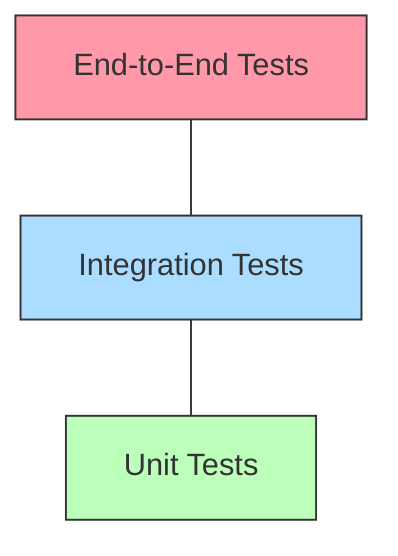
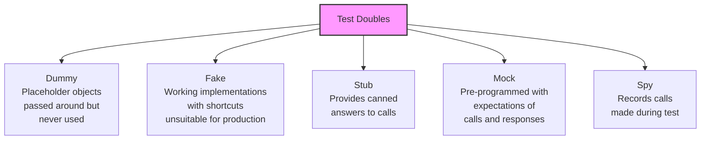
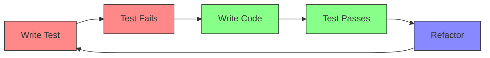
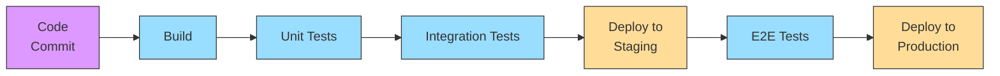
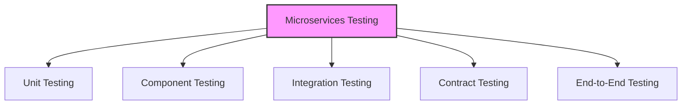

# 4.1 Automated Testing

## Theory

Automated testing is the practice of using software to execute tests automatically, comparing actual outcomes with expected outcomes. It helps detect defects early in the development cycle, ensures code quality, and facilitates continuous integration and delivery (CI/CD).

### Types of Automated Tests

1. **Unit Tests**
   - Test individual components or functions in isolation
   - Fast, focused, and numerous
   - Usually written by developers alongside code
2. **Integration Tests**
   - Test how components work together
   - Verify interactions between modules, services, or systems
   - More complex setup than unit tests
3. **Functional Tests**
   - Test complete functionality or features
   - Focus on business requirements
   - Can be UI-based or API-based
4. **End-to-End (E2E) Tests**
   - Test entire application workflows
   - Simulate real user scenarios
   - Slower and more brittle than other types
5. **Performance Tests**
   - Test system behavior under various load conditions
   - Measure response times, throughput, and resource usage
   - Identify bottlenecks and scalability issues

### Testing Pyramid

The Testing Pyramid is a concept that suggests how to balance different types of tests:



- **Bottom (Unit Tests)**: Many small, focused tests
- **Middle (Integration Tests)**: Moderate number of tests for component interactions
- **Top (E2E Tests)**: Few broad tests covering critical paths

## Real-Life Example

Consider an e-commerce application that allows users to browse products, add items to a cart, and complete purchases.

### Unit Test Example

Testing the pricing calculation function that applies discounts:

```python
def calculate_price(base_price, quantity, discount_code=None):
    total = base_price * quantity

    if discount_code == "SAVE10":
        total *= 0.9  # 10% discount
    elif discount_code == "SAVE20":
        total *= 0.8  # 20% discount

    return round(total, 2)

```

### Integration Test Example

Testing that the cart service integrates correctly with the inventory service when adding products.

### E2E Test Example

Testing the complete checkout flow: browse products, add to cart, enter shipping details, apply discount, and complete payment.

## Code Examples

### Unit Testing with pytest (Python)

```python
# File: pricing.py
def calculate_price(base_price, quantity, discount_code=None):
    total = base_price * quantity

    if discount_code == "SAVE10":
        total *= 0.9  # 10% discount
    elif discount_code == "SAVE20":
        total *= 0.8  # 20% discount

    return round(total, 2)

# File: test_pricing.py
import pytest
from pricing import calculate_price

def test_calculate_price_no_discount():
    # Arrange
    base_price = 10.00
    quantity = 2

    # Act
    result = calculate_price(base_price, quantity)

    # Assert
    assert result == 20.00

def test_calculate_price_with_10_percent_discount():
    # Arrange
    base_price = 10.00
    quantity = 2
    discount_code = "SAVE10"

    # Act
    result = calculate_price(base_price, quantity, discount_code)

    # Assert
    assert result == 18.00

def test_calculate_price_with_20_percent_discount():
    # Arrange
    base_price = 10.00
    quantity = 2
    discount_code = "SAVE20"

    # Act
    result = calculate_price(base_price, quantity, discount_code)

    # Assert
    assert result == 16.00

def test_calculate_price_with_invalid_discount():
    # Arrange
    base_price = 10.00
    quantity = 2
    discount_code = "INVALID"

    # Act
    result = calculate_price(base_price, quantity, discount_code)

    # Assert
    assert result == 20.00

```

### Integration Testing with pytest and Requests

```python
# File: test_product_api_integration.py
import pytest
import requests

# API endpoint
BASE_URL = "http://localhost:8000/api"

def test_add_product_to_cart():
    # Setup - Create a new cart
    cart_response = requests.post(f"{BASE_URL}/carts/")
    assert cart_response.status_code == 201

    cart_data = cart_response.json()
    cart_id = cart_data["id"]

    # Test - Add product to cart
    product_id = 123  # Assuming this product exists
    add_item_data = {
        "product_id": product_id,
        "quantity": 2
    }

    add_response = requests.post(
        f"{BASE_URL}/carts/{cart_id}/items/",
        json=add_item_data
    )
    assert add_response.status_code == 201

    # Verify - Check cart contains the product
    cart_detail = requests.get(f"{BASE_URL}/carts/{cart_id}/")
    assert cart_detail.status_code == 200

    cart_items = cart_detail.json()["items"]
    assert len(cart_items) == 1
    assert cart_items[0]["product_id"] == product_id
    assert cart_items[0]["quantity"] == 2

    # Cleanup
    requests.delete(f"{BASE_URL}/carts/{cart_id}/")

```

### Mock Testing with unittest.mock

```python
# File: inventory_service.py
class InventoryService:
    def check_availability(self, product_id, quantity):
        # In a real app, this would query a database or external service
        # For this example, we'll just simulate it
        pass

# File: cart_service.py
class CartService:
    def __init__(self, inventory_service):
        self.inventory_service = inventory_service
        self.items = {}

    def add_item(self, product_id, quantity):
        # Check if product is available
        if not self.inventory_service.check_availability(product_id, quantity):
            raise ValueError("Product not available in requested quantity")

        # Add to cart
        if product_id in self.items:
            self.items[product_id] += quantity
        else:
            self.items[product_id] = quantity

        return True

# File: test_cart_service.py
import unittest
from unittest.mock import Mock
from cart_service import CartService

class TestCartService(unittest.TestCase):
    def setUp(self):
        # Create a mock inventory service
        self.mock_inventory = Mock()

        # Create cart service with mock dependency
        self.cart_service = CartService(self.mock_inventory)

    def test_add_item_success(self):
        # Configure mock to return True for availability check
        product_id = 123
        quantity = 2
        self.mock_inventory.check_availability.return_value = True

        # Call add_item
        result = self.cart_service.add_item(product_id, quantity)

        # Assertions
        self.assertTrue(result)
        self.assertEqual(self.cart_service.items[product_id], quantity)

        # Verify mock was called with correct arguments
        self.mock_inventory.check_availability.assert_called_once_with(
            product_id, quantity
        )

    def test_add_item_not_available(self):
        # Configure mock to return False for availability check
        product_id = 456
        quantity = 2
        self.mock_inventory.check_availability.return_value = False

        # Call add_item and expect exception
        with self.assertRaises(ValueError):
            self.cart_service.add_item(product_id, quantity)

        # Verify cart is still empty
        self.assertNotIn(product_id, self.cart_service.items)

```

### E2E Testing with Selenium (Python)

```python
# File: test_checkout_e2e.py
import unittest
from selenium import webdriver
from selenium.webdriver.common.by import By
from selenium.webdriver.common.keys import Keys
from selenium.webdriver.support.ui import WebDriverWait
from selenium.webdriver.support import expected_conditions as EC

class CheckoutE2ETest(unittest.TestCase):
    def setUp(self):
        self.driver = webdriver.Chrome()
        self.driver.implicitly_wait(10)

    def tearDown(self):
        self.driver.quit()

    def test_complete_checkout_process(self):
        # Navigate to the website
        self.driver.get("https://example-shop.com")

        # Search for a product
        search_box = self.driver.find_element(By.ID, "search-input")
        search_box.send_keys("laptop")
        search_box.send_keys(Keys.RETURN)

        # Wait for search results and click on first product
        wait = WebDriverWait(self.driver, 10)
        first_product = wait.until(
            EC.element_to_be_clickable((By.CSS_SELECTOR, ".product-item"))
        )
        first_product.click()

        # Add to cart
        add_to_cart_button = self.driver.find_element(By.ID, "add-to-cart")
        add_to_cart_button.click()

        # Go to cart
        cart_icon = wait.until(
            EC.element_to_be_clickable((By.ID, "cart-icon"))
        )
        cart_icon.click()

        # Proceed to checkout
        checkout_button = self.driver.find_element(By.ID, "checkout-button")
        checkout_button.click()

        # Fill in shipping information
        self.driver.find_element(By.ID, "full-name").send_keys("John Doe")
        self.driver.find_element(By.ID, "address").send_keys("123 Main St")
        self.driver.find_element(By.ID, "city").send_keys("Anytown")
        self.driver.find_element(By.ID, "postal-code").send_keys("12345")

        # Continue to payment
        continue_button = self.driver.find_element(By.ID, "continue-button")
        continue_button.click()

        # Fill in payment details
        self.driver.find_element(By.ID, "card-number").send_keys("4111111111111111")
        self.driver.find_element(By.ID, "card-name").send_keys("John Doe")
        self.driver.find_element(By.ID, "expiry-date").send_keys("1225")
        self.driver.find_element(By.ID, "cvv").send_keys("123")

        # Complete order
        place_order_button = self.driver.find_element(By.ID, "place-order-button")
        place_order_button.click()

        # Verify order confirmation
        confirmation = wait.until(
            EC.visibility_of_element_located((By.ID, "order-confirmation"))
        )

        # Assert that order was successful
        self.assertTrue(confirmation.is_displayed())
        self.assertIn("Thank you for your order", confirmation.text)

```

### API Testing with pytest and requests

```python
# File: test_product_api.py
import pytest
import requests

BASE_URL = "http://api.example.com/v1"
API_KEY = "test_api_key"  # Would be stored securely in real tests

@pytest.fixture
def auth_headers():
    return {"Authorization": f"Bearer {API_KEY}"}

def test_get_product_list(auth_headers):
    response = requests.get(f"{BASE_URL}/products", headers=auth_headers)

    # Verify response code
    assert response.status_code == 200

    # Verify response structure
    data = response.json()
    assert "products" in data
    assert isinstance(data["products"], list)

    # Verify product fields if list is not empty
    if data["products"]:
        product = data["products"][0]
        required_fields = ["id", "name", "price", "category"]
        for field in required_fields:
            assert field in product

def test_get_product_detail(auth_headers):
    # Assuming product with ID 1 exists
    product_id = 1
    response = requests.get(f"{BASE_URL}/products/{product_id}", headers=auth_headers)

    # Verify response code
    assert response.status_code == 200

    # Verify product data
    product = response.json()
    assert product["id"] == product_id
    assert "name" in product
    assert "price" in product
    assert "description" in product
    assert "category" in product

def test_create_product(auth_headers):
    new_product = {
        "name": "Test Product",
        "price": 29.99,
        "description": "A test product",
        "category": "test"
    }

    response = requests.post(
        f"{BASE_URL}/products",
        headers=auth_headers,
        json=new_product
    )

    # Verify response code
    assert response.status_code == 201

    # Verify response contains created product
    created = response.json()
    assert "id" in created
    assert created["name"] == new_product["name"]
    assert created["price"] == new_product["price"]

    # Cleanup: Delete the created product
    delete_response = requests.delete(
        f"{BASE_URL}/products/{created['id']}",
        headers=auth_headers
    )
    assert delete_response.status_code == 204

```

## Testing Frameworks and Tools

### Popular Testing Frameworks

1. **Python**
   - `pytest`: Feature-rich, flexible test framework
   - `unittest`: Standard library test framework
   - `nose2`: Extended unittest
2. **JavaScript**
   - `Jest`: Full-featured testing framework by Facebook
   - `Mocha`: Flexible testing framework
   - `Jasmine`: Behavior-driven development framework
3. **Java**
   - `JUnit`: Standard testing framework for Java
   - `TestNG`: Feature-rich alternative to JUnit
   - `Mockito`: Mocking framework
4. **Ruby**
   - `RSpec`: Behavior-driven development for Ruby
   - `Minitest`: Lightweight test framework

### Test Doubles



1. **Dummy**: Objects that are passed around but never used
2. **Fake**: Working implementations with shortcuts (e.g., in-memory database)
3. **Stub**: Provides canned answers to calls
4. **Mock**: Pre-programmed with expectations and can verify if calls were made
5. **Spy**: Records calls made during test execution

## Test-Driven Development (TDD)



1. **Red**: Write a failing test for the new functionality
2. **Green**: Write the minimum code needed to make the test pass
3. **Refactor**: Clean up the code while ensuring tests still pass

### TDD Example

```python
# TDD Process for a simple calculator function

# Step 1: Write a failing test (Red)
# test_calculator.py
def test_add():
    from calculator import add
    assert add(2, 3) == 5

# Running this test fails because `add` doesn't exist yet

# Step 2: Write minimal code to pass (Green)
# calculator.py
def add(a, b):
    return 5  # Hardcoded to pass the specific test

# Test now passes

# Step 3: Write more tests
# test_calculator.py
def test_add_different_numbers():
    from calculator import add
    assert add(5, 7) == 12

# This test fails

# Step 4: Improve the implementation (Green again)
# calculator.py
def add(a, b):
    return a + b  # Proper implementation

# All tests now pass

# Step 5: Refactor if needed, ensuring tests still pass

```

## Behavior-Driven Development (BDD)

BDD extends TDD by writing tests in a natural language that non-programmers can read. It focuses on describing behavior in terms of user stories.

### BDD Example with Behave (Python)

```gherkin
# File: features/cart.feature
Feature: Shopping Cart
  As a customer
  I want to add items to my cart
  So that I can purchase them later

  Scenario: Adding an item to the cart
    Given I am on the product page for "Laptop"
    When I click the "Add to Cart" button
    Then I should see "Item added to cart" message
    And my cart should contain 1 item

```

```python
# File: features/steps/cart_steps.py
from behave import given, when, then

@given('I am on the product page for "{product_name}"')
def step_impl(context, product_name):
    context.browser.get(f"https://example-shop.com/products/{product_name.lower()}")

@when('I click the "{button_text}" button')
def step_impl(context, button_text):
    button = context.browser.find_element_by_xpath(f"//button[contains(text(), '{button_text}')]")
    button.click()

@then('I should see "{message}" message')
def step_impl(context, message):
    notification = context.browser.find_element_by_id("notification")
    assert message in notification.text

@then('my cart should contain {count:d} item')
def step_impl(context, count):
    cart_count = context.browser.find_element_by_id("cart-count")
    assert int(cart_count.text) == count

```

## CI/CD Integration

Testing is a critical part of Continuous Integration/Continuous Delivery pipelines:



### GitHub Actions Example

```yaml
# .github/workflows/test.yml
name: Test Suite

on:
  push:
    branches: [main]
  pull_request:
    branches: [main]

jobs:
  test:
    runs-on: ubuntu-latest

    strategy:
      matrix:
        python-version: [3.8, 3.9]

    steps:
      - uses: actions/checkout@v2

      - name: Set up Python ${{ matrix.python-version }}
        uses: actions/setup-python@v2
        with:
          python-version: ${{ matrix.python-version }}

      - name: Install dependencies
        run: |
          python -m pip install --upgrade pip
          pip install -r requirements.txt
          pip install pytest pytest-cov

      - name: Run unit tests
        run: |
          pytest --cov=app tests/unit/

      - name: Run integration tests
        run: |
          pytest tests/integration/

      - name: Upload coverage report
        uses: codecov/codecov-action@v1
```

## Test Coverage

Test coverage measures how much of the code is executed by tests. It helps identify untested parts of the codebase.

### Python Coverage Example

```bash
# Install coverage.py
pip install pytest-cov

# Run tests with coverage
pytest --cov=myapp tests/

# Generate HTML report
pytest --cov=myapp --cov-report=html tests/

```

Sample output:

```
Name                 Stmts   Miss  Cover
----------------------------------------
myapp/__init__.py       5      0   100%
myapp/models.py        40     10    75%
myapp/views.py         62     20    68%
----------------------------------------
TOTAL                 107     30    72%

```

## Advanced Testing Techniques

### Property-Based Testing

Rather than testing with specific examples, property-based testing generates random inputs and checks that certain properties hold true.

```python
# File: test_property_based.py
from hypothesis import given
from hypothesis import strategies as st

# Function to test
def sort_list(input_list):
    return sorted(input_list)

# Property-based test
@given(st.lists(st.integers()))
def test_sort_list_properties(input_list):
    sorted_list = sort_list(input_list)

    # Property 1: Length remains the same
    assert len(sorted_list) == len(input_list)

    # Property 2: Every element in the original list is in the sorted list
    for item in input_list:
        assert item in sorted_list

    # Property 3: The list is actually sorted
    for i in range(len(sorted_list) - 1):
        assert sorted_list[i] <= sorted_list[i + 1]

```

### Mutation Testing

Mutation testing evaluates the quality of tests by introducing bugs (mutations) and checking if tests catch them.

```bash
# Install mutation testing tool
pip install mutmut

# Run mutation testing
mutmut run

# Show results
mutmut show

```

Example output:

```
---- 0 mutants ----
Survived: 210
Killed: 190
Timeout: 0
Skipped: 0

```

## Best Practices for Automated Testing

1. **Write Testable Code**
   - Follow SOLID principles
   - Use dependency injection
   - Separate concerns
2. **Test Independence**
   - Tests should not depend on each other
   - Each test should set up its own state
   - Clean up after tests
3. **Meaningful Assertions**
   - Test one concept per test
   - Use descriptive test names
   - Make assertions specific
4. **Test Behavior, Not Implementation**
   - Focus on what the code does, not how it does it
   - Avoid testing private methods directly
   - Write tests that remain valid when implementation changes
5. **Maintain Test Suite**
   - Keep tests up to date with code changes
   - Refactor tests when needed
   - Delete obsolete tests
6. **Fast Feedback Loop**
   - Fast tests encourage more testing
   - Run critical tests on every save
   - Optimize slow tests
7. **Test Failure Value**
   - Make test failures easy to diagnose
   - Include context in assertions
   - Consider custom assertions for complex validations

## Testing Antipatterns

1. **Flaky Tests**
   - Tests that sometimes pass and sometimes fail without code changes
   - Often caused by race conditions, external dependencies, or order dependencies
2. **Slow Tests**
   - Long-running tests discourage frequent testing
   - Usually caused by excessive I/O, database operations, or poor isolation
3. **Testing Implementation Details**
   - Tests coupled too tightly to implementation
   - Break when implementation changes even though behavior is preserved
4. **Test Duplication**
   - Multiple tests verifying the same behavior
   - Increases maintenance burden
5. **Excessive Mocking**
   - Tests that mock too many dependencies
   - May test nothing but the mocking framework itself

## Testing Microservices



1. **Unit Testing**: Test individual services in isolation
2. **Component Testing**: Test a service with its internal dependencies
3. **Integration Testing**: Test interactions between services
4. **Contract Testing**: Verify services adhere to defined contracts
5. **End-to-End Testing**: Test complete business flows across services

### Contract Testing Example with Pact

```python
# Consumer test
import pytest
from pact import Consumer, Provider

@pytest.fixture
def pact():
    return Consumer('OrderService').has_pact_with(
        Provider('ProductService'),
        pact_dir='./pacts/'
    )

def test_get_product(pact):
    expected = {
        'id': 1,
        'name': 'Product 1',
        'price': 29.99
    }

    (pact
     .given('a product with ID 1 exists')
     .upon_receiving('a request for product 1')
     .with_request('get', '/products/1')
     .will_respond_with(200, body=expected))

    with pact:
        # Test the consumer client
        product = product_client.get_product(1)
        assert product['id'] == 1
        assert product['name'] == 'Product 1'
        assert product['price'] == 29.99

```

## Performance Testing

### Load Testing with Locust

```python
# File: locustfile.py
from locust import HttpUser, task, between

class WebsiteUser(HttpUser):
    wait_time = between(1, 5)  # Wait between 1-5 seconds between tasks

    @task(2)  # Weight of 2
    def view_products(self):
        self.client.get("/products")

    @task(1)  # Weight of 1
    def view_cart(self):
        self.client.get("/cart")

    @task
    def add_to_cart(self):
        product_id = 1  # For simplicity
        self.client.post(
            "/cart/items",
            json={"product_id": product_id, "quantity": 1}
        )

```

## Benefits of Automated Testing

1. **Early Bug Detection**
   - Catch issues before they reach production
   - Reduce debugging time
2. **Regression Prevention**
   - Ensure new changes don't break existing functionality
   - Build confidence in code changes
3. **Documentation**
   - Tests serve as executable documentation
   - Show how components are intended to be used
4. **Design Feedback**
   - Difficult-to-test code often indicates design problems
   - Encourages better architecture
5. **Refactoring Safety**
   - Allows code improvements without fear of breaking functionality
   - Supports continuous evolution of the codebase
6. **Development Speed**
   - Faster feedback on changes
   - Reduced manual testing burden
   - More confidence in deployments
