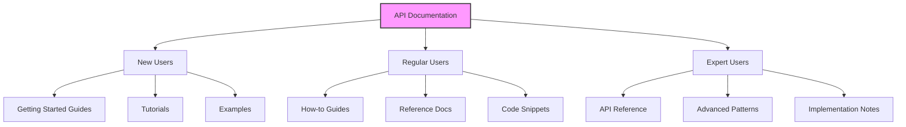
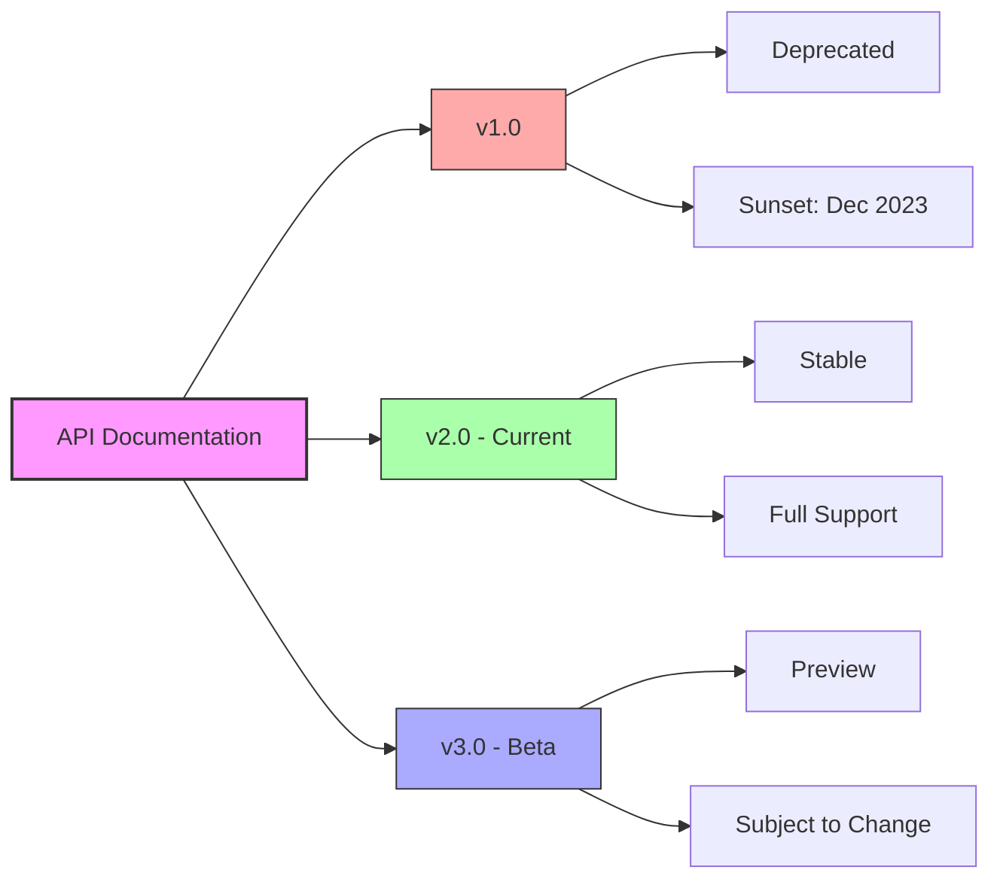

# 4.2 API Documentation

## Theory

API documentation is a technical content deliverable that explains how to effectively use and integrate with an API. It provides information about functions, classes, return types, arguments, and examples, typically including tutorials, examples, and reference information.

Good API documentation:

- Helps developers understand how to use the API
- Reduces the learning curve for new users
- Decreases support requests and questions
- Encourages adoption and integration
- Serves as a contract between providers and consumers

### Types of API Documentation

1. **Reference Documentation**
   - Comprehensive details of all endpoints, methods, parameters, and responses
   - Often auto-generated from code or API specifications
   - Typically organized by resource or endpoint
2. **Guides and Tutorials**
   - Step-by-step instructions for common use cases
   - Explains how to solve specific problems
   - Helps onboard new developers
3. **Conceptual Documentation**
   - Explains the architecture and key concepts
   - Provides the "big picture" view
   - Helps understand the API's design philosophy
4. **Authentication Documentation**
   - Explains how to authenticate with the API
   - Details on obtaining and using API keys or tokens
   - Security best practices
5. **Changelog Documentation**
   - Documents changes between versions
   - Migration guides for breaking changes
   - Deprecation notices

## Real-Life Example

The Stripe API documentation is widely considered one of the best examples of API documentation. It includes:

- Interactive examples that can be executed directly from the documentation
- Clear code samples in multiple programming languages
- Comprehensive reference documentation
- Example applications and use cases
- Testing tools and sandbox environments

## API Specification Formats

### OpenAPI (formerly Swagger)

OpenAPI is a language-agnostic specification for describing REST APIs. It allows both humans and computers to understand the capabilities of a service without direct access to the code.

```yaml
# Example OpenAPI specification (version 3.0.0)
openapi: 3.0.0
info:
  title: E-commerce API
  description: API for managing products and orders
  version: 1.0.0
servers:
  - url: https://api.example.com/v1
paths:
  /products:
    get:
      summary: Returns a list of products
      parameters:
        - name: category
          in: query
          description: Filter by category
          schema:
            type: string
        - name: limit
          in: query
          description: Maximum number of items to return
          schema:
            type: integer
            default: 20
      responses:
        "200":
          description: Successfully returned products
          content:
            application/json:
              schema:
                type: object
                properties:
                  products:
                    type: array
                    items:
                      $ref: "#/components/schemas/Product"
                  total:
                    type: integer
                    description: Total number of products matching the criteria
    post:
      summary: Creates a new product
      requestBody:
        required: true
        content:
          application/json:
            schema:
              $ref: "#/components/schemas/ProductInput"
      responses:
        "201":
          description: Product created successfully
          content:
            application/json:
              schema:
                $ref: "#/components/schemas/Product"
        "400":
          description: Invalid input
          content:
            application/json:
              schema:
                $ref: "#/components/schemas/Error"
  /products/{id}:
    get:
      summary: Returns a specific product
      parameters:
        - name: id
          in: path
          required: true
          description: Product ID
          schema:
            type: integer
      responses:
        "200":
          description: Successfully returned the product
          content:
            application/json:
              schema:
                $ref: "#/components/schemas/Product"
        "404":
          description: Product not found
          content:
            application/json:
              schema:
                $ref: "#/components/schemas/Error"
    put:
      summary: Updates a product
      parameters:
        - name: id
          in: path
          required: true
          description: Product ID
          schema:
            type: integer
      requestBody:
        required: true
        content:
          application/json:
            schema:
              $ref: "#/components/schemas/ProductInput"
      responses:
        "200":
          description: Product updated successfully
          content:
            application/json:
              schema:
                $ref: "#/components/schemas/Product"
        "400":
          description: Invalid input
          content:
            application/json:
              schema:
                $ref: "#/components/schemas/Error"
        "404":
          description: Product not found
          content:
            application/json:
              schema:
                $ref: "#/components/schemas/Error"
    delete:
      summary: Deletes a product
      parameters:
        - name: id
          in: path
          required: true
          description: Product ID
          schema:
            type: integer
      responses:
        "204":
          description: Product deleted successfully
        "404":
          description: Product not found
          content:
            application/json:
              schema:
                $ref: "#/components/schemas/Error"
  /orders:
    get:
      summary: Returns a list of orders
      parameters:
        - name: customer_id
          in: query
          description: Filter by customer ID
          schema:
            type: integer
        - name: status
          in: query
          description: Filter by order status
          schema:
            type: string
            enum: [pending, processing, shipped, delivered, cancelled]
        - name: limit
          in: query
          description: Maximum number of items to return
          schema:
            type: integer
            default: 20
      responses:
        "200":
          description: Successfully returned orders
          content:
            application/json:
              schema:
                type: object
                properties:
                  orders:
                    type: array
                    items:
                      $ref: "#/components/schemas/Order"
                  total:
                    type: integer
                    description: Total number of orders matching the criteria
    post:
      summary: Creates a new order
      requestBody:
        required: true
        content:
          application/json:
            schema:
              $ref: "#/components/schemas/OrderInput"
      responses:
        "201":
          description: Order created successfully
          content:
            application/json:
              schema:
                $ref: "#/components/schemas/Order"
        "400":
          description: Invalid input
          content:
            application/json:
              schema:
                $ref: "#/components/schemas/Error"
  /orders/{id}:
    get:
      summary: Returns a specific order
      parameters:
        - name: id
          in: path
          required: true
          description: Order ID
          schema:
            type: integer
      responses:
        "200":
          description: Successfully returned the order
          content:
            application/json:
              schema:
                $ref: "#/components/schemas/Order"
        "404":
          description: Order not found
          content:
            application/json:
              schema:
                $ref: "#/components/schemas/Error"
    patch:
      summary: Updates an order status
      parameters:
        - name: id
          in: path
          required: true
          description: Order ID
          schema:
            type: integer
      requestBody:
        required: true
        content:
          application/json:
            schema:
              type: object
              required:
                - status
              properties:
                status:
                  type: string
                  enum: [pending, processing, shipped, delivered, cancelled]
      responses:
        "200":
          description: Order status updated successfully
          content:
            application/json:
              schema:
                $ref: "#/components/schemas/Order"
        "400":
          description: Invalid input
          content:
            application/json:
              schema:
                $ref: "#/components/schemas/Error"
        "404":
          description: Order not found
          content:
            application/json:
              schema:
                $ref: "#/components/schemas/Error"
components:
  schemas:
    Product:
      type: object
      required:
        - id
        - name
        - price
      properties:
        id:
          type: integer
          description: Unique product identifier
        name:
          type: string
          description: Product name
        description:
          type: string
          description: Product description
        price:
          type: number
          format: float
          description: Product price in USD
        category:
          type: string
          description: Product category
        image_url:
          type: string
          format: uri
          description: URL to product image
        created_at:
          type: string
          format: date-time
          description: Creation timestamp
        updated_at:
          type: string
          format: date-time
          description: Last update timestamp
    ProductInput:
      type: object
      required:
        - name
        - price
      properties:
        name:
          type: string
          description: Product name
        description:
          type: string
          description: Product description
        price:
          type: number
          format: float
          description: Product price in USD
        category:
          type: string
          description: Product category
        image_url:
          type: string
          format: uri
          description: URL to product image
    Order:
      type: object
      required:
        - id
        - customer_id
        - items
      properties:
        id:
          type: integer
          description: Unique order identifier
        customer_id:
          type: integer
          description: Customer identifier
        items:
          type: array
          items:
            $ref: "#/components/schemas/OrderItem"
        total:
          type: number
          format: float
          description: Order total amount
        status:
          type: string
          enum: [pending, processing, shipped, delivered, cancelled]
          default: pending
        shipping_address:
          $ref: "#/components/schemas/Address"
        created_at:
          type: string
          format: date-time
          description: Creation timestamp
        updated_at:
          type: string
          format: date-time
          description: Last update timestamp
    OrderInput:
      type: object
      required:
        - customer_id
        - items
        - shipping_address
      properties:
        customer_id:
          type: integer
          description: Customer identifier
        items:
          type: array
          items:
            $ref: "#/components/schemas/OrderItemInput"
        shipping_address:
          $ref: "#/components/schemas/Address"
    OrderItem:
      type: object
      required:
        - product_id
        - quantity
        - price
      properties:
        product_id:
          type: integer
          description: Product identifier
        product_name:
          type: string
          description: Product name at time of order
        quantity:
          type: integer
          minimum: 1
          description: Number of items
        price:
          type: number
          format: float
          description: Price at the time of order
        subtotal:
          type: number
          format: float
          description: Price multiplied by quantity
    OrderItemInput:
      type: object
      required:
        - product_id
        - quantity
      properties:
        product_id:
          type: integer
          description: Product identifier
        quantity:
          type: integer
          minimum: 1
          description: Number of items
    Address:
      type: object
      required:
        - line1
        - city
        - postal_code
        - country
      properties:
        line1:
          type: string
          description: Street address line 1
        line2:
          type: string
          description: Street address line 2
        city:
          type: string
          description: City
        state:
          type: string
          description: State or province
        postal_code:
          type: string
          description: Postal or ZIP code
        country:
          type: string
          description: Country code (ISO 3166-1 alpha-2)
    Error:
      type: object
      required:
        - code
        - message
      properties:
        code:
          type: string
          description: Error code
        message:
          type: string
          description: Error message
        details:
          type: array
          items:
            type: object
            properties:
              field:
                type: string
                description: Field with the issue
              issue:
                type: string
                description: Description of the issue
  securitySchemes:
    bearerAuth:
      type: http
      scheme: bearer
      bearerFormat: JWT
security:
  - bearerAuth: []
```

### RAML (RESTful API Modeling Language)

RAML is another specification format for describing RESTful APIs, designed to improve the API design lifecycle.

```yaml
#%RAML 1.0
title: E-commerce API
baseUri: https://api.example.com/v1
version: v1

types:
  Product:
    type: object
    properties:
      id: integer
      name: string
      description?: string
      price: number
      category?: string
      image_url?: string
    example:
      id: 123
      name: "Wireless Headphones"
      description: "Noise-cancelling wireless headphones"
      price: 99.99
      category: "Electronics"
      image_url: "https://example.com/images/headphones.jpg"

/products:
  get:
    description: Get a list of products
    queryParameters:
      category?:
        type: string
        description: Filter by category
      limit?:
        type: integer
        default: 20
        description: Maximum number of items to return
    responses:
      200:
        body:
          application/json:
            type: object
            properties:
              products: Product[]
              total: integer

  post:
    description: Create a new product
    body:
      application/json:
        type: Product
    responses:
      201:
        body:
          application/json:
            type: Product

  /{id}:
    get:
      description: Get a specific product
      responses:
        200:
          body:
            application/json:
              type: Product
        404:
          description: Product not found
```

### API Blueprint

API Blueprint is a markdown-based documentation format for APIs, focusing on readability and simplicity.

```markdown
# E-commerce API

# Group Products

## Product Collection [/products]

### List All Products [GET]

Returns a list of products, optionally filtered by category.

- Parameters

  - category (string, optional) - Filter by category
  - limit (number, optional) - Maximum number of items to return
    - Default: 20

- Response 200 (application/json)
  - Attributes
    - products (array[Product]) - List of products
    - total (number) - Total number of products matching the criteria

### Create a Product [POST]

Create a new product in the catalog.

- Request (application/json)

  - Attributes (Product)

- Response 201 (application/json)
  - Attributes (Product)

## Product [/products/{id}]

- Parameters
  - id (number, required) - Product ID

### Get a Product [GET]

Get details for a specific product.

- Response 200 (application/json)
  - Attributes (Product)

# Data Structures

## Product

- id (number) - Unique product identifier
- name (string) - Product name
- description (string, optional) - Product description
- price (number) - Product price in USD
- category (string, optional) - Product category
- image_url (string, optional) - URL to product image
```

## Documentation Tools

### Swagger UI

Swagger UI allows both users and machines to visualize and interact with the API's resources without having direct access to the implementation logic.

```html
<!-- Swagger UI integration example -->
<!DOCTYPE html>
<html>
  <head>
    <title>API Documentation</title>
    <link
      rel="stylesheet"
      type="text/css"
      href="https://unpkg.com/swagger-ui-dist@3/swagger-ui.css"
    />
  </head>
  <body>
    <div id="swagger-ui"></div>

    <script src="https://unpkg.com/swagger-ui-dist@3/swagger-ui-bundle.js"></script>
    <script>
      window.onload = function () {
        const ui = SwaggerUIBundle({
          url: "/api/openapi.json", // Path to your OpenAPI specification
          dom_id: "#swagger-ui",
          deepLinking: true,
          presets: [
            SwaggerUIBundle.presets.apis,
            SwaggerUIBundle.SwaggerUIStandalonePreset,
          ],
          layout: "BaseLayout",
        });
      };
    </script>
  </body>
</html>
```

### ReDoc

ReDoc is a responsive OpenAPI documentation generator that creates beautiful and customizable documentation.

```html
<!-- ReDoc integration example -->
<!DOCTYPE html>
<html>
  <head>
    <title>API Documentation</title>
    <meta charset="utf-8" />
    <meta name="viewport" content="width=device-width, initial-scale=1" />
  </head>
  <body>
    <div id="redoc-container"></div>

    <script src="https://cdn.jsdelivr.net/npm/redoc@2.0.0/bundles/redoc.standalone.js"></script>
    <script>
      Redoc.init(
        "/api/openapi.json", // Path to your OpenAPI specification
        {
          scrollYOffset: 50,
          hideDownloadButton: false,
          theme: {
            colors: {
              primary: {
                main: "#1976d2",
              },
            },
          },
        },
        document.getElementById("redoc-container")
      );
    </script>
  </body>
</html>
```

### Postman Documentation

Postman allows you to create and publish API documentation from your Postman Collections.

```jsx
// Example of creating a Postman Collection programmatically
const collection = {
  info: {
    name: "E-commerce API",
    description: "API for managing products and orders",
    schema:
      "https://schema.getpostman.com/json/collection/v2.1.0/collection.json",
  },
  item: [
    {
      name: "Products",
      item: [
        {
          name: "Get Products",
          request: {
            method: "GET",
            url: {
              raw: "{{baseUrl}}/products?category={{category}}&limit={{limit}}",
              host: ["{{baseUrl}}"],
              path: ["products"],
              query: [
                {
                  key: "category",
                  value: "{{category}}",
                  description: "Filter by category",
                },
                {
                  key: "limit",
                  value: "{{limit}}",
                  description: "Maximum number of items to return",
                },
              ],
            },
            description: "Returns a list of products",
          },
          response: [
            {
              name: "Successful Response",
              originalRequest: {
                method: "GET",
                url: {
                  raw: "{{baseUrl}}/products",
                },
              },
              status: "OK",
              code: 200,
              _postman_previewlanguage: "json",
              body: JSON.stringify(
                {
                  products: [
                    {
                      id: 1,
                      name: "Wireless Headphones",
                      price: 99.99,
                      category: "Electronics",
                    },
                  ],
                  total: 1,
                },
                null,
                2
              ),
            },
          ],
        },
      ],
    },
  ],
};
```

## Code Examples for Generating API Documentation

### Python with Flask and Flask-RESTX

```python
from flask import Flask
from flask_restx import Api, Resource, fields

app = Flask(__name__)
api = Api(app, version='1.0', title='E-commerce API',
    description='API for managing products and orders',
    doc='/api/docs'
)

# Define namespaces
ns_products = api.namespace('products', description='Product operations')

# Define models
product_model = api.model('Product', {
    'id': fields.Integer(readonly=True, description='Unique product identifier'),
    'name': fields.String(required=True, description='Product name'),
    'description': fields.String(description='Product description'),
    'price': fields.Float(required=True, description='Product price in USD'),
    'category': fields.String(description='Product category'),
    'image_url': fields.String(description='URL to product image')
})

product_list_model = api.model('ProductList', {
    'products': fields.List(fields.Nested(product_model)),
    'total': fields.Integer(description='Total number of products')
})

# Mock data
products = [
    {
        'id': 1,
        'name': 'Wireless Headphones',
        'description': 'Noise-cancelling wireless headphones',
        'price': 99.99,
        'category': 'Electronics',
        'image_url': 'https://example.com/images/headphones.jpg'
    }
]

@ns_products.route('/')
class ProductList(Resource):
    @ns_products.doc('list_products')
    @ns_products.param('category', 'Filter by category')
    @ns_products.param('limit', 'Maximum number of items to return', default=20)
    @ns_products.marshal_with(product_list_model)
    def get(self):
        """Returns a list of products"""
        return {
            'products': products,
            'total': len(products)
        }

    @ns_products.doc('create_product')
    @ns_products.expect(product_model)
    @ns_products.marshal_with(product_model, code=201)
    def post(self):
        """Create a new product"""
        # Implementation details...
        return products[0], 201

@ns_products.route('/<int:id>')
@ns_products.param('id', 'Product identifier')
class Product(Resource):
    @ns_products.doc('get_product')
    @ns_products.marshal_with(product_model)
    def get(self, id):
        """Get a specific product"""
        for product in products:
            if product['id'] == id:
                return product
        api.abort(404, f"Product {id} not found")

if __name__ == '__main__':
    app.run(debug=True)

```

### JavaScript with Express and Swagger JSDoc

```jsx
// server.js
const express = require("express");
const swaggerJsdoc = require("swagger-jsdoc");
const swaggerUi = require("swagger-ui-express");

const app = express();
app.use(express.json());

// Swagger definition
const swaggerOptions = {
  definition: {
    openapi: "3.0.0",
    info: {
      title: "E-commerce API",
      version: "1.0.0",
      description: "API for managing products and orders",
    },
    servers: [
      {
        url: "http://localhost:3000/api/v1",
        description: "Development server",
      },
    ],
  },
  apis: ["./routes/*.js"], // Path to the API routes
};

const swaggerSpec = swaggerJsdoc(swaggerOptions);
app.use("/api/docs", swaggerUi.serve, swaggerUi.setup(swaggerSpec));

// Routes
app.use("/api/v1", require("./routes"));

const PORT = process.env.PORT || 3000;
app.listen(PORT, () => {
  console.log(`Server running on port ${PORT}`);
  console.log(
    `API Documentation available at http://localhost:${PORT}/api/docs`
  );
});
```

```jsx
// routes/products.js
const express = require("express");
const router = express.Router();

// Mock data
const products = [
  {
    id: 1,
    name: "Wireless Headphones",
    description: "Noise-cancelling wireless headphones",
    price: 99.99,
    category: "Electronics",
    image_url: "https://example.com/images/headphones.jpg",
  },
];

/**
 * @swagger
 * components:
 *   schemas:
 *     Product:
 *       type: object
 *       required:
 *         - name
 *         - price
 *       properties:
 *         id:
 *           type: integer
 *           description: The product ID
 *         name:
 *           type: string
 *           description: The product name
 *         description:
 *           type: string
 *           description: The product description
 *         price:
 *           type: number
 *           format: float
 *           description: The product price in USD
 *         category:
 *           type: string
 *           description: The product category
 *         image_url:
 *           type: string
 *           format: uri
 *           description: URL to product image
 */

/**
 * @swagger
 * /products:
 *   get:
 *     summary: Returns a list of products
 *     parameters:
 *       - in: query
 *         name: category
 *         schema:
 *           type: string
 *         description: Filter by category
 *       - in: query
 *         name: limit
 *         schema:
 *           type: integer
 *           default: 20
 *         description: Maximum number of items to return
 *     responses:
 *       200:
 *         description: A list of products
 *         content:
 *           application/json:
 *             schema:
 *               type: object
 *               properties:
 *                 products:
 *                   type: array
 *                   items:
 *                     $ref: '#/components/schemas/Product'
 *                 total:
 *                   type: integer
 *                   description: Total number of products matching the criteria
 */
router.get("/products", (req, res) => {
  // Implementation details...
  res.json({
    products,
    total: products.length,
  });
});

/**
 * @swagger
 * /products/{id}:
 *   get:
 *     summary: Get a product by ID
 *     parameters:
 *       - in: path
 *         name: id
 *         required: true
 *         schema:
 *           type: integer
 *         description: The product ID
 *     responses:
 *       200:
 *         description: A product object
 *         content:
 *           application/json:
 *             schema:
 *               $ref: '#/components/schemas/Product'
 *       404:
 *         description: Product not found
 */
router.get("/products/:id", (req, res) => {
  const id = parseInt(req.params.id);
  const product = products.find((p) => p.id === id);

  if (!product) {
    return res.status(404).json({ message: "Product not found" });
  }

  res.json(product);
});

module.exports = router;
```

## Documentation Generation from Code

### Python with Sphinx

```python
# Install required packages
# pip install sphinx sphinx-rtd-theme

# sample.py
class Product:
    """
    Represents a product in the e-commerce system.

    Attributes:
        id (int): Unique product identifier
        name (str): Product name
        description (str): Product description
        price (float): Product price in USD
        category (str): Product category
        image_url (str): URL to product image
    """

    def __init__(self, id, name, price, description=None, category=None, image_url=None):
        """
        Initialize a new Product.

        Args:
            id (int): Unique product identifier
            name (str): Product name
            price (float): Product price in USD
            description (str, optional): Product description
            category (str, optional): Product category
            image_url (str, optional): URL to product image
        """
        self.id = id
        self.name = name
        self.price = price
        self.description = description
        self.category = category
        self.image_url = image_url

    def discount(self, percentage):
        """
        Apply a discount to the product price.

        Args:
            percentage (float): Discount percentage (0-100)

        Returns:
            float: The discounted price

        Raises:
            ValueError: If percentage is not between 0 and 100
        """
        if not 0 <= percentage <= 100:
            raise ValueError("Percentage must be between 0 and 100")

        discount_factor = percentage / 100
        return self.price * (1 - discount_factor)

```

```bash
# Generate Sphinx documentation
mkdir docs
cd docs
sphinx-quickstart  # Follow the prompts

```

```python
# Update conf.py
import os
import sys
sys.path.insert(0, os.path.abspath('..'))

extensions = [
    'sphinx.ext.autodoc',
    'sphinx.ext.viewcode',
    'sphinx.ext.napoleon',
]

html_theme = 'sphinx_rtd_theme'

```

```
.. index.rst

Welcome to API Documentation!
============================

.. toctree::
   :maxdepth: 2
   :caption: Contents:

   api

API Reference
============

.. automodule:: sample
   :members:
   :undoc-members:
   :show-inheritance:

```

```bash
# Build the documentation
make html

```

## API Documentation Best Practices

### 1. Audience-Focused Content

Different users have different needs:



### 2. Complete API Reference

For each endpoint, include:

- HTTP method and URL
- Description and purpose
- Request parameters (path, query, header, body)
- Request examples
- Response format and status codes
- Response examples
- Error handling
- Rate limits
- Authentication requirements

### 3. Use of Examples

```python
# Example: Creating a product
import requests
import json

url = "https://api.example.com/v1/products"
headers = {
    "Authorization": "Bearer YOUR_API_KEY",
    "Content-Type": "application/json"
}
payload = {
    "name": "Wireless Headphones",
    "description": "Noise-cancelling wireless headphones",
    "price": 99.99,
    "category": "Electronics",
    "image_url": "https://example.com/images/headphones.jpg"
}

response = requests.post(url, headers=headers, data=json.dumps(payload))

if response.status_code == 201:
    product = response.json()
    print(f"Product created with ID: {product['id']}")
else:
    print(f"Error: {response.status_code}")
    print(response.text)

```

### 4. Clear Error Documentation

Document all possible error responses:

```json
{
  "error": {
    "code": "INVALID_REQUEST",
    "message": "Invalid request parameters",
    "details": [
      {
        "field": "price",
        "issue": "must be a positive number"
      },
      {
        "field": "name",
        "issue": "is required"
      }
    ]
  }
}
```

Include a table of all error codes:

| Code            | HTTP Status | Description                           |
| --------------- | ----------- | ------------------------------------- |
| INVALID_REQUEST | 400         | The request parameters are invalid    |
| UNAUTHORIZED    | 401         | Authentication is required            |
| FORBIDDEN       | 403         | Not authorized to access the resource |
| NOT_FOUND       | 404         | The requested resource was not found  |
| RATE_LIMITED    | 429         | Too many requests                     |
| SERVER_ERROR    | 500         | An unexpected server error occurred   |

### 5. Versioning Documentation

Clearly indicate the API version in the documentation:



Document breaking changes and migration paths:

```markdown
## Migrating from v1 to v2

### Breaking Changes

1. **Authentication**: v1 used API keys in query parameters, v2 uses Bearer tokens in the Authorization header.

   v1:
```

GET /products?api_key=YOUR_API_KEY

```

v2:

```

GET /products
Authorization: Bearer YOUR_API_TOKEN

````

2. **Response Format**: The `created` field has been renamed to `created_at` and now uses ISO 8601 format.

v1:
```json
{
  "id": 123,
  "created": "2023-04-01"
}

````

v2:

```json
{
  "id": 123,
  "created_at": "2023-04-01T12:00:00Z"
}
```

````

## Documentation as Code

Treat documentation like code:

1. **Version Control**: Store documentation in Git alongside code
2. **Review Process**: Include documentation changes in code reviews
3. **CI/CD Pipeline**: Automatically build and deploy documentation
4. **Testing**: Validate examples and check for broken links
5. **Linting**: Enforce consistency in documentation style

### GitHub Actions for Documentation

```yaml
# .github/workflows/docs.yml
name: Documentation

on:
  push:
    branches: [ main ]
    paths:
      - 'docs/**'
      - '**/*.md'
      - 'openapi.yaml'

jobs:
  build:
    runs-on: ubuntu-latest

    steps:
    - uses: actions/checkout@v2

    - name: Set up Node.js
      uses: actions/setup-node@v2
      with:
        node-version: '14'

    - name: Install dependencies
      run: npm install -g redoc-cli

    - name: Validate OpenAPI specification
      run: npx @stoplight/spectral lint openapi.yaml

    - name: Build documentation
      run: redoc-cli bundle openapi.yaml -o docs/index.html

    - name: Deploy to GitHub Pages
      uses: peaceiris/actions-gh-pages@v3
      with:
        github_token: ${{ secrets.GITHUB_TOKEN }}
        publish_dir: ./docs

````

## Interactive Documentation

Adding interactive elements improves the developer experience:

### API Console

```html
<!-- Example API Console -->
<div class="api-console">
  <div class="console-header">
    <h3>Try it out</h3>
  </div>
  <div class="console-body">
    <div class="request-section">
      <div class="method-url">
        <select id="method">
          <option value="GET">GET</option>
          <option value="POST">POST</option>
          <option value="PUT">PUT</option>
          <option value="DELETE">DELETE</option>
        </select>
        <input
          type="text"
          id="url"
          value="https://api.example.com/v1/products"
        />
      </div>
      <div class="headers">
        <h4>Headers</h4>
        <div class="header-row">
          <input type="text" placeholder="Name" value="Authorization" />
          <input
            type="text"
            placeholder="Value"
            value="Bearer YOUR_API_TOKEN"
          />
        </div>
        <button id="add-header">+ Add Header</button>
      </div>
      <div class="body">
        <h4>Request Body</h4>
        <textarea id="request-body">
{
  "name": "Wireless Headphones",
  "price": 99.99
}</textarea
        >
      </div>
      <button id="send-request">Send Request</button>
    </div>
    <div class="response-section">
      <h4>Response</h4>
      <div class="status"></div>
      <pre id="response-body"></pre>
    </div>
  </div>
</div>
```

### Code Samples in Multiple Languages

```jsx
// JavaScript implementation
function showCodeSamples() {
  const tabs = document.querySelectorAll(".code-tabs li");
  const samples = document.querySelectorAll(".code-sample");

  tabs.forEach((tab) => {
    tab.addEventListener("click", () => {
      // Remove active class from all tabs
      tabs.forEach((t) => t.classList.remove("active"));

      // Hide all code samples
      samples.forEach((s) => (s.style.display = "none"));

      // Activate selected tab and show corresponding sample
      tab.classList.add("active");
      const language = tab.getAttribute("data-lang");
      document.querySelector(
        `.code-sample[data-lang="${language}"]`
      ).style.display = "block";
    });
  });
}
```

```html
<!-- Language selector and code samples -->
<div class="code-examples">
  <ul class="code-tabs">
    <li data-lang="python" class="active">Python</li>
    <li data-lang="javascript">JavaScript</li>
    <li data-lang="php">PHP</li>
    <li data-lang="java">Java</li>
  </ul>

  <div class="code-sample" data-lang="python" style="display: block;">
    <pre><code>
import requests

url = "https://api.example.com/v1/products"
headers = {"Authorization": "Bearer YOUR_API_TOKEN"}

response = requests.get(url, headers=headers)
products = response.json()

print(f"Found {len(products)} products")
    </code></pre>
  </div>

  <div class="code-sample" data-lang="javascript" style="display: none;">
    <pre><code>
fetch('https://api.example.com/v1/products', {
  headers: {
    'Authorization': 'Bearer YOUR_API_TOKEN'
  }
})
.then(response => response.json())
.then(data => {
  console.log(`Found ${data.length} products`);
});
    </code></pre>
  </div>

  <!-- More language examples -->
</div>
```

## Documentation Metrics and Improvement

Collecting metrics helps improve documentation quality:

1. **Usage Analytics**:
   - Most visited pages
   - Time spent on documentation
   - Search queries
2. **User Feedback**:
   - Helpfulness ratings
   - Comments and suggestions
   - Support ticket correlation
3. **Content Health**:
   - Documentation coverage
   - Update frequency
   - Broken links and examples

### Feedback Collection

```html
<!-- Simple documentation feedback form -->
<div class="documentation-feedback">
  <h4>Was this page helpful?</h4>
  <div class="feedback-buttons">
    <button class="feedback-yes">Yes</button>
    <button class="feedback-no">No</button>
  </div>
  <div class="feedback-form" style="display: none;">
    <textarea placeholder="How can we improve this documentation?"></textarea>
    <button class="submit-feedback">Submit</button>
  </div>
  <div class="feedback-thanks" style="display: none;">
    Thank you for your feedback!
  </div>
</div>
```

## Tools and Platforms for API Documentation

### 1. Documentation Generation

- **Swagger/OpenAPI**: SwaggerHub, ReDoc, Swagger UI
- **Language-specific**: JavaDoc, Sphinx (Python), JSDoc (JavaScript)
- **Markdown-based**: Slate, Docusaurus, Docsify

### 2. API Testing and Development

- **Postman**: Collection documentation and API design
- **Insomnia**: API client with documentation features
- **Paw**: API client for macOS

### 3. Design-First Documentation

- **Stoplight Studio**: Visual API design with OpenAPI
- **SwaggerHub**: Collaborative API design
- **Apiary**: Blueprint-based API design and documentation

## Benefits of Great API Documentation

1. **Faster Adoption**: Good documentation accelerates API integration
2. **Reduced Support Costs**: Self-service answers reduce support requests
3. **Improved User Experience**: Clear guidance leads to better implementations
4. **Better APIs**: Documentation-driven design improves API quality
5. **Community Building**: Documentation fosters community engagement
6. **Increased Trust**: Quality documentation builds developer confidence

## Common Documentation Pitfalls to Avoid

1. **Out-of-date Documentation**: Ensure documentation stays current with the API
2. **Incomplete Examples**: Provide complete, working examples
3. **Missing Error Handling**: Document all error scenarios and responses
4. **Unexplained Concepts**: Define domain-specific terminology
5. **Focusing on Implementation**: Describe what, not how the API works
6. **Ignoring Onboarding**: Make it easy for new developers to get started
7. **Poor Navigation**: Ensure documentation is easily searchable and navigable
