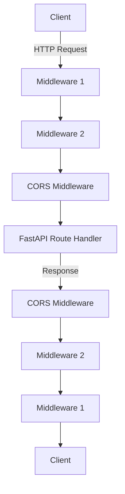

# 5.1 Middleware and CORS

## Middleware Basics

### What is Middleware?

Middleware is a function that works with every request before it's processed by a specific path operation. It can also process the response before returning it.

### Key Characteristics:

- Executes before any route handler
- Can modify both incoming requests and outgoing responses
- Runs in the order they are added to the application
- Perfect for cross-cutting concerns like authentication, logging, CORS, etc.

### Common Use Cases:

- Authentication and authorization
- Request logging and monitoring
- Response modification
- Cross-Origin Resource Sharing (CORS)
- Rate limiting
- Custom headers

## Adding Middleware in FastAPI

FastAPI provides two ways to add middleware:

1. Using the `@app.middleware("http")` decorator:

```python
from fastapi import FastAPI

app = FastAPI()

@app.middleware("http")
async def add_process_time_header(request, call_next):
    import time
    start_time = time.time()

    # Process the request
    response = await call_next(request)

    # Add a custom header to the response
    process_time = time.time() - start_time
    response.headers["X-Process-Time"] = str(process_time)

    return response

```

1. Using the `app.add_middleware()` method:

```python
from fastapi import FastAPI
from starlette.middleware.base import BaseHTTPMiddleware

app = FastAPI()

class CustomHeaderMiddleware(BaseHTTPMiddleware):
    async def dispatch(self, request, call_next):
        response = await call_next(request)
        response.headers["X-Custom-Header"] = "Custom Value"
        return response

app.add_middleware(CustomHeaderMiddleware)

```

## CORS (Cross-Origin Resource Sharing)

### What is CORS?

CORS is a security feature implemented by browsers that restricts web pages from making requests to a different domain than the one that served the original page.

### Why is CORS Important?

- Prevents malicious websites from making unauthorized requests to your API
- Controls which domains can access your API resources
- Essential for APIs consumed by web applications hosted on different domains

### Implementing CORS in FastAPI

FastAPI provides a simple way to add CORS middleware:

```python
from fastapi import FastAPI
from fastapi.middleware.cors import CORSMiddleware

app = FastAPI()

# Add CORS middleware
app.add_middleware(
    CORSMiddleware,
    allow_origins=["http://localhost:8080", "https://myapp.example.com"],  # List of allowed origins
    allow_credentials=True,  # Allow cookies to be included in requests
    allow_methods=["*"],  # Allow all methods (GET, POST, etc.)
    allow_headers=["*"],  # Allow all headers
)

@app.get("/api/items/")
async def read_items():
    return [{"id": 1, "name": "Item 1"}, {"id": 2, "name": "Item 2"}]

```

### CORS Configuration Options:

| Option               | Description                                                            | Example                             |
| -------------------- | ---------------------------------------------------------------------- | ----------------------------------- |
| `allow_origins`      | List of origins that should be permitted to make cross-origin requests | `["http://localhost:8080"]`         |
| `allow_origin_regex` | A regex string to match against origins                                | `"https://.*\.example\.com"`        |
| `allow_methods`      | HTTP methods that should be allowed for CORS requests                  | `["GET", "POST"]`                   |
| `allow_headers`      | HTTP request headers that should be allowed                            | `["Content-Type", "Authorization"]` |
| `allow_credentials`  | Indicate that cookies should be allowed                                | `True`                              |
| `expose_headers`     | Headers that browsers are allowed to access                            | `["X-Custom-Header"]`               |
| `max_age`            | Maximum time (in seconds) the CORS response can be cached              | `600`                               |

## Real-Life Example: Building an API with Authentication Middleware

Here's a complete example of a FastAPI application with both authentication middleware and CORS:

```python
from fastapi import FastAPI, Request, HTTPException, Depends
from fastapi.middleware.cors import CORSMiddleware
from fastapi.security import OAuth2PasswordBearer
import time
import jwt

# Create the FastAPI app
app = FastAPI()

# Configure CORS
app.add_middleware(
    CORSMiddleware,
    allow_origins=["http://localhost:3000"],  # Frontend running on port 3000
    allow_credentials=True,
    allow_methods=["*"],
    allow_headers=["*"],
)

# JWT Secret and settings
SECRET_KEY = "your-secret-key"
ALGORITHM = "HS256"
oauth2_scheme = OAuth2PasswordBearer(tokenUrl="token")

# Custom middleware for request logging
@app.middleware("http")
async def log_requests(request: Request, call_next):
    start_time = time.time()

    # Get client IP
    forwarded_for = request.headers.get("X-Forwarded-For")
    ip = forwarded_for.split(",")[0] if forwarded_for else request.client.host

    # Log request details
    print(f"Request: {request.method} {request.url} from {ip}")

    # Process the request
    response = await call_next(request)

    # Calculate processing time
    process_time = time.time() - start_time
    response.headers["X-Process-Time"] = f"{process_time:.4f} seconds"

    # Log response details
    print(f"Response: {response.status_code} in {process_time:.4f} seconds")

    return response

# Authentication function
async def get_current_user(token: str = Depends(oauth2_scheme)):
    try:
        payload = jwt.decode(token, SECRET_KEY, algorithms=[ALGORITHM])
        username: str = payload.get("sub")
        if username is None:
            raise HTTPException(status_code=401, detail="Invalid authentication credentials")
    except jwt.PyJWTError:
        raise HTTPException(status_code=401, detail="Invalid authentication credentials")

    # Here you would typically query your database to get the user
    # For simplicity, we'll just return the username
    return {"username": username}

# Routes
@app.post("/token")
async def login(username: str, password: str):
    # In a real app, you would verify credentials against a database
    if username == "demo" and password == "password":
        # Create access token
        access_token = jwt.encode({"sub": username}, SECRET_KEY, algorithm=ALGORITHM)
        return {"access_token": access_token, "token_type": "bearer"}
    raise HTTPException(status_code=401, detail="Incorrect username or password")

@app.get("/protected-resource")
async def protected_resource(current_user = Depends(get_current_user)):
    return {"message": f"Hello, {current_user['username']}! This is a protected resource."}

@app.get("/public-resource")
async def public_resource():
    return {"message": "This is a public resource, no authentication required."}

```

## Middleware Execution Flow



## Best Practices

1. **Add middleware in order of importance**: Middleware executes in the order it's added, so consider dependencies.
2. **Keep middleware lightweight**: Heavy processing in middleware affects all requests and can impact performance.
3. **Use specific CORS origins**: Avoid using `allow_origins=["*"]` in production as it allows requests from any origin.
4. **Error handling**: Handle exceptions within middleware to avoid crashing the entire application.
5. **Logging**: Include request IDs in middleware logging to trace requests across the system.
6. **Security**: Use middleware for security checks, but don't rely solely on middleware for critical security functions.

## Summary

- Middleware provides a powerful way to process requests and responses globally
- CORS middleware is essential for web applications accessing your API from different domains
- FastAPI makes it easy to add both custom middleware and built-in middleware like CORS
- Proper middleware design can improve security, performance monitoring, and maintainability
