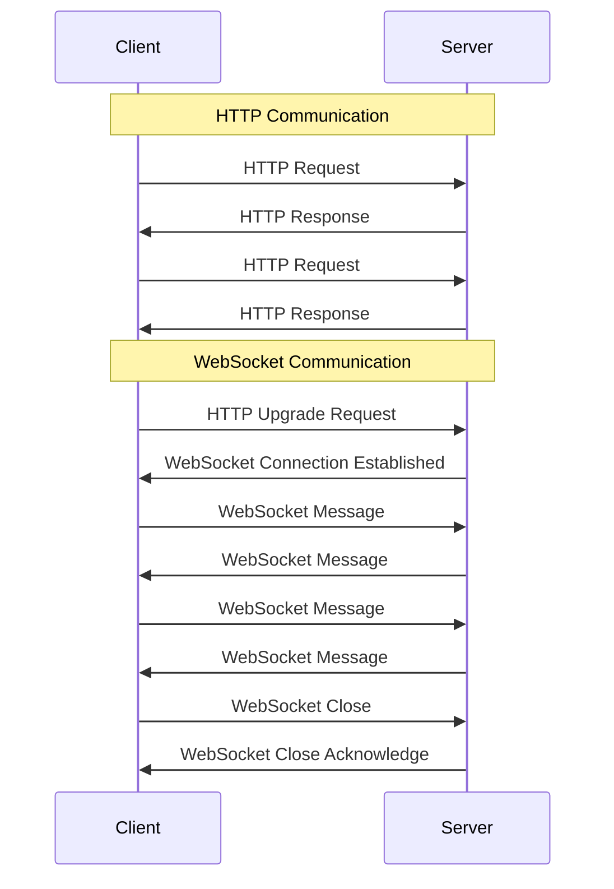
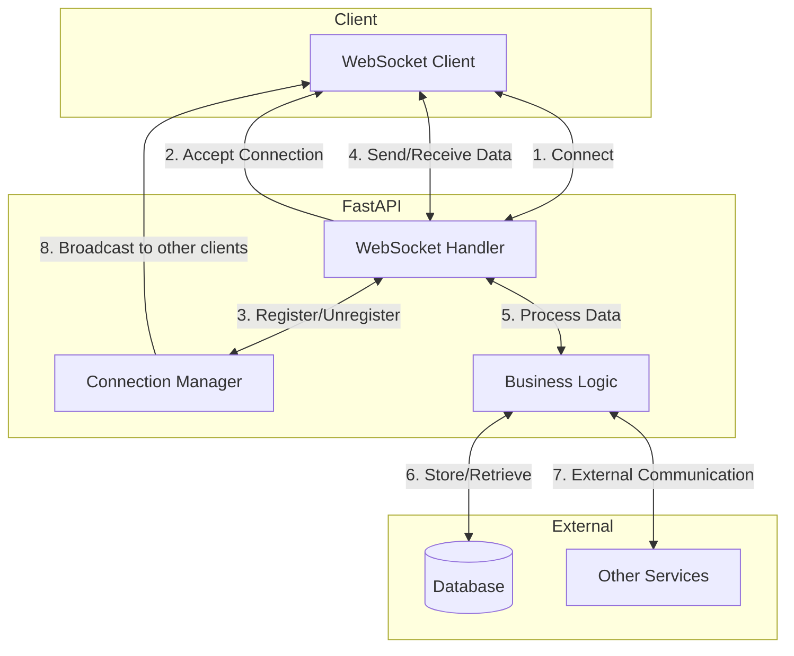

# 5.2 WebSockets

## WebSockets Basics

### What are WebSockets?

WebSockets provide a persistent, full-duplex communication channel between a client and server over a single TCP connection. Unlike HTTP, which is request-response based, WebSockets allow for real-time, bidirectional data transfer.

### Key Characteristics:

- Persistent connection (stays open until closed by client or server)
- Full-duplex communication (both client and server can send messages independently)
- Low latency (minimal overhead after initial handshake)
- Real-time data transfer
- Works through firewalls and proxies

### Common Use Cases:

- Chat applications
- Live dashboards and monitoring
- Collaborative editing tools
- Real-time notifications
- Online gaming
- Financial tickers
- IoT device communication

## WebSockets in FastAPI

FastAPI provides built-in support for WebSockets through Starlette, making it easy to implement real-time features.

### Basic WebSocket Implementation

```python
from fastapi import FastAPI, WebSocket
from fastapi.responses import HTMLResponse

app = FastAPI()

# HTML for a simple WebSocket client
html = """
<!DOCTYPE html>
<html>
    <head>
        <title>FastAPI WebSocket Chat</title>
    </head>
    <body>
        <h1>WebSocket Chat</h1>
        <input type="text" id="messageText" placeholder="Enter message here"/>
        <button onclick="sendMessage()">Send</button>
        <ul id="messages"></ul>
        <script>
            var ws = new WebSocket("ws://localhost:8000/ws");
            ws.onmessage = function(event) {
                var messages = document.getElementById('messages');
                var message = document.createElement('li');
                var content = document.createTextNode(event.data);
                message.appendChild(content);
                messages.appendChild(message);
            };
            function sendMessage() {
                var input = document.getElementById("messageText");
                ws.send(input.value);
                input.value = '';
            }
        </script>
    </body>
</html>
"""

@app.get("/")
async def get():
    return HTMLResponse(html)

@app.websocket("/ws")
async def websocket_endpoint(websocket: WebSocket):
    await websocket.accept()
    try:
        while True:
            data = await websocket.receive_text()
            await websocket.send_text(f"Message received: {data}")
    except Exception as e:
        print(f"Error: {e}")
    finally:
        # Ensure connection is closed on error
        await websocket.close()

```

## WebSocket Connection Manager

For most real applications, you'll need to manage multiple WebSocket connections. Here's a connection manager implementation:

```python
from fastapi import FastAPI, WebSocket, WebSocketDisconnect
from typing import List

app = FastAPI()

class ConnectionManager:
    def __init__(self):
        self.active_connections: List[WebSocket] = []

    async def connect(self, websocket: WebSocket):
        await websocket.accept()
        self.active_connections.append(websocket)

    def disconnect(self, websocket: WebSocket):
        self.active_connections.remove(websocket)

    async def send_personal_message(self, message: str, websocket: WebSocket):
        await websocket.send_text(message)

    async def broadcast(self, message: str):
        for connection in self.active_connections:
            await connection.send_text(message)

manager = ConnectionManager()

@app.websocket("/ws/{client_id}")
async def websocket_endpoint(websocket: WebSocket, client_id: str):
    await manager.connect(websocket)
    try:
        while True:
            data = await websocket.receive_text()
            # Send message to the specific client
            await manager.send_personal_message(f"You sent: {data}", websocket)
            # Broadcast message to all connected clients
            await manager.broadcast(f"Client #{client_id} says: {data}")
    except WebSocketDisconnect:
        manager.disconnect(websocket)
        await manager.broadcast(f"Client #{client_id} left the chat")

```

## Sending Different Data Types

WebSockets support various data formats:

```python
@app.websocket("/ws/data")
async def websocket_data_endpoint(websocket: WebSocket):
    await websocket.accept()
    try:
        while True:
            # Receive and send text
            text_data = await websocket.receive_text()
            await websocket.send_text(f"Text received: {text_data}")

            # Receive and send JSON
            json_data = await websocket.receive_json()
            await websocket.send_json({"message": "JSON received", "data": json_data})

            # Receive and send bytes
            bytes_data = await websocket.receive_bytes()
            await websocket.send_bytes(bytes_data)
    except WebSocketDisconnect:
        print("Client disconnected")

```

## WebSocket Authentication

You can secure WebSocket connections with authentication:

```python
from fastapi import FastAPI, WebSocket, Depends, Query, status, HTTPException
from fastapi.security import APIKeyHeader

app = FastAPI()

# Simple API key authentication
API_KEY = "secret-api-key"
api_key_header = APIKeyHeader(name="X-API-Key")

async def get_api_key(api_key: str = Depends(api_key_header)):
    if api_key != API_KEY:
        raise HTTPException(
            status_code=status.HTTP_401_UNAUTHORIZED,
            detail="Invalid API Key"
        )
    return api_key

@app.websocket("/ws/secure")
async def secure_websocket(
    websocket: WebSocket,
    token: str = Query(...),  # Token from query parameter
):
    if token != "my-secret-token":
        await websocket.close(code=status.WS_1008_POLICY_VIOLATION)
        return

    await websocket.accept()
    try:
        while True:
            data = await websocket.receive_text()
            await websocket.send_text(f"Secure message received: {data}")
    except WebSocketDisconnect:
        print("Client disconnected from secure endpoint")

```

## Real-Life Example: Real-Time Chat Application

Here's a complete example of a real-time chat application with user tracking:

```python
from fastapi import FastAPI, WebSocket, WebSocketDisconnect, Request
from fastapi.responses import HTMLResponse
from fastapi.templating import Jinja2Templates
from typing import List, Dict
import json
import datetime

app = FastAPI()
templates = Jinja2Templates(directory="templates")

class ConnectionManager:
    def __init__(self):
        self.active_connections: Dict[str, WebSocket] = {}
        self.user_names: Dict[str, str] = {}

    async def connect(self, websocket: WebSocket, client_id: str, username: str):
        await websocket.accept()
        self.active_connections[client_id] = websocket
        self.user_names[client_id] = username
        # Send the current user list to everyone
        await self.broadcast_user_list()

    def disconnect(self, client_id: str):
        if client_id in self.active_connections:
            del self.active_connections[client_id]
        if client_id in self.user_names:
            del self.user_names[client_id]
        # Update the user list for everyone
        asyncio.create_task(self.broadcast_user_list())

    async def send_personal_message(self, message: dict, client_id: str):
        if client_id in self.active_connections:
            await self.active_connections[client_id].send_json(message)

    async def broadcast(self, message: dict):
        for connection in self.active_connections.values():
            await connection.send_json(message)

    async def broadcast_user_list(self):
        user_list = list(self.user_names.values())
        await self.broadcast({
            "type": "users_update",
            "users": user_list,
            "count": len(user_list)
        })

manager = ConnectionManager()

@app.get("/", response_class=HTMLResponse)
async def get(request: Request):
    return templates.TemplateResponse("chat.html", {"request": request})

@app.websocket("/ws/{client_id}")
async def websocket_endpoint(websocket: WebSocket, client_id: str):
    # First message should be the username
    await websocket.accept()

    try:
        # Get username from first message
        data = await websocket.receive_json()
        username = data.get("username", f"Anonymous-{client_id}")

        # Complete connection with username
        await manager.connect(websocket, client_id, username)

        # Notify everyone about new user
        await manager.broadcast({
            "type": "system_message",
            "content": f"{username} joined the chat",
            "timestamp": datetime.datetime.now().isoformat()
        })

        while True:
            # Receive and process messages
            data = await websocket.receive_json()
            message_type = data.get("type", "chat")

            if message_type == "chat":
                # Regular chat message
                await manager.broadcast({
                    "type": "chat_message",
                    "sender": username,
                    "content": data.get("content", ""),
                    "timestamp": datetime.datetime.now().isoformat()
                })
            elif message_type == "private":
                # Private message to specific user
                target_user = data.get("target")
                target_id = None

                # Find target client_id by username
                for cid, name in manager.user_names.items():
                    if name == target_user:
                        target_id = cid
                        break

                if target_id:
                    await manager.send_personal_message({
                        "type": "private_message",
                        "sender": username,
                        "content": data.get("content", ""),
                        "timestamp": datetime.datetime.now().isoformat()
                    }, target_id)

                    # Also send to the sender so they see their own message
                    await manager.send_personal_message({
                        "type": "private_message",
                        "sender": f"You → {target_user}",
                        "content": data.get("content", ""),
                        "timestamp": datetime.datetime.now().isoformat()
                    }, client_id)

    except WebSocketDisconnect:
        manager.disconnect(client_id)
        # Notify remaining users
        if client_id in manager.user_names:
            username = manager.user_names[client_id]
            await manager.broadcast({
                "type": "system_message",
                "content": f"{username} left the chat",
                "timestamp": datetime.datetime.now().isoformat()
            })

```

## WebSocket vs. HTTP Connections



## WebSocket Communication Flow



## Limitations and Considerations

1. **Connection Management**: WebSockets maintain persistent connections, which can consume server resources. Implement proper connection management.
2. **Scaling**: WebSocket applications can be challenging to scale horizontally due to connection state. Consider using Redis or other message brokers for multi-server deployments.
3. **Reconnection Strategy**: Implement a robust reconnection strategy on the client side to handle network issues.
4. **Load Balancing**: Special configuration is needed for load balancers to support WebSockets (sticky sessions, timeout configurations, etc.).
5. **Fallback Options**: Consider implementing fallbacks like long polling for environments where WebSockets aren't supported.

## Best Practices

1. **Handle disconnections gracefully**: Always implement proper error handling and cleanup.
2. **Keep messages small**: Large messages can cause performance issues. Consider chunking large data.
3. **Use appropriate serialization**: JSON is common but not always most efficient. Consider MessagePack or Protocol Buffers for performance-critical applications.
4. **Implement heartbeats**: Use ping/pong frames to detect stale connections.
5. **Rate limiting**: Implement rate limiting to prevent abuse.
6. **Properly secure WebSockets**: Implement authentication and authorization for WebSocket connections.

## Summary

- WebSockets enable real-time bidirectional communication in FastAPI applications
- FastAPI makes it easy to implement WebSockets through Starlette
- Connection management is essential for multi-user applications
- WebSockets can handle different data types including text, JSON, and binary data
- Real-world WebSocket applications should handle authentication, disconnections, and scaling considerations
