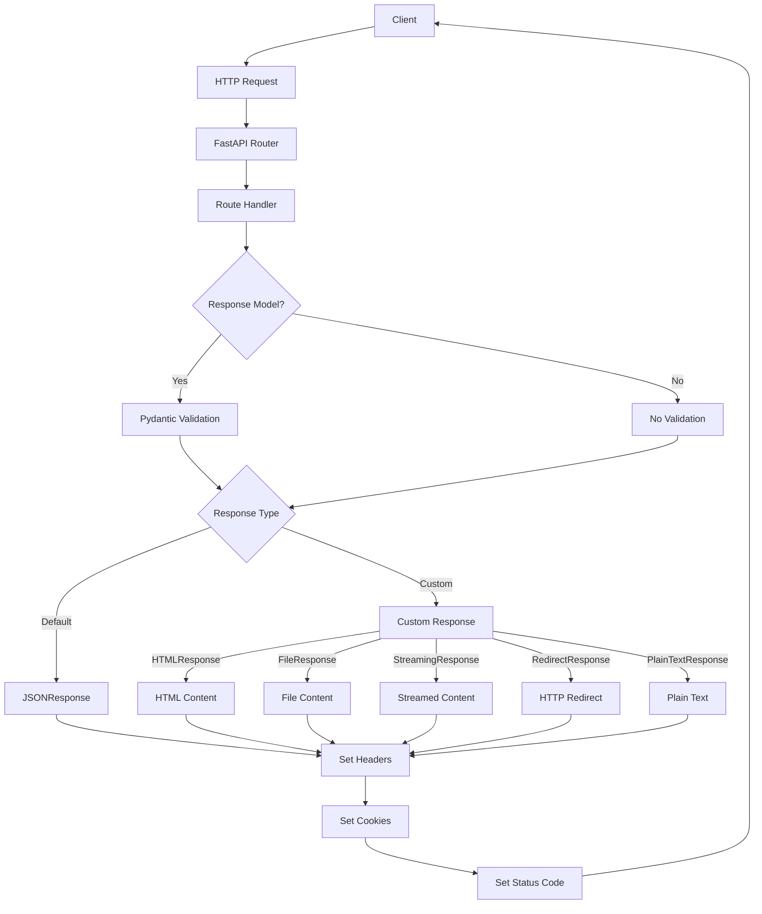

# 5.4 Advanced Response Techniques

## Response Basics

### Response Types in FastAPI

FastAPI offers flexible ways to return responses beyond the default JSON responses. By leveraging various response classes and techniques, you can return different content types, control status codes, set headers, and manipulate cookies.

### Key Characteristics:

- Full control over HTTP responses
- Support for multiple content types
- Header manipulation
- Status code control
- Cookie management
- Streaming capabilities

### Common Response Types:

- JSON responses (default)
- HTML responses
- Plain text responses
- File responses
- Stream responses
- Custom responses
- Redirects

## Response Models and JSON Responses

### Response Models

FastAPI uses Pydantic models to validate, serialize and document responses:

```python
from fastapi import FastAPI
from pydantic import BaseModel, Field
from typing import List, Optional

app = FastAPI()

class Item(BaseModel):
    id: int
    name: str
    description: Optional[str] = None
    price: float = Field(..., gt=0)
    tags: List[str] = []

@app.get("/items/{item_id}", response_model=Item)
async def read_item(item_id: int):
    return {
        "id": item_id,
        "name": "Foo",
        "description": "This is an item",
        "price": 10.5,
        "tags": ["tag1", "tag2"]
    }

```

### Response Model Customization

You can customize responses using parameters:

```python
from fastapi import FastAPI
from pydantic import BaseModel
from typing import List, Optional

app = FastAPI()

class UserIn(BaseModel):
    username: str
    password: str
    email: str
    full_name: Optional[str] = None

class UserOut(BaseModel):
    username: str
    email: str
    full_name: Optional[str] = None

@app.post("/users/", response_model=UserOut)
async def create_user(user: UserIn):
    return user  # FastAPI will filter out password automatically

# Include or exclude fields
@app.get("/users/me", response_model=UserOut, response_model_exclude={"email"})
async def read_user_me():
    return {"username": "johndoe", "email": "john@example.com", "full_name": "John Doe"}

@app.get("/users/all", response_model=List[UserOut], response_model_include={"username"})
async def read_users():
    return [
        {"username": "johndoe", "email": "john@example.com", "full_name": "John Doe"},
        {"username": "alice", "email": "alice@example.com", "full_name": "Alice Smith"}
    ]

```

## Custom Response Classes

FastAPI supports different response types for various content:

### HTML Responses

```python
from fastapi import FastAPI
from fastapi.responses import HTMLResponse

app = FastAPI()

@app.get("/html", response_class=HTMLResponse)
async def read_html():
    return """
    <!DOCTYPE html>
    <html>
        <head>
            <title>FastAPI HTML Response</title>
        </head>
        <body>
            <h1>Hello World</h1>
            <p>This is an HTML response from FastAPI</p>
        </body>
    </html>
    """

```

### Plain Text Responses

```python
from fastapi import FastAPI
from fastapi.responses import PlainTextResponse

app = FastAPI()

@app.get("/text", response_class=PlainTextResponse)
async def read_text():
    return "Hello World! This is a plain text response."

```

### Redirect Responses

```python
from fastapi import FastAPI
from fastapi.responses import RedirectResponse

app = FastAPI()

@app.get("/redirect")
async def redirect():
    return RedirectResponse(url="/destination")

@app.get("/destination")
async def destination():
    return {"message": "You've been redirected"}

```

### File Responses

```python
from fastapi import FastAPI
from fastapi.responses import FileResponse
import os

app = FastAPI()

@app.get("/file")
async def get_file():
    file_path = os.path.join(os.path.dirname(__file__), "files", "example.pdf")
    return FileResponse(
        path=file_path,
        filename="report.pdf",
        media_type="application/pdf"
    )

```

### JSON Responses with Custom Settings

```python
from fastapi import FastAPI
from fastapi.responses import JSONResponse

app = FastAPI()

@app.get("/custom-json")
async def get_custom_json():
    content = {"message": "Hello World", "data": [1, 2, 3, 4, 5]}

    return JSONResponse(
        content=content,
        status_code=200,
        headers={"X-Custom-Header": "Custom Value"}
    )

```

## Response Headers and Cookies

### Setting Response Headers

```python
from fastapi import FastAPI, Response

app = FastAPI()

@app.get("/headers")
async def get_headers(response: Response):
    response.headers["X-Custom-Header"] = "Custom Value"
    response.headers["Cache-Control"] = "max-age=3600"

    return {"message": "Headers set successfully"}

```

### Setting Cookies

```python
from fastapi import FastAPI, Response

app = FastAPI()

@app.get("/cookies")
async def set_cookies(response: Response):
    response.set_cookie(
        key="session",
        value="abc123",
        max_age=3600,
        httponly=True,
        secure=True,
        samesite="lax"
    )

    # Set multiple cookies
    response.set_cookie(key="user", value="johndoe")
    response.set_cookie(key="preferences", value="dark-mode")

    return {"message": "Cookies set successfully"}

```

### Deleting Cookies

```python
from fastapi import FastAPI, Response

app = FastAPI()

@app.get("/delete-cookies")
async def delete_cookies(response: Response):
    response.delete_cookie(key="session")
    return {"message": "Cookie deleted"}

```

## Status Codes

### Setting Status Codes

```python
from fastapi import FastAPI, status

app = FastAPI()

@app.post("/items/", status_code=status.HTTP_201_CREATED)
async def create_item(item: dict):
    return item

@app.get("/not-found")
async def not_found():
    return JSONResponse(
        status_code=status.HTTP_404_NOT_FOUND,
        content={"message": "Item not found"}
    )

```

### Using Status Code Constants

FastAPI provides constants for HTTP status codes:

```python
from fastapi import FastAPI, status, HTTPException

app = FastAPI()

@app.get("/items/{item_id}")
async def read_item(item_id: int):
    if item_id < 1:
        raise HTTPException(
            status_code=status.HTTP_400_BAD_REQUEST,
            detail="Item ID must be positive"
        )
    if item_id == 999:
        raise HTTPException(
            status_code=status.HTTP_404_NOT_FOUND,
            detail="Item not found",
            headers={"X-Error": "Item not in database"}
        )
    return {"item_id": item_id}

```

## Streaming Responses

### StreamingResponse for Large Data

```python
from fastapi import FastAPI
from fastapi.responses import StreamingResponse
import io
import csv

app = FastAPI()

@app.get("/large-csv")
async def get_large_csv():
    def generate_csv():
        # Create a file-like object in memory
        buffer = io.StringIO()
        writer = csv.writer(buffer)

        # Write header
        writer.writerow(["id", "name", "value"])

        # Write many rows
        for i in range(1000000):
            writer.writerow([i, f"Item {i}", i * 10])
            # Yield chunks of data
            if i % 1000 == 0:
                yield buffer.getvalue().encode()
                buffer.truncate(0)
                buffer.seek(0)

        # Yield remaining data
        yield buffer.getvalue().encode()

    return StreamingResponse(
        generate_csv(),
        media_type="text/csv",
        headers={"Content-Disposition": "attachment; filename=large_data.csv"}
    )

```

### Async Generator for Streaming

```python
from fastapi import FastAPI
from fastapi.responses import StreamingResponse
import asyncio

app = FastAPI()

async def slow_numbers(minimum: int, maximum: int):
    for i in range(minimum, maximum + 1):
        yield f"data: {i}\n\n"
        await asyncio.sleep(0.5)  # Simulate slow processing

@app.get("/stream")
async def stream_response():
    return StreamingResponse(
        slow_numbers(1, 20),
        media_type="text/event-stream"
    )

```

## Real-Life Example: File Upload and Processing

Here's an example that demonstrates advanced response techniques with file handling:

```python
from fastapi import FastAPI, File, UploadFile, HTTPException, status, BackgroundTasks
from fastapi.responses import StreamingResponse, JSONResponse, FileResponse
import os
import time
import shutil
import uuid
from typing import List
import csv
import io
import zipfile

app = FastAPI()

# Ensure upload directory exists
UPLOAD_DIR = os.path.join(os.path.dirname(__file__), "uploads")
PROCESSED_DIR = os.path.join(os.path.dirname(__file__), "processed")

os.makedirs(UPLOAD_DIR, exist_ok=True)
os.makedirs(PROCESSED_DIR, exist_ok=True)

# Simple in-memory job status tracker
job_status = {}

# Background processing task
def process_files(file_paths, job_id):
    try:
        job_status[job_id]["status"] = "processing"

        # Simulate processing time
        time.sleep(2)

        # Create output directory for this job
        output_dir = os.path.join(PROCESSED_DIR, job_id)
        os.makedirs(output_dir, exist_ok=True)

        # Process each file
        for file_path in file_paths:
            # Simulate file processing (e.g., read CSV and transform)
            if file_path.endswith(".csv"):
                with open(file_path, "r") as infile, open(os.path.join(output_dir, os.path.basename(file_path)), "w") as outfile:
                    reader = csv.reader(infile)
                    writer = csv.writer(outfile)

                    # Add header
                    header = next(reader)
                    header.append("processed")
                    writer.writerow(header)

                    # Process rows
                    for row in reader:
                        row.append("Yes")
                        writer.writerow(row)

            # Create a simple text summary file
            with open(os.path.join(output_dir, "summary.txt"), "a") as summary:
                summary.write(f"Processed {os.path.basename(file_path)}\n")

        # Create a ZIP file with all processed outputs
        zip_path = os.path.join(output_dir, "results.zip")
        with zipfile.ZipFile(zip_path, "w") as zipf:
            for root, _, files in os.walk(output_dir):
                for file in files:
                    if file != "results.zip":
                        zipf.write(
                            os.path.join(root, file),
                            os.path.relpath(os.path.join(root, file), output_dir)
                        )

        # Update job status
        job_status[job_id]["status"] = "completed"
        job_status[job_id]["result_path"] = zip_path

    except Exception as e:
        print(f"Error processing files: {e}")
        job_status[job_id]["status"] = "failed"
        job_status[job_id]["error"] = str(e)

@app.post("/upload/", status_code=status.HTTP_202_ACCEPTED)
async def upload_files(
    background_tasks: BackgroundTasks,
    files: List[UploadFile] = File(...)
):
    # Generate job ID
    job_id = str(uuid.uuid4())

    # Initialize job status
    job_status[job_id] = {
        "status": "uploading",
        "files": [file.filename for file in files],
        "created_at": time.time()
    }

    # Save uploaded files
    file_paths = []
    try:
        for file in files:
            # Create unique filename
            file_location = os.path.join(UPLOAD_DIR, f"{uuid.uuid4()}_{file.filename}")

            # Save file
            with open(file_location, "wb") as buffer:
                shutil.copyfileobj(file.file, buffer)

            file_paths.append(file_location)

        # Schedule background processing
        background_tasks.add_task(process_files, file_paths, job_id)

        # Return job ID for status checking
        return {
            "job_id": job_id,
            "status": "accepted",
            "message": "Files uploaded and processing started",
            "status_endpoint": f"/status/{job_id}"
        }

    except Exception as e:
        job_status[job_id]["status"] = "failed"
        job_status[job_id]["error"] = str(e)

        raise HTTPException(
            status_code=status.HTTP_500_INTERNAL_SERVER_ERROR,
            detail=f"Error uploading files: {str(e)}"
        )


@app.get("/status/{job_id}")
async def get_job_status(job_id: str):
    if job_id not in job_status:
        raise HTTPException(
            status_code=status.HTTP_404_NOT_FOUND,
            detail="Job not found"
        )

    job = job_status[job_id]

    # Construct response based on job status
    response = {
        "job_id": job_id,
        "status": job["status"],
        "files": job["files"],
        "created_at": job["created_at"]
    }

    # Add error if present
    if "error" in job:
        response["error"] = job["error"]

    # Add download link if completed
    if job["status"] == "completed":
        response["download_url"] = f"/download/{job_id}"

    # Set custom headers
    headers = {
        "X-Job-Status": job["status"],
        "X-Processing-Started": str(job["created_at"])
    }

    return JSONResponse(
        content=response,
        headers=headers
    )

@app.get("/download/{job_id}")
async def download_results(job_id: str):
    if job_id not in job_status:
        raise HTTPException(
            status_code=status.HTTP_404_NOT_FOUND,
            detail="Job not found"
        )

    job = job_status[job_id]

    if job["status"] != "completed":
        raise HTTPException(
            status_code=status.HTTP_400_BAD_REQUEST,
            detail=f"Job is not ready yet. Current status: {job['status']}"
        )

    if "result_path" not in job:
        raise HTTPException(
            status_code=status.HTTP_500_INTERNAL_SERVER_ERROR,
            detail="Result file not found"
        )

    return FileResponse(
        path=job["result_path"],
        filename="processed_results.zip",
        media_type="application/zip"
    )

@app.get("/stream-csv/{job_id}")
async def stream_results_csv(job_id: str):
    """Stream the CSV results for large files"""
    if job_id not in job_status or job_status[job_id]["status"] != "completed":
        raise HTTPException(
            status_code=status.HTTP_404_NOT_FOUND,
            detail="Job not found or not completed"
        )

    # Find all CSV files in the processed directory
    output_dir = os.path.join(PROCESSED_DIR, job_id)
    csv_files = [f for f in os.listdir(output_dir) if f.endswith('.csv')]

    if not csv_files:
        raise HTTPException(
            status_code=status.HTTP_404_NOT_FOUND,
            detail="No CSV files found in processing results"
        )

    # Use the first CSV file for streaming
    csv_path = os.path.join(output_dir, csv_files[0])

    async def file_streamer():
        with open(csv_path, mode="rb") as file:
            # Read and yield file in chunks
            chunk = file.read(8192)  # 8KB chunks
            while chunk:
                yield chunk
                chunk = file.read(8192)

    return StreamingResponse(
        file_streamer(),
        media_type="text/csv",
        headers={
            "Content-Disposition": f"attachment; filename={csv_files[0]}",
            "X-Job-ID": job_id
        }
    )

# Delete the job and its files
@app.delete("/jobs/{job_id}")
async def delete_job(job_id: str):
    if job_id not in job_status:
        raise HTTPException(
            status_code=status.HTTP_404_NOT_FOUND,
            detail="Job not found"
        )

    # Delete the job's files
    try:
        # Delete uploaded files
        for file in job_status[job_id].get("files", []):
            file_path = os.path.join(UPLOAD_DIR, file)
            if os.path.exists(file_path):
                os.remove(file_path)

        # Delete processed directory
        processed_dir = os.path.join(PROCESSED_DIR, job_id)
        if os.path.exists(processed_dir):
            shutil.rmtree(processed_dir)

        # Remove job from status tracker
        del job_status[job_id]

        return JSONResponse(
            content={"message": f"Job {job_id} deleted successfully"},
            status_code=status.HTTP_200_OK
        )
    except Exception as e:
        return JSONResponse(
            content={"error": f"Failed to delete job: {str(e)}"},
            status_code=status.HTTP_500_INTERNAL_SERVER_ERROR
        )
```

## Response Templating

FastAPI integrates easily with templating engines like Jinja2 for generating HTML responses:

```python
from fastapi import FastAPI, Request
from fastapi.responses import HTMLResponse
from fastapi.staticfiles import StaticFiles
from fastapi.templating import Jinja2Templates
import os

app = FastAPI()

# Mount static files directory
app.mount("/static", StaticFiles(directory="static"), name="static")

# Set up templates
templates = Jinja2Templates(directory="templates")

@app.get("/items/{id}", response_class=HTMLResponse)
async def read_item(request: Request, id: str):
    return templates.TemplateResponse(
        "item.html",  # This is a file in your templates directory
        {
            "request": request,
            "id": id,
            "item": {"name": "Foo", "price": 10.99},
            "tax_rate": 0.2
        }
    )

```

Example of `item.html` template:

```html
<!DOCTYPE html>
<html>
  <head>
    <title>Item Details</title>
    <link rel="stylesheet" href="{{ url_for('static', path='/styles.css') }}" />
  </head>
  <body>
    <h1>Item ID: {{ id }}</h1>
    <div class="item-details">
      <p>Name: {{ item.name }}</p>
      <p>Price: ${{ item.price }}</p>
      <p>Price with tax: ${{ item.price * (1 + tax_rate) }}</p>
    </div>
    <a href="/">Back to home</a>
    <script src="{{ url_for('static', path='/script.js') }}"></script>
  </body>
</html>
```

## Response Compression

FastAPI supports automatic response compression:

```python
from fastapi import FastAPI
from fastapi.middleware.gzip import GZipMiddleware

app = FastAPI()

# Add GZip compression middleware
app.add_middleware(GZipMiddleware, minimum_size=1000)

@app.get("/large-data")
async def get_large_data():
    # Generate a large data set
    data = {"items": [{"id": i, "value": f"Item {i}"} for i in range(1000)]}
    return data

```

## Content Negotiation

FastAPI provides content negotiation with different response types:

```python
from fastapi import FastAPI, Request
from fastapi.responses import JSONResponse, HTMLResponse, PlainTextResponse

app = FastAPI()

@app.get("/items/{item_id}",
         responses={
             200: {
                 "content": {
                     "application/json": {},
                     "text/html": {},
                     "text/plain": {},
                 },
             }
         })
async def read_item(request: Request, item_id: str):
    item = {"id": item_id, "name": "Example Item"}

    # Get the Accept header
    accept = request.headers.get("Accept", "")

    # Return different response formats based on Accept header
    if "text/html" in accept:
        html_content = f"""
        <!DOCTYPE html>
        <html>
            <head>
                <title>Item {item_id}</title>
            </head>
            <body>
                <h1>Item {item_id}</h1>
                <p>Name: {item["name"]}</p>
            </body>
        </html>
        """
        return HTMLResponse(content=html_content)

    elif "text/plain" in accept:
        return PlainTextResponse(content=f"Item {item_id}: {item['name']}")

    # Default to JSON
    return item

```

## Response Headers Management

Setting multiple headers and controlling cache behavior:

```python
from fastapi import FastAPI, Response
from datetime import datetime, timedelta

app = FastAPI()

@app.get("/cacheable")
async def cacheable_response(response: Response):
    # Set cache control headers for a response that can be cached for 1 hour
    response.headers["Cache-Control"] = "public, max-age=3600"
    response.headers["Expires"] = (datetime.now() + timedelta(hours=1)).strftime(
        "%a, %d %b %Y %H:%M:%S GMT"
    )

    return {"data": "This response can be cached for 1 hour"}

@app.get("/no-cache")
async def no_cache_response(response: Response):
    # Set headers to prevent caching
    response.headers["Cache-Control"] = "no-store, no-cache, must-revalidate, max-age=0"
    response.headers["Pragma"] = "no-cache"
    response.headers["Expires"] = "0"

    return {"timestamp": datetime.now().isoformat(), "data": "This response is never cached"}

@app.get("/security-headers")
async def security_headers(response: Response):
    # Set security-related headers
    response.headers["X-Content-Type-Options"] = "nosniff"
    response.headers["X-Frame-Options"] = "DENY"
    response.headers["X-XSS-Protection"] = "1; mode=block"
    response.headers["Strict-Transport-Security"] = "max-age=31536000; includeSubDomains"
    response.headers["Content-Security-Policy"] = "default-src 'self'"

    return {"message": "This response includes security headers"}

```

## Custom Response Class

Creating a custom response class for specialized responses:

```python
from fastapi import FastAPI
from fastapi.responses import Response
import json

app = FastAPI()

class PrettyJSONResponse(Response):
    media_type = "application/json"

    def render(self, content) -> bytes:
        # Convert content to pretty-printed JSON
        return json.dumps(
            content,
            ensure_ascii=False,
            allow_nan=False,
            indent=4,
            separators=(", ", ": "),
        ).encode("utf-8")

@app.get("/pretty-json", response_class=PrettyJSONResponse)
async def get_pretty_json():
    return {
        "name": "Pretty Response",
        "description": "A nicely formatted JSON response",
        "items": [
            {"id": 1, "value": "Item 1"},
            {"id": 2, "value": "Item 2"},
            {"id": 3, "value": "Item 3"}
        ],
        "nested": {
            "key1": "value1",
            "key2": "value2"
        }
    }

# Custom CSV response class
class CSVResponse(Response):
    media_type = "text/csv"

    def render(self, content) -> bytes:
        if not isinstance(content, list):
            raise ValueError("Content must be a list of dictionaries or lists")

        # Create a file-like object in memory
        buffer = io.StringIO()

        if isinstance(content[0], dict):
            # Create a CSV writer with dictionary keys as fieldnames
            fieldnames = content[0].keys()
            writer = csv.DictWriter(buffer, fieldnames=fieldnames)

            # Write header and rows
            writer.writeheader()
            writer.writerows(content)
        else:
            # Create a regular CSV writer
            writer = csv.writer(buffer)
            writer.writerows(content)

        return buffer.getvalue().encode()

@app.get("/data-csv", response_class=CSVResponse)
async def get_csv_data():
    return [
        {"id": 1, "name": "Item 1", "price": 10.5},
        {"id": 2, "name": "Item 2", "price": 20.0},
        {"id": 3, "name": "Item 3", "price": 15.75}
    ]

```

## Response Flow Diagram



## Advanced Response Patterns

### 1. Conditional Responses based on Accept Headers

```python
from fastapi import FastAPI, Request, HTTPException
from fastapi.responses import JSONResponse, XMLResponse
import json
import dicttoxml

app = FastAPI()

@app.get("/data")
async def get_data(request: Request):
    # Data to return
    data = {
        "id": 123,
        "name": "Example",
        "items": [{"id": 1, "value": "A"}, {"id": 2, "value": "B"}]
    }

    # Get Accept header
    accept = request.headers.get("Accept", "")

    # Handle different formats
    if "application/json" in accept:
        return JSONResponse(content=data)

    elif "application/xml" in accept:
        xml = dicttoxml.dicttoxml(data)
        return XMLResponse(content=xml)

    elif "text/csv" in accept:
        # Generate CSV for the items list
        csv_content = "id,value\n"
        for item in data["items"]:
            csv_content += f"{item['id']},{item['value']}\n"

        return Response(
            content=csv_content,
            media_type="text/csv",
            headers={"Content-Disposition": "attachment; filename=data.csv"}
        )

    # Default to JSON if no matching Accept header
    return JSONResponse(content=data)

```

### 2. Pagination Headers

```python
from fastapi import FastAPI, Query, Response
from typing import List, Optional
import math

app = FastAPI()

# Sample data
ITEMS = [{"id": i, "name": f"Item {i}"} for i in range(1, 101)]

@app.get("/items/")
async def get_items(
    response: Response,
    page: int = Query(1, ge=1),
    page_size: int = Query(10, ge=1, le=100)
):
    # Calculate pagination
    start = (page - 1) * page_size
    end = start + page_size

    # Get items for the current page
    items = ITEMS[start:end]

    # Calculate total pages
    total_items = len(ITEMS)
    total_pages = math.ceil(total_items / page_size)

    # Set pagination headers
    response.headers["X-Total-Count"] = str(total_items)
    response.headers["X-Total-Pages"] = str(total_pages)
    response.headers["X-Current-Page"] = str(page)

    # Add navigation links as headers
    links = []

    # First page
    links.append(f'<{request.url.path}?page=1&page_size={page_size}>; rel="first"')

    # Previous page
    if page > 1:
        links.append(f'<{request.url.path}?page={page-1}&page_size={page_size}>; rel="prev"')

    # Next page
    if page < total_pages:
        links.append(f'<{request.url.path}?page={page+1}&page_size={page_size}>; rel="next"')

    # Last page
    links.append(f'<{request.url.path}?page={total_pages}&page_size={page_size}>; rel="last"')

    response.headers["Link"] = ", ".join(links)

    return items

```

### 3. Conditional Responses (ETags and Conditional GETs)

```python
from fastapi import FastAPI, Request, Response, status
import hashlib
import json

app = FastAPI()

# Data that might change
RESOURCES = {
    "1": {"id": "1", "name": "Item 1", "version": 1},
    "2": {"id": "2", "name": "Item 2", "version": 1}
}

def calculate_etag(data):
    """Calculate ETag for the given data"""
    data_json = json.dumps(data, sort_keys=True)
    return hashlib.md5(data_json.encode()).hexdigest()

@app.get("/resources/{resource_id}")
async def get_resource(request: Request, resource_id: str, response: Response):
    # Check if resource exists
    if resource_id not in RESOURCES:
        return {"error": "Resource not found"}, 404

    resource = RESOURCES[resource_id]

    # Calculate ETag for current resource state
    etag = calculate_etag(resource)

    # Check If-None-Match header for conditional GET
    if_none_match = request.headers.get("If-None-Match")

    if if_none_match and if_none_match == etag:
        # Resource hasn't changed, return 304 Not Modified
        return Response(status_code=status.HTTP_304_NOT_MODIFIED)

    # Set ETag header
    response.headers["ETag"] = etag
    response.headers["Cache-Control"] = "no-cache"

    return resource

```

### 4. Streaming JSON Arrays for Large Data Sets

```python
from fastapi import FastAPI
from fastapi.responses import StreamingResponse
import json
import asyncio

app = FastAPI()

@app.get("/large-json-stream")
async def get_large_json_stream():
    async def generate_large_json():
        # Start the JSON array
        yield "[\n"

        # Generate 100,000 items, yielding periodically
        for i in range(100000):
            item = {
                "id": i,
                "name": f"Item {i}",
                "value": i * 10
            }

            # Add comma for all but the last item
            if i < 99999:
                yield json.dumps(item) + ",\n"
            else:
                yield json.dumps(item) + "\n"

            # Simulate processing time and yield control
            if i % 1000 == 0:
                await asyncio.sleep(0.01)

        # Close the JSON array
        yield "]"

    return StreamingResponse(
        generate_large_json(),
        media_type="application/json"
    )

```

## Best Practices

1. **Choose the Right Response Type**
   - Match response type to content (HTML for web pages, JSON for APIs)
   - Consider client expectations and the `Accept` header
   - Use streaming responses for large data sets
2. **Set Appropriate Status Codes**
   - Use standard HTTP status codes consistently
   - Prefer specific status codes like `201 Created` over generic ones
   - Leverage FastAPI's status code constants for readability
3. **Handle Headers Properly**
   - Set content-type headers correctly for different response types
   - Use cache control headers to optimize performance
   - Include security headers for all responses
4. **Response Models**
   - Use Pydantic response models to validate output data
   - Take advantage of `response_model_include` and `response_model_exclude` for field filtering
   - Create separate input and output models for security (e.g., password handling)
5. **Error Responses**
   - Return consistent error formats across your API
   - Include helpful error messages and error codes
   - Use appropriate status codes for different error types
6. **Response Size Management**
   - Use pagination for large collections
   - Consider streaming for very large responses
   - Implement compression for bandwidth-intensive APIs
7. **HATEOAS (Hypermedia as the Engine of Application State)**
   - Include relevant links in responses for discoverable APIs
   - Use the `Link` header for pagination
   - Consider media types that support hypermedia (e.g., HAL+JSON)
8. **Security Considerations**
   - Set appropriate CORS headers when needed
   - Use secure cookie settings (httpOnly, secure, SameSite)
   - Don't include sensitive data in responses

## Summary

- FastAPI provides multiple response types beyond the default JSON responses
- Custom response classes enable returning different content types like HTML, files, and streams
- Response models help validate and filter output data
- Headers and cookies can be manipulated for advanced functionality
- Streaming responses are perfect for large data sets or real-time updates
- Status codes convey important information about the response
- Advanced patterns like content negotiation and conditional responses enable sophisticated APIs
- Proper response handling is critical for performance, security, and usability
