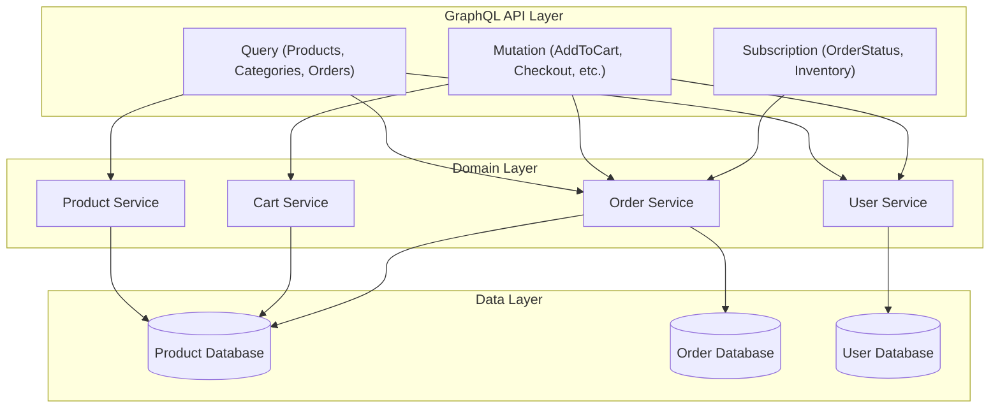

# 7.3 GraphQL Integration

## Introduction to GraphQL

GraphQL is a query language for APIs and a runtime for executing those queries against your data. It provides a more efficient, powerful, and flexible alternative to traditional REST APIs.

### Key Benefits of GraphQL

- **Request Exactly What You Need**: Clients can specify precisely what data they need, reducing over-fetching and under-fetching of data
- **Get Multiple Resources in a Single Request**: Combine what would be multiple REST requests into a single GraphQL query
- **Strong Type System**: GraphQL uses a strong type system to define the capabilities of an API
- **Evolution Without Versioning**: Add new fields and types without impacting existing queries
- **Introspection**: A GraphQL API can be queried for the types it supports, making it self-documenting

## GraphQL vs REST

| Feature             | GraphQL                                          | REST                                                        |
| ------------------- | ------------------------------------------------ | ----------------------------------------------------------- |
| Endpoints           | Single endpoint for all requests                 | Multiple endpoints for different resources                  |
| Data Fetching       | Client specifies exactly what data it needs      | Server determines what data to return                       |
| Over/Under Fetching | Minimal - client gets precisely what it asks for | Common - endpoints often return too much or too little data |
| Versioning          | Can evolve API without versions                  | Often requires versioning (e.g., /api/v1/, /api/v2/)        |
| Documentation       | Self-documenting through introspection           | Requires external documentation                             |
| Caching             | More complex (requires additional tools)         | Simple with HTTP caching mechanisms                         |

## Integrating GraphQL with FastAPI

There are several libraries for implementing GraphQL in Python. The most popular options for FastAPI integration are:

1. **Strawberry**: Modern, type-first GraphQL library using Python type hints
2. **Ariadne**: Schema-first GraphQL library focused on simplicity
3. **Graphene**: Code-first GraphQL framework for Python

Let's explore each of these integration options with FastAPI.

## 1. Using Strawberry with FastAPI

Strawberry is a modern GraphQL library for Python that uses type annotations for defining schemas.

### Installation

```bash
pip install strawberry-graphql fastapi uvicorn

```

### Basic Implementation

```python
import strawberry
from strawberry.fastapi import GraphQLRouter
from fastapi import FastAPI
from typing import List, Optional

# Define GraphQL types
@strawberry.type
class Book:
    id: str
    title: str
    author: str
    published_year: int

# Sample data
books_data = [
    Book(
        id="1",
        title="The Great Gatsby",
        author="F. Scott Fitzgerald",
        published_year=1925
    ),
    Book(
        id="2",
        title="To Kill a Mockingbird",
        author="Harper Lee",
        published_year=1960
    ),
    Book(
        id="3",
        title="1984",
        author="George Orwell",
        published_year=1949
    ),
]

# Define queries
@strawberry.type
class Query:
    @strawberry.field
    def books(self) -> List[Book]:
        return books_data

    @strawberry.field
    def book(self, id: str) -> Optional[Book]:
        for book in books_data:
            if book.id == id:
                return book
        return None

# Define mutations
@strawberry.type
class Mutation:
    @strawberry.mutation
    def add_book(self, title: str, author: str, published_year: int) -> Book:
        new_book = Book(
            id=str(len(books_data) + 1),
            title=title,
            author=author,
            published_year=published_year
        )
        books_data.append(new_book)
        return new_book

# Create schema
schema = strawberry.Schema(query=Query, mutation=Mutation)

# Create FastAPI app with GraphQL endpoint
graphql_app = GraphQLRouter(schema)

app = FastAPI()
app.include_router(graphql_app, prefix="/graphql")

# Optional: Add a redirect from root to GraphQL UI
@app.get("/")
async def redirect_to_graphql():
    from fastapi.responses import RedirectResponse
    return RedirectResponse(url="/graphql")

```

## Using Strawberry with Database (SQLAlchemy)

```python
import strawberry
from strawberry.fastapi import GraphQLRouter
from fastapi import FastAPI, Depends
from sqlalchemy import Column, Integer, String, create_engine
from sqlalchemy.ext.declarative import declarative_base
from sqlalchemy.orm import sessionmaker, Session
from typing import List, Optional

# Setup database
DATABASE_URL = "sqlite:///./books.db"
engine = create_engine(DATABASE_URL)
SessionLocal = sessionmaker(autocommit=False, autoflush=False, bind=engine)
Base = declarative_base()

# Define SQLAlchemy model
class BookModel(Base):
    __tablename__ = "books"

    id = Column(Integer, primary_key=True, index=True)
    title = Column(String, index=True)
    author = Column(String)
    published_year = Column(Integer)

# Create tables
Base.metadata.create_all(bind=engine)

# Dependency to get DB session
def get_db():
    db = SessionLocal()
    try:
        yield db
    finally:
        db.close()

# Define Strawberry type
@strawberry.type
class Book:
    id: int
    title: str
    author: str
    published_year: int

# Define resolver functions
def get_books(db: Session = Depends(get_db)) -> List[Book]:
    books = db.query(BookModel).all()
    return [
        Book(
            id=book.id,
            title=book.title,
            author=book.author,
            published_year=book.published_year
        )
        for book in books
    ]

def get_book(id: int, db: Session = Depends(get_db)) -> Optional[Book]:
    book = db.query(BookModel).filter(BookModel.id == id).first()
    if book:
        return Book(
            id=book.id,
            title=book.title,
            author=book.author,
            published_year=book.published_year
        )
    return None

def add_book(
    title: str,
    author: str,
    published_year: int,
    db: Session = Depends(get_db)
) -> Book:
    book = BookModel(
        title=title,
        author=author,
        published_year=published_year
    )
    db.add(book)
    db.commit()
    db.refresh(book)
    return Book(
        id=book.id,
        title=book.title,
        author=book.author,
        published_year=book.published_year
    )

# Define queries with dependencies
@strawberry.type
class Query:
    @strawberry.field
    def books(self, info) -> List[Book]:
        return get_books(db=info.context["db"])

    @strawberry.field
    def book(self, info, id: int) -> Optional[Book]:
        return get_book(id=id, db=info.context["db"])

# Define mutations with dependencies
@strawberry.type
class Mutation:
    @strawberry.mutation
    def add_book(
        self,
        info,
        title: str,
        author: str,
        published_year: int
    ) -> Book:
        return add_book(
            title=title,
            author=author,
            published_year=published_year,
            db=info.context["db"]
        )

# Create schema
schema = strawberry.Schema(query=Query, mutation=Mutation)

# Create FastAPI app with GraphQL endpoint
async def get_context():
    db = SessionLocal()
    try:
        yield {"db": db}
    finally:
        db.close()

graphql_app = GraphQLRouter(
    schema,
    context_getter=get_context,
)

app = FastAPI()
app.include_router(graphql_app, prefix="/graphql")

```

## 2. Using Ariadne with FastAPI

Ariadne is a schema-first GraphQL library for Python that implements resolvers using simple functions.

### Installation

```bash
pip install ariadne fastapi uvicorn

```

### Basic Implementation

```python
from ariadne import ObjectType, QueryType, MutationType, make_executable_schema, gql
from ariadne.asgi import GraphQL
from fastapi import FastAPI

# Define schema using SDL (Schema Definition Language)
type_defs = gql("""
    type Book {
        id: ID!
        title: String!
        author: String!
        publishedYear: Int!
    }

    type Query {
        books: [Book!]!
        book(id: ID!): Book
    }

    type Mutation {
        addBook(title: String!, author: String!, publishedYear: Int!): Book!
    }
""")

# Sample data
books_data = [
    {"id": "1", "title": "The Great Gatsby", "author": "F. Scott Fitzgerald", "publishedYear": 1925},
    {"id": "2", "title": "To Kill a Mockingbird", "author": "Harper Lee", "publishedYear": 1960},
    {"id": "3", "title": "1984", "author": "George Orwell", "publishedYear": 1949},
]

# Define resolvers
query = QueryType()
mutation = MutationType()

@query.field("books")
def resolve_books(*_):
    return books_data

@query.field("book")
def resolve_book(_, info, id):
    for book in books_data:
        if book["id"] == id:
            return book
    return None

@mutation.field("addBook")
def resolve_add_book(_, info, title, author, publishedYear):
    new_book = {
        "id": str(len(books_data) + 1),
        "title": title,
        "author": author,
        "publishedYear": publishedYear
    }
    books_data.append(new_book)
    return new_book

# Create executable schema
schema = make_executable_schema(type_defs, query, mutation)

# Create FastAPI app with GraphQL endpoint
app = FastAPI()
app.mount("/graphql", GraphQL(schema, debug=True))

# Optional: Add a redirect from root to GraphQL UI
@app.get("/")
async def redirect_to_graphql():
    from fastapi.responses import RedirectResponse
    return RedirectResponse(url="/graphql")

```

### Using Ariadne with Database (SQLAlchemy)

```python
from ariadne import ObjectType, QueryType, MutationType, make_executable_schema, gql
from ariadne.asgi import GraphQL
from fastapi import FastAPI, Depends
from sqlalchemy import Column, Integer, String, create_engine
from sqlalchemy.ext.declarative import declarative_base
from sqlalchemy.orm import sessionmaker, Session
from typing import List

# Setup database
DATABASE_URL = "sqlite:///./books.db"
engine = create_engine(DATABASE_URL)
SessionLocal = sessionmaker(autocommit=False, autoflush=False, bind=engine)
Base = declarative_base()

# Define SQLAlchemy model
class BookModel(Base):
    __tablename__ = "books"

    id = Column(Integer, primary_key=True, index=True)
    title = Column(String, index=True)
    author = Column(String)
    published_year = Column(Integer, name="published_year")  # Match GraphQL field name convention

# Create tables
Base.metadata.create_all(bind=engine)

# Dependency to get DB session
def get_db():
    db = SessionLocal()
    try:
        yield db
    finally:
        db.close()

# Define schema using SDL
type_defs = gql("""
    type Book {
        id: ID!
        title: String!
        author: String!
        publishedYear: Int!
    }

    type Query {
        books: [Book!]!
        book(id: ID!): Book
    }

    type Mutation {
        addBook(title: String!, author: String!, publishedYear: Int!): Book!
    }
""")

# Define resolvers
query = QueryType()
mutation = MutationType()
book = ObjectType("Book")

@query.field("books")
def resolve_books(_, info):
    db = info.context["db"]
    return db.query(BookModel).all()

@query.field("book")
def resolve_book(_, info, id):
    db = info.context["db"]
    return db.query(BookModel).filter(BookModel.id == id).first()

@mutation.field("addBook")
def resolve_add_book(_, info, title, author, publishedYear):
    db = info.context["db"]
    book = BookModel(
        title=title,
        author=author,
        published_year=publishedYear
    )
    db.add(book)
    db.commit()
    db.refresh(book)
    return book

# Map Python snake_case to GraphQL camelCase
@book.field("publishedYear")
def resolve_published_year(obj, info):
    return obj.published_year

# Create executable schema
schema = make_executable_schema(type_defs, [query, mutation, book])

# Create FastAPI app with GraphQL endpoint
app = FastAPI()

# GraphQL context setup for database session
async def get_context_value(request):
    db = SessionLocal()
    try:
        return {"request": request, "db": db}
    finally:
        db.close()

app.mount("/graphql", GraphQL(
    schema,
    context_value=get_context_value,
    debug=True
))

```

## 3. Using Graphene with FastAPI

Graphene is a mature GraphQL library for Python that uses a code-first approach.

### Installation

```bash
pip install graphene fastapi uvicorn

```

### Basic Implementation

```python
import graphene
from fastapi import FastAPI
from starlette.graphql import GraphQLApp

# Define types
class Book(graphene.ObjectType):
    id = graphene.ID()
    title = graphene.String()
    author = graphene.String()
    published_year = graphene.Int()

# Sample data
books_data = [
    {"id": "1", "title": "The Great Gatsby", "author": "F. Scott Fitzgerald", "published_year": 1925},
    {"id": "2", "title": "To Kill a Mockingbird", "author": "Harper Lee", "published_year": 1960},
    {"id": "3", "title": "1984", "author": "George Orwell", "published_year": 1949},
]

# Define query
class Query(graphene.ObjectType):
    books = graphene.List(Book)
    book = graphene.Field(Book, id=graphene.ID(required=True))

    def resolve_books(self, info):
        return books_data

    def resolve_book(self, info, id):
        for book in books_data:
            if book["id"] == id:
                return book
        return None

# Define mutation
class AddBook(graphene.Mutation):
    class Arguments:
        title = graphene.String(required=True)
        author = graphene.String(required=True)
        published_year = graphene.Int(required=True)

    book = graphene.Field(Book)

    def mutate(self, info, title, author, published_year):
        new_book = {
            "id": str(len(books_data) + 1),
            "title": title,
            "author": author,
            "published_year": published_year
        }
        books_data.append(new_book)
        return AddBook(book=new_book)

class Mutation(graphene.ObjectType):
    add_book = AddBook.Field()

# Create schema
schema = graphene.Schema(query=Query, mutation=Mutation)

# Create FastAPI app with GraphQL endpoint
app = FastAPI()
app.add_route("/graphql", GraphQLApp(schema=schema))

# Optional: Add a redirect from root to GraphQL UI
@app.get("/")
async def redirect_to_graphql():
    from fastapi.responses import RedirectResponse
    return RedirectResponse(url="/graphql")

```

### Using Graphene with Database (SQLAlchemy)

```python
import graphene
from graphene_sqlalchemy import SQLAlchemyObjectType, SQLAlchemyConnectionField
from fastapi import FastAPI, Depends
from starlette.graphql import GraphQLApp
from sqlalchemy import Column, Integer, String, create_engine
from sqlalchemy.ext.declarative import declarative_base
from sqlalchemy.orm import sessionmaker, scoped_session, Session
import contextlib

# Setup database
DATABASE_URL = "sqlite:///./books.db"
engine = create_engine(DATABASE_URL)
SessionLocal = sessionmaker(autocommit=False, autoflush=False, bind=engine)
Base = declarative_base()

# Define SQLAlchemy model
class BookModel(Base):
    __tablename__ = "books"

    id = Column(Integer, primary_key=True, index=True)
    title = Column(String, index=True)
    author = Column(String)
    published_year = Column(Integer)

# Create tables
Base.metadata.create_all(bind=engine)

# Create database session
db_session = scoped_session(SessionLocal)

# Define Graphene-SQLAlchemy type
class Book(SQLAlchemyObjectType):
    class Meta:
        model = BookModel
        interfaces = (graphene.relay.Node, )

# Define query
class Query(graphene.ObjectType):
    node = graphene.relay.Node.Field()
    books = SQLAlchemyConnectionField(Book.connection)
    book = graphene.Field(Book, id=graphene.Int(required=True))

    def resolve_book(self, info, id):
        return db_session.query(BookModel).filter(BookModel.id == id).first()

# Define mutation
class AddBook(graphene.Mutation):
    class Arguments:
        title = graphene.String(required=True)
        author = graphene.String(required=True)
        published_year = graphene.Int(required=True)

    book = graphene.Field(lambda: Book)

    def mutate(self, info, title, author, published_year):
        book = BookModel(
            title=title,
            author=author,
            published_year=published_year
        )
        db_session.add(book)
        db_session.commit()
        return AddBook(book=book)

class Mutation(graphene.ObjectType):
    add_book = AddBook.Field()

# Create schema
schema = graphene.Schema(query=Query, mutation=Mutation)

# Create FastAPI app with GraphQL endpoint
app = FastAPI()
app.add_route("/graphql", GraphQLApp(schema=schema))

# Add middleware to manage database sessions
@contextlib.contextmanager
def get_db():
    session = SessionLocal()
    try:
        yield session
    finally:
        session.close()

@app.middleware("http")
async def db_session_middleware(request, call_next):
    response = await call_next(request)
    db_session.remove()
    return response

```

## Advanced GraphQL Features

### Authentication and Authorization

Adding authentication to GraphQL in FastAPI:

```python
import strawberry
from strawberry.fastapi import GraphQLRouter
from fastapi import FastAPI, Depends, HTTPException, status
from fastapi.security import OAuth2PasswordBearer, OAuth2PasswordRequestForm
from typing import List, Optional, Union, Annotated
from datetime import datetime, timedelta
import jwt
from pydantic import BaseModel

# Authentication setup
SECRET_KEY = "your-secret-key"
ALGORITHM = "HS256"
ACCESS_TOKEN_EXPIRE_MINUTES = 30

oauth2_scheme = OAuth2PasswordBearer(tokenUrl="token")

# User models
class UserModel(BaseModel):
    username: str
    email: str
    disabled: bool = False

class UserInDB(UserModel):
    hashed_password: str

# Mock user database
fake_users_db = {
    "johndoe": {
        "username": "johndoe",
        "email": "johndoe@example.com",
        "hashed_password": "fakehashedsecret",
        "disabled": False,
    }
}

def get_user(db, username: str):
    if username in db:
        user_dict = db[username]
        return UserInDB(**user_dict)
    return None

def authenticate_user(db, username: str, password: str):
    user = get_user(db, username)
    if not user:
        return False
    # In a real app, verify the password hash
    if not password == "secret":
        return False
    return user

def create_access_token(data: dict, expires_delta: timedelta = None):
    to_encode = data.copy()
    if expires_delta:
        expire = datetime.utcnow() + expires_delta
    else:
        expire = datetime.utcnow() + timedelta(minutes=15)
    to_encode.update({"exp": expire})
    encoded_jwt = jwt.encode(to_encode, SECRET_KEY, algorithm=ALGORITHM)
    return encoded_jwt

async def get_current_user(token: Annotated[str, Depends(oauth2_scheme)]):
    credentials_exception = HTTPException(
        status_code=status.HTTP_401_UNAUTHORIZED,
        detail="Could not validate credentials",
        headers={"WWW-Authenticate": "Bearer"},
    )
    try:
        payload = jwt.decode(token, SECRET_KEY, algorithms=[ALGORITHM])
        username: str = payload.get("sub")
        if username is None:
            raise credentials_exception
    except jwt.PyJWTError:
        raise credentials_exception

    user = get_user(fake_users_db, username)
    if user is None:
        raise credentials_exception
    return user

# FastAPI endpoints for authentication
app = FastAPI()

@app.post("/token")
async def login_for_access_token(form_data: Annotated[OAuth2PasswordRequestForm, Depends()]):
    user = authenticate_user(fake_users_db, form_data.username, form_data.password)
    if not user:
        raise HTTPException(
            status_code=status.HTTP_401_UNAUTHORIZED,
            detail="Incorrect username or password",
            headers={"WWW-Authenticate": "Bearer"},
        )
    access_token_expires = timedelta(minutes=ACCESS_TOKEN_EXPIRE_MINUTES)
    access_token = create_access_token(
        data={"sub": user.username}, expires_delta=access_token_expires
    )
    return {"access_token": access_token, "token_type": "bearer"}

# GraphQL types and schema
@strawberry.type
class User:
    username: str
    email: str

@strawberry.type
class Book:
    id: int
    title: str
    author: str
    published_year: int

# Sample book data
books_data = [
    {"id": 1, "title": "The Great Gatsby", "author": "F. Scott Fitzgerald", "published_year": 1925},
    {"id": 2, "title": "To Kill a Mockingbird", "author": "Harper Lee", "published_year": 1960},
]

@strawberry.type
class Query:
    @strawberry.field
    def books(self, info) -> List[Book]:
        # Get current user from context
        current_user = info.context["user"]
        if current_user is None:
            raise Exception("Not authenticated")

        # Return books data
        return [Book(**book) for book in books_data]

    @strawberry.field
    def me(self, info) -> User:
        current_user = info.context["user"]
        if current_user is None:
            raise Exception("Not authenticated")

        return User(username=current_user.username, email=current_user.email)

# Create schema
schema = strawberry.Schema(query=Query)

# Context function to include user in GraphQL context
async def get_context(
    current_user: Annotated[UserModel, Depends(get_current_user)]
):
    return {"user": current_user}

# Setup GraphQL endpoint with authentication
graphql_app = GraphQLRouter(
    schema,
    context_getter=get_context,
)

app.include_router(graphql_app, prefix="/graphql")

```

### N+1 Query Problem and DataLoader

The N+1 query problem occurs when you fetch a list of items and then need to fetch related data for each item, resulting in multiple database queries.

```python
import strawberry
from strawberry.fastapi import GraphQLRouter
from fastapi import FastAPI, Depends
from sqlalchemy import Column, Integer, String, ForeignKey, create_engine
from sqlalchemy.ext.declarative import declarative_base
from sqlalchemy.orm import sessionmaker, relationship, Session
from typing import List, Dict, Any
import asyncio
from dataclasses import dataclass

# Setup database
DATABASE_URL = "sqlite:///./library.db"
engine = create_engine(DATABASE_URL)
SessionLocal = sessionmaker(autocommit=False, autoflush=False, bind=engine)
Base = declarative_base()

# Define SQLAlchemy models
class AuthorModel(Base):
    __tablename__ = "authors"

    id = Column(Integer, primary_key=True, index=True)
    name = Column(String, index=True)
    bio = Column(String)

    books = relationship("BookModel", back_populates="author")

class BookModel(Base):
    __tablename__ = "books"

    id = Column(Integer, primary_key=True, index=True)
    title = Column(String, index=True)
    published_year = Column(Integer)
    author_id = Column(Integer, ForeignKey("authors.id"))

    author = relationship("AuthorModel", back_populates="books")

# Create tables
Base.metadata.create_all(bind=engine)

# DataLoader implementation for batching
@dataclass
class DataLoader:
    session: Session
    batch_load_fn: Any
    cache: Dict[Any, Any] = None

    def __post_init__(self):
        self.cache = {}

    async def load(self, key):
        if key in self.cache:
            return self.cache[key]

        # Collect all keys that need to be loaded
        return await self.batch_load_fn([key])

    async def load_many(self, keys):
        # Filter out keys that are already cached
        missing_keys = [key for key in keys if key not in self.cache]

        if missing_keys:
            # Load all missing keys at once
            await self.batch_load_fn(missing_keys)

        # Return values from cache
        return [self.cache.get(key) for key in keys]

# Batch loading function for authors
async def batch_load_authors(session, author_ids):
    print(f"Loading authors: {author_ids}")
    authors = session.query(AuthorModel).filter(AuthorModel.id.in_(author_ids)).all()
    author_map = {author.id: author for author in authors}
    return [author_map.get(author_id) for author_id in author_ids]

# Dependency to get DB session
def get_db():
    db = SessionLocal()
    try:
        yield db
    finally:
        db.close()

# GraphQL types
@strawberry.type
class Author:
    id: int
    name: str
    bio: str

@strawberry.type
class Book:
    id: int
    title: str
    published_year: int
    author_id: int

    @strawberry.field
    async def author(self, info) -> Author:
        # Use DataLoader to fetch author
        author_loader = info.context["author_loader"]
        author_model = await author_loader.load(self.author_id)

        return Author(
            id=author_model.id,
            name=author_model.name,
            bio=author_model.bio
        )

@strawberry.type
class Query:
    @strawberry.field
    def books(self, info) -> List[Book]:
        db = info.context["db"]
        books = db.query(BookModel).all()

        return [
            Book(
                id=book.id,
                title=book.title,
                published_year=book.published_year,
                author_id=book.author_id
            )
            for book in books
        ]

# Create schema
schema = strawberry.Schema(query=Query)

# Create FastAPI app with GraphQL endpoint
app = FastAPI()

# Context function that provides the DataLoader
async def get_context(db: Session = Depends(get_db)):
    # Create a new DataLoader for each request
    async def batch_fn(author_ids):
        authors = db.query(AuthorModel).filter(AuthorModel.id.in_(author_ids)).all()
        author_map = {author.id: author for author in authors}
        # Update cache
        loader.cache.update(author_map)
        return [author_map.get(author_id) for author_id in author_ids]

    loader = DataLoader(session=db, batch_load_fn=batch_fn)

    return {
        "db": db,
        "author_loader": loader
    }

graphql_app = GraphQLRouter(
    schema,
    context_getter=get_context,
)

app.include_router(graphql_app, prefix="/graphql")

```

### Subscriptions with WebSockets

Implementing real-time capabilities with GraphQL subscriptions:

```python
import strawberry
from strawberry.fastapi import GraphQLRouter
from fastapi import FastAPI
from typing import List, AsyncGenerator
import asyncio
from contextlib import asynccontextmanager

# In-memory event queue for subscriptions
event_generators = []

# GraphQL types
@strawberry.type
class Book:
    id: str
    title: str
    author: str

# Sample data
books_data = [
    {"id": "1", "title": "The Great Gatsby", "author": "F. Scott Fitzgerald"},
    {"id": "2", "title": "To Kill a Mockingbird", "author": "Harper Lee"},
]

# Helper to broadcast new books to all subscribers
async def broadcast_book(book: dict):
    global event_generators
    # Create a Book instance from the dictionary
    book_obj = Book(id=book["id"], title=book["title"], author=book["author"])

    # Send the new book to all active subscribers
    for queue in event_generators:
        await queue.put(book_obj)

@strawberry.type
class Query:
    @strawberry.field
    def books(self) -> List[Book]:
        return [Book(**book) for book in books_data]

@strawberry.type
class Mutation:
    @strawberry.mutation
    async def add_book(self, title: str, author: str) -> Book:
        # Create a new book
        new_book = {
            "id": str(len(books_data) + 1),
            "title": title,
            "author": author
        }
        books_data.append(new_book)

        # Notify subscribers about the new book
        await broadcast_book(new_book)

        return Book(**new_book)

@strawberry.type
class Subscription:
    @strawberry.subscription
    async def book_added(self) -> AsyncGenerator[Book, None]:
        # Create a queue for this subscription
        queue = asyncio.Queue()
        event_generators.append(queue)

        try:
            # Yield new books as they are added
            while True:
                book = await queue.get()
                yield book
        finally:
            # Clean up when subscription ends
            event_generators.remove(queue)

# Create schema with subscription support
schema = strawberry.Schema(query=Query, mutation=Mutation, subscription=Subscription)

# Create FastAPI app with GraphQL endpoint
app = FastAPI()

# Use GraphQLRouter with subscription support
graphql_app = GraphQLRouter(schema)
app.include_router(graphql_app, prefix="/graphql")

```

## Real-world Example: E-commerce API

Building a more complex e-commerce API with GraphQL and FastAPI:



## Best Practices for GraphQL with FastAPI

1. **Schema Design**:
   - Keep fields focused on clear use cases
   - Use meaningful names and consistent conventions
   - Group related fields into types
   - Consider pagination for lists
2. **Performance Optimization**:
   - Implement DataLoader to solve N+1 queries
   - Use query complexity analysis to prevent expensive queries
   - Consider field-level caching for frequently accessed data
   - Limit query depth and complexity
3. **Error Handling**:
   - Return meaningful error messages
   - Use proper HTTP status codes alongside GraphQL errors
   - Implement validation at the schema level
4. **Security**:
   - Implement proper authentication and authorization
   - Validate and sanitize all inputs
   - Apply rate limiting to prevent abuse
   - Use query depth and complexity limits
5. **Testing**:
   - Write tests for resolvers
   - Test error cases
   - Test schema validation
6. **Documentation**:
   - Use descriptive field and type descriptions
   - Document mutations and their possible errors
   - Provide examples of common queries

## Comparing GraphQL Libraries for FastAPI

| Feature                  | Strawberry                       | Ariadne            | Graphene                    |
| ------------------------ | -------------------------------- | ------------------ | --------------------------- |
| Approach                 | Type-first (annotations)         | Schema-first (SDL) | Code-first (Python classes) |
| Type Safety              | Strong (using Python type hints) | Medium             | Medium                      |
| Async Support            | Built-in                         | Built-in           | Limited                     |
| Integration with FastAPI | Excellent                        | Good               | Good                        |
| Maturity                 | Newer, actively developed        | Stable             | Mature, less active         |
| Dataloader Support       | Yes                              | Yes                | Yes (via extensions)        |
| Subscription Support     | Yes                              | Yes                | Limited                     |
| Documentation            | Good                             | Good               | Extensive                   |

## Conclusion

GraphQL provides a powerful alternative to traditional REST APIs, particularly for applications with complex data requirements. FastAPI's async capabilities and type support make it an excellent choice for building GraphQL APIs in Python.

When choosing a GraphQL library to use with FastAPI:

- Choose **Strawberry** if you prefer a type-first approach with modern Python type annotations
- Choose **Ariadne** if you prefer a schema-first approach with SDL
- Choose **Graphene** if you need a mature, code-first library with extensive documentation

The integration of GraphQL with FastAPI enables building high-performance, type-safe, and flexible APIs that can evolve without versioning, making it an excellent choice for modern web and mobile applications.
