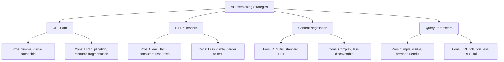

# 8.1 API Versioning

## Introduction to API Versioning

API versioning is a critical strategy for evolving your API while maintaining backward compatibility for existing clients. It allows you to introduce breaking changes without disrupting current users, giving them time to adapt to new versions.

### Why Version Your API?

- **Backward Compatibility**: Ensures existing client applications continue to function
- **Progressive Evolution**: Allows your API to evolve with changing requirements
- **Client Flexibility**: Gives clients the ability to migrate to newer versions at their own pace
- **Documentation Clarity**: Makes it clear which features are available in which versions
- **Deprecation Management**: Provides a clear path for phasing out older functionality

## URL-based Versioning

URL-based versioning embeds the version number directly in the API endpoint's URL path.

### Implementation in FastAPI

```python
from fastapi import FastAPI, APIRouter

app = FastAPI(title="My Versioned API")

# Create routers for different versions
v1_router = APIRouter(prefix="/v1")
v2_router = APIRouter(prefix="/v2")

# V1 endpoints
@v1_router.get("/users/")
async def get_users_v1():
    return [{"id": 1, "name": "John Doe", "email": "john@example.com"}]

# V2 endpoints with enhanced response
@v2_router.get("/users/")
async def get_users_v2():
    return [
        {
            "id": 1,
            "name": "John Doe",
            "email": "john@example.com",
            "role": "admin",  # New field in v2
            "created_at": "2023-01-01T00:00:00Z"  # New field in v2
        }
    ]

# Include routers in the main app
app.include_router(v1_router)
app.include_router(v2_router)

```

### Advantages of URL-based Versioning

- **Simplicity**: Easy to implement and understand
- **Discoverability**: Versions are clearly visible in the URL
- **Caching**: Different versions can be cached separately
- **Documentation**: Clear separation in API documentation tools like Swagger UI

### Disadvantages of URL-based Versioning

- **Duplication**: Can lead to code duplication between versions
- **URI Uniqueness**: Violates the principle that URIs should represent unique resources
- **SEO Impact**: Multiple URLs for similar content may affect search engine optimization

## Header-based Versioning

Header-based versioning uses HTTP headers to specify the API version while keeping the URL consistent.

### Implementation in FastAPI

```python
from fastapi import FastAPI, Header, HTTPException
from typing import Optional

app = FastAPI()

@app.get("/users/")
async def get_users(api_version: Optional[str] = Header(None, alias="X-API-Version")):
    if api_version is None or api_version == "1.0":
        # V1 response
        return [{"id": 1, "name": "John Doe", "email": "john@example.com"}]
    elif api_version == "2.0":
        # V2 response
        return [
            {
                "id": 1,
                "name": "John Doe",
                "email": "john@example.com",
                "role": "admin",
                "created_at": "2023-01-01T00:00:00Z"
            }
        ]
    else:
        raise HTTPException(status_code=400, detail=f"API version {api_version} not supported")

```

### Using Dependency Injection for Header Versioning

A more structured approach using FastAPI's dependency injection:

```python
from fastapi import FastAPI, Header, Depends, HTTPException
from enum import Enum
from typing import Optional, Callable, Any

app = FastAPI()

class ApiVersion(str, Enum):
    V1 = "1.0"
    V2 = "2.0"

def version_dependency(api_version: Optional[str] = Header(None, alias="X-API-Version")) -> ApiVersion:
    if api_version is None:
        return ApiVersion.V1

    try:
        return ApiVersion(api_version)
    except ValueError:
        raise HTTPException(
            status_code=400,
            detail=f"API version {api_version} not supported. Supported versions: {[v.value for v in ApiVersion]}"
        )

# Applying versioning to routes
@app.get("/users/")
async def get_users(version: ApiVersion = Depends(version_dependency)):
    if version == ApiVersion.V1:
        return [{"id": 1, "name": "John Doe", "email": "john@example.com"}]
    elif version == ApiVersion.V2:
        return [
            {
                "id": 1,
                "name": "John Doe",
                "email": "john@example.com",
                "role": "admin",
                "created_at": "2023-01-01T00:00:00Z"
            }
        ]

```

### Advantages of Header-based Versioning

- **Clean URLs**: Resource identifiers remain consistent across versions
- **Flexibility**: Easy to default to a specific version
- **Resource Consistency**: Maintains the principle that a URI identifies a single resource
- **Future-proofing**: Adding new versions doesn't change the URL structure

### Disadvantages of Header-based Versioning

- **Discoverability**: Less visible than URL-based versions, harder to discover
- **Caching Complexity**: May require additional cache key strategies
- **Testing Difficulty**: Requires setting custom headers for testing

## Content Negotiation-based Versioning

Content negotiation-based versioning uses the HTTP `Accept` header to specify the desired version and response format.

### Implementation in FastAPI

```python
from fastapi import FastAPI, Header, HTTPException
from typing import Optional

app = FastAPI()

@app.get("/users/")
async def get_users(accept: Optional[str] = Header(None)):
    # Default to v1 if no Accept header
    if accept is None:
        version = "1.0"
    elif "application/vnd.myapi.v1+json" in accept:
        version = "1.0"
    elif "application/vnd.myapi.v2+json" in accept:
        version = "2.0"
    else:
        # Default to the latest version if header format not recognized
        version = "2.0"

    if version == "1.0":
        return [{"id": 1, "name": "John Doe", "email": "john@example.com"}]
    else:  # version == "2.0"
        return [
            {
                "id": 1,
                "name": "John Doe",
                "email": "john@example.com",
                "role": "admin",
                "created_at": "2023-01-01T00:00:00Z"
            }
        ]

```

### Using FastAPI's Response Headers

You can also respond with appropriate headers to indicate the version served:

```python
from fastapi import FastAPI, Header, Response
from typing import Optional

app = FastAPI()

@app.get("/users/")
async def get_users(
    response: Response,
    accept: Optional[str] = Header(None)
):
    if accept is None or "application/vnd.myapi.v1+json" in accept:
        version = "1.0"
        content_type = "application/vnd.myapi.v1+json"
        data = [{"id": 1, "name": "John Doe", "email": "john@example.com"}]
    else:
        version = "2.0"
        content_type = "application/vnd.myapi.v2+json"
        data = [
            {
                "id": 1,
                "name": "John Doe",
                "email": "john@example.com",
                "role": "admin",
                "created_at": "2023-01-01T00:00:00Z"
            }
        ]

    response.headers["Content-Type"] = content_type
    return data

```

### Advantages of Content Negotiation-based Versioning

- **HTTP Standard**: Follows standard HTTP content negotiation mechanisms
- **Clean URLs**: Resource identifiers remain consistent
- **Flexibility**: Clients can request different formats and versions in one header
- **RESTful**: Considered more RESTful than other approaches

### Disadvantages of Content Negotiation-based Versioning

- **Complexity**: More complex to implement and use
- **Discoverability**: Less obvious for API users
- **Browser Limitations**: Browsers may not easily allow setting Accept headers
- **Caching Challenges**: Multiple representations of the same URL

## Query Parameter-based Versioning

Query parameter-based versioning specifies the version in the URL's query string.

### Implementation in FastAPI

```python
from fastapi import FastAPI, Query

app = FastAPI()

@app.get("/users/")
async def get_users(version: str = Query("1.0", description="API version")):
    if version == "1.0":
        return [{"id": 1, "name": "John Doe", "email": "john@example.com"}]
    elif version == "2.0":
        return [
            {
                "id": 1,
                "name": "John Doe",
                "email": "john@example.com",
                "role": "admin",
                "created_at": "2023-01-01T00:00:00Z"
            }
        ]
    else:
        # Default to latest if version not supported
        return [
            {
                "id": 1,
                "name": "John Doe",
                "email": "john@example.com",
                "role": "admin",
                "created_at": "2023-01-01T00:00:00Z"
            }
        ]

```

### Advantages of Query Parameter-based Versioning

- **Simplicity**: Easy to implement and use
- **Discoverability**: Visible in the URL
- **Browser Compatibility**: Easily testable in a browser
- **Caching**: Can be cached with the standard URL

### Disadvantages of Query Parameter-based Versioning

- **Non-RESTful**: Not considered as RESTful as other approaches
- **Default Version Required**: Needs a fallback when parameter is omitted
- **URL Pollution**: Adds another parameter to URLs

## Advanced Versioning Techniques

### Namespace Versioning with APIRouter

Organizing your code by version using FastAPI's APIRouter:

```python
from fastapi import FastAPI, APIRouter
import importlib

app = FastAPI()

# Import different version modules
for version in ["v1", "v2"]:
    try:
        module = importlib.import_module(f"app.api.{version}")
        router = getattr(module, "router")
        app.include_router(router, prefix=f"/{version}")
    except (ImportError, AttributeError) as e:
        print(f"Warning: Could not load API version {version}: {e}")

```

Then in separate files:

```python
# app/api/v1/__init__.py
from fastapi import APIRouter

router = APIRouter()

@router.get("/users/")
async def get_users_v1():
    return [{"id": 1, "name": "John Doe", "email": "john@example.com"}]

```

```python
# app/api/v2/__init__.py
from fastapi import APIRouter

router = APIRouter()

@router.get("/users/")
async def get_users_v2():
    return [
        {
            "id": 1,
            "name": "John Doe",
            "email": "john@example.com",
            "role": "admin",
            "created_at": "2023-01-01T00:00:00Z"
        }
    ]

```

### Version-Specific Dependencies

Use different dependencies based on version:

```python
from fastapi import FastAPI, Depends, Header, HTTPException
from typing import Optional, Callable, Dict, Any

app = FastAPI()

# Different validation schemas per version
class UserV1:
    def __init__(self, name: str, email: str):
        self.name = name
        self.email = email

class UserV2:
    def __init__(self, name: str, email: str, role: str):
        self.name = name
        self.email = email
        self.role = role  # New required field in v2

# Create version-specific dependencies
def get_user_model(api_version: Optional[str] = Header(None, alias="X-API-Version")):
    if api_version is None or api_version == "1.0":
        return UserV1
    elif api_version == "2.0":
        return UserV2
    else:
        raise HTTPException(status_code=400, detail=f"API version {api_version} not supported")

@app.post("/users/")
async def create_user(user_class: Callable = Depends(get_user_model), user_data: Dict[str, Any] = None):
    try:
        # Create appropriate user object based on version
        user = user_class(**user_data)
        return {"status": "success", "user": user.__dict__}
    except TypeError as e:
        # Handle missing required fields
        return {"status": "error", "message": str(e)}

```

## Managing Backward Compatibility

### Best Practices for API Evolution

1. **Add, Don't Remove**: Add new fields instead of removing existing ones
2. **Default Values**: Provide sensible defaults for new required fields
3. **Deprecation Notices**: Clearly mark deprecated features
4. **Grace Period**: Give clients time to migrate to newer versions
5. **Documentation**: Clearly document changes between versions

### Implementing Backward Compatibility in FastAPI

### Response Mapping with Pydantic

```python
from fastapi import FastAPI, Header
from pydantic import BaseModel, Field
from typing import Optional, List

app = FastAPI()

# Base model with common fields
class UserBase(BaseModel):
    id: int
    name: str
    email: str

# V1 model
class UserV1(UserBase):
    pass

# V2 model with additional fields
class UserV2(UserBase):
    role: str = "user"  # Default value for backward compatibility
    created_at: str = Field(None)  # Optional in responses

# Function to transform data based on version
def transform_user(user_data: dict, version: str) -> dict:
    if version == "1.0":
        # Filter out v2 fields for v1 response
        return UserV1(**{k: v for k, v in user_data.items() if k in UserV1.__fields__}).dict()
    else:
        # Include all fields for v2
        return UserV2(**user_data).dict()

@app.get("/users/{user_id}")
async def get_user(
    user_id: int,
    api_version: Optional[str] = Header(None, alias="X-API-Version")
):
    # Get user data (simulated)
    user_data = {
        "id": user_id,
        "name": "John Doe",
        "email": "john@example.com",
        "role": "admin",
        "created_at": "2023-01-01T00:00:00Z"
    }

    # Transform based on version
    version = api_version if api_version else "1.0"
    return transform_user(user_data, version)

```

### Deprecation Warnings

```python
from fastapi import FastAPI, Header, Response
from typing import Optional

app = FastAPI()

@app.get("/users/old-endpoint")
async def get_users_old(response: Response):
    # Add deprecation warning
    response.headers["Warning"] = '299 - "This endpoint is deprecated and will be removed in future. Use /users/ instead."'
    response.headers["X-API-Warning"] = "Deprecated endpoint"

    return [{"id": 1, "name": "John Doe", "email": "john@example.com"}]

```

### Feature Flags

Use feature flags to gradually roll out new features:

```python
from fastapi import FastAPI, Header, Query
from typing import Optional, List, Dict

app = FastAPI()

# Feature flags configuration
FEATURES = {
    "new_user_fields": {
        "enabled_versions": ["2.0"],
        "early_access": ["early_adopter_1", "early_adopter_2"]
    },
    "new_filtering": {
        "enabled_versions": [],
        "early_access": ["early_adopter_1"]
    }
}

def check_feature_enabled(
    feature: str,
    api_version: str,
    client_id: Optional[str]
) -> bool:
    if feature not in FEATURES:
        return False

    # Check if version has feature enabled
    if api_version in FEATURES[feature]["enabled_versions"]:
        return True

    # Check if client has early access
    if client_id in FEATURES[feature]["early_access"]:
        return True

    return False

@app.get("/users/")
async def get_users(
    api_version: str = Header("1.0", alias="X-API-Version"),
    client_id: Optional[str] = Header(None, alias="X-Client-ID")
):
    users = [
        {
            "id": 1,
            "name": "John Doe",
            "email": "john@example.com"
        }
    ]

    # Add new fields if feature is enabled
    if check_feature_enabled("new_user_fields", api_version, client_id):
        for user in users:
            user["role"] = "admin"
            user["created_at"] = "2023-01-01T00:00:00Z"

    return users

```

## Versioning Documentation

### Swagger UI with Multiple Versions

```python
from fastapi import FastAPI, APIRouter

# Create separate FastAPI apps for each version
app_v1 = FastAPI(
    title="My API",
    description="API documentation for version 1",
    version="1.0",
    docs_url="/docs",
    redoc_url="/redoc"
)

app_v2 = FastAPI(
    title="My API",
    description="API documentation for version 2",
    version="2.0",
    docs_url="/docs",
    redoc_url="/redoc"
)

# Define routes for each version
@app_v1.get("/users/")
async def get_users_v1():
    return [{"id": 1, "name": "John Doe", "email": "john@example.com"}]

@app_v2.get("/users/")
async def get_users_v2():
    return [
        {
            "id": 1,
            "name": "John Doe",
            "email": "john@example.com",
            "role": "admin",
            "created_at": "2023-01-01T00:00:00Z"
        }
    ]

# Main app that mounts the versioned apps
app = FastAPI()
app.mount("/v1", app_v1)
app.mount("/v2", app_v2)

# Root endpoint that redirects to latest version docs
@app.get("/")
async def root():
    from fastapi.responses import RedirectResponse
    return RedirectResponse(url="/v2/docs")

```

### Version-Specific Documentation with Separate Tags

```python
from fastapi import FastAPI, APIRouter

app = FastAPI()

# Create routers for different versions
v1_router = APIRouter(prefix="/v1", tags=["v1"])
v2_router = APIRouter(prefix="/v2", tags=["v2"])

# V1 endpoints
@v1_router.get("/users/", summary="Get users (v1)", description="Returns a list of users with basic information")
async def get_users_v1():
    """
    Returns a list of users with basic fields:
    - id
    - name
    - email
    """
    return [{"id": 1, "name": "John Doe", "email": "john@example.com"}]

# V2 endpoints
@v2_router.get("/users/", summary="Get users (v2)", description="Returns a list of users with enhanced information")
async def get_users_v2():
    """
    Returns a list of users with enhanced fields:
    - id
    - name
    - email
    - role
    - created_at
    """
    return [
        {
            "id": 1,
            "name": "John Doe",
            "email": "john@example.com",
            "role": "admin",
            "created_at": "2023-01-01T00:00:00Z"
        }
    ]

# Include routers in the main app
app.include_router(v1_router)
app.include_router(v2_router)

```

## Versioning Strategy Comparison



## Real-world Example: Complete API Versioning Strategy

Here's a comprehensive example combining several versioning approaches:

```python
from fastapi import FastAPI, APIRouter, Header, Query, Depends, HTTPException, Response
from enum import Enum
from typing import Optional, List, Dict, Any, Callable
from pydantic import BaseModel, Field

# Create the main FastAPI app
app = FastAPI(title="Versioned API Example")

# Define API versions
class ApiVersion(str, Enum):
    V1 = "1.0"
    V2 = "2.0"
    V3 = "3.0"

# Data models for different versions
class UserBaseV1(BaseModel):
    id: int
    name: str
    email: str

class UserBaseV2(UserBaseV1):
    role: str = "user"
    created_at: Optional[str] = None

class UserBaseV3(UserBaseV2):
    profile_picture: Optional[str] = None
    settings: Dict[str, Any] = Field(default_factory=dict)

# Dependency to determine API version from various sources
def get_api_version(
    version_header: Optional[str] = Header(None, alias="X-API-Version"),
    version_query: Optional[str] = Query(None, alias="version"),
    accept: Optional[str] = Header(None)
) -> ApiVersion:
    # Priority 1: Header
    if version_header:
        try:
            return ApiVersion(version_header)
        except ValueError:
            pass

    # Priority 2: Query parameter
    if version_query:
        try:
            return ApiVersion(version_query)
        except ValueError:
            pass

    # Priority 3: Content negotiation
    if accept:
        if "application/vnd.myapi.v3+json" in accept:
            return ApiVersion.V3
        elif "application/vnd.myapi.v2+json" in accept:
            return ApiVersion.V2
        elif "application/vnd.myapi.v1+json" in accept:
            return ApiVersion.V1

    # Default: Fall back to V1
    return ApiVersion.V1

# Create version-specific routers
v1_router = APIRouter(prefix="/v1", tags=["v1"])
v2_router = APIRouter(prefix="/v2", tags=["v2"])
v3_router = APIRouter(prefix="/v3", tags=["v3"])

# Sample data
users_data = [
    {
        "id": 1,
        "name": "John Doe",
        "email": "john@example.com",
        "role": "admin",
        "created_at": "2023-01-01T00:00:00Z",
        "profile_picture": "https://example.com/profiles/john.jpg",
        "settings": {"theme": "dark", "notifications": True}
    },
    {
        "id": 2,
        "name": "Jane Smith",
        "email": "jane@example.com",
        "role": "user",
        "created_at": "2023-02-15T00:00:00Z",
        "profile_picture": "https://example.com/profiles/jane.jpg",
        "settings": {"theme": "light", "notifications": False}
    }
]

# Helper function to filter user data based on version
def filter_user_data(user: dict, version: ApiVersion) -> dict:
    if version == ApiVersion.V1:
        return UserBaseV1(**user).dict()
    elif version == ApiVersion.V2:
        return UserBaseV2(**user).dict()
    else:  # V3
        return UserBaseV3(**user).dict()

# Version-specific user endpoints
@v1_router.get("/users/", response_model=List[UserBaseV1])
async def get_users_v1():
    return [filter_user_data(user, ApiVersion.V1) for user in users_data]

@v2_router.get("/users/", response_model=List[UserBaseV2])
async def get_users_v2():
    return [filter_user_data(user, ApiVersion.V2) for user in users_data]

@v3_router.get("/users/", response_model=List[UserBaseV3])
async def get_users_v3():
    return [filter_user_data(user, ApiVersion.V3) for user in users_data]

# Version-neutral endpoint that uses the version dependency
@app.get("/users/", tags=["version-neutral"])
async def get_users(
    response: Response,
    version: ApiVersion = Depends(get_api_version)
):
    # Set appropriate content type header
    response.headers["Content-Type"] = f"application/vnd.myapi.{version.value}+json"

    # Add deprecation warning for V1
    if version == ApiVersion.V1:
        response.headers["Warning"] = '299 - "V1 is deprecated and will be removed soon. Please upgrade to V2 or V3."'

    # Return version-appropriate data
    return [filter_user_data(user, version) for user in users_data]

# Include all version routers
app.include_router(v1_router)
app.include_router(v2_router)
app.include_router(v3_router)

# Utility endpoint to show current version info
@app.get("/version", tags=["utility"])
async def get_version_info(version: ApiVersion = Depends(get_api_version)):
    return {
        "current_version": version.value,
        "latest_version": ApiVersion.V3.value,
        "deprecated_versions": [ApiVersion.V1.value],
        "sunset_date": {
            ApiVersion.V1.value: "2023-12-31"
        }
    }

```

## Best Practices for API Versioning in FastAPI

1. **Choose the Right Strategy**: Select a versioning approach based on your specific needs:
   - URL path versioning for simplicity and visibility
   - Header-based versioning for cleaner URLs
   - Content negotiation for strict RESTful adherence
   - Query parameters for simplicity and browser compatibility
2. **Version at the Right Level**: Consider versioning at different levels:
   - API-level versioning for major changes
   - Endpoint-level versioning for more granular control
   - Feature-level versioning for specific functionality
3. **Plan for the Long Term**:
   - Design with future changes in mind
   - Establish a clear deprecation policy
   - Document version differences comprehensively
   - Provide migration guides for clients
4. **Code Organization**:
   - Structure code by version
   - Use dependency injection for version-specific behavior
   - Share common code between versions to reduce duplication
   - Implement model transformations for consistent responses
5. **Testing and Validation**:
   - Test across all supported versions
   - Validate version-specific behavior
   - Include version headers in test cases
   - Use contract tests to ensure consistency
6. **Documentation**:
   - Document version differences clearly
   - Provide separate documentation for each version
   - Include version information in examples
   - Highlight deprecated features
   - Use OpenAPI extensions for version metadata

## Conclusion

API versioning is essential for maintaining backward compatibility while allowing your API to evolve. FastAPI offers flexible approaches to implement versioning, from simple URL-based methods to more sophisticated header-based or content negotiation strategies.

When implementing versioning in FastAPI, consider your specific requirements, client needs, and long-term maintenance. A well-planned versioning strategy will make your API more robust, flexible, and user-friendly.
