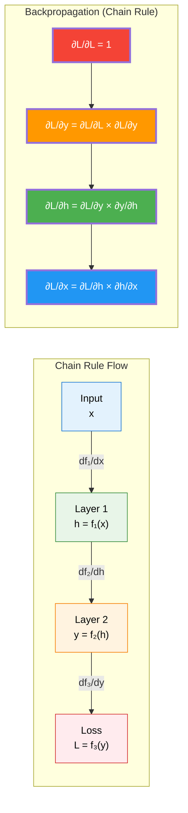

# Understanding the Chain Rule in Calculus

## 🎯 What is the Chain Rule?

The **Chain Rule** is a fundamental calculus concept that tells us how to find the derivative of a **composite function** - a function that's made up of other functions nested inside each other.

### The Mathematical Formula

For composite functions $f(g(x))$, the chain rule states:

$\frac{d}{dx} [f(g(x))] = f'(g(x)) \times g'(x)$

**In words**: _The derivative of the outside function times the derivative of the inside function_

---

## 🌟 Real-Life Analogy: The Temperature Chain

Imagine you're tracking how your mood changes with temperature throughout the day:

### The Chain of Dependencies

1. **Time** affects **Temperature**: `T(t)` - temperature as a function of time
2. **Temperature** affects **Mood**: `M(T)` - mood as a function of temperature
3. **Overall**: How does **time** affect **mood**? `M(T(t))`

### The Question

_"How fast is my mood changing at 3 PM?"_

### The Chain Rule Answer

$\text{Rate of mood change} = \left(\frac{\text{How mood responds to temperature}}{\text{unit temperature}}\right) \times \left(\frac{\text{How temperature changes with time}}{\text{unit time}}\right)$

$\frac{dM}{dt} = \frac{dM}{dT} \times \frac{dT}{dt}$

**Example:**

- At 3 PM, temperature is rising at 2°F per hour: $\frac{dT}{dt} = 2$
- Your mood improves by 0.5 happiness units per degree: $\frac{dM}{dT} = 0.5$
- **Result**: Your mood is improving at $0.5 \times 2 = 1$ happiness unit per hour

---

## 📊 Numerical Examples

### Example 1: Basic Chain Rule

**Function**: $f(x) = (3x + 2)^5$

**Step 1**: Identify the layers

- Outer function: $u^5$ where $u = 3x + 2$
- Inner function: $u = 3x + 2$

**Step 2**: Find derivatives

- $\frac{d}{du} [u^5] = 5u^4$
- $\frac{d}{dx} [3x + 2] = 3$

**Step 3**: Apply chain rule
$f'(x) = 5u^4 \times 3 = 5(3x + 2)^4 \times 3 = 15(3x + 2)^4$

**Numerical check at x = 1:**

- $u = 3(1) + 2 = 5$
- $f'(1) = 15(5)^4 = 15 \times 625 = 9,375$

### Example 2: Triple Chain Rule

**Function**: $f(x) = \sin(\cos(x^2))$

**Layers**:

1. Outermost: $\sin(v)$ where $v = \cos(u)$
2. Middle: $\cos(u)$ where $u = x^2$
3. Innermost: $x^2$

**Derivatives**:

- $\frac{d}{dv} [\sin(v)] = \cos(v) = \cos(\cos(x^2))$
- $\frac{d}{du} [\cos(u)] = -\sin(u) = -\sin(x^2)$
- $\frac{d}{dx} [x^2] = 2x$

**Chain rule**:
$f'(x) = \cos(\cos(x^2)) \times (-\sin(x^2)) \times 2x$
$f'(x) = -2x \cdot \sin(x^2) \cdot \cos(\cos(x^2))$

---

## 🧠 Why Chain Rule Matters in Neural Networks

In backpropagation, we have **layers of functions**:

$\text{Input} \rightarrow \text{Hidden Layer} \rightarrow \text{Output Layer} \rightarrow \text{Loss}$

$x \rightarrow h \rightarrow y \rightarrow L$

Each arrow represents a function, and we need to find $\frac{dL}{dx}$ (how loss changes with input).

**The Neural Network Chain**:
$\frac{dL}{dx} = \frac{dL}{dy} \times \frac{dy}{dh} \times \frac{dh}{dx}$

This is exactly the chain rule applied multiple times!

---

## 📈 Visual Representation

---

## 🔍 Step-by-Step Chain Rule Process

### 1. **Identify the Composition**

Break down `f(g(h(x)))` into layers:

- Layer 1: `u = h(x)`
- Layer 2: `v = g(u)`
- Layer 3: `y = f(v)`

### 2. **Find Individual Derivatives**

- $\frac{du}{dx} = h'(x)$
- $\frac{dv}{du} = g'(u)$
- $\frac{dy}{dv} = f'(v)$

### 3. **Multiply Everything Together**

$\frac{dy}{dx} = \frac{dy}{dv} \times \frac{dv}{du} \times \frac{du}{dx}$

### 4. **Substitute Back**

Replace $u$, $v$ with original expressions in terms of $x$

---

## 💡 Common Patterns in Deep Learning

### Pattern 1: Activation Functions

$z = Wx + b \quad \text{(Linear transformation)}$

$a = \sigma(z) \quad \text{(Activation function)}$

$L = \text{Loss}(a,y) \quad \text{(Loss function)}$

**Chain rule**: $\frac{dL}{dW} = \frac{dL}{da} \times \frac{da}{dz} \times \frac{dz}{dW}$

### Pattern 2: Multiple Layers

$z_1 = W_1x + b_1$

$a_1 = \sigma_1(z_1)$

$z_2 = W_2a_1 + b_2$

$a_2 = \sigma_2(z_2)$

$L = \text{Loss}(a_2,y)$

**Chain rule**: $\frac{dL}{dW_1} = \frac{dL}{da_2} \times \frac{da_2}{dz_2} \times \frac{dz_2}{da_1} \times \frac{da_1}{dz_1} \times \frac{dz_1}{dW_1}$

---

## 🎯 Key Takeaways

1. **Chain Rule = Composition of Derivatives**: When functions are nested, multiply their derivatives
2. **Order Matters**: Work from outside to inside (or in backprop, from loss backward)
3. **Neural Networks are Just Big Chains**: Each layer is a function, backprop applies chain rule
4. **Local Gradients**: Each function only needs to know its own derivative
5. **Automatic Differentiation**: Modern frameworks (PyTorch, TensorFlow) do this automatically

---

## 🧮 Practice Problems

### Easy

Find the derivative of $f(x) = (2x + 1)^3$

**Answer**: $f'(x) = 3(2x + 1)^2 \times 2 = 6(2x + 1)^2$

### Medium

Find the derivative of $f(x) = e^{x^2+1}$

**Answer**: $f'(x) = e^{x^2+1} \times 2x$

### Hard

Find the derivative of $f(x) = \ln(\sin(x^2))$

**Answer**: $f'(x) = \frac{1}{\sin(x^2)} \times \cos(x^2) \times 2x = 2x \cot(x^2)$

---

## 🔗 Connection to Backpropagation

The chain rule is the **mathematical foundation** of how neural networks learn:

1. **Forward Pass**: Compute nested functions layer by layer
2. **Backward Pass**: Apply chain rule to compute gradients layer by layer
3. **Update**: Use gradients to adjust weights and improve the network

Without the chain rule, we couldn't train deep neural networks efficiently!
