# Understanding AI Architecture Diagrams: A Complete Guide

## Table of Contents

1. [Introduction: Why AI Diagrams Are Confusing](#1-introduction-why-ai-diagrams-are-confusing)
2. [Basic Visual Elements and Conventions](#2-basic-visual-elements-and-conventions)
3. [Reading Data Flow: Following the Information Highway](#3-reading-data-flow-following-the-information-highway)
4. [Understanding Common Patterns](#4-understanding-common-patterns)
5. [Decoding Box Types and Shapes](#5-decoding-box-types-and-shapes)
6. [Arrow Meanings and Connection Types](#6-arrow-meanings-and-connection-types)
7. [Layer Stacking and Repetition Patterns](#7-layer-stacking-and-repetition-patterns)
8. [Skip Connections and Parallel Paths](#8-skip-connections-and-parallel-paths)
9. [Reading Complex Multi-Component Systems](#9-reading-complex-multi-component-systems)
10. [Common AI Architecture Patterns](#10-common-ai-architecture-patterns)
11. [Step-by-Step Diagram Analysis Framework](#11-step-by-step-diagram-analysis-framework)
12. [Practice Examples with Different AI Models](#12-practice-examples-with-different-ai-models)

---

## 1. Introduction: Why AI Diagrams Are Confusing

### The Challenge of Visual Complexity

**Why AI architecture diagrams seem overwhelming**:

```bash
Common Diagram Challenges:
┌─────────────────────────────────────────────────────────────┐
│                                                             │
│  Problem 1: Information Density                             │
│  • Too many components in one view                          │
│  • Multiple types of connections                            │
│  • Various shapes and symbols                               │
│                                                             │
│  Problem 2: Abstract Concepts                               │
│  • Boxes represent mathematical operations                  │
│  • Arrows show data transformations                         │
│  • No physical equivalent to relate to                      │
│                                                             │
│  Problem 3: Multiple Abstraction Levels                     │
│  • High-level: "This is an encoder"                         │
│  • Mid-level: "This processes sequences"                    │
│  • Low-level: "This multiplies matrices"                    │
│                                                             │
│  Problem 4: Implicit Knowledge Assumptions                  │
│  • Assumes familiarity with ML concepts                     │
│  • Skips "obvious" intermediate steps                       │
│  • Uses domain-specific terminology                         │
└─────────────────────────────────────────────────────────────┘
```

### Our Systematic Approach

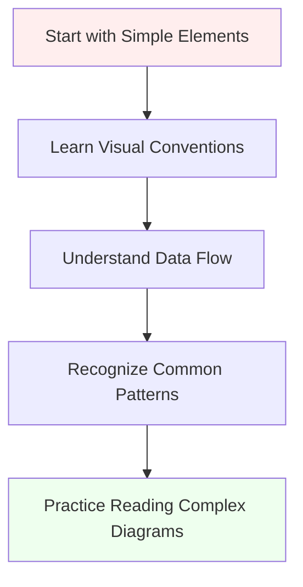

**Learning Philosophy**: Like learning to read maps, we'll start with basic symbols and build up to complex navigation.

---

## 2. Basic Visual Elements and Conventions

### 2.1 Fundamental Building Blocks

**Every AI diagram uses these basic elements**:

```bash
Basic Visual Elements:
┌─────────────────────────────────────────────────────────────┐
│                                                             │
│  BOXES/RECTANGLES:                                          │
│  ┌─────────────┐                                            │
│  │ Component   │  ← Represents a processing unit            │
│  └─────────────┘                                            │
│                                                             │
│  ARROWS:                                                    │
│         ↓         ← Shows direction of data flow            │
│                                                             │
│  CIRCLES:                                                   │
│       ○           ← Usually represents operations           │
│                     (add, multiply, concatenate)            │
│                                                             │
│  LINES:                                                     │
│       ───         ← Connections between components          │
│                                                             │
│  LABELS:                                                    │
│    "Input"        ← Text explaining what something is       │
└─────────────────────────────────────────────────────────────┘
```

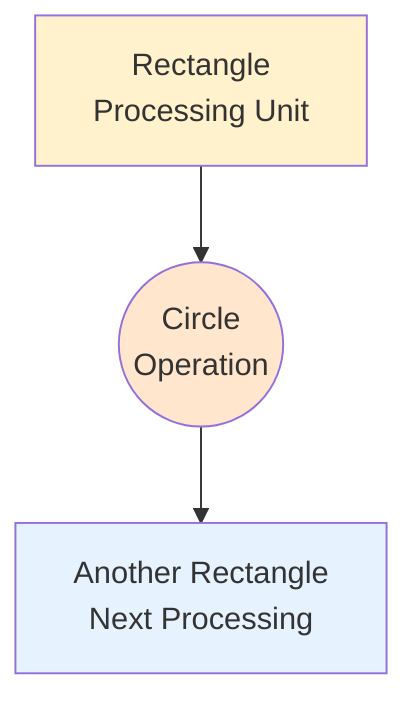

### 2.2 Shape Meanings (General Conventions)

```bash
Shape Conventions in AI Diagrams:
┌─────────────────────────────────────────────────────────────┐
│                                                             │
│  RECTANGLES (most common):                                  │
│  ┌─────────────┐                                            │
│  │ Processing  │  • Neural network layers                   │
│  │   Layer     │  • Mathematical operations                 │
│  └─────────────┘  • Data transformations                    │
│                                                             │
│  ROUNDED RECTANGLES:                                        │
│  ╭─────────────╮                                            │
│  │ Activation  │  • Activation functions                    │
│  │ Function    │  • Non-linear operations                   │
│  ╰─────────────╯                                            │
│                                                             │
│  CIRCLES:                                                   │
│       ⊕           • Addition/summation                      │
│       ⊗           • Multiplication                          │
│       ○           • General operations                      │
│                                                             │
│  DIAMONDS:                                                  │
│      ◇            • Decision points                         │
│                   • Conditional operations                  │
│                                                             │
│  HEXAGONS:                                                  │
│    ⬡              • Input/Output nodes                      │
│                   • Data sources/sinks                      │
└─────────────────────────────────────────────────────────────┘
```

### 2.3 Color Conventions

```bash
Common Color Meanings:
┌─────────────────────────────────────────────────────────────┐
│                                                             │
│  Input/Data:          Blue shades                           │
│  Processing:          Yellow/Orange shades                  │
│  Output/Results:      Green shades                          │
│  Attention/Special:   Purple/Pink shades                    │
│  Operations:          Gray shades                           │
│                                                             │
│  Note: Colors aren't standardized, but these are common     │
└─────────────────────────────────────────────────────────────┘
```

---

## 3. Reading Data Flow: Following the Information Highway

### 3.1 The Data Flow Principle

**Most important rule**: AI diagrams show how data transforms as it flows through the system.

```bash
Data Flow Reading Strategy:
┌─────────────────────────────────────────────────────────────┐
│                                                             │
│  Step 1: Find the Starting Point                            │
│  Look for:                                                  │
│  • "Input" labels                                           │
│  • Arrows pointing INTO the diagram                         │
│  • Data source symbols                                      │
│  • Bottom of vertical diagrams                              │
│  • Left side of horizontal diagrams                         │
│                                                             │
│  Step 2: Find the Ending Point                              │
│  Look for:                                                  │
│  • "Output" labels                                          │
│  • Arrows pointing OUT of the diagram                       │
│  • Final results                                            │
│  • Top of vertical diagrams                                 │
│  • Right side of horizontal diagrams                        │
│                                                             │
│  Step 3: Trace the Main Path                                │
│  Follow the thickest/most prominent arrows                  │
│  This is the "main highway" of information                  │
│                                                             │
│  Step 4: Note Side Paths                                    │
│  Look for branches, merges, and parallel paths              │
│  These often represent special processing                   │
└─────────────────────────────────────────────────────────────┘
```

### 3.2 Simple Data Flow Example

```bash
Basic Data Flow:
┌─────────────────────────────────────────────────────────────┐
│                                                             │
│  Raw Data → Processing → Transformation → Result            │
│                                                             │
│  Example:                                                   │
│  "Hello" → Tokenize → [1, 2, 3] → Embed → [[0.1, 0.5],      │
│                                           [0.3, 0.2],       │
│                                           [0.8, 0.1]]       │
│                                                             │
│  Reading this diagram:                                      │
│  1. Input: Text "Hello"                                     │
│  2. First transform: Convert to numbers                     │
│  3. Second transform: Convert to vectors                    │
│  4. Output: Matrix of embeddings                            │
└─────────────────────────────────────────────────────────────┘
```

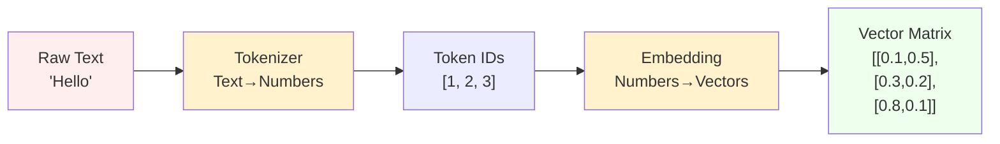

### 3.3 Complex Data Flow Patterns

```bash
Common Flow Patterns:
┌─────────────────────────────────────────────────────────────┐
│                                                             │
│  SEQUENTIAL (Pipeline):                                     │
│  A → B → C → D                                              │
│  Each step processes the output of the previous             │
│                                                             │
│  PARALLEL (Branching):                                      │
│      ┌→ B ┐                                                 │
│  A ──┤    ├→ D                                              │
│      └→ C ┘                                                 │
│  Input splits, processes separately, then combines          │
│                                                             │
│  RECURRENT (Loops):                                         │
│  A → B → C                                                  │
│       ↑    ↓                                                │
│       └────┘                                                │
│  Output feeds back as input                                 │
│                                                             │
│  HIERARCHICAL (Tree):                                       │
│      A                                                      │
│    ┌─┴─┐                                                    │
│    B   C                                                    │
│  ┌─┴┐ ┌┴─┐                                                  │
│  D E F G                                                    │
│  Information flows down levels                              │
└─────────────────────────────────────────────────────────────┘
```

---

## 4. Understanding Common Patterns

### 4.1 The Stack Pattern

**Most common pattern**: Layers stacked vertically or horizontally.

```bash
Stack Pattern Recognition:
┌─────────────────────────────────────────────────────────────┐
│                                                             │
│  Vertical Stack:                                            │
│  ┌─────────────┐                                            │
│  │   Layer N   │  ← Top layer (final processing)            │
│  └─────────────┘                                            │
│         ↓                                                   │
│  ┌─────────────┐                                            │
│  │   Layer 2   │  ← Middle layers                           │
│  └─────────────┘                                            │
│         ↓                                                   │
│  ┌─────────────┐                                            │
│  │   Layer 1   │  ← Bottom layer (first processing)         │
│  └─────────────┘                                            │
│         ↓                                                   │
│      Input                                                  │
│                                                             │
│  Key insight: Each layer builds on the previous one         │
│  Like building floors of a building                         │
└─────────────────────────────────────────────────────────────┘
```

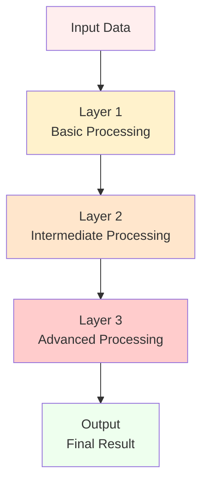

### 4.2 The Encoder-Decoder Pattern

**Two-tower structure**: Common in translation, summarization, etc.

```bash
Encoder-Decoder Pattern:
┌─────────────────────────────────────────────────────────────┐
│                                                             │
│  ┌──────────────┐              ┌──────────────┐             │
│  │   ENCODER    │              │   DECODER    │             │
│  │              │              │              │             │
│  │ Understands  │─────────────→│ Generates    │             │
│  │ the input    │   Context    │ the output   │             │
│  │              │              │              │             │
│  │ ┌──────────┐ │              │ ┌──────────┐ │             │
│  │ │ Layer N  │ │              │ │ Layer N  │ │             │
│  │ └──────────┘ │              │ └──────────┘ │             │
│  │      ⋮       │              │      ⋮        │             │
│  │ ┌──────────┐ │              │ ┌──────────┐ │             │
│  │ │ Layer 1  │ │              │ │ Layer 1  │ │             │
│  │ └──────────┘ │              │ └──────────┘ │             │
│  │      ↑       │              │      ↑       │             │
│  │   Source     │              │   Target     │             │
│  │   Input      │              │   Input      │             │
│  └──────────────┘              └──────────────┘             │
│                                                             │
│  Reading Strategy:                                          │
│  1. Left tower processes input completely                   │
│  2. Creates a rich representation (context)                 │
│  3. Right tower uses this context to generate output        │
│  4. Connection shows information transfer                   │
└─────────────────────────────────────────────────────────────┘
```

### 4.3 The Attention Pattern

**Key relationship indicators**: Shows which parts of input are important.

```bash
Attention Pattern Visualization:
┌─────────────────────────────────────────────────────────────┐
│                                                             │
│  Input Sequence: "The cat sat on the mat"                   │
│                                                             │
│  ┌─────┬─────┬─────┬─────┬─────┬─────┐                      │
│  │ The │ cat │ sat │ on  │ the │ mat │                      │
│  └─────┴─────┴─────┴─────┴─────┴─────┘                      │
│     │     │     │     │     │     │                         │
│     └─────┼─────┼─────┼─────┼─────┘                         │
│           └─────┼─────┼─────┘                               │
│                 │     │                                     │
│        ┌────────▼─────▼────────┐                            │
│        │   Attention Weights   │                            │
│        │   [0.1, 0.3, 0.8,     │                            │
│        │    0.2, 0.1, 0.4]     │                            │
│        └───────────────────────┘                            │
│                 │                                           │
│                 ▼                                           │
│        ┌────────────────────────┐                           │
│        │   Weighted Context     │                           │
│        │   for "sat"            │                           │
│        └────────────────────────┘                           │
│                                                             │
│  Key insight: Lines show which words influence each other   │
│  Thickness of lines = strength of attention                 │
└─────────────────────────────────────────────────────────────┘
```

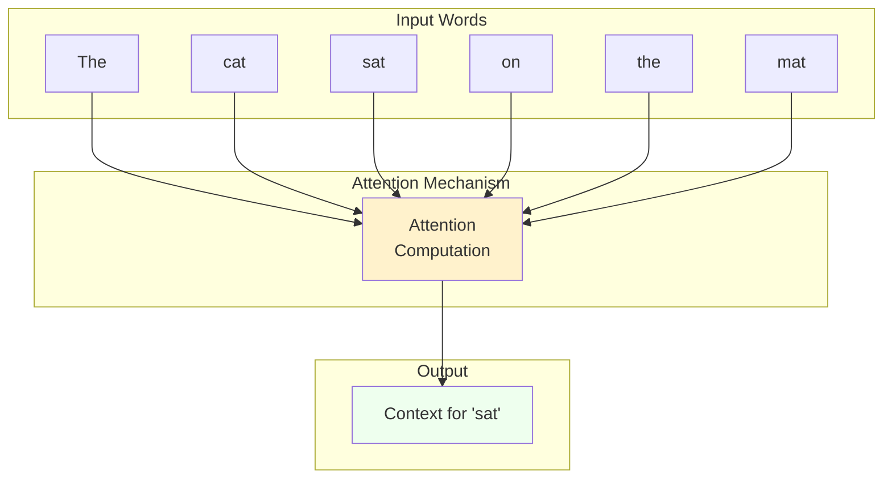

---

## 5. Decoding Box Types and Shapes

### 5.1 Processing Layer Types

```bash
Common Processing Layer Types:
┌─────────────────────────────────────────────────────────────┐
│                                                             │
│  LINEAR/DENSE LAYERS:                                       │
│  ┌─────────────┐                                            │
│  │   Linear    │  • Matrix multiplication                   │
│  │   Dense     │  • Dimension transformation                │
│  │   FC        │  • Fully Connected                         │
│  └─────────────┘                                            │
│                                                             │
│  ACTIVATION FUNCTIONS:                                      │
│  ╭─────────────╮                                            │
│  │    ReLU     │  • Non-linear transformations              │
│  │   Sigmoid   │  • "Activation" of neurons                 │
│  │    Tanh     │  • Usually rounded boxes                   │
│  ╰─────────────╯                                            │
│                                                             │
│  NORMALIZATION:                                             │
│  ┌─────────────┐                                            │
│  │ Layer Norm  │  • Stabilizes training                     │
│  │ Batch Norm  │  • Normalizes distributions                │
│  │ Group Norm  │  • Usually rectangular                     │
│  └─────────────┘                                            │
│                                                             │
│  ATTENTION MECHANISMS:                                      │
│  ┌─────────────┐                                            │
│  │ Self-Attn   │  • Finds relationships                     │
│  │ Cross-Attn  │  • Weighted combinations                   │
│  │ Multi-Head  │  • Often labeled clearly                   │
│  └─────────────┘                                            │
│                                                             │
│  EMBEDDING/LOOKUP:                                          │
│  ┌─────────────┐                                            │
│  │ Embedding   │  • Converts discrete → continuous          │
│  │ Lookup      │  • Token → Vector                          │
│  │ Positional  │  • Usually at input/output                 │
│  └─────────────┘                                            │
└─────────────────────────────────────────────────────────────┘
```

### 5.2 Operation Symbols

```bash
Mathematical Operation Symbols:
┌─────────────────────────────────────────────────────────────┐
│                                                             │
│  ADDITION:                                                  │
│       ⊕                                                     │
│       +          • Combines two inputs                      │
│    ┌─ + ─┐       • Element-wise or matrix addition          │
│                                                             │
│  MULTIPLICATION:                                            │
│       ⊗                                                     │
│       ×          • Matrix multiplication                    │
│    ┌─ × ─┐       • Element-wise multiplication              │
│                                                             │
│  CONCATENATION:                                             │
│      ║║                                                     │
│   ┌─║║─┐        • Joins tensors along dimension             │
│    CONCAT       • Increases dimensionality                  │
│                                                             │
│  SPLITTING:                                                 │
│      ╫                                                      │
│   ┌─╫─┐         • Divides tensor                            │
│    SPLIT        • Decreases dimensionality                  │
│                                                             │
│  RESHAPING:                                                 │
│    ┌───┐                                                    │
│    │ R │        • Changes tensor shape                      │
│    └───┘        • Same data, different organization         │
└─────────────────────────────────────────────────────────────┘
```

---

## 6. Arrow Meanings and Connection Types

### 6.1 Arrow Types and Their Meanings

```bash
Arrow Types in AI Diagrams:
┌─────────────────────────────────────────────────────────────┐
│                                                             │
│  SOLID ARROWS (most common):                                │
│  ────────→      • Main data flow                            │
│              • Forward pass information                     │
│              • Sequential processing                        │
│                                                             │
│  DASHED ARROWS:                                             │
│  ┄┄┄┄┄┄→      • Optional connections                        │
│              • Skip connections                             │
│              • Conditional paths                            │
│                                                             │
│  THICK ARROWS:                                              │
│  ══════⇒      • Primary/important paths                     │
│              • High-volume data flow                        │
│              • Main information highway                     │
│                                                             │
│  CURVED ARROWS:                                             │
│      ╭─→       • Feedback connections                       │
│     ╱          • Recurrent connections                      │
│    ╱           • Loops or cycles                            │
│                                                             │
│  DOUBLE ARROWS:                                             │
│  ⇄            • Bidirectional flow                          │
│              • Information flows both ways                  │
│              • Interactive components                       │
│                                                             │
│  COLORED ARROWS:                                            │
│  ────→ (red)   • Different types of information             │
│  ────→ (blue)  • Parallel processing paths                  │
│  ────→ (green) • Separate data streams                      │
└─────────────────────────────────────────────────────────────┘
```

### 6.2 Connection Patterns

```bash
Common Connection Patterns:
┌─────────────────────────────────────────────────────────────┐
│                                                             │
│  SEQUENTIAL CONNECTIONS:                                    │
│  A ──→ B ──→ C ──→ D                                        │
│  • Information flows step by step                           │
│  • Each component processes and passes on                   │
│                                                             │
│  SKIP CONNECTIONS:                                          │
│  A ──→ B ──→ C                                              │
│  │           ↗                                              │
│  └───────────┘                                              │
│  • Information bypasses intermediate layers                 │
│  • Helps with gradient flow                                 │
│                                                             │
│  FAN-OUT (Branching):                                       │
│      ┌───→ B                                                │
│  A ──┤                                                      │
│      └───→ C                                                │
│  • One input feeds multiple components                      │
│  • Parallel processing                                      │
│                                                             │
│  FAN-IN (Merging):                                          │
│  A ──┐                                                      │
│      ├───→ C                                                │
│  B ──┘                                                      │
│  • Multiple inputs combine into one                         │
│  • Information fusion                                       │
│                                                             │
│  CROSS-CONNECTIONS:                                         │
│  A ──→ B                                                    │
│  │   ╱                                                      │
│  │ ╱                                                        │
│  C ──→ D                                                    │
│  • Complex interaction patterns                             │
│  • Inter-layer communication                                │
└─────────────────────────────────────────────────────────────┘
```

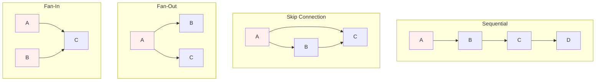

---

## 7. Layer Stacking and Repetition Patterns

### 7.1 Understanding "N×" or Repetition Indicators

```bash
Repetition Notation:
┌─────────────────────────────────────────────────────────────┐
│                                                             │
│  COMMON NOTATIONS:                                          │
│                                                             │
│  N×  ┌─────────────┐                                        │
│      │   Block     │  ← This block repeats N times          │
│      └─────────────┘                                        │
│                                                             │
│  ×6  ┌─────────────┐                                        │
│      │   Layer     │  ← This layer appears 6 times          │
│      └─────────────┘                                        │
│                                                             │
│  ... ┌─────────────┐                                        │
│      │   Block     │  ← Multiple similar blocks             │
│      └─────────────┘                                        │
│      ┌─────────────┐                                        │
│      │   Block     │                                        │
│      └─────────────┘                                        │
│                                                             │
│  WHAT THIS MEANS:                                           │
│  • Same architecture, different learned parameters          │
│  • Each repetition processes the output of the previous     │
│  • Allows building very deep networks                       │
│  • Creates hierarchical feature learning                    │
└─────────────────────────────────────────────────────────────┘
```

### 7.2 Why Repetition Works

```bash
Hierarchical Learning Through Repetition:
┌─────────────────────────────────────────────────────────────┐
│                                                             │
│  Layer 1: Basic Features                                    │
│  ┌─────────────┐                                            │
│  │   Block     │  • Learns simple patterns                  │
│  └─────────────┘  • Edge detection, basic relationships     │
│                                                             │
│  Layer 2: Combinations                                      │
│  ┌─────────────┐                                            │
│  │   Block     │  • Combines basic features                 │
│  └─────────────┘  • Shapes, syntax patterns                 │
│                                                             │
│  Layer 3: Complex Patterns                                  │
│  ┌─────────────┐                                            │
│  │   Block     │  • Higher-level concepts                   │
│  └─────────────┘  • Objects, semantic relationships         │
│                                                             │
│  Layer N: Abstract Understanding                            │
│  ┌─────────────┐                                            │
│  │   Block     │  • Very abstract representations           │
│  └─────────────┘  • Complex reasoning, world knowledge      │
│                                                             │
│  Key Insight: Each layer builds on the previous layer's     │
│  understanding, creating increasingly sophisticated         │
│  representations                                            │
└─────────────────────────────────────────────────────────────┘
```

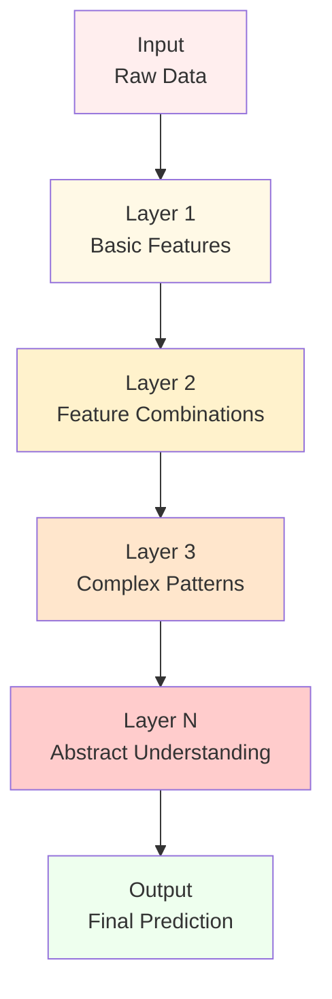

---

## 8. Skip Connections and Parallel Paths

### 8.1 Understanding Skip Connections

**Why skip connections are everywhere in modern AI**:

```bash
Skip Connection Purpose:
┌─────────────────────────────────────────────────────────────┐
│                                                             │
│  WITHOUT Skip Connections:                                  │
│  Input ──→ L1 ──→ L2 ──→ L3 ──→ Output                      │
│                                                             │
│  Problem: Information gets "diluted" through many layers    │
│                                                             │
│  WITH Skip Connections:                                     │
│  Input ──→ L1 ──→ L2 ──→ L3 ──→ Output                      │
│    │                      ↗                                 │
│    └──────────────────────┘                                 │
│                                                             │
│  Benefit: Original information preserved                    │
│                                                             │
│  VISUAL REPRESENTATION:                                     │
│  ┌─────────────┐                                            │
│  │    Input    │                                            │
│  └─────────────┘                                            │
│         │                                                   │
│         ↓                                                   │
│  ┌─────────────┐    ┌─────────────┐                         │
│  │   Layer 1   │    │      +      │ ← Addition operation    │
│  └─────────────┘    └─────────────┘                         │
│         │                  ↑                                │
│         ↓                  │                                │
│  ┌─────────────┐           │                                │
│  │   Layer 2   │───────────┘                                │
│  └─────────────┘                                            │
│                                                             │ │                                                             │
│  Formula: Output = Layer2(Layer1(Input)) + Input            │
│                                                             │
│  WHY THIS WORKS:                                            │
│  • Gradient Flow: Gradients can flow directly to early      │
│    layers during backpropagation                            │
│  • Information Preservation: Original features aren't lost  │
│  • Training Stability: Easier to train very deep networks   │
│  • Identity Mapping: If layers learn nothing, they can      │
│    just pass input through unchanged                        │
└─────────────────────────────────────────────────────────────┘
```

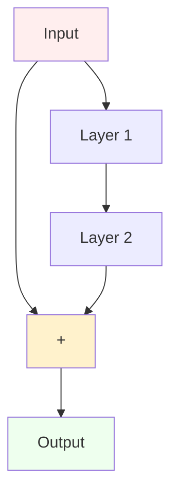

### 8.2 Types of Skip Connections

```bash
Different Skip Connection Patterns:
┌─────────────────────────────────────────────────────────────┐
│                                                             │
│  SHORT SKIP (Most Common):                                  │
│  Input ──→ Layer ──→ Output                                │
│    │                   ↗                                   │
│    └───────────────────┘                                   │
│  • Connects adjacent layers                                │
│  • Used in ResNet, Transformers                            │
│                                                             │
│  LONG SKIP:                                                 │
│  Input ──→ L1 ──→ L2 ──→ L3 ──→ Output                     │
│    │                           ↗                          │
│    └───────────────────────────┘                          │
│  • Connects distant layers                                 │
│  • Used in U-Net, DenseNet                                │
│                                                             │
│  MULTIPLE SKIP:                                             │
│  Input ──→ L1 ──→ L2 ──→ L3 ──→ Output                     │
│    │       │       │       ↗                             │
│    │       │       └───────┘                             │
│    │       └───────────────┘                             │
│    └───────────────────────┘                             │
│  • Many connections to output                              │
│  • Used in DenseNet                                       │
│                                                             │
│  ATTENTION AS SKIP:                                         │
│  ┌─────────────┐                                            │
│  │    Input    │                                            │
│  └─────────────┘                                            │
│         │                                                   │
│         ↓                                                   │
│  ┌─────────────┐    ┌─────────────┐                        │
│  │  Attention  │    │   Add &     │                        │
│  │   Layer     │───→│   Norm      │                        │
│  └─────────────┘    └─────────────┘                        │
│         ↑                  ↓                               │
│         └──────────────────┘                               │
│  • Input added to attention output                         │
│  • Common in Transformers                                  │
└─────────────────────────────────────────────────────────────┘
```

### 8.3 Parallel Processing Paths

```bash
Parallel Path Patterns:
┌─────────────────────────────────────────────────────────────┐
│                                                             │
│  MULTI-BRANCH PROCESSING:                                   │
│                                                             │
│      ┌──→ Branch A ──┐                                      │
│  Input ─┤            ├─→ Combine ──→ Output                │
│      └──→ Branch B ──┘                                      │
│                                                             │
│  Purpose: Process same input in different ways              │
│  Example: Different filter sizes, different attention heads │
│                                                             │
│  MULTI-SCALE PROCESSING:                                    │
│                                                             │
│      ┌──→ Scale 1 ──┐                                       │
│  Input ─┤  (Fine)    ├─→ Merge ──→ Output                  │
│      └──→ Scale 2 ──┘                                       │
│             (Coarse)                                        │
│                                                             │
│  Purpose: Capture features at different resolutions        │
│  Example: Vision models, hierarchical processing           │
│                                                             │
│  ENSEMBLE PATHS:                                            │
│                                                             │
│      ┌──→ Model A ──┐                                       │
│  Input ─┤           ├─→ Vote/Average ──→ Output            │
│      └──→ Model B ──┘                                       │
│                                                             │
│  Purpose: Combine predictions from multiple models         │
│  Example: Mixture of Experts, ensemble methods             │
└─────────────────────────────────────────────────────────────┘
```

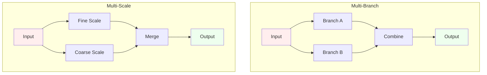

---

## 9. Reading Complex Multi-Component Systems

### 9.1 Systematic Approach to Complex Diagrams

```bash
Complex Diagram Reading Strategy:
┌─────────────────────────────────────────────────────────────┐
│                                                             │
│  STEP 1: OVERVIEW SCAN (30 seconds)                        │
│  • Don't try to understand everything                      │
│  • Look for overall structure                              │
│  • Identify major sections/modules                         │
│  • Note the general flow direction                         │
│                                                             │
│  STEP 2: IDENTIFY MAIN COMPONENTS (2 minutes)              │
│  • Find input and output clearly                           │
│  • Identify major processing blocks                        │
│  • Look for repeated patterns                              │
│  • Note any special symbols or colors                      │
│                                                             │
│  STEP 3: TRACE MAIN DATA PATH (3 minutes)                  │
│  • Follow the thickest/most prominent arrows              │
│  • Ignore side branches initially                          │
│  • Track how data transforms step by step                  │
│  • Understand the primary information flow                 │
│                                                             │
│  STEP 4: UNDERSTAND SIDE PATHS (5 minutes)                 │
│  • Examine skip connections                                │
│  • Look at parallel processing branches                    │
│  • Understand feedback loops                               │
│  • Note conditional or optional paths                      │
│                                                             │
│  STEP 5: CONNECT TO PURPOSE (2 minutes)                    │
│  • Relate structure to the task being solved               │
│  • Understand why each component is needed                 │
│  • See how components work together                        │
│  • Identify the key innovations or features                │
└─────────────────────────────────────────────────────────────┘
```

### 9.2 Breaking Down Complex Systems

```bash
Decomposition Strategy:
┌─────────────────────────────────────────────────────────────┐
│                                                             │
│  MODULAR THINKING:                                          │
│  Complex System = Input + Processing Modules + Output      │
│                                                             │
│  Example: Image Classification Model                       │
│  ┌─────────────────────────────────────────────────────┐    │
│  │ Input Module:                                       │    │
│  │ • Image preprocessing                               │    │
│  │ • Normalization                                     │    │
│  │ • Data augmentation                                 │    │
│  └─────────────────────────────────────────────────────┘    │
│                          ↓                                  │
│  ┌─────────────────────────────────────────────────────┐    │
│  │ Feature Extraction Module:                          │    │
│  │ • Convolutional layers                              │    │
│  │ • Pooling operations                                │    │
│  │ • Skip connections                                  │    │
│  └─────────────────────────────────────────────────────┘    │
│                          ↓                                  │
│  ┌─────────────────────────────────────────────────────┐    │
│  │ Classification Module:                              │    │
│  │ • Global pooling                                    │    │
│  │ • Dense layers                                      │    │
│  │ • Softmax output                                    │    │
│  └─────────────────────────────────────────────────────┘    │
│                                                             │
│  FOCUS ON ONE MODULE AT A TIME:                             │
│  • Understand each module's purpose                        │
│  • See how modules connect                                 │
│  • Build up complete understanding gradually               │
└─────────────────────────────────────────────────────────────┘
```

### 9.3 Common Multi-Component Patterns

```bash
Frequently Seen Complex Patterns:
┌─────────────────────────────────────────────────────────────┐
│                                                             │
│  ENCODER-PROCESSOR-DECODER:                                 │
│  Input → Encode → Process → Decode → Output                │
│  • Common in translation, summarization                    │
│  • Each stage has multiple layers                          │
│                                                             │
│  HIERARCHICAL PROCESSING:                                   │
│                    High Level                               │
│                  ┌─────────────┐                            │
│              ┌──→│   Layer N   │                            │
│         ┌───→│   └─────────────┘                            │
│    ┌───→│    │   ┌─────────────┐                            │
│  Input ─┘    └──→│   Layer 2   │                            │
│                  └─────────────┘                            │
│                  ┌─────────────┐                            │
│                  │   Layer 1   │                            │
│                  └─────────────┘                            │
│                    Low Level                                │
│  • Multi-resolution processing                             │
│  • Coarse to fine analysis                                 │
│                                                             │
│  ATTENTION + FEEDFORWARD STACK:                             │
│  ┌─────────────┐                                            │
│  │   Input     │                                            │
│  └─────────────┘                                            │
│         │                                                   │
│    ┌────▼────┐                                              │
│    │ ┌─────┐ │ ← Block 1                                    │
│    │ │Attn │ │                                              │
│    │ │ +FF │ │                                              │
│    │ └─────┘ │                                              │
│    └────┬────┘                                              │
│    ┌────▼────┐                                              │
│    │ ┌─────┐ │ ← Block N                                    │
│    │ │Attn │ │                                              │
│    │ │ +FF │ │                                              │
│    │ └─────┘ │                                              │
│    └────┬────┘                                              │
│  ┌─────────────┐                                            │
│  │   Output    │                                            │
│  └─────────────┘                                            │
│  • Common in Transformers                                  │
│  • Repeated attention + processing                         │
└─────────────────────────────────────────────────────────────┘
```

---

## 10. Common AI Architecture Patterns

### 10.1 The Big Picture: Major Architecture Families

```bash
Major AI Architecture Families:
┌─────────────────────────────────────────────────────────────┐
│                                                             │
│  FEEDFORWARD NETWORKS:                                      │
│  Input → Layer1 → Layer2 → ... → Output                   │
│  • Simplest pattern                                        │
│  • Information flows in one direction                      │
│  • Used in: MLPs, basic classifiers                       │
│                                                             │
│  CONVOLUTIONAL NETWORKS:                                    │
│  Input → Conv → Pool → Conv → Pool → Dense → Output       │
│  • Designed for grid-like data (images)                   │
│  • Local connectivity patterns                             │
│  • Used in: Computer vision, image processing             │
│                                                             │
│  RECURRENT NETWORKS:                                        │
│  Input → RNN → RNN → RNN → Output                         │
│     ↑      ↓     ↓     ↓                                   │
│     └──────┴─────┴─────┘                                   │
│  • Designed for sequential data                            │
│  • Memory through hidden states                            │
│  • Used in: Time series, early NLP                        │
│                                                             │
│  ATTENTION NETWORKS:                                        │
│  Input → Attention → FeedForward → Attention → Output     │
│  • Focus on relevant parts dynamically                     │
│  • Parallel processing capability                          │
│  • Used in: Modern NLP, Transformers                      │
│                                                             │
│  GENERATIVE NETWORKS:                                       │
│  Noise → Generator → Fake Data                            │
│  Real Data → Discriminator → Real/Fake                    │
│  • Two competing networks                                  │
│  • Used in: GANs, image generation                        │
└─────────────────────────────────────────────────────────────┘
```

### 10.2 Pattern Recognition in Diagrams

```bash
How to Quickly Identify Architecture Types:
┌─────────────────────────────────────────────────────────────┐
│                                                             │
│  LOOK FOR THESE VISUAL CLUES:                              │
│                                                             │
│  Convolutional Networks:                                    │
│  • Rectangular blocks getting smaller                      │
│  • "Conv", "Pool" labels                                   │
│  • Decreasing spatial dimensions                           │
│                                                             │
│  Recurrent Networks:                                        │
│  • Loops or curved arrows                                  │
│  • "RNN", "LSTM", "GRU" labels                            │
│  • Time step indicators                                    │
│                                                             │
│  Attention Networks:                                        │
│  • "Attention", "Multi-Head" labels                       │
│  • Cross-connections between layers                        │
│  • Q, K, V notations                                      │
│                                                             │
│  Transformer Networks:                                      │
│  • Encoder-Decoder structure                               │
│  • Multiple attention + feedforward blocks                 │
│  • "Add & Norm" connections                                │
│                                                             │
│  Generative Networks:                                       │
│  • Two separate network paths                              │
│  • "Generator" and "Discriminator" labels                  │
│  • Adversarial training indicators                         │
└─────────────────────────────────────────────────────────────┘
```

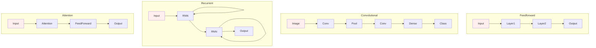

### 10.3 Modern Hybrid Architectures

```bash
Modern AI Often Combines Multiple Patterns:
┌─────────────────────────────────────────────────────────────┐
│                                                             │
│  VISION TRANSFORMER:                                        │
│  Image → Patches → Embedding → Transformer → Classification │
│  • Combines: Convolution + Attention                       │
│                                                             │
│  CONVOLUTIONAL ATTENTION:                                   │
│  Input → Conv Layers → Attention Layers → Output          │
│  • Combines: Convolution + Attention                       │
│                                                             │
│  MULTIMODAL NETWORKS:                                       │
│  Text Input → Text Encoder ┐                              │
│                            ├→ Fusion → Output             │
│  Image Input → Vision Encoder ┘                           │
│  • Combines: Multiple input types                          │
│                                                             │
│  REINFORCEMENT LEARNING + TRANSFORMERS:                    │
│  State → Transformer → Action Values → Policy             │
│  • Combines: RL + Attention                                │
│                                                             │
│  KEY INSIGHT: Modern AI mixes and matches proven patterns  │
│  Look for familiar components in new arrangements          │
└─────────────────────────────────────────────────────────────┘
```

---

## 11. Step-by-Step Diagram Analysis Framework

### 11.1 The 5-Step Analysis Method

```bash
Complete Diagram Analysis Framework:
┌─────────────────────────────────────────────────────────────┐
│                                                             │
│  STEP 1: FIRST IMPRESSION (30 seconds)                     │
│  Questions to ask:                                          │
│  • How complex does this look?                             │
│  • Are there obvious patterns I recognize?                 │
│  • What's the overall shape (linear, branched, circular)?  │
│  • How many major components are there?                    │
│                                                             │
│  STEP 2: INPUT/OUTPUT IDENTIFICATION (1 minute)            │
│  Find and understand:                                       │
│  • Where does data enter the system?                       │
│  • What type of data is it?                                │
│  • Where does data exit the system?                        │
│  • What type of output is produced?                        │
│  • What's the overall transformation goal?                 │
│                                                             │
│  STEP 3: MAIN PATH TRACING (2 minutes)                     │
│  Follow the primary data flow:                             │
│  • Start from input                                        │
│  • Follow the thickest/most obvious arrows                 │
│  • Note each major processing step                         │
│  • End at the output                                       │
│  • Ignore side branches for now                            │
│                                                             │
│  STEP 4: COMPONENT ANALYSIS (3 minutes)                    │
│  For each major component:                                  │
│  • What type of operation is this?                         │
│  • Why might this be needed?                               │
│  • How does it transform the data?                         │
│  • What are its inputs and outputs?                        │
│                                                             │
│  STEP 5: INTEGRATION UNDERSTANDING (2 minutes)             │
│  Put it all together:                                       │
│  • How do components work together?                         │
│  • What's the overall strategy?                            │
│  • Why is this architecture suited for the task?           │
│  • What are the key innovations or features?               │
└─────────────────────────────────────────────────────────────┘
```

### 11.2 Questions to Ask for Each Component

```bash
Component Analysis Questions:
┌─────────────────────────────────────────────────────────────┐
│                                                             │
│  FOR EACH BOX/COMPONENT, ASK:                               │
│                                                             │
│  FUNCTION QUESTIONS:                                        │
│  • What does this component do?                             │
│  • What type of transformation is this?                    │
│  • Is this linear or non-linear?                           │
│  • Does this change data dimensions?                       │
│                                                             │
│  INPUT/OUTPUT QUESTIONS:                                    │
│  • What comes into this component?                         │
│  • What comes out of this component?                       │
│  • How is the data different after processing?             │
│  • Are there multiple inputs or outputs?                   │
│                                                             │
│  PURPOSE QUESTIONS:                                         │
│  • Why is this component needed?                           │
│  • What problem does it solve?                             │
│  • What would happen without it?                           │
│  • How does it help the overall goal?                      │
│                                                             │
│  TECHNICAL QUESTIONS:                                       │
│  • What are the learnable parameters?                      │
│  • How computationally expensive is this?                  │
│  • Are there any constraints or limitations?               │
│  • How does this scale with input size?                    │
└─────────────────────────────────────────────────────────────┘
```

### 11.3 Common Misunderstanding Traps

```bash
Avoid These Common Mistakes:
┌─────────────────────────────────────────────────────────────┐
│                                                             │
│  TRAP 1: Assuming Sequential Processing                     │
│  ✗ Wrong: "This box runs after that box"                   │
│  ✓ Right: "This box processes the output of that box"      │
│  • Many operations can run in parallel                     │
│  • Order in diagram ≠ order in time                        │
│                                                             │
│  TRAP 2: Ignoring Skip Connections                          │
│  ✗ Wrong: Focusing only on the main path                   │
│  ✓ Right: Understanding all connections                    │
│  • Skip connections are often crucial                      │
│  • They affect training and information flow               │
│                                                             │
│  TRAP 3: Confusing Representation with Implementation       │
│  ✗ Wrong: "This is exactly how the code works"             │
│  ✓ Right: "This shows the conceptual data flow"           │
│  • Diagrams simplify complex implementations               │
│  • Many details are hidden for clarity                     │
│                                                             │
│  TRAP 4: Not Considering Scale                              │
│  ✗ Wrong: Assuming all components are equal size           │
│  ✓ Right: Some components are much larger/complex          │
│  • Box size in diagram ≠ computational cost                │
│  • Simple-looking operations might be expensive            │
│                                                             │
│  TRAP 5: Missing the Forest for the Trees                   │
│  ✗ Wrong: Getting lost in every detail                     │
│  ✓ Right: Understanding overall purpose first              │
│  • Start with big picture, then zoom in                    │
│  • Every component serves the overall goal                 │
└─────────────────────────────────────────────────────────────┘
```

---

## 12. Practice Examples with Different AI Models

### 12.1 Example 1: Simple Feedforward Network

```bash
Practice: Basic Neural Network Diagram
┌─────────────────────────────────────────────────────────────┐
│                                                             │
│  ┌─────────────┐                                            │
│  │    Input    │  ← Raw features (e.g., image pixels)      │
│  │   Layer     │                                            │
│  └─────────────┘                                            │
│         │                                                   │
│         ↓                                                   │
│  ┌─────────────┐                                            │
│  │   Hidden    │  ← Non-linear transformation               │
│  │   Layer 1   │                                            │
│  └─────────────┘                                            │
│         │                                                   │
│         ↓                                                   │
│  ┌─────────────┐                                            │
│  │   Hidden    │  ← Another non-linear transformation      │
│  │   Layer 2   │                                            │
│  └─────────────┘                                            │
│         │                                                   │
│         ↓                                                   │
│  ┌─────────────┐                                            │
│  │   Output    │  ← Final predictions (e.g., class scores) │
│  │   Layer     │                                            │
│  └─────────────┘                                            │
│                                                             │
│  ANALYSIS:                                                  │
│  • Type: Feedforward network                               │
│  • Flow: Sequential, bottom to top                         │
│  • Purpose: Classification or regression                   │
│  • Key insight: Each layer transforms data non-linearly   │
└─────────────────────────────────────────────────────────────┘
```

### 12.2 Example 2: Residual Network (ResNet)

```bash
Practice: ResNet Block Diagram
┌─────────────────────────────────────────────────────────────┐
│                                                             │
│  ┌─────────────┐                                            │
│  │    Input    │                                            │
│  └─────────────┘                                            │
│         │                                                   │
│         ├─────────────────────┐ ← Skip connection           │
│         ↓                     │                             │
│  ┌─────────────┐              │                             │
│  │ Convolution │              │                             │
│  │   Layer 1   │              │                             │
│  └─────────────┘              │                             │
│         │                     │                             │
│         ↓                     │                             │
│  ┌─────────────┐              │                             │
│  │    ReLU     │              │                             │
│  │ Activation  │              │                             │
│  └─────────────┘              │                             │
│         │                     │                             │
│         ↓                     │                             │
│  ┌─────────────┐              │                             │
│  │ Convolution │              │                             │
│  │   Layer 2   │              │                             │
│  └─────────────┘              │                             │
│         │                     │                             │
│         ↓                     │                             │
│  ┌─────────────┐              │                             │
│  │     ADD     │ ←────────────┘                             │
│  └─────────────┘                                            │
│         │                                                   │
│         ↓                                                   │
│  ┌─────────────┐                                            │
│  │    ReLU     │                                            │
│  │ Activation  │                                            │
│  └─────────────┘                                            │
│         │                                                   │
│         ↓                                                   │
│  ┌─────────────┐                                            │
│  │   Output    │                                            │
│  └─────────────┘                                            │
│                                                             │
│  ANALYSIS:                                                  │
│  • Type: Convolutional network with skip connections       │
│  • Key feature: Input is added to processed output         │
│  • Purpose: Deep image processing without vanishing gradients│
│  • Innovation: Skip connection enables very deep networks  │
└─────────────────────────────────────────────────────────────┘
```

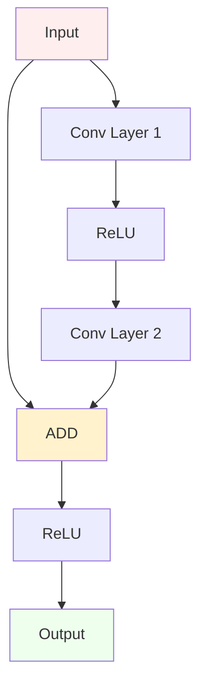

### 12.3 Example 3: Attention Mechanism

```bash
Practice: Self-Attention Diagram
┌─────────────────────────────────────────────────────────────┐
│                                                             │
│  ┌─────────────┐                                            │
│  │Input Sequence│  ← "The cat sat on mat"                  │
│  └─────────────┘                                            │
│         │                                                   │
│         ├──────────────┬──────────────┐                     │
│         ↓              ↓              ↓                     │
│  ┌─────────────┐┌─────────────┐┌─────────────┐              │
│  │ Linear(Q)   ││ Linear(K)   ││ Linear(V)   │              │
│  │   Query     ││    Key      ││   Value     │              │
│  └─────────────┘└─────────────┘└─────────────┘              │
│         │              │              │                     │
│         └──────┬───────┘              │                     │
│                ↓                      │                     │
│         ┌─────────────┐               │                     │
│         │ Attention   │               │                     │
│         │  Weights    │               │                     │
│         └─────────────┘               │                     │
│                │                      │                     │
│                └──────┬───────────────┘                     │
│                       ↓                                     │
│                ┌─────────────┐                              │
│                │  Weighted   │                              │
│                │    Sum      │                              │
│                └─────────────┘                              │
│                       │                                     │
│                       ↓                                     │
│                ┌─────────────┐                              │
│                │   Output    │  ← Context-aware representations│
│                │  Sequence   │                              │
│                └─────────────┘                              │
│                                                             │
│  ANALYSIS:                                                  │
│  • Type: Attention mechanism                               │
│  • Key insight: Input splits into Q, K, V                 │
│  • Purpose: Find relationships between sequence elements   │
│  • Innovation: Parallel processing of all relationships    │
│                                                             │
│  STEP-BY-STEP READING:                                     │
│  1. Input sequence enters at top                           │
│  2. Three parallel linear transformations create Q, K, V   │
│  3. Q and K interact to compute attention weights          │
│  4. Weights applied to V to get weighted combination       │
│  5. Output: Each element has context from all others       │
└─────────────────────────────────────────────────────────────┘
```

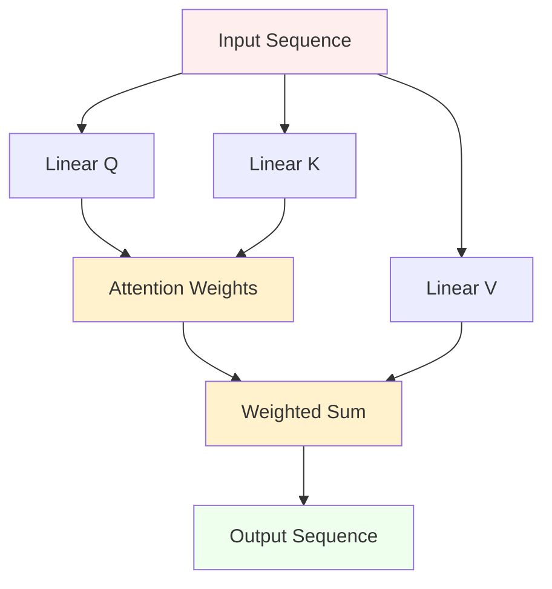

### 12.4 Example 4: Encoder-Decoder Architecture

```bash
Practice: Translation Model Diagram
┌─────────────────────────────────────────────────────────────┐
│                                                             │
│  ┌──────────────────┐              ┌──────────────────┐     │
│  │     ENCODER      │              │     DECODER      │     │
│  │                  │              │                  │     │
│  │ "Hello world"    │              │ "Bonjour monde"  │     │
│  │                  │              │                  │     │
│  │ ┌──────────────┐ │              │ ┌──────────────┐ │     │
│  │ │  Attention   │ │              │ │  Attention   │ │     │
│  │ │  Layer N     │ │              │ │  Layer N     │ │     │
│  │ └──────────────┘ │     Context  │ └──────────────┘ │     │
│  │        ...       │ ─────────────→                 │     │
│  │ ┌──────────────┐ │              │ ┌──────────────┐ │     │
│  │ │  Attention   │ │              │ │  Attention   │ │     │
│  │ │  Layer 1     │ │              │ │  Layer 1     │ │     │
│  │ └──────────────┘ │              │ └──────────────┘ │     │
│  │        ↑         │              │        ↑         │     │
│  │ ┌──────────────┐ │              │ ┌──────────────┐ │     │
│  │ │  Embedding   │ │              │ │  Embedding   │ │     │
│  │ └──────────────┘ │              │ └──────────────┘ │     │
│  │        ↑         │              │        ↑         │     │
│  │   Source Text    │              │   Target Text    │     │
│  └──────────────────┘              └──────────────────┘     │
│                                                             │
│  ANALYSIS:                                                  │
│  • Type: Encoder-Decoder architecture                      │
│  • Left tower: Processes input completely                  │
│  • Right tower: Generates output step by step              │
│  • Context: Rich representation passed between towers      │
│  • Applications: Translation, summarization, generation    │
│                                                             │
│  READING STRATEGY:                                          │
│  1. Identify the two towers (encoder/decoder)              │
│  2. Follow data flow in each tower separately              │
│  3. Understand the context transfer between towers         │
│  4. See how decoder uses encoder's understanding           │
└─────────────────────────────────────────────────────────────┘
```

### 12.5 Example 5: Complex Multi-Path Architecture

```bash
Practice: Vision Transformer (ViT) Diagram
┌─────────────────────────────────────────────────────────────┐
│                                                             │
│  ┌─────────────┐                                            │
│  │Input Image  │  ← 224×224×3 RGB image                    │
│  └─────────────┘                                            │
│         │                                                   │
│         ↓                                                   │
│  ┌─────────────┐                                            │
│  │ Patch Split │  ← Divide into 16×16 patches              │
│  └─────────────┘                                            │
│         │                                                   │
│         ↓                                                   │
│  ┌─────────────┐                                            │
│  │ Linear      │  ← Flatten patches to vectors             │
│  │ Projection  │                                            │
│  └─────────────┘                                            │
│         │                                                   │
│         ├─────────────────────┐                             │
│         ↓                     ↓                             │
│  ┌─────────────┐       ┌─────────────┐                      │
│  │ Positional  │       │   [CLS]     │  ← Classification token│
│  │ Embedding   │       │   Token     │                      │
│  └─────────────┘       └─────────────┘                      │
│         │                     │                             │
│         └─────────┬───────────┘                             │
│                   ↓                                         │
│                ┌──────┐                                     │
│                │  +   │  ← Combine patches + position + CLS │
│                └──────┘                                     │
│                   │                                         │
│                   ↓                                         │
│            ┌─────────────┐                                  │
│        N×  │ Transformer │  ← Standard transformer blocks  │
│            │   Block     │                                  │
│            └─────────────┘                                  │
│                   │                                         │
│                   ↓                                         │
│            ┌─────────────┐                                  │
│            │   [CLS]     │  ← Extract classification token  │
│            │ Extraction  │                                  │
│            └─────────────┘                                  │
│                   │                                         │
│                   ↓                                         │
│            ┌─────────────┐                                  │
│            │ MLP Head    │  ← Final classification          │
│            └─────────────┘                                  │
│                   │                                         │
│                   ↓                                         │
│            ┌─────────────┐                                  │
│            │Class Probs  │  ← Output predictions            │
│            └─────────────┘                                  │
│                                                             │
│  COMPLEX DIAGRAM ANALYSIS:                                  │
│  • Multiple input processing paths                         │
│  • Patch extraction + positional encoding + special token  │
│  • Standard transformer applied to visual data             │
│  • Special token extraction for final prediction           │
│                                                             │
│  KEY INSIGHT: Familiar pattern (Transformer) applied       │
│  to new domain (vision) with domain-specific preprocessing │
└─────────────────────────────────────────────────────────────┘
```

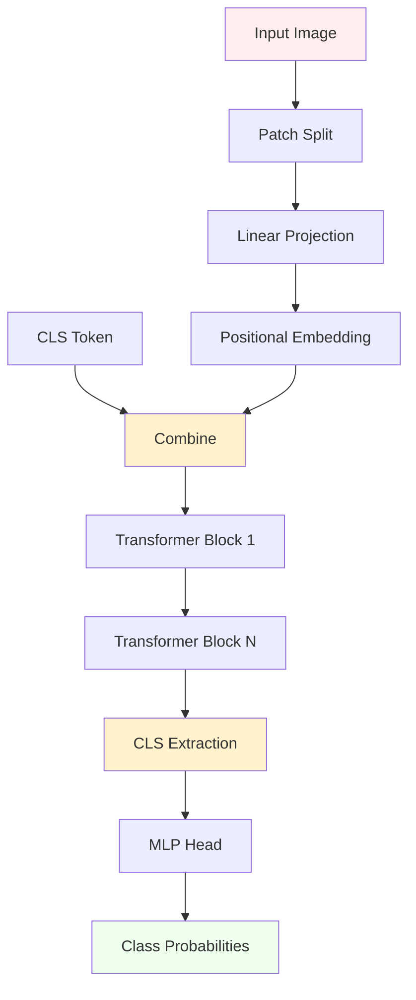

### 12.6 Example 6: Generative Adversarial Network (GAN)

```bash
Practice: GAN Architecture Diagram
┌─────────────────────────────────────────────────────────────┐
│                                                             │
│  ┌─────────────┐                                            │
│  │Random Noise │  ← Input: Random vector (e.g., 100D)      │
│  └─────────────┘                                            │
│         │                                                   │
│         ↓                                                   │
│  ┌─────────────┐                                            │
│  │ GENERATOR   │  ← Network that creates fake data         │
│  │             │                                            │
│  │ ┌─────────┐ │                                            │
│  │ │Linear 1 │ │                                            │
│  │ └─────────┘ │                                            │
│  │ ┌─────────┐ │                                            │
│  │ │Linear 2 │ │                                            │
│  │ └─────────┘ │                                            │
│  │ ┌─────────┐ │                                            │
│  │ │Linear N │ │                                            │
│  │ └─────────┘ │                                            │
│  └─────────────┘                                            │
│         │                                                   │
│         ↓                                                   │
│  ┌─────────────┐                                            │
│  │ Fake Data   │  ← Generated samples (e.g., fake images)  │
│  └─────────────┘                                            │
│         │                                                   │
│         ├─────────────────────┐                             │
│         ↓                     ↓                             │
│  ┌─────────────┐       ┌─────────────┐                      │
│  │DISCRIMINATOR│       │DISCRIMINATOR│                      │
│  │             │       │             │                      │
│  │ ┌─────────┐ │       │ ┌─────────┐ │                      │
│  │ │Conv 1   │ │       │ │Conv 1   │ │                      │
│  │ └─────────┘ │       │ └─────────┘ │                      │
│  │ ┌─────────┐ │       │ ┌─────────┐ │                      │
│  │ │Conv 2   │ │       │ │Conv 2   │ │                      │
│  │ └─────────┘ │       │ └─────────┘ │                      │
│  │ ┌─────────┐ │       │ ┌─────────┐ │                      │
│  │ │Dense    │ │       │ │Dense    │ │                      │
│  │ └─────────┘ │       │ └─────────┘ │                      │
│  └─────────────┘       └─────────────┘                      │
│         │                     ↑                             │
│         ↓                     │                             │
│  ┌─────────────┐       ┌─────────────┐                      │
│  │"Fake" Score │       │"Real" Score │                      │
│  └─────────────┘       └─────────────┘                      │
│                               ↑                             │
│                        ┌─────────────┐                      │
│                        │ Real Data   │  ← Training samples  │
│                        └─────────────┘                      │
│                                                             │
│  ADVERSARIAL ANALYSIS:                                      │
│  • Two competing networks                                   │
│  • Generator: Tries to fool discriminator                  │
│  • Discriminator: Tries to detect fake vs real            │
│  • Training: Both networks improve through competition     │
│                                                             │
│  READING STRATEGY:                                          │
│  1. Identify the two separate network paths                │
│  2. Understand the adversarial relationship                │
│  3. Follow data flow for both real and fake samples       │
│  4. See how networks compete during training               │
└─────────────────────────────────────────────────────────────┘
```

---

## 13. Advanced Diagram Reading Techniques

### 13.1 Reading Temporal/Sequential Diagrams

```bash
Understanding Time-Based Diagrams:
┌─────────────────────────────────────────────────────────────┐
│                                                             │
│  RECURRENT NETWORK UNROLLING:                               │
│                                                             │
│  Time:    t=1      t=2      t=3                           │
│           │        │        │                             │
│  Input:   x₁   →   x₂   →   x₃                            │
│           │        │        │                             │
│           ↓        ↓        ↓                             │
│  ┌─────────────┐ ┌─────────────┐ ┌─────────────┐           │
│  │    RNN      │ │    RNN      │ │    RNN      │           │
│  │   Cell      │ │   Cell      │ │   Cell      │           │
│  └─────────────┘ └─────────────┘ └─────────────┘           │
│         │        ↗       │        ↗       │               │
│  Hidden: h₁ ──────       h₂ ──────       h₃               │
│         │                │                │               │
│         ↓                ↓                ↓               │
│  Output: y₁              y₂              y₃               │
│                                                             │
│  KEY INSIGHTS:                                              │
│  • Same cell, different time steps                         │
│  • Hidden state carries information across time            │
│  • Each step processes one element of sequence             │
│                                                             │
│  TEMPORAL INDICATORS TO LOOK FOR:                          │
│  • t₁, t₂, t₃ labels                                      │
│  • Horizontal arrows between time steps                   │
│  • "Unrolled" or "Unfolded" in diagram title             │
│  • Repeated identical components                           │
└─────────────────────────────────────────────────────────────┘
```

### 13.2 Reading Multi-Modal Diagrams

```bash
Understanding Multi-Input Systems:
┌─────────────────────────────────────────────────────────────┐
│                                                             │
│  MULTIMODAL FUSION EXAMPLE:                                 │
│                                                             │
│  ┌─────────────┐                 ┌─────────────┐            │
│  │    Text     │                 │   Image     │            │
│  │   Input     │                 │   Input     │            │
│  └─────────────┘                 └─────────────┘            │
│         │                               │                   │
│         ↓                               ↓                   │
│  ┌─────────────┐                 ┌─────────────┐            │
│  │    Text     │                 │   Vision    │            │
│  │  Encoder    │                 │  Encoder    │            │
│  │(Transformer)│                 │   (CNN)     │            │
│  └─────────────┘                 └─────────────┘            │
│         │                               │                   │
│         ↓                               ↓                   │
│  ┌─────────────┐                 ┌─────────────┐            │
│  │    Text     │                 │   Image     │            │
│  │ Features    │                 │ Features    │            │
│  └─────────────┘                 └─────────────┘            │
│         │                               │                   │
│         └─────────────┬─────────────────┘                   │
│                       ↓                                     │
│                ┌─────────────┐                              │
│                │  Fusion     │                              │
│                │  Module     │                              │
│                └─────────────┘                              │
│                       │                                     │
│                       ↓                                     │
│                ┌─────────────┐                              │
│                │ Combined    │                              │
│                │ Features    │                              │
│                └─────────────┘                              │
│                       │                                     │
│                       ↓                                     │
│                ┌─────────────┐                              │
│                │  Output     │                              │
│                │ Prediction  │                              │
│                └─────────────┘                              │
│                                                             │
│  MULTIMODAL READING STRATEGY:                               │
│  1. Identify different input types/modalities              │
│  2. Follow each modality's processing path separately      │
│  3. Find where modalities are combined (fusion point)      │
│  4. Understand how combined information is used            │
│                                                             │
│  FUSION TYPES TO RECOGNIZE:                                 │
│  • Early Fusion: Combine raw inputs                        │
│  • Late Fusion: Combine processed features                 │
│  • Attention Fusion: Weighted combination                  │
│  • Cross-Modal Attention: Modalities attend to each other  │
└─────────────────────────────────────────────────────────────┘
```

### 13.3 Reading Hierarchical/Nested Diagrams

```bash
Understanding Nested Architecture Diagrams:
┌─────────────────────────────────────────────────────────────┐
│                                                             │
│  HIERARCHICAL READING APPROACH:                             │
│                                                             │
│  LEVEL 1: System Overview                                   │
│  ┌─────────────────────────────────────────────────────┐    │
│  │ ┌─────────┐   ┌─────────┐   ┌─────────┐           │    │
│  │ │Module A │──→│Module B │──→│Module C │           │    │
│  │ └─────────┘   └─────────┘   └─────────┘           │    │
│  └─────────────────────────────────────────────────────┘    │
│                                                             │
│  LEVEL 2: Module Details                                    │
│  ┌─────────────────────────────────────────────────────┐    │
│  │ Module B (expanded):                                │    │
│  │ ┌─────────┐   ┌─────────┐   ┌─────────┐           │    │
│  │ │Layer 1  │──→│Layer 2  │──→│Layer 3  │           │    │
│  │ └─────────┘   └─────────┘   └─────────┘           │    │
│  └─────────────────────────────────────────────────────┘    │
│                                                             │
│  LEVEL 3: Layer Implementation                              │
│  ┌─────────────────────────────────────────────────────┐    │
│  │ Layer 2 (detailed):                                │    │
│  │ Input → Linear → ReLU → Dropout → Output           │    │
│  └─────────────────────────────────────────────────────┘    │
│                                                             │
│  HIERARCHICAL READING STRATEGY:                             │
│  1. Start with highest level overview                      │
│  2. Understand overall information flow                    │
│  3. Zoom into each major component                         │
│  4. Understand component internals                         │
│  5. Relate details back to overall purpose                 │
│                                                             │
│  INDICATORS OF HIERARCHY:                                   │
│  • Nested boxes or grouped components                      │
│  • Different levels of detail in same diagram             │
│  • "Zoom in" or "Detail" annotations                      │
│  • Consistent color coding for abstraction levels          │
└─────────────────────────────────────────────────────────────┘
```

---

## 14. Common Diagram Conventions Across AI Fields

### 14.1 Computer Vision Conventions

```bash
Vision-Specific Diagram Elements:
┌─────────────────────────────────────────────────────────────┐
│                                                             │
│  CONVOLUTION LAYERS:                                        │
│  ┌─────────────┐                                            │
│  │    Conv     │  • Usually rectangular                     │
│  │   3×3×64    │  • Often shows kernel size and channels   │
│  └─────────────┘  • May show feature map dimensions        │
│                                                             │
│  POOLING LAYERS:                                            │
│  ┌─────────────┐                                            │
│  │  MaxPool    │  • Smaller rectangles                      │
│  │    2×2      │  • Shows downsampling operation           │
│  └─────────────┘                                            │
│                                                             │
│  FEATURE MAPS:                                              │
│  ┌───┬───┬───┐                                              │
│  │   │   │   │    • 3D representations                     │
│  ├───┼───┼───┤    • Width × Height × Channels              │
│  │   │   │   │    • Getting smaller and deeper             │
│  └───┴───┴───┘                                              │
│                                                             │
│  SPATIAL DIMENSION TRACKING:                                │
│  224×224×3 → 112×112×64 → 56×56×128 → 28×28×256            │
│  • Shows how image size changes through network            │
│  • Width × Height × Channels format                        │
│                                                             │
│  COMMON VISION PATTERNS:                                    │
│  • Pyramid: Features get smaller spatially, deeper in channels│
│  • Skip connections: For preserving fine details           │
│  • Attention maps: Showing where model "looks"            │
└─────────────────────────────────────────────────────────────┘
```

### 14.2 Natural Language Processing Conventions

```bash
NLP-Specific Diagram Elements:
┌─────────────────────────────────────────────────────────────┐
│                                                             │
│  SEQUENCE REPRESENTATION:                                   │
│  [w₁] [w₂] [w₃] [w₄]  • Tokens in sequence               │
│   ↓    ↓    ↓    ↓     • Often shown horizontally          │
│                                                             │
│  EMBEDDING LAYERS:                                          │
│  ┌─────────────┐                                            │
│  │ Embedding   │  • Converts tokens to vectors             │
│  │ Lookup      │  • Often first layer in NLP models       │
│  └─────────────┘                                            │
│                                                             │
│  ATTENTION VISUALIZATIONS:                                  │
│      Q     K     V                                         │
│  ┌─────┬─────┬─────┐                                        │
│  │     │     │     │  • Three parallel branches            │
│  └─────┴─────┴─────┘  • Query, Key, Value clearly labeled  │
│                                                             │
│  SEQUENCE-TO-SEQUENCE:                                      │
│  Encoder → Context → Decoder                               │
│  • Two tower structure                                     │
│  • Information transfer between towers                     │
│                                                             │
│  MASKING INDICATORS:                                        │
│  ▓▓▓▓░░░  • Filled = attended, empty = masked             │
│  • Shows causal or padding masks                           │
│                                                             │
│  COMMON NLP PATTERNS:                                       │
│  • Stacked transformer blocks                              │
│  • Bidirectional vs unidirectional flow                   │
│  • Teacher forcing in training                             │
│  • Beam search in inference                                │
└─────────────────────────────────────────────────────────────┘
```

### 14.3 Reinforcement Learning Conventions

```bash
RL-Specific Diagram Elements:
┌─────────────────────────────────────────────────────────────┐
│                                                             │
│  AGENT-ENVIRONMENT LOOP:                                    │
│                                                             │
│      ┌─────────────┐                                        │
│      │   AGENT     │                                        │
│      └─────────────┘                                        │
│           ↑     ↓                                           │
│       State   Action                                        │
│           ↑     ↓                                           │
│      ┌─────────────┐                                        │
│      │ENVIRONMENT  │                                        │
│      └─────────────┘                                        │
│           ↑                                                 │
│         Reward                                              │
│                                                             │
│  POLICY NETWORKS:                                           │
│  ┌─────────────┐                                            │
│  │   Policy    │  • Maps states to action probabilities    │
│  │  π(a|s)     │                                            │
│  └─────────────┘                                            │
│                                                             │
│  VALUE NETWORKS:                                            │
│  ┌─────────────┐                                            │
│  │   Value     │  • Estimates state or action values       │
│  │  V(s)/Q(s,a)│                                            │
│  └─────────────┘                                            │
│                                                             │
│  ACTOR-CRITIC:                                              │
│  ┌─────────────┐   ┌─────────────┐                          │
│  │   Actor     │   │   Critic    │                          │
│  │ (Policy)    │   │  (Value)    │                          │
│  └─────────────┘   └─────────────┘                          │
│                                                             │
│  TEMPORAL INDICATORS:                                       │
│  t, t+1, t+2  • Shows time steps                           │
│  • Important for understanding RL dynamics                 │
└─────────────────────────────────────────────────────────────┘
```

---

## 15. Troubleshooting Common Reading Difficulties

### 15.1 When Diagrams Seem Overwhelming

```bash
Overwhelm Management Strategies:
┌─────────────────────────────────────────────────────────────┐
│                                                             │
│  PROBLEM: "This diagram has too many components!"           │
│                                                             │
│  SOLUTIONS:                                                 │
│  1. COVER PARTS OF THE DIAGRAM                             │
│     • Use paper to hide sections                           │
│     • Focus on one small area at a time                    │
│     • Gradually reveal more complexity                     │
│                                                             │
│  2. IDENTIFY REPEATED PATTERNS                              │
│     • Look for identical or similar blocks                 │
│     • Understand one instance deeply                       │
│     • Apply understanding to repetitions                   │
│                                                             │
│  3. START WITH FAMILIAR ELEMENTS                            │
│     • Find components you already understand               │
│     • Use these as "anchor points"                         │
│     • Work outward from familiar to unfamiliar            │
│                                                             │
│  4. IGNORE DETAILS INITIALLY                                │
│     • Focus on major data flow first                       │
│     • Skip labels, numbers, and fine details              │
│     • Add detail understanding gradually                   │
│                                                             │
│  5. DRAW SIMPLIFIED VERSIONS                                │
│     • Sketch your own simplified version                   │
│     • Include only major components                        │
│     • Add complexity incrementally                         │
└─────────────────────────────────────────────────────────────┘
```

### 15.2 When Connections Seem Confusing

```bash
Connection Confusion Solutions:
┌─────────────────────────────────────────────────────────────┐
│                                                             │
│  PROBLEM: "I can't follow where data goes!"                │
│                                                             │
│  SOLUTIONS:                                                 │
│  1. USE A FINGER OR POINTER                                │
│     • Physically trace arrows with your finger             │
│     • Follow one path completely before starting another   │
│     • Don't try to follow multiple paths simultaneously    │
│                                                             │
│  2. COLOR CODE PATHS                                        │
│     • Use different colored pens/highlighters              │
│     • Mark different data streams in different colors      │
│     • Make complex connections visually distinct           │
│                                                             │
│  3. CREATE A FLOW CHART                                     │
│     • Write out the sequence: A → B → C → D               │
│     • Use simple boxes and arrows                          │
│     • Focus on logical flow, not visual layout            │
│                                                             │
│  4. IDENTIFY CONVERGENCE AND DIVERGENCE POINTS             │
│     • Find where multiple paths merge                      │
│     • Find where one path splits into multiple            │
│     • These are often key architectural decisions          │
│                                                             │
│  5. CHECK FOR IMPLICIT CONNECTIONS                          │
│     • Some connections might not be drawn                  │
│     • Look for shared parameters or components             │
│     • Consider what information needs to flow where        │
└─────────────────────────────────────────────────────────────┘
```

### 15.3 When Purpose Seems Unclear

```bash
Purpose Clarification Strategies:
┌─────────────────────────────────────────────────────────────┐
│                                                             │
│  PROBLEM: "I see the structure but don't understand why"   │
│                                                             │
│  SOLUTIONS:                                                 │
│  1. IDENTIFY THE TASK FIRST                                │
│     • What is this system trying to accomplish?            │
│     • Classification? Generation? Translation?             │
│     • What are the inputs and desired outputs?             │
│                                                             │
│  2. WORK BACKWARDS FROM OUTPUT                              │
│     • Start with final output layer                        │
│     • Ask: "What does this layer need from previous one?"  │
│     • Continue backward through the network                │
│                                                             │
│  3. CONSIDER DATA TRANSFORMATIONS                           │
│     • How does data change at each step?                   │
│     • What properties need to be preserved or extracted?   │
│     • What invariances are important?                      │
│                                                             │
│  4. RELATE TO SIMILAR ARCHITECTURES                         │
│     • Have you seen similar patterns before?               │
│     • What problems do those patterns typically solve?     │
│     • How might this be a variation on familiar themes?    │
│                                                             │
│  5. CONSIDER THE DOMAIN                                     │
│     • Vision tasks: locality, translation invariance       │
│     • NLP tasks: sequence dependencies, attention          │
│     • RL tasks: temporal credit assignment, exploration    │
│                                                             │
│  6. LOOK FOR ARCHITECTURAL MOTIVATIONS                      │
│     • Skip connections: gradient flow, information preservation│
│     • Attention: selective focus, relationship modeling    │
│     • Convolution: local patterns, parameter sharing       │
│     • Recurrence: memory, sequential processing            │
└─────────────────────────────────────────────────────────────┘
```

### 15.4 When Mathematics Seems Intimidating

```bash
Mathematical Notation Management:
┌─────────────────────────────────────────────────────────────┐
│                                                             │
│  PROBLEM: "There are too many mathematical symbols!"       │
│                                                             │
│  SOLUTIONS:                                                 │
│  1. FOCUS ON SHAPES, NOT FORMULAS                          │
│     • Ignore mathematical notation initially               │
│     • Focus on tensor/data flow and transformations        │
│     • Add mathematical understanding later                 │
│                                                             │
│  2. IDENTIFY KEY OPERATIONS                                 │
│     • Matrix multiplication: transforms dimensions         │
│     • Element-wise operations: preserve shapes             │
│     • Aggregations: reduce dimensions                      │
│     • Activations: introduce non-linearity                 │
│                                                             │
│  3. USE DIMENSIONAL ANALYSIS                                │
│     • Track tensor shapes through the network              │
│     • [batch_size, height, width, channels] for images     │
│     • [batch_size, sequence_length, features] for sequences│
│     • Consistency check: shapes must align for operations  │
│                                                             │
│  4. TRANSLATE TO FAMILIAR CONCEPTS                          │
│     • "Attention" = "weighted average"                     │
│     • "Embedding" = "lookup table"                         │
│     • "Softmax" = "probability distribution"               │
│     • "Normalization" = "standardization"                  │
│                                                             │
│  5. SEPARATE TRAINING FROM INFERENCE                        │
│     • Many diagrams mix training and inference details     │
│     • Focus on forward pass (inference) first              │
│     • Add backward pass (training) understanding later     │
└─────────────────────────────────────────────────────────────┘
```

---

## 16. Building Your Own Diagram Reading Skills

### 16.1 Progressive Skill Development Plan

```bash
Skill Building Roadmap:
┌─────────────────────────────────────────────────────────────┐
│                                                             │
│  BEGINNER LEVEL (Weeks 1-2):                               │
│  • Practice with simple feedforward networks               │
│  • Focus on input → processing → output flow              │
│  • Learn basic shapes and arrow meanings                   │
│  • Start with familiar architectures                       │
│                                                             │
│  INTERMEDIATE LEVEL (Weeks 3-4):                           │
│  • Study convolutional networks                            │
│  • Understand skip connections and residual blocks         │
│  • Practice with attention mechanisms                      │
│  • Learn to identify common patterns                       │
│                                                             │
│  ADVANCED LEVEL (Weeks 5-8):                               │
│  • Analyze transformer architectures                       │
│  • Study multi-modal and hybrid systems                    │
│  • Practice with research paper diagrams                   │
│  • Learn to critique and improve diagrams                  │
│                                                             │
│  EXPERT LEVEL (Ongoing):                                   │
│  • Create your own architecture diagrams                   │
│  • Understand implementation details from diagrams         │
│  • Recognize subtle architectural innovations              │
│  • Mentor others in diagram reading                        │
└─────────────────────────────────────────────────────────────┘
```

### 16.2 Practice Exercises

```bash
Daily Practice Routine:
┌─────────────────────────────────────────────────────────────┐
│                                                             │
│  WEEK 1: FOUNDATION BUILDING                                │
│  Day 1-2: Simple MLPs                                      │
│  • Find 3 feedforward network diagrams                     │
│  • Trace data flow from input to output                    │
│  • Count parameters and layers                             │
│                                                             │
│  Day 3-4: Basic CNNs                                       │
│  • Analyze LeNet or AlexNet diagrams                       │
│  • Track spatial dimension changes                         │
│  • Understand conv → pool → conv patterns                  │
│                                                             │
│  Day 5-7: RNNs and Time                                    │
│  • Study LSTM/GRU cell diagrams                           │
│  • Understand unrolled vs. compact representations        │
│  • Follow hidden state flow                                │
│                                                             │
│  WEEK 2: MODERN ARCHITECTURES                              │
│  Day 1-3: Attention Mechanisms                             │
│  • Analyze self-attention diagrams                         │
│  • Understand Q, K, V pathways                             │
│  • Study multi-head attention                              │
│                                                             │
│  Day 4-7: Transformers                                     │
│  • Work through encoder-decoder structure                  │
│  • Understand positional encoding                          │
│  • Study layer normalization and residuals                 │
└─────────────────────────────────────────────────────────────┘
```

### 16.3 Creating Your Own Diagrams

```bash
Diagram Creation Guidelines:
┌─────────────────────────────────────────────────────────────┐
│                                                             │
│  GOOD DIAGRAM PRINCIPLES:                                   │
│                                                             │
│  1. CLEAR PURPOSE                                           │
│     • Define your audience and their knowledge level       │
│     • Focus on the key insights you want to convey         │
│     • Remove unnecessary complexity                        │
│                                                             │
│  2. CONSISTENT CONVENTIONS                                  │
│     • Use same shapes for same types of operations         │
│     • Maintain consistent arrow styles                     │
│     • Apply color coding systematically                    │
│                                                             │
│  3. LOGICAL FLOW                                            │
│     • Make data flow obvious and easy to follow           │
│     • Use spatial layout to reinforce relationships        │
│     • Group related components visually                    │
│                                                             │
│  4. APPROPRIATE DETAIL LEVEL                                │
│     • Show enough detail to be useful                      │
│     • Hide implementation details unless necessary         │
│     • Use multiple diagrams for different abstraction levels│
│                                                             │
│  5. CLEAR LABELING                                          │
│     • Label all components clearly                         │
│     • Include dimensions where helpful                     │
│     • Add legends for symbols and colors                   │
│                                                             │
│  TOOLS FOR DIAGRAM CREATION:                                │
│  • draw.io (free, web-based)                              │
│  • TikZ (LaTeX-based, precise)                            │
│  • Visio (Microsoft, professional)                         │
│  • Lucidchart (collaborative)                             │
│  • Hand-drawn (often most effective for learning)          │
└─────────────────────────────────────────────────────────────┘
```

---

## 17. Advanced Topics and Current Trends

### 17.1 Reading Modern Research Paper Diagrams

```bash
Research Paper Diagram Strategies:
┌─────────────────────────────────────────────────────────────┐
│                                                             │
│  RESEARCH PAPERS OFTEN HAVE:                               │
│                                                             │
│  NOVEL ARCHITECTURAL ELEMENTS:                              │
│  • New types of connections or operations                   │
│  • Hybrid combinations of existing techniques              │
│  • Domain-specific adaptations                             │
│                                                             │
│  COMPRESSED REPRESENTATIONS:                                │
│  • Many details hidden for space constraints               │
│  • Implicit assumptions about reader knowledge             │
│  • Focus on novel contributions only                       │
│                                                             │
│  EXPERIMENTAL COMPARISONS:                                  │
│  • Multiple architecture variants shown                    │
│  • Ablation study visualizations                          │
│  • Performance comparison diagrams                         │
│                                                             │
│  READING STRATEGY FOR RESEARCH PAPERS:                     │
│  1. Read abstract and conclusion first                     │
│  2. Identify the main architectural contribution           │
│  3. Find the "big picture" diagram first                   │
│  4. Work through detailed diagrams section by section      │
│  5. Compare with related work to understand novelty        │
│  6. Look for experimental validation diagrams              │
│                                                             │
│  RED FLAGS IN RESEARCH DIAGRAMS:                           │
│  • Overly complex diagrams hiding simple ideas             │
│  • Inconsistent notation between figures                   │
│  • Missing baselines or comparison points                  │
│  • Unclear experimental setup visualization                │
└─────────────────────────────────────────────────────────────┘
```

### 17.2 Current Architecture Trends

```bash
Modern AI Architecture Trends (2024-2025):
┌─────────────────────────────────────────────────────────────┐
│                                                             │
│  ATTENTION-BASED ARCHITECTURES:                             │
│  • Vision Transformers (ViTs) replacing CNNs               │
│  • Attention mechanisms in every domain                    │
│  • Multi-modal attention across modalities                 │
│                                                             │
│  HYBRID ARCHITECTURES:                                      │
│  • ConvNeXt: CNN designs inspired by Transformers          │
│  • Swin Transformers: Hierarchical vision transformers     │
│  • MobileNets: Efficient architectures for deployment      │
│                                                             │
│  FOUNDATION MODEL PATTERNS:                                 │
│  • Large pre-trained models with fine-tuning               │
│  • Modular architectures for different tasks               │
│  • Parameter-efficient adaptation methods                  │
│                                                             │
│  EFFICIENCY INNOVATIONS:                                    │
│  • Sparse attention patterns (Longformer, BigBird)         │
│  • Quantization and pruning-aware architectures            │
│  • Neural Architecture Search (NAS) designs                │
│                                                             │
│  MULTI-MODAL INTEGRATION:                                   │
│  • CLIP-style vision-language models                       │
│  • Flamingo-style few-shot learning architectures          │
│  • Unified multi-modal transformer architectures           │
│                                                             │
│  WHAT TO LOOK FOR IN FUTURE DIAGRAMS:                      │
│  • Even more complex attention patterns                    │
│  • Novel ways to combine modalities                        │
│  • Efficiency-focused architectural innovations            │
│  • Biological inspiration in network design                │
└─────────────────────────────────────────────────────────────┘
```

---

## 18. Quick Reference Guides

### 18.1 Symbol and Shape Quick Reference

```bash
Visual Element Quick Reference:
┌─────────────────────────────────────────────────────────────┐
│                                                             │
│  SHAPES:                                                    │
│  ┌─────────┐  Rectangles: Processing layers, transformations│
│  │  Layer  │                                                │
│  └─────────┘                                                │
│                                                             │
│  ╭─────────╮  Rounded: Activation functions, non-linearities│
│  │ Sigmoid │                                                │
│  ╰─────────╯                                                │
│                                                             │
│      ⬡       Hexagons: Input/Output, data sources          │
│                                                             │
│      ◇       Diamonds: Decision points, conditionals        │
│                                                             │
│      ○       Circles: Operations (add, multiply, concat)    │
│                                                             │
│  ARROWS:                                                    │
│  ──────→     Solid: Main data flow                         │
│  ┄┄┄┄┄→     Dashed: Skip connections, optional paths       │
│  ══════⇒     Thick: Primary/important information flow     │
│  ←──────→     Double: Bidirectional information flow       │
│                                                             │
│  SPECIAL SYMBOLS:                                           │
│      ⊕       Addition/summation operation                  │
│      ⊗       Multiplication operation                      │
│     ║║       Concatenation operation                       │
│      ╫       Splitting operation                           │
│      +       Generic addition                              │
│      ×       Generic multiplication                        │
│                                                             │
│  ANNOTATIONS:                                               │
│  N×          Repetition indicator (N times)                │
│  ...         Continuation indicator                        │
│  t₁,t₂,t₃    Time step indicators                          │
│  H×W×C       Tensor dimensions                             │
└─────────────────────────────────────────────────────────────┘
```

### 18.2 Common Pattern Recognition Guide

```bash
Architecture Pattern Recognition:
┌─────────────────────────────────────────────────────────────┐
│                                                             │
│  IF YOU SEE:                          IT'S PROBABLY:       │
│                                                             │
│  Stacked rectangles                   → Feedforward network │
│  Decreasing spatial dims              → Convolutional net   │
│  Q, K, V branches                     → Attention mechanism │
│  Two towers + connection              → Encoder-decoder     │
│  Loops or curved arrows               → Recurrent network   │
│  Skip connections around layers       → Residual network    │
│  Parallel processing paths            → Multi-branch design │
│  ⊕ symbols with skip connections      → ResNet-style blocks │
│  Multiple attention heads             → Multi-head attention│
│  Time step unrolling                  → RNN visualization   │
│  Generator + Discriminator            → GAN architecture    │
│  Multiple input modalities            → Multi-modal system  │
│                                                             │
│  DOMAIN INDICATORS:                                         │
│  Conv, Pool layers                    → Computer Vision     │
│  Embedding, LSTM layers               → Natural Language    │
│  Actor, Critic components             → Reinforcement Learning│
│  Encoder, Decoder structure           → Sequence-to-sequence│
│  Attention mechanisms                 → Modern transformer  │
│                                                             │
│  COMPLEXITY INDICATORS:                                     │
│  < 5 components                       → Simple architecture │
│  5-15 components                      → Medium complexity   │
│  > 15 components                      → Complex system      │
│  Multiple abstraction levels          → Hierarchical design │
│  Many cross-connections               → Highly integrated   │
└─────────────────────────────────────────────────────────────┘
```

### 18.3 Troubleshooting Checklist

```bash
Diagram Reading Troubleshooting:
┌─────────────────────────────────────────────────────────────┐
│                                                             │
│  ✓ BASIC UNDERSTANDING CHECKLIST:                          │
│  □ Can I identify the input?                               │
│  □ Can I identify the output?                              │
│  □ Can I trace the main data path?                         │
│  □ Do I understand the overall task/goal?                  │
│                                                             │
│  ✓ COMPONENT UNDERSTANDING CHECKLIST:                      │
│  □ Do I know what each major component does?               │
│  □ Can I explain why each component is needed?             │
│  □ Do I understand the connections between components?     │
│  □ Can I identify any repeated patterns?                   │
│                                                             │
│  ✓ ARCHITECTURAL UNDERSTANDING CHECKLIST:                  │
│  □ What type of architecture family is this?               │
│  □ What are the key innovations or features?               │
│  □ How does this compare to simpler alternatives?          │
│  □ What problems does this design solve?                   │
│                                                             │
│  ✓ IMPLEMENTATION UNDERSTANDING CHECKLIST:                 │
│  □ Could I implement this from the diagram?                │
│  □ Do I understand the training process?                   │
│  □ What are the computational requirements?                │
│  □ What could go wrong in practice?                        │
│                                                             │
│  IF YOU CAN'T CHECK MOST BOXES:                            │
│  • Go back to simpler diagrams first                       │
│  • Focus on one component at a time                        │
│  • Look up unfamiliar terms and concepts                   │
│  • Find tutorial materials for this architecture           │
│  • Practice with similar but simpler examples              │
└─────────────────────────────────────────────────────────────┘
```

---

## 19. Conclusion and Next Steps

### 19.1 Summary of Key Principles

```bash
Core Diagram Reading Principles:
┌─────────────────────────────────────────────────────────────┐
│                                                             │
│  1. START SIMPLE                                            │
│     • Begin with overall structure                         │
│     • Add detail incrementally                             │
│     • Don't try to understand everything at once           │
│                                                             │
│  2. FOLLOW THE DATA                                         │
│     • Data flow is the primary organizing principle        │
│     • Trace transformations step by step                   │
│     • Understand how input becomes output                  │
│                                                             │
│  3. RECOGNIZE PATTERNS                                      │
│     • Most architectures combine familiar patterns         │
│     • Learn common building blocks                         │
│     • See new architectures as variations on themes        │
│                                                             │
│  4. UNDERSTAND PURPOSE                                      │
│     • Every component serves the overall goal              │
│     • Architectural choices solve specific problems        │
│     • Form follows function in neural networks             │
│                                                             │
│  5. PRACTICE REGULARLY                                      │
│     • Diagram reading is a skill that improves with use    │
│     • Expose yourself to many different architectures      │
│     • Try to draw your own diagrams to test understanding  │
│                                                             │
│  6. STAY CURRENT                                            │
│     • AI architectures evolve rapidly                      │
│     • New patterns emerge from research regularly           │
│     • Follow recent papers and architectural innovations   │
└─────────────────────────────────────────────────────────────┘
```

### 19.2 Recommended Learning Path

```bash
Progressive Learning Recommendations:
┌─────────────────────────────────────────────────────────────┐
│                                                             │
│  MONTH 1: FOUNDATIONS                                       │
│  • Master basic neural network diagrams                    │
│  • Understand feedforward, CNN, and RNN patterns           │
│  • Practice with well-documented architectures             │
│  • Resources: Course materials, Andrew Ng's courses        │
│                                                             │
│  MONTH 2: MODERN ARCHITECTURES                             │
│  • Study attention mechanisms and transformers             │
│  • Understand ResNet and other modern CNN designs          │
│  • Explore sequence-to-sequence models                     │
│  • Resources: "Attention Is All You Need" paper            │
│                                                             │
│  MONTH 3: RESEARCH PAPERS                                  │
│  • Read recent papers with complex diagrams                │
│  • Focus on architectural innovations                      │
│  • Compare different approaches to same problems            │
│  • Resources: ArXiv, Google Scholar, conferences           │
│                                                             │
│  MONTH 4+: SPECIALIZATION                                  │
│  • Deep dive into your area of interest                    │
│  • Understand cutting-edge architectures in your domain    │
│  • Start designing your own architectures                  │
│  • Resources: Specialized conferences, research groups     │
│                                                             │
│  ONGOING: COMMUNITY ENGAGEMENT                              │
│  • Join AI/ML communities and forums                       │
│  • Discuss architectures with peers                        │
│  • Share your own diagram interpretations                  │
│  • Mentor others learning diagram reading                  │
└─────────────────────────────────────────────────────────────┘
```

### 19.3 Final Words

**You've now completed a comprehensive guide to reading AI architecture diagrams.** This skill will serve you well throughout your AI journey, whether you're:

- **Learning AI/ML**: Understanding course materials and textbooks
- **Reading Research**: Comprehending cutting-edge papers and innovations
- **Building Systems**: Designing and implementing your own architectures
- **Teaching Others**: Explaining complex systems clearly and effectively

**Remember:** Diagram reading is like learning a language. It takes practice, but once you're fluent, you'll be able to quickly understand and communicate complex AI concepts. The patterns you've learned here will serve as building blocks for understanding even the most advanced future architectures.

**Keep practicing, stay curious, and enjoy the journey of understanding how AI systems work!**

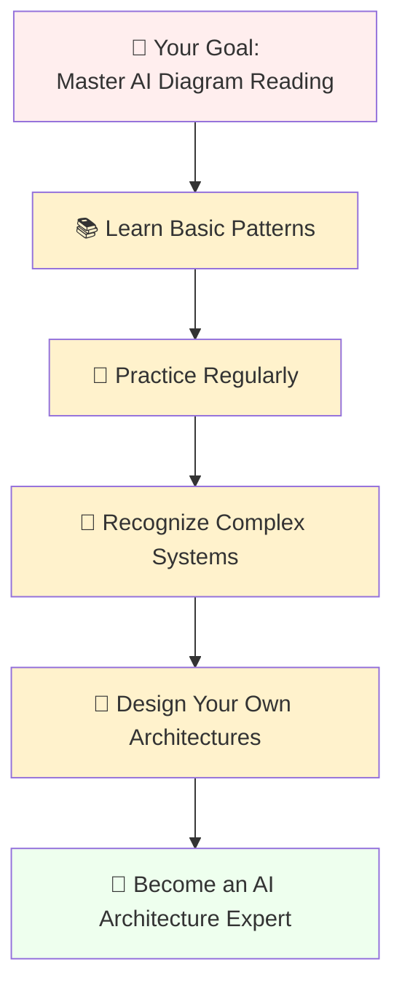

---

**Happy diagram reading, and welcome to the exciting world of AI architecture understanding!** 🎉

