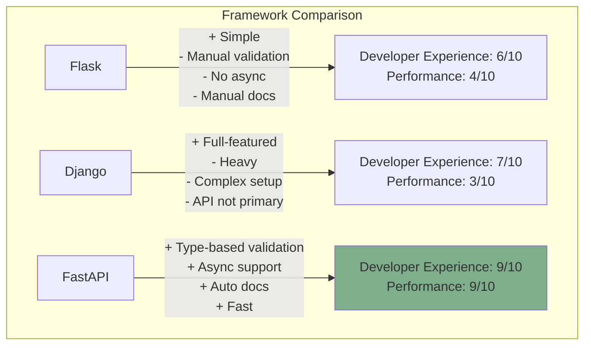
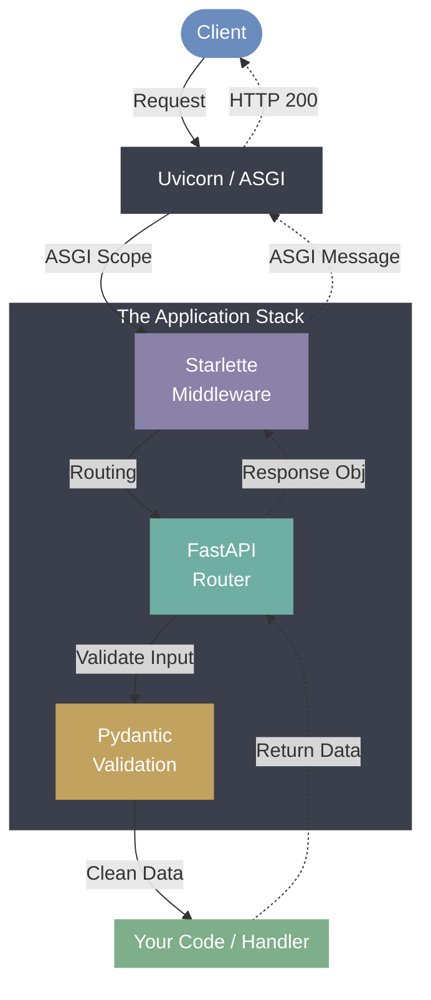
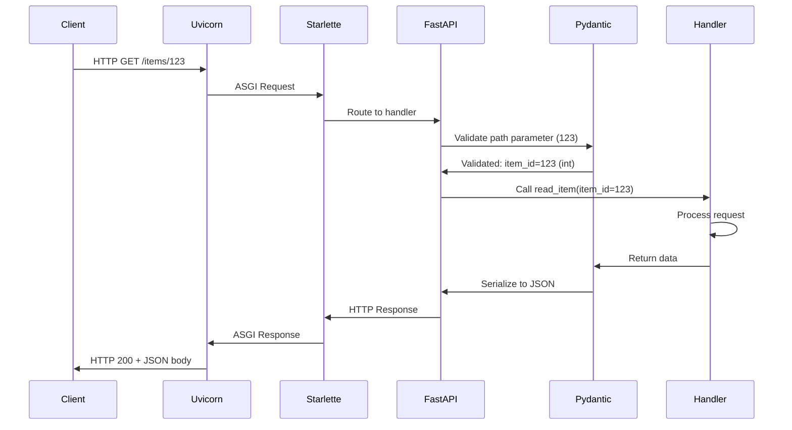
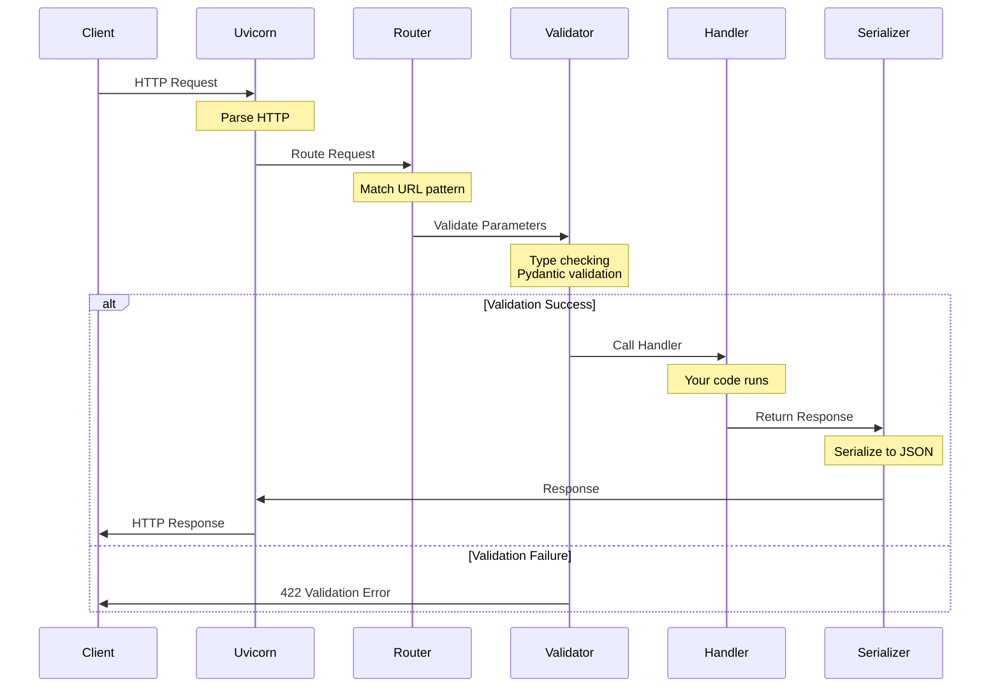
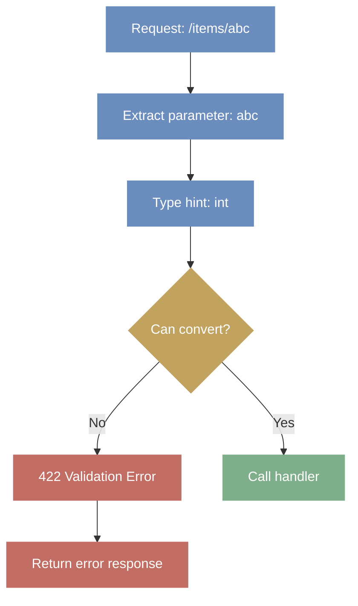
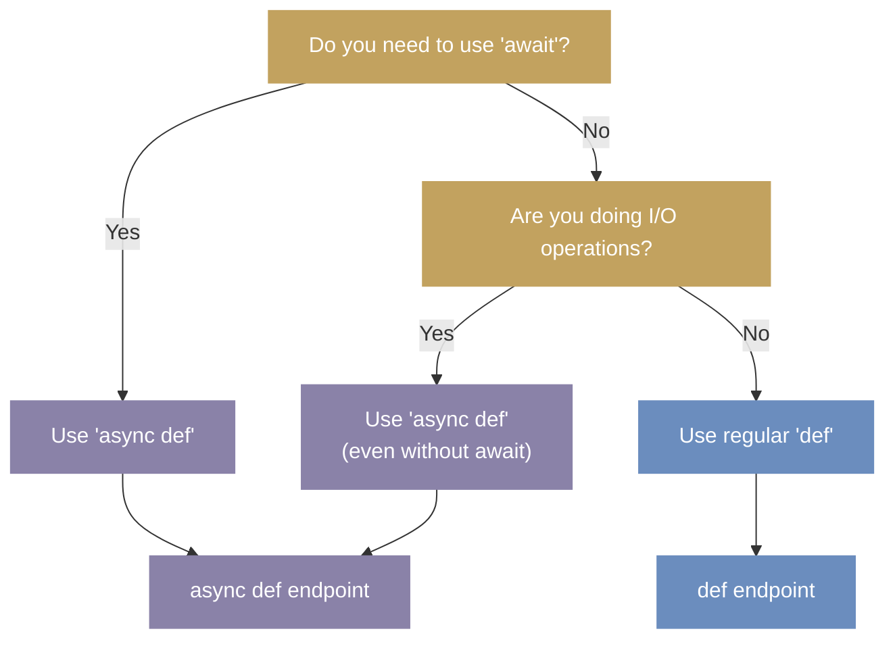

# Day 1: FastAPI Fundamentals & Path Operations

**Date**: Week 3, Day 1  
**Phase**: 2 - FastAPI Mastery  
**Topic**: Understanding FastAPI Architecture and Path Operations

---

## Table of Contents

1. [Understanding FastAPI](#understanding-fastapi)
2. [FastAPI Architecture Deep Dive](#fastapi-architecture-deep-dive)
3. [Installation & Environment Setup](#installation--environment-setup)
4. [Your First FastAPI Application](#your-first-fastapi-application)
5. [HTTP Methods & Path Operations](#http-methods--path-operations)
6. [Path Parameters & Type System](#path-parameters--type-system)
7. [Application Structure & Configuration](#application-structure--configuration)
8. [Request/Response Lifecycle](#requestresponse-lifecycle)
9. [Complete Practical Example](#complete-practical-example)
10. [Testing Your API](#testing-your-api)

---

## Understanding FastAPI

### What is FastAPI?

FastAPI is a modern, high-performance web framework for building APIs with Python 3.7+ based on standard Python type hints. It was created by Sebastián Ramírez in 2018 and has quickly become one of the most popular Python web frameworks for API development.

**The core philosophy of FastAPI**:

- Use Python type hints for everything (validation, serialization, documentation)
- Leverage async/await for high performance
- Minimize code duplication and boilerplate
- Provide automatic interactive documentation
- Follow web standards (OpenAPI, JSON Schema)

### Why FastAPI Was Created

Before FastAPI, Python developers faced a common dilemma:

**Option 1: Flask/Django** - Easy to use but:

- Manual validation required
- No built-in async support (Flask)
- Heavy overhead for simple APIs (Django)
- Manual documentation

**Option 2: Other frameworks** - Various limitations:

- Complex setup
- Poor documentation
- Lack of modern Python features
- Performance bottlenecks

FastAPI was designed to solve these problems by combining the best features of multiple frameworks while leveraging modern Python features like type hints and async/await.

### Key Features Explained

Let's understand what makes FastAPI special:

#### 1. Fast Performance

FastAPI is built on top of **Starlette** (for web parts) and **Pydantic** (for data validation). This architecture makes it one of the fastest Python frameworks available, comparable to Node.js and Go.

**Performance comparison** (requests per second):

- FastAPI: ~20,000-25,000 req/s
- Flask: ~1,000-3,000 req/s
- Django: ~500-1,000 req/s

_Note: Exact numbers depend on hardware and workload, but the relative difference is consistent._

#### 2. Fast to Code

By using type hints, FastAPI can automatically:

- Validate request data
- Serialize response data
- Generate documentation
- Provide editor support

This reduces development time by 200-300% compared to traditional frameworks.

#### 3. Type-Based Validation

Instead of writing manual validation code, you declare types and FastAPI handles the rest:

```python
# Traditional approach (Flask)
from flask import Flask, request, jsonify

app = Flask(__name__)

@app.route('/items/<item_id>')
def get_item(item_id):
    # Manual validation
    try:
        item_id = int(item_id)
    except ValueError:
        return jsonify({"error": "ID must be an integer"}), 400

    if item_id < 1:
        return jsonify({"error": "ID must be positive"}), 400

    # 10+ lines of validation code...
    return jsonify({"item_id": item_id})

# FastAPI approach
from fastapi import FastAPI

app = FastAPI()

@app.get("/items/{item_id}")
async def get_item(item_id: int):
    # Automatic validation - if item_id isn't a valid integer,
    # FastAPI returns a detailed error response automatically
    return {"item_id": item_id}
```

The type hint `item_id: int` tells FastAPI:

- Convert the path parameter to an integer
- Validate it's a valid integer
- Return a 422 error with details if validation fails
- Document it in the OpenAPI schema

#### 4. Automatic Documentation

FastAPI generates interactive API documentation automatically using the OpenAPI standard. No configuration needed - it's built from your code and type hints.

**Two interfaces are provided**:

- **Swagger UI** (`/docs`) - Interactive testing interface
- **ReDoc** (`/redoc`) - Clean, readable documentation

#### 5. Standards-Based

FastAPI is built on open standards:

- **OpenAPI** (formerly Swagger) - API specification standard
- **JSON Schema** - Data validation standard
- **OAuth2** - Authentication standard
- **JWT** - Token standard

This means your API is compatible with tools across the ecosystem.

### FastAPI vs Other Frameworks

Let's compare FastAPI with popular alternatives:



**Detailed Comparison**:

| Feature        | Flask   | Django            | FastAPI            |
| -------------- | ------- | ----------------- | ------------------ |
| Type Hints     | No      | No                | Yes (core feature) |
| Async Support  | Limited | Limited           | Full support       |
| Validation     | Manual  | Forms/Serializers | Automatic          |
| Documentation  | Manual  | Manual            | Automatic          |
| Performance    | Good    | Moderate          | Excellent          |
| Learning Curve | Easy    | Moderate          | Easy               |
| API-First      | No      | No                | Yes                |
| OpenAPI        | Manual  | Manual            | Automatic          |

---

## FastAPI Architecture Deep Dive

Understanding FastAPI's architecture helps you use it effectively. Let's explore how it works under the hood.

### The Three-Layer Architecture

FastAPI is built on three main components:



Let's understand each layer:

#### Layer 1: Uvicorn (ASGI Server)

**Uvicorn** is an ASGI (Asynchronous Server Gateway Interface) server. Think of it as the entry point that:

- Listens for incoming HTTP requests
- Handles the TCP connection
- Converts HTTP to ASGI format
- Passes requests to your application
- Returns responses to clients

**ASGI vs WSGI**:

```python
# WSGI (Old standard - used by Flask/Django)
# Synchronous, one request per thread
def wsgi_application(environ, start_response):
    # Process one request at a time per thread
    status = '200 OK'
    headers = [('Content-Type', 'text/plain')]
    start_response(status, headers)
    return [b'Hello World']

# ASGI (New standard - used by FastAPI)
# Asynchronous, can handle multiple requests concurrently
async def asgi_application(scope, receive, send):
    # Can handle multiple requests concurrently
    await send({
        'type': 'http.response.start',
        'status': 200,
        'headers': [[b'content-type', b'text/plain']],
    })
    await send({
        'type': 'http.response.body',
        'body': b'Hello World',
    })
```

**Why ASGI matters**:

- Handles async/await natively
- Better performance for I/O-bound operations
- Can handle WebSockets and HTTP/2
- More efficient resource usage

#### Layer 2: Starlette (Web Framework)

**Starlette** provides the web framework foundation:

- Request/Response objects
- Routing system
- Middleware support
- WebSocket support
- Background tasks
- Static file serving

FastAPI inherits all of Starlette's capabilities and adds its own features on top.

#### Layer 3: FastAPI (API Framework)

**FastAPI** adds API-specific features:

- Type-based validation using Pydantic
- Automatic OpenAPI documentation
- Dependency injection system
- OAuth2 and JWT support
- Advanced routing features

#### Layer 4: Pydantic (Data Validation)

**Pydantic** handles all data validation and serialization:

- Validates incoming data against type hints
- Converts data types automatically
- Provides detailed error messages
- Serializes responses to JSON
- Generates JSON schemas

**Example of Pydantic in action**:

```python
from pydantic import BaseModel, Field, validator

class Item(BaseModel):
    name: str = Field(..., min_length=1, max_length=100)
    price: float = Field(..., gt=0)  # greater than 0
    quantity: int = Field(default=1, ge=1)  # greater than or equal to 1

    @validator('name')
    def name_must_not_be_empty(cls, v):
        if not v.strip():
            raise ValueError('Name cannot be empty')
        return v.strip()

# FastAPI uses this model for validation
@app.post("/items")
async def create_item(item: Item):
    # 'item' is guaranteed to be valid at this point
    # - name is 1-100 chars and not empty
    # - price is positive
    # - quantity is at least 1
    return item
```

### Request Flow Diagram

Let's trace a complete request through FastAPI:



**Step-by-step explanation**:

1. **Client sends request**: `GET /items/123`
2. **Uvicorn receives**: HTTP request on TCP socket
3. **Uvicorn converts**: HTTP → ASGI format
4. **Starlette routes**: Matches URL pattern to handler
5. **FastAPI validates**: Uses Pydantic to validate `123` as integer
6. **Handler executes**: Your function runs with validated data
7. **Pydantic serializes**: Converts response to JSON
8. **Response flows back**: Through FastAPI → Starlette → Uvicorn
9. **Client receives**: HTTP 200 with JSON body

### Type System Integration

This is where FastAPI truly shines. Let's understand how type hints power everything:

```python
from typing import Optional, List
from pydantic import BaseModel

# 1. Define data structure
class Item(BaseModel):
    id: int
    name: str
    price: float
    tags: List[str] = []
    description: Optional[str] = None

# 2. Use in endpoint
@app.post("/items", response_model=Item)
async def create_item(item: Item):
    return item

# What FastAPI does automatically:
# - Validates incoming JSON matches Item structure
# - Converts types (string "123.45" → float 123.45)
# - Returns 422 if validation fails with detailed errors
# - Generates OpenAPI schema
# - Provides autocomplete in /docs
# - Serializes response to JSON
```

**The type hint tells FastAPI**:

- `item: Item` - "Expect JSON body matching Item model"
- `response_model=Item` - "Response will match Item model"
- `id: int` - "id must be an integer"
- `Optional[str]` - "description is optional"
- `List[str]` - "tags must be a list of strings"

**Error response for invalid data**:

```json
{
  "detail": [
    {
      "loc": ["body", "price"],
      "msg": "value is not a valid float",
      "type": "type_error.float"
    }
  ]
}
```

---

## Installation & Environment Setup

### Prerequisites

Before installing FastAPI, ensure you have:

- **Python 3.7+** (Python 3.8+ recommended)
- **pip** (Python package manager)
- **Virtual environment** (recommended)

### Step 1: Create Virtual Environment

A virtual environment isolates your project dependencies:

```bash
# Create a new directory for your project
mkdir fastapi-project
cd fastapi-project

# Create virtual environment
python -m venv venv

# Activate virtual environment
# On Linux/Mac:
source venv/bin/activate

# On Windows:
venv\Scripts\activate

# Your prompt should now show (venv)
```

**Why virtual environments?**

- Isolated dependencies per project
- Avoid version conflicts
- Easy to recreate environment
- Clean uninstallation

### Step 2: Install FastAPI

```bash
# Install FastAPI
pip install fastapi

# Install ASGI server (Uvicorn with performance extras)
pip install "uvicorn[standard]"

# Verify installation
python -c "import fastapi; print(fastapi.__version__)"
```

**Understanding the installation**:

- `fastapi` - Core framework
- `uvicorn[standard]` - ASGI server with:
  - `uvloop` - Fast event loop
  - `httptools` - Fast HTTP parsing
  - `websockets` - WebSocket support

### Step 3: Create requirements.txt

Save your dependencies for reproducibility:

```bash
# Generate requirements file
pip freeze > requirements.txt

# Later, install from requirements
pip install -r requirements.txt
```

**Example requirements.txt**:

```
fastapi==0.109.0
uvicorn[standard]==0.27.0
```

### Development Environment Setup

**Recommended VS Code extensions**:

- Python (Microsoft)
- Pylance (type checking)
- REST Client (API testing)
- Better Comments

**Project structure**:

```
fastapi-project/
├── venv/                  # Virtual environment
├── app/
│   ├── __init__.py
│   ├── main.py           # Application entry point
│   └── routers/          # API routes (we'll learn later)
├── tests/                # Test files
├── requirements.txt      # Dependencies
└── .gitignore           # Git ignore file
```

**Basic .gitignore**:

```
venv/
__pycache__/
*.pyc
.env
```

---

## Your First FastAPI Application

### The Minimal Application

Let's create the simplest possible FastAPI application and understand every part:

```python
# main.py
from fastapi import FastAPI

# Create FastAPI instance
# This is your application object
app = FastAPI()

# Define a path operation
# @app.get() is a decorator that tells FastAPI:
# - This function handles GET requests
# - The path is "/"
@app.get("/")
async def root():
    # Return a dictionary - FastAPI converts it to JSON
    return {"message": "Hello World"}
```

**Breaking down this code**:

1. **`from fastapi import FastAPI`**

   - Imports the FastAPI class
   - This is the main building block

2. **`app = FastAPI()`**

   - Creates an instance of FastAPI
   - This instance represents your entire application
   - You can create multiple instances if needed

3. **`@app.get("/")`**

   - A Python decorator
   - Registers the function as a handler for GET requests to "/"
   - The decorator does the heavy lifting (validation, serialization, etc.)

4. **`async def root():`**

   - An async function (coroutine)
   - Can use `await` inside for async operations
   - Returns a dictionary

5. **`return {"message": "Hello World"}`**
   - Return a Python dictionary
   - FastAPI automatically converts to JSON
   - Sets Content-Type header to application/json

### Running Your Application

There are several ways to run your FastAPI application:

#### Method 1: Using Uvicorn from Command Line

```bash
# Basic run
uvicorn main:app

# Explanation:
# - main: the Python file (main.py)
# - app: the FastAPI instance variable name
# - This creates: http://127.0.0.1:8000
```

**Common Uvicorn options**:

```bash
# Development mode with auto-reload
uvicorn main:app --reload

# Custom host and port
uvicorn main:app --host 0.0.0.0 --port 8080

# Custom log level
uvicorn main:app --log-level debug

# All together (development setup)
uvicorn main:app --reload --host 127.0.0.1 --port 8000 --log-level info
```

**Understanding the options**:

- `--reload`: Watch for file changes and restart (development only!)
- `--host 0.0.0.0`: Listen on all network interfaces
- `--port 8080`: Custom port (default is 8000)
- `--log-level`: Set logging verbosity (debug, info, warning, error, critical)

**⚠️ Important**: Never use `--reload` in production! It's only for development.

#### Method 2: Using Uvicorn from Python

```python
# main.py
from fastapi import FastAPI
import uvicorn

app = FastAPI()

@app.get("/")
async def root():
    return {"message": "Hello World"}

# Only run when executed directly (not imported)
if __name__ == "__main__":
    uvicorn.run("main:app", host="0.0.0.0", port=8000, reload=True)
```

Then run:

```bash
python main.py
```

This approach is useful for:

- Configuring the server in code
- Adding startup logic
- Running in development

### Automatic Documentation

One of FastAPI's best features is automatic interactive documentation. As soon as you run your application, these are available:

#### Swagger UI (Interactive Documentation)

Navigate to: `http://127.0.0.1:8000/docs`

**Features**:

- Interactive testing interface
- Try out endpoints directly in browser
- See request/response examples
- View all available endpoints
- Test with different parameters

```python
# Your endpoint in /docs will show:
# - HTTP method (GET)
# - Path (/)
# - Description (if you add docstring)
# - Parameters (if any)
# - Request body schema (if applicable)
# - Response schema
# - Try it out button

@app.get("/")
async def root():
    """
    Root endpoint that returns a welcome message.

    This is a simple example endpoint.
    """
    return {"message": "Hello World"}
```

The docstring becomes the description in the documentation!

#### ReDoc (Alternative Documentation)

Navigate to: `http://127.0.0.1:8000/redoc`

**Features**:

- Clean, readable documentation
- Better for sharing with others
- Three-panel layout
- Better for complex APIs
- Printable

**When to use each**:

- **Swagger UI**: Interactive testing during development
- **ReDoc**: Sharing documentation with team/clients

#### OpenAPI Schema (JSON)

Navigate to: `http://127.0.0.1:8000/openapi.json`

**This is the raw OpenAPI specification** that powers both documentation interfaces:

```json
{
  "openapi": "3.0.2",
  "info": {
    "title": "FastAPI",
    "version": "0.1.0"
  },
  "paths": {
    "/": {
      "get": {
        "summary": "Root",
        "operationId": "root__get",
        "responses": {
          "200": {
            "description": "Successful Response",
            "content": {
              "application/json": {
                "schema": {}
              }
            }
          }
        }
      }
    }
  }
}
```

This schema can be:

- Imported into Postman, Insomnia, etc.
- Used to generate client SDKs
- Shared with frontend developers
- Used for API validation

---

## HTTP Methods & Path Operations

### Understanding HTTP Methods

HTTP methods (also called verbs) define the action to perform on a resource. FastAPI supports all standard HTTP methods.


**Key concepts**:

- **Safe**: Doesn't modify data (GET)
- **Idempotent**: Same result if called multiple times (GET, PUT, DELETE)
- **Not Idempotent**: Different result each time (POST, PATCH)

### GET - Retrieve Data

GET is used to retrieve data without modifying it. It's the most common HTTP method.

```python
from fastapi import FastAPI

app = FastAPI()

# Simple GET - no parameters
@app.get("/")
async def read_root():
    """
    Root endpoint - returns welcome message.

    This is typically used as a health check or API info endpoint.
    """
    return {
        "message": "Welcome to the API",
        "version": "1.0.0",
        "docs": "/docs"
    }

# GET a collection
@app.get("/items")
async def read_items():
    """
    List all items.

    In a real application, this would query a database.
    Tomorrow we'll learn how to add pagination with query parameters.
    """
    # Simulate database query
    items = [
        {"id": 1, "name": "Laptop", "price": 999.99},
        {"id": 2, "name": "Mouse", "price": 29.99},
        {"id": 3, "name": "Keyboard", "price": 79.99},
    ]
    return {
        "items": items,
        "count": len(items)
    }

# GET a single resource
@app.get("/items/{item_id}")
async def read_item(item_id: int):
    """
    Get a specific item by ID.

    Args:
        item_id: The ID of the item to retrieve

    Returns:
        Item details or error if not found
    """
    # Simulate database lookup
    fake_db = {
        1: {"id": 1, "name": "Laptop", "price": 999.99},
        2: {"id": 2, "name": "Mouse", "price": 29.99},
    }

    if item_id in fake_db:
        return fake_db[item_id]

    # Return error (we'll learn better error handling in Week 4)
    return {"error": "Item not found"}
```

**GET best practices**:

- Never modify data in GET requests
- Make GET requests idempotent (same result every time)
- Use GET for retrieving single resources or collections
- Cache GET responses when appropriate

### POST - Create Data

POST is used to create new resources. It's not idempotent - calling it twice creates two resources.

```python
from typing import Dict
from datetime import datetime

# Simulate database
items_db: Dict[int, dict] = {}
next_id = 1

@app.post("/items")
async def create_item():
    """
    Create a new item.

    In this simple example, we create a default item.
    Tomorrow we'll learn how to accept data from the request body.
    """
    global next_id

    new_item = {
        "id": next_id,
        "name": f"Item {next_id}",
        "price": 0.0,
        "created_at": datetime.now().isoformat()
    }

    items_db[next_id] = new_item
    next_id += 1

    return {
        "message": "Item created successfully",
        "item": new_item
    }

@app.post("/users")
async def create_user():
    """
    Create a new user.

    Returns the created user with a generated ID.
    """
    # Simulate user creation
    user_id = 123
    return {
        "message": "User created",
        "user": {
            "id": user_id,
            "username": "newuser",
            "email": "user@example.com",
            "created_at": datetime.now().isoformat()
        }
    }
```

**POST best practices**:

- Return the created resource (including generated ID)
- Return 201 Created status code (we'll learn this in Week 4)
- Include Location header pointing to new resource
- Validate input data thoroughly (tomorrow's topic!)

### PUT - Update/Replace Data

PUT replaces an entire resource. It's idempotent - calling it multiple times with the same data has the same effect.

```python
@app.put("/items/{item_id}")
async def update_item(item_id: int):
    """
    Update (replace) an entire item.

    PUT replaces the entire resource with new data.
    Missing fields would be set to defaults/null.

    Args:
        item_id: The ID of the item to update
    """
    if item_id not in items_db:
        return {"error": "Item not found"}

    # In real application, you'd get new data from request body (tomorrow!)
    # For now, we'll just update with dummy data
    items_db[item_id] = {
        "id": item_id,
        "name": f"Updated Item {item_id}",
        "price": 99.99,
        "updated_at": datetime.now().isoformat()
    }

    return {
        "message": "Item updated successfully",
        "item": items_db[item_id]
    }
```

**PUT characteristics**:

- **Idempotent**: Calling PUT twice with same data = same result
- **Complete replacement**: All fields should be provided
- **Creates if not exists**: Optionally, PUT can create if resource doesn't exist

### PATCH - Partial Update

PATCH updates only specific fields of a resource. Unlike PUT, you only send the fields you want to change.

```python
@app.patch("/items/{item_id}")
async def partial_update_item(item_id: int):
    """
    Partially update an item.

    PATCH updates only the fields you specify.
    Other fields remain unchanged.

    Args:
        item_id: The ID of the item to update
    """
    if item_id not in items_db:
        return {"error": "Item not found"}

    # In real application, you'd receive specific fields to update
    # For now, we'll just update the price
    items_db[item_id]["price"] = 149.99
    items_db[item_id]["updated_at"] = datetime.now().isoformat()

    return {
        "message": "Item partially updated",
        "item": items_db[item_id]
    }
```

**PATCH vs PUT**:

```python
# PUT - must provide all fields
PUT /items/1
{
    "name": "New Name",
    "price": 99.99,
    "description": "New description",
    "category": "electronics"
}

# PATCH - only fields to change
PATCH /items/1
{
    "price": 99.99
}
# Other fields (name, description, category) remain unchanged
```

### DELETE - Remove Data

DELETE removes a resource. It's idempotent - deleting the same resource twice has the same effect (resource is gone).

```python
@app.delete("/items/{item_id}")
async def delete_item(item_id: int):
    """
    Delete an item.

    Removes the item from the database.
    Calling DELETE on an already deleted item should also return success.

    Args:
        item_id: The ID of the item to delete
    """
    if item_id not in items_db:
        # Even if item doesn't exist, DELETE is successful
        # (the desired state - item doesn't exist - is achieved)
        return {
            "message": "Item already deleted or never existed",
            "item_id": item_id
        }

    deleted_item = items_db.pop(item_id)

    return {
        "message": "Item deleted successfully",
        "deleted_item": deleted_item
    }
```

**DELETE best practices**:

- Return 204 No Content (empty response) OR
- Return 200 OK with details of deleted resource
- Make DELETE idempotent
- Consider soft deletes (mark as deleted) vs hard deletes

### Complete CRUD Example

Here's a complete example showing all operations together:

```python
from fastapi import FastAPI
from typing import Dict
from datetime import datetime

app = FastAPI(title="CRUD API Example")

# In-memory database
items_db: Dict[int, dict] = {
    1: {"id": 1, "name": "Laptop", "price": 999.99},
    2: {"id": 2, "name": "Mouse", "price": 29.99},
}
next_id = 3

# CREATE
@app.post("/items")
async def create_item():
    """Create a new item (C in CRUD)"""
    global next_id

    new_item = {
        "id": next_id,
        "name": f"Item {next_id}",
        "price": 0.0,
        "created_at": datetime.now().isoformat()
    }

    items_db[next_id] = new_item
    next_id += 1

    return {"message": "Created", "item": new_item}

# READ (collection)
@app.get("/items")
async def list_items():
    """Get all items (R in CRUD - collection)"""
    return {
        "items": list(items_db.values()),
        "count": len(items_db)
    }

# READ (single)
@app.get("/items/{item_id}")
async def get_item(item_id: int):
    """Get a specific item (R in CRUD - single)"""
    if item_id in items_db:
        return items_db[item_id]
    return {"error": "Item not found"}

# UPDATE (full)
@app.put("/items/{item_id}")
async def update_item(item_id: int):
    """Update entire item (U in CRUD - full)"""
    if item_id not in items_db:
        return {"error": "Item not found"}

    items_db[item_id] = {
        "id": item_id,
        "name": f"Updated Item {item_id}",
        "price": 199.99,
        "updated_at": datetime.now().isoformat()
    }

    return {"message": "Updated", "item": items_db[item_id]}

# UPDATE (partial)
@app.patch("/items/{item_id}")
async def partial_update(item_id: int):
    """Partially update item (U in CRUD - partial)"""
    if item_id not in items_db:
        return {"error": "Item not found"}

    items_db[item_id]["price"] = 149.99
    items_db[item_id]["updated_at"] = datetime.now().isoformat()

    return {"message": "Partially updated", "item": items_db[item_id]}

# DELETE
@app.delete("/items/{item_id}")
async def delete_item(item_id: int):
    """Delete an item (D in CRUD)"""
    if item_id in items_db:
        deleted_item = items_db.pop(item_id)
        return {"message": "Deleted", "deleted_item": deleted_item}
    return {"message": "Item already deleted"}
```

---

## Path Parameters & Type System

Path parameters are variables embedded in the URL path. FastAPI uses Python type hints to automatically validate and convert these parameters.

### Basic Path Parameters

```python
from fastapi import FastAPI

app = FastAPI()

@app.get("/items/{item_id}")
async def read_item(item_id: int):
    """
    Get item by ID.

    The {item_id} in the path is a path parameter.
    The type hint 'int' tells FastAPI:
    - Convert the string from URL to integer
    - Validate it's a valid integer
    - Return 422 error if not

    Examples:
    - /items/5 → item_id = 5 ✓
    - /items/abc → Validation error ✗
    - /items/3.14 → Validation error ✗
    """
    return {
        "item_id": item_id,
        "type": type(item_id).__name__  # Will be 'int'
    }

@app.get("/users/{username}")
async def read_user(username: str):
    """
    Get user by username.

    String path parameters work with any text.

    Examples:
    - /users/alice → username = "alice"
    - /users/bob123 → username = "bob123"
    - /users/user@email → username = "user@email"
    """
    return {
        "username": username,
        "type": type(username).__name__  # Will be 'str'
    }
```

**How type conversion works**:

```python
# URL: /items/123
# 1. FastAPI receives: "123" (string from URL)
# 2. Type hint says: int
# 3. FastAPI converts: int("123") → 123
# 4. Your function receives: item_id = 123 (integer)

# URL: /items/abc
# 1. FastAPI receives: "abc" (string from URL)
# 2. Type hint says: int
# 3. Conversion fails: int("abc") → ValueError
# 4. FastAPI returns: 422 Unprocessable Entity with error details
```

**Error response example**:

```json
{
  "detail": [
    {
      "type": "int_parsing",
      "loc": ["path", "item_id"],
      "msg": "Input should be a valid integer, unable to parse string as an integer",
      "input": "abc"
    }
  ]
}
```

### Multiple Path Parameters

You can have multiple path parameters in a single route:

```python
@app.get("/users/{user_id}/items/{item_id}")
async def read_user_item(user_id: int, item_id: int):
    """
    Get a specific item for a specific user.

    Path: /users/{user_id}/items/{item_id}

    Both parameters are validated independently.

    Example:
    - /users/10/items/5 → user_id=10, item_id=5 ✓
    - /users/abc/items/5 → Validation error (user_id not int) ✗
    - /users/10/items/xyz → Validation error (item_id not int) ✗
    """
    return {
        "user_id": user_id,
        "item_id": item_id,
        "message": f"Item {item_id} for user {user_id}"
    }

@app.get("/categories/{category}/products/{product_id}")
async def get_product_in_category(category: str, product_id: int):
    """
    Get product by category and ID.

    Mix of string and integer path parameters.

    Example:
    - /categories/electronics/products/42
      → category="electronics", product_id=42
    """
    return {
        "category": category,
        "product_id": product_id
    }
```

### Path Parameters with Enums

For path parameters with limited valid values, use Python Enums:

```python
from enum import Enum

class ModelName(str, Enum):
    """
    Enum for valid model names.

    Inheriting from str makes it JSON serializable.
    FastAPI will validate that the path parameter matches one of these values.
    """
    alexnet = "alexnet"
    resnet = "resnet"
    lenet = "lenet"

@app.get("/models/{model_name}")
async def get_model(model_name: ModelName):
    """
    Get model information.

    Only accepts: alexnet, resnet, or lenet

    Valid:
    - /models/alexnet ✓
    - /models/resnet ✓
    - /models/lenet ✓

    Invalid:
    - /models/vgg → 422 error ✗
    - /models/other → 422 error ✗
    """
    # You can compare with enum values
    if model_name == ModelName.alexnet:
        return {
            "model_name": model_name,
            "message": "Deep Learning FTW!",
            "year": 2012
        }

    if model_name == ModelName.lenet:
        return {
            "model_name": model_name,
            "message": "LeCNN all the images",
            "year": 1998
        }

    # For resnet or any other
    return {
        "model_name": model_name,
        "message": "Have some residuals",
        "year": 2015
    }

# Another example with different enum
class UserRole(str, Enum):
    admin = "admin"
    user = "user"
    guest = "guest"

@app.get("/users/{user_id}/role/{role}")
async def get_users_by_role(user_id: int, role: UserRole):
    """Only accepts valid roles."""
    return {
        "user_id": user_id,
        "role": role,
        "permissions": "full" if role == UserRole.admin else "limited"
    }
```

**Why use Enums?**

- Automatic validation
- Better documentation
- IDE autocomplete
- Type safety
- Clear API contract

### Path Parameters with File Paths

For path parameters that represent file paths (with slashes), use the special syntax:

```python
@app.get("/files/{file_path:path}")
async def read_file(file_path: str):
    """
    Handle paths with slashes.

    The :path converter tells FastAPI to accept slashes in the parameter.

    Examples:
    - /files/home/user/document.txt
      → file_path = "home/user/document.txt"
    - /files/folder/subfolder/file.py
      → file_path = "folder/subfolder/file.py"
    - /files/single.txt
      → file_path = "single.txt"
    """
    return {
        "file_path": file_path,
        "extension": file_path.split('.')[-1] if '.' in file_path else None
    }
```

**Use cases for `:path`**:

- File system paths
- Directory structures
- Hierarchical data
- URLs within URLs

### Order Matters!

**This is crucial**: FastAPI checks path operations in the order they're defined.

```python
# ❌ WRONG ORDER - This won't work as expected!
@app.get("/users/{user_id}")
async def read_user(user_id: int):
    """
    This matches FIRST, so /users/me will try to convert "me" to int.
    This will fail with a validation error!
    """
    return {"user_id": user_id}

@app.get("/users/me")
async def read_current_user():
    """
    This will NEVER match because /users/{user_id} matches first.
    /users/me will be caught by the handler above!
    """
    return {"user": "current user"}

# ✅ CORRECT ORDER - Specific routes first!
@app.get("/users/me")
async def read_current_user():
    """
    This matches /users/me specifically.
    Defined BEFORE the generic handler.
    """
    return {"user": "current user"}

@app.get("/users/{user_id}")
async def read_user(user_id: int):
    """
    This matches /users/123 but NOT /users/me
    because /users/me was already matched above.
    """
    return {"user_id": user_id}
```

**Rule**: Always define specific paths before generic path parameters.

```python
# Good order example
@app.get("/users/me")          # 1. Most specific
@app.get("/users/active")      # 2. Also specific
@app.get("/users/{user_id}")   # 3. Generic (with parameter)

# Another good order
@app.get("/items/latest")      # 1. Specific
@app.get("/items/popular")     # 2. Specific
@app.get("/items/{item_id}")   # 3. Generic
```

### Type Validation in Detail

Let's see what happens with different type hints:

```python
from typing import Optional
from uuid import UUID

# Integer validation
@app.get("/int/{value}")
async def test_int(value: int):
    """
    Valid: /int/123 → value = 123
    Valid: /int/-456 → value = -456
    Invalid: /int/3.14 → 422 error
    Invalid: /int/abc → 422 error
    """
    return {"value": value, "type": "int"}

# Float validation
@app.get("/float/{value}")
async def test_float(value: float):
    """
    Valid: /float/3.14 → value = 3.14
    Valid: /float/123 → value = 123.0 (int converted to float)
    Invalid: /float/abc → 422 error
    """
    return {"value": value, "type": "float"}

# Boolean validation
@app.get("/bool/{value}")
async def test_bool(value: bool):
    """
    Valid: /bool/true → value = True
    Valid: /bool/false → value = False
    Valid: /bool/1 → value = True
    Valid: /bool/0 → value = False
    Valid: /bool/yes → value = True
    Valid: /bool/no → value = False
    Invalid: /bool/maybe → 422 error
    """
    return {"value": value, "type": "bool"}

# UUID validation
@app.get("/uuid/{value}")
async def test_uuid(value: UUID):
    """
    Valid: /uuid/550e8400-e29b-41d4-a716-446655440000 → UUID object
    Invalid: /uuid/not-a-uuid → 422 error
    """
    return {"value": str(value), "type": "UUID"}
```

---

## Application Structure & Configuration

### Basic Application Structure

As your application grows, organize it properly:

```python
# main.py
from fastapi import FastAPI

# Create FastAPI instance with basic configuration
app = FastAPI(
    title="My API",
    description="A simple API for learning FastAPI",
    version="1.0.0"
)

@app.get("/")
async def root():
    return {"message": "Hello from My API"}
```

**Configuration parameters explained**:

- `title`: API name shown in documentation
- `description`: API description (supports Markdown)
- `version`: API version number

### Enhanced Configuration

```python
from fastapi import FastAPI

app = FastAPI(
    title="Advanced API",
    description="""
    ## Features

    This API provides:

    * **Items** - Manage your items
    * **Users** - User management

    You can use **Markdown** here!
    """,
    version="2.0.0",

    # Contact and license information
    contact={
        "name": "API Support",
        "email": "support@example.com",
    },
    license_info={
        "name": "MIT",
    },
)
```

**When to configure these**:

- `contact`: So users know who to contact for support
- `license_info`: To specify API licensing
- `description`: To provide comprehensive API overview

### Custom Documentation URLs

```python
app = FastAPI(
    title="My API",
    # Change documentation URLs
    docs_url="/documentation",  # Default: /docs
    redoc_url="/redoc-docs",    # Default: /redoc
)
```

### Disabling Documentation (Production)

```python
# For production, you might want to disable docs
app = FastAPI(
    title="Production API",
    docs_url=None,   # Disable Swagger UI
    redoc_url=None,  # Disable ReDoc
)
```

**Why disable in production?**

- Security (don't expose internal API structure)
- Performance (small improvement)
- Professional appearance

---

## Request/Response Lifecycle

Understanding the complete lifecycle of a request helps you debug and optimize your applications.

### Complete Request Flow



### Step-by-Step Breakdown

Let's trace a request through FastAPI:

**Example request**: `GET /items/123`

```python
@app.get("/items/{item_id}")
async def read_item(item_id: int):
    return {"item_id": item_id, "name": "Item"}
```

**Step 1: Client sends request**

```
GET /items/123 HTTP/1.1
Host: localhost:8000
Accept: application/json
```

**Step 2: Uvicorn receives request**

- Parses HTTP request
- Creates ASGI connection
- Passes to application

**Step 3: Routing**

- FastAPI matches URL pattern: `/items/{item_id}`
- Identifies handler function: `read_item`
- Extracts path parameter: `item_id = "123"` (string)

**Step 4: Validation**

- Type hint says: `item_id: int`
- Pydantic converts: `"123"` → `123` (integer)
- Validates successfully ✓

**Step 5: Handler execution**

- Calls: `read_item(item_id=123)`
- Function executes
- Returns: `{"item_id": 123, "name": "Item"}`

**Step 6: Serialization**

- Pydantic serializes response to JSON
- Sets Content-Type: application/json
- Adds status code: 200 OK

**Step 7: Response sent**

```
HTTP/1.1 200 OK
Content-Type: application/json
Content-Length: 35

{"item_id": 123, "name": "Item"}
```

### Error Handling in Lifecycle

When validation fails:

**Request**: `GET /items/abc`



**Error response**:

```json
{
  "detail": [
    {
      "type": "int_parsing",
      "loc": ["path", "item_id"],
      "msg": "Input should be a valid integer, unable to parse string as an integer",
      "input": "abc"
    }
  ]
}
```

---

## Complete Practical Example

Let's build a realistic API for a simple library management system:

```python
from fastapi import FastAPI
from typing import Dict
from datetime import datetime
from enum import Enum

# Initialize FastAPI
app = FastAPI(
    title="Library Management API",
    description="A simple library management system for learning FastAPI",
    version="1.0.0"
)

# Enums for validation
class BookGenre(str, Enum):
    fiction = "fiction"
    non_fiction = "non-fiction"
    science = "science"
    history = "history"
    biography = "biography"

class BookStatus(str, Enum):
    available = "available"
    borrowed = "borrowed"
    reserved = "reserved"

# In-memory database
books_db: Dict[int, dict] = {
    1: {
        "id": 1,
        "title": "To Kill a Mockingbird",
        "author": "Harper Lee",
        "genre": BookGenre.fiction,
        "status": BookStatus.available,
        "year": 1960
    },
    2: {
        "id": 2,
        "title": "1984",
        "author": "George Orwell",
        "genre": BookGenre.fiction,
        "status": BookStatus.borrowed,
        "year": 1949
    },
    3: {
        "id": 3,
        "title": "A Brief History of Time",
        "author": "Stephen Hawking",
        "genre": BookGenre.science,
        "status": BookStatus.available,
        "year": 1988
    }
}
next_id = 4

# Root endpoint
@app.get("/")
async def root():
    """
    API root endpoint.

    Returns basic API information and available endpoints.
    """
    return {
        "message": "Library Management API",
        "version": "1.0.0",
        "endpoints": {
            "books": "/books",
            "book_detail": "/books/{book_id}",
            "books_by_genre": "/books/genre/{genre}",
            "books_by_status": "/books/status/{status}"
        },
        "documentation": "/docs"
    }

# Health check
@app.get("/health")
async def health_check():
    """
    Health check endpoint.

    Returns the health status of the API.
    Useful for monitoring and load balancers.
    """
    return {
        "status": "healthy",
        "timestamp": datetime.now().isoformat(),
        "total_books": len(books_db)
    }

# List all books
@app.get("/books")
async def list_books():
    """
    Get all books in the library.

    Returns a list of all books with statistics.
    """
    books = list(books_db.values())

    # Calculate statistics
    total_books = len(books)
    available = sum(1 for book in books if book["status"] == BookStatus.available)
    borrowed = sum(1 for book in books if book["status"] == BookStatus.borrowed)

    return {
        "books": books,
        "statistics": {
            "total": total_books,
            "available": available,
            "borrowed": borrowed
        }
    }

# Get specific book
@app.get("/books/{book_id}")
async def get_book(book_id: int):
    """
    Get a specific book by ID.

    Args:
        book_id: The ID of the book to retrieve

    Returns:
        Book details if found, error message if not found
    """
    if book_id in books_db:
        return {
            "success": True,
            "book": books_db[book_id]
        }

    return {
        "success": False,
        "error": "Book not found",
        "book_id": book_id
    }

# Get books by genre
@app.get("/books/genre/{genre}")
async def get_books_by_genre(genre: BookGenre):
    """
    Get all books in a specific genre.

    Args:
        genre: The genre to filter by (fiction, non-fiction, science, history, biography)

    Returns:
        List of books in the specified genre
    """
    filtered_books = [
        book for book in books_db.values()
        if book["genre"] == genre
    ]

    return {
        "genre": genre,
        "books": filtered_books,
        "count": len(filtered_books)
    }

# Get books by status
@app.get("/books/status/{status}")
async def get_books_by_status(status: BookStatus):
    """
    Get all books with a specific status.

    Args:
        status: The status to filter by (available, borrowed, reserved)

    Returns:
        List of books with the specified status
    """
    filtered_books = [
        book for book in books_db.values()
        if book["status"] == status
    ]

    return {
        "status": status,
        "books": filtered_books,
        "count": len(filtered_books)
    }

# Get books by author
@app.get("/authors/{author_name}/books")
async def get_books_by_author(author_name: str):
    """
    Get all books by a specific author.

    Args:
        author_name: The name of the author

    Returns:
        List of books by the author
    """
    # Case-insensitive search
    filtered_books = [
        book for book in books_db.values()
        if book["author"].lower() == author_name.lower()
    ]

    return {
        "author": author_name,
        "books": filtered_books,
        "count": len(filtered_books)
    }

# Create book
@app.post("/books")
async def create_book():
    """
    Create a new book entry.

    Creates a book with default values.
    Tomorrow we'll learn how to accept custom data from request body.

    Returns:
        The created book with generated ID
    """
    global next_id

    new_book = {
        "id": next_id,
        "title": f"New Book {next_id}",
        "author": "Unknown Author",
        "genre": BookGenre.fiction,
        "status": BookStatus.available,
        "year": datetime.now().year,
        "created_at": datetime.now().isoformat()
    }

    books_db[next_id] = new_book
    next_id += 1

    return {
        "message": "Book created successfully",
        "book": new_book
    }

# Update book status
@app.patch("/books/{book_id}/status/{status}")
async def update_book_status(book_id: int, status: BookStatus):
    """
    Update the status of a book.

    Args:
        book_id: The ID of the book to update
        status: The new status (available, borrowed, reserved)

    Returns:
        Updated book or error if not found
    """
    if book_id not in books_db:
        return {
            "success": False,
            "error": "Book not found"
        }

    old_status = books_db[book_id]["status"]
    books_db[book_id]["status"] = status
    books_db[book_id]["updated_at"] = datetime.now().isoformat()

    return {
        "success": True,
        "message": f"Status updated from {old_status} to {status}",
        "book": books_db[book_id]
    }

# Delete book
@app.delete("/books/{book_id}")
async def delete_book(book_id: int):
    """
    Delete a book from the library.

    Args:
        book_id: The ID of the book to delete

    Returns:
        Success message or error if book not found
    """
    if book_id not in books_db:
        return {
            "success": False,
            "error": "Book not found",
            "book_id": book_id
        }

    deleted_book = books_db.pop(book_id)

    return {
        "success": True,
        "message": "Book deleted successfully",
        "deleted_book": deleted_book
    }

# Statistics endpoint
@app.get("/stats")
async def get_statistics():
    """
    Get overall library statistics.

    Returns:
        Comprehensive statistics about the library
    """
    total_books = len(books_db)

    if total_books == 0:
        return {
            "total_books": 0,
            "message": "Library is empty"
        }

    # Count by genre
    genre_counts = {genre: 0 for genre in BookGenre}
    status_counts = {status: 0 for status in BookStatus}

    for book in books_db.values():
        genre_counts[book["genre"]] += 1
        status_counts[book["status"]] += 1

    # Calculate availability rate
    available = status_counts[BookStatus.available]
    availability_rate = (available / total_books) * 100

    return {
        "total_books": total_books,
        "by_genre": {
            "fiction": genre_counts[BookGenre.fiction],
            "non_fiction": genre_counts[BookGenre.non_fiction],
            "science": genre_counts[BookGenre.science],
            "history": genre_counts[BookGenre.history],
            "biography": genre_counts[BookGenre.biography]
        },
        "by_status": {
            "available": status_counts[BookStatus.available],
            "borrowed": status_counts[BookStatus.borrowed],
            "reserved": status_counts[BookStatus.reserved]
        },
        "availability_rate": f"{availability_rate:.1f}%"
    }
```

---

## Testing Your API

### Using the Interactive Documentation

1. **Start your server**:

```bash
uvicorn main:app --reload
```

2. **Open Swagger UI**:
   Navigate to `http://127.0.0.1:8000/docs`

3. **Test endpoints**:

- Click on any endpoint to expand it
- Click "Try it out"
- Fill in parameters (if any)
- Click "Execute"
- See the response below

**Example test flow**:

1. Test `GET /books` to see all books
2. Test `GET /books/1` to see a specific book
3. Test `POST /books` to create a new book
4. Test `PATCH /books/4/status/borrowed` to update the new book's status
5. Test `GET /stats` to see updated statistics

### Using curl

```bash
# Get all books
curl http://127.0.0.1:8000/books

# Get specific book
curl http://127.0.0.1:8000/books/1

# Get books by genre
curl http://127.0.0.1:8000/books/genre/fiction

# Get books by status
curl http://127.0.0.1:8000/books/status/available

# Get books by author
curl http://127.0.0.1:8000/authors/George%20Orwell/books

# Create book
curl -X POST http://127.0.0.1:8000/books

# Update book status
curl -X PATCH http://127.0.0.1:8000/books/1/status/borrowed

# Delete book
curl -X DELETE http://127.0.0.1:8000/books/1

# Get statistics
curl http://127.0.0.1:8000/stats

# Pretty print JSON with jq
curl http://127.0.0.1:8000/books | jq
```

### Using Python requests

```python
import requests

BASE_URL = "http://127.0.0.1:8000"

# Get all books
response = requests.get(f"{BASE_URL}/books")
print("All books:", response.json())

# Get specific book
response = requests.get(f"{BASE_URL}/books/1")
print("Book 1:", response.json())

# Get books by genre
response = requests.get(f"{BASE_URL}/books/genre/fiction")
print("Fiction books:", response.json())

# Get books by status
response = requests.get(f"{BASE_URL}/books/status/available")
print("Available books:", response.json())

# Get books by author
response = requests.get(f"{BASE_URL}/authors/George Orwell/books")
print("Books by George Orwell:", response.json())

# Create book
response = requests.post(f"{BASE_URL}/books")
print("Created:", response.json())

# Update book status
response = requests.patch(f"{BASE_URL}/books/1/status/borrowed")
print("Updated:", response.json())

# Delete book
response = requests.delete(f"{BASE_URL}/books/1")
print("Deleted:", response.json())

# Get statistics
response = requests.get(f"{BASE_URL}/stats")
print("Statistics:", response.json())
```

### Using HTTPie (Alternative CLI tool)

```bash
# Install HTTPie
pip install httpie

# Get all books
http GET :8000/books

# Get specific book
http GET :8000/books/1

# Create book
http POST :8000/books

# Update status
http PATCH :8000/books/1/status/borrowed

# Delete book
http DELETE :8000/books/1

# HTTPie automatically formats JSON output beautifully!
```

---

## Async vs Sync: When to Use Each

### Understanding Async

```python
# Async function - can use 'await'
@app.get("/async-example")
async def async_endpoint():
    # Good for I/O operations:
    # - Database queries
    # - API calls
    # - File operations
    result = await some_async_operation()
    return {"result": result}

# Sync function - regular Python function
@app.get("/sync-example")
def sync_endpoint():
    # Good for CPU-bound operations:
    # - Calculations
    # - Data processing
    # - Anything that doesn't wait for I/O
    result = some_calculation()
    return {"result": result}
```

### Decision Tree



**Examples**:

```python
import time
import asyncio

# ✓ Use async for I/O
@app.get("/fetch-data")
async def fetch_data():
    # Simulating API call or database query
    await asyncio.sleep(1)  # Non-blocking wait
    return {"data": "fetched"}

# ✓ Use sync for CPU-bound work
@app.get("/calculate")
def calculate():
    # Heavy calculation
    result = sum(range(1000000))
    return {"result": result}

# ✓ Async without await is fine
@app.get("/simple-async")
async def simple_async():
    # No await, but that's okay
    return {"message": "Hello"}

# ✓ Regular sync is fine too
@app.get("/simple-sync")
def simple_sync():
    return {"message": "Hello"}

# ✗ Don't mix blocking calls in async
@app.get("/bad-async")
async def bad_async():
    time.sleep(1)  # ✗ Blocking! Use asyncio.sleep instead
    return {"data": "bad"}
```

**Rule of thumb**:

- Use `async def` if you're using `await` inside
- Use `async def` for endpoints that will do I/O in the future
- Use regular `def` for simple, CPU-bound operations
- FastAPI handles both efficiently

---

## Key Takeaways

### Core Concepts

1. **FastAPI = Starlette + Pydantic + Type Hints**

   - Starlette: Web framework foundation
   - Pydantic: Data validation and serialization
   - Type hints: Automatic everything

2. **ASGI > WSGI**

   - Asynchronous by design
   - Better performance for I/O operations
   - WebSocket support
   - Modern Python features

3. **Type Hints are Central**

   - Drive automatic validation
   - Generate documentation
   - Provide editor support
   - Reduce bugs by catching errors early

4. **Automatic Documentation**
   - OpenAPI standard
   - Swagger UI at `/docs`
   - ReDoc at `/redoc`
   - No extra work needed

### HTTP Methods Summary

| Method | Purpose        | Idempotent | Safe | Use Case             |
| ------ | -------------- | ---------- | ---- | -------------------- |
| GET    | Retrieve data  | ✓          | ✓    | Fetch resources      |
| POST   | Create data    | ✗          | ✗    | Create new resources |
| PUT    | Update/Replace | ✓          | ✗    | Full update          |
| PATCH  | Partial update | ✗\*        | ✗    | Partial update       |
| DELETE | Remove data    | ✓          | ✗    | Delete resources     |

\*PATCH can be designed to be idempotent but isn't required to be

### Path Parameters Best Practices

1. **Use type hints** for automatic validation
2. **Order routes correctly** - specific before generic
3. **Use Enums** for limited valid values
4. **Document with docstrings** for better API docs
5. **Return meaningful errors** when resources not found

---

## Common Pitfalls

### 1. Wrong Route Order

```python
# ✗ WRONG
@app.get("/users/{user_id}")  # This matches first
@app.get("/users/me")          # Never reached!

# ✓ CORRECT
@app.get("/users/me")          # Specific first
@app.get("/users/{user_id}")   # Generic last
```

### 2. Missing Return Statement

```python
# ✗ WRONG
@app.get("/items/{item_id}")
async def get_item(item_id: int):
    item = find_item(item_id)
    # Missing return!

# ✓ CORRECT
@app.get("/items/{item_id}")
async def get_item(item_id: int):
    item = find_item(item_id)
    return item
```

### 3. Using Blocking Calls in Async

```python
# ✗ WRONG
@app.get("/data")
async def get_data():
    time.sleep(1)  # Blocking!
    return {"data": "value"}

# ✓ CORRECT
@app.get("/data")
async def get_data():
    await asyncio.sleep(1)  # Non-blocking
    return {"data": "value"}
```

### 4. Wrong Type Hints

```python
# ✗ WRONG - string instead of int
@app.get("/items/{item_id}")
async def get_item(item_id: str):  # Should be int
    return {"item_id": item_id}

# ✓ CORRECT
@app.get("/items/{item_id}")
async def get_item(item_id: int):
    return {"item_id": item_id}
```

### 5. Forgetting Global Keyword

```python
next_id = 1

# ✗ WRONG
@app.post("/items")
async def create_item():
    next_id += 1  # UnboundLocalError!
    return {"id": next_id}

# ✓ CORRECT
@app.post("/items")
async def create_item():
    global next_id
    next_id += 1
    return {"id": next_id}
```

---

## Practice Exercises

### Exercise 1: Basic API

Create an API with:

- GET `/` - welcome message with API name and version
- GET `/about` - API information (purpose, author, etc.)
- GET `/health` - health check with timestamp

### Exercise 2: CRUD Operations

Create a simple movie API:

- GET `/movies` - list all movies
- GET `/movies/{movie_id}` - get specific movie
- POST `/movies` - create movie
- DELETE `/movies/{movie_id}` - delete movie

**Movie data**: id, title, director, year

### Exercise 3: Enums

Extend the movie API with:

- Enum for movie genres (action, comedy, drama, horror, sci-fi)
- GET `/movies/genre/{genre}` - filter by genre
- Validate genre using Enum

### Exercise 4: Multiple Parameters

Create endpoints with:

- GET `/directors/{director_name}/movies/{movie_id}`
- GET `/years/{year}/movies`
- Proper validation for both parameters

### Exercise 5: Statistics

Add a statistics endpoint:

- GET `/stats` - show total movies, genres count, movies per year

**Bonus**: Add endpoints for:

- GET `/movies/year/{year}` - movies from specific year
- PATCH `/movies/{movie_id}/rating/{rating}` - update movie rating

---

## What's Next?

Tomorrow (Day 2), we'll learn:

1. **Query Parameters** - `/items?skip=0&limit=10`
2. **Request Body** - Accepting JSON data with Pydantic models
3. **Pydantic Models** - Complex data validation with fields
4. **Request Validation** - Min/max values, regex patterns, etc.
5. **Multiple Parameters** - Combining path, query, and body parameters
6. **Headers and Cookies** - Working with HTTP headers and cookies
7. **Form Data** - Handling form submissions
8. **File Uploads** - Accepting file uploads (single and multiple)

These topics will complete our understanding of how to handle all types of request data in FastAPI!

---

## Additional Resources

### Official Documentation

- [FastAPI Official Docs](https://fastapi.tiangolo.com/)
- [Pydantic Documentation](https://docs.pydantic.dev/)
- [Starlette Documentation](https://www.starlette.io/)
- [Uvicorn Documentation](https://www.uvicorn.org/)

### Tutorials

- [FastAPI Tutorial - Official](https://fastapi.tiangolo.com/tutorial/)
- [Real Python - FastAPI Guide](https://realpython.com/fastapi-python-web-apis/)

### Videos

- [FastAPI Course by FreeCodeCamp](https://www.youtube.com/watch?v=0sOvCWFmrtA)
- [FastAPI Crash Course by Traversy Media](https://www.youtube.com/watch?v=tLKKmouUams)

### Books

- "Building Data Science Applications with FastAPI" by François Voron
- "FastAPI Modern Python Web Development" by Bill Lubanovic

---

**Congratulations!** You've completed Day 1 of FastAPI fundamentals. You now understand:

- FastAPI architecture and how it works
- How to create and run FastAPI applications
- HTTP methods and when to use each
- Path parameters with type validation
- The request/response lifecycle

Tomorrow, we'll dive deeper into handling different types of request data including query parameters, request bodies, headers, cookies, form data, and file uploads!

---

## Code Examples

All runnable code examples from this lesson: `code-examples/week-3/day-1/`

**Files**:

- `01_hello_world.py` - Basic FastAPI application
- `02_http_methods.py` - All HTTP methods examples
- `03_path_parameters.py` - Path parameter examples
- `04_enums.py` - Using Enums for validation
- `05_library_api.py` - Complete library management example
