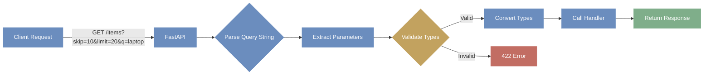

# Day 2: Request Handling & Data Input

**Date**: Week 3, Day 2  
**Phase**: 2 - FastAPI Mastery  
**Topic**: Query Parameters, Request Body, Headers, Cookies, Forms, and File Uploads

---

## Table of Contents

1. [Query Parameters](#query-parameters)
2. [Request Body with Pydantic](#request-body-with-pydantic)
3. [Combining Multiple Parameter Types](#combining-multiple-parameter-types)
4. [Headers](#headers)
5. [Cookies](#cookies)
6. [Form Data](#form-data)
7. [File Uploads](#file-uploads)
8. [Complete Practical Examples](#complete-practical-examples)

---

## Query Parameters

Query parameters are key-value pairs that appear after the `?` in a URL. They're used to filter, sort, paginate, or modify the behavior of an endpoint.

### Understanding Query Parameters

```
Example URL: http://api.example.com/items?skip=0&limit=10&q=laptop&sort=price

Breaking it down:
- Base URL: http://api.example.com/items
- Query string starts with: ?
- Parameters separated by: &
- Parameter format: key=value

Parameters:
- skip=0
- limit=10
- q=laptop
- sort=price
```

### Basic Query Parameters

```python
from fastapi import FastAPI

app = FastAPI()

@app.get("/items")
async def read_items(skip: int = 0, limit: int = 10):
    """
    Basic query parameters with default values.

    URL examples:
    - /items → skip=0, limit=10 (uses defaults)
    - /items?skip=5 → skip=5, limit=10
    - /items?limit=20 → skip=0, limit=20
    - /items?skip=10&limit=50 → skip=10, limit=50

    The type hints tell FastAPI:
    - Convert query params to integers
    - Validate they are valid integers
    - Use default values if not provided
    """
    return {
        "skip": skip,
        "limit": limit,
        "message": f"Showing items {skip} to {skip + limit}"
    }
```

**How it works**:

1. FastAPI sees function parameters without special decorators
2. These aren't path parameters (not in the URL path)
3. Therefore, they're treated as query parameters
4. Type hints provide automatic validation and conversion

### Optional Query Parameters

```python
from typing import Optional

@app.get("/search")
async def search(q: Optional[str] = None):
    """
    Optional query parameter.

    URL examples:
    - /search → q=None (no query provided)
    - /search?q=laptop → q="laptop"
    - /search?q= → q="" (empty string)

    Optional[str] means:
    - The parameter can be a string OR None
    - If not provided, defaults to None
    """
    if q:
        # Simulate database search
        results = [
            {"id": 1, "name": f"Product matching {q}"},
            {"id": 2, "name": f"Another {q} product"}
        ]
        return {
            "query": q,
            "results": results,
            "count": len(results)
        }

    return {
        "message": "No query provided",
        "hint": "Try /search?q=laptop"
    }
```

**Python 3.10+ Syntax**:

```python
# Python 3.10+ allows this simpler syntax
@app.get("/search")
async def search(q: str | None = None):
    """Same as Optional[str] = None"""
    if q:
        return {"query": q}
    return {"message": "No query"}
```

### Required Query Parameters

```python
@app.get("/users/search")
async def search_users(username: str):
    """
    Required query parameter (no default value).

    URL examples:
    - /users/search?username=alice → ✓ Works
    - /users/search → ✗ Returns 422 error

    FastAPI returns a validation error if the parameter is missing.
    """
    return {
        "username": username,
        "message": f"Searching for user: {username}"
    }

# Better approach with explicit requirement
from fastapi import Query

@app.get("/users/search-v2")
async def search_users_v2(username: str = Query(...)):
    """
    Using Query(...) makes the requirement explicit.
    The ... (Ellipsis) means "required, no default"
    """
    return {
        "username": username,
        "message": f"Searching for user: {username}"
    }
```

### Multiple Query Parameters

```python
@app.get("/products")
async def get_products(
    category: str,
    min_price: float = 0,
    max_price: float = 1000,
    in_stock: bool = True,
    sort_by: str = "name"
):
    """
    Multiple query parameters with different types.

    URL example:
    /products?category=electronics&min_price=100&max_price=500&in_stock=true&sort_by=price

    Type conversion:
    - category → str (no conversion needed)
    - min_price → float (converted from string)
    - max_price → float (converted from string)
    - in_stock → bool (converted from string)
    - sort_by → str (no conversion needed)

    Boolean conversion:
    - "true", "True", "1", "yes", "on" → True
    - "false", "False", "0", "no", "off" → False
    """
    # Simulate filtering
    products = [
        {
            "id": 1,
            "name": "Laptop",
            "category": category,
            "price": 800,
            "in_stock": True
        }
    ]

    return {
        "category": category,
        "price_range": {"min": min_price, "max": max_price},
        "in_stock_only": in_stock,
        "sort_by": sort_by,
        "products": products,
        "count": len(products)
    }
```

### Query Parameter Validation with Query()

The `Query()` class provides powerful validation capabilities:

```python
from fastapi import Query

@app.get("/items/advanced")
async def read_items_advanced(
    # String validation
    q: str = Query(
        None,
        min_length=3,
        max_length=50,
        regex="^[a-zA-Z0-9_-]+$"
    ),

    # Numeric validation
    skip: int = Query(0, ge=0, le=1000),  # ge = greater than or equal
    limit: int = Query(10, gt=0, le=100),  # gt = greater than, le = less than or equal

    # String with description
    sort: str = Query(
        "created_at",
        description="Field to sort by",
        example="name"
    )
):
    """
    Advanced query parameter validation.

    Validation rules:
    - q: 3-50 characters, alphanumeric with _ and -
    - skip: 0 to 1000
    - limit: 1 to 100 (must be positive)
    - sort: Any string, with description for docs

    URL examples:
    - /items/advanced?q=laptop&skip=10&limit=20&sort=price → ✓
    - /items/advanced?q=ab → ✗ (too short)
    - /items/advanced?skip=-5 → ✗ (negative not allowed)
    - /items/advanced?limit=0 → ✗ (must be > 0)
    """
    return {
        "q": q,
        "skip": skip,
        "limit": limit,
        "sort": sort
    }
```

**Query() Parameters**:

- `default`: Default value (or `...` for required)
- `min_length`, `max_length`: String length constraints
- `regex`: Pattern matching for strings
- `gt`, `ge`, `lt`, `le`: Numeric comparisons
- `description`: Documentation string
- `example`: Example value for docs
- `deprecated`: Mark parameter as deprecated
- `alias`: Alternative parameter name

### Query Parameter Lists

```python
from typing import List

@app.get("/items/filter")
async def filter_items(
    tags: List[str] = Query(None)
):
    """
    Accept multiple values for the same parameter.

    URL examples:
    - /items/filter?tags=electronics&tags=sale&tags=new
      → tags = ["electronics", "sale", "new"]
    - /items/filter?tags=electronics
      → tags = ["electronics"]
    - /items/filter
      → tags = None
    """
    if tags:
        return {
            "tags": tags,
            "count": len(tags),
            "message": f"Filtering by tags: {', '.join(tags)}"
        }

    return {"message": "No tags provided"}

# With validation
@app.get("/items/filter-validated")
async def filter_items_validated(
    tags: List[str] = Query(
        None,
        min_length=1,      # Each tag must be at least 1 char
        max_length=20,     # Each tag max 20 chars
        description="Filter by tags"
    )
):
    """
    Query parameter list with validation.
    Each item in the list is validated individually.
    """
    return {"tags": tags}
```

### Query Parameter Examples for Documentation

```python
@app.get("/search/products")
async def search_products(
    q: str = Query(
        ...,
        title="Query string",
        description="Search query for products",
        min_length=3,
        max_length=100,
        example="laptop gaming"
    ),
    price_min: float = Query(
        0,
        ge=0,
        description="Minimum price filter",
        example=100.0
    ),
    price_max: float = Query(
        10000,
        ge=0,
        description="Maximum price filter",
        example=2000.0
    )
):
    """
    These examples appear in the interactive documentation (/docs).
    They help users understand how to use your API.
    """
    return {
        "query": q,
        "price_range": {"min": price_min, "max": price_max}
    }
```

### Complete Query Parameters Example



```python
@app.get("/items/comprehensive")
async def comprehensive_search(
    # Required parameter
    category: str = Query(..., description="Product category"),

    # Optional with default
    q: Optional[str] = Query(None, min_length=3, max_length=50),

    # Numeric range
    min_price: float = Query(0, ge=0),
    max_price: float = Query(10000, ge=0),

    # Boolean
    in_stock: bool = Query(True),

    # Pagination
    skip: int = Query(0, ge=0),
    limit: int = Query(10, ge=1, le=100),

    # Sorting
    sort_by: str = Query("created_at", regex="^(name|price|created_at)$"),
    sort_order: str = Query("asc", regex="^(asc|desc)$"),

    # Tags (list)
    tags: List[str] = Query(None)
):
    """
    Comprehensive example combining all query parameter features.

    Example URL:
    /items/comprehensive?category=electronics&q=laptop&min_price=500&max_price=2000
    &in_stock=true&skip=0&limit=20&sort_by=price&sort_order=desc
    &tags=gaming&tags=portable
    """
    return {
        "filters": {
            "category": category,
            "query": q,
            "price_range": {"min": min_price, "max": max_price},
            "in_stock": in_stock,
            "tags": tags
        },
        "pagination": {
            "skip": skip,
            "limit": limit
        },
        "sorting": {
            "field": sort_by,
            "order": sort_order
        }
    }
```

---

## Request Body with Pydantic

Request bodies are used to send data to the server, typically with POST, PUT, and PATCH requests. FastAPI uses Pydantic models to validate and parse JSON request bodies.

### Why Pydantic?

```python
# Without Pydantic (manual validation)
@app.post("/items/manual")
async def create_item_manual(data: dict):
    # Manual validation - tedious and error-prone!
    if "name" not in data:
        return {"error": "name is required"}
    if not isinstance(data["name"], str):
        return {"error": "name must be a string"}
    if len(data["name"]) < 1:
        return {"error": "name cannot be empty"}
    if "price" not in data:
        return {"error": "price is required"}
    if not isinstance(data["price"], (int, float)):
        return {"error": "price must be a number"}
    if data["price"] <= 0:
        return {"error": "price must be positive"}
    # ... 50 more lines of validation ...

    return data

# With Pydantic - automatic validation!
from pydantic import BaseModel, Field

class Item(BaseModel):
    name: str = Field(..., min_length=1)
    price: float = Field(..., gt=0)

@app.post("/items/pydantic")
async def create_item_pydantic(item: Item):
    # 'item' is guaranteed to be valid!
    # No manual validation needed
    return item
```

### Basic Pydantic Model

```python
from pydantic import BaseModel

class Item(BaseModel):
    name: str
    description: str | None = None
    price: float
    tax: float | None = None

@app.post("/items")
async def create_item(item: Item):
    """
    Accept JSON body matching the Item model.

    Request body example:
    {
        "name": "Laptop",
        "description": "Gaming laptop",
        "price": 999.99,
        "tax": 79.99
    }

    What FastAPI does:
    1. Validates JSON structure matches Item model
    2. Validates each field's type
    3. Converts types if needed
    4. Creates an Item instance
    5. Passes it to your function
    """
    # Access model fields
    item_dict = item.model_dump()

    if item.tax:
        price_with_tax = item.price + item.tax
        item_dict["price_with_tax"] = price_with_tax

    return item_dict
```

**Pydantic Model Features**:

- Automatic type validation
- Type conversion (e.g., string "123" → int 123)
- Default values
- Optional fields
- Nested models
- Validation errors with detailed messages

### Field Validation with Field()

```python
from pydantic import BaseModel, Field

class Item(BaseModel):
    name: str = Field(
        ...,  # Required (no default)
        min_length=1,
        max_length=100,
        description="Item name",
        example="Laptop"
    )

    description: str | None = Field(
        None,  # Optional with default None
        max_length=500,
        description="Item description"
    )

    price: float = Field(
        ...,  # Required
        gt=0,  # Greater than 0
        le=1000000,  # Less than or equal to 1 million
        description="Item price in USD",
        example=999.99
    )

    quantity: int = Field(
        default=1,
        ge=1,  # Greater than or equal to 1
        le=10000,
        description="Available quantity"
    )

    tags: list[str] = Field(
        default_factory=list,  # Empty list if not provided
        max_length=5,  # Max 5 tags
        description="Product tags"
    )

@app.post("/items/validated")
async def create_validated_item(item: Item):
    """
    All validation happens automatically!

    Valid request:
    {
        "name": "Laptop",
        "price": 999.99
    }

    Invalid requests return 422 with details:
    - name too short → error
    - price negative → error
    - quantity = 0 → error
    - More than 5 tags → error
    """
    return item
```

**Field() Parameters**:

- `default`: Default value
- `default_factory`: Function to generate default (for mutable defaults)
- `min_length`, `max_length`: String/list length
- `gt`, `ge`, `lt`, `le`: Numeric comparisons
- `regex`: Pattern matching
- `description`: Documentation
- `example`: Example value
- `deprecated`: Mark as deprecated

### Nested Pydantic Models

```python
from typing import List
from pydantic import BaseModel, Field

class Image(BaseModel):
    url: str = Field(..., description="Image URL")
    name: str = Field(..., description="Image name")

class Tag(BaseModel):
    name: str = Field(..., min_length=1, max_length=20)
    color: str = Field(..., regex="^#[0-9A-Fa-f]{6}$")  # Hex color

class Item(BaseModel):
    name: str
    description: str | None = None
    price: float = Field(..., gt=0)
    images: List[Image] | None = None
    tags: List[Tag] = Field(default_factory=list)

@app.post("/items/nested")
async def create_item_with_nested(item: Item):
    """
    Nested models for complex data structures.

    Request body example:
    {
        "name": "Laptop",
        "price": 999.99,
        "images": [
            {"url": "http://example.com/img1.jpg", "name": "Front"},
            {"url": "http://example.com/img2.jpg", "name": "Side"}
        ],
        "tags": [
            {"name": "gaming", "color": "#FF0000"},
            {"name": "portable", "color": "#00FF00"}
        ]
    }

    FastAPI validates:
    - Item structure
    - Each image structure
    - Each tag structure
    - All field constraints
    """
    return {
        "item": item,
        "image_count": len(item.images) if item.images else 0,
        "tag_count": len(item.tags)
    }
```

### Model Inheritance

```python
class ItemBase(BaseModel):
    """Base model with common fields"""
    name: str = Field(..., min_length=1, max_length=100)
    description: str | None = None
    price: float = Field(..., gt=0)

class ItemCreate(ItemBase):
    """For creating items - no ID"""
    tags: List[str] = Field(default_factory=list)

class ItemUpdate(ItemBase):
    """For updating items - all fields optional"""
    name: str | None = None
    description: str | None = None
    price: float | None = None
    tags: List[str] | None = None

class ItemInDB(ItemBase):
    """For database - includes ID and timestamps"""
    id: int
    created_at: str
    updated_at: str

@app.post("/items/create", response_model=ItemInDB)
async def create_item_inherited(item: ItemCreate):
    """
    Using different models for different purposes.

    ItemCreate: Used for input (no id, timestamps)
    ItemInDB: Used for output (includes id, timestamps)
    """
    from datetime import datetime

    # Simulate database insert
    item_in_db = ItemInDB(
        **item.model_dump(),
        id=1,
        created_at=datetime.now().isoformat(),
        updated_at=datetime.now().isoformat()
    )

    return item_in_db
```

### Model Configuration

```python
from pydantic import BaseModel, ConfigDict

class Item(BaseModel):
    """Model with custom configuration"""
    model_config = ConfigDict(
        # Allow extra fields (ignore unknown fields)
        extra='ignore',

        # Validate on assignment (not just on creation)
        validate_assignment=True,

        # Use enum values instead of enum instances
        use_enum_values=True,

        # Populate models from ORM objects
        from_attributes=True
    )

    name: str
    price: float

@app.post("/items/configured")
async def create_configured_item(item: Item):
    """
    Model configuration affects validation behavior.

    With extra='ignore':
    {
        "name": "Laptop",
        "price": 999.99,
        "unknown_field": "ignored"  ← This is ignored, not an error
    }
    """
    return item
```

### Working with Request Body Data

```python
@app.post("/items/process")
async def process_item(item: Item):
    """Different ways to work with Pydantic models"""

    # 1. Access fields directly
    name = item.name
    price = item.price

    # 2. Convert to dictionary
    item_dict = item.model_dump()
    # Returns: {"name": "...", "price": ..., ...}

    # 3. Convert to dictionary excluding None values
    item_dict_no_none = item.model_dump(exclude_none=True)

    # 4. Convert to dictionary excluding certain fields
    item_dict_partial = item.model_dump(exclude={"description"})

    # 5. Convert to dictionary including only certain fields
    item_dict_selected = item.model_dump(include={"name", "price"})

    # 6. Convert to JSON string
    item_json = item.model_dump_json()

    return {
        "direct_access": {"name": name, "price": price},
        "as_dict": item_dict,
        "no_none": item_dict_no_none,
        "partial": item_dict_partial,
        "selected": item_dict_selected,
        "as_json": item_json
    }
```

---

## Combining Multiple Parameter Types (FastAPI)

## How FastAPI Decides _Where_ a Parameter Comes From

FastAPI infers parameter sources **from the function signature**, not from decorators.

### The decision rules (in order)

1. **Path parameters**

   - Parameter name appears in the route path
   - Example: `/items/{item_id}` → `item_id`

2. **Request body**

   - Parameter type is a Pydantic model
   - Or explicitly wrapped with `Body(...)`

3. **Query parameters**

   - Scalar types (`int`, `str`, `bool`, etc.)
   - Have a default value (including `None`)
   - Not part of the path

These rules are deterministic and consistent.

---

## Path + Query + Body

```python
@app.put("/items/{item_id}")
async def update_item(
    item_id: int,          # Path parameter
    item: Item,            # Request body (Pydantic model)
    q: str | None = None   # Query parameter
):
    """
    URL:
      PUT /items/5?q=search_term

    Body:
      {
        "name": "Updated Item",
        "price": 150.0
      }
    """
```

### Why FastAPI interprets this correctly

- `item_id`
  → Appears in the URL path → **path parameter**

- `item: Item`
  → Pydantic model → **request body**

- `q: str | None = None`
  → Scalar type + default value → **query parameter**

---

## Multiple Body Parameters

FastAPI allows **multiple request body models** in a single endpoint.

```python
@app.post("/items/assign")
async def assign_item_to_user(
    item: Item,
    user: User
):
    """
    Request body:
    {
        "item": {
            "name": "Laptop",
            "price": 999.99
        },
        "user": {
            "username": "alice",
            "email": "alice@example.com"
        }
    }
    """
```

### How FastAPI handles this

- Each Pydantic model becomes a **named key** in the JSON body
- This avoids ambiguity
- OpenAPI schema is generated correctly
- Validation is applied independently to each model

---

## Path + Body + Query (Complex Endpoints)

```python
@app.put("/users/{user_id}/items/{item_id}")
async def update_user_item(
    user_id: int,          # Path parameter
    item_id: int,          # Path parameter
    item: Item,            # Request body
    q: str | None = None,  # Query parameter
    active: bool = True    # Query parameter
):
    """
    URL:
      PUT /users/10/items/5?q=laptop&active=true

    Body:
      {
        "name": "Updated Laptop",
        "price": 1200.0
      }
    """
```

### Parameter breakdown

- `user_id`, `item_id` → path parameters
- `item` → request body
- `q`, `active` → query parameters

FastAPI merges all of this into a single validated request.

---

## Singular Values in the Request Body

By default, **scalar values become query parameters**.

Use `Body(...)` to force them into the request body.

```python
@app.put("/items/{item_id}/priority")
async def set_item_priority(
    item_id: int,
    priority: int = Body(...)
):
    """
    Request body:
    {
        "priority": 5
    }
    """
```

### Why `Body(...)` is required here

- `priority` is a scalar type (`int`)
- Without `Body(...)`, FastAPI would treat it as a query parameter
- `Body(...)` explicitly marks it as part of the request body

---

## Multiple Scalar Values in the Body

```python
@app.post("/items/calculate")
async def calculate_item(
    quantity: int = Body(...),
    unit_price: float = Body(...),
    tax_rate: float = Body(0.1)
):
    """
    Request body:
    {
        "quantity": 10,
        "unit_price": 99.99,
        "tax_rate": 0.15
    }
    """
```

### Key points

- Each `Body(...)` value becomes a JSON key
- Defaults still work (`tax_rate`)
- Full validation is applied
- OpenAPI schema remains accurate

---

## Mental Model (Very Important)

Think in this order when reading an endpoint:

1. **Is it in the URL path?**
   → Path parameter

2. **Is it a Pydantic model or wrapped in `Body()`?**
   → Request body

3. **Is it a scalar with a default value?**
   → Query parameter

This mental model scales cleanly from simple APIs to complex production systems.

---

## Practical Guidelines

- Use **path parameters** to identify resources
- Use **query parameters** for filtering, sorting, flags
- Use **request body** for structured or large input
- Use `Body(...)` when sending single values in JSON
- Let FastAPI infer whenever possible — override only when needed

---

## Headers

### What Headers Are

HTTP headers are **metadata** sent with an HTTP request or response.

They are commonly used for:

- Authentication (`Authorization`)
- Client information (`User-Agent`)
- Content negotiation (`Accept`, `Accept-Language`)
- Request tracing (`X-Request-ID`)
- API keys and tokens

FastAPI treats headers as **validated inputs**, similar to query or body parameters.

---

### Reading Request Headers

```python
from fastapi import Header

@app.get("/items/headers")
async def read_headers(
    user_agent: str | None = Header(None)
):
    """
    Reads the User-Agent request header.
    """
    return {"User-Agent": user_agent}
```

#### How FastAPI Identifies Headers

- The parameter uses `Header(...)`
- FastAPI extracts the value from HTTP headers
- Type conversion and validation happen automatically

---

### Header Name Conversion

HTTP headers use **kebab-case**, while Python uses **snake_case**.
FastAPI converts between them automatically.

```python
@app.get("/headers/conversion")
async def header_conversion(
    user_agent: str | None = Header(None),
    x_token: str | None = Header(None),
    accept_language: str | None = Header(None)
):
    return {
        "user_agent": user_agent,
        "x_token": x_token,
        "accept_language": accept_language
    }
```

#### Automatic Conversion Rules

| HTTP Header       | Python Parameter  |
| ----------------- | ----------------- |
| `User-Agent`      | `user_agent`      |
| `X-Token`         | `x_token`         |
| `Accept-Language` | `accept_language` |
| `Content-Type`    | `content_type`    |

#### Why This Works

- Python identifiers cannot contain `-`
- FastAPI maps `_` ↔ `-` transparently

---

### Custom Header Names

Use `alias` when you need **exact control** over the header name.

```python
@app.get("/headers/custom")
async def read_custom_headers(
    custom_header: str | None = Header(None, alias="X-Custom-Header"),
    weird_header: str | None = Header(None, alias="Weird.Header-Name")
):
    return {
        "custom_header": custom_header,
        "weird_header": weird_header
    }
```

#### When to Use `alias`

- Header names with dots (`.`)
- Non-standard or legacy headers
- Strict API contracts

---

### Required Headers

A header becomes required when `Header(...)` (ellipsis) is used.

```python
@app.get("/protected")
async def protected_route(
    authorization: str = Header(...)
):
    if not authorization.startswith("Bearer "):
        return {"error": "Invalid authorization format"}

    token = authorization.replace("Bearer ", "")
    return {"message": "Access granted", "token": token}
```

#### Behavior

- Missing header → **422 Validation Error**
- Header present → injected into function
- Validation occurs **before** endpoint logic

---

### Reading Multiple Headers

```python
@app.get("/headers/multiple")
async def read_multiple_headers(
    user_agent: str | None = Header(None),
    accept: str | None = Header(None),
    accept_language: str | None = Header(None),
    accept_encoding: str | None = Header(None),
    authorization: str | None = Header(None),
    x_request_id: str | None = Header(None)
):
    return {
        "user_agent": user_agent,
        "accept": accept,
        "accept_language": accept_language,
        "accept_encoding": accept_encoding,
        "authorization": authorization,
        "request_id": x_request_id
    }
```

#### Common Use Cases

- `Authorization` → authentication
- `Accept`, `Accept-Language` → content negotiation
- `X-Request-ID` → request tracking
- `User-Agent` → client identification

---

### Header Validation

Headers support the **same validation features** as request bodies.

```python
@app.get("/api/resource")
async def get_resource(
    api_key: str = Header(
        ...,
        min_length=32,
        max_length=32,
        regex="^[A-Za-z0-9]{32}$",
        description="API key for authentication"
    )
):
    return {
        "message": "Access granted",
        "api_key": api_key[:8] + "..." + api_key[-4:]
    }
```

#### What FastAPI Enforces

- Header presence
- Length constraints
- Pattern matching
- OpenAPI documentation

Invalid headers never reach your business logic.

---

### Duplicate Headers

Some headers may appear **multiple times** in a request.

```python
from typing import List

@app.get("/headers/duplicate")
async def read_duplicate_headers(
    x_token: List[str] | None = Header(None)
):
    if x_token:
        return {
            "tokens": x_token,
            "count": len(x_token)
        }
    return {"message": "No tokens provided"}
```

#### Behavior

- Multiple headers → list of values
- Single header → one-item list
- Missing header → `None`

---

### Mental Model

- `Header(...)` extracts request headers
- `_` in Python ↔ `-` in HTTP
- `alias` gives exact header control
- Validation runs before endpoint logic
- Repeated headers map to lists

---

## Cookies

Cookies are small key–value pairs stored on the client and automatically sent with HTTP requests that match specific **scope rules** (domain, path, protocol, and security flags). They are most commonly used for authentication, session management, and user preferences.

---

### How Cookies Are Sent (Important for Backend)

A cookie is sent **only if all of these match**:

- **Domain**: Request domain matches the cookie’s domain
- **Path**: Request path starts with the cookie’s path
- **Protocol**: `Secure` cookies are sent only over HTTPS
- **SameSite policy**: Controls cross-site requests

This is the most common source of “cookie not being sent” bugs.

---

### Reading Cookies in FastAPI

```python
from fastapi import Cookie

@app.get("/items/cookies")
async def read_cookies(
    session_id: str | None = Cookie(None)
):
    if session_id:
        return {
            "session_id": session_id,
            "message": "Session found"
        }
    return {"message": "No session cookie"}
```

#### Backend Notes

- Cookies are read from the `Cookie` HTTP header
- FastAPI automatically parses cookies into parameters
- Optional cookies default to `None` if missing
- Type conversion happens automatically

---

### Required Cookies

```python
@app.get("/dashboard")
async def dashboard(
    session_token: str = Cookie(...)
):
    return {
        "message": "Welcome to dashboard",
        "session": session_token
    }
```

#### What Happens Internally

- FastAPI checks for cookie presence **before** executing endpoint logic
- Missing cookie → **422 Validation Error**
- Useful for protected routes that require authentication

---

### Reading Multiple Cookies

```python
@app.get("/cookies/multiple")
async def read_multiple_cookies(
    session_id: str | None = Cookie(None),
    user_id: str | None = Cookie(None),
    preferences: str | None = Cookie(None)
):
    return {
        "session_id": session_id,
        "user_id": user_id,
        "preferences": preferences
    }
```

#### Real-World Usage

- `session_id` → authentication/session lookup
- `user_id` → quick identification (often redundant but common)
- `preferences` → UI state (theme, language)

---

### Cookie Scope: Domain and Path (Very Important)

Cookie **scope** decides _when the browser is allowed to send a cookie_.
If the scope does not match the request, the cookie **exists in the browser** but is **silently not sent** to the backend. This is one of the most common real-world backend bugs.

Scope is mainly controlled by **Domain** and **Path**.

---

#### Domain Rules (Which host can receive the cookie)

When a server sets a cookie, it is tied to a **domain**.

```http
Set-Cookie: session_id=abc123; Domain=example.com
```

This cookie will be sent to:

- `example.com`
- `www.example.com`
- `api.example.com`
- `admin.example.com`

Because all of them are **subdomains of `example.com`**.

---

```http
Set-Cookie: session_id=abc123; Domain=api.example.com
```

This cookie will be sent to:

- `api.example.com`

But **NOT** sent to:

- `example.com`
- `www.example.com`

---

##### Why this matters in real applications

Typical setup:

- Frontend → `www.example.com`
- Backend API → `api.example.com`

If you set:

```http
Domain=api.example.com
```

- Browser sends cookie to API ✔
- Browser does **not** send cookie to frontend ❌

If your frontend needs to read or forward cookies, you usually want:

```http
Domain=example.com
```

---

##### Local development example

- Frontend → `localhost:3000`
- Backend → `localhost:8000`

Both share the same domain: `localhost`

So cookies **can work**, but only if:

- Domain is not overridden incorrectly
- Frontend sends `credentials: "include"`

---

#### Path Rules (Which URLs can receive the cookie)

The `path` defines **URL prefix matching**.

```http
Set-Cookie: session_id=abc123; Path=/api
```

Cookie is sent for requests to:

- `/api`
- `/api/users`
- `/api/items/1`

Cookie is **NOT** sent for:

- `/login`
- `/auth/login`
- `/`

---

##### Why path exists

Path allows **scoping cookies to parts of the app**:

- `/auth` → authentication cookies
- `/admin` → admin-only cookies
- `/api` → backend-only cookies

This improves security but causes confusion if misused.

---

#### Common Real-World Bug (Very Common)

##### What happens

1. User logs in at:

   ```
   POST /login
   ```

2. Server sets cookie:

   ```http
   Set-Cookie: session_id=abc123; Path=/login
   ```

3. Frontend calls API:

   ```
   GET /api/profile
   ```

❌ Cookie is **not sent**

---

##### Why it breaks

- Cookie path is `/login`
- Request path is `/api/profile`
- `/api/profile` does **not start with** `/login`

Browser blocks the cookie.

---

##### Correct Fix

Always set cookies at the root unless you have a strong reason not to:

```python
response.set_cookie(
    key="session_id",
    value="abc123",
    path="/"
)
```

This makes the cookie available to **all routes**.

---

#### Rule of Thumb (Easy to Remember)

- **Domain** → “Which site can see this cookie?”
- **Path** → “Which URLs can use this cookie?”

If either does not match → cookie is **not sent**

---

#### Backend Best Practice

For most applications:

```text
Domain = main domain (example.com or localhost)
Path   = /
```

Only restrict domain or path when:

- You fully understand the impact
- You want isolation for security reasons

---

#### Debug Tip (Very Practical)

If a cookie exists in browser storage but is not sent:

1. Open DevTools → Application → Cookies
2. Check:

   - Domain
   - Path

3. Compare with request URL
4. If prefix does not match → that is the bug

This single check saves hours of debugging.

### Cookie Validation

Cookie validation should happen in **layers**. Each layer catches a different class of problems and keeps your backend secure, predictable, and easier to debug.

Below is a practical example followed by a clear breakdown of _what is validated where_ and _why each layer exists_.

---

#### Example: Validating a Session Cookie

```python
import uuid
from fastapi import Cookie

@app.get("/validate-session")
async def validate_session(
    session_token: str = Cookie(
        ...,
        min_length=36,
        max_length=36,
        description="Session UUID token"
    )
):
    try:
        # Application-level validation
        uuid_obj = uuid.UUID(session_token)

        return {
            "message": "Valid session",
            "session_id": str(uuid_obj)
        }

    except ValueError:
        return {
            "error": "Invalid session token format"
        }
```

This endpoint ensures that:

- A cookie **exists**
- The cookie has the **expected shape**
- The value is **semantically meaningful**

---

### Validation Layers (Very Important Concept)

Validation is not a single step. It happens in **three distinct layers**, each with a different responsibility.

---

#### 1. FastAPI Layer — Presence & Extraction

Handled by:

```python
session_token: str = Cookie(...)
```

What FastAPI does here:

- Extracts `session_token` from the `Cookie` header
- Ensures the cookie **is present**
- Ensures it can be parsed as a `str`

If the cookie is missing:

- Request never reaches your function
- FastAPI returns **422 Validation Error**

This protects your logic from dealing with missing input.

---

#### 2. Pydantic Layer — Shape & Constraints

Handled by:

```python
min_length=36,
max_length=36
```

What this layer validates:

- Cookie has the **expected length**
- Prevents:

  - Empty values
  - Obviously malformed tokens
  - Random short strings

If constraints fail:

- FastAPI returns **422 Validation Error**
- Your function is **not executed**

This is **cheap validation** and should catch most bad input early.

---

#### 3. Application Logic — Semantic Meaning

Handled by:

```python
uuid.UUID(session_token)
```

What this layer validates:

- The string is a **valid UUID**
- Format and structure are correct
- Not just length, but actual meaning

This is where you check **business correctness**, not just shape.

---

### Why Validation Must Be Layered

Each layer answers a different question:

- **FastAPI** → “Is the cookie present?”
- **Pydantic** → “Does it look correct?”
- **Application logic** → “Does it actually mean something?”

Skipping any layer leads to fragile systems.

---

### Real-World Extension: Database Validation

In real applications, UUID validation is still not enough.

Typical flow:

```python
# Pseudo-flow
1. Cookie exists
2. Cookie format is valid
3. Cookie is valid UUID
4. Session exists in database
5. Session is not expired
6. Session belongs to active user
```

Example:

```python
session = db.get_session(session_id)

if not session:
    raise HTTPException(status_code=401, detail="Invalid session")

if session.is_expired:
    raise HTTPException(status_code=401, detail="Session expired")
```

Only after this should the request be trusted.

---

### Common Mistake

```python
# ❌ Bad practice
session_token: str = Cookie(...)
```

And then directly trusting it.

Why this is dangerous:

- Any client can forge cookies
- Length and presence ≠ authenticity
- Always validate against server-side state

---

### Backend Rule of Thumb

- Use **FastAPI** for required/optional checks
- Use **Pydantic** for shape and constraints
- Use **application logic** for truth and authority

Cookies are **claims**, not proof.  
The backend must always verify them.

### Setting Cookies (Server Side)

Cookies are set by the server using the **`Set-Cookie` response header**.
In FastAPI, this is done via the `Response` object.

---

#### Basic Example

```python
from fastapi import Response

@app.post("/login")
async def login(response: Response):
    response.set_cookie(
        key="session_id",
        value="abc123",
        httponly=True,
        secure=True,
        samesite="lax",
        path="/"
    )
    return {"message": "Logged in"}
```

What happens here:

- Server sends a `Set-Cookie` header
- Browser stores the cookie
- Browser automatically sends the cookie back on future requests
- Cookie is included **only when rules (domain, path, flags)** are satisfied

---

### How `set_cookie` Actually Works

Internally, this generates a response header similar to:

```
Set-Cookie: session_id=abc123;
            Path=/;
            HttpOnly;
            Secure;
            SameSite=Lax
```

The browser decides whether to **store** and **send** the cookie based on these attributes.

---

### Cookie Attributes (In Depth)

#### `key` and `value`

```python
key="session_id"
value="abc123"
```

- `key` → cookie name
- `value` → cookie data (usually a session ID or token)
- Keep values:

  - Short
  - Non-sensitive (actual secrets stay on the server)

Never store:

- Passwords
- Personal data
- Permissions

---

#### `HttpOnly`

```python
httponly=True
```

What it does:

- Cookie is **not accessible via JavaScript**
- `document.cookie` cannot read it

Why this matters:

- Protects against **XSS attacks**
- Even if JS is compromised, session cookie is hidden

Backend rule:

- Authentication cookies should **always** be HttpOnly

---

#### `Secure`

```python
secure=True
```

What it does:

- Cookie is sent **only over HTTPS**
- Browser will not send it over plain HTTP

Important in real life:

- Required for production
- Required for `SameSite=None`
- Prevents session leakage on unsecured networks

Local development caveat:

- On `http://localhost`, `secure=True` may prevent cookie from being set
- Common dev setup:

  - `secure=False` locally
  - `secure=True` in production

---

#### `SameSite`

```python
samesite="lax"
```

Controls when cookies are sent in **cross-site requests**.

Options:

##### `SameSite=Strict`

- Cookie sent **only for same-site requests**
- Not sent when navigating from another site
- Very secure, but breaks many flows

Use when:

- Internal dashboards
- Highly sensitive admin actions

---

##### `SameSite=Lax` (Recommended Default)

- Cookie sent on:

  - Same-site requests
  - Top-level navigations (GET links)

- Not sent on:

  - Cross-site POST requests

Why it’s good:

- Protects against most CSRF attacks
- Does not break normal navigation

Best default for:

- Login sessions
- Most web apps

---

##### `SameSite=None`

- Cookie sent on **all cross-site requests**
- Must be used with `Secure=True`

Use only when:

- Frontend and backend are on different domains
- Third-party integrations are required

Example:

- Frontend: `app.example.com`
- Backend: `api.example.com`

---

#### `path`

```python
path="/"
```

Controls **which routes send the cookie**.

- `/` → sent to all routes
- `/api` → only sent to `/api/*`

Why `/` is important:

- Prevents missing-cookie bugs
- Ensures API routes receive the cookie

Common mistake:

- Cookie set at `/login`
- API routes at `/api/*`
- Cookie never sent

---

### Optional but Important Attributes

#### `domain`

```python
domain="example.com"
```

- Controls which subdomains receive the cookie
- If not set → defaults to current domain

Example:

- `domain=example.com` → sent to:

  - `example.com`
  - `api.example.com`

Use carefully:

- Wider domain = larger attack surface

---

#### `max_age` / `expires`

```python
max_age=3600  # seconds
```

- Controls cookie lifetime
- Without it → session cookie (deleted on browser close)

Best practice:

- Short-lived cookies
- Refresh session via rotation

---

### Real-World Login Flow (Backend Perspective)

1. User logs in with credentials
2. Backend validates credentials
3. Backend creates session record in DB
4. Backend sets session cookie with session ID
5. Browser stores cookie
6. Browser automatically sends cookie on future requests
7. Backend validates cookie against DB

The cookie is only an **identifier**, not the session itself.

---

### Production vs Local Development

Common setup:

```python
if ENV == "production":
    secure = True
    samesite = "none"
else:
    secure = False
    samesite = "lax"
```

Why this matters:

- HTTPS required for secure cookies
- Localhost behaves differently
- Avoids “cookie not set” confusion during development

---

### Backend Rule of Thumb

- Always set:

  - `HttpOnly=True`
  - `path="/"`

- Use:

  - `SameSite=Lax` for most apps
  - `Secure=True` in production

- Treat cookies as **untrusted input**

- Validate every request on the server

### Local Development Pitfalls

#### 1. HTTP vs HTTPS

- `Secure=True` cookies are **not sent over HTTP**
- In local dev (`http://localhost`), cookie silently disappears

**Solution**:

```python
secure=False  # Only in local dev
```

---

#### 2. Different Ports = Same Domain (But Tricky)

- `localhost:3000` and `localhost:8000`
- Cookies **are shared by domain**, not port
- But frontend must send credentials

Frontend (fetch / axios):

```js
fetch("http://localhost:8000/api", {
  credentials: "include",
});
```

Backend (FastAPI):

```python
from fastapi.middleware.cors import CORSMiddleware

app.add_middleware(
    CORSMiddleware,
    allow_origins=["http://localhost:3000"],
    allow_credentials=True,
    allow_methods=["*"],
    allow_headers=["*"],
)
```

---

#### 3. SameSite Issues in Local Dev

- `SameSite=None` **requires Secure=True**
- Browser will reject:

  ```
  SameSite=None + Secure=False
  ```

**Local dev recommendation**:

```python
samesite="lax"
secure=False
```

---

### Cookies vs Headers vs Tokens

| Method       | Automatically Sent | Stored Where | Best For           |
| ------------ | ------------------ | ------------ | ------------------ |
| Cookies      | Yes                | Browser      | Sessions, auth     |
| Headers      | No                 | Client code  | APIs, services     |
| LocalStorage | No                 | Browser      | Non-sensitive data |

---

### When to Use Cookies

- Browser-based authentication
- Session-based login systems
- CSRF-protected apps
- Traditional web apps + SPAs

### When Not to Use Cookies

- Mobile-only APIs
- Public APIs
- Token-based microservices

---

### Common Debug Checklist

- Is domain correct?
- Is path set to `/`?
- Is `Secure` blocking local dev?
- Is frontend sending `credentials: "include"`?
- Is `SameSite` compatible?
- Is CORS allowing credentials?

These checks solve **90% of real-world cookie bugs** in backend development.

## Form Data

Form data is used when clients submit data using **HTML forms** or systems that do not send JSON.
It is encoded using:

- `application/x-www-form-urlencoded` (default for forms)
- `multipart/form-data` (used when files are included)

FastAPI distinguishes form data from JSON explicitly using `Form(...)`.

---

### What Form Data Is (Backend Perspective)

- Data is sent as **key–value pairs**
- Values are always received as **strings first**
- FastAPI converts them to target Python types (`int`, `bool`, etc.)
- Validation happens the same way as JSON (types, constraints)

Typical sources:

- Browser `<form>` submissions
- Server-rendered apps
- Legacy systems
- OAuth / login callbacks
- File uploads + metadata

---

### Basic Form Data Handling

```python
from fastapi import Form

@app.post("/login")
async def login(
    username: str = Form(...),
    password: str = Form(...)
):
    """
    Accepts form-encoded data instead of JSON.

    Expected Content-Type:
    application/x-www-form-urlencoded

    Example body:
    username=alice&password=secret
    """
    if username == "alice" and password == "secret":
        return {
            "message": "Login successful",
            "username": username
        }

    return {
        "error": "Invalid credentials"
    }
```

Key points:

- `Form(...)` marks the parameter as coming from the **request body**
- `...` means the field is required
- Without `Form`, FastAPI would treat it as a query parameter

---

### Why `python-multipart` Is Required

```bash
pip install python-multipart
```

Reason:

- FastAPI relies on this library to parse:

  - `application/x-www-form-urlencoded`
  - `multipart/form-data`

- Without it, form requests will fail at runtime

Rule:

- If you use `Form()` or `File()`, you must install `python-multipart`

---

### Multiple Form Fields with Validation

```python
@app.post("/users/register")
async def register_user(
    username: str = Form(..., min_length=3, max_length=20),
    email: str = Form(...),
    password: str = Form(..., min_length=8),
    full_name: str = Form(...),
    age: int = Form(..., ge=18),
    terms_accepted: bool = Form(...)
):
    """
    Registration endpoint using form data.

    All validation rules are enforced by FastAPI + Pydantic.
    """
    return {
        "message": "User registered successfully",
        "user": {
            "username": username,
            "email": email,
            "full_name": full_name,
            "age": age
        }
    }
```

Important details:

- All values arrive as strings → converted automatically
- Validation errors return **422 Unprocessable Entity**
- `bool` values come from:

  - `true`, `on`, `1` → True
  - `false`, `off`, `0` → False

---

### Form Data vs JSON (Critical Difference)

#### JSON Request

```python
@app.post("/items/json")
async def create_item_json(item: Item):
    """
    Content-Type: application/json
    Body: {"name": "Laptop", "price": 999.99}
    """
    return item
```

- Structured data
- Supports nested objects
- Preferred for APIs
- Used by frontend frameworks and mobile apps

---

#### Form Data Request

```python
@app.post("/items/form")
async def create_item_form(
    name: str = Form(...),
    price: float = Form(...)
):
    """
    Content-Type: application/x-www-form-urlencoded
    Body: name=Laptop&price=999.99
    """
    return {
        "name": name,
        "price": price
    }
```

- Flat key–value structure
- No nesting (unless manually encoded)
- Designed for HTML forms

---

### When to Use Form Data

Use **Form Data** when:

- Accepting data from `<form>` submissions
- Supporting server-rendered apps
- Handling file uploads
- Integrating with legacy systems

Use **JSON** when:

- Building APIs
- Using React / Vue / mobile clients
- Sending nested or complex data
- Versioning request schemas

Backend rule:

- Prefer JSON unless you explicitly need form support

---

### Optional Form Fields

```python
@app.post("/contact")
async def contact_form(
    name: str = Form(...),
    email: str = Form(...),
    subject: str = Form("General Inquiry"),
    message: str = Form(...),
    phone: str | None = Form(None)
):
    """
    Mix of required and optional form fields.
    """
    contact_data = {
        "name": name,
        "email": email,
        "subject": subject,
        "message": message
    }

    if phone:
        contact_data["phone"] = phone

    return {
        "message": "Contact form submitted",
        "data": contact_data
    }
```

How optional fields work:

- Default value → field is optional
- `None` → field may be missing
- Missing optional fields do not cause validation errors

---

### Common Backend Pitfalls

**Mistake: Forgetting `Form()`**

```python
def login(username: str):
    ...
```

→ Treated as query parameter, not body

**Mistake: Expecting nested data**

```text
address.street=...
```

→ Form data does not support nesting natively

**Mistake: Mixing JSON and Form**

- One endpoint cannot accept both automatically
- Choose one encoding per endpoint

---

### Backend Rule of Thumb

- Use `Form()` explicitly
- Install `python-multipart`
- Validate aggressively (lengths, ranges)
- Prefer JSON unless HTML forms are required
- Treat form input as untrusted user data

## File Uploads

File uploads in FastAPI are handled using **multipart/form-data**.
This is the same encoding used by browsers when submitting `<input type="file">`.

FastAPI provides two ways to receive files:

- `bytes` → loads entire file into memory
- `UploadFile` → streams file efficiently (recommended)

---

### How File Uploads Work (Backend View)

1. Client sends request with `Content-Type: multipart/form-data`
2. Each file becomes a **separate part** of the request body
3. FastAPI parses the stream using `python-multipart`
4. Files are exposed as `UploadFile` objects

Important:

- File uploads are always **request body**
- They must be explicitly marked using `File(...)`

---

### Single File Upload

```python
from fastapi import File, UploadFile

@app.post("/upload/file")
async def upload_file(
    file: UploadFile = File(...)
):
    """
    Receives one uploaded file.
    """
    contents = await file.read()

    return {
        "filename": file.filename,
        "content_type": file.content_type,
        "size": len(contents)
    }
```

What `UploadFile` gives you:

- `filename` → original client filename
- `content_type` → MIME type sent by client
- `file` → underlying file-like object
- `read()` → async read
- `seek()` → reset pointer
- `close()` → cleanup resources

Why async matters:

- File I/O does not block the event loop
- Safe for high-concurrency servers

---

### `File` vs `UploadFile` (Very Important)

#### Using `File` (bytes)

```python
@app.post("/upload/bytes")
async def upload_bytes(file: bytes = File(...)):
    return {"size": len(file)}
```

Behavior:

- Entire file loaded into memory
- Simple but dangerous for large files

Use only when:

- Files are very small
- You fully trust the client

---

#### Using `UploadFile` (Recommended)

```python
@app.post("/upload/uploadfile")
async def upload_uploadfile(file: UploadFile = File(...)):
    contents = await file.read()
    return {
        "filename": file.filename,
        "size": len(contents)
    }
```

Behavior:

- Stored in memory up to a limit
- Automatically spills to disk
- Much lower memory usage

Backend rule:

- **Always use `UploadFile` unless you have a strong reason not to**

---

### Multiple File Uploads

```python
from typing import List

@app.post("/upload/multiple")
async def upload_multiple_files(
    files: List[UploadFile] = File(...)
):
    file_info = []

    for file in files:
        contents = await file.read()
        file_info.append({
            "filename": file.filename,
            "content_type": file.content_type,
            "size": len(contents)
        })
        await file.seek(0)

    return {
        "count": len(file_info),
        "files": file_info
    }
```

How this works:

- HTML input uses `multiple`
- Each file is sent as a separate part
- FastAPI collects them into a list

Common use cases:

- Image galleries
- Bulk uploads
- Document batches

---

### File Upload with Form Data

```python
from fastapi import Form

@app.post("/upload/with-data")
async def upload_file_with_data(
    file: UploadFile = File(...),
    title: str = Form(...),
    description: str = Form(None),
    tags: list[str] | None = Form(None)
):
    contents = await file.read()

    return {
        "file": {
            "filename": file.filename,
            "size": len(contents)
        },
        "metadata": {
            "title": title,
            "description": description,
            "tags": tags
        }
    }
```

Important details:

- File + form fields must use `multipart/form-data`
- `File()` and `Form()` can coexist
- This is very common in real applications

Typical real-world example:

- Upload profile picture + username
- Upload document + title + tags

---

### File Type Validation

```python
from fastapi import HTTPException

ALLOWED_FILE_TYPES = {
    "image/jpeg",
    "image/png",
    "application/pdf"
}

MAX_FILE_SIZE = 5 * 1024 * 1024  # 5 MB

@app.post("/upload/validated")
async def upload_validated_file(
    file: UploadFile = File(...)
):
    if file.content_type not in ALLOWED_FILE_TYPES:
        raise HTTPException(
            status_code=400,
            detail="File type not allowed"
        )

    contents = await file.read()

    if len(contents) > MAX_FILE_SIZE:
        raise HTTPException(
            status_code=400,
            detail="File too large"
        )

    return {
        "filename": file.filename,
        "size": len(contents)
    }
```

Important backend notes:

- `content_type` is **client-provided**
- Never trust it blindly
- For high-security systems:

  - Inspect file headers
  - Use libraries like `python-magic`

---

### Saving Uploaded Files to Disk

```python
import shutil
from pathlib import Path

UPLOAD_DIR = Path("uploads")
UPLOAD_DIR.mkdir(exist_ok=True)

@app.post("/upload/save")
async def save_uploaded_file(
    file: UploadFile = File(...)
):
    file_path = UPLOAD_DIR / file.filename

    try:
        with file_path.open("wb") as buffer:
            shutil.copyfileobj(file.file, buffer)

        return {
            "filename": file.filename,
            "path": str(file_path)
        }

    finally:
        await file.close()
```

Key points:

- `file.file` is a file-like object
- `shutil.copyfileobj` streams efficiently
- Always close the file
- Sanitize filenames in real apps

---

### Common Backend Mistakes

**Loading large files into memory**

- Avoid `bytes = File(...)`
- Use `UploadFile`

**Trusting filename**

- Client can send `../../etc/passwd`
- Always sanitize or generate new names

**Trusting MIME type**

- Validate file contents, not just headers

**Blocking I/O**

- Avoid heavy synchronous processing inside request

---

### Backend Best Practices Summary

- Use `UploadFile`
- Validate file size and type
- Limit upload size at reverse proxy (NGINX)
- Generate server-side filenames
- Offload storage to S3 or similar for scale
- Never trust client-provided metadata

## Complete Practical Examples

### Example 1: E-commerce Product API

```python
from fastapi import FastAPI, Query, File, UploadFile, Form, Header
from pydantic import BaseModel, Field
from typing import List
from datetime import datetime

app = FastAPI(title="E-commerce Product API")

# Models
class Product(BaseModel):
    name: str = Field(..., min_length=1, max_length=100)
    description: str = Field(..., max_length=1000)
    price: float = Field(..., gt=0)
    category: str
    stock: int = Field(..., ge=0)
    tags: List[str] = Field(default_factory=list)

# In-memory database
products_db = {}
next_id = 1

# List products with filtering and pagination
@app.get("/products")
async def list_products(
    category: str | None = Query(None, description="Filter by category"),
    min_price: float = Query(0, ge=0, description="Minimum price"),
    max_price: float = Query(10000, ge=0, description="Maximum price"),
    in_stock: bool = Query(True, description="Only show in-stock items"),
    search: str | None = Query(None, min_length=2, description="Search query"),
    skip: int = Query(0, ge=0, description="Skip N items"),
    limit: int = Query(10, ge=1, le=100, description="Items per page"),
    sort_by: str = Query("name", regex="^(name|price|stock)$")
):
    """
    List products with comprehensive filtering.

    Example:
    GET /products?category=electronics&min_price=100&max_price=1000&search=laptop&skip=0&limit=20&sort_by=price
    """
    # Filter products (in real app, use database queries)
    filtered = list(products_db.values())

    if category:
        filtered = [p for p in filtered if p["category"] == category]

    if search:
        filtered = [p for p in filtered
                   if search.lower() in p["name"].lower()
                   or search.lower() in p["description"].lower()]

    filtered = [p for p in filtered
               if min_price <= p["price"] <= max_price]

    if in_stock:
        filtered = [p for p in filtered if p["stock"] > 0]

    # Sort
    filtered.sort(key=lambda x: x[sort_by])

    # Paginate
    total = len(filtered)
    products = filtered[skip:skip + limit]

    return {
        "products": products,
        "pagination": {
            "total": total,
            "skip": skip,
            "limit": limit,
            "pages": (total + limit - 1) // limit
        },
        "filters_applied": {
            "category": category,
            "price_range": {"min": min_price, "max": max_price},
            "in_stock": in_stock,
            "search": search
        }
    }

# Create product
@app.post("/products")
async def create_product(
    product: Product,
    x_api_key: str = Header(..., description="API key for authentication")
):
    """
    Create a new product.
    Requires API key authentication.

    Request:
    POST /products
    Headers: X-Api-Key: your-api-key
    Body: {"name": "Laptop", "price": 999.99, ...}
    """
    global next_id

    # Validate API key (simplified)
    if x_api_key != "secret-api-key":
        return {"error": "Invalid API key"}

    product_dict = product.model_dump()
    product_dict["id"] = next_id
    product_dict["created_at"] = datetime.now().isoformat()

    products_db[next_id] = product_dict
    next_id += 1

    return {
        "message": "Product created successfully",
        "product": product_dict
    }

# Upload product image
@app.post("/products/{product_id}/image")
async def upload_product_image(
    product_id: int,
    image: UploadFile = File(...),
    alt_text: str = Form(..., description="Image alt text"),
    is_primary: bool = Form(False, description="Set as primary image")
):
    """
    Upload product image with metadata.

    Form data with file upload.
    """
    if product_id not in products_db:
        return {"error": "Product not found"}

    # Validate image type
    if not image.content_type.startswith("image/"):
        return {"error": "File must be an image"}

    contents = await image.read()

    # In real app: save to cloud storage, resize, etc.

    return {
        "message": "Image uploaded successfully",
        "product_id": product_id,
        "image": {
            "filename": image.filename,
            "content_type": image.content_type,
            "size": len(contents),
            "alt_text": alt_text,
            "is_primary": is_primary
        }
    }
```

### Example 2: User Profile API

```python
from fastapi import FastAPI, Cookie, Form, UploadFile, File
from pydantic import BaseModel, Field, EmailStr
from typing import Optional

app = FastAPI(title="User Profile API")

class UserProfile(BaseModel):
    username: str = Field(..., min_length=3, max_length=20)
    email: EmailStr
    full_name: str
    bio: str | None = Field(None, max_length=500)
    website: str | None = None

# Mock user database
users_db = {}

@app.get("/profile")
async def get_profile(
    session_token: str = Cookie(...)
):
    """
    Get user profile using session cookie.
    """
    # Validate session (simplified)
    if session_token not in users_db:
        return {"error": "Invalid session"}

    return {
        "profile": users_db[session_token]
    }

@app.post("/profile/update")
async def update_profile(
    username: str = Form(...),
    email: str = Form(...),
    full_name: str = Form(...),
    bio: str = Form(None),
    website: str = Form(None),
    avatar: UploadFile = File(None),
    session_token: str = Cookie(...)
):
    """
    Update user profile with form data and optional avatar upload.
    """
    if session_token not in users_db:
        return {"error": "Invalid session"}

    profile = {
        "username": username,
        "email": email,
        "full_name": full_name,
        "bio": bio,
        "website": website
    }

    if avatar:
        contents = await avatar.read()
        profile["avatar"] = {
            "filename": avatar.filename,
            "size": len(contents)
        }

    users_db[session_token] = profile

    return {
        "message": "Profile updated successfully",
        "profile": profile
    }
```

---

## Key Takeaways

### Parameter Types Summary

| Type   | Location         | Decorator             | Example                          |
| ------ | ---------------- | --------------------- | -------------------------------- |
| Path   | URL path         | None                  | `/items/{item_id}`               |
| Query  | URL query string | `Query()`             | `/items?skip=0&limit=10`         |
| Body   | Request body     | Model or `Body()`     | JSON body                        |
| Header | HTTP headers     | `Header()`            | `Authorization: Bearer token`    |
| Cookie | HTTP cookies     | `Cookie()`            | `session_id=abc123`              |
| Form   | Form data        | `Form()`              | `username=alice&password=secret` |
| File   | File upload      | `File()`/`UploadFile` | Multipart form data              |

### When to Use Each

**Query Parameters**: Filtering, sorting, pagination, optional data.  
**Request Body**: Creating/updating resources, complex data structures.  
**Headers**: Authentication, API keys, content negotiation.  
**Cookies**: Session management, user preferences.  
**Form Data**: HTML forms, legacy integrations.  
**File Uploads**: Images, documents, media files.  

### Best Practices

1. **Use type hints** - Automatic validation and documentation
2. **Provide defaults** - Make optional parameters explicit
3. **Validate inputs** - Use `Query()`, `Field()`, etc. for constraints
4. **Document everything** - Add descriptions and examples
5. **Use Pydantic models** - For complex request bodies
6. **Handle errors** - Validate file types, sizes, etc.
7. **Combine wisely** - Use multiple parameter types when needed

---

## What's Next?

Tomorrow (Day 3), we'll learn:

1. **Field Validation** - Deep dive into Pydantic Field() options
2. **Custom Validators** - Write your own validation logic
3. **Exception Handling** - HTTPException and custom error handlers
4. **Request Validation Error** - Understanding validation errors
5. **Advanced Pydantic** - Model configuration and advanced features

---

## Practice Exercises

### Exercise 1: Search API

Create a search endpoint with:

- Query parameters for search term, filters, pagination
- Validate search term length (min 2 chars)
- Support multiple tag filters
- Implement sorting options

### Exercise 2: User Registration

Create registration endpoint with:

- Form data for username, email, password
- Validate email format
- Validate password strength
- Optional profile picture upload
- Return user data (excluding password)

### Exercise 3: Blog Post API

Create blog post endpoints:

- POST with nested Pydantic models (post with embedded author)
- Query parameters for filtering by category, date range
- File upload for featured image
- Headers for authentication

### Exercise 4: Product Upload

Create product upload with:

- Form fields for product details
- Multiple image uploads
- Validate image types and sizes
- Combine with authentication header

---

## Additional Resources

- [FastAPI Request Data](https://fastapi.tiangolo.com/tutorial/body/)
- [Pydantic Documentation](https://docs.pydantic.dev/)
- [HTTP Headers Reference](https://developer.mozilla.org/en-US/docs/Web/HTTP/Headers)
- [File Upload Best Practices](https://fastapi.tiangolo.com/tutorial/request-files/)

---

**Congratulations!** You've completed Day 2 of FastAPI. You now know how to handle all types of request data: query parameters, request bodies, headers, cookies, form data, and file uploads. Tomorrow, we'll dive deep into data validation!
