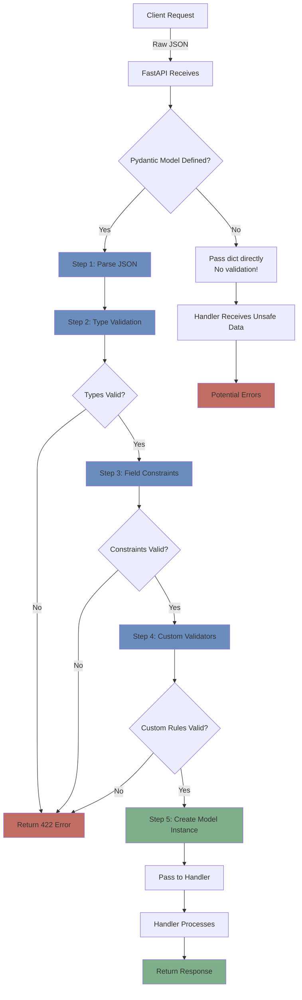

# Day 3: Data Validation & Exception Handling

**Date**: Week 3, Day 3  
**Phase**: 2 - FastAPI Mastery  
**Topic**: Mastering Pydantic Validation and Error Handling

---

## Table of Contents

1. [Understanding Data Validation](#understanding-data-validation)
2. [Field Validation with Field()](#field-validation-with-field)
3. [Custom Validators](#custom-validators)
4. [Model Validators](#model-validators)
5. [Validation Lifecycle](#validation-lifecycle)
6. [Exception Handling in FastAPI](#exception-handling-in-fastapi)
7. [Custom Exception Handlers](#custom-exception-handlers)
8. [Validation Error Responses](#validation-error-responses)
9. [Real-World Validation Patterns](#real-world-validation-patterns)
10. [Complete Practical Examples](#complete-practical-examples)

---

## Understanding Data Validation

### What is Data Validation?

Data validation is the process of ensuring that data meets specific criteria before your application processes it. Think of it as a quality control checkpoint—just like airport security checks passengers and luggage before boarding, data validation checks incoming data before allowing it into your system.

**A real-world analogy:**

Imagine you're running a restaurant:

**Without validation (chaos):**

```
Order received: "I want a burger with -3 pickles, cooked for purple minutes at cold degrees"
Kitchen: "What? How do we cook this?"
Result: Confusion, errors, angry customers
```

**With validation (smooth operation):**

```
Order validation checks:
- Pickles: Must be 0-10 ✓
- Cooking time: Must be 1-30 minutes ✓
- Temperature: Must be "rare", "medium", or "well-done" ✓

Invalid order rejected: "Please provide valid values"
Result: Clear communication, happy kitchen, satisfied customers
```

This is exactly what Pydantic does for your FastAPI application—it validates data before your code processes it.

### Why Validation is Critical

Let's explore the real consequences of skipping validation:

#### 1. Security Vulnerabilities

**SQL Injection Example:**

```python
# WITHOUT VALIDATION - Dangerous!
@app.get("/users")
async def get_users(username: str):
    # User sends: username = "admin' OR '1'='1"
    query = f"SELECT * FROM users WHERE username = '{username}'"
    # Executes: SELECT * FROM users WHERE username = 'admin' OR '1'='1'
    # Returns ALL users - security breach!
    return db.execute(query)

# WITH VALIDATION - Safe!
class UserQuery(BaseModel):
    username: str = Field(..., min_length=3, max_length=20, regex="^[a-zA-Z0-9_]+$")

@app.get("/users")
async def get_users(query: UserQuery = Depends()):
    # username is guaranteed to be alphanumeric
    # SQL injection attempt would be rejected at validation
    query = f"SELECT * FROM users WHERE username = '{query.username}'"
    return db.execute(query)
```

**Impact without validation:**

- Unauthorized data access
- Data theft
- System compromise
- Legal liability

#### 2. Data Corruption

**E-commerce Disaster:**

```python
# WITHOUT VALIDATION
@app.post("/orders")
async def create_order(data: dict):
    # User sends: {"quantity": -5, "price": "free"}
    order = {
        "quantity": data["quantity"],  # -5 stored in database!
        "price": data["price"],         # "free" stored as text!
        "total": data["quantity"] * data["price"]  # TypeError crash!
    }
    save_to_database(order)

# Now your database has:
# - Negative quantities
# - Invalid prices
# - Corrupted totals
# Recovery is expensive and time-consuming!

# WITH VALIDATION
class Order(BaseModel):
    quantity: int = Field(..., ge=1, le=1000)
    price: float = Field(..., gt=0)

    @property
    def total(self) -> float:
        return self.quantity * self.price

@app.post("/orders")
async def create_order(order: Order):
    # Data is guaranteed valid:
    # - quantity is 1-1000
    # - price is positive
    # - total is calculated correctly
    save_to_database(order)
```

**Impact without validation:**

- Corrupted database records
- Incorrect business calculations
- Financial losses
- Customer complaints

#### 3. Application Crashes

**The Cascade Effect:**

```python
# WITHOUT VALIDATION
@app.post("/calculate")
async def calculate(data: dict):
    # User sends: {"value": "not-a-number"}
    result = data["value"] * 2  # TypeError: can't multiply str by int
    # Application crashes!
    # Request fails!
    # User sees "Internal Server Error"
    return {"result": result}

# WITH VALIDATION
class Calculation(BaseModel):
    value: float

@app.post("/calculate")
async def calculate(calc: Calculation):
    # value is guaranteed to be a number
    result = calc.value * 2
    return {"result": result}
```

**Impact without validation:**

- Application downtime
- Poor user experience
- Lost revenue
- Damaged reputation

#### 4. Poor User Experience

**Confusing vs Clear Feedback:**

```python
# WITHOUT VALIDATION - Confusing error
@app.post("/register")
async def register(data: dict):
    user = User(
        email=data["email"],  # User sends: "notanemail"
        age=data["age"]       # User sends: -5
    )
    # Generic error: "Something went wrong"
    # User has no idea what's wrong!

# WITH VALIDATION - Clear feedback
class UserRegistration(BaseModel):
    email: EmailStr
    age: int = Field(..., ge=13, le=120)

@app.post("/register")
async def register(user: UserRegistration):
    # If validation fails, user gets:
    # "email: Invalid email format"
    # "age: Must be between 13 and 120"
    # User knows exactly what to fix!
    pass
```

### The Cost-Benefit Analysis

**Without Validation:**
| Aspect | Impact |
|--------|--------|
| Development Time | 2 hours saved initially |
| Debugging Time | 20+ hours fixing production bugs |
| Security | High vulnerability risk |
| Data Quality | Corrupted database |
| User Experience | Frustrated users |
| **Total Cost** | **Very High** ❌ |

**With Validation:**
| Aspect | Impact |
|--------|--------|
| Development Time | 4 hours upfront investment |
| Debugging Time | 2 hours (minimal issues) |
| Security | Protected against common attacks |
| Data Quality | Clean, consistent data |
| User Experience | Clear, helpful errors |
| **Total Cost** | **Low** ✅ |

**The verdict:** Investing in validation saves time, money, and reputation.

### How Validation Works in FastAPI

FastAPI leverages Pydantic for automatic validation. Here's what happens behind the scenes:



**The validation pipeline:**

1. **JSON Parsing** - Convert raw JSON to Python dict
2. **Type Validation** - Ensure correct data types (str, int, float, etc.)
3. **Field Constraints** - Check Field() rules (min, max, regex, etc.)
4. **Custom Validators** - Run your custom validation functions
5. **Model Creation** - Create validated model instance
6. **Handler Execution** - Your function receives guaranteed-valid data

If ANY step fails, FastAPI returns a detailed 422 error and your handler never runs.

### Validation Guarantees

When your handler function receives a Pydantic model, you have these **guarantees**:

```python
class Product(BaseModel):
    name: str = Field(..., min_length=1, max_length=100)
    price: float = Field(..., gt=0)
    quantity: int = Field(..., ge=0)

@app.post("/products")
async def create_product(product: Product):
    # At this point, you are GUARANTEED:
    # 1. product.name is a string (not None, not int, not list)
    # 2. product.name is 1-100 characters long
    # 3. product.price is a positive number (not negative, not zero)
    # 4. product.quantity is a non-negative integer

    # You can safely do:
    total = product.price * product.quantity  # No type errors!
    name_upper = product.name.upper()  # name is definitely a string!

    # No need for defensive checks like:
    # if isinstance(product.price, (int, float)):  # Already guaranteed!
    # if product.price > 0:  # Already validated!

    return product
```

This is the power of Pydantic + FastAPI: **your handler code can focus on business logic, not validation**.

---

## BaseModel (Pydantic Model Fundamentals)

`BaseModel` is the **foundation of validation, parsing, and serialization** in FastAPI.
If `Field()` defines _rules for individual fields_, `BaseModel` defines the **shape, behavior, and guarantees of the entire data object**.

Think of `BaseModel` as:

> “This is the exact contract my API accepts and produces.”

---

### What Is `BaseModel`?

`BaseModel` comes from **Pydantic** and is used to define structured, validated data models.

```python
from pydantic import BaseModel

class User(BaseModel):
    id: int
    name: str
    email: str
```

What this gives you automatically:

- Type validation
- Type coercion
- Required/optional enforcement
- Clear error messages
- JSON serialization
- OpenAPI schema generation (FastAPI)

---

### How FastAPI Uses BaseModel

FastAPI treats `BaseModel` as:

- **Request body schema**
- **Response schema**
- **Validation layer**
- **Documentation source**

```python
from fastapi import FastAPI

app = FastAPI()

class User(BaseModel):
    name: str
    age: int

@app.post("/users")
async def create_user(user: User):
    return user
```

Request:

```json
{
  "name": "Sanjoy",
  "age": "25"
}
```

Result:

- `"25"` → automatically converted to `int`
- If conversion fails → 422 error

---

### BaseModel as a Data Contract

A `BaseModel` guarantees:

- Fields exist (if required)
- Fields have correct types
- Invalid data never reaches business logic

```python
class Product(BaseModel):
    name: str
    price: float
    in_stock: bool
```

This means:

- `price="free"` ❌ rejected
- `in_stock="yes"` ❌ rejected
- Missing `name` ❌ rejected

Your route logic can **trust the data**.

---

### Required vs Optional Fields in BaseModel

The rules come from:

- Type annotation
- Default value

```python
from typing import Optional

class Item(BaseModel):
    # REQUIRED
    name: str

    # REQUIRED (no default)
    price: float

    # OPTIONAL (has default)
    description: str = "No description"

    # OPTIONAL (can be None)
    notes: Optional[str] = None
```

Key rule:

- **No default → required**
- **Default provided → optional**
- **`Optional[T]` means value may be `None`, not optional by itself**

---

### BaseModel + Field() Together

`BaseModel` defines structure
`Field()` refines validation and metadata

```python
from pydantic import BaseModel, Field

class Product(BaseModel):
    name: str = Field(..., min_length=3)
    price: float = Field(..., gt=0)
    tags: list[str] = Field(default_factory=list)
```

Mental model:

- `BaseModel` → _What fields exist_
- `Field()` → _How each field behaves_

---

### Type Coercion (Very Important)

Pydantic tries to **coerce types safely**.

```python
class Example(BaseModel):
    count: int
    active: bool
```

Input:

```json
{
  "count": "10",
  "active": "true"
}
```

Result:

```python
count == 10
active == True
```

But:

```json
{
  "count": "ten"
}
```

→ ❌ 422 validation error

This is extremely useful for APIs receiving user input.

---

### Nested Models (Real Backend Use Case)

BaseModels can be nested.

```python
class Address(BaseModel):
    state: str
    country: str

class User(BaseModel):
    name: str
    address: Address
```

Request:

```json
{
  "name": "John Doe",
  "address": {
    "state": "Delhi",
    "country": "India"
  }
}
```

Benefits:

- Deep validation
- Clean structure
- No manual parsing

This is **very common** in real APIs.

---

### Lists and Dictionaries in BaseModel

```python
class Order(BaseModel):
    items: list[str]
    metadata: dict[str, str]
```

Validation rules:

- Every element is validated
- Wrong element types are rejected

```json
{
  "items": ["apple", 123]
}
```

→ ❌ invalid (`123` is not `str`)

---

### Model Methods: `.dict()` and `.json()`

```python
user = User(name="Sanjoy", age=25)

user.dict()
# {'name': 'Sanjoy', 'age': 25}

user.json()
# '{"name": "Sanjoy", "age": 25}'
```

Common options:

```python
user.dict(exclude_none=True)
user.dict(exclude={"age"})
```

Used heavily when:

- Saving to DB
- Sending responses
- Calling external APIs

---

### Validation Errors (What Client Sees)

```python
class User(BaseModel):
    age: int
```

Request:

```json
{
  "age": "abc"
}
```

Response:

```json
{
  "detail": [
    {
      "loc": ["body", "age"],
      "msg": "Input should be a valid integer",
      "type": "int_parsing"
    }
  ]
}
```

Why this matters:

- Clear error location
- Easy frontend debugging
- No custom error handling needed

---

### BaseModel Configuration (Advanced but Important)

You can customize model behavior using `Config` / `model_config`.

```python
class User(BaseModel):
    name: str
    age: int

    class Config:
        extra = "forbid"
```

Behavior:

```json
{
  "name": "Sanjoy",
  "age": 25,
  "role": "admin"
}
```

→ ❌ rejected (unexpected field)

Other useful options:

- `extra = "ignore"` → silently drop extra fields
- `validate_assignment = True` → validate on attribute update

---

### Immutability (Read-Only Models)

```python
class User(BaseModel):
    id: int
    name: str

    class Config:
        frozen = True
```

```python
user.name = "New Name"
# ❌ Error
```

Useful for:

- Response models
- Security-sensitive data
- Domain entities

---

### BaseModel in Request vs Response

You can (and should) separate models.

```python
class UserCreate(BaseModel):
    name: str
    password: str

class UserResponse(BaseModel):
    id: int
    name: str
```

Why:

- Never expose sensitive fields
- Clear API contracts
- Easier evolution

---

### BaseModel Best Practices (Backend Perspective)

- One model = one responsibility
- Separate input and output models
- Prefer explicit defaults
- Use `Field()` for constraints
- Use nested models instead of flat dicts
- Trust validated data, not raw input

---

### Mental Model Summary

- **BaseModel** → defines _what data looks like_
- **Field()** → defines _rules for each field_
- **FastAPI** → enforces the model at runtime
- **Your code** → assumes data is already correct

---

## Field Validation with Field()

The `Field()` function is your primary tool for validation. It provides a declarative way to specify constraints on model fields.

### Understanding Field()

`Field()` is imported from Pydantic and used to add metadata and constraints to model fields:

```python
from pydantic import BaseModel, Field

class Example(BaseModel):
    field_name: type = Field(default_value, constraint1=value1, constraint2=value2, ...)
```

**Components:**

- `field_name` - The name of the field (appears in JSON)
- `type` - Python type annotation (str, int, float, bool, etc.)
- `default_value` - Default value, or `...` for required
- `constraints` - Validation rules

**Think of Field() as a contract:**

```python
price: float = Field(..., gt=0, le=1000000)

# This says:
# "I expect a float called 'price'"
# "It's required (no default)"
# "It must be greater than 0"
# "It must be less than or equal to 1,000,000"
# "If any of these are violated, reject the data"
```

### Required vs Optional Fields

Understanding field requirements is fundamental:

```python
from pydantic import BaseModel, Field
from typing import Optional

class Item(BaseModel):
    # REQUIRED - Uses ... (Ellipsis)
    name: str = Field(...)

    # REQUIRED - No default provided
    price: float = Field(gt=0)

    # OPTIONAL - Has default value
    description: str = Field("No description provided")

    # OPTIONAL - Can be None
    notes: Optional[str] = Field(None)

    # OPTIONAL - Python 3.10+ syntax (preferred)
    category: str | None = Field(None)

    # OPTIONAL - Mutable default (use default_factory)
    tags: list[str] = Field(default_factory=list)
```

**Understanding each pattern:**

#### Required with `...`

```python
name: str = Field(...)

# Request WITHOUT name:
POST /items
{
  "price": 99.99
}

# Response: 422 Unprocessable Entity
{
  "detail": [{
    "type": "missing",
    "loc": ["body", "name"],
    "msg": "Field required",
    "input": {"price": 99.99}
  }]
}
```

The `...` (Ellipsis) is Python's way of saying "required, no default". It's clear and explicit.

#### Required without `...`

```python
price: float = Field(gt=0)

# No default value provided = required
# Less clear than using ... explicitly
```

**Recommendation:** Always use `...` for required fields—it's more explicit and self-documenting.

#### Optional with Default Value

```python
description: str = Field("No description provided")

# Request WITHOUT description:
POST /items
{
  "name": "Laptop",
  "price": 999.99
}

# Stored in database:
{
  "name": "Laptop",
  "price": 999.99,
  "description": "No description provided"  # ← Default used
}

# Request WITH description:
POST /items
{
  "name": "Laptop",
  "price": 999.99,
  "description": "Gaming laptop"
}

# Stored in database:
{
  "name": "Laptop",
  "price": 999.99,
  "description": "Gaming laptop"  # ← User value used
}
```

#### Optional with None

```python
notes: str | None = Field(None)

# Can be:
# 1. Not provided → defaults to None
# 2. Explicitly None → None
# 3. A string → that string

POST /items
{
  "name": "Mouse",
  "price": 29.99
  # notes not provided
}
# Result: notes = None

POST /items
{
  "name": "Mouse",
  "price": 29.99,
  "notes": null
}
# Result: notes = None

POST /items
{
  "name": "Mouse",
  "price": 29.99,
  "notes": "Wireless"
}
# Result: notes = "Wireless"
```

#### The Mutable Default Trap

```python
# ❌ WRONG - Dangerous!
class Item(BaseModel):
    tags: list[str] = []  # Same list shared by ALL instances!

# What happens:
item1 = Item(name="Item1", price=10)
item1.tags.append("new")

item2 = Item(name="Item2", price=20)
print(item2.tags)  # ["new"] ← Unexpected! We wanted []

# Why? Because [] is created ONCE when the class is defined
# All instances share the SAME list object

# ✅ CORRECT - Safe!
class Item(BaseModel):
    tags: list[str] = Field(default_factory=list)

# What happens:
item1 = Item(name="Item1", price=10)
item1.tags.append("new")

item2 = Item(name="Item2", price=20)
print(item2.tags)  # [] ← Expected! Fresh list for each instance

# Why? Because default_factory=list CALLS list() for each instance
# Each instance gets its OWN list object
```

**IMPORTANT**

> **Rule:** Never use mutable defaults (list, dict, set) directly. Always use `default_factory`.

### Numeric Constraints

FastAPI provides powerful numeric validation through comparison operators:

```python
from pydantic import BaseModel, Field

class Product(BaseModel):
    # Greater Than (gt) - value must be STRICTLY greater
    price: float = Field(..., gt=0)
    # Valid: 0.01, 1.00, 999.99
    # Invalid: 0, -1

    # Greater Than or Equal (ge) - value can equal the boundary
    rating: float = Field(..., ge=0, le=5)
    # Valid: 0, 2.5, 5
    # Invalid: -1, 6

    # Less Than (lt) - value must be STRICTLY less
    discount_percentage: float = Field(..., lt=100)
    # Valid: 0, 50, 99.99
    # Invalid: 100, 101

    # Less Than or Equal (le) - value can equal the boundary
    stock: int = Field(..., ge=0, le=10000)
    # Valid: 0, 500, 10000
    # Invalid: -1, 10001

    # Multiple Of - value must be a multiple of the specified number
    quantity: int = Field(..., multiple_of=5)
    # Valid: 0, 5, 10, 15, 20
    # Invalid: 1, 3, 7
```

**Understanding gt vs ge:**

```python
# Age must be at least 18 (can be exactly 18)
age: int = Field(..., ge=18)  # 18, 19, 20... all valid

# Price must be positive (cannot be 0)
price: float = Field(..., gt=0)  # 0.01, 1.00... valid, but 0 is invalid
```

**When to use each:**

| Constraint    | Use When                    | Example                         |
| ------------- | --------------------------- | ------------------------------- |
| `gt`          | Value cannot equal boundary | price > 0 (not free)            |
| `ge`          | Value can equal boundary    | age >= 18 (18 is valid)         |
| `lt`          | Value cannot equal boundary | discount < 100 (cannot be 100%) |
| `le`          | Value can equal boundary    | rating <= 5 (5 is valid)        |
| `multiple_of` | Value must be in increments | quantity in packs of 5          |

**Combining constraints:**

```python
class GameScore(BaseModel):
    # Score must be between 0 and 100 (inclusive)
    score: int = Field(..., ge=0, le=100)

    # Price must be between $1 and $1,000,000 (exclusive of 0)
    price: float = Field(..., gt=0, le=1000000)

    # Percentage must be 0-100 and multiple of 5
    discount: int = Field(..., ge=0, le=100, multiple_of=5)
    # Valid: 0, 5, 10, 15, ..., 95, 100
    # Invalid: 3, 7, 101
```

### String Constraints

String validation ensures text data meets format and length requirements:

```python
from pydantic import BaseModel, Field

class User(BaseModel):
    # Minimum Length
    username: str = Field(..., min_length=3)
    # Valid: "abc", "john", "alice123"
    # Invalid: "", "ab"

    # Maximum Length
    bio: str = Field(..., max_length=500)
    # Valid: any string up to 500 characters
    # Invalid: 501+ character strings

    # Both min and max
    password: str = Field(..., min_length=8, max_length=128)
    # Valid: 8-128 character strings
    # Invalid: "short", 129+ characters

    # Regex Pattern
    phone: str = Field(..., regex=r"^\+?1?\d{9,15}$")
    # Valid: "+1234567890", "1234567890"
    # Invalid: "abc", "123"

    # Multiple constraints combined
    email: str = Field(
        ...,
        min_length=5,
        max_length=100,
        regex=r"^[\w\.-]+@[\w\.-]+\.\w+$"
    )
```

### Complete Field() Reference

Here's a comprehensive example showing all Field() parameters:

```python
from pydantic import BaseModel, Field

class ComprehensiveExample(BaseModel):
    # Required field with all bells and whistles
    username: str = Field(
        ...,                              # Required
        min_length=3,                     # Minimum length
        max_length=20,                    # Maximum length
        regex=r"^[a-zA-Z0-9_]+$",        # Pattern
        title="Username",                 # Title for docs
        description="Unique username",    # Description for docs
        example="john_doe123"             # Example for docs
    )

    # Optional field with default
    bio: str = Field(
        "No bio provided",                # Default value
        max_length=500,
        description="User biography"
    )

    # Numeric field with constraints
    age: int = Field(
        ...,
        ge=18,                            # Greater than or equal
        le=120,                           # Less than or equal
        description="User age (18+)"
    )

    # List with constraints
    tags: list[str] = Field(
        default_factory=list,             # Empty list default
        min_length=0,
        max_length=5,
        description="User interest tags"
    )
```

---

## Custom Validators

`Field()` handles **static constraints**, but backend systems often require **logic-based validation**.
Custom validators let you enforce business rules, normalize data, and validate relationships.

---

### Why Custom Validators Exist

Use custom validators when:

- Validation logic cannot be expressed with `Field()`
- Rules depend on business meaning
- Data must be normalized or transformed
- Validation depends on multiple fields
- Conditional rules are required

---

### What a Field Validator Does

A field validator is a function that:

1. Receives a field’s value
2. Applies custom logic
3. Returns the value (possibly modified) **or**
4. Raises an error to reject the data

Validators run automatically whenever a model is created.

---

### Basic Field Validator Structure

```python
from pydantic import BaseModel, field_validator

class User(BaseModel):
    username: str

    @field_validator("username")
    @classmethod
    def username_alphanumeric(cls, value):
        if not value.isalnum():
            raise ValueError("Username must be alphanumeric")
        return value
```

---

### Understanding `cls` and `value` (Very Important)

#### `value`

- Represents the **current field’s value**
- Already type-converted (unless `mode="before"` is used)
- This is what you validate or transform

```python
@field_validator("username")
@classmethod
def validate_username(cls, value):
    # value is the username string
    if len(value) < 3:
        raise ValueError("Username too short")
    return value
```

What `value` can be used for:

- Validation checks
- Normalization (`strip()`, `lower()`, formatting)
- Parsing or transformation

---

#### `cls`

- Refers to the **model class itself**
- Useful when:

  - Accessing class-level configuration
  - Sharing logic across models
  - Writing generic validators
  - Future extensibility

```python
@field_validator("username")
@classmethod
def validate_username(cls, value):
    # cls is User (the model class)
    # cls.__name__ → "User"
    return value
```

Most validators **do not need `cls`**, but it must be present because:

- Validators are class-level logic
- Pydantic may reuse validators across inheritance chains

---

### When `cls` Becomes Useful

#### Accessing Class Attributes

```python
class User(BaseModel):
    min_username_length = 3
    username: str

    @field_validator("username")
    @classmethod
    def validate_username(cls, value):
        if len(value) < cls.min_username_length:
            raise ValueError("Username too short")
        return value
```

---

#### Shared Validator Logic via Inheritance

```python
class BaseUser(BaseModel):
    username: str

    @field_validator("username")
    @classmethod
    def validate_username(cls, value):
        if not value.isalnum():
            raise ValueError("Invalid username")
        return value

class AdminUser(BaseUser):
    admin_level: int
```

Here, `cls` ensures the validator works correctly for subclasses.

---

### Validator Return Rule

A validator **must always return a value**.

```python
# Incorrect
def bad_validator(cls, value):
    if value < 0:
        raise ValueError("Invalid")

# Correct
def good_validator(cls, value):
    if value < 0:
        raise ValueError("Invalid")
    return value
```

If you don’t return the value, it becomes `None`.

---

### Password Validation Example

```python
from pydantic import BaseModel, field_validator

class UserRegistration(BaseModel):
    password: str

    @field_validator("password")
    @classmethod
    def validate_password(cls, value):
        if len(value) < 8:
            raise ValueError("Password must be at least 8 characters")

        if not any(c.isupper() for c in value):
            raise ValueError("Password must contain an uppercase letter")

        if not any(c.islower() for c in value):
            raise ValueError("Password must contain a lowercase letter")

        if not any(c.isdigit() for c in value):
            raise ValueError("Password must contain a digit")

        return value
```

`value` → password string
`cls` → `UserRegistration`

---

### Normalizing Data with Validators

```python
class User(BaseModel):
    email: str

    @field_validator("email")
    @classmethod
    def normalize_email(cls, value):
        return value.strip().lower()
```

Input:

```json
{ "email": " USER@EXAMPLE.COM " }
```

Stored value:

```python
"user@example.com"
```

---

## Model-Level Validation (`@model_validator`)

Field validators only see **one field**.
For validation involving **multiple fields**, use a model validator.

---

### Password Confirmation Example

```python
from pydantic import BaseModel, model_validator

class UserRegistration(BaseModel):
    password: str
    password_confirm: str

    @model_validator(mode="after")
    def passwords_match(self):
        if self.password != self.password_confirm:
            raise ValueError("Passwords do not match")
        return self
```

Key difference:

- `self` represents the **entire model**
- All fields are available

---

### Conditional Validation Example

```python
class Payment(BaseModel):
    payment_method: str
    card_number: str | None = None

    @model_validator(mode="after")
    def validate_card_payment(self):
        if self.payment_method == "card" and not self.card_number:
            raise ValueError("card_number is required for card payments")
        return self
```

---

### Before vs After Validation

#### After (Default)

- Runs after type conversion
- `value` is already the correct type

```python
@field_validator("age")
@classmethod
def validate_age(cls, value):
    return value
```

---

#### Before

- Runs on raw input
- Used for parsing or cleanup

```python
@field_validator("age", mode="before")
@classmethod
def parse_age(cls, value):
    if isinstance(value, str):
        return int(value)
    return value
```

---

### Field Validator vs Model Validator

| Validator Type    | Use Case                  |
| ----------------- | ------------------------- |
| `Field()`         | Static constraints        |
| `field_validator` | One-field business rules  |
| `model_validator` | Multi-field relationships |

---

### Error Behavior in FastAPI

When a validator raises an error:

- FastAPI returns **422**
- Error location is precise
- No route logic is executed

```json
{
  "detail": [
    {
      "loc": ["body", "password"],
      "msg": "Password must contain a digit",
      "type": "value_error"
    }
  ]
}
```

---

### Mental Model

- `value` → the data being validated
- `cls` → the model definition
- Field validators → isolated logic
- Model validators → relationships
- Validation happens before route logic
- Models are the single source of truth

---

## Complete Practical Examples

### Example 1: User Registration System (End-to-End Validation)

This example represents a **realistic backend registration flow** where multiple validation layers work together to protect data integrity **before** any database or business logic is executed.

---

### Problem This Model Solves

A registration system must ensure:

- Usernames follow a strict format
- Emails are valid and normalized
- Passwords are strong
- Password confirmation matches
- Age falls within legal limits
- Invalid data never reaches route logic

All of this should happen **automatically**, consistently, and early.

---

### Full Model Definition

```python
from fastapi import FastAPI, status
from pydantic import (
    BaseModel,
    Field,
    field_validator,
    model_validator,
    EmailStr
)

app = FastAPI(title="User Registration API")

class UserRegistration(BaseModel):
    """
    User registration payload with layered validation.
    """

    # Basic structural validation (Field-level)
    username: str = Field(..., min_length=3, max_length=20)
    email: EmailStr
    password: str = Field(..., min_length=12)
    confirm_password: str
    age: int = Field(..., ge=13, le=120)
```

---

### Validation Layer 1: Field Constraints (`Field`, `EmailStr`)

#### What happens automatically

- `username`

  - Required
  - Length between 3 and 20 characters

- `email`

  - Must be a valid email format

- `password`

  - Required
  - Minimum 12 characters

- `age`

  - Must be between 13 and 120

These checks require **no custom logic** and fail fast.

Example failure:

```json
{
  "email": "not-an-email",
  "age": 10
}
```

Result:

- Rejected before route logic
- Clear error messages
- HTTP 422 returned automatically

---

### Validation Layer 2: Field Validators (Business Rules)

#### Username Validation

```python
    @field_validator("username")
    @classmethod
    def validate_username(cls, v):
        if not v.isalnum():
            raise ValueError("Username must be alphanumeric")
        return v.lower()
```

**What this validator does:**

- Enforces a business rule (`isalnum`)
- Normalizes the value (lowercase)
- Guarantees consistent storage (`JohnDoe` → `johndoe`)

Why this cannot be done with `Field()`:

- `Field()` cannot express character-level logic
- Normalization is transformation, not constraint

---

#### Password Strength Validation

```python
    @field_validator("password")
    @classmethod
    def validate_password(cls, v):
        if not any(c.isupper() for c in v):
            raise ValueError("Password must contain uppercase letter")
        if not any(c.islower() for c in v):
            raise ValueError("Password must contain lowercase letter")
        if not any(c.isdigit() for c in v):
            raise ValueError("Password must contain digit")
        return v
```

**What this enforces:**

- Strong password policy
- No reliance on frontend validation
- Security logic lives in the model (single source of truth)

This prevents:

- Weak passwords
- Bypassing frontend checks
- Inconsistent validation across services

---

### Validation Layer 3: Model Validator (Cross-Field Logic)

#### Password Confirmation Check

```python
    @model_validator(mode="after")
    def passwords_match(self):
        if self.password != self.confirm_password:
            raise ValueError("Passwords do not match")
        return self
```

**Why `field_validator` cannot handle this:**

- `password` and `confirm_password` must be compared
- Field validators only see one field
- Model validators see the entire object

**Key properties:**

- Runs after all fields are validated
- Has access to `self.password` and `self.confirm_password`
- Fails the entire model if logic breaks

---

### Route Definition

```python
@app.post("/register", status_code=status.HTTP_201_CREATED)
async def register_user(user: UserRegistration):
    return {"message": "User registered successfully"}
```

**Important behavior:**

- Route executes only if:

  - All validation passes
  - Model is fully constructed

- No manual validation needed inside the route
- Business logic stays clean

---

### Validation Execution Order (Critical to Understand)

1. JSON parsing
2. Type coercion
3. `Field()` constraints
4. `field_validator`
5. `model_validator`
6. Route logic

If **any step fails**, the request stops.

---

### Example: Failure Scenarios

#### Weak password

```json
{
  "username": "john123",
  "email": "john@example.com",
  "password": "password",
  "confirm_password": "password",
  "age": 25
}
```

Fails at:

- `field_validator("password")`

---

#### Password mismatch

```json
{
  "username": "john123",
  "email": "john@example.com",
  "password": "StrongPass123",
  "confirm_password": "WrongPass123",
  "age": 25
}
```

Fails at:

- `model_validator`

---

### Why This Pattern Scales Well

- Validation logic is colocated with data
- Easy to reuse models across APIs
- Safe by default
- No duplicated checks
- Clear separation:

  - Model → correctness
  - Route → behavior
  - Database → persistence

---

### Mental Model

- `Field()` → shape and bounds
- `field_validator` → meaning of a value
- `model_validator` → relationships between values
- Routes assume data is already valid

---

## Key Takeaways

1. **Validation is Security** - Protects against attacks and corruption
2. **Field() for Constraints** - Use for min/max, regex, type validation
3. **Custom Validators** - Use @field_validator for complex logic
4. **Model Validators** - Use for cross-field validation
5. **HTTPException** - Standard way to return errors
6. **Custom Handlers** - For consistent error formatting

---

## Practice Exercises

1. **Create a product validation system** with price ranges, SKU format
2. **Build order validation** with business rules and totals
3. **Implement password strength** validator with multiple requirements
4. **Create custom exception** classes with handlers

---

**Congratulations!** You've mastered data validation in FastAPI. Tomorrow we'll dive deep into Dependency Injection!
