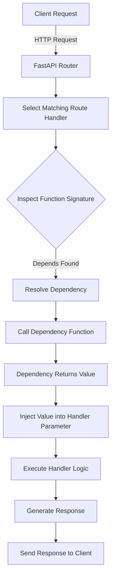
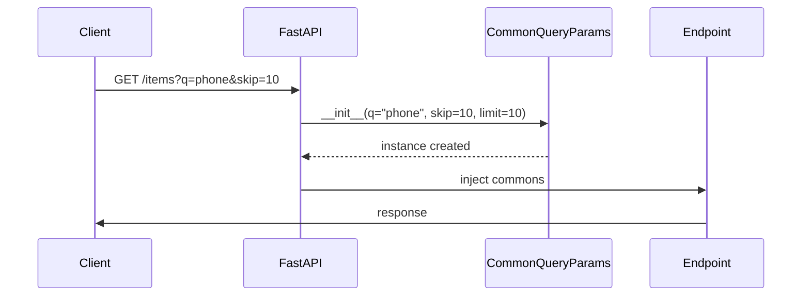
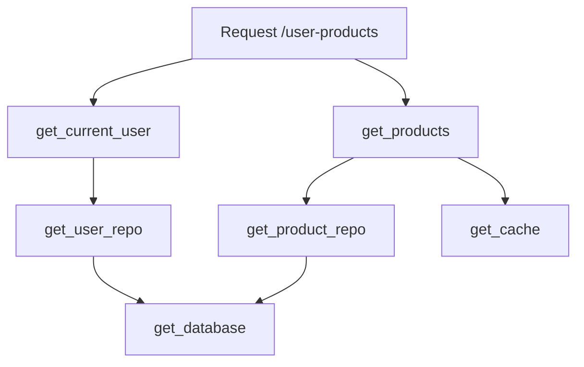
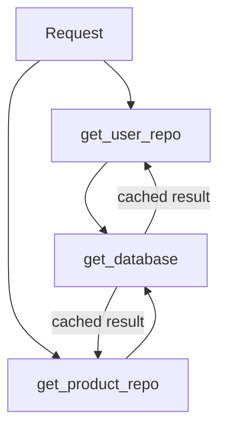

# Day 4: Dependency Injection - Part 1

**Date**: Week 3, Day 4  
**Phase**: 2 - FastAPI Mastery  
**Topic**: Understanding and Implementing Dependency Injection

---

## Table of Contents

1. [Understanding Dependency Injection](#understanding-dependency-injection)
2. [Function Dependencies](#function-dependencies)
3. [Class-Based Dependencies](#class-based-dependencies)
4. [Dependency Chains](#dependency-chains)
5. [Dependencies in Path Operations](#dependencies-in-path-operations)
6. [Common Dependency Patterns](#common-dependency-patterns)
7. [Practical Database Dependencies](#practical-database-dependencies)
8. [Complete Examples](#complete-examples)

---

## Understanding Dependency Injection

### What is Dependency Injection (DI)?

#### Definition

Dependency Injection (DI) is a **design pattern** where a function or class **receives its dependencies from the outside**, instead of creating them internally.

In simple words:

> **A function should not decide how its dependencies are created.
> It should only say what it needs.**

---

#### Why Dependency Injection Exists

Most backend code depends on external things such as:

- Databases
- Authentication data
- Configuration values
- External services (email, cache, APIs)

If a function **creates these dependencies itself**, the code becomes:

- Tightly coupled
- Hard to test
- Hard to reuse
- Difficult to change later

Dependency Injection solves this by **separating responsibility**.

---

### Understanding the Problem (Without DI)

#### Example: Tightly Coupled Code

```python
def get_user_profile(user_id: int):
    db = DatabaseConnection("postgres://prod-db")
    user = db.fetch_user(user_id)
    return user
```

##### What’s wrong here?

- The function:

  - Creates the database connection
  - Decides which database to use

- You cannot:

  - Replace the database easily
  - Mock it in tests
  - Reuse the logic cleanly

This function is doing **two jobs**:

1. Business logic (fetching user)
2. Infrastructure setup (DB creation)

---

### Introducing Dependency Injection

#### Same Example Using DI

```python
def get_user_profile(user_id: int, db):
    return db.fetch_user(user_id)
```

##### What improved?

- The function:

  - Only focuses on business logic
  - Does not care where `db` comes from

- The caller decides:

  - Which database to inject
  - How it is created

---

### Key Mental Model (Very Important)

#### Core Principle

> **Dependency Injection moves creation responsibility upward**

The function says:

> “I need a database — not how to build one.”

---

### Real-World Analogy

#### Without Dependency Injection

Imagine you want to watch a movie and you must:

- Build a TV
- Set up electricity
- Install speakers
- Configure software

Every single time.

---

#### With Dependency Injection

You simply say:

> “Give me a working TV.”

You focus only on watching the movie.

---

### Visual Flow of Dependency Injection


- Dependencies are created **outside**
- They flow **into** the function
- The function does not control creation

---

### Dependency Injection in FastAPI

#### Why FastAPI Uses DI

FastAPI uses Dependency Injection to provide:

- Database sessions
- Authenticated users
- Headers and cookies
- Config values
- Permissions and roles

You don’t manually create these inside routes.

---

#### FastAPI Example (Without DI)

```python
@app.get("/users/{user_id}")
async def get_user(user_id: int):
    db = DatabaseSession()
    return db.get_user(user_id)
```

Problems remain:

- New DB per request
- No reuse
- Hard to test

---

### FastAPI with Dependency Injection

#### Creating a Dependency

```python
from fastapi import Depends

def get_db():
    db = DatabaseSession()
    try:
        yield db
    finally:
        db.close()
```

---

#### Injecting the Dependency

```python
@app.get("/users/{user_id}")
async def get_user(
    user_id: int,
    db = Depends(get_db)
):
    return db.get_user(user_id)
```

##### What FastAPI Does Internally

1. Sees `Depends(get_db)`
2. Calls `get_db()`
3. Injects its return value into `db`
4. Handles cleanup automatically

---

### How to Think About `Depends`

#### Simple Interpretation

```python
db = Depends(get_db)
```

means:

> “FastAPI, run `get_db()` **before** calling this function and give me its result.”

---

### Why Dependency Injection Is Critical in Backend Systems

#### Benefits

- **Testability** – inject mocks instead of real services
- **Reusability** – same dependency across many routes
- **Maintainability** – change creation logic in one place
- **Separation of concerns** – logic ≠ infrastructure

---

### Common Real-World Dependencies

- Database sessions
- Current logged-in user
- API keys
- Configuration objects
- Redis cache
- External API clients

---

### Final Summary

#### In One Line

> Dependency Injection is about **who creates what**.

- Functions should **use** dependencies
- Not **build** dependencies
- FastAPI’s `Depends` formalizes this pattern
- Once understood, FastAPI feels clean—not magical

### Why Does Dependency Injection Matter?

Dependency Injection is not just a framework feature; it is a **fundamental design principle** that directly affects how scalable, readable, testable, and maintainable your backend code becomes. Below are the **core reasons DI matters**, explained conceptually with examples.

#### 1. Code Reusability

##### The Core Problem

In backend systems, certain logic is needed **everywhere**:

- Database connections
- Authentication
- Configuration loading
- External service setup

Without DI, this logic tends to get **copied and pasted** into multiple places.

##### Why This Is a Problem

- Violates the **DRY (Don’t Repeat Yourself)** principle
- Any bug fix or improvement must be repeated everywhere
- Increases chance of inconsistencies between endpoints

##### How DI Solves This

Dependency Injection allows you to:

- Write setup logic **once**
- Reuse it across multiple routes or services
- Centralize changes

Mentally think of DI as:

> “Define shared logic once, inject it wherever needed.”

This leads to cleaner routes that focus only on **what they do**, not **how dependencies are prepared**.

**Without DI (Repeated Code):**

```python
@app.get("/users")
async def list_users():
    # Database connection logic
    db = create_connection()
    validate_connection(db)
    setup_connection_pool(db)
    # Now use database
    users = db.query("SELECT * FROM users")
    return users

@app.get("/posts")
async def list_posts():
    # Same database connection logic repeated!
    db = create_connection()
    validate_connection(db)
    setup_connection_pool(db)
    # Now use database
    posts = db.query("SELECT * FROM posts")
    return posts

@app.get("/comments")
async def list_comments():
    # Same logic again... DRY principle violated!
    db = create_connection()
    validate_connection(db)
    setup_connection_pool(db)
    comments = db.query("SELECT * FROM comments")
    return comments
```

**With DI (Reusable Code):**

```python
def get_database():
    """Dependency: provides database connection"""
    db = create_connection()
    validate_connection(db)
    setup_connection_pool(db)
    return db

@app.get("/users")
async def list_users(db = Depends(get_database)):
    # Database connection automatically provided!
    users = db.query("SELECT * FROM users")
    return users

@app.get("/posts")
async def list_posts(db = Depends(get_database)):
    # Same dependency, no repeated code
    posts = db.query("SELECT * FROM posts")
    return posts

@app.get("/comments")
async def list_comments(db = Depends(get_database)):
    # Reusing the same dependency
    comments = db.query("SELECT * FROM comments")
    return comments

# Database logic written once, used everywhere!
```

#### 2. Separation of Concerns

##### What “Concern” Means

A concern is a **single responsibility** such as:

- Authentication
- Authorization
- Rate limiting
- Logging
- Business logic

##### The Problem Without DI

When a function handles multiple concerns:

- It becomes long and hard to read
- Changes in one concern risk breaking others
- Debugging becomes difficult

Such functions are often called **God functions**.

##### How DI Enforces Separation

With DI:

- Each concern is moved into its **own dependency**
- The route function becomes an orchestrator
- Logic is layered and composable

This leads to:

- Smaller functions
- Clear responsibilities
- Easier reasoning about code behavior

A good rule of thumb:

> If a route does more than one “kind” of work, DI can probably help.

Each function should have ONE clear responsibility:

```python
# Without DI: Function does too much
@app.get("/protected-resource")
async def get_resource():
    # Authentication logic
    token = request.headers.get("Authorization")
    if not token:
        raise HTTPException(401)
    user = validate_token(token)

    # Permission checking
    if not user.has_permission("read"):
        raise HTTPException(403)

    # Rate limiting
    if exceeded_rate_limit(user):
        raise HTTPException(429)

    # Logging
    log_access(user, "resource")

    # FINALLY, the actual business logic
    return {"data": "secret stuff"}
    # This function is doing 5 different things!

# With DI: Clear separation
def get_current_user(token: str = Header(...)):
    """Dependency: handles authentication"""
    return validate_token(token)

def check_permissions(user = Depends(get_current_user)):
    """Dependency: handles authorization"""
    if not user.has_permission("read"):
        raise HTTPException(403)
    return user

def check_rate_limit(user = Depends(get_current_user)):
    """Dependency: handles rate limiting"""
    if exceeded_rate_limit(user):
        raise HTTPException(429)

@app.get("/protected-resource")
async def get_resource(
    user = Depends(check_permissions),
    _ = Depends(check_rate_limit)
):
    # ONLY business logic here!
    log_access(user, "resource")
    return {"data": "secret stuff"}
    # Each concern is handled by its own dependency
```

#### 3. Testability

##### Why Testing Is Hard Without DI

Testing becomes difficult when:

- Functions create real databases internally
- External APIs are called directly
- Infrastructure is tightly coupled to logic

This forces tests to:

- Use real services
- Be slow
- Be flaky
- Require complex setup

##### How DI Makes Testing Easy

With Dependency Injection:

- Dependencies are passed in, not created inside
- You can replace real dependencies with **mocks or fakes**
- Tests focus purely on logic, not infrastructure

Conceptually:

> DI turns hard dependencies into replaceable inputs.

This is why most modern testing strategies **depend on DI**, even outside FastAPI.

Dependencies make testing much easier:

```python
# Without DI: Hard to test
@app.get("/user-stats")
async def get_stats():
    db = create_real_database_connection()  # Connects to real database!
    api = create_external_api_client()      # Calls real external API!

    users = db.query("SELECT * FROM users")
    external_data = api.fetch_data()

    return process_stats(users, external_data)
    # Testing this requires real database and real API!

# With DI: Easy to test
def get_database():
    return create_real_database_connection()

def get_api_client():
    return create_external_api_client()

@app.get("/user-stats")
async def get_stats(
    db = Depends(get_database),
    api = Depends(get_api_client)
):
    users = db.query("SELECT * FROM users")
    external_data = api.fetch_data()
    return process_stats(users, external_data)

# In tests: Replace with mocks!
def test_get_stats():
    app.dependency_overrides[get_database] = lambda: mock_database
    app.dependency_overrides[get_api_client] = lambda: mock_api

    response = client.get("/user-stats")
    # Testing with mock data - no real database or API needed!
```

#### 4. Maintainability

##### The Reality of Backend Systems

Over time:

- Databases change
- Auth mechanisms evolve
- APIs get replaced
- Performance optimizations are needed

Without DI, these changes require:

- Editing dozens of files
- High risk of missing something
- Large refactors

##### How DI Reduces Change Cost

When dependencies are centralized:

- You change behavior in **one place**
- All dependent code automatically adapts
- Refactors become predictable and safer

This dramatically lowers:

- Maintenance cost
- Bug risk
- Fear of making changes

When requirements change, update in one place:

```python
# All endpoints use this dependency
def get_database():
    return PostgreSQLDatabase()

@app.get("/users")
async def get_users(db = Depends(get_database)):
    return db.query("SELECT * FROM users")

@app.get("/posts")
async def get_posts(db = Depends(get_database)):
    return db.query("SELECT * FROM posts")

# 50 more endpoints using get_database...

# Need to switch to MongoDB? Change ONE function:
def get_database():
    return MongoDatabase()  # Changed!
    # All 52 endpoints now use MongoDB automatically!
```

#### 5. Scalability of Architecture

##### Small Apps vs Large Systems

In small apps, DI may feel optional.  
In large systems, DI becomes **mandatory**.

DI enables:

- Layered architecture
- Modular design
- Shared infrastructure
- Clean boundaries between layers

This is why:

- FastAPI
- Spring
- NestJS
- Angular

all heavily rely on Dependency Injection.

---

#### 6. Mental Model to Remember

A simple way to internalize DI:

- **Without DI**:  
  “I need this, so I will create it.”
- **With DI**:  
  “I need this. Someone else will give it to me.”

That “someone else” might be:

- FastAPI
- A framework
- A higher-level function
- A test harness

---

#### Final Takeaway

Dependency Injection matters because it:

- Eliminates duplication
- Enforces clean responsibilities
- Makes testing practical
- Simplifies future changes
- Scales with application complexity

If your backend feels:

- Hard to test
- Hard to change
- Hard to reason about

DI is usually the missing piece.

### How Dependency Injection Works in FastAPI

FastAPI implements Dependency Injection using the `Depends()` marker. When FastAPI sees `Depends()`, it understands that **this value must be resolved before the request handler runs**. The handler itself never creates the dependency.

---

#### High-Level Execution Flow



---

#### What FastAPI Actually Does Internally

When a request hits an endpoint, FastAPI performs **dependency resolution before executing your route function**.

1. **Request arrives**

   - Client sends an HTTP request (e.g., `GET /users`).

2. **Route matching**

   - FastAPI selects the correct handler function based on path and method.

3. **Function signature inspection**

   - FastAPI inspects the handler’s parameters.
   - It detects parameters declared as `Depends(...)`.

4. **Dependency graph construction**

   - FastAPI builds a dependency tree.
   - If a dependency itself has dependencies, they are resolved first.

5. **Dependency execution**

   - Dependency functions are executed in the correct order.
   - Results are cached per request unless configured otherwise.

6. **Value injection**

   - The return value of each dependency is injected into the corresponding parameter.

7. **Handler execution**

   - The route handler runs with all dependencies already available.

8. **Response lifecycle**

   - The handler returns a value.
   - FastAPI serializes it and sends the HTTP response.

---

#### Key Concepts to Understand

##### `Depends()` Is a Marker, Not a Function Call

```python
def get_users(db = Depends(get_database)):
    ...
```

- `get_database()` is **not executed here**
- `Depends(get_database)` only tells FastAPI:

  > “Before running this function, call `get_database` and give me its return value.”

---

##### Dependency Functions Are Managed by FastAPI

- You never call dependency functions manually.
- FastAPI controls:

  - When they are called
  - How often they are called
  - In what order they are called
  - How their return values are shared

---

##### Dependencies Can Have Dependencies

```python
def get_current_user(db = Depends(get_database)):
    ...
```

FastAPI will:

1. Resolve `get_database`
2. Inject it into `get_current_user`
3. Inject the user into the route handler

This creates a **dependency graph**, not just a single function call.

---

#### Request-Scoped Behavior

By default:

- A dependency is executed **once per request**
- Its return value is reused for all consumers in that request

This means:

- Database connections are not created multiple times
- Auth checks remain consistent
- Performance is optimized automatically

---

#### Why This Design Is Powerful

FastAPI’s DI system:

- Keeps handlers clean
- Centralizes infrastructure logic
- Enforces correct execution order
- Eliminates manual wiring
- Scales naturally as the app grows

You focus on **what the endpoint does**.
FastAPI handles **how dependencies are prepared and delivered**.

### Basic Dependency Example

Let's see a complete basic example:

```python
from fastapi import FastAPI, Depends

app = FastAPI()

# This is a dependency function
def get_query_token(token: str):
    """
    Dependency that extracts and validates a token from query parameters.

    This function will be called automatically by FastAPI.
    """
    if token != "secret-token":
        raise HTTPException(status_code=401, detail="Invalid token")
    return token

# This endpoint uses the dependency
@app.get("/items")
async def read_items(token: str = Depends(get_query_token)):
    """
    The token parameter is injected by FastAPI.

    FastAPI:
    1. Sees Depends(get_query_token)
    2. Calls get_query_token(token=...)
    3. If valid, injects return value into token parameter
    4. If invalid (HTTPException raised), returns error

    URL: /items?token=secret-token
    """
    return {
        "message": "Access granted",
        "token": token
    }

"""
How it works:

Request: GET /items?token=secret-token
1. FastAPI extracts token from query: "secret-token"
2. Calls get_query_token("secret-token")
3. Function validates and returns token
4. FastAPI injects into read_items(token="secret-token")
5. Handler executes
Response: {"message": "Access granted", "token": "secret-token"}

Request: GET /items?token=wrong-token
1. FastAPI extracts token: "wrong-token"
2. Calls get_query_token("wrong-token")
3. Function raises HTTPException(401)
4. FastAPI returns error (handler never runs)
Response: 401 Unauthorized {"detail": "Invalid token"}
"""
```

### Dependencies vs Regular Parameters

Understanding the difference is crucial:

```python
from fastapi import Depends, Query

# Regular parameter - FastAPI extracts from request
@app.get("/search")
async def search(q: str = Query(...)):
    # FastAPI extracts 'q' from query string
    # You work with the raw value
    return {"query": q}

# Dependency - FastAPI calls function and injects result
def process_query(q: str = Query(...)):
    # This function processes the query
    return q.lower().strip()

@app.get("/search-processed")
async def search_processed(processed_q: str = Depends(process_query)):
    # FastAPI calls process_query(q=...)
    # You receive the processed result
    return {"query": processed_q}

"""
The key difference:

Regular Parameter:
- FastAPI extracts value from request
- You receive raw value
- You handle any processing

Dependency:
- FastAPI calls your function
- Function processes/validates/fetches data
- You receive the processed result
"""
```

**When to use each:**

| Use Case                  | Approach                       | Example                            |
| ------------------------- | ------------------------------ | ---------------------------------- |
| Simple value from request | Regular parameter              | `q: str = Query(...)`              |
| Value needs processing    | Dependency                     | `q: str = Depends(process_query)`  |
| Reusable logic            | Dependency                     | `db = Depends(get_db)`             |
| Authentication            | Dependency                     | `user = Depends(get_current_user)` |
| Database connection       | Dependency                     | `db = Depends(get_db)`             |
| Simple validation         | Regular parameter with Field() | `age: int = Query(ge=0)`           |
| Complex validation        | Dependency                     | `user = Depends(validate_user)`    |

---

## Function Dependencies

Function dependencies are the most common and straightforward type. They're just regular Python functions that FastAPI calls automatically.

### Simple Function Dependency

Let's start with the simplest possible dependency:

```python
from fastapi import FastAPI, Depends

app = FastAPI()

def get_hello():
    """
    Simplest possible dependency.

    Takes no parameters, returns a string.
    """
    return "Hello from dependency!"

@app.get("/greet")
async def greet(message: str = Depends(get_hello)):
    """
    The message parameter receives whatever get_hello() returns.
    """
    return {"message": message}

"""
What happens:
1. Request: GET /greet
2. FastAPI sees: message = Depends(get_hello)
3. FastAPI calls: get_hello()
4. get_hello returns: "Hello from dependency!"
5. FastAPI injects: greet(message="Hello from dependency!")
6. Response: {"message": "Hello from dependency!"}
"""
```

### Dependencies with Parameters

Dependencies can have their own parameters (which can be other dependencies!):

```python
from fastapi import Depends, Query

def get_pagination(skip: int = Query(0, ge=0), limit: int = Query(10, ge=1, le=100)):
    """
    Dependency that handles pagination logic.

    Parameters:
    - skip: extracted from query string
    - limit: extracted from query string

    Returns: dict with pagination info
    """
    return {
        "skip": skip,
        "limit": limit,
        "message": f"Showing items {skip} to {skip + limit}"
    }

@app.get("/items")
async def list_items(pagination: dict = Depends(get_pagination)):
    """
    The pagination parameter receives the dict from get_pagination().

    URL: /items?skip=10&limit=20
    """
    # Simulate database query
    items = [{"id": i, "name": f"Item {i}"} for i in range(100)]

    # Use pagination info
    start = pagination["skip"]
    end = start + pagination["limit"]

    return {
        "items": items[start:end],
        "pagination": pagination
    }

"""
Request flow:
1. Request: GET /items?skip=10&limit=20
2. FastAPI sees: pagination = Depends(get_pagination)
3. FastAPI calls: get_pagination(skip=10, limit=20)
   - FastAPI extracts skip and limit from query string
   - Passes them to get_pagination
4. get_pagination returns: {"skip": 10, "limit": 20, "message": "..."}
5. FastAPI injects: list_items(pagination={...})
6. Handler uses pagination info
7. Response: {"items": [...], "pagination": {...}}
"""
```

### Reusable Dependencies

The power of dependencies shines when you reuse them:

```python
from fastapi import Depends, Query

# Define once
def common_parameters(
    q: str | None = Query(None, min_length=3),
    skip: int = Query(0, ge=0),
    limit: int = Query(10, ge=1, le=100)
):
    """
    Common query parameters used across multiple endpoints.

    This encapsulates common filtering/pagination logic.
    """
    return {
        "q": q,
        "skip": skip,
        "limit": limit
    }

# Use many times
@app.get("/items")
async def read_items(commons: dict = Depends(common_parameters)):
    """Search and paginate items"""
    return {
        "query": commons["q"],
        "items": ["item1", "item2"],  # Filtered by query
        "pagination": {
            "skip": commons["skip"],
            "limit": commons["limit"]
        }
    }

@app.get("/users")
async def read_users(commons: dict = Depends(common_parameters)):
    """Search and paginate users"""
    return {
        "query": commons["q"],
        "users": ["user1", "user2"],  # Filtered by query
        "pagination": {
            "skip": commons["skip"],
            "limit": commons["limit"]
        }
    }

@app.get("/posts")
async def read_posts(commons: dict = Depends(common_parameters)):
    """Search and paginate posts"""
    return {
        "query": commons["q"],
        "posts": ["post1", "post2"],  # Filtered by query
        "pagination": {
            "skip": commons["skip"],
            "limit": commons["limit"]
        }
    }

"""
Benefits of reusable dependencies:

1. DRY (Don't Repeat Yourself)
   - Pagination logic written once
   - Used in 3 endpoints (could be 50!)

2. Consistency
   - All endpoints have same parameter names
   - All endpoints have same validation rules
   - All endpoints behave predictably

3. Maintainability
   - Change pagination logic in one place
   - All endpoints automatically updated

4. Testing
   - Test pagination logic once
   - Confidence it works everywhere
"""
```

### Multiple Dependencies

An endpoint can use multiple dependencies:

```python
from fastapi import Depends, Header, Cookie

def verify_token(x_token: str = Header(...)):
    """Dependency: Verify authentication token"""
    if x_token != "secret-token":
        raise HTTPException(401, "Invalid token")
    return x_token

def verify_key(x_key: str = Header(...)):
    """Dependency: Verify API key"""
    if x_key != "secret-key":
        raise HTTPException(401, "Invalid key")
    return x_key

def get_session(session_id: str = Cookie(...)):
    """Dependency: Get session from cookie"""
    # Simulate session lookup
    sessions = {"abc123": {"user_id": 1}}
    if session_id not in sessions:
        raise HTTPException(401, "Invalid session")
    return sessions[session_id]

@app.get("/secure-resource")
async def secure_resource(
    token: str = Depends(verify_token),
    key: str = Depends(verify_key),
    session: dict = Depends(get_session)
):
    """
    This endpoint requires THREE things to be valid:
    1. Valid authentication token (header)
    2. Valid API key (header)
    3. Valid session (cookie)

    All dependencies are checked automatically!
    """
    return {
        "message": "Access granted",
        "token": token,
        "key": key,
        "session": session
    }

"""
Request flow with multiple dependencies:

Request: GET /secure-resource
Headers: X-Token: secret-token, X-Key: secret-key
Cookies: session_id=abc123

1. FastAPI sees three dependencies
2. Calls verify_token(x_token="secret-token") → returns token ✓
3. Calls verify_key(x_key="secret-key") → returns key ✓
4. Calls get_session(session_id="abc123") → returns session ✓
5. All valid! Calls secure_resource(token=..., key=..., session=...)
6. Response: {"message": "Access granted", ...}

If ANY dependency fails (raises HTTPException):
- Remaining dependencies not called
- Handler not called
- Error response returned immediately
"""
```

### Dependency Return Types

Dependencies can return any type:

```python
from fastapi import Depends
from typing import Dict, List

# Return string
def get_message() -> str:
    return "Hello"

# Return dict
def get_config() -> Dict[str, any]:
    return {
        "debug": True,
        "version": "1.0.0"
    }

# Return list
def get_items() -> List[str]:
    return ["item1", "item2", "item3"]

# Return custom object
class Database:
    def __init__(self):
        self.connection = "connected"

    def query(self, sql: str):
        return f"Executing: {sql}"

def get_database() -> Database:
    return Database()

# Return None (side effects only)
def log_request() -> None:
    print("Request received")
    # Returns None, but side effect (logging) is useful

@app.get("/demo")
async def demo(
    message: str = Depends(get_message),
    config: Dict = Depends(get_config),
    items: List[str] = Depends(get_items),
    db: Database = Depends(get_database),
    _: None = Depends(log_request)  # _ means "ignore return value"
):
    """
    Demonstrates different dependency return types.

    Each dependency returns a different type.
    The _ = Depends(log_request) pattern is for side-effect-only dependencies.
    """
    return {
        "message": message,
        "config": config,
        "items": items,
        "db_status": db.connection
    }
```

---

## Class-Based Dependencies

Class-based dependencies are an extension of FastAPI’s dependency system that allow you to encapsulate **state**, **configuration**, and **related logic** inside a class instead of spreading it across multiple functions. They are especially useful when a dependency needs to:

- Maintain internal state
- Share configuration across multiple endpoints
- Group related behaviors under a single conceptual unit
- Be initialized once per request with consistent behavior

At a conceptual level, FastAPI treats **callable classes exactly the same way as dependency functions**.

---

### Why Class-Based Dependencies Exist

Function-based dependencies work well for simple cases:

- Get a database connection
- Extract a header
- Validate a token

As complexity grows, functions can become hard to reason about:

- Too many parameters
- Shared configuration scattered across modules
- Related logic split into multiple helpers

Class-based dependencies solve this by letting you model a dependency as an **object with behavior**, not just a function.

---

### Understanding Callable Classes

In Python, an object becomes callable when it implements the `__call__` method. This allows an instance to be invoked like a function.

```python
class Greeter:
    def __init__(self, name: str):
        self.name = name

    def __call__(self):
        """
        __call__ makes the instance callable.

        After instantiation:
        greeter = Greeter("Alice")
        greeter() executes this method
        """
        return f"Hello, {self.name}!"
```

Usage:

```python
greeter = Greeter("Alice")
result = greeter()  # Calls greeter.__call__()
print(result)       # "Hello, Alice!"
```

From Python’s perspective:

```python
greeter()  ==  greeter.__call__()
```

This behavior is the **foundation** of class-based dependencies in FastAPI.

---

#### How FastAPI Sees Callable Classes

FastAPI does not care whether a dependency is:

- A function
- A lambda
- A callable class instance

As long as it can be **called**, FastAPI can treat it as a dependency.

Conceptually:

```python
Depends(get_database)        # function
Depends(Greeter("Alice"))   # callable object
```

Both are valid because both are callable.

---

#### What FastAPI Actually Does with a Class-Based Dependency

When you write:

```python
greeter = Greeter("Alice")

@app.get("/hello")
def hello(message = Depends(greeter)):
    return {"message": message}
```

FastAPI executes the following steps **per request**:

1. Sees `Depends(greeter)`
2. Recognizes `greeter` as a callable
3. Calls `greeter()`
4. Takes the return value of `__call__`
5. Injects that value into the `message` parameter
6. Executes the route handler

FastAPI does **not** care that `greeter` is an object instead of a function.

---

#### Why `__init__` and `__call__` Are Both Important

Class-based dependencies separate **configuration** from **execution**.

##### `__init__` → Configuration Phase

- Runs when the class instance is created
- Used to store:

  - Settings
  - Constants
  - Shared services
  - Feature flags

```python
class Greeter:
    def __init__(self, name: str):
        self.name = name
```

This happens once, not per request (unless you instantiate inside the route).

---

##### `__call__` → Execution Phase

- Runs per request
- Contains logic that depends on the current request
- Returns the value to be injected

```python
def __call__(self):
    return f"Hello, {self.name}!"
```

This clear separation is one of the biggest advantages over function-based dependencies.

---

#### Mental Model to Remember

Think of a class-based dependency as:

- A **configured function**
- A function with memory
- A dependency with identity and state

In simplified terms:

```python
configured_dependency = Dependency(config)
result = configured_dependency()  # FastAPI does this
```

---

#### When Class-Based Dependencies Make Sense

Use class-based dependencies when:

- Multiple endpoints share the same dependency logic
- The dependency needs configuration (e.g. roles, permissions, limits)
- You want cleaner, more structured dependency code
- You want to avoid passing the same parameters repeatedly

Avoid them for:

- Very small, one-line dependencies
- Logic that does not benefit from grouping or state

---

#### Key Takeaways

- Class-based dependencies rely on Python’s `__call__` method
- FastAPI treats callable classes and functions the same way
- `__init__` is for configuration
- `__call__` is for request-time logic
- They help structure complex dependency logic cleanly and predictably

### Basic Class Dependency

Class-based dependencies allow FastAPI to **construct an object from request data** and inject that object into your endpoint. This example is important because it introduces a FastAPI-specific feature that often feels “magical” at first: `Depends()` with **nothing inside it**.

```python
from fastapi import Depends, Query

class CommonQueryParams:
    """
    Class-based dependency for common query parameters.

    Benefits over function:
    - Group related parameters
    - Add methods for processing
    - More organized structure
    """

    def __init__(
        self,
        q: str | None = Query(None),
        skip: int = Query(0, ge=0),
        limit: int = Query(10, ge=1, le=100)
    ):
        """
        __init__ is called by FastAPI automatically.

        Parameters are extracted from the request.
        """
        self.q = q
        self.skip = skip
        self.limit = limit

    def get_offset(self) -> int:
        """Additional method: calculate offset"""
        return self.skip

    def get_limit(self) -> int:
        """Additional method: get limit"""
        return self.limit

    def has_query(self) -> bool:
        """Additional method: check if query provided"""
        return self.q is not None

# Use the class dependency
@app.get("/items")
async def read_items(commons: CommonQueryParams = Depends()):
    """
    FastAPI automatically:
    1. Creates instance: CommonQueryParams(q=..., skip=..., limit=...)
    2. Injects instance into commons parameter

    Note: Depends() with no argument!
    FastAPI knows to instantiate the type annotation (CommonQueryParams)
    """
    return {
        "query": commons.q,
        "skip": commons.skip,
        "limit": commons.limit,
        "has_query": commons.has_query(),
        "offset": commons.get_offset()
    }

"""
Why use class-based dependencies?

1. Organization
   - Group related parameters together
   - Add helper methods
   - Clear structure

2. Reusability
   - Can inherit and extend
   - Share methods across endpoints

3. Maintainability
   - Easy to modify behavior
   - Methods keep logic organized

When to use:
- Multiple related parameters
- Need helper methods
- Complex initialization logic
"""
```

---

#### What This Dependency Represents

```python
class CommonQueryParams:

```

This class represents a **logical group of query parameters** that commonly appear together:

- `q` → search query
- `skip` → pagination offset
- `limit` → pagination size

Instead of repeating these parameters in multiple endpoints, we bundle them into one dependency.

---

#### Understanding `__init__` in a Class Dependency

```python
def __init__(
    self,
    q: str | None = Query(None),
    skip: int = Query(0, ge=0),
    limit: int = Query(10, ge=1, le=100)
):

```

This `__init__` method works very differently from a normal constructor:

- FastAPI **does not call it manually**
- FastAPI **inspects its parameters**
- Each parameter becomes:

  - A query parameter
  - With validation rules (`ge`, `le`, defaults)

So effectively, this class is equivalent to writing:

```python
def dependency(
    q: str | None = Query(None),
    skip: int = Query(0, ge=0),
    limit: int = Query(10, ge=1, le=100)
):
    ...

```

But instead of returning values, FastAPI **creates an instance**.

---

#### How Values Reach `self.q`, `self.skip`, `self.limit`

For a request like:

```
GET /items?q=phone&skip=10&limit=20

```

FastAPI performs these steps:

1.  Reads query parameters from the request
2.  Validates them using `Query(...)`
3.  Calls:

    ```python
    CommonQueryParams(
        q="phone",
        skip=10,
        limit=20
    )

    ```

4.  Assigns:

    - `self.q = "phone"`
    - `self.skip = 10`
    - `self.limit = 20`

At this point, you have a fully initialized object representing request state.

---

#### Why `Depends()` Has Nothing Inside It

```python
async def read_items(commons: CommonQueryParams = Depends()):

```

This is the most confusing part at first.

Normally you see:

```python
Depends(get_database)

```

Here, nothing is passed. This works because:

- FastAPI looks at the **type annotation**
- Sees `commons: CommonQueryParams`
- Understands that:

  - The type itself is the dependency
  - It should be instantiated

So this line is conceptually equivalent to:

```python
commons = CommonQueryParams(...)

```

But FastAPI controls:

- Where values come from (request)
- When validation happens
- How errors are returned

---

#### Mental Model for Empty `Depends()`

Think of this as:

> “FastAPI, please create an instance of the type annotated here and inject it.”

In pseudo-code:

```python
if Depends() has no argument:
    dependency = type_annotation
    value = dependency(**request_data)

```

That is why this only works with **classes**, not plain types.

---

#### Why Helper Methods Belong in Class Dependencies

```python
def has_query(self) -> bool:
    return self.q is not None

```

Class-based dependencies let you move logic **out of the route handler**:

- No repeated condition checks
- Cleaner endpoint functions
- Behavior lives next to the data it depends on

The route becomes:

```python
return {
    "has_query": commons.has_query(),
    "offset": commons.get_offset()
}

```

Instead of computing these inline every time.

---

#### How This Differs from Function-Based Dependencies

Function dependency:

- Returns raw values
- Logic is procedural
- No persistent structure

Class dependency:

- Returns an object
- Has identity and behavior
- Can grow without becoming messy

This is especially useful for:

- Pagination
- Filtering
- Authorization context
- Request-scoped configuration

---

#### Lifecycle of This Dependency (Per Request)



---

#### When to Use This Pattern

Use a basic class dependency when:

- Multiple endpoints share query parameters
- You want helper methods tied to request data
- You want clean, readable route signatures
- You want to scale logic without cluttering endpoints

Avoid it when:

- There is only one simple parameter
- No behavior or grouping is needed

---

#### Key Takeaways

- `Depends()` without arguments means “use the type annotation”
- FastAPI instantiates the class automatically
- `__init__` parameters map to request parameters
- The instance is injected, not the class
- Helper methods keep endpoints clean and expressive

### Class Dependency with Type Annotation Shortcut

FastAPI provides a **clean and concise shortcut** for using class-based dependencies by leveraging Python’s type annotations. This avoids repetition while keeping behavior explicit and predictable.

---

#### The Core Idea

When you write:

```python
param: SomeClass = Depends()
```

FastAPI follows this rule:

> If `Depends()` has **no argument**, FastAPI uses the **type annotation** (`SomeClass`) as the dependency callable and instantiates it.

This works **only because** `SomeClass` is a callable (a class with `__init__`).

---

#### Example: Pagination as a Class Dependency

```python
from fastapi import Depends, Query, FastAPI

app = FastAPI()

class Pagination:
    def __init__(
        self,
        skip: int = Query(0, ge=0, description="Number of items to skip"),
        limit: int = Query(10, ge=1, le=100, description="Maximum items to return")
    ):
        self.skip = skip
        self.limit = limit

    def as_dict(self):
        return {"skip": self.skip, "limit": self.limit}
```

---

#### 1. Explicit (Long) Form

```python
@app.get("/items-explicit")
async def read_items_explicit(
    pagination: Pagination = Depends(Pagination)
):
    return pagination.as_dict()
```

**What happens:**

- FastAPI calls `Pagination(skip=..., limit=...)`
- The instance is injected into `pagination`

This form is explicit and always valid, but slightly repetitive.

---

#### 2. Type Annotation Shortcut (Recommended)

```python
@app.get("/items")
async def read_items(
    pagination: Pagination = Depends()
):
    return pagination.as_dict()
```

**What happens internally:**

1. FastAPI sees `Depends()` with no argument
2. It looks at the type annotation → `Pagination`
3. It calls `Pagination(skip=..., limit=...)`
4. The created instance is injected into `pagination`

This is **functionally identical** to:

```python
Depends(Pagination)
```

---

#### Important Clarification (Common Mistake)

There is **no such thing** as an “even shorter” form based on parameter names.

These are identical:

```python
pagination: Pagination = Depends()
p: Pagination = Depends()
anything: Pagination = Depends()
```

FastAPI does **not**:

- Use the parameter name
- Match lowercase names to class names
- Apply naming conventions

Only the **type annotation** matters.

---

#### Why the Shortcut Is Preferred

- Eliminates repetition (`Pagination` written once instead of twice)
- Cleaner and more readable
- No loss of clarity or functionality
- Encourages consistent DI usage across large codebases

---

#### Mental Model (Very Important)

```text
Depends() + type annotation
→ FastAPI instantiates the annotated class
→ Injects the instance into the parameter
```

If you remember this rule, class-based dependencies in FastAPI will feel straightforward rather than magical.

### Class Dependency with Processing Logic

Class-based dependencies become especially powerful when they **do more than just hold data**. They can validate inputs, normalize values, derive new data, and expose helper methods—so your route handler stays focused on business logic.

---

#### What This Pattern Solves

Without a class dependency, the route handler often ends up doing:

- Input validation
- Normalization (lowercasing, trimming, mapping)
- Building database filters
- Deciding sort keys

This leads to **fat handlers** and duplicated logic across endpoints.

A class dependency lets you **move all of that into one place**.

---

#### Example: Search Parameters with Validation and Processing

```python
from fastapi import Depends, Query, HTTPException, FastAPI

app = FastAPI()

class SearchParams:
    """
    Search query dependency with:
    - Validation
    - Normalization
    - Derived data (filters, sort keys)
    """

    def __init__(
        self,
        q: str = Query(..., min_length=2, max_length=50),
        category: str = Query("all"),
        sort: str = Query("relevance", pattern="^(relevance|date|popularity)$")
    ):
        # 1. Validation (domain rules)
        valid_categories = {"all", "books", "electronics", "clothing"}
        if category not in valid_categories:
            raise HTTPException(
                status_code=400,
                detail=f"Invalid category. Must be one of: {', '.join(valid_categories)}"
            )

        # 2. Normalization
        self.q = q.strip().lower()
        self.category = category
        self.sort = sort

        # 3. Derived / processed values
        self.filter = self._build_filter()

    def _build_filter(self) -> dict:
        """
        Build a database-friendly filter object.
        This keeps DB logic out of the route handler.
        """
        filters = {"query": self.q}

        if self.category != "all":
            filters["category"] = self.category

        return filters

    def get_sort_key(self) -> str:
        """
        Convert API-facing sort values into DB fields.
        """
        sort_map = {
            "relevance": "score",
            "date": "created_at",
            "popularity": "view_count",
        }
        return sort_map[self.sort]
```

---

#### Using the Dependency in a Route

```python
@app.get("/search")
async def search(params: SearchParams = Depends()):
    """
    The route handler:
    - Does NOT validate inputs
    - Does NOT normalize data
    - Does NOT build filters
    - Does NOT decide sort keys

    It simply uses the prepared object.
    """

    # Example: pretend this goes to a database
    results = [
        {"id": 1, "title": "Result 1"},
        {"id": 2, "title": "Result 2"},
    ]

    return {
        "query": params.q,
        "category": params.category,
        "sort": params.sort,
        "filter": params.filter,
        "sort_key": params.get_sort_key(),
        "results": results,
    }
```

---

#### How FastAPI Executes This (Mental Model)

1. Client sends request
   `/search?q=FastAPI&category=books&sort=date`

2. FastAPI sees
   `params: SearchParams = Depends()`

3. FastAPI:

   - Reads query parameters
   - Calls `SearchParams(q=..., category=..., sort=...)`

4. Inside `__init__`:

   - Validation happens
   - Values are normalized
   - Filter and sort logic is prepared

5. The fully processed object is injected into `params`

6. The handler runs with **clean, ready-to-use data**

---

#### Why This Pattern Is Powerful

#### 1. Encapsulation

All search-related logic lives in one place:

- Validation rules
- Normalization
- Derived values
- Helper methods

No scattered logic across routes.

---

#### 2. Fat Dependency, Thin Handler

```text
Dependency → does the thinking
Handler     → does the action
```

This keeps endpoints readable and intention-revealing.

---

#### 3. Reusability

The same `SearchParams` class can be reused in:

- `/search`
- `/search/suggestions`
- `/admin/search`
- Background jobs or services

---

#### 4. Easier Changes

If tomorrow:

- A new category is added
- Sorting logic changes
- Filters become more complex

You update **one class**, not every endpoint.

---

#### When to Use Class Dependencies with Logic

Use this pattern when:

- Input parameters are related
- Validation depends on business rules
- You need derived or computed values
- You want to keep route handlers minimal
- The same logic is reused across endpoints

This is one of the cleanest ways to structure non-trivial FastAPI applications.

### Class Dependency with State

Class-based dependencies can **hold state inside an instance** and expose behavior through methods. This is useful when multiple related operations need to share data during the lifetime of a request.

In FastAPI, **a new instance of the dependency class is created per request**, unless explicitly cached.

---

#### What “State” Means in Class Dependencies

**State** refers to data stored on `self` inside the class instance, such as:

- Counters
- Parsed headers
- Preprocessed values
- Cached calculations
- Flags derived from the request

Example state:

- `self.token`
- `self.requests_made`
- `self.limit`

This state:

- Exists **only for the current request**
- Is **not shared across requests**
- Is safe from race conditions by default

---

#### Example: Stateful Class Dependency

```python
from fastapi import Depends, Header, HTTPException

class RateLimiter:
    """
    Class dependency that maintains per-request state.

    IMPORTANT:
    - A new instance is created for EACH request
    - State does NOT persist across requests
    - This example demonstrates structure, not real rate limiting
    """

    def __init__(self, x_token: str = Header(...)):
        # Extract data from request
        self.token = x_token

        # Per-request state
        self.requests_made = 0
        self.limit = 100

    def check_limit(self):
        """Validate rate limit"""
        if self.requests_made >= self.limit:
            raise HTTPException(
                status_code=429,
                detail="Rate limit exceeded"
            )

    def increment(self):
        """Update request count"""
        self.requests_made += 1

    def remaining(self) -> int:
        """Remaining allowed requests"""
        return self.limit - self.requests_made
```

---

#### Using the Stateful Dependency in an Endpoint

```python
@app.get("/limited-resource")
async def limited_resource(limiter: RateLimiter = Depends()):
    """
    FastAPI flow:
    1. Create RateLimiter instance
    2. Inject request headers into __init__
    3. Inject instance into limiter parameter
    4. Handler uses limiter methods
    """
    limiter.check_limit()
    limiter.increment()

    return {
        "message": "Success",
        "remaining_requests": limiter.remaining()
    }
```

---

#### Execution Flow (Per Request)

1. Client sends request with `X-Token` header
2. FastAPI creates a new `RateLimiter` instance
3. `__init__` runs and stores token + initializes state
4. Instance is injected into endpoint
5. Endpoint calls `check_limit()`, `increment()`
6. Response is returned
7. Instance is discarded after response

---

#### Why This Is NOT Real Rate Limiting

This implementation **resets state on every request**:

```text
Request 1 → requests_made = 0
Request 2 → requests_made = 0
Request 3 → requests_made = 0
```

So the limit is never actually enforced across requests.

This happens because:

- FastAPI creates a **new dependency instance per request**
- No shared storage is used

---

#### Correct Production Approach for Stateful Logic

For **cross-request state**, you must use **external shared storage**.

##### Common Production Options

| Use Case      | Storage    |
| ------------- | ---------- |
| Rate limiting | Redis      |
| Sessions      | Redis / DB |
| Feature flags | Cache / DB |
| Quotas        | Redis      |
| Locks         | Redis / DB |

---

#### Production-Ready Rate Limiter (Conceptual)

```python
class RateLimiter:
    def __init__(self, x_token: str = Header(...)):
        self.token = x_token
        self.limit = 100

    def check_and_increment(self):
        """
        Pseudocode:
        - Fetch count from Redis using token
        - If >= limit → raise 429
        - Else increment and store back
        """
        count = redis.get(self.token) or 0

        if count >= self.limit:
            raise HTTPException(429, "Rate limit exceeded")

        redis.incr(self.token)
        redis.expire(self.token, 60)  # 1-minute window
```

Key difference:

- **State lives in Redis**
- Class only orchestrates logic
- Dependency stays stateless across requests

---

#### When Class-Based Stateful Dependencies Are Appropriate

Use them when:

- You need to group related request-level logic
- Multiple methods must share intermediate data
- You want clean, object-oriented structure
- State only needs to live for **one request**

Do NOT use them for:

- Cross-request counters
- Global limits
- Long-lived shared data

---

#### Key Takeaways

- Class dependencies can safely hold **per-request state**
- Each request gets a **fresh instance**
- Perfect for request-scoped logic
- For real shared state, use Redis or a database
- Class dependencies act as **controllers**, not storage

This pattern scales well when combined with external persistence and keeps endpoint handlers clean and focused.

### Inheriting Class Dependencies

FastAPI class-based dependencies fully support **Python class inheritance**, allowing you to build **layered, reusable request parameter models**. This is especially useful when multiple endpoints share common parameters (like pagination) but differ in additional behavior (search, filtering, sorting).

```python
class BaseQueryParams:
    """Base class with common parameters"""

    def __init__(
        self,
        skip: int = Query(0, ge=0),
        limit: int = Query(10, ge=1, le=100)
    ):
        self.skip = skip
        self.limit = limit

class SearchQueryParams(BaseQueryParams):
    """Extended class with search-specific parameters"""

    def __init__(
        self,
        q: str = Query(..., min_length=2),
        skip: int = Query(0, ge=0),
        limit: int = Query(10, ge=1, le=100)
    ):
        # Call parent constructor
        super().__init__(skip=skip, limit=limit)
        # Add search-specific parameter
        self.q = q

class FilteredSearchParams(SearchQueryParams):
    """Further extended with filtering"""

    def __init__(
        self,
        q: str = Query(..., min_length=2),
        category: str = Query("all"),
        skip: int = Query(0, ge=0),
        limit: int = Query(10, ge=1, le=100)
    ):
        super().__init__(q=q, skip=skip, limit=limit)
        self.category = category

# Use inherited dependencies
@app.get("/simple-list")
async def simple_list(params: BaseQueryParams = Depends()):
    """Just pagination"""
    return {"skip": params.skip, "limit": params.limit}

@app.get("/search")
async def search(params: SearchQueryParams = Depends()):
    """Pagination + search"""
    return {"q": params.q, "skip": params.skip, "limit": params.limit}

@app.get("/filtered-search")
async def filtered_search(params: FilteredSearchParams = Depends()):
    """Pagination + search + filtering"""
    return {
        "q": params.q,
        "category": params.category,
        "skip": params.skip,
        "limit": params.limit
    }

"""
Benefits of inheritance:

1. Code Reuse
   - Base parameters defined once
   - Extended classes inherit them

2. Hierarchy
   - Clear relationship between classes
   - Easy to understand progression

3. Flexibility
   - Use base class for simple endpoints
   - Use extended classes for complex ones
"""
```

---

#### Why Use Inheritance for Dependencies?

Inheritance helps when:

- Multiple endpoints share **common query parameters**
- You want **progressive complexity**
- You want to avoid repeating `Query(...)` definitions
- You want a clear **mental model** of how request parameters grow

Think of it as:

> _Start simple → add features as needed_

---

#### Base Dependency: Shared Pagination Parameters

```python
from fastapi import Depends, Query

class BaseQueryParams:
    """
    Base dependency with common pagination parameters.
    Used by endpoints that only need paging.
    """

    def __init__(
        self,
        skip: int = Query(0, ge=0, description="Number of records to skip"),
        limit: int = Query(10, ge=1, le=100, description="Max records to return")
    ):
        self.skip = skip
        self.limit = limit
```

---

#### Extended Dependency: Add Search Capability

```python
class SearchQueryParams(BaseQueryParams):
    """
    Extends BaseQueryParams by adding a search query.
    """

    def __init__(
        self,
        q: str = Query(..., min_length=2, description="Search term"),
        skip: int = Query(0, ge=0),
        limit: int = Query(10, ge=1, le=100)
    ):
        # Initialize shared pagination
        super().__init__(skip=skip, limit=limit)

        # Add search-specific state
        self.q = q
```

---

#### Further Extension: Add Filtering

```python
class FilteredSearchParams(SearchQueryParams):
    """
    Extends SearchQueryParams with filtering capability.
    """

    def __init__(
        self,
        q: str = Query(..., min_length=2),
        category: str = Query("all", description="Filter category"),
        skip: int = Query(0, ge=0),
        limit: int = Query(10, ge=1, le=100)
    ):
        # Initialize search + pagination
        super().__init__(q=q, skip=skip, limit=limit)

        # Add filtering state
        self.category = category
```

---

#### Using Inherited Dependencies in Endpoints

```python
@app.get("/simple-list")
async def simple_list(params: BaseQueryParams = Depends()):
    """
    Uses only pagination.
    """
    return {
        "skip": params.skip,
        "limit": params.limit
    }


@app.get("/search")
async def search(params: SearchQueryParams = Depends()):
    """
    Pagination + search.
    """
    return {
        "q": params.q,
        "skip": params.skip,
        "limit": params.limit
    }


@app.get("/filtered-search")
async def filtered_search(params: FilteredSearchParams = Depends()):
    """
    Pagination + search + filtering.
    """
    return {
        "q": params.q,
        "category": params.category,
        "skip": params.skip,
        "limit": params.limit
    }
```

---

#### How FastAPI Resolves Inherited Dependencies

For each request:

1. FastAPI inspects the endpoint parameter type
2. It sees the concrete class (e.g. `FilteredSearchParams`)
3. It reads the `__init__` signature of that class
4. All `Query(...)` parameters are extracted from the request
5. Constructors are called **top → down** using `super()`
6. Final object is injected into the handler

---

#### Important Rules When Using Inheritance

- Always call `super().__init__(...)`
- Re-declare inherited parameters in child `__init__`

  - FastAPI does **not** auto-inherit `Query(...)` definitions

- Order of parameters matters for readability
- Each request still creates a **new instance**

---

#### Production Usage Pattern

Inheritance works best when:

- Pagination is shared across many endpoints
- Search and filtering grow over time
- You want strict consistency in parameter behavior
- You want clear separation of responsibility

**Common real-world stacks:**

```text
BaseQueryParams
 └── SearchQueryParams
      └── FilteredSearchParams
           └── SortedFilteredSearchParams
```

Each level:

- Adds exactly one responsibility
- Keeps constructors readable
- Avoids massive single classes

---

#### Benefits Recap

- **Code reuse** – define once, reuse everywhere
- **Clear hierarchy** – easy to reason about
- **Extensible** – add new layers without breaking existing endpoints
- **Clean handlers** – endpoints stay minimal and expressive

---

#### Key Takeaway

Class dependency inheritance turns request parsing into a **composable system**.
It scales naturally as APIs grow and keeps your FastAPI codebase clean, explicit, and production-ready.

## Dependency Chains

Dependency chains allow one dependency to **depend on another dependency**, forming a directed flow of execution. This is one of FastAPI’s most powerful features and the foundation for **authentication, authorization, database access, validation, and request context management**.

---

### What Is a Dependency Chain?

A **dependency chain** exists when:

- A handler depends on a dependency
- That dependency depends on another dependency
- And so on…

FastAPI automatically resolves this chain **from the bottom up**.


---

### Real-World Mental Model

Think in terms of **responsibility layers**:

```
Handler:        "What should I do?"
User Dependency:"Who is making this request?"
Auth Dependency:"Is the request valid?"
Header Dependency:"Where is the token?"
```

Each dependency:

- Does **one job**
- Assumes the previous step succeeded
- Fails fast if something is wrong

---

### Basic Dependency Chain

This example shows a **linear dependency chain** commonly used for authentication.

```python
from fastapi import Depends, Header, HTTPException

# Level 3: Extract token from header
def get_token(authorization: str = Header(...)):
    """
    Extract Bearer token from Authorization header.
    """
    if not authorization.startswith("Bearer "):
        raise HTTPException(401, "Invalid authorization format")

    return authorization.replace("Bearer ", "")


# Level 2: Verify token
def verify_token(token: str = Depends(get_token)):
    """
    Validate the token.
    Depends on: get_token
    """
    valid_tokens = {"secret123", "admin456"}

    if token not in valid_tokens:
        raise HTTPException(401, "Invalid token")

    return token


# Level 1: Resolve user
def get_current_user(token: str = Depends(verify_token)):
    """
    Get user from a verified token.
    Depends on: verify_token → get_token
    """
    users = {
        "secret123": {"id": 1, "username": "alice"},
        "admin456": {"id": 2, "username": "bob"},
    }

    return users[token]


# Handler
@app.get("/me")
async def read_current_user(user: dict = Depends(get_current_user)):
    """
    Final handler receives a fully validated user.
    """
    return user
```

---

### How FastAPI Executes the Chain

For a request like:

```
GET /me
Authorization: Bearer secret123
```

Execution order:

1. Handler requests `Depends(get_current_user)`
2. `get_current_user` requests `Depends(verify_token)`
3. `verify_token` requests `Depends(get_token)`
4. `get_token` extracts token from header
5. Token validated
6. User resolved
7. Handler executes

**If any step raises `HTTPException`, the chain stops immediately.**

---

### Why This Pattern Is Powerful

- Each function is **small and testable**
- Logic is **reusable across endpoints**
- Security logic is **centralized**
- Handlers stay **clean and readable**

---

### Complex Dependency Chain (Auth + Role + Permissions)

This example shows a **realistic production-style chain** with roles and permissions.

```python
from fastapi import Depends, Header, HTTPException

USERS = {
    "token123": {"id": 1, "username": "alice", "role": "admin"},
    "token456": {"id": 2, "username": "bob", "role": "user"},
}

PERMISSIONS = {
    "admin": ["read", "write", "delete"],
    "user": ["read"],
}


# Level 4: Extract token
def get_token(authorization: str = Header(..., alias="Authorization")):
    if not authorization.startswith("Bearer "):
        raise HTTPException(401, "Invalid authorization header")
    return authorization.replace("Bearer ", "")


# Level 3: Validate token
def validate_token(token: str = Depends(get_token)):
    if token not in USERS:
        raise HTTPException(401, "Invalid token")
    return token


# Level 2: Get current user
def get_current_user(token: str = Depends(validate_token)):
    return USERS[token]


# Level 1: Permission dependency factory
def require_permission(permission: str):
    """
    Dependency factory that creates permission-checking dependencies.
    """

    def permission_checker(user: dict = Depends(get_current_user)):
        user_permissions = PERMISSIONS.get(user["role"], [])

        if permission not in user_permissions:
            raise HTTPException(403, "Permission denied")

        return user

    return permission_checker
```

---

### Using the Chain in Handlers

```python
@app.get("/profile")
async def get_profile(user: dict = Depends(get_current_user)):
    return {"user": user}


@app.get("/admin/users")
async def list_users(user: dict = Depends(require_permission("write"))):
    return {"users": list(USERS.values()), "requested_by": user}


@app.delete("/admin/users/{user_id}")
async def delete_user(
    user_id: int,
    admin: dict = Depends(require_permission("delete")),
):
    return {"message": f"User {user_id} deleted", "deleted_by": admin}
```

---

### Why Dependency Factories Matter

A **dependency factory** is a function that **returns a dependency**, instead of acting as a dependency itself.

```python
def require_permission(permission: str):
    def checker(user = Depends(get_current_user)):
        if permission not in user["permissions"]:
            raise HTTPException(403, "Permission denied")
        return user
    return checker
```

---

#### Key Idea

`require_permission("delete")` does **not** perform any permission check.

It **creates and returns** a dependency function (`checker`) that FastAPI will execute **during the request**.

---

#### Usage in an Endpoint

```python
@app.delete("/items/{id}")
async def delete_item(
    user = Depends(require_permission("delete"))
):
    return {"message": "Item deleted"}
```

**Execution flow:**

1. FastAPI evaluates `require_permission("delete")`
2. The factory returns a configured dependency (`checker`)
3. FastAPI executes `checker` during the request
4. `checker` runs authentication and permission validation
5. The endpoint executes only if validation succeeds

---

#### Why This Pattern Is Important

Dependency factories allow:

- Dynamic rules (permissions, roles, scopes)
- Reusable authorization logic
- Clean, declarative endpoint definitions
- No duplication of permission-checking code

---

#### Mental Model

- **Factory** → defines _what rule_ should apply
- **Dependency** → enforces that rule _per request_

This pattern is commonly used in production systems for authorization, access control, and policy-based validation.

---

### Dependency Chains with Multiple Branches

FastAPI dependencies are not limited to simple linear chains. They can **branch into multiple paths and later rejoin** at the endpoint level. This is common in real production systems where different parts of a request need different resources, but some of those resources overlap.

---

#### Conceptual Overview

In this example, the request needs:

- **User-related data** (authentication, user repository)
- **Product-related data** (product repository, cache)

Both branches depend on the **same database connection**, and FastAPI ensures it is created **only once per request**.



---

#### Example Code

```python
from fastapi import Depends

# Shared dependencies
def get_database():
    return {"db": "connected"}

def get_cache():
    return {"cache": "connected"}


# Branch 1: User-related dependencies
def get_user_repo(db = Depends(get_database)):
    return {"repo": "users", "db": db}

def get_current_user(repo = Depends(get_user_repo)):
    return {"id": 1, "username": "alice"}


# Branch 2: Product-related dependencies
def get_product_repo(db = Depends(get_database)):
    return {"repo": "products", "db": db}

def get_products(
    repo = Depends(get_product_repo),
    cache = Depends(get_cache),
):
    return [{"id": 1, "name": "Laptop"}]


# Endpoint where branches rejoin
@app.get("/user-products")
async def user_products(
    user = Depends(get_current_user),
    products = Depends(get_products),
):
    return {
        "user": user,
        "products": products
    }
```

---

#### What FastAPI Does Under the Hood

1. The request reaches `/user-products`
2. FastAPI resolves `get_current_user`

   - Calls `get_user_repo`
   - Calls `get_database`

3. FastAPI resolves `get_products`

   - Calls `get_product_repo`
   - Reuses the **same cached result** of `get_database`
   - Calls `get_cache`

4. The endpoint executes with all resolved dependencies

---

#### Why This Matters in Production

- **Single database connection per request**
  Even if multiple branches depend on it, FastAPI calls it once.

- **Clear separation of concerns**
  User logic and product logic remain independent.

- **Scalable design**
  Easy to add new branches (analytics, billing, logging) without touching existing code.

- **Performance-safe by default**
  Expensive dependencies are cached automatically within a request.

---

#### Key Takeaway

Dependency branching allows you to model real-world systems naturally, while FastAPI guarantees correctness, performance, and clean composition without manual wiring.

### Dependency Result Caching (Critical Concept)

FastAPI automatically **caches dependency results within a single request**.
This means a dependency function is executed **at most once per request**, even if multiple other dependencies rely on it.

---

#### What FastAPI Guarantees

- A dependency is **called only once per request**
- The returned value is **cached**
- All downstream dependencies **reuse the same result**
- Caching is **request-scoped** (not global)

---

#### Why This Exists

Without caching, a single request could:

- Open multiple database connections
- Repeat expensive computations
- Produce inconsistent data during the same request

FastAPI prevents this by design.

---

#### Concrete Example

```python
from fastapi import Depends

def get_database():
    print("Connecting to database")
    return {"db": "connected"}

def get_user_repo(db = Depends(get_database)):
    return {"repo": "users", "db": db}

def get_product_repo(db = Depends(get_database)):
    return {"repo": "products", "db": db}

@app.get("/example")
async def example(
    user_repo = Depends(get_user_repo),
    product_repo = Depends(get_product_repo),
):
    return {
        "user_repo": user_repo,
        "product_repo": product_repo
    }
```

**What actually happens for one request:**

```
Connecting to database   ← printed ONCE
```

Even though both `get_user_repo` and `get_product_repo` depend on `get_database`, FastAPI:

- Calls `get_database()` one time
- Reuses its result for both branches

---

#### Execution Flow



---

#### What Is Cached (and What Is Not)

**Cached:**

- Dependency return values
- Database sessions
- Authenticated user objects
- Configuration objects
- Parsed headers or tokens

**Not cached across requests:**

- Global state
- Dependency results from previous requests

Each new request gets a fresh dependency graph.

---

#### Practical Production Impact

This behavior enables:

- Safe reuse of database sessions
- Consistent request-level state
- Efficient dependency chains
- Clean separation of concerns without performance penalties

You can freely compose dependencies without worrying about duplicate execution.

---

#### Key Rule to Remember

> A dependency is executed **once per request**, no matter how many times it appears in the dependency graph.

This single rule is what makes complex dependency graphs safe and scalable in FastAPI.

---

### Production Best Practices for Dependencies

Use dependencies as **infrastructure building blocks**, not as business logic containers.

---

#### 1. Keep Dependencies Single-Responsibility

Each dependency should do **one thing only**.

Good:

- Extract token
- Validate token
- Load user
- Check permission
- Open DB session

Bad:

- Authenticate user
- Check permissions
- Query database
- Return response

All in one dependency.

This keeps dependency chains composable and predictable.

---

#### 2. Fail Early and Centrally

Dependencies are the **best place to reject requests**.

- Validate inputs
- Enforce authentication
- Enforce authorization
- Enforce limits

Raise `HTTPException` inside dependencies so:

- The handler is never executed
- Error handling is consistent across endpoints

---

#### 3. Use Dependency Chains for Cross-Cutting Concerns

Dependencies are ideal for logic that applies to many endpoints:

- Authentication (`get_current_user`)
- Authorization (`require_permission`)
- Database/session management
- Rate limiting
- Feature flags
- Request context (tenant, locale, timezone)

Handlers should not repeat this logic.

---

#### 4. Keep Route Handlers Thin

A handler should:

- Receive already validated data
- Call domain/business logic
- Return a response

If a handler:

- Reads headers
- Validates tokens
- Checks permissions
- Builds filters

Those belong in dependencies, not in the handler.

---

#### 5. Prefer Composition Over Inheritance

Compose small dependencies into chains instead of creating large, complex ones.
This improves readability, testing, and reuse.

---

#### Mental Model to Keep

> Handlers describe **what** the endpoint does.
> Dependencies handle **how** the request becomes safe and ready.

If your handlers are boring, your dependency design is probably good.

### Key Takeaway

Dependency chains turn FastAPI into a **declarative execution graph**.

You describe **what you need**, FastAPI figures out **how to get it**, safely, efficiently, and consistently.

## Dependencies in Path Operations

FastAPI allows attaching dependencies **directly to path operations**, even if the handler function does not use their return values. This is useful for validation, logging, or other side effects.

---

### Path Operation Dependencies

```python
from fastapi import Depends, Header, HTTPException, FastAPI

app = FastAPI()

def verify_token(x_token: str = Header(...)):
    """Dependency that verifies a token"""
    if x_token != "secret-token":
        raise HTTPException(401, "Invalid token")
    # No return needed if just validating

def verify_key(x_key: str = Header(...)):
    """Dependency that verifies an API key"""
    if x_key != "secret-key":
        raise HTTPException(401, "Invalid key")

# Attach dependencies directly to the path operation
@app.get(
    "/items",
    dependencies=[Depends(verify_token), Depends(verify_key)]
)
async def read_items():
    """
    Both dependencies run before the handler.

    Notes:
    - Dependencies do not return values used by the handler
    - They perform validation or side effects only
    - Handler parameters do not include token or key
    """
    return {"items": ["item1", "item2"]}
```

---

### Why Use Path Operation Dependencies

#### 1. Side Effects Only

- Useful for validation, logging, metrics, etc.
- No need to pass return values to the handler.

#### 2. Cleaner Handlers

- Handler parameters only include what is actually used.
- Validation and checks are handled in the decorator.

#### 3. Reusable Across Multiple Endpoints

- Can be applied at router level to share across many endpoints.
- Reduces repetition for common checks like authentication or API keys.

---

This pattern is ideal for **cross-cutting concerns** that should run before executing the handler, without polluting the handler code.

### Multiple Path Operation Dependencies

FastAPI allows attaching **multiple dependencies** to a path operation. These dependencies can perform validation, logging, or other side effects **without returning values to the handler**.

This is especially useful when several pre-checks must run before executing the main logic.

---

```python
from fastapi import Depends, Header, HTTPException, FastAPI

app = FastAPI()

def log_request():
    """Log that a request was made"""
    print("Request received")

def check_rate_limit():
    """Check rate limit"""
    # Simulated rate limit check
    pass

def verify_api_version(version: str = Header("1.0")):
    """Verify that API version is supported"""
    supported_versions = ["1.0", "1.1"]
    if version not in supported_versions:
        raise HTTPException(400, f"Unsupported API version: {version}")

# Attach multiple dependencies to a single path operation
@app.get(
    "/resource",
    dependencies=[
        Depends(log_request),
        Depends(check_rate_limit),
        Depends(verify_api_version)
    ]
)
async def get_resource():
    """
    Handler executed only after all dependencies pass.

    Dependencies:
    1. log_request → logs the request
    2. check_rate_limit → validates rate limit
    3. verify_api_version → ensures API version is supported
    """
    return {"data": "resource data"}
```

---

### How Multiple Dependencies Execute

1. FastAPI receives the request for `/resource`.
2. Dependencies are executed **in the order listed**:

   - `log_request()` → logs request
   - `check_rate_limit()` → validates rate limiting
   - `verify_api_version()` → validates API version

3. If **all dependencies succeed**, the handler is called.
4. If **any dependency fails** (raises an exception):

   - Remaining dependencies are skipped.
   - The handler is **not executed**.
   - FastAPI returns the corresponding error response.

---

### Key Points

- Dependencies attached this way are **side-effect only**.
- Useful for **common pre-processing tasks** across multiple endpoints.
- Keeps handler functions **clean and focused**.
- Can combine multiple dependencies for **modular and reusable logic**.### Multiple Path Operation Dependencies

### Multiple Path Operation Dependencies

FastAPI allows attaching **multiple dependencies** to a path operation. These dependencies can perform validation, logging, or other side effects **without returning values to the handler**.

This is especially useful when several pre-checks must run before executing the main logic.

---

```python
from fastapi import Depends, Header, HTTPException, FastAPI

app = FastAPI()

def log_request():
    """Log that a request was made"""
    print("Request received")

def check_rate_limit():
    """Check rate limit"""
    # Simulated rate limit check
    pass

def verify_api_version(version: str = Header("1.0")):
    """Verify that API version is supported"""
    supported_versions = ["1.0", "1.1"]
    if version not in supported_versions:
        raise HTTPException(400, f"Unsupported API version: {version}")

# Attach multiple dependencies to a single path operation
@app.get(
    "/resource",
    dependencies=[
        Depends(log_request),
        Depends(check_rate_limit),
        Depends(verify_api_version)
    ]
)
async def get_resource():
    """
    Handler executed only after all dependencies pass.

    Dependencies:
    1. log_request → logs the request
    2. check_rate_limit → validates rate limit
    3. verify_api_version → ensures API version is supported
    """
    return {"data": "resource data"}
```

---

### How Multiple Dependencies Execute

1. FastAPI receives the request for `/resource`.
2. Dependencies are executed **in the order listed**:

   - `log_request()` → logs request
   - `check_rate_limit()` → validates rate limiting
   - `verify_api_version()` → validates API version

3. If **all dependencies succeed**, the handler is called.
4. If **any dependency fails** (raises an exception):

   - Remaining dependencies are skipped.
   - The handler is **not executed**.
   - FastAPI returns the corresponding error response.

---

### Key Points

- Dependencies attached this way are **side-effect only**.
- Useful for **common pre-processing tasks** across multiple endpoints.
- Keeps handler functions **clean and focused**.
- Can combine multiple dependencies for **modular and reusable logic**.

### Combining Parameter and Path Dependencies

```python
from fastapi import Depends, Header

def verify_token(x_token: str = Header(...)):
    """Verify authentication token"""
    if x_token != "secret-token":
        raise HTTPException(401, "Invalid token")
    return x_token  # Return token for use in handler

def log_access():
    """Log access (side effect only)"""
    print("Access logged")

@app.get(
    "/items",
    dependencies=[Depends(log_access)]  # Path dependency (side effect)
)
async def read_items(
    token: str = Depends(verify_token)  # Parameter dependency (used in handler)
):
    """
    Two types of dependencies:

    1. Path dependency: log_access
       - Runs but we don't use return value
       - Side effect only

    2. Parameter dependency: verify_token
       - Runs and we use return value
       - Handler receives token parameter
    """
    return {
        "items": ["item1", "item2"],
        "authenticated_with": token
    }
```

---

### Combining Parameter and Path Dependencies

FastAPI allows **mixing dependencies** that are used **only for side effects** with those whose **return values are needed in the handler**. This pattern helps keep handlers clean while still performing pre-processing or validation.

---

```python
from fastapi import FastAPI, Depends, Header, HTTPException

app = FastAPI()

def verify_token(x_token: str = Header(...)):
    """Parameter dependency: verifies token and returns it for use in handler"""
    if x_token != "secret-token":
        raise HTTPException(401, "Invalid token")
    return x_token

def log_access():
    """Path dependency: side-effect only (logs access)"""
    print("Access logged")

@app.get(
    "/items",
    dependencies=[Depends(log_access)]  # Path dependency (side effect only)
)
async def read_items(
    token: str = Depends(verify_token)  # Parameter dependency (used in handler)
):
    """
    Combines two types of dependencies:

    1. **Path dependency** (`log_access`)
       - Runs automatically before handler
       - Return value is **ignored**
       - Used for side effects (logging, monitoring, etc.)

    2. **Parameter dependency** (`verify_token`)
       - Runs automatically before handler
       - Return value is **passed to handler**
       - Handler receives the verified token as `token`
    """
    return {
        "items": ["item1", "item2"],
        "authenticated_with": token
    }
```

---

### Key Takeaways

- **Path dependencies** (`dependencies=[...]`)

  - Side-effect only, do not provide values to the handler
  - Useful for logging, validation, rate limiting

- **Parameter dependencies** (`param: Type = Depends(...)`)

  - Return value is injected into the handler
  - Used when the handler needs the computed or validated value

- Combining both allows **clean, maintainable code** with modular pre-processing and validation.

## Common Dependency Patterns

Let's explore common real-world dependency patterns you'll use frequently.

### Pagination Dependency

```python
from fastapi import Depends, Query

class PaginationParams:
    """Reusable pagination dependency"""

    def __init__(
        self,
        page: int = Query(1, ge=1, description="Page number"),
        per_page: int = Query(20, ge=1, le=100, description="Items per page")
    ):
        self.page = page
        self.per_page = per_page
        self.skip = (page - 1) * per_page
        self.limit = per_page

    def slice_results(self, items: list) -> list:
        """Slice a list according to pagination"""
        return items[self.skip:self.skip + self.limit]

    def get_metadata(self, total: int) -> dict:
        """Get pagination metadata"""
        return {
            "page": self.page,
            "per_page": self.per_page,
            "total": total,
            "total_pages": (total + self.per_page - 1) // self.per_page
        }

@app.get("/items")
async def list_items(pagination: PaginationParams = Depends()):
    """
    URL: /items?page=2&per_page=10

    Returns page 2 with 10 items per page
    """
    # Simulate database query
    all_items = [{"id": i, "name": f"Item {i}"} for i in range(100)]

    # Use pagination
    items = pagination.slice_results(all_items)
    metadata = pagination.get_metadata(len(all_items))

    return {
        "items": items,
        "pagination": metadata
    }
```

### Filtering Dependency

```python
from fastapi import Depends, Query
from typing import Optional

class FilterParams:
    """Reusable filtering dependency"""

    def __init__(
        self,
        category: Optional[str] = Query(None),
        min_price: Optional[float] = Query(None, ge=0),
        max_price: Optional[float] = Query(None, ge=0),
        in_stock: bool = Query(True)
    ):
        self.category = category
        self.min_price = min_price
        self.max_price = max_price
        self.in_stock = in_stock

    def apply_filters(self, items: list) -> list:
        """Apply all filters to item list"""
        filtered = items

        if self.category:
            filtered = [i for i in filtered if i["category"] == self.category]

        if self.min_price is not None:
            filtered = [i for i in filtered if i["price"] >= self.min_price]

        if self.max_price is not None:
            filtered = [i for i in filtered if i["price"] <= self.max_price]

        if self.in_stock:
            filtered = [i for i in filtered if i["stock"] > 0]

        return filtered

@app.get("/products")
async def list_products(filters: FilterParams = Depends()):
    """
    URL: /products?category=electronics&min_price=100&max_price=1000&in_stock=true
    """
    # Simulate database
    all_products = [
        {"id": 1, "name": "Laptop", "category": "electronics", "price": 999, "stock": 5},
        {"id": 2, "name": "Mouse", "category": "electronics", "price": 29, "stock": 0},
        {"id": 3, "name": "Desk", "category": "furniture", "price": 299, "stock": 3}
    ]

    products = filters.apply_filters(all_products)

    return {
        "products": products,
        "filters_applied": {
            "category": filters.category,
            "price_range": {
                "min": filters.min_price,
                "max": filters.max_price
            },
            "in_stock_only": filters.in_stock
        }
    }
```

### Sorting Dependency

```python
from fastapi import Depends, Query

class SortParams:
    """Reusable sorting dependency"""

    def __init__(
        self,
        sort_by: str = Query("created_at", regex="^(name|price|created_at)$"),
        order: str = Query("asc", regex="^(asc|desc)$")
    ):
        self.sort_by = sort_by
        self.order = order
        self.reverse = (order == "desc")

    def sort_items(self, items: list) -> list:
        """Sort items according to parameters"""
        return sorted(
            items,
            key=lambda x: x[self.sort_by],
            reverse=self.reverse
        )

@app.get("/items")
async def list_items(sort: SortParams = Depends()):
    """
    URL: /items?sort_by=price&order=desc

    Returns items sorted by price in descending order
    """
    items = [
        {"name": "Laptop", "price": 999, "created_at": "2024-01-01"},
        {"name": "Mouse", "price": 29, "created_at": "2024-01-02"},
        {"name": "Keyboard", "price": 79, "created_at": "2024-01-03"}
    ]

    sorted_items = sort.sort_items(items)

    return {
        "items": sorted_items,
        "sorted_by": sort.sort_by,
        "order": sort.order
    }
```

### Combined Params Dependency

```python
from fastapi import Depends

@app.get("/products")
async def list_products(
    filters: FilterParams = Depends(),
    pagination: PaginationParams = Depends(),
    sort: SortParams = Depends()
):
    """
    Combining multiple dependencies for complex queries.

    URL: /products?category=electronics&min_price=100&page=1&per_page=20&sort_by=price&order=asc

    Dependencies handle:
    - Filtering (category, price range, stock)
    - Pagination (page, per_page)
    - Sorting (sort_by, order)

    Handler just orchestrates!
    """
    # Simulate database
    all_products = generate_products(100)  # Imagine this generates 100 products

    # Apply operations
    filtered = filters.apply_filters(all_products)
    sorted_products = sort.sort_items(filtered)
    paginated = pagination.slice_results(sorted_products)

    return {
        "products": paginated,
        "pagination": pagination.get_metadata(len(filtered)),
        "filters": {
            "category": filters.category,
            "price_range": {"min": filters.min_price, "max": filters.max_price}
        },
        "sorting": {
            "by": sort.sort_by,
            "order": sort.order
        }
    }
```

---

## Practical Database Dependencies

One of the most common uses of dependencies is managing database connections.

### Basic Database Dependency

```python
from fastapi import Depends

# Simulated database class
class Database:
    def __init__(self):
        self.connection = "connected"
        print("Database connection created")

    def query(self, sql: str):
        return f"Executing: {sql}"

    def close(self):
        print("Database connection closed")

# Dependency function
def get_db():
    """
    Dependency that provides database connection.

    In real app, this would:
    - Create connection from pool
    - Return connection
    - Close connection after request
    """
    db = Database()
    return db

@app.get("/users")
async def get_users(db: Database = Depends(get_db)):
    """Get all users using database dependency"""
    result = db.query("SELECT * FROM users")
    return {"result": result}

@app.get("/posts")
async def get_posts(db: Database = Depends(get_db)):
    """Get all posts using same database dependency"""
    result = db.query("SELECT * FROM posts")
    return {"result": result}

"""
Benefits:
1. Reusable - Database logic in one place
2. Consistent - Same connection pattern everywhere
3. Testable - Easy to mock in tests
"""
```

### Database Dependency with Cleanup

```python
from fastapi import Depends

def get_db():
    """
    Database dependency with cleanup.

    Uses 'yield' to provide cleanup logic.
    Code after yield runs after the request completes.
    """
    # Setup: Create database connection
    db = Database()
    print("Creating database connection")

    try:
        # Provide database to handler
        yield db
    finally:
        # Cleanup: Always runs, even if handler raises exception
        db.close()
        print("Closing database connection")

@app.get("/users")
async def get_users(db: Database = Depends(get_db)):
    """
    Flow:
    1. Request arrives
    2. get_db runs up to yield → creates connection
    3. Handler receives db and runs
    4. Handler returns response
    5. get_db runs after yield → closes connection
    6. Response sent to client
    """
    users = db.query("SELECT * FROM users")
    return {"users": users}

"""
Request lifecycle with yield:

1. Request received
2. Dependency runs: db = Database() ← Setup
3. Dependency yields: yield db ← Provide to handler
4. Handler executes: get_users(db) ← Use database
5. Handler returns: {"users": ...} ← Generate response
6. Dependency continues: db.close() ← Cleanup
7. Response sent

Cleanup ALWAYS runs, even if:
- Handler raises exception
- Validation fails
- Other error occurs

This prevents resource leaks!
"""
```

### Database Dependency with Connection Pool

```python
from fastapi import Depends

class ConnectionPool:
    """Simulated database connection pool"""

    def __init__(self):
        self.connections = []
        self.in_use = set()
        print("Connection pool created")

    def get_connection(self):
        """Get connection from pool"""
        if self.connections and not all(c in self.in_use for c in self.connections):
            # Reuse existing connection
            conn = next(c for c in self.connections if c not in self.in_use)
            self.in_use.add(conn)
            print(f"Reusing connection {id(conn)}")
            return conn
        else:
            # Create new connection
            conn = Database()
            self.connections.append(conn)
            self.in_use.add(conn)
            print(f"Created new connection {id(conn)}")
            return conn

    def return_connection(self, conn):
        """Return connection to pool"""
        self.in_use.remove(conn)
        print(f"Returned connection {id(conn)}")

# Global connection pool (created once)
pool = ConnectionPool()

def get_db():
    """
    Get database connection from pool.

    Connection is reused across requests!
    """
    conn = pool.get_connection()
    try:
        yield conn
    finally:
        pool.return_connection(conn)

@app.get("/users")
async def get_users(db: Database = Depends(get_db)):
    """Uses pooled connection"""
    return {"users": db.query("SELECT * FROM users")}

@app.get("/posts")
async def get_posts(db: Database = Depends(get_db)):
    """Reuses pooled connection"""
    return {"posts": db.query("SELECT * FROM posts")}

"""
Connection pooling benefits:

1. Performance
   - Creating connections is expensive
   - Reusing is fast

2. Resource Management
   - Limited number of connections
   - Prevents overwhelming database

3. Efficiency
   - Connections kept warm
   - No connection setup overhead

Real-world usage:
- SQLAlchemy has built-in pooling
- Redis connections are pooled
- Any expensive resource benefits from pooling
"""
```

### Multiple Database Dependencies

```python
from fastapi import Depends

class PostgreSQL:
    """Primary database"""
    def query(self, sql: str):
        return f"PostgreSQL: {sql}"

class MongoDB:
    """Document database"""
    def find(self, collection: str):
        return f"MongoDB: Finding in {collection}"

class Redis:
    """Cache database"""
    def get(self, key: str):
        return f"Redis: Getting {key}"

# Separate dependencies for each database
def get_postgres():
    db = PostgreSQL()
    yield db

def get_mongo():
    db = MongoDB()
    yield db

def get_redis():
    cache = Redis()
    yield cache

@app.get("/user/{user_id}")
async def get_user(
    user_id: int,
    postgres: PostgreSQL = Depends(get_postgres),
    mongo: MongoDB = Depends(get_mongo),
    redis: Redis = Depends(get_redis)
):
    """
    Endpoint using three different databases!

    Each dependency provides a different database connection.
    Handler uses whichever it needs.
    """
    # Check cache first
    cached = redis.get(f"user:{user_id}")
    if cached:
        return {"user": cached, "source": "cache"}

    # Get from PostgreSQL
    user = postgres.query(f"SELECT * FROM users WHERE id = {user_id}")

    # Get additional data from MongoDB
    preferences = mongo.find(f"user_preferences where user_id = {user_id}")

    return {
        "user": user,
        "preferences": preferences,
        "source": "database"
    }

"""
Multiple database pattern:

Common in modern applications:
- PostgreSQL: Relational data (users, orders)
- MongoDB: Document data (logs, events)
- Redis: Cache and sessions
- Elasticsearch: Search data

Each database optimized for its use case!
"""
```

---

## Complete Examples

Let's put it all together with comprehensive real-world examples.

### Example 1: Blog API with Dependencies

```python
from fastapi import FastAPI, Depends, HTTPException, Header
from pydantic import BaseModel
from typing import Optional

app = FastAPI(title="Blog API with Dependencies")

# Models
class Post(BaseModel):
    title: str
    content: str
    author_id: int

# Simulated databases
USERS = {
    "token123": {"id": 1, "username": "alice", "role": "admin"},
    "token456": {"id": 2, "username": "bob", "role": "user"}
}

POSTS = []
next_id = 1

# Dependencies
def get_token(authorization: str = Header(...)):
    """Extract token from Authorization header"""
    if not authorization.startswith("Bearer "):
        raise HTTPException(401, "Invalid authorization format")
    return authorization.replace("Bearer ", "")

def get_current_user(token: str = Depends(get_token)):
    """Get current authenticated user"""
    if token not in USERS:
        raise HTTPException(401, "Invalid token")
    return USERS[token]

def require_admin(user: dict = Depends(get_current_user)):
    """Require user to be admin"""
    if user["role"] != "admin":
        raise HTTPException(403, "Admin access required")
    return user

class PaginationParams:
    """Pagination dependency"""
    def __init__(self, skip: int = 0, limit: int = 10):
        self.skip = skip
        self.limit = limit

# Endpoints
@app.get("/posts")
async def list_posts(
    pagination: PaginationParams = Depends(),
    user: Optional[dict] = Depends(get_current_user)
):
    """
    List posts with pagination.
    Optional authentication (won't fail if not authenticated).
    """
    posts = POSTS[pagination.skip:pagination.skip + pagination.limit]
    return {
        "posts": posts,
        "total": len(POSTS),
        "user": user["username"] if user else None
    }

@app.post("/posts")
async def create_post(
    post: Post,
    user: dict = Depends(get_current_user)
):
    """
    Create a new post.
    Requires authentication.
    """
    global next_id

    new_post = {
        "id": next_id,
        "title": post.title,
        "content": post.content,
        "author_id": user["id"],
        "author_name": user["username"]
    }

    POSTS.append(new_post)
    next_id += 1

    return {"message": "Post created", "post": new_post}

@app.delete("/posts/{post_id}")
async def delete_post(
    post_id: int,
    admin: dict = Depends(require_admin)
):
    """
    Delete a post.
    Requires admin role.
    """
    global POSTS
    POSTS = [p for p in POSTS if p["id"] != post_id]

    return {
        "message": "Post deleted",
        "deleted_by": admin["username"]
    }

"""
Dependency usage summary:

1. list_posts:
   - PaginationParams: Handles pagination
   - get_current_user (optional): Gets user if authenticated

2. create_post:
   - get_current_user: Ensures user is authenticated
   - Dependency chain: get_current_user → get_token

3. delete_post:
   - require_admin: Ensures user is admin
   - Dependency chain: require_admin → get_current_user → get_token

Benefits:
- Authentication logic reused
- Pagination logic reused
- Authorization logic reused
- Each endpoint focuses on its specific task
"""
```

### Example 2: E-commerce API with Complex Dependencies

```python
from fastapi import FastAPI, Depends, HTTPException
from pydantic import BaseModel
from typing import List

app = FastAPI(title="E-commerce API")

# Models
class Product(BaseModel):
    name: str
    price: float
    category: str
    stock: int

class CartItem(BaseModel):
    product_id: int
    quantity: int

# Simulated databases
PRODUCTS = [
    {"id": 1, "name": "Laptop", "price": 999.99, "category": "electronics", "stock": 10},
    {"id": 2, "name": "Mouse", "price": 29.99, "category": "electronics", "stock": 50},
    {"id": 3, "name": "Desk", "price": 299.99, "category": "furniture", "stock": 5}
]

USERS = {
    "user123": {"id": 1, "name": "Alice", "cart": []}
}

# Dependencies
class Database:
    """Simulated database"""
    def get_product(self, product_id: int):
        return next((p for p in PRODUCTS if p["id"] == product_id), None)

    def get_user(self, user_id: str):
        return USERS.get(user_id)

def get_db():
    """Database dependency"""
    db = Database()
    try:
        yield db
    finally:
        pass  # Cleanup if needed

def get_current_user(user_id: str = Header(..., alias="X-User-ID")):
    """Get current user from header"""
    if user_id not in USERS:
        raise HTTPException(404, "User not found")
    return USERS[user_id]

def verify_product_exists(product_id: int, db: Database = Depends(get_db)):
    """Dependency: Verify product exists"""
    product = db.get_product(product_id)
    if not product:
        raise HTTPException(404, f"Product {product_id} not found")
    return product

def check_stock(
    product: dict = Depends(verify_product_exists),
    quantity: int = 1
):
    """Dependency factory: Check if enough stock"""
    def stock_checker():
        if product["stock"] < quantity:
            raise HTTPException(
                400,
                f"Insufficient stock. Available: {product['stock']}, Requested: {quantity}"
            )
        return product
    return stock_checker

# Endpoints
@app.get("/products")
async def list_products(
    db: Database = Depends(get_db),
    category: str = None
):
    """List all products, optionally filtered by category"""
    products = PRODUCTS
    if category:
        products = [p for p in products if p["category"] == category]
    return {"products": products}

@app.get("/products/{product_id}")
async def get_product(
    product: dict = Depends(verify_product_exists)
):
    """
    Get a specific product.

    Dependency chain:
    - verify_product_exists → get_db
    """
    return {"product": product}

@app.post("/cart/add")
async def add_to_cart(
    item: CartItem,
    user: dict = Depends(get_current_user),
    product: dict = Depends(verify_product_exists),
    db: Database = Depends(get_db)
):
    """
    Add item to cart.

    Dependencies:
    - get_current_user: Ensures user is authenticated
    - verify_product_exists: Ensures product exists
    - get_db: Provides database access

    Validates:
    - Product exists (via dependency)
    - Sufficient stock (manual check)
    """
    # Check stock
    if product["stock"] < item.quantity:
        raise HTTPException(
            400,
            f"Insufficient stock. Available: {product['stock']}"
        )

    # Add to cart
    user["cart"].append({
        "product_id": item.product_id,
        "quantity": item.quantity,
        "price": product["price"]
    })

    return {
        "message": "Item added to cart",
        "cart": user["cart"]
    }

@app.post("/checkout")
async def checkout(
    user: dict = Depends(get_current_user),
    db: Database = Depends(get_db)
):
    """
    Checkout cart.

    Dependencies validate:
    - User is authenticated
    - Database is available

    Business logic:
    - Validates each item's stock
    - Calculates total
    - Updates stock
    - Clears cart
    """
    if not user["cart"]:
        raise HTTPException(400, "Cart is empty")

    # Validate stock for all items
    total = 0
    for item in user["cart"]:
        product = db.get_product(item["product_id"])
        if product["stock"] < item["quantity"]:
            raise HTTPException(
                400,
                f"Insufficient stock for {product['name']}"
            )
        total += product["price"] * item["quantity"]

    # Update stock (in real app, this would be in a database transaction)
    for item in user["cart"]:
        product = db.get_product(item["product_id"])
        product["stock"] -= item["quantity"]

    # Clear cart
    order = {
        "items": user["cart"].copy(),
        "total": total,
        "status": "completed"
    }
    user["cart"].clear()

    return {
        "message": "Order completed",
        "order": order
    }

"""
This example demonstrates:

1. Database dependencies
   - get_db provides database access
   - Reused across endpoints

2. Authentication dependencies
   - get_current_user verifies user
   - Required for cart operations

3. Validation dependencies
   - verify_product_exists checks product
   - Prevents duplicate validation logic

4. Dependency chains
   - verify_product_exists → get_db
   - Complex validation reused

5. Real-world patterns
   - Stock checking
   - Cart management
   - Order processing
"""
```

---

## Key Takeaways

### Dependency Injection Benefits

1. **Code Reusability** - Write once, use everywhere
2. **Separation of Concerns** - Each function has one job
3. **Testability** - Easy to mock dependencies
4. **Maintainability** - Change in one place affects all uses
5. **Clean Code** - Handlers focus on business logic

### When to Use Dependencies

| Scenario            | Use Dependency? | Why                            |
| ------------------- | --------------- | ------------------------------ |
| Database connection | ✅ Yes          | Reusable, needs cleanup        |
| Authentication      | ✅ Yes          | Reused across endpoints        |
| Pagination          | ✅ Yes          | Common pattern                 |
| Simple query param  | ❌ No           | Built-in validation sufficient |
| One-time logic      | ❌ No           | Not reused                     |
| Complex validation  | ✅ Yes          | Reusable, testable             |

### Common Patterns Summary

```python
# Authentication
def get_current_user(token: str = Depends(get_token)):
    return validate_and_get_user(token)

# Database
def get_db():
    db = create_connection()
    try:
        yield db
    finally:
        db.close()

# Pagination
class Pagination:
    def __init__(self, skip: int = 0, limit: int = 10):
        self.skip = skip
        self.limit = limit

# Validation
def verify_exists(id: int, db = Depends(get_db)):
    item = db.get(id)
    if not item:
        raise HTTPException(404)
    return item
```

---

## What's Next?

Tomorrow (Day 5), we'll learn:

1. **Advanced Dependencies** - Global, router-level, and nested dependencies
2. **Dependencies with Yield** - Deep dive into cleanup patterns
3. **Dependency Caching** - Understanding when dependencies are called
4. **Security Dependencies** - OAuth2, JWT, and API keys
5. **Testing with Dependencies** - Dependency overriding for tests

---

## Practice Exercises

### Exercise 1: Create Authentication System

Build dependencies for:

- Token extraction
- Token validation
- User retrieval
- Permission checking

### Exercise 2: Build Pagination System

Create a reusable pagination dependency with:

- Page and per_page parameters
- Offset calculation
- Metadata generation
- Result slicing method

### Exercise 3: Implement Rate Limiting

Create a rate limiting dependency that:

- Tracks requests per user
- Checks limits
- Raises 429 when exceeded
- Uses Redis (simulated)

### Exercise 4: Complex Dependency Chain

Build a chain with:

- Database connection
- User authentication
- Permission verification
- Resource ownership check

---

## Additional Resources

- [FastAPI Dependencies](https://fastapi.tiangolo.com/tutorial/dependencies/)
- [Dependency Injection Principles](https://fastapi.tiangolo.com/tutorial/dependencies/dependencies-in-path-operation-decorators/)
- [Dependencies with Yield](https://fastapi.tiangolo.com/tutorial/dependencies/dependencies-with-yield/)
- [Dependency Overrides](https://fastapi.tiangolo.com/advanced/testing-dependencies/)

---

**Congratulations!** You've completed Day 4 of FastAPI. You now understand dependency injection, can create function and class dependencies, build dependency chains, and implement common dependency patterns. Tomorrow, we'll explore advanced dependency features!
