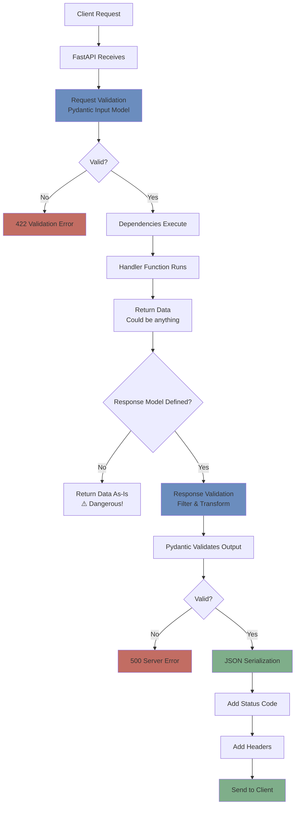

# Day 6: Response Handling & Response Models

**Date**: Week 3, Day 6  
**Phase**: 2 - FastAPI Mastery  
**Topic**: Mastering Response Models, Status Codes, and Response Types

---

## Table of Contents

1. [Understanding Response Handling](#understanding-response-handling)
2. [Response Models with Pydantic](#response-models-with-pydantic)
3. [Response Model Parameters](#response-model-parameters)
4. [HTTP Status Codes](#http-status-codes)
5. [Multiple Response Models](#multiple-response-models)
6. [Custom Response Classes](#custom-response-classes)
7. [Response Headers](#response-headers)
8. [File Responses](#file-responses)
9. [Streaming Responses](#streaming-responses)
10. [Complete Practical Examples](#complete-practical-examples)

---

## Understanding Response Handling

### What is Response Handling?

Response handling is the process of controlling what data your API sends back to clients. Just as validation ensures **incoming** data is correct, response handling ensures **outgoing** data is correct, secure, and well-formatted.

**Think of it like a restaurant:**

```
WITHOUT proper response handling (bad restaurant):
Customer orders: "Caesar salad"
Kitchen sends:
- The salad
- Secret recipe
- Cost breakdown
- Chef's personal notes
- Kitchen inventory

Result: Customer gets too much information, including secrets!

WITH proper response handling (good restaurant):
Customer orders: "Caesar salad"
Kitchen sends:
- The salad (what was requested)
- Garnish (presentation)

Result: Customer gets exactly what they need, nothing more!
```

This is what response models do—they control exactly what data leaves your API.

### Why Response Handling Matters

Let's explore real consequences of poor response handling:

#### 1. Security Leaks

**The Password Leak:**

```python
from pydantic import BaseModel

class User(BaseModel):
    id: int
    username: str
    email: str
    password_hash: str  # ⚠️ Sensitive!
    is_active: bool

# WITHOUT response model - DANGEROUS!
@app.get("/users/{user_id}")
async def get_user_bad(user_id: int, db: Session = Depends(get_db)):
    user = db.query(User).filter(User.id == user_id).first()
    return user  # Returns EVERYTHING including password_hash!

"""
Response:
{
  "id": 1,
  "username": "alice",
  "email": "alice@example.com",
  "password_hash": "$2b$12$KIXxP4ZP...",  ← LEAKED!
  "is_active": true
}

Attacker now has password hash for cracking!
"""

# WITH response model - SAFE!
class UserResponse(BaseModel):
    id: int
    username: str
    email: str
    is_active: bool
    # No password_hash!

@app.get("/users/{user_id}", response_model=UserResponse)
async def get_user_safe(user_id: int, db: Session = Depends(get_db)):
    user = db.query(User).filter(User.id == user_id).first()
    return user  # Only UserResponse fields are sent!

"""
Response:
{
  "id": 1,
  "username": "alice",
  "email": "alice@example.com",
  "is_active": true
}

Password hash is filtered out automatically!
"""
```

**Impact without response models:**

- Sensitive data leaked (passwords, tokens, internal IDs)
- Privacy violations (GDPR, CCPA)
- Security vulnerabilities
- Legal liability

#### 2. Over-fetching (Performance Issues)

**The Relationship Explosion:**

```python
class Post(BaseModel):
    id: int
    title: str
    content: str
    author: User  # Includes full user object
    comments: list[Comment]  # All comments
    likes: list[Like]  # All likes
    tags: list[Tag]  # All tags
    created_at: datetime
    updated_at: datetime

# WITHOUT response model
@app.get("/posts")
async def list_posts(db: Session = Depends(get_db)):
    posts = db.query(Post).all()
    return posts  # Returns EVERYTHING!

"""
Response for 100 posts:
- 100 full user objects
- 5,000 comments
- 10,000 likes
- 500 tags

Response size: 50+ MB!
Load time: 10+ seconds
Database queries: 100+ queries (N+1 problem)
"""

# WITH response model
class PostListResponse(BaseModel):
    id: int
    title: str
    author_name: str  # Just the name, not full object
    comment_count: int  # Just the count
    like_count: int  # Just the count
    created_at: datetime

@app.get("/posts", response_model=list[PostListResponse])
async def list_posts(db: Session = Depends(get_db)):
    posts = db.query(Post).all()
    return posts  # Only specified fields sent!

"""
Response for 100 posts:
- 100 post summaries
- No nested objects

Response size: 50 KB
Load time: 0.2 seconds
Database queries: 1-2 queries
"""
```

**Impact without response models:**

- Slow API responses
- High bandwidth costs
- Poor user experience
- Server overload

#### 3. API Contract Violations

**The Breaking Change:**

```python
# Version 1: Original API
@app.get("/products/{id}")
async def get_product(id: int):
    product = db.get_product(id)
    return product  # Returns whatever Product has

"""
Response:
{
  "id": 1,
  "name": "Laptop",
  "price": 999.99
}
"""

# Developer adds new field to Product model
class Product:
    id: int
    name: str
    price: float
    internal_cost: float  # ← New field added
    supplier_id: int  # ← New field added

# Version 2: API now leaks internal data!
@app.get("/products/{id}")
async def get_product(id: int):
    product = db.get_product(id)
    return product  # Now returns internal fields!

"""
Response:
{
  "id": 1,
  "name": "Laptop",
  "price": 999.99,
  "internal_cost": 600.00,  ← Leaked business data!
  "supplier_id": 42  ← Leaked internal ID!
}

Client applications may break!
Business data exposed!
"""

# WITH response model - API contract protected
class ProductResponse(BaseModel):
    id: int
    name: str
    price: float

@app.get("/products/{id}", response_model=ProductResponse)
async def get_product(id: int):
    product = db.get_product(id)
    return product  # Always returns only specified fields

"""
Response (always consistent):
{
  "id": 1,
  "name": "Laptop",
  "price": 999.99
}

New fields don't leak!
API contract maintained!
"""
```

**Impact without response models:**

- Breaking changes to API
- Client applications fail
- Inconsistent responses
- No API versioning control

### The Request-Response Lifecycle

Understanding where response handling fits:



**Key insight:** Response models validate and filter **outgoing** data, just like request models validate **incoming** data!

### Response Model Benefits

**1. Security through filtering:**

```python
# Database model has sensitive fields
class User:
    id: int
    username: str
    email: str
    password_hash: str  # Sensitive
    api_key: str  # Sensitive
    internal_notes: str  # Sensitive

# Response model only exposes safe fields
class UserResponse(BaseModel):
    id: int
    username: str
    email: str

# Automatic filtering!
@app.get("/users/{id}", response_model=UserResponse)
async def get_user(id: int):
    user = db.get(id)
    return user  # password_hash, api_key, internal_notes filtered out!
```

**2. Documentation:**

```python
@app.get("/users/{id}", response_model=UserResponse)
async def get_user(id: int):
    """
    FastAPI automatically generates OpenAPI docs showing:
    - Exact response structure
    - Field types
    - Field descriptions
    - Example responses

    Developers know exactly what to expect!
    """
    pass
```

**3. Validation:**

```python
class ProductResponse(BaseModel):
    price: float = Field(..., gt=0)
    rating: float = Field(..., ge=0, le=5)

@app.get("/products/{id}", response_model=ProductResponse)
async def get_product(id: int):
    product = db.get(id)
    return product
    # If price is negative or rating > 5, FastAPI returns 500
    # This catches data corruption bugs!
```

**4. Transformation:**

```python
class UserResponse(BaseModel):
    username: str
    email: str
    member_since: str  # String format

    @field_validator('email')
    @classmethod
    def mask_email(cls, v):
        # Transform email: alice@example.com → a****@example.com
        name, domain = v.split('@')
        return f"{name[0]}{'*' * (len(name)-1)}@{domain}"

@app.get("/users/{id}", response_model=UserResponse)
async def get_user(id: int):
    user = db.get(id)
    return user  # Email automatically masked!
```

### When Response Models Are Essential

**Always use response models when:**

| Scenario                  | Risk Without                | Example                              |
| ------------------------- | --------------------------- | ------------------------------------ |
| Returning database models | Leak sensitive fields       | User passwords, internal IDs         |
| Listing multiple items    | Over-fetching, performance  | Product lists with all relationships |
| Different user roles      | Leak admin-only data        | Regular user seeing admin fields     |
| API versioning            | Breaking changes            | New fields break clients             |
| Nested relationships      | N+1 queries, huge responses | Posts with all comments              |
| Computed fields           | Inconsistent calculation    | Totals, counts, summaries            |

**Response models are optional only when:**

- Simple scalar values (`return {"count": 10}`)
- Already using explicit dict (`return {"status": "ok"}`)
- Internal endpoints (not public API)
- Prototyping (but add them before production!)

---

## Response Models with Pydantic

Response models use Pydantic just like request models, but they filter and validate **outgoing** data.

### Basic Response Model

```python
from fastapi import FastAPI
from pydantic import BaseModel

app = FastAPI()

# Database model (what's in database)
class UserDB(BaseModel):
    id: int
    username: str
    email: str
    password_hash: str
    is_active: bool
    created_at: str

# Response model (what clients see)
class UserResponse(BaseModel):
    id: int
    username: str
    email: str
    is_active: bool

@app.get("/users/{user_id}", response_model=UserResponse)
async def get_user(user_id: int):
    """
    Return user data.

    Database has password_hash and created_at,
    but response_model filters them out automatically.
    """
    # Simulate database query
    user = UserDB(
        id=user_id,
        username="alice",
        email="alice@example.com",
        password_hash="$2b$12$secret",
        is_active=True,
        created_at="2024-01-01"
    )

    # Return full database object
    return user

"""
What happens:
1. Handler returns UserDB with all fields
2. FastAPI sees response_model=UserResponse
3. FastAPI filters to only UserResponse fields
4. Client receives only: id, username, email, is_active

Response:
{
  "id": 1,
  "username": "alice",
  "email": "alice@example.com",
  "is_active": true
}

password_hash and created_at are automatically removed!
"""
```

### Response Models for Different Operations

**List operations:**

```python
class PostSummary(BaseModel):
    """Lightweight model for listing posts"""
    id: int
    title: str
    author_name: str
    created_at: str

class PostDetail(BaseModel):
    """Detailed model for single post"""
    id: int
    title: str
    content: str
    author_name: str
    author_email: str
    tags: list[str]
    comment_count: int
    created_at: str
    updated_at: str

@app.get("/posts", response_model=list[PostSummary])
async def list_posts():
    """
    List posts - minimal data for performance.

    Returns list of PostSummary objects.
    """
    posts = get_all_posts()
    return posts

@app.get("/posts/{post_id}", response_model=PostDetail)
async def get_post(post_id: int):
    """
    Get single post - full details.

    Returns PostDetail with all information.
    """
    post = get_post_by_id(post_id)
    return post

"""
GET /posts response (fast, small):
[
  {
    "id": 1,
    "title": "First Post",
    "author_name": "Alice",
    "created_at": "2024-01-01"
  },
  {
    "id": 2,
    "title": "Second Post",
    "author_name": "Bob",
    "created_at": "2024-01-02"
  }
]

GET /posts/1 response (detailed):
{
  "id": 1,
  "title": "First Post",
  "content": "Full content here...",
  "author_name": "Alice",
  "author_email": "alice@example.com",
  "tags": ["python", "fastapi"],
  "comment_count": 42,
  "created_at": "2024-01-01",
  "updated_at": "2024-01-05"
}
"""
```

### Nested Response Models

**Handling relationships:**

```python
class AuthorResponse(BaseModel):
    """Author information"""
    id: int
    username: str
    # Not including: email, password_hash

class CommentResponse(BaseModel):
    """Comment information"""
    id: int
    content: str
    author: AuthorResponse  # Nested model
    created_at: str

class PostWithComments(BaseModel):
    """Post with nested comments"""
    id: int
    title: str
    content: str
    author: AuthorResponse  # Nested model
    comments: list[CommentResponse]  # List of nested models
    created_at: str

@app.get("/posts/{post_id}", response_model=PostWithComments)
async def get_post_with_comments(post_id: int):
    """
    Return post with nested author and comments.

    Each nested object is validated and filtered by its response model.
    """
    post = get_post_with_relationships(post_id)
    return post

"""
Response:
{
  "id": 1,
  "title": "FastAPI Tips",
  "content": "Here are some tips...",
  "author": {
    "id": 1,
    "username": "alice"
  },
  "comments": [
    {
      "id": 1,
      "content": "Great post!",
      "author": {
        "id": 2,
        "username": "bob"
      },
      "created_at": "2024-01-02"
    },
    {
      "id": 2,
      "content": "Thanks for sharing!",
      "author": {
        "id": 3,
        "username": "charlie"
      },
      "created_at": "2024-01-03"
    }
  ],
  "created_at": "2024-01-01"
}

Each author and comment is filtered by their response models!
"""
```

### Response Model Inheritance

**DRY principle for response models:**

```python
class BaseResponse(BaseModel):
    """Base response with common fields"""
    id: int
    created_at: str
    updated_at: str

class UserBase(BaseResponse):
    """User fields on top of base"""
    username: str
    email: str

class UserPublic(UserBase):
    """Public user info - no sensitive data"""
    is_active: bool
    # Inherits: id, created_at, updated_at, username, email

class UserPrivate(UserBase):
    """Private user info - includes sensitive data"""
    is_active: bool
    email_verified: bool
    phone: str
    # Inherits: id, created_at, updated_at, username, email

class UserAdmin(UserPrivate):
    """Admin view - all fields"""
    is_staff: bool
    is_superuser: bool
    last_login: str
    # Inherits everything from UserPrivate

@app.get("/users/{user_id}/public", response_model=UserPublic)
async def get_user_public(user_id: int):
    """Anyone can see public info"""
    return get_user(user_id)

@app.get("/users/{user_id}/private", response_model=UserPrivate)
async def get_user_private(
    user_id: int,
    current_user = Depends(get_current_user)
):
    """User can see their own private info"""
    if current_user.id != user_id:
        raise HTTPException(403, "Can only view your own private data")
    return get_user(user_id)

@app.get("/users/{user_id}/admin", response_model=UserAdmin)
async def get_user_admin(
    user_id: int,
    admin = Depends(require_admin)
):
    """Admins see everything"""
    return get_user(user_id)

"""
Same user, three different views:

Public (anyone):
{
  "id": 1,
  "username": "alice",
  "email": "alice@example.com",
  "is_active": true,
  "created_at": "2024-01-01",
  "updated_at": "2024-01-05"
}

Private (user themselves):
{
  "id": 1,
  "username": "alice",
  "email": "alice@example.com",
  "is_active": true,
  "email_verified": true,
  "phone": "+1234567890",
  "created_at": "2024-01-01",
  "updated_at": "2024-01-05"
}

Admin (staff only):
{
  "id": 1,
  "username": "alice",
  "email": "alice@example.com",
  "is_active": true,
  "email_verified": true,
  "phone": "+1234567890",
  "is_staff": false,
  "is_superuser": false,
  "last_login": "2024-01-15T10:30:00",
  "created_at": "2024-01-01",
  "updated_at": "2024-01-05"
}
"""
```

### Computed Fields in Response Models

- Used to expose **derived or calculated values** in API responses.
- Keeps database models simple while enriching response payloads.
- Computation happens at **serialization time**, not stored in the database.

This is commonly used for totals, prices, flags, and display-only values.

---

**Adding calculated fields:**

```python
from pydantic import computed_field

class OrderResponse(BaseModel):
    id: int
    items: list[dict]
    subtotal: float
    tax_rate: float

    @computed_field
    @property
    def tax_amount(self) -> float:
        """Calculate tax from subtotal and rate"""
        return round(self.subtotal * self.tax_rate, 2)

    @computed_field
    @property
    def total(self) -> float:
        """Calculate total including tax"""
        return round(self.subtotal + self.tax_amount, 2)

@app.get("/orders/{order_id}", response_model=OrderResponse)
async def get_order(order_id: int):
    """
    Return order with computed fields.

    Database stores: id, items, subtotal, tax_rate
    Response includes: tax_amount and total (computed)
    """
    order = get_order_from_db(order_id)
    return order

"""
Database has:
{
  "id": 1,
  "items": [...],
  "subtotal": 100.00,
  "tax_rate": 0.10
}

Response includes computed fields:
{
  "id": 1,
  "items": [...],
  "subtotal": 100.00,
  "tax_rate": 0.10,
  "tax_amount": 10.00,  ← Computed
  "total": 110.00  ← Computed
}
"""
```

#### Defining a Response Model with Computed Fields

```python
class OrderResponse(BaseModel):
    id: int
    items: list[dict]
    subtotal: float
    tax_rate: float
```

- Fields above are **persisted fields** coming from the database.
- They form the base data required for computation.

---

#### Computed Field: Tax Amount

```python
@computed_field
@property
def tax_amount(self) -> float:
    return round(self.subtotal * self.tax_rate, 2)
```

- `@computed_field`

  - Marks the property as part of the serialized response.

- `@property`

  - Prevents passing this value during model creation.

- Value is derived from existing fields.

---

#### Computed Field: Total Amount

```python
@computed_field
@property
def total(self) -> float:
    return round(self.subtotal + self.tax_amount, 2)
```

- Builds on another computed field.
- Ensures consistent business logic in one place.

---

#### Using the Model in an Endpoint

```python
@app.get("/orders/{order_id}", response_model=OrderResponse)
async def get_order(order_id: int):
    order = get_order_from_db(order_id)
    return order
```

- Endpoint returns raw database data.
- FastAPI + Pydantic handle computation automatically.

---

#### Data Flow

- Database stores:

  - `id`, `items`, `subtotal`, `tax_rate`

- Response includes:

  - `tax_amount` (computed)
  - `total` (computed)

- No additional logic required in the endpoint.

---

#### Why This Pattern Is Useful

- Avoids storing redundant data
- Keeps calculations centralized
- Produces clean, expressive API responses
- Reduces transformation logic in handlers

---

## Response Model Parameters

FastAPI provides several parameters to control response model behavior.

### `response_model_exclude_unset`

**Exclude fields that were not explicitly set when serializing the response.**

This option controls how FastAPI returns Pydantic models, especially when fields are optional or partially populated.

---

#### Complete Example

```python
class UserResponse(BaseModel):
    username: str
    email: str
    phone: str | None = None
    bio: str | None = None
    website: str | None = None


@app.get(
    "/users/{user_id}",
    response_model=UserResponse,
    response_model_exclude_unset=True
)
async def get_user(user_id: int):
    """
    Only return fields that were explicitly set.

    If a field was never set or explicitly provided,
    it will be excluded from the response.
    """
    user = UserResponse(
        username="alice",
        email="alice@example.com",
        phone=None,            # Explicitly unset
        bio="Python developer" # Explicitly set
        # website not provided at all
    )
    return user
```

---

#### Behavior Explained

- `response_model_exclude_unset=True`

  - Removes fields that were **not set during model creation**.
  - Applies only at **response serialization time**.

---

#### Serialization Difference

**Without `response_model_exclude_unset`:**

```json
{
  "username": "alice",
  "email": "alice@example.com",
  "phone": null,
  "bio": "Python developer",
  "website": null
}
```

**With `response_model_exclude_unset=True`:**

```json
{
  "username": "alice",
  "email": "alice@example.com",
  "bio": "Python developer"
}
```

- `phone` and `website` are excluded because they were not set.
- Reduces noise from `null` values.

---

#### Common Use Case: Partial Updates (PATCH)

```python
class UserUpdate(BaseModel):
    username: str | None = None
    email: str | None = None
    bio: str | None = None


@app.patch(
    "/users/{user_id}",
    response_model=UserResponse,
    response_model_exclude_unset=True
)
async def update_user(user_id: int, updates: UserUpdate):
    """
    Update only fields provided by the client.

    Response includes only updated fields.
    """
    user = get_user(user_id)

    update_data = updates.model_dump(exclude_unset=True)
    for field, value in update_data.items():
        setattr(user, field, value)

    save_user(user)
    return user
```

---

#### PATCH Request Example

```json
PATCH /users/1
{
  "bio": "Updated bio"
}
```

**Response:**

```json
{
  "bio": "Updated bio"
}
```

- Fields not sent by the client are:

  - Not updated
  - Not included in the response

---

#### Why This Pattern Is Important

- Ideal for PATCH-style APIs
- Prevents returning unnecessary `null` fields
- Makes responses smaller and clearer
- Matches client intent more accurately

### `response_model_exclude_none`

**Exclude fields whose value is `None` in the response.**

This option removes optional fields that resolve to `None`, producing cleaner and more compact API responses.

---

#### Complete Example

```python
class ProductResponse(BaseModel):
    id: int
    name: str
    description: str | None
    discount: float | None
    sale_ends: str | None


@app.get(
    "/products/{id}",
    response_model=ProductResponse,
    response_model_exclude_none=True
)
async def get_product(id: int):
    """
    Exclude fields that are None.
    """
    product = ProductResponse(
        id=1,
        name="Laptop",
        description="Gaming laptop",
        discount=None,   # Explicitly None
        sale_ends=None   # Explicitly None
    )
    return product
```

---

#### Behavior Explained

- `response_model_exclude_none=True`

  - Removes fields whose **final value is `None`**.
  - Applies regardless of whether the field was set or not.

---

#### Serialization Difference

**Without `response_model_exclude_none`:**

```json
{
  "id": 1,
  "name": "Laptop",
  "description": "Gaming laptop",
  "discount": null,
  "sale_ends": null
}
```

**With `response_model_exclude_none=True`:**

```json
{
  "id": 1,
  "name": "Laptop",
  "description": "Gaming laptop"
}
```

- `discount` and `sale_ends` are excluded because their value is `None`.

---

#### How This Differs from `response_model_exclude_unset`

- `response_model_exclude_unset`

  - Excludes fields that were **never set during model creation**.
  - Commonly used for PATCH responses and partial updates.

- `response_model_exclude_none`

  - Excludes fields that are **set but evaluate to `None`**.
  - Commonly used for read APIs with many optional fields.

---

#### Key Distinction

- A field can be:

  - **Unset** → removed by `exclude_unset`
  - **Set to `None`** → removed by `exclude_none`

These options solve similar problems but apply at **different stages of the model lifecycle**.

---

#### When to Use `response_model_exclude_none`

- Read-heavy APIs with optional metadata
- Cleaner responses without `null` values
- Public APIs where response size and clarity matter

### `response_model_exclude_defaults`

**Exclude fields whose value equals the model’s default value.**

This option is useful when responses should only reflect **overrides or deviations** from a known default configuration.

---

#### Complete Example

```python
class ConfigResponse(BaseModel):
    theme: str = "light"
    language: str = "en"
    notifications: bool = True
    auto_save: bool = True


@app.get(
    "/config",
    response_model=ConfigResponse,
    response_model_exclude_defaults=True
)
async def get_config():
    """
    Only return non-default values.
    """
    config = ConfigResponse(
        theme="dark",        # Non-default
        language="en",       # Default
        notifications=True,  # Default
        auto_save=False      # Non-default
    )
    return config
```

---

#### Behavior Explained

- `response_model_exclude_defaults=True`

  - Removes fields whose value matches the model’s default.
  - Comparison is done against the **declared default**, not database values.

---

#### Serialization Difference

**Without `response_model_exclude_defaults`:**

```json
{
  "theme": "dark",
  "language": "en",
  "notifications": true,
  "auto_save": false
}
```

**With `response_model_exclude_defaults=True`:**

```json
{
  "theme": "dark",
  "auto_save": false
}
```

- Fields that remain at default values are excluded.
- Only explicit configuration changes are returned.

---

#### How This Differs from Other Exclusion Options

- `response_model_exclude_unset`

  - Excludes fields that were never set.
  - Focused on **input intent** (what the client sent).

- `response_model_exclude_none`

  - Excludes fields with value `None`.
  - Focused on **optional data cleanliness**.

- `response_model_exclude_defaults`

  - Excludes fields equal to default values.
  - Focused on **configuration overrides**.

---

#### When to Use `response_model_exclude_defaults`

- Configuration and settings APIs
- Feature-flag style responses
- APIs where defaults are well-known
- Reducing response payload size while preserving meaning

### `response_model_include` and `response_model_exclude`

**Fine-grained control over which fields appear in the response.**

These options allow you to explicitly **whitelist** or **blacklist** fields at the endpoint level without creating multiple response models.

---

#### Complete Model

```python
class UserComplete(BaseModel):
    id: int
    username: str
    email: str
    phone: str
    bio: str
    website: str
    created_at: str
    updated_at: str
```

- Represents a full user record.
- Used as a base model for multiple response shapes.

---

#### Include Specific Fields

```python
@app.get(
    "/users/{id}/summary",
    response_model=UserComplete,
    response_model_include={"id", "username", "email"}
)
async def get_user_summary(id: int):
    """
    Include only specific fields.
    """
    user = get_complete_user(id)
    return user
```

- `response_model_include`

  - Acts as a **whitelist**.
  - Only listed fields are returned.

- Useful for lightweight or summary endpoints.

**Response:**

```json
{
  "id": 1,
  "username": "alice",
  "email": "alice@example.com"
}
```

---

#### Exclude Specific Fields

```python
@app.get(
    "/users/{id}/public",
    response_model=UserComplete,
    response_model_exclude={"phone", "email", "created_at", "updated_at"}
)
async def get_user_public(id: int):
    """
    Exclude specific fields.
    """
    user = get_complete_user(id)
    return user
```

- `response_model_exclude`

  - Acts as a **blacklist**.
  - All fields except the excluded ones are returned.

- Useful for removing sensitive or internal fields.

**Response:**

```json
{
  "id": 1,
  "username": "alice",
  "bio": "Python developer",
  "website": "https://alice.dev"
}
```

---

#### Choosing the Right Parameter

| Parameter                         | Best Used When                | Typical Use Case                 |
| --------------------------------- | ----------------------------- | -------------------------------- |
| `response_model_exclude_unset`    | Partial or sparse data        | PATCH endpoints                  |
| `response_model_exclude_none`     | Optional fields may be `None` | Product or metadata APIs         |
| `response_model_exclude_defaults` | Defaults are implicit         | Configuration / settings APIs    |
| `response_model_include`          | Small, explicit field subset  | Summary or lightweight endpoints |
| `response_model_exclude`          | Removing sensitive fields     | Public-facing responses          |

---

#### Key Notes

- `include` and `exclude` operate **after** model validation.
- They do not change the model itself, only the serialized output.
- Prefer `include` for strict contracts and `exclude` for flexibility.

## HTTP Status Codes

Status codes communicate the result of an HTTP request. Using the correct status code is essential for clear API communication, proper client behavior, and easier debugging.

---

### Understanding Status Codes

HTTP status codes are grouped into categories based on their first digit. Each group represents a broad class of outcomes.

```
1xx: Informational
2xx: Success
3xx: Redirection
4xx: Client Error
5xx: Server Error
```

---

**1xx – Informational**

- Indicates the request was received and is being processed.
- Rarely used in REST APIs.
- Typically handled at the protocol level, not application logic.

---

**2xx – Success**

- Confirms the request was successfully handled.
- The most common category for normal API responses.
- Indicates the server understood and processed the request correctly.

---

**3xx – Redirection**

- Indicates the client must take additional action.
- Usually involves a different URL or cached response.
- Less common in JSON-based APIs.

---

**4xx – Client Error**

- The request is invalid or cannot be processed as sent.
- Indicates a problem on the client side.
- Often caused by invalid input, missing data, or lack of authorization.

---

**5xx – Server Error**

- The server failed to process a valid request.
- Indicates an issue in server logic or infrastructure.
- Clients typically cannot fix these errors directly.

### Common Success Codes (2xx)

```python
from fastapi import status

# 200 OK - Standard success
@app.get("/items", status_code=status.HTTP_200_OK)
async def list_items():
    """
    Default status code - request succeeded.

    Use for: GET requests that return data
    """
    return {"items": ["item1", "item2"]}

# 201 Created - Resource created
@app.post("/items", status_code=status.HTTP_201_CREATED)
async def create_item(item: ItemCreate):
    """
    Resource successfully created.

    Use for: POST requests that create new resources
    """
    new_item = save_item(item)
    return new_item

# 202 Accepted - Request accepted for processing
@app.post("/tasks", status_code=status.HTTP_202_ACCEPTED)
async def create_task(task: TaskCreate):
    """
    Request accepted but not yet processed.

    Use for: Async operations, background tasks
    """
    task_id = queue_task(task)
    return {"task_id": task_id, "status": "queued"}

# 204 No Content - Success but no response body
@app.delete("/items/{id}", status_code=status.HTTP_204_NO_CONTENT)
async def delete_item(id: int):
    """
    Successfully deleted, no content to return.

    Use for: DELETE requests, successful operations with no data to return
    """
    delete_item_by_id(id)
    return  # Empty response with 204
```

### Common Client Error Codes (4xx)

```python
from fastapi import HTTPException, status

# 400 Bad Request - Invalid request data
@app.post("/items")
async def create_item(item: ItemCreate):
    """
    Client sent invalid data.

    Use for: Validation errors not caught by Pydantic, business rule violations
    """
    if item.price < 0:
        raise HTTPException(
            status_code=status.HTTP_400_BAD_REQUEST,
            detail="Price cannot be negative"
        )
    return create_new_item(item)

# 401 Unauthorized - Authentication required
@app.get("/protected")
async def protected_route(token: str | None = Header(None)):
    """
    User must authenticate.

    Use for: Missing or invalid authentication credentials
    """
    if not token:
        raise HTTPException(
            status_code=status.HTTP_401_UNAUTHORIZED,
            detail="Authentication required",
            headers={"WWW-Authenticate": "Bearer"}
        )
    return {"data": "protected"}

# 403 Forbidden - Authenticated but not authorized
@app.delete("/users/{user_id}")
async def delete_user(user_id: int, current_user = Depends(get_current_user)):
    """
    User authenticated but doesn't have permission.

    Use for: User lacks required permissions/role
    """
    if current_user.role != "admin":
        raise HTTPException(
            status_code=status.HTTP_403_FORBIDDEN,
            detail="Admin access required"
        )
    delete_user_by_id(user_id)

# 404 Not Found - Resource doesn't exist
@app.get("/items/{id}")
async def get_item(id: int):
    """
    Requested resource not found.

    Use for: Resource with given ID doesn't exist
    """
    item = get_item_by_id(id)
    if not item:
        raise HTTPException(
            status_code=status.HTTP_404_NOT_FOUND,
            detail=f"Item {id} not found"
        )
    return item

# 409 Conflict - Request conflicts with current state
@app.post("/users")
async def create_user(user: UserCreate):
    """
    Request conflicts with existing data.

    Use for: Duplicate resources, conflicting updates
    """
    if username_exists(user.username):
        raise HTTPException(
            status_code=status.HTTP_409_CONFLICT,
            detail="Username already exists"
        )
    return create_new_user(user)

# 422 Unprocessable Entity - Validation failed
# (FastAPI uses this automatically for Pydantic validation)

# 429 Too Many Requests - Rate limit exceeded
@app.get("/api/data")
async def get_data(user_id: int):
    """
    Client exceeded rate limit.

    Use for: Rate limiting
    """
    if rate_limit_exceeded(user_id):
        raise HTTPException(
            status_code=status.HTTP_429_TOO_MANY_REQUESTS,
            detail="Rate limit exceeded. Try again in 60 seconds.",
            headers={"Retry-After": "60"}
        )
    return get_user_data(user_id)
```

### Common Server Error Codes (5xx)

```python
# 500 Internal Server Error - Unexpected server error
# (FastAPI returns this automatically for unhandled exceptions)

# 503 Service Unavailable - Server temporarily unavailable
@app.get("/health")
async def health_check():
    """
    Server cannot handle request (maintenance, overload).

    Use for: Database down, dependency unavailable
    """
    if not database_is_connected():
        raise HTTPException(
            status_code=status.HTTP_503_SERVICE_UNAVAILABLE,
            detail="Database unavailable"
        )
    return {"status": "healthy"}
```

### Dynamic Status Codes

- Allows an endpoint to return **different HTTP status codes** based on runtime conditions.
- Useful when the same endpoint can result in multiple valid outcomes.
- Common in **upsert**, **conditional create**, and **state-based** operations.

---

#### Complete Example

```python
from fastapi import Response, status

@app.put("/items/{id}")
async def upsert_item(id: int, item: ItemCreate, response: Response):
    """
    Create or update an item.

    - 201 Created → item did not exist and was created
    - 200 OK → item already existed and was updated
    """
    existing = get_item_by_id(id)

    if existing:
        update_item(id, item)
        response.status_code = status.HTTP_200_OK
        return {"message": "Item updated", "id": id}
    else:
        create_item_with_id(id, item)
        response.status_code = status.HTTP_201_CREATED
        return {"message": "Item created", "id": id}
```

---

#### How This Works

- `response: Response`

  - Injects the raw response object.
  - Allows modifying metadata such as the status code.

- `response.status_code = ...`

  - Overrides the default status code for the current request.
  - Must be set **before returning** the response body.

---

#### Request Outcomes

```
PUT /items/1   (item does not exist)
→ 201 Created

PUT /items/1   (item already exists)
→ 200 OK
```

- The same endpoint and HTTP method can express different results.
- Clients can react correctly based on the status code alone.

---

#### When to Use Dynamic Status Codes

- Upsert endpoints (`create or update`)
- Conditional resource creation
- State transitions with multiple valid outcomes
- APIs where status conveys important semantic meaning

### Status Code Best Practices

**Decision tree for choosing status codes:**

```python
def choose_status_code(operation, result):
    """
    Decision tree for status codes.
    """
    if result == "success":
        if operation == "GET":
            return 200  # OK
        elif operation == "POST":
            return 201  # Created
        elif operation == "PUT" or operation == "PATCH":
            return 200  # OK (or 204 if no content)
        elif operation == "DELETE":
            return 204  # No Content

    elif result == "client_error":
        if error_type == "validation":
            return 422  # Unprocessable Entity
        elif error_type == "not_found":
            return 404  # Not Found
        elif error_type == "authentication":
            return 401  # Unauthorized
        elif error_type == "authorization":
            return 403  # Forbidden
        elif error_type == "conflict":
            return 409  # Conflict
        else:
            return 400  # Bad Request

    elif result == "server_error":
        if error_type == "unavailable":
            return 503  # Service Unavailable
        else:
            return 500  # Internal Server Error
```

---

## Multiple Response Models

Different endpoints can return **different response shapes** depending on the outcome. FastAPI supports this explicitly and documents it in OpenAPI.

---

### Responses Parameter

- Used to document **multiple possible responses** for a single endpoint.
- Each status code can have:

  - Its own response model
  - Description
  - Example payload

- Improves API clarity for clients and tooling.

---

#### Complete Example

```python
from fastapi import status, HTTPException
from pydantic import BaseModel

class ItemResponse(BaseModel):
    id: int
    name: str
    price: float

class ErrorResponse(BaseModel):
    detail: str
    error_code: str


@app.get(
    "/items/{id}",
    response_model=ItemResponse,
    responses={
        200: {
            "description": "Item found",
            "model": ItemResponse
        },
        404: {
            "description": "Item not found",
            "model": ErrorResponse,
            "content": {
                "application/json": {
                    "example": {
                        "detail": "Item not found",
                        "error_code": "ITEM_NOT_FOUND"
                    }
                }
            }
        }
    }
)
async def get_item(id: int):
    """
    Get item by ID.

    Returns different response models based on outcome.
    """
    item = get_item_by_id(id)
    if not item:
        raise HTTPException(
            status_code=status.HTTP_404_NOT_FOUND,
            detail="Item not found"
        )
    return item
```

---

#### How This Works

- `response_model`

  - Defines the **default success response** (usually `2xx`).

- `responses`

  - Maps status codes to alternate response definitions.
  - Each entry can define its own model and example.

---

#### Documented Outcomes

- **200 OK**

  - Response model: `ItemResponse`
  - Returned when the item exists.

- **404 Not Found**

  - Response model: `ErrorResponse`
  - Returned when the item does not exist.
  - Includes a documented example for clients.

---

#### Why This Pattern Is Important

- Makes error responses explicit and typed
- Improves OpenAPI / Swagger documentation
- Helps frontend and API consumers handle errors correctly
- Avoids undocumented or ambiguous error shapes

### Union Response Models

Use **Union response models** when an endpoint can legitimately return **different response shapes** depending on the outcome (e.g., success vs failure).

FastAPI will validate the returned data against **each model in the Union**, in order.

---

#### Why Union Response Models Matter

- Real-world APIs often return **different schemas** for success and error
- Improves **type safety** and **documentation**
- Both responses are visible in **OpenAPI / Swagger UI**
- Keeps logic explicit instead of returning loosely structured `dict`s

---

#### Complete Example

```python
from typing import Union
from fastapi import FastAPI
from pydantic import BaseModel

app = FastAPI()

class SuccessResponse(BaseModel):
    status: str = "success"
    data: dict

class ErrorResponse(BaseModel):
    status: str = "error"
    message: str
    code: str

class ProcessingError(Exception):
    pass

def process(data: dict) -> dict:
    if "value" not in data:
        raise ProcessingError("Missing required field: value")
    return {"processed_value": data["value"] * 2}

@app.post(
    "/process",
    response_model=Union[SuccessResponse, ErrorResponse]
)
async def process_data(data: dict):
    """
    Process input data.

    Returns:
    - SuccessResponse if processing succeeds
    - ErrorResponse if processing fails
    """
    try:
        result = process(data)
        return SuccessResponse(data=result)
    except ProcessingError as e:
        return ErrorResponse(
            message=str(e),
            code="PROCESSING_FAILED"
        )
```

---

#### Example Responses

**Success response**

```json
{
  "status": "success",
  "data": {
    "processed_value": 10
  }
}
```

**Error response**

```json
{
  "status": "error",
  "message": "Missing required field: value",
  "code": "PROCESSING_FAILED"
}
```

---

#### How FastAPI Handles Union Models

- FastAPI checks the returned object against each model
- The **first matching model** is used
- Validation errors occur if the response matches **none** of the models

---

#### Best Practices

**Use Union response models when:**

- Success and error responses have **clearly different schemas**
- You want accurate API documentation
- You want strict validation instead of ad-hoc error objects

**Avoid Union response models when:**

- Only the HTTP status code differs (prefer `responses={}` instead)
- Responses share the same structure (use a single model)

---

#### Common Pitfalls

- Overlapping fields between models can cause **ambiguous validation**
- Order of models in `Union[...]` matters
- For large APIs, consider a **standard error envelope** pattern

---

#### Comparison with Other Approaches

| Approach                     | Use Case                              |
| ---------------------------- | ------------------------------------- |
| `Union[ModelA, ModelB]`      | Different response schemas            |
| `responses={...}`            | Documenting status-specific responses |
| Single response model        | Same schema, different status codes   |
| Raising `HTTPException` only | Simple error handling, less structure |

---

This pattern is especially useful for **processing APIs, workflows, and async jobs** where success and failure payloads differ significantly.

## Custom Response Classes

FastAPI allows you to return **different response types** depending on what your endpoint needs to send back. While JSON is the default, you can explicitly control **content type, headers, status codes, and serialization behavior** using response classes.

---

### JSONResponse (Default)

`JSONResponse` is the standard response type used by FastAPI when you return a Python `dict` or `list`.

FastAPI automatically:

- Serializes data to JSON
- Sets `Content-Type: application/json`
- Applies the correct status code (default: `200 OK`)

---

#### Implicit JSONResponse

```python
@app.get("/items")
async def list_items():
    """
    Default response type: JSONResponse.

    FastAPI automatically converts the dict to JSON.
    """
    return {"items": ["item1", "item2"]}
```

**Actual response sent**

```http
HTTP/1.1 200 OK
Content-Type: application/json
```

```json
{
  "items": ["item1", "item2"]
}
```

---

#### Explicit JSONResponse

Use `JSONResponse` directly when you need **more control** over the response.

```python
from fastapi.responses import JSONResponse

@app.get("/custom-json")
async def custom_json():
    """
    Explicit JSONResponse.

    Useful when setting custom headers or status codes.
    """
    return JSONResponse(
        content={"message": "Custom JSON"},
        status_code=200,
        headers={"X-Custom-Header": "value"}
    )
```

---

#### When to Use Explicit JSONResponse

Use `JSONResponse` explicitly when you need to:

- Add **custom HTTP headers**
- Return a **non-standard status code**
- Bypass response model validation
- Return raw JSON without Pydantic serialization

---

#### JSONResponse vs response_model

| Feature                 | response_model | JSONResponse |
| ----------------------- | -------------- | ------------ |
| Automatic validation    | Yes            | No           |
| Automatic serialization | Yes            | Manual       |
| Custom headers          | Limited        | Full control |
| Custom status codes     | Limited        | Full control |
| OpenAPI documentation   | Yes            | No           |

---

#### Best Practices

- Prefer **`response_model`** for normal API responses
- Use **`JSONResponse`** for edge cases requiring full HTTP control
- Avoid mixing `response_model` and manual `JSONResponse` unless intentional

### PlainTextResponse

`PlainTextResponse` is used when you want to return **raw text** instead of JSON. This is useful for simple messages, health checks, or compatibility with systems that don’t expect JSON.

---

#### Complete Example

```python
from fastapi.responses import PlainTextResponse

@app.get("/plain", response_class=PlainTextResponse)
async def plain_text():
    """
    Return plain text instead of JSON.

    Content-Type: text/plain
    """
    return "This is plain text"
```

---

#### Response Details

- **Content-Type:** `text/plain`
- **Response Body:** Raw string (no JSON serialization)

```http
HTTP/1.1 200 OK
Content-Type: text/plain
```

```
This is plain text
```

---

#### When to Use PlainTextResponse

- Health check endpoints (`/health`, `/ping`)
- Simple status or acknowledgment messages
- Integrations expecting plain text (CLI tools, legacy systems)
- Avoiding JSON overhead for trivial responses

---

#### PlainTextResponse vs JSONResponse

| Feature            | PlainTextResponse | JSONResponse     |
| ------------------ | ----------------- | ---------------- |
| Content-Type       | text/plain        | application/json |
| Serialization      | None              | JSON encoding    |
| Response body type | str               | dict / list      |
| OpenAPI schema     | Minimal           | Structured       |

---

#### Key Notes

- Returning a string **without** `PlainTextResponse` will still be JSON-encoded by default
- Use `response_class=PlainTextResponse` to force plain text output
- No Pydantic validation is applied to the response body

### HTMLResponse

`HTMLResponse` is used when you want to return **raw HTML content** instead of JSON. This is useful for serving simple web pages, templates rendered as strings, or quick UI/debug views.

---

#### Complete Example

```python
from fastapi.responses import HTMLResponse

@app.get("/html", response_class=HTMLResponse)
async def html_page():
    """
    Return HTML page.

    Content-Type: text/html
    """
    html_content = """
    <html>
        <head><title>FastAPI</title></head>
        <body>
            <h1>Hello from FastAPI!</h1>
            <p>This is an HTML response</p>
        </body>
    </html>
    """
    return html_content
```

---

#### Response Details

- **Content-Type:** `text/html`
- **Response Body:** Raw HTML string

```http
HTTP/1.1 200 OK
Content-Type: text/html
```

Rendered in browser as a web page.

---

#### When to Use HTMLResponse

- Serving simple pages (landing pages, demos, debug UIs)
- Returning server-rendered HTML without a frontend framework
- Prototyping or internal tools
- Email previews or documentation pages

---

#### HTMLResponse vs JSONResponse

| Feature            | HTMLResponse | JSONResponse     |
| ------------------ | ------------ | ---------------- |
| Content-Type       | text/html    | application/json |
| Browser rendering  | Yes          | No               |
| Response body type | HTML string  | dict / list      |
| API-focused        | No           | Yes              |

---

#### Key Notes

- No Pydantic validation is applied to HTML content
- Best for **presentation**, not for data APIs
- For templating, combine with Jinja2 instead of hardcoded strings

### RedirectResponse

`RedirectResponse` is used to **redirect the client to a different URL**. This is commonly used when routes change, resources move, or you want to forward traffic without breaking existing clients.

---

#### Complete Example

```python
from fastapi.responses import RedirectResponse

@app.get("/old-url")
async def old_url():
    """
    Redirect to new URL.

    Uses HTTP redirect status codes.
    """
    return RedirectResponse(
        url="/new-url",
        status_code=307
    )

@app.get("/new-url")
async def new_url():
    return {"message": "This is the new URL"}
```

---

#### How It Works

1. Client requests `/old-url`
2. Server responds with a redirect status code and `Location` header
3. Client automatically makes a new request to `/new-url`

```http
HTTP/1.1 307 Temporary Redirect
Location: /new-url
```

---

#### Common Redirect Status Codes

| Status Code | Meaning            | Use Case                            |
| ----------- | ------------------ | ----------------------------------- |
| 301         | Moved Permanently  | SEO-friendly permanent redirects    |
| 302         | Found (Temporary)  | Legacy, browser-dependent behavior  |
| 307         | Temporary Redirect | Preserves HTTP method (recommended) |
| 308         | Permanent Redirect | Permanent + preserves HTTP method   |

---

#### Why Prefer 307 / 308 in APIs

- Preserve the original HTTP method (POST stays POST)
- Safer and more predictable for API clients
- Recommended by HTTP standards for non-GET redirects

---

#### When to Use RedirectResponse

- Migrating endpoints (`/v1` → `/v2`)
- Deprecating old routes
- Redirecting users to canonical URLs
- Authentication flows (login → dashboard)

---

#### Key Notes

- Redirects are **client-side actions**
- Response body is usually ignored
- Works with browsers, HTTP clients, and API tools
- Not commonly used in pure REST APIs, but very useful for web-facing endpoints

### FileResponse

`FileResponse` is used to **send files directly to the client**. FastAPI automatically handles streaming, headers, and efficient file transfer.

---

#### Complete Example

```python
from fastapi.responses import FileResponse

@app.get("/download")
async def download_file():
    """
    Download a file.

    Automatically sets headers for file transfer.
    """
    file_path = "/path/to/file.pdf"

    return FileResponse(
        path=file_path,
        filename="document.pdf",
        media_type="application/pdf"
    )
```

---

#### What FileResponse Handles Automatically

- Streams the file (does not load entire file into memory)
- Sets `Content-Disposition: attachment`
- Sets correct `Content-Type`
- Supports large files efficiently

---

#### Response Headers (Simplified)

```http
Content-Type: application/pdf
Content-Disposition: attachment; filename="document.pdf"
```

This tells the browser to **download the file instead of displaying JSON**.

---

#### Common Use Cases

- Downloading reports (PDF, CSV, Excel)
- Serving generated files (invoices, receipts)
- Providing static assets behind authentication
- Exporting data

---

#### Important Notes

- `path` must point to a real file on disk
- Use absolute paths in production for safety
- File must exist, otherwise a 404 is raised automatically
- Works with any file type (PDF, images, ZIP, etc.)

---

#### When to Use FileResponse vs StreamingResponse

- **FileResponse** → File already exists on disk
- **StreamingResponse** → File/content generated dynamically

---

#### Security Tip

Always validate:

- File path
- User permissions
- Allowed file types

Especially when file names come from user input.

### StreamingResponse

`StreamingResponse` allows sending **data to the client as a stream** rather than all at once. This is ideal for **large files**, **real-time feeds**, or **generated content**.

---

#### Complete Example: Streaming Text

```python
from fastapi.responses import StreamingResponse

@app.get("/stream")
async def stream_data():
    """
    Stream text data to the client line by line.
    """
    def generate_data():
        for i in range(100):
            yield f"Line {i}\n"

    return StreamingResponse(
        generate_data(),
        media_type="text/plain"
    )
```

- Each line is sent to the client as it is generated
- Reduces memory usage for large content
- Useful for logs, long-running output, or live feeds

---

#### Example: Streaming CSV File

```python
@app.get("/export/csv")
async def export_csv():
    """
    Stream a CSV file for download.
    """
    def generate_csv():
        yield "id,name,price\n"
        for item in get_all_items():
            yield f"{item.id},{item.name},{item.price}\n"

    return StreamingResponse(
        generate_csv(),
        media_type="text/csv",
        headers={"Content-Disposition": "attachment; filename=items.csv"}
    )
```

- Generates the CSV **line by line** on demand
- Sends data without loading all items into memory
- Headers instruct the browser to **download as a file**

---

#### When to Use StreamingResponse

- Large files or datasets
- Dynamic content generation
- Reducing memory usage for big responses
- Real-time streaming (logs, events, feeds)

---

#### Comparison with FileResponse

| Feature      | FileResponse          | StreamingResponse     |
| ------------ | --------------------- | --------------------- |
| Source       | Existing file on disk | Generator / iterator  |
| Memory usage | Efficient             | Highly efficient      |
| Content type | Auto / specified      | Must specify manually |
| Use case     | Static files          | Large/dynamic content |

---

#### Key Notes

- `StreamingResponse` **does not buffer the full response**
- Generator functions (`yield`) are recommended for efficiency
- Can stream any content type: text, CSV, JSONL, binary, etc.

## Response Headers

FastAPI allows adding **custom headers** to responses. Headers can carry metadata, tracing information, or instructions for clients.

---

### Adding Headers

```python
from fastapi import Response

@app.get("/with-headers")
async def with_headers(response: Response):
    """
    Add custom headers to the response.
    """
    # Set custom headers
    response.headers["X-Custom-Header"] = "Custom Value"
    response.headers["X-Request-ID"] = "req-123"

    return {"message": "Response with custom headers"}
```

---

#### Example Response Headers

```http
HTTP/1.1 200 OK
Content-Type: application/json
X-Custom-Header: Custom Value
X-Request-ID: req-123
```

---

#### Key Points

- `response: Response` gives access to raw response object
- Headers can be **dynamic**, e.g., per request or user
- Common use cases:

  - Tracing: `X-Request-ID`
  - Versioning: `X-API-Version`
  - Security / CORS metadata

- Headers are added **before returning** the response body

---

#### Best Practices

- Use **standard headers** where possible (`ETag`, `Cache-Control`)
- Keep custom headers **consistent** across your API
- Avoid exposing sensitive information in headers

### Headers for Caching

FastAPI allows setting **HTTP caching headers** to control how clients and proxies cache responses.

---

#### Complete Example

```python
from fastapi import Response

@app.get("/cached-data")
async def cached_data(response: Response):
    """
    Allow caching of response for 1 hour.
    """
    response.headers["Cache-Control"] = "public, max-age=3600"
    response.headers["ETag"] = "123456"

    return {"data": "This can be cached"}


@app.get("/no-cache")
async def no_cache(response: Response):
    """
    Prevent caching of response.
    """
    response.headers["Cache-Control"] = "no-cache, no-store, must-revalidate"
    response.headers["Pragma"] = "no-cache"
    response.headers["Expires"] = "0"

    return {"data": "This should not be cached"}
```

---

#### How Caching Headers Work

**Cached response**

- `Cache-Control: public, max-age=3600` → client/proxies can cache for 1 hour
- `ETag` → allows conditional requests; server can respond with `304 Not Modified`

**No-cache response**

- `Cache-Control: no-cache, no-store, must-revalidate` → prevents caching
- `Pragma: no-cache` → legacy HTTP/1.0 support
- `Expires: 0` → immediate expiration

---

#### Best Practices

- Use caching headers to **reduce server load** for frequently requested resources
- Use `ETag` for **conditional GETs** to minimize data transfer
- Apply **no-cache headers** for sensitive or dynamic content

---

#### Summary

- `Cache-Control` controls caching behavior
- `ETag` allows clients to validate cached data
- Use `no-cache` headers when content must always be fresh

### Rate Limit Headers

FastAPI allows returning **rate limiting information** via response headers, helping clients manage request quotas.

---

#### Complete Example

```python
from fastapi import Response, HTTPException

@app.get("/rate-limited")
async def rate_limited(response: Response, user_id: int):
    """
    Add rate limit information to headers.
    """
    # Retrieve rate limit info for the user
    limit_info = get_rate_limit_info(user_id)

    # Set headers with rate limit details
    response.headers["X-RateLimit-Limit"] = str(limit_info["limit"])
    response.headers["X-RateLimit-Remaining"] = str(limit_info["remaining"])
    response.headers["X-RateLimit-Reset"] = str(limit_info["reset_time"])

    # If user exceeded limit, return 429 Too Many Requests
    if limit_info["remaining"] <= 0:
        raise HTTPException(
            status_code=429,
            detail="Rate limit exceeded",
            headers={"Retry-After": "60"}
        )

    return {"data": "Success"}
```

---

#### Example Response Headers

```http
X-RateLimit-Limit: 100
X-RateLimit-Remaining: 42
X-RateLimit-Reset: 1640000000
```

---

#### How It Works

- `X-RateLimit-Limit` → total allowed requests in the period
- `X-RateLimit-Remaining` → remaining requests
- `X-RateLimit-Reset` → timestamp when the limit resets
- `Retry-After` → optional header indicating when to retry after exceeding limit

---

#### Best Practices

- Include rate limit headers to **inform clients** of remaining quota
- Always return `429 Too Many Requests` when limit is exceeded
- Use timestamps (`X-RateLimit-Reset`) to allow **smart retries**
- Can integrate with caching or storage (Redis, in-memory) to track requests

---

#### Notes

- Standardizes communication with clients for APIs with request limits
- Useful for public APIs, login endpoints, or high-traffic services

## File Responses

FastAPI allows serving files directly from your API using `FileResponse`. This is useful for downloads, reports, or static assets.

---

### Download Files

```python
from fastapi.responses import FileResponse
from fastapi import HTTPException
import os

@app.get("/files/{filename}")
async def download_file(filename: str):
    """
    Download a file by filename.

    Ensures the file exists and is safe to serve.
    """
    # Security check: prevent path traversal
    if ".." in filename or "/" in filename:
        raise HTTPException(400, "Invalid filename")

    file_path = f"/var/files/{filename}"

    # Validate file exists
    if not os.path.exists(file_path):
        raise HTTPException(404, "File not found")

    return FileResponse(
        path=file_path,
        filename=filename,
        media_type="application/octet-stream"
    )
```

---

#### How It Works

- Validates filename to prevent **path traversal attacks**
- Checks if the file exists on disk; returns `404` if not
- Streams the file efficiently to the client
- Sets headers for download (`Content-Disposition` and `Content-Type`)

---

#### Example Response

```http
GET /files/document.pdf
HTTP/1.1 200 OK
Content-Type: application/pdf
Content-Disposition: attachment; filename="document.pdf"
```

- File contents are streamed directly to the client
- `media_type` can be adjusted for specific file types (e.g., `application/pdf`, `image/png`)

---

#### Best Practices

- Always **validate filenames** to avoid serving unauthorized files
- Use **absolute paths** for file directories
- Restrict file downloads to a **controlled folder**
- Prefer `FileResponse` for existing files; use `StreamingResponse` for dynamically generated content

### Serve Images

You can serve image files directly using `FileResponse`. This is useful for avatars, product images, or any media stored on disk.

---

#### Complete Example

```python
from fastapi.responses import FileResponse
from fastapi import HTTPException

@app.get("/images/{image_id}")
async def get_image(image_id: int):
    """
    Serve image file by ID.

    Returns correct MIME type for browser rendering.
    """
    # Retrieve image record
    image = get_image_by_id(image_id)
    if not image:
        raise HTTPException(404, "Image not found")

    return FileResponse(
        path=image.file_path,
        media_type=image.mime_type  # e.g., "image/jpeg", "image/png"
    )
```

---

#### How It Works

- Fetch image metadata from database or storage
- Validate existence; return `404` if not found
- `media_type` ensures the browser displays the image instead of downloading
- `FileResponse` streams the image efficiently

---

#### Example Use Cases

- User avatars (`/users/{id}/avatar`)
- Product or catalog images (`/products/{id}/image`)
- Media content for blogs or CMS systems

---

#### Key Notes

- Use correct MIME type for proper rendering (`image/jpeg`, `image/png`, etc.)
- Always validate the file exists before serving
- For dynamic images (generated on-the-fly), consider `StreamingResponse` instead of `FileResponse`

### Generated Files

`FileResponse` can also serve **dynamically generated files**. This is useful for reports, CSV exports, or any content created on-the-fly.

---

#### Complete Example

```python
import tempfile
import os
from fastapi.responses import FileResponse

@app.get("/reports/generate")
async def generate_report():
    """
    Generate a report dynamically and return as a file.
    """
    # Create a temporary CSV file
    with tempfile.NamedTemporaryFile(mode='w', delete=False, suffix='.csv') as temp:
        # Write CSV headers
        temp.write("id,name,value\n")
        # Write report data
        for item in get_report_data():
            temp.write(f"{item.id},{item.name},{item.value}\n")
        temp_path = temp.name

    # Return the file as a downloadable response
    response = FileResponse(
        path=temp_path,
        filename="report.csv",
        media_type="text/csv"
    )

    # Schedule file cleanup after response is sent
    response.background = lambda: os.unlink(temp_path)

    return response
```

---

#### How It Works

- Creates a **temporary file** on disk
- Writes data dynamically (CSV, PDF, etc.)
- Returns a `FileResponse` for download
- Cleans up the temporary file **after the response is sent**

---

#### Use Cases

- CSV/Excel exports from database queries
- PDF invoices generated on demand
- Reports for analytics dashboards

---

#### Best Practices

- Use `tempfile` to avoid filename collisions
- Always **clean up temporary files** to avoid disk bloat
- Set appropriate `media_type` for the file format
- Consider **StreamingResponse** for very large or memory-intensive files

---

#### Notes

- `response.background` allows scheduling **post-response tasks**
- Useful for ephemeral files that should not persist on disk
- Ensures efficient and safe file handling in APIs

## Streaming Responses

`StreamingResponse` is used to **send data incrementally** rather than all at once. This is ideal for **large files, live feeds, or real-time updates**. It reduces memory usage and improves responsiveness for clients.

---

### Basic Streaming

```python
from fastapi.responses import StreamingResponse
import asyncio

@app.get("/stream")
async def stream():
    """
    Stream data line by line with simulated delay.
    """
    async def generate():
        for i in range(100):
            yield f"Line {i}\n"
            await asyncio.sleep(0.1)  # Simulate slow data

    return StreamingResponse(generate(), media_type="text/plain")
```

- Sends each line to the client as it is generated
- Useful for logs, progress updates, or long-running computations
- Asynchronous generator allows **non-blocking streaming**

---

### Streaming Large Files

```python
@app.get("/large-file")
async def large_file():
    """
    Stream a large file in chunks.

    Memory efficient - avoids loading the whole file.
    """
    def iterfile():
        with open("large_file.bin", mode="rb") as file:
            while chunk := file.read(8192):  # 8KB per chunk
                yield chunk

    return StreamingResponse(
        iterfile(),
        media_type="application/octet-stream"
    )
```

- Streams file in **small chunks**
- Keeps memory usage low, even for very large files
- Works for any file type: binaries, videos, images

---

### Server-Sent Events (SSE)

```python
import json

@app.get("/events")
async def events():
    """
    Server-Sent Events (SSE) for real-time updates.
    """
    async def event_generator():
        while True:
            data = get_latest_data()
            # SSE format: "data: <message>\n\n"
            yield f"data: {json.dumps(data)}\n\n"
            await asyncio.sleep(1)  # Send updates every second

    return StreamingResponse(
        event_generator(),
        media_type="text/event-stream"
    )
```

- Streams **real-time updates** to clients over HTTP
- Each message is sent as `data: ...\n\n`
- Suitable for live dashboards, notifications, or monitoring systems

---

### Key Points

- Use **StreamingResponse** for:

  - Large files
  - Incremental data generation
  - Real-time event feeds

- Advantages:

  - Reduces memory usage
  - Faster perceived response for clients
  - Works with both synchronous and asynchronous generators

- Difference from `FileResponse`:

  - `FileResponse` → existing file on disk
  - `StreamingResponse` → can generate content on-the-fly or stream dynamically

- Always specify `media_type` for proper client handling (`text/plain`, `application/octet-stream`, `text/event-stream`)

## Complete Practical Examples

### Example 1: Complete CRUD with Response Models

```python
from fastapi import FastAPI, HTTPException, status, Depends
from pydantic import BaseModel, Field
from sqlalchemy.orm import Session

app = FastAPI(title="Blog API")

# Models
class PostCreate(BaseModel):
    """Model for creating posts"""
    title: str = Field(..., min_length=1, max_length=200)
    content: str = Field(..., min_length=1)
    tags: list[str] = Field(default_factory=list)

class PostUpdate(BaseModel):
    """Model for updating posts"""
    title: str | None = None
    content: str | None = None
    tags: list[str] | None = None

class AuthorResponse(BaseModel):
    """Author information in responses"""
    id: int
    username: str

class PostResponse(BaseModel):
    """Complete post response"""
    id: int
    title: str
    content: str
    author: AuthorResponse
    tags: list[str]
    view_count: int
    created_at: str
    updated_at: str

class PostListResponse(BaseModel):
    """Lightweight post for listings"""
    id: int
    title: str
    author: AuthorResponse
    tags: list[str]
    created_at: str

# Endpoints
@app.get(
    "/posts",
    response_model=list[PostListResponse],
    status_code=status.HTTP_200_OK
)
async def list_posts(
    skip: int = 0,
    limit: int = 10,
    db: Session = Depends(get_db)
):
    """
    List posts with pagination.

    Returns lightweight PostListResponse for performance.
    """
    posts = db.query(Post).offset(skip).limit(limit).all()
    return posts

@app.get(
    "/posts/{post_id}",
    response_model=PostResponse,
    responses={
        200: {"description": "Post found"},
        404: {"description": "Post not found"}
    }
)
async def get_post(post_id: int, db: Session = Depends(get_db)):
    """
    Get single post with full details.

    Increments view count and returns PostResponse.
    """
    post = db.query(Post).filter(Post.id == post_id).first()
    if not post:
        raise HTTPException(
            status_code=status.HTTP_404_NOT_FOUND,
            detail=f"Post {post_id} not found"
        )

    # Increment view count
    post.view_count += 1
    db.commit()

    return post

@app.post(
    "/posts",
    response_model=PostResponse,
    status_code=status.HTTP_201_CREATED
)
async def create_post(
    post: PostCreate,
    current_user = Depends(get_current_user),
    db: Session = Depends(get_db)
):
    """
    Create new post.

    Returns created post with 201 status.
    """
    db_post = Post(
        **post.dict(),
        author_id=current_user.id
    )
    db.add(db_post)
    db.commit()
    db.refresh(db_post)
    return db_post

@app.put(
    "/posts/{post_id}",
    response_model=PostResponse,
    responses={
        200: {"description": "Post updated"},
        403: {"description": "Not authorized to update"},
        404: {"description": "Post not found"}
    }
)
async def update_post(
    post_id: int,
    post_update: PostUpdate,
    current_user = Depends(get_current_user),
    db: Session = Depends(get_db)
):
    """
    Update existing post.

    Only author can update their post.
    """
    post = db.query(Post).filter(Post.id == post_id).first()
    if not post:
        raise HTTPException(404, "Post not found")

    if post.author_id != current_user.id:
        raise HTTPException(403, "Not authorized to update this post")

    # Update provided fields
    update_data = post_update.model_dump(exclude_unset=True)
    for field, value in update_data.items():
        setattr(post, field, value)

    db.commit()
    db.refresh(post)
    return post

@app.delete(
    "/posts/{post_id}",
    status_code=status.HTTP_204_NO_CONTENT,
    responses={
        204: {"description": "Post deleted"},
        403: {"description": "Not authorized to delete"},
        404: {"description": "Post not found"}
    }
)
async def delete_post(
    post_id: int,
    current_user = Depends(get_current_user),
    db: Session = Depends(get_db)
):
    """
    Delete post.

    Only author can delete their post.
    Returns 204 No Content on success.
    """
    post = db.query(Post).filter(Post.id == post_id).first()
    if not post:
        raise HTTPException(404, "Post not found")

    if post.author_id != current_user.id:
        raise HTTPException(403, "Not authorized to delete this post")

    db.delete(post)
    db.commit()
    # No return for 204 status
```

### Example 2: File Upload and Download

```python
from fastapi import File, UploadFile
from fastapi.responses import FileResponse, StreamingResponse
import shutil
import os

@app.post("/upload", status_code=status.HTTP_201_CREATED)
async def upload_file(
    file: UploadFile = File(...),
    current_user = Depends(get_current_user)
):
    """
    Upload file.

    Validates file type and size, stores file, returns metadata.
    """
    # Validate file type
    allowed_types = ["image/jpeg", "image/png", "application/pdf"]
    if file.content_type not in allowed_types:
        raise HTTPException(
            400,
            f"File type {file.content_type} not allowed"
        )

    # Validate file size (10 MB max)
    file.file.seek(0, 2)  # Seek to end
    size = file.file.tell()
    file.file.seek(0)  # Seek back to start

    if size > 10 * 1024 * 1024:
        raise HTTPException(400, "File too large (max 10 MB)")

    # Generate unique filename
    file_id = generate_unique_id()
    extension = file.filename.split(".")[-1]
    filename = f"{file_id}.{extension}"
    file_path = f"/var/uploads/{current_user.id}/{filename}"

    # Create directory if needed
    os.makedirs(os.path.dirname(file_path), exist_ok=True)

    # Save file
    with open(file_path, "wb") as buffer:
        shutil.copyfileobj(file.file, buffer)

    # Save metadata to database
    file_record = FileModel(
        id=file_id,
        filename=file.filename,
        file_path=file_path,
        content_type=file.content_type,
        size=size,
        user_id=current_user.id
    )
    db.add(file_record)
    db.commit()

    return {
        "id": file_id,
        "filename": file.filename,
        "size": size,
        "url": f"/files/{file_id}"
    }

@app.get("/files/{file_id}")
async def download_file(
    file_id: str,
    current_user = Depends(get_current_user),
    db: Session = Depends(get_db)
):
    """
    Download file.

    Checks authorization and streams file.
    """
    file_record = db.query(FileModel).filter(FileModel.id == file_id).first()
    if not file_record:
        raise HTTPException(404, "File not found")

    # Check authorization
    if file_record.user_id != current_user.id:
        raise HTTPException(403, "Not authorized to access this file")

    # Stream file
    return FileResponse(
        path=file_record.file_path,
        filename=file_record.filename,
        media_type=file_record.content_type
    )
```

---

## Key Takeaways

1. **Always use response_model** - Filters sensitive data, enforces consistency
2. **Choose correct status codes** - Proper HTTP semantics matter
3. **Different models for different views** - List vs detail, public vs private
4. **Use response parameters** - exclude_unset, exclude_none for cleaner responses
5. **Custom response classes** - FileResponse, StreamingResponse for special cases
6. **Document all responses** - Use responses parameter for OpenAPI docs
7. **Security first** - Never expose sensitive fields without explicit control

---

## Practice Exercises

1. **Create user API** with public/private/admin response models
2. **Build file upload system** with validation and streaming download
3. **Implement CRUD** with appropriate status codes for each operation
4. **Add response headers** for caching and rate limiting
5. **Create streaming endpoint** for real-time data updates

---

**Congratulations!** You've mastered response handling in FastAPI. Tomorrow we'll build a complete mini project using everything learned this week!
