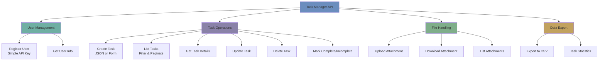

# Day 7: Week 3 Mini Project - Task Manager API

**Date**: Week 3, Day 7  
**Phase**: 2 - FastAPI Mastery  
**Topic**: Building a Complete Task Manager API (Week 3 Concepts Only)

---

## Table of Contents

1. [Project Overview](#project-overview)
2. [What We're Building](#what-were-building)
3. [Project Setup](#project-setup)
4. [Complete Code Implementation](#complete-code-implementation)
5. [Understanding Each Component](#understanding-each-component)
6. [Running the Project](#running-the-project)
7. [Testing the API](#testing-the-api)
8. [Key Learning Points](#key-learning-points)
9. [Extending the Project](#extending-the-project)

---

## Project Overview

### Purpose

This mini project consolidates **everything learned in Week 3** by building a practical Task Manager API. Unlike the phase-end project, this uses **only Week 3 concepts** - no database, no JWT, no background tasks.

### What Makes This Week 3 Appropriate?

**✅ Uses Only Week 3 Topics:**

- FastAPI basics (all HTTP methods)
- Path and query parameters
- Request body validation
- Pydantic models
- Custom validators
- Dependencies (function, class, chains)
- Response models
- Status codes
- File uploads
- Form data
- File responses

**❌ Explicitly Avoids:**

- Databases (uses in-memory storage)
- JWT/OAuth2 (uses simple API key)
- Background tasks
- WebSockets
- Middleware
- Testing frameworks

### Learning Objectives

By completing this project, you will:

1. **Apply request validation** with Pydantic custom validators
2. **Use dependencies** for authentication, pagination, and data access
3. **Implement CRUD operations** with proper HTTP methods
4. **Handle file uploads** and file responses
5. **Create response models** for different views
6. **Use proper status codes** for different operations
7. **Build dependency chains** for complex operations
8. **Handle errors** with appropriate HTTP exceptions

---

## What We're Building

### Task Manager API Features



### Core Features

**1. User System (Simple)**

- Register user (generates API key)
- Store users in-memory
- Authenticate via API key header

**2. Task Management**

- Create tasks (JSON or form data)
- List tasks with filters (status, priority, due date)
- Pagination support
- Get single task details
- Update tasks
- Delete tasks
- Mark as complete/incomplete

**3. File Attachments**

- Upload files to tasks
- Download attachments
- List task attachments
- File validation (size, type)

**4. Data Export**

- Export tasks as CSV
- Task statistics (count by status, priority)

### API Endpoints

```
Authentication:
POST   /api/v1/users/register        - Register new user
GET    /api/v1/users/me              - Get current user info

Tasks:
GET    /api/v1/tasks                 - List tasks (with filters)
POST   /api/v1/tasks                 - Create task (JSON)
POST   /api/v1/tasks/form            - Create task (Form)
GET    /api/v1/tasks/{task_id}       - Get task details
PUT    /api/v1/tasks/{task_id}       - Update task
PATCH  /api/v1/tasks/{task_id}/complete    - Mark complete
PATCH  /api/v1/tasks/{task_id}/incomplete  - Mark incomplete
DELETE /api/v1/tasks/{task_id}       - Delete task

Attachments:
POST   /api/v1/tasks/{task_id}/attachments    - Upload file
GET    /api/v1/tasks/{task_id}/attachments    - List attachments
GET    /api/v1/tasks/{task_id}/attachments/{filename}  - Download

Export:
GET    /api/v1/tasks/export/csv      - Export as CSV
GET    /api/v1/tasks/stats           - Task statistics
```

### Data Models

```python
# User (in-memory)
{
    "username": "john_doe",
    "api_key": "sk_1234567890abcdef",
    "created_at": "2024-01-15T10:30:00"
}

# Task (in-memory)
{
    "id": 1,
    "title": "Learn FastAPI",
    "description": "Complete Week 3 mini project",
    "status": "in_progress",  # pending, in_progress, completed
    "priority": "high",        # low, medium, high
    "due_date": "2024-01-20",
    "attachments": ["document.pdf"],
    "created_at": "2024-01-15T10:30:00",
    "updated_at": "2024-01-15T11:00:00",
    "user": "john_doe"
}
```

---

## Project Setup

### Step 1: Create Project Structure

```bash
# Create project directory
mkdir task-manager-api
cd task-manager-api

# Create virtual environment
python -m venv venv

# Activate virtual environment
# On Windows:
venv\Scripts\activate
# On macOS/Linux:
source venv/bin/activate

# Create directory structure
mkdir -p app uploads
touch app/__init__.py
touch app/main.py
touch app/models.py
touch app/dependencies.py
touch app/storage.py
touch app/utils.py
touch requirements.txt
touch README.md
```

### Step 2: Install Dependencies

```bash
# Create requirements.txt
cat > requirements.txt << 'EOF'
fastapi==0.109.0
uvicorn[standard]==0.27.0
pydantic==2.5.3
python-multipart==0.0.6
EOF

# Install dependencies
pip install -r requirements.txt
```

---

## Complete Code Implementation

### File 1: `app/models.py` - Pydantic Models

```python
"""
Pydantic models for request/response validation.

This file demonstrates:
- BaseModel usage
- Field validation
- Custom validators
- Response models
- Model inheritance
"""

from pydantic import BaseModel, Field, field_validator
from typing import Optional, List
from datetime import datetime, date
from enum import Enum

# Enums for constrained choices
class TaskStatus(str, Enum):
    """Task status enum"""
    PENDING = "pending"
    IN_PROGRESS = "in_progress"
    COMPLETED = "completed"

class TaskPriority(str, Enum):
    """Task priority enum"""
    LOW = "low"
    MEDIUM = "medium"
    HIGH = "high"

# ============================================================================
# USER MODELS
# ============================================================================

class UserRegister(BaseModel):
    """
    User registration request.

    Validates username format and length.
    """
    username: str = Field(
        ...,
        min_length=3,
        max_length=20,
        description="Username (3-20 characters)",
        examples=["john_doe"]
    )

    @field_validator('username')
    @classmethod
    def validate_username(cls, v: str) -> str:
        """
        Validate username format.

        Rules:
        - Only alphanumeric and underscore
        - No spaces
        - Not just numbers
        """
        if not v.replace('_', '').isalnum():
            raise ValueError('Username must contain only letters, numbers, and underscore')

        if v.isdigit():
            raise ValueError('Username cannot be only numbers')

        return v.lower()  # Normalize to lowercase

class UserResponse(BaseModel):
    """
    User response model.

    Returns user information without sensitive data.
    """
    username: str
    created_at: datetime

    class Config:
        json_schema_extra = {
            "example": {
                "username": "john_doe",
                "created_at": "2024-01-15T10:30:00"
            }
        }

class UserWithApiKey(UserResponse):
    """
    User response with API key.

    Only returned during registration.
    """
    api_key: str

    class Config:
        json_schema_extra = {
            "example": {
                "username": "john_doe",
                "api_key": "sk_1234567890abcdef",
                "created_at": "2024-01-15T10:30:00"
            }
        }

# ============================================================================
# TASK MODELS
# ============================================================================

class TaskBase(BaseModel):
    """Base task model with common fields"""
    title: str = Field(
        ...,
        min_length=1,
        max_length=200,
        description="Task title",
        examples=["Complete FastAPI tutorial"]
    )
    description: Optional[str] = Field(
        None,
        max_length=2000,
        description="Task description"
    )
    priority: TaskPriority = Field(
        default=TaskPriority.MEDIUM,
        description="Task priority"
    )
    due_date: Optional[date] = Field(
        None,
        description="Task due date"
    )

    @field_validator('due_date')
    @classmethod
    def validate_due_date(cls, v: Optional[date]) -> Optional[date]:
        """
        Validate due date is not in the past.
        """
        if v and v < date.today():
            raise ValueError('Due date cannot be in the past')
        return v

class TaskCreate(TaskBase):
    """
    Task creation request.

    Inherits validation from TaskBase.
    """
    pass

class TaskUpdate(BaseModel):
    """
    Task update request.

    All fields optional for partial updates.
    """
    title: Optional[str] = Field(None, min_length=1, max_length=200)
    description: Optional[str] = Field(None, max_length=2000)
    priority: Optional[TaskPriority] = None
    due_date: Optional[date] = None

    @field_validator('due_date')
    @classmethod
    def validate_due_date(cls, v: Optional[date]) -> Optional[date]:
        """Validate due date is not in the past"""
        if v and v < date.today():
            raise ValueError('Due date cannot be in the past')
        return v

class TaskListResponse(BaseModel):
    """
    Lightweight task model for list view.

    Used when listing multiple tasks.
    """
    id: int
    title: str
    status: TaskStatus
    priority: TaskPriority
    due_date: Optional[date]
    created_at: datetime

    class Config:
        json_schema_extra = {
            "example": {
                "id": 1,
                "title": "Learn FastAPI",
                "status": "in_progress",
                "priority": "high",
                "due_date": "2024-01-20",
                "created_at": "2024-01-15T10:30:00"
            }
        }

class TaskDetailResponse(TaskListResponse):
    """
    Detailed task model.

    Used when getting single task.
    Includes all fields.
    """
    description: Optional[str]
    attachments: List[str]
    updated_at: Optional[datetime]
    user: str

    class Config:
        json_schema_extra = {
            "example": {
                "id": 1,
                "title": "Learn FastAPI",
                "description": "Complete Week 3 mini project",
                "status": "in_progress",
                "priority": "high",
                "due_date": "2024-01-20",
                "attachments": ["document.pdf"],
                "created_at": "2024-01-15T10:30:00",
                "updated_at": "2024-01-15T11:00:00",
                "user": "john_doe"
            }
        }

# ============================================================================
# PAGINATION & FILTERS
# ============================================================================

class PaginationParams(BaseModel):
    """
    Pagination parameters.

    Used as dependency for list endpoints.
    """
    skip: int = Field(default=0, ge=0, description="Number of items to skip")
    limit: int = Field(default=10, ge=1, le=100, description="Number of items to return")

class TaskFilters(BaseModel):
    """
    Task filter parameters.

    Used as dependency for filtering tasks.
    """
    status: Optional[TaskStatus] = Field(None, description="Filter by status")
    priority: Optional[TaskPriority] = Field(None, description="Filter by priority")
    search: Optional[str] = Field(None, description="Search in title/description")

class PaginatedTaskResponse(BaseModel):
    """
    Paginated task list response.

    Wrapper for task lists with pagination info.
    """
    items: List[TaskListResponse]
    total: int
    skip: int
    limit: int

    class Config:
        json_schema_extra = {
            "example": {
                "items": [],
                "total": 100,
                "skip": 0,
                "limit": 10
            }
        }

# ============================================================================
# STATISTICS
# ============================================================================

class TaskStats(BaseModel):
    """Task statistics response"""
    total: int
    by_status: dict[TaskStatus, int]
    by_priority: dict[TaskPriority, int]
    overdue: int

    class Config:
        json_schema_extra = {
            "example": {
                "total": 50,
                "by_status": {
                    "pending": 10,
                    "in_progress": 25,
                    "completed": 15
                },
                "by_priority": {
                    "low": 20,
                    "medium": 20,
                    "high": 10
                },
                "overdue": 5
            }
        }

# ============================================================================
# COMMON RESPONSES
# ============================================================================

class MessageResponse(BaseModel):
    """Simple message response"""
    message: str

    class Config:
        json_schema_extra = {
            "example": {
                "message": "Operation successful"
            }
        }
```

### File 2: `app/storage.py` - In-Memory Data Storage

```python
"""
In-memory data storage.

This file demonstrates:
- Data storage without database
- CRUD operations
- Data filtering
- Thread-safe operations (for production, use locks)

Note: Data is lost when server restarts.
For persistence, use database (covered in later weeks).
"""

from datetime import datetime
from typing import List, Optional
from app.models import TaskStatus, TaskPriority

# ============================================================================
# IN-MEMORY STORAGE
# ============================================================================

# Users storage: {username: user_data}
users_db: dict[str, dict] = {}

# API keys storage: {api_key: username}
api_keys_db: dict[str, str] = {}

# Tasks storage: {task_id: task_data}
tasks_db: dict[int, dict] = {}

# Task counter for auto-incrementing IDs
task_id_counter = 1

# ============================================================================
# USER OPERATIONS
# ============================================================================

def create_user(username: str, api_key: str) -> dict:
    """
    Create new user in storage.

    Args:
        username: User's username
        api_key: Generated API key

    Returns:
        Created user data
    """
    user_data = {
        "username": username,
        "api_key": api_key,
        "created_at": datetime.now()
    }

    users_db[username] = user_data
    api_keys_db[api_key] = username

    return user_data

def get_user_by_username(username: str) -> Optional[dict]:
    """Get user by username"""
    return users_db.get(username)

def get_user_by_api_key(api_key: str) -> Optional[dict]:
    """
    Get user by API key.

    Args:
        api_key: API key from request header

    Returns:
        User data if found, None otherwise
    """
    username = api_keys_db.get(api_key)
    if username:
        return users_db.get(username)
    return None

def username_exists(username: str) -> bool:
    """Check if username exists"""
    return username in users_db

# ============================================================================
# TASK OPERATIONS
# ============================================================================

def create_task(task_data: dict, username: str) -> dict:
    """
    Create new task in storage.

    Args:
        task_data: Task data from request
        username: Owner username

    Returns:
        Created task with ID
    """
    global task_id_counter

    task = {
        "id": task_id_counter,
        "title": task_data["title"],
        "description": task_data.get("description"),
        "status": TaskStatus.PENDING,
        "priority": task_data.get("priority", TaskPriority.MEDIUM),
        "due_date": task_data.get("due_date"),
        "attachments": [],
        "created_at": datetime.now(),
        "updated_at": None,
        "user": username
    }

    tasks_db[task_id_counter] = task
    task_id_counter += 1

    return task

def get_task(task_id: int) -> Optional[dict]:
    """Get task by ID"""
    return tasks_db.get(task_id)

def get_user_tasks(
    username: str,
    status: Optional[TaskStatus] = None,
    priority: Optional[TaskPriority] = None,
    search: Optional[str] = None,
    skip: int = 0,
    limit: int = 10
) -> tuple[List[dict], int]:
    """
    Get user's tasks with filters and pagination.

    Args:
        username: User's username
        status: Filter by status
        priority: Filter by priority
        search: Search in title/description
        skip: Number of items to skip
        limit: Number of items to return

    Returns:
        Tuple of (filtered_tasks, total_count)
    """
    # Get user's tasks
    user_tasks = [
        task for task in tasks_db.values()
        if task["user"] == username
    ]

    # Apply filters
    filtered_tasks = user_tasks

    if status:
        filtered_tasks = [
            task for task in filtered_tasks
            if task["status"] == status
        ]

    if priority:
        filtered_tasks = [
            task for task in filtered_tasks
            if task["priority"] == priority
        ]

    if search:
        search_lower = search.lower()
        filtered_tasks = [
            task for task in filtered_tasks
            if (search_lower in task["title"].lower() or
                (task["description"] and search_lower in task["description"].lower()))
        ]

    # Get total count before pagination
    total = len(filtered_tasks)

    # Apply pagination
    filtered_tasks = filtered_tasks[skip:skip + limit]

    return filtered_tasks, total

def update_task(task_id: int, updates: dict) -> dict:
    """
    Update task in storage.

    Args:
        task_id: Task ID
        updates: Fields to update

    Returns:
        Updated task
    """
    task = tasks_db[task_id]

    for key, value in updates.items():
        if value is not None:
            task[key] = value

    task["updated_at"] = datetime.now()

    return task

def delete_task(task_id: int) -> None:
    """Delete task from storage"""
    del tasks_db[task_id]

def add_attachment(task_id: int, filename: str) -> dict:
    """
    Add attachment to task.

    Args:
        task_id: Task ID
        filename: Attachment filename

    Returns:
        Updated task
    """
    task = tasks_db[task_id]
    if filename not in task["attachments"]:
        task["attachments"].append(filename)
        task["updated_at"] = datetime.now()
    return task

# ============================================================================
# STATISTICS
# ============================================================================

def get_user_task_stats(username: str) -> dict:
    """
    Get task statistics for user.

    Args:
        username: User's username

    Returns:
        Statistics dictionary
    """
    user_tasks = [
        task for task in tasks_db.values()
        if task["user"] == username
    ]

    # Count by status
    by_status = {
        TaskStatus.PENDING: 0,
        TaskStatus.IN_PROGRESS: 0,
        TaskStatus.COMPLETED: 0
    }

    for task in user_tasks:
        by_status[task["status"]] += 1

    # Count by priority
    by_priority = {
        TaskPriority.LOW: 0,
        TaskPriority.MEDIUM: 0,
        TaskPriority.HIGH: 0
    }

    for task in user_tasks:
        by_priority[task["priority"]] += 1

    # Count overdue
    from datetime import date
    today = date.today()
    overdue = sum(
        1 for task in user_tasks
        if task["due_date"] and task["due_date"] < today and task["status"] != TaskStatus.COMPLETED
    )

    return {
        "total": len(user_tasks),
        "by_status": by_status,
        "by_priority": by_priority,
        "overdue": overdue
    }
```

### File 3: `app/dependencies.py` - Reusable Dependencies

```python
"""
Reusable dependencies.

This file demonstrates:
- Function dependencies
- Class-based dependencies
- Dependency chains
- Authentication dependency
- Pagination dependency
"""

from fastapi import Depends, HTTPException, status, Header, Query
from typing import Optional
from app.models import (
    PaginationParams,
    TaskFilters,
    TaskStatus,
    TaskPriority
)
from app import storage

# ============================================================================
# AUTHENTICATION DEPENDENCIES
# ============================================================================

def get_api_key(x_api_key: str = Header(..., description="API Key for authentication")) -> str:
    """
    Extract API key from header.

    This is a simple dependency that just extracts the header.
    The actual validation happens in get_current_user.

    Args:
        x_api_key: API key from X-API-Key header

    Returns:
        API key string
    """
    return x_api_key

def get_current_user(api_key: str = Depends(get_api_key)) -> dict:
    """
    Get current authenticated user from API key.

    This demonstrates dependency chaining:
    - get_api_key extracts the header
    - get_current_user validates and returns user

    Args:
        api_key: API key from get_api_key dependency

    Returns:
        User data

    Raises:
        401: If API key is invalid
    """
    user = storage.get_user_by_api_key(api_key)

    if not user:
        raise HTTPException(
            status_code=status.HTTP_401_UNAUTHORIZED,
            detail="Invalid API key",
            headers={"WWW-Authenticate": "ApiKey"},
        )

    return user

# ============================================================================
# PAGINATION DEPENDENCY
# ============================================================================

def get_pagination(
    skip: int = Query(0, ge=0, description="Number of items to skip"),
    limit: int = Query(10, ge=1, le=100, description="Number of items to return")
) -> PaginationParams:
    """
    Pagination parameters dependency.

    Validates and returns pagination parameters.

    Args:
        skip: Items to skip (must be >= 0)
        limit: Items to return (1-100)

    Returns:
        PaginationParams object
    """
    return PaginationParams(skip=skip, limit=limit)

# ============================================================================
# FILTER DEPENDENCY
# ============================================================================

def get_task_filters(
    status: Optional[TaskStatus] = Query(None, description="Filter by status"),
    priority: Optional[TaskPriority] = Query(None, description="Filter by priority"),
    search: Optional[str] = Query(None, description="Search in title/description")
) -> TaskFilters:
    """
    Task filter parameters dependency.

    Extracts and validates filter parameters.

    Args:
        status: Filter by task status
        priority: Filter by task priority
        search: Search query

    Returns:
        TaskFilters object
    """
    return TaskFilters(status=status, priority=priority, search=search)

# ============================================================================
# TASK OWNERSHIP DEPENDENCY
# ============================================================================

def get_user_task(
    task_id: int,
    current_user: dict = Depends(get_current_user)
) -> dict:
    """
    Get task and verify ownership.

    This demonstrates:
    - Dependency chaining (depends on get_current_user)
    - Resource ownership validation
    - 404 vs 403 error handling

    Args:
        task_id: Task ID from path parameter
        current_user: User from get_current_user dependency

    Returns:
        Task data

    Raises:
        404: If task not found
        403: If user doesn't own task
    """
    task = storage.get_task(task_id)

    if not task:
        raise HTTPException(
            status_code=status.HTTP_404_NOT_FOUND,
            detail=f"Task {task_id} not found"
        )

    if task["user"] != current_user["username"]:
        raise HTTPException(
            status_code=status.HTTP_403_FORBIDDEN,
            detail="Not authorized to access this task"
        )

    return task

# ============================================================================
# CLASS-BASED DEPENDENCY
# ============================================================================

class CommonQueryParams:
    """
    Class-based dependency for common query parameters.

    This demonstrates class-based dependencies.
    FastAPI automatically extracts parameters from __init__.

    Usage:
        @app.get("/items")
        def list_items(commons: CommonQueryParams = Depends()):
            ...
    """

    def __init__(
        self,
        skip: int = Query(0, ge=0),
        limit: int = Query(10, ge=1, le=100),
        sort_by: Optional[str] = Query(None, description="Sort by field"),
        order: str = Query("asc", regex="^(asc|desc)$", description="Sort order")
    ):
        self.skip = skip
        self.limit = limit
        self.sort_by = sort_by
        self.order = order
```

### File 4: `app/utils.py` - Utility Functions

```python
"""
Utility functions.

This file demonstrates:
- Helper functions
- File handling
- Data transformation
- CSV generation
"""

import secrets
import csv
from io import StringIO
from pathlib import Path
from typing import List
from datetime import datetime

# ============================================================================
# API KEY GENERATION
# ============================================================================

def generate_api_key() -> str:
    """
    Generate secure API key.

    Format: sk_<32 random hex characters>
    Example: sk_a1b2c3d4e5f6...

    Returns:
        API key string
    """
    random_part = secrets.token_hex(16)
    return f"sk_{random_part}"

# ============================================================================
# FILE HANDLING
# ============================================================================

def get_upload_path(username: str, task_id: int, filename: str) -> Path:
    """
    Get file upload path.

    Creates directory structure: uploads/{username}/{task_id}/

    Args:
        username: User's username
        task_id: Task ID
        filename: Original filename

    Returns:
        Path object for file
    """
    upload_dir = Path("uploads") / username / str(task_id)
    upload_dir.mkdir(parents=True, exist_ok=True)
    return upload_dir / filename

def get_safe_filename(filename: str) -> str:
    """
    Sanitize filename for security.

    Removes path traversal attempts and dangerous characters.

    Args:
        filename: Original filename

    Returns:
        Safe filename
    """
    # Remove path components
    filename = Path(filename).name

    # Remove dangerous characters
    dangerous_chars = ['..', '/', '\\', '\x00']
    for char in dangerous_chars:
        filename = filename.replace(char, '')

    return filename

def validate_file_size(file_size: int, max_size_mb: int = 10) -> bool:
    """
    Validate file size.

    Args:
        file_size: File size in bytes
        max_size_mb: Maximum size in MB

    Returns:
        True if valid, False otherwise
    """
    max_size_bytes = max_size_mb * 1024 * 1024
    return file_size <= max_size_bytes

def validate_file_type(content_type: str, allowed_types: List[str]) -> bool:
    """
    Validate file content type.

    Args:
        content_type: File MIME type
        allowed_types: List of allowed MIME types

    Returns:
        True if valid, False otherwise
    """
    return content_type in allowed_types

# ============================================================================
# CSV EXPORT
# ============================================================================

def tasks_to_csv(tasks: List[dict]) -> str:
    """
    Convert tasks to CSV format.

    Args:
        tasks: List of task dictionaries

    Returns:
        CSV string
    """
    # Create CSV in memory
    output = StringIO()

    if not tasks:
        return ""

    # Define CSV columns
    fieldnames = [
        "id",
        "title",
        "description",
        "status",
        "priority",
        "due_date",
        "created_at",
        "updated_at"
    ]

    writer = csv.DictWriter(output, fieldnames=fieldnames)
    writer.writeheader()

    for task in tasks:
        # Format dates for CSV
        row = {
            "id": task["id"],
            "title": task["title"],
            "description": task.get("description", ""),
            "status": task["status"].value,
            "priority": task["priority"].value,
            "due_date": task.get("due_date", ""),
            "created_at": task["created_at"].isoformat(),
            "updated_at": task.get("updated_at", "")
        }
        writer.writerow(row)

    return output.getvalue()

# ============================================================================
# DATE FORMATTING
# ============================================================================

def format_datetime(dt: datetime) -> str:
    """
    Format datetime for display.

    Args:
        dt: Datetime object

    Returns:
        Formatted string
    """
    return dt.strftime("%Y-%m-%d %H:%M:%S")
```

### File 5: `app/main.py` - Main Application

```python
"""
Task Manager API - Main Application

This demonstrates all Week 3 concepts:
- FastAPI application setup
- Request handling (path, query, body)
- Pydantic validation
- Dependencies
- Response models
- Status codes
- File handling
- Error handling
"""

from fastapi import (
    FastAPI,
    Depends,
    HTTPException,
    status,
    UploadFile,
    File,
    Form
)
from fastapi.responses import StreamingResponse, FileResponse
from typing import Optional
from datetime import date
from pathlib import Path
import shutil

from app.models import (
    UserRegister,
    UserResponse,
    UserWithApiKey,
    TaskCreate,
    TaskUpdate,
    TaskListResponse,
    TaskDetailResponse,
    PaginatedTaskResponse,
    TaskStats,
    MessageResponse,
    TaskStatus,
    TaskPriority
)
from app.dependencies import (
    get_current_user,
    get_pagination,
    get_task_filters,
    get_user_task
)
from app import storage
from app.utils import (
    generate_api_key,
    get_upload_path,
    get_safe_filename,
    validate_file_size,
    validate_file_type,
    tasks_to_csv
)

# ============================================================================
# APPLICATION SETUP
# ============================================================================

app = FastAPI(
    title="Task Manager API",
    description="A simple task manager API demonstrating Week 3 concepts",
    version="1.0.0",
    docs_url="/docs",
    redoc_url="/redoc"
)

# ============================================================================
# ROOT ENDPOINTS
# ============================================================================

@app.get("/", response_model=MessageResponse)
async def root():
    """
    Welcome endpoint.

    Simple GET request returning welcome message.
    """
    return MessageResponse(message="Welcome to Task Manager API! Visit /docs for documentation.")

@app.get("/health", response_model=MessageResponse)
async def health_check():
    """
    Health check endpoint.

    Returns server status.
    """
    return MessageResponse(message="Server is healthy")

# ============================================================================
# USER ENDPOINTS
# ============================================================================

@app.post(
    "/api/v1/users/register",
    response_model=UserWithApiKey,
    status_code=status.HTTP_201_CREATED,
    summary="Register new user",
    description="Create a new user account and receive an API key"
)
async def register_user(user_data: UserRegister):
    """
    Register new user.

    **Demonstrates:**
    - POST request
    - Request body validation with Pydantic
    - Custom validator (username format)
    - 201 Created status code
    - Response model with api_key
    - Error handling (409 Conflict)

    **Args:**
        user_data: User registration data (validated by Pydantic)

    **Returns:**
        User data with API key

    **Raises:**
        409: If username already exists
    """
    # Check if username exists
    if storage.username_exists(user_data.username):
        raise HTTPException(
            status_code=status.HTTP_409_CONFLICT,
            detail=f"Username '{user_data.username}' already exists"
        )

    # Generate API key
    api_key = generate_api_key()

    # Create user
    user = storage.create_user(user_data.username, api_key)

    return user

@app.get(
    "/api/v1/users/me",
    response_model=UserResponse,
    summary="Get current user",
    description="Get information about the authenticated user"
)
async def get_current_user_info(current_user: dict = Depends(get_current_user)):
    """
    Get current user information.

    **Demonstrates:**
    - GET request
    - Authentication dependency
    - Response model (excludes api_key)

    **Args:**
        current_user: Injected by get_current_user dependency

    **Returns:**
        User information

    **Raises:**
        401: If API key is invalid
    """
    return current_user

# ============================================================================
# TASK ENDPOINTS - CREATE
# ============================================================================

@app.post(
    "/api/v1/tasks",
    response_model=TaskDetailResponse,
    status_code=status.HTTP_201_CREATED,
    summary="Create task (JSON)",
    description="Create a new task with JSON body"
)
async def create_task_json(
    task_data: TaskCreate,
    current_user: dict = Depends(get_current_user)
):
    """
    Create task from JSON request.

    **Demonstrates:**
    - POST request
    - Request body with Pydantic model
    - Custom validators (due_date validation)
    - Field constraints (min/max length)
    - Enum validation (priority)
    - Authentication dependency
    - 201 Created status

    **Args:**
        task_data: Task creation data
        current_user: Authenticated user

    **Returns:**
        Created task
    """
    task = storage.create_task(
        task_data.model_dump(),
        current_user["username"]
    )
    return task

@app.post(
    "/api/v1/tasks/form",
    response_model=TaskDetailResponse,
    status_code=status.HTTP_201_CREATED,
    summary="Create task (Form)",
    description="Create a new task with form data"
)
async def create_task_form(
    title: str = Form(..., min_length=1, max_length=200),
    description: Optional[str] = Form(None),
    priority: TaskPriority = Form(TaskPriority.MEDIUM),
    due_date: Optional[date] = Form(None),
    current_user: dict = Depends(get_current_user)
):
    """
    Create task from form data.

    **Demonstrates:**
    - POST request with Form data
    - Form field validation
    - Alternative to JSON body
    - Same business logic, different input format

    **Args:**
        title: Task title
        description: Task description
        priority: Task priority
        due_date: Due date
        current_user: Authenticated user

    **Returns:**
        Created task
    """
    task_data = {
        "title": title,
        "description": description,
        "priority": priority,
        "due_date": due_date
    }

    task = storage.create_task(task_data, current_user["username"])
    return task

# ============================================================================
# TASK ENDPOINTS - READ
# ============================================================================

@app.get(
    "/api/v1/tasks",
    response_model=PaginatedTaskResponse,
    summary="List tasks",
    description="List tasks with filters and pagination"
)
async def list_tasks(
    current_user: dict = Depends(get_current_user),
    pagination = Depends(get_pagination),
    filters = Depends(get_task_filters)
):
    """
    List user's tasks with filters and pagination.

    **Demonstrates:**
    - GET request
    - Query parameters
    - Multiple dependencies
    - Dependency chaining
    - Class-based dependency (pagination)
    - Response model with pagination wrapper
    - Filtering logic

    **Args:**
        current_user: Authenticated user
        pagination: Pagination parameters
        filters: Filter parameters

    **Returns:**
        Paginated list of tasks
    """
    tasks, total = storage.get_user_tasks(
        username=current_user["username"],
        status=filters.status,
        priority=filters.priority,
        search=filters.search,
        skip=pagination.skip,
        limit=pagination.limit
    )

    return PaginatedTaskResponse(
        items=tasks,
        total=total,
        skip=pagination.skip,
        limit=pagination.limit
    )

@app.get(
    "/api/v1/tasks/{task_id}",
    response_model=TaskDetailResponse,
    summary="Get task",
    description="Get detailed information about a task"
)
async def get_task(task: dict = Depends(get_user_task)):
    """
    Get task details.

    **Demonstrates:**
    - GET request with path parameter
    - Dependency for ownership validation
    - Detailed response model
    - 404 handling (in dependency)
    - 403 handling (in dependency)

    **Args:**
        task: Task from get_user_task dependency

    **Returns:**
        Task details

    **Raises:**
        404: If task not found
        403: If user doesn't own task
    """
    return task

# ============================================================================
# TASK ENDPOINTS - UPDATE
# ============================================================================

@app.put(
    "/api/v1/tasks/{task_id}",
    response_model=TaskDetailResponse,
    summary="Update task",
    description="Update task details"
)
async def update_task(
    task_update: TaskUpdate,
    task: dict = Depends(get_user_task)
):
    """
    Update task.

    **Demonstrates:**
    - PUT request
    - Path parameter
    - Partial update (all fields optional)
    - model_dump(exclude_unset=True) pattern
    - Dependency for task validation

    **Args:**
        task_update: Update data
        task: Existing task from dependency

    **Returns:**
        Updated task
    """
    updates = task_update.model_dump(exclude_unset=True)
    updated_task = storage.update_task(task["id"], updates)
    return updated_task

@app.patch(
    "/api/v1/tasks/{task_id}/complete",
    response_model=TaskDetailResponse,
    summary="Mark task complete",
    description="Mark a task as completed"
)
async def mark_task_complete(task: dict = Depends(get_user_task)):
    """
    Mark task as completed.

    **Demonstrates:**
    - PATCH request (partial update)
    - Specific action endpoint
    - Path parameter

    **Args:**
        task: Task from dependency

    **Returns:**
        Updated task
    """
    updated_task = storage.update_task(
        task["id"],
        {"status": TaskStatus.COMPLETED}
    )
    return updated_task

@app.patch(
    "/api/v1/tasks/{task_id}/incomplete",
    response_model=TaskDetailResponse,
    summary="Mark task incomplete",
    description="Mark a task as pending"
)
async def mark_task_incomplete(task: dict = Depends(get_user_task)):
    """
    Mark task as incomplete.

    **Demonstrates:**
    - PATCH request
    - Status change operation

    **Args:**
        task: Task from dependency

    **Returns:**
        Updated task
    """
    updated_task = storage.update_task(
        task["id"],
        {"status": TaskStatus.PENDING}
    )
    return updated_task

# ============================================================================
# TASK ENDPOINTS - DELETE
# ============================================================================

@app.delete(
    "/api/v1/tasks/{task_id}",
    status_code=status.HTTP_204_NO_CONTENT,
    summary="Delete task",
    description="Delete a task"
)
async def delete_task(task: dict = Depends(get_user_task)):
    """
    Delete task.

    **Demonstrates:**
    - DELETE request
    - 204 No Content status
    - No response body
    - Path parameter
    - Ownership validation via dependency

    **Args:**
        task: Task from dependency

    **Returns:**
        None (204 No Content)
    """
    storage.delete_task(task["id"])
    # No return for 204 status

# ============================================================================
# FILE ATTACHMENT ENDPOINTS
# ============================================================================

@app.post(
    "/api/v1/tasks/{task_id}/attachments",
    response_model=MessageResponse,
    status_code=status.HTTP_201_CREATED,
    summary="Upload attachment",
    description="Upload a file attachment to a task"
)
async def upload_attachment(
    task_id: int,
    file: UploadFile = File(...),
    current_user: dict = Depends(get_current_user)
):
    """
    Upload file attachment to task.

    **Demonstrates:**
    - POST request with file upload
    - File validation (size, type)
    - Path parameter
    - UploadFile handling
    - File storage
    - Security (filename sanitization)

    **Args:**
        task_id: Task ID
        file: Uploaded file
        current_user: Authenticated user

    **Returns:**
        Success message

    **Raises:**
        404: If task not found
        403: If user doesn't own task
        400: If file validation fails
    """
    # Get task and verify ownership
    task = storage.get_task(task_id)
    if not task:
        raise HTTPException(
            status_code=status.HTTP_404_NOT_FOUND,
            detail=f"Task {task_id} not found"
        )

    if task["user"] != current_user["username"]:
        raise HTTPException(
            status_code=status.HTTP_403_FORBIDDEN,
            detail="Not authorized to modify this task"
        )

    # Validate file size
    file.file.seek(0, 2)  # Seek to end
    file_size = file.file.tell()
    file.file.seek(0)  # Seek back to start

    if not validate_file_size(file_size):
        raise HTTPException(
            status_code=status.HTTP_400_BAD_REQUEST,
            detail="File too large (max 10MB)"
        )

    # Validate file type
    allowed_types = [
        "application/pdf",
        "image/jpeg",
        "image/png",
        "image/gif",
        "text/plain",
        "application/msword",
        "application/vnd.openxmlformats-officedocument.wordprocessingml.document"
    ]

    if not validate_file_type(file.content_type, allowed_types):
        raise HTTPException(
            status_code=status.HTTP_400_BAD_REQUEST,
            detail=f"File type {file.content_type} not allowed"
        )

    # Sanitize filename
    safe_filename = get_safe_filename(file.filename)

    # Save file
    file_path = get_upload_path(
        current_user["username"],
        task_id,
        safe_filename
    )

    with file_path.open("wb") as buffer:
        shutil.copyfileobj(file.file, buffer)

    # Add to task attachments
    storage.add_attachment(task_id, safe_filename)

    return MessageResponse(
        message=f"File '{safe_filename}' uploaded successfully"
    )

@app.get(
    "/api/v1/tasks/{task_id}/attachments",
    response_model=list[str],
    summary="List attachments",
    description="List all attachments for a task"
)
async def list_attachments(task: dict = Depends(get_user_task)):
    """
    List task attachments.

    **Demonstrates:**
    - GET request
    - Returning list of strings
    - Simple response (not wrapped in model)

    **Args:**
        task: Task from dependency

    **Returns:**
        List of attachment filenames
    """
    return task["attachments"]

@app.get(
    "/api/v1/tasks/{task_id}/attachments/{filename}",
    summary="Download attachment",
    description="Download a file attachment"
)
async def download_attachment(
    task_id: int,
    filename: str,
    current_user: dict = Depends(get_current_user)
):
    """
    Download file attachment.

    **Demonstrates:**
    - GET request with multiple path parameters
    - FileResponse for file download
    - File security validation
    - Custom response (not JSON)

    **Args:**
        task_id: Task ID
        filename: Attachment filename
        current_user: Authenticated user

    **Returns:**
        File download

    **Raises:**
        404: If task or file not found
        403: If user doesn't own task
    """
    # Get task and verify ownership
    task = storage.get_task(task_id)
    if not task:
        raise HTTPException(
            status_code=status.HTTP_404_NOT_FOUND,
            detail=f"Task {task_id} not found"
        )

    if task["user"] != current_user["username"]:
        raise HTTPException(
            status_code=status.HTTP_403_FORBIDDEN,
            detail="Not authorized to access this task"
        )

    # Check if attachment exists
    if filename not in task["attachments"]:
        raise HTTPException(
            status_code=status.HTTP_404_NOT_FOUND,
            detail=f"Attachment '{filename}' not found"
        )

    # Get file path
    file_path = get_upload_path(
        current_user["username"],
        task_id,
        filename
    )

    if not file_path.exists():
        raise HTTPException(
            status_code=status.HTTP_404_NOT_FOUND,
            detail=f"File '{filename}' not found on disk"
        )

    # Return file
    return FileResponse(
        path=file_path,
        filename=filename,
        media_type="application/octet-stream"
    )

# ============================================================================
# EXPORT & STATISTICS ENDPOINTS
# ============================================================================

@app.get(
    "/api/v1/tasks/export/csv",
    summary="Export tasks as CSV",
    description="Export all user tasks to CSV file"
)
async def export_tasks_csv(current_user: dict = Depends(get_current_user)):
    """
    Export user tasks as CSV.

    **Demonstrates:**
    - GET request
    - StreamingResponse for file download
    - CSV generation
    - Custom Content-Disposition header

    **Args:**
        current_user: Authenticated user

    **Returns:**
        CSV file download
    """
    tasks, _ = storage.get_user_tasks(
        username=current_user["username"],
        skip=0,
        limit=10000  # Get all tasks
    )

    csv_content = tasks_to_csv(tasks)

    return StreamingResponse(
        iter([csv_content]),
        media_type="text/csv",
        headers={
            "Content-Disposition": f"attachment; filename=tasks_{current_user['username']}.csv"
        }
    )

@app.get(
    "/api/v1/tasks/stats",
    response_model=TaskStats,
    summary="Task statistics",
    description="Get statistics about user's tasks"
)
async def get_task_statistics(current_user: dict = Depends(get_current_user)):
    """
    Get task statistics.

    **Demonstrates:**
    - GET request
    - Complex response model
    - Data aggregation

    **Args:**
        current_user: Authenticated user

    **Returns:**
        Task statistics
    """
    stats = storage.get_user_task_stats(current_user["username"])
    return stats

# ============================================================================
# ERROR HANDLING
# ============================================================================

# FastAPI automatically handles:
# - 422 Unprocessable Entity (validation errors)
# - 500 Internal Server Error (unhandled exceptions)

# Custom error handlers can be added like this:
# @app.exception_handler(ValueError)
# async def value_error_handler(request, exc):
#     return JSONResponse(
#         status_code=400,
#         content={"detail": str(exc)}
#     )
```

### File 6: `README.md` - Documentation

````markdown
# Task Manager API

A simple task management API built with FastAPI, demonstrating Week 3 concepts.

## Features

- ✅ User registration with API key authentication
- ✅ Task CRUD operations
- ✅ Task filtering and search
- ✅ Pagination support
- ✅ File attachments
- ✅ CSV export
- ✅ Task statistics

## Tech Stack

- **FastAPI** - Modern web framework
- **Pydantic** - Data validation
- **Python 3.11+** - Programming language

## Installation

```bash
# Clone repository
git clone <repo-url>
cd task-manager-api

# Create virtual environment
python -m venv venv
source venv/bin/activate  # On Windows: venv\Scripts\activate

# Install dependencies
pip install -r requirements.txt
```
````

## Running the Server

```bash
# Development mode (with auto-reload)
uvicorn app.main:app --reload

# Production mode
uvicorn app.main:app --host 0.0.0.0 --port 8000
```

Server will be available at: http://localhost:8000

## API Documentation

Interactive documentation available at:

- **Swagger UI**: http://localhost:8000/docs
- **ReDoc**: http://localhost:8000/redoc

## Quick Start

### 1. Register a User

```bash
curl -X POST "http://localhost:8000/api/v1/users/register" \
  -H "Content-Type: application/json" \
  -d '{"username": "john_doe"}'
```

Response:

```json
{
  "username": "john_doe",
  "api_key": "sk_abc123...",
  "created_at": "2024-01-15T10:30:00"
}
```

**Save the API key!** You'll need it for all subsequent requests.

### 2. Create a Task

```bash
curl -X POST "http://localhost:8000/api/v1/tasks" \
  -H "X-API-Key: YOUR_API_KEY" \
  -H "Content-Type: application/json" \
  -d '{
    "title": "Learn FastAPI",
    "description": "Complete Week 3 mini project",
    "priority": "high",
    "due_date": "2024-01-20"
  }'
```

### 3. List Tasks

```bash
curl -X GET "http://localhost:8000/api/v1/tasks?skip=0&limit=10" \
  -H "X-API-Key: YOUR_API_KEY"
```

### 4. Upload Attachment

```bash
curl -X POST "http://localhost:8000/api/v1/tasks/1/attachments" \
  -H "X-API-Key: YOUR_API_KEY" \
  -F "file=@document.pdf"
```

### 5. Export to CSV

```bash
curl -X GET "http://localhost:8000/api/v1/tasks/export/csv" \
  -H "X-API-Key: YOUR_API_KEY" \
  -o tasks.csv
```

## API Endpoints

### Authentication

- `POST /api/v1/users/register` - Register new user
- `GET /api/v1/users/me` - Get current user info

### Tasks

- `GET /api/v1/tasks` - List tasks (with filters & pagination)
- `POST /api/v1/tasks` - Create task (JSON)
- `POST /api/v1/tasks/form` - Create task (Form data)
- `GET /api/v1/tasks/{task_id}` - Get task details
- `PUT /api/v1/tasks/{task_id}` - Update task
- `PATCH /api/v1/tasks/{task_id}/complete` - Mark complete
- `PATCH /api/v1/tasks/{task_id}/incomplete` - Mark incomplete
- `DELETE /api/v1/tasks/{task_id}` - Delete task

### Attachments

- `POST /api/v1/tasks/{task_id}/attachments` - Upload file
- `GET /api/v1/tasks/{task_id}/attachments` - List attachments
- `GET /api/v1/tasks/{task_id}/attachments/{filename}` - Download file

### Export & Stats

- `GET /api/v1/tasks/export/csv` - Export to CSV
- `GET /api/v1/tasks/stats` - Get statistics

## Query Parameters

### List Tasks (`GET /api/v1/tasks`)

- `skip` (int, default: 0) - Number of items to skip
- `limit` (int, default: 10, max: 100) - Number of items to return
- `status` (enum: pending, in_progress, completed) - Filter by status
- `priority` (enum: low, medium, high) - Filter by priority
- `search` (string) - Search in title/description

Example:

```bash
GET /api/v1/tasks?status=pending&priority=high&skip=0&limit=10
```

## Data Models

### Task

```json
{
  "id": 1,
  "title": "Task title",
  "description": "Task description",
  "status": "pending",
  "priority": "medium",
  "due_date": "2024-01-20",
  "attachments": ["file.pdf"],
  "created_at": "2024-01-15T10:30:00",
  "updated_at": "2024-01-15T11:00:00",
  "user": "john_doe"
}
```

## Week 3 Concepts Demonstrated

### Days 1-2: FastAPI Basics

- ✅ All HTTP methods (GET, POST, PUT, PATCH, DELETE)
- ✅ Path parameters (`/tasks/{task_id}`)
- ✅ Query parameters (`?skip=0&limit=10`)
- ✅ Request body (Pydantic models)
- ✅ Form data handling
- ✅ File uploads

### Days 3-4: Dependencies

- ✅ Function dependencies (`get_api_key`, `get_current_user`)
- ✅ Class-based dependencies (`PaginationParams`)
- ✅ Dependency chains (`get_user_task` depends on `get_current_user`)
- ✅ Multiple dependencies in one endpoint

### Days 5-7: Validation & Responses

- ✅ Field validation (length, format)
- ✅ Custom validators (`validate_username`, `validate_due_date`)
- ✅ Response models (different views)
- ✅ Status codes (200, 201, 204, 400, 401, 403, 404)
- ✅ File responses (CSV export, file download)

## Project Structure

```
task-manager-api/
├── app/
│   ├── __init__.py
│   ├── main.py           # FastAPI app & endpoints
│   ├── models.py         # Pydantic models
│   ├── dependencies.py   # Reusable dependencies
│   ├── storage.py        # In-memory data storage
│   └── utils.py          # Helper functions
├── uploads/              # File upload directory
├── requirements.txt      # Python dependencies
└── README.md            # This file
```

## Notes

- Data is stored in-memory and will be lost on server restart
- For production, use a real database (covered in later weeks)
- API keys are not encrypted in storage (use proper auth in production)
- File uploads are stored locally (use S3 or similar in production)

## Next Steps

To make this production-ready (covered in later weeks):

1. **Add Database** - PostgreSQL with SQLAlchemy
2. **JWT Authentication** - Replace simple API keys
3. **Testing** - Comprehensive test suite
4. **Background Tasks** - For email notifications
5. **WebSockets** - Real-time updates
6. **Docker** - Containerization
7. **Deployment** - Cloud hosting

## License

MIT License

````

---

## Understanding Each Component

### 1. Models (`app/models.py`)

**Key Concepts Demonstrated:**

```python
# Field validation with constraints
title: str = Field(..., min_length=1, max_length=200)

# Custom validators
@field_validator('due_date')
@classmethod
def validate_due_date(cls, v):
    if v and v < date.today():
        raise ValueError('Due date cannot be in the past')
    return v

# Enums for constrained choices
class TaskStatus(str, Enum):
    PENDING = "pending"
    IN_PROGRESS = "in_progress"
    COMPLETED = "completed"

# Model inheritance
class TaskDetailResponse(TaskListResponse):
    # Inherits all fields from TaskListResponse
    description: Optional[str]
    attachments: List[str]
````

**Why This Matters:**

- Automatic validation prevents invalid data
- Custom validators enforce business rules
- Enums ensure only valid values
- Inheritance promotes DRY principle

### 2. Storage (`app/storage.py`)

**Key Concepts Demonstrated:**

```python
# In-memory storage (simple dict)
tasks_db: dict[int, dict] = {}

# CRUD operations
def create_task(task_data: dict, username: str) -> dict:
    # Business logic here
    return task

def get_user_tasks(username: str, filters...) -> tuple[List[dict], int]:
    # Filter and paginate
    return filtered_tasks, total
```

**Why This Matters:**

- Demonstrates data operations without database complexity
- Focus on API logic, not database setup
- Easy to replace with real database later

### 3. Dependencies (`app/dependencies.py`)

**Key Concepts Demonstrated:**

```python
# Simple dependency
def get_api_key(x_api_key: str = Header(...)) -> str:
    return x_api_key

# Dependency chain
def get_current_user(api_key: str = Depends(get_api_key)) -> dict:
    # Uses result from get_api_key
    user = validate_api_key(api_key)
    return user

# Complex dependency
def get_user_task(
    task_id: int,
    current_user: dict = Depends(get_current_user)
) -> dict:
    # Validates both task existence and ownership
    return task

# Class-based dependency
class PaginationParams:
    def __init__(self, skip: int = 0, limit: int = 10):
        self.skip = skip
        self.limit = limit
```

**Why This Matters:**

- Code reusability across endpoints
- Separation of concerns
- Clean, testable code
- Authentication becomes simple

### 4. Main Application (`app/main.py`)

**Key Concepts Demonstrated:**

```python
# Different HTTP methods
@app.get("/tasks")      # List
@app.post("/tasks")     # Create
@app.put("/tasks/{id}") # Update
@app.delete("/tasks/{id}") # Delete

# Multiple dependencies
async def list_tasks(
    current_user = Depends(get_current_user),
    pagination = Depends(get_pagination),
    filters = Depends(get_task_filters)
):
    # All dependencies injected automatically
    pass

# Status codes
@app.post("/tasks", status_code=status.HTTP_201_CREATED)
@app.delete("/tasks/{id}", status_code=status.HTTP_204_NO_CONTENT)

# File upload
async def upload_file(file: UploadFile = File(...)):
    # Handle file upload
    pass

# File download
return FileResponse(path=file_path, filename="document.pdf")
```

**Why This Matters:**

- RESTful API design
- Proper HTTP semantics
- Clean endpoint organization
- Real-world file handling

---

## Running the Project

### Step 1: Start the Server

```bash
# Make sure virtual environment is activated
source venv/bin/activate  # or venv\Scripts\activate on Windows

# Run server
uvicorn app.main:app --reload
```

**You should see:**

```
INFO:     Uvicorn running on http://127.0.0.1:8000 (Press CTRL+C to quit)
INFO:     Started reloader process [12345] using StatReload
INFO:     Started server process [12346]
INFO:     Waiting for application startup.
INFO:     Application startup complete.
```

### Step 2: Test the API

**Option 1: Interactive Documentation (Easiest)**

1. Open browser: http://localhost:8000/docs
2. You'll see Swagger UI with all endpoints
3. Click "Try it out" on any endpoint
4. Fill in parameters
5. Click "Execute"

**Option 2: Using curl (Command Line)**

See examples in [Testing the API](#testing-the-api) section below.

**Option 3: Using Postman/Insomnia**

Import the OpenAPI spec from http://localhost:8000/openapi.json

---

## Testing the API

### Complete Workflow

**1. Register User**

```bash
curl -X POST "http://localhost:8000/api/v1/users/register" \
  -H "Content-Type: application/json" \
  -d '{"username": "alice"}'
```

**Response:**

```json
{
  "username": "alice",
  "api_key": "sk_1a2b3c4d5e6f7g8h",
  "created_at": "2024-01-15T10:30:00.123456"
}
```

**⚠️ SAVE THE API KEY!**

**2. Create Tasks**

```bash
# Using JSON
curl -X POST "http://localhost:8000/api/v1/tasks" \
  -H "X-API-Key: sk_1a2b3c4d5e6f7g8h" \
  -H "Content-Type: application/json" \
  -d '{
    "title": "Learn FastAPI Week 3",
    "description": "Complete mini project",
    "priority": "high",
    "due_date": "2024-01-20"
  }'

# Using Form Data
curl -X POST "http://localhost:8000/api/v1/tasks/form" \
  -H "X-API-Key: sk_1a2b3c4d5e6f7g8h" \
  -F "title=Buy groceries" \
  -F "priority=low" \
  -F "due_date=2024-01-16"
```

**3. List Tasks**

```bash
# All tasks
curl -X GET "http://localhost:8000/api/v1/tasks" \
  -H "X-API-Key: sk_1a2b3c4d5e6f7g8h"

# With filters
curl -X GET "http://localhost:8000/api/v1/tasks?status=pending&priority=high" \
  -H "X-API-Key: sk_1a2b3c4d5e6f7g8h"

# With search
curl -X GET "http://localhost:8000/api/v1/tasks?search=FastAPI" \
  -H "X-API-Key: sk_1a2b3c4d5e6f7g8h"

# With pagination
curl -X GET "http://localhost:8000/api/v1/tasks?skip=0&limit=5" \
  -H "X-API-Key: sk_1a2b3c4d5e6f7g8h"
```

**4. Get Single Task**

```bash
curl -X GET "http://localhost:8000/api/v1/tasks/1" \
  -H "X-API-Key: sk_1a2b3c4d5e6f7g8h"
```

**5. Update Task**

```bash
curl -X PUT "http://localhost:8000/api/v1/tasks/1" \
  -H "X-API-Key: sk_1a2b3c4d5e6f7g8h" \
  -H "Content-Type: application/json" \
  -d '{
    "title": "Learn FastAPI Week 3 (Updated)",
    "priority": "medium"
  }'
```

**6. Mark Complete/Incomplete**

```bash
# Mark complete
curl -X PATCH "http://localhost:8000/api/v1/tasks/1/complete" \
  -H "X-API-Key: sk_1a2b3c4d5e6f7g8h"

# Mark incomplete
curl -X PATCH "http://localhost:8000/api/v1/tasks/1/incomplete" \
  -H "X-API-Key: sk_1a2b3c4d5e6f7g8h"
```

**7. Upload Attachment**

```bash
curl -X POST "http://localhost:8000/api/v1/tasks/1/attachments" \
  -H "X-API-Key: sk_1a2b3c4d5e6f7g8h" \
  -F "file=@document.pdf"
```

**8. List Attachments**

```bash
curl -X GET "http://localhost:8000/api/v1/tasks/1/attachments" \
  -H "X-API-Key: sk_1a2b3c4d5e6f7g8h"
```

**9. Download Attachment**

```bash
curl -X GET "http://localhost:8000/api/v1/tasks/1/attachments/document.pdf" \
  -H "X-API-Key: sk_1a2b3c4d5e6f7g8h" \
  -o downloaded_document.pdf
```

**10. Export to CSV**

```bash
curl -X GET "http://localhost:8000/api/v1/tasks/export/csv" \
  -H "X-API-Key: sk_1a2b3c4d5e6f7g8h" \
  -o my_tasks.csv
```

**11. Get Statistics**

```bash
curl -X GET "http://localhost:8000/api/v1/tasks/stats" \
  -H "X-API-Key: sk_1a2b3c4d5e6f7g8h"
```

**12. Delete Task**

```bash
curl -X DELETE "http://localhost:8000/api/v1/tasks/1" \
  -H "X-API-Key: sk_1a2b3c4d5e6f7g8h"
```

---

## Key Learning Points

### Concept 1: Request Validation

**Where:** `app/models.py`

**What you learned:**

```python
# Automatic validation
title: str = Field(..., min_length=1, max_length=200)

# Custom business logic validation
@field_validator('due_date')
@classmethod
def validate_due_date(cls, v):
    if v and v < date.today():
        raise ValueError('Due date cannot be in the past')
    return v
```

**Why it matters:**

- FastAPI automatically returns 422 for invalid data
- Custom validators enforce business rules
- Client gets clear error messages

### Concept 2: Dependency Injection

**Where:** `app/dependencies.py` and `app/main.py`

**What you learned:**

```python
# Reusable authentication
async def list_tasks(current_user = Depends(get_current_user)):
    # current_user automatically provided
    pass

# Dependency chains
def get_user_task(
    task_id: int,
    current_user = Depends(get_current_user)  # Depends on another dependency
):
    # Both task validation and auth in one place
    pass
```

**Why it matters:**

- No code duplication
- Easy to test (override dependencies)
- Clean separation of concerns

### Concept 3: Response Models

**Where:** `app/models.py` and `app/main.py`

**What you learned:**

```python
# Different views for different endpoints
class TaskListResponse(BaseModel):
    # Lightweight for lists
    id: int
    title: str
    status: TaskStatus

class TaskDetailResponse(TaskListResponse):
    # Detailed for single item
    description: Optional[str]
    attachments: List[str]
```

**Why it matters:**

- Control what data is exposed
- Performance optimization (list vs detail)
- Security (hide sensitive fields)

### Concept 4: Status Codes

**Where:** `app/main.py`

**What you learned:**

```python
@app.post("/tasks", status_code=status.HTTP_201_CREATED)  # Resource created
@app.delete("/tasks/{id}", status_code=status.HTTP_204_NO_CONTENT)  # No content
```

**Why it matters:**

- Proper HTTP semantics
- Client knows exactly what happened
- RESTful API standards

### Concept 5: File Handling

**Where:** `app/main.py` and `app/utils.py`

**What you learned:**

```python
# Upload
async def upload_file(file: UploadFile = File(...)):
    # Validate size and type
    # Save securely
    pass

# Download
return FileResponse(path=file_path, filename="document.pdf")
```

**Why it matters:**

- File upload validation
- Security (filename sanitization)
- Proper file serving

---

## Extending the Project

### Challenge 1: Add Due Date Notifications

**Task:** Add an endpoint that returns tasks due within N days.

**Hint:**

```python
@app.get("/api/v1/tasks/due-soon")
async def get_tasks_due_soon(
    days: int = Query(7, ge=1, le=30),
    current_user = Depends(get_current_user)
):
    # Get tasks due within 'days' days
    pass
```

### Challenge 2: Add Task Comments

**Task:** Allow users to add comments to tasks.

**Hint:**

- Create `Comment` model
- Add comments list to task
- Create comment endpoints

### Challenge 3: Add Task Templates

**Task:** Allow creating tasks from templates.

**Hint:**

- Store template tasks
- Clone template when creating task

### Challenge 4: Add Sorting

**Task:** Sort tasks by different fields.

**Hint:**

```python
async def list_tasks(
    sort_by: Optional[str] = Query(None, regex="^(title|created_at|due_date)$"),
    order: str = Query("asc", regex="^(asc|desc)$")
):
    # Sort tasks
    pass
```

---

## What's Next?

**Week 4:** Security & Authentication

- Replace simple API keys with JWT
- OAuth2 password flow
- Password hashing with bcrypt
- Refresh tokens

**Week 5:** Advanced Features

- Background tasks for notifications
- WebSockets for real-time updates
- Custom middleware

**Week 6:** Testing & Documentation

- Comprehensive test suite
- Pytest fixtures
- Test coverage
- Enhanced API documentation

**Later:** Add Database

- PostgreSQL instead of in-memory
- SQLAlchemy models
- Database migrations
- Connection pooling

---

## Conclusion

**Congratulations!** 🎉

You've built a complete Task Manager API using only Week 3 concepts:

✅ **FastAPI Basics** - All HTTP methods, parameters, request handling
✅ **Dependencies** - Function, class, and chained dependencies
✅ **Validation** - Pydantic models with custom validators
✅ **Response Models** - Different views for different needs
✅ **File Handling** - Upload and download with validation
✅ **Status Codes** - Proper HTTP semantics

This project demonstrates real-world API development patterns that you'll use throughout your career.

**Next:** Move on to Week 4 to add proper authentication and security!
