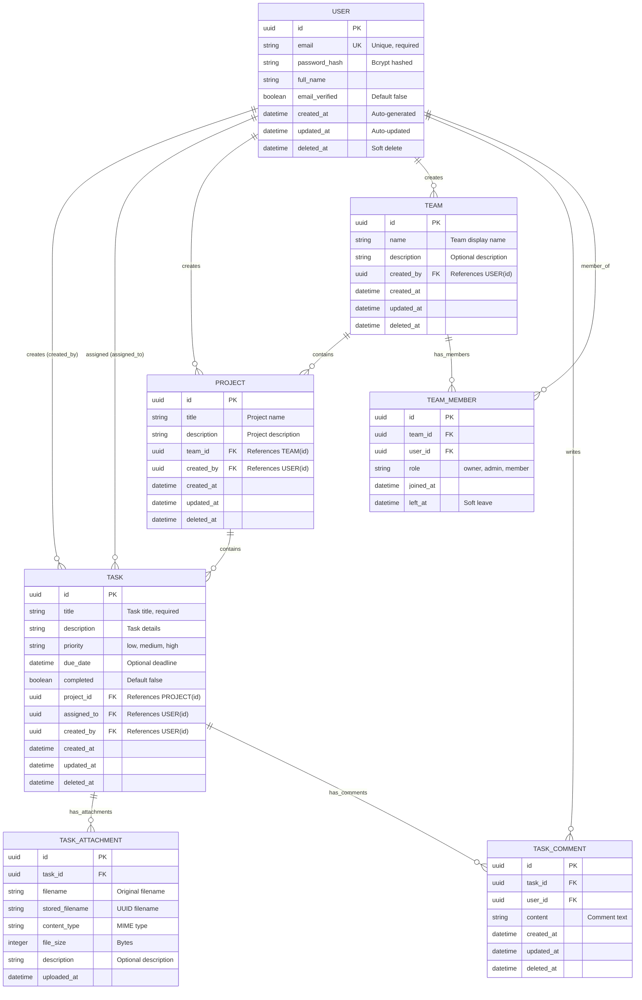

# Database Schema Overview

## Complete Entity-Relationship Diagram

## Design Principles

### 1. **Soft Deletes**

All main entities use `deleted_at` timestamp instead of hard deletes:

- Preserves data integrity
- Enables audit trails
- Allows data recovery
- Maintains foreign key relationships

### 2. **UUID Primary Keys**

Using UUID instead of auto-incrementing integers:

- Better security (no ID enumeration)
- Distributed system compatibility
- No ID collision in merges
- Better for APIs (no guessable IDs)

### 3. **Audit Fields**

Common audit fields on all entities:

- `created_at`: When record was created
- `updated_at`: When record was last modified
- `created_by`: Who created the record
- `deleted_at`: When record was soft-deleted

### 4. **Relationship Integrity**

Proper foreign key constraints ensure:

- Data consistency
- Referential integrity
- Cascade delete handling
- Index optimization for joins
