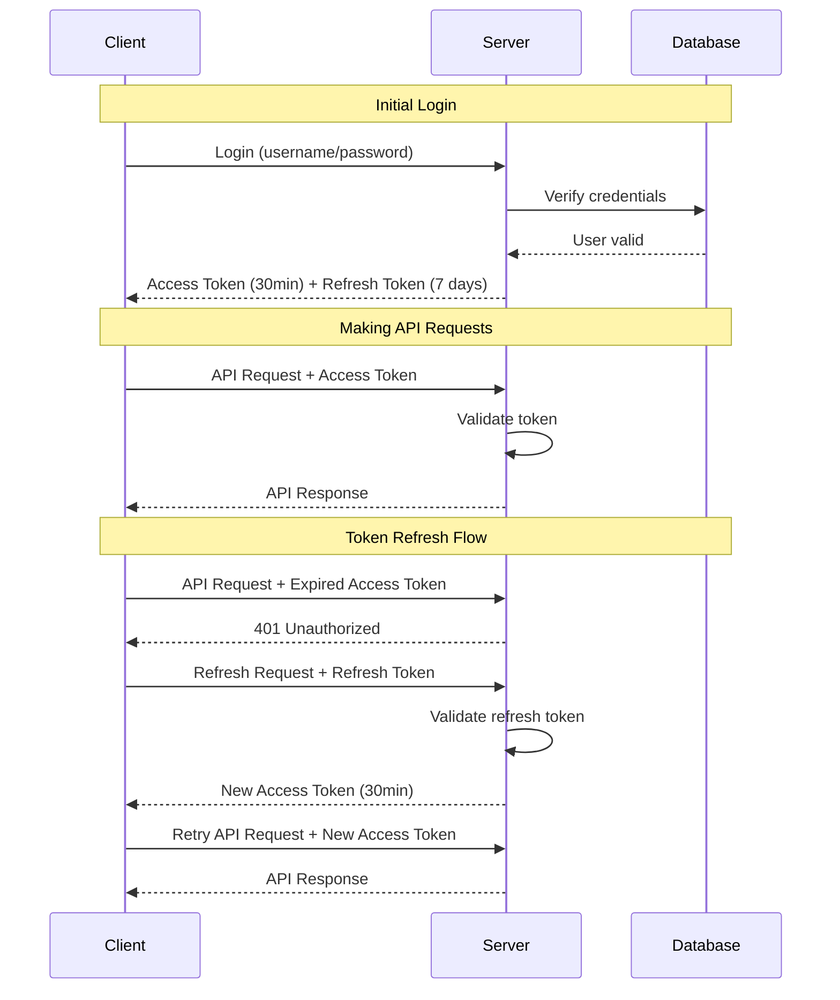
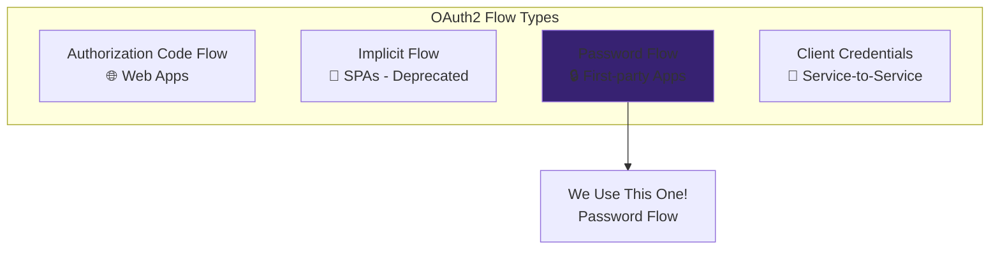
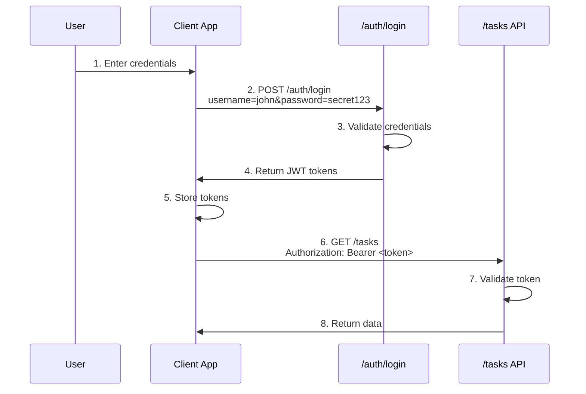
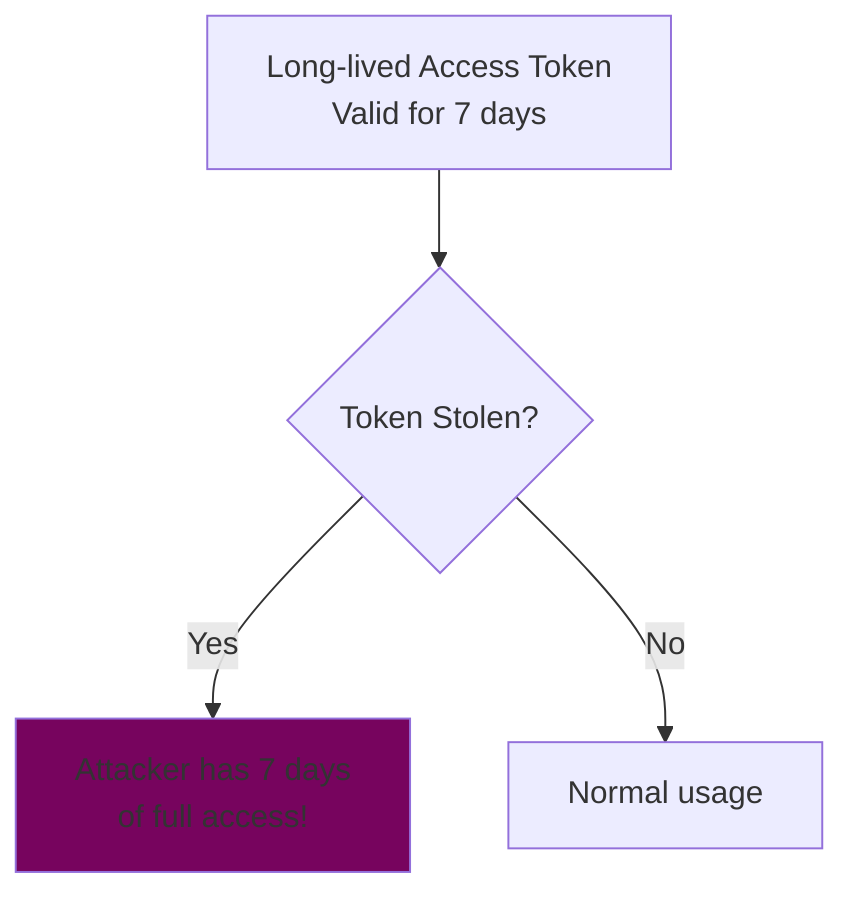
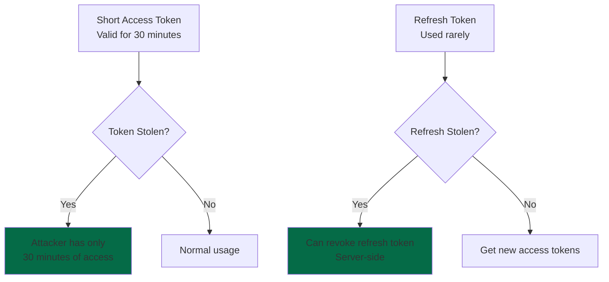
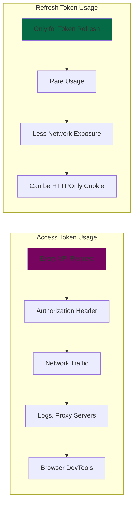
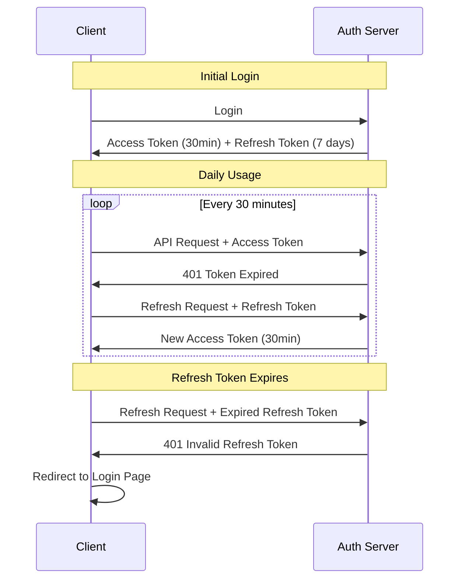

# Task 2.3: Authentication System Implementation

## What is Authentication and Why Do We Need It?

**Authentication** is the process of verifying "who you are" - like showing your ID card. In web applications, this typically involves:

- **Registration**: Creating user accounts with credentials
- **Login**: Verifying credentials and providing access tokens
- **Authorization**: Checking if authenticated users can access specific resources

**JWT (JSON Web Tokens)** are a secure way to transmit information between parties. They contain encoded user information and are signed to prevent tampering.

**OAuth2** is an industry-standard authorization framework that defines how applications can securely access user resources.

## Required Packages

Add to your `requirements.txt`:

```
python-jose[cryptography]
passlib[bcrypt]
python-multipart
pydantic-settings
pydantic[email]
bcrypt==4.0.1
```

Install with:

```bash
pip install -r requirements.txt
```

## Step 1: Add Security Utilities for Password Hashing

Create `app/security/password.py`:

```python
from passlib.context import CryptContext
from passlib.hash import bcrypt
import secrets
import string

# Create password context using bcrypt algorithm
# bcrypt is a slow, adaptive hashing function designed for passwords
pwd_context = CryptContext(schemes=["bcrypt"], deprecated="auto")

class PasswordManager:
    """Utility class for password operations"""

    @staticmethod
    def hash_password(password: str) -> str:
        """
        Hash a plain text password using bcrypt

        bcrypt automatically:
        - Generates a unique salt for each password
        - Uses multiple rounds of hashing (slow by design)
        - Produces a different hash each time, even for same password

        Example: "mypassword123" -> "$2b$12$abcd1234..."
        """
        return pwd_context.hash(password)

    @staticmethod
    def verify_password(plain_password: str, hashed_password: str) -> bool:
        """
        Verify a plain text password against its hash

        This is safe because:
        - We never store plain text passwords
        - bcrypt extracts the salt from the stored hash
        - Computes hash of plain_password with same salt
        - Compares the results securely
        """
        return pwd_context.verify(plain_password, hashed_password)

    @staticmethod
    def generate_random_password(length: int = 12) -> str:
        """Generate a secure random password"""
        alphabet = string.ascii_letters + string.digits + "!@#$%^&*"
        password = ''.join(secrets.choice(alphabet) for _ in range(length))
        return password

    @staticmethod
    def is_password_strong(password: str) -> tuple[bool, list[str]]:
        """
        Check if password meets security requirements
        Returns: (is_strong, list_of_issues)
        """
        issues = []

        if len(password) < 8:
            issues.append("Password must be at least 8 characters long")

        if not any(c.isupper() for c in password):
            issues.append("Password must contain at least one uppercase letter")

        if not any(c.islower() for c in password):
            issues.append("Password must contain at least one lowercase letter")

        if not any(c.isdigit() for c in password):
            issues.append("Password must contain at least one digit")

        if not any(c in "!@#$%^&*()_+-=" for c in password):
            issues.append("Password must contain at least one special character")

        return len(issues) == 0, issues
```

**Key Concepts:**

- **bcrypt**: Adaptive hashing function that's intentionally slow to prevent brute-force attacks
- **Salt**: Random data added to password before hashing to prevent rainbow table attacks

## Step 2: Create JWT Token Management

### Understanding Tokens: Access vs Refresh

**Access Token:**

- **Short-lived** (15-30 minutes)
- Contains user info and permissions
- Used for **every API request**
- If stolen, expires quickly (limited damage)

**Refresh Token:**

- **Long-lived** (days/weeks)
- Used **only to get new access tokens**
- Stored securely, rarely transmitted
- Can be revoked by server

### Token Flow Diagram



### Create JWT Handler

Create `app/security/jwt_handler.py`:

```python
from datetime import datetime, timedelta, timezone
from typing import Optional, Dict, Any
from jose import JWTError, jwt
from app.config import settings

# JWT Configuration
SECRET_KEY = settings.secret_key
ALGORITHM = "HS256"
ACCESS_TOKEN_EXPIRE_MINUTES = settings.access_token_expire_minutes

class JWTManager:
    """JWT token creation and validation"""

    @staticmethod
    def create_access_token(data: Dict[str, Any], expires_delta: Optional[timedelta] = None) -> str:
        """
        Create a JWT access token

        JWT Structure (3 parts separated by dots):
        1. Header: {"alg": "HS256", "typ": "JWT"}
        2. Payload: {"sub": "user123", "exp": 1234567890, "role": "user", ...}
        3. Signature: HMACSHA256(base64UrlEncode(header) + "." + base64UrlEncode(payload), secret)
        """
        to_encode = data.copy()

        if expires_delta:
            expire = datetime.now(timezone.utc) + expires_delta
        else:
            expire = datetime.now(timezone.utc) + timedelta(minutes=ACCESS_TOKEN_EXPIRE_MINUTES)

        to_encode.update({
            "exp": expire,
            "iat": datetime.now(timezone.utc),
            "type": "access"
        })

        encoded_jwt = jwt.encode(to_encode, SECRET_KEY, algorithm=ALGORITHM)
        return encoded_jwt

    @staticmethod
    def create_refresh_token(data: Dict[str, Any]) -> str:
        """Create a refresh token (longer expiration)"""
        to_encode = data.copy()
        expire = datetime.now(timezone.utc) + timedelta(days=7)

        to_encode.update({
            "exp": expire,
            "iat": datetime.now(timezone.utc),
            "type": "refresh"
        })

        encoded_jwt = jwt.encode(to_encode, SECRET_KEY, algorithm=ALGORITHM)
        return encoded_jwt

    @staticmethod
    def verify_token(token: str) -> Optional[Dict[str, Any]]:
        """Verify and decode a JWT token"""
        try:
            payload = jwt.decode(token, SECRET_KEY, algorithms=[ALGORITHM])
            username: str = payload.get("sub")
            if username is None:
                return None
            return payload
        except jwt.ExpiredSignatureError:
            print("Token has expired")
            return None
        except jwt.JWTError as e:
            print(f"JWT Error: {e}")
            return None
```

## Step 3: Create User Management System

Create `app/database/users.py`:

```python
from typing import Dict, List, Optional, Any
from datetime import datetime
from app.security.password import PasswordManager

# Mock user database
users_db: List[Dict[str, Any]] = []
user_id_counter: int = 1

class User:
    """User model for authentication"""

    def __init__(self, user_data: Dict[str, Any]):
        self.id = user_data["id"]
        self.username = user_data["username"]
        self.email = user_data["email"]
        self.hashed_password = user_data["hashed_password"]
        self.role = user_data.get("role", "user")
        self.is_active = user_data.get("is_active", True)
        self.created_at = user_data.get("created_at", datetime.now())
        self.last_login = user_data.get("last_login")

    def check_password(self, password: str) -> bool:
        """Verify password against stored hash"""
        return PasswordManager.verify_password(password, self.hashed_password)

    def to_dict(self) -> Dict[str, Any]:
        """Convert user to dictionary (excluding password)"""
        return {
            "id": self.id,
            "username": self.username,
            "email": self.email,
            "role": self.role,
            "is_active": self.is_active,
            "created_at": self.created_at,
            "last_login": self.last_login
        }

class UserManager:
    """User database operations"""

    @staticmethod
    def create_user(username: str, email: str, password: str, role: str = "user") -> User:
        """Create a new user with hashed password"""
        global user_id_counter

        # Check if user already exists
        if UserManager.get_user_by_username(username):
            raise ValueError(f"Username '{username}' already exists")

        if UserManager.get_user_by_email(email):
            raise ValueError(f"Email '{email}' already exists")

        # Validate password strength
        is_strong, issues = PasswordManager.is_password_strong(password)
        if not is_strong:
            raise ValueError(f"Password requirements not met: {', '.join(issues)}")

        # Hash password
        hashed_password = PasswordManager.hash_password(password)

        # Create user data
        user_data = {
            "id": user_id_counter,
            "username": username,
            "email": email,
            "hashed_password": hashed_password,
            "role": role,
            "is_active": True,
            "created_at": datetime.now(),
            "last_login": None
        }

        users_db.append(user_data)
        user_id_counter += 1

        return User(user_data)

    @staticmethod
    def authenticate_user(username: str, password: str) -> Optional[User]:
        """Authenticate user with username/password"""
        user_data = UserManager.get_user_by_username(username)
        if not user_data:
            return None

        user = User(user_data)

        if not user.is_active:
            return None

        if not user.check_password(password):
            return None

        # Update last login
        user_data["last_login"] = datetime.now()
        return user

    @staticmethod
    def get_all_users() -> List[User]:
        """Get all users"""
        return [User(user_data) for user_data in users_db]

    @staticmethod
    def get_user_by_username(username: str) -> Optional[Dict[str, Any]]:
        """Find user by username"""
        for user_data in users_db:
            if user_data["username"] == username:
                return user_data
        return None

    @staticmethod
    def get_user_by_email(email: str) -> Optional[Dict[str, Any]]:
        """Find user by email"""
        for user_data in users_db:
            if user_data["email"] == email:
                return user_data
        return None

    @staticmethod
    def get_user_by_id(user_id: int) -> Optional[User]:
        """Find user by ID"""
        for user_data in users_db:
            if user_data["id"] == user_id:
                return User(user_data)
        return None

    @staticmethod
    def update_user_role(user_id: int, new_role: str) -> bool:
        """Update user role (admin function)"""
        for user_data in users_db:
            if user_data["id"] == user_id:
                user_data["role"] = new_role
                return True
        return False

    @staticmethod
    def deactivate_user(user_id: int) -> bool:
        """Deactivate user account"""
        for user_data in users_db:
            if user_data["id"] == user_id:
                user_data["is_active"] = False
                return True
        return False

# Create default users
def create_default_users():
    """Create default users for testing"""
    try:
        UserManager.create_user("admin", "admin@example.com", "Admin123!", "admin")
        UserManager.create_user("testuser", "user@example.com", "User123!", "user")
        UserManager.create_user("guest", "guest@example.com", "Guest123!", "guest")
        print("Default users created successfully")
    except ValueError as e:
        print(f"Default users already exist: {e}")

create_default_users()
```

## Step 4: Create Pydantic Schemas for Authentication

Create `app/schemas/auth.py`:

```python
from pydantic import BaseModel, EmailStr, Field
from typing import Optional, Literal, List
from datetime import datetime

class UserRegistration(BaseModel):
    """Schema for user registration"""
    username: str = Field(..., min_length=3, max_length=50)
    email: EmailStr
    password: str = Field(..., min_length=8)
    role: Literal["user", "guest"] = Field(default="user")

    class Config:
        json_schema_extra = {
            "example": {
                "username": "newuser",
                "email": "newuser@example.com",
                "password": "StrongPass123!",
                "role": "user"
            }
        }

class UserLogin(BaseModel):
    """Schema for user login"""
    username: str
    password: str

    class Config:
        json_schema_extra = {
            "example": {
                "username": "testuser",
                "password": "User123!"
            }
        }

class Token(BaseModel):
    """JWT token response schema"""
    access_token: str
    token_type: str = "bearer"
    expires_in: int
    refresh_token: Optional[str] = None

    class Config:
        json_schema_extra = {
            "example": {
                "access_token": "eyJhbGciOiJIUzI1NiIsInR5cCI6IkpXVCJ9...",
                "token_type": "bearer",
                "expires_in": 1800,
                "refresh_token": "eyJhbGciOiJIUzI1NiIsInR5cCI6IkpXVCJ9..."
            }
        }

class UserProfile(BaseModel):
    """User profile schema"""
    id: int
    username: str
    email: EmailStr
    role: Literal["admin", "user", "guest"]
    is_active: bool
    created_at: datetime
    last_login: Optional[datetime]

    class Config:
        from_attributes = True
        json_schema_extra = {
            "example": {
                "id": 1,
                "username": "testuser",
                "email": "user@example.com",
                "role": "user",
                "is_active": True,
                "created_at": "2024-01-01T10:00:00",
                "last_login": "2024-01-15T14:30:00"
            }
        }

class PasswordChange(BaseModel):
    """Schema for password change"""
    current_password: str
    new_password: str = Field(..., min_length=8)

    class Config:
        json_schema_extra = {
            "example": {
                "current_password": "OldPass123!",
                "new_password": "NewStrongPass123!"
            }
        }

class RefreshTokenRequest(BaseModel):
    refresh_token: str

    class Config:
        json_schema_extra = {
            "example": {
                "refresh_token": "eyJhbGciOiJIUzI1NiIsInR5cCI6IkpXVCJ9..."
            }
        }
```

## Step 5: Create OAuth2 Password Flow Implementation

### What is OAuth2?

**OAuth2** is an authorization framework that allows applications to obtain limited access to user accounts.

### OAuth2 Flow Types



### Our OAuth2 Password Flow



### WWW-Authenticate Header

The **`WWW-Authenticate`** header tells clients how to authenticate:

```http
# When authentication is required
WWW-Authenticate: Bearer realm="Task Management API"

# When token is invalid
WWW-Authenticate: Bearer realm="api", error="invalid_token", error_description="Token expired"
```

Create `app/dependencies/oauth2.py`:

```python
from fastapi import Depends, HTTPException, status
from fastapi.security import OAuth2PasswordBearer
from typing import Optional
from app.security.jwt_handler import JWTManager
from app.database.users import UserManager, User

# OAuth2 scheme - tells FastAPI to look for "Authorization: Bearer <token>"
oauth2_scheme = OAuth2PasswordBearer(
    tokenUrl="/auth/login",
    scheme_name="JWT",
    scopes={
        "read": "Read access to resources",
        "write": "Write access to resources",
        "admin": "Administrative access"
    }
)

class OAuth2Handler:
    """OAuth2 authentication handler"""

    @staticmethod
    def get_current_user(token: str = Depends(oauth2_scheme)) -> User:
        """Extract and validate current user from OAuth2 Bearer token"""

        credentials_exception = HTTPException(
            status_code=status.HTTP_401_UNAUTHORIZED,
            detail="Could not validate credentials",
            headers={"WWW-Authenticate": "Bearer"},
        )

        try:
            payload = JWTManager.verify_token(token)
            if payload is None:
                raise credentials_exception

            username: str = payload.get("sub")
            user_id: int = payload.get("user_id")

            if username is None or user_id is None:
                raise credentials_exception

        except Exception as e:
            print(f"Token validation failed: {e}")
            raise credentials_exception

        user = UserManager.get_user_by_id(user_id)
        if user is None:
            raise HTTPException(
                status_code=status.HTTP_401_UNAUTHORIZED,
                detail="User no longer exists",
                headers={"WWW-Authenticate": "Bearer"},
            )

        if not user.is_active:
            raise HTTPException(
                status_code=status.HTTP_401_UNAUTHORIZED,
                detail="User account has been deactivated",
                headers={"WWW-Authenticate": "Bearer"},
            )

        return user

    @staticmethod
    def get_optional_user(token: Optional[str] = Depends(oauth2_scheme)) -> Optional[User]:
        """Get current user if authenticated, None if not"""
        if not token:
            return None

        try:
            payload = JWTManager.verify_token(token)
            if payload is None:
                return None

            user_id = payload.get("user_id")
            if not user_id:
                return None

            user = UserManager.get_user_by_id(user_id)
            return user if user and user.is_active else None

        except Exception:
            return None

# Dependency functions
def get_current_user(token: str = Depends(oauth2_scheme)) -> User:
    """Get current authenticated user"""
    return OAuth2Handler.get_current_user(token)

def get_optional_user(token: Optional[str] = Depends(oauth2_scheme)) -> Optional[User]:
    """Get current user if authenticated, None otherwise"""
    return OAuth2Handler.get_optional_user(token)
```

## Step 6: Implement Role-Based Access Control

Create `app/dependencies/permissions.py`:

```python
from fastapi import Depends, HTTPException, status
from typing import List
from app.dependencies.oauth2 import get_current_user
from app.database.users import User

class RoleChecker:
    """Role-based access control checker"""

    def __init__(self, allowed_roles: List[str]):
        self.allowed_roles = allowed_roles

    def __call__(self, current_user: User = Depends(get_current_user)) -> User:
        """Check if current user has required role"""
        if current_user.role not in self.allowed_roles:
            raise HTTPException(
                status_code=status.HTTP_403_FORBIDDEN,
                detail=f"Access denied. Required roles: {', '.join(self.allowed_roles)}. Your role: {current_user.role}",
                headers={"WWW-Authenticate": "Bearer realm=\"Task Management API\", error=\"insufficient_scope\""}
            )
        return current_user

# Pre-defined role checkers
require_admin = RoleChecker(["admin"])
require_user_or_admin = RoleChecker(["user", "admin"])
require_any_role = RoleChecker(["guest", "user", "admin"])

def admin_only(current_user: User = Depends(get_current_user)) -> User:
    """Strict admin-only access"""
    if current_user.role != "admin":
        raise HTTPException(
            status_code=status.HTTP_403_FORBIDDEN,
            detail="Admin access required",
            headers={"WWW-Authenticate": "Bearer"}
        )
    return current_user
```

## Step 7: Create Authentication Router

Create `app/routers/auth.py`:

```python
from fastapi import APIRouter, Depends, HTTPException, status
from fastapi.security import OAuth2PasswordRequestForm
from datetime import timedelta
from typing import Dict, Any, List
from app.schemas.auth import RefreshTokenRequest

from app.schemas.auth import UserRegistration, Token, UserProfile, PasswordChange
from app.database.users import UserManager, User
from app.security.jwt_handler import JWTManager
from app.security.password import PasswordManager
from app.dependencies.oauth2 import get_current_user
from app.dependencies.permissions import require_admin
from app.config import settings

router = APIRouter(prefix="/auth", tags=["authentication"])

@router.post("/register", response_model=UserProfile, status_code=status.HTTP_201_CREATED)
async def register_user(user_data: UserRegistration):
    """Register a new user account"""
    try:
        new_user = UserManager.create_user(
            username=user_data.username,
            email=user_data.email,
            password=user_data.password,
            role=user_data.role
        )
        return UserProfile(**new_user.to_dict())
    except ValueError as e:
        raise HTTPException(
            status_code=status.HTTP_400_BAD_REQUEST,
            detail=str(e)
        )

@router.post("/login", response_model=Token)
async def login_user(form_data: OAuth2PasswordRequestForm = Depends()):
    """OAuth2-compatible login endpoint"""

    user = UserManager.authenticate_user(form_data.username, form_data.password)
    if not user:
        raise HTTPException(
            status_code=status.HTTP_401_UNAUTHORIZED,
            detail="Incorrect username or password",
            headers={"WWW-Authenticate": "Bearer"},
        )

    token_data = {
        "sub": user.username,
        "user_id": user.id,
        "role": user.role,
        "email": user.email
    }

    access_token_expires = timedelta(minutes=settings.access_token_expire_minutes)
    access_token = JWTManager.create_access_token(
        data=token_data,
        expires_delta=access_token_expires
    )

    refresh_token = JWTManager.create_refresh_token(data=token_data)

    return Token(
        access_token=access_token,
        token_type="bearer",
        expires_in=settings.access_token_expire_minutes * 60,
        refresh_token=refresh_token
    )

@router.get("/me", response_model=UserProfile)
async def get_current_user_profile(current_user: User = Depends(get_current_user)):
    """Get current user's profile"""
    return UserProfile(**current_user.to_dict())

@router.put("/me/password")
async def change_password(
    password_data: PasswordChange,
    current_user: User = Depends(get_current_user)
):
    """Change current user's password"""

    if not current_user.check_password(password_data.current_password):
        raise HTTPException(
            status_code=status.HTTP_400_BAD_REQUEST,
            detail="Current password is incorrect"
        )

    is_strong, issues = PasswordManager.is_password_strong(password_data.new_password)
    if not is_strong:
        raise HTTPException(
            status_code=status.HTTP_400_BAD_REQUEST,
            detail=f"New password requirements not met: {', '.join(issues)}"
        )

    new_hashed = PasswordManager.hash_password(password_data.new_password)

    # Update in database
    for user_data in UserManager.users_db:
        if user_data["id"] == current_user.id:
            user_data["hashed_password"] = new_hashed
            break

    return {"message": "Password changed successfully"}

@router.get("/users", response_model=List[UserProfile])
async def list_users(current_user: User = Depends(require_admin)):
    """Get list of all users (admin only)"""
    users = UserManager.get_all_users()
    return [UserProfile(**user.to_dict()) for user in users]


@router.put("/users/{user_id}/role")
async def update_user_role(
    user_id: int,
    new_role: Dict[str, str],
    current_user: User = Depends(require_admin)
):
    """Update user role (admin only)"""
    allowed_roles = ["guest", "user", "admin"]
    role = new_role.get("role")

    if role not in allowed_roles:
        raise HTTPException(
            status_code=status.HTTP_400_BAD_REQUEST,
            detail=f"Invalid role. Allowed roles: {', '.join(allowed_roles)}"
        )

    success = UserManager.update_user_role(user_id, role)
    if not success:
        raise HTTPException(
            status_code=status.HTTP_404_NOT_FOUND,
            detail="User not found"
        )

    return {"message": f"User role updated to {role}"}

@router.post("/users/{user_id}/deactivate")
async def deactivate_user(
    user_id: int,
    current_user: User = Depends(require_admin)
):
    """Deactivate user account (admin only)"""
    if user_id == current_user.id:
        raise HTTPException(
            status_code=status.HTTP_400_BAD_REQUEST,
            detail="Cannot deactivate your own account"
        )

    success = UserManager.deactivate_user(user_id)
    if not success:
        raise HTTPException(
            status_code=status.HTTP_404_NOT_FOUND,
            detail="User not found"
        )

    return {"message": "User account deactivated"}

@router.post("/refresh", response_model=Token)
async def refresh_access_token(refresh_data: RefreshTokenRequest):
    """Get new access token using refresh token"""
    try:
        # Use refresh_data.refresh_token instead of refresh_token
        payload = JWTManager.verify_token(refresh_data.refresh_token)
        if not payload or payload.get("type") != "refresh":
            raise HTTPException(
                status_code=status.HTTP_401_UNAUTHORIZED,
                detail="Invalid refresh token"
            )

        user = UserManager.get_user_by_id(payload.get("user_id"))
        if not user or not user.is_active:
            raise HTTPException(
                status_code=status.HTTP_401_UNAUTHORIZED,
                detail="User not found or inactive"
            )

        token_data = {
            "sub": user.username,
            "user_id": user.id,
            "role": user.role,
            "email": user.email
        }

        access_token = JWTManager.create_access_token(data=token_data)

        return Token(
            access_token=access_token,
            token_type="bearer",
            expires_in=settings.access_token_expire_minutes * 60
        )

    except Exception:
        raise HTTPException(
            status_code=status.HTTP_401_UNAUTHORIZED,
            detail="Invalid refresh token"
        )
```

## Step 8: Update Main Application

Update `app/main.py`:

```python
from fastapi import FastAPI
from fastapi.middleware.cors import CORSMiddleware

from app.routers import tasks, auth

app = FastAPI(
    title="Task Management API",
    description="A personal task management API with OAuth2 authentication",
    version="1.0.0",
    docs_url="/docs",
    redoc_url="/redoc"
)

app.add_middleware(
    CORSMiddleware,
    allow_origins=["*"],
    allow_credentials=True,
    allow_methods=["*"],
    allow_headers=["*"],
)

app.include_router(tasks.router)
app.include_router(auth.router)

@app.get("/health")
async def health_check():
    return {"status": "healthy", "message": "Task Management API is running!"}

@app.get("/")
async def root():
    return {
        "message": "Welcome to Task Management API",
        "version": "1.0.0",
        "docs": "/docs"
    }
```

## Step 9: Update Task Router with OAuth2 Authentication

Create/Update `app/routers/tasks.py` with complete OAuth2 integration:

```python
from fastapi import APIRouter, HTTPException, Query, Path, Header, File, UploadFile, Form, Depends
from datetime import datetime, date
from typing import Optional, List
import os
import uuid

# Import schemas
from app.schemas.task import Task, TaskResponse, TaskUpdate, TaskList, TaskPriority, TaskSortBy, TaskSortOrder

# Import database and storage
from app.dependencies.database import get_database, DatabaseSession
from app.database.storage import tasks_db, task_id_counter

# OAuth2 Authentication imports
from app.database.users import User
from app.dependencies.oauth2 import get_current_user, get_optional_user
from app.dependencies.permissions import require_user_or_admin, require_admin, RoleChecker

# Other dependencies
from app.dependencies.pagination import get_pagination_params, PaginationParams
from app.dependencies.cache import get_task_statistics, invalidate_task_cache

# Create router instance
router = APIRouter(prefix="/tasks", tags=["tasks"])

# Create uploads directory if it doesn't exist
UPLOAD_DIR = "uploads"
os.makedirs(UPLOAD_DIR, exist_ok=True)

# Create specific permission checkers for tasks
require_task_access = RoleChecker(["user", "admin"])
require_file_upload = RoleChecker(["user", "admin"])

@router.get("/", response_model=TaskList)
async def get_tasks(
    # Pagination dependency
    pagination: PaginationParams = Depends(get_pagination_params),
    # Database dependency
    db: DatabaseSession = Depends(get_database),
    # Optional OAuth2 authentication
    current_user: Optional[User] = Depends(get_optional_user),
    # Filtering parameters
    priority: Optional[TaskPriority] = Query(None, description="Filter by priority"),
    completed: Optional[bool] = Query(None, description="Filter by completion status"),
    due_before: Optional[date] = Query(None, description="Filter tasks due before this date"),
    due_after: Optional[date] = Query(None, description="Filter tasks due after this date"),
    # Sorting parameters
    sort_by: TaskSortBy = Query(TaskSortBy.CREATED_AT, description="Field to sort by"),
    sort_order: TaskSortOrder = Query(TaskSortOrder.DESC, description="Sort order"),
    # Header parameters for versioning
    api_version: Optional[str] = Header(None, alias="X-API-Version", description="API Version"),
    user_agent: Optional[str] = Header(None, alias="User-Agent", description="Client information")
):
    """
    Get all tasks with optional OAuth2 authentication

    OAuth2 Scopes: Works without authentication, enhanced with user context when authenticated
    - Unauthenticated: See all public tasks
    - User role: See only own tasks
    - Admin role: See all tasks
    """

    # API version validation
    if api_version and api_version not in ["v1", "v1.0"]:
        raise HTTPException(
            status_code=400,
            detail=f"Unsupported API version: {api_version}. Supported versions: v1, v1.0"
        )

    if user_agent:
        print(f"Request from: {user_agent}")

    # Get all tasks from database
    all_tasks = db.get_all_tasks()

    # Apply user-based filtering
    if current_user:
        print(f"Authenticated request from user: {current_user.username} (role: {current_user.role})")
        # Non-admin users only see their own tasks
        if current_user.role != "admin":
            all_tasks = [t for t in all_tasks if t.get("owner_id") == current_user.id or t.get("created_by") == current_user.id]

    # Apply query parameter filters
    filtered_tasks = all_tasks.copy()

    if priority is not None:
        filtered_tasks = [t for t in filtered_tasks if t.get("priority") == priority.value]

    if completed is not None:
        filtered_tasks = [t for t in filtered_tasks if t.get("completed") == completed]

    if due_before is not None:
        filtered_tasks = [
            t for t in filtered_tasks
            if t.get("due_date") and t["due_date"].date() <= due_before
        ]

    if due_after is not None:
        filtered_tasks = [
            t for t in filtered_tasks
            if t.get("due_date") and t["due_date"].date() >= due_after
        ]

    # Apply sorting
    reverse_order = (sort_order == TaskSortOrder.DESC)

    if sort_by == TaskSortBy.TITLE:
        filtered_tasks.sort(key=lambda x: x.get("title", "").lower(), reverse=reverse_order)
    elif sort_by == TaskSortBy.PRIORITY:
        priority_order = {"high": 3, "medium": 2, "low": 1}
        filtered_tasks.sort(
            key=lambda x: priority_order.get(x.get("priority", "medium"), 2),
            reverse=reverse_order
        )
    elif sort_by == TaskSortBy.DUE_DATE:
        filtered_tasks.sort(
            key=lambda x: x.get("due_date") or datetime.max,
            reverse=reverse_order
        )
    elif sort_by == TaskSortBy.CREATED_AT:
        filtered_tasks.sort(
            key=lambda x: x.get("created_at", datetime.min),
            reverse=reverse_order
        )
    elif sort_by == TaskSortBy.UPDATED_AT:
        filtered_tasks.sort(
            key=lambda x: x.get("updated_at", datetime.min),
            reverse=reverse_order
        )

    # Apply pagination
    paginated_result = pagination.paginate_list(filtered_tasks)

    # Convert to response models
    task_responses = [TaskResponse(**task) for task in paginated_result["items"]]

    return TaskList(
        tasks=task_responses,
        total=paginated_result["pagination"]["total"]
    )

@router.post("/", response_model=TaskResponse)
async def create_task(
    task_data: Task,
    db: DatabaseSession = Depends(get_database),
    # Requires OAuth2 Bearer token with user or admin role
    current_user: User = Depends(require_task_access)
):
    """
    Create a new task (OAuth2 authentication required)

    Required OAuth2 Scopes: user or admin role
    Authorization: Bearer <access_token>
    """

    now = datetime.now()
    new_task_dict = {
        **task_data.model_dump(),
        "created_at": now,
        "updated_at": now,
        "attachments": [],
        "created_by": current_user.id,
        "owner_id": current_user.id  # Set ownership for access control
    }

    created_task = db.create_task(new_task_dict)
    invalidate_task_cache()

    print(f"Task created by user {current_user.username} (ID: {current_user.id})")

    return TaskResponse(**created_task)

@router.get("/{task_id}", response_model=TaskResponse)
async def get_task(
    task_id: int = Path(..., gt=0, description="Task ID must be positive"),
    db: DatabaseSession = Depends(get_database),
    # Optional OAuth2 authentication
    current_user: Optional[User] = Depends(get_optional_user)
):
    """
    Get a specific task by ID (OAuth2 optional authentication)

    OAuth2 Scopes: Works without authentication, access control applies when authenticated
    """

    task = db.get_task_by_id(task_id)

    if not task:
        raise HTTPException(
            status_code=404,
            detail=f"Task with ID {task_id} not found"
        )

    # Access control: non-admin users can only see their own tasks
    if current_user and current_user.role != "admin":
        task_owner_id = task.get("owner_id") or task.get("created_by")
        if current_user.id != task_owner_id:
            raise HTTPException(
                status_code=403,
                detail="You can only view your own tasks unless you're an admin",
                headers={"WWW-Authenticate": "Bearer realm=\"Task Management API\", error=\"insufficient_scope\""}
            )

    if current_user:
        print(f"Task {task_id} accessed by user {current_user.username}")

    return TaskResponse(**task)

@router.put("/{task_id}", response_model=TaskResponse)
async def update_task(
    task_data: TaskUpdate,
    task_id: int = Path(..., gt=0, description="Task ID must be positive"),
    db: DatabaseSession = Depends(get_database),
    # Requires OAuth2 Bearer token
    current_user: User = Depends(require_task_access)
):
    """
    Update a task (OAuth2 authentication + ownership check)

    Required OAuth2 Scopes: user or admin role
    Access Control: Users can only update their own tasks, admins can update any task
    """

    existing_task = db.get_task_by_id(task_id)
    if not existing_task:
        raise HTTPException(
            status_code=404,
            detail=f"Task with ID {task_id} not found"
        )

    # Ownership-based access control
    task_owner_id = existing_task.get("owner_id") or existing_task.get("created_by")
    if current_user.role != "admin" and current_user.id != task_owner_id:
        raise HTTPException(
            status_code=403,
            detail="Access denied. You can only update your own tasks unless you're an admin",
            headers={"WWW-Authenticate": "Bearer realm=\"Task Management API\", error=\"insufficient_scope\""}
        )

    # Prepare update data
    update_data = task_data.model_dump(exclude_unset=True)
    update_data["updated_at"] = datetime.now()
    update_data["updated_by"] = current_user.id

    updated_task = db.update_task(task_id, update_data)
    invalidate_task_cache()

    print(f"Task {task_id} updated by user {current_user.username}")

    return TaskResponse(**updated_task)

@router.delete("/{task_id}")
async def delete_task(
    task_id: int = Path(..., gt=0, description="Task ID must be positive"),
    db: DatabaseSession = Depends(get_database),
    # Admin-only access
    current_user: User = Depends(require_admin)
):
    """
    Delete a task (OAuth2 admin authentication required)

    Required OAuth2 Scopes: admin role only
    """

    deleted_task = db.delete_task(task_id)

    if not deleted_task:
        raise HTTPException(
            status_code=404,
            detail=f"Task with ID {task_id} not found"
        )

    invalidate_task_cache()
    print(f"Task {task_id} deleted by admin {current_user.username}")

    return {
        "message": "Task deleted successfully",
        "deleted_task": TaskResponse(**deleted_task)
    }

@router.get("/statistics")
async def get_task_statistics_endpoint(
    stats = Depends(get_task_statistics),
    current_user: User = Depends(require_task_access)
):
    """
    Get task statistics (OAuth2 authentication required)

    Required OAuth2 Scopes: user or admin role
    """
    print(f"Statistics accessed by user {current_user.username}")
    return stats

@router.post("/{task_id}/attachments")
async def upload_task_attachment(
    task_id: int = Path(..., gt=0, description="Task ID"),
    file: UploadFile = File(..., description="File to attach to the task"),
    description: Optional[str] = Form(None, description="Optional description"),
    db: DatabaseSession = Depends(get_database),
    current_user: User = Depends(require_file_upload)
):
    """
    Upload file attachment (OAuth2 authentication + ownership check)

    Required OAuth2 Scopes: user or admin role
    Access Control: Users can only upload to their own tasks, admins can upload to any task
    """

    task = db.get_task_by_id(task_id)
    if not task:
        raise HTTPException(status_code=404, detail=f"Task with ID {task_id} not found")

    # Ownership check
    task_owner_id = task.get("owner_id") or task.get("created_by")
    if current_user.role != "admin" and current_user.id != task_owner_id:
        raise HTTPException(
            status_code=403,
            detail="You can only upload files to your own tasks unless you're an admin",
            headers={"WWW-Authenticate": "Bearer realm=\"Task Management API\", error=\"insufficient_scope\""}
        )

    # File validation
    allowed_types = ["image/jpeg", "image/png", "text/plain", "application/pdf"]
    if file.content_type not in allowed_types:
        raise HTTPException(
            status_code=400,
            detail=f"File type {file.content_type} not allowed. Allowed types: {allowed_types}"
        )

    file_content = await file.read()
    if len(file_content) > 5 * 1024 * 1024:  # 5MB limit
        raise HTTPException(status_code=400, detail="File size too large. Maximum size is 5MB")

    # Save file
    file_extension = file.filename.split('.')[-1] if '.' in file.filename else ''
    unique_filename = f"{uuid.uuid4()}.{file_extension}"
    file_path = os.path.join(UPLOAD_DIR, unique_filename)

    with open(file_path, "wb") as f:
        f.write(file_content)

    # Add attachment info to task
    if "attachments" not in task:
        task["attachments"] = []

    attachment = {
        "id": len(task["attachments"]) + 1,
        "filename": file.filename,
        "stored_filename": unique_filename,
        "content_type": file.content_type,
        "size": len(file_content),
        "description": description,
        "uploaded_at": datetime.now(),
        "uploaded_by": current_user.id
    }

    task["attachments"].append(attachment)

    update_data = {
        "attachments": task["attachments"],
        "updated_at": datetime.now()
    }
    db.update_task(task_id, update_data)

    print(f"File uploaded to task {task_id} by user {current_user.username}")

    return {
        "message": "File uploaded successfully",
        "attachment": attachment
    }

@router.get("/{task_id}/attachments")
async def get_task_attachments(
    task_id: int = Path(..., gt=0, description="Task ID"),
    db: DatabaseSession = Depends(get_database),
    current_user: Optional[User] = Depends(get_optional_user)
):
    """Get all attachments for a task (OAuth2 optional authentication)"""

    task = db.get_task_by_id(task_id)
    if not task:
        raise HTTPException(status_code=404, detail=f"Task with ID {task_id} not found")

    # Access control for attachments
    if current_user and current_user.role != "admin":
        task_owner_id = task.get("owner_id") or task.get("created_by")
        if current_user.id != task_owner_id:
            raise HTTPException(
                status_code=403,
                detail="You can only view attachments for your own tasks unless you're an admin",
                headers={"WWW-Authenticate": "Bearer"}
            )

    attachments = task.get("attachments", [])

    if current_user:
        print(f"Attachments for task {task_id} accessed by user {current_user.username}")

    return {
        "task_id": task_id,
        "attachments": attachments,
        "count": len(attachments)
    }

@router.delete("/{task_id}/attachments/{attachment_id}")
async def delete_task_attachment(
    task_id: int = Path(..., gt=0, description="Task ID"),
    attachment_id: int = Path(..., gt=0, description="Attachment ID"),
    db: DatabaseSession = Depends(get_database),
    current_user: User = Depends(require_task_access)
):
    """Delete attachment (OAuth2 authentication + ownership check)"""

    task = db.get_task_by_id(task_id)
    if not task:
        raise HTTPException(status_code=404, detail=f"Task with ID {task_id} not found")

    # Ownership check
    task_owner_id = task.get("owner_id") or task.get("created_by")
    if current_user.role != "admin" and current_user.id != task_owner_id:
        raise HTTPException(
            status_code=403,
            detail="You can only delete attachments from your own tasks unless you're an admin",
            headers={"WWW-Authenticate": "Bearer realm=\"Task Management API\", error=\"insufficient_scope\""}
        )

    # Find attachment
    attachments = task.get("attachments", [])
    attachment = None
    attachment_index = None

    for i, att in enumerate(attachments):
        if att["id"] == attachment_id:
            attachment = att
            attachment_index = i
            break

    if not attachment:
        raise HTTPException(
            status_code=404,
            detail=f"Attachment with ID {attachment_id} not found in task {task_id}"
        )

    # Delete file from disk
    file_path = os.path.join(UPLOAD_DIR, attachment["stored_filename"])
    if os.path.exists(file_path):
        os.remove(file_path)
        print(f"File {attachment['stored_filename']} deleted from disk")

    # Remove attachment from task
    task["attachments"].pop(attachment_index)

    update_data = {
        "attachments": task["attachments"],
        "updated_at": datetime.now(),
        "updated_by": current_user.id
    }
    db.update_task(task_id, update_data)

    print(f"Attachment {attachment_id} deleted from task {task_id} by user {current_user.username}")

    return {
        "message": "Attachment deleted successfully",
        "deleted_attachment": attachment,
        "task_id": task_id
    }
```

## Step 10: Testing the Authentication System

### 1. Start the Server

```bash
uvicorn app.main:app --reload
```

### 2. Access API Documentation

Visit `http://localhost:8000/docs` to see the Swagger UI with OAuth2 authentication.

### 3. Test User Registration

```bash
curl -X POST "http://localhost:8000/auth/register" \
  -H "Content-Type: application/json" \
  -d '{
    "username": "newuser",
    "email": "newuser@example.com",
    "password": "StrongPass123!",
    "role": "user"
  }'
```

### 4. Test User Login (OAuth2 Password Flow)

**Step 1: Login and store the access token**

```bash
TOKEN=$(curl -s -X POST 'http://localhost:8000/auth/login' \
  -H 'Content-Type: application/x-www-form-urlencoded' \
  -d 'username=testuser&password=User123!' | jq -r '.access_token')
```

**Step 2: Store the refresh token**

```bash
REFRESH_TOKEN=$(curl -s -X POST 'http://localhost:8000/auth/login' \
  -H 'Content-Type: application/x-www-form-urlencoded' \
  -d 'username=testuser&password=User123!' | jq -r '.refresh_token')
```

**Step 3: Check if tokens were set (optional)**

```bash
echo "Access Token: $TOKEN"
echo "Refresh Token: $REFRESH_TOKEN"
```

**Expected Response:**

```json
{
  "access_token": "eyJhbGciOiJIUzI1NiIsInR5cCI6IkpXVCJ9...",
  "token_type": "bearer",
  "expires_in": 1800,
  "refresh_token": "eyJhbGciOiJIUzI1NiIsInR5cCI6IkpXVCJ9..."
}
```

### 5. Test Authenticated Requests

**Step 4: Get user profile**

```bash
curl -X GET "http://localhost:8000/auth/me" \
  -H "Authorization: Bearer $TOKEN"
```

**Step 5: Create a task**

```bash
curl -X POST "http://localhost:8000/tasks/" \
  -H "Authorization: Bearer $TOKEN" \
  -H "Content-Type: application/json" \
  -d '{"title": "Authenticated Task", "description": "Task created by authenticated user", "priority": "high"}'
```

**Step 6: Get tasks (user will only see their own tasks)**

```bash
curl -X GET "http://localhost:8000/tasks/?priority=high&page=1&per_page=5" \
  -H "Authorization: Bearer $TOKEN"
```

### 6. Test Authorization Failures

```bash
# Try to access protected endpoint without token
curl -X POST "http://localhost:8000/tasks/" \
  -H "Content-Type: application/json" \
  -d '{"title": "Test"}'

# Expected: 401 Unauthorized with WWW-Authenticate header
```

### 7. Test Admin-Only Endpoints

**Step 1: Get the admin token**

```bash
ADMIN_TOKEN=$(curl -s -X POST "http://localhost:8000/auth/login" \
  -H "Content-Type: application/x-www-form-urlencoded" \
  -d 'username=admin&password=Admin123!' | jq -r '.access_token')
```

**Step 2: Store the admin refresh token (optional)**

```bash
ADMIN_REFRESH_TOKEN=$(curl -s -X POST "http://localhost:8000/auth/login" \
  -H "Content-Type: application/x-www-form-urlencoded" \
  -d 'username=admin&password=Admin123!' | jq -r '.refresh_token')
```

**Step 3: Check if the admin token was set (optional)**

```bash
echo "Admin Token: $ADMIN_TOKEN"
echo "Admin Refresh Token: $ADMIN_REFRESH_TOKEN"
```

**Step 4: List all users**

```bash
curl -X GET "http://localhost:8000/auth/users" \
  -H "Authorization: Bearer $ADMIN_TOKEN"
```

**Step 5: Delete a task**

```bash
curl -X DELETE "http://localhost:8000/tasks/1" \
  -H "Authorization: Bearer $ADMIN_TOKEN"
```

**Tips:**

- The `ADMIN_TOKEN` variable will stay in your terminal session until you close it
- If you get an error with the `!` character, try escaping it: `Admin123\!`
- You can check what's in the token variable anytime with `echo $ADMIN_TOKEN`
- If the login fails, the token might be empty or "null"
- Always use trailing slashes (`/tasks/`) to avoid 307 redirects

### 8. Test Token Refresh

**Using stored refresh token:**

```bash
curl -X POST "http://localhost:8000/auth/refresh?refresh_token=$REFRESH_TOKEN"
```

> ⚠️ **Note:** Currently, our access token and refresh token are sent normally and not as HTTP-only cookies.  
> For simplicity, this is fine for now — we can switch to HTTP-only tokens later.

## Access Control Summary

### 🔒 **Security Features Implemented:**

| Feature                   | Implementation                              |
| ------------------------- | ------------------------------------------- |
| **Password Security**     | bcrypt hashing with salt                    |
| **Token-based Auth**      | JWT with access + refresh tokens            |
| **OAuth2 Compliance**     | Standard password flow                      |
| **Role-based Access**     | Admin > User > Guest hierarchy              |
| **Task Ownership**        | Users can only access their own tasks       |
| **Proper Error Handling** | WWW-Authenticate headers with error details |

### 📊 **Access Control Matrix:**

| Endpoint              | No Auth   | User         | Admin         |
| --------------------- | --------- | ------------ | ------------- |
| `GET /tasks`          | ✅ Public | ✅ Own tasks | ✅ All tasks  |
| `POST /tasks`         | ❌ 401    | ✅ Create    | ✅ Create     |
| `PUT /tasks/{id}`     | ❌ 401    | ✅ Own only  | ✅ Any task   |
| `DELETE /tasks/{id}`  | ❌ 401    | ❌ 403       | ✅ Admin only |
| `POST /auth/register` | ✅ Public | ✅ Public    | ✅ Public     |
| `GET /auth/users`     | ❌ 401    | ❌ 403       | ✅ Admin only |
| File uploads          | ❌ 401    | ✅ Own tasks | ✅ Any task   |

### 🎯 **OAuth2 Error Responses:**

```bash
# 401 Unauthorized (missing/invalid token)
{
  "detail": "Could not validate credentials",
  "headers": {"WWW-Authenticate": "Bearer"}
}

# 403 Forbidden (insufficient permissions)
{
  "detail": "Access denied. Required roles: admin. Your role: user",
  "headers": {"WWW-Authenticate": "Bearer realm=\"Task Management API\", error=\"insufficient_scope\""}
}
```

# Extra notes on refresh token

## 1. Why Use Refresh Tokens?

**The Problem with Long-lived Access Tokens:**



**The Solution with Refresh Tokens:**



## 2. How to Send Refresh Tokens Safely

### ❌ **Insecure Approaches (Don't do this):**

```javascript
// DON'T: Store in localStorage (XSS vulnerable)
localStorage.setItem("refresh_token", token);

// DON'T: Send in URL parameters
fetch("/api/refresh?token=abc123");

// DON'T: Send in regular headers repeatedly
```

### ✅ **Secure Approaches:**

**Option 1: HTTPOnly Cookies (Most Secure)**

```javascript
// Backend sets HTTPOnly cookie (JavaScript can't access it)
res.cookie("refresh_token", refreshToken, {
  httpOnly: true, // JavaScript can't access
  secure: true, // HTTPS only
  sameSite: "strict", // CSRF protection
  maxAge: 7 * 24 * 60 * 60 * 1000, // 7 days
});
```

**Option 2: Secure Storage + HTTPS**

```javascript
// Frontend: Store in secure, encrypted storage
// Only send when needed for refresh
fetch("/auth/refresh", {
  method: "POST",
  body: JSON.stringify({ refresh_token: secureStorage.get("refresh") }),
  headers: { "Content-Type": "application/json" },
});
```

## 3. Access Token vs Refresh Token Vulnerability

### **Why Access Tokens Are More Vulnerable:**



**Access Token Exposure Points:**

- ✅ **Every API request** (high exposure)
- ✅ **Browser DevTools** (visible in Network tab)
- ✅ **Server logs** (if logged)
- ✅ **Proxy servers** (if intercepted)
- ✅ **XSS attacks** (if stored in localStorage)

**Refresh Token Exposure Points:**

- ✅ **Only refresh requests** (low exposure)
- ✅ **Can be HTTPOnly cookie** (XSS protection)
- ✅ **Server can revoke** (admin control)

## 4. Refresh Token Expiration Handling

### **Refresh Token Lifecycle:**



### **Implementation Pattern:**

**Automatic Refresh (Recommended):**

```javascript
class TokenManager {
  async makeRequest(url, options) {
    try {
      // Try with current access token
      const response = await fetch(url, {
        ...options,
        headers: {
          Authorization: `Bearer ${this.getAccessToken()}`,
          ...options.headers,
        },
      });

      if (response.status === 401) {
        // Access token expired, try to refresh
        const newToken = await this.refreshAccessToken();
        if (newToken) {
          // Retry with new token
          return fetch(url, {
            ...options,
            headers: {
              Authorization: `Bearer ${newToken}`,
              ...options.headers,
            },
          });
        } else {
          // Refresh failed, redirect to login
          this.redirectToLogin();
          return;
        }
      }

      return response;
    } catch (error) {
      console.error("Request failed:", error);
    }
  }

  async refreshAccessToken() {
    try {
      const response = await fetch("/auth/refresh", {
        method: "POST",
        body: JSON.stringify({
          refresh_token: this.getRefreshToken(),
        }),
        headers: {
          "Content-Type": "application/json",
        },
      });

      if (response.ok) {
        const data = await response.json();
        this.setAccessToken(data.access_token);

        // Some implementations also return new refresh token
        if (data.refresh_token) {
          this.setRefreshToken(data.refresh_token);
        }

        return data.access_token;
      } else {
        // Refresh token expired or invalid
        this.clearTokens();
        return null;
      }
    } catch (error) {
      console.error("Token refresh failed:", error);
      return null;
    }
  }
}
```

### **Refresh Token Expiration Scenarios:**

**Scenario 1: Normal Refresh (Refresh token still valid)**

```
Access Token: Expired ❌
Refresh Token: Valid ✅
Result: Get new access token, continue using app
```

**Scenario 2: Refresh Token Expired**

```
Access Token: Expired ❌
Refresh Token: Expired ❌
Result: Redirect to login page, user must re-authenticate
```

**Scenario 3: Refresh Token Revoked (Security)**

```
Access Token: Valid ✅
Refresh Token: Revoked by admin ❌
Result: User gets logged out on next refresh attempt
```

## 5. Best Practices Summary

### **Token Storage:**

- ✅ **Access Token**: Memory or secure storage, short-lived (15-30 min)
- ✅ **Refresh Token**: HTTPOnly cookie or encrypted storage, long-lived (7 days)

### **Security Measures:**

```javascript
// Good token management
const tokenManager = {
  // Store access token in memory (cleared on page refresh)
  accessToken: null,

  // Refresh token in HTTPOnly cookie (server-controlled)
  // OR encrypted secure storage

  getAccessToken() {
    return this.accessToken;
  },

  setAccessToken(token) {
    this.accessToken = token;
    // Optional: Set expiration timer
    this.scheduleRefresh(token);
  },

  scheduleRefresh(token) {
    // Refresh 5 minutes before expiry
    const payload = JWT.decode(token);
    const expiresIn = payload.exp * 1000 - Date.now() - 5 * 60 * 1000;

    setTimeout(() => {
      this.refreshAccessToken();
    }, expiresIn);
  },
};
```

### **Server-Side Security:**

```python
# In your refresh endpoint
@router.post("/refresh")
async def refresh_token(refresh_data: RefreshTokenRequest):
    # 1. Validate refresh token
    payload = JWTManager.verify_token(refresh_data.refresh_token)

    # 2. Check if it's actually a refresh token
    if payload.get("type") != "refresh":
        raise HTTPException(401, "Invalid token type")

    # 3. Check user still exists and active
    user = UserManager.get_user_by_id(payload.get("user_id"))
    if not user or not user.is_active:
        raise HTTPException(401, "User inactive")

    # 4. Optional: Rotate refresh token (more secure)
    new_refresh_token = JWTManager.create_refresh_token({...})

    # 5. Return new access token (and optionally new refresh token)
    return {
        "access_token": new_access_token,
        "refresh_token": new_refresh_token  # Token rotation
    }
```

## Key Takeaways:

1. **Refresh tokens reduce attack window** - stolen access tokens expire quickly
2. **Refresh tokens can be stored more securely** - HTTPOnly cookies, less network exposure
3. **Refresh tokens can be revoked** - server-side control
4. **When refresh expires** - user must login again (full re-authentication)
5. **Automatic refresh** - seamless user experience with proper error handling

The two-token system provides a good balance between security and user experience! 🔒✨
