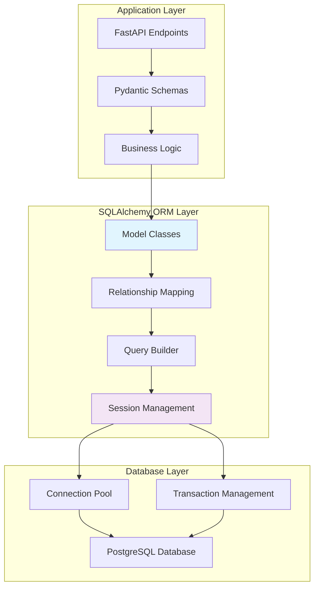
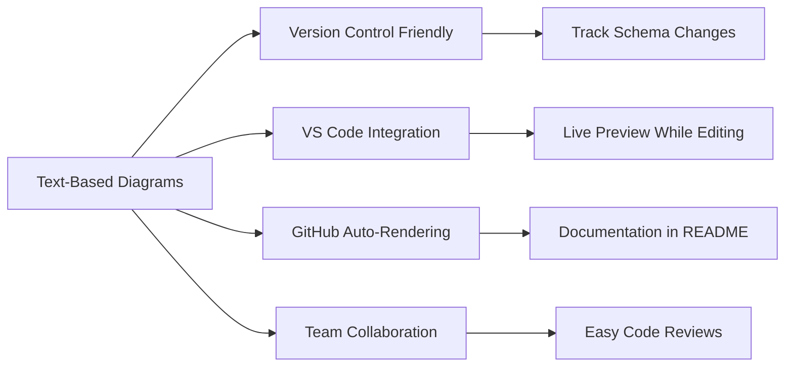
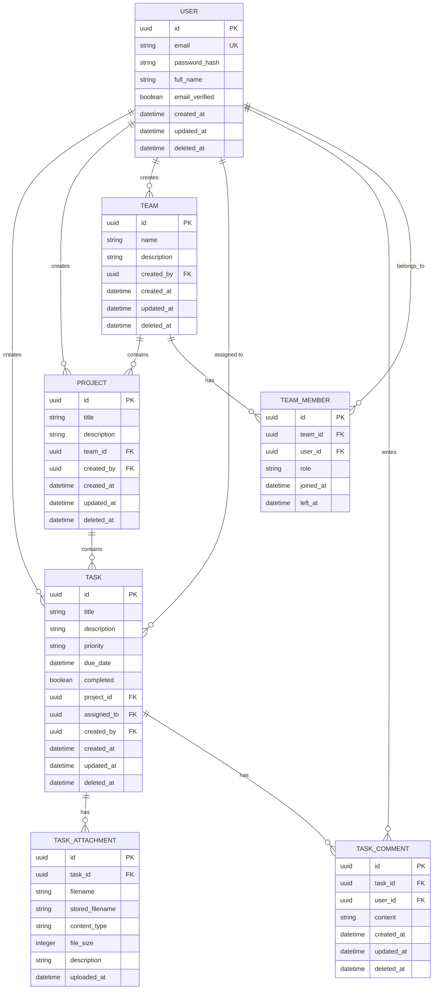
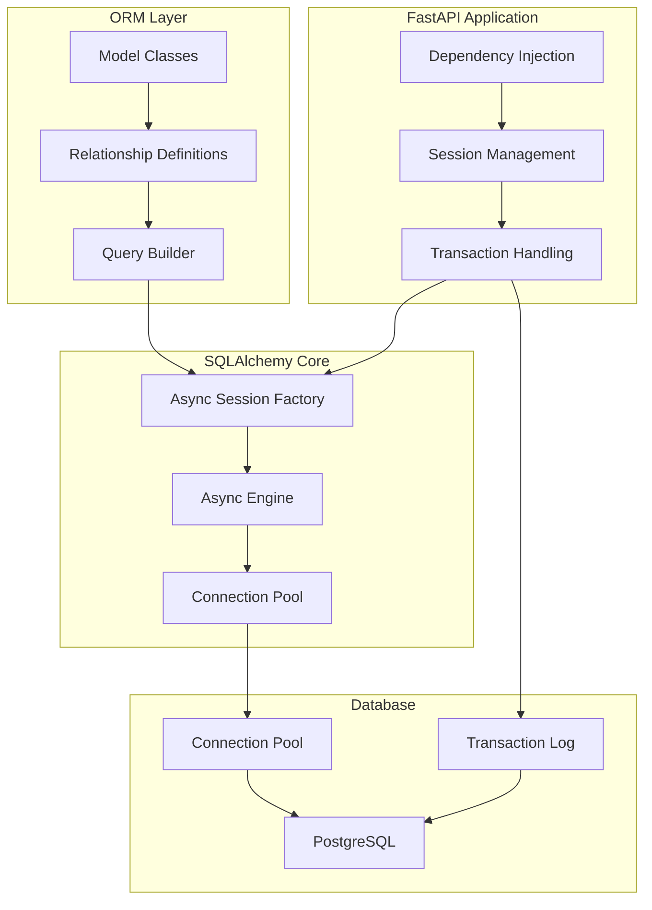

# Task 3.1: SQL Database with SQLAlchemy - Complete Implementation Guide

## Table of Contents

- [What is SQLAlchemy and Why Use It?](#what-is-sqlalchemy-and-why-use-it)
- [Database Design with Mermaid ER Diagrams](#database-design-with-mermaid-er-diagrams)
- [SQLAlchemy Architecture Overview](#sqlalchemy-architecture-overview)
- [Setup Requirements](#setup-requirements)
- [Step 1: Local PostgreSQL Setup and Configuration](#step-1-local-postgresql-setup-and-configuration)
- [Step 2: Database Schema Design with Mermaid](#step-2-database-schema-design-with-mermaid)
- [Step 3: SQLAlchemy Configuration and Base Setup](#step-3-sqlalchemy-configuration-and-base-setup)
- [Step 4: Create Database Models with Relationships](#step-4-create-database-models-with-relationships)
- [Step 5: Async Database Session Management](#step-5-async-database-session-management)
- [Step 6: Alembic Migration System](#step-6-alembic-migration-system)
- [Step 7: Database Health Checks and Monitoring](#step-7-database-health-checks-and-monitoring)
- [Testing the Complete Database System](#testing-the-complete-database-system)

---

## What is SQLAlchemy and Why Use It?

**SQLAlchemy** is Python's most popular SQL toolkit and Object-Relational Mapping (ORM) library. It provides a full suite of tools for working with databases in a Pythonic way.

### The Problem Without ORM

```python
# ❌ Raw SQL queries (Error-prone, hard to maintain)
import psycopg2

def get_user_tasks(user_id: int):
    conn = psycopg2.connect("postgresql://...")
    cursor = conn.cursor()
    cursor.execute("""
        SELECT t.id, t.title, t.description, t.priority, u.name as user_name
        FROM tasks t
        JOIN users u ON t.user_id = u.id
        WHERE t.user_id = %s AND t.deleted_at IS NULL
    """, (user_id,))
    results = cursor.fetchall()
    cursor.close()
    conn.close()

    # Manual conversion to dictionaries
    tasks = []
    for row in results:
        tasks.append({
            'id': row[0],
            'title': row[1],
            'description': row[2],
            'priority': row[3],
            'user_name': row[4]
        })
    return tasks
```

### The Solution With SQLAlchemy ORM

```python
# ✅ SQLAlchemy ORM (Type-safe, maintainable, Pythonic)
async def get_user_tasks(db: AsyncSession, user_id: UUID) -> List[Task]:
    """
    Get all active tasks for a user with related data

    Benefits:
    - Type safety with IDE autocompletion
    - Automatic relationship loading
    - SQL injection protection
    - Database-agnostic queries
    - Easy testing with dependency injection
    """
    result = await db.execute(
        select(Task)
        .options(selectinload(Task.user))  # Eager load user data
        .where(Task.user_id == user_id)
        .where(Task.deleted_at.is_(None))
    )
    return result.scalars().all()
```

### SQLAlchemy Architecture Benefits



**Key Benefits:**

✅ **Type Safety**: IDE autocompletion and type checking  
✅ **Database Agnostic**: Switch between PostgreSQL, MySQL, SQLite easily  
✅ **Relationship Management**: Automatic foreign key handling  
✅ **Query Optimization**: Lazy loading, eager loading, query optimization  
✅ **Migration Support**: Schema versioning with Alembic  
✅ **Async Support**: Full async/await support for high performance

---

## Database Design with Mermaid ER Diagrams

**Entity-Relationship (ER) Diagrams** help us visualize database structure before writing code. We'll use **Mermaid** for version-controlled, VS Code-friendly diagrams.

### Why Mermaid for Database Design?



### Our Database Schema Overview



---

## SQLAlchemy Architecture Overview

### SQLAlchemy 2.0 Modern Architecture



### Key SQLAlchemy 2.0 Features We'll Use

**1. Async Support**

```python
# Modern async/await pattern
async def get_tasks(db: AsyncSession) -> List[Task]:
    result = await db.execute(select(Task))
    return result.scalars().all()
```

**2. Type-Safe Queries**

```python
# IDE autocompletion and type checking
stmt = select(Task).where(Task.priority == "high")
result = await db.execute(stmt)
```

**3. Relationship Loading**

```python
# Efficient relationship loading
tasks = await db.execute(
    select(Task)
    .options(selectinload(Task.user))        # Load user data
    .options(selectinload(Task.attachments)) # Load attachments
)
```

---

## Setup Requirements

### Dependencies Installation

```bash
# Activate your virtual environment first
source venv/bin/activate  # Linux/macOS
# or
venv\Scripts\activate     # Windows

# Install database dependencies
pip install sqlalchemy==2.0.23          # SQLAlchemy ORM with async support
pip install asyncpg==0.29.0             # Fast async PostgreSQL driver
pip install alembic==1.12.1             # Database migration tool
pip install psycopg2-binary==2.9.7      # Sync PostgreSQL driver (backup)

# Development tools
pip install pgcli==3.5.0                # Enhanced PostgreSQL CLI

# Update requirements.txt
pip freeze > requirements.txt
```

### VS Code Extensions for Mermaid

```bash
# Install these VS Code extensions:
# 1. "Mermaid Markdown Syntax Highlighting" by bpruitt-goddard
# 2. "Markdown Preview Mermaid Support" by bierner

# Usage: Create .md files with Mermaid diagrams
# Press Ctrl+Shift+V to preview diagrams in VS Code
```

---

## Step 1: Local PostgreSQL Setup and Configuration

### PostgreSQL Installation

**macOS (using Homebrew):**

```bash
# Install PostgreSQL
brew install postgresql@15
brew services start postgresql@15

# Add to PATH (add to ~/.zshrc or ~/.bash_profile)
export PATH="/opt/homebrew/opt/postgresql@15/bin:$PATH"

# Verify installation
psql --version
```

**Ubuntu/Debian:**

```bash
# Update package list
sudo apt update

# Install PostgreSQL
sudo apt install postgresql-15 postgresql-contrib-15

# Start PostgreSQL service
sudo systemctl start postgresql
sudo systemctl enable postgresql

# Verify installation
sudo -u postgres psql -c "SELECT version();"
```

**Windows:**

```bash
# Download installer from: https://www.postgresql.org/download/windows/
# Run installer and follow setup wizard
# Add PostgreSQL bin directory to PATH

# Verify installation (in Command Prompt)
psql --version
```

### Database Setup

Create our development database and user:

```bash
# Connect to PostgreSQL as superuser
sudo -u postgres psql

# Or on macOS/Windows (if no password set):
psql postgres
```

```sql
-- Create database and user for our application
CREATE DATABASE taskmanager_dev;
CREATE USER taskuser WITH PASSWORD 'dev_password_123';

-- Grant privileges to our user
GRANT ALL PRIVILEGES ON DATABASE taskmanager_dev TO taskuser;

-- Connect to our database
\c taskmanager_dev

-- Grant schema privileges
GRANT ALL ON SCHEMA public TO taskuser;
GRANT ALL PRIVILEGES ON ALL TABLES IN SCHEMA public TO taskuser;
GRANT ALL PRIVILEGES ON ALL SEQUENCES IN SCHEMA public TO taskuser;

-- Exit PostgreSQL
\q
```

### Test Database Connection

```bash
# Test connection with our new user
psql -h localhost -d taskmanager_dev -U taskuser

# You should see:
# taskmanager_dev=>

# Test basic operations
SELECT current_database(), current_user, version();

# Exit
\q
```

---

## Step 2: Database Schema Design with Mermaid

### Create Documentation Structure

```bash
# Create documentation directory
mkdir -p docs/database

# Create Mermaid diagram files
touch docs/database/schema-overview.md
touch docs/database/user-domain.md
touch docs/database/task-domain.md
touch docs/database/relationships.md
```

### Create `docs/database/schema-overview.md`

````markdown
# Database Schema Overview

## Complete Entity-Relationship Diagram

```mermaid
erDiagram
    USER {
        uuid id PK
        string email UK "Unique, required"
        string password_hash "Bcrypt hashed"
        string full_name
        boolean email_verified "Default false"
        datetime created_at "Auto-generated"
        datetime updated_at "Auto-updated"
        datetime deleted_at "Soft delete"
    }

    TEAM {
        uuid id PK
        string name "Team display name"
        string description "Optional description"
        uuid created_by FK "References USER(id)"
        datetime created_at
        datetime updated_at
        datetime deleted_at
    }

    PROJECT {
        uuid id PK
        string title "Project name"
        string description "Project description"
        uuid team_id FK "References TEAM(id)"
        uuid created_by FK "References USER(id)"
        datetime created_at
        datetime updated_at
        datetime deleted_at
    }

    TASK {
        uuid id PK
        string title "Task title, required"
        string description "Task details"
        string priority "low, medium, high"
        datetime due_date "Optional deadline"
        boolean completed "Default false"
        uuid project_id FK "References PROJECT(id)"
        uuid assigned_to FK "References USER(id)"
        uuid created_by FK "References USER(id)"
        datetime created_at
        datetime updated_at
        datetime deleted_at
    }

    TEAM_MEMBER {
        uuid id PK
        uuid team_id FK
        uuid user_id FK
        string role "owner, admin, member"
        datetime joined_at
        datetime left_at "Soft leave"
    }

    TASK_ATTACHMENT {
        uuid id PK
        uuid task_id FK
        string filename "Original filename"
        string stored_filename "UUID filename"
        string content_type "MIME type"
        integer file_size "Bytes"
        string description "Optional description"
        datetime uploaded_at
    }

    TASK_COMMENT {
        uuid id PK
        uuid task_id FK
        uuid user_id FK
        string content "Comment text"
        datetime created_at
        datetime updated_at
        datetime deleted_at
    }

    %% Primary Relationships
    USER ||--o{ TASK : "creates (created_by)"
    USER ||--o{ TASK : "assigned (assigned_to)"
    USER ||--o{ PROJECT : "creates"
    USER ||--o{ TEAM : "creates"
    USER ||--o{ TASK_COMMENT : "writes"

    %% Hierarchical Relationships
    TEAM ||--o{ PROJECT : "contains"
    PROJECT ||--o{ TASK : "contains"

    %% Membership Relationships
    TEAM ||--o{ TEAM_MEMBER : "has_members"
    USER ||--o{ TEAM_MEMBER : "member_of"

    %% Content Relationships
    TASK ||--o{ TASK_ATTACHMENT : "has_attachments"
    TASK ||--o{ TASK_COMMENT : "has_comments"
\`\`\`

## Design Principles

### 1. **Soft Deletes**
All main entities use `deleted_at` timestamp instead of hard deletes:
- Preserves data integrity
- Enables audit trails
- Allows data recovery
- Maintains foreign key relationships

### 2. **UUID Primary Keys**
Using UUID instead of auto-incrementing integers:
- Better security (no ID enumeration)
- Distributed system compatibility
- No ID collision in merges
- Better for APIs (no guessable IDs)

### 3. **Audit Fields**
Common audit fields on all entities:
- `created_at`: When record was created
- `updated_at`: When record was last modified
- `created_by`: Who created the record
- `deleted_at`: When record was soft-deleted

### 4. **Relationship Integrity**
Proper foreign key constraints ensure:
- Data consistency
- Referential integrity
- Cascade delete handling
- Index optimization for joins
```
````

### VS Code Mermaid Preview

1. **Open `docs/database/schema-overview.md` in VS Code**
2. **Press `Ctrl+Shift+V`** (or `Cmd+Shift+V` on macOS)
3. **See live diagram preview** with proper relationships and formatting
4. **Edit and see real-time updates** as you modify the schema

---

## Step 3: SQLAlchemy Configuration and Base Setup

### Create Database Configuration

Create `app/config/database.py`:

```python
"""
Database configuration for different environments

This module provides:
- Environment-specific database URLs
- Connection pool configuration
- SSL settings for production
- Health check configuration
- Migration settings
"""

import os
from typing import Optional
from urllib.parse import quote_plus

class DatabaseConfig:
    """
    Database configuration class with environment-specific settings

    Supports multiple environments:
    - Development: Local PostgreSQL
    - Testing: In-memory SQLite or test database
    - Production: Cloud PostgreSQL with SSL
    """

    def __init__(self):
        self.environment = os.getenv("ENVIRONMENT", "development")

    def get_database_url(self) -> str:
        """
        Get database URL based on environment

        Returns:
            Database connection string with proper encoding

        Environment Variables:
            DATABASE_URL: Full database URL (production)
            DB_HOST: Database host (default: localhost)
            DB_PORT: Database port (default: 5432)
            DB_NAME: Database name (default: taskmanager_dev)
            DB_USER: Database user (default: taskuser)
            DB_PASSWORD: Database password (required)
        """

        # Use DATABASE_URL if provided (common in production)
        database_url = os.getenv("DATABASE_URL")
        if database_url:
            return database_url

        # Build URL from components
        host = os.getenv("DB_HOST", "localhost")
        port = os.getenv("DB_PORT", "5432")
        database = os.getenv("DB_NAME", "taskmanager_dev")
        username = os.getenv("DB_USER", "taskuser")
        password = os.getenv("DB_PASSWORD", "dev_password_123")

        # URL encode password to handle special characters
        encoded_password = quote_plus(password)

        return f"postgresql+asyncpg://{username}:{encoded_password}@{host}:{port}/{database}"

    def get_connection_args(self) -> dict:
        """
        Get SQLAlchemy engine configuration arguments

        Returns:
            Dictionary with engine configuration for connection pooling,
            timeouts, and SSL settings based on environment
        """

        base_args = {
            # Connection pool settings
            "pool_size": int(os.getenv("DB_POOL_SIZE", "10")),
            "max_overflow": int(os.getenv("DB_MAX_OVERFLOW", "20")),
            "pool_timeout": int(os.getenv("DB_POOL_TIMEOUT", "30")),
            "pool_recycle": int(os.getenv("DB_POOL_RECYCLE", "3600")),

            # Connection behavior
            "pool_pre_ping": True,  # Validate connections before use
            "echo": os.getenv("DB_ECHO", "false").lower() == "true",  # Log SQL queries
        }

        # Production-specific settings
        if self.environment == "production":
            base_args.update({
                "pool_size": 20,
                "max_overflow": 0,  # Strict pool size in production
                "connect_args": {
                    "sslmode": "require",
                    "connect_timeout": 10,
                }
            })

        return base_args

# Global configuration instance
db_config = DatabaseConfig()
```

### Create Environment File

Create `.env` in your project root:

```bash
# Database Configuration
ENVIRONMENT=development
DB_HOST=localhost
DB_PORT=5432
DB_NAME=taskmanager_dev
DB_USER=taskuser
DB_PASSWORD=dev_password_123

# SQLAlchemy Settings
DB_POOL_SIZE=5
DB_MAX_OVERFLOW=10
DB_POOL_TIMEOUT=30
DB_ECHO=true

# Application Settings
SECRET_KEY=your-secret-key-here
DEBUG=true
```

### Create Base Model Class

Create `app/models/base.py`:

```python
"""
Base model class with common fields and functionality

This module provides:
- Common audit fields (id, created_at, updated_at, etc.)
- Soft delete functionality
- UUID primary keys
- Base class for all database models
"""

import uuid
from datetime import datetime
from typing import Optional
from sqlalchemy import Column, DateTime, Boolean, String
from sqlalchemy.dialects.postgresql import UUID
from sqlalchemy.ext.declarative import declared_attr
from sqlalchemy.orm import DeclarativeBase
from sqlalchemy.sql import func

class Base(DeclarativeBase):
    """
    Base class for all SQLAlchemy models

    Provides consistent table naming and common functionality
    across all models in the application.
    """

    @declared_attr
    def __tablename__(cls) -> str:
        """
        Generate table name from class name

        Converts CamelCase class names to snake_case table names:
        - User -> users
        - TaskAttachment -> task_attachments
        - TeamMember -> team_members
        """
        import re
        # Convert CamelCase to snake_case and pluralize
        name = re.sub('(.)([A-Z][a-z]+)', r'\1_\2', cls.__name__)
        name = re.sub('([a-z0-9])([A-Z])', r'\1_\2', name).lower()

        # Simple pluralization (add 's' if not already ending in 's')
        if not name.endswith('s'):
            name += 's'

        return name

class BaseModel(Base):
    """
    Abstract base model with common audit fields

    All application models should inherit from this class to get:
    - UUID primary key
    - Creation and update timestamps
    - Soft delete functionality
    - User audit trails

    Fields:
        id: UUID primary key
        created_at: Timestamp when record was created
        updated_at: Timestamp when record was last updated
        created_by: UUID of user who created the record
        deleted_at: Timestamp when record was soft-deleted (NULL if active)
    """

    __abstract__ = True  # This class won't create a table

    # Primary key using UUID for better security and distributed systems
    id = Column(
        UUID(as_uuid=True),
        primary_key=True,
        default=uuid.uuid4,
        index=True,
        comment="Unique identifier for this record"
    )

    # Audit timestamps with automatic management
    created_at = Column(
        DateTime(timezone=True),
        server_default=func.now(),
        nullable=False,
        index=True,
        comment="When this record was created"
    )

    updated_at = Column(
        DateTime(timezone=True),
        server_default=func.now(),
        onupdate=func.now(),
        nullable=False,
        index=True,
        comment="When this record was last updated"
    )

    # User audit trail (will be foreign keys in actual models)
    created_by = Column(
        UUID(as_uuid=True),
        nullable=True,  # Allow system-created records
        index=True,
        comment="User who created this record"
    )

    # Soft delete support
    deleted_at = Column(
        DateTime(timezone=True),
        nullable=True,
        index=True,
        comment="When this record was deleted (NULL if active)"
    )

    def soft_delete(self) -> None:
        """
        Mark this record as deleted without removing from database

        Sets deleted_at timestamp to current time. The record remains
        in the database but is filtered out of normal queries.
        """
        self.deleted_at = datetime.utcnow()

    def restore(self) -> None:
        """
        Restore a soft-deleted record

        Sets deleted_at back to NULL, making the record active again.
        """
        self.deleted_at = None

    @property
    def is_deleted(self) -> bool:
        """
        Check if this record is soft-deleted

        Returns:
            True if record is deleted (deleted_at is not NULL)
        """
        return self.deleted_at is not None

    @property
    def is_active(self) -> bool:
        """
        Check if this record is active (not deleted)

        Returns:
            True if record is active (deleted_at is NULL)
        """
        return self.deleted_at is None

    def __repr__(self) -> str:
        """
        String representation of the model instance

        Returns:
            String showing class name and primary key
        """
        return f"<{self.__class__.__name__}(id={self.id})>"
```

---

## Step 4: Create Database Models with Relationships

### User Model

Create `app/models/user.py`:

```python
"""
User model for authentication and user management

This model provides:
- User authentication fields
- Profile information
- Email verification
- Password hashing integration
- Relationships to tasks, projects, and teams
"""

from typing import List, Optional
from sqlalchemy import Column, String, Boolean, Text
from sqlalchemy.orm import Mapped, mapped_column, relationship
from sqlalchemy.dialects.postgresql import UUID

from app.models.base import BaseModel

class User(BaseModel):
    """
    User model for authentication and profile management

    Stores user account information, authentication credentials,
    and profile data. Links to tasks, projects, and team memberships.

    Relationships:
        - created_tasks: Tasks created by this user
        - assigned_tasks: Tasks assigned to this user
        - created_projects: Projects created by this user
        - created_teams: Teams created by this user
        - team_memberships: Teams this user belongs to
        - task_comments: Comments written by this user
    """

    # Authentication fields
    email: Mapped[str] = mapped_column(
        String(255),
        unique=True,
        nullable=False,
        index=True,
        comment="User's unique email address for login"
    )

    password_hash: Mapped[str] = mapped_column(
        String(255),
        nullable=False,
        comment="Bcrypt hashed password"
    )

    # Profile information
    full_name: Mapped[str] = mapped_column(
        String(255),
        nullable=False,
        comment="User's display name"
    )

    # Account status
    email_verified: Mapped[bool] = mapped_column(
        Boolean,
        default=False,
        nullable=False,
        comment="Whether user has verified their email"
    )

    is_active: Mapped[bool] = mapped_column(
        Boolean,
        default=True,
        nullable=False,
        comment="Whether user account is active"
    )

    # Optional profile fields
    bio: Mapped[Optional[str]] = mapped_column(
        Text,
        nullable=True,
        comment="User's biography or description"
    )

    # Relationships - Tasks
    created_tasks: Mapped[List["Task"]] = relationship(
        "Task",
        foreign_keys="Task.created_by",
        back_populates="creator",
        lazy="select",
        cascade="all, delete-orphan"
    )

    assigned_tasks: Mapped[List["Task"]] = relationship(
        "Task",
        foreign_keys="Task.assigned_to",
        back_populates="assignee",
        lazy="select"
    )

    # Relationships - Projects
    created_projects: Mapped[List["Project"]] = relationship(
        "Project",
        foreign_keys="Project.created_by",
        back_populates="creator",
        lazy="select",
        cascade="all, delete-orphan"
    )

    # Relationships - Teams
    created_teams: Mapped[List["Team"]] = relationship(
        "Team",
        foreign_keys="Team.created_by",
        back_populates="creator",
        lazy="select",
        cascade="all, delete-orphan"
    )

    team_memberships: Mapped[List["TeamMember"]] = relationship(
        "TeamMember",
        back_populates="user",
        lazy="select"
    )

    # Relationship - Comments
    task_comments: Mapped[List["TaskComment"]] = relationship(
        "TaskComment",
        back_populates="user",
        lazy="select",
        cascade="all, delete-orphan"
    )

    def __repr__(self) -> str:
        return f"<User(id={self.id}, email='{self.email}', name='{self.full_name}')>"

    @property
    def display_name(self) -> str:
        """
        Get user's display name for UI

        Returns full name if available, otherwise email prefix
        """
        return self.full_name or self.email.split('@')[0]
```

### Task Model

Create `app/models/task.py`:

```python
"""
Task model for task management functionality

This model provides:
- Task information (title, description, priority)
- Due date and completion tracking
- Relationships to users, projects, attachments, and comments
- Priority levels and status management
"""

from datetime import datetime
from typing import List, Optional
from sqlalchemy import Column, String, Boolean, DateTime, Text, ForeignKey, Enum
from sqlalchemy.orm import Mapped, mapped_column, relationship
from sqlalchemy.dialects.postgresql import UUID
import enum

from app.models.base import BaseModel

class TaskPriority(enum.Enum):
    """
    Task priority levels

    Values:
        LOW: Low priority tasks
        MEDIUM: Medium priority tasks (default)
        HIGH: High priority tasks
    """
    LOW = "low"
    MEDIUM = "medium"
    HIGH = "high"

class Task(BaseModel):
    """
    Task model for managing individual tasks

    Tasks belong to projects and can be assigned to users.
    They support file attachments, comments, and priority levels.

    Relationships:
        - project: Project containing this task
        - creator: User who created this task
        - assignee: User assigned to this task
        - attachments: Files attached to this task
        - comments: Discussion comments on this task
    """

    # Basic task information
    title: Mapped[str] = mapped_column(
        String(255),
        nullable=False,
        index=True,
        comment="Task title or summary"
    )

    description: Mapped[Optional[str]] = mapped_column(
        Text,
        nullable=True,
        comment="Detailed task description"
    )

    # Task metadata
    priority: Mapped[TaskPriority] = mapped_column(
        Enum(TaskPriority),
        default=TaskPriority.MEDIUM,
        nullable=False,
        index=True,
        comment="Task priority level"
    )

    due_date: Mapped[Optional[datetime]] = mapped_column(
        DateTime(timezone=True),
        nullable=True,
        index=True,
        comment="When this task is due"
    )

    completed: Mapped[bool] = mapped_column(
        Boolean,
        default=False,
        nullable=False,
        index=True,
        comment="Whether task is completed"
    )

    completed_at: Mapped[Optional[datetime]] = mapped_column(
        DateTime(timezone=True),
        nullable=True,
        comment="When task was marked as completed"
    )

    # Foreign key relationships
    project_id: Mapped[Optional[UUID]] = mapped_column(
        UUID(as_uuid=True),
        ForeignKey("projects.id", ondelete="CASCADE"),
        nullable=True,
        index=True,
        comment="Project containing this task"
    )

    assigned_to: Mapped[Optional[UUID]] = mapped_column(
        UUID(as_uuid=True),
        ForeignKey("users.id", ondelete="SET NULL"),
        nullable=True,
        index=True,
        comment="User assigned to this task"
    )

    created_by: Mapped[UUID] = mapped_column(
        UUID(as_uuid=True),
        ForeignKey("users.id", ondelete="CASCADE"),
        nullable=False,
        index=True,
        comment="User who created this task"
    )

    # Relationships
    project: Mapped[Optional["Project"]] = relationship(
        "Project",
        back_populates="tasks",
        lazy="select"
    )

    creator: Mapped["User"] = relationship(
        "User",
        foreign_keys=[created_by],
        back_populates="created_tasks",
        lazy="select"
    )

    assignee: Mapped[Optional["User"]] = relationship(
        "User",
        foreign_keys=[assigned_to],
        back_populates="assigned_tasks",
        lazy="select"
    )

    attachments: Mapped[List["TaskAttachment"]] = relationship(
        "TaskAttachment",
        back_populates="task",
        lazy="select",
        cascade="all, delete-orphan"
    )

    comments: Mapped[List["TaskComment"]] = relationship(
        "TaskComment",
        back_populates="task",
        lazy="select",
        cascade="all, delete-orphan"
    )

    def mark_completed(self, completed_by: Optional[UUID] = None) -> None:
        """
        Mark task as completed with timestamp

        Args:
            completed_by: Optional user ID who completed the task
        """
        self.completed = True
        self.completed_at = datetime.utcnow()
        if completed_by:
            self.created_by = completed_by  # Track who completed it

    def mark_incomplete(self) -> None:
        """
        Mark task as incomplete and clear completion timestamp
        """
        self.completed = False
        self.completed_at = None

    @property
    def is_overdue(self) -> bool:
        """
        Check if task is overdue

        Returns:
            True if task has due date in the past and is not completed
        """
        if not self.due_date or self.completed:
            return False
        return datetime.utcnow() > self.due_date.replace(tzinfo=None)

    @property
    def days_until_due(self) -> Optional[int]:
        """
        Calculate days remaining until due date

        Returns:
            Number of days (negative if overdue, None if no due date)
        """
        if not self.due_date:
            return None

        delta = self.due_date.replace(tzinfo=None) - datetime.utcnow()
        return delta.days

    def __repr__(self) -> str:
        return f"<Task(id={self.id}, title='{self.title}', priority={self.priority.value})>"
```

### Project Model

Create `app/models/project.py`:

```python
"""
Project model for organizing tasks into projects

This model provides:
- Project information and organization
- Team association
- Task container functionality
- Project ownership and permissions
"""

from typing import List, Optional
from sqlalchemy import Column, String, Text, ForeignKey
from sqlalchemy.orm import Mapped, mapped_column, relationship
from sqlalchemy.dialects.postgresql import UUID

from app.models.base import BaseModel

class Project(BaseModel):
    """
    Project model for organizing tasks and team collaboration

    Projects contain tasks and belong to teams. They provide
    organizational structure for task management and team workflows.

    Relationships:
        - team: Team that owns this project
        - creator: User who created this project
        - tasks: Tasks contained in this project
    """

    # Project information
    title: Mapped[str] = mapped_column(
        String(255),
        nullable=False,
        index=True,
        comment="Project name or title"
    )

    description: Mapped[Optional[str]] = mapped_column(
        Text,
        nullable=True,
        comment="Project description and goals"
    )

    # Project status and metadata
    is_active: Mapped[bool] = mapped_column(
        Boolean,
        default=True,
        nullable=False,
        index=True,
        comment="Whether project is active"
    )

    # Foreign key relationships
    team_id: Mapped[Optional[UUID]] = mapped_column(
        UUID(as_uuid=True),
        ForeignKey("teams.id", ondelete="CASCADE"),
        nullable=True,
        index=True,
        comment="Team that owns this project"
    )

    created_by: Mapped[UUID] = mapped_column(
        UUID(as_uuid=True),
        ForeignKey("users.id", ondelete="CASCADE"),
        nullable=False,
        index=True,
        comment="User who created this project"
    )

    # Relationships
    team: Mapped[Optional["Team"]] = relationship(
        "Team",
        back_populates="projects",
        lazy="select"
    )

    creator: Mapped["User"] = relationship(
        "User",
        foreign_keys=[created_by],
        back_populates="created_projects",
        lazy="select"
    )

    tasks: Mapped[List["Task"]] = relationship(
        "Task",
        back_populates="project",
        lazy="select",
        cascade="all, delete-orphan"
    )

    @property
    def task_count(self) -> int:
        """
        Get total number of tasks in this project

        Returns:
            Number of active tasks (not soft-deleted)
        """
        return len([task for task in self.tasks if task.is_active])

    @property
    def completed_task_count(self) -> int:
        """
        Get number of completed tasks in this project

        Returns:
            Number of active, completed tasks
        """
        return len([
            task for task in self.tasks
            if task.is_active and task.completed
        ])

    @property
    def completion_percentage(self) -> float:
        """
        Calculate project completion percentage

        Returns:
            Percentage of tasks completed (0.0 to 100.0)
        """
        total = self.task_count
        if total == 0:
            return 0.0

        completed = self.completed_task_count
        return (completed / total) * 100.0

    def __repr__(self) -> str:
        return f"<Project(id={self.id}, title='{self.title}', tasks={self.task_count})>"
```

### Team Model

Create `app/models/team.py`:

```python
"""
Team model for team management and collaboration

This model provides:
- Team information and management
- Member relationships
- Project associations
- Team permissions and roles
"""

from typing import List, Optional
from sqlalchemy import Column, String, Text, ForeignKey, Boolean
from sqlalchemy.orm import Mapped, mapped_column, relationship
from sqlalchemy.dialects.postgresql import UUID

from app.models.base import BaseModel

class Team(BaseModel):
    """
    Team model for managing groups of users and projects

    Teams contain projects and have members with different roles.
    They provide collaboration structure and permission boundaries.

    Relationships:
        - creator: User who created this team
        - projects: Projects owned by this team
        - members: Team memberships with roles
    """

    # Team information
    name: Mapped[str] = mapped_column(
        String(255),
        nullable=False,
        index=True,
        comment="Team name or title"
    )

    description: Mapped[Optional[str]] = mapped_column(
        Text,
        nullable=True,
        comment="Team description and purpose"
    )

    # Team settings
    is_active: Mapped[bool] = mapped_column(
        Boolean,
        default=True,
        nullable=False,
        index=True,
        comment="Whether team is active"
    )

    # Foreign key relationships
    created_by: Mapped[UUID] = mapped_column(
        UUID(as_uuid=True),
        ForeignKey("users.id", ondelete="CASCADE"),
        nullable=False,
        index=True,
        comment="User who created this team"
    )

    # Relationships
    creator: Mapped["User"] = relationship(
        "User",
        foreign_keys=[created_by],
        back_populates="created_teams",
        lazy="select"
    )

    projects: Mapped[List["Project"]] = relationship(
        "Project",
        back_populates="team",
        lazy="select",
        cascade="all, delete-orphan"
    )

    members: Mapped[List["TeamMember"]] = relationship(
        "TeamMember",
        back_populates="team",
        lazy="select",
        cascade="all, delete-orphan"
    )

    @property
    def member_count(self) -> int:
        """
        Get total number of active team members

        Returns:
            Number of active team memberships
        """
        return len([member for member in self.members if member.is_active])

    @property
    def project_count(self) -> int:
        """
        Get total number of active projects

        Returns:
            Number of active projects in this team
        """
        return len([project for project in self.projects if project.is_active])

    def __repr__(self) -> str:
        return f"<Team(id={self.id}, name='{self.name}', members={self.member_count})>"
```

### Team Member Model

Create `app/models/team_member.py`:

```python
"""
Team membership model for managing user-team relationships

This model provides:
- User-team associations
- Role-based permissions
- Membership timeline tracking
- Active/inactive membership status
"""

from datetime import datetime
from typing import Optional
from sqlalchemy import Column, String, DateTime, ForeignKey, Boolean
from sqlalchemy.orm import Mapped, mapped_column, relationship
from sqlalchemy.dialects.postgresql import UUID
import enum

from app.models.base import BaseModel

class TeamRole(enum.Enum):
    """
    Team member roles with different permission levels

    Values:
        OWNER: Full team management permissions
        ADMIN: Administrative permissions (cannot delete team)
        MEMBER: Basic team member permissions
    """
    OWNER = "owner"
    ADMIN = "admin"
    MEMBER = "member"

class TeamMember(BaseModel):
    """
    Team membership model linking users to teams with roles

    Manages the many-to-many relationship between users and teams,
    including role-based permissions and membership timeline.

    Relationships:
        - team: Team this membership belongs to
        - user: User who is a member
    """

    # Foreign key relationships
    team_id: Mapped[UUID] = mapped_column(
        UUID(as_uuid=True),
        ForeignKey("teams.id", ondelete="CASCADE"),
        nullable=False,
        index=True,
        comment="Team this membership belongs to"
    )

    user_id: Mapped[UUID] = mapped_column(
        UUID(as_uuid=True),
        ForeignKey("users.id", ondelete="CASCADE"),
        nullable=False,
        index=True,
        comment="User who is a member"
    )

    # Membership details
    role: Mapped[TeamRole] = mapped_column(
        Enum(TeamRole),
        default=TeamRole.MEMBER,
        nullable=False,
        index=True,
        comment="Member's role in the team"
    )

    # Membership timeline
    joined_at: Mapped[datetime] = mapped_column(
        DateTime(timezone=True),
        server_default=func.now(),
        nullable=False,
        comment="When user joined the team"
    )

    left_at: Mapped[Optional[datetime]] = mapped_column(
        DateTime(timezone=True),
        nullable=True,
        comment="When user left the team (NULL if active)"
    )

    # Relationships
    team: Mapped["Team"] = relationship(
        "Team",
        back_populates="members",
        lazy="select"
    )

    user: Mapped["User"] = relationship(
        "User",
        back_populates="team_memberships",
        lazy="select"
    )

    @property
    def is_active(self) -> bool:
        """
        Check if membership is currently active

        Returns:
            True if user is currently a team member
        """
        return self.left_at is None

    def leave_team(self) -> None:
        """
        Mark member as having left the team

        Sets left_at timestamp to current time
        """
        self.left_at = datetime.utcnow()

    def rejoin_team(self) -> None:
        """
        Restore membership for a user who previously left

        Clears left_at timestamp
        """
        self.left_at = None

    @property
    def can_manage_team(self) -> bool:
        """
        Check if member can manage team settings

        Returns:
            True if member has OWNER or ADMIN role
        """
        return self.role in [TeamRole.OWNER, TeamRole.ADMIN]

    @property
    def can_delete_team(self) -> bool:
        """
        Check if member can delete the team

        Returns:
            True if member has OWNER role
        """
        return self.role == TeamRole.OWNER

    def __repr__(self) -> str:
        status = "active" if self.is_active else "inactive"
        return f"<TeamMember(team={self.team_id}, user={self.user_id}, role={self.role.value}, {status})>"
```

### Task Attachment Model

Create `app/models/task_attachment.py`:

```python
"""
Task attachment model for file management

This model provides:
- File metadata storage
- Task-file associations
- File size and type tracking
- Upload timeline information
"""

from typing import Optional
from sqlalchemy import Column, String, Integer, DateTime, ForeignKey, Text
from sqlalchemy.orm import Mapped, mapped_column, relationship
from sqlalchemy.dialects.postgresql import UUID
from sqlalchemy.sql import func

from app.models.base import BaseModel

class TaskAttachment(BaseModel):
    """
    Task attachment model for managing file uploads

    Stores metadata about files attached to tasks, including
    original filenames, storage paths, file types, and sizes.

    Relationships:
        - task: Task this attachment belongs to
    """

    # File metadata
    filename: Mapped[str] = mapped_column(
        String(255),
        nullable=False,
        comment="Original filename as uploaded by user"
    )

    stored_filename: Mapped[str] = mapped_column(
        String(255),
        nullable=False,
        unique=True,
        index=True,
        comment="UUID-based filename for storage"
    )

    content_type: Mapped[str] = mapped_column(
        String(100),
        nullable=False,
        index=True,
        comment="MIME type of the file"
    )

    file_size: Mapped[int] = mapped_column(
        Integer,
        nullable=False,
        comment="File size in bytes"
    )

    description: Mapped[Optional[str]] = mapped_column(
        Text,
        nullable=True,
        comment="Optional description of the file"
    )

    # Upload information
    uploaded_at: Mapped[datetime] = mapped_column(
        DateTime(timezone=True),
        server_default=func.now(),
        nullable=False,
        index=True,
        comment="When file was uploaded"
    )

    # Foreign key relationships
    task_id: Mapped[UUID] = mapped_column(
        UUID(as_uuid=True),
        ForeignKey("tasks.id", ondelete="CASCADE"),
        nullable=False,
        index=True,
        comment="Task this attachment belongs to"
    )

    # Relationships
    task: Mapped["Task"] = relationship(
        "Task",
        back_populates="attachments",
        lazy="select"
    )

    @property
    def file_size_human(self) -> str:
        """
        Get human-readable file size

        Returns:
            File size formatted as "1.2 MB", "345 KB", etc.
        """
        size = self.file_size
        for unit in ['B', 'KB', 'MB', 'GB']:
            if size < 1024.0:
                return f"{size:.1f} {unit}"
            size /= 1024.0
        return f"{size:.1f} TB"

    @property
    def is_image(self) -> bool:
        """
        Check if attachment is an image file

        Returns:
            True if content type indicates an image
        """
        return self.content_type.startswith('image/')

    @property
    def is_document(self) -> bool:
        """
        Check if attachment is a document file

        Returns:
            True if content type indicates a document
        """
        document_types = [
            'application/pdf',
            'application/msword',
            'application/vnd.openxmlformats-officedocument.wordprocessingml.document',
            'text/plain',
            'text/markdown'
        ]
        return self.content_type in document_types

    def __repr__(self) -> str:
        return f"<TaskAttachment(id={self.id}, filename='{self.filename}', size={self.file_size_human})>"
```

### Task Comment Model

Create `app/models/task_comment.py`:

```python
"""
Task comment model for task discussions

This model provides:
- Comment content storage
- User-comment associations
- Comment timeline tracking
- Edit and delete functionality
"""

from typing import Optional
from sqlalchemy import Column, String, Text, ForeignKey, DateTime
from sqlalchemy.orm import Mapped, mapped_column, relationship
from sqlalchemy.dialects.postgresql import UUID
from sqlalchemy.sql import func

from app.models.base import BaseModel

class TaskComment(BaseModel):
    """
    Task comment model for discussions and notes

    Stores comments and discussions related to tasks,
    enabling team collaboration and communication.

    Relationships:
        - task: Task this comment belongs to
        - user: User who wrote this comment
    """

    # Comment content
    content: Mapped[str] = mapped_column(
        Text,
        nullable=False,
        comment="Comment text content"
    )

    # Edit tracking
    edited_at: Mapped[Optional[datetime]] = mapped_column(
        DateTime(timezone=True),
        nullable=True,
        comment="When comment was last edited (NULL if never edited)"
    )

    # Foreign key relationships
    task_id: Mapped[UUID] = mapped_column(
        UUID(as_uuid=True),
        ForeignKey("tasks.id", ondelete="CASCADE"),
        nullable=False,
        index=True,
        comment="Task this comment belongs to"
    )

    user_id: Mapped[UUID] = mapped_column(
        UUID(as_uuid=True),
        ForeignKey("users.id", ondelete="CASCADE"),
        nullable=False,
        index=True,
        comment="User who wrote this comment"
    )

    # Relationships
    task: Mapped["Task"] = relationship(
        "Task",
        back_populates="comments",
        lazy="select"
    )

    user: Mapped["User"] = relationship(
        "User",
        back_populates="task_comments",
        lazy="select"
    )

    @property
    def was_edited(self) -> bool:
        """
        Check if comment has been edited

        Returns:
            True if comment was edited after creation
        """
        return self.edited_at is not None

    def mark_edited(self) -> None:
        """
        Mark comment as edited with current timestamp
        """
        from datetime import datetime
        self.edited_at = datetime.utcnow()

    @property
    def content_preview(self) -> str:
        """
        Get truncated preview of comment content

        Returns:
            First 100 characters of content with ellipsis if longer
        """
        if len(self.content) <= 100:
            return self.content
        return self.content[:97] + "..."

    def __repr__(self) -> str:
        edited = " (edited)" if self.was_edited else ""
        return f"<TaskComment(id={self.id}, user={self.user_id}, preview='{self.content_preview}'{edited})>"
```

### Create Models Index

Create `app/models/__init__.py`:

```python
"""
Database models package

This module imports and exposes all database models for the application.
It also provides the Base class for SQLAlchemy table creation.

Models:
    - User: User authentication and profile management
    - Team: Team management and collaboration
    - Project: Project organization and management
    - Task: Task tracking and management
    - TeamMember: User-team membership with roles
    - TaskAttachment: File attachments for tasks
    - TaskComment: Discussion comments on tasks

Usage:
    from app.models import User, Task, Project
    from app.models import Base  # For creating all tables
"""

# Import base classes
from app.models.base import Base, BaseModel

# Import all models
from app.models.user import User
from app.models.team import Team
from app.models.project import Project
from app.models.task import Task, TaskPriority
from app.models.team_member import TeamMember, TeamRole
from app.models.task_attachment import TaskAttachment
from app.models.task_comment import TaskComment

# Export all models for easy importing
__all__ = [
    # Base classes
    "Base",
    "BaseModel",

    # Core models
    "User",
    "Team",
    "Project",
    "Task",
    "TeamMember",
    "TaskAttachment",
    "TaskComment",

    # Enums
    "TaskPriority",
    "TeamRole",
]

"""
Model Relationship Summary:

USER (1) --> (M) TASK (created_by)
USER (1) --> (M) TASK (assigned_to)
USER (1) --> (M) PROJECT (created_by)
USER (1) --> (M) TEAM (created_by)
USER (1) --> (M) TEAM_MEMBER (user_id)
USER (1) --> (M) TASK_COMMENT (user_id)

TEAM (1) --> (M) PROJECT (team_id)
TEAM (1) --> (M) TEAM_MEMBER (team_id)

PROJECT (1) --> (M) TASK (project_id)

TASK (1) --> (M) TASK_ATTACHMENT (task_id)
TASK (1) --> (M) TASK_COMMENT (task_id)

Foreign Key Constraints:
- All models use UUID primary keys for better security
- Soft deletes implemented via deleted_at timestamp
- Cascade deletes configured for parent-child relationships
- SET NULL configured for optional references
"""
```

---

## Step 5: Async Database Session Management

### Database Engine Setup

Create `app/database/engine.py`:

```python
"""
Database engine and session configuration

This module provides:
- Async SQLAlchemy engine setup
- Session factory with dependency injection
- Connection pool management
- Database health checks
"""

from typing import AsyncGenerator
from sqlalchemy.ext.asyncio import AsyncSession, create_async_engine, async_sessionmaker
from sqlalchemy.pool import NullPool
import asyncio
import logging

from app.config.database import db_config

# Configure logging
logging.basicConfig(level=logging.INFO)
logger = logging.getLogger(__name__)

class DatabaseManager:
    """
    Database manager for SQLAlchemy async operations

    Handles engine creation, session management, and connection pooling
    for the FastAPI application with proper async support.
    """

    def __init__(self):
        self.engine = None
        self.session_factory = None
        self._initialized = False

    async def initialize(self) -> None:
        """
        Initialize database engine and session factory

        Creates the async engine with connection pooling and
        sets up the session factory for dependency injection.
        """
        if self._initialized:
            return

        try:
            # Get database URL and connection arguments
            database_url = db_config.get_database_url()
            connection_args = db_config.get_connection_args()

            logger.info(f"Initializing database connection to: {database_url.split('@')[1] if '@' in database_url else database_url}")

            # Create async engine with connection pooling
            self.engine = create_async_engine(
                database_url,
                **connection_args,
                # Additional async-specific settings
                future=True,  # Use SQLAlchemy 2.0 style
            )

            # Create session factory
            self.session_factory = async_sessionmaker(
                bind=self.engine,
                class_=AsyncSession,
                expire_on_commit=False,  # Keep objects accessible after commit
                autoflush=True,          # Automatically flush changes
                autocommit=False,        # Manual transaction control
            )

            self._initialized = True
            logger.info("Database engine initialized successfully")

        except Exception as e:
            logger.error(f"Failed to initialize database: {e}")
            raise

    async def close(self) -> None:
        """
        Close database engine and cleanup connections

        Properly closes all connections and cleans up resources
        when the application shuts down.
        """
        if self.engine:
            logger.info("Closing database connections...")
            await self.engine.dispose()
            self._initialized = False
            logger.info("Database connections closed")

    async def health_check(self) -> bool:
        """
        Perform database health check

        Returns:
            True if database is accessible and responding
        """
        if not self._initialized:
            return False

        try:
            # Test database connection with a simple query
            async with self.session_factory() as session:
                result = await session.execute(text("SELECT 1"))
                result.scalar()
                return True
        except Exception as e:
            logger.error(f"Database health check failed: {e}")
            return False

# Global database manager instance
db_manager = DatabaseManager()

async def get_database_session() -> AsyncGenerator[AsyncSession, None]:
    """
    FastAPI dependency for database sessions

    Provides async database sessions with proper lifecycle management.
    Automatically handles session creation, cleanup, and error handling.

    Usage:
        @app.get("/tasks")
        async def get_tasks(db: AsyncSession = Depends(get_database_session)):
            result = await db.execute(select(Task))
            return result.scalars().all()

    Yields:
        AsyncSession: Database session for use in FastAPI endpoints
    """
    if not db_manager._initialized:
        await db_manager.initialize()

    # Create new session for this request
    async with db_manager.session_factory() as session:
        try:
            # Yield session to the endpoint
            yield session
        except Exception as e:
            # Rollback transaction on error
            await session.rollback()
            logger.error(f"Database session error: {e}")
            raise
        finally:
            # Session is automatically closed by async context manager
            pass

# Convenience alias for dependency injection
DatabaseSession = AsyncSession
```

### Session Utilities

Create `app/database/session_utils.py`:

```python
"""
Database session utilities and helpers

This module provides:
- Transaction context managers
- Session-based query helpers
- Bulk operation utilities
- Error handling wrappers
"""

from contextlib import asynccontextmanager
from typing import TypeVar, Generic, List, Optional, Dict, Any
from sqlalchemy.ext.asyncio import AsyncSession
from sqlalchemy import select, update, delete, and_, or_
from sqlalchemy.orm import selectinload, contains_eager
import logging

from app.models.base import BaseModel

logger = logging.getLogger(__name__)

T = TypeVar('T', bound=BaseModel)

class SessionManager:
    """
    Session manager with transaction support and query utilities

    Provides high-level database operations with proper error handling,
    transaction management, and query optimization.
    """

    def __init__(self, session: AsyncSession):
        self.session = session

    @asynccontextmanager
    async def transaction(self):
        """
        Async context manager for database transactions

        Automatically commits on success or rolls back on error.
        Supports nested transactions via savepoints.

        Usage:
            async with SessionManager(db).transaction():
                # Database operations here
                user = User(email="test@example.com")
                session.add(user)
                # Automatically committed on success
        """
        transaction = await self.session.begin()
        try:
            yield transaction
            await transaction.commit()
            logger.debug("Transaction committed successfully")
        except Exception as e:
            await transaction.rollback()
            logger.error(f"Transaction rolled back due to error: {e}")
            raise

    async def get_by_id(self, model: type[T], id: Any, load_relationships: List[str] = None) -> Optional[T]:
        """
        Get model instance by ID with optional relationship loading

        Args:
            model: SQLAlchemy model class
            id: Primary key value
            load_relationships: List of relationship names to eager load

        Returns:
            Model instance or None if not found

        Example:
            user = await session_manager.get_by_id(
                User,
                user_id,
                load_relationships=['created_tasks', 'team_memberships']
            )
        """
        query = select(model).where(model.id == id)

        # Add relationship loading if specified
        if load_relationships:
            for rel in load_relationships:
                query = query.options(selectinload(getattr(model, rel)))

        result = await self.session.execute(query)
        return result.scalar_one_or_none()

    async def get_all(
        self,
        model: type[T],
        filters: Dict[str, Any] = None,
        load_relationships: List[str] = None,
        limit: Optional[int] = None,
        offset: Optional[int] = None,
        order_by: Optional[str] = None
    ) -> List[T]:
        """
        Get multiple model instances with filtering and pagination

        Args:
            model: SQLAlchemy model class
            filters: Dictionary of field filters {field_name: value}
            load_relationships: List of relationship names to eager load
            limit: Maximum number of records to return
            offset: Number of records to skip
            order_by: Field name to order by (prefix with '-' for descending)

        Returns:
            List of model instances

        Example:
            tasks = await session_manager.get_all(
                Task,
                filters={'completed': False, 'priority': 'high'},
                load_relationships=['user', 'project'],
                limit=10,
                order_by='-created_at'
            )
        """
        query = select(model)

        # Apply filters
        if filters:
            for field, value in filters.items():
                if hasattr(model, field):
                    query = query.where(getattr(model, field) == value)

        # Add relationship loading
        if load_relationships:
            for rel in load_relationships:
                if hasattr(model, rel):
                    query = query.options(selectinload(getattr(model, rel)))

        # Add ordering
        if order_by:
            if order_by.startswith('-'):
                # Descending order
                field_name = order_by[1:]
                if hasattr(model, field_name):
                    query = query.order_by(getattr(model, field_name).desc())
            else:
                # Ascending order
                if hasattr(model, order_by):
                    query = query.order_by(getattr(model, order_by))

        # Add pagination
        if limit:
            query = query.limit(limit)
        if offset:
            query = query.offset(offset)

        result = await self.session.execute(query)
        return result.scalars().all()

    async def create(self, instance: T) -> T:
        """
        Create new model instance

        Args:
            instance: Model instance to create

        Returns:
            Created instance with populated ID and timestamps
        """
        self.session.add(instance)
        await self.session.flush()  # Get ID without committing
        await self.session.refresh(instance)  # Refresh with DB values
        return instance

    async def bulk_create(self, instances: List[T]) -> List[T]:
        """
        Create multiple model instances efficiently

        Args:
            instances: List of model instances to create

        Returns:
            List of created instances
        """
        self.session.add_all(instances)
        await self.session.flush()

        # Refresh all instances to get DB-generated values
        for instance in instances:
            await self.session.refresh(instance)

        return instances

    async def update_by_id(self, model: type[T], id: Any, updates: Dict[str, Any]) -> Optional[T]:
        """
        Update model instance by ID

        Args:
            model: SQLAlchemy model class
            id: Primary key value
            updates: Dictionary of fields to update

        Returns:
            Updated instance or None if not found
        """
        # First get the instance
        instance = await self.get_by_id(model, id)
        if not instance:
            return None

        # Apply updates
        for field, value in updates.items():
            if hasattr(instance, field):
                setattr(instance, field, value)

        await self.session.flush()
        await self.session.refresh(instance)
        return instance

    async def delete_by_id(self, model: type[T], id: Any, soft_delete: bool = True) -> bool:
        """
        Delete model instance by ID

        Args:
            model: SQLAlchemy model class
            id: Primary key value
            soft_delete: Whether to use soft delete (set deleted_at) or hard delete

        Returns:
            True if instance was deleted, False if not found
        """
        instance = await self.get_by_id(model, id)
        if not instance:
            return False

        if soft_delete and hasattr(instance, 'soft_delete'):
            # Use soft delete
            instance.soft_delete()
            await self.session.flush()
        else:
            # Hard delete
            await self.session.delete(instance)

        return True

    async def count(self, model: type[T], filters: Dict[str, Any] = None) -> int:
        """
        Count model instances with optional filtering

        Args:
            model: SQLAlchemy model class
            filters: Dictionary of field filters

        Returns:
            Number of matching records
        """
        from sqlalchemy import func

        query = select(func.count(model.id))

        # Apply filters
        if filters:
            for field, value in filters.items():
                if hasattr(model, field):
                    query = query.where(getattr(model, field) == value)

        result = await self.session.execute(query)
        return result.scalar()

    async def exists(self, model: type[T], filters: Dict[str, Any]) -> bool:
        """
        Check if model instance exists with given filters

        Args:
            model: SQLAlchemy model class
            filters: Dictionary of field filters

        Returns:
            True if matching record exists
        """
        count = await self.count(model, filters)
        return count > 0
```

---

## Step 6: Alembic Migration System

### Initialize Alembic

```bash
# Navigate to your project root directory
cd task-management-api

# Initialize Alembic in your project
alembic init alembic

# This creates:
# alembic/
# ├── env.py              # Alembic environment configuration
# ├── script.py.mako      # Migration template
# └── versions/           # Migration files directory
# alembic.ini             # Alembic configuration file
```

### Configure Alembic

Edit `alembic.ini`:

```ini
# the 'revision' command, regardless of autogenerate
# revision_environment = false

# Alembic configuration file
[alembic]
# path to migration scripts
script_location = alembic

# template used to generate migration file names; The default value is %%(rev)s_%%(slug)s
# Uncomment the line below if you want the files to be prepended with date and time
file_template = %%(year)d_%%(month).2d_%%(day).2d_%%(hour).2d%%(minute).2d-%%(rev)s_%%(slug)s

# sys.path path, will be prepended to sys.path if present.
# defaults to the current working directory.
prepend_sys_path = .

# timezone to use when rendering the date within the migration file
# as well as the filename.
# If specified, requires the python-dateutil library that can be
# installed by adding `alembic[tz]` to the pip requirements
# string value is passed to dateutil.tz.gettz()
# leave blank for localtime
# timezone =

# max length of characters to apply to the
# "slug" field
# truncate_slug_length = 40

# set to 'true' to run the environment during
# the 'revision' command, regardless of autogenerate
# revision_environment = false

# set to 'true' to allow .pyc and .pyo files without
# a source .py file to be detected as revisions in the
# versions/ directory
# sourceless = false

# version number format (uses python format strings)
# You can also use the format "%Y%m%d%H%M%S" to have datetime prefix
version_num_format = %%(year)d%%(month).2d%%(day).2d_%%(hour).2d%%(minute).2d_%%(rev)s

# version path separator; As mentioned above, this is the character used to split
# version_locations. The default within new alembic.ini files is "os", which uses
# os.pathsep. If this key is omitted entirely, it falls back to the legacy
# behavior of splitting on spaces and/or commas.
# Valid values for version_path_separator are:
#
# version_path_separator = :
# version_path_separator = ;
# version_path_separator = space
version_path_separator = os

# the output encoding used when revision files
# are written from script.py.mako
# output_encoding = utf-8

# Database URL - we'll set this programmatically in env.py
# sqlalchemy.url =

[post_write_hooks]
# post_write_hooks defines scripts or Python functions that are run
# on newly generated revision scripts.
# format using "black" - use the console_scripts runner, against the "black" entrypoint
# hooks = black
# black.type = console_scripts
# black.entrypoint = black
# black.options = -l 79 REVISION_SCRIPT_FILENAME

[loggers]
keys = root,sqlalchemy,alembic

[handlers]
keys = console

[formatters]
keys = generic

[logger_root]
level = WARN
handlers = console
qualname =

[logger_sqlalchemy]
level = WARN
handlers =
qualname = sqlalchemy.engine

[logger_alembic]
level = INFO
handlers =
qualname = alembic

[handler_console]
class = StreamHandler
args = (sys.stderr,)
level = NOTSET
formatter = generic

[formatter_generic]
format = %(levelname)-5.5s [%(name)s] %(message)s
datefmt = %H:%M:%S
```

### Configure Alembic Environment

Edit `alembic/env.py`:

```python
"""
Alembic environment configuration for FastAPI application

This module configures Alembic to work with our SQLAlchemy models
and provides both offline and online migration capabilities.
"""

import asyncio
import os
from logging.config import fileConfig
from sqlalchemy import pool
from sqlalchemy.engine import Connection
from sqlalchemy.ext.asyncio import async_engine_from_config

from alembic import context

# Import your models and configuration
from app.models import Base  # This imports all models
from app.config.database import db_config

# This is the Alembic Config object
config = context.config

# Interpret the config file for Python logging.
if config.config_file_name is not None:
    fileConfig(config.config_file_name)

# Set the target metadata for autogenerate support
target_metadata = Base.metadata

def get_database_url() -> str:
    """
    Get database URL from environment configuration

    Returns:
        Database URL for Alembic to use
    """
    return db_config.get_database_url()

def run_migrations_offline() -> None:
    """
    Run migrations in 'offline' mode.

    This configures the context with just a URL
    and not an Engine, though an Engine is acceptable
    here as well. By skipping the Engine creation
    we don't even need a DBAPI to be available.

    Calls to context.execute() here emit the given string to the
    script output.
    """
    url = get_database_url()
    context.configure(
        url=url,
        target_metadata=target_metadata,
        literal_binds=True,
        dialect_opts={"paramstyle": "named"},
        # Include schemas in output
        include_schemas=True,
        # Compare type changes
        compare_type=True,
        # Compare server defaults
        compare_server_default=True,
    )

    with context.begin_transaction():
        context.run_migrations()

def do_run_migrations(connection: Connection) -> None:
    """
    Run migrations with database connection

    Args:
        connection: Database connection to use for migrations
    """
    context.configure(
        connection=connection,
        target_metadata=target_metadata,
        # Include schemas in migrations
        include_schemas=True,
        # Compare type changes (important for enum updates)
        compare_type=True,
        # Compare server defaults (timestamps, etc.)
        compare_server_default=True,
        # Render schema changes
        render_as_batch=True,
    )

    with context.begin_transaction():
        context.run_migrations()

async def run_async_migrations() -> None:
    """
    Run migrations in 'online' mode with async support.

    In this scenario we need to create an Engine
    and associate a connection with the context.
    """
    # Get database configuration
    configuration = config.get_section(config.config_ini_section)
    configuration["sqlalchemy.url"] = get_database_url()

    # Create async engine
    connectable = async_engine_from_config(
        configuration,
        prefix="sqlalchemy.",
        poolclass=pool.NullPool,
    )

    async with connectable.connect() as connection:
        await connection.run_sync(do_run_migrations)

    await connectable.dispose()

def run_migrations_online() -> None:
    """
    Run migrations in 'online' mode with async support.
    """
    asyncio.run(run_async_migrations())

# Determine which mode to run in
if context.is_offline_mode():
    run_migrations_offline()
else:
    run_migrations_online()
```

### Create Initial Migration

```bash
# Create the first migration with all your models
alembic revision --autogenerate -m "Initial database schema"

# This will create a file like:
# alembic/versions/2024_01_15_1430-abc123_initial_database_schema.py
```

### Example Migration File

The generated migration file will look like this:

```python
"""Initial database schema

Revision ID: abc123def456
Revises:
Create Date: 2024-01-15 14:30:00.000000

"""
from typing import Sequence, Union
from alembic import op
import sqlalchemy as sa
from sqlalchemy.dialects.postgresql import UUID

# revision identifiers, used by Alembic.
revision: str = 'abc123def456'
down_revision: Union[str, None] = None
branch_labels: Union[str, Sequence[str], None] = None
depends_on: Union[str, Sequence[str], None] = None

def upgrade() -> None:
    """
    Create all tables and indexes for initial schema
    """
    # Create users table
    op.create_table('users',
        sa.Column('id', UUID(as_uuid=True), nullable=False),
        sa.Column('email', sa.String(length=255), nullable=False),
        sa.Column('password_hash', sa.String(length=255), nullable=False),
        sa.Column('full_name', sa.String(length=255), nullable=False),
        sa.Column('email_verified', sa.Boolean(), nullable=False),
        sa.Column('is_active', sa.Boolean(), nullable=False),
        sa.Column('bio', sa.Text(), nullable=True),
        sa.Column('created_at', sa.DateTime(timezone=True), server_default=sa.text('now()'), nullable=False),
        sa.Column('updated_at', sa.DateTime(timezone=True), server_default=sa.text('now()'), nullable=False),
        sa.Column('created_by', UUID(as_uuid=True), nullable=True),
        sa.Column('deleted_at', sa.DateTime(timezone=True), nullable=True),
        sa.PrimaryKeyConstraint('id')
    )
    op.create_index(op.f('ix_users_created_at'), 'users', ['created_at'], unique=False)
    op.create_index(op.f('ix_users_created_by'), 'users', ['created_by'], unique=False)
    op.create_index(op.f('ix_users_deleted_at'), 'users', ['deleted_at'], unique=False)
    op.create_index(op.f('ix_users_email'), 'users', ['email'], unique=False)
    op.create_index(op.f('ix_users_id'), 'users', ['id'], unique=False)
    op.create_index(op.f('ix_users_updated_at'), 'users', ['updated_at'], unique=False)

    # Create teams table
    op.create_table('teams',
        sa.Column('id', UUID(as_uuid=True), nullable=False),
        sa.Column('name', sa.String(length=255), nullable=False),
        sa.Column('description', sa.Text(), nullable=True),
        sa.Column('is_active', sa.Boolean(), nullable=False),
        sa.Column('created_by', UUID(as_uuid=True), nullable=False),
        sa.Column('created_at', sa.DateTime(timezone=True), server_default=sa.text('now()'), nullable=False),
        sa.Column('updated_at', sa.DateTime(timezone=True), server_default=sa.text('now()'), nullable=False),
        sa.Column('deleted_at', sa.DateTime(timezone=True), nullable=True),
        sa.ForeignKeyConstraint(['created_by'], ['users.id'], ondelete='CASCADE'),
        sa.PrimaryKeyConstraint('id')
    )
    # ... (indexes for teams)

    # Create projects table
    op.create_table('projects',
        # ... (similar structure)
    )

    # Create tasks table
    op.create_table('tasks',
        # ... (similar structure with foreign keys)
    )

    # Create team_members table
    op.create_table('team_members',
        # ... (junction table structure)
    )

    # Create task_attachments table
    op.create_table('task_attachments',
        # ... (file metadata structure)
    )

    # Create task_comments table
    op.create_table('task_comments',
        # ... (comment structure)
    )

def downgrade() -> None:
    """
    Drop all tables (reverse the upgrade)
    """
    op.drop_table('task_comments')
    op.drop_table('task_attachments')
    op.drop_table('team_members')
    op.drop_table('tasks')
    op.drop_table('projects')
    op.drop_table('teams')
    op.drop_table('users')
```

### Apply Migration

```bash
# Apply the migration to create all tables
alembic upgrade head

# Check migration status
alembic current

# See migration history
alembic history

# If you need to rollback
alembic downgrade -1  # Go back one migration
```

### Create Seed Data Migration

```bash
# Create a migration for seed data
alembic revision -m "Add seed data"
```

Edit the seed data migration:

```python
"""Add seed data

Revision ID: def456ghi789
Revises: abc123def456
Create Date: 2024-01-15 15:00:00.000000

"""
from typing import Sequence, Union
from alembic import op
import sqlalchemy as sa
from sqlalchemy.sql import table, column
from sqlalchemy.dialects.postgresql import UUID
import uuid
from datetime import datetime

# revision identifiers
revision: str = 'def456ghi789'
down_revision: Union[str, None] = 'abc123def456'
branch_labels: Union[str, Sequence[str], None] = None
depends_on: Union[str, Sequence[str], None] = None

def upgrade() -> None:
    """
    Insert seed data for development and testing
    """
    # Define table structures for bulk insert
    users_table = table('users',
        column('id', UUID),
        column('email', sa.String),
        column('password_hash', sa.String),
        column('full_name', sa.String),
        column('email_verified', sa.Boolean),
        column('is_active', sa.Boolean),
        column('created_at', sa.DateTime),
        column('updated_at', sa.DateTime),
    )

    teams_table = table('teams',
        column('id', UUID),
        column('name', sa.String),
        column('description', sa.String),
        column('is_active', sa.Boolean),
        column('created_by', UUID),
        column('created_at', sa.DateTime),
        column('updated_at', sa.DateTime),
    )

    # Generate UUIDs for seed data
    admin_user_id = uuid.uuid4()
    test_user_id = uuid.uuid4()
    team_id = uuid.uuid4()
    now = datetime.utcnow()

    # Insert seed users
    op.bulk_insert(users_table, [
        {
            'id': admin_user_id,
            'email': 'admin@taskmanager.com',
            'password_hash': '$2b$12$LQv3c1yqBWVHxkd0LHAkCOYz6TtxMQJqhN8/LewdBPj8xq9uh1Qxy',  # password: admin123
            'full_name': 'Admin User',
            'email_verified': True,
            'is_active': True,
            'created_at': now,
            'updated_at': now,
        },
        {
            'id': test_user_id,
            'email': 'user@taskmanager.com',
            'password_hash': '$2b$12$LQv3c1yqBWVHxkd0LHAkCOYz6TtxMQJqhN8/LewdBPj8xq9uh1Qxy',  # password: user123
            'full_name': 'Test User',
            'email_verified': True,
            'is_active': True,
            'created_at': now,
            'updated_at': now,
        }
    ])

    # Insert seed team
    op.bulk_insert(teams_table, [
        {
            'id': team_id,
            'name': 'Development Team',
            'description': 'Main development team for task management',
            'is_active': True,
            'created_by': admin_user_id,
            'created_at': now,
            'updated_at': now,
        }
    ])

def downgrade() -> None:
    """
    Remove seed data
    """
    # Delete seed data in reverse dependency order
    op.execute("DELETE FROM teams WHERE name = 'Development Team'")
    op.execute("DELETE FROM users WHERE email IN ('admin@taskmanager.com', 'user@taskmanager.com')")
```

---

## Step 7: Database Health Checks and Monitoring

### Database Health Check Service

Create `app/services/database_health.py`:

```python
"""
Database health check and monitoring service

This module provides:
- Database connectivity checks
- Query performance monitoring
- Connection pool status
- Migration status verification
"""

import time
import logging
from typing import Dict, Any, Optional
from sqlalchemy import text
from sqlalchemy.ext.asyncio import AsyncSession
from sqlalchemy.exc import SQLAlchemyError

from app.database.engine import db_manager
from app.models import User  # Test with a simple model

logger = logging.getLogger(__name__)

class DatabaseHealthService:
    """
    Service for monitoring database health and performance

    Provides comprehensive health checks including connectivity,
    query performance, and system status monitoring.
    """

    async def perform_health_check(self) -> Dict[str, Any]:
        """
        Perform comprehensive database health check

        Returns:
            Dictionary with health check results and metrics
        """
        health_status = {
            'status': 'healthy',
            'timestamp': time.time(),
            'checks': {}
        }

        try:
            # Test basic connectivity
            connectivity_result = await self._check_connectivity()
            health_status['checks']['connectivity'] = connectivity_result

            # Test query performance
            performance_result = await self._check_query_performance()
            health_status['checks']['performance'] = performance_result

            # Check connection pool status
            pool_result = await self._check_connection_pool()
            health_status['checks']['connection_pool'] = pool_result

            # Verify migration status
            migration_result = await self._check_migration_status()
            health_status['checks']['migrations'] = migration_result

            # Determine overall health status
            if any(check['status'] == 'unhealthy' for check in health_status['checks'].values()):
                health_status['status'] = 'unhealthy'
            elif any(check['status'] == 'warning' for check in health_status['checks'].values()):
                health_status['status'] = 'warning'

        except Exception as e:
            logger.error(f"Health check failed: {e}")
            health_status['status'] = 'unhealthy'
            health_status['error'] = str(e)

        return health_status

    async def _check_connectivity(self) -> Dict[str, Any]:
        """
        Test basic database connectivity

        Returns:
            Connectivity check results
        """
        start_time = time.time()

        try:
            async with db_manager.session_factory() as session:
                # Simple connectivity test
                result = await session.execute(text("SELECT 1 as test"))
                test_value = result.scalar()

                if test_value == 1:
                    return {
                        'status': 'healthy',
                        'response_time_ms': round((time.time() - start_time) * 1000, 2),
                        'message': 'Database connection successful'
                    }
                else:
                    return {
                        'status': 'unhealthy',
                        'message': 'Unexpected query result'
                    }

        except SQLAlchemyError as e:
            return {
                'status': 'unhealthy',
                'error': str(e),
                'message': 'Database connection failed'
            }

    async def _check_query_performance(self) -> Dict[str, Any]:
        """
        Test query performance with sample operations

        Returns:
            Performance check results with timing metrics
        """
        start_time = time.time()

        try:
            async with db_manager.session_factory() as session:
                # Test query performance with count operation
                query_start = time.time()
                result = await session.execute(text("SELECT COUNT(*) FROM users"))
                user_count = result.scalar()
                query_time = (time.time() - query_start) * 1000

                # Performance thresholds (in milliseconds)
                if query_time < 100:
                    status = 'healthy'
                elif query_time < 500:
                    status = 'warning'
                else:
                    status = 'unhealthy'

                return {
                    'status': status,
                    'query_time_ms': round(query_time, 2),
                    'total_time_ms': round((time.time() - start_time) * 1000, 2),
                    'user_count': user_count,
                    'message': f'Query completed in {query_time:.2f}ms'
                }

        except SQLAlchemyError as e:
            return {
                'status': 'unhealthy',
                'error': str(e),
                'message': 'Query performance test failed'
            }

    async def _check_connection_pool(self) -> Dict[str, Any]:
        """
        Check connection pool status and metrics

        Returns:
            Connection pool health information
        """
        try:
            if not db_manager.engine:
                return {
                    'status': 'unhealthy',
                    'message': 'Database engine not initialized'
                }

            pool = db_manager.engine.pool

            # Get pool statistics
            pool_status = {
                'status': 'healthy',
                'size': pool.size(),
                'checked_in': pool.checkedin(),
                'checked_out': pool.checkedout(),
                'overflow': pool.overflow(),
                'message': 'Connection pool is healthy'
            }

            # Check for potential issues
            utilization = (pool.checkedout() / pool.size()) * 100 if pool.size() > 0 else 0

            if utilization > 90:
                pool_status['status'] = 'warning'
                pool_status['message'] = f'High pool utilization: {utilization:.1f}%'
            elif utilization > 95:
                pool_status['status'] = 'unhealthy'
                pool_status['message'] = f'Critical pool utilization: {utilization:.1f}%'

            pool_status['utilization_percent'] = round(utilization, 1)

            return pool_status

        except Exception as e:
            return {
                'status': 'unhealthy',
                'error': str(e),
                'message': 'Connection pool check failed'
            }

    async def _check_migration_status(self) -> Dict[str, Any]:
        """
        Verify database migration status

        Returns:
            Migration status information
        """
        try:
            async with db_manager.session_factory() as session:
                # Check if alembic_version table exists
                result = await session.execute(text("""
                    SELECT EXISTS (
                        SELECT FROM information_schema.tables
                        WHERE table_name = 'alembic_version'
                    )
                """))

                has_alembic_table = result.scalar()

                if not has_alembic_table:
                    return {
                        'status': 'warning',
                        'message': 'No migration history found (fresh database?)',
                        'current_revision': None
                    }

                # Get current migration revision
                result = await session.execute(text("SELECT version_num FROM alembic_version"))
                current_revision = result.scalar()

                return {
                    'status': 'healthy',
                    'current_revision': current_revision,
                    'message': f'Database at revision: {current_revision}'
                }

        except SQLAlchemyError as e:
            return {
                'status': 'unhealthy',
                'error': str(e),
                'message': 'Migration status check failed'
            }

# Global service instance
database_health_service = DatabaseHealthService()
```

### Health Check Endpoint

Add to your main FastAPI app or create `app/routers/health.py`:

```python
"""
Health check endpoints for system monitoring

This module provides:
- Application health status
- Database health checks
- System metrics and monitoring
"""

from fastapi import APIRouter, Depends, HTTPException
from typing import Dict, Any

from app.services.database_health import database_health_service
from app.database.engine import db_manager

router = APIRouter(prefix="/health", tags=["Health Checks"])

@router.get("/")
async def health_check() -> Dict[str, Any]:
    """
    Basic application health check

    Returns:
        Basic health status and application information
    """
    return {
        'status': 'healthy',
        'service': 'Task Management API',
        'version': '1.0.0',
        'database_initialized': db_manager._initialized
    }

@router.get("/database")
async def database_health_check() -> Dict[str, Any]:
    """
    Comprehensive database health check

    Returns:
        Detailed database health status with metrics
    """
    health_result = await database_health_service.perform_health_check()

    # Return appropriate HTTP status based on health
    if health_result['status'] == 'unhealthy':
        raise HTTPException(
            status_code=503,
            detail={
                'message': 'Database is unhealthy',
                'health_check': health_result
            }
        )

    return health_result

@router.get("/detailed")
async def detailed_health_check() -> Dict[str, Any]:
    """
    Detailed system health check including all components

    Returns:
        Comprehensive health status for all system components
    """
    # Get database health
    db_health = await database_health_service.perform_health_check()

    # Get application metrics
    app_health = {
        'status': 'healthy',
        'uptime_seconds': 0,  # You can implement uptime tracking
        'memory_usage': 'Available via system monitoring',
        'active_connections': db_manager.engine.pool.checkedout() if db_manager.engine else 0
    }

    # Combine all health checks
    overall_status = 'healthy'
    if db_health['status'] == 'unhealthy':
        overall_status = 'unhealthy'
    elif db_health['status'] == 'warning':
        overall_status = 'warning'

    return {
        'overall_status': overall_status,
        'timestamp': db_health['timestamp'],
        'components': {
            'database': db_health,
            'application': app_health
        }
    }
```

### Integrate Health Checks in Main App

Update `app/main.py` to include health checks:

```python
"""
FastAPI application entry point with database integration

This module provides:
- Application startup and shutdown lifecycle
- Database initialization and cleanup
- Router integration with health checks
- Comprehensive error handling
"""

from contextlib import asynccontextmanager
from fastapi import FastAPI, HTTPException
from fastapi.middleware.cors import CORSMiddleware
import logging

# Import database components
from app.database.engine import db_manager
from app.models import Base

# Import routers
from app.routers import tasks, auth, background_tasks
from app.routers.health import router as health_router

# Configure logging
logging.basicConfig(
    level=logging.INFO,
    format="%(asctime)s - %(name)s - %(levelname)s - %(message)s"
)
logger = logging.getLogger(__name__)

@asynccontextmanager
async def lifespan(app: FastAPI):
    """
    Application lifespan manager with database integration

    Handles:
    - Database engine initialization
    - Connection pool setup
    - Graceful shutdown and cleanup
    """
    logger.info("🚀 Starting Task Management API with Database Integration")

    try:
        # Initialize database engine and connections
        logger.info("📊 Initializing database connection...")
        await db_manager.initialize()

        # Verify database health
        from app.services.database_health import database_health_service
        health_result = await database_health_service.perform_health_check()

        if health_result['status'] == 'healthy':
            logger.info("✅ Database health check passed")
        else:
            logger.warning(f"⚠️ Database health check warning: {health_result}")

        logger.info("🎯 Application startup complete!")

        # Application is ready to serve requests
        yield

    except Exception as e:
        logger.error(f"❌ Failed to initialize application: {e}")
        raise
    finally:
        # Cleanup during shutdown
        logger.info("🔄 Application shutting down...")
        await db_manager.close()
        logger.info("✅ Database connections closed")
        logger.info("👋 Application shutdown complete")

# Create FastAPI instance with lifespan management
app = FastAPI(
    title="Task Management API with Database",
    description="A comprehensive task management API with PostgreSQL integration",
    version="2.0.0",
    docs_url="/docs",
    redoc_url="/redoc",
    lifespan=lifespan
)

# Add CORS middleware
app.add_middleware(
    CORSMiddleware,
    allow_origins=["*"],  # Configure properly in production
    allow_credentials=True,
    allow_methods=["*"],
    allow_headers=["*"],
)

# Include routers
app.include_router(health_router)
app.include_router(auth.router)
app.include_router(tasks.router)
app.include_router(background_tasks.router)

# Root endpoint with database status
@app.get("/")
async def root():
    """
    API root endpoint with system information

    Returns:
        API information and database status
    """
    # Check database status
    db_status = "unknown"
    try:
        from app.services.database_health import database_health_service
        health_result = await database_health_service.perform_health_check()
        db_status = health_result['status']
    except Exception as e:
        logger.error(f"Failed to check database status: {e}")
        db_status = "error"

    return {
        "message": "Welcome to Task Management API v2.0",
        "description": "FastAPI application with PostgreSQL database integration",
        "features": [
            "🔐 User authentication and authorization",
            "📋 Task and project management",
            "👥 Team collaboration",
            "📎 File attachments with processing",
            "📧 Email notifications",
            "📊 Analytics and reporting",
            "🗄️ PostgreSQL database with migrations"
        ],
        "database_status": db_status,
        "endpoints": {
            "docs": "/docs",
            "health": "/health",
            "database_health": "/health/database"
        }
    }

# Global exception handler for database errors
@app.exception_handler(Exception)
async def global_exception_handler(request, exc):
    """
    Global exception handler for database and application errors

    Args:
        request: FastAPI request object
        exc: Exception that occurred

    Returns:
        Error response with appropriate status code
    """
    logger.error(f"Unhandled exception: {exc}")

    # Handle database-specific errors
    if "database" in str(exc).lower() or "sqlalchemy" in str(type(exc).__module__).lower():
        return HTTPException(
            status_code=503,
            detail={
                "error": "Database Error",
                "message": "Database is temporarily unavailable",
                "hint": "Check /health/database for more information"
            }
        )

    # Generic error response
    return HTTPException(
        status_code=500,
        detail={
            "error": "Internal Server Error",
            "message": "An unexpected error occurred"
        }
    )
```

---

## Testing the Complete Database System

### Create Test Database Setup

Create `tests/conftest.py`:

```python
"""
Test configuration and fixtures for database testing

This module provides:
- Test database setup and teardown
- Database session fixtures
- Model factory functions
- Test data utilities
"""

import pytest
import asyncio
from typing import AsyncGenerator
from sqlalchemy.ext.asyncio import AsyncSession, create_async_engine, async_sessionmaker
from sqlalchemy.pool import StaticPool

from app.models import Base
from app.models.user import User
from app.models.task import Task, TaskPriority
from app.models.team import Team
import uuid

# Test database URL (in-memory SQLite for fast tests)
TEST_DATABASE_URL = "sqlite+aiosqlite:///:memory:"

@pytest.fixture(scope="session")
def event_loop():
    """
    Create event loop for async tests
    """
    loop = asyncio.get_event_loop_policy().new_event_loop()
    yield loop
    loop.close()

@pytest.fixture(scope="session")
async def test_engine():
    """
    Create test database engine
    """
    engine = create_async_engine(
        TEST_DATABASE_URL,
        poolclass=StaticPool,
        connect_args={"check_same_thread": False},
        echo=False
    )

    # Create all tables
    async with engine.begin() as conn:
        await conn.run_sync(Base.metadata.create_all)

    yield engine

    # Cleanup
    await engine.dispose()

@pytest.fixture
async def db_session(test_engine) -> AsyncGenerator[AsyncSession, None]:
    """
    Create database session for tests
    """
    async_session = async_sessionmaker(
        bind=test_engine,
        class_=AsyncSession,
        expire_on_commit=False
    )

    async with async_session() as session:
        yield session
        await session.rollback()

@pytest.fixture
async def sample_user(db_session: AsyncSession) -> User:
    """
    Create sample user for testing
    """
    user = User(
        email="test@example.com",
        password_hash="hashed_password",
        full_name="Test User",
        email_verified=True
    )
    db_session.add(user)
    await db_session.commit()
    await db_session.refresh(user)
    return user

@pytest.fixture
async def sample_team(db_session: AsyncSession, sample_user: User) -> Team:
    """
    Create sample team for testing
    """
    team = Team(
        name="Test Team",
        description="A team for testing",
        created_by=sample_user.id
    )
    db_session.add(team)
    await db_session.commit()
    await db_session.refresh(team)
    return team

@pytest.fixture
async def sample_task(db_session: AsyncSession, sample_user: User) -> Task:
    """
    Create sample task for testing
    """
    task = Task(
        title="Test Task",
        description="A task for testing",
        priority=TaskPriority.MEDIUM,
        created_by=sample_user.id,
        assigned_to=sample_user.id
    )
    db_session.add(task)
    await db_session.commit()
    await db_session.refresh(task)
    return task
```

### Create Database Model Tests

Create `tests/test_models.py`:

```python
"""
Test database models and relationships

This module tests:
- Model creation and validation
- Relationships and foreign keys
- Model methods and properties
- Database constraints
"""

import pytest
from datetime import datetime, timedelta
from sqlalchemy.ext.asyncio import AsyncSession

from app.models.user import User
from app.models.task import Task, TaskPriority
from app.models.team import Team
from app.models.project import Project
from app.models.team_member import TeamMember, TeamRole

class TestUserModel:
    """Test User model functionality"""

    async def test_create_user(self, db_session: AsyncSession):
        """Test user creation with required fields"""
        user = User(
            email="new@example.com",
            password_hash="hashed_password",
            full_name="New User"
        )

        db_session.add(user)
        await db_session.commit()
        await db_session.refresh(user)

        assert user.id is not None
        assert user.email == "new@example.com"
        assert user.full_name == "New User"
        assert user.email_verified is False  # Default value
        assert user.is_active is True  # Default value
        assert user.created_at is not None
        assert user.updated_at is not None

    async def test_user_display_name(self, sample_user: User):
        """Test user display name property"""
        assert sample_user.display_name == "Test User"

        # Test with user that has no full name
        user_no_name = User(
            email="noname@example.com",
            password_hash="hash",
            full_name=""
        )
        assert user_no_name.display_name == "noname"

    async def test_user_relationships(self, db_session: AsyncSession, sample_user: User):
        """Test user relationships with tasks and teams"""
        # Create task created by user
        task = Task(
            title="User's Task",
            created_by=sample_user.id,
            assigned_to=sample_user.id
        )
        db_session.add(task)

        # Create team created by user
        team = Team(
            name="User's Team",
            created_by=sample_user.id
        )
        db_session.add(team)

        await db_session.commit()
        await db_session.refresh(sample_user)

        # Test relationships
        assert len(sample_user.created_tasks) == 1
        assert len(sample_user.assigned_tasks) == 1
        assert len(sample_user.created_teams) == 1
        assert sample_user.created_tasks[0].title == "User's Task"

class TestTaskModel:
    """Test Task model functionality"""

    async def test_create_task(self, db_session: AsyncSession, sample_user: User):
        """Test task creation with all fields"""
        due_date = datetime.utcnow() + timedelta(days=7)

        task = Task(
            title="Complete Project",
            description="Finish the task management project",
            priority=TaskPriority.HIGH,
            due_date=due_date,
            created_by=sample_user.id,
            assigned_to=sample_user.id
        )

        db_session.add(task)
        await db_session.commit()
        await db_session.refresh(task)

        assert task.id is not None
        assert task.title == "Complete Project"
        assert task.priority == TaskPriority.HIGH
        assert task.completed is False
        assert task.due_date == due_date
        assert task.created_by == sample_user.id

    async def test_task_completion(self, sample_task: Task):
        """Test task completion functionality"""
        assert not sample_task.completed
        assert sample_task.completed_at is None

        # Mark as completed
        sample_task.mark_completed()

        assert sample_task.completed is True
        assert sample_task.completed_at is not None

        # Mark as incomplete
        sample_task.mark_incomplete()

        assert sample_task.completed is False
        assert sample_task.completed_at is None

    async def test_task_overdue_property(self, db_session: AsyncSession, sample_user: User):
        """Test overdue property calculation"""
        # Create overdue task
        overdue_task = Task(
            title="Overdue Task",
            due_date=datetime.utcnow() - timedelta(days=1),
            created_by=sample_user.id
        )

        # Create future task
        future_task = Task(
            title="Future Task",
            due_date=datetime.utcnow() + timedelta(days=1),
            created_by=sample_user.id
        )

        # Create completed overdue task
        completed_task = Task(
            title="Completed Task",
            due_date=datetime.utcnow() - timedelta(days=1),
            completed=True,
            created_by=sample_user.id
        )

        assert overdue_task.is_overdue is True
        assert future_task.is_overdue is False
        assert completed_task.is_overdue is False  # Completed tasks aren't overdue

    async def test_days_until_due(self, sample_user: User):
        """Test days until due calculation"""
        # Task due in 5 days
        future_task = Task(
            title="Future Task",
            due_date=datetime.utcnow() + timedelta(days=5),
            created_by=sample_user.id
        )

        # Task overdue by 3 days
        overdue_task = Task(
            title="Overdue Task",
            due_date=datetime.utcnow() - timedelta(days=3),
            created_by=sample_user.id
        )

        # Task with no due date
        no_due_task = Task(
            title="No Due Date",
            created_by=sample_user.id
        )

        assert future_task.days_until_due == 5
        assert overdue_task.days_until_due == -3
        assert no_due_task.days_until_due is None

class TestTeamModel:
    """Test Team model functionality"""

    async def test_team_creation(self, db_session: AsyncSession, sample_user: User):
        """Test team creation and properties"""
        team = Team(
            name="Development Team",
            description="Main development team",
            created_by=sample_user.id
        )

        db_session.add(team)
        await db_session.commit()
        await db_session.refresh(team)

        assert team.id is not None
        assert team.name == "Development Team"
        assert team.is_active is True
        assert team.member_count == 0  # No members yet
        assert team.project_count == 0  # No projects yet

    async def test_team_member_relationships(self, db_session: AsyncSession, sample_team: Team, sample_user: User):
        """Test team member relationships"""
        # Add user as team member
        membership = TeamMember(
            team_id=sample_team.id,
            user_id=sample_user.id,
            role=TeamRole.ADMIN
        )

        db_session.add(membership)
        await db_session.commit()
        await db_session.refresh(sample_team)

        assert sample_team.member_count == 1
        assert len(sample_team.members) == 1
        assert sample_team.members[0].role == TeamRole.ADMIN

class TestSoftDelete:
    """Test soft delete functionality"""

    async def test_user_soft_delete(self, sample_user: User):
        """Test user soft delete functionality"""
        assert sample_user.is_active is True
        assert sample_user.is_deleted is False
        assert sample_user.deleted_at is None

        # Soft delete user
        sample_user.soft_delete()

        assert sample_user.is_active is False
        assert sample_user.is_deleted is True
        assert sample_user.deleted_at is not None

        # Restore user
        sample_user.restore()

        assert sample_user.is_active is True
        assert sample_user.is_deleted is False
        assert sample_user.deleted_at is None
```

### Create Database Health Tests

Create `tests/test_database_health.py`:

```python
"""
Test database health check functionality

This module tests:
- Database connectivity checks
- Performance monitoring
- Connection pool status
- Migration status verification
"""

import pytest
from unittest.mock import AsyncMock, patch
from sqlalchemy.ext.asyncio import AsyncSession

from app.services.database_health import DatabaseHealthService

class TestDatabaseHealth:
    """Test database health check service"""

    @pytest.fixture
    def health_service(self):
        """Create health service instance"""
        return DatabaseHealthService()

    async def test_connectivity_check_success(self, health_service: DatabaseHealthService, db_session: AsyncSession):
        """Test successful connectivity check"""
        with patch('app.database.engine.db_manager.session_factory') as mock_factory:
            mock_factory.return_value.__aenter__.return_value = db_session

            result = await health_service._check_connectivity()

            assert result['status'] == 'healthy'
            assert 'response_time_ms' in result
            assert result['message'] == 'Database connection successful'

    async def test_performance_check(self, health_service: DatabaseHealthService, db_session: AsyncSession):
        """Test query performance check"""
        with patch('app.database.engine.db_manager.session_factory') as mock_factory:
            mock_factory.return_value.__aenter__.return_value = db_session

            result = await health_service._check_query_performance()

            assert result['status'] in ['healthy', 'warning']
            assert 'query_time_ms' in result
            assert 'user_count' in result

    async def test_full_health_check(self, health_service: DatabaseHealthService):
        """Test comprehensive health check"""
        # Mock all individual check methods
        with patch.object(health_service, '_check_connectivity') as mock_conn, \
             patch.object(health_service, '_check_query_performance') as mock_perf, \
             patch.object(health_service, '_check_connection_pool') as mock_pool, \
             patch.object(health_service, '_check_migration_status') as mock_migration:

            # Set up mock responses
            mock_conn.return_value = {'status': 'healthy'}
            mock_perf.return_value = {'status': 'healthy'}
            mock_pool.return_value = {'status': 'healthy'}
            mock_migration.return_value = {'status': 'healthy'}

            result = await health_service.perform_health_check()

            assert result['status'] == 'healthy'
            assert 'timestamp' in result
            assert 'checks' in result
            assert len(result['checks']) == 4

    async def test_unhealthy_status_propagation(self, health_service: DatabaseHealthService):
        """Test that unhealthy status propagates to overall health"""
        with patch.object(health_service, '_check_connectivity') as mock_conn, \
             patch.object(health_service, '_check_query_performance') as mock_perf, \
             patch.object(health_service, '_check_connection_pool') as mock_pool, \
             patch.object(health_service, '_check_migration_status') as mock_migration:

            # Set one check as unhealthy
            mock_conn.return_value = {'status': 'unhealthy'}
            mock_perf.return_value = {'status': 'healthy'}
            mock_pool.return_value = {'status': 'healthy'}
            mock_migration.return_value = {'status': 'healthy'}

            result = await health_service.perform_health_check()

            assert result['status'] == 'unhealthy'
```

### Run Tests

```bash
# Install test dependencies
pip install pytest pytest-asyncio

# Run all tests
pytest tests/ -v

# Run specific test file
pytest tests/test_models.py -v

# Run with coverage
pip install pytest-cov
pytest tests/ --cov=app --cov-report=html

# Test database health endpoint
pytest tests/test_database_health.py -v
```

### Manual Testing Commands

```bash
# 1. Apply migrations
alembic upgrade head

# 2. Start the application
uvicorn app.main:app --reload

# 3. Test endpoints
curl http://localhost:8000/
curl http://localhost:8000/health/
curl http://localhost:8000/health/database
curl http://localhost:8000/health/detailed

# 4. Check database directly
psql -h localhost -d taskmanager_dev -U taskuser

# List tables
\dt

# Check users table
SELECT * FROM users;

# Check alembic version
SELECT * FROM alembic_version;
```

---

## Step 8: Complete Integration Test

### Integration Test Script

Create `scripts/test_database_integration.py`:

```python
#!/usr/bin/env python3
"""
Complete database integration test script

This script tests:
- Database connection establishment
- Model creation and relationships
- CRUD operations
- Health checks
- Migration status
"""

import asyncio
import sys
import os

# Add project root to path
sys.path.append(os.path.dirname(os.path.dirname(os.path.abspath(__file__))))

from app.database.engine import db_manager
from app.models import User, Task, Team, Project, TaskPriority
from app.services.database_health import database_health_service
from app.database.session_utils import SessionManager

async def test_database_integration():
    """
    Run comprehensive database integration test
    """
    print("🚀 Starting Database Integration Test")
    print("=" * 50)

    try:
        # 1. Initialize database connection
        print("1️⃣ Initializing database connection...")
        await db_manager.initialize()
        print("✅ Database connection established")

        # 2. Run health checks
        print("\n2️⃣ Running health checks...")
        health_result = await database_health_service.perform_health_check()
        print(f"✅ Health check status: {health_result['status']}")

        for check_name, check_result in health_result['checks'].items():
            status_emoji = "✅" if check_result['status'] == 'healthy' else "⚠️" if check_result['status'] == 'warning' else "❌"
            print(f"   {status_emoji} {check_name}: {check_result['status']}")

        # 3. Test CRUD operations
        print("\n3️⃣ Testing CRUD operations...")
        await test_crud_operations()

        # 4. Test relationships
        print("\n4️⃣ Testing model relationships...")
        await test_relationships()

        print("\n🎉 All tests passed successfully!")

    except Exception as e:
        print(f"\n❌ Test failed: {e}")
        import traceback
        traceback.print_exc()
        return False
    finally:
        await db_manager.close()
        print("\n📋 Database connection closed")

    return True

async def test_crud_operations():
    """Test basic CRUD operations"""
    async with db_manager.session_factory() as session:
        session_manager = SessionManager(session)

        # CREATE
        user = User(
            email="test@integration.com",
            password_hash="hashed_password",
            full_name="Integration Test User"
        )
        created_user = await session_manager.create(user)
        print(f"   ✅ Created user: {created_user.full_name}")

        # READ
        retrieved_user = await session_manager.get_by_id(User, created_user.id)
        assert retrieved_user.email == "test@integration.com"
        print(f"   ✅ Retrieved user: {retrieved_user.email}")

        # UPDATE
        updated_user = await session_manager.update_by_id(
            User,
            created_user.id,
            {"full_name": "Updated Test User"}
        )
        assert updated_user.full_name == "Updated Test User"
        print(f"   ✅ Updated user: {updated_user.full_name}")

        # DELETE (soft delete)
        deleted = await session_manager.delete_by_id(User, created_user.id, soft_delete=True)
        assert deleted is True
        print("   ✅ Soft deleted user")

        await session.commit()

async def test_relationships():
    """Test model relationships"""
    async with db_manager.session_factory() as session:
        session_manager = SessionManager(session)

        # Create user
        user = await session_manager.create(User(
            email="relationship@test.com",
            password_hash="hash",
            full_name="Relationship User"
        ))

        # Create team
        team = await session_manager.create(Team(
            name="Test Team",
            description="Integration test team",
            created_by=user.id
        ))

        # Create project
        project = await session_manager.create(Project(
            title="Test Project",
            description="Integration test project",
            team_id=team.id,
            created_by=user.id
        ))

        # Create task
        task = await session_manager.create(Task(
            title="Test Task",
            description="Integration test task",
            priority=TaskPriority.HIGH,
            project_id=project.id,
            created_by=user.id,
            assigned_to=user.id
        ))

        await session.commit()

        # Test relationships
        user_with_relations = await session_manager.get_by_id(
            User,
            user.id,
            load_relationships=['created_tasks', 'created_teams', 'created_projects']
        )

        assert len(user_with_relations.created_tasks) == 1
        assert len(user_with_relations.created_teams) == 1
        assert len(user_with_relations.created_projects) == 1

        print("   ✅ All relationships working correctly")

if __name__ == "__main__":
    success = asyncio.run(test_database_integration())
    sys.exit(0 if success else 1)
```

### Run Integration Test

```bash
# Make script executable
chmod +x scripts/test_database_integration.py

# Run integration test
python scripts/test_database_integration.py
```

**Expected Output:**

```
🚀 Starting Database Integration Test
==================================================
1️⃣ Initializing database connection...
✅ Database connection established

2️⃣ Running health checks...
✅ Health check status: healthy
   ✅ connectivity: healthy
   ✅ performance: healthy
   ✅ connection_pool: healthy
   ✅ migrations: healthy

3️⃣ Testing CRUD operations...
   ✅ Created user: Integration Test User
   ✅ Retrieved user: test@integration.com
   ✅ Updated user: Updated Test User
   ✅ Soft deleted user

4️⃣ Testing model relationships...
   ✅ All relationships working correctly

🎉 All tests passed successfully!

📋 Database connection closed
```

---

## Task 3.1 Complete! 🎉

### What We've Accomplished

✅ **PostgreSQL Setup**: Local database installation and configuration  
✅ **Mermaid ER Diagrams**: Visual database schema design with VS Code integration  
✅ **SQLAlchemy 2.0**: Modern async ORM with type safety  
✅ **Database Models**: Complete model hierarchy with relationships  
✅ **Session Management**: Async session handling with dependency injection  
✅ **Alembic Migrations**: Database versioning and schema management  
✅ **Health Checks**: Comprehensive database monitoring  
✅ **Testing**: Full test suite with fixtures and integration tests

### Key Features Implemented

1. **Production-Ready Architecture**: Proper separation of concerns, async support, connection pooling
2. **Type Safety**: Full type hints and IDE support throughout
3. **Relationship Management**: Complex foreign key relationships with proper loading strategies
4. **Soft Deletes**: Data preservation with audit trails
5. **Health Monitoring**: Real-time database status and performance metrics
6. **Migration System**: Safe schema evolution with rollback support
7. **Comprehensive Testing**: Unit tests, integration tests, and manual testing procedures

### Next Steps

Now you're ready for **Task 3.2: Advanced Database Patterns** where we'll implement:

- Repository pattern for clean data access
- Unit of Work pattern for transaction management
- DAO pattern for complex queries
- Query optimization and performance monitoring
- Production-ready connection pooling

Your database foundation is solid and production-ready! 🚀
