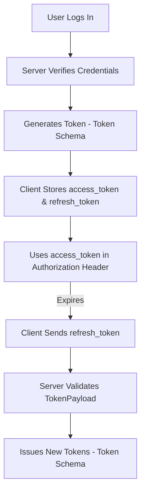

# Notes on the schema

# 1. Notes on `user.py` — Pydantic Schemas for User Management

## 📘 Overview

This module defines **Pydantic schemas** for managing user-related data in a **FastAPI + SQLAlchemy** application.
Schemas are responsible for **validating**, **serializing**, and **documenting** data exchanged between your API and your database.

They ensure:

- Input data is valid before reaching your database
- Output data is structured before returning to clients
- API docs are automatically generated (thanks to Pydantic + FastAPI)

---

## 🧩 1. `UserBase`

```python
class UserBase(BaseModel):
    """Base user schema with common fields."""

    email: EmailStr
    username: str = Field(..., min_length=3, max_length=50)
    full_name: str | None = Field(None, max_length=100)
    is_active: bool = True
```

### 🧠 Purpose

Defines **common user attributes** shared across all schemas.
Other models like `UserCreate`, `UserInDB`, etc., will inherit from this to avoid repetition.

### 📋 Field Details

| Field       | Type            | Description                             | Example              |
| ----------- | --------------- | --------------------------------------- | -------------------- |
| `email`     | `EmailStr`      | Validates a proper email address format | `"john@example.com"` |
| `username`  | `str`           | Required (3–50 chars)                   | `"john_doe"`         |
| `full_name` | `Optional[str]` | Optional user’s full name (≤100 chars)  | `"John Doe"`         |
| `is_active` | `bool`          | Whether the user account is active      | `True`               |

### 💡 Notes

- `Field(..., min_length=3)` → means _required field_ with validation rules.
- Using `EmailStr` automatically checks email syntax.
- This acts as the **base schema** for all other user-related models.

---

## 🧩 2. `UserCreate`

```python
class UserCreate(UserBase):
    """Schema for creating a new user."""

    password: str = Field(..., min_length=8, max_length=100)
```

### 🧠 Purpose

Used when creating a **new user account** (e.g., during registration).

### 📋 Additional Field

| Field      | Type  | Description                          |
| ---------- | ----- | ------------------------------------ |
| `password` | `str` | Required password (8–100 characters) |

### 💡 Notes

- Inherits everything from `UserBase` (email, username, etc.).
- Adds `password`, which isn’t included in other schemas like `User` or `UserInDB` when responding to clients.

**Usage Example:**

```python
@app.post("/users/", response_model=User)
def create_user(user: UserCreate):
    ...
```

---

## 🧩 3. `UserUpdate`

```python
class UserUpdate(BaseModel):
    """Schema for updating user information."""

    email: EmailStr | None = None
    username: str | None = Field(None, min_length=3, max_length=50)
    full_name: str | None = Field(None, max_length=100)
    password: str | None = Field(None, min_length=8, max_length=100)
    is_active: bool | None = None
```

### 🧠 Purpose

Defines the schema for **updating existing user data**.
All fields are **optional**, since you may update one or several fields at a time.

### 💡 Notes

- Unlike `UserCreate`, all fields default to `None` → makes them optional.
- Ideal for `PATCH` or `PUT` operations.
- Validation still applies if a field is provided.

**Usage Example:**

```python
@app.put("/users/{user_id}")
def update_user(user_id: int, user: UserUpdate):
    ...
```

---

## 🧩 4. `UserInDB`

```python
class UserInDB(UserBase):
    """Schema for user as stored in database."""

    model_config = ConfigDict(from_attributes=True)

    id: int
    is_superuser: bool
    created_at: datetime
    updated_at: datetime
```

### 🧠 Purpose

Represents how the **user is stored in the database**.
Used internally to map **SQLAlchemy models → Pydantic models**.

### 📋 Additional Fields

| Field          | Type       | Description                           |
| -------------- | ---------- | ------------------------------------- |
| `id`           | `int`      | Primary key                           |
| `is_superuser` | `bool`     | Whether the user has admin privileges |
| `created_at`   | `datetime` | When the user was created             |
| `updated_at`   | `datetime` | When the user was last updated        |

---

### ⚙️ `model_config = ConfigDict(from_attributes=True)`

This is the **modern replacement** for `orm_mode = True` in Pydantic v2.

✅ It allows Pydantic to read data **directly from ORM objects**, like SQLAlchemy models.

Without this:

```python
UserInDB.model_validate(db_user)  # ❌ Fails
```

With this:

```python
UserInDB.model_validate(db_user)  # ✅ Works
```

It tells Pydantic:

> “When validating, read values from **object attributes** (`obj.id`, `obj.email`) instead of expecting a dictionary.”

**Example:**

```python
db_user = db.query(UserModel).first()
user_schema = UserInDB.model_validate(db_user)
```

---

## 🧩 5. `User`

```python
class User(UserInDB):
    """Public user schema (without sensitive data)."""

    pass
```

### 🧠 Purpose

Represents the **public version** of the user — typically used in **API responses**.
You can remove or mask sensitive fields (like passwords) before returning data.

Currently, it inherits everything from `UserInDB`, but can be customized later:

```python
class User(UserBase):
    id: int
    created_at: datetime
```

---

## 🧩 6. `UserLogin`

```python
class UserLogin(BaseModel):
    """Schema for user login."""

    username: str
    password: str
```

### 🧠 Purpose

Schema for **login requests**, used in authentication endpoints.

### 📋 Fields

| Field      | Type  | Description                           |
| ---------- | ----- | ------------------------------------- |
| `username` | `str` | The login identifier (username/email) |
| `password` | `str` | User’s password                       |

**Usage Example:**

```python
@app.post("/login")
def login(user: UserLogin):
    ...
```

---

## 🧭 Typical Flow of These Schemas

```
Client sends JSON → FastAPI validates with Pydantic → Database stores with SQLAlchemy →
Response returned using another Pydantic model
```

| Stage             | Schema       | Purpose                            |
| ----------------- | ------------ | ---------------------------------- |
| Client registers  | `UserCreate` | Validate input during registration |
| Update profile    | `UserUpdate` | Allow partial updates              |
| Internal DB layer | `UserInDB`   | Represents how data is stored      |
| API response      | `User`       | Clean, safe output for clients     |
| Login             | `UserLogin`  | Authenticate user credentials      |

---

## 🧠 Key Takeaways

| Concept                | Meaning                                                              |
| ---------------------- | -------------------------------------------------------------------- |
| `BaseModel`            | Base for all Pydantic schemas                                        |
| `Field()`              | Adds validation & metadata to fields                                 |
| `EmailStr`             | Ensures valid email format                                           |
| `from_attributes=True` | Allows reading from ORM model attributes                             |
| Separate schemas       | Keeps creation, update, and response data clean and purpose-specific |

---

## ✅ Summary Diagram

```
        ┌──────────────┐
        │  UserBase    │
        │ email, name  │
        └──────┬───────┘
               │
        ┌──────┴────────┐
        │  UserCreate   │  → for POST (registration)
        │ + password    │
        └──────┬────────┘
               │
        ┌──────┴────────┐
        │  UserInDB     │  → stored in DB (ORM)
        │ + id, dates   │
        └──────┬────────┘
               │
        ┌──────┴────────┐
        │  User         │  → public output
        └───────────────┘

        Other:
        - UserUpdate → PATCH/PUT operations
        - UserLogin  → Authentication
```

---

# Explanation on the user.py schema - UserInDB schema

```python
model_config = ConfigDict(from_attributes=True)
```

that’s one of the most **confusing but important** parts of Pydantic v2!
Let’s break down this line:

```python
model_config = ConfigDict(from_attributes=True)
```

and understand **exactly what it means**, **why it exists**, and **how it’s used** — with examples that show the difference between when you need it and when you don’t.

---

## 🧩 What is `model_config = ConfigDict(...)`?

In **Pydantic v2**, this replaces the old **`Config` class** from v1.

So instead of this (old v1 style):

```python
class Config:
    orm_mode = True
```

You now write:

```python
model_config = ConfigDict(from_attributes=True)
```

---

## 🧠 What Does `from_attributes=True` Mean?

It tells Pydantic:

> “When validating data for this model, if I pass in an **object** (not a dictionary), Pydantic should try to **read the values from the object’s attributes**.”

That means:

- It will do things like `user.id`, `user.username`, etc.
- instead of expecting a dictionary like `{"id": 1, "username": "John"}`

---

## 💡 Why This Is Needed

By default, Pydantic expects a **dictionary**:

```python
user = UserInDB(id=1, username="John")  # ✅ works (dict-based)
```

But in many real-world cases, especially with **SQLAlchemy**, your data isn’t a dictionary — it’s an **ORM model instance**, like:

```python
user_obj = db.query(UserModel).first()
print(type(user_obj))
# <class 'UserModel'>
```

This `user_obj` has attributes like `user_obj.id`, `user_obj.username`, etc.

If you try this without `from_attributes=True`:

```python
UserInDB.model_validate(user_obj)
```

🚫 You get an error like:

```
ValidationError: Input should be a valid dictionary or mapping
```

But **with** `from_attributes=True`, this works perfectly:

```python
UserInDB.model_validate(user_obj)
# ✅ It reads data from object attributes instead of expecting a dict
```

---

## ⚙️ Example (with and without `from_attributes=True`)

### 🧱 SQLAlchemy model:

```python
class UserModel:
    def __init__(self, id, username):
        self.id = id
        self.username = username
```

### ❌ Without `from_attributes=True`

```python
from pydantic import BaseModel

class User(BaseModel):
    id: int
    username: str

user_obj = UserModel(1, "Alice")

User.model_validate(user_obj)
```

Output:

```
pydantic_core._pydantic_core.ValidationError:
Input should be a valid dictionary or instance of User
```

Because by default, Pydantic tries to read from a dict — not an object with attributes.

---

### ✅ With `from_attributes=True`

```python
from pydantic import BaseModel, ConfigDict

class User(BaseModel):
    model_config = ConfigDict(from_attributes=True)

    id: int
    username: str

user_obj = UserModel(1, "Alice")

validated = User.model_validate(user_obj)
print(validated)
# User(id=1, username='Alice')
```

Now it works perfectly because Pydantic knows to look at `user_obj.id` and `user_obj.username`.

---

## 🧩 Real-World Example with FastAPI + SQLAlchemy

Imagine your SQLAlchemy model:

```python
class UserModel(Base):
    __tablename__ = "users"
    id = Column(Integer, primary_key=True)
    username = Column(String)
    email = Column(String)
```

If you query it:

```python
db_user = db.query(UserModel).first()
```

Now you can safely do:

```python
user_schema = UserInDB.model_validate(db_user)
```

and get a valid Pydantic model that’s ready to be returned from your FastAPI endpoint.

---

## 🔍 Analogy

Think of it like this:

| Without `from_attributes=True` | With `from_attributes=True`              |
| ------------------------------ | ---------------------------------------- |
| Pydantic expects a dict        | Pydantic can read from object attributes |
| Works for `{"id": 1}`          | Works for `obj.id`                       |
| Default behavior               | Needed for ORM models (SQLAlchemy, etc.) |

---

## 🧠 Optional: Why It’s Called `from_attributes`

Because it literally tells Pydantic:

> “When parsing input, read **attributes** (like `obj.attribute`) instead of just dictionary **keys** (like `dict['key']`).”

That’s why the flag is called `from_attributes=True`.

---

## ✅ TL;DR Summary

| Item                 | Description                                                                                  |
| -------------------- | -------------------------------------------------------------------------------------------- |
| **What it does**     | Allows Pydantic to read data from an object’s attributes (e.g., a SQLAlchemy model instance) |
| **Old version name** | `orm_mode = True`                                                                            |
| **New syntax**       | `model_config = ConfigDict(from_attributes=True)`                                            |
| **Why it’s needed**  | Because FastAPI often deals with SQLAlchemy ORM objects, not dictionaries                    |
| **When to use**      | In any schema that’s used to serialize ORM objects (like `UserInDB`)                         |

---

### 🧩 Quick visual summary

```python
# Without it
UserInDB.model_validate(UserModel(id=1))  ❌

# With it
UserInDB.model_validate(UserModel(id=1))  ✅
```

---

# 2. Token-Related Pydantic Schemas

These schemas define the **structure of authentication tokens** used in a FastAPI application.
They help ensure consistency and validation for token-related operations such as **login**, **refresh**, and **authentication**.

---

## 📘 File: `token.py`

```python
"""
Token-related Pydantic schemas.
"""
from pydantic import BaseModel


class Token(BaseModel):
    """Token response schema"""

    access_token: str
    refresh_token: str
    token_type: str = "bearer"


class TokenPayload(BaseModel):
    """Token payload schema"""

    sub: str | None = None
    exp: int | None = None
    type: str | None = None


class RefreshTokenRequest(BaseModel):
    """Refresh token request schema"""

    refresh_token: str
```

---

## 🧠 Understanding Each Schema

### 1. **`Token`**

**Purpose:**
Represents the **response returned after a successful login** or authentication request.
This schema ensures that the API always returns a consistent structure when generating JWTs or access tokens.

**Fields:**

| Field           | Type  | Description                                                                                             |
| --------------- | ----- | ------------------------------------------------------------------------------------------------------- |
| `access_token`  | `str` | The main token used for accessing protected routes. Usually a JWT.                                      |
| `refresh_token` | `str` | A secondary token used to get a new access token when the old one expires.                              |
| `token_type`    | `str` | Type of the token; by default `"bearer"`, meaning it should be used as `Authorization: Bearer <token>`. |

**Example Usage:**

```python
{
  "access_token": "eyJhbGciOiJIUzI1NiIs...",
  "refresh_token": "eyJhbGciOiJIUzI1NiIsInR5...",
  "token_type": "bearer"
}
```

**Used in:**

- `/login` or `/token` endpoint responses
- Any endpoint returning authentication tokens

---

### 2. **`TokenPayload`**

**Purpose:**
Represents the **decoded payload inside a JWT** (JSON Web Token).
When validating a token, you decode it and verify that its contents match this structure.

**Fields:**

| Field  | Type          | Description                                                                           |
| ------ | ------------- | ------------------------------------------------------------------------------------- |
| `sub`  | `str \| None` | Usually the **subject** of the token — e.g., user ID or username.                     |
| `exp`  | `int \| None` | Expiration timestamp (UNIX epoch seconds). Determines when the token becomes invalid. |
| `type` | `str \| None` | Optional — can specify whether the token is an `"access"` or `"refresh"` token.       |

**Example Payload (decoded JWT):**

```json
{
  "sub": "user_123",
  "exp": 1731578940,
  "type": "access"
}
```

**Used in:**

- JWT decoding and validation
- Custom authentication logic (e.g., verifying token type)

---

### 3. **`RefreshTokenRequest`**

**Purpose:**
Represents the **request body** sent by the client to refresh an expired access token.
This schema ensures the client provides a valid refresh token before issuing a new access token.

**Fields:**

| Field           | Type  | Description                                                                   |
| --------------- | ----- | ----------------------------------------------------------------------------- |
| `refresh_token` | `str` | The refresh token that will be verified and used to issue a new access token. |

**Example Request:**

```json
{
  "refresh_token": "eyJhbGciOiJIUzI1NiIsInR5..."
}
```

**Used in:**

- `/refresh-token` or `/token/refresh` endpoints

---

## ⚙️ Typical Token Flow (How These Schemas Work Together)

```plaintext
      ┌──────────────────────────┐
      │ User logs in with creds  │
      └────────────┬─────────────┘
                   │
                   ▼
          [ Token Generated ]
                   ↓
            Token Schema
      ┌──────────────────────┐
      │ access_token         │
      │ refresh_token        │
      │ token_type = bearer  │
      └──────────────────────┘
                 │
                 ▼
        Access token is used in
        Authorization headers:
        Authorization: Bearer <access_token>
                 │
                 ▼
     When access token expires:
     ┌──────────────────────────┐
     │ RefreshTokenRequest sent │
     └────────────┬─────────────┘
                  │
                  ▼
         Server verifies token
                  ↓
         TokenPayload Schema
                  ↓
         Generates new Token
```

---

## ✅ Summary Table

| Schema                    | Purpose                        | Commonly Used In   | Key Fields                                    |
| ------------------------- | ------------------------------ | ------------------ | --------------------------------------------- |
| **`Token`**               | Defines token response         | `/login`           | `access_token`, `refresh_token`, `token_type` |
| **`TokenPayload`**        | Represents decoded JWT payload | Token verification | `sub`, `exp`, `type`                          |
| **`RefreshTokenRequest`** | Defines refresh request body   | `/token/refresh`   | `refresh_token`                               |

---

## 🧩 Example (FastAPI Endpoint Integration)

Here’s how these schemas might fit together in a **FastAPI authentication flow**:

```python
from fastapi import APIRouter, Depends
from .schemas import Token, RefreshTokenRequest

router = APIRouter()

@router.post("/login", response_model=Token)
def login(username: str, password: str):
    # Verify credentials, generate tokens
    return {
        "access_token": "access.jwt.token",
        "refresh_token": "refresh.jwt.token",
        "token_type": "bearer"
    }

@router.post("/token/refresh", response_model=Token)
def refresh_token(request: RefreshTokenRequest):
    # Decode and verify refresh token
    # Generate new access token
    return {
        "access_token": "new.access.jwt.token",
        "refresh_token": request.refresh_token,
        "token_type": "bearer"
    }
```

---

## 🧭 Visual Overview (Token Flow Diagram in Markdown)



---

Perfect 👍 Let’s make detailed, well-formatted **notes** for your `todo.py` Pydantic schemas — written in the same clean, study-style as your previous `user.py` and `token.py` notes.

This will help you understand how these schemas fit into a full **FastAPI + SQLAlchemy + Alembic** setup for a To-Do management system.

---

# 3. Todo-Related Pydantic Schemas

These schemas define the **data structure**, **validation rules**, and **API communication format** for managing **To-Do items** in a FastAPI application.

They handle different operations such as creating, updating, filtering, and retrieving todos.

---

## 📘 File: `todo.py`

```python
"""
Todo-related Pydantic schemas.
"""
from datetime import datetime
from pydantic import BaseModel, ConfigDict, Field, field_validator
from app.models.todo import TodoPriority, TodoStatus


class TodoBase(BaseModel):
    """Base todo schema with common fields."""

    title: str = Field(..., min_length=1, max_length=200)
    description: str | None = Field(None, max_length=2000)
    completed: bool = False
    priority: TodoPriority = TodoPriority.MEDIUM
    status: TodoStatus = TodoStatus.PENDING
    category: str | None = Field(None, max_length=50)
    due_date: datetime | None = None

    @field_validator("due_date")
    @classmethod
    def validate_due_date(cls, v: datetime | None) -> datetime | None:
        """Validate that due date is not in the past."""
        if v is not None and v < datetime.now(v.tzinfo):
            raise ValueError("Due date cannot be in the past")
        return v


class TodoCreate(TodoBase):
    """Schema for creating a new todo."""
    pass


class TodoUpdate(BaseModel):
    """Schema for updating a todo (all fields optional)."""

    title: str | None = Field(None, min_length=1, max_length=200)
    description: str | None = Field(None, max_length=2000)
    completed: bool | None = None
    priority: TodoPriority | None = None
    status: TodoStatus | None = None
    category: str | None = Field(None, max_length=50)
    due_date: datetime | None = None

    @field_validator("due_date")
    @classmethod
    def validate_due_date(cls, v: datetime | None) -> datetime | None:
        """Validate that due date is not in the past."""
        if v is not None and v < datetime.now(v.tzinfo):
            raise ValueError("Due date cannot be in the past")
        return v


class TodoInDB(TodoBase):
    """Schema for todo as stored in database."""

    model_config = ConfigDict(from_attributes=True)

    id: int
    owner_id: int
    created_at: datetime
    updated_at: datetime


class Todo(TodoInDB):
    """Public todo schema."""
    pass


class TodoList(BaseModel):
    """Schema for paginated todo list."""

    items: list[Todo]
    total: int
    page: int
    page_size: int
    pages: int


class TodoFilter(BaseModel):
    """Schema for filtering todos."""

    completed: bool | None = None
    priority: TodoPriority | None = None
    status: TodoStatus | None = None
    category: str | None = None
    search: str | None = Field(None, max_length=200)
```

---

## 🧩 Schema Breakdown

### 1. **`TodoBase`**

**Purpose:**
Defines the **core structure** and validation rules shared across other todo schemas.

**Fields:**

| Field         | Type               | Description                                             |
| ------------- | ------------------ | ------------------------------------------------------- |
| `title`       | `str`              | The task title (required, 1–200 chars).                 |
| `description` | `str \| None`      | Optional details about the task (max 2000 chars).       |
| `completed`   | `bool`             | Whether the task is marked complete (default: `False`). |
| `priority`    | `TodoPriority`     | Enum defining priority (e.g., LOW, MEDIUM, HIGH).       |
| `status`      | `TodoStatus`       | Enum defining state (e.g., PENDING, IN_PROGRESS, DONE). |
| `category`    | `str \| None`      | Optional grouping (e.g., “Work”, “Personal”).           |
| `due_date`    | `datetime \| None` | Optional due date; validated to not be in the past.     |

**Custom Validator:**

```python
@field_validator("due_date")
def validate_due_date(cls, v):
    if v and v < datetime.now(v.tzinfo):
        raise ValueError("Due date cannot be in the past")
```

✔ Ensures logical consistency (no scheduling for past dates).

---

### 2. **`TodoCreate`**

**Purpose:**
Schema used when **creating a new To-Do** item.
It inherits all required fields and validation logic from `TodoBase`.

**Example JSON:**

```json
{
  "title": "Finish FastAPI notes",
  "description": "Write notes for Todo schemas",
  "priority": "HIGH",
  "status": "PENDING",
  "due_date": "2025-11-20T18:00:00"
}
```

---

### 3. **`TodoUpdate`**

**Purpose:**
Used when **updating an existing To-Do**.
All fields are **optional**, allowing partial updates (PATCH semantics).

**Fields:**
Same as `TodoBase`, but all are `Optional`.

**Example JSON:**

```json
{
  "status": "IN_PROGRESS",
  "completed": false
}
```

**Validator:**
Same due-date check applies — prevents setting a past date.

---

### 4. **`TodoInDB`**

**Purpose:**
Represents the schema **as stored in the database**.

**Fields:**

| Field        | Type       | Description                               |
| ------------ | ---------- | ----------------------------------------- |
| `id`         | `int`      | Unique identifier for each todo.          |
| `owner_id`   | `int`      | Reference to the user who owns this todo. |
| `created_at` | `datetime` | Timestamp of creation.                    |
| `updated_at` | `datetime` | Timestamp of last update.                 |

**Config:**

```python
model_config = ConfigDict(from_attributes=True)
```

This allows Pydantic to **populate fields directly from ORM objects** (e.g., SQLAlchemy models)
without manually converting them to dictionaries.

---

### 5. **`Todo`**

**Purpose:**
Public-facing schema used in API responses.
It inherits from `TodoInDB` but doesn’t add any sensitive fields (like internal DB settings).

**Usage Example:**

```python
@router.get("/todos/{id}", response_model=Todo)
def get_todo(id: int):
    ...
```

---

### 6. **`TodoList`**

**Purpose:**
Schema for **paginated todo responses** — commonly used in list endpoints.

**Fields:**

| Field       | Type         | Description                  |
| ----------- | ------------ | ---------------------------- |
| `items`     | `list[Todo]` | List of todos returned.      |
| `total`     | `int`        | Total number of todos in DB. |
| `page`      | `int`        | Current page number.         |
| `page_size` | `int`        | Number of todos per page.    |
| `pages`     | `int`        | Total pages available.       |

**Example JSON:**

```json
{
  "items": [{ "id": 1, "title": "Task A", "completed": false }],
  "total": 12,
  "page": 1,
  "page_size": 10,
  "pages": 2
}
```

---

### 7. **`TodoFilter`**

**Purpose:**
Defines filtering options for querying todos — useful for query parameters or body filters.

**Fields:**

| Field       | Type                   | Description                             |
| ----------- | ---------------------- | --------------------------------------- |
| `completed` | `bool \| None`         | Filter by completion status.            |
| `priority`  | `TodoPriority \| None` | Filter by priority.                     |
| `status`    | `TodoStatus \| None`   | Filter by task status.                  |
| `category`  | `str \| None`          | Filter by category.                     |
| `search`    | `str \| None`          | Keyword search by title or description. |

**Example Usage (in API):**

```python
@router.get("/todos", response_model=TodoList)
def list_todos(filters: TodoFilter = Depends()):
    ...
```

---

## ⚙️ Example Todo Flow

```plaintext
        ┌────────────────────────────┐
        │     User Creates Todo      │
        └────────────┬───────────────┘
                     │
                     ▼
             TodoCreate Schema
                     │
                     ▼
           Validates and saves to DB
                     │
                     ▼
             TodoInDB (stored)
                     │
                     ▼
              Returned as Todo
                     │
                     ▼
        ┌────────────────────────────┐
        │  Client Views Todo List    │
        └────────────┬───────────────┘
                     │
                     ▼
             TodoList + TodoFilter
```

---

## ✅ Summary Table

| Schema           | Purpose            | Typical Usage              | Key Features                          |
| ---------------- | ------------------ | -------------------------- | ------------------------------------- |
| **`TodoBase`**   | Shared base schema | Inherited by others        | Validation + `due_date` check         |
| **`TodoCreate`** | Create new task    | POST `/todos/`             | Inherits from `TodoBase`              |
| **`TodoUpdate`** | Partial updates    | PATCH `/todos/{id}`        | All fields optional                   |
| **`TodoInDB`**   | Stored DB schema   | ORM integration            | Includes `id`, `owner_id`, timestamps |
| **`Todo`**       | Public API schema  | API responses              | Inherits from `TodoInDB`              |
| **`TodoList`**   | Paginated response | GET `/todos/`              | Includes metadata (total, pages)      |
| **`TodoFilter`** | Filtering input    | GET `/todos/` query params | Enables searching/filtering           |

---

# Demonstration of **field-level validation** in Pydantic v2.

Let’s break it **step by step**, with **simple English explanation**, **code reasoning**, and **examples** 👇

## 🔍 What This Code Does

```python
@field_validator("due_date")
@classmethod
def validate_due_date(cls, v: datetime | None) -> datetime | None:
    """Validate that due date is not in the past."""
    if v is not None and v < datetime.now(v.tzinfo):
        raise ValueError("Due date cannot be in the past")
    return v
```

This defines a **custom validator function** for the `due_date` field inside a **Pydantic model** (like `TodoBase` or `TodoUpdate`).

It ensures that:

> The `due_date` field (if provided) must not be a past date.

---

## 🧩 Let’s Break It Down

### 1. **`@field_validator("due_date")`**

- This is a **decorator** introduced in **Pydantic v2**.
- It tells Pydantic:

  > “Whenever a value is assigned to the field `due_date`, run this function to validate or transform it before saving it into the model.”

✅ Example:

```python
todo = TodoBase(title="Learn FastAPI", due_date="2025-11-14T10:00:00")
```

→ Before `due_date` is accepted, Pydantic calls `validate_due_date(...)`.

If validation passes ✅, the value is stored.
If validation fails ❌, it raises a `ValidationError`.

---

### 2. **`@classmethod`**

- Makes the function a **class method** — meaning it receives the **class itself** (`cls`) as the first argument.
- This is required when using validators in Pydantic v2 (since the function must belong to the class and access class-level info if needed).

---

### 3. **Function Definition**

```python
def validate_due_date(cls, v: datetime | None) -> datetime | None:
```

- `cls`: the model class (`TodoBase`, `TodoUpdate`, etc.).
- `v`: the value being validated (the input value for `due_date`).
- `-> datetime | None`: means this function returns either a datetime or `None`.

---

### 4. **Validation Logic**

```python
if v is not None and v < datetime.now(v.tzinfo):
    raise ValueError("Due date cannot be in the past")
```

- `if v is not None`: We skip validation if `due_date` is missing (optional field).
- `v < datetime.now(v.tzinfo)`: Checks if the provided due date is **before the current date and time**.

If it’s in the past → ❌ Raises a `ValueError`.

---

### 5. **Returning the Value**

```python
return v
```

If validation passes (no error raised), we simply return the same value so it can be stored inside the model.

---

## 🧠 Why Use `v.tzinfo`?

When comparing `datetime` objects, **Python requires both to have the same timezone info** (`tzinfo`), otherwise it raises an error.

✅ Example:

```python
datetime(2025, 11, 14, 12, 0, tzinfo=timezone.utc)
```

Using `datetime.now(v.tzinfo)` ensures that the "current time" we’re comparing against is in the **same timezone** as `v`.

---

## ⚙️ Example in Action

### ✅ Valid Example

```python
from datetime import datetime, timedelta
from app.schemas.todo import TodoBase

future_date = datetime.now() + timedelta(days=3)
todo = TodoBase(title="Finish project", due_date=future_date)
print(todo.due_date)
```

✅ Works fine — due date is in the future.

---

### ❌ Invalid Example

```python
from datetime import datetime, timedelta
from app.schemas.todo import TodoBase

past_date = datetime.now() - timedelta(days=1)
todo = TodoBase(title="Old task", due_date=past_date)
```

❌ Output:

```
pydantic_core._pydantic_core.ValidationError: 1 validation error for TodoBase
due_date
  Value error, Due date cannot be in the past [type=value_error, input_value=datetime(...)]
```

---

## 🧩 Summary Table

| Concept                            | Description                                                     |
| ---------------------------------- | --------------------------------------------------------------- |
| **`@field_validator("due_date")`** | Declares a custom validator for the `due_date` field.           |
| **`@classmethod`**                 | Required so that the validator has access to the class (`cls`). |
| **Validation Logic**               | Ensures `due_date` is not before the current time.              |
| **`datetime.now(v.tzinfo)`**       | Keeps timezone consistent for accurate comparison.              |
| **Raises `ValueError`**            | Stops model creation if the rule is violated.                   |

---

## ✅ Why This Is Useful

- Prevents users from entering **invalid or illogical data** (like setting due dates in the past).
- Keeps data **clean** and **consistent** before hitting the database.
- Moves validation logic to the **schema layer**, not the route or business logic — following good **FastAPI design practices**.

---
